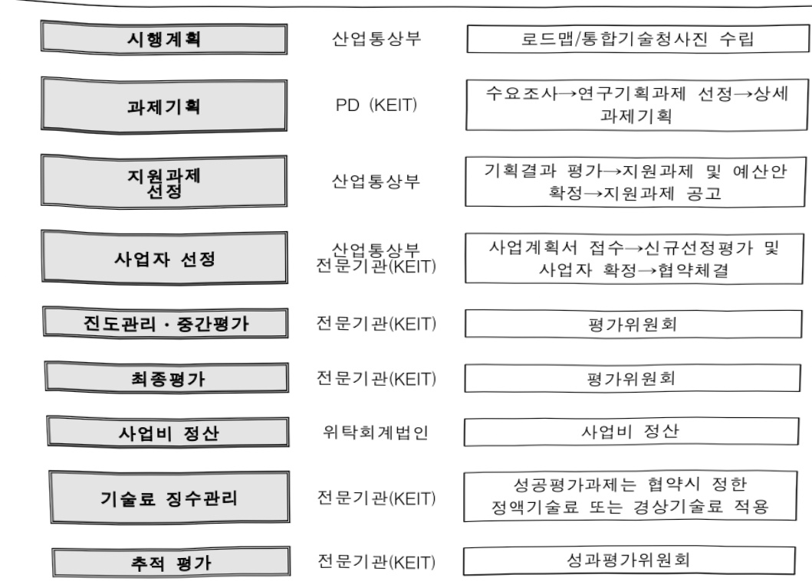

# 세포및유전자치료제제조공정고도화기술개발(R&D)

**해당 페이지**: PDF 4184 ~ 4198 쪽 해당

**부처**: 산업통상부
**분야**: 산업·중소기업 및 에너지
**회계유형**: 일반회계
**2026 확정예산**: 6400.0 백만원
**전년대비 증감률**: None%
**AI 도메인**: 의료/바이오

---

<table border=1 style='margin: auto; word-wrap: break-word;'><tr><td style='text-align: center; word-wrap: break-word;'>사 업 명</td></tr><tr><td style='text-align: center; word-wrap: break-word;'>(238) 세포못유전자치료제 제조공정 고도화 기술개발사업 (3651-453)</td></tr></table>

☐ 사업 코드 정보

<table border=1 style='margin: auto; word-wrap: break-word;'><tr><td style='text-align: center; word-wrap: break-word;'>구분</td><td style='text-align: center; word-wrap: break-word;'>회계</td><td style='text-align: center; word-wrap: break-word;'>소관</td><td style='text-align: center; word-wrap: break-word;'>실국(기관)</td><td style='text-align: center; word-wrap: break-word;'>계정</td><td style='text-align: center; word-wrap: break-word;'>분야</td><td style='text-align: center; word-wrap: break-word;'>부문</td></tr><tr><td style='text-align: center; word-wrap: break-word;'>코드</td><td rowspan="2">일반회계</td><td rowspan="2">산업통상부</td><td rowspan="2">산업성장실산업인공지능정책관</td><td rowspan="2">[0]</td><td style='text-align: center; word-wrap: break-word;'>110</td><td style='text-align: center; word-wrap: break-word;'>117</td></tr><tr><td style='text-align: center; word-wrap: break-word;'>명칭</td><td style='text-align: center; word-wrap: break-word;'>산업 중소기업 및 에너지</td><td style='text-align: center; word-wrap: break-word;'>산업혁신지원</td></tr></table>

<table border=1 style='margin: auto; word-wrap: break-word;'><tr><td style='text-align: center; word-wrap: break-word;'>구분</td><td style='text-align: center; word-wrap: break-word;'>프로그램</td><td style='text-align: center; word-wrap: break-word;'>단위사업</td><td style='text-align: center; word-wrap: break-word;'>세부사업</td></tr><tr><td style='text-align: center; word-wrap: break-word;'>코드</td><td style='text-align: center; word-wrap: break-word;'>3600</td><td style='text-align: center; word-wrap: break-word;'>3651</td><td style='text-align: center; word-wrap: break-word;'>453</td></tr><tr><td style='text-align: center; word-wrap: break-word;'>명칭</td><td style='text-align: center; word-wrap: break-word;'>신산업진흥</td><td style='text-align: center; word-wrap: break-word;'>바이오헬스기술개발</td><td style='text-align: center; word-wrap: break-word;'>세포및유전자치료제제조공정고도화기술개발</td></tr></table>

사업 성격 (공통요구자료 Ⅱ-1 작성유의사항 4. 참조, 해당하는 사항에 “0” 표시)

<table border=1 style='margin: auto; word-wrap: break-word;'><tr><td rowspan="2">신규</td><td rowspan="2">계속</td><td rowspan="2">완료</td><td style='text-align: center; word-wrap: break-word;'>예비타당성</td><td style='text-align: center; word-wrap: break-word;'>총사업비</td><td style='text-align: center; word-wrap: break-word;'>총액계상</td><td style='text-align: center; word-wrap: break-word;'>사업소관 변경정보</td></tr><tr><td style='text-align: center; word-wrap: break-word;'>실시여부</td><td style='text-align: center; word-wrap: break-word;'>관리대상</td><td style='text-align: center; word-wrap: break-word;'>예산사업</td><td style='text-align: center; word-wrap: break-word;'>2025예산 시 소관</td></tr><tr><td style='text-align: center; word-wrap: break-word;'>○</td><td style='text-align: center; word-wrap: break-word;'></td><td style='text-align: center; word-wrap: break-word;'></td><td style='text-align: center; word-wrap: break-word;'></td><td style='text-align: center; word-wrap: break-word;'></td><td style='text-align: center; word-wrap: break-word;'></td><td style='text-align: center; word-wrap: break-word;'></td></tr></table>

□ 사업 지원 형태 및 지원을 (최소한 한 개는 반드시 선택하시오. 해당사항에 0 표시)

<table border=1 style='margin: auto; word-wrap: break-word;'><tr><td style='text-align: center; word-wrap: break-word;'>직접</td><td style='text-align: center; word-wrap: break-word;'>출자</td><td style='text-align: center; word-wrap: break-word;'>출연</td><td style='text-align: center; word-wrap: break-word;'>보조</td><td style='text-align: center; word-wrap: break-word;'>융자</td><td style='text-align: center; word-wrap: break-word;'>국고보조율(%)</td><td style='text-align: center; word-wrap: break-word;'>융자율(%)</td></tr><tr><td style='text-align: center; word-wrap: break-word;'></td><td style='text-align: center; word-wrap: break-word;'></td><td style='text-align: center; word-wrap: break-word;'>○</td><td style='text-align: center; word-wrap: break-word;'></td><td style='text-align: center; word-wrap: break-word;'></td><td style='text-align: center; word-wrap: break-word;'></td><td style='text-align: center; word-wrap: break-word;'></td></tr></table>

## □ 사업 담당자

<table border=1 style='margin: auto; word-wrap: break-word;'><tr><td style='text-align: center; word-wrap: break-word;'>사업명</td><td colspan="5">구분</td></tr><tr><td rowspan="4">세포및유전자치료제제조공정고도화기술개발(R&amp;D)</td><td rowspan="3">소관부처</td><td style='text-align: center; word-wrap: break-word;'>실·국·과(팀)</td><td style='text-align: center; word-wrap: break-word;'>과 장</td><td style='text-align: center; word-wrap: break-word;'>사무관</td><td style='text-align: center; word-wrap: break-word;'>주무관</td></tr><tr><td style='text-align: center; word-wrap: break-word;'>산업성장실산업인공지능정책관</td><td style='text-align: center; word-wrap: break-word;'>최광준</td><td style='text-align: center; word-wrap: break-word;'>노진환</td><td style='text-align: center; word-wrap: break-word;'>-</td></tr><tr><td style='text-align: center; word-wrap: break-word;'>인공지능바이오융합산업과</td><td style='text-align: center; word-wrap: break-word;'>044-203-4290</td><td style='text-align: center; word-wrap: break-word;'>044-203-4292</td><td style='text-align: center; word-wrap: break-word;'>-</td></tr><tr><td style='text-align: center; word-wrap: break-word;'>사업시행주체</td><td style='text-align: center; word-wrap: break-word;'>한국산업기술기획평가원</td><td style='text-align: center; word-wrap: break-word;'>바이오헬스실</td><td style='text-align: center; word-wrap: break-word;'>차혜선 실장</td><td style='text-align: center; word-wrap: break-word;'>053-718-8420</td></tr></table>

---

### 가.예산 총괄표

(단위: 백만원, %)

<table border=1 style='margin: auto; word-wrap: break-word;'><tr><td rowspan="2">사업명</td><td rowspan="2">2024년 결산</td><td colspan="2">2025년 예산</td><td colspan="2">2026년</td><td rowspan="2">증감(B-A)</td><td rowspan="2">(B-A)/A</td></tr><tr><td style='text-align: center; word-wrap: break-word;'>본예산(A)</td><td style='text-align: center; word-wrap: break-word;'>추경</td><td style='text-align: center; word-wrap: break-word;'>요구안</td><td style='text-align: center; word-wrap: break-word;'>확정(B)</td></tr><tr><td style='text-align: center; word-wrap: break-word;'>세포및유전자치료제조공정고도화기술개발(R&amp;D)</td><td style='text-align: center; word-wrap: break-word;'>-</td><td style='text-align: center; word-wrap: break-word;'>-</td><td style='text-align: center; word-wrap: break-word;'>-</td><td style='text-align: center; word-wrap: break-word;'>6,400</td><td style='text-align: center; word-wrap: break-word;'>6,400</td><td style='text-align: center; word-wrap: break-word;'>6,400</td><td style='text-align: center; word-wrap: break-word;'>순증</td></tr></table>

□ 기능별(내역사업별), 목별 예산 내역

(단위:백만원)

<table border=1 style='margin: auto; word-wrap: break-word;'><tr><td rowspan="3"></td><td colspan="5">2024</td><td colspan="7">2025(2025.12월말)</td><td rowspan="3">2026예산</td></tr><tr><td rowspan="2">예산액(추정)</td><td rowspan="2">예산현액</td><td rowspan="2">집행액[실집행액]</td><td rowspan="2">이월액</td><td rowspan="2">불용액</td><td rowspan="2">본예산</td><td rowspan="2">예산현액</td><td rowspan="2">집행액[실집행액]</td><td colspan="2">전년도아월액제외</td><td rowspan="2">이월예산액</td><td rowspan="2">불용예산액</td></tr><tr><td style='text-align: center; word-wrap: break-word;'>예산현액</td><td style='text-align: center; word-wrap: break-word;'>집행액[실집행액]</td></tr><tr><td style='text-align: center; word-wrap: break-word;'>○기능별분류(함께)</td><td style='text-align: center; word-wrap: break-word;'>-</td><td style='text-align: center; word-wrap: break-word;'>-</td><td style='text-align: center; word-wrap: break-word;'>-</td><td style='text-align: center; word-wrap: break-word;'>-</td><td style='text-align: center; word-wrap: break-word;'>-</td><td style='text-align: center; word-wrap: break-word;'>-</td><td style='text-align: center; word-wrap: break-word;'>-</td><td style='text-align: center; word-wrap: break-word;'>-</td><td style='text-align: center; word-wrap: break-word;'>-</td><td style='text-align: center; word-wrap: break-word;'>-</td><td style='text-align: center; word-wrap: break-word;'>-</td><td style='text-align: center; word-wrap: break-word;'>-</td><td style='text-align: center; word-wrap: break-word;'>6,400</td></tr><tr><td style='text-align: center; word-wrap: break-word;'>·맞춤형제조공정고도화기술개발·품질관리시스템최적화기술개발</td><td style='text-align: center; word-wrap: break-word;'>-</td><td style='text-align: center; word-wrap: break-word;'>-</td><td style='text-align: center; word-wrap: break-word;'>-</td><td style='text-align: center; word-wrap: break-word;'>-</td><td style='text-align: center; word-wrap: break-word;'>-</td><td style='text-align: center; word-wrap: break-word;'>-</td><td style='text-align: center; word-wrap: break-word;'>-</td><td style='text-align: center; word-wrap: break-word;'>-</td><td style='text-align: center; word-wrap: break-word;'>-</td><td style='text-align: center; word-wrap: break-word;'>-</td><td style='text-align: center; word-wrap: break-word;'>-</td><td style='text-align: center; word-wrap: break-word;'>-</td><td style='text-align: center; word-wrap: break-word;'>3,050</td></tr><tr><td style='text-align: center; word-wrap: break-word;'>○비목별분류(함께)</td><td style='text-align: center; word-wrap: break-word;'>-</td><td style='text-align: center; word-wrap: break-word;'>-</td><td style='text-align: center; word-wrap: break-word;'>-</td><td style='text-align: center; word-wrap: break-word;'>-</td><td style='text-align: center; word-wrap: break-word;'>-</td><td style='text-align: center; word-wrap: break-word;'>-</td><td style='text-align: center; word-wrap: break-word;'>-</td><td style='text-align: center; word-wrap: break-word;'>-</td><td style='text-align: center; word-wrap: break-word;'>-</td><td style='text-align: center; word-wrap: break-word;'>-</td><td style='text-align: center; word-wrap: break-word;'>-</td><td style='text-align: center; word-wrap: break-word;'>-</td><td style='text-align: center; word-wrap: break-word;'>3,350</td></tr><tr><td style='text-align: center; word-wrap: break-word;'>·연구개발활동비등(360-05)</td><td style='text-align: center; word-wrap: break-word;'>-</td><td style='text-align: center; word-wrap: break-word;'>-</td><td style='text-align: center; word-wrap: break-word;'>-</td><td style='text-align: center; word-wrap: break-word;'>-</td><td style='text-align: center; word-wrap: break-word;'>-</td><td style='text-align: center; word-wrap: break-word;'>-</td><td style='text-align: center; word-wrap: break-word;'>-</td><td style='text-align: center; word-wrap: break-word;'>-</td><td style='text-align: center; word-wrap: break-word;'>-</td><td style='text-align: center; word-wrap: break-word;'>-</td><td style='text-align: center; word-wrap: break-word;'>-</td><td style='text-align: center; word-wrap: break-word;'>-</td><td style='text-align: center; word-wrap: break-word;'>6,400</td></tr><tr><td style='text-align: center; word-wrap: break-word;'>○기능비목별분류(함께)</td><td style='text-align: center; word-wrap: break-word;'>-</td><td style='text-align: center; word-wrap: break-word;'>-</td><td style='text-align: center; word-wrap: break-word;'>-</td><td style='text-align: center; word-wrap: break-word;'>-</td><td style='text-align: center; word-wrap: break-word;'>-</td><td style='text-align: center; word-wrap: break-word;'>-</td><td style='text-align: center; word-wrap: break-word;'>-</td><td style='text-align: center; word-wrap: break-word;'>-</td><td style='text-align: center; word-wrap: break-word;'>-</td><td style='text-align: center; word-wrap: break-word;'>-</td><td style='text-align: center; word-wrap: break-word;'>-</td><td style='text-align: center; word-wrap: break-word;'>-</td><td style='text-align: center; word-wrap: break-word;'>6,400</td></tr><tr><td rowspan="4">·맞춤형제조공정고도화기술개발·연구개발활동비등(360-05)·품질관리시스템최적화기술개발·연구개발활동비등(360-05)</td><td rowspan="4">-</td><td rowspan="4">-</td><td rowspan="4">-</td><td rowspan="4">-</td><td rowspan="4">-</td><td rowspan="4">-</td><td rowspan="4">-</td><td rowspan="4">-</td><td rowspan="4">-</td><td rowspan="4">-</td><td rowspan="4">-</td><td rowspan="4">3,050</td><td style='text-align: center; word-wrap: break-word;'></td></tr><tr><td style='text-align: center; word-wrap: break-word;'>3,050</td></tr><tr><td style='text-align: center; word-wrap: break-word;'>3,350</td></tr><tr><td style='text-align: center; word-wrap: break-word;'>3,350</td></tr></table>

### 나.사업설명자료

## 1 ) 사업목적·내용

- (세포맞유전자치료제 제조공정 고도화 기술개발사업) 차세대 모달리티 의약품인 세포맞유전자치료제의 고품질 제조공정 핵심시스템 개발 및 GMP 내 검증 등을 통한 국내 첨단바이오기업들의 글로벌 제조경쟁력 확보 및 시장 진출 유도

---

- (맞춤형 제조공정 고도화 기술개발) 세포및유전자치료제 제조공정 고도화를 위한 실시간 모니터링 기반 자동화 공정, 유전자치료제 배양기술 고도화, 동종 세포유전자치료제 대량생산 기술, 고순도 정제기술 및 고품질 생산세포 농축 기술 개발 등

- (품질관리 시스템 최적화 기술개발) 세포및유전자치료제 품질관리 최적화를 위한 AI기반 실시간 세포 이미징 시스템, 신속출하 품질평가 및 검증, 자동화 충진 기술 개발, 속도(온도)제어 해동기술 개발 등

## 2 ) 사업개요

## □ 사업근거 및 추진경위

① 법령상 근거 및 조항 적시

- 「과학기술기본법」 (제11조, 국가연구개발사업의 추진) 중앙행정기관의 장은 기본 계획에 따라 맡은 분야의 국가연구개발사업과 그 시책을 세워 추진하여야 한다.

- 「산업기술혁신촉진법」 (제11조, 산업기술개발사업) 산업통상부장관은 혁신계획 및 시행계획을 효율적으로 수행하기 위하여 관계 중앙행정기관의 장과 협의하여 다음 각 호의 산업기술분야에서 기술개발사업을 추진할 수 있다.

- 「생명공학육성법」 (제8조, 생명공학 육성시책 강구 등), (제11조, 연구개발사업의 추진) 정부는 이 법의 목적을 효율적으로 달성하기 위하여 생명공학 연구 및 기술개발을 위한 연구개발사업을 실시하여야 한다. (제15조, 생명공학 연구개발 활성화 및 산업적 응용촉진 추진) 정부는 생명공학 연구개발을 활성화하고 그 결과의 산업적 응용을 촉진하기 위하여 지원시책을 강구하여야 한다

## ② 추진경위

<table border=1 style='margin: auto; word-wrap: break-word;'><tr><td style='text-align: center; word-wrap: break-word;'>추진 경과</td><td style='text-align: center; word-wrap: break-word;'>세부 내용</td></tr><tr><td style='text-align: center; word-wrap: break-word;'>예타 기획 (&#x27;22~&#x27;24)</td><td style='text-align: center; word-wrap: break-word;'>· 첨단바이오치료제 맞춤형 제조공정 혁신사업 예타 기획 추진하였으나, 기술성평가 미시행</td></tr><tr><td colspan="2">↔</td></tr><tr><td style='text-align: center; word-wrap: break-word;'>사업 기획방향 설정 (&#x27;24.10~&#x27;24.12)</td><td style='text-align: center; word-wrap: break-word;'>· 기존 사업 조정 및 재편 등을 통한 전문가 의견 수렴 · 기존 유사사업 분석 및 지원 방향 확정</td></tr><tr><td colspan="2">↘</td></tr><tr><td style='text-align: center; word-wrap: break-word;'>추진전략 및 내역사업 도출 (&#x27;25.01)</td><td style='text-align: center; word-wrap: break-word;'>· 대내외 환경의 SWOT 분석에 기반한 결과 활용 · 세부 추진전략 수립 및 내역사업(안) 도출</td></tr><tr><td colspan="2">↘</td></tr><tr><td style='text-align: center; word-wrap: break-word;'>(예정) 내역사업 별 세부과제 도출 (&#x27;25.02~03)</td><td style='text-align: center; word-wrap: break-word;'>· 전문가, 관련기업 협의내용 및 기술수요조사 결과 등으로 세부과제 수요 발굴 · 전문위, 부처 및 전문기관에서 수요기술에 대해 검토 · 내역사업에 대한 세부과제 최종 도출 및 세부 내용 기획보고</td></tr></table>

---

<table border=1 style='margin: auto; word-wrap: break-word;'><tr><td style='text-align: center; word-wrap: break-word;'></td><td style='text-align: center; word-wrap: break-word;'>서 초안 완성</td></tr><tr><td colspan="2">↔</td></tr><tr><td style='text-align: center; word-wrap: break-word;'>(예정) 기획 내용 최종 정리 (&#x27;25.04)</td><td style='text-align: center; word-wrap: break-word;'>· 정책적, 기술적, 경제적 타당성을 부처 및 전문기관, 전문가 위원회에서 최종적으로 검토하여 사업 기획내용 확정 및 정리 · 최종보고서 작성 완료</td></tr></table>

주요내용

① 사업규모

- 총사업비(해당되는 경우에만 기재) : 해당없음

- 사업기간 : '26~'30년(5년)

- 최근 5년 간 투입된 사업비(예산액기준, 추경편성한 연도에는 추경포함)

<table border=1 style='margin: auto; word-wrap: break-word;'><tr><td style='text-align: center; word-wrap: break-word;'>연도</td><td style='text-align: center; word-wrap: break-word;'>2022</td><td style='text-align: center; word-wrap: break-word;'>2023</td><td style='text-align: center; word-wrap: break-word;'>2024</td><td style='text-align: center; word-wrap: break-word;'>2025</td><td style='text-align: center; word-wrap: break-word;'>2026</td></tr><tr><td style='text-align: center; word-wrap: break-word;'>사업비</td><td style='text-align: center; word-wrap: break-word;'></td><td style='text-align: center; word-wrap: break-word;'></td><td style='text-align: center; word-wrap: break-word;'></td><td style='text-align: center; word-wrap: break-word;'></td><td style='text-align: center; word-wrap: break-word;'>6,400백만원</td></tr></table>

-기타: 해당없음

② 사업추진체계

- 사업시행방법 : 출연

- 사업시행주체 : 한국산업기술기획평가원

- 사업 수혜자 : 기업, 대학, 연구소 등

- 보조, 융자, 출연, 출자 등의 경우 보조·융자 등 지원 비율 및 법적근거

<table border=1 style='margin: auto; word-wrap: break-word;'><tr><td style='text-align: center; word-wrap: break-word;'>내역사업명</td><td style='text-align: center; word-wrap: break-word;'>구분</td><td style='text-align: center; word-wrap: break-word;'>피보조·피출연 등 기관명</td><td style='text-align: center; word-wrap: break-word;'>지원 금액 (2026예산)</td><td style='text-align: center; word-wrap: break-word;'>지원 비율(%)</td><td style='text-align: center; word-wrap: break-word;'>보조율 법적근거 (해당 조항)</td></tr><tr><td style='text-align: center; word-wrap: break-word;'>맞춤형 제조 공정 고도화 기술개발</td><td style='text-align: center; word-wrap: break-word;'>출연</td><td style='text-align: center; word-wrap: break-word;'>한국산업 기술기획 평가원</td><td style='text-align: center; word-wrap: break-word;'>3,050</td><td style='text-align: center; word-wrap: break-word;'>사업비 100%이내 정부매칭 (기관유형별 매칭비율 상이)</td><td style='text-align: center; word-wrap: break-word;'>산업기술혁신촉진법 제11조(산업기술개발사업)</td></tr><tr><td style='text-align: center; word-wrap: break-word;'>품질관리 시스템 최적화 기술개발</td><td style='text-align: center; word-wrap: break-word;'>출연</td><td style='text-align: center; word-wrap: break-word;'>한국산업 기술기획 평가원</td><td style='text-align: center; word-wrap: break-word;'>3,350</td><td style='text-align: center; word-wrap: break-word;'>사업비 100%이내 정부매칭 (기관유형별 매칭비율 상이)</td><td style='text-align: center; word-wrap: break-word;'>산업기술혁신촉진법 제11조(산업기술개발사업)</td></tr></table>

---

## 3 ) 2026년도 예산 산출 근거

## ① 맞춤형 제조공정 고도화 : (2025 본예산) 0백만원 → (2026 예산) 3,050백만원, 순증

- (요구) '세포및유전자치료제의 맞춤형 제조공정 및 관련 핵심 장비 시스템 고도화를 통해 제품의 균일성과 안정성을 극대화'하고, 이를 기반으로 글로벌 수준의 제품 및 제조 경쟁력 확보를 위해 3,050백만원 순증 요구

- (산출) (신규) 5개 × 813.3백만원 × 9/12개월 = 3,050백만원

0 2025년도 예산 및 2026년도 예산 산출 세부내역 비교

<table border=1 style='margin: auto; word-wrap: break-word;'><tr><td colspan="2">2025년 본예산</td><td colspan="2">2026년 예산안</td></tr><tr><td style='text-align: center; word-wrap: break-word;'>예산</td><td style='text-align: center; word-wrap: break-word;'>산출내역</td><td style='text-align: center; word-wrap: break-word;'>예산</td><td style='text-align: center; word-wrap: break-word;'>산출내역</td></tr><tr><td style='text-align: center; word-wrap: break-word;'>-</td><td style='text-align: center; word-wrap: break-word;'></td><td style='text-align: center; word-wrap: break-word;'>3,050</td><td style='text-align: center; word-wrap: break-word;'>○ 연구개발활동비등(360-05): 3,050백만원 가. 맞춤형 제조공정 고도화(3,050백만원) • (신규) 5개 × 813.3백만원 × 9/12개월 = 3,050백만원</td></tr></table>

## ② 품질관리 시스템 최적화 : (2025 본예산) 0백만원 → (2026 예산) 3,350백만원, 순증

- (요구) '세포및유전자치료제의 최종 제품 품질관리 시스템을 최적화하여 제품의 품질과 신뢰성을 향상'시키고, 이를 통해 국내 바이오 기업의 글로벌 경쟁력 강화를 위해 3,350백만원 순증 요구

- (산출) (신규) 5개 × 893.3백만원 × 9/12개월 = 3,350백만원

2025년도 예산 및 2026년도 예산 산출 세부내역 비교

<table border=1 style='margin: auto; word-wrap: break-word;'><tr><td colspan="2">2025년 본예산</td><td colspan="2">2026년 예산안</td></tr><tr><td style='text-align: center; word-wrap: break-word;'>예산</td><td style='text-align: center; word-wrap: break-word;'>산출내역</td><td style='text-align: center; word-wrap: break-word;'>예산</td><td style='text-align: center; word-wrap: break-word;'>산출내역</td></tr><tr><td style='text-align: center; word-wrap: break-word;'>-</td><td style='text-align: center; word-wrap: break-word;'></td><td style='text-align: center; word-wrap: break-word;'>3,350</td><td style='text-align: center; word-wrap: break-word;'>☐ 연구개발활동비등(360-05): 3,350백만원가. 품질관리 시스템 최적화(3,350백만원) •(신규) 5개 × 893.3백만원 × 9/12개월 = 3,350백만원</td></tr></table>

---

## 4 ) 사업효과

□ 사업영향, 산출물 성과지표 등

① 2022~2026년도 성과계획서 상 성과지표 및 최근 5년간 성과 달성도

<table border=1 style='margin: auto; word-wrap: break-word;'><tr><td style='text-align: center; word-wrap: break-word;'>성과지표</td><td style='text-align: center; word-wrap: break-word;'>구분</td><td style='text-align: center; word-wrap: break-word;'>2022</td><td style='text-align: center; word-wrap: break-word;'>2023</td><td style='text-align: center; word-wrap: break-word;'>2024</td><td style='text-align: center; word-wrap: break-word;'>2025</td><td style='text-align: center; word-wrap: break-word;'>2026</td><td style='text-align: center; word-wrap: break-word;'>2026목표치산출근거</td><td style='text-align: center; word-wrap: break-word;'>측정산식(또는측정방법)</td><td style='text-align: center; word-wrap: break-word;'>자료수집방법(또는자료출처)</td></tr><tr><td rowspan="3">특허출원/등록(건)</td><td style='text-align: center; word-wrap: break-word;'>목표</td><td style='text-align: center; word-wrap: break-word;'>-</td><td style='text-align: center; word-wrap: break-word;'>-</td><td style='text-align: center; word-wrap: break-word;'>-</td><td style='text-align: center; word-wrap: break-word;'>-</td><td style='text-align: center; word-wrap: break-word;'>-</td><td rowspan="3">신규지표</td><td rowspan="3">특허출원/등록건수</td><td rowspan="3">동사업에의한등록증빙자료</td></tr><tr><td style='text-align: center; word-wrap: break-word;'>실적</td><td style='text-align: center; word-wrap: break-word;'>-</td><td style='text-align: center; word-wrap: break-word;'>-</td><td style='text-align: center; word-wrap: break-word;'>-</td><td style='text-align: center; word-wrap: break-word;'>-</td><td style='text-align: center; word-wrap: break-word;'>-</td></tr><tr><td style='text-align: center; word-wrap: break-word;'>달성도</td><td style='text-align: center; word-wrap: break-word;'>-</td><td style='text-align: center; word-wrap: break-word;'>-</td><td style='text-align: center; word-wrap: break-word;'>-</td><td style='text-align: center; word-wrap: break-word;'>-</td><td style='text-align: center; word-wrap: break-word;'>-</td></tr><tr><td rowspan="3">시제품(건)</td><td style='text-align: center; word-wrap: break-word;'>목표</td><td style='text-align: center; word-wrap: break-word;'>-</td><td style='text-align: center; word-wrap: break-word;'>-</td><td style='text-align: center; word-wrap: break-word;'>-</td><td style='text-align: center; word-wrap: break-word;'>-</td><td style='text-align: center; word-wrap: break-word;'>-</td><td rowspan="3">신규지표</td><td rowspan="3">시제품건수</td><td rowspan="3">동사업에의한등록증빙자료</td></tr><tr><td style='text-align: center; word-wrap: break-word;'>실적</td><td style='text-align: center; word-wrap: break-word;'>-</td><td style='text-align: center; word-wrap: break-word;'>-</td><td style='text-align: center; word-wrap: break-word;'>-</td><td style='text-align: center; word-wrap: break-word;'>-</td><td style='text-align: center; word-wrap: break-word;'>-</td></tr><tr><td style='text-align: center; word-wrap: break-word;'>달성도</td><td style='text-align: center; word-wrap: break-word;'>-</td><td style='text-align: center; word-wrap: break-word;'>-</td><td style='text-align: center; word-wrap: break-word;'>-</td><td style='text-align: center; word-wrap: break-word;'>-</td><td style='text-align: center; word-wrap: break-word;'>-</td></tr><tr><td rowspan="3">수요기업/검증기관활용(수)</td><td style='text-align: center; word-wrap: break-word;'>목표</td><td style='text-align: center; word-wrap: break-word;'>-</td><td style='text-align: center; word-wrap: break-word;'>-</td><td style='text-align: center; word-wrap: break-word;'>-</td><td style='text-align: center; word-wrap: break-word;'>-</td><td style='text-align: center; word-wrap: break-word;'>-</td><td rowspan="3">신규지표</td><td rowspan="3">활용건수</td><td rowspan="3">동사업에의한등록증빙자료</td></tr><tr><td style='text-align: center; word-wrap: break-word;'>실적</td><td style='text-align: center; word-wrap: break-word;'>-</td><td style='text-align: center; word-wrap: break-word;'>-</td><td style='text-align: center; word-wrap: break-word;'>-</td><td style='text-align: center; word-wrap: break-word;'>-</td><td style='text-align: center; word-wrap: break-word;'>-</td></tr><tr><td style='text-align: center; word-wrap: break-word;'>달성도</td><td style='text-align: center; word-wrap: break-word;'>-</td><td style='text-align: center; word-wrap: break-word;'>-</td><td style='text-align: center; word-wrap: break-word;'>-</td><td style='text-align: center; word-wrap: break-word;'>-</td><td style='text-align: center; word-wrap: break-word;'>-</td></tr></table>

② 성과지표 이외의 연도별 사업추진 경과 및 실적

<table border=1 style='margin: auto; word-wrap: break-word;'><tr><td style='text-align: center; word-wrap: break-word;'>2022</td><td style='text-align: center; word-wrap: break-word;'>해당없음</td></tr><tr><td style='text-align: center; word-wrap: break-word;'>2023</td><td style='text-align: center; word-wrap: break-word;'>해당없음</td></tr><tr><td style='text-align: center; word-wrap: break-word;'>2024</td><td style='text-align: center; word-wrap: break-word;'>해당없음</td></tr><tr><td style='text-align: center; word-wrap: break-word;'>2025</td><td style='text-align: center; word-wrap: break-word;'>해당없음</td></tr></table>

③ 향후(2026년도 이후) 기대효과

- ①맞춤형 제조공정의 고도화 및 AI 기반 품질관리 최적화를 통해 세포·유전자

치료제의 국제 제조 경쟁력 확보 ②산학연 협력과 정부 정책 연계를 통해 경제적

시너지 창출 및 글로벌 시장 진출 촉진

5) 타당성조사 및 예비타당성조사 시행여부 및 결과 요지 : 해당없음

6) 총사업비 대상사업 여부 및 내역 : 해당없음

---

## 7 ) 사업 집행절차

산업통상부

과제기획

로드맵/통합기술청사진 수립

PD (KEIT)

지원과제

선정

수요조사→연구기획과제 선정→상세

과제기획

산업통상부

사업자 선정

기획결과평가→지원과제 및 예산안

확정→지원과제 공고

산업통상부

전문기관(KEIT)

사업계획서 접수→신규선정평가 및

사업자 확정→협약체결

전문기관(KEIT)

전문기관(KEIT)

위탁회계법인

전문기관(KEIT)

성공평가과제는협약시정한

정액기술료 또는 경상기술료 적용

성과평가위원회

세포및유전자치료제 제조공정 고도화 기술개발사업

<table border=1 style='margin: auto; word-wrap: break-word;'><tr><td style='text-align: center; word-wrap: break-word;'>부처</td><td style='text-align: center; word-wrap: break-word;'></td><td style='text-align: center; word-wrap: break-word;'>피출연·피보조기관</td><td style='text-align: center; word-wrap: break-word;'></td><td style='text-align: center; word-wrap: break-word;'>간접보조사업자·사업수행자</td></tr><tr><td style='text-align: center; word-wrap: break-word;'>산업통상부(6,400백만원)</td><td style='text-align: center; word-wrap: break-word;'>=&gt;(6,400백만원)</td><td style='text-align: center; word-wrap: break-word;'>한국산업기술기획평가원(6,400백만원)</td><td style='text-align: center; word-wrap: break-word;'>=&gt;(6,400백만원)</td><td style='text-align: center; word-wrap: break-word;'>산·학·연 등</td></tr></table>

## 8 ) 중기재정계획 상 연도별 투자계획 및 추진경과

(단위: 백만원)

<table border=1 style='margin: auto; word-wrap: break-word;'><tr><td style='text-align: center; word-wrap: break-word;'>$  \text{중기}  $ 재정계획</td><td style='text-align: center; word-wrap: break-word;'>2024</td><td style='text-align: center; word-wrap: break-word;'>2025</td><td style='text-align: center; word-wrap: break-word;'>2026</td><td style='text-align: center; word-wrap: break-word;'>2027</td><td style='text-align: center; word-wrap: break-word;'>2028</td><td style='text-align: center; word-wrap: break-word;'>2029</td></tr><tr><td style='text-align: center; word-wrap: break-word;'>2024~2028</td><td style='text-align: center; word-wrap: break-word;'>-</td><td style='text-align: center; word-wrap: break-word;'>-</td><td style='text-align: center; word-wrap: break-word;'>-</td><td style='text-align: center; word-wrap: break-word;'>-</td><td style='text-align: center; word-wrap: break-word;'>-</td><td style='text-align: center; word-wrap: break-word;'>☑</td></tr><tr><td style='text-align: center; word-wrap: break-word;'>2025~2029</td><td style='text-align: center; word-wrap: break-word;'>-</td><td style='text-align: center; word-wrap: break-word;'>-</td><td style='text-align: center; word-wrap: break-word;'>6,400</td><td style='text-align: center; word-wrap: break-word;'>8,610</td><td style='text-align: center; word-wrap: break-word;'>8,610</td><td style='text-align: center; word-wrap: break-word;'>8,610</td></tr></table>

---

9) 최근 3년간 동 사업에 대한 주요 외부지적사항 및 평가, 문제점 및 대책 : 해당없음

## 10 ) 향후 추진방향 및 추진계획

- 맞춤형 제조공정 고도화 및 AI 기술 활용 품질관리 최적화 가능한 시스템 및 공정 기술 확보를 통해 국내 첨단바이오의약품 제조시설(GMP급)에 검증하여 관련 치료제의 임상 수준의 제품군 제조에 활용
- 첨단바이오의약품 제조 관련 CDMO 기업과 국내 관련 제품 개발 기업 및 연구기관과 연계하여 개발된 제품군을 활용한 공정 최적화 및 품질 분석 기술확보하여 글로벌 시장 진출

11) 해당사업에 대한 각종 사업평가의 결과 : 해당없음

12) 해당사업에 대한 부처 자체평가의 결과 : 해당없음

13) 부처 건의사항 : 해당없음

---

### 다. 최근 4년간 결산내역

## 1 ) 결산표

☐ 부처 결산내역

(단위: 백만원, %)

<table border=1 style='margin: auto; word-wrap: break-word;'><tr><td rowspan="2">闰五</td><td colspan="3">예산액</td><td rowspan="2">전년도이월액</td><td rowspan="2">이·전용등</td><td rowspan="2">예비비</td><td rowspan="2">예산현액(B)</td><td rowspan="2">집행액(C)</td><td rowspan="2">집행률(C/A)</td><td rowspan="2">집행률(C/B)</td><td rowspan="2">다음연도이월액</td><td rowspan="2">불용액</td></tr><tr><td style='text-align: center; word-wrap: break-word;'>본예산</td><td style='text-align: center; word-wrap: break-word;'>추경중감액</td><td style='text-align: center; word-wrap: break-word;'>추경(A)</td></tr><tr><td style='text-align: center; word-wrap: break-word;'>2022</td><td style='text-align: center; word-wrap: break-word;'>-</td><td style='text-align: center; word-wrap: break-word;'>-</td><td style='text-align: center; word-wrap: break-word;'>-</td><td style='text-align: center; word-wrap: break-word;'>-</td><td style='text-align: center; word-wrap: break-word;'>-</td><td style='text-align: center; word-wrap: break-word;'>-</td><td style='text-align: center; word-wrap: break-word;'>-</td><td style='text-align: center; word-wrap: break-word;'>-</td><td style='text-align: center; word-wrap: break-word;'>-</td><td style='text-align: center; word-wrap: break-word;'>-</td><td style='text-align: center; word-wrap: break-word;'>-</td><td style='text-align: center; word-wrap: break-word;'>-</td></tr><tr><td style='text-align: center; word-wrap: break-word;'>2023</td><td style='text-align: center; word-wrap: break-word;'>-</td><td style='text-align: center; word-wrap: break-word;'>-</td><td style='text-align: center; word-wrap: break-word;'>-</td><td style='text-align: center; word-wrap: break-word;'>-</td><td style='text-align: center; word-wrap: break-word;'>-</td><td style='text-align: center; word-wrap: break-word;'>-</td><td style='text-align: center; word-wrap: break-word;'>-</td><td style='text-align: center; word-wrap: break-word;'>-</td><td style='text-align: center; word-wrap: break-word;'>-</td><td style='text-align: center; word-wrap: break-word;'>-</td><td style='text-align: center; word-wrap: break-word;'>-</td><td style='text-align: center; word-wrap: break-word;'>-</td></tr><tr><td style='text-align: center; word-wrap: break-word;'>2024</td><td style='text-align: center; word-wrap: break-word;'>-</td><td style='text-align: center; word-wrap: break-word;'>-</td><td style='text-align: center; word-wrap: break-word;'>-</td><td style='text-align: center; word-wrap: break-word;'>-</td><td style='text-align: center; word-wrap: break-word;'>-</td><td style='text-align: center; word-wrap: break-word;'>-</td><td style='text-align: center; word-wrap: break-word;'>-</td><td style='text-align: center; word-wrap: break-word;'>-</td><td style='text-align: center; word-wrap: break-word;'>-</td><td style='text-align: center; word-wrap: break-word;'>-</td><td style='text-align: center; word-wrap: break-word;'>-</td><td style='text-align: center; word-wrap: break-word;'>-</td></tr><tr><td style='text-align: center; word-wrap: break-word;'>2025</td><td style='text-align: center; word-wrap: break-word;'>-</td><td style='text-align: center; word-wrap: break-word;'>-</td><td style='text-align: center; word-wrap: break-word;'>-</td><td style='text-align: center; word-wrap: break-word;'>-</td><td style='text-align: center; word-wrap: break-word;'>-</td><td style='text-align: center; word-wrap: break-word;'>-</td><td style='text-align: center; word-wrap: break-word;'>-</td><td style='text-align: center; word-wrap: break-word;'>-</td><td style='text-align: center; word-wrap: break-word;'>-</td><td style='text-align: center; word-wrap: break-word;'>-</td><td style='text-align: center; word-wrap: break-word;'>-</td><td style='text-align: center; word-wrap: break-word;'>-</td></tr></table>

□출연·보조사업 등 실집행내역

(단위:백만원,%)

<table border=1 style='margin: auto; word-wrap: break-word;'><tr><td rowspan="3">구분</td><td colspan="3">부처</td><td colspan="7">사업시행주체(피출연·피보조 기관 등)</td></tr><tr><td colspan="2">예산액</td><td rowspan="2">집행액</td><td rowspan="2">교부액</td><td rowspan="2">전년도 이월액</td><td rowspan="2">교부 현액</td><td rowspan="2">집행액(B)</td><td rowspan="2">이월액</td><td rowspan="2">불용액</td><td rowspan="2">실집행률(B/A)</td></tr><tr><td style='text-align: center; word-wrap: break-word;'>본예산</td><td style='text-align: center; word-wrap: break-word;'>추경(A)</td></tr><tr><td style='text-align: center; word-wrap: break-word;'>2022</td><td style='text-align: center; word-wrap: break-word;'>-</td><td style='text-align: center; word-wrap: break-word;'>-</td><td style='text-align: center; word-wrap: break-word;'>-</td><td style='text-align: center; word-wrap: break-word;'>-</td><td style='text-align: center; word-wrap: break-word;'>-</td><td style='text-align: center; word-wrap: break-word;'>-</td><td style='text-align: center; word-wrap: break-word;'>-</td><td style='text-align: center; word-wrap: break-word;'>-</td><td style='text-align: center; word-wrap: break-word;'>-</td><td style='text-align: center; word-wrap: break-word;'>-</td></tr><tr><td style='text-align: center; word-wrap: break-word;'>2023</td><td style='text-align: center; word-wrap: break-word;'>-</td><td style='text-align: center; word-wrap: break-word;'>-</td><td style='text-align: center; word-wrap: break-word;'>-</td><td style='text-align: center; word-wrap: break-word;'>-</td><td style='text-align: center; word-wrap: break-word;'>-</td><td style='text-align: center; word-wrap: break-word;'>-</td><td style='text-align: center; word-wrap: break-word;'>-</td><td style='text-align: center; word-wrap: break-word;'>-</td><td style='text-align: center; word-wrap: break-word;'>-</td><td style='text-align: center; word-wrap: break-word;'>-</td></tr><tr><td style='text-align: center; word-wrap: break-word;'>2024</td><td style='text-align: center; word-wrap: break-word;'>-</td><td style='text-align: center; word-wrap: break-word;'>-</td><td style='text-align: center; word-wrap: break-word;'>-</td><td style='text-align: center; word-wrap: break-word;'>-</td><td style='text-align: center; word-wrap: break-word;'>-</td><td style='text-align: center; word-wrap: break-word;'>-</td><td style='text-align: center; word-wrap: break-word;'>-</td><td style='text-align: center; word-wrap: break-word;'>-</td><td style='text-align: center; word-wrap: break-word;'>-</td><td style='text-align: center; word-wrap: break-word;'>-</td></tr><tr><td style='text-align: center; word-wrap: break-word;'>2025. 12월기준</td><td style='text-align: center; word-wrap: break-word;'>-</td><td style='text-align: center; word-wrap: break-word;'>-</td><td style='text-align: center; word-wrap: break-word;'>-</td><td style='text-align: center; word-wrap: break-word;'>-</td><td style='text-align: center; word-wrap: break-word;'>-</td><td style='text-align: center; word-wrap: break-word;'>-</td><td style='text-align: center; word-wrap: break-word;'>-</td><td style='text-align: center; word-wrap: break-word;'>-</td><td style='text-align: center; word-wrap: break-word;'>-</td><td style='text-align: center; word-wrap: break-word;'>-</td></tr></table>

## 2 ) 주요 결산사항

2022~2025년 결산 주요 지적사항 및 시정요구사항

<table border=1 style='margin: auto; word-wrap: break-word;'><tr><td style='text-align: center; word-wrap: break-word;'>2022</td><td style='text-align: center; word-wrap: break-word;'>- 해당없음</td></tr><tr><td style='text-align: center; word-wrap: break-word;'>2023</td><td style='text-align: center; word-wrap: break-word;'>- 해당없음</td></tr><tr><td style='text-align: center; word-wrap: break-word;'>2024</td><td style='text-align: center; word-wrap: break-word;'>- 해당없음</td></tr><tr><td style='text-align: center; word-wrap: break-word;'>2025</td><td style='text-align: center; word-wrap: break-word;'>- 해당없음</td></tr></table>

---

2025년 이·전용 등 세부내역 : 해당없음

2025년 예비비 배정 세부내역 : 해당없음

### 라. 기타 추가자료

(1) 신규사업 기획보고서 요약본

(2) 내역사업 설명자료

---

## 붙임1

신규사업 기획보고서 요약본

<table border=1 style='margin: auto; word-wrap: break-word;'><tr><td style='text-align: center; word-wrap: break-word;'>사업명</td><td colspan="11">세포및유전자치료제 제조공정 고도화 기술개발사업</td></tr><tr><td style='text-align: center; word-wrap: break-word;'>총 사업비</td><td colspan="4">488.68억원 (국비: 408.4억원)</td><td colspan="3">사업기간</td><td colspan="4">26년~30년(총 5년)</td></tr><tr><td rowspan="2">수행주체</td><td colspan="11">산업통상부/바이오융합산업과/ 노진환(2) (044-203-4292, sangsil11@korea.kr)</td></tr><tr><td colspan="11">한국산업기술기획평가원/바이오헬스실/김형철 PD(053-718-8562, hckim@keit.re.kr)</td></tr><tr><td colspan="12">[성과목표]○ 세포및유전자치료제의 맞춤형 제조 공정 고도화 및 품질관리 시스템의 최적화 기술의 개발을 통한, 세포및유전자치료제의 국내 산업의 경쟁력 강화 및 글로벌 진출 유도</td></tr><tr><td colspan="12">[성과지표]</td></tr><tr><td rowspan="2">성과지표명</td><td colspan="8">목표치</td><td rowspan="5" colspan="3">측정방법</td></tr><tr><td style='text-align: center; word-wrap: break-word;'>&#x27;25</td><td style='text-align: center; word-wrap: break-word;'>&#x27;26</td><td style='text-align: center; word-wrap: break-word;'>&#x27;27</td><td style='text-align: center; word-wrap: break-word;'>&#x27;28</td><td style='text-align: center; word-wrap: break-word;'>&#x27;29</td><td colspan="6">&#x27;30</td></tr><tr><td style='text-align: center; word-wrap: break-word;'>특허 출원/등록 (건)</td><td style='text-align: center; word-wrap: break-word;'>-</td><td style='text-align: center; word-wrap: break-word;'>-</td><td style='text-align: center; word-wrap: break-word;'>7/0</td><td style='text-align: center; word-wrap: break-word;'>10/0</td><td style='text-align: center; word-wrap: break-word;'>4/10</td><td style='text-align: center; word-wrap: break-word;'>1/9</td><td colspan="5">특허 출원/등록건수 측정</td></tr><tr><td style='text-align: center; word-wrap: break-word;'>시제품 (건)</td><td style='text-align: center; word-wrap: break-word;'>-</td><td style='text-align: center; word-wrap: break-word;'>-</td><td style='text-align: center; word-wrap: break-word;'>-</td><td style='text-align: center; word-wrap: break-word;'>-</td><td style='text-align: center; word-wrap: break-word;'>1</td><td style='text-align: center; word-wrap: break-word;'>15</td><td colspan="5">시제품 건수 측정</td></tr><tr><td style='text-align: center; word-wrap: break-word;'>수요기업/검증기관 활용 (수)</td><td style='text-align: center; word-wrap: break-word;'>-</td><td style='text-align: center; word-wrap: break-word;'>-</td><td style='text-align: center; word-wrap: break-word;'>-</td><td style='text-align: center; word-wrap: break-word;'>1</td><td style='text-align: center; word-wrap: break-word;'>3</td><td style='text-align: center; word-wrap: break-word;'>10</td><td colspan="5">활용 건수 측정</td></tr><tr><td colspan="12"></td></tr><tr><td colspan="12">[정책적 연계성]○ 본 사업은 [산업기술혁신촉진법], [과학기술기본법], [첨단재생의료 및 첨단바이오의약품 안전 및 지원에 관한 법률], 등을 기반으로 추진○ [제4차 생명공학육성기본계획], [제1차 첨단재생의료·첨단바이오의약품 기본계획] 등의 국가계획에 지원근거를 두고 있으며, 각 계획에 제시된 로드맵에 기반하여 본 사업을 추진○ [산업대전환 초격차 프로젝트], [바이오경제 2.0 추진계획], [2023 소재·부품·장비 경쟁력 강화 시행계획(안)] 등의 부처계획을 기반으로 본 사업추진</td></tr><tr><td colspan="12">[중점투자 분야 및 기술]○ 맞춤형 제조공정 고도화 기술개발(내역1 사업)○ 세포및유전자치료제의 맞춤형 제조공정을 고도화하여 생산 일관성 및 고품질 제조공정 시스템 개발○ 생산 효율화, 자동화, 품질 일관성을 위한 통합 솔루션 구축○ 품질관리 시스템 최적화(내역2 사업)○ 신속·정확한 품질평가와 자동화 기반 충진·보관 기술 개발○ 품질 신뢰성 향상 및 글로벌 수준의 품질검증 체계 확보</td></tr><tr><td colspan="12">[사업 추진체계 및 추진방식]○ (주진체계) 산업통상부가 총괄 주관하는 국가전략형 R&amp;D 사업으로, 사업 기획 및 예산 편성, 정책 방향 수립은 산업통상부 바이오융합산업과가 수행하며, 실제 사업 운영 및 관리 실무는 한국산업기술기획평가원(KEIT)이 전담기관으로서 수행○ 내역1(맞춤형 제조공정 고도화)과 내역2(품질관리 시스템 최적화)의 2개 내역사업으로 구성되며, 내역1에는 총괄과제 1개와 세부과제 4개, 내역2에는 세부과제 5개가 배정·총괄과제 수행기관은 내역1의 핵심 기술 개발뿐만 아니라 내역2와의 연계·조율 기능을 담당하며, 양 내역사업 간 통합성과 및 기술 일관성을 확보하는 핵심 역할을 수행○ (추진방식) 품목지정(100%)형 과제 공모 후 선정평가를 통해 과제 수행 연구기관 선정</td></tr></table>

---

[연도별 사업 추진계획]

<table border=1 style='margin: auto; word-wrap: break-word;'><tr><td colspan="8">(단위 : 억원)</td></tr><tr><td style='text-align: center; word-wrap: break-word;'>내역사업명</td><td style='text-align: center; word-wrap: break-word;'>구분</td><td style='text-align: center; word-wrap: break-word;'>&#x27;26</td><td style='text-align: center; word-wrap: break-word;'>&#x27;27</td><td style='text-align: center; word-wrap: break-word;'>&#x27;28</td><td style='text-align: center; word-wrap: break-word;'>&#x27;29</td><td style='text-align: center; word-wrap: break-word;'>&#x27;30</td><td style='text-align: center; word-wrap: break-word;'>합계</td></tr><tr><td rowspan="3">맞춤형 제조공정 고도화 기술개발</td><td style='text-align: center; word-wrap: break-word;'>국비</td><td style='text-align: center; word-wrap: break-word;'>30.5</td><td style='text-align: center; word-wrap: break-word;'>40.8</td><td style='text-align: center; word-wrap: break-word;'>40.8</td><td style='text-align: center; word-wrap: break-word;'>40.8</td><td style='text-align: center; word-wrap: break-word;'>40.8</td><td style='text-align: center; word-wrap: break-word;'>193.7</td></tr><tr><td style='text-align: center; word-wrap: break-word;'>지방비</td><td style='text-align: center; word-wrap: break-word;'>-</td><td style='text-align: center; word-wrap: break-word;'>-</td><td style='text-align: center; word-wrap: break-word;'>-</td><td style='text-align: center; word-wrap: break-word;'>-</td><td style='text-align: center; word-wrap: break-word;'>-</td><td style='text-align: center; word-wrap: break-word;'>-</td></tr><tr><td style='text-align: center; word-wrap: break-word;'>민자</td><td style='text-align: center; word-wrap: break-word;'>5.9</td><td style='text-align: center; word-wrap: break-word;'>7.86</td><td style='text-align: center; word-wrap: break-word;'>7.86</td><td style='text-align: center; word-wrap: break-word;'>7.86</td><td style='text-align: center; word-wrap: break-word;'>7.86</td><td style='text-align: center; word-wrap: break-word;'>37.34</td></tr><tr><td rowspan="3">품질관리 시스템 최적화 기술개발</td><td style='text-align: center; word-wrap: break-word;'>국비</td><td style='text-align: center; word-wrap: break-word;'>33.5</td><td style='text-align: center; word-wrap: break-word;'>45.3</td><td style='text-align: center; word-wrap: break-word;'>45.3</td><td style='text-align: center; word-wrap: break-word;'>45.3</td><td style='text-align: center; word-wrap: break-word;'>45.3</td><td style='text-align: center; word-wrap: break-word;'>214.7</td></tr><tr><td style='text-align: center; word-wrap: break-word;'>지방비</td><td style='text-align: center; word-wrap: break-word;'>-</td><td style='text-align: center; word-wrap: break-word;'>-</td><td style='text-align: center; word-wrap: break-word;'>-</td><td style='text-align: center; word-wrap: break-word;'>-</td><td style='text-align: center; word-wrap: break-word;'>-</td><td style='text-align: center; word-wrap: break-word;'>-</td></tr><tr><td style='text-align: center; word-wrap: break-word;'>민자</td><td style='text-align: center; word-wrap: break-word;'>6.7</td><td style='text-align: center; word-wrap: break-word;'>9.06</td><td style='text-align: center; word-wrap: break-word;'>9.06</td><td style='text-align: center; word-wrap: break-word;'>9.06</td><td style='text-align: center; word-wrap: break-word;'>9.06</td><td style='text-align: center; word-wrap: break-word;'>42.94</td></tr><tr><td rowspan="4">합계</td><td style='text-align: center; word-wrap: break-word;'>국비</td><td style='text-align: center; word-wrap: break-word;'>64</td><td style='text-align: center; word-wrap: break-word;'>86.1</td><td style='text-align: center; word-wrap: break-word;'>86.1</td><td style='text-align: center; word-wrap: break-word;'>86.1</td><td style='text-align: center; word-wrap: break-word;'>86.1</td><td style='text-align: center; word-wrap: break-word;'>408.4</td></tr><tr><td style='text-align: center; word-wrap: break-word;'>지방비</td><td style='text-align: center; word-wrap: break-word;'>-</td><td style='text-align: center; word-wrap: break-word;'>-</td><td style='text-align: center; word-wrap: break-word;'>-</td><td style='text-align: center; word-wrap: break-word;'>-</td><td style='text-align: center; word-wrap: break-word;'>-</td><td style='text-align: center; word-wrap: break-word;'>-</td></tr><tr><td style='text-align: center; word-wrap: break-word;'>민자</td><td style='text-align: center; word-wrap: break-word;'>12.6</td><td style='text-align: center; word-wrap: break-word;'>16.92</td><td style='text-align: center; word-wrap: break-word;'>16.92</td><td style='text-align: center; word-wrap: break-word;'>16.92</td><td style='text-align: center; word-wrap: break-word;'>16.92</td><td style='text-align: center; word-wrap: break-word;'>80.28</td></tr><tr><td style='text-align: center; word-wrap: break-word;'>계</td><td style='text-align: center; word-wrap: break-word;'>76.6</td><td style='text-align: center; word-wrap: break-word;'>103.52</td><td style='text-align: center; word-wrap: break-word;'>103.52</td><td style='text-align: center; word-wrap: break-word;'>103.52</td><td style='text-align: center; word-wrap: break-word;'>103.52</td><td style='text-align: center; word-wrap: break-word;'>488.68</td></tr><tr><td colspan="8">[재원조달 방안]</td></tr><tr><td colspan="8">○ (국가재정운용계획, &#x27;23~&#x27;27) 국가재정운용계획 및 동 사업 예산투입을 계획하는 주관부처의 R&amp;D예산 투입 변화를 검토한 결과 안정적으로 재원조달이 가능하고, 민간재원 조달도 충분히 달성 가능</td></tr><tr><td colspan="8">- 산업·중소기업·에너지, R&amp;D분야 등 본 사업 관련 재정의 확대를 계획하고 있어 재원 조달 위험성은 낮을 것으로 판단</td></tr><tr><td colspan="8">- 사업의 중기재정계획에 따라 신규예산 요구 및 과제유형에 따른 민간부담금 매칭을 통해 재원조달</td></tr><tr><td colspan="8">[기존 사업과 차별성 및 연계방안]</td></tr><tr><td colspan="8">○ (차별성) 기존 R&amp;D사업(과학기술정보통신부, 보건복지부, 산업통산부 등)에서 추진 중인 재생의료기술개발사업, 국가신약개발사업, 유전자전달체 가속화사업 등은 주로 치료제의 원천기술 개발 및 신규 modality 확보, 임상 진입 지원을 중심으로 운영되고 있어, 본 사업의 내용과는 분명한 차별성을 가짐.</td></tr><tr><td colspan="8">- 본 사업은 세포 및 유전자치료제의 제조공정 고도화, 생산 자동화, 품질관리 체계 구축에 집중하며, 치료제의 산업화와 상용화를 위한 기반기술을 개발하는 데 목적이 있음. 기존 사업들에서는 치료제 후보물질의 효능 입증 및 임상 기반 마련에 초점을 두는 반면, 본 사업은 이미 확보된 치료제의 대량 생산과 품질 일관성을 위한 공정기술 개발에 중점을 둘으로써, 상호 보완적인 역할을 수행코자 함.</td></tr><tr><td colspan="8">○ (연계방안) 원천기술 및 후보물질 발굴에 강점을 가진 기존사업의 성과를 바탕으로, 본 사업은 해당 기술들을 실제 생산에 적합한 공정으로 전환하고, 표준화 및 규제 대응이 가능한 제조체계로 발전시킬 수 있음.</td></tr><tr><td colspan="8">- 기존 사업의 결과물을 활용해 생산 효율성과 품질을 높이는 한편, 임상 중심의 기존사업에서 미처 다루지 못한 산업화 이후 단계의 기술 공백을 보완함. 이를 통해 산·학·연·병 연계 생태계 내에서 치료제 개발의 전주기적 연결 고리를 완성하고, 국내 세포 및 유전자치료제의 글로벌 경쟁력 확보 및 시장 선점을 위한 기술적 기반을 마련하는 것이 가능함</td></tr><tr><td colspan="8">- 따라서, 연구개발성과와 연계한 기술개발사업을 통한 인적인프라 확충이 가능하며, 이를 통해 참여기업들의 글로벌 수준의 역량강화 및 기업성장을 달성하여 지속적인 R&amp;D 투자와 신규인력 고용으로 이어지는 선순환 성장 모델 확립이 가능함</td></tr></table>

---

## [성과 활용방안]

°(활용방안)본 사업을 통하여, AI연계 제조공정 혁신 및 품질 혁신성을 확보한 4세대 공정혁신을 실현하고, 이를 통해 대한민국이 세계 세포및유전자치료제시장에서 글로벌 경쟁력을 확보하고 의약품 제조강국으로 발전할 수 있도록 함

- 세포맞유전자치료제 공급의 개선된 관리 및 완건성, 안정성 확보

- 세포맞유전자치료제 설비비용 및 제조비용의 감소 (산업경쟁력 확보)

- 나양한 수요의 세포맞유전자치료제 품목 및 생산량에 대응가능한 유연성 확보

-세포맞유전자치료제개발생산시간단축및빠른공급망지원

## [파급효과]

o (경제/사회적 파급효과)

- 세포및유전자치료제의 맞춤형 제조공정의 고도화 및 AI 기반 품질관리 최적화를 통한 수입 대체, 신성장 동력 창출, 글로벌 시장 진출을 도모하며, 이를 통한 국가 경제 성장과 미래 가치 선도

- 세포맞유전자치료제 생산 글로벌 경쟁력 확보를 통하여 바이오기업 신약개발 가속

화 및 재투자 활성화

- 다품종 소량생산 중심의 제약산업 특성인 중소/중견 제약바이오업계에 획기적인 비용절감 효과

°(직·간접적 고용, 일자리 창출, 인력양성 파급효과)

- 국내 세포맞유전자치료제 산업 뿐 아니라 밸류체인을 통한 세포맞유전자치료제 전 후방산업 지원사업 발전 제조업 중심 고용창출효과 기대

- 세포맞유전자치료제 생산-분석 장비, 연속공정기술 등의 수요기업 맞춤형 국산화 연구개발을 위한 투자 활성화 및 전문이력 양성

---

####### 1. 맞춤형 제조공정 고도화 [26.4.~30.12.]

□사업개요

<table border=1 style='margin: auto; word-wrap: break-word;'><tr><td style='text-align: center; word-wrap: break-word;'>사업기간</td><td style='text-align: center; word-wrap: break-word;'>2026 ~ 2030</td><td style='text-align: center; word-wrap: break-word;'>총사업비</td><td style='text-align: center; word-wrap: break-word;'>231.07억원(국비: 193.7, 지방비 등: 37.34)</td></tr><tr><td style='text-align: center; word-wrap: break-word;'>주관기관</td><td colspan="3">기업, 대학, 연구소, 출연연 등</td></tr><tr><td style='text-align: center; word-wrap: break-word;'>담당자</td><td colspan="3">인공지능바이오융합산업과 노진환 사무관(⑧ 044-203-4292)</td></tr></table>

## □ 사업내용(지원내용)

0 세포및유전자치료제 제조공정 고도화를 위한 실시간 모니터링 기반

자동화 공정, 유전자치료제 배양기술 고도화, 동종 세포유전자치료제

대량생산 기술, 고순도 정제기술 및 고품질 생산세포 농축 기술 개발 등

## □ '26년 요구내역 : 3,050백만원

0 세포맞은전자치료제의 맞춤형 제조공정을 고도화하여 생산 일관성 및 생산 일관성 확보를 위하여 5개 과제, 3,050백만원 요구

<table border=1 style='margin: auto; word-wrap: break-word;'><tr><td style='text-align: center; word-wrap: break-word;'>유형</td><td style='text-align: center; word-wrap: break-word;'>과제 수</td><td style='text-align: center; word-wrap: break-word;'>단가</td><td style='text-align: center; word-wrap: break-word;'>지원 개월 수</td><td style='text-align: center; word-wrap: break-word;'>합계</td></tr><tr><td style='text-align: center; word-wrap: break-word;'>다/상</td><td style='text-align: center; word-wrap: break-word;'>5개</td><td style='text-align: center; word-wrap: break-word;'>813.3백만원</td><td style='text-align: center; word-wrap: break-word;'>9/12</td><td style='text-align: center; word-wrap: break-word;'>3,050백만원</td></tr></table>

<table border=1 style='margin: auto; word-wrap: break-word;'><tr><td style='text-align: center; word-wrap: break-word;'>세부과제</td><td style='text-align: center; word-wrap: break-word;'>기술명(안)</td><td style='text-align: center; word-wrap: break-word;'>주요 세부기술(안)</td></tr><tr><td style='text-align: center; word-wrap: break-word;'>총괄</td><td style='text-align: center; word-wrap: break-word;'>세포및유전자치료제 제조공정고 도화 총괄지원</td><td style='text-align: center; word-wrap: break-word;'>세포및유전자치료제 제조공정 고도화 지원 체계 구축, 규제 기관 및 수요기업 전문가 협력 강화 등</td></tr><tr><td style='text-align: center; word-wrap: break-word;'>세부1</td><td style='text-align: center; word-wrap: break-word;'>실시간 모니터링 기반 다중세포 배양 자동화시스템</td><td style='text-align: center; word-wrap: break-word;'>일회용 바이오리액터 및 인라인 분석 기술 개발</td></tr><tr><td style='text-align: center; word-wrap: break-word;'>세부2</td><td style='text-align: center; word-wrap: break-word;'>QbD 기반 유전자치료제 대량배 양공정</td><td style='text-align: center; word-wrap: break-word;'>QTPP, CPP 등 기반 공정 최적화 및 PAT 기술 도입</td></tr><tr><td style='text-align: center; word-wrap: break-word;'>세부3</td><td style='text-align: center; word-wrap: break-word;'>폐쇄형 자동화 제조 시스템</td><td style='text-align: center; word-wrap: break-word;'>CAR-T/NK 세포용 전 공정 자동화 시스템</td></tr><tr><td style='text-align: center; word-wrap: break-word;'>세부4</td><td style='text-align: center; word-wrap: break-word;'>연속식 세포농축 공정</td><td style='text-align: center; word-wrap: break-word;'>10L급 연속 원심분리 기반 세포농축 및 세척 기술</td></tr></table>

---

####### 2. 품질관리 시스템 최적화 [26.4.~30.12.]

□ 사업개요

<table border=1 style='margin: auto; word-wrap: break-word;'><tr><td style='text-align: center; word-wrap: break-word;'>사업기간</td><td style='text-align: center; word-wrap: break-word;'>2026 ~ 2030</td><td style='text-align: center; word-wrap: break-word;'>총사업비</td><td style='text-align: center; word-wrap: break-word;'>257.64억원(국비: 214.7, 지방비 등: 42.94)</td></tr><tr><td style='text-align: center; word-wrap: break-word;'>주관기관</td><td colspan="3">기업, 대학, 연구소, 출연연 등</td></tr><tr><td style='text-align: center; word-wrap: break-word;'>담당자</td><td colspan="3">인공지능바이오용합산업과 노진환 사무관(⑳ 044-203-4292)</td></tr></table>

## □ 사업내용(지원내용)

○ 세포및유전자치료제 품질관리 최적화를 위한 AI기반 실시간 세포 이미징시스템, 신속출하 품질평가 및 검증, 자동화 충진 기술개발, 속도(온도)제어 해동기술 개발 등

## □ '26년 요구내역 : 3,350백만원

0 글로벌 수준의 신속·정확한 품질평가와 자동화 기반 충진·보관 기술 개발을 위해 5개 과제, 3,350백만원 요구

<table border=1 style='margin: auto; word-wrap: break-word;'><tr><td style='text-align: center; word-wrap: break-word;'>$ \underset{\cdot}{异} $ $ \underset{\cdot}{牠} $</td><td style='text-align: center; word-wrap: break-word;'>$ \underset{\cdot}{과} $ $ \underset{\cdot}{제} $ 수</td><td style='text-align: center; word-wrap: break-word;'>$ \underset{\cdot}{단} $ $ \underset{\cdot}{가} $</td><td style='text-align: center; word-wrap: break-word;'>$ \underset{\cdot}{지} $ $ \underset{\cdot}{원} $ 개 $ \underset{\cdot}{월} $ 수</td><td style='text-align: center; word-wrap: break-word;'>$ \underset{\cdot}{합} $ $ \underset{\cdot}{계} $</td></tr><tr><td style='text-align: center; word-wrap: break-word;'>$ \underset{\cdot}{다} $ $ \underset{\cdot}{/} $ $ \underset{\cdot}{상} $</td><td style='text-align: center; word-wrap: break-word;'>5 $ \underset{\cdot}{개} $</td><td style='text-align: center; word-wrap: break-word;'>893.3 $ \underset{\cdot}{백} $ $ \underset{\cdot}{만} $ $ \underset{\cdot}{원} $</td><td style='text-align: center; word-wrap: break-word;'>9/12</td><td style='text-align: center; word-wrap: break-word;'>3,350 $ \underset{\cdot}{백} $ $ \underset{\cdot}{만} $ $ \underset{\cdot}{원} $</td></tr></table>

<table border=1 style='margin: auto; word-wrap: break-word;'><tr><td style='text-align: center; word-wrap: break-word;'>세부과제</td><td style='text-align: center; word-wrap: break-word;'>기술명(안)</td><td style='text-align: center; word-wrap: break-word;'>주요 세부기술(안)</td></tr><tr><td style='text-align: center; word-wrap: break-word;'>세부1</td><td style='text-align: center; word-wrap: break-word;'>AI기반 실시간 세포이미징 시스템</td><td style='text-align: center; word-wrap: break-word;'>세포 형태 분석 및 분화 평가 자동화</td></tr><tr><td style='text-align: center; word-wrap: break-word;'>세부2</td><td style='text-align: center; word-wrap: break-word;'>유전자치료제용 고순도 정제기술</td><td style='text-align: center; word-wrap: break-word;'>AAV 등 바이러스 벡터 고순도 크로마토그래피 정제소재 및 정제법 개발</td></tr><tr><td style='text-align: center; word-wrap: break-word;'>세부3</td><td style='text-align: center; word-wrap: break-word;'>신속출하 품질평가 기술</td><td style='text-align: center; word-wrap: break-word;'>무균성, 바이러스 오염 신속 검사법 개발 (qPCR, NGS 등)</td></tr><tr><td style='text-align: center; word-wrap: break-word;'>세부4</td><td style='text-align: center; word-wrap: break-word;'>자동화 세포 충진 시스템</td><td style='text-align: center; word-wrap: break-word;'>AI기반 실시간 세포 계수, 충진량 조절, 무균 공정</td></tr><tr><td style='text-align: center; word-wrap: break-word;'>세부5</td><td style='text-align: center; word-wrap: break-word;'>정밀 해동기술</td><td style='text-align: center; word-wrap: break-word;'>온도·속도 제어 기반 세포 해동장비 및 프로토콜</td></tr></table>

---

### 원본 PDF 크롭 이미지

