# 소재부품산업기술개발기반구축(R&D)

**해당 페이지**: PDF 4199 ~ 4220 쪽 해당

**부처**: 산업통상부
**분야**: 산업·중소기업 및 에너지
**회계유형**: 소재부품장비 경쟁력강화 특별회계
**2026 확정예산**: 200457.0 백만원
**전년대비 증감률**: -6.8%
**AI 도메인**: 데이터

---

<table border=1 style='margin: auto; word-wrap: break-word;'><tr><td style='text-align: center; word-wrap: break-word;'>사 업 명</td></tr><tr><td style='text-align: center; word-wrap: break-word;'>(1) 소재부품산업기술개발기반구축(R&amp;D) (3232-303)</td></tr></table>

□ 사업 코드 정보

<table border=1 style='margin: auto; word-wrap: break-word;'><tr><td style='text-align: center; word-wrap: break-word;'>구분</td><td style='text-align: center; word-wrap: break-word;'>회계</td><td style='text-align: center; word-wrap: break-word;'>소관</td><td style='text-align: center; word-wrap: break-word;'>실국(기관)</td><td style='text-align: center; word-wrap: break-word;'>계정</td><td style='text-align: center; word-wrap: break-word;'>분야</td><td style='text-align: center; word-wrap: break-word;'>부문</td></tr><tr><td style='text-align: center; word-wrap: break-word;'>코드</td><td style='text-align: center; word-wrap: break-word;'>소재부품장비</td><td rowspan="3">산업통상부</td><td rowspan="3">산업자원안보실</td><td rowspan="3">-</td><td style='text-align: center; word-wrap: break-word;'>110</td><td style='text-align: center; word-wrap: break-word;'>117</td></tr><tr><td rowspan="2">명칭</td><td style='text-align: center; word-wrap: break-word;'>경쟁력강화</td><td rowspan="2">산업·중소기업 및 에너지</td><td rowspan="2">산업혁신지원</td></tr><tr><td style='text-align: center; word-wrap: break-word;'>특별회계</td></tr></table>

<table border=1 style='margin: auto; word-wrap: break-word;'><tr><td style='text-align: center; word-wrap: break-word;'>구분</td><td style='text-align: center; word-wrap: break-word;'>프로그램</td><td style='text-align: center; word-wrap: break-word;'>단위사업</td><td style='text-align: center; word-wrap: break-word;'>세부사업</td></tr><tr><td style='text-align: center; word-wrap: break-word;'>코드</td><td style='text-align: center; word-wrap: break-word;'>3200</td><td style='text-align: center; word-wrap: break-word;'>3232</td><td style='text-align: center; word-wrap: break-word;'>303</td></tr><tr><td style='text-align: center; word-wrap: break-word;'>명칭</td><td style='text-align: center; word-wrap: break-word;'>소재부품장비경쟁력강화</td><td style='text-align: center; word-wrap: break-word;'>소재부품장비기반구축</td><td style='text-align: center; word-wrap: break-word;'>소재부품산업기술개발기반구축(R&amp;D)</td></tr></table>

사업 성격 (공통요구자료 Ⅱ-1 작성유의사항 4. 참조, 해당하는 사항에 “○” 표시)

<table border=1 style='margin: auto; word-wrap: break-word;'><tr><td style='text-align: center; word-wrap: break-word;'>신규</td><td style='text-align: center; word-wrap: break-word;'>계속</td><td style='text-align: center; word-wrap: break-word;'>완료</td><td style='text-align: center; word-wrap: break-word;'>예비타당성 실시여부</td><td style='text-align: center; word-wrap: break-word;'>총사업비 관리대상</td><td style='text-align: center; word-wrap: break-word;'>총액계상 예산사업</td><td style='text-align: center; word-wrap: break-word;'>사업소관 변경정보 2025예산 시 소관</td></tr><tr><td style='text-align: center; word-wrap: break-word;'></td><td style='text-align: center; word-wrap: break-word;'>O</td><td style='text-align: center; word-wrap: break-word;'></td><td style='text-align: center; word-wrap: break-word;'></td><td style='text-align: center; word-wrap: break-word;'></td><td style='text-align: center; word-wrap: break-word;'></td><td style='text-align: center; word-wrap: break-word;'></td></tr></table>

사업지원형태 및 지원을(최소한 한 개는 반드시 선택하시오. 해당사항에 O 표시)

<table border=1 style='margin: auto; word-wrap: break-word;'><tr><td style='text-align: center; word-wrap: break-word;'>직접</td><td style='text-align: center; word-wrap: break-word;'>출자</td><td style='text-align: center; word-wrap: break-word;'>출연</td><td style='text-align: center; word-wrap: break-word;'>보조</td><td style='text-align: center; word-wrap: break-word;'>융자</td><td style='text-align: center; word-wrap: break-word;'>국고보조율(%)</td><td style='text-align: center; word-wrap: break-word;'>융자율(%)</td></tr><tr><td style='text-align: center; word-wrap: break-word;'></td><td style='text-align: center; word-wrap: break-word;'></td><td style='text-align: center; word-wrap: break-word;'>O</td><td style='text-align: center; word-wrap: break-word;'></td><td style='text-align: center; word-wrap: break-word;'></td><td style='text-align: center; word-wrap: break-word;'></td><td style='text-align: center; word-wrap: break-word;'></td></tr></table>

## □ 사업 담당자

<table border=1 style='margin: auto; word-wrap: break-word;'><tr><td style='text-align: center; word-wrap: break-word;'>사업명</td><td colspan="5">구분</td></tr><tr><td rowspan="4">소재부품산업기술개발기반구축(R&amp;D)</td><td rowspan="3">소관부처</td><td style='text-align: center; word-wrap: break-word;'>실·국·과(팀)</td><td style='text-align: center; word-wrap: break-word;'>과 장</td><td style='text-align: center; word-wrap: break-word;'>사무관</td><td style='text-align: center; word-wrap: break-word;'>주무관</td></tr><tr><td style='text-align: center; word-wrap: break-word;'>산업자원안보실산업공급망정책관</td><td style='text-align: center; word-wrap: break-word;'>김정두</td><td style='text-align: center; word-wrap: break-word;'>박성배</td><td style='text-align: center; word-wrap: break-word;'>-</td></tr><tr><td style='text-align: center; word-wrap: break-word;'>소재부품장비개발과</td><td style='text-align: center; word-wrap: break-word;'>044-203-4920</td><td style='text-align: center; word-wrap: break-word;'>044-203-4923</td><td style='text-align: center; word-wrap: break-word;'>-</td></tr><tr><td style='text-align: center; word-wrap: break-word;'>사업시행주체</td><td style='text-align: center; word-wrap: break-word;'>한국산업기술진흥원</td><td style='text-align: center; word-wrap: break-word;'>산업공급망협력실</td><td style='text-align: center; word-wrap: break-word;'>박철홍 책임</td><td style='text-align: center; word-wrap: break-word;'>02-6009-3923</td></tr></table>

---

### 가.예산 총괄표

(단위: 백만원, %)

<table border=1 style='margin: auto; word-wrap: break-word;'><tr><td rowspan="2">사업명</td><td rowspan="2">2024년 결산</td><td colspan="2">2025년 예산</td><td colspan="2">2026년</td><td rowspan="2">증감 (B-A)/A</td></tr><tr><td style='text-align: center; word-wrap: break-word;'>본예산(A)</td><td style='text-align: center; word-wrap: break-word;'>추경</td><td style='text-align: center; word-wrap: break-word;'>요구안</td><td style='text-align: center; word-wrap: break-word;'>확정(B)</td></tr><tr><td style='text-align: center; word-wrap: break-word;'>소재부품산업기술개발기반구축(R&amp;D)</td><td style='text-align: center; word-wrap: break-word;'>191,400</td><td style='text-align: center; word-wrap: break-word;'>215,061</td><td style='text-align: center; word-wrap: break-word;'>215,061</td><td style='text-align: center; word-wrap: break-word;'>196,457</td><td style='text-align: center; word-wrap: break-word;'>200,457</td><td style='text-align: center; word-wrap: break-word;'>△14,604</td></tr></table>

□ 기능별(내역사업별), 목별 예산 내역

(단위:백만원)

<table border=1 style='margin: auto; word-wrap: break-word;'><tr><td rowspan="3"></td><td colspan="5">2024</td><td colspan="7">2025(2025.12월말)</td><td rowspan="3">2026예산</td></tr><tr><td rowspan="2">예산액(추정)</td><td rowspan="2">예산현액</td><td rowspan="2">집행액[실집행액]</td><td rowspan="2">이월액</td><td rowspan="2">불용액</td><td rowspan="2">분예산</td><td rowspan="2">예산현액</td><td rowspan="2">집행액[실집행액]</td><td colspan="2">전년도 이월액제외</td><td rowspan="2">이월예상액</td><td rowspan="2">불용예상액</td></tr><tr><td style='text-align: center; word-wrap: break-word;'>예산현액</td><td style='text-align: center; word-wrap: break-word;'>집행액[실집행액]</td></tr><tr><td style='text-align: center; word-wrap: break-word;'>○ 기능별 분류(합계)</td><td style='text-align: center; word-wrap: break-word;'>191,400</td><td style='text-align: center; word-wrap: break-word;'>191,400</td><td style='text-align: center; word-wrap: break-word;'>191,400(191,400)</td><td style='text-align: center; word-wrap: break-word;'>-</td><td style='text-align: center; word-wrap: break-word;'>-</td><td style='text-align: center; word-wrap: break-word;'>215,061</td><td style='text-align: center; word-wrap: break-word;'>215,061</td><td style='text-align: center; word-wrap: break-word;'>215,061(215,061)</td><td style='text-align: center; word-wrap: break-word;'>215,061</td><td style='text-align: center; word-wrap: break-word;'>215,061(215,061)</td><td style='text-align: center; word-wrap: break-word;'>-</td><td style='text-align: center; word-wrap: break-word;'>-</td><td style='text-align: center; word-wrap: break-word;'>200,457</td></tr><tr><td style='text-align: center; word-wrap: break-word;'>· 소재부품기술기반혁신</td><td style='text-align: center; word-wrap: break-word;'>189,720</td><td style='text-align: center; word-wrap: break-word;'>189,720</td><td style='text-align: center; word-wrap: break-word;'>189,720(189,720)</td><td style='text-align: center; word-wrap: break-word;'>-</td><td style='text-align: center; word-wrap: break-word;'>-</td><td style='text-align: center; word-wrap: break-word;'>213,161</td><td style='text-align: center; word-wrap: break-word;'>213,161</td><td style='text-align: center; word-wrap: break-word;'>213,161(213,161)</td><td style='text-align: center; word-wrap: break-word;'>213,161</td><td style='text-align: center; word-wrap: break-word;'>213,161(213,161)</td><td style='text-align: center; word-wrap: break-word;'>-</td><td style='text-align: center; word-wrap: break-word;'>-</td><td style='text-align: center; word-wrap: break-word;'>196,457</td></tr><tr><td style='text-align: center; word-wrap: break-word;'>· 첨단분말소재부품개발기반구축</td><td style='text-align: center; word-wrap: break-word;'>1,680</td><td style='text-align: center; word-wrap: break-word;'>1,680</td><td style='text-align: center; word-wrap: break-word;'>1,680(1,680)</td><td style='text-align: center; word-wrap: break-word;'>-</td><td style='text-align: center; word-wrap: break-word;'>-</td><td style='text-align: center; word-wrap: break-word;'>1,900</td><td style='text-align: center; word-wrap: break-word;'>1,900</td><td style='text-align: center; word-wrap: break-word;'>1,900(1,900)</td><td style='text-align: center; word-wrap: break-word;'>1,900</td><td style='text-align: center; word-wrap: break-word;'>1,900(1,900)</td><td style='text-align: center; word-wrap: break-word;'>-</td><td style='text-align: center; word-wrap: break-word;'>-</td><td style='text-align: center; word-wrap: break-word;'>-</td></tr><tr><td style='text-align: center; word-wrap: break-word;'>· 극한·극지 산업용화합물 반도체제조 인프라 구축</td><td style='text-align: center; word-wrap: break-word;'>-</td><td style='text-align: center; word-wrap: break-word;'>-</td><td style='text-align: center; word-wrap: break-word;'>-</td><td style='text-align: center; word-wrap: break-word;'>-</td><td style='text-align: center; word-wrap: break-word;'>-</td><td style='text-align: center; word-wrap: break-word;'>-</td><td style='text-align: center; word-wrap: break-word;'>-</td><td style='text-align: center; word-wrap: break-word;'>-</td><td style='text-align: center; word-wrap: break-word;'>-</td><td style='text-align: center; word-wrap: break-word;'>-</td><td style='text-align: center; word-wrap: break-word;'>-</td><td style='text-align: center; word-wrap: break-word;'>-</td><td style='text-align: center; word-wrap: break-word;'>2,000</td></tr><tr><td style='text-align: center; word-wrap: break-word;'>· SiC고효율 전력반도체 기관분석지원센터 구축</td><td style='text-align: center; word-wrap: break-word;'>-</td><td style='text-align: center; word-wrap: break-word;'>-</td><td style='text-align: center; word-wrap: break-word;'>-</td><td style='text-align: center; word-wrap: break-word;'>-</td><td style='text-align: center; word-wrap: break-word;'>-</td><td style='text-align: center; word-wrap: break-word;'>-</td><td style='text-align: center; word-wrap: break-word;'>-</td><td style='text-align: center; word-wrap: break-word;'>-</td><td style='text-align: center; word-wrap: break-word;'>-</td><td style='text-align: center; word-wrap: break-word;'>-</td><td style='text-align: center; word-wrap: break-word;'>-</td><td style='text-align: center; word-wrap: break-word;'>-</td><td style='text-align: center; word-wrap: break-word;'>2,000</td></tr><tr><td style='text-align: center; word-wrap: break-word;'>○ 비목별 분류(합계)</td><td style='text-align: center; word-wrap: break-word;'>191,400</td><td style='text-align: center; word-wrap: break-word;'>191,400</td><td style='text-align: center; word-wrap: break-word;'>191,400(191,400)</td><td style='text-align: center; word-wrap: break-word;'>-</td><td style='text-align: center; word-wrap: break-word;'>-</td><td style='text-align: center; word-wrap: break-word;'>215,061</td><td style='text-align: center; word-wrap: break-word;'>215,061</td><td style='text-align: center; word-wrap: break-word;'>215,061(215,061)</td><td style='text-align: center; word-wrap: break-word;'>215,061</td><td style='text-align: center; word-wrap: break-word;'>215,061(215,061)</td><td style='text-align: center; word-wrap: break-word;'>-</td><td style='text-align: center; word-wrap: break-word;'>-</td><td style='text-align: center; word-wrap: break-word;'>200,457</td></tr><tr><td style='text-align: center; word-wrap: break-word;'>· 연구개발장비시스템구축비(360.04)</td><td style='text-align: center; word-wrap: break-word;'>191,400</td><td style='text-align: center; word-wrap: break-word;'>191,400</td><td style='text-align: center; word-wrap: break-word;'>191,400(191,400)</td><td style='text-align: center; word-wrap: break-word;'>-</td><td style='text-align: center; word-wrap: break-word;'>-</td><td style='text-align: center; word-wrap: break-word;'>215,061</td><td style='text-align: center; word-wrap: break-word;'>215,061</td><td style='text-align: center; word-wrap: break-word;'>215,061(215,061)</td><td style='text-align: center; word-wrap: break-word;'>215,061</td><td style='text-align: center; word-wrap: break-word;'>215,061(215,061)</td><td style='text-align: center; word-wrap: break-word;'>-</td><td style='text-align: center; word-wrap: break-word;'>-</td><td style='text-align: center; word-wrap: break-word;'>200,457</td></tr><tr><td style='text-align: center; word-wrap: break-word;'>○ 기능비목별 분류(합계)</td><td style='text-align: center; word-wrap: break-word;'>191,400</td><td style='text-align: center; word-wrap: break-word;'>191,400</td><td style='text-align: center; word-wrap: break-word;'>191,400(191,400)</td><td style='text-align: center; word-wrap: break-word;'>-</td><td style='text-align: center; word-wrap: break-word;'>-</td><td style='text-align: center; word-wrap: break-word;'>215,061</td><td style='text-align: center; word-wrap: break-word;'>215,061</td><td style='text-align: center; word-wrap: break-word;'>215,061(215,061)</td><td style='text-align: center; word-wrap: break-word;'>215,061</td><td style='text-align: center; word-wrap: break-word;'>215,061(215,061)</td><td style='text-align: center; word-wrap: break-word;'>-</td><td style='text-align: center; word-wrap: break-word;'>-</td><td style='text-align: center; word-wrap: break-word;'>200,457</td></tr><tr><td style='text-align: center; word-wrap: break-word;'>· 소재부품기술기반혁신</td><td style='text-align: center; word-wrap: break-word;'>189,720</td><td style='text-align: center; word-wrap: break-word;'>189,720</td><td style='text-align: center; word-wrap: break-word;'>189,720(189,720)</td><td style='text-align: center; word-wrap: break-word;'>-</td><td style='text-align: center; word-wrap: break-word;'>-</td><td style='text-align: center; word-wrap: break-word;'>213,161</td><td style='text-align: center; word-wrap: break-word;'>213,161</td><td style='text-align: center; word-wrap: break-word;'>213,161(213,161)</td><td style='text-align: center; word-wrap: break-word;'>213,161</td><td style='text-align: center; word-wrap: break-word;'>213,161(213,161)</td><td style='text-align: center; word-wrap: break-word;'>-</td><td style='text-align: center; word-wrap: break-word;'>-</td><td style='text-align: center; word-wrap: break-word;'>196,457</td></tr><tr><td style='text-align: center; word-wrap: break-word;'>· 연구개발장비시스템구축비(360.04)</td><td style='text-align: center; word-wrap: break-word;'>189,720</td><td style='text-align: center; word-wrap: break-word;'>189,720</td><td style='text-align: center; word-wrap: break-word;'>189,720(189,720)</td><td style='text-align: center; word-wrap: break-word;'>-</td><td style='text-align: center; word-wrap: break-word;'>-</td><td style='text-align: center; word-wrap: break-word;'>213,161</td><td style='text-align: center; word-wrap: break-word;'>213,161</td><td style='text-align: center; word-wrap: break-word;'>213,161(213,161)</td><td style='text-align: center; word-wrap: break-word;'>213,161</td><td style='text-align: center; word-wrap: break-word;'>213,161(213,161)</td><td style='text-align: center; word-wrap: break-word;'>-</td><td style='text-align: center; word-wrap: break-word;'>-</td><td style='text-align: center; word-wrap: break-word;'>196,457</td></tr><tr><td style='text-align: center; word-wrap: break-word;'>· 첨단분말소재부품개발기반구축</td><td style='text-align: center; word-wrap: break-word;'>1,680</td><td style='text-align: center; word-wrap: break-word;'>1,680</td><td style='text-align: center; word-wrap: break-word;'>1,680(1,680)</td><td style='text-align: center; word-wrap: break-word;'>-</td><td style='text-align: center; word-wrap: break-word;'>-</td><td style='text-align: center; word-wrap: break-word;'>1,900</td><td style='text-align: center; word-wrap: break-word;'>1,900</td><td style='text-align: center; word-wrap: break-word;'>1,900(1,900)</td><td style='text-align: center; word-wrap: break-word;'>1,900</td><td style='text-align: center; word-wrap: break-word;'>1,900(1,900)</td><td style='text-align: center; word-wrap: break-word;'>-</td><td style='text-align: center; word-wrap: break-word;'>-</td><td style='text-align: center; word-wrap: break-word;'>-</td></tr><tr><td style='text-align: center; word-wrap: break-word;'>· 연구개발장비시스템구축비(360.04)</td><td style='text-align: center; word-wrap: break-word;'>1,680</td><td style='text-align: center; word-wrap: break-word;'>1,680</td><td style='text-align: center; word-wrap: break-word;'>1,680(1,680)</td><td style='text-align: center; word-wrap: break-word;'>-</td><td style='text-align: center; word-wrap: break-word;'>-</td><td style='text-align: center; word-wrap: break-word;'>1,900</td><td style='text-align: center; word-wrap: break-word;'>1,900</td><td style='text-align: center; word-wrap: break-word;'>1,900(1,900)</td><td style='text-align: center; word-wrap: break-word;'>1,900</td><td style='text-align: center; word-wrap: break-word;'>1,900(1,900)</td><td style='text-align: center; word-wrap: break-word;'>-</td><td style='text-align: center; word-wrap: break-word;'>-</td><td style='text-align: center; word-wrap: break-word;'>-</td></tr><tr><td style='text-align: center; word-wrap: break-word;'>· 극한·극지 산업용화합물 반도체제조 인프라 구축</td><td style='text-align: center; word-wrap: break-word;'>-</td><td style='text-align: center; word-wrap: break-word;'>-</td><td style='text-align: center; word-wrap: break-word;'>-</td><td style='text-align: center; word-wrap: break-word;'>-</td><td style='text-align: center; word-wrap: break-word;'>-</td><td style='text-align: center; word-wrap: break-word;'>-</td><td style='text-align: center; word-wrap: break-word;'>-</td><td style='text-align: center; word-wrap: break-word;'>-</td><td style='text-align: center; word-wrap: break-word;'>-</td><td style='text-align: center; word-wrap: break-word;'>-</td><td style='text-align: center; word-wrap: break-word;'>-</td><td style='text-align: center; word-wrap: break-word;'>-</td><td style='text-align: center; word-wrap: break-word;'>2,000</td></tr><tr><td style='text-align: center; word-wrap: break-word;'>· 연구개발장비시스템구축비(360.04)</td><td style='text-align: center; word-wrap: break-word;'>-</td><td style='text-align: center; word-wrap: break-word;'>-</td><td style='text-align: center; word-wrap: break-word;'>-</td><td style='text-align: center; word-wrap: break-word;'>-</td><td style='text-align: center; word-wrap: break-word;'>-</td><td style='text-align: center; word-wrap: break-word;'>-</td><td style='text-align: center; word-wrap: break-word;'>-</td><td style='text-align: center; word-wrap: break-word;'>-</td><td style='text-align: center; word-wrap: break-word;'>-</td><td style='text-align: center; word-wrap: break-word;'>-</td><td style='text-align: center; word-wrap: break-word;'>-</td><td style='text-align: center; word-wrap: break-word;'>-</td><td style='text-align: center; word-wrap: break-word;'>2,000</td></tr><tr><td style='text-align: center; word-wrap: break-word;'>· SiC고효율 전력반도체기관분석지원센터 구축</td><td style='text-align: center; word-wrap: break-word;'>-</td><td style='text-align: center; word-wrap: break-word;'>-</td><td style='text-align: center; word-wrap: break-word;'>-</td><td style='text-align: center; word-wrap: break-word;'>-</td><td style='text-align: center; word-wrap: break-word;'>-</td><td style='text-align: center; word-wrap: break-word;'>-</td><td style='text-align: center; word-wrap: break-word;'>-</td><td style='text-align: center; word-wrap: break-word;'>-</td><td style='text-align: center; word-wrap: break-word;'>-</td><td style='text-align: center; word-wrap: break-word;'>-</td><td style='text-align: center; word-wrap: break-word;'>-</td><td style='text-align: center; word-wrap: break-word;'>-</td><td style='text-align: center; word-wrap: break-word;'>2,000</td></tr><tr><td style='text-align: center; word-wrap: break-word;'>· 연구개발장비시스템구축비(360.04)</td><td style='text-align: center; word-wrap: break-word;'>-</td><td style='text-align: center; word-wrap: break-word;'>-</td><td style='text-align: center; word-wrap: break-word;'>-</td><td style='text-align: center; word-wrap: break-word;'>-</td><td style='text-align: center; word-wrap: break-word;'>-</td><td style='text-align: center; word-wrap: break-word;'>-</td><td style='text-align: center; word-wrap: break-word;'>-</td><td style='text-align: center; word-wrap: break-word;'>-</td><td style='text-align: center; word-wrap: break-word;'>-</td><td style='text-align: center; word-wrap: break-word;'>-</td><td style='text-align: center; word-wrap: break-word;'>-</td><td style='text-align: center; word-wrap: break-word;'>-</td><td style='text-align: center; word-wrap: break-word;'>2,000</td></tr></table>

---

<table border=1 style='margin: auto; word-wrap: break-word;'><tr><td rowspan="3"></td><td colspan="5">2024</td><td colspan="7">2025(2025.12.11)</td></tr><tr><td rowspan="2">예산액(추정)</td><td rowspan="2">예산현액</td><td rowspan="2">집행액[실집행액]</td><td rowspan="2">이월액</td><td rowspan="2">불용액</td><td rowspan="2">본예산</td><td rowspan="2">예산현액</td><td rowspan="2">집행액[실집행액]</td><td colspan="2">전년도 이월액계외</td><td rowspan="2">이월액</td><td rowspan="2">불용액</td></tr><tr><td style='text-align: center; word-wrap: break-word;'>예산현액</td><td style='text-align: center; word-wrap: break-word;'>집행액[실집행액]</td></tr><tr><td style='text-align: center; word-wrap: break-word;'>탐구추비(36004)</td><td style='text-align: center; word-wrap: break-word;'></td><td style='text-align: center; word-wrap: break-word;'></td><td style='text-align: center; word-wrap: break-word;'></td><td style='text-align: center; word-wrap: break-word;'></td><td style='text-align: center; word-wrap: break-word;'></td><td style='text-align: center; word-wrap: break-word;'></td><td style='text-align: center; word-wrap: break-word;'></td><td style='text-align: center; word-wrap: break-word;'></td><td style='text-align: center; word-wrap: break-word;'></td><td style='text-align: center; word-wrap: break-word;'></td><td style='text-align: center; word-wrap: break-word;'></td><td style='text-align: center; word-wrap: break-word;'></td></tr></table>

### 나. 사업설명자료

## 1 ) 사업목적·내용

- (소재부품산업기술개발기반구축) 첨단산업 육성 및 공급망 안정화를 위해 첨단 미래·전략산업* 분야의 사업화 과정(기술개발 포함)에서 필요한 연구시설·장비를 구축하고 이를 통한 소재개발, 신뢰성향상, 시제품 제작 등을 지원

* 국가전략기술, 소부장 핵심전략기술 기반구축 → 소재개발, 신뢰성향상, 시제품 제작 지원 등 → 사업화

- (소재부품기술기반혁신) 첨단 소부장 분야 R&D·사업화 과정에서 필수적이지만 개별 중소·중견기업이 구축하기 어려운 공동 활용 인프라를 대학·연구기관 등 비영리법인에 구축하여, 소부장 기업의 기술혁신 활동을 지원

< 소재부품기술기반혁신 내내역사업별 내용 >

<table border=1 style='margin: auto; word-wrap: break-word;'><tr><td style='text-align: center; word-wrap: break-word;'>내내역사업명</td><td style='text-align: center; word-wrap: break-word;'>주요내용</td></tr><tr><td style='text-align: center; word-wrap: break-word;'>소부장실증기반강화</td><td style='text-align: center; word-wrap: break-word;'>공정·신뢰성 기술 지원 테스트베드 고도화로 소재·부품장비 핵심전략기술의 사업화 기술지원 기반구축</td></tr><tr><td style='text-align: center; word-wrap: break-word;'>가상공학플랫폼구축</td><td style='text-align: center; word-wrap: break-word;'>중소중견 기업의 소재부품 개발 기간과 비용 단축을 위하여 데이터 기반 SW시뮬레이션 AI알고리즘을 활용한 가상공학 플랫폼을 공공연에 구축</td></tr><tr><td style='text-align: center; word-wrap: break-word;'>신뢰성기반활용지원</td><td style='text-align: center; word-wrap: break-word;'>소재부품장비 글로벌 경쟁력 확보를 위해 기업을 대상으로 관련 인프라를 활용하여 신뢰성 및 소재 성능 향상 지원</td></tr><tr><td style='text-align: center; word-wrap: break-word;'>양산성능평가지원</td><td style='text-align: center; word-wrap: break-word;'>신속한 국내 공급망 확보를 위해 수요·공급기업 간 연계를 통한 실제 생산라인에서의 양산성능평가 지원</td></tr><tr><td style='text-align: center; word-wrap: break-word;'>융합혁신지원단 기술지원</td><td style='text-align: center; word-wrap: break-word;'>38개 공공패으로 구성된 융합혁신지원단 소속 연구기관이 보유한 기업지원 인프라(인력, 장비 등)를 활용하여 소재부품장비 기업의 기술경쟁력 제고를 위한 기술지원</td></tr><tr><td style='text-align: center; word-wrap: break-word;'>소부장통계구축</td><td style='text-align: center; word-wrap: break-word;'>소재부품산업 생산 수출입 등에 관한 통계와 동향분석 정보를 구축·제공하여 정부 산업 정책 및 기업경영의 기초자료제공</td></tr></table>

- (극한·극지 산업용 화합물반도체 제조 인프라 구축) 쇄빙선, 위성, 방산 등 극한·극지 환경에서 안정적으로 작동할 수 있는 고신뢰성 전력반도체 기술개발에 필수적으로 요구되는 연구시설·장비 구축

- (SiC고효율 전력반도체 기관분석 지원센터 구축) 고전압 고효율 전력반도체 소자 구현

에 필요한 화합물반도체 기관의 다차원 물성 분석 지원센터 구축

---

## 2 ) 사업개요

## □ 사업근거 및 추진경위

① 법령상 근거 및 조항 적시

- 소재·부품·장비산업 경쟁력강화 및 공급망 안정화를 위한 특별조치법 제7조(소재·부품·장비 관련 통계의 작성), 제28조(소재·부품·장비 융합혁신지원단), 제29조(융합혁신지원단의 지원사업), 제30조(실증기반의 개방·활용), 제32조(실증시험·성능검증 등 촉진 및 지원), 제33조(신뢰성향상기반구축사업), 제36조(소재·부품·장비정보의 체계적 생산·관리 등), 제37조(소재개발 촉진을 위한 조치 등), 제45조(소재·부품·장비산업 특화단지의 지정), 제47조(특화단지육성시책) 및 제48조(특화단지의 지원)

- 산업기술혁신촉진법 제11조(산업기술개발사업), 제19조(산업기술기반조성사업), 제21조(연구장비·시설 등의 확충 및 활용촉진)

② 추진경위

- (01. 1월) 「부품·소재전문기업등의육성에관한특별조치법」 제정

- (11. 11월) ‘소재·부품 미래비전 2020’ 발표

- (19. 8월) ‘소재·부품·장비 경쟁력 강화 대책’ 발표

- (20. 4월) 「소재·부품·장비산업 경쟁력강화를 위한 특별조치법」 시행

- (20. 7월) ‘소재·부품·장비 2.0 전략’ 발표

- (21. 3월) ‘디지털 소재혁신 강화 실행계획’ 발표

- (21. 5월) ‘소재·부품·장비 특화단지 맞춤형 지원방안’ 확정

- (22. 10월) 새정부 소재부품장비산업 정책방향 및 소재부품장비 핵심전략기술 확대개편 발표

- (23. 4월) ‘소재부품장비 글로벌화 전략’ 발표

- (23. 12월) '산업공급망 3050 전략' 발표

-(24. 4월) ‘제2기 소부장 특화단지 맞춤형 지원방안’ 및 ‘소재부품장비 핵심전략기술 확대개편’(150대 기술 → 200대 기술) 발표

- (25. 10월) ‘소재·부품·장비 경쟁력 강화 계획(‘26~‘30)’ 발표

## □ 주요내용

① 사업규모

- 총사업비(해당되는 경우에만 기재) : 해당없음

- 사업기간 : '00 ~ 계속

- 최근 5년 간 투입된 사업비(예산액기준, 추경편성한 연도에는 추경포함)

<table border=1 style='margin: auto; word-wrap: break-word;'><tr><td style='text-align: center; word-wrap: break-word;'>연도</td><td style='text-align: center; word-wrap: break-word;'>2022</td><td style='text-align: center; word-wrap: break-word;'>2023</td><td style='text-align: center; word-wrap: break-word;'>2024</td><td style='text-align: center; word-wrap: break-word;'>2025</td><td style='text-align: center; word-wrap: break-word;'>2026</td></tr><tr><td style='text-align: center; word-wrap: break-word;'>사업비</td><td style='text-align: center; word-wrap: break-word;'>141,490</td><td style='text-align: center; word-wrap: break-word;'>174,000</td><td style='text-align: center; word-wrap: break-word;'>191,400</td><td style='text-align: center; word-wrap: break-word;'>215,061</td><td style='text-align: center; word-wrap: break-word;'>200,457</td></tr></table>

---

-기타:해당없음

② 사업추진체계

- 사업시행방법 : 출연

- 사업시행주체 : 한국산업기술진흥원, 한국산업기술기획평가원

- 사업 수혜자 : 소부장 관련기업, 대학, 연구기관 등

- 보조, 융자, 출연, 출자 등의 경우 보조·융자 등 지원 비율 및 법적근거

<table border=1 style='margin: auto; word-wrap: break-word;'><tr><td style='text-align: center; word-wrap: break-word;'>내역사업명</td><td style='text-align: center; word-wrap: break-word;'>구분</td><td style='text-align: center; word-wrap: break-word;'>피보조·피출연 등 기관명</td><td style='text-align: center; word-wrap: break-word;'>지원 금액 (2026예산)</td><td style='text-align: center; word-wrap: break-word;'>지원 비율(%)</td><td style='text-align: center; word-wrap: break-word;'>보조율 법적근거 (해당 조항)</td></tr><tr><td style='text-align: center; word-wrap: break-word;'>소재부품 기술기반혁신</td><td style='text-align: center; word-wrap: break-word;'>출연</td><td style='text-align: center; word-wrap: break-word;'>기업, 연구소, 대학 등</td><td style='text-align: center; word-wrap: break-word;'>196,457</td><td style='text-align: center; word-wrap: break-word;'>내내역별 사업특성에 따라 지원비율 상이</td><td style='text-align: center; word-wrap: break-word;'>산업기술혁신촉진법 제11조 및 제19조</td></tr><tr><td style='text-align: center; word-wrap: break-word;'>극한·극지 산업용 화합물반도체 제조 인프라 구축</td><td style='text-align: center; word-wrap: break-word;'>출연</td><td style='text-align: center; word-wrap: break-word;'>연구소, 대학 등</td><td style='text-align: center; word-wrap: break-word;'>2,000</td><td style='text-align: center; word-wrap: break-word;'>미정 (신규사업)</td><td style='text-align: center; word-wrap: break-word;'>산업기술혁신촉진법 제11조 및 제19조</td></tr><tr><td style='text-align: center; word-wrap: break-word;'>SiC고효율 전력반도체 기관분석 지원센터 구축</td><td style='text-align: center; word-wrap: break-word;'>출연</td><td style='text-align: center; word-wrap: break-word;'>연구소, 대학 등</td><td style='text-align: center; word-wrap: break-word;'>2,000</td><td style='text-align: center; word-wrap: break-word;'>미정 (신규사업)</td><td style='text-align: center; word-wrap: break-word;'>산업기술혁신촉진법 제11조 및 제19조</td></tr></table>

## 3 ) 2026년도 예산 산출 근거

①소재부품기술기반혁신

: (2025 본예산) 213,161백만원 → (2026 요구) 196,457백만원, 16,704백만원 감액

(보구) 사업계획 및 협약 등에 따라 중장기로 주진숭인 계속사업을 중심으로 지원을 집중하고 계속사업 14 신규

과제도 전년 대비 축소하여 예산 범위 내에서 사업 효율화(내실화) 추진

또한, 소부장 전주기 지원체계는 유지하되, 핵심전략기술 기반의 미래·첨단산업 분야의 연구시설·장비 구축 확대를 통해 소부장 기업의 기술 경쟁력 강화 지속 추진

- (산출) (계속) 64개 과제 x 2,712.22백만원 x 12/12개월 = 173,582백만원

(신규) 100개 과제 x 305백만원 x 9/12개월 = 22,875백만원

2025년도 예산 및 2026년도 예산 산출 세부내역 비교

<table border=1 style='margin: auto; word-wrap: break-word;'><tr><td colspan="2">2025년 분예산</td><td colspan="2">2026년 예산안</td></tr><tr><td style='text-align: center; word-wrap: break-word;'>예산</td><td style='text-align: center; word-wrap: break-word;'>산출내역</td><td style='text-align: center; word-wrap: break-word;'>예산</td><td style='text-align: center; word-wrap: break-word;'>산출내역</td></tr><tr><td rowspan="4">213,161</td><td style='text-align: center; word-wrap: break-word;'>○ 연구개발장비시스템구축비(360-04): 213,161백만원</td><td rowspan="4">196,457</td><td style='text-align: center; word-wrap: break-word;'>○ 연구개발장비시스템구축비(360-04): 196,457백만원</td></tr><tr><td style='text-align: center; word-wrap: break-word;'>가. 소재부품장비실증기반강화
• (계속) 19개×4,309백만×12/12개월=81,866백만원
• (신규) 14개×1,833백만×9/12개월=19,244백만원</td><td style='text-align: center; word-wrap: break-word;'>가. 소재부품장비실증기반강화
• (계속) 33개×3,287백만×12/12개월=108,483백만원</td></tr><tr><td style='text-align: center; word-wrap: break-word;'>나. 가상공학플랫폼구축
• (계속) 6개×4,000백만×12/12개월=24,000백만원
• (신규) 5개×1,600백만×9/12개월=6,000백만원</td><td style='text-align: center; word-wrap: break-word;'>나. 가상공학플랫폼구축
• (계속) 11개×2,364백만×12/12개월=26,000백만원</td></tr><tr><td style='text-align: center; word-wrap: break-word;'>다. 신뢰성기반활용지원</td><td style='text-align: center; word-wrap: break-word;'>다. 신뢰성기반활용지원</td></tr></table>

---

<table border=1 style='margin: auto; word-wrap: break-word;'><tr><td colspan="2">2025년 본예산</td><td colspan="2">2026년 예산안</td></tr><tr><td style='text-align: center; word-wrap: break-word;'>예산</td><td style='text-align: center; word-wrap: break-word;'>산출내역</td><td style='text-align: center; word-wrap: break-word;'>예산</td><td style='text-align: center; word-wrap: break-word;'>산출내역</td></tr><tr><td style='text-align: center; word-wrap: break-word;'></td><td style='text-align: center; word-wrap: break-word;'>· (계속) 5개×4,000백만×12/12개월=20,000백만원</td><td colspan="2">· (계속) 5개×4,000백만×12/12개월=20,000백만원</td></tr><tr><td colspan="2">라. 양산성능평가지원
· (계속) 18개×472백만×12/12개월=8,500백만원
· (신규) 122개×399백만×9/12개월=36,552백만원</td><td colspan="2">라. 양산성능평가지원
· (계속) 7개×300백만×12/12개월=2,100백만원
· (신규) 100개×305백만×9/12개월=22,875백만원</td></tr><tr><td colspan="2">마. 용합혁신지원단기술지원
· (계속) 6개×1,667백만×12/12개월=10,000백만원</td><td colspan="2">마. 용합혁신지원단기술지원
· (계속) 6개×1,667백만×12/12개월=10,000백만원</td></tr><tr><td colspan="2">바. 소재부품통계구축
· (계속) 2개×3,500백만×12/12개월=6,999백만원</td><td colspan="2">바. 소재부품통계구축
· (계속) 2개×3,500백만×12/12개월=6,999백만원</td></tr></table>

② 극한·극지 산업용 화합물반도체 제조 인프라 구축(신규)

:(2026 신규)2,000백만원,2,000백만원 증액

- (요구) 극한·극지 환경에서 안정적으로 작동할 수 있는 고신뢰성 전력반도체 기술개발에 필수적으로 요구되는 연구시설·장비 구축을 위한 예산 요구

- (산출) (신규) 1개 과제 x 2,667백만원 x 9/12개월 = 2,000백만원

<table border=1 style='margin: auto; word-wrap: break-word;'><tr><td colspan="2">2025년 본예산</td><td colspan="2">2026년 예산안</td></tr><tr><td style='text-align: center; word-wrap: break-word;'>예산</td><td style='text-align: center; word-wrap: break-word;'>산출내역</td><td style='text-align: center; word-wrap: break-word;'>예산</td><td style='text-align: center; word-wrap: break-word;'>산출내역</td></tr><tr><td style='text-align: center; word-wrap: break-word;'>-</td><td style='text-align: center; word-wrap: break-word;'>-</td><td style='text-align: center; word-wrap: break-word;'>2,000</td><td style='text-align: center; word-wrap: break-word;'>○ 연구개발장비시스템구축비(360-04) : 2,000백만원 가. 극한.극지 산업용 화합물반도체 제조 인프라 구축 · (신규) 1개×2,667백만×9/12개월=2,000백만원</td></tr></table>

③ SiC고효율 전력반도체 기판분석 지원센터 구축(신규)

:(2026 신규)2,000백만원,2,000백만원 증액

- (요구) 고전압 고효율 전력반도체 소자 구현에 필요한 화합물반도체 기판의 다차원 물성 분석 지원센터 구축

- (산출) (신규) 1개 과제 x 2,667백만원 x 9/12개월 = 2,000백만원

<table border=1 style='margin: auto; word-wrap: break-word;'><tr><td colspan="2">2025년 본예산</td><td colspan="2">2026년 예산안</td></tr><tr><td style='text-align: center; word-wrap: break-word;'>예산</td><td style='text-align: center; word-wrap: break-word;'>산졸내역</td><td style='text-align: center; word-wrap: break-word;'>예산</td><td style='text-align: center; word-wrap: break-word;'>산졸내역</td></tr><tr><td style='text-align: center; word-wrap: break-word;'>-</td><td style='text-align: center; word-wrap: break-word;'>-</td><td style='text-align: center; word-wrap: break-word;'>2,000</td><td style='text-align: center; word-wrap: break-word;'>○ 연구개발장비시스템구축비(360-04) : 2,000백만원 가. SiC고효율 전력반도체 기판분석 지원센터 구축 • (신규) 1개×2,667백만×9/12개월=2,000백만원</td></tr></table>

## 4 ) 사업효과

□ 사업영향, 산출물 성과지표 등

① 2022~2026년도 성과계획서 상 성과지표 및 최근 5년간 성과 달성도

<table border=1 style='margin: auto; word-wrap: break-word;'><tr><td style='text-align: center; word-wrap: break-word;'>성과지표</td><td style='text-align: center; word-wrap: break-word;'>구분</td><td style='text-align: center; word-wrap: break-word;'>2022</td><td style='text-align: center; word-wrap: break-word;'>2023</td><td style='text-align: center; word-wrap: break-word;'>2024</td><td style='text-align: center; word-wrap: break-word;'>2025</td><td style='text-align: center; word-wrap: break-word;'>2026</td><td style='text-align: center; word-wrap: break-word;'>2025목표치산출근거</td><td style='text-align: center; word-wrap: break-word;'>측정산식(또는 측정방법)</td><td style='text-align: center; word-wrap: break-word;'>자료수집방법(또는 자료출처)</td></tr><tr><td rowspan="3">시설장비가동물(단위: %)</td><td style='text-align: center; word-wrap: break-word;'>목표</td><td style='text-align: center; word-wrap: break-word;'>50.6</td><td style='text-align: center; word-wrap: break-word;'>53.0</td><td style='text-align: center; word-wrap: break-word;'>55.6</td><td style='text-align: center; word-wrap: break-word;'>58.2</td><td style='text-align: center; word-wrap: break-word;'>61.5</td><td rowspan="3">&#x27;24-25년도는 &#x27;22년도장비가동물목표50.6%를 기준으로&#x27;18~21년 실적 연평균증가율(CAGR)을활용하여 매년 목표치4.8% 상향 설정&#x27;26년도는 &#x27;25년 목표58.2%를 기준으로&#x27;20~24년 실적 연평균증가율(CAGR)을활용&#x27;26년 목표치부터 5.7% 상향 설정</td><td rowspan="3">연간 연구시설장비가동시간) / 연구시설장비가동시간) ×1001) 동사업을 통해 구축된연구시설장비를 기업이 실제 사용한 시간2) 동사업을 통해 구축된3전라원 이상의 연구시설장비를 총 장비 가용시간(주5일×50주×8시간=2,000시간)</td><td rowspan="3">사업결과보고서장비활용일지및i-Tube(산업기술개발장비 공동 이용시스템)</td></tr><tr><td style='text-align: center; word-wrap: break-word;'>실적</td><td style='text-align: center; word-wrap: break-word;'>55.5</td><td style='text-align: center; word-wrap: break-word;'>64.9</td><td style='text-align: center; word-wrap: break-word;'>68.5</td><td style='text-align: center; word-wrap: break-word;'>-</td><td style='text-align: center; word-wrap: break-word;'>-</td></tr><tr><td style='text-align: center; word-wrap: break-word;'>달성도</td><td style='text-align: center; word-wrap: break-word;'>100%</td><td style='text-align: center; word-wrap: break-word;'>100%</td><td style='text-align: center; word-wrap: break-word;'>100%</td><td style='text-align: center; word-wrap: break-word;'>-</td><td style='text-align: center; word-wrap: break-word;'>-</td></tr><tr><td rowspan="3">장비활용기업의서비스만족도(단위: 점)</td><td style='text-align: center; word-wrap: break-word;'>목표</td><td style='text-align: center; word-wrap: break-word;'>79.6</td><td style='text-align: center; word-wrap: break-word;'>82.0</td><td style='text-align: center; word-wrap: break-word;'>84.4</td><td style='text-align: center; word-wrap: break-word;'>87.0</td><td style='text-align: center; word-wrap: break-word;'>89.6</td><td rowspan="3">&#x27;22년도 만족도 목표치79.6점을 기준으로&#x27;구축된 연구시설장비활용의 주 대상인&#x27;중소기업수 연평균증가율 3.0%(최근 3년 &#x27;17-19&#x27;를 적용하여&#x27;목표치를 설정하되,최고를 900점으로 고정</td><td rowspan="3">기업지원 사업을 통해 지원받은 기업을 대상으로 만족도 설문조사를 수행하여 평균값을 사용(100점 만점) 기준 만족도 조사 수행하며 경쟁입찰 형태로 성과조사 용역을 발주하여 만만 연구용역기관 선정</td><td rowspan="3">만족도 설문조사 결과보고서</td></tr><tr><td style='text-align: center; word-wrap: break-word;'>실적</td><td style='text-align: center; word-wrap: break-word;'>91.7</td><td style='text-align: center; word-wrap: break-word;'>91.9</td><td style='text-align: center; word-wrap: break-word;'>92.0</td><td style='text-align: center; word-wrap: break-word;'>-</td><td style='text-align: center; word-wrap: break-word;'>-</td></tr><tr><td style='text-align: center; word-wrap: break-word;'>달성도</td><td style='text-align: center; word-wrap: break-word;'>100%</td><td style='text-align: center; word-wrap: break-word;'>100%</td><td style='text-align: center; word-wrap: break-word;'>100%</td><td style='text-align: center; word-wrap: break-word;'>-</td><td style='text-align: center; word-wrap: break-word;'>-</td></tr></table>

---

<table border=1 style='margin: auto; word-wrap: break-word;'><tr><td style='text-align: center; word-wrap: break-word;'>성과지표</td><td style='text-align: center; word-wrap: break-word;'>구분</td><td style='text-align: center; word-wrap: break-word;'>2022</td><td style='text-align: center; word-wrap: break-word;'>2023</td><td style='text-align: center; word-wrap: break-word;'>2024</td><td style='text-align: center; word-wrap: break-word;'>2025</td><td style='text-align: center; word-wrap: break-word;'>2026</td><td style='text-align: center; word-wrap: break-word;'>2025목표치산출근거</td><td style='text-align: center; word-wrap: break-word;'>측정산식(또는 측정방법)</td><td style='text-align: center; word-wrap: break-word;'>자료수집방법(또는 자료출처)</td></tr><tr><td rowspan="3">장비활용지원기업수(단위개사)</td><td style='text-align: center; word-wrap: break-word;'>목표</td><td style='text-align: center; word-wrap: break-word;'>2,025</td><td style='text-align: center; word-wrap: break-word;'>2,029</td><td style='text-align: center; word-wrap: break-word;'>2,033</td><td style='text-align: center; word-wrap: break-word;'>2,037</td><td style='text-align: center; word-wrap: break-word;'>2,258</td><td rowspan="3">&#x27;24년도 장비 활용지원 기업수 목표 2,033개사를 기준으로, &#x27;20~, &#x27;24년 실적치 기준 연평균증가율(CAGR)을 활용하여 매년 목표치 5.4% 상향 설정(단, 기준 전략계획서 &#x27;25년 목표치는 유지)</td><td rowspan="3">ㅇ본 사업을 통해 구축된 시험분석사상산기술서비스 장비를 이용하였거나 연구시설 장비를 기반으로 지원을 받은 순수 기업수(1) 사업결과보고서 및 장비 활용일지에 등록된 장비 활용기업 수동일기업 중복 사용 제외)</td><td rowspan="3">사업결과보고서 및 장비활용일지</td></tr><tr><td style='text-align: center; word-wrap: break-word;'>실적</td><td style='text-align: center; word-wrap: break-word;'>2,697</td><td style='text-align: center; word-wrap: break-word;'>2,569</td><td style='text-align: center; word-wrap: break-word;'>2,619</td><td style='text-align: center; word-wrap: break-word;'>-</td><td style='text-align: center; word-wrap: break-word;'>-</td></tr><tr><td style='text-align: center; word-wrap: break-word;'>달성도</td><td style='text-align: center; word-wrap: break-word;'>100%</td><td style='text-align: center; word-wrap: break-word;'>100%</td><td style='text-align: center; word-wrap: break-word;'>100%</td><td style='text-align: center; word-wrap: break-word;'>-</td><td style='text-align: center; word-wrap: break-word;'>-</td></tr><tr><td rowspan="3">사업화성공률(단위: %)</td><td style='text-align: center; word-wrap: break-word;'>목표</td><td style='text-align: center; word-wrap: break-word;'>신규</td><td style='text-align: center; word-wrap: break-word;'>62.0</td><td style='text-align: center; word-wrap: break-word;'>52.1</td><td style='text-align: center; word-wrap: break-word;'>53.1</td><td style='text-align: center; word-wrap: break-word;'>54.1</td><td rowspan="3">본 사업 지원대상인 중소기업을 대상으로 하며, 사업화 성공률 실적이 가장 높은 롱기부 R&amp;D 과제의 최근 5년간 사업화 성공률 평균(51.1%)을 기준으로 국가연구개발사업 성과분석 보고서의 최근 5년간의 사업화 성공 실적 연평균성장률을 가산하여 목표치 재설정</td><td rowspan="3"></td><td rowspan="3">KIAT 성과조사시스템(K-PASS)</td></tr><tr><td style='text-align: center; word-wrap: break-word;'>실적</td><td style='text-align: center; word-wrap: break-word;'>-</td><td style='text-align: center; word-wrap: break-word;'>67.4</td><td style='text-align: center; word-wrap: break-word;'>65.9</td><td style='text-align: center; word-wrap: break-word;'>-</td><td style='text-align: center; word-wrap: break-word;'>-</td></tr><tr><td style='text-align: center; word-wrap: break-word;'>달성도</td><td style='text-align: center; word-wrap: break-word;'>-</td><td style='text-align: center; word-wrap: break-word;'>100%</td><td style='text-align: center; word-wrap: break-word;'>100%</td><td style='text-align: center; word-wrap: break-word;'>-</td><td style='text-align: center; word-wrap: break-word;'>-</td></tr></table>

② 성과지표 이외의 연도별 사업추진 경과 및 실적

<table border=1 style='margin: auto; word-wrap: break-word;'><tr><td style='text-align: center; word-wrap: break-word;'>2022</td><td style='text-align: center; word-wrap: break-word;'>○ 핵심전략품목 지원을 위한 장비구축 완료 및 수요기업 중심의 사업화단계 집중 지원을 통한 공급망 안정 지원 - 5대(경기, 충북, 충남, 전북, 경남) 단지별 핵심기술 분야와 특화단지内 기존 인프라와 연계 강화를 통해 밸류체인 전주기 지원을 위한 사업착수</td></tr><tr><td style='text-align: center; word-wrap: break-word;'>2023</td><td style='text-align: center; word-wrap: break-word;'>○ 핵심전략기술의 집중 지원을 위해 신규 인프라를 구축하고, 이를 활용한 기술 지원을 통해 경제안보 확립을 위한 공급망 안정 및 초격차 기술력 확보 ○ 소부장 특화단지 추가 지정을 통한 단지별 수요기업·공급기업 뱉류체인 확보를 통한 글로벌 공급망 위기 대응 추진</td></tr><tr><td style='text-align: center; word-wrap: break-word;'>2024</td><td style='text-align: center; word-wrap: break-word;'>○ 핵심전략기술 확대(150대→200대)를 반영하여 반도체, 디스플레이 등 7개 분야에 대한 실증 인프라를 구축하고, 이를 활용한 소부장 기업의 사업화 촉진 ○ 소부장 특화단지 2기 지정(&#x27;23년, 5개) 단지에 대한 신규 테스트베드 구축</td></tr><tr><td style='text-align: center; word-wrap: break-word;'>2025</td><td style='text-align: center; word-wrap: break-word;'>○ 핵심전략기술 구현을 위한 실증 인프라 구축 등 소부장 기업 사업화 지원 ○ 소부장 특화단지 산업분야별 테스트베드 조성 및 인프라 구축을 통한 소부장 기업 육성 ○ 미래 신산업 선점을 위하여 신성장·고위험 분야의 혁신·도전형R&amp;D 지원을 통한 기술 경쟁력 확보</td></tr></table>

③향후(2026년도 이후)기대효과

0 소재부품기술기반혁신

- 소재·부품·장비 중소기업에 대하여 제품설계, 시제품생산, 신뢰성평가, 수요기업

양산성능지원까지 밸류체인 진입을 위한 순단계 연계 지원체계 구축으로, 핵심

전략기술 자립화 및 미래 찬산업에 대한 소부장 경쟁력 확보

0 극한·극지산업용 화합물반도체 제조 인프라 구축

---

- 극한환경 대응기술 내재화로 우주항공, 해양, 원전, 국방, 북극항로 등 국가전략 정책과 연계하고 AI, 데이터센터, 고전력 송배전망 등 미래 전력에너지 수요 대비

○ SiC 고효율 전력반도체 기관분석 지원센터 구축

- SiC 기판이 6인치에서 8인치로 전환 가속화되고 있어, 대구경 기반의 기판에 대한 다차원 물성 분석 인프라 구축을 통해 전주기 반도체 생태계 조성

5) 타당성조사 및 예비타당성조사 시행여부 및 결과 요지

<table border=1 style='margin: auto; word-wrap: break-word;'><tr><td style='text-align: center; word-wrap: break-word;'></td><td style='text-align: center; word-wrap: break-word;'>조사기관</td><td style='text-align: center; word-wrap: break-word;'>조사기간</td><td style='text-align: center; word-wrap: break-word;'>조사결과 및 진행상황</td></tr><tr><td style='text-align: center; word-wrap: break-word;'>예비타당성 조사</td><td style='text-align: center; word-wrap: break-word;'>KISTEP</td><td style='text-align: center; word-wrap: break-word;'>&#x27;15.07</td><td style='text-align: center; word-wrap: break-word;'>○ (결과) B/C 1.04, AHP 0.661 *기능성화학소재클러스터구축사업(19년 종료 내역사업)</td></tr></table>

6) 총사업비 대상사업 여부 및 내역 : 해당없음

## 7 ) 사업 집행절차

- 소재부품산업기술개발기반구축사업은 관련 법령(국연법 및 산촉법) 및 규정(산업기술혁신사업 공통 운영요령 등)에 따라 사업 집행·추진

[참조] 사업 추진절차도

---

## <소재부품산업기술개발기반구축(R&D)>

<table border=1 style='margin: auto; word-wrap: break-word;'><tr><td style='text-align: center; word-wrap: break-word;'>부처</td><td style='text-align: center; word-wrap: break-word;'></td><td style='text-align: center; word-wrap: break-word;'>피출연·피보조기관</td><td style='text-align: center; word-wrap: break-word;'></td><td style='text-align: center; word-wrap: break-word;'>간접보조사업자·사업수행자</td></tr><tr><td rowspan="2">부처(200,457백만원)</td><td style='text-align: center; word-wrap: break-word;'>=&gt;(193,458백만원)</td><td style='text-align: center; word-wrap: break-word;'>한국산업기술진흥원(193,458백만원)</td><td style='text-align: center; word-wrap: break-word;'>=&gt;(193,458백만원)</td><td style='text-align: center; word-wrap: break-word;'>한국화학연구원 등 사업수행기관</td></tr><tr><td style='text-align: center; word-wrap: break-word;'>=&gt;(6,999백만원)</td><td style='text-align: center; word-wrap: break-word;'>한국산업기술기획평가원(6,999백만원)</td><td style='text-align: center; word-wrap: break-word;'>=&gt;(6,999백만원)</td><td style='text-align: center; word-wrap: break-word;'>한국기계산업진흥회 등 사업수행기관</td></tr></table>

## 8 ) 중기재정계획 상 연도별 투자계획 및 추진경과

(단위:백만원)

<table border=1 style='margin: auto; word-wrap: break-word;'><tr><td style='text-align: center; word-wrap: break-word;'>중기 재정계획</td><td style='text-align: center; word-wrap: break-word;'>2024</td><td style='text-align: center; word-wrap: break-word;'>2025</td><td style='text-align: center; word-wrap: break-word;'>2026</td><td style='text-align: center; word-wrap: break-word;'>2027</td><td style='text-align: center; word-wrap: break-word;'>2028</td><td style='text-align: center; word-wrap: break-word;'>2029</td></tr><tr><td style='text-align: center; word-wrap: break-word;'>2024~2028</td><td style='text-align: center; word-wrap: break-word;'>191,400</td><td style='text-align: center; word-wrap: break-word;'>215,061</td><td style='text-align: center; word-wrap: break-word;'>200,457</td><td style='text-align: center; word-wrap: break-word;'>278,445</td><td style='text-align: center; word-wrap: break-word;'>292,367</td><td style='text-align: center; word-wrap: break-word;'>☑</td></tr><tr><td style='text-align: center; word-wrap: break-word;'>2025~2029</td><td style='text-align: center; word-wrap: break-word;'>☑</td><td style='text-align: center; word-wrap: break-word;'>215,061</td><td style='text-align: center; word-wrap: break-word;'>200,457</td><td style='text-align: center; word-wrap: break-word;'>275,534</td><td style='text-align: center; word-wrap: break-word;'>297,023</td><td style='text-align: center; word-wrap: break-word;'>307,044</td></tr></table>

---

9) 최근 3년간 동 사업에 대한 주요 외부지적사항 및 평가, 문제점 및 대책

<table border=1 style='margin: auto; word-wrap: break-word;'><tr><td style='text-align: center; word-wrap: break-word;'>구분</td><td style='text-align: center; word-wrap: break-word;'>지적사항</td><td style='text-align: center; word-wrap: break-word;'>조치결과(또는 조치계획)</td></tr><tr><td style='text-align: center; word-wrap: break-word;'>2023 회계연도 결산보고서(산중위)</td><td style='text-align: center; word-wrap: break-word;'>연말기준 낮은 실실집행률에 대한 개선노력 필요(산중위, ‘23결산’)</td><td style='text-align: center; word-wrap: break-word;'>실실집행률 제고를 위해 신규 사업의 사전기획, 조기 사업공고 등 사업 추진 프로세스를 점검하고 신속 집행방안을 수립·이행</td></tr><tr><td colspan="3">2) 감사원 감사 또는 국무총리실 지적 : 해당사항 없음</td></tr><tr><td colspan="3">3) 자체평가·감사 : 해당사항 없음</td></tr><tr><td colspan="3">4) 기타 시민단체, 언론 및 민원 : 해당사항 없음</td></tr><tr><td colspan="3">5) 문제점 지적에 대한 후속조치 : 해당사항 없음</td></tr></table>

## 10 ) 향후 추진방향 및 추진계획

<table border=1 style='margin: auto; word-wrap: break-word;'><tr><td style='text-align: center; word-wrap: break-word;'>○ 200대 핵심전략기술 기반의 연구시설·장비 구축·운영 및 우주항공·방산·수소 등을 포함한 10대 분야에 대한 신뢰성기반활용, 양산성능평가지원, 융합혁신지원단기술 애로해소 지원 추진</td></tr><tr><td style='text-align: center; word-wrap: break-word;'>○ AI, 첨단바이오, 미래소재 등 미래 기술분야의 연구시설·장비 구축·운영 추진</td></tr><tr><td style='text-align: center; word-wrap: break-word;'>○ 소부장 기업의 소재개발 혁신 및 ‘소재→부품化’ 실증의 디지털전환(DX)을 위한 디지털 인프라(소재개발 AI모델, 부품화시뮬레이션SW) 구축</td></tr><tr><td style='text-align: center; word-wrap: break-word;'>○ 소부장 기업의 기술 융·복합 대응 및 AX 지원체계 구축, 소재 데이터의 효율적 기업지원을 위한 기업 AX 수준별 지원 추진</td></tr></table>

## 11 ) 해당사업에 대한 각종 사업평가의 결과

< 2024년도 국가연구개발사업 상위평가 결과 >

소재부품산업기술개발기반구축사업: 평가결과 우수 (85.9)

12) 해당사업에 대한 부처 자체평가의 결과 : 해당 없음

13) 부처 건의사항 : 해당 없음

---

### 다. 최근 4년간 결산내역

## 1 ) 결산표

☐ 부처 결산내역

(단위: 백만원, %)

<table border=1 style='margin: auto; word-wrap: break-word;'><tr><td style='text-align: center; word-wrap: break-word;'>笹</td><td colspan="3">倉卣</td><td style='text-align: center; word-wrap: break-word;'>笹笹</td><td style='text-align: center; word-wrap: break-word;'>倉卣</td><td style='text-align: center; word-wrap: break-word;'>倉卣</td><td style='text-align: center; word-wrap: break-word;'>倉卣</td><td style='text-align: center; word-wrap: break-word;'>倉卣</td><td style='text-align: center; word-wrap: break-word;'>倉卣</td><td style='text-align: center; word-wrap: break-word;'>倉卣</td></tr><tr><td style='text-align: center; word-wrap: break-word;'>2022</td><td style='text-align: center; word-wrap: break-word;'>181,090</td><td style='text-align: center; word-wrap: break-word;'>△39,600</td><td style='text-align: center; word-wrap: break-word;'>141,490</td><td style='text-align: center; word-wrap: break-word;'>-</td><td style='text-align: center; word-wrap: break-word;'>-</td><td style='text-align: center; word-wrap: break-word;'>-</td><td style='text-align: center; word-wrap: break-word;'>141,490</td><td style='text-align: center; word-wrap: break-word;'>141,490</td><td style='text-align: center; word-wrap: break-word;'>100</td><td style='text-align: center; word-wrap: break-word;'>-</td></tr><tr><td style='text-align: center; word-wrap: break-word;'>2023</td><td style='text-align: center; word-wrap: break-word;'>174,000</td><td style='text-align: center; word-wrap: break-word;'>-</td><td style='text-align: center; word-wrap: break-word;'>174,000</td><td style='text-align: center; word-wrap: break-word;'>-</td><td style='text-align: center; word-wrap: break-word;'>-</td><td style='text-align: center; word-wrap: break-word;'>-</td><td style='text-align: center; word-wrap: break-word;'>174,000</td><td style='text-align: center; word-wrap: break-word;'>174,000</td><td style='text-align: center; word-wrap: break-word;'>100</td><td style='text-align: center; word-wrap: break-word;'>-</td></tr><tr><td style='text-align: center; word-wrap: break-word;'>2024</td><td style='text-align: center; word-wrap: break-word;'>191,400</td><td style='text-align: center; word-wrap: break-word;'>-</td><td style='text-align: center; word-wrap: break-word;'>191,400</td><td style='text-align: center; word-wrap: break-word;'>-</td><td style='text-align: center; word-wrap: break-word;'>-</td><td style='text-align: center; word-wrap: break-word;'>-</td><td style='text-align: center; word-wrap: break-word;'>191,400</td><td style='text-align: center; word-wrap: break-word;'>191,400</td><td style='text-align: center; word-wrap: break-word;'>100</td><td style='text-align: center; word-wrap: break-word;'>-</td></tr><tr><td style='text-align: center; word-wrap: break-word;'>2025</td><td style='text-align: center; word-wrap: break-word;'>215,061</td><td style='text-align: center; word-wrap: break-word;'>-</td><td style='text-align: center; word-wrap: break-word;'>215,061</td><td style='text-align: center; word-wrap: break-word;'>-</td><td style='text-align: center; word-wrap: break-word;'>-</td><td style='text-align: center; word-wrap: break-word;'>-</td><td style='text-align: center; word-wrap: break-word;'>215,061</td><td style='text-align: center; word-wrap: break-word;'>215,061</td><td style='text-align: center; word-wrap: break-word;'>100</td><td style='text-align: center; word-wrap: break-word;'>-</td></tr></table>

□출연·보조사업 등 실집행내역

(단위: 백만원, %)

<table border=1 style='margin: auto; word-wrap: break-word;'><tr><td rowspan="2">구분</td><td colspan="3">부처</td><td colspan="6">사업시행주체(피출연·피보조 기관 등)</td></tr><tr><td colspan="2">예산액</td><td style='text-align: center; word-wrap: break-word;'>집행액</td><td style='text-align: center; word-wrap: break-word;'>교부액</td><td style='text-align: center; word-wrap: break-word;'>전년도이월액</td><td style='text-align: center; word-wrap: break-word;'>교부현액</td><td style='text-align: center; word-wrap: break-word;'>집행액(B)</td><td style='text-align: center; word-wrap: break-word;'>이월액</td><td style='text-align: center; word-wrap: break-word;'>불용액(B/A)</td></tr><tr><td style='text-align: center; word-wrap: break-word;'>2022</td><td style='text-align: center; word-wrap: break-word;'>181,090</td><td style='text-align: center; word-wrap: break-word;'>141,490</td><td style='text-align: center; word-wrap: break-word;'>141,490</td><td style='text-align: center; word-wrap: break-word;'>141,490</td><td style='text-align: center; word-wrap: break-word;'>-</td><td style='text-align: center; word-wrap: break-word;'>141,490</td><td style='text-align: center; word-wrap: break-word;'>141,490</td><td style='text-align: center; word-wrap: break-word;'>-</td><td style='text-align: center; word-wrap: break-word;'>-</td></tr><tr><td style='text-align: center; word-wrap: break-word;'>2023</td><td style='text-align: center; word-wrap: break-word;'>174,000</td><td style='text-align: center; word-wrap: break-word;'>174,000</td><td style='text-align: center; word-wrap: break-word;'>174,000</td><td style='text-align: center; word-wrap: break-word;'>174,000</td><td style='text-align: center; word-wrap: break-word;'>-</td><td style='text-align: center; word-wrap: break-word;'>174,000</td><td style='text-align: center; word-wrap: break-word;'>174,000</td><td style='text-align: center; word-wrap: break-word;'>-</td><td style='text-align: center; word-wrap: break-word;'>-</td></tr><tr><td style='text-align: center; word-wrap: break-word;'>2024</td><td style='text-align: center; word-wrap: break-word;'>191,400</td><td style='text-align: center; word-wrap: break-word;'>191,400</td><td style='text-align: center; word-wrap: break-word;'>191,400</td><td style='text-align: center; word-wrap: break-word;'>191,400</td><td style='text-align: center; word-wrap: break-word;'>-</td><td style='text-align: center; word-wrap: break-word;'>191,400</td><td style='text-align: center; word-wrap: break-word;'>191,400</td><td style='text-align: center; word-wrap: break-word;'>-</td><td style='text-align: center; word-wrap: break-word;'>-</td></tr><tr><td style='text-align: center; word-wrap: break-word;'>2025.12월기준</td><td style='text-align: center; word-wrap: break-word;'>215,061</td><td style='text-align: center; word-wrap: break-word;'>215,061</td><td style='text-align: center; word-wrap: break-word;'>215,061</td><td style='text-align: center; word-wrap: break-word;'>215,061</td><td style='text-align: center; word-wrap: break-word;'>-</td><td style='text-align: center; word-wrap: break-word;'>215,061</td><td style='text-align: center; word-wrap: break-word;'>215,061</td><td style='text-align: center; word-wrap: break-word;'>-</td><td style='text-align: center; word-wrap: break-word;'>-</td></tr></table>

## 2 ) 주요 결산사항

□ 2022~2025년 결산 주요 지적사항 및 시정요구사항

<table border=1 style='margin: auto; word-wrap: break-word;'><tr><td style='text-align: center; word-wrap: break-word;'>2022</td><td style='text-align: center; word-wrap: break-word;'>- 제397회 국회 4차 본회의에서 제2차 추가경정예산을 통해 396억원 감액</td></tr><tr><td style='text-align: center; word-wrap: break-word;'>2023</td><td style='text-align: center; word-wrap: break-word;'>- 해당사항 없음</td></tr><tr><td style='text-align: center; word-wrap: break-word;'>2024</td><td style='text-align: center; word-wrap: break-word;'>- 해당사항 없음</td></tr><tr><td style='text-align: center; word-wrap: break-word;'>2025</td><td style='text-align: center; word-wrap: break-word;'>- 해당사항 없음</td></tr></table>

□ 2025년 이·전용 등 세부내역 : 해당없음

□ 2025년 예비비 배정 세부내역 : 해당없음

---

### 라. 기타 추가자료

붙임1. 사업 설명자료

붙임2. 신규 내역사업 설명자료

---

## 사업체계도

## □ 사업예산 : 215,061 백만원

(소특회계)

(단위:백만원)

<table border=1 style='margin: auto; word-wrap: break-word;'><tr><td style='text-align: center; word-wrap: break-word;'>사업명</td><td style='text-align: center; word-wrap: break-word;'>&#x27;24년예산(A)</td><td style='text-align: center; word-wrap: break-word;'>&#x27;25년예산(B)</td><td style='text-align: center; word-wrap: break-word;'>증감액(B-A)</td><td style='text-align: center; word-wrap: break-word;'>증감율(%)</td></tr><tr><td style='text-align: center; word-wrap: break-word;'>함 계</td><td style='text-align: center; word-wrap: break-word;'>191,400</td><td style='text-align: center; word-wrap: break-word;'>215,061</td><td style='text-align: center; word-wrap: break-word;'>23,661</td><td style='text-align: center; word-wrap: break-word;'>12.4</td></tr><tr><td style='text-align: center; word-wrap: break-word;'>소재부품기술기반혁신</td><td style='text-align: center; word-wrap: break-word;'>189,720</td><td style='text-align: center; word-wrap: break-word;'>213,161</td><td style='text-align: center; word-wrap: break-word;'>24,002</td><td style='text-align: center; word-wrap: break-word;'>12.4</td></tr><tr><td style='text-align: center; word-wrap: break-word;'>소부장실증기반강화</td><td style='text-align: center; word-wrap: break-word;'>84,428</td><td style='text-align: center; word-wrap: break-word;'>101,110</td><td style='text-align: center; word-wrap: break-word;'>16,682</td><td style='text-align: center; word-wrap: break-word;'>19.8</td></tr><tr><td style='text-align: center; word-wrap: break-word;'>가상공학플랫폼구축</td><td style='text-align: center; word-wrap: break-word;'>24,000</td><td style='text-align: center; word-wrap: break-word;'>30,000</td><td style='text-align: center; word-wrap: break-word;'>6,000</td><td style='text-align: center; word-wrap: break-word;'>25.0</td></tr><tr><td style='text-align: center; word-wrap: break-word;'>신뢰성기반활용지원</td><td style='text-align: center; word-wrap: break-word;'>20,000</td><td style='text-align: center; word-wrap: break-word;'>20,000</td><td style='text-align: center; word-wrap: break-word;'>-</td><td style='text-align: center; word-wrap: break-word;'>-</td></tr><tr><td style='text-align: center; word-wrap: break-word;'>양산성능평가지원</td><td style='text-align: center; word-wrap: break-word;'>45,052</td><td style='text-align: center; word-wrap: break-word;'>45,052</td><td style='text-align: center; word-wrap: break-word;'>-</td><td style='text-align: center; word-wrap: break-word;'>-</td></tr><tr><td style='text-align: center; word-wrap: break-word;'>융합혁신지원단기술지원</td><td style='text-align: center; word-wrap: break-word;'>10,000</td><td style='text-align: center; word-wrap: break-word;'>10,000</td><td style='text-align: center; word-wrap: break-word;'>-</td><td style='text-align: center; word-wrap: break-word;'>-</td></tr><tr><td style='text-align: center; word-wrap: break-word;'>소재부품장비통계구축</td><td style='text-align: center; word-wrap: break-word;'>6,240</td><td style='text-align: center; word-wrap: break-word;'>6,999</td><td style='text-align: center; word-wrap: break-word;'>759</td><td style='text-align: center; word-wrap: break-word;'>12.2</td></tr><tr><td style='text-align: center; word-wrap: break-word;'>첨단분말소재부품개발기반구축</td><td style='text-align: center; word-wrap: break-word;'>1,680</td><td style='text-align: center; word-wrap: break-word;'>1,900</td><td style='text-align: center; word-wrap: break-word;'>220</td><td style='text-align: center; word-wrap: break-word;'>13.1</td></tr></table>

□ 소부장 전주기 지원체계

---

### 1. 소재부품장비실증기반강화

☐ 개 요

기업이 직접 구축하기 어려우나 소재·부품·장비 기술개발에 필수적인 연구시설·장비를 비영리기관에 구축하여 기업의 활용지원

°급변하는 GVC 및 산업환경 변화 등에 대응하여 미래·전략 첨단

산업의 소부장 관련 연구시설·장비구축

주요 내용

0 동 사업은 ①핵심전략기술기반구축('23~), ②특화단지테스트베드구축('22~), ③미래혁신기반구축('25~)으로 구성

## ① 핵심전략기술기반구축

- (사업목적) 핵심전략기술 지원을 위한 기반을 구축하고 소재 개발, 성능 및 신뢰성 향상, 시제품 생산 지원을 위한 연구시설·장비 구축

* 국내 산업생산에 미치는 영향 등 산업 파급효과와 국내·외 대체 가능성 등 산업 안보적

---

중요도를 기준으로 200대 품목 선정(100대('20.9.29)→150대('22.10.28)→200대('24.4.3))

- (공모방식) 지정공모

* 연구개발과제는 지정하되, 연구개발기관은 공모에 의하여 선정

- (지원규모) 과제당 총 국비 100억원 내외

- (연구개발기관) 비영리기관

* 신뢰성시험법 등을 개발하여 지원할 수 있는 능력이 있는 비영리기관으로 융합혁신 지원단 구성기관과 컨소시엄을 구성하되, 실시기관이 1개 이상 포함

- (지원분야) 7대* 산업분야별 타겟폐품군을 선정하여 테스트베드 구축

* 반도체, 디스플레이, 자동차, 기계, 금속, 화학, 전기전자

- (주요내용) 장비 구축·운용, 신뢰성 요소기술 개발, 시험평가, 수명 예측, 제품개선 등 기업지원

## ② 특화단지테스트베드구축

- (사업목적) 특화단지를 중심으로 산학연이 공동 활용할 수 있는 테스트베드(실증지원)를 집적화하여 산업별 공급망 안정성 강화

* 1기: 반도체(경기용인), 이차전지(충북), 디스플레이(충남), 탄소소재(전북), 정밀기계(경남창원)

2기: 바이오(충북오송), 미래차(광주, 대구), 반도체(부산, 경기안성)

- (공모방식) 지정공모

*연구개발과제는 지정하되, 연구개발기관은 공모에 의하여 선정하는 방식

- (지원규모) 특화단지 지정시기 별 상이

<table border=1 style='margin: auto; word-wrap: break-word;'><tr><td style='text-align: center; word-wrap: break-word;'>구분</td><td style='text-align: center; word-wrap: break-word;'>지원기간</td><td style='text-align: center; word-wrap: break-word;'>2022</td><td style='text-align: center; word-wrap: break-word;'>2023</td><td style='text-align: center; word-wrap: break-word;'>2024</td><td style='text-align: center; word-wrap: break-word;'>2025</td><td style='text-align: center; word-wrap: break-word;'>소계</td></tr><tr><td style='text-align: center; word-wrap: break-word;'>1기 특화단지</td><td style='text-align: center; word-wrap: break-word;'>&#x27;22~&#x27;24(3년)</td><td style='text-align: center; word-wrap: break-word;'>15,123.0</td><td style='text-align: center; word-wrap: break-word;'>50,244.5</td><td style='text-align: center; word-wrap: break-word;'>33,447.5</td><td style='text-align: center; word-wrap: break-word;'>-</td><td style='text-align: center; word-wrap: break-word;'>98,815.0</td></tr><tr><td style='text-align: center; word-wrap: break-word;'>2기 특화단지</td><td style='text-align: center; word-wrap: break-word;'>&#x27;24~&#x27;28(5년)</td><td style='text-align: center; word-wrap: break-word;'>-</td><td style='text-align: center; word-wrap: break-word;'>-</td><td style='text-align: center; word-wrap: break-word;'>24,000.0</td><td style='text-align: center; word-wrap: break-word;'>38,000</td><td style='text-align: center; word-wrap: break-word;'>62,000</td></tr><tr><td colspan="2">합계</td><td style='text-align: center; word-wrap: break-word;'>15,123</td><td style='text-align: center; word-wrap: break-word;'>50,244.5</td><td style='text-align: center; word-wrap: break-word;'>57,447.5</td><td style='text-align: center; word-wrap: break-word;'>38,000</td><td style='text-align: center; word-wrap: break-word;'>160,815</td></tr></table>

- (수행기관) 소부장 특화단지 관련 비영리기관 컨소시엄

---

## - (주요내용) 단지 산업분야별 테스트베드 조성 및 인프라 구축 을 통한 소부장 기업 육성 지원

<소부장 특화단지 테스트베드 추진체계 >

## ③ 미래혁신기반구축

- (사업목적) 미래 新산업 선점을 위하여 新성장·高위험 분야의 혁신·도전형R&D 지원을 통한 기술 경쟁력 확보

- (공모방식) 지정공모

*연구개발과제는 지정하되, 연구개발기관은 공모에 의하여 선정

- (지원규모) 과제당 4년간 총 정부지원연구개발비 100억원 내외

* (‘25년 예산) 신규과제 6개 92억원

- (연구개발기관) 비영리기관

- (지원 분야) 3대 미래산업분야(AI, 첨단바이오, 미래소재) 6개 과제

- (주요내용) 미래 급성장이 예상되는 갑상이 분야의 혁신·도전형

R&D에 필요한 연구실증 시설·장비를 구축하여 국내 소부장 기업이

이를 활용, 공급망 패권 경쟁에서 우위를 차지할 수 있도록 지원

---

### 2. 가상공학플랫폼구축

☐ 개 요

○ 소부장 기업의 소재개발 혁신 및 ‘소재→부품化’ 실증의 디지털 전환

지원을 위해 디지털 인프라(소재개발AI모델, 부품화시뮬레이션SW) 구축

○ 소부장 기업의 DX전환 촉진을 통해 비용절감 및 개발기간 단축 지원

## □ 주요 내용

① (소재데이터) 소재실험 빅데이터를 축적, 빅데이터 기반 AI모델을 보급하여 소부장 기업의 지능형 소재개발을 지원

지능형 소재개발을 위한 소재데이터 AI 모델 구축

<table border=1 style='margin: auto; word-wrap: break-word;'><tr><td style='text-align: center; word-wrap: break-word;'>데이터 표준화</td></tr><tr><td style='text-align: center; word-wrap: break-word;'>17대 선도 프로젝트 선정</td></tr><tr><td style='text-align: center; word-wrap: break-word;'>데이터 표준화 소재개발 단계별 구성항목 표준화</td></tr><tr><td style='text-align: center; word-wrap: break-word;'>표준 템플릿 구축 소재개발 데이터 입력 표준 템플릿 구축</td></tr></table>

데이터 저장

소재개발을 위한 통합 데이터

플랫폼 구축

AI 시범모델 개발

조성·공정 데이터를 활용한

AI 시범모델 개발

*산업 신소재 개발 혁신을 위한 데이터 표준화·수집·활용(AI모델 개발) 및 데이터 통합 플랫폼 구축을 통한 기업 활용 확산

② (시물레이션) 가상시험 SW를 구축·공급하여 소재의 부품화 검증 시간을 단축하고, 소부장 기업의 SW(외산, 고가) 구매비용을 절감

## 가상공학 시뮬레이션을 통해 중소기업 대상 설계 및 해석 지원

<table border=1 style='margin: auto; word-wrap: break-word;'><tr><td style='text-align: center; word-wrap: break-word;'>인프라 구축</td></tr><tr><td style='text-align: center; word-wrap: break-word;'>분야별 시뮬레이션 지원 테마 구축</td></tr><tr><td style='text-align: center; word-wrap: break-word;'>시뮬레이션 위한 HW·SW 등 기반 구축</td></tr><tr><td style='text-align: center; word-wrap: break-word;'>상용 및 자체개발 SW 등 지원 플랫폼 구축</td></tr></table>

SW·장비 제공 등 기업지원

컨소시엄 활용하여 기업의

플랫폼 활용 증진을 위한

요구 및 권장사항 대응

기업 실무자 대상 SW 활용

교육 추진

플랫폼 활용도 제고를 위한

내부인력 교육

* 소재·부품기업의 제품 개발기간 단축 및 개발비용 절감 단축을 위해 디지털 인프라 (SW, 장비 등) 구축 및 시뮬레이션 활용 설계·해석 지원

---

### 3. 신뢰성기반활용지원

☐ 개 요

신뢰성 서비스 지원기관의 인프라를 활용하여 소재·부품·장비 기업의

신뢰성 및 소재 성능향상 지원

* 융합혁신지원단 소속 24개, 공공/비영리 9개, 민간 3개 기관으로 총 36개 기관

하나의 제품을 얼마나 고장 없이 오랫동안 사용할 수 있는가를 정량적으로 표현

한 것으로 '품질'에 '시간'이라는 요소를 포함한 개념

* '품질'이 시간 개념 없이 제품에 요구되는 성능을 발휘하는 특성이라면 '신뢰성'은

일정 시간 후에도 목표 수준의 품질을 유지하는 특성

## □ 주요 내용

신뢰성 검증 등이 필요한 소부장 기업에게 바우처를 지급하고

기업은 수행기관에서 바우처를 사용해 필요한 서비스**이용

- 기업 수요 반영한 서비스 메뉴판을 구축하여, 총 2111종의 서비스 제공

*연구시설장비 및 연구인력을 통해 시험법 개발 등 H/W와 S/W 인프라 역량 보유 기관

**제품의 성능, 환경, 수명평가 및 고장분석, 가속시험법 등 평가법 개발, 시뮬레이션SW 활용 등

0 시험 난이도, 지원기간 및 바우처 한도에 따라 구분하여 정기형

과 수시형으로 구분하여 지원

- (정기형) 기업당 1.5억원 이내에서 중장기 종합 컨설팅 지원

- (수시형) 기업의 수요 및 잔여 예산 등을 고려하여 연 2회 내외로

기업당 2천만원 이내에서 단기 지원

---

### 4. 양산성능평가지원

## ☐ 개 요

기술개발이 완료되었으나 사업화에 이르지 못한 소재·부품·장비를 실제 양산라인 등에서 평가·검증하여 신속한 공급망 확보 지원

°국산화가 시급한 핵심 소재·부품·장비 산업의 수요·공급기업 간

직접 연계를 통한 양산성능 확보 및 핵심기술 자립화

## 주요 내용

° (지원대상) 소재·부품·장비 10대 분야 수요·공급 기업

* 반도체, 디스플레이, 자동차, 전자전기, 기계·금속, 기초화학, 바이오, 방산, 우주항공, 수소

(지원내용) 기술개발이 완료된 소재·부품·장비를 수요기업의 실제

양산라인 등에서 성능 평가·검증 지원(TRL 7~8단계)

*제품단계(TRL): 1~2단계(기초연구)→3~5단계(연구개발)→6단계(시작품)→7단계(실증평가:신뢰성평가+양산성능평가)→8단계(표준화,인증)→9단계(양산)

<table border=1 style='margin: auto; word-wrap: break-word;'><tr><td style='text-align: center; word-wrap: break-word;'>①일반유형</td><td style='text-align: center; word-wrap: break-word;'>·개발 완료된 소재·부품·장비를 수요기업 양산라인에서 평가·검증하기 위하여 해당 품목의 재료비·제작비 등 지원(최대 3억원/1년 이내)</td></tr><tr><td style='text-align: center; word-wrap: break-word;'>②글로벌유형</td><td style='text-align: center; word-wrap: break-word;'>·수출 및 해외시장 진출을 목적으로 국내 공급기업의 해외 수요기업 실장평가 관련 비용 등 지원(최대 10억원/2년 이내)</td></tr></table>

---

### 5. 융합혁신지원단 기술지원

☐ 개 요

○ 소부장 기업의 기술개발 및 사업화 단계에서 발생하는 기술애로를 38개 공공팀 협의체인 융합혁신지원단이 보유한 인프라를 활용하여 적기 지원

* 특별법 제28조(융합혁신지원단) 및 제29조(융합혁신지원단의 지원사업)

0 융합혁신지원단 소속 대표 5개 공공패의 전문연구원으로 구성된 기업지원데스크를 중심으로 상시 기업 기술애로 접수 및 연구자 매칭

주요 내용

○ 소재·부품·장비기업의 현장에서 발생되는 상용화 단계의 각종 애로

기술 해결을 위해 기술애로분석 및 단기·심화기술 지원

- (기술애로분석) 소부장 기업의 기술애로 분석 및 3회 이내 기술 자문을 시행하고 추가 지원이 필요한 경우 단기 및 심화기술지원으로 연계

- (단기기술지원) 3개월 이내 기술지원이 필요한 애로에 대해서 공공

  패 전문가의 현장 방문을 통한 기술자문 및 지도 등 지원

- (심화기술지원) 단기기술지원으로 어려운 기술애로에 대해서 공공패의

기술지원을 통한 소부장 기업의 기술애로 해결 및 공정개선 등 지원

□ 추진체계

---

### 6. 소재 · 부품 · 장비 통계구축

☐ 개 요

소재·부품·장비 동향 조사를 통해 글로벌 공급망 핵심 품목에 대한 수급동향 통계정보 제공

* “소재부품장비 동향조사” 국가승인통계 지정(통계청 승인번호: 제115012호)

지속적인 공급망 이슈와 주요산업 및 핵심광물(갈륨 등) 등 국가량

정책변화 대응을 위한 기본통계 데이터 조사·분석은 필수

## 주요 내용

(통계구축) 소부장 산업의 경기변동 실태 파악, 기업경영 및 정책 수립을

지원하기 위한 무역·산업통계 및 대국민 통계서비스 제공

°(GIVC 플랫폼) 국내외 생산·무역·기업, 정책 데이터를 기반으로,

제조 공정도 기반의 각 산업별 주요 품목 공급망 현황 모니터링

- 7대 분야, 21개 산업, 총 2,443개(24년 기준) 품목에 대한

Supply-Chain 분석을 바탕으로 관련 정보를 연계한 GIVC 시스템 구축

(EWS구축) 공급망 위기를 사전에 파악하기 위한 조기경보시스템으로 빅데이터와 AI를 활용한 '공급망안정품목' 185개의 수급분석·대응

- 위험수준에 따라 관심→주의→경계→심각 경보 알림 제공

< EWS 프로세스 >

---

## 붙임2 신규내역 사업 설명자료

### 1. 극한 · 극지 산업용 화합물반도체 제조 인프라 구축

☐ 개 요

0 쇄빙선, 우주, 항공, 방산 등 극한·극지 환경에서 안정적으로 작동할 수 있는 고신뢰성 전력반도체 기술이 필수적으로 요구

○ SiC는 Si(실리콘) 소재 대비 전압 내구성이 10배 이상 높고, 전력 손실이 30% 이상 적어 전기차 등 첨단산업 핵심부품에 사용 가능

* 8.22. 「새정부 경제성장전략」‘초혁신경제 15대 선도프로젝트’ SiC 전력반도체 포함

## 주요 내용

○ SiC 전력반도체 국산화 수요에 대응하기 위한 인프라 확충을 통한 신속한 공정체계 구축

0 인프라를 활용하여 극지·극한환경에 걸맞는 전력반도체 생산 기술

국산화 추진

### 2. SiC 고효을 전력반도체 기판분석 지원센터

□ 개 요

o SiC 기관은 6인치에서 8인치로 전환 가속화되고 있어, 대구경 기관에 대한 다차원 물성 분석 추진 필요

0 이를 위해, 고전압 고효율 전력반도체 소자 구현에 필요한 화합

물반도체 기관의 다차원 물성 분석 지원센터 구축 추진

## 주요 내용

0 화합물반도체 기판 물성 분석 인프라 구축을 통해 전주기 반도체

생태계 조성 추진

0 다차원 물성 분석 장비 구축을 통해 화합물 전력반도체 기관의 결정성, 기관품질, 전기적 및 광특성 기술 확보

---

### 원본 PDF 크롭 이미지

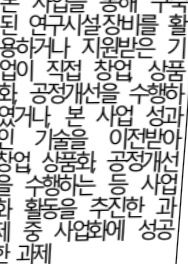

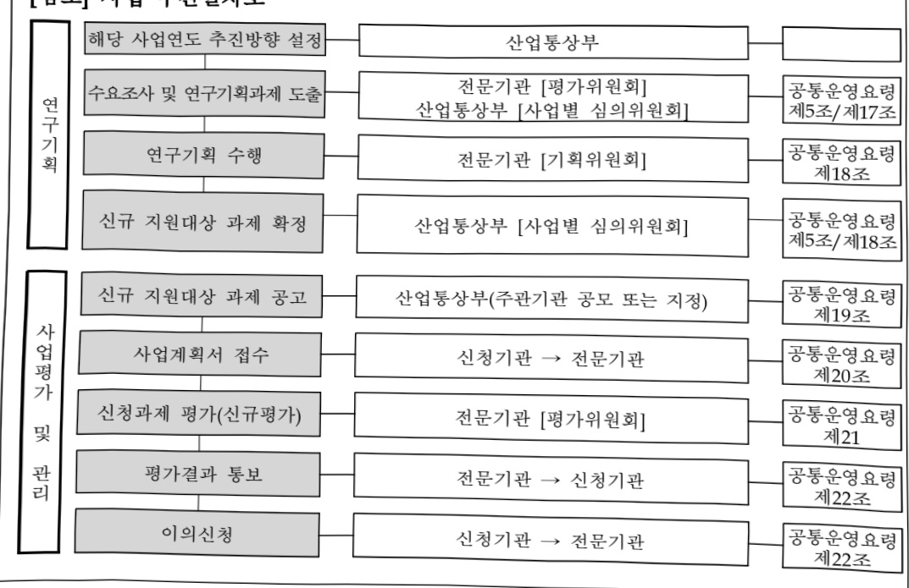

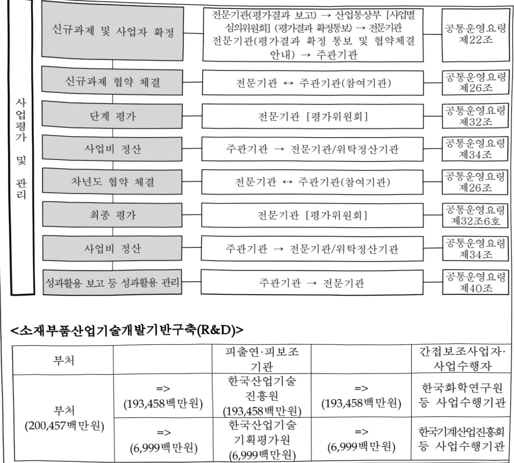

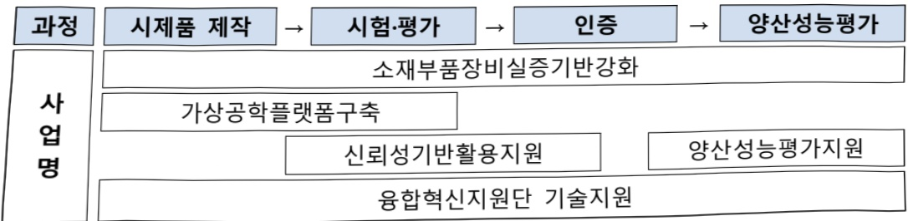

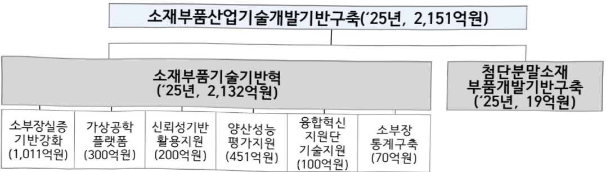

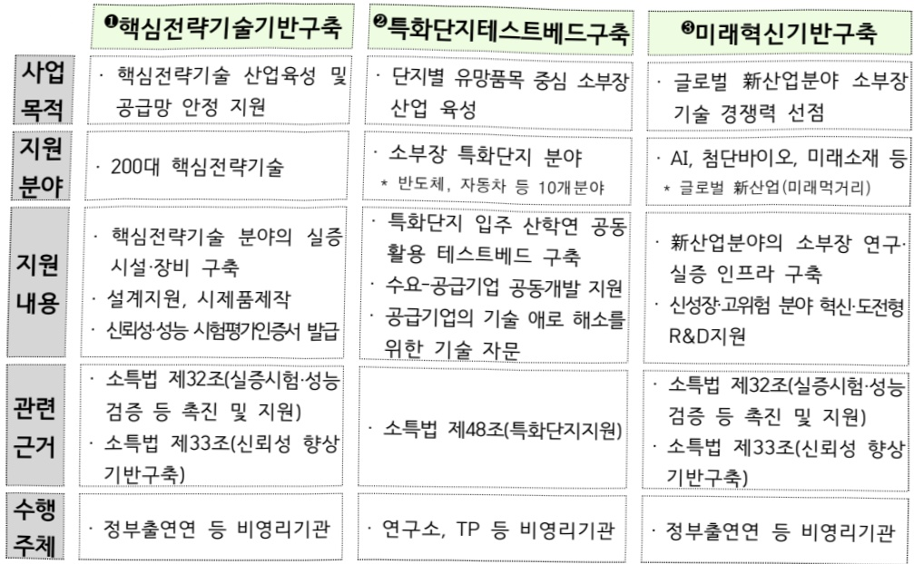

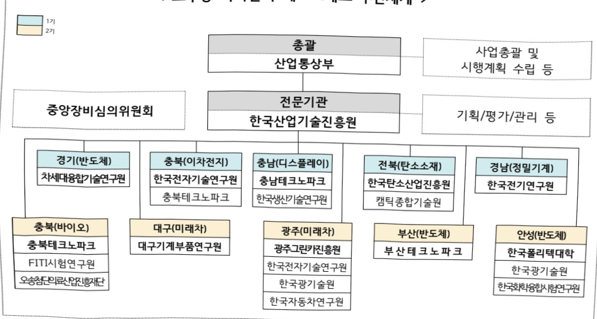

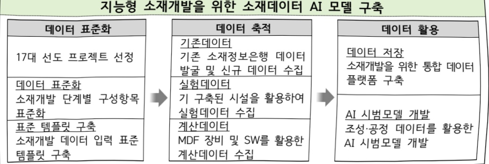

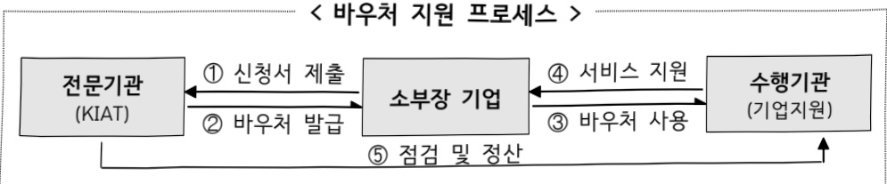

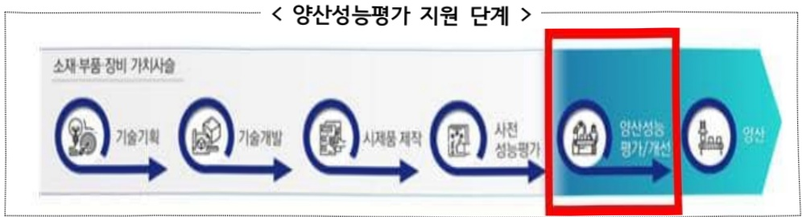

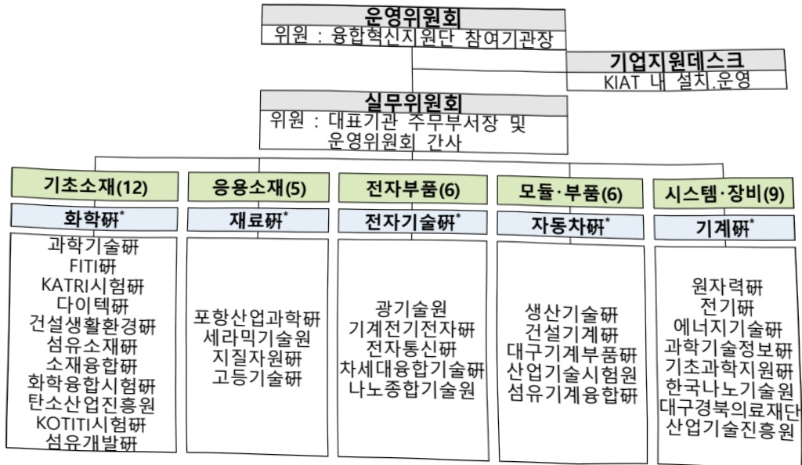

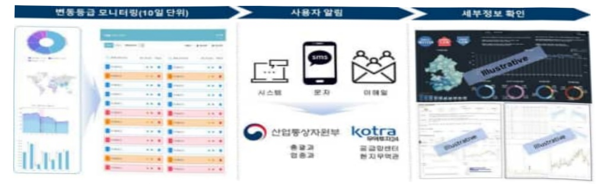

