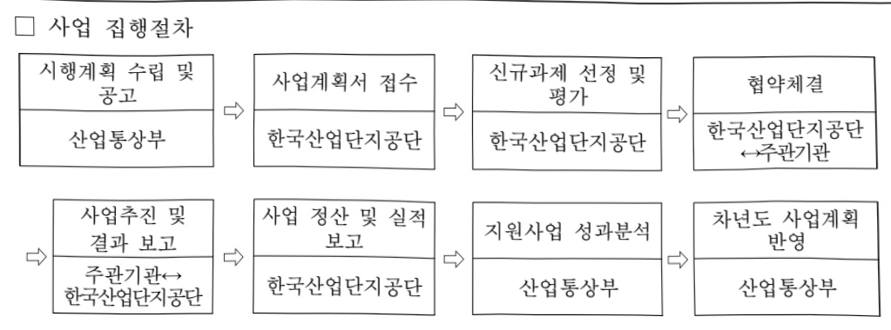
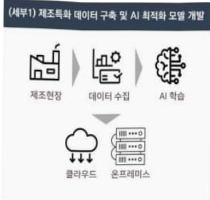
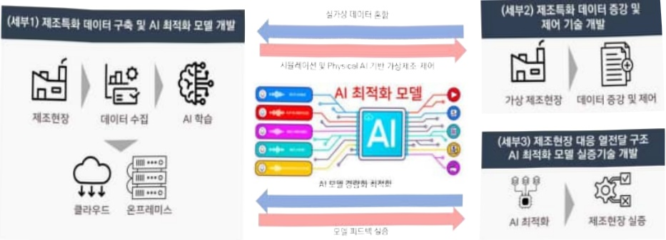
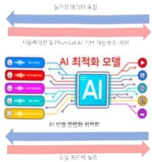
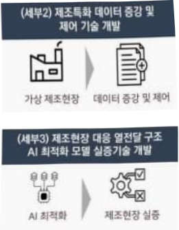

# 열공정특화제조AI파운데이션모델개발(R&D)

**해당 페이지**: PDF 4221 ~ 4228 쪽 해당

**부처**: 산업통상부
**분야**: 산업·중소기업 및 에너지
**회계유형**: 일반회계
**2026 확정예산**: 12000.0 백만원
**전년대비 증감률**: None%
**AI 도메인**: LLM/언어모델, 제조/스마트팩토리, 디지털전환(AX)

---

<table border=1 style='margin: auto; word-wrap: break-word;'><tr><td style='text-align: center; word-wrap: break-word;'>사 업 명</td></tr><tr><td style='text-align: center; word-wrap: break-word;'>(1) 열공정특화제조AI과운데이션모델개발(R&amp;D) (3174-419)</td></tr></table>

## 사업 코드 정보

<table border=1 style='margin: auto; word-wrap: break-word;'><tr><td style='text-align: center; word-wrap: break-word;'>구분</td><td style='text-align: center; word-wrap: break-word;'>회계</td><td style='text-align: center; word-wrap: break-word;'>소관</td><td style='text-align: center; word-wrap: break-word;'>실국(기관)</td><td style='text-align: center; word-wrap: break-word;'>계정</td><td style='text-align: center; word-wrap: break-word;'>분야</td><td style='text-align: center; word-wrap: break-word;'>부문</td></tr><tr><td style='text-align: center; word-wrap: break-word;'>코드</td><td rowspan="2">일반회계</td><td rowspan="2">산업통상부</td><td rowspan="2">산업성장실산업기술협정책관</td><td rowspan="2"></td><td style='text-align: center; word-wrap: break-word;'>110</td><td style='text-align: center; word-wrap: break-word;'>117</td></tr><tr><td style='text-align: center; word-wrap: break-word;'>명칭</td><td style='text-align: center; word-wrap: break-word;'>산업·중소기업 및 에너지</td><td style='text-align: center; word-wrap: break-word;'>산업혁신지원</td></tr></table>

<table border=1 style='margin: auto; word-wrap: break-word;'><tr><td style='text-align: center; word-wrap: break-word;'>구분</td><td style='text-align: center; word-wrap: break-word;'>프로그램</td><td style='text-align: center; word-wrap: break-word;'>단위사업</td><td style='text-align: center; word-wrap: break-word;'>세부사업</td></tr><tr><td style='text-align: center; word-wrap: break-word;'>코드</td><td style='text-align: center; word-wrap: break-word;'>3100</td><td style='text-align: center; word-wrap: break-word;'>3174</td><td style='text-align: center; word-wrap: break-word;'>419</td></tr><tr><td style='text-align: center; word-wrap: break-word;'>명칭</td><td style='text-align: center; word-wrap: break-word;'>산업경쟁력기반구축</td><td style='text-align: center; word-wrap: break-word;'>우수기술역량강화</td><td style='text-align: center; word-wrap: break-word;'>열공정특화제조AI파운데이션 모델개발(R&amp;D)</td></tr></table>

□ 사업 성격 (공통요구자료 Ⅱ-1 작성유의사항 4. 참조, 해당하는 사항에 “○” 표시)

<table border=1 style='margin: auto; word-wrap: break-word;'><tr><td rowspan="2">신규</td><td rowspan="2">계속</td><td rowspan="2">완료</td><td rowspan="2">예비타당성 실시여부</td><td rowspan="2">총사업비 관리대상</td><td rowspan="2">총액계상 예산사업</td><td style='text-align: center; word-wrap: break-word;'>사업소관 변경정보</td></tr><tr><td style='text-align: center; word-wrap: break-word;'>2025예산 시 소관</td></tr><tr><td style='text-align: center; word-wrap: break-word;'>☐</td><td style='text-align: center; word-wrap: break-word;'></td><td style='text-align: center; word-wrap: break-word;'></td><td style='text-align: center; word-wrap: break-word;'></td><td style='text-align: center; word-wrap: break-word;'></td><td style='text-align: center; word-wrap: break-word;'></td><td style='text-align: center; word-wrap: break-word;'></td></tr></table>

□ 사업 지원 형태 및 지원을 (최소한 한 개는 반드시 선택하시오. 해당사항에 0 표시)

<table border=1 style='margin: auto; word-wrap: break-word;'><tr><td style='text-align: center; word-wrap: break-word;'>직접</td><td style='text-align: center; word-wrap: break-word;'>출자</td><td style='text-align: center; word-wrap: break-word;'>출연</td><td style='text-align: center; word-wrap: break-word;'>보조</td><td style='text-align: center; word-wrap: break-word;'>융자</td><td style='text-align: center; word-wrap: break-word;'>국고보조율(%)</td><td style='text-align: center; word-wrap: break-word;'>융자율(%)</td></tr><tr><td style='text-align: center; word-wrap: break-word;'></td><td style='text-align: center; word-wrap: break-word;'></td><td style='text-align: center; word-wrap: break-word;'>○</td><td style='text-align: center; word-wrap: break-word;'></td><td style='text-align: center; word-wrap: break-word;'></td><td style='text-align: center; word-wrap: break-word;'></td><td style='text-align: center; word-wrap: break-word;'></td></tr></table>

## 사업담당자

<table border=1 style='margin: auto; word-wrap: break-word;'><tr><td style='text-align: center; word-wrap: break-word;'>사업명</td><td colspan="5">구분</td></tr><tr><td rowspan="4">열공정특화제조AI과운데이션모델개발(R&amp;D)</td><td rowspan="3">소관부처</td><td style='text-align: center; word-wrap: break-word;'>실·국·과(팀)</td><td style='text-align: center; word-wrap: break-word;'>과 장</td><td style='text-align: center; word-wrap: break-word;'>사무관</td><td style='text-align: center; word-wrap: break-word;'>주무관</td></tr><tr><td style='text-align: center; word-wrap: break-word;'>산업성장실산업기술협정책관</td><td style='text-align: center; word-wrap: break-word;'>이동철</td><td style='text-align: center; word-wrap: break-word;'>성하진</td><td style='text-align: center; word-wrap: break-word;'>-</td></tr><tr><td style='text-align: center; word-wrap: break-word;'>산업기술시장과</td><td style='text-align: center; word-wrap: break-word;'>044-203-4530</td><td style='text-align: center; word-wrap: break-word;'>044-203-4534</td><td style='text-align: center; word-wrap: break-word;'>-</td></tr><tr><td style='text-align: center; word-wrap: break-word;'>사업시행주체</td><td style='text-align: center; word-wrap: break-word;'>한국산업단지공단</td><td style='text-align: center; word-wrap: break-word;'>클러스터사업팀</td><td style='text-align: center; word-wrap: break-word;'>김경재 팀장</td><td style='text-align: center; word-wrap: break-word;'>070-8895-7251</td></tr></table>

---

### 가.예산 총괄표

(단위: 백만원, %)

<table border=1 style='margin: auto; word-wrap: break-word;'><tr><td rowspan="2">사업명</td><td rowspan="2">2024년 결산</td><td colspan="2">2025년 예산</td><td colspan="2">2026년</td><td rowspan="2">중감(B-A)</td><td rowspan="2">(B-A)/A</td></tr><tr><td style='text-align: center; word-wrap: break-word;'>본예산(A)</td><td style='text-align: center; word-wrap: break-word;'>추경</td><td style='text-align: center; word-wrap: break-word;'>요구안</td><td style='text-align: center; word-wrap: break-word;'>확정(B)</td></tr><tr><td style='text-align: center; word-wrap: break-word;'>열공정특화제조AI 과운태이선모델 개발(R&amp;D)</td><td style='text-align: center; word-wrap: break-word;'>-</td><td style='text-align: center; word-wrap: break-word;'>-</td><td style='text-align: center; word-wrap: break-word;'>-</td><td style='text-align: center; word-wrap: break-word;'>12,000</td><td style='text-align: center; word-wrap: break-word;'>12,000</td><td style='text-align: center; word-wrap: break-word;'>12,000</td><td style='text-align: center; word-wrap: break-word;'>순증</td></tr></table>

□ 기능별(내역사업별), 목별 예산 내역

(단위:백만원)

<table border=1 style='margin: auto; word-wrap: break-word;'><tr><td rowspan="3"></td><td colspan="5">2024</td><td colspan="7">2025(2025.12.11)</td><td rowspan="3">2026예산</td></tr><tr><td rowspan="2">예산액(추정)</td><td rowspan="2">예산현액</td><td rowspan="2">집행액[실집행액]</td><td rowspan="2">이월액</td><td rowspan="2">불용액</td><td rowspan="2">본예산</td><td rowspan="2">예산현액</td><td rowspan="2">집행액[실집행액]</td><td colspan="2">전년도이월액제외</td><td rowspan="2">이월예상액</td><td rowspan="2">불용예상액</td></tr><tr><td style='text-align: center; word-wrap: break-word;'>예산현액</td><td style='text-align: center; word-wrap: break-word;'>집행액[실집행액]</td></tr><tr><td style='text-align: center; word-wrap: break-word;'>○ 기능별 분류(합계)</td><td style='text-align: center; word-wrap: break-word;'>-</td><td style='text-align: center; word-wrap: break-word;'>-</td><td style='text-align: center; word-wrap: break-word;'>-</td><td style='text-align: center; word-wrap: break-word;'>-</td><td style='text-align: center; word-wrap: break-word;'>-</td><td style='text-align: center; word-wrap: break-word;'>-</td><td style='text-align: center; word-wrap: break-word;'>-</td><td style='text-align: center; word-wrap: break-word;'>-</td><td style='text-align: center; word-wrap: break-word;'>-</td><td style='text-align: center; word-wrap: break-word;'>-</td><td style='text-align: center; word-wrap: break-word;'>-</td><td style='text-align: center; word-wrap: break-word;'>-</td><td style='text-align: center; word-wrap: break-word;'>12,000</td></tr><tr><td style='text-align: center; word-wrap: break-word;'>· 열공정특화제조AI파운데이선모델개발· 기획평가관리비</td><td style='text-align: center; word-wrap: break-word;'>-</td><td style='text-align: center; word-wrap: break-word;'>-</td><td style='text-align: center; word-wrap: break-word;'>-</td><td style='text-align: center; word-wrap: break-word;'>-</td><td style='text-align: center; word-wrap: break-word;'>-</td><td style='text-align: center; word-wrap: break-word;'>-</td><td style='text-align: center; word-wrap: break-word;'>-</td><td style='text-align: center; word-wrap: break-word;'>-</td><td style='text-align: center; word-wrap: break-word;'>-</td><td style='text-align: center; word-wrap: break-word;'>-</td><td style='text-align: center; word-wrap: break-word;'>-</td><td style='text-align: center; word-wrap: break-word;'>-</td><td style='text-align: center; word-wrap: break-word;'>11,700</td></tr><tr><td style='text-align: center; word-wrap: break-word;'>○ 비목별 분류(합계)</td><td style='text-align: center; word-wrap: break-word;'>-</td><td style='text-align: center; word-wrap: break-word;'>-</td><td style='text-align: center; word-wrap: break-word;'>-</td><td style='text-align: center; word-wrap: break-word;'>-</td><td style='text-align: center; word-wrap: break-word;'>-</td><td style='text-align: center; word-wrap: break-word;'>-</td><td style='text-align: center; word-wrap: break-word;'>-</td><td style='text-align: center; word-wrap: break-word;'>-</td><td style='text-align: center; word-wrap: break-word;'>-</td><td style='text-align: center; word-wrap: break-word;'>-</td><td style='text-align: center; word-wrap: break-word;'>-</td><td style='text-align: center; word-wrap: break-word;'>-</td><td style='text-align: center; word-wrap: break-word;'>300</td></tr><tr><td style='text-align: center; word-wrap: break-word;'>· 연구개발활동비등(360-05)· 기획평가관리비(360-06)</td><td style='text-align: center; word-wrap: break-word;'>-</td><td style='text-align: center; word-wrap: break-word;'>-</td><td style='text-align: center; word-wrap: break-word;'>-</td><td style='text-align: center; word-wrap: break-word;'>-</td><td style='text-align: center; word-wrap: break-word;'>-</td><td style='text-align: center; word-wrap: break-word;'>-</td><td style='text-align: center; word-wrap: break-word;'>-</td><td style='text-align: center; word-wrap: break-word;'>-</td><td style='text-align: center; word-wrap: break-word;'>-</td><td style='text-align: center; word-wrap: break-word;'>-</td><td style='text-align: center; word-wrap: break-word;'>-</td><td style='text-align: center; word-wrap: break-word;'>-</td><td style='text-align: center; word-wrap: break-word;'>12,000</td></tr><tr><td style='text-align: center; word-wrap: break-word;'>○ 기능비목별 분류(합계)</td><td style='text-align: center; word-wrap: break-word;'>-</td><td style='text-align: center; word-wrap: break-word;'>-</td><td style='text-align: center; word-wrap: break-word;'>-</td><td style='text-align: center; word-wrap: break-word;'>-</td><td style='text-align: center; word-wrap: break-word;'>-</td><td style='text-align: center; word-wrap: break-word;'>-</td><td style='text-align: center; word-wrap: break-word;'>-</td><td style='text-align: center; word-wrap: break-word;'>-</td><td style='text-align: center; word-wrap: break-word;'>-</td><td style='text-align: center; word-wrap: break-word;'>-</td><td style='text-align: center; word-wrap: break-word;'>-</td><td style='text-align: center; word-wrap: break-word;'>-</td><td style='text-align: center; word-wrap: break-word;'>11,700</td></tr><tr><td style='text-align: center; word-wrap: break-word;'>· 열공정특화제조AI파운데이선모델개발· 기획평가관리비(360-06)</td><td style='text-align: center; word-wrap: break-word;'>-</td><td style='text-align: center; word-wrap: break-word;'>-</td><td style='text-align: center; word-wrap: break-word;'>-</td><td style='text-align: center; word-wrap: break-word;'>-</td><td style='text-align: center; word-wrap: break-word;'>-</td><td style='text-align: center; word-wrap: break-word;'>-</td><td style='text-align: center; word-wrap: break-word;'>-</td><td style='text-align: center; word-wrap: break-word;'>-</td><td style='text-align: center; word-wrap: break-word;'>-</td><td style='text-align: center; word-wrap: break-word;'>-</td><td style='text-align: center; word-wrap: break-word;'>-</td><td style='text-align: center; word-wrap: break-word;'>-</td><td style='text-align: center; word-wrap: break-word;'>12,000</td></tr></table>

---

### 나. 사업설명자료

## 1 ) 사업목적·내용

- 산업단지 내 열 공정 중심 제조기업을 대상으로 AI 파운데이션 모델을 개발 및 실증·

학산을 지원함으로써, 제조업 디지털 전환 가속화 및 산업단지 혁신 생태계 조성

→ 다양한 제조 업종의 열 관련 공정 특화 데이터를 기반으로 최적의 공정 조건을 도출하는 AI 과운데이션 모델 개발 및 산업단지 등 실증·적용

## 2 ) 사업개요

## □ 사업근거 및 추진경위

① 법령상 근거

-산업디지털전환촉진법 제16조 제1항(선도사업에 대한 지원)

제16조 제1항: 국가와 지방자치단체는 제15조에 따라 선정한 선도사업을 지원하기 위하여 관련 기업등에 다음 각 호와 관련된 행정적·기술적·재정적 지원을 할 수 있다.

1. 산업 디지털 전환을 위한 기술개발 및 사업화

3. 제품 또는 서비스의 개발·생산·유통·소비 등 활동과정의 효율화 또는 문제 해결을 위한 산업데이터의 활용

4. 산업데이터 플랫폼 등의 공동 활용 기반 구축

-산업기술혁신촉진법 제11조 제1항 및 제2항(산업기술개발사업)

제11조 제1항: 산업통상부장관은 혁신계획 및 시행계획을 효율적으로 수행하기 위하여 관계 중앙행정기관의 장과 협의하여 다음 각 호의 산업기술분야에서 기술개발사업(산업기술개발을 위하여 필요한 기획 및 조사를 포함한다. 이하 "산업기술개발사업"이라 한다)을 추진할 수 있다.

1. 산업의 공통적인 기반이 되는 생산기반 기술

2. 산업기술 분야의 미래 유망 기술

3. 산업의 고부가가치화를 위한 공정혁신, 청정생산 및 환경설비 등에 관련된 기술

8. 지역특화산업의 육성 및 지역산업의 혁신에 필요한 기술

■ 제11조 제2항: 산업통상부장관은 연구기관, 대학, 그 밖에 대통령령으로 정하는 기관·단체 또는 기업 등으로 하여금 산업기술개발사업을 수행하게 할 수 있다. 이 경우 산업통상부장관은 다음 각 호의 자와 산업기술개발사업에 관한 협약을 체결하고 해당 사업의 수행에 드는 비용의 전부 또는 일부를 출연 또는 보조할 수 있다.

-산업집적활성화 및 공장설립에 관한 법률 제3조 제1항(산업집적활성화 기본계획)

제3조 제1항 : 산업통상부장관은 5년 단위로 전 국토를 대상으로 산업집적의 활성화에 관한 기본계획(이하 "산업집적활성화기본계획"이라 한다)을 수립하고 고시하여야 한다. 이를 변경할 때에도 또한 같다.

---

## ② 추진경위

'24.11월 AI+R&DI('24.10월), 제8차 산업기술혁신계획('24.11월)을 통해 산업 AX 선도 프로젝트 정책 발표

25.3 월 AI+R&DI('24.10월)에 따라 13개 산업분야 881건 AI활용 기술개발 수요 접수

25.4월 AI 파운데이션 모델 신규사업 기획

- (정부정책과의 부합성) 동 사업은 AI 3강 도약의 정책공약과 산업AI 1위 국가 도약의 국정목표와 부합하여 산업AI 유망 비즈니스 발굴 및 AX 혁신생태계 조성을 지원

## □ 주요내용

① 사업규모

- 총사업비(해당되는 경우에만 기재) : 33,340백만원(국고 : 25,000백만원)

- 사업기간 : '26 ~ '28

- 최근 5년 간 투입된 사업비(예산액기준, 추경편성한 연도에는 추경포함)

<table border=1 style='margin: auto; word-wrap: break-word;'><tr><td style='text-align: center; word-wrap: break-word;'>연도</td><td style='text-align: center; word-wrap: break-word;'>2022</td><td style='text-align: center; word-wrap: break-word;'>2023</td><td style='text-align: center; word-wrap: break-word;'>2024</td><td style='text-align: center; word-wrap: break-word;'>2025</td><td style='text-align: center; word-wrap: break-word;'>2026</td></tr><tr><td style='text-align: center; word-wrap: break-word;'>사업비</td><td style='text-align: center; word-wrap: break-word;'>-</td><td style='text-align: center; word-wrap: break-word;'>-</td><td style='text-align: center; word-wrap: break-word;'>-</td><td style='text-align: center; word-wrap: break-word;'>-</td><td style='text-align: center; word-wrap: break-word;'>12,000</td></tr></table>

## ② 사업추진체계

- 사업시행방법 : 출연

- 사업시행주체 : (주관부처) 산업통상부, (주관기관) 한국산업단지공단

- 사업 수혜자 : 기업(AI솔루션개발 및 산단 내 중소·중견기업), 대학, 연구소

- 보조, 융자, 출연, 출자 등의 경우 보조·융자 등 지원 비율 및 법적근거

<table border=1 style='margin: auto; word-wrap: break-word;'><tr><td style='text-align: center; word-wrap: break-word;'>내역사업명</td><td style='text-align: center; word-wrap: break-word;'>구분</td><td style='text-align: center; word-wrap: break-word;'>피보조·피출연 등 기관명</td><td style='text-align: center; word-wrap: break-word;'>지원 금액 (2026예산)</td><td style='text-align: center; word-wrap: break-word;'>지원 비율(%)</td><td style='text-align: center; word-wrap: break-word;'>보조율 법적근거 (해당 조항)</td></tr><tr><td style='text-align: center; word-wrap: break-word;'>열공정특화 제조AI파운데이션모델 개발</td><td rowspan="2">출연</td><td rowspan="2">한국산업 단지공단</td><td style='text-align: center; word-wrap: break-word;'>11,700</td><td rowspan="2">100% 이내</td><td rowspan="2">○ 국가연구개발혁신법 13조 (연구개발비의 지급 및 사용등) ○ 산업기술혁신사업 공통운영요령 제24조 (정부지원연구개발비의 지원기준)</td></tr><tr><td style='text-align: center; word-wrap: break-word;'>기획평가 관리비</td><td style='text-align: center; word-wrap: break-word;'>300</td></tr></table>

---

## 3 ) 2026년도 예산 산출 근거

## ① 열공정특화제조AI파운데이션모델개발:(2026 신규)11,700백만원

- (요구) '열 공성 네이터 수업·서정 → Physical AI 기반의 네이터 증상·제어 → 최적화 모델 개발 → AI 모델의 자동 배포' 형태의 단계적 및 통합적 기술개발을 통해, 복잡하고 다양한 제조 환경에서 유연하게 적용 가능한 열 공정 특화 제조 AI 파운데이션 모델 개발 및 실증환경 제공을 위한 신규과제 지원

- (산출) 신규과제 1개 11,700백만원

<table border=1 style='margin: auto; word-wrap: break-word;'><tr><td colspan="2">&#x27;25년 본예산</td><td colspan="5">&#x27;26년 예산</td></tr><tr><td style='text-align: center; word-wrap: break-word;'>예산</td><td style='text-align: center; word-wrap: break-word;'>산출내역</td><td style='text-align: center; word-wrap: break-word;'>예산</td><td colspan="4">산출내역</td></tr><tr><td rowspan="3"></td><td rowspan="3"></td><td rowspan="3">11,700</td><td colspan="4">② 열 공정 특화 제조 AI 파운데이션 모델 개발 : 11,700백만원 · 세부산출내역</td></tr><tr><td style='text-align: center; word-wrap: break-word;'>유형</td><td style='text-align: center; word-wrap: break-word;'>과제 수</td><td style='text-align: center; word-wrap: break-word;'>단가</td><td style='text-align: center; word-wrap: break-word;'>개월 수 합계</td></tr><tr><td style='text-align: center; word-wrap: break-word;'>신규</td><td style='text-align: center; word-wrap: break-word;'>1개</td><td style='text-align: center; word-wrap: break-word;'>15,600백만원</td><td style='text-align: center; word-wrap: break-word;'>9/12</td></tr></table>

② 기획평가관리비 : (2026 신규) 300백만원

- 파운데이션 모델 개발 성과관리 R&D 과제평가, 성과분석 등을 위해 총사업비의 2.5% 수준 편성

## 4 ) 사업효과

☐ 사업영향, 산출물 성과지표 등

① '22~'26년도 성과계획서 상 성과지표 및 최근 5년간 성과 달성도

<table border=1 style='margin: auto; word-wrap: break-word;'><tr><td style='text-align: center; word-wrap: break-word;'>성과지표</td><td style='text-align: center; word-wrap: break-word;'>구분</td><td style='text-align: center; word-wrap: break-word;'>&#x27;22</td><td style='text-align: center; word-wrap: break-word;'>&#x27;23</td><td style='text-align: center; word-wrap: break-word;'>&#x27;24</td><td style='text-align: center; word-wrap: break-word;'>&#x27;25</td><td style='text-align: center; word-wrap: break-word;'>&#x27;26</td><td style='text-align: center; word-wrap: break-word;'>&#x27;26목표치산출근거</td><td style='text-align: center; word-wrap: break-word;'>측정산식(또는 측정방법)</td><td style='text-align: center; word-wrap: break-word;'>자료수집방법(또는 자료출처)</td></tr><tr><td rowspan="3">① 산업현장 실증적용 기업수</td><td style='text-align: center; word-wrap: break-word;'>목표</td><td style='text-align: center; word-wrap: break-word;'></td><td style='text-align: center; word-wrap: break-word;'></td><td style='text-align: center; word-wrap: break-word;'></td><td style='text-align: center; word-wrap: break-word;'></td><td style='text-align: center; word-wrap: break-word;'>5</td><td rowspan="6">기획보고서 상의 3년간 단계별 성과지표 목표에 따라 산출</td><td rowspan="3">실증기업참여명단 및 실제 참여확인</td><td rowspan="3">진도점검 시 현장 증빙서류 확인</td></tr><tr><td style='text-align: center; word-wrap: break-word;'>실적</td><td style='text-align: center; word-wrap: break-word;'></td><td style='text-align: center; word-wrap: break-word;'></td><td style='text-align: center; word-wrap: break-word;'></td><td style='text-align: center; word-wrap: break-word;'></td><td style='text-align: center; word-wrap: break-word;'>-</td></tr><tr><td style='text-align: center; word-wrap: break-word;'>달성도</td><td style='text-align: center; word-wrap: break-word;'></td><td style='text-align: center; word-wrap: break-word;'></td><td style='text-align: center; word-wrap: break-word;'></td><td style='text-align: center; word-wrap: break-word;'></td><td style='text-align: center; word-wrap: break-word;'>-</td></tr><tr><td rowspan="3">② 참여기업의 PQC 효과(%)</td><td style='text-align: center; word-wrap: break-word;'>목표</td><td style='text-align: center; word-wrap: break-word;'></td><td style='text-align: center; word-wrap: break-word;'></td><td style='text-align: center; word-wrap: break-word;'></td><td style='text-align: center; word-wrap: break-word;'></td><td style='text-align: center; word-wrap: break-word;'>10</td><td rowspan="3">생산성(P), 품질개선(Q), 비용절감(C) 평균 효과 측정</td><td rowspan="3">외부전문가 활용 성과측정 결과를 진도점검 시 현장 확인</td></tr><tr><td style='text-align: center; word-wrap: break-word;'>실적</td><td style='text-align: center; word-wrap: break-word;'></td><td style='text-align: center; word-wrap: break-word;'></td><td style='text-align: center; word-wrap: break-word;'></td><td style='text-align: center; word-wrap: break-word;'></td><td style='text-align: center; word-wrap: break-word;'>-</td></tr><tr><td style='text-align: center; word-wrap: break-word;'>달성도</td><td style='text-align: center; word-wrap: break-word;'></td><td style='text-align: center; word-wrap: break-word;'></td><td style='text-align: center; word-wrap: break-word;'></td><td style='text-align: center; word-wrap: break-word;'></td><td style='text-align: center; word-wrap: break-word;'>-</td></tr></table>

② 성과지표 이외의 연도별 사업추진 경과 및 실적 : 해당없음

③ 향후(26년도 이후) 기대효과

(성과물) 산업AI 분야의 국제 경쟁력을 확보한 대표 비즈니스 모델 발굴과 실증

확산을 통한 산업단지 제조업 전반의 생산성 향상 기대

- (경제/사회적 효과) 산단 내 주요 제조업 전반의 생산성 향상과 신산업 창출,

AI 활용 확대에 따른 국가 경쟁력 제고

---

- (직·간접적 고용, 일자리 창출, 인력양성 파급효과) AI 전문인력, 데이터·프롬프트

엔지니어 등 고급 일자리 창출과 산업 내 AI 활용 저변 확대

5) 타당성조사 및 예비타당성조사 시행여부 및 결과 요지 : 해당없음

6) 총사업비 대상사업 여부 및 내역 : 해당없음

## 7 ) 사업 집행절차

8) 중기재정계획 상 연도별 투자계획 및 추진경과

(단위:백만원)

<table border=1 style='margin: auto; word-wrap: break-word;'><tr><td style='text-align: center; word-wrap: break-word;'>$ ^{24} $</td><td style='text-align: center; word-wrap: break-word;'>$ ^{25} $</td><td style='text-align: center; word-wrap: break-word;'>$ ^{26} $</td><td style='text-align: center; word-wrap: break-word;'>$ ^{27} $</td><td style='text-align: center; word-wrap: break-word;'>$ ^{28} $</td><td style='text-align: center; word-wrap: break-word;'>$ ^{29} $</td></tr><tr><td style='text-align: center; word-wrap: break-word;'>$ ^{23} $~ $ ^{27} $</td><td style='text-align: center; word-wrap: break-word;'>-</td><td style='text-align: center; word-wrap: break-word;'>-</td><td style='text-align: center; word-wrap: break-word;'>-</td><td style='text-align: center; word-wrap: break-word;'>-</td><td style='text-align: center; word-wrap: break-word;'>-</td></tr><tr><td style='text-align: center; word-wrap: break-word;'>$ ^{24} $~ $ ^{28} $</td><td style='text-align: center; word-wrap: break-word;'>-</td><td style='text-align: center; word-wrap: break-word;'>12,000</td><td style='text-align: center; word-wrap: break-word;'>8,000</td><td style='text-align: center; word-wrap: break-word;'>5,000</td><td style='text-align: center; word-wrap: break-word;'></td></tr></table>

9) 최근 3년간 동 사업에 대한 주요 외부지적사항 및 평가, 문제점 및 대책

1) 국회(예결위, 상임위, 예정처, 국정감사 포함) 지적 : 해당없음

2) 감사원 또는 국무총리실 지적 : 해당없음

3) 자체평가 : 해당없음

4) 기타 시민단체, 언론 및 민원 : 해당없음

5) 문제점 지적에 대한 후속조치 : 해당없음

---

## 10 ) 향후 추진방향 및 추진계획

<table border=1 style='margin: auto; word-wrap: break-word;'><tr><td style='text-align: center; word-wrap: break-word;'>○ (제조특화 데이터 구축 및 AI 최적화 모델 개발) 열 공정을 포함하는 대표 산업군 및 공정 데이터를 수집·정제하고, 이를 기반으로 업종 간 전이학습이 가능한 제조 특화 AI 최적화 모델을 개발하여 범용성과 확장성 확보</td></tr><tr><td style='text-align: center; word-wrap: break-word;'>○ (제조특화 데이터 증강 및 제어 기술 개발) 열 공정 관련 실제 제조 조건을 반영한 고품질 증강 데이터를 생성하고, 데이터 부족 문제를 해결하여 학습 데이터의 다양성과 공정 시스템 제어 성능 향상</td></tr><tr><td style='text-align: center; word-wrap: break-word;'>○ (제조현장 대응 열전달 구조 AI 최적화 모델 실증기술 개발) 개발된 AI 모델을 다양한 제조현장에 배포, 현장 특성에 맞는 최적화 기술을 실증하여 실제 적용성과 운영 가능성을 검증</td></tr></table>

11) 해당사업에 대한 각종 사업평가의 결과 : 해당없음

12) 부처 건의사항 : 해당없음

### 다. 최근 4년간 결산내역

1) 결산표 : 해당없음

2) 주요 결산사항 : 해당없음

라. 기타 추가자료 : 붙임(참고자료) 참조

---

## 참고

## □ 사업목적

0 다양한 제조 업종의 열 관련 공정 특화 데이터를 기반으로 온도, 압력, 유량 등 환경 변수의 상호작용을 모델링하여 최적의 공정 조건을 도출하는 AI 파운데이션 모델 개발 및 산업단지 등 실증·적용을 통한 신뢰성 검증

## □추진내용

(제조특화 데이터 구축 및 AI 최적화 모델 개발) 반도체, 배터리, 화학 등

열공정 집약 산업의 대규모 데이터 수집 및 표준화를 통해 열 공정

특화 제조 AI 파운데이션 모델 개발*

* 업종 간 전이학습이 가능한 제조특화 AI 최적화 모델을 개발하여 범용성과 확장성 확보

(제조특화 데이터 중강 및 제어 기술개발) 열공정 관련 실제 수집이

어려운 고온·고압 환경 데이터를 증강 및 공정 제어

*데이터부족문제를해결하고,학습데이터의다양성과공정시스템제어성능향상

(제조현장 대응 열전달 구조 AI 최적화 모델 실증기술 개발) 개발된 AI 모델을 산업단지 열관리 시스템에 적용하여 열전달 구조 최적화 및 에너지 효율 검증

* AI 모델을 다양한 제조 현장에 배포, 현장 특성에 맞는 최적화 기술 실증

□ '26년 사업예산 : 12,000백만원

° 열 공정 특화 제조 AI 파운데이션 모델 개발 : 3년간 25,000백만원

* 1개 단일과제 내 3개 세부개발 내용으로 반영

---

### 원본 PDF 크롭 이미지

