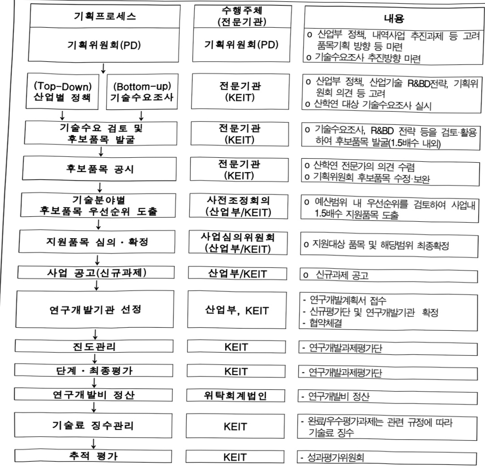
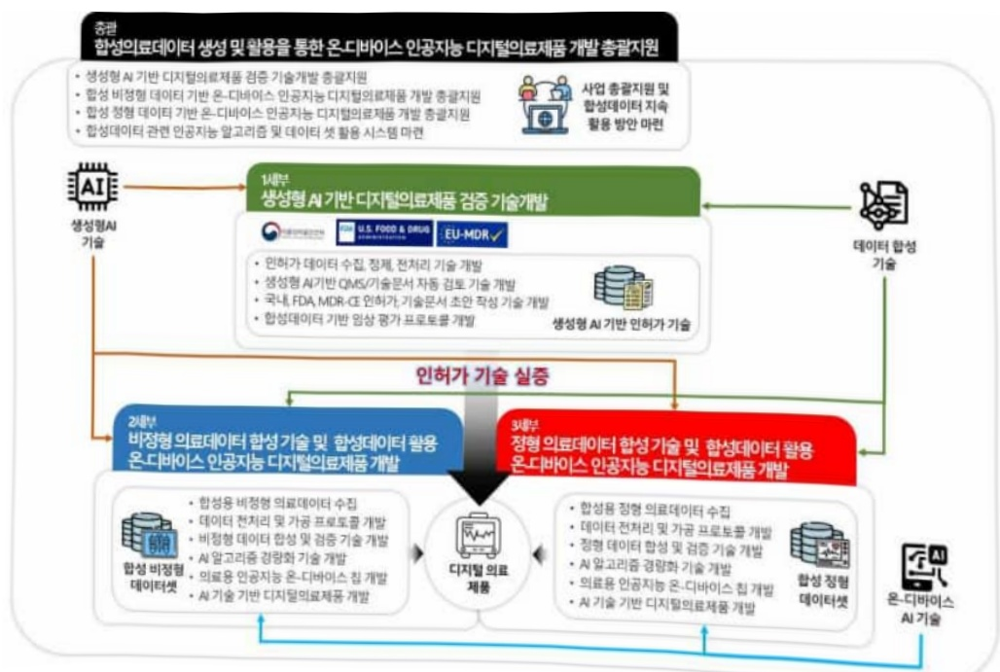
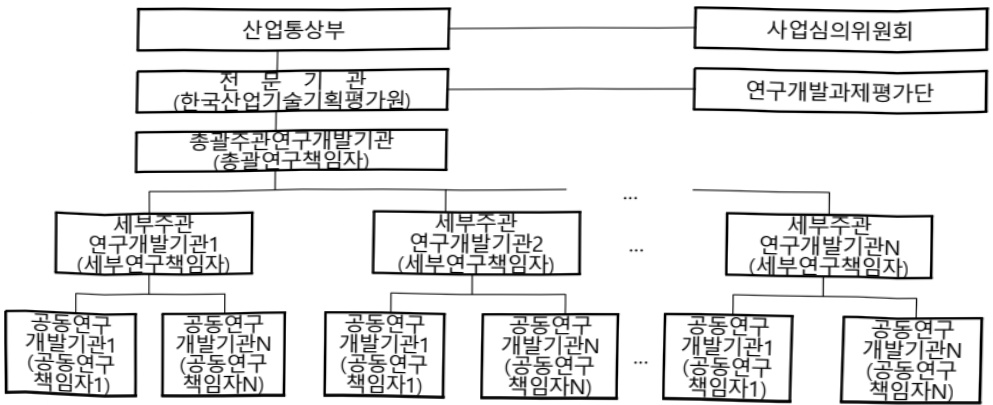

# 의료데이터합성기술및의료인공지능기술기반디지털의료제품…

**해당 페이지**: PDF 4229 ~ 4244 쪽 해당

**부처**: 산업통상부
**분야**: 산업·중소기업 및 에너지
**회계유형**: 일반회계
**2026 확정예산**: 3750.0 백만원
**전년대비 증감률**: 33.9%
**AI 도메인**: LLM/언어모델, 보안/사이버, 의료/바이오

---

<table border=1 style='margin: auto; word-wrap: break-word;'><tr><td style='text-align: center; word-wrap: break-word;'>사 업 명</td></tr><tr><td style='text-align: center; word-wrap: break-word;'>(238) 의료데이터합성기술및의료인공지능기술기반디지털의료제품개발(R&amp;D) (3651-312)</td></tr></table>

## 사업 코드 정보

<table border=1 style='margin: auto; word-wrap: break-word;'><tr><td style='text-align: center; word-wrap: break-word;'>구분</td><td style='text-align: center; word-wrap: break-word;'>회계</td><td style='text-align: center; word-wrap: break-word;'>소관</td><td style='text-align: center; word-wrap: break-word;'>실국(기관)</td><td style='text-align: center; word-wrap: break-word;'>계정</td><td style='text-align: center; word-wrap: break-word;'>분야</td><td style='text-align: center; word-wrap: break-word;'>부문</td></tr><tr><td style='text-align: center; word-wrap: break-word;'>코드</td><td rowspan="2">일반회계</td><td rowspan="2">산업통상부</td><td rowspan="2">산업성장실산업인공지능정책관</td><td rowspan="2"></td><td style='text-align: center; word-wrap: break-word;'>110</td><td style='text-align: center; word-wrap: break-word;'>117</td></tr><tr><td style='text-align: center; word-wrap: break-word;'>명칭</td><td style='text-align: center; word-wrap: break-word;'>산업·중소기업 및 에너지</td><td style='text-align: center; word-wrap: break-word;'>산업혁신지원</td></tr></table>

<table border=1 style='margin: auto; word-wrap: break-word;'><tr><td style='text-align: center; word-wrap: break-word;'>구분</td><td style='text-align: center; word-wrap: break-word;'>프로그램</td><td style='text-align: center; word-wrap: break-word;'>단위사업</td><td style='text-align: center; word-wrap: break-word;'>세부사업</td></tr><tr><td style='text-align: center; word-wrap: break-word;'>코드</td><td style='text-align: center; word-wrap: break-word;'>3600</td><td style='text-align: center; word-wrap: break-word;'>3651</td><td style='text-align: center; word-wrap: break-word;'>312</td></tr><tr><td style='text-align: center; word-wrap: break-word;'>명칭</td><td style='text-align: center; word-wrap: break-word;'>신산업진흥</td><td style='text-align: center; word-wrap: break-word;'>바이오헬스기술개발</td><td style='text-align: center; word-wrap: break-word;'>의료데이터합성기술및의료인공지능기술기반디지털의료제품개발(R&amp;D)</td></tr></table>

사업 성격 (공통요구자료 Ⅱ-1 작성유의사항 4. 참조, 해당하는 사항에 “0” 표시)

<table border=1 style='margin: auto; word-wrap: break-word;'><tr><td rowspan="2">신규</td><td rowspan="2">계속</td><td rowspan="2">완료</td><td rowspan="2">예비타당성 실시여부</td><td rowspan="2">총사업비 관리대상</td><td rowspan="2">총액계상 예산사업</td><td style='text-align: center; word-wrap: break-word;'>사업소관 변경정보</td></tr><tr><td style='text-align: center; word-wrap: break-word;'>2025예산 시 소관</td></tr><tr><td style='text-align: center; word-wrap: break-word;'></td><td style='text-align: center; word-wrap: break-word;'>○</td><td style='text-align: center; word-wrap: break-word;'></td><td style='text-align: center; word-wrap: break-word;'></td><td style='text-align: center; word-wrap: break-word;'></td><td style='text-align: center; word-wrap: break-word;'></td><td style='text-align: center; word-wrap: break-word;'></td></tr></table>

사업 지원 형태 및 지원을 (최소한 한 개는 반드시 선택하시오. 해당사항에 0 표시)

<table border=1 style='margin: auto; word-wrap: break-word;'><tr><td style='text-align: center; word-wrap: break-word;'>직접</td><td style='text-align: center; word-wrap: break-word;'>출자</td><td style='text-align: center; word-wrap: break-word;'>출연</td><td style='text-align: center; word-wrap: break-word;'>보조</td><td style='text-align: center; word-wrap: break-word;'>융자</td><td style='text-align: center; word-wrap: break-word;'>국고보조율(%)</td><td style='text-align: center; word-wrap: break-word;'>융자율(%)</td></tr><tr><td style='text-align: center; word-wrap: break-word;'></td><td style='text-align: center; word-wrap: break-word;'></td><td style='text-align: center; word-wrap: break-word;'>0</td><td style='text-align: center; word-wrap: break-word;'></td><td style='text-align: center; word-wrap: break-word;'></td><td style='text-align: center; word-wrap: break-word;'></td><td style='text-align: center; word-wrap: break-word;'></td></tr></table>

## □ 사업 담당자

<table border=1 style='margin: auto; word-wrap: break-word;'><tr><td style='text-align: center; word-wrap: break-word;'>사업명</td><td colspan="5">구분</td></tr><tr><td rowspan="4">의료데이터 합성기술및 의료인공지능기술기반 디지털의료 제품개발 (R&amp;D)</td><td rowspan="3">소관부처</td><td style='text-align: center; word-wrap: break-word;'>실·국·과(팀)</td><td style='text-align: center; word-wrap: break-word;'>과 장</td><td style='text-align: center; word-wrap: break-word;'>사무관</td><td style='text-align: center; word-wrap: break-word;'>주무관</td></tr><tr><td style='text-align: center; word-wrap: break-word;'>산업성장실 산업인공지능정책관</td><td style='text-align: center; word-wrap: break-word;'>최광준</td><td style='text-align: center; word-wrap: break-word;'>오수만 서기관</td><td style='text-align: center; word-wrap: break-word;'></td></tr><tr><td style='text-align: center; word-wrap: break-word;'>인공지능바이오융 합산업과</td><td style='text-align: center; word-wrap: break-word;'>044-203-4290</td><td style='text-align: center; word-wrap: break-word;'>044-203-4293</td><td style='text-align: center; word-wrap: break-word;'></td></tr><tr><td style='text-align: center; word-wrap: break-word;'>사업시행주체</td><td style='text-align: center; word-wrap: break-word;'>한국산업기술 기획평가원</td><td style='text-align: center; word-wrap: break-word;'>바이오헬스실</td><td style='text-align: center; word-wrap: break-word;'>차혜선 실장</td><td style='text-align: center; word-wrap: break-word;'>053-718-8420</td></tr></table>

---

### 가.예산 총괄표

(단위:백만원,%)

<table border=1 style='margin: auto; word-wrap: break-word;'><tr><td rowspan="2">사업명</td><td rowspan="2">2024년 결산</td><td colspan="2">2025년 예산</td><td colspan="2">2026년</td><td rowspan="2">중감(B-A)</td><td rowspan="2">(B-A)/A</td></tr><tr><td style='text-align: center; word-wrap: break-word;'>본예산(A)</td><td style='text-align: center; word-wrap: break-word;'>추경</td><td style='text-align: center; word-wrap: break-word;'>요구안</td><td style='text-align: center; word-wrap: break-word;'>확정(B)</td></tr><tr><td style='text-align: center; word-wrap: break-word;'>의료데이터 합성기술 및 의료인공지능기술 기반 디지털 의료제품개발</td><td style='text-align: center; word-wrap: break-word;'>-</td><td style='text-align: center; word-wrap: break-word;'>2,800</td><td style='text-align: center; word-wrap: break-word;'>2,800</td><td style='text-align: center; word-wrap: break-word;'>3,750</td><td style='text-align: center; word-wrap: break-word;'>3,750</td><td style='text-align: center; word-wrap: break-word;'>950</td><td style='text-align: center; word-wrap: break-word;'>33.9</td></tr></table>

□ 기능별(내역사업별), 목별 예산 내역

(단위:백만원)

<table border=1 style='margin: auto; word-wrap: break-word;'><tr><td rowspan="3"></td><td colspan="5">2024</td><td colspan="7">2025(2025.12월말)</td><td rowspan="3">2026예산</td></tr><tr><td rowspan="2">예산액(추경)</td><td rowspan="2">예산현액</td><td rowspan="2">집행액[실집행액]</td><td rowspan="2">이월액</td><td rowspan="2">불용액</td><td rowspan="2">본예산</td><td rowspan="2">예산현액</td><td rowspan="2">집행액[실집행액]</td><td colspan="2">전년도 이월액제외</td><td rowspan="2">이월예상액</td><td rowspan="2">불용예상액</td></tr><tr><td style='text-align: center; word-wrap: break-word;'>예산현액</td><td style='text-align: center; word-wrap: break-word;'>집행액[실집행액]</td></tr><tr><td style='text-align: center; word-wrap: break-word;'>○ 기능별 분류(합계)</td><td style='text-align: center; word-wrap: break-word;'>-</td><td style='text-align: center; word-wrap: break-word;'>-</td><td style='text-align: center; word-wrap: break-word;'>-</td><td style='text-align: center; word-wrap: break-word;'>-</td><td style='text-align: center; word-wrap: break-word;'>-</td><td style='text-align: center; word-wrap: break-word;'>2,800</td><td style='text-align: center; word-wrap: break-word;'>2,800</td><td style='text-align: center; word-wrap: break-word;'>2,800[2,800]</td><td style='text-align: center; word-wrap: break-word;'>-</td><td style='text-align: center; word-wrap: break-word;'>-</td><td style='text-align: center; word-wrap: break-word;'>-</td><td style='text-align: center; word-wrap: break-word;'>-</td><td style='text-align: center; word-wrap: break-word;'>3,750</td></tr><tr><td style='text-align: center; word-wrap: break-word;'>· 의료데이터합성기술및의료인공지능기술기반디지털의료제품개발</td><td style='text-align: center; word-wrap: break-word;'>-</td><td style='text-align: center; word-wrap: break-word;'>-</td><td style='text-align: center; word-wrap: break-word;'>-</td><td style='text-align: center; word-wrap: break-word;'>-</td><td style='text-align: center; word-wrap: break-word;'>-</td><td style='text-align: center; word-wrap: break-word;'>2,800</td><td style='text-align: center; word-wrap: break-word;'>2,800</td><td style='text-align: center; word-wrap: break-word;'>2,800[2,800]</td><td style='text-align: center; word-wrap: break-word;'>-</td><td style='text-align: center; word-wrap: break-word;'>-</td><td style='text-align: center; word-wrap: break-word;'>-</td><td style='text-align: center; word-wrap: break-word;'>-</td><td style='text-align: center; word-wrap: break-word;'>3,750</td></tr><tr><td style='text-align: center; word-wrap: break-word;'>○ 비목별 분류(합계)</td><td style='text-align: center; word-wrap: break-word;'>-</td><td style='text-align: center; word-wrap: break-word;'>-</td><td style='text-align: center; word-wrap: break-word;'>-</td><td style='text-align: center; word-wrap: break-word;'>-</td><td style='text-align: center; word-wrap: break-word;'>-</td><td style='text-align: center; word-wrap: break-word;'>2,800</td><td style='text-align: center; word-wrap: break-word;'>2,800</td><td style='text-align: center; word-wrap: break-word;'>2,800[2,800]</td><td style='text-align: center; word-wrap: break-word;'>-</td><td style='text-align: center; word-wrap: break-word;'>-</td><td style='text-align: center; word-wrap: break-word;'>-</td><td style='text-align: center; word-wrap: break-word;'>-</td><td style='text-align: center; word-wrap: break-word;'>3,750</td></tr><tr><td style='text-align: center; word-wrap: break-word;'>· 연구개발활동비(360-05)</td><td style='text-align: center; word-wrap: break-word;'>-</td><td style='text-align: center; word-wrap: break-word;'>-</td><td style='text-align: center; word-wrap: break-word;'>-</td><td style='text-align: center; word-wrap: break-word;'>-</td><td style='text-align: center; word-wrap: break-word;'>-</td><td style='text-align: center; word-wrap: break-word;'>2,800</td><td style='text-align: center; word-wrap: break-word;'>2,800</td><td style='text-align: center; word-wrap: break-word;'>2,800[2,800]</td><td style='text-align: center; word-wrap: break-word;'>-</td><td style='text-align: center; word-wrap: break-word;'>-</td><td style='text-align: center; word-wrap: break-word;'>-</td><td style='text-align: center; word-wrap: break-word;'>-</td><td style='text-align: center; word-wrap: break-word;'>3,750</td></tr><tr><td style='text-align: center; word-wrap: break-word;'>○ 기능비목별 분류(합계)</td><td style='text-align: center; word-wrap: break-word;'>-</td><td style='text-align: center; word-wrap: break-word;'>-</td><td style='text-align: center; word-wrap: break-word;'>-</td><td style='text-align: center; word-wrap: break-word;'>-</td><td style='text-align: center; word-wrap: break-word;'>-</td><td style='text-align: center; word-wrap: break-word;'>2,800</td><td style='text-align: center; word-wrap: break-word;'>2,800</td><td style='text-align: center; word-wrap: break-word;'>2,800[2,800]</td><td style='text-align: center; word-wrap: break-word;'>-</td><td style='text-align: center; word-wrap: break-word;'>-</td><td style='text-align: center; word-wrap: break-word;'>-</td><td style='text-align: center; word-wrap: break-word;'>-</td><td style='text-align: center; word-wrap: break-word;'>3,750</td></tr><tr><td style='text-align: center; word-wrap: break-word;'>· 의료데이터합성기술및의료인공지능기술기반디지털의료제품개발-연구개발활동비(360-05)</td><td style='text-align: center; word-wrap: break-word;'>-</td><td style='text-align: center; word-wrap: break-word;'>-</td><td style='text-align: center; word-wrap: break-word;'>-</td><td style='text-align: center; word-wrap: break-word;'>-</td><td style='text-align: center; word-wrap: break-word;'>-</td><td style='text-align: center; word-wrap: break-word;'>2,800</td><td style='text-align: center; word-wrap: break-word;'>2,800</td><td style='text-align: center; word-wrap: break-word;'>2,800[2,800]</td><td style='text-align: center; word-wrap: break-word;'>-</td><td style='text-align: center; word-wrap: break-word;'>-</td><td style='text-align: center; word-wrap: break-word;'>-</td><td style='text-align: center; word-wrap: break-word;'>-</td><td style='text-align: center; word-wrap: break-word;'>3,750</td></tr></table>

---

### 나. 사업설명자료

## 1 ) 사업목적·내용

- (사업목적) 데이터 합성 기술 및 생성형 AI 기술을 통해 질환 속성을 유지한 의료데이터를 마련, 의료데이터 사용 난제(데이터 보안, 개인정보보호법, 의료법 등)를 해결

- (사업내용) 데이터 합성 기술을 활용, 의료데이터 등을 대체할 수 있는 고품질 합성(synthetic) 데이터 생성 기술을 개발하고, 합성된 의료/비의료 데이터를 활용하여 온-디바이스 AI 및 인공지능 기술이 적용된 첨단 디지털의료제품 및 인허가 자동화 기술개발

## 2 ) 사업개요

## □ 사업근거 및 추진경위

① 법령상 근거 및 조항 적시

-산업기술혁신촉진법 제11조(산업기술개발사업)

제11조(산업기술개발사업) ① 산업통상부장관은 혁신계획 및 시행계획을 효율적으로 수행하기 위하여 관계 중 양행정기관의 장과 협의하여 다음 각 호의 산업기술분야에서 기술개발사업(산업기술개발을 위하여 필요한 기획 및 조사를 포함한다. 이하 "산업기술개발사업"이라 한다)을 추진할 수 있다.

2. 산업기술 분야의 미래 유망 기술

9.산업발전법제5조에 따른 첨단기술·첨단제품의 개발 및 자본재의 시제품 개발

② 추진경위 - 사업 시작년도, 추진배경, 부처별 중점과제, 대통령 공약사항 등 - 윤석열 정부 120대 국정과제('22.7)

* (국정과제 25.) 바이오디지털헬스 글로벌 중심국가 도약(보건의료 빅데이터 구축 및 개방, 바이오 디지털 활용 인공지능 개발 등 데이터 기반 연구개발을 확대하고 정밀의료 촉진)

- 관계부처 합동「의료기기산업 육성지원 혁신전략」，제1차 의료기기산업 육성지원 종합계획('23~'27)('23.9)

- 관계부처 합동 「첨단바이오 이니셔티브」 및 「AI-반도체 이니셔티브」，제6차 국가 과학기술자문회의('24.4)

---

## □ 주요내용

## ① 사업규모

- 총사업비(해당되는 경우에만 기재) : 해당없음

- 사업기간 : '25년 ~ '29년(5년)

- 최근 5년 간 투입된 사업비(예산액기준, 추경편성한 연도에는 추경포함)

<table border=1 style='margin: auto; word-wrap: break-word;'><tr><td style='text-align: center; word-wrap: break-word;'>연도</td><td style='text-align: center; word-wrap: break-word;'>2022</td><td style='text-align: center; word-wrap: break-word;'>2023</td><td style='text-align: center; word-wrap: break-word;'>2024</td><td style='text-align: center; word-wrap: break-word;'>2025</td><td style='text-align: center; word-wrap: break-word;'>2026</td></tr><tr><td style='text-align: center; word-wrap: break-word;'>사업비</td><td style='text-align: center; word-wrap: break-word;'>-</td><td style='text-align: center; word-wrap: break-word;'>-</td><td style='text-align: center; word-wrap: break-word;'>-</td><td style='text-align: center; word-wrap: break-word;'>2,800백만원</td><td style='text-align: center; word-wrap: break-word;'>3,750백만원</td></tr></table>

- 기타: 해당없음

② 사업추진체계

- 사업시행방법 : 출연

- 사업시행주체 : 한국산업기술기획평가원

- 사업 수혜자 : 기업, 대학, 연구소, 병원 등

- 보조, 융자, 출연, 출자 등의 경우 보조·융자 등 지원 비율 및 법적근거

<table border=1 style='margin: auto; word-wrap: break-word;'><tr><td style='text-align: center; word-wrap: break-word;'>내역사업명</td><td style='text-align: center; word-wrap: break-word;'>구분</td><td style='text-align: center; word-wrap: break-word;'>피보조·피출연 등 기관명</td><td style='text-align: center; word-wrap: break-word;'>지원 금액(2026예산안)</td><td style='text-align: center; word-wrap: break-word;'>지원 비율(%)</td><td style='text-align: center; word-wrap: break-word;'>보조율 법적근거 (해당 조항)</td></tr><tr><td style='text-align: center; word-wrap: break-word;'>의료데이터합성기술및의료인공지능기술기반디지털의료제품개발</td><td style='text-align: center; word-wrap: break-word;'>출연</td><td style='text-align: center; word-wrap: break-word;'>한국산업기술기획평가원</td><td style='text-align: center; word-wrap: break-word;'>3,750백만원</td><td style='text-align: center; word-wrap: break-word;'>총사업비의 75%이내</td><td style='text-align: center; word-wrap: break-word;'>산업기술혁신촉진법 제11조(산업기술개발사업)</td></tr></table>

## 3 ) 2026년도 예산 산출 근거

① 의료데이터합성기술및의료인공지능기술기반디지털의료제품개발사업:

(2025 본예산) 2,800→(2026) 3,750 백만원, +33.9%

- (요구) 의료데이터 합성 기술, 합성된 의료/비의료 데이터 활용한 온디바이스 AI 첨단 디지털 의료제품 개발, 인허가 지원 자동화 기술 개발을 위한 계속과제 지원예산 3,750백만원 요구

* '25년 9개월분 예산 대비 '26년 12개월분 소요예산 반영에 따른 예산 +33.9% 증액 요구

- (산출) (계속) 4개×938백만×12/12개월

* '25년 9개월분 예산 대비 '26년 12개월분 소요예산 반영에 따른 예산 증액 요구

* (총괄과제)①인허가, 실증지원 및 사업관리 과제 지원예산 100백만원 소요

(세부과제)①AI기반 디지털의료제품 검증기술 개발, ②비정형 의료데이터 합성기술 및 이를 활용한 인공지능 디지털 의료제품 개발 ③정형 의료데이터 합성기술 및 이를 활용한 인공지능 디지털 의료제품 개발 3개교제 3650백만원 소요

---

## 4 ) 사업효과

□ 사업영향, 산출물 성과지표 등

① 2025~2029년도 성과계획서 상 성과지표 및 최근 5년간 성과 달성도

<table border=1 style='margin: auto; word-wrap: break-word;'><tr><td style='text-align: center; word-wrap: break-word;'>성과지표</td><td style='text-align: center; word-wrap: break-word;'>구분</td><td style='text-align: center; word-wrap: break-word;'>2025</td><td style='text-align: center; word-wrap: break-word;'>2026</td><td style='text-align: center; word-wrap: break-word;'>2027</td><td style='text-align: center; word-wrap: break-word;'>2028</td><td style='text-align: center; word-wrap: break-word;'>2029</td><td style='text-align: center; word-wrap: break-word;'>2026목표치산출근거</td><td style='text-align: center; word-wrap: break-word;'>측정산식(또는 측정방법)</td><td style='text-align: center; word-wrap: break-word;'>자료수집방법(또는 자료출처)</td></tr><tr><td rowspan="3">학습용 데이터셋구축 정도</td><td style='text-align: center; word-wrap: break-word;'>목표</td><td style='text-align: center; word-wrap: break-word;'>500</td><td style='text-align: center; word-wrap: break-word;'>1000</td><td style='text-align: center; word-wrap: break-word;'>1500</td><td style='text-align: center; word-wrap: break-word;'>-</td><td style='text-align: center; word-wrap: break-word;'>-</td><td rowspan="3">신규지표임을 감안하여 ‘25년부터 목표치 설정</td><td rowspan="3">∑등록 특허SMART 등급 / 특허등록 건수</td><td rowspan="3">NTIS 제출 기준</td></tr><tr><td style='text-align: center; word-wrap: break-word;'>실적</td><td style='text-align: center; word-wrap: break-word;'></td><td style='text-align: center; word-wrap: break-word;'></td><td style='text-align: center; word-wrap: break-word;'></td><td style='text-align: center; word-wrap: break-word;'></td><td style='text-align: center; word-wrap: break-word;'></td></tr><tr><td style='text-align: center; word-wrap: break-word;'>달성도</td><td style='text-align: center; word-wrap: break-word;'></td><td style='text-align: center; word-wrap: break-word;'></td><td style='text-align: center; word-wrap: break-word;'></td><td style='text-align: center; word-wrap: break-word;'></td><td style='text-align: center; word-wrap: break-word;'></td></tr><tr><td rowspan="3">정형비정형합성 데이터 구축정도</td><td style='text-align: center; word-wrap: break-word;'>목표</td><td style='text-align: center; word-wrap: break-word;'>-</td><td style='text-align: center; word-wrap: break-word;'>-</td><td style='text-align: center; word-wrap: break-word;'>157000</td><td style='text-align: center; word-wrap: break-word;'>-</td><td style='text-align: center; word-wrap: break-word;'>-</td><td rowspan="3">신규지표임을 감안하여 ‘26년부터 목표치 설정</td><td rowspan="3">∑(제품화 건수)</td><td rowspan="3">증빙서류 확인</td></tr><tr><td style='text-align: center; word-wrap: break-word;'>실적</td><td style='text-align: center; word-wrap: break-word;'></td><td style='text-align: center; word-wrap: break-word;'></td><td style='text-align: center; word-wrap: break-word;'></td><td style='text-align: center; word-wrap: break-word;'></td><td style='text-align: center; word-wrap: break-word;'></td></tr><tr><td style='text-align: center; word-wrap: break-word;'>달성도</td><td style='text-align: center; word-wrap: break-word;'></td><td style='text-align: center; word-wrap: break-word;'></td><td style='text-align: center; word-wrap: break-word;'></td><td style='text-align: center; word-wrap: break-word;'></td><td style='text-align: center; word-wrap: break-word;'></td></tr><tr><td rowspan="3">학습용데이터,합성데이터품질평가</td><td style='text-align: center; word-wrap: break-word;'>목표</td><td style='text-align: center; word-wrap: break-word;'>100</td><td style='text-align: center; word-wrap: break-word;'>100</td><td style='text-align: center; word-wrap: break-word;'>100</td><td style='text-align: center; word-wrap: break-word;'>-</td><td style='text-align: center; word-wrap: break-word;'>-</td><td rowspan="3">제품개발에 필요한 데이터수를 연도별 기술개발 수준 및 진행 과정을 고려하여 목표 설정</td><td rowspan="3">각 구분 별 page</td><td rowspan="3">(학습용데이터) 자체평가서(합성데이터)시험기관에서 발행한 성적서</td></tr><tr><td style='text-align: center; word-wrap: break-word;'>실적</td><td style='text-align: center; word-wrap: break-word;'></td><td style='text-align: center; word-wrap: break-word;'></td><td style='text-align: center; word-wrap: break-word;'></td><td style='text-align: center; word-wrap: break-word;'></td><td style='text-align: center; word-wrap: break-word;'></td></tr><tr><td style='text-align: center; word-wrap: break-word;'>달성도</td><td style='text-align: center; word-wrap: break-word;'></td><td style='text-align: center; word-wrap: break-word;'></td><td style='text-align: center; word-wrap: break-word;'></td><td style='text-align: center; word-wrap: break-word;'></td><td style='text-align: center; word-wrap: break-word;'></td></tr><tr><td rowspan="3">시제품 의료기기모델 성능 평가</td><td style='text-align: center; word-wrap: break-word;'>목표</td><td style='text-align: center; word-wrap: break-word;'>-</td><td style='text-align: center; word-wrap: break-word;'>-</td><td style='text-align: center; word-wrap: break-word;'>70</td><td style='text-align: center; word-wrap: break-word;'>-</td><td style='text-align: center; word-wrap: break-word;'>-</td><td rowspan="3">동 사업 세부과제의 연구개발계획에 따라 합성데이터 품질확보 목표치를 반영</td><td rowspan="3">민감도=TP/(FN+TP)</td><td rowspan="3">전문가 검토의견서</td></tr><tr><td style='text-align: center; word-wrap: break-word;'>실적</td><td style='text-align: center; word-wrap: break-word;'>-</td><td style='text-align: center; word-wrap: break-word;'>-</td><td style='text-align: center; word-wrap: break-word;'></td><td style='text-align: center; word-wrap: break-word;'></td><td style='text-align: center; word-wrap: break-word;'></td></tr><tr><td style='text-align: center; word-wrap: break-word;'>달성도</td><td style='text-align: center; word-wrap: break-word;'>-</td><td style='text-align: center; word-wrap: break-word;'>-</td><td style='text-align: center; word-wrap: break-word;'></td><td style='text-align: center; word-wrap: break-word;'></td><td style='text-align: center; word-wrap: break-word;'></td></tr><tr><td rowspan="3">AI 인허가 서비스성능 검증</td><td style='text-align: center; word-wrap: break-word;'>목표</td><td style='text-align: center; word-wrap: break-word;'>-</td><td style='text-align: center; word-wrap: break-word;'>-</td><td style='text-align: center; word-wrap: break-word;'>80</td><td style='text-align: center; word-wrap: break-word;'>90</td><td rowspan="3">연구개발계획에 따라 AI 인허가 서비스 성능확보 목표치를 반영</td><td rowspan="3">RA모의고사 문제 예측결과와 답안지와 일치 여부, 전문가가 확인하여 평가 수행</td><td rowspan="3">전문가 검토의견서</td><td rowspan="3"></td></tr><tr><td style='text-align: center; word-wrap: break-word;'>실적</td><td style='text-align: center; word-wrap: break-word;'>-</td><td style='text-align: center; word-wrap: break-word;'>-</td><td style='text-align: center; word-wrap: break-word;'>-</td><td style='text-align: center; word-wrap: break-word;'></td></tr><tr><td style='text-align: center; word-wrap: break-word;'>달성도</td><td style='text-align: center; word-wrap: break-word;'>-</td><td style='text-align: center; word-wrap: break-word;'>-</td><td style='text-align: center; word-wrap: break-word;'>-</td><td style='text-align: center; word-wrap: break-word;'></td></tr><tr><td rowspan="3">디지털의료제품 인허가 획득</td><td style='text-align: center; word-wrap: break-word;'>목표</td><td style='text-align: center; word-wrap: break-word;'>-</td><td style='text-align: center; word-wrap: break-word;'>-</td><td style='text-align: center; word-wrap: break-word;'>-</td><td style='text-align: center; word-wrap: break-word;'>4</td><td rowspan="3">연구개발계획에 따라 인허가 확보 목표치를 반영하여 설정</td><td rowspan="3">∑ 세부과제 내 품목허가 건수</td><td rowspan="3">디지털 의료제품 허가증</td><td rowspan="3"></td></tr><tr><td style='text-align: center; word-wrap: break-word;'>실적</td><td style='text-align: center; word-wrap: break-word;'>-</td><td style='text-align: center; word-wrap: break-word;'>-</td><td style='text-align: center; word-wrap: break-word;'>-</td><td style='text-align: center; word-wrap: break-word;'>-</td></tr><tr><td style='text-align: center; word-wrap: break-word;'>달성도</td><td style='text-align: center; word-wrap: break-word;'>-</td><td style='text-align: center; word-wrap: break-word;'>-</td><td style='text-align: center; word-wrap: break-word;'>-</td><td style='text-align: center; word-wrap: break-word;'>-</td></tr><tr><td rowspan="3">데이터셋 구축</td><td style='text-align: center; word-wrap: break-word;'>목표</td><td style='text-align: center; word-wrap: break-word;'>-</td><td style='text-align: center; word-wrap: break-word;'>-</td><td style='text-align: center; word-wrap: break-word;'>-</td><td style='text-align: center; word-wrap: break-word;'>100</td><td rowspan="3">연구개발계획서에 따라 데이터셋 확보 성과목표치를 반영</td><td rowspan="3">확보된데이터셋수/확보대상데이터셋수</td><td rowspan="3">수행 과제별 연차보고서 등</td><td rowspan="3"></td></tr><tr><td style='text-align: center; word-wrap: break-word;'>실적</td><td style='text-align: center; word-wrap: break-word;'>-</td><td style='text-align: center; word-wrap: break-word;'>-</td><td style='text-align: center; word-wrap: break-word;'>-</td><td style='text-align: center; word-wrap: break-word;'>-</td></tr><tr><td style='text-align: center; word-wrap: break-word;'>달성도</td><td style='text-align: center; word-wrap: break-word;'>-</td><td style='text-align: center; word-wrap: break-word;'>-</td><td style='text-align: center; word-wrap: break-word;'>-</td><td style='text-align: center; word-wrap: break-word;'>-</td></tr><tr><td rowspan="3">합성데이터 품질평가</td><td style='text-align: center; word-wrap: break-word;'>목표</td><td style='text-align: center; word-wrap: break-word;'>-</td><td style='text-align: center; word-wrap: break-word;'>-</td><td style='text-align: center; word-wrap: break-word;'>-</td><td style='text-align: center; word-wrap: break-word;'>100</td><td rowspan="3">연구개발계획에 따라 합성데이터 품질확보 목표치를 반영</td><td rowspan="3">(비정형합성데이터품질달성률+정형합성데이터품질달성률)/2</td><td rowspan="3">시험기관에서 발행한 성적서</td><td rowspan="3"></td></tr><tr><td style='text-align: center; word-wrap: break-word;'>실적</td><td style='text-align: center; word-wrap: break-word;'>-</td><td style='text-align: center; word-wrap: break-word;'>-</td><td style='text-align: center; word-wrap: break-word;'>-</td><td style='text-align: center; word-wrap: break-word;'>-</td></tr><tr><td style='text-align: center; word-wrap: break-word;'>달성도</td><td style='text-align: center; word-wrap: break-word;'>-</td><td style='text-align: center; word-wrap: break-word;'>-</td><td style='text-align: center; word-wrap: break-word;'>-</td><td style='text-align: center; word-wrap: break-word;'>-</td></tr></table>

② 성과지표 이외의 연도별 사업추진 경과 및 실적

<table border=1 style='margin: auto; word-wrap: break-word;'><tr><td style='text-align: center; word-wrap: break-word;'>2022</td><td style='text-align: center; word-wrap: break-word;'>-</td></tr><tr><td style='text-align: center; word-wrap: break-word;'>2023</td><td style='text-align: center; word-wrap: break-word;'>-</td></tr><tr><td style='text-align: center; word-wrap: break-word;'>2024</td><td style='text-align: center; word-wrap: break-word;'>-</td></tr><tr><td style='text-align: center; word-wrap: break-word;'>2025</td><td style='text-align: center; word-wrap: break-word;'>의료데이터 합성기술 및 의료 인공지능기술 기반 디지털 의료제품개발 신규과제 4건, 28억원 지원</td></tr></table>

---

③ 향후(2026년도 이후) 기대효과

- 생성형 AI 등 인공지능 기술을 활용하여 실제 의료데이터 등을 대체할 수 있는 고품질 합성데이터 생성 기술 개발로 데이터 합성 알고리즘 및 인허가 검증기술 개발, 고품질 합성 의료데이터 마련

- 합성 비정형/정형 데이터 활용, 온디바이스 AI 기술 적용 첨단 디지털의료제품 개발 (컴파일러, 칩 관련 기술, 통합기술 및 디지털의료제품 개발 등)

5) 타당성조사 및 예비타당성조사 시행여부 및 결과 요지 : 해당없음

6) 총사업비 대상사업 여부 및 내역 : 해당없음

---

## 7 ) 사업 집행절차

## 8 ) 중기재정계획 상 연도별 투자계획 및 추진경과

(단위:백만원)

<table border=1 style='margin: auto; word-wrap: break-word;'><tr><td style='text-align: center; word-wrap: break-word;'>중기 재정계획</td><td style='text-align: center; word-wrap: break-word;'>2024</td><td style='text-align: center; word-wrap: break-word;'>2025</td><td style='text-align: center; word-wrap: break-word;'>2026</td><td style='text-align: center; word-wrap: break-word;'>2027</td><td style='text-align: center; word-wrap: break-word;'>2028</td><td style='text-align: center; word-wrap: break-word;'>2029</td></tr><tr><td style='text-align: center; word-wrap: break-word;'>2024~2028</td><td style='text-align: center; word-wrap: break-word;'>-</td><td style='text-align: center; word-wrap: break-word;'>-</td><td style='text-align: center; word-wrap: break-word;'>-</td><td style='text-align: center; word-wrap: break-word;'>-</td><td style='text-align: center; word-wrap: break-word;'>-</td><td style='text-align: center; word-wrap: break-word;'>☑</td></tr><tr><td style='text-align: center; word-wrap: break-word;'>2025~2029</td><td style='text-align: center; word-wrap: break-word;'>☑</td><td style='text-align: center; word-wrap: break-word;'>2,800</td><td style='text-align: center; word-wrap: break-word;'>3,750</td><td style='text-align: center; word-wrap: break-word;'>3,750</td><td style='text-align: center; word-wrap: break-word;'>3,750</td><td style='text-align: center; word-wrap: break-word;'>3,750</td></tr></table>

---

## 9 ) 최근 3년간 동 사업에 대한 주요 외부지적사항 및 평가, 문제점 및 대책

1) 국회(예결위, 상임위, 예정처, 국정감사 포함) 지적 : 해당없음

2) 감사원 감사 또는 국무총리실 지적 : 해당없음

3) 자체평가·감사 : 해당없음

4) 기타 시민단체, 언론 및 민원 : 해당없음

5) 문제점 지적에 대한 후속조치 : 해당없음

## 10 ) 향후 추진방향 및 추진계획

<table border=1 style='margin: auto; word-wrap: break-word;'><tr><td style='text-align: center; word-wrap: break-word;'>- 데이터 합성기술을 응용하여 (합성데이터 공개/생성)-(디지털의료제품)-(인허가) 기술 개발을 통한 의료 생태계 혁신 추진</td></tr><tr><td style='text-align: center; word-wrap: break-word;'>- 데이터 합성 기술을 통한 의료데이터 세트 생성 및 고도화된 AI를 통한 의료 AI 알고리즘 기술을 개발하여 세계시장 기술 선도 가능</td></tr><tr><td style='text-align: center; word-wrap: break-word;'>- 데이터 합성을 통하여 자유로운 산업적 활용이 가능한 데이터셋을 생성 및 공개함으로써 의료 AI 산업 활성화</td></tr></table>

11) 해당사업에 대한 각종 사업평가의 결과 : 해당없음

12) 해당사업에 대한 부처 자체평가의 결과 : 해당없음

13) 부처 건의사항 : 해당없음

---

### 다. 최근 4년간 결산내역

## 1 ) 결산표

☐ 부처 결산내역

(단위: 백만원, %)

<table border=1 style='margin: auto; word-wrap: break-word;'><tr><td rowspan="2">闰도</td><td colspan="3">예산액</td><td rowspan="2">전년도 이월액</td><td rowspan="2">이·전용 등</td><td rowspan="2">예비비</td><td rowspan="2">예산 현액(B)</td><td rowspan="2">집행액(C)</td><td rowspan="2">집행률(C/A)</td><td rowspan="2">집행률(C/B)</td><td rowspan="2">다음연도 이월액</td><td rowspan="2">불용액</td></tr><tr><td style='text-align: center; word-wrap: break-word;'>본예산 중감액</td><td style='text-align: center; word-wrap: break-word;'>추경 주경(A)</td><td style='text-align: center; word-wrap: break-word;'></td></tr><tr><td style='text-align: center; word-wrap: break-word;'>2022</td><td style='text-align: center; word-wrap: break-word;'></td><td style='text-align: center; word-wrap: break-word;'></td><td style='text-align: center; word-wrap: break-word;'></td><td style='text-align: center; word-wrap: break-word;'></td><td style='text-align: center; word-wrap: break-word;'></td><td style='text-align: center; word-wrap: break-word;'></td><td style='text-align: center; word-wrap: break-word;'></td><td style='text-align: center; word-wrap: break-word;'></td><td style='text-align: center; word-wrap: break-word;'></td><td style='text-align: center; word-wrap: break-word;'></td><td style='text-align: center; word-wrap: break-word;'></td><td style='text-align: center; word-wrap: break-word;'></td></tr><tr><td style='text-align: center; word-wrap: break-word;'>2023</td><td style='text-align: center; word-wrap: break-word;'></td><td style='text-align: center; word-wrap: break-word;'></td><td style='text-align: center; word-wrap: break-word;'></td><td style='text-align: center; word-wrap: break-word;'></td><td style='text-align: center; word-wrap: break-word;'></td><td style='text-align: center; word-wrap: break-word;'></td><td style='text-align: center; word-wrap: break-word;'></td><td style='text-align: center; word-wrap: break-word;'></td><td style='text-align: center; word-wrap: break-word;'></td><td style='text-align: center; word-wrap: break-word;'></td><td style='text-align: center; word-wrap: break-word;'></td><td style='text-align: center; word-wrap: break-word;'></td></tr><tr><td style='text-align: center; word-wrap: break-word;'>2024</td><td style='text-align: center; word-wrap: break-word;'></td><td style='text-align: center; word-wrap: break-word;'></td><td style='text-align: center; word-wrap: break-word;'></td><td style='text-align: center; word-wrap: break-word;'></td><td style='text-align: center; word-wrap: break-word;'></td><td style='text-align: center; word-wrap: break-word;'></td><td style='text-align: center; word-wrap: break-word;'></td><td style='text-align: center; word-wrap: break-word;'></td><td style='text-align: center; word-wrap: break-word;'></td><td style='text-align: center; word-wrap: break-word;'></td><td style='text-align: center; word-wrap: break-word;'></td><td style='text-align: center; word-wrap: break-word;'></td></tr><tr><td style='text-align: center; word-wrap: break-word;'>2025</td><td style='text-align: center; word-wrap: break-word;'>2,800</td><td style='text-align: center; word-wrap: break-word;'>-</td><td style='text-align: center; word-wrap: break-word;'>2,800</td><td style='text-align: center; word-wrap: break-word;'>-</td><td style='text-align: center; word-wrap: break-word;'>-</td><td style='text-align: center; word-wrap: break-word;'>-</td><td style='text-align: center; word-wrap: break-word;'>2,800</td><td style='text-align: center; word-wrap: break-word;'>2,800</td><td style='text-align: center; word-wrap: break-word;'>100</td><td style='text-align: center; word-wrap: break-word;'>100</td><td style='text-align: center; word-wrap: break-word;'>-</td><td style='text-align: center; word-wrap: break-word;'>-</td></tr></table>

□출연·보조사업 등 실집행내역

(단위: 백만원, %)

<table border=1 style='margin: auto; word-wrap: break-word;'><tr><td rowspan="3">구분</td><td colspan="3">부처</td><td colspan="6">사업시행주체(피출연·피보조 기관 등)</td></tr><tr><td colspan="2">예산액</td><td rowspan="2">집행액</td><td rowspan="2">교부액</td><td rowspan="2">전년도 이월액</td><td rowspan="2">교부 현액</td><td rowspan="2">집행액 (B)</td><td rowspan="2">이월액</td><td rowspan="2">불용액 (B/A)</td></tr><tr><td style='text-align: center; word-wrap: break-word;'>본예산</td><td style='text-align: center; word-wrap: break-word;'>추경(A)</td></tr><tr><td style='text-align: center; word-wrap: break-word;'>2022</td><td style='text-align: center; word-wrap: break-word;'></td><td style='text-align: center; word-wrap: break-word;'></td><td style='text-align: center; word-wrap: break-word;'></td><td style='text-align: center; word-wrap: break-word;'></td><td style='text-align: center; word-wrap: break-word;'></td><td style='text-align: center; word-wrap: break-word;'></td><td style='text-align: center; word-wrap: break-word;'></td><td style='text-align: center; word-wrap: break-word;'></td><td style='text-align: center; word-wrap: break-word;'></td></tr><tr><td style='text-align: center; word-wrap: break-word;'>2023</td><td style='text-align: center; word-wrap: break-word;'></td><td style='text-align: center; word-wrap: break-word;'></td><td style='text-align: center; word-wrap: break-word;'></td><td style='text-align: center; word-wrap: break-word;'></td><td style='text-align: center; word-wrap: break-word;'></td><td style='text-align: center; word-wrap: break-word;'></td><td style='text-align: center; word-wrap: break-word;'></td><td style='text-align: center; word-wrap: break-word;'></td><td style='text-align: center; word-wrap: break-word;'></td></tr><tr><td style='text-align: center; word-wrap: break-word;'>2024</td><td style='text-align: center; word-wrap: break-word;'></td><td style='text-align: center; word-wrap: break-word;'></td><td style='text-align: center; word-wrap: break-word;'></td><td style='text-align: center; word-wrap: break-word;'></td><td style='text-align: center; word-wrap: break-word;'></td><td style='text-align: center; word-wrap: break-word;'></td><td style='text-align: center; word-wrap: break-word;'></td><td style='text-align: center; word-wrap: break-word;'></td><td style='text-align: center; word-wrap: break-word;'></td></tr><tr><td style='text-align: center; word-wrap: break-word;'>2025. 12월기준</td><td style='text-align: center; word-wrap: break-word;'>2,800</td><td style='text-align: center; word-wrap: break-word;'>2,800</td><td style='text-align: center; word-wrap: break-word;'>2,800</td><td style='text-align: center; word-wrap: break-word;'>2,800</td><td style='text-align: center; word-wrap: break-word;'>-</td><td style='text-align: center; word-wrap: break-word;'>2,800</td><td style='text-align: center; word-wrap: break-word;'>2,800</td><td style='text-align: center; word-wrap: break-word;'>-</td><td style='text-align: center; word-wrap: break-word;'>-</td></tr></table>

2) 주요 결산사항 : 해당없음

### 라. 기타 추가자료

(1) 신규사업 기획보고서 요약본

(2) 관련사업 추진을 위한 정부 발표대책, 중장기 계획

---

참고1신규사업 기획보고서 요약본

<table border=1 style='margin: auto; word-wrap: break-word;'><tr><td style='text-align: center; word-wrap: break-word;'>사업명</td><td style='text-align: center; word-wrap: break-word;'>의료데이터 합성기술 및 의료 인공지능 기술 기반 디지털의료제품 개발</td></tr><tr><td style='text-align: center; word-wrap: break-word;'>총 사업비</td><td style='text-align: center; word-wrap: break-word;'>380억원 (국비: 304억원) 사업기간 25년 ~ 29년(2단계, 총 5년)</td></tr><tr><td rowspan="2">수행주체</td><td style='text-align: center; word-wrap: break-word;'>산업통상부 / 바이오융합산업과 / 노윤길사(044-203-4292, shdbsrlf@korea.kr)</td></tr><tr><td style='text-align: center; word-wrap: break-word;'>한국산업기술기획평가원 / 바이오헬스실 / (박지훈PD/ 053-718-8349/jihoon@keit.re.kr)</td></tr><tr><td style='text-align: center; word-wrap: break-word;'>[성과목표]
○(사업목적)
(1) AI데이터 합성 및 최신 AI 기술을 활용한 의료분야 초격차 기술 개발
- 데이터 합성 기술 및 생성형 AI 기술을 통해 질환의 속성을 유지한 의료데이터를 마련하여, 의료데이터 사용 난제(데이터 보안, 개인정보보호법, 의료법 등)를 해결
- 생성형 AI, 온-디바이스 AI 등 최신 기술을 활용하여 글로벌 시장 경쟁력을 보유한 초격차 기술 및 제품 개발
(2) AI 기술 기반의 의료 합성 데이터 생성을 통한 세계 최초 디지털의료제품 개발
- 인공지능 기술을 활용하여 실제 의료데이터 등을 대체할 수 있는 고품질 합성(synthetic) 데이터 생성 기술을 개발하고, 합성된 정형/비정형 데이터를 활용하여 온-디바이스 AI 기술을 적용한 첨단 디지털의료제품 및 검증 자동화 기술 개발</td><td style='text-align: center; word-wrap: break-word;'></td></tr></table>

그림. 세부과제별 주요 목표 및 내용

---

<table border=1 style='margin: auto; word-wrap: break-word;'><tr><td rowspan="2">성과지표명</td><td colspan="6">목표치</td><td rowspan="2">측정방법</td></tr><tr><td style='text-align: center; word-wrap: break-word;'>&#x27;25</td><td style='text-align: center; word-wrap: break-word;'>&#x27;26</td><td style='text-align: center; word-wrap: break-word;'>&#x27;27</td><td style='text-align: center; word-wrap: break-word;'>&#x27;28</td><td style='text-align: center; word-wrap: break-word;'>&#x27;29</td><td style='text-align: center; word-wrap: break-word;'>&#x27;30</td></tr><tr><td style='text-align: center; word-wrap: break-word;'>sLLM 알고리즘 개발</td><td style='text-align: center; word-wrap: break-word;'></td><td style='text-align: center; word-wrap: break-word;'>1</td><td style='text-align: center; word-wrap: break-word;'>1</td><td style='text-align: center; word-wrap: break-word;'></td><td style='text-align: center; word-wrap: break-word;'></td><td style='text-align: center; word-wrap: break-word;'></td><td style='text-align: center; word-wrap: break-word;'>인공지능 성능시험</td></tr><tr><td style='text-align: center; word-wrap: break-word;'>인허가 검증기술 개발</td><td style='text-align: center; word-wrap: break-word;'></td><td style='text-align: center; word-wrap: break-word;'></td><td style='text-align: center; word-wrap: break-word;'>1</td><td style='text-align: center; word-wrap: break-word;'>1</td><td style='text-align: center; word-wrap: break-word;'>1</td><td style='text-align: center; word-wrap: break-word;'></td><td style='text-align: center; word-wrap: break-word;'>인공지능 성능시험</td></tr><tr><td style='text-align: center; word-wrap: break-word;'>임상 프로토콜 개발</td><td style='text-align: center; word-wrap: break-word;'></td><td style='text-align: center; word-wrap: break-word;'></td><td style='text-align: center; word-wrap: break-word;'></td><td style='text-align: center; word-wrap: break-word;'>1</td><td style='text-align: center; word-wrap: break-word;'>1</td><td style='text-align: center; word-wrap: break-word;'></td><td style='text-align: center; word-wrap: break-word;'>전문가 집단 평가</td></tr><tr><td style='text-align: center; word-wrap: break-word;'>합성 알고리즘 개발</td><td style='text-align: center; word-wrap: break-word;'>2</td><td style='text-align: center; word-wrap: break-word;'>2</td><td style='text-align: center; word-wrap: break-word;'>4</td><td style='text-align: center; word-wrap: break-word;'></td><td style='text-align: center; word-wrap: break-word;'></td><td style='text-align: center; word-wrap: break-word;'></td><td style='text-align: center; word-wrap: break-word;'>인공지능 성능시험</td></tr><tr><td style='text-align: center; word-wrap: break-word;'>인공지능 기술 개발</td><td style='text-align: center; word-wrap: break-word;'></td><td style='text-align: center; word-wrap: break-word;'>2</td><td style='text-align: center; word-wrap: break-word;'>2</td><td style='text-align: center; word-wrap: break-word;'>4</td><td style='text-align: center; word-wrap: break-word;'></td><td style='text-align: center; word-wrap: break-word;'></td><td style='text-align: center; word-wrap: break-word;'>인공지능 성능시험</td></tr><tr><td style='text-align: center; word-wrap: break-word;'>컴파일러 개발</td><td style='text-align: center; word-wrap: break-word;'>4</td><td style='text-align: center; word-wrap: break-word;'>4</td><td style='text-align: center; word-wrap: break-word;'></td><td style='text-align: center; word-wrap: break-word;'></td><td style='text-align: center; word-wrap: break-word;'></td><td style='text-align: center; word-wrap: break-word;'></td><td style='text-align: center; word-wrap: break-word;'>차제 평가</td></tr><tr><td style='text-align: center; word-wrap: break-word;'>칩 기술 개발</td><td style='text-align: center; word-wrap: break-word;'></td><td style='text-align: center; word-wrap: break-word;'></td><td style='text-align: center; word-wrap: break-word;'>4</td><td style='text-align: center; word-wrap: break-word;'>4</td><td style='text-align: center; word-wrap: break-word;'></td><td style='text-align: center; word-wrap: break-word;'></td><td style='text-align: center; word-wrap: break-word;'>시제품 확인</td></tr><tr><td style='text-align: center; word-wrap: break-word;'>통합기술개발</td><td style='text-align: center; word-wrap: break-word;'></td><td style='text-align: center; word-wrap: break-word;'></td><td style='text-align: center; word-wrap: break-word;'></td><td style='text-align: center; word-wrap: break-word;'>4</td><td style='text-align: center; word-wrap: break-word;'>4</td><td style='text-align: center; word-wrap: break-word;'></td><td style='text-align: center; word-wrap: break-word;'>제품 적용</td></tr><tr><td style='text-align: center; word-wrap: break-word;'>디지털의료제품 개발</td><td style='text-align: center; word-wrap: break-word;'></td><td style='text-align: center; word-wrap: break-word;'></td><td style='text-align: center; word-wrap: break-word;'></td><td style='text-align: center; word-wrap: break-word;'>4</td><td style='text-align: center; word-wrap: break-word;'>4</td><td style='text-align: center; word-wrap: break-word;'></td><td style='text-align: center; word-wrap: break-word;'>안전성 및 성능평가</td></tr><tr><td colspan="8"></td></tr><tr><td colspan="8">[정책적 연계성]
○(상위계획과의 부합성)
- (관계법령) 산업기술혁신촉진법, 제11조(산업기술개발사업)
- (국정과제) 25. 바이오·디지털헬스 글로벌 중심국가 도약(보건의료 빅데이터 구축 및 개방, 바이오 디지털 활용 인공지능 개발 등 데이터 기반 연구개발을 확대하고 정밀의료 촉진)
- (유관계획)
· 관계부처 합동「첨단바이오 이니셔티브」 및「AI-반도체 이니셔티브」에 포함(제6차 국가과학기술자문회의 &#x27;24.4)
· 관계부처 합동「의료기기산업 육성·지원 혁신전략」, 제1차 의료기기산업 육성·지원 종합계획(&#x27;23~27) 범위에 포함(&#x27;23.9)</td></tr><tr><td colspan="8">[중점투자 분야 및 기술]
○ 합성데이터 생성 기술
- (정의) 의료분야에서는 실제 환자의 의료데이터를 시뮬레이션하여 인위적으로 생성한 가상의 의료데이터
- (기술) 합성데이터를 생성할 수 있는 생성적 적대 신경망(GAN)이 대표적인 기술이며, 특히 트랜스포머(Transformer) 기술을 활용하여 의료 영상데이터에서 우수한 성능을 나타냄
○ 생성형 AI 기술
- (정의) 사용자의 특정 요구에 따라 결과를 만들어내는 인공지능 기술
- (기술) 텍스트, 이미지, 영상, 음성 등 다양한 모달리티(Multi-modality)를 고려하고, 이에 대한 서로의 관계성을 학습하여 새로운 컨텐츠를 생성하는 기술
○ 온-디바이스 AI 기술
- (정의) 전자기기에 신경망 침(Neural Processing Unit, NPU)을 설치하여, 네트워크를 통한 서버와 연결 없이 AI를 구동할 수 있게 만드는 기술
- (기술) 의료 인공지능 데이터 또는 사용목적에 따른 성능 요구사항을 기반으로 최적의 하드 웨어를 설계 및 개발하는 기술</td></tr></table>

---

## [사업 추진체계 및 추진방식]

(추진체계) : 산업통상부(식약처 협조)-한국산업기술기획평가원-세부주관연구개발기관 협력체계 구성, 역할을 분담하여 사업 수행·관리 효율성 증대

## °(추진방식)

- (사업진행절차) 사업진행절차는 기획, 선정, 수행, 평가(점검), 정산, 성과조사의 순으로 진행

(과제기획) 일반적인 과제기획 절차에 따라 수요조사, 후보과제 선정, 상세 과제기획의 단계로 구성

· (과제선정) 지원과제 및 예산안 확정후 지원과제공고, 사업계획서 접수, 신규선정 평가 및 사업자 확정, 협약체결의 순으로 진행

시행계획

과제기획

산업통상부

PD (KEIT)

지원과제

선정

산업통상부

로드맵/통합기술청사진 수립

사업자 선정

수요조사→연구기획과제 선정→상세

과제기획

산업통상부

전담기관(KEIT)

진도관리·중간평가

최종평가

기획결과 평가→지원과제 및 예산안

확정→지원과제 공고

전담기관(KEIT)

사업비정산

사업계획서 접수→신규선정평가 및

사업자 확정→협약체결

기술료 징수관리

추적 평가

전담기관(KEIT)

평가위원회

위탁회계법인

평가위원회

전담기관(KEIT)

사업비 정산

전담기관(KEIT)

성공평가과제는 협약시 정한

정액기술료 또는 경상기술료 적용

성과평가위원회

---

## [연도별 사업 추진계획]

<table border=1 style='margin: auto; word-wrap: break-word;'><tr><td style='text-align: center; word-wrap: break-word;'>내역사업명</td><td style='text-align: center; word-wrap: break-word;'>구분</td><td style='text-align: center; word-wrap: break-word;'>&#x27;25</td><td style='text-align: center; word-wrap: break-word;'>&#x27;26</td><td style='text-align: center; word-wrap: break-word;'>&#x27;27</td><td style='text-align: center; word-wrap: break-word;'>&#x27;28</td><td style='text-align: center; word-wrap: break-word;'>&#x27;29</td><td style='text-align: center; word-wrap: break-word;'>&#x27;30</td><td style='text-align: center; word-wrap: break-word;'>합계</td></tr><tr><td rowspan="3">의료데이터 합성기술 및 의료 인공지능 기술 기반 디지털의료제품 개발 사업</td><td style='text-align: center; word-wrap: break-word;'>국비</td><td style='text-align: center; word-wrap: break-word;'>48</td><td style='text-align: center; word-wrap: break-word;'>64</td><td style='text-align: center; word-wrap: break-word;'>64</td><td style='text-align: center; word-wrap: break-word;'>64</td><td style='text-align: center; word-wrap: break-word;'>64</td><td style='text-align: center; word-wrap: break-word;'>-</td><td style='text-align: center; word-wrap: break-word;'>304</td></tr><tr><td style='text-align: center; word-wrap: break-word;'>지방비</td><td style='text-align: center; word-wrap: break-word;'>-</td><td style='text-align: center; word-wrap: break-word;'>-</td><td style='text-align: center; word-wrap: break-word;'>-</td><td style='text-align: center; word-wrap: break-word;'>-</td><td style='text-align: center; word-wrap: break-word;'>-</td><td style='text-align: center; word-wrap: break-word;'>-</td><td style='text-align: center; word-wrap: break-word;'>-</td></tr><tr><td style='text-align: center; word-wrap: break-word;'>민자</td><td style='text-align: center; word-wrap: break-word;'>12</td><td style='text-align: center; word-wrap: break-word;'>16</td><td style='text-align: center; word-wrap: break-word;'>16</td><td style='text-align: center; word-wrap: break-word;'>16</td><td style='text-align: center; word-wrap: break-word;'>16</td><td style='text-align: center; word-wrap: break-word;'>-</td><td style='text-align: center; word-wrap: break-word;'>76</td></tr><tr><td style='text-align: center; word-wrap: break-word;'>합계</td><td style='text-align: center; word-wrap: break-word;'>계</td><td style='text-align: center; word-wrap: break-word;'>60</td><td style='text-align: center; word-wrap: break-word;'>80</td><td style='text-align: center; word-wrap: break-word;'>80</td><td style='text-align: center; word-wrap: break-word;'>80</td><td style='text-align: center; word-wrap: break-word;'>80</td><td style='text-align: center; word-wrap: break-word;'>-</td><td style='text-align: center; word-wrap: break-word;'>380</td></tr><tr><td colspan="9">[재원조달 방안]○ 정부출연금 조달 방안- 국가재정운용계획 R&amp;D 분야 내 과학기술 부문과 산업바이오 등 예산을 고려하여 정부출연금 조달 위험성은 낮을 것으로 예상○ 민간투자 조달 방안- 총사업비 대비 민간 부담 비율은 20% 내외 수준으로, 기업 참여의향이 높은 기술 개발 분야에 해당하여 민간재원 조달은 충분할 것으로 예상※ 사업의 중기재정계획에 따라 신규예산 요구 및 과제 유형에 따른 민간부담금 매칭을 통해 재원 조달</td></tr><tr><td colspan="9">[기존 사업과 차별성 및 연계방안]○ 인공지능 학습용 데이터 구축 지원사업- (차별성) 제품 개발을 고려한 맞춤형 합성데이터 생성, 데이터 생성 알고리즘을 함께 개발 및 공개하여 합성데이터 추가 생성 및 가공 가능- (연계방안) 해당없음○ 디지털 병리 기반의 암 전문 AI 분석 솔루션 개발 사업- (차별성) 암과 관련된 병리데이터 분야에 한정되지 않으며, 기존 의료데이터 대비 효과적인 데이터 활용을 위하여 합성데이터 개념 적용- (연계방안) 해당없음○ 중환자 특화 빅데이터 구축 및 AI 기반 CDSS 개발 사업- (차별성) CDSS 개발이 아닌 디지털의료제품 개발을 위한 사업이며, 암과 관련된 병리데이터 분야에 한정되지 않으며, 기존 의료데이터 대비 효과적인 데이터 활용을 위하여 합성데이터 개념 적용- (연계방안) 해당없음○ 영상진단의료기기 탑재용 AI기반 영상분석 솔루션 개발- (차별성) 영상(비정형)데이터 만을 활용하는 기존사업과 달리 생체신호(정형) 데이터 등을 함께 활용하며, 기존 의료데이터 대비 효과적인 데이터 활용을 위하여 합성데이터 개념 적용- (연계방안) 합성 비정형 의료데이터 기반 디지털의료제품 개발 시 필요한 학습용 데이터 또는 성능 확인을 위한 시험평가 데이터로 활용</td></tr></table>

---

<table border=1 style='margin: auto; word-wrap: break-word;'><tr><td style='text-align: center; word-wrap: break-word;'>[성과 활용방안]</td></tr><tr><td style='text-align: center; word-wrap: break-word;'>○ (합성데이터 생성 및 활용 기술 민간 개방)</td></tr><tr><td style='text-align: center; word-wrap: break-word;'>- 의료 인공지능 기술 개발을 위한 데이터에 대한 접근성 향상으로 데이터 기반 디지털 의료제품 개발에 따른 의료산업 생태계 활성화 달성 추진</td></tr><tr><td style='text-align: center; word-wrap: break-word;'>○ (인허가 자동화 기술 지원)</td></tr><tr><td style='text-align: center; word-wrap: break-word;'>- 디지털의료제품에 대한 인허가 자동화 기술을 기업에 제공하여, 기술개발 후 발생하는 시간, 비용 등을 줄이고 신속하게 시장 지출이 가능하도록 함</td></tr><tr><td style='text-align: center; word-wrap: break-word;'>○ (최신 의료 AI 기술 개발 및 지속 연계)</td></tr><tr><td style='text-align: center; word-wrap: break-word;'>- 생성형 AI 기술, AI 알고리즘 경량화 기술, 온-디바이스 AI 기술 등을 의료분야에 지속 적용 및 활용하여 세계시장 경쟁력 확보</td></tr><tr><td style='text-align: center; word-wrap: break-word;'>[파급효과]</td></tr><tr><td style='text-align: center; word-wrap: break-word;'>○ (산업적 효과) 디지털 의료제품 개발 과정에서 발생하는 기업의 애로사항 전반에 관한 해소를 통해 제품 생산 전주기의 연속성 확보 가능</td></tr><tr><td style='text-align: center; word-wrap: break-word;'>○ (경제적 효과) 합성을 통해 생성한 의료 데이터의 완전한 공개로, 기업의 제품개발 시의료데이터 수집 기간 및 비용 절감 기대</td></tr><tr><td style='text-align: center; word-wrap: break-word;'>○ (기술적 효과) 합성기술을 활용하여 검증된 고품질의 합성 의료데이터를 제공함에 따라, 규제로 인한 한계를 최신 기술로 해결하여 기술 개발을 위한 데이터 접근성 향상</td></tr></table>

---

## 참고 2 관련사업 추진을 위한 정부 발표대책,중장기 계획

## □근거법령

## ○산업기술혁신촉진법 제11조(산업기술개발사업)

제11조(산업기술개발사업) ① 산업통상부장관은 혁신계획 및 시행계획을 효율적으로 수행하기 위하여 관계 중앙행정기관의 장과 협의하여 다음 각 호의 산업기술분야에서 기술개발사업(산업기술개발을 위하여 필요한 기획 및 조사를 포함한다. 이하 "산업기술개발사업"이라 한다를 추진할 수 있다.

2. 산업기술 분야의 미래 유망 기술

9. [산업발전법] 제5조에 따른 첨단기술·첨단제품의 개발 및 자본재의 시제품 개발

## ☐ 정책현황

○ 윤석열 정부 120대 국정과제 중 25. 바이오·디지털헬스 글로벌 중심국가 도약과 관련

- 보건의료 빅데이터 구축 및 개방, 바이오 디지털 활용 인공지능 개발

등 데이터 기반 연구개발을 확대하고 정밀의료 촉진

산업통상자원부 바이오 경제 2.0 추진방향의 4. AI, ICT융합

디지털바이오 혁신생태계 조성의 바이오데이터 활용기반 조성과 관련

※ “생성형 AI 기반 바이오 빅데이터 개발 → 민간에 공유”에 해당

## ☐ 중장기 계획

관계부처 합동 「첨단바이오 이니셔티브 및「AI-반도체 이니셔티브」에 포함(제6차 국과과학기술자문회의('24.4))

## < 첨단바이오 이니셔티브 >

1 기술혁신과제, 3. 바이오의료혁신-3 맞춤형 정밀의료치료제, 디지털 헬스 케어 기기 서비스 상용화

(AI 헬스케어) 빅데이터로 학습된 AI를 통한 헬스케어 서비스 및 질병 발병을 조기에 판단·예방하는 헬스케어 기술 개발

(첨단의료기기) AI 탑재형(On-device AI) 의료기기, 로봇기술 융합 웨어리를 디바이스 등 신개념·미래유망 의료기기 기술 개발

---

## < AI-반도체 이니셔티브 >

(AI-반도체 9대 기술혁신과제) - AI-반도체 HW·SW 기술생태계 - ⑧ 온디바이스 AI

(웨어리블·헬스케어) 실시간성, 정보보호 등 온디바이스의 장점을 안전, 질병

등에 적용한 사용자 최적화 웨어리블·헬스케어 디바이스 개발

(헬스케어) 온디바이스 AI를 활용한 개인정보 분석을 통해 사용자 질병을 예

측판단할 수 있는 AI 기술 서비스 개발

관계부처 합동「의료기기산업 육성·지원 혁신전략」，제1차 의료기기산업 육성·지원 종합계획('23~27) 범위에 포함('23.9)

① (디지털헬스 시장 선점) 공급자(병원의사) 중심의 사후적 치료에서 수요자(환자) 중심의 예방적·맞춤형 치료로 패러다임 전환에 맞춰 인공지능, 빅데이터, 로봇 등 첨단기술을 활용한 디지털헬스 산업을 육성

(AI·빅데이터) 질병의 예방·조기진단·치료를 위해 질환별 빅데이터 분석 등

AI·빅데이터 융합 혁신적 의료기기·기술개발

- (VIP, 민생토론회) 정부, 의료서비스의 디지털화 등 디지털 헬스케어 관련 의료 혁신 강한 의지 (7차: '24. 1. 31., 8차: '24. 2. 1.)

## □산업부 계획

ㅇ 첨단바이오 분야 40대 초격차 프로젝트 기술개발 로드맵

프로젝트 2|디지털바이오 기반 개인맞춤형 진단·치료기술 및 융복합 바이오제품 개발

□(미션)디지털 융합 첨단 바이오 초격차 토대 구축

□ (과제) ①환자 맞춤형 진단 및 치료기기 개발

②융복합 바이오제품 및 디지털 통합 솔루션 개발

③인공지능 탑재형 첨단 디지털의료제품 개발

【3】인공지능 탑재형 첨단 디지털의료제품 개발

(현재) 검출, 판독 보조 소프트웨어 AI 진단 정확도 93%

(목표) 인공지능 탑재형(On-Device AI) 진단·치료기기 진단정확도 98%

<table border=1 style='margin: auto; word-wrap: break-word;'><tr><td style='text-align: center; word-wrap: break-word;'>①의료인공지능 탑재형 디지털의료제품 개발</td><td style='text-align: center; word-wrap: break-word;'>·진단용 소프트웨어 의료기기 중심 의료인공지능·건강보험 수가 반영 난항</td><td style='text-align: center; word-wrap: break-word;'>·영상·환자감시장치 등 의료기기 탑재형 의료인공지능·현장형 생체모니터링 디바이스 개발(≥5종)</td><td style='text-align: center; word-wrap: break-word;'>·진단정확도 및 치료정밀도 향상을 위한 의료인공지능·초정일 다중센서 현장형 생체모니터링 디바이스(≥10종)</td><td style='text-align: center; word-wrap: break-word;'>·&#x27;25년 신규사업(의료데이터 합성기술 및 의료인공지능 기술기반 디지털의료제품 개발, &#x27;25-&#x27;29, 250억원)&#x27;·&#x27;25년 신규사업(인공지능 융합 자동정밀 치료기기 개발, &#x27;25-&#x27;29, 20-0억원)&#x27;</td></tr><tr><td style='text-align: center; word-wrap: break-word;'>②AI탑재 디지털의료제품(디지털치료기기, 전자악 등) 개발</td><td style='text-align: center; word-wrap: break-word;'>·(디지털치료기기) 정신건강 중심의 보완제 성격·(전자악 침습적 기기 검증 한계·비침숨적 기기의 치료효과 한계</td><td style='text-align: center; word-wrap: break-word;'>·육북합 디지털의료기기 개발(AI기), 디지털치료기기, 전자악 등)</td><td style='text-align: center; word-wrap: break-word;'>·글로벌 진출형 육북합 디지털의료기기 디벤화 및 고도화</td><td style='text-align: center; word-wrap: break-word;'>&#x27;25년 신규과제 지원(바이오산업기술개발사업 디지털헬스케어 50억원)&#x27;</td></tr></table>

---

### 원본 PDF 크롭 이미지

