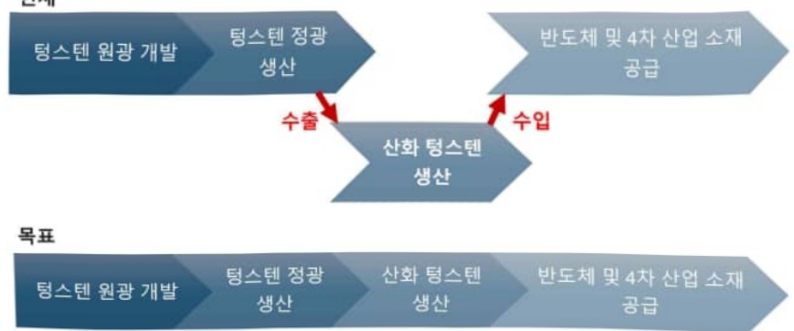
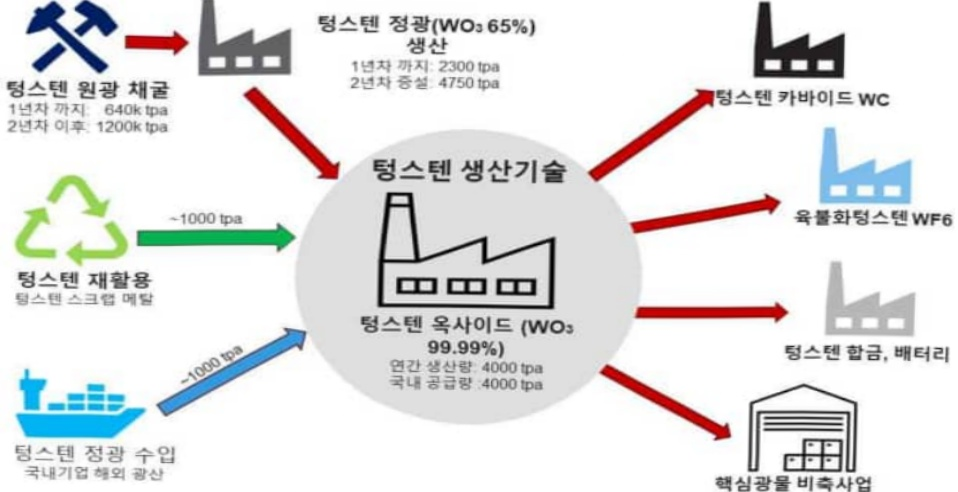
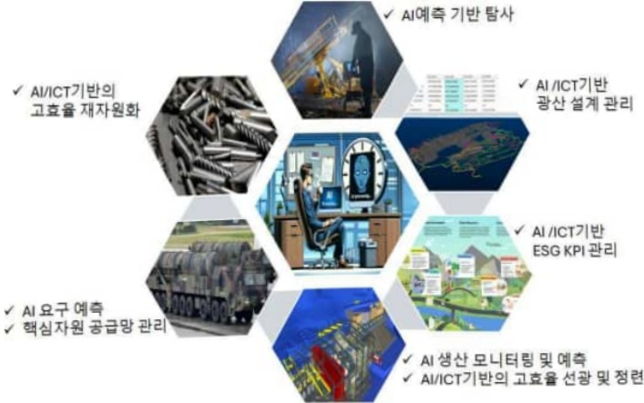
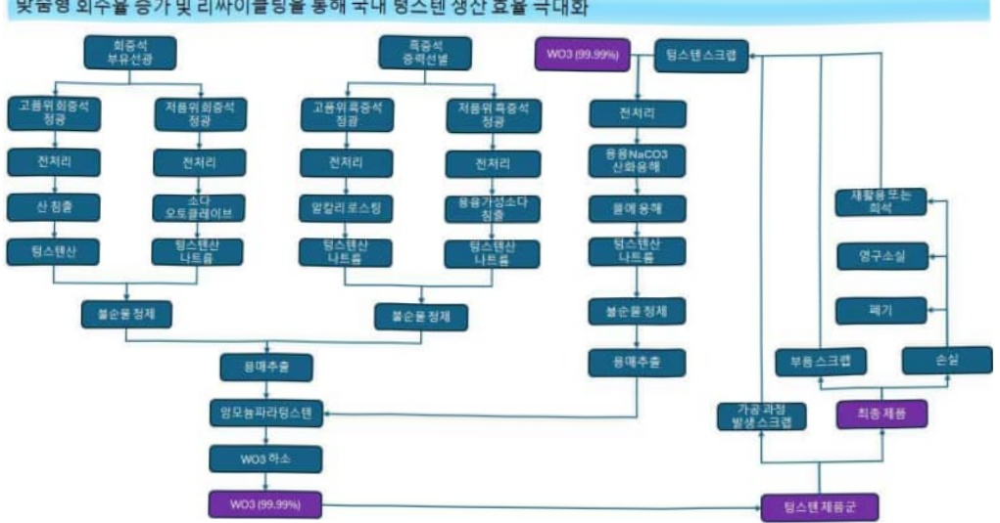
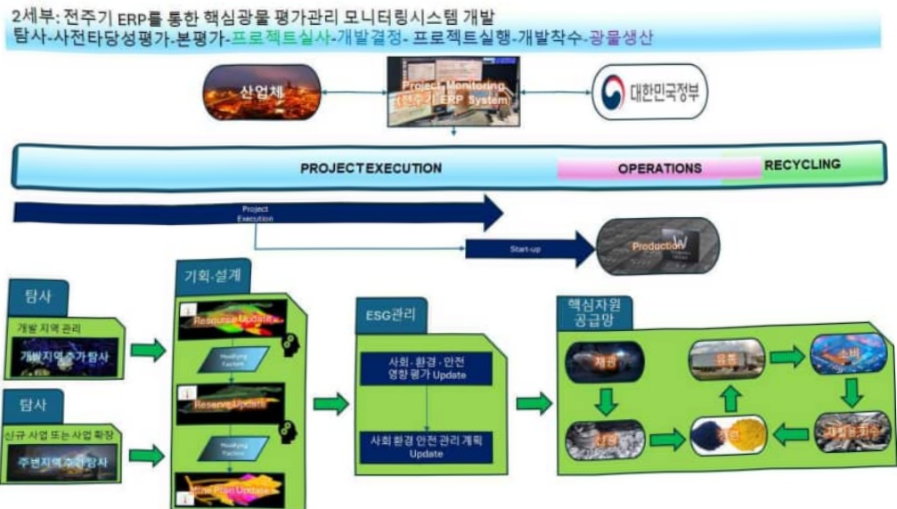

# 자원안보를위한고부가가치한국형텅스텐전주기기술개발및실…

**해당 페이지**: PDF 4280 ~ 4296 쪽 해당

**부처**: 산업통상부
**분야**: 산업·중소기업 및 에너지
**회계유형**: 특별회계
**2026 확정예산**: 4000.0 백만원
**전년대비 증감률**: None%
**AI 도메인**: 기타

---

<table border=1 style='margin: auto; word-wrap: break-word;'><tr><td style='text-align: center; word-wrap: break-word;'>사 업 명</td></tr><tr><td style='text-align: center; word-wrap: break-word;'>(1) 자원안보를 위한 고부가가치 한국형 텅스텐 전주기 기술 개발 및 실증 (5702-317)</td></tr></table>

## □ 사업 코드 정보

<table border=1 style='margin: auto; word-wrap: break-word;'><tr><td style='text-align: center; word-wrap: break-word;'>구분</td><td style='text-align: center; word-wrap: break-word;'>기금</td><td style='text-align: center; word-wrap: break-word;'>소관</td><td style='text-align: center; word-wrap: break-word;'>실국(기관)</td><td style='text-align: center; word-wrap: break-word;'>계정</td><td style='text-align: center; word-wrap: break-word;'>분야</td><td style='text-align: center; word-wrap: break-word;'>부문</td></tr><tr><td style='text-align: center; word-wrap: break-word;'>코드</td><td rowspan="2">에너지및자원사업특별회계</td><td rowspan="2">산업통상부</td><td rowspan="2">자원산업정책국</td><td rowspan="2">투자계정</td><td style='text-align: center; word-wrap: break-word;'>110</td><td style='text-align: center; word-wrap: break-word;'>115</td></tr><tr><td style='text-align: center; word-wrap: break-word;'>명칭</td><td style='text-align: center; word-wrap: break-word;'>산업·중소기업 및 에너지</td><td style='text-align: center; word-wrap: break-word;'>에너지 및 자원개발</td></tr></table>

<table border=1 style='margin: auto; word-wrap: break-word;'><tr><td style='text-align: center; word-wrap: break-word;'>구분</td><td style='text-align: center; word-wrap: break-word;'>프로그램</td><td style='text-align: center; word-wrap: break-word;'>단위사업</td><td style='text-align: center; word-wrap: break-word;'>세부사업</td></tr><tr><td style='text-align: center; word-wrap: break-word;'>코드</td><td style='text-align: center; word-wrap: break-word;'>5700</td><td style='text-align: center; word-wrap: break-word;'>5702</td><td style='text-align: center; word-wrap: break-word;'>317</td></tr><tr><td style='text-align: center; word-wrap: break-word;'>명칭</td><td style='text-align: center; word-wrap: break-word;'>에너지기술개발</td><td style='text-align: center; word-wrap: break-word;'>에너지공급기술</td><td style='text-align: center; word-wrap: break-word;'>자원안보를 위한 고부가가치한국형 텅스텐 전주기 기술개발 및 실증</td></tr></table>

사업 성격 (공통요구자료 II-1 작성유의사항 4. 참조, 해당하는 사항에 “0” 표시)

<table border=1 style='margin: auto; word-wrap: break-word;'><tr><td rowspan="2">신규 계속</td><td rowspan="2">환료</td><td rowspan="2">예비타당성 실시여부</td><td rowspan="2">총사업비 관리대상</td><td rowspan="2">총액계상 예산사업</td><td style='text-align: center; word-wrap: break-word;'>사업소관 변경정보</td></tr><tr><td style='text-align: center; word-wrap: break-word;'>2025예산 시 소관</td></tr><tr><td style='text-align: center; word-wrap: break-word;'>☐</td><td style='text-align: center; word-wrap: break-word;'></td><td style='text-align: center; word-wrap: break-word;'></td><td style='text-align: center; word-wrap: break-word;'></td><td style='text-align: center; word-wrap: break-word;'></td><td style='text-align: center; word-wrap: break-word;'></td></tr></table>

사업 지원 형태 및 지원을 (최소한 한 개는 반드시 선택하시오. 해당사항에 O 표시)

<table border=1 style='margin: auto; word-wrap: break-word;'><tr><td style='text-align: center; word-wrap: break-word;'>직접</td><td style='text-align: center; word-wrap: break-word;'>출자</td><td style='text-align: center; word-wrap: break-word;'>출연</td><td style='text-align: center; word-wrap: break-word;'>보조</td><td style='text-align: center; word-wrap: break-word;'>융자</td><td style='text-align: center; word-wrap: break-word;'>국고보조율(%)</td><td style='text-align: center; word-wrap: break-word;'>융자율(%)</td></tr><tr><td style='text-align: center; word-wrap: break-word;'></td><td style='text-align: center; word-wrap: break-word;'></td><td style='text-align: center; word-wrap: break-word;'>○</td><td style='text-align: center; word-wrap: break-word;'></td><td style='text-align: center; word-wrap: break-word;'></td><td style='text-align: center; word-wrap: break-word;'></td><td style='text-align: center; word-wrap: break-word;'></td></tr></table>

## 사업 담당자

<table border=1 style='margin: auto; word-wrap: break-word;'><tr><td style='text-align: center; word-wrap: break-word;'>사업명</td><td colspan="5">구분</td></tr><tr><td rowspan="4">자원안보를 위한 고부가가치 한국형 텅스텐 전주기 기술 개발 및 실증</td><td rowspan="3">소관부처</td><td style='text-align: center; word-wrap: break-word;'>실·국·과(팀)</td><td style='text-align: center; word-wrap: break-word;'>과 장</td><td style='text-align: center; word-wrap: break-word;'>서기관</td><td style='text-align: center; word-wrap: break-word;'>주무관</td></tr><tr><td style='text-align: center; word-wrap: break-word;'>자원산업정책국</td><td style='text-align: center; word-wrap: break-word;'>정민규 팀장</td><td style='text-align: center; word-wrap: break-word;'>최재영</td><td style='text-align: center; word-wrap: break-word;'></td></tr><tr><td style='text-align: center; word-wrap: break-word;'>광물자원팀</td><td style='text-align: center; word-wrap: break-word;'>044)203-5259</td><td style='text-align: center; word-wrap: break-word;'>044)203-5257</td><td style='text-align: center; word-wrap: break-word;'></td></tr><tr><td style='text-align: center; word-wrap: break-word;'>사업시행주체</td><td style='text-align: center; word-wrap: break-word;'>한국에너지기술 평가원</td><td style='text-align: center; word-wrap: break-word;'>자원·CCUS실</td><td style='text-align: center; word-wrap: break-word;'>김남훈 선임</td><td style='text-align: center; word-wrap: break-word;'>02)3469-8395</td></tr></table>

---

### 가.예산 총괄표

(단위:백만원,%)

<table border=1 style='margin: auto; word-wrap: break-word;'><tr><td rowspan="2">목명</td><td rowspan="2">2024년 결산</td><td colspan="2">2025년 예산</td><td colspan="2">2026년</td><td rowspan="2">증감 (B-A)</td><td rowspan="2">(B-A)/A</td></tr><tr><td style='text-align: center; word-wrap: break-word;'>본예산(A)</td><td style='text-align: center; word-wrap: break-word;'>추경</td><td style='text-align: center; word-wrap: break-word;'>요구안</td><td style='text-align: center; word-wrap: break-word;'>확정(B)</td></tr><tr><td style='text-align: center; word-wrap: break-word;'>자원안보를 위한 고부가가치 한국형 텅스텐 전주기 기술 개발 및 실증</td><td style='text-align: center; word-wrap: break-word;'>-</td><td style='text-align: center; word-wrap: break-word;'>-</td><td style='text-align: center; word-wrap: break-word;'>-</td><td style='text-align: center; word-wrap: break-word;'>4,000</td><td style='text-align: center; word-wrap: break-word;'>4,000</td><td style='text-align: center; word-wrap: break-word;'>순증</td><td style='text-align: center; word-wrap: break-word;'>순증</td></tr></table>

□ 기능별(내역사업별), 목별 예산 내역

(단위:백만원

<table border=1 style='margin: auto; word-wrap: break-word;'><tr><td rowspan="3"></td><td colspan="5">2024</td><td colspan="7">2025(2025.12월말)</td><td rowspan="3">2026예산</td></tr><tr><td rowspan="2">예산액(추경)</td><td rowspan="2">예산현액</td><td rowspan="2">집행액[실집행액]</td><td rowspan="2">이월액</td><td rowspan="2">불용액</td><td rowspan="2">본예산</td><td rowspan="2">예산현액</td><td rowspan="2">집행액[실집행액]</td><td colspan="2">전년도이월액제외</td><td rowspan="2">이월예상액</td><td rowspan="2">불용예상액</td></tr><tr><td style='text-align: center; word-wrap: break-word;'>예산현액</td><td style='text-align: center; word-wrap: break-word;'>집행액[실집행액]</td></tr><tr><td style='text-align: center; word-wrap: break-word;'>○ 기능별 분류(합계)</td><td style='text-align: center; word-wrap: break-word;'>-</td><td style='text-align: center; word-wrap: break-word;'>-</td><td style='text-align: center; word-wrap: break-word;'>-</td><td style='text-align: center; word-wrap: break-word;'>-</td><td style='text-align: center; word-wrap: break-word;'>-</td><td style='text-align: center; word-wrap: break-word;'>-</td><td style='text-align: center; word-wrap: break-word;'>-</td><td style='text-align: center; word-wrap: break-word;'>-</td><td style='text-align: center; word-wrap: break-word;'>-</td><td style='text-align: center; word-wrap: break-word;'>-</td><td style='text-align: center; word-wrap: break-word;'>-</td><td style='text-align: center; word-wrap: break-word;'>-</td><td style='text-align: center; word-wrap: break-word;'>4,000</td></tr><tr><td style='text-align: center; word-wrap: break-word;'>· 자원안보를 위한 고부가가치 한국형 텅스텐 전주기 기술 개발 및 실증</td><td style='text-align: center; word-wrap: break-word;'>-</td><td style='text-align: center; word-wrap: break-word;'>-</td><td style='text-align: center; word-wrap: break-word;'>-</td><td style='text-align: center; word-wrap: break-word;'>-</td><td style='text-align: center; word-wrap: break-word;'>-</td><td style='text-align: center; word-wrap: break-word;'>-</td><td style='text-align: center; word-wrap: break-word;'>-</td><td style='text-align: center; word-wrap: break-word;'>-</td><td style='text-align: center; word-wrap: break-word;'>-</td><td style='text-align: center; word-wrap: break-word;'>-</td><td style='text-align: center; word-wrap: break-word;'>-</td><td style='text-align: center; word-wrap: break-word;'>-</td><td style='text-align: center; word-wrap: break-word;'>4,000</td></tr><tr><td style='text-align: center; word-wrap: break-word;'>○ 비목별 분류(합계)</td><td style='text-align: center; word-wrap: break-word;'>-</td><td style='text-align: center; word-wrap: break-word;'>-</td><td style='text-align: center; word-wrap: break-word;'>-</td><td style='text-align: center; word-wrap: break-word;'>-</td><td style='text-align: center; word-wrap: break-word;'>-</td><td style='text-align: center; word-wrap: break-word;'>-</td><td style='text-align: center; word-wrap: break-word;'>-</td><td style='text-align: center; word-wrap: break-word;'>-</td><td style='text-align: center; word-wrap: break-word;'>-</td><td style='text-align: center; word-wrap: break-word;'>-</td><td style='text-align: center; word-wrap: break-word;'>-</td><td style='text-align: center; word-wrap: break-word;'>-</td><td style='text-align: center; word-wrap: break-word;'>4,000</td></tr><tr><td style='text-align: center; word-wrap: break-word;'>· 연구개발활동비 등(360-05)</td><td style='text-align: center; word-wrap: break-word;'>-</td><td style='text-align: center; word-wrap: break-word;'>-</td><td style='text-align: center; word-wrap: break-word;'>-</td><td style='text-align: center; word-wrap: break-word;'>-</td><td style='text-align: center; word-wrap: break-word;'>-</td><td style='text-align: center; word-wrap: break-word;'>-</td><td style='text-align: center; word-wrap: break-word;'>-</td><td style='text-align: center; word-wrap: break-word;'>-</td><td style='text-align: center; word-wrap: break-word;'>-</td><td style='text-align: center; word-wrap: break-word;'>-</td><td style='text-align: center; word-wrap: break-word;'>-</td><td style='text-align: center; word-wrap: break-word;'>-</td><td style='text-align: center; word-wrap: break-word;'>4,000</td></tr><tr><td style='text-align: center; word-wrap: break-word;'>○ 기능비목별 분류(합계)</td><td style='text-align: center; word-wrap: break-word;'>-</td><td style='text-align: center; word-wrap: break-word;'>-</td><td style='text-align: center; word-wrap: break-word;'>-</td><td style='text-align: center; word-wrap: break-word;'>-</td><td style='text-align: center; word-wrap: break-word;'>-</td><td style='text-align: center; word-wrap: break-word;'>-</td><td style='text-align: center; word-wrap: break-word;'>-</td><td style='text-align: center; word-wrap: break-word;'>-</td><td style='text-align: center; word-wrap: break-word;'>-</td><td style='text-align: center; word-wrap: break-word;'>-</td><td style='text-align: center; word-wrap: break-word;'>-</td><td style='text-align: center; word-wrap: break-word;'>-</td><td style='text-align: center; word-wrap: break-word;'>4,000</td></tr><tr><td style='text-align: center; word-wrap: break-word;'>· 자원안보를 위한 고부가가치 한국형 텅스텐 전주기 기술 개발 및 실증
- 연구개발활동비 등(360-05)</td><td style='text-align: center; word-wrap: break-word;'>-</td><td style='text-align: center; word-wrap: break-word;'>-</td><td style='text-align: center; word-wrap: break-word;'>-</td><td style='text-align: center; word-wrap: break-word;'>-</td><td style='text-align: center; word-wrap: break-word;'>-</td><td style='text-align: center; word-wrap: break-word;'>-</td><td style='text-align: center; word-wrap: break-word;'>-</td><td style='text-align: center; word-wrap: break-word;'>-</td><td style='text-align: center; word-wrap: break-word;'>-</td><td style='text-align: center; word-wrap: break-word;'>-</td><td style='text-align: center; word-wrap: break-word;'>-</td><td style='text-align: center; word-wrap: break-word;'>-</td><td style='text-align: center; word-wrap: break-word;'>4,000</td></tr></table>

---

### 나. 사업설명자료

## 1 ) 사업목적·내용

- (자원안보를 위한 고부가가치 한국형 텅스텐 전주기 기술 개발 및 실증) 국가핵심 광물의 특정국 의존도를 낮추고, 자력 공급망을 갖추기 위하여 국내 부존 핵심광물인 텅스텐 광물(회중석)의 고효율 생산기술, 전주기 모니터링 및 실증을 통한 산화텅스텐 국내 내수량 확보

## 2 ) 사업개요

□ 사업근거 및 추진경위

① 법령상 근거 및 조항 적시

-에너지법 제14조(에너지기술개발사업비)

-광업법 제86조(광업발전을 위한 지원)

-광업법시행령 제62조(광업발전을 위한 지원)

-산업기술혁신촉진법 제3장(산업기술개발사업의 추진 및 사업화)

- 국가자원안보특별법 제13조(국내 핵심광물 생산기반 확충 정부 지원, '24)

② 추진경위

- '20.4' '자원기술 R&D 투자 혁신전략'(관계부처 합동, 과기관계장관회의)

- '20.5 월 자원개발기본계획('20~'29)

* 해외(제6차 해외자원개발 기본계획) 및 국내(제3차 해저광물자원개발 기본계획) 계획 통합

- '21.8 월 희소금속산업발전대책 2.0

- '23.2 월 핵심광물 확보전략

*국가 첨단산업(반도체, 이차전지 등)에 필수적인 원료광물을 대상으로 공급리스크, 경제적 파급력 등을 평가하여 33종의 핵심광물(리튬, 니켈, 희토류, 코발트, 망가 등) 서적

- '24.1월 국가자원안보 특별법

- '25.1 월 제4차 광업기본계획('25~34)

## □ 주요내용

① 사업규모

- 총사업비(해당되는 경우에만 기재) : 해당없음

- 사업기간 : '26~'30(5년)

- 최근 5년 간 투입된 사업비(예산액기준, 추경편성한 연도에는 추경포함)

<table border=1 style='margin: auto; word-wrap: break-word;'><tr><td style='text-align: center; word-wrap: break-word;'>연도</td><td style='text-align: center; word-wrap: break-word;'>2022</td><td style='text-align: center; word-wrap: break-word;'>2023</td><td style='text-align: center; word-wrap: break-word;'>2024</td><td style='text-align: center; word-wrap: break-word;'>2025</td><td style='text-align: center; word-wrap: break-word;'>2026</td></tr><tr><td style='text-align: center; word-wrap: break-word;'>사업비</td><td style='text-align: center; word-wrap: break-word;'>-</td><td style='text-align: center; word-wrap: break-word;'>-</td><td style='text-align: center; word-wrap: break-word;'>-</td><td style='text-align: center; word-wrap: break-word;'>-</td><td style='text-align: center; word-wrap: break-word;'>4,000</td></tr></table>

---

## ② 사업추진체계

- 사업시행방법 : 출연(33~100% 정부 지원)

- 사업시행주체 : 산 · 학 · 연

- 사업 수혜자 : 산 · 학 · 연 등 자원개발 관계기관

- 보조, 융자, 출연, 출자 등의 경우 보조 · 융자 등 지원 비율 및 법적근거

<table border=1 style='margin: auto; word-wrap: break-word;'><tr><td style='text-align: center; word-wrap: break-word;'>내역사업명</td><td style='text-align: center; word-wrap: break-word;'>구분</td><td style='text-align: center; word-wrap: break-word;'>피보조·피출연 등 기관명</td><td style='text-align: center; word-wrap: break-word;'>지원 금액 (2026예산)</td><td style='text-align: center; word-wrap: break-word;'>지원 비율(%)</td><td style='text-align: center; word-wrap: break-word;'>보조율 법적근거 (해당 조항)</td></tr><tr><td style='text-align: center; word-wrap: break-word;'>자원안보를 위한 고부가가치 한국형 텅스텐 전주기 기술 개발 및 실증</td><td style='text-align: center; word-wrap: break-word;'>출연</td><td style='text-align: center; word-wrap: break-word;'>산·학·연 등 자원개발 관계기관</td><td style='text-align: center; word-wrap: break-word;'>4,000 백만원</td><td style='text-align: center; word-wrap: break-word;'>연구수행 형태에 따라 연구비의 33~100% 지원</td><td style='text-align: center; word-wrap: break-word;'>산업기술혁신사업 공통운영요령 제24조(출연금의 지원기준)</td></tr></table>

## 3 ) 2026년도 예산 산출 근거

① 자원안보를 위한 고부가가치 한국형 텅스텐 전주기 기술 개발 및 실증

:(2025 본예산)→(2026 예산)4,000백만원,순증

- (요구) AI 기반 친환경 텅스텐 소재화·재자원화 공정 기술개발 등 3개 신규과제 지원

- (산출) 1,778백만원 × 3개 신규과제 × 9/12 개월 = 4,000백만원

2025년도 예산 및 2026년도 예산 산출 세부내역 비교

<table border=1 style='margin: auto; word-wrap: break-word;'><tr><td colspan="2">2025년 본예산</td><td colspan="2">2026년 예산</td></tr><tr><td style='text-align: center; word-wrap: break-word;'>예산</td><td style='text-align: center; word-wrap: break-word;'>산출내역</td><td style='text-align: center; word-wrap: break-word;'>예산</td><td style='text-align: center; word-wrap: break-word;'>산출내역</td></tr><tr><td style='text-align: center; word-wrap: break-word;'>-</td><td style='text-align: center; word-wrap: break-word;'>-</td><td style='text-align: center; word-wrap: break-word;'>4,000 백만원</td><td style='text-align: center; word-wrap: break-word;'>○ 연구개발활동비(360-05): 4,000백만원○ (26년) 국가자원안보를 위한 텅스텐 생산기술 국산화 기술개발(탐사·설계·채굴·선광·제련·공급망 구축·제도 등) 및 AI기반 전주기 관리시스템 구축 등 3개 신규과제 지원- (산출) 1,778백만원 × 3개 신규과제 X 9/12개월= 4,000백만원* (전환경 공정) 2,000백만원, (장비 국산화) 1,000백만원, (시스템) 1,000백만원</td></tr></table>

---

## 4 ) 사업효과

□ 사업영향, 산출물 성과지표 등

① 2022~2026년도 성과계획서 상 성과지표 및 최근 5년간 성과 달성도

<table border=1 style='margin: auto; word-wrap: break-word;'><tr><td style='text-align: center; word-wrap: break-word;'>성과지표</td><td style='text-align: center; word-wrap: break-word;'>구분</td><td style='text-align: center; word-wrap: break-word;'>2022</td><td style='text-align: center; word-wrap: break-word;'>2023</td><td style='text-align: center; word-wrap: break-word;'>2024</td><td style='text-align: center; word-wrap: break-word;'>2025</td><td style='text-align: center; word-wrap: break-word;'>2026</td><td style='text-align: center; word-wrap: break-word;'>2026 목표치산출근거</td><td style='text-align: center; word-wrap: break-word;'>측정산식(또는 측정방법)</td><td style='text-align: center; word-wrap: break-word;'>자료수집방법(또는 자료출처)</td></tr><tr><td rowspan="3">①사업화매출액(단위: 억원)</td><td style='text-align: center; word-wrap: break-word;'>목표</td><td style='text-align: center; word-wrap: break-word;'>신규</td><td style='text-align: center; word-wrap: break-word;'>신규</td><td style='text-align: center; word-wrap: break-word;'>신규</td><td style='text-align: center; word-wrap: break-word;'>신규</td><td style='text-align: center; word-wrap: break-word;'>12.5</td><td rowspan="3">최근 3년(22~24) 평균치사업화매출액의 3% 상향인 12.5억원으로 설정</td><td rowspan="3">∑에너지기술개발사업사업화매출액(억원) / 정부지원금(10억원)</td><td rowspan="3">국가과학기술지식정보서비스(NTIS) 등록값, 주관기관 취합 및 성과조사분석 보고서</td></tr><tr><td style='text-align: center; word-wrap: break-word;'>실적</td><td style='text-align: center; word-wrap: break-word;'>신규</td><td style='text-align: center; word-wrap: break-word;'>신규</td><td style='text-align: center; word-wrap: break-word;'>신규</td><td style='text-align: center; word-wrap: break-word;'>-</td><td style='text-align: center; word-wrap: break-word;'>-</td></tr><tr><td style='text-align: center; word-wrap: break-word;'>달성도</td><td style='text-align: center; word-wrap: break-word;'>신규</td><td style='text-align: center; word-wrap: break-word;'>신규</td><td style='text-align: center; word-wrap: break-word;'>신규</td><td style='text-align: center; word-wrap: break-word;'>-</td><td style='text-align: center; word-wrap: break-word;'>-</td></tr><tr><td rowspan="3">②등록특허SMART 평균(단위: 점)</td><td style='text-align: center; word-wrap: break-word;'>목표</td><td style='text-align: center; word-wrap: break-word;'>4.26</td><td style='text-align: center; word-wrap: break-word;'>4.26</td><td style='text-align: center; word-wrap: break-word;'>-</td><td style='text-align: center; word-wrap: break-word;'>-</td><td style='text-align: center; word-wrap: break-word;'>-</td><td rowspan="3">과거 성과지표</td><td rowspan="3">당해연도 등록특허의 SMART분석결과 평균값</td><td rowspan="3">주관기관 취합 및 성과조사분석 보고서</td></tr><tr><td style='text-align: center; word-wrap: break-word;'>실적</td><td style='text-align: center; word-wrap: break-word;'>3.82</td><td style='text-align: center; word-wrap: break-word;'>3.82</td><td style='text-align: center; word-wrap: break-word;'>-</td><td style='text-align: center; word-wrap: break-word;'>-</td><td style='text-align: center; word-wrap: break-word;'>-</td></tr><tr><td style='text-align: center; word-wrap: break-word;'>달성도</td><td style='text-align: center; word-wrap: break-word;'>89.7</td><td style='text-align: center; word-wrap: break-word;'>89.7</td><td style='text-align: center; word-wrap: break-word;'>-</td><td style='text-align: center; word-wrap: break-word;'>-</td><td style='text-align: center; word-wrap: break-word;'>-</td></tr><tr><td rowspan="3">③사업화율*(단위: %)</td><td style='text-align: center; word-wrap: break-word;'>목표</td><td style='text-align: center; word-wrap: break-word;'>35.4</td><td style='text-align: center; word-wrap: break-word;'>39.2</td><td style='text-align: center; word-wrap: break-word;'>39.5</td><td style='text-align: center; word-wrap: break-word;'>42.9</td><td style='text-align: center; word-wrap: break-word;'>-</td><td rowspan="3">과거 성과지표</td><td rowspan="3">{∑사업화과제수(최근5년)/∑(종료과제수-사업화비대상과제수)(최근5년) |*100</td><td rowspan="3">주관기관 취합 및 성과조사분석 보고서</td></tr><tr><td style='text-align: center; word-wrap: break-word;'>실적</td><td style='text-align: center; word-wrap: break-word;'>42.2</td><td style='text-align: center; word-wrap: break-word;'>46.5</td><td style='text-align: center; word-wrap: break-word;'>(40.8)</td><td style='text-align: center; word-wrap: break-word;'>-</td><td style='text-align: center; word-wrap: break-word;'>-</td></tr><tr><td style='text-align: center; word-wrap: break-word;'>달성도</td><td style='text-align: center; word-wrap: break-word;'>119.2</td><td style='text-align: center; word-wrap: break-word;'>118.6</td><td style='text-align: center; word-wrap: break-word;'>(101.5)</td><td style='text-align: center; word-wrap: break-word;'>-</td><td style='text-align: center; word-wrap: break-word;'>-</td></tr><tr><td rowspan="3">④온실가스감축량(단위: tCO2eq)**</td><td style='text-align: center; word-wrap: break-word;'>목표</td><td style='text-align: center; word-wrap: break-word;'>신규</td><td style='text-align: center; word-wrap: break-word;'>-</td><td style='text-align: center; word-wrap: break-word;'>-</td><td style='text-align: center; word-wrap: break-word;'>-</td><td style='text-align: center; word-wrap: break-word;'>-</td><td rowspan="3">과거 성과지표</td><td rowspan="3">프로그램내해당 사업별 온실가스감축인지서의∑온실가스감축량</td><td rowspan="3">온실가스 감축인지서(예·결산)</td></tr><tr><td style='text-align: center; word-wrap: break-word;'>실적</td><td style='text-align: center; word-wrap: break-word;'>신규</td><td style='text-align: center; word-wrap: break-word;'>-</td><td style='text-align: center; word-wrap: break-word;'>-</td><td style='text-align: center; word-wrap: break-word;'>-</td><td style='text-align: center; word-wrap: break-word;'>-</td></tr><tr><td style='text-align: center; word-wrap: break-word;'>달성도</td><td style='text-align: center; word-wrap: break-word;'>신규</td><td style='text-align: center; word-wrap: break-word;'>-</td><td style='text-align: center; word-wrap: break-word;'>-</td><td style='text-align: center; word-wrap: break-word;'>-</td><td style='text-align: center; word-wrap: break-word;'>-</td></tr></table>

* '24년부터 기재부 지침에 따라 '1프로그램 1성과지표'를 원칙

** R&D 사업의 특성상 '24년 실증단계 진입 이후 성과지표 수치화 가능으로 '23년 목표치 미설정

② 성과지표 이외의 연도별 사업추진 경과 및 실적 : 해당없음

---

③향후(2026년도 이후)기대효과

○ 고도화된 자원개발 및 관리 기술과 재활용 기술 확보

- 자원 안보를 위한 안전적인 공급망 구축과 모니터링 기술 확보

* (자원안보특별법) 전략광물의 공급망 관리 : 실시간 관리·AI 미래예측, 폐령스텐 재자원화

- 유한자원의 장기간 확보를 위한 핵심광물개발 원천기술 확보

* (제4차 광업 기본계획) 핵심광물 공급 기반 강화 : 텅스텐 자립 0% → (2030년) 100% 자립

- 전략적 개발 계획, 추가 가채매장량, 생산 회수율 증대, OPEX 최적화

등의 확보로 인한 국내 텍스텐 광산 지속 가능성 및 공급망 안정화 증대

* (제4차 광업 기본계획 비전) 미래·디지털·친환경 광업 생태계 조성 : 광산개발인증/평가 제도

AI/ICT기술 접목으로 핵심광물 개발의 미래 성장 동력 확보

- 국내 핵심광물 개발의 전략적 개발 시스템 구축

* (제4차 광업 기본계획 비전) 미래·디지털·친환경 광업 생태계 조성 : 광산개발인증/평가 제도

- 미래 기술 접목으로 지속적 발전이 가능한 개발 모델 제시

* (제4차 광업 기본계획) 디지털 기반 광업 경쟁력 제고 : 전주기 AI/ICT 기술 도입

o 국내 텅스텐 광산 지속 가능성 증대

- 전략적 개발 계획, 추가 가채매장량, 생산 회수율 증대, OPEX 최적화 등의 확보로 인한 광산 수명 및 공급망 안정화 기간 증대

* (제4차 광업 기본계획 비전) 미래·디지털·친환경 광업 생태계 조성 : 광산개발인증/평가 제도

그림 1 텅스텐 국내 공급망 확대 목표안

5) 타당성조사 및 예비타당성조사 시행여부 및 결과 요지: 해당없음

6) 총사업비 대상사업 여부 및 내역: 해당없음

---

<table border=1 style='margin: auto; word-wrap: break-word;'><tr><td style='text-align: center; word-wrap: break-word;'>주요 내용</td><td style='text-align: center; word-wrap: break-word;'>수행 주체 등</td><td style='text-align: center; word-wrap: break-word;'>관련 병행 및 유경, 지원</td></tr><tr><td style='text-align: center; word-wrap: break-word;'>해당 연도 추진방향 설정(실행계획 수립 등)</td><td style='text-align: center; word-wrap: break-word;'>산업통상부</td><td style='text-align: center; word-wrap: break-word;'>에너지법 제11조(에너지기술개발계획)</td></tr><tr><td style='text-align: center; word-wrap: break-word;'>기술수요조사</td><td style='text-align: center; word-wrap: break-word;'>전문기관</td><td style='text-align: center; word-wrap: break-word;'>산업기술혁신사업 공통운영요령제11조, 산업기술혁신산업 기술개발평가관리지침 제13조 등</td></tr><tr><td style='text-align: center; word-wrap: break-word;'>기획대상과제 도출/과제기획수행</td><td style='text-align: center; word-wrap: break-word;'>기획위원회/PD</td><td style='text-align: center; word-wrap: break-word;'>산업기술혁신사업 공통운영요령,산업기술혁신산업 기술개발평가관리지침 제3장</td></tr><tr><td style='text-align: center; word-wrap: break-word;'>기획과제의 목표 검토</td><td style='text-align: center; word-wrap: break-word;'>기획위원회/목표검증단</td><td style='text-align: center; word-wrap: break-word;'>산업기술혁신산업 기술개발평가관리지침 제3장</td></tr><tr><td style='text-align: center; word-wrap: break-word;'>신규지원대상과제 및 예산(안) 심의·확정</td><td style='text-align: center; word-wrap: break-word;'>산업통상부(사업별 심의위원회)</td><td style='text-align: center; word-wrap: break-word;'>산업기술혁신사업 공통운영요령,산업기술혁신산업 기술개발평가관리지침 제3장</td></tr><tr><td style='text-align: center; word-wrap: break-word;'>신규 사업 공고</td><td style='text-align: center; word-wrap: break-word;'>산업통상부</td><td style='text-align: center; word-wrap: break-word;'>산업기술혁신사업 공통운영요령,산업기술혁신산업 기술개발평가관리지침 제3장</td></tr><tr><td style='text-align: center; word-wrap: break-word;'>사업계획서 접수/신청과제평가</td><td style='text-align: center; word-wrap: break-word;'>주관기관 → 전문기관(평가위원회)</td><td style='text-align: center; word-wrap: break-word;'>산업기술혁신사업 공통운영요령,산업기술혁신산업 기술개발평가관리지침 제4장</td></tr><tr><td style='text-align: center; word-wrap: break-word;'>지원대상과제 및 사업자 확정</td><td style='text-align: center; word-wrap: break-word;'>전문기관 → 산업통상부</td><td style='text-align: center; word-wrap: break-word;'>산업기술혁신사업 공통운영요령,산업기술혁신산업 기술개발평가관리지침 제4장</td></tr><tr><td style='text-align: center; word-wrap: break-word;'>선정과제 협약 체결</td><td style='text-align: center; word-wrap: break-word;'>전문기관→주관기관(참여기관)</td><td style='text-align: center; word-wrap: break-word;'>산업기술혁신사업 공통운영요령,산업기술혁신산업 기술개발평가관리지침 제5장</td></tr><tr><td style='text-align: center; word-wrap: break-word;'>중간 평가</td><td style='text-align: center; word-wrap: break-word;'>주관기관→전문기관→산업통상부</td><td style='text-align: center; word-wrap: break-word;'>산업기술혁신사업 공통운영요령,산업기술혁신산업 기술개발평가관리지침 제6장</td></tr><tr><td style='text-align: center; word-wrap: break-word;'>사업비 정산</td><td style='text-align: center; word-wrap: break-word;'>주관기관→전문기관/위탁정산기관</td><td style='text-align: center; word-wrap: break-word;'>산업기술혁신사업 공통운영요령,산업기술혁신산업 사업비 산정 관리 및 사용정산에 핀핵 요령</td></tr><tr><td style='text-align: center; word-wrap: break-word;'>단계 평가</td><td style='text-align: center; word-wrap: break-word;'>주관기관→전문기관→산업통상부</td><td style='text-align: center; word-wrap: break-word;'>산업기술혁신사업 공통운영요령,산업기술혁신산업 기술개발평가관리지침 제6장</td></tr><tr><td style='text-align: center; word-wrap: break-word;'>사업비 정산</td><td style='text-align: center; word-wrap: break-word;'>주관기관→전문기관/위탁정산기관</td><td style='text-align: center; word-wrap: break-word;'>산업기술혁신사업 공통운영요령,산업기술혁신산업 사업비 산정 관리 및 사용정산에 핀핵 요령</td></tr><tr><td style='text-align: center; word-wrap: break-word;'>차기 단계 협약 체결</td><td style='text-align: center; word-wrap: break-word;'>전문기관→주관기관(참여기관)</td><td style='text-align: center; word-wrap: break-word;'>산업기술혁신사업 공통운영요령,산업기술혁신산업 기술개발평가관리지침 제6장</td></tr><tr><td style='text-align: center; word-wrap: break-word;'>최종 평가</td><td style='text-align: center; word-wrap: break-word;'>주관기관→전문기관 → 산업통상부</td><td style='text-align: center; word-wrap: break-word;'>산업기술혁신사업 공통운영요령,산업기술혁신산업 기술개발평가관리지침 제6장</td></tr><tr><td style='text-align: center; word-wrap: break-word;'>사업비 정산</td><td style='text-align: center; word-wrap: break-word;'>주관기관→전문기관/위탁정산기관</td><td style='text-align: center; word-wrap: break-word;'>산업기술혁신사업 공통운영요령,산업기술혁신산업 사업비 산정 관리 및 사용정산에 핀핵 요령</td></tr><tr><td style='text-align: center; word-wrap: break-word;'>기술료 정수</td><td style='text-align: center; word-wrap: break-word;'>주관기관→전문기관</td><td style='text-align: center; word-wrap: break-word;'>산업기술혁신사업 공통운영요령,기술료 정수 및 관리에 관한 통합요령</td></tr><tr><td style='text-align: center; word-wrap: break-word;'>성과활용 보고 및 평가 등사후관리</td><td style='text-align: center; word-wrap: break-word;'>주관기관→전문기관</td><td style='text-align: center; word-wrap: break-word;'>산업기술혁신사업 공통운영요령 제6장, 산업기술혁신산업 기술개발평가관리지침 제6장</td></tr><tr><td style='text-align: center; word-wrap: break-word;'>부처</td><td style='text-align: center; word-wrap: break-word;'>피출연·피보조기관</td><td style='text-align: center; word-wrap: break-word;'>간접보조사업자·사업수행자</td></tr><tr><td style='text-align: center; word-wrap: break-word;'>산업통상부(4,000 맥만원)</td><td style='text-align: center; word-wrap: break-word;'>한국에너지기술평가원</td><td style='text-align: center; word-wrap: break-word;'>(26년4월 협약 예정)</td></tr></table>

---

8) 중기재정계획 상 연도별 투자계획 및 추진경과

(단위:백만원)

<table border=1 style='margin: auto; word-wrap: break-word;'><tr><td style='text-align: center; word-wrap: break-word;'>중기 재정계획</td><td style='text-align: center; word-wrap: break-word;'>2024</td><td style='text-align: center; word-wrap: break-word;'>2025</td><td style='text-align: center; word-wrap: break-word;'>2026</td><td style='text-align: center; word-wrap: break-word;'>2027</td><td style='text-align: center; word-wrap: break-word;'>2028</td><td style='text-align: center; word-wrap: break-word;'>2029</td></tr><tr><td style='text-align: center; word-wrap: break-word;'>2024~2028</td><td style='text-align: center; word-wrap: break-word;'>-</td><td style='text-align: center; word-wrap: break-word;'>-</td><td style='text-align: center; word-wrap: break-word;'>-</td><td style='text-align: center; word-wrap: break-word;'>-</td><td style='text-align: center; word-wrap: break-word;'>-</td><td style='text-align: center; word-wrap: break-word;'>☑</td></tr><tr><td style='text-align: center; word-wrap: break-word;'>2025~2029</td><td style='text-align: center; word-wrap: break-word;'>☑</td><td style='text-align: center; word-wrap: break-word;'>-</td><td style='text-align: center; word-wrap: break-word;'>4,000</td><td style='text-align: center; word-wrap: break-word;'>6,000</td><td style='text-align: center; word-wrap: break-word;'>4,000</td><td style='text-align: center; word-wrap: break-word;'>4,000</td></tr></table>

9) 최근 3년간 동 사업에 대한 주요 외부지적사항 및 평가, 문제점 및 대책 : 해당없음

## 10 ) 향후 추진방향 및 추진계획

<table border=1 style='margin: auto; word-wrap: break-word;'><tr><td style='text-align: center; word-wrap: break-word;'>○ 산화텅스텐은 반도체, 전기차, 국방·항공용 금속/합금/분말 소재로 국가핵심산업에 활용되고 있으나 현재 거의 전량 해외 수입 의존, 해당 사업을 통해 국내생산 플랜트 개선에 대한 개발 및 실증에 성공하여 국내 산업 텅스텐 수요물량 100% 이상 확보 - AI 기반 친환경 텅스텐 소재화·재자원화 공정 기술 개발 - 지하광산용 무인 텅스텐 채굴장비 국산화 기반 안전운영 기술 개발 - AI·ERP 기반 텅스텐 전주기 생산 통합관리 및 매장량 평가 고도화 기술 개발</td></tr></table>

11) 해당사업에 대한 각종 사업평가의 결과 : 해당없음

12) 해당사업에 대한 부처 자체평가의 결과 : 해당없음

13) 부처 건의사항 : 해당없음

다. 최근 4년간 결산내역: 해당없음

라. 기타 추가자료 : 붙임 자료 참조

---

## 참고 1

<table border=1 style='margin: auto; word-wrap: break-word;'><tr><td style='text-align: center; word-wrap: break-word;'>사업명</td><td style='text-align: center; word-wrap: break-word;'>자원안보를 위한 고부가가치</td><td colspan="3">한국형 텅스텐 전주기 기술 개발 및 실증</td></tr></table>

---

- 공정운전 자료 기반 기계학습 모델 고도화 및 탄소저감 성능 개선

- 공정 부산물 및 스크랩을 활용한 친환경 재자원화 기술 개발(재활용 텅스텐 회수 율 96% 이상)

o(장비)지하광산용무인텅스텐채굴장비국산화기반안전운영기술개발

-무인로더트럭등핵심장비시스템설계및국산핵심부품개발

- 장비 시스템 설계 및 국산 부품·자율주행 알고리즘 개발

- AI 기반 무인장비 자율운영 최적화/실증

- 무인채굴장비 실증/기술표준화

(시스템) AI-ERP 기반 텅스텐 전주기 생산 통합관리 및 매장량 평가 고도화 기술 개발

-국내 텅스텐·몰리브덴 광산(영월, 울진 등 테스트베드) 대상 정밀 탐사 스해

- 국내 부존 텅스텐·몰리브덴 자원의 스마트 상업생산 기반 구축을 위한 총괄 세부

과제로 전체 연구기획, 추진전략, 성과관리 등 수행

-스마트마이닝 기술 중심의 AI·자동화 기반 채광-운송-현장관리 시스템 개발

-광물자원의 매장량 및 가채광량 평가 체계 표준화 및 고도화

---

<table border=1 style='margin: auto; word-wrap: break-word;'><tr><td colspan="8">- 기술 개발 사업화 촉진을 위한 민간기업 주관 사업수행- 국내 자원 부존 지역 연계 기술 개발 추진</td></tr><tr><td colspan="8">[연도별 사업 추진계획]</td></tr><tr><td colspan="8">(단위: 억원)</td></tr><tr><td style='text-align: center; word-wrap: break-word;'>과제명</td><td style='text-align: center; word-wrap: break-word;'>구분</td><td style='text-align: center; word-wrap: break-word;'>&#x27;25</td><td style='text-align: center; word-wrap: break-word;'>&#x27;26</td><td style='text-align: center; word-wrap: break-word;'>&#x27;27</td><td style='text-align: center; word-wrap: break-word;'>&#x27;28</td><td style='text-align: center; word-wrap: break-word;'>&#x27;29</td><td style='text-align: center; word-wrap: break-word;'>합계</td></tr><tr><td rowspan="3">AI 기반 친환경 텅스텐 소재화. 재자원화 공정 기술 개발</td><td style='text-align: center; word-wrap: break-word;'>국비</td><td style='text-align: center; word-wrap: break-word;'>20</td><td style='text-align: center; word-wrap: break-word;'>25</td><td style='text-align: center; word-wrap: break-word;'>10</td><td style='text-align: center; word-wrap: break-word;'>10</td><td style='text-align: center; word-wrap: break-word;'>5</td><td style='text-align: center; word-wrap: break-word;'>70</td></tr><tr><td style='text-align: center; word-wrap: break-word;'>지방비</td><td style='text-align: center; word-wrap: break-word;'>-</td><td style='text-align: center; word-wrap: break-word;'>-</td><td style='text-align: center; word-wrap: break-word;'>-</td><td style='text-align: center; word-wrap: break-word;'>-</td><td style='text-align: center; word-wrap: break-word;'>-</td><td style='text-align: center; word-wrap: break-word;'>-</td></tr><tr><td style='text-align: center; word-wrap: break-word;'>민자</td><td style='text-align: center; word-wrap: break-word;'>5</td><td style='text-align: center; word-wrap: break-word;'>5</td><td style='text-align: center; word-wrap: break-word;'>5</td><td style='text-align: center; word-wrap: break-word;'>5</td><td style='text-align: center; word-wrap: break-word;'>2</td><td style='text-align: center; word-wrap: break-word;'>22</td></tr><tr><td rowspan="3">지하광산용 무인 텅스텐 채굴장비 국산화 기반 안전운영 기술 개발</td><td style='text-align: center; word-wrap: break-word;'>국비</td><td style='text-align: center; word-wrap: break-word;'>10</td><td style='text-align: center; word-wrap: break-word;'>20</td><td style='text-align: center; word-wrap: break-word;'>20</td><td style='text-align: center; word-wrap: break-word;'>15</td><td style='text-align: center; word-wrap: break-word;'>5</td><td style='text-align: center; word-wrap: break-word;'>70</td></tr><tr><td style='text-align: center; word-wrap: break-word;'>지방비</td><td style='text-align: center; word-wrap: break-word;'>-</td><td style='text-align: center; word-wrap: break-word;'>-</td><td style='text-align: center; word-wrap: break-word;'>-</td><td style='text-align: center; word-wrap: break-word;'>-</td><td style='text-align: center; word-wrap: break-word;'>-</td><td style='text-align: center; word-wrap: break-word;'>-</td></tr><tr><td style='text-align: center; word-wrap: break-word;'>민자</td><td style='text-align: center; word-wrap: break-word;'>3</td><td style='text-align: center; word-wrap: break-word;'>15</td><td style='text-align: center; word-wrap: break-word;'>5</td><td style='text-align: center; word-wrap: break-word;'>5</td><td style='text-align: center; word-wrap: break-word;'>3</td><td style='text-align: center; word-wrap: break-word;'>31</td></tr><tr><td rowspan="3">AI-ERP 기반 텅스텐 전주기 생산 통합관리 및 매장량 평가 고도화 기술 개발</td><td style='text-align: center; word-wrap: break-word;'>국비</td><td style='text-align: center; word-wrap: break-word;'>10</td><td style='text-align: center; word-wrap: break-word;'>15</td><td style='text-align: center; word-wrap: break-word;'>10</td><td style='text-align: center; word-wrap: break-word;'>15</td><td style='text-align: center; word-wrap: break-word;'>10</td><td style='text-align: center; word-wrap: break-word;'>60</td></tr><tr><td style='text-align: center; word-wrap: break-word;'>지방비</td><td style='text-align: center; word-wrap: break-word;'>-</td><td style='text-align: center; word-wrap: break-word;'>-</td><td style='text-align: center; word-wrap: break-word;'>-</td><td style='text-align: center; word-wrap: break-word;'>-</td><td style='text-align: center; word-wrap: break-word;'>-</td><td style='text-align: center; word-wrap: break-word;'>-</td></tr><tr><td style='text-align: center; word-wrap: break-word;'>민자</td><td style='text-align: center; word-wrap: break-word;'>2</td><td style='text-align: center; word-wrap: break-word;'>5</td><td style='text-align: center; word-wrap: break-word;'>5</td><td style='text-align: center; word-wrap: break-word;'>5</td><td style='text-align: center; word-wrap: break-word;'>5</td><td style='text-align: center; word-wrap: break-word;'>22</td></tr><tr><td rowspan="4">합계</td><td style='text-align: center; word-wrap: break-word;'>국비</td><td style='text-align: center; word-wrap: break-word;'>40</td><td style='text-align: center; word-wrap: break-word;'>60</td><td style='text-align: center; word-wrap: break-word;'>40</td><td style='text-align: center; word-wrap: break-word;'>40</td><td style='text-align: center; word-wrap: break-word;'>20</td><td style='text-align: center; word-wrap: break-word;'>200</td></tr><tr><td style='text-align: center; word-wrap: break-word;'>지방비</td><td style='text-align: center; word-wrap: break-word;'>-</td><td style='text-align: center; word-wrap: break-word;'>-</td><td style='text-align: center; word-wrap: break-word;'>-</td><td style='text-align: center; word-wrap: break-word;'>-</td><td style='text-align: center; word-wrap: break-word;'>-</td><td style='text-align: center; word-wrap: break-word;'>-</td></tr><tr><td style='text-align: center; word-wrap: break-word;'>민자</td><td style='text-align: center; word-wrap: break-word;'>10</td><td style='text-align: center; word-wrap: break-word;'>25</td><td style='text-align: center; word-wrap: break-word;'>15</td><td style='text-align: center; word-wrap: break-word;'>15</td><td style='text-align: center; word-wrap: break-word;'>10</td><td style='text-align: center; word-wrap: break-word;'>75</td></tr><tr><td style='text-align: center; word-wrap: break-word;'>계</td><td style='text-align: center; word-wrap: break-word;'>50</td><td style='text-align: center; word-wrap: break-word;'>85</td><td style='text-align: center; word-wrap: break-word;'>55</td><td style='text-align: center; word-wrap: break-word;'>55</td><td style='text-align: center; word-wrap: break-word;'>30</td><td style='text-align: center; word-wrap: break-word;'>275</td></tr><tr><td colspan="8">[재원조달 방안]○ 수행기관의 특성 및 관련 R&amp;D 규정을 반영하여 민간의 투자 재원규모 지침을 공고 시 제공하는 등 사업의 최종목표를 달성하기 위해 적극적인 민간 매칭을 유도할 예정</td></tr><tr><td colspan="8">[기존 사업과 차별성 및 연계방안]○ (차별성) 유사·중복사업 현황 및 차별성- (사업명) 오지지역 텅스텐 광미의 친환경 고효율 선별공정개발 및 현장실증· 차별성: 한국형 텅스텐 생산기술 개발과 전주기 관리시스템 국산화 및 현지 실증 연구- (사업명) 저품위 회중석광 개발에 적합한 상용화 선별공정 개발 (WOB 품위 60%↑, 화수율 80%↑, 1t/h)· 차별성: 회중석 기반 정광화(선광), 습식제련, 스크랩 재자원화 등 전 공정 기술을 AI/ICT 기반으로 통합 연계함으로써, 전략광물 생산의 기술 자립 기반을 확보○ (기술적 측면) 본 사업 성과지표 차별성- 개별 기술 중심 R&amp;D에서 전주기 통합·디지털 융합형 기술개발로의 전환· 기존 텅스텐 기술개발 과제는 선광, 제련, 재자원화 등 개별 공정 단위의 기술확보에 집중되어, 생산 전과정을 통합적으로 연결하거나 실시간 운영체계로 발전시키는 데에는 한계가 있었음· 본 과제는 선광·제련·재자원화 기술을 하나의 연속된 공정 체계로 고도화하고, AI 예측 및 품질 모니터링 시스템을 접목하여 전주기 생산과정을 디지털 기반으로 통합· 실증 결과를 기반으로 광산 인증제도 및 정책 연계까지 확장함으로써, 기존 기술 개발의 범위를 넘어 기술·운영·제도까지 연결하는 전략광물 관리체계의 종합모델을 제시</td></tr></table>

---

<table border=1 style='margin: auto; word-wrap: break-word;'><tr><td style='text-align: center; word-wrap: break-word;'>○(연계방안) 유사·중복 가능성 있는 사업과 연계방안- 기존 과제 개발 기초 확보 및 적용 가능성 검토· (As is) 기존 사업으로 확보된 회중석 정광화, 스크랩 재자원화, 금속용매 합금화 기술 등은 본 과제의 선광·제련·재자원화 공정 고도화에 기술적으로 연계 가능· (To be) 텅스텐 광산 실증, 공정 엔지니어링, 시제품 생산 평가 등은 본 과제의 현장 실증 및 광산 인증제도 연계</td></tr><tr><td style='text-align: center; word-wrap: break-word;'>[성과 활용방안]○연구개발기술 성능평가 공정 구축 및 신뢰성 확보- 개발 기술의 참여기업 대상 기술이전 또는 활용을 통한 사업화· 국제협력 또는 참여기업을 통한 해외 현지 공정 구축 및 실증화 기술 확보 추진- 공정 산물 수요처 신뢰성 평가를 통한 사업화 촉진</td></tr><tr><td style='text-align: center; word-wrap: break-word;'>[파급효과]○(경제/사회적 파급효과) - 산화텅스텐은 반도체, 전기차, 국방·항공용 금속/합금/분말 소재로 국가핵심산업에 활용되고 있으나, 현재 거의 전량 해외 수입 의존· 텅스텐 자체공급률 0% -&gt; (2030년) 텅스텐 국내 자체생산 100% 달성- 국가산업 핵심광물 텅스텐의 국내 공급망 지원 및 최적관리시스템 개발을 통해 자원관리·모니터링 시스텐 첨단화- 국내 특화된 지능형 ICT 기술 접목 및 현장 실증 사업을 통한 자원개발 분야 경쟁력 확보○(직·간접적 고용, 일자리 창출, 인력양성 파급효과) - 국가핵심광물 사업화 실적 확대 및 수급 안정화로 핵심광물 밸류체인 확장을 통한 고용 창출- 후방산업 수요 텅스텐 소재 제조 사업화를 통한 고용 창출- 산·학·연 컨소시엄 형태 연구과제 수행을 통한 자원개발 전문인력양</td></tr></table>

---

## 참고 2

####### 1. 자원안보를 위한 고부가가치 한국형 텅스텐 전주기 기술 개발 및 실증 [26.4.~30.12.]

□ 사업개요

<table border=1 style='margin: auto; word-wrap: break-word;'><tr><td style='text-align: center; word-wrap: break-word;'>사업기간</td><td style='text-align: center; word-wrap: break-word;'>2026 ~ 2030</td><td style='text-align: center; word-wrap: break-word;'>총사업비</td><td style='text-align: center; word-wrap: break-word;'>275억원(국비 : 200억원, 민간 : 75억원)</td></tr><tr><td style='text-align: center; word-wrap: break-word;'>주관기관</td><td colspan="3">산/학/연</td></tr><tr><td style='text-align: center; word-wrap: break-word;'>담당자</td><td colspan="3">광물자원팀 최재영 서기관(ㅇ 044-203-5257)</td></tr></table>

## □ 사업내용(지원내용)

(목적) 국내 채굴·생산가능 자원인 텅스텐 전주기 생산기술개발을 통해 전략광물 내수기반 생산량 100% 확보 및 국가 자원안보 기여

- (개요) 텅스텐(회중석) 광물의 전주기 고효율·친환경 생산기술 및 텅스텐

폐제품 재지원화 기술개발 및 국내플랜트 실증

- (기대효과) 팀스텐 국내 생산을 통해 국가산업 팀스텐 자급을 100% 달성 및 팀스텐 광물 회수율 80% 이상 향상

* 현재 특정국(중국) 텅스텐 수입의존도 90%수준

<전주기 텅스텐 자원 개발 개념도>

---

26년 요구내역 : 텅스텐 선광·제련·소재화 및 재자원화 기술 개발 등 3개 신규과제 지원을 위한 - 4,000백만원 요구

① AI기반 친환경 팅스텐 소재화·재자원화 공정 기술 개발 : 2,000백만원

○ AI 기반 회중석 선광·제련·재자원화 단위공정 원천기술개발

0 고효율 텅스텐 선광·제련·재자원화 생산기술 고도화

○ AI 기반 공정 시뮬레이션 모델 구축 및 파일럿 상세설계

o 공정운전 자료 기반 기계학습 모델 고도화 및 탄소저감 성능 개선

0 스마트 재자원화 파일릿 시스템 통합 검증 및 품질·효율 평가

1세부:AI/ICT기반 고효율 텅스텐 선광·정련·리싸이클링 기술개발

② 지하광산용 무인 텅스텐 채굴장비 국산화 기반 안전운영 기술 개발 : 1,000백만원

° 무인 로더·트럭 등 핵심 장비 시스템 설계 및 국산 핵심부품 개발

° 장비 시스템 설계 및 국산 부품·자율주행 알고리즘 개발

° AI 기반 무인장비 자율운영 최적화/실증

0 무인채굴장비 실증/기술표준화

---

## ③ AI·ERP 기반 텅스텐 전주기 생산 통합관리 및 매장량 평가 고도화 기술 개발 : 1,000백만원

0 통합관리 시스템 개념설계 및 탐사자료 기반 Digital Twin 모델링

° 전주기 모니터링 플랫폼(ERP) 운영 및 실증

0 광산평가인증제도 개발 및 정책제안

---

## 참고 3 국정과제 연관성

## 국정과제 및 사업내용 개요표

<table border=1 style='margin: auto; word-wrap: break-word;'><tr><td rowspan="4">관련 공약</td><td style='text-align: center; word-wrap: break-word;'>번호</td><td colspan="3">공약명</td></tr><tr><td style='text-align: center; word-wrap: break-word;'>A-1-1-1</td><td colspan="3">과학기술 R&amp;D(연구개발) 예산 확대</td></tr><tr><td style='text-align: center; word-wrap: break-word;'>B-2-1-17</td><td colspan="3">반도체·이차전지 등 첨단전략산업 혁신생태계 조성으로 튼튼한 경제안보 기반을 구축하겠습니다</td></tr><tr><td style='text-align: center; word-wrap: break-word;'>B-1-2-3</td><td colspan="3">급변하는 통상환경에 대한 전략적 대응과 무역구조 혁신으로 수출 1조 달러 시대를 준비하겠습니다</td></tr><tr><td rowspan="3">국정 과제</td><td style='text-align: center; word-wrap: break-word;'>연번</td><td style='text-align: center; word-wrap: break-word;'>국정과제명</td><td style='text-align: center; word-wrap: break-word;'>주관부처</td><td style='text-align: center; word-wrap: break-word;'>협조부처</td></tr><tr><td style='text-align: center; word-wrap: break-word;'>경제2-1</td><td style='text-align: center; word-wrap: break-word;'>과학기술 R&amp;D(연구개발) 예산 확대</td><td style='text-align: center; word-wrap: break-word;'>과기정통부</td><td style='text-align: center; word-wrap: break-word;'>산업부</td></tr><tr><td style='text-align: center; word-wrap: break-word;'>경제2-13</td><td style='text-align: center; word-wrap: break-word;'>경제성장의 대동맥, 에너지 고속도로 건설</td><td style='text-align: center; word-wrap: break-word;'>산업부</td><td style='text-align: center; word-wrap: break-word;'>해수부, 환경부</td></tr><tr><td rowspan="4">실천 과제</td><td style='text-align: center; word-wrap: break-word;'>연번</td><td style='text-align: center; word-wrap: break-word;'>실천과제명</td><td style='text-align: center; word-wrap: break-word;'>주관부처</td><td style='text-align: center; word-wrap: break-word;'>협조부처</td></tr><tr><td style='text-align: center; word-wrap: break-word;'>경제2-1-1</td><td style='text-align: center; word-wrap: break-word;'>과학기술 R&amp;D(연구개발) 예산 확대</td><td style='text-align: center; word-wrap: break-word;'>과기정통부</td><td style='text-align: center; word-wrap: break-word;'></td></tr><tr><td style='text-align: center; word-wrap: break-word;'>경제2-13-2</td><td style='text-align: center; word-wrap: break-word;'>재생에너지 연계 및 기후테크 신산업 창출로 성장동력 창출 및 수출산업화</td><td style='text-align: center; word-wrap: break-word;'>산업부</td><td style='text-align: center; word-wrap: break-word;'></td></tr><tr><td style='text-align: center; word-wrap: break-word;'>경제2-13-3</td><td style='text-align: center; word-wrap: break-word;'>에너지와 AI 접목으로 에너지 지방분산 및 재생에너지 변동성 대응</td><td style='text-align: center; word-wrap: break-word;'>산업부</td><td style='text-align: center; word-wrap: break-word;'></td></tr><tr><td rowspan="4">사업 내용</td><td style='text-align: center; word-wrap: break-word;'>사업목표</td><td colspan="3">국내 부존 핵심광물인 텅스텐 광물(회중석)의 고효율 생산기술, 전주기 모니터링 및 실증을 통한 산화텅스텐 국내 내수량 확보</td></tr><tr><td style='text-align: center; word-wrap: break-word;'>사업기간</td><td colspan="3">&#x27;26~&#x27;30</td></tr><tr><td style='text-align: center; word-wrap: break-word;'>도출성과</td><td colspan="3">ㅇ 국내 부존 텅스텐 광물자원 확보를 위한 텅스텐 생산기술 개발과 전주기 관리시스템 국산화 및 현지 실증 연구 ㅇ 텅스텐 자체공급률 0% -&gt; (2030년) 텅스텐 국내 자체생산 100% 달성 ㅇ 심부광채 채굴을 위한 안전운영 장비 국산화 기술개발</td></tr><tr><td style='text-align: center; word-wrap: break-word;'>기대효과</td><td colspan="3">ㅇ 텅스텐 국내 생산을 통해 국가산업 텅스텐 자급율 100% 달성 및 텅스텐 광물 회수율 80% 이상 향상 * 현재 특정국(중국) 텅스텐 수입의존도 90%수준 ㅇ 2030년 국내생산 플랜트에 대한 개발 및 실증 완성시 텅스텐 생산량 4,000톤 달성(24년 국내산업 산화텅스텐 연간수요 3,200톤)</td></tr></table>

## 국정과제(실천과제) 관련성

①(경제2-1)과학기술 R&D(연구개발) 예산 확대

- (경제2-1-1) 국내부존 팀스텐 광산 기술개발을 위한 예산 확대 필요

①(경제2-13)핵심광물 공급망 확보를 위한 에너지 고속도로 건설

---

- (경제2-13-2) 탄소중립 핵심광물 개발(자원순환)을 통해 우주·항공·반도체 분야 성장동력 창출

- (경제2-13-3) 국내 테스트배드 대상 정밀 탐사 수행 및 스마트마이닝 기술 중심의 AI·자동화 기반 채광-운송-현장관리 시스템 개발

## 사업종료시점에서달성목표및성과물

°(목적)국가핵심광물의 특정국 의존도를 낮추고, 자력 공급망을 갖추기 위하여 국내 부존 핵심광물인 텅스텐 광물(회중석)의 고효율 생산기술, 전주기 모니터링 및 실증을 통한 산화텅스텐 국내 내수량 확보

## ○ (목표)

- (공정) AI 기반 친환경 팅스텐 소재화 · 재자원화 공정 기술 개발

* 팅스텐 생산 획수율(%) 70% 이상

- (장비) 지하광산용 무인 텅스텐 채굴장비 국산화 기반 안전운영

기술 개발

* 장비 시스템 설계 및 국산 부품 자율주행 알고리즘 개발

- (전주기시스템) 스마트마이닝 기술 중심의 AI·자동화 기반 채광

-운송현장관리 시스템 개발

* AI로 인한 OPEX 감소 10% 이상

## ○ (성과물)

- (기술) 국내 팀스텐에 특화된 지능형 ICT 기술 접목 및 현장 실

  중 사업을 통한 자원개발 분야 경쟁력 확보

- (사업화) 팀스텔 광산 실증, 공정 엔지니어링, 시제품 생산 평가

등은 본 과제의 현장 실증 및 광산 인증제도 연계를 통해 사업

화 확대

---

### 원본 PDF 크롭 이미지

