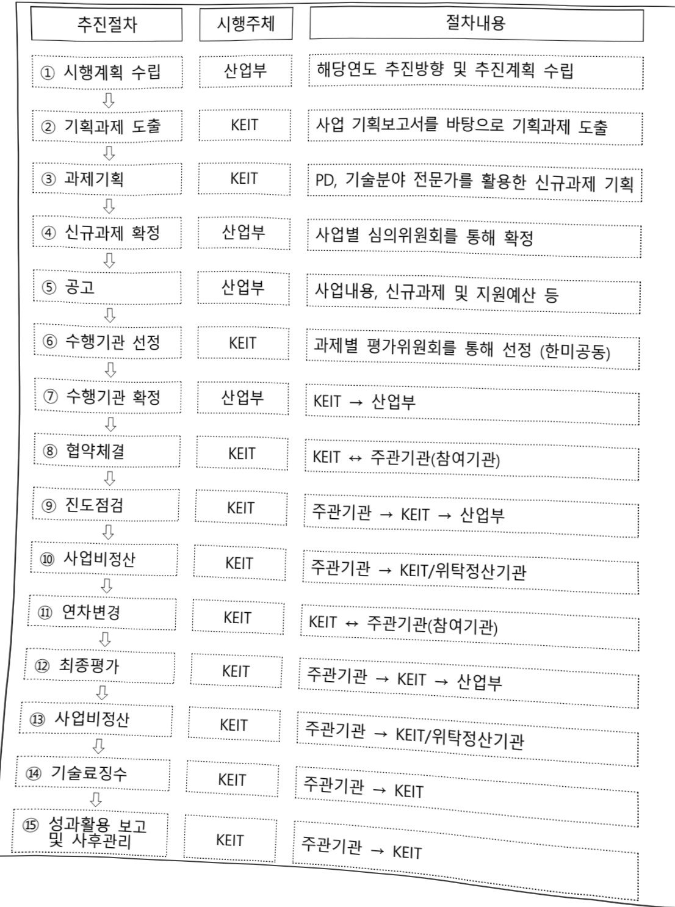
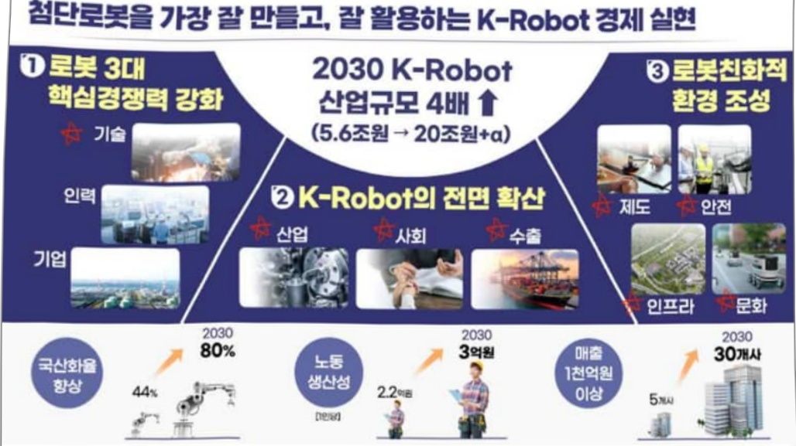

# 자율형소프트로봇핵심기술국제공동연구(R&D)

**해당 페이지**: PDF 4297 ~ 4306 쪽 해당

**부처**: 산업통상부
**분야**: 산업·중소기업 및 에너지
**회계유형**: 일반회계
**2026 확정예산**: 2520.0 백만원
**전년대비 증감률**: -20.0%
**AI 도메인**: 국방/안보, 로봇, 교육/인재

---

<table border=1 style='margin: auto; word-wrap: break-word;'><tr><td style='text-align: center; word-wrap: break-word;'>사 업 명</td></tr><tr><td style='text-align: center; word-wrap: break-word;'>(192) 자율형소프트로봇핵심기술국제공동연구(R&amp;D) (3541-413)</td></tr></table>

□ 사업 코드 정보

<table border=1 style='margin: auto; word-wrap: break-word;'><tr><td style='text-align: center; word-wrap: break-word;'>구분</td><td style='text-align: center; word-wrap: break-word;'>회계</td><td style='text-align: center; word-wrap: break-word;'>소관</td><td style='text-align: center; word-wrap: break-word;'>실국(기관)</td><td style='text-align: center; word-wrap: break-word;'>계정</td><td style='text-align: center; word-wrap: break-word;'>분야</td><td style='text-align: center; word-wrap: break-word;'>부문</td></tr><tr><td style='text-align: center; word-wrap: break-word;'>코드</td><td rowspan="2">일반회계</td><td rowspan="2">산업통상부</td><td style='text-align: center; word-wrap: break-word;'>산업성장실</td><td rowspan="2">-</td><td style='text-align: center; word-wrap: break-word;'>110</td><td style='text-align: center; word-wrap: break-word;'>117</td></tr><tr><td style='text-align: center; word-wrap: break-word;'>명칭</td><td style='text-align: center; word-wrap: break-word;'>산업인공지능정책관</td><td style='text-align: center; word-wrap: break-word;'>산업·중소기업 및에너지</td><td style='text-align: center; word-wrap: break-word;'>산업혁신지원</td></tr></table>

<table border=1 style='margin: auto; word-wrap: break-word;'><tr><td style='text-align: center; word-wrap: break-word;'>구분</td><td style='text-align: center; word-wrap: break-word;'>프로그램</td><td style='text-align: center; word-wrap: break-word;'>단위사업</td><td style='text-align: center; word-wrap: break-word;'>세부사업</td></tr><tr><td style='text-align: center; word-wrap: break-word;'>코드</td><td style='text-align: center; word-wrap: break-word;'>3500</td><td style='text-align: center; word-wrap: break-word;'>3541</td><td style='text-align: center; word-wrap: break-word;'>413</td></tr><tr><td style='text-align: center; word-wrap: break-word;'>명칭</td><td style='text-align: center; word-wrap: break-word;'>주력산업진흥</td><td style='text-align: center; word-wrap: break-word;'>제조기반기술개발</td><td style='text-align: center; word-wrap: break-word;'>자율형소프트로봇핵심기술국제공동연구(R&amp;D)</td></tr></table>

□ 사업 성격 (공통요구자료 II-1 작성유의사항 4. 참조, 해당하는 사항에 “○” 표시)

<table border=1 style='margin: auto; word-wrap: break-word;'><tr><td rowspan="2">신규</td><td rowspan="2">계속</td><td rowspan="2">완료</td><td rowspan="2">예비타당성 실시여부</td><td rowspan="2">총사업비 관리대상</td><td rowspan="2">총액계상 예산사업</td><td style='text-align: center; word-wrap: break-word;'>사업소관 변경정보</td></tr><tr><td style='text-align: center; word-wrap: break-word;'>2025예산 시 소관</td></tr><tr><td style='text-align: center; word-wrap: break-word;'></td><td style='text-align: center; word-wrap: break-word;'>○</td><td style='text-align: center; word-wrap: break-word;'></td><td style='text-align: center; word-wrap: break-word;'></td><td style='text-align: center; word-wrap: break-word;'></td><td style='text-align: center; word-wrap: break-word;'></td><td style='text-align: center; word-wrap: break-word;'></td></tr></table>

사업 지원 형태 및 지원을 (최소한 한 개는 반드시 선택하시오. 해당사항에 0 표시)

<table border=1 style='margin: auto; word-wrap: break-word;'><tr><td style='text-align: center; word-wrap: break-word;'>직접</td><td style='text-align: center; word-wrap: break-word;'>출자</td><td style='text-align: center; word-wrap: break-word;'>출연</td><td style='text-align: center; word-wrap: break-word;'>보조</td><td style='text-align: center; word-wrap: break-word;'>융자</td><td style='text-align: center; word-wrap: break-word;'>국고보조율(%)</td><td style='text-align: center; word-wrap: break-word;'>융자율(%)</td></tr><tr><td style='text-align: center; word-wrap: break-word;'></td><td style='text-align: center; word-wrap: break-word;'></td><td style='text-align: center; word-wrap: break-word;'>O</td><td style='text-align: center; word-wrap: break-word;'></td><td style='text-align: center; word-wrap: break-word;'></td><td style='text-align: center; word-wrap: break-word;'></td><td style='text-align: center; word-wrap: break-word;'></td></tr></table>

## □ 사업 담당자

<table border=1 style='margin: auto; word-wrap: break-word;'><tr><td style='text-align: center; word-wrap: break-word;'>사업명</td><td colspan="5">구분</td></tr><tr><td rowspan="4">자율형소프트로봇핵심기술국제공동연구(R&amp;D)</td><td rowspan="3">소관부처</td><td style='text-align: center; word-wrap: break-word;'>실·국·과(팀)</td><td style='text-align: center; word-wrap: break-word;'>과 장</td><td style='text-align: center; word-wrap: break-word;'>사무관</td><td style='text-align: center; word-wrap: break-word;'>주무관</td></tr><tr><td style='text-align: center; word-wrap: break-word;'>산업성장실산업인공지능정책관</td><td style='text-align: center; word-wrap: break-word;'>신용민</td><td style='text-align: center; word-wrap: break-word;'>안용열</td><td style='text-align: center; word-wrap: break-word;'>류재훈</td></tr><tr><td style='text-align: center; word-wrap: break-word;'>인공지능기계로봇과</td><td style='text-align: center; word-wrap: break-word;'>044-203-4310</td><td style='text-align: center; word-wrap: break-word;'>044-203-4311</td><td style='text-align: center; word-wrap: break-word;'>044-203-4315</td></tr><tr><td style='text-align: center; word-wrap: break-word;'>사업시행주체</td><td style='text-align: center; word-wrap: break-word;'>한국산업기술기획평가원</td><td style='text-align: center; word-wrap: break-word;'>기계로봇장비실</td><td style='text-align: center; word-wrap: break-word;'>박용수 실장</td><td style='text-align: center; word-wrap: break-word;'>053-718-8220</td></tr></table>

---

### 가.예산 총괄표

(단위: 백만원, %)

<table border=1 style='margin: auto; word-wrap: break-word;'><tr><td rowspan="2">사업명</td><td rowspan="2">2024년 결산</td><td colspan="2">2025년 예산</td><td colspan="2">2026년</td><td rowspan="2">증감 (B-A)</td><td rowspan="2">(B-A)/A</td></tr><tr><td style='text-align: center; word-wrap: break-word;'>본예산(A)</td><td style='text-align: center; word-wrap: break-word;'>추경</td><td style='text-align: center; word-wrap: break-word;'>요구안</td><td style='text-align: center; word-wrap: break-word;'>확정(B)</td></tr><tr><td style='text-align: center; word-wrap: break-word;'>지을형소프트로봇혁신기술국제공동연구</td><td style='text-align: center; word-wrap: break-word;'>-</td><td style='text-align: center; word-wrap: break-word;'>3,150</td><td style='text-align: center; word-wrap: break-word;'>3,150</td><td style='text-align: center; word-wrap: break-word;'>2,520</td><td style='text-align: center; word-wrap: break-word;'>2,520</td><td style='text-align: center; word-wrap: break-word;'>△630</td><td style='text-align: center; word-wrap: break-word;'>△20</td></tr></table>

□ 기능별(내역사업별), 목별 예산 내역

(단위:백만원)

<table border=1 style='margin: auto; word-wrap: break-word;'><tr><td rowspan="3"></td><td colspan="5">2024</td><td colspan="7">2025(2025.12월말)</td><td rowspan="3">2026예산</td></tr><tr><td rowspan="2">예산액(추경)</td><td rowspan="2">예산현액</td><td rowspan="2">집행액[실집행액]</td><td rowspan="2">이월액</td><td rowspan="2">불용액</td><td rowspan="2">본예산</td><td rowspan="2">예산현액</td><td rowspan="2">집행액[실집행액]</td><td colspan="2">전년도 이월액제외</td><td rowspan="2">이월예상액</td><td rowspan="2">불용예상액</td></tr><tr><td style='text-align: center; word-wrap: break-word;'>예산현액</td><td style='text-align: center; word-wrap: break-word;'>집행액[실집행액]</td></tr><tr><td style='text-align: center; word-wrap: break-word;'>○ 기능별 분류(합계)</td><td style='text-align: center; word-wrap: break-word;'>-</td><td style='text-align: center; word-wrap: break-word;'>-</td><td style='text-align: center; word-wrap: break-word;'>-</td><td style='text-align: center; word-wrap: break-word;'>-</td><td style='text-align: center; word-wrap: break-word;'>-</td><td style='text-align: center; word-wrap: break-word;'>3,150</td><td style='text-align: center; word-wrap: break-word;'>3,150</td><td style='text-align: center; word-wrap: break-word;'>3,150[3,150]</td><td style='text-align: center; word-wrap: break-word;'>3,150</td><td style='text-align: center; word-wrap: break-word;'>3,150[3,150]</td><td style='text-align: center; word-wrap: break-word;'>-</td><td style='text-align: center; word-wrap: break-word;'>-</td><td style='text-align: center; word-wrap: break-word;'>2,520</td></tr><tr><td style='text-align: center; word-wrap: break-word;'>· 자율형소프트로봇핵심기술국제공동연구</td><td style='text-align: center; word-wrap: break-word;'>-</td><td style='text-align: center; word-wrap: break-word;'>-</td><td style='text-align: center; word-wrap: break-word;'>-</td><td style='text-align: center; word-wrap: break-word;'>-</td><td style='text-align: center; word-wrap: break-word;'>-</td><td style='text-align: center; word-wrap: break-word;'>3,150</td><td style='text-align: center; word-wrap: break-word;'>3,150</td><td style='text-align: center; word-wrap: break-word;'>3,150[3,150]</td><td style='text-align: center; word-wrap: break-word;'>3,150</td><td style='text-align: center; word-wrap: break-word;'>3,150[3,150]</td><td style='text-align: center; word-wrap: break-word;'>-</td><td style='text-align: center; word-wrap: break-word;'>-</td><td style='text-align: center; word-wrap: break-word;'>2,520</td></tr><tr><td style='text-align: center; word-wrap: break-word;'>○ 비목별 분류(합계)</td><td style='text-align: center; word-wrap: break-word;'>-</td><td style='text-align: center; word-wrap: break-word;'>-</td><td style='text-align: center; word-wrap: break-word;'>-</td><td style='text-align: center; word-wrap: break-word;'>-</td><td style='text-align: center; word-wrap: break-word;'>-</td><td style='text-align: center; word-wrap: break-word;'>3,150</td><td style='text-align: center; word-wrap: break-word;'>3,150</td><td style='text-align: center; word-wrap: break-word;'>3,150[3,150]</td><td style='text-align: center; word-wrap: break-word;'>3,150</td><td style='text-align: center; word-wrap: break-word;'>3,150[3,150]</td><td style='text-align: center; word-wrap: break-word;'>-</td><td style='text-align: center; word-wrap: break-word;'>-</td><td style='text-align: center; word-wrap: break-word;'>2,520</td></tr><tr><td style='text-align: center; word-wrap: break-word;'>· 연구개발연구활동비등(360-05)</td><td style='text-align: center; word-wrap: break-word;'>-</td><td style='text-align: center; word-wrap: break-word;'>-</td><td style='text-align: center; word-wrap: break-word;'>-</td><td style='text-align: center; word-wrap: break-word;'>-</td><td style='text-align: center; word-wrap: break-word;'>-</td><td style='text-align: center; word-wrap: break-word;'>3,150</td><td style='text-align: center; word-wrap: break-word;'>3,150</td><td style='text-align: center; word-wrap: break-word;'>3,150[3,150]</td><td style='text-align: center; word-wrap: break-word;'>3,150</td><td style='text-align: center; word-wrap: break-word;'>3,150[3,150]</td><td style='text-align: center; word-wrap: break-word;'>-</td><td style='text-align: center; word-wrap: break-word;'>-</td><td style='text-align: center; word-wrap: break-word;'>2,520</td></tr><tr><td style='text-align: center; word-wrap: break-word;'>○ 기능비목별 분류(합계)</td><td style='text-align: center; word-wrap: break-word;'>-</td><td style='text-align: center; word-wrap: break-word;'>-</td><td style='text-align: center; word-wrap: break-word;'>-</td><td style='text-align: center; word-wrap: break-word;'>-</td><td style='text-align: center; word-wrap: break-word;'>-</td><td style='text-align: center; word-wrap: break-word;'>3,150</td><td style='text-align: center; word-wrap: break-word;'>3,150</td><td style='text-align: center; word-wrap: break-word;'>3,150[3,150]</td><td style='text-align: center; word-wrap: break-word;'>3,150</td><td style='text-align: center; word-wrap: break-word;'>3,150[3,150]</td><td style='text-align: center; word-wrap: break-word;'>-</td><td style='text-align: center; word-wrap: break-word;'>-</td><td style='text-align: center; word-wrap: break-word;'>2,520</td></tr><tr><td style='text-align: center; word-wrap: break-word;'>· 자율형소프트로봇핵심기술국제공동연구-연구개발연구활동비등(360-05)</td><td style='text-align: center; word-wrap: break-word;'>-</td><td style='text-align: center; word-wrap: break-word;'>-</td><td style='text-align: center; word-wrap: break-word;'>-</td><td style='text-align: center; word-wrap: break-word;'>-</td><td style='text-align: center; word-wrap: break-word;'>-</td><td style='text-align: center; word-wrap: break-word;'>3,150</td><td style='text-align: center; word-wrap: break-word;'>3,150</td><td style='text-align: center; word-wrap: break-word;'>3,150[3,150]</td><td style='text-align: center; word-wrap: break-word;'>3,150</td><td style='text-align: center; word-wrap: break-word;'>3,150[3,150]</td><td style='text-align: center; word-wrap: break-word;'>-</td><td style='text-align: center; word-wrap: break-word;'>-</td><td style='text-align: center; word-wrap: break-word;'>2,520</td></tr></table>

---

### 나. 사업설명자료

## 1 ) 사업목적·내용

- (자율형소프트로봇핵심기술국제공동연구) 자율로봇 부문 차세대 로봇 원천기술 확보를 위한 한미 공동연구 및 인력 양성

* 韩산업부-美국방부간 자율로봇 공동 기초연구작업반 운영을 통한 공동연구과제 발굴 및 지원

## 2 ) 사업개요

## □ 사업근거 및 추진경위

① 법령상 근거 및 조항 적시

- 산업기술촉진법 제11조(산업기술개발사업), 제19조(산업기술기반조성사업)

- '韩산업부-美국방부간 자율로봇 공동 기초 연구를 위한 작업반 운영 세칙' 체결('22.9)

<table border=1 style='margin: auto; word-wrap: break-word;'><tr><td style='text-align: center; word-wrap: break-word;'>제11조 (산업기술개발사업) ① 산업통상부장관은 혁신계획 및 시행계획을 효율적으로 수행하기 위하여 관계 중앙행정기관의 장과 협의하여 다음 각 호의 산업기술분야에서 기술개발사업(산업기술개발을 위하여 필요한 기획 및 조사를 포함한다. 이하 &quot;산업기술개발사업&quot;이라 한다)을 추진할 수 있다. 1. 산업의 공통적인 기반이 되는 생산기반 기술, 부품·소재 및 장비·설비(플랜트를 포함한다) 기술 2. 산업기술 분야의 미래 유망 기술 3. 산업의 고부가가치화를 위한 공정혁신, 청정생산 및 환경설비 등에 관련된 기술 4. 산업의 핵심기술의 집약에 필요한 엔지니어링·시스템 기술 5. 에너지 절약 및 신·재생에너지 개발 등 에너지·자원기술 6. 항공우주산업기술 및「민·군겸용기술사업 촉진법」 제2조제1호가목에 따른 민·군겸용기술 7. 디자인·표준 관련 기술, 유통·전자거래 및 마케팅 등 지식기반서비스 산업 관련 기술 8~13. (중략)</td></tr><tr><td style='text-align: center; word-wrap: break-word;'>제19조(산업기술기반조성사업) ① 산업통상부장관은 산업기술혁신의 기반 및 환경조성에 관한 다음 각 호의 사업(이하 &quot;산업기술기반조성사업&quot;이라 한다)을 추진할 수 있다. 1. 산업기술인력의 활용 및 공급 2. 산업기술 연구장비·시설 등의 확충 및 활용촉진 3. 연구장비·시설·연구인력 및 정보 등 산업기술혁신 요소의 집적화(集積化) 촉진 4~7. (중략)</td></tr></table>

---

② 추진경위

- 2022. '韩산업부-美국방부간 자율로봇 공동 기초 연구를 위한 작업반 운영 세칙(ToR)' 체결

- 2023. 제1차 자율로봇 공동 기초연구 작업반 개최

- 2024. 미 국방부 FDW 워크숍 공동 개최

## □ 주요내용

① 사업규모

- 총사업비 : 해당없음

- 사업기간 : 2025 ~ 2028(4년)

- 최근 5년 간 투입된 사업비(예산액기준, 추경편성한 연도에는 추경포함)

<table border=1 style='margin: auto; word-wrap: break-word;'><tr><td style='text-align: center; word-wrap: break-word;'>2022</td><td style='text-align: center; word-wrap: break-word;'>2023</td><td style='text-align: center; word-wrap: break-word;'>2024</td><td style='text-align: center; word-wrap: break-word;'>2025</td><td style='text-align: center; word-wrap: break-word;'>2026</td></tr><tr><td style='text-align: center; word-wrap: break-word;'>2023</td><td style='text-align: center; word-wrap: break-word;'>2024</td><td style='text-align: center; word-wrap: break-word;'>2025</td><td style='text-align: center; word-wrap: break-word;'>2026</td><td style='text-align: center; word-wrap: break-word;'></td></tr><tr><td style='text-align: center; word-wrap: break-word;'>2024</td><td style='text-align: center; word-wrap: break-word;'>2025</td><td style='text-align: center; word-wrap: break-word;'>2026</td><td style='text-align: center; word-wrap: break-word;'>2027</td><td style='text-align: center; word-wrap: break-word;'>2028</td></tr><tr><td style='text-align: center; word-wrap: break-word;'>2025</td><td style='text-align: center; word-wrap: break-word;'>2026</td><td style='text-align: center; word-wrap: break-word;'>2027</td><td style='text-align: center; word-wrap: break-word;'>2028</td><td style='text-align: center; word-wrap: break-word;'>2029</td></tr><tr><td style='text-align: center; word-wrap: break-word;'>2026</td><td style='text-align: center; word-wrap: break-word;'>2027</td><td style='text-align: center; word-wrap: break-word;'>2028</td><td style='text-align: center; word-wrap: break-word;'>2029</td><td style='text-align: center; word-wrap: break-word;'>2030</td></tr><tr><td style='text-align: center; word-wrap: break-word;'>2027</td><td style='text-align: center; word-wrap: break-word;'>2028</td><td style='text-align: center; word-wrap: break-word;'>2029</td><td style='text-align: center; word-wrap: break-word;'>2030</td><td style='text-align: center; word-wrap: break-word;'>2031</td></tr><tr><td style='text-align: center; word-wrap: break-word;'>2028</td><td style='text-align: center; word-wrap: break-word;'>2029</td><td style='text-align: center; word-wrap: break-word;'>2030</td><td style='text-align: center; word-wrap: break-word;'>2031</td><td style='text-align: center; word-wrap: break-word;'>2032</td></tr><tr><td style='text-align: center; word-wrap: break-word;'>2029</td><td style='text-align: center; word-wrap: break-word;'>2030</td><td style='text-align: center; word-wrap: break-word;'>2031</td><td style='text-align: center; word-wrap: break-word;'>2032</td><td style='text-align: center; word-wrap: break-word;'>2033</td></tr><tr><td style='text-align: center; word-wrap: break-word;'>2030</td><td style='text-align: center; word-wrap: break-word;'>2031</td><td style='text-align: center; word-wrap: break-word;'>2032</td><td style='text-align: center; word-wrap: break-word;'>2033</td><td style='text-align: center; word-wrap: break-word;'>2034</td></tr><tr><td style='text-align: center; word-wrap: break-word;'>2031</td><td style='text-align: center; word-wrap: break-word;'>2032</td><td style='text-align: center; word-wrap: break-word;'>2033</td><td style='text-align: center; word-wrap: break-word;'>2034</td><td style='text-align: center; word-wrap: break-word;'>2035</td></tr><tr><td style='text-align: center; word-wrap: break-word;'>2032</td><td style='text-align: center; word-wrap: break-word;'>2033</td><td style='text-align: center; word-wrap: break-word;'>2034</td><td style='text-align: center; word-wrap: break-word;'>2035</td><td style='text-align: center; word-wrap: break-word;'>2036</td></tr><tr><td style='text-align: center; word-wrap: break-word;'>2033</td><td style='text-align: center; word-wrap: break-word;'>2034</td><td style='text-align: center; word-wrap: break-word;'>2035</td><td style='text-align: center; word-wrap: break-word;'>2036</td><td style='text-align: center; word-wrap: break-word;'>2037</td></tr><tr><td style='text-align: center; word-wrap: break-word;'>2034</td><td style='text-align: center; word-wrap: break-word;'>2035</td><td style='text-align: center; word-wrap: break-word;'>2036</td><td style='text-align: center; word-wrap: break-word;'>2037</td><td style='text-align: center; word-wrap: break-word;'>2038</td></tr><tr><td style='text-align: center; word-wrap: break-word;'>2035</td><td style='text-align: center; word-wrap: break-word;'>2036</td><td style='text-align: center; word-wrap: break-word;'>2037</td><td style='text-align: center; word-wrap: break-word;'>2038</td><td style='text-align: center; word-wrap: break-word;'>2039</td></tr><tr><td style='text-align: center; word-wrap: break-word;'>2036</td><td style='text-align: center; word-wrap: break-word;'>2037</td><td style='text-align: center; word-wrap: break-word;'>2038</td><td style='text-align: center; word-wrap: break-word;'>2039</td><td style='text-align: center; word-wrap: break-word;'>2040</td></tr><tr><td style='text-align: center; word-wrap: break-word;'>2037</td><td style='text-align: center; word-wrap: break-word;'>2038</td><td style='text-align: center; word-wrap: break-word;'>2039</td><td style='text-align: center; word-wrap: break-word;'>2040</td><td style='text-align: center; word-wrap: break-word;'>2041</td></tr><tr><td style='text-align: center; word-wrap: break-word;'>2038</td><td style='text-align: center; word-wrap: break-word;'>2039</td><td style='text-align: center; word-wrap: break-word;'>2040</td><td style='text-align: center; word-wrap: break-word;'>2041</td><td style='text-align: center; word-wrap: break-word;'>2042</td></tr><tr><td style='text-align: center; word-wrap: break-word;'>2039</td><td style='text-align: center; word-wrap: break-word;'>2040</td><td style='text-align: center; word-wrap: break-word;'>2041</td><td style='text-align: center; word-wrap: break-word;'>2042</td><td style='text-align: center; word-wrap: break-word;'>2043</td></tr><tr><td style='text-align: center; word-wrap: break-word;'>2040</td><td style='text-align: center; word-wrap: break-word;'>2041</td><td style='text-align: center; word-wrap: break-word;'>2042</td><td style='text-align: center; word-wrap: break-word;'>2043</td><td style='text-align: center; word-wrap: break-word;'>2044</td></tr><tr><td style='text-align: center; word-wrap: break-word;'>2041</td><td style='text-align: center; word-wrap: break-word;'>2042</td><td style='text-align: center; word-wrap: break-word;'>2043</td><td style='text-align: center; word-wrap: break-word;'>2044</td><td style='text-align: center; word-wrap: break-word;'>2045</td></tr><tr><td style='text-align: center; word-wrap: break-word;'>2042</td><td style='text-align: center; word-wrap: break-word;'>2043</td><td style='text-align: center; word-wrap: break-word;'>2044</td><td style='text-align: center; word-wrap: break-word;'>2045</td><td style='text-align: center; word-wrap: break-word;'>2046</td></tr><tr><td style='text-align: center; word-wrap: break-word;'>2043</td><td style='text-align: center; word-wrap: break-word;'>2044</td><td style='text-align: center; word-wrap: break-word;'>2045</td><td style='text-align: center; word-wrap: break-word;'>2046</td><td style='text-align: center; word-wrap: break-word;'>2047</td></tr><tr><td style='text-align: center; word-wrap: break-word;'>2044</td><td style='text-align: center; word-wrap: break-word;'>2045</td><td style='text-align: center; word-wrap: break-word;'>2046</td><td style='text-align: center; word-wrap: break-word;'>2047</td><td style='text-align: center; word-wrap: break-word;'>2048</td></tr><tr><td style='text-align: center; word-wrap: break-word;'>2045</td><td style='text-align: center; word-wrap: break-word;'>2046</td><td style='text-align: center; word-wrap: break-word;'>2047</td><td style='text-align: center; word-wrap: break-word;'>2048</td><td style='text-align: center; word-wrap: break-word;'>2049</td></tr><tr><td style='text-align: center; word-wrap: break-word;'>2046</td><td style='text-align: center; word-wrap: break-word;'>2047</td><td style='text-align: center; word-wrap: break-word;'>2048</td><td style='text-align: center; word-wrap: break-word;'>2049</td><td style='text-align: center; word-wrap: break-word;'>2050</td></tr><tr><td style='text-align: center; word-wrap: break-word;'>2047</td><td style='text-align: center; word-wrap: break-word;'>2048</td><td style='text-align: center; word-wrap: break-word;'>2049</td><td style='text-align: center; word-wrap: break-word;'>2050</td><td style='text-align: center; word-wrap: break-word;'>2051</td></tr><tr><td style='text-align: center; word-wrap: break-word;'>2048</td><td style='text-align: center; word-wrap: break-word;'>2049</td><td style='text-align: center; word-wrap: break-word;'>2050</td><td style='text-align: center; word-wrap: break-word;'>2051</td><td style='text-align: center; word-wrap: break-word;'>2052</td></tr><tr><td style='text-align: center; word-wrap: break-word;'>2049</td><td style='text-align: center; word-wrap: break-word;'>2050</td><td style='text-align: center; word-wrap: break-word;'>2051</td><td style='text-align: center; word-wrap: break-word;'>2052</td><td style='text-align: center; word-wrap: break-word;'>2053</td></tr><tr><td style='text-align: center; word-wrap: break-word;'>2050</td><td style='text-align: center; word-wrap: break-word;'>2051</td><td style='text-align: center; word-wrap: break-word;'>2052</td><td style='text-align: center; word-wrap: break-word;'>2053</td><td style='text-align: center; word-wrap: break-word;'>2054</td></tr><tr><td style='text-align: center; word-wrap: break-word;'>2051</td><td style='text-align: center; word-wrap: break-word;'>2052</td><td style='text-align: center; word-wrap: break-word;'>2053</td><td style='text-align: center; word-wrap: break-word;'>2054</td><td style='text-align: center; word-wrap: break-word;'>2055</td></tr><tr><td style='text-align: center; word-wrap: break-word;'>2052</td><td style='text-align: center; word-wrap: break-word;'>2053</td><td style='text-align: center; word-wrap: break-word;'>2054</td><td style='text-align: center; word-wrap: break-word;'>2055</td><td style='text-align: center; word-wrap: break-word;'>2056</td></tr><tr><td style='text-align: center; word-wrap: break-word;'>2053</td><td style='text-align: center; word-wrap: break-word;'>2054</td><td style='text-align: center; word-wrap: break-word;'>2055</td><td style='text-align: center; word-wrap: break-word;'>2056</td><td style='text-align: center; word-wrap: break-word;'>2057</td></tr><tr><td style='text-align: center; word-wrap: break-word;'>2054</td><td style='text-align: center; word-wrap: break-word;'>2055</td><td style='text-align: center; word-wrap: break-word;'>2056</td><td style='text-align: center; word-wrap: break-word;'>2057</td><td style='text-align: center; word-wrap: break-word;'>2058</td></tr><tr><td style='text-align: center; word-wrap: break-word;'>2055</td><td style='text-align: center; word-wrap: break-word;'>2056</td><td style='text-align: center; word-wrap: break-word;'>2057</td><td style='text-align: center; word-wrap: break-word;'>2058</td><td style='text-align: center; word-wrap: break-word;'>2059</td></tr><tr><td style='text-align: center; word-wrap: break-word;'>2056</td><td style='text-align: center; word-wrap: break-word;'>2057</td><td style='text-align: center; word-wrap: break-word;'>2058</td><td style='text-align: center; word-wrap: break-word;'>2059</td><td style='text-align: center; word-wrap: break-word;'>2060</td></tr><tr><td style='text-align: center; word-wrap: break-word;'>2057</td><td style='text-align: center; word-wrap: break-word;'>2058</td><td style='text-align: center; word-wrap: break-word;'>2059</td><td style='text-align: center; word-wrap: break-word;'>2060</td><td style='text-align: center; word-wrap: break-word;'>2061</td></tr><tr><td style='text-align: center; word-wrap: break-word;'>2058</td><td style='text-align: center; word-wrap: break-word;'>2059</td><td style='text-align: center; word-wrap: break-word;'>2060</td><td style='text-align: center; word-wrap: break-word;'>2061</td><td style='text-align: center; word-wrap: break-word;'>2062</td></tr><tr><td style='text-align: center; word-wrap: break-word;'>2059</td><td style='text-align: center; word-wrap: break-word;'>2060</td><td style='text-align: center; word-wrap: break-word;'>2061</td><td style='text-align: center; word-wrap: break-word;'>2062</td><td style='text-align: center; word-wrap: break-word;'>2063</td></tr><tr><td style='text-align: center; word-wrap: break-word;'>2060</td><td style='text-align: center; word-wrap: break-word;'>2061</td><td style='text-align: center; word-wrap: break-word;'>2062</td><td style='text-align: center; word-wrap: break-word;'>2063</td><td style='text-align: center; word-wrap: break-word;'>2064</td></tr><tr><td style='text-align: center; word-wrap: break-word;'>2061</td><td style='text-align: center; word-wrap: break-word;'>2062</td><td style='text-align: center; word-wrap: break-word;'>2063</td><td style='text-align: center; word-wrap: break-word;'>2064</td><td style='text-align: center; word-wrap: break-word;'>2065</td></tr><tr><td style='text-align: center; word-wrap: break-word;'>2062</td><td style='text-align: center; word-wrap: break-word;'>2063</td><td style='text-align: center; word-wrap: break-word;'>2064</td><td style='text-align: center; word-wrap: break-word;'>2065</td><td style='text-align: center; word-wrap: break-word;'>2066</td></tr><tr><td style='text-align: center; word-wrap: break-word;'>2063</td><td style='text-align: center; word-wrap: break-word;'>2064</td><td style='text-align: center; word-wrap: break-word;'>2065</td><td style='text-align: center; word-wrap: break-word;'>2066</td><td style='text-align: center; word-wrap: break-word;'>2067</td></tr><tr><td style='text-align: center; word-wrap: break-word;'>2064</td><td style='text-align: center; word-wrap: break-word;'>2065</td><td style='text-align: center; word-wrap: break-word;'>2066</td><td style='text-align: center; word-wrap: break-word;'>2067</td><td style='text-align: center; word-wrap: break-word;'>2068</td></tr><tr><td style='text-align: center; word-wrap: break-word;'>2065</td><td style='text-align: center; word-wrap: break-word;'>2066</td><td style='text-align: center; word-wrap: break-word;'>2067</td><td style='text-align: center; word-wrap: break-word;'>2068</td><td style='text-align: center; word-wrap: break-word;'>2069</td></tr><tr><td style='text-align: center; word-wrap: break-word;'>2066</td><td style='text-align: center; word-wrap: break-word;'>2067</td><td style='text-align: center; word-wrap: break-word;'>2068</td><td style='text-align: center; word-wrap: break-word;'>2069</td><td style='text-align: center; word-wrap: break-word;'>2070</td></tr><tr><td style='text-align: center; word-wrap: break-word;'>2067</td><td style='text-align: center; word-wrap: break-word;'>2068</td><td style='text-align: center; word-wrap: break-word;'>2069</td><td style='text-align: center; word-wrap: break-word;'>2070</td><td style='text-align: center; word-wrap: break-word;'>2071</td></tr><tr><td style='text-align: center; word-wrap: break-word;'>2068</td><td style='text-align: center; word-wrap: break-word;'>2069</td><td style='text-align: center; word-wrap: break-word;'>2070</td><td style='text-align: center; word-wrap: break-word;'>2071</td><td style='text-align: center; word-wrap: break-word;'>2072</td></tr><tr><td style='text-align: center; word-wrap: break-word;'>2069</td><td style='text-align: center; word-wrap: break-word;'>2070</td><td style='text-align: center; word-wrap: break-word;'>2071</td><td style='text-align: center; word-wrap: break-word;'>2072</td><td style='text-align: center; word-wrap: break-word;'>2073</td></tr><tr><td style='text-align: center; word-wrap: break-word;'>2070</td><td style='text-align: center; word-wrap: break-word;'>2071</td><td style='text-align: center; word-wrap: break-word;'>2072</td><td style='text-align: center; word-wrap: break-word;'>2073</td><td style='text-align: center; word-wrap: break-word;'>2074</td></tr><tr><td style='text-align: center; word-wrap: break-word;'>2071</td><td style='text-align: center; word-wrap: break-word;'>2072</td><td style='text-align: center; word-wrap: break-word;'>2073</td><td style='text-align: center; word-wrap: break-word;'>2074</td><td style='text-align: center; word-wrap: break-word;'>2075</td></tr><tr><td style='text-align: center; word-wrap: break-word;'>2072</td><td style='text-align: center; word-wrap: break-word;'>2073</td><td style='text-align: center; word-wrap: break-word;'>2074</td><td style='text-align: center; word-wrap: break-word;'>2075</td><td style='text-align: center; word-wrap: break-word;'>2076</td></tr><tr><td style='text-align: center; word-wrap: break-word;'>2073</td><td style='text-align: center; word-wrap: break-word;'>2074</td><td style='text-align: center; word-wrap: break-word;'>2075</td><td style='text-align: center; word-wrap: break-word;'>2076</td><td style='text-align: center; word-wrap: break-word;'>2077</td></tr><tr><td style='text-align: center; word-wrap: break-word;'>2074</td><td style='text-align: center; word-wrap: break-word;'>2075</td><td style='text-align: center; word-wrap: break-word;'>2076</td><td style='text-align: center; word-wrap: break-word;'>2077</td><td style='text-align: center; word-wrap: break-word;'>2078</td></tr><tr><td style='text-align: center; word-wrap: break-word;'>2075</td><td style='text-align: center; word-wrap: break-word;'>2076</td><td style='text-align: center; word-wrap: break-word;'>2077</td><td style='text-align: center; word-wrap: break-word;'>2078</td><td style='text-align: center; word-wrap: break-word;'>2079</td></tr><tr><td style='text-align: center; word-wrap: break-word;'>2076</td><td style='text-align: center; word-wrap: break-word;'>2077</td><td style='text-align: center; word-wrap: break-word;'>2078</td><td style='text-align: center; word-wrap: break-word;'>2079</td><td style='text-align: center; word-wrap: break-word;'>2080</td></tr><tr><td style='text-align: center; word-wrap: break-word;'>2077</td><td style='text-align: center; word-wrap: break-word;'>2078</td><td style='text-align: center; word-wrap: break-word;'>2079</td><td style='text-align: center; word-wrap: break-word;'>2080</td><td style='text-align: center; word-wrap: break-word;'>2081</td></tr><tr><td style='text-align: center; word-wrap: break-word;'>2078</td><td style='text-align: center; word-wrap: break-word;'>2079</td><td style='text-align: center; word-wrap: break-word;'>2080</td><td style='text-align: center; word-wrap: break-word;'>2081</td><td style='text-align: center; word-wrap: break-word;'>2082</td></tr><tr><td style='text-align: center; word-wrap: break-word;'>2079</td><td style='text-align: center; word-wrap: break-word;'>2080</td><td style='text-align: center; word-wrap: break-word;'>2081</td><td style='text-align: center; word-wrap: break-word;'>2082</td><td style='text-align: center; word-wrap: break-word;'>2083</td></tr><tr><td style='text-align: center; word-wrap: break-word;'>2080</td><td style='text-align: center; word-wrap: break-word;'>2081</td><td style='text-align: center; word-wrap: break-word;'>2082</td><td style='text-align: center; word-wrap: break-word;'>2083</td><td style='text-align: center; word-wrap: break-word;'>2084</td></tr><tr><td style='text-align: center; word-wrap: break-word;'>2081</td><td style='text-align: center; word-wrap: break-word;'>2082</td><td style='text-align: center; word-wrap: break-word;'>2083</td><td style='text-align: center; word-wrap: break-word;'>2084</td><td style='text-align: center; word-wrap: break-word;'>2085</td></tr><tr><td style='text-align: center; word-wrap: break-word;'>2082</td><td style='text-align: center; word-wrap: break-word;'>2083</td><td style='text-align: center; word-wrap: break-word;'>2084</td><td style='text-align: center; word-wrap: break-word;'>2085</td><td style='text-align: center; word-wrap: break-word;'>2086</td></tr><tr><td style='text-align: center; word-wrap: break-word;'>2083</td><td style='text-align: center; word-wrap: break-word;'>2084</td><td style='text-align: center; word-wrap: break-word;'>2085</td><td style='text-align: center; word-wrap: break-word;'>2086</td><td style='text-align: center; word-wrap: break-word;'>2087</td></tr><tr><td style='text-align: center; word-wrap: break-word;'>2084</td><td style='text-align: center; word-wrap: break-word;'>2085</td><td style='text-align: center; word-wrap: break-word;'>2086</td><td style='text-align: center; word-wrap: break-word;'>2087</td><td style='text-align: center; word-wrap: break-word;'>2088</td></tr><tr><td style='text-align: center; word-wrap: break-word;'>2085</td><td style='text-align: center; word-wrap: break-word;'>2086</td><td style='text-align: center; word-wrap: break-word;'>2087</td><td style='text-align: center; word-wrap: break-word;'>2088</td><td style='text-align: center; word-wrap: break-word;'>2089</td></tr><tr><td style='text-align: center; word-wrap: break-word;'>2086</td><td style='text-align: center; word-wrap: break-word;'>2087</td><td style='text-align: center; word-wrap: break-word;'>2088</td><td style='text-align: center; word-wrap: break-word;'>2089</td><td style='text-align: center; word-wrap: break-word;'>2090</td></tr><tr><td style='text-align: center; word-wrap: break-word;'>2087</td><td style='text-align: center; word-wrap: break-word;'>2088</td><td style='text-align: center; word-wrap: break-word;'>2089</td><td style='text-align: center; word-wrap: break-word;'>2090</td><td style='text-align: center; word-wrap: break-word;'>2091</td></tr><tr><td style='text-align: center; word-wrap: break-word;'>2088</td><td style='text-align: center; word-wrap: break-word;'>2089</td><td style='text-align: center; word-wrap: break-word;'>2090</td><td style='text-align: center; word-wrap: break-word;'>2091</td><td style='text-align: center; word-wrap: break-word;'>2092</td></tr><tr><td style='text-align: center; word-wrap: break-word;'>2089</td><td style='text-align: center; word-wrap: break-word;'>2090</td><td style='text-align: center; word-wrap: break-word;'>2091</td><td style='text-align: center; word-wrap: break-word;'>2092</td><td style='text-align: center; word-wrap: break-word;'>2093</td></tr><tr><td style='text-align: center; word-wrap: break-word;'>2090</td><td style='text-align: center; word-wrap: break-word;'>2091</td><td style='text-align: center; word-wrap: break-word;'>2092</td><td style='text-align: center; word-wrap: break-word;'>2093</td><td style='text-align: center; word-wrap: break-word;'>2094</td></tr><tr><td style='text-align: center; word-wrap: break-word;'>2091</td><td style='text-align: center; word-wrap: break-word;'>2092</td><td style='text-align: center; word-wrap: break-word;'>2093</td><td style='text-align: center; word-wrap: break-word;'>2094</td><td style='text-align: center; word-wrap: break-word;'>2095</td></tr><tr><td style='text-align: center; word-wrap: break-word;'>2092</td><td style='text-align: center; word-wrap: break-word;'>2093</td><td style='text-align: center; word-wrap: break-word;'>2094</td><td style='text-align: center; word-wrap: break-word;'>2095</td><td style='text-align: center; word-wrap: break-word;'>2096</td></tr><tr><td style='text-align: center; word-wrap: break-word;'>2093</td><td style='text-align: center; word-wrap: break-word;'>2094</td><td style='text-align: center; word-wrap: break-word;'>2095</td><td style='text-align: center; word-wrap: break-word;'>2096</td><td style='text-align: center; word-wrap: break-word;'>2097</td></tr><tr><td style='text-align: center; word-wrap: break-word;'>2094</td><td style='text-align: center; word-wrap: break-word;'>2095</td><td style='text-align: center; word-wrap: break-word;'>2096</td><td style='text-align: center; word-wrap: break-word;'>2097</td><td style='text-align: center; word-wrap: break-word;'>2098</td></tr><tr><td style='text-align: center; word-wrap: break-word;'>2095</td><td style='text-align: center; word-wrap: break-word;'>2096</td><td style='text-align: center; word-wrap: break-word;'>2097</td><td style='text-align: center; word-wrap: break-word;'>2098</td><td style='text-align: center; word-wrap: break-word;'>2099</td></tr><tr><td style='text-align: center; word-wrap: break-word;'>2096</td><td style='text-align: center; word-wrap: break-word;'>2097</td><td style='text-align: center; word-wrap: break-word;'>2098</td><td style='text-align: center; word-wrap: break-word;'>2099</td><td style='text-align: center; word-wrap: break-word;'>2100</td></tr><tr><td style='text-align: center; word-wrap: break-word;'>2097</td><td style='text-align: center; word-wrap: break-word;'>2098</td><td style='text-align: center; word-wrap: break-word;'>2099</td><td style='text-align: center; word-wrap: break-word;'>2100</td><td style='text-align: center; word-wrap: break-word;'>2101</td></tr><tr><td style='text-align: center; word-wrap: break-word;'>2098</td><td style='text-align: center; word-wrap: break-word;'>2099</td><td style='text-align: center; word-wrap: break-word;'>2100</td><td style='text-align: center; word-wrap: break-word;'>2101</td><td style='text-align: center; word-wrap: break-word;'>2102</td></tr><tr><td style='text-align: center; word-wrap: break-word;'>2099</td><td style='text-align: center; word-wrap: break-word;'>2101</td><td style='text-align: center; word-wrap: break-word;'>2102</td><td style='text-align: center; word-wrap: break-word;'>2103</td><td style='text-align: center; word-wrap: break-word;'>2104</td></tr><tr><td style='text-align: center; word-wrap: break-word;'>2100</td><td style='text-align: center; word-wrap: break-word;'>2101</td><td style='text-align: center; word-wrap: break-word;'>2102</td><td style='text-align: center; word-wrap: break-word;'>2103</td><td style='text-align: center; word-wrap: break-word;'>2104</td></tr><tr><td style='text-align: center; word-wrap: break-word;'>2101</td><td style='text-align: center; word-wrap: break-word;'>2102</td><td style='text-align: center; word-wrap: break-word;'>2103</td><td style='text-align: center; word-wrap: break-word;'>2104</td><td style='text-align: center; word-wrap: break-word;'>2105</td></tr><tr><td style='text-align: center; word-wrap: break-word;'>2102</td><td style='text-align: center; word-wrap: break-word;'>2103</td><td style='text-align: center; word-wrap: break-word;'>2104</td><td style='text-align: center; word-wrap: break-word;'>2105</td><td style='text-align: center; word-wrap: break-word;'>2106</td></tr><tr><td style='text-align: center; word-wrap: break-word;'>2103</td><td style='text-align: center; word-wrap: break-word;'>2104</td><td style='text-align: center; word-wrap: break-word;'>2105</td><td style='text-align: center; word-wrap: break-word;'>2106</td><td style='text-align: center; word-wrap: break-word;'>2107</td></tr><tr><td style='text-align: center; word-wrap: break-word;'>2104</td><td style='text-align: center; word-wrap: break-word;'>2105</td><td style='text-align: center; word-wrap: break-word;'>2106</td><td style='text-align: center; word-wrap: break-word;'>2107</td><td style='text-align: center; word-wrap: break-word;'>2108</td></tr><tr><td style='text-align: center; word-wrap: break-word;'>2105</td><td style='text-align: center; word-wrap: break-word;'>2106</td><td style='text-align: center; word-wrap: break-word;'>2107</td><td style='text-align: center; word-wrap: break-word;'>2108</td><td style='text-align: center; word-wrap: break-word;'>2109</td></tr><tr><td style='text-align: center; word-wrap: break-word;'>2106</td><td style='text-align: center; word-wrap: break-word;'>2107</td><td style='text-align: center; word-wrap: break-word;'>2108</td><td style='text-align: center; word-wrap: break-word;'>2109</td><td style='text-align: center; word-wrap: break-word;'>2110</td></tr><tr><td style='text-align: center; word-wrap: break-word;'>2107</td><td style='text-align: center; word-wrap: break-word;'>2108</td><td style='text-align: center; word-wrap: break-word;'>2109</td><td style='text-align: center; word-wrap: break-word;'>2110</td><td style='text-align: center; word-wrap: break-word;'>2111</td></tr><tr><td style='text-align: center; word-wrap: break-word;'>2108</td><td style='text-align: center; word-wrap: break-word;'>2109</td><td style='text-align: center; word-wrap: break-word;'>2110</td><td style='text-align: center; word-wrap: break-word;'>2111</td><td style='text-align: center; word-wrap: break-word;'>2112</td></tr><tr><td style='text-align: center; word-wrap: break-word;'>2109</td><td style='text-align: center; word-wrap: break-word;'>2110</td><td style='text-align: center; word-wrap: break-word;'>2111</td><td style='text-align: center; word-wrap: break-word;'>2112</td><td style='text-align: center; word-wrap: break-word;'>2113</td></tr><tr><td style='text-align: center; word-wrap: break-word;'>2110</td><td style='text-align: center; word-wrap: break-word;'>2111</td><td style='text-align: center; word-wrap: break-word;'>2112</td><td style='text-align: center; word-wrap: break-word;'>2113</td><td style='text-align: center; word-wrap: break-word;'>2114</td></tr><tr><td style='text-align: center; word-wrap: break-word;'>2111</td><td style='text-align: center; word-wrap: break-word;'>2112</td><td style='text-align: center; word-wrap: break-word;'>2113</td><td style='text-align: center; word-wrap: break-word;'>2114</td><td style='text-align: center; word-wrap: break-word;'>2115</td></tr><tr><td style='text-align: center; word-wrap: break-word;'>2112</td><td style='text-align: center; word-wrap: break-word;'>2113</td><td style='text-align: center; word-wrap: break-word;'>2114</td><td style='text-align: center; word-wrap: break-word;'>2115</td><td style='text-align: center; word-wrap: break-word;'>2116</td></tr><tr><td style='text-align: center; word-wrap: break-word;'>2113</td><td style='text-align: center; word-wrap: break-word;'>2114</td><td style='text-align: center; word-wrap: break-word;'>2115</td><td style='text-align: center; word-wrap: break-word;'>2116</td><td style='text-align: center; word-wrap: break-word;'>2117</td></tr><tr><td style='text-align: center; word-wrap: break-word;'>2114</td><td style='text-align: center; word-wrap: break-word;'>2115</td><td style='text-align: center; word-wrap: break-word;'>2116</td><td style='text-align: center; word-wrap: break-word;'>2117</td><td style='text-align: center; word-wrap: break-word;'>2118</td></tr><tr><td style='text-align: center; word-wrap: break-word;'>2115</td><td style='text-align: center; word-wrap: break-word;'>2116</td><td style='text-align: center; word-wrap: break-word;'>2117</td><td style='text-align: center; word-wrap: break-word;'>2118</td><td style='text-align: center; word-wrap: break-word;'>2119</td></tr><tr><td style='text-align: center; word-wrap: break-word;'>2116</td><td style='text-align: center; word-wrap: break-word;'>2117</td><td style='text-align: center; word-wrap: break-word;'>2118</td><td style='text-align: center; word-wrap: break-word;'>2119</td><td style='text-align: center; word-wrap: break-word;'>2120</td></tr><tr><td style='text-align: center; word-wrap: break-word;'>2117</td><td style='text-align: center; word-wrap: break-word;'>2118</td><td style='text-align: center; word-wrap: break-word;'>2119</td><td style='text-align: center; word-wrap: break-word;'>2120</td><td style='text-align: center; word-wrap: break-word;'>2121</td></tr><tr><td style='text-align: center; word-wrap: break-word;'>2118</td><td style='text-align: center; word-wrap: break-word;'>2119</td><td style='text-align: center; word-wrap: break-word;'>2120</td><td style='text-align: center; word-wrap: break-word;'>2121</td><td style='text-align: center; word-wrap: break-word;'>2122</td></tr><tr><td style='text-align: center; word-wrap: break-word;'>2119</td><td style='text-align: center; word-wrap: break-word;'>2120</td><td style='text-align: center; word-wrap: break-word;'>2121</td><td style='text-align: center; word-wrap: break-word;'>2122</td><td style='text-align: center; word-wrap: break-word;'>2123</td></tr><tr><td style='text-align: center; word-wrap: break-word;'>2120</td><td style='text-align: center; word-wrap: break-word;'>2121</td><td style='text-align: center; word-wrap: break-word;'>2122</td><td style='text-align: center; word-wrap: break-word;'>2123</td><td style='text-align: center; word-wrap: break-word;'>2124</td></tr><tr><td style='text-align: center; word-wrap: break-word;'>2121</td><td style='text-align: center; word-wrap: break-word;'>2122</td><td style='text-align: center; word-wrap: break-word;'>2123</td><td style='text-align: center; word-wrap: break-word;'>2124</td><td style='text-align: center; word-wrap: break-word;'>2125</td></tr><tr><td style='text-align: center; word-wrap: break-word;'>2122</td><td style='text-align: center; word-wrap: break-word;'>2123</td><td style='text-align: center; word-wrap: break-word;'>2124</td><td style='text-align: center; word-wrap: break-word;'>2125</td><td style='text-align: center; word-wrap: break-word;'>2126</td></tr><tr><td style='text-align: center; word-wrap: break-word;'>2123</td><td style='text-align: center; word-wrap: break-word;'>2124</td><td style='text-align: center; word-wrap: break-word;'>2125</td><td style='text-align: center; word-wrap: break-word;'>2126</td><td style='text-align: center; word-wrap: break-word;'>2127</td></tr><tr><td style='text-align: center; word-wrap: break-word;'>2124</td><td style='text-align: center; word-wrap: break-word;'>2125</td><td style='text-align: center; word-wrap: break-word;'>2126</td><td style='text-align: center; word-wrap: break-word;'>2127</td><td style='text-align: center; word-wrap: break-word;'>2128</td></tr><tr><td style='text-align: center; word-wrap: break-word;'>2125</td><td style='text-align: center; word-wrap: break-word;'>2126</td><td style='text-align: center; word-wrap: break-word;'>2127</td><td style='text-align: center; word-wrap: break-word;'>2128</td><td style='text-align: center; word-wrap: break-word;'>2129</td></tr><tr><td style='text-align: center; word-wrap: break-word;'>2126</td><td style='text-align: center; word-wrap: break-word;'>2127</td><td style='text-align: center; word-wrap: break-word;'>2128</td><td style='text-align: center; word-wrap: break-word;'>2129</td><td style='text-align: center; word-wrap: break-word;'>2130</td></tr><tr><td style='text-align: center; word-wrap: break-word;'>2127</td><td style='text-align: center; word-wrap: break-word;'>2128</td><td style='text-align: center; word-wrap: break-word;'>2129</td><td style='text-align: center; word-wrap: break-word;'>2130</td><td style='text-align: center; word-wrap: break-word;'>2131</td></tr><tr><td style='text-align: center; word-wrap: break-word;'>2128</td><td style='text-align: center; word-wrap: break-word;'>2129</td><td style='text-align: center; word-wrap: break-word;'>2130</td><td style='text-align: center; word-wrap: break-word;'>2131</td><td style='text-align: center; word-wrap: break-word;'>2132</td></tr><tr><td style='text-align: center; word-wrap: break-word;'>2129</td><td style='text-align: center; word-wrap: break-word;'>2130</td><td style='text-align: center; word-wrap: break-word;'>2131</td><td style='text-align: center; word-wrap: break-word;'>2132</td><td style='text-align: center; word-wrap: break-word;'>2133</td></tr><tr><td style='text-align: center; word-wrap: break-word;'>2130</td><td style='text-align: center; word-wrap: break-word;'>2131</td><td style='text-align: center; word-wrap: break-word;'>2132</td><td style='text-align: center; word-wrap: break-word;'>2133</td><td style='text-align: center; word-wrap: break-word;'>2134</td></tr><tr><td style='text-align: center; word-wrap: break-word;'>2131</td><td style='text-align: center; word-wrap: break-word;'>2132</td><td style='text-align: center; word-wrap: break-word;'>2133</td><td style='text-align: center; word-wrap: break-word;'>2134</td><td style='text-align: center; word-wrap: break-word;'>2135</td></tr><tr><td style='text-align: center; word-wrap: break-word;'>2132</td><td style='text-align: center; word-wrap: break-word;'>2133</td><td style='text-align: center; word-wrap: break-word;'>2134</td><td style='text-align: center; word-wrap: break-word;'>2135</td><td style='text-align: center; word-wrap: break-word;'>2136</td></tr><tr><td style='text-align: center; word-wrap: break-word;'>2133</td><td style='text-align: center; word-wrap: break-word;'>2134</td><td style='text-align: center; word-wrap: break-word;'>2135</td><td style='text-align: center; word-wrap: break-word;'>2136</td><td style='text-align: center; word-wrap: break-word;'>2137</td></tr><tr><td style='text-align: center; word-wrap: break-word;'>2134</td><td style='text-align: center; word-wrap: break-word;'>2135</td><td style='text-align: center; word-wrap: break-word;'>2136</td><td style='text-align: center; word-wrap: break-word;'>2137</td><td style='text-align: center; word-wrap: break-word;'>2138</td></tr><tr><td style='text-align: center; word-wrap: break-word;'>2135</td><td style='text-align: center; word-wrap: break-word;'>2136</td><td style='text-align: center; word-wrap: break-word;'>2137</td><td style='text-align: center; word-wrap: break-word;'>2138</td><td style='text-align: center; word-wrap: break-word;'>2139</td></tr><tr><td style='text-align: center; word-wrap: break-word;'>2136</td><td style='text-align: center; word-wrap: break-word;'>2137</td><td style='text-align: center; word-wrap: break-word;'>2138</td><td style='text-align: center; word-wrap: break-word;'>2139</td><td style='text-align: center; word-wrap: break-word;'>2140</td></tr><tr><td style='text-align: center; word-wrap: break-word;'>2137</td><td style='text-align: center; word-wrap: break-word;'>2138</td><td style='text-align: center; word-wrap: break-word;'>2139</td><td style='text-align: center; word-wrap: break-word;'>2140</td><td style='text-align: center; word-wrap: break-word;'>2141</td></tr><tr><td style='text-align: center; word-wrap: break-word;'>2138</td><td style='text-align: center; word-wrap: break-word;'>2139</td><td style='text-align: center; word-wrap: break-word;'>2140</td><td style='text-align: center; word-wrap: break-word;'>2141</td><td style='text-align: center; word-wrap: break-word;'>2142</td></tr><tr><td style='text-align: center; word-wrap: break-word;'>2139</td><td style='text-align: center; word-wrap: break-word;'>2140</td><td style='text-align: center; word-wrap: break-word;'>2141</td><td style='text-align: center; word-wrap: break-word;'>2142</td><td style='text-align: center; word-wrap: break-word;'>2143</td></tr><tr><td style='text-align: center; word-wrap: break-word;'>2140</td><td style='text-align: center; word-wrap: break-word;'>2141</td><td style='text-align: center; word-wrap: break-word;'>2142</td><td style='text-align: center; word-wrap: break-word;'>2143</td><td style='text-align: center; word-wrap: break-word;'>2144</td></tr><tr><td style='text-align: center; word-wrap: break-word;'>2141</td><td style='text-align: center; word-wrap: break-word;'>2142</td><td style='text-align: center; word-wrap: break-word;'>2143</td><td style='text-align: center; word-wrap: break-word;'>2144</td><td style='text-align: center; word-wrap: break-word;'>2145</td></tr><tr><td style='text-align: center; word-wrap: break-word;'>2142</td><td style='text-align: center; word-wrap: break-word;'>2143</td><td style='text-align: center; word-wrap: break-word;'>2144</td><td style='text-align: center; word-wrap: break-word;'>2145</td><td style='text-align: center; word-wrap: break-word;'>2146</td></tr><tr><td style='text-align: center; word-wrap: break-word;'>2143</td><td style='text-align: center; word-wrap: break-word;'>2144</td><td style='text-align: center; word-wrap: break-word;'>2145</td><td style='text-align: center; word-wrap: break-word;'>2146</td><td style='text-align: center; word-wrap: break-word;'>2147</td></tr><tr><td style='text-align: center; word-wrap: break-word;'>2144</td><td style='text-align: center; word-wrap: break-word;'>2145</td><td style='text-align: center; word-wrap: break-word;'>2146</td><td style='text-align: center; word-wrap: break-word;'>2147</td><td style='text-align: center; word-wrap: break-word;'>2148</td></tr><tr><td style='text-align: center; word-wrap: break-word;'>2145</td><td style='text-align: center; word-wrap: break-word;'>2146</td><td style='text-align: center; word-wrap: break-word;'>2147</td><td style='text-align: center; word-wrap: break-word;'>2148</td><td style='text-align: center; word-wrap: break-word;'>2149</td></tr><tr><td style='text-align: center; word-wrap: break-word;'>2146</td><td style='text-align: center; word-wrap: break-word;'>2147</td><td style='text-align: center; word-wrap: break-word;'>2148</td><td style='text-align: center; word-wrap: break-word;'>2149</td><td style='text-align: center; word-wrap: break-word;'>2150</td></tr><tr><td style='text-align: center; word-wrap: break-word;'>2147</td><td style='text-align: center; word-wrap: break-word;'>2148</td><td style='text-align: center; word-wrap: break-word;'>2149</td><td style='text-align: center; word-wrap: break-word;'>2150</td><td style='text-align: center; word-wrap: break-word;'>2151</td></tr><tr><td style='text-align: center; word-wrap: break-word;'>2148</td><td style='text-align: center; word-wrap: break-word;'>2149</td><td style='text-align: center; word-wrap: break-word;'>2150</td><td style='text-align: center; word-wrap: break-word;'>2151</td><td style='text-align: center; word-wrap: break-word;'>2152</td></tr><tr><td style='text-align: center; word-wrap: break-word;'>2149</td><td style='text-align: center; word-wrap: break-word;'>2150</td><td style='text-align: center; word-wrap: break-word;'>2151</td><td style='text-align: center; word-wrap: break-word;'>2152</td><td style='text-align: center; word-wrap: break-word;'>2153</td></tr><tr><td style='text-align: center; word-wrap: break-word;'>2150</td><td style='text-align: center; word-wrap: break-word;'>2151</td><td style='text-align: center; word-wrap: break-word;'>2152</td><td style='text-align: center; word-wrap: break-word;'>2153</td><td style='text-align: center; word-wrap: break-word;'>2154</td></tr><tr><td style='text-align: center; word-wrap: break-word;'>2151</td><td style='text-align: center; word-wrap: break-word;'>2152</td><td style='text-align: center; word-wrap: break-word;'>2153</td><td style='text-align: center; word-wrap: break-word;'>2154</td><td style='text-align: center; word-wrap: break-word;'>2155</td></tr><tr><td style='text-align: center; word-wrap: break-word;'>2152</td><td style='text-align: center; word-wrap: break-word;'>2153</td><td style='text-align: center; word-wrap: break-word;'>2154</td><td style='text-align: center; word-wrap: break-word;'>2155</td><td style='text-align: center; word-wrap: break-word;'>2156</td></tr><tr><td style='text-align: center; word-wrap: break-word;'>2153</td><td style='text-align: center; word-wrap: break-word;'>2154</td><td style='text-align: center; word-wrap: break-word;'>2155</td><td style='text-align: center; word-wrap: break-word;'>2156</td><td style='text-align: center; word-wrap: break-word;'>2157</td></tr><tr><td style='text-align: center; word-wrap: break-word;'>2154</td><td style='text-align: center; word-wrap: break-word;'>2155</td><td style='text-align: center; word-wrap: break-word;'>2156</td><td style='text-align: center; word-wrap: break-word;'>2157</td><td style='text-align: center; word-wrap: break-word;'>2158</td></tr><tr><td style='text-align: center; word-wrap: break-word;'>2155</td><td style='text-align: center; word-wrap: break-word;'>2156</td><td style='text-align: center; word-wrap: break-word;'>2157</td><td style='text-align: center; word-wrap: break-word;'>2158</td><td style='text-align: center; word-wrap: break-word;'>2159</td></tr><tr><td style='text-align: center; word-wrap: break-word;'>2156</td><td style='text-align: center; word-wrap: break-word;'>2157</td><td style='text-align: center; word-wrap: break-word;'>2158</td><td style='text-align: center; word-wrap: break-word;'>2159</td><td style='text-align: center; word-wrap: break-word;'>2160</td></tr><tr><td style='text-align: center; word-wrap: break-word;'>2157</td><td style='text-align: center; word-wrap: break-word;'>2158</td><td style='text-align: center; word-wrap: break-word;'>2159</td><td style='text-align: center; word-wrap: break-word;'>2160</td><td style='text-align: center; word-wrap: break-word;'>2161</td></tr><tr><td style='text-align: center; word-wrap: break-word;'>2158</td><td style='text-align: center; word-wrap: break-word;'>2159</td><td style='text-align: center; word-wrap: break-word;'>2160</td><td style='text-align: center; word-wrap: break-word;'>2161</td><td style='text-align: center; word-wrap: break-word;'>2162</td></tr><tr><td style='text-align: center; word-wrap: break-word;'>2159</td><td style='text-align: center; word-wrap: break-word;'>2160</td><td style='text-align: center; word-wrap: break-word;'>2161</td><td style='text-align: center; word-wrap: break-word;'>2162</td><td style='text-align: center; word-wrap: break-word;'>2163</td></tr><tr><td style='text-align: center; word-wrap: break-word;'>2160</td><td style='text-align: center; word-wrap: break-word;'>2161</td><td style='text-align: center; word-wrap: break-word;'>2162</td><td style='text-align: center; word-wrap: break-word;'>2163</td><td style='text-align: center; word-wrap: break-word;'>2164</td></tr><tr><td style='text-align: center; word-wrap: break-word;'>2161</td><td style='text-align: center; word-wrap: break-word;'>2162</td><td style='text-align: center; word-wrap: break-word;'>2163</td><td style='text-align: center; word-wrap: break-word;'>2164</td><td style='text-align: center; word-wrap: break-word;'>2165</td></tr><tr><td style='text-align: center; word-wrap: break-word;'>2162</td><td style='text-align: center; word-wrap: break-word;'>2163</td><td style='text-align: center; word-wrap: break-word;'>2164</td><td style='text-align: center; word-wrap: break-word;'>2165</td><td style='text-align: center; word-wrap: break-word;'>2166</td></tr><tr><td style='text-align: center; word-wrap: break-word;'>2163</td><td style='text-align: center; word-wrap: break-word;'>2164</td><td style='text-align: center; word-wrap: break-word;'>2165</td><td style='text-align: center; word-wrap: break-word;'>2166</td><td style='text-align: center; word-wrap: break-word;'>2167</td></tr><tr><td style='text-align: center; word-wrap: break-word;'>2164</td><td style='text-align: center; word-wrap: break-word;'>2165</td><td style='text-align: center; word-wrap: break-word;'>2166</td><td style='text-align: center; word-wrap: break-word;'>2167</td><td style='text-align: center; word-wrap: break-word;'>2168</td></tr><tr><td style='text-align: center; word-wrap: break-word;'>2165</td><td style='text-align: center; word-wrap: break-word;'>2166</td><td style='text-align: center; word-wrap: break-word;'>2167</td><td style='text-align: center; word-wrap: break-word;'>2168</td><td style='text-align: center; word-wrap: break-word;'>2169</td></tr><tr><td style='text-align: center; word-wrap: break-word;'>2166</td><td style='text-align: center; word-wrap: break-word;'>2167</td><td style='text-align: center; word-wrap: break-word;'>2168</td><td style='text-align: center; word-wrap: break-word;'>2169</td><td style='text-align: center; word-wrap: break-word;'>2170</td></tr><tr><td style='text-align: center; word-wrap: break-word;'>2167</td><td style='text-align: center; word-wrap: break-word;'>2168</td><td style='text-align: center; word-wrap: break-word;'>2169</td><td style='text-align: center; word-wrap: break-word;'>2170</td><td style='text-align: center; word-wrap: break-word;'>2171</td></tr><tr><td style='text-align: center; word-wrap: break-word;'>2168</td><td style='text-align: center; word-wrap: break-word;'>2169</td><td style='text-align: center; word-wrap: break-word;'>2170</td><td style='text-align: center; word-wrap: break-word;'>2171</td><td style='text-align: center; word-wrap: break-word;'>2172</td></tr><tr><td style='text-align: center; word-wrap: break-word;'>2169</td><td style='text-align: center; word-wrap: break-word;'>2170</td><td style='text-align: center; word-wrap: break-word;'>2171</td><td style='text-align: center; word-wrap: break-word;'>2172</td><td style='text-align: center; word-wrap: break-word;'>2173</td></tr><tr><td style='text-align: center; word-wrap: break-word;'>2170</td><td style='text-align: center; word-wrap: break-word;'>2171</td><td style='text-align: center; word-wrap: break-word;'>2172</td><td style='text-align: center; word-wrap: break-word;'>2173</td><td style='text-align: center; word-wrap: break-word;'>2174</td></tr><tr><td style='text-align: center; word-wrap: break-word;'>2171</td><td style='text-align: center; word-wrap: break-word;'>2172</td><td style='text-align: center; word-wrap: break-word;'>2173</td><td style='text-align: center; word-wrap: break-word;'>2174</td><td style='text-align: center; word-wrap: break-word;'>2175</td></tr><tr><td style='text-align: center; word-wrap: break-word;'>2172</td><td style='text-align: center; word-wrap: break-word;'>2173</td><td style='text-align: center; word-wrap: break-word;'>2174</td><td style='text-align: center; word-wrap: break-word;'>2175</td><td style='text-align: center; word-wrap: break-word;'>2176</td></tr><tr><td style='text-align: center; word-wrap: break-word;'>2173</td><td style='text-align: center; word-wrap: break-word;'>2174</td><td style='text-align: center; word-wrap: break-word;'>2175</td><td style='text-align: center; word-wrap: break-word;'>2176</td><td style='text-align: center; word-wrap: break-word;'>2177</td></tr><tr><td style='text-align: center; word-wrap: break-word;'>2174</td><td style='text-align: center; word-wrap: break-word;'>2175</td><td style='text-align: center; word-wrap: break-word;'>2176</td><td style='text-align: center; word-wrap: break-word;'>2177</td><td style='text-align: center; word-wrap: break-word;'>2178</td></tr><tr><td style='text-align: center; word-wrap: break-word;'>2175</td><td style='text-align: center; word-wrap: break-word;'>2176</td><td style='text-align: center; word-wrap: break-word;'>2177</td><td style='text-align: center; word-wrap: break-word;'>2178</td><td style='text-align: center; word-wrap: break-word;'>2179</td></tr><tr><td style='text-align: center; word-wrap: break-word;'>2176</td><td style='text-align: center; word-wrap: break-word;'>2177</td><td style='text-align: center; word-wrap: break-word;'>2178</td><td style='text-align: center; word-wrap: break-word;'>2179</td><td style='text-align: center; word-wrap: break-word;'>2180</td></tr><tr><td style='text-align: center; word-wrap: break-word;'>2177</td><td style='text-align: center; word-wrap: break-word;'>2178</td><td style='text-align: center; word-wrap: break-word;'>2179</td><td style='text-align: center; word-wrap: break-word;'>2180</td><td style='text-align: center; word-wrap: break-word;'>2181</td></tr><tr><td style='text-align: center; word-wrap: break-word;'>2178</td><td style='text-align: center; word-wrap: break-word;'>2179</td><td style='text-align: center; word-wrap: break-word;'>2180</td><td style='text-align: center; word-wrap: break-word;'>2181</td><td style='text-align: center; word-wrap: break-word;'>2182</td></tr><tr><td style='text-align: center; word-wrap: break-word;'>2179</td><td style='text-align: center; word-wrap: break-word;'>2180</td><td style='text-align: center; word-wrap: break-word;'>2181</td><td style='text-align: center; word-wrap: break-word;'>21</td><td style='text-align: center; word-wrap: break-word;'></td></tr></table>

② 사업추진체계

- 사업시행방법 : 출연

- 사업시행주체 : 한국산업기술기획평가원

- 사업 수혜자 : 기업, 대학, 연구소 등

- 보조, 융자, 출연, 출자 등의 경우 보조·융자 등 지원 비율 및 법적근거

<table border=1 style='margin: auto; word-wrap: break-word;'><tr><td style='text-align: center; word-wrap: break-word;'>내역사업명</td><td style='text-align: center; word-wrap: break-word;'>구분</td><td style='text-align: center; word-wrap: break-word;'>피보조·피출연 등 기관명</td><td style='text-align: center; word-wrap: break-word;'>지원 금액(2026예산)</td><td style='text-align: center; word-wrap: break-word;'>지원 비율(%)</td><td style='text-align: center; word-wrap: break-word;'>보조율 법적근거 (해당 조항)</td></tr><tr><td style='text-align: center; word-wrap: break-word;'>자율형소프트로봇혁신기술국제공동연구</td><td style='text-align: center; word-wrap: break-word;'>출연</td><td style='text-align: center; word-wrap: break-word;'>기업, 대학, 연구소 등</td><td style='text-align: center; word-wrap: break-word;'>2,520</td><td style='text-align: center; word-wrap: break-word;'>총사업비 100%이내</td><td style='text-align: center; word-wrap: break-word;'>산업기술혁신촉진법 제11조, 제19조</td></tr></table>

## 3 ) 2026년도 예산 산출 근거

① 자율형소프트로봇핵심기술국제공동연구 : ('25) 3,150→ ('26예산) 2,520백만원, △20.0%

- (요구) 체화지능 기반의 차세대 로봇 원천기술개발, 인력교류 관련 총괄과제 및 상용화 기술개발 계속과제 지원

- (산출) 계속과제 4개, 2,520백만원

* (계속) 4개 과제 x 630.0백만원 x 12/12개월 = 2,520백만원

2025년도 예산 및 2026년도 예산 산출 세부내역 비교

<table border=1 style='margin: auto; word-wrap: break-word;'><tr><td colspan="2">2025년 본예산</td><td colspan="2">2026년 예산</td></tr><tr><td style='text-align: center; word-wrap: break-word;'>예산</td><td style='text-align: center; word-wrap: break-word;'>산출내역</td><td style='text-align: center; word-wrap: break-word;'>예산</td><td style='text-align: center; word-wrap: break-word;'>산출내역</td></tr><tr><td style='text-align: center; word-wrap: break-word;'>3,150</td><td style='text-align: center; word-wrap: break-word;'>○ 연구개발활동비등(360-05): 3,150백만원  가. 자율형소프트로봇핵심기술국제공동연구 (3,150백만원)  · 신규 4개×1,050백만원× 9/12 = 3,150백만원</td><td style='text-align: center; word-wrap: break-word;'>2,520</td><td style='text-align: center; word-wrap: break-word;'>○ 연구개발활동비등(360-05): 2,520백만원  가. 자율형소프트로봇핵심기술국제공동연구 (2,520백만원)  · 계속 4개 × 630백만원 × 12/12 = 2,520백만원</td></tr></table>

---

## 4 ) 사업효과

☐ 사업영향, 산출물 성과지표 등

① 2022~2026년도 성과계획서 상 성과지표 및 최근 5년간 성과 달성도 : 해당없음

② 성과지표 이외의 연도별 사업추진 경과 및 실적 : 해당없음

③ 향후(2026년도 이후) 기대효과

0 소프트 로보틱스는 전세계적으로 연구 초기 단계이며, 의료·국방·항공·우주 등 다양한 분야에 적용할 수 있음

0 다양한 분야에 적용되는 소프트로봇 개발로 관련 일자리 창출 및 선도국간 인력 교류 등 글로벌 경쟁력 강화에 기여

5) 타당성조사 및 예비타당성조사 시행여부 및 결과 요지 : 해당없음

6) 총사업비 대상사업 여부 및 내역 : 해당없음

---

## 7 ) 사업 집행절차

---

8) 중기재정계획 상 연도별 투자계획 및 추진경과

(단위: 백만원)

<table border=1 style='margin: auto; word-wrap: break-word;'><tr><td style='text-align: center; word-wrap: break-word;'>$ 중기 $ 재정계획</td><td style='text-align: center; word-wrap: break-word;'>2024</td><td style='text-align: center; word-wrap: break-word;'>2025</td><td style='text-align: center; word-wrap: break-word;'>2026</td><td style='text-align: center; word-wrap: break-word;'>2027</td><td style='text-align: center; word-wrap: break-word;'>2028</td><td style='text-align: center; word-wrap: break-word;'>2029</td></tr><tr><td style='text-align: center; word-wrap: break-word;'>2024~2028</td><td style='text-align: center; word-wrap: break-word;'>-</td><td style='text-align: center; word-wrap: break-word;'>3,150</td><td style='text-align: center; word-wrap: break-word;'>2,520</td><td style='text-align: center; word-wrap: break-word;'>5,000</td><td style='text-align: center; word-wrap: break-word;'>5,000</td><td style='text-align: center; word-wrap: break-word;'>-</td></tr><tr><td style='text-align: center; word-wrap: break-word;'>2025~2029</td><td style='text-align: center; word-wrap: break-word;'>-</td><td style='text-align: center; word-wrap: break-word;'>3,150</td><td style='text-align: center; word-wrap: break-word;'>2,520</td><td style='text-align: center; word-wrap: break-word;'>5,000</td><td style='text-align: center; word-wrap: break-word;'>5,000</td><td style='text-align: center; word-wrap: break-word;'>-</td></tr></table>

9) 최근 3년간 동 사업에 대한 주요 외부지적사항 및 평가, 문제점 및 대책 : 해당없음

10) 향후 추진방향 및 추진계획

- 소프트로봇 기술 고도화로 새로운 시장 창출
- 퍼스트 무버로서의 시장 리더십 확보 및 다양한 분야에 적용 가능한 소프트로봇 개발로 새로운 시장 창출

11) 해당사업에 대한 각종 사업평가의 결과 : 해당없음

12) 해당사업에 대한 부처 자체평가의 결과 : 해당없음

13) 부처 건의사항 : 해당없음

---

### 다. 최근 4년간 결산내역

## 1 ) 결산표

☐ 부처 결산내역

(단위: 백만원, %)

<table border=1 style='margin: auto; word-wrap: break-word;'><tr><td rowspan="2">연도</td><td colspan="3">예산액</td><td rowspan="2">전년도 이월액</td><td rowspan="2">이·전용 등</td><td rowspan="2">예비비</td><td rowspan="2">예산 현액(B)</td><td rowspan="2">집행액 (C)</td><td rowspan="2">집행률 (C/A)</td><td rowspan="2">집행률 (C/B)</td><td rowspan="2">다음연도 이월액</td><td rowspan="2">불용액</td></tr><tr><td style='text-align: center; word-wrap: break-word;'>본예산</td><td style='text-align: center; word-wrap: break-word;'>추경 중감액</td><td style='text-align: center; word-wrap: break-word;'>추경(A)</td></tr><tr><td style='text-align: center; word-wrap: break-word;'>2022</td><td style='text-align: center; word-wrap: break-word;'></td><td style='text-align: center; word-wrap: break-word;'></td><td style='text-align: center; word-wrap: break-word;'></td><td style='text-align: center; word-wrap: break-word;'></td><td style='text-align: center; word-wrap: break-word;'></td><td style='text-align: center; word-wrap: break-word;'></td><td style='text-align: center; word-wrap: break-word;'></td><td style='text-align: center; word-wrap: break-word;'></td><td style='text-align: center; word-wrap: break-word;'></td><td style='text-align: center; word-wrap: break-word;'></td><td style='text-align: center; word-wrap: break-word;'></td><td style='text-align: center; word-wrap: break-word;'></td></tr><tr><td style='text-align: center; word-wrap: break-word;'>2023</td><td style='text-align: center; word-wrap: break-word;'></td><td style='text-align: center; word-wrap: break-word;'></td><td style='text-align: center; word-wrap: break-word;'></td><td style='text-align: center; word-wrap: break-word;'></td><td style='text-align: center; word-wrap: break-word;'></td><td style='text-align: center; word-wrap: break-word;'></td><td style='text-align: center; word-wrap: break-word;'></td><td style='text-align: center; word-wrap: break-word;'></td><td style='text-align: center; word-wrap: break-word;'></td><td style='text-align: center; word-wrap: break-word;'></td><td style='text-align: center; word-wrap: break-word;'></td><td style='text-align: center; word-wrap: break-word;'></td></tr><tr><td style='text-align: center; word-wrap: break-word;'>2024</td><td style='text-align: center; word-wrap: break-word;'></td><td style='text-align: center; word-wrap: break-word;'></td><td style='text-align: center; word-wrap: break-word;'></td><td style='text-align: center; word-wrap: break-word;'></td><td style='text-align: center; word-wrap: break-word;'></td><td style='text-align: center; word-wrap: break-word;'></td><td style='text-align: center; word-wrap: break-word;'></td><td style='text-align: center; word-wrap: break-word;'></td><td style='text-align: center; word-wrap: break-word;'></td><td style='text-align: center; word-wrap: break-word;'></td><td style='text-align: center; word-wrap: break-word;'></td><td style='text-align: center; word-wrap: break-word;'></td></tr><tr><td style='text-align: center; word-wrap: break-word;'>2025</td><td style='text-align: center; word-wrap: break-word;'>3,150</td><td style='text-align: center; word-wrap: break-word;'>-</td><td style='text-align: center; word-wrap: break-word;'>3,150</td><td style='text-align: center; word-wrap: break-word;'>-</td><td style='text-align: center; word-wrap: break-word;'>-</td><td style='text-align: center; word-wrap: break-word;'>-</td><td style='text-align: center; word-wrap: break-word;'>3,150</td><td style='text-align: center; word-wrap: break-word;'>3,150</td><td style='text-align: center; word-wrap: break-word;'>100</td><td style='text-align: center; word-wrap: break-word;'>100</td><td style='text-align: center; word-wrap: break-word;'>-</td><td style='text-align: center; word-wrap: break-word;'>-</td></tr></table>

□출연·보조사업 등 실집행내역

(단위: 백만원, %)

<table border=1 style='margin: auto; word-wrap: break-word;'><tr><td rowspan="3">구분</td><td colspan="3">부처</td><td colspan="6">사업시행주체(피출연·피보조 기관 등)</td></tr><tr><td colspan="2">예산액</td><td rowspan="2">집행액</td><td rowspan="2">교부액</td><td rowspan="2">전년도 이월액</td><td rowspan="2">교부 현액</td><td rowspan="2">집행액 (B)</td><td rowspan="2">이월액</td><td rowspan="2">불용액 (B/A)</td></tr><tr><td style='text-align: center; word-wrap: break-word;'>본예산</td><td style='text-align: center; word-wrap: break-word;'>추경(A)</td></tr><tr><td style='text-align: center; word-wrap: break-word;'>2022</td><td style='text-align: center; word-wrap: break-word;'></td><td style='text-align: center; word-wrap: break-word;'></td><td style='text-align: center; word-wrap: break-word;'></td><td style='text-align: center; word-wrap: break-word;'></td><td style='text-align: center; word-wrap: break-word;'></td><td style='text-align: center; word-wrap: break-word;'></td><td style='text-align: center; word-wrap: break-word;'></td><td style='text-align: center; word-wrap: break-word;'></td><td style='text-align: center; word-wrap: break-word;'></td></tr><tr><td style='text-align: center; word-wrap: break-word;'>2023</td><td style='text-align: center; word-wrap: break-word;'></td><td style='text-align: center; word-wrap: break-word;'></td><td style='text-align: center; word-wrap: break-word;'></td><td style='text-align: center; word-wrap: break-word;'></td><td style='text-align: center; word-wrap: break-word;'></td><td style='text-align: center; word-wrap: break-word;'></td><td style='text-align: center; word-wrap: break-word;'></td><td style='text-align: center; word-wrap: break-word;'></td><td style='text-align: center; word-wrap: break-word;'></td></tr><tr><td style='text-align: center; word-wrap: break-word;'>2024</td><td style='text-align: center; word-wrap: break-word;'></td><td style='text-align: center; word-wrap: break-word;'></td><td style='text-align: center; word-wrap: break-word;'></td><td style='text-align: center; word-wrap: break-word;'></td><td style='text-align: center; word-wrap: break-word;'></td><td style='text-align: center; word-wrap: break-word;'></td><td style='text-align: center; word-wrap: break-word;'></td><td style='text-align: center; word-wrap: break-word;'></td><td style='text-align: center; word-wrap: break-word;'></td></tr><tr><td style='text-align: center; word-wrap: break-word;'>2025. 12월기준</td><td style='text-align: center; word-wrap: break-word;'>3,150</td><td style='text-align: center; word-wrap: break-word;'>3,150</td><td style='text-align: center; word-wrap: break-word;'>3,150</td><td style='text-align: center; word-wrap: break-word;'>3,150</td><td style='text-align: center; word-wrap: break-word;'>-</td><td style='text-align: center; word-wrap: break-word;'>3,150</td><td style='text-align: center; word-wrap: break-word;'>3,150</td><td style='text-align: center; word-wrap: break-word;'>-</td><td style='text-align: center; word-wrap: break-word;'>-</td></tr></table>

## 2 ) 주요 결산사항

□ 2022~2025년 결산 주요 지적사항 및 시정요구사항 : 해당없음

□ 2025년 이·전용 등 세부내역 : 해당없음

□ 2025년 예비비 배정 세부내역 : 해당없음

### 라. 기타 추가자료

(1) 관련사업 추진을 위한 정부 발표대책, 중장기 계획

(2) 내역사업 세부 설명자료

---

## 참고1

## 관련사업 추진을 위한 정부 발표대책,중장기 계획

## 제4차 지능형 로봇 기본계획

## 1 첨단로봇 3대 핵심 경쟁력을 빠르게 확보하겠습니다(민관합동 3조원+a 투자)

## 8 대 핵심기술 확보

## 5 대 HW핵심부품+3대 차세대 SW

찌부엘

감속기 서보모터

3H SW

그리피 센서 제어기

자율이동 SW

자율조작SW HRI

## 수요-공급기업간 기술협력모델 확산

국내 부품 SW 공동개발, 공용부품 모듈화 등

## 글로벌 공동 R&D 프로젝트 추진

분이

소피트관례

잡이 발사보고

AI기반 로봇플랫폼

사회적 로봇

공동연구 작업반

Lighthouse Program

문삿R&D 프로젝트 등

인력

### 혁신인재+1.5만명

## 첨단로봇 특화인재(+4,000명)

•로봇 전문 대학원 중심 융복합 인재 양성

·글로벌 연구 역량 배양

*글로벌 공동 R&D, 이공계 참넌교류 등

## AI·SW 로봇인재(+6,000명)

·기계·전자 등 타 분야 인력양성 과정에

로봇 교육 포함

·대학간 공유·협력 프로그램 강화

## 현장 실무인재(+5,000명)

·재직자 대상 Robot Boot Camp 신설 추진

·로봇 SI 전문교육 확대

## 로봇 전문기업 150개

## 기업

지능형 로봇 전문기업 지원제도 재설계

자정기준 완화, R&D, 사업화·실증 등 지원수단 확충

## 첨단로봇 스타트업 Boom-up

우수8M

사업화 지원

대·중소기업

배칭 지원

·로봇전문펀드 신규조성(23년,300억원)

•로봇산업을'국가첨단전략산업'추가

---

## 참고2

### 1. 자율형소프트로봇핵심기술국제공동연구사업

□사업개요

<table border=1 style='margin: auto; word-wrap: break-word;'><tr><td style='text-align: center; word-wrap: break-word;'>사업기간</td><td style='text-align: center; word-wrap: break-word;'>2025 ~ 2028</td><td style='text-align: center; word-wrap: break-word;'>총사업비</td><td style='text-align: center; word-wrap: break-word;'>181.5억원(국비 : 181.5억원)</td></tr><tr><td style='text-align: center; word-wrap: break-word;'>주관기관</td><td colspan="3">기업/연구소/대학 등</td></tr><tr><td style='text-align: center; word-wrap: break-word;'>담당자</td><td colspan="3">기계로봇제조정책과 안용열 사무관(⑧ 044-203-4312, 010-6818-2855)</td></tr></table>

□ 사업내용(지원내용)

o 자율로봇 부문 차세대 로봇 원천기술 확보를 위한 한미 공동연구 및 인력

양성

- 소프트로봇 기반 그리퍼, 웨어러블, 의료로봇, 이동형 로봇 기술 개발 및 현장 실증

□ 26년 요구내역 : 2,520백만원

°(한도내) 채화지능 및 소프트로봇 기반 그리퍼, 웨어리블, 의료 로봇, 이동형 로봇 기술개발 및 실증 신규과제 지원

- 계속과제 4개×630백만×12/12 = 2,520백만원

## □ 글로벌 협력 현황

<table border=1 style='margin: auto; word-wrap: break-word;'><tr><td style='text-align: center; word-wrap: break-word;'>구분</td><td style='text-align: center; word-wrap: break-word;'>내용</td></tr><tr><td style='text-align: center; word-wrap: break-word;'>추진근거</td><td style='text-align: center; word-wrap: break-word;'>▪ &#x27;韓산업부-美국방부간 자율로봇 공동 기초 연구를 위한 작업반 운영 세칙&#x27; 체결(&#x27;22.9)</td></tr><tr><td style='text-align: center; word-wrap: break-word;'>협력유형</td><td style='text-align: center; word-wrap: break-word;'>☑ 국제공동연구 ☐ 인력교류 ☐ 협력거점·플랫폼 ☐ 해외 사업화·실증·수출 ☐ 국제표준개발 ☐ 분담금 ☐ 기타</td></tr><tr><td style='text-align: center; word-wrap: break-word;'>협력대상</td><td style='text-align: center; word-wrap: break-word;'>▪ 미국(국방부(DOD))</td></tr><tr><td style='text-align: center; word-wrap: break-word;'>협력내용</td><td style='text-align: center; word-wrap: break-word;'>▪ 세계 최고 수준의 체화지능 및 소프트로보틱스 시장의 첨단기술 확보를 위해 한국과 미국이 대학, 연구소간 공동연구, 인력교류 등 협력</td></tr><tr><td style='text-align: center; word-wrap: break-word;'>협력현황</td><td style='text-align: center; word-wrap: break-word;'>▪ 체화지능 및 소프트로봇 원천기술개발을 주제로 자유공모중이며, 미국 유수의 대학과 한국의 대학/연구소간 공동연구를 위해 4년간 지원</td></tr><tr><td style='text-align: center; word-wrap: break-word;'>기타</td><td style='text-align: center; word-wrap: break-word;'>▪ 한국의 기관은 한국정부(산업부)로부터 미국의 대학은 미국정부(국방부)에서 각각 지원받으며, 연구성과는 양기관(대학)간의 협약에 따라 공동 및 각자 소유로 진행</td></tr></table>

---

### 원본 PDF 크롭 이미지

