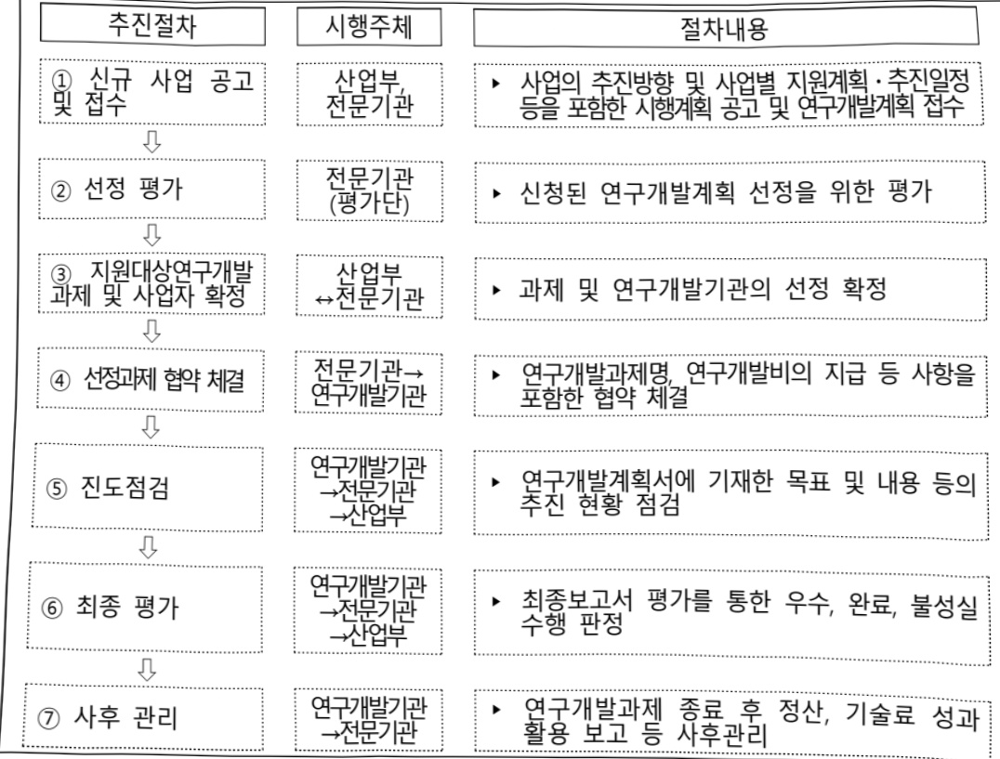

# 제조데이터표준·인공지능활용제품전주기탄소중립지원기술개…

**해당 페이지**: PDF 4315 ~ 4324 쪽 해당

**부처**: 산업통상부
**분야**: 산업·중소기업 및 에너지
**회계유형**: 일반회계
**2026 확정예산**: 7212.0 백만원
**전년대비 증감률**: 106.1%
**AI 도메인**: 데이터, 에너지

---

<table border=1 style='margin: auto; word-wrap: break-word;'><tr><td style='text-align: center; word-wrap: break-word;'>사 업 명</td></tr><tr><td style='text-align: center; word-wrap: break-word;'>(1) 제조데이터표준·인공지능활용제품전주기탄소중립지원기술개발(R&amp;D) (3174-366)</td></tr></table>

□ 사업 코드 정보

<table border=1 style='margin: auto; word-wrap: break-word;'><tr><td style='text-align: center; word-wrap: break-word;'>구분</td><td style='text-align: center; word-wrap: break-word;'>회계</td><td style='text-align: center; word-wrap: break-word;'>소관</td><td style='text-align: center; word-wrap: break-word;'>실국(기관)</td><td style='text-align: center; word-wrap: break-word;'>계정</td><td style='text-align: center; word-wrap: break-word;'>분야</td><td style='text-align: center; word-wrap: break-word;'>부문</td></tr><tr><td style='text-align: center; word-wrap: break-word;'>코드</td><td rowspan="2">일반회계</td><td rowspan="2">산업통상부</td><td rowspan="2">산업성장실산업인공지능정책국</td><td rowspan="2">-</td><td style='text-align: center; word-wrap: break-word;'>110</td><td style='text-align: center; word-wrap: break-word;'>117</td></tr><tr><td style='text-align: center; word-wrap: break-word;'>명칭</td><td style='text-align: center; word-wrap: break-word;'>산업·중소기업 및 에너지</td><td style='text-align: center; word-wrap: break-word;'>산업혁신지원</td></tr></table>

<table border=1 style='margin: auto; word-wrap: break-word;'><tr><td style='text-align: center; word-wrap: break-word;'>구분</td><td style='text-align: center; word-wrap: break-word;'>프로그램</td><td style='text-align: center; word-wrap: break-word;'>단위사업</td><td style='text-align: center; word-wrap: break-word;'>세부사업</td></tr><tr><td style='text-align: center; word-wrap: break-word;'>코드</td><td style='text-align: center; word-wrap: break-word;'>3100</td><td style='text-align: center; word-wrap: break-word;'>3174</td><td style='text-align: center; word-wrap: break-word;'>366</td></tr><tr><td style='text-align: center; word-wrap: break-word;'>명칭</td><td style='text-align: center; word-wrap: break-word;'>산업경쟁력기반구축</td><td style='text-align: center; word-wrap: break-word;'>우수기술역량강화</td><td style='text-align: center; word-wrap: break-word;'>제조데이터표준인공지능활용제품전주기반소중립지원기술개발(R&amp;D)</td></tr></table>

사업 성격 (공통요구자료 II-1 작성유의사항 4. 참조, 해당하는 사항에 “〇” 표시)

<table border=1 style='margin: auto; word-wrap: break-word;'><tr><td style='text-align: center; word-wrap: break-word;'>신규</td><td style='text-align: center; word-wrap: break-word;'>계속</td><td style='text-align: center; word-wrap: break-word;'>완료</td><td style='text-align: center; word-wrap: break-word;'>예비타당성 실시여부</td><td style='text-align: center; word-wrap: break-word;'>총사업비 관리대상</td><td style='text-align: center; word-wrap: break-word;'>총액계상 예산사업</td><td style='text-align: center; word-wrap: break-word;'>사업소관 변경정보 2025예산 시 소관</td></tr><tr><td style='text-align: center; word-wrap: break-word;'></td><td style='text-align: center; word-wrap: break-word;'>○</td><td style='text-align: center; word-wrap: break-word;'></td><td style='text-align: center; word-wrap: break-word;'></td><td style='text-align: center; word-wrap: break-word;'></td><td style='text-align: center; word-wrap: break-word;'></td><td style='text-align: center; word-wrap: break-word;'></td></tr></table>

사업지원형태 및 지원을(최소한 한 개는 반드시 선택하시오. 해당사항에 O 표시)

<table border=1 style='margin: auto; word-wrap: break-word;'><tr><td style='text-align: center; word-wrap: break-word;'>직접</td><td style='text-align: center; word-wrap: break-word;'>출자</td><td style='text-align: center; word-wrap: break-word;'>출연</td><td style='text-align: center; word-wrap: break-word;'>보조</td><td style='text-align: center; word-wrap: break-word;'>융자</td><td style='text-align: center; word-wrap: break-word;'>국고보조율(%)</td><td style='text-align: center; word-wrap: break-word;'>융자율(%)</td></tr><tr><td style='text-align: center; word-wrap: break-word;'></td><td style='text-align: center; word-wrap: break-word;'></td><td style='text-align: center; word-wrap: break-word;'>○</td><td style='text-align: center; word-wrap: break-word;'></td><td style='text-align: center; word-wrap: break-word;'></td><td style='text-align: center; word-wrap: break-word;'></td><td style='text-align: center; word-wrap: break-word;'></td></tr></table>

## 사업 담당자

<table border=1 style='margin: auto; word-wrap: break-word;'><tr><td style='text-align: center; word-wrap: break-word;'>사업명</td><td colspan="5">구분</td></tr><tr><td rowspan="2">제조데이터표준인공지능활용제품전주기탄소중립지원기술개발(R&amp;D)</td><td style='text-align: center; word-wrap: break-word;'>소관부처</td><td style='text-align: center; word-wrap: break-word;'>실·국·과(팀)산업성장실산업인공지능정책국산업인공지능정책과</td><td style='text-align: center; word-wrap: break-word;'>과 장송영진044-203-3830</td><td style='text-align: center; word-wrap: break-word;'>사무관조은형044-203-3832</td><td style='text-align: center; word-wrap: break-word;'>주무관조용우044-203-3834</td></tr><tr><td style='text-align: center; word-wrap: break-word;'>사업시행주체</td><td style='text-align: center; word-wrap: break-word;'>한국산업기술진흥원</td><td style='text-align: center; word-wrap: break-word;'>산업인공지능혁신실</td><td style='text-align: center; word-wrap: break-word;'>주소영 실장</td><td style='text-align: center; word-wrap: break-word;'>02-6009-3640</td></tr></table>

---

### 가.예산 총괄표

(단위:백만원,%)

<table border=1 style='margin: auto; word-wrap: break-word;'><tr><td rowspan="2">사업명</td><td rowspan="2">2024년 결산</td><td colspan="2">2025년 예산</td><td colspan="2">2026년</td><td rowspan="2">중감 (B-A)</td><td rowspan="2">(B-A)/A</td></tr><tr><td style='text-align: center; word-wrap: break-word;'>분예산(A)</td><td style='text-align: center; word-wrap: break-word;'>추경</td><td style='text-align: center; word-wrap: break-word;'>요구안</td><td style='text-align: center; word-wrap: break-word;'>확정(B)</td></tr><tr><td style='text-align: center; word-wrap: break-word;'>제조비표준인공지능 활용제품전기환소중립 지원기술개발(R&amp;D)</td><td style='text-align: center; word-wrap: break-word;'>-</td><td style='text-align: center; word-wrap: break-word;'>3,500</td><td style='text-align: center; word-wrap: break-word;'>-</td><td style='text-align: center; word-wrap: break-word;'>7,212</td><td style='text-align: center; word-wrap: break-word;'>7,212</td><td style='text-align: center; word-wrap: break-word;'>3,712</td><td style='text-align: center; word-wrap: break-word;'>106.1</td></tr></table>

□ 기능별(내역사업별), 목별 예산 내역

(단위:백만원)

<table border=1 style='margin: auto; word-wrap: break-word;'><tr><td rowspan="3"></td><td colspan="5">2024</td><td colspan="7">2025(2025.12월말)</td><td rowspan="3">2026예산</td></tr><tr><td rowspan="2">예산액(추경)</td><td rowspan="2">예산현액</td><td rowspan="2">집행액[실집행액]</td><td rowspan="2">이월액</td><td rowspan="2">불용액</td><td rowspan="2">본예산</td><td rowspan="2">예산현액</td><td rowspan="2">집행액[실집행액]</td><td colspan="2">전년도이월액제외</td><td rowspan="2">이월예상액</td><td rowspan="2">불용예상액</td></tr><tr><td style='text-align: center; word-wrap: break-word;'>예산현액</td><td style='text-align: center; word-wrap: break-word;'>집행액[실집행액]</td></tr><tr><td style='text-align: center; word-wrap: break-word;'>○ 기능별 분류(합계)</td><td style='text-align: center; word-wrap: break-word;'>-</td><td style='text-align: center; word-wrap: break-word;'>-</td><td style='text-align: center; word-wrap: break-word;'>-</td><td style='text-align: center; word-wrap: break-word;'>-</td><td style='text-align: center; word-wrap: break-word;'>-</td><td style='text-align: center; word-wrap: break-word;'>3,500</td><td style='text-align: center; word-wrap: break-word;'>3,500</td><td style='text-align: center; word-wrap: break-word;'>3,500[3,500]</td><td style='text-align: center; word-wrap: break-word;'>3,500</td><td style='text-align: center; word-wrap: break-word;'>3,500[3,500]</td><td style='text-align: center; word-wrap: break-word;'>-</td><td style='text-align: center; word-wrap: break-word;'>-</td><td style='text-align: center; word-wrap: break-word;'>7,212</td></tr><tr><td style='text-align: center; word-wrap: break-word;'>· 제조데이터표준인공지능활용제품전주기탄소중립지원기술개발</td><td style='text-align: center; word-wrap: break-word;'>-</td><td style='text-align: center; word-wrap: break-word;'>-</td><td style='text-align: center; word-wrap: break-word;'>-</td><td style='text-align: center; word-wrap: break-word;'>-</td><td style='text-align: center; word-wrap: break-word;'>-</td><td style='text-align: center; word-wrap: break-word;'>3,500</td><td style='text-align: center; word-wrap: break-word;'>3,500</td><td style='text-align: center; word-wrap: break-word;'>3,500[3,500]</td><td style='text-align: center; word-wrap: break-word;'>3,500</td><td style='text-align: center; word-wrap: break-word;'>3,500[3,500]</td><td style='text-align: center; word-wrap: break-word;'>-</td><td style='text-align: center; word-wrap: break-word;'>-</td><td style='text-align: center; word-wrap: break-word;'>7,212</td></tr><tr><td style='text-align: center; word-wrap: break-word;'>○ 비목별 분류(합계)</td><td style='text-align: center; word-wrap: break-word;'>-</td><td style='text-align: center; word-wrap: break-word;'>-</td><td style='text-align: center; word-wrap: break-word;'>-</td><td style='text-align: center; word-wrap: break-word;'>-</td><td style='text-align: center; word-wrap: break-word;'>-</td><td style='text-align: center; word-wrap: break-word;'>3,500</td><td style='text-align: center; word-wrap: break-word;'>3,500</td><td style='text-align: center; word-wrap: break-word;'>3,500[3,500]</td><td style='text-align: center; word-wrap: break-word;'>3,500</td><td style='text-align: center; word-wrap: break-word;'>3,500[3,500]</td><td style='text-align: center; word-wrap: break-word;'>-</td><td style='text-align: center; word-wrap: break-word;'>-</td><td style='text-align: center; word-wrap: break-word;'>7,212</td></tr><tr><td style='text-align: center; word-wrap: break-word;'>· 연구개발활동비등(360-05)</td><td style='text-align: center; word-wrap: break-word;'>-</td><td style='text-align: center; word-wrap: break-word;'>-</td><td style='text-align: center; word-wrap: break-word;'>-</td><td style='text-align: center; word-wrap: break-word;'>-</td><td style='text-align: center; word-wrap: break-word;'>-</td><td style='text-align: center; word-wrap: break-word;'>3,500</td><td style='text-align: center; word-wrap: break-word;'>3,500</td><td style='text-align: center; word-wrap: break-word;'>3,500[3,500]</td><td style='text-align: center; word-wrap: break-word;'>3,500</td><td style='text-align: center; word-wrap: break-word;'>3,500[3,500]</td><td style='text-align: center; word-wrap: break-word;'>-</td><td style='text-align: center; word-wrap: break-word;'>-</td><td style='text-align: center; word-wrap: break-word;'>7,212</td></tr><tr><td style='text-align: center; word-wrap: break-word;'>○ 기능비목별 분류(합계)</td><td style='text-align: center; word-wrap: break-word;'>-</td><td style='text-align: center; word-wrap: break-word;'>-</td><td style='text-align: center; word-wrap: break-word;'>-</td><td style='text-align: center; word-wrap: break-word;'>-</td><td style='text-align: center; word-wrap: break-word;'>-</td><td style='text-align: center; word-wrap: break-word;'>3,500</td><td style='text-align: center; word-wrap: break-word;'>3,500</td><td style='text-align: center; word-wrap: break-word;'>3,500[3,500]</td><td style='text-align: center; word-wrap: break-word;'>3,500</td><td style='text-align: center; word-wrap: break-word;'>3,500[3,500]</td><td style='text-align: center; word-wrap: break-word;'>-</td><td style='text-align: center; word-wrap: break-word;'>-</td><td style='text-align: center; word-wrap: break-word;'>7,212</td></tr><tr><td style='text-align: center; word-wrap: break-word;'>· 제조데이터표준인공지능활용제품전주기탄소중립지원기술개발(360-05)</td><td style='text-align: center; word-wrap: break-word;'>-</td><td style='text-align: center; word-wrap: break-word;'>-</td><td style='text-align: center; word-wrap: break-word;'>-</td><td style='text-align: center; word-wrap: break-word;'>-</td><td style='text-align: center; word-wrap: break-word;'>-</td><td style='text-align: center; word-wrap: break-word;'>3,500</td><td style='text-align: center; word-wrap: break-word;'>3,500</td><td style='text-align: center; word-wrap: break-word;'>3,500[3,500]</td><td style='text-align: center; word-wrap: break-word;'>3,500</td><td style='text-align: center; word-wrap: break-word;'>3,500[3,500]</td><td style='text-align: center; word-wrap: break-word;'>-</td><td style='text-align: center; word-wrap: break-word;'>-</td><td style='text-align: center; word-wrap: break-word;'>7,212</td></tr></table>

### 나.사업설명자료

## 1 ) 사업목적·내용

- (녹석) 글로벌 공급망 규제 관련 핵심산업 대상 제품 전주기 MCF 플랫폼 개발 및 제조데이터 표준(AAS*) 기반 핵심공정 탄소 저감기술 개발

* (AAS, Asset Administration Shell) 현실 세계의 물리적 자산을 가상 세계의 디지털 자산으로 구현하기 위한 표준 기반 인터페이스(통신, 데이터 모델, 자산의 사양 및 기능) 모델링 체계

- (내용) AAS 표준 기반 상호 호환·연계되는 제조데이터를 기반으로, 공정 운영 순

과정에서 발생하는 탄소 배출관리 통합 플랫폼 및 탄소 저감 AI 솔루션 개발

---

• AAS 표준을 활용한 제조데이터 기반의 공정 최적화 시뮬레이션 수행 및 기업에서 참고·활용할 수 있는 표준모델 개발

· 플랫폼과 연동되는 기계장비의 통합 탄소 배출 정보관리를 위한 데이터·AI 기반

탄소 배출 이력관리 및 분석 기능 구현

## 2 ) 사업개요

□ 사업근거 및 추진경위

① 법령상 근거 및 조항 적시

## o산업디지털전환촉진법제20조

## 산업 디지털 전환 촉진법

제20조(기술·서비스 개발 등의 촉진) 산업통상부장관은 산업 디지털 전환에 관한 기술·장비·소프트 웨어와 산업 디지털 전환을 통한 제품·서비스(이하 "기술등"이라 한다)의 개발을 촉진하기 위하여 다음 각 호의 사업을 추진할 수 있다.

1. 기술등에 관한 실태·통계 조사

2. 기술등의 개발 및 사업화

3. 개발된 기술등의 평가 및 활용

4. 기술등의 개발을 위한 기반 구축

5. 그 밖에 기술등의 개발을 위하여 필요한 사업

## o산업기술혁신 촉진법 제11조

## 산업기술혁신 촉진법

제11조(산업기술개발사업) ① 산업통상부장관은 혁신계획 및 시행계획을 효율적으로 수행하기 위하여 관계 중앙행정기관의 장과 협의하여 다음 각 호의 산업기술분야에서 기술개발사업(산업기술개발을 위하여 필요한 기획 및 조사를 포함한다. 이하 "산업기술개발사업"이라 한다)을 추진할 수 있다.

1. 산업의 공통적인 기반이 되는 생산기반 기술, 부품·소재 및 장비·설비(플랜트를 포함한다) 기술

2. 산업기술 분야의 미래 유망 기술

3. 산업의 고부가가치화를 위한 공정혁신, 청정생산 및 환경설비 등에 관련된 기술

4. 산업의 핵심기술의 집약에 필요한 엔지니어링·시스템 기술

## 중략

11. 개발된 산업기술의 사업화에 필요한 연계기술

12. 제1호부터 제10호까지의 기술 간 결합을 통한 시장지향형 융합기술

13. 그 밖에 산업기술혁신을 위하여 우선적으로 개발이 필요한 기술로서 산업통상부장관이 정하는 기술

② 산업통상부장관은 연구기관, 대학, 그 밖에 대통령령으로 정하는 기관·단체 또는 기업 등으로 하여금 산업기술개발사업을 수행하게 할 수 있다. 이 경우 산업통상부장관은 다음 각 호의 자와 산업기술개발사업에 관한 협약을 체결하고 해당 사업의 수행에 드는 비용의 전부 또는 일부를 출연·보조 또는 융자할 수 있다.

---

② 추진경위 - 사업 시작년도, 추진배경, 부처별 중점과제, 대통령 공약사항 등

- 디지털기반 산업 혁신성장전략 ('20.8월, 관계부처)

- 대-중견-중소 협업에 기초해 산업 전반에 DNA 기술을 접목하여 산업 밸류체인을 혁신하고 고부가가치화를 추진

산업 디지털전환 확산전략(디지털 BIG-PUSH) ('21.4월, 산업통상자원부)

산업 디지털 전환을 준비 ▶ 도입 ▶ 정착 ▶ 확산 ▶ 고도화 5단계로 구분하고, '25년까지 10개 업종 평균은 도입, 선도 30%는 확산 단계 진입 추진

○ 산업 디지털 전환 촉진법 시행 ('22.7월)

- 산업데이터 및 지능정보기술을 활용한 산업의 디지털 전환 촉진

- (주요내용) 종합계획, 표준화, 선도사업지원, 기술개발. 인력양성, 금융·세제 지원 등

°산업 AI 내재화 전략-제1차 산업 디지털 전환 종합계획 ('23.1월)

- AI내재화 공급산업 육성, 수요기업 AI 활용 역량 강화, 민간 주도 DX 생태계 조성

- (주요내용) 수요기업의 AI 활용을 용이하게 하고, 공급기업의 기술 역량 강화할 수 있는 주요 AI 기반 기술 확산 추진

○ 산업 AX를 위한 산업 데이터 활용 활성화 방안 ('24.10월)

- 글로벌 규제대응 EU디지털제품여권(DPP) 규제에 직면한 자동차·배터리, 섬유 업종 등은 제품 전주기 탄소배출량 측정 및 저감기술 개발

## □ 주요내용

① 사업규모

- 총사업비(해당되는 경우에만 기재) : 해당 없음

- 사업기간 : 2025년 ~ 2027년

- 최근 5년 간 투입된 사업비(예산액기준, 추경편성한 연도에는 추경포함)

<table border=1 style='margin: auto; word-wrap: break-word;'><tr><td style='text-align: center; word-wrap: break-word;'>연도</td><td style='text-align: center; word-wrap: break-word;'>2022</td><td style='text-align: center; word-wrap: break-word;'>2023</td><td style='text-align: center; word-wrap: break-word;'>2024</td><td style='text-align: center; word-wrap: break-word;'>2025</td><td style='text-align: center; word-wrap: break-word;'>2026</td></tr><tr><td style='text-align: center; word-wrap: break-word;'>사업비</td><td style='text-align: center; word-wrap: break-word;'>-</td><td style='text-align: center; word-wrap: break-word;'>-</td><td style='text-align: center; word-wrap: break-word;'>-</td><td style='text-align: center; word-wrap: break-word;'>3,500</td><td style='text-align: center; word-wrap: break-word;'>7,212</td></tr></table>

- 기타: 해당 없음

② 사업추진체계

- 사업시행방법 : 줄연(총사업비의 67% 이하(중소기업 기준))

- 사업시행주체 : 한국산업기술진흥원

- 사업 수혜자 : (주관) 해당 업종의 전문성을 보유한 비영리기관

(공동) 제조데이터 표준(AAS) 기반 가상제조 모델, MCF 기술개발

관련 데이터 제공 및 협업이 가능한 기업 등

- 보조, 융자, 출연, 출자 등의 경우 보조·융자 등 지원 비율 및 법적근거

<table border=1 style='margin: auto; word-wrap: break-word;'><tr><td style='text-align: center; word-wrap: break-word;'>내역사업명</td><td style='text-align: center; word-wrap: break-word;'>구분</td><td style='text-align: center; word-wrap: break-word;'>피보조·피출연 등 기관명</td><td style='text-align: center; word-wrap: break-word;'>지원 금액(2026예산)</td><td style='text-align: center; word-wrap: break-word;'>지원 비율(%)</td><td style='text-align: center; word-wrap: break-word;'>보조율 법적근거 (해당 조항)</td></tr><tr><td style='text-align: center; word-wrap: break-word;'>제조비태준인당층환율제품 전주기술소립 지원기술개발</td><td style='text-align: center; word-wrap: break-word;'>출연</td><td style='text-align: center; word-wrap: break-word;'>한국산업 기술진흥원</td><td style='text-align: center; word-wrap: break-word;'>7,212 백만원</td><td style='text-align: center; word-wrap: break-word;'>67%이내 (중소기업 기준)</td><td style='text-align: center; word-wrap: break-word;'>산업디지털전환촉진법 제103(기술·서비스개발 등의 촉진) 산업기술혁신촉진법 제11조(산업기술개발사업)</td></tr></table>

---

## 3 ) 2026년도 예산 산출 근거

☐ 제조데이터표준·인공지능활용제품전주기탄소중립지원기술개발(R&D) : (2025) 3,500백만원 → (2026 예산) 7,212백만원

- (요구) 설계한 플랫폼을 실제로 구현하고, AI와 디지털트윈 기술을 접목하여 탄소 배출량을 정확하게 측정· 저감할 수 있는 기술개발(3개 과제)에 총 7,212백만원 요구

- (산출) (계속) 7,212백만원 = 3개 과제 × 2,404백만원 × 12개월

02025년도 예산 및 2026년도 예산 산출 세부내역 비교

<table border=1 style='margin: auto; word-wrap: break-word;'><tr><td colspan="2">2025년 분예산</td><td colspan="2">2026년 예산</td></tr><tr><td style='text-align: center; word-wrap: break-word;'>예산</td><td style='text-align: center; word-wrap: break-word;'>산출내역</td><td style='text-align: center; word-wrap: break-word;'>예산</td><td style='text-align: center; word-wrap: break-word;'>산출내역</td></tr><tr><td rowspan="3">3,500 백만원</td><td style='text-align: center; word-wrap: break-word;'>연구개발활동비등(360-05): 3,500백만원</td><td colspan="2">연구개발활동비등(360-05): 7,212백만원</td></tr><tr><td style='text-align: center; word-wrap: break-word;'>- 제조데이터표준인공지능활용제품전주기탄소중립지원기술개발: 3,500백만원</td><td rowspan="2">7,212 백만원</td><td style='text-align: center; word-wrap: break-word;'>- 제조데이터표준인공지능활용제품전주기탄소중립지원기술개발: 7,212백만원</td></tr><tr><td style='text-align: center; word-wrap: break-word;'>• (신규) 3개 × 1,555.6백만 × 9/12개월</td><td style='text-align: center; word-wrap: break-word;'>• (계속) 3개 × 2,404백만 × 12/12개월</td></tr></table>

## 4 ) 사업효과

□ 사업영향, 산출물 성과지표 등

① 2022~2026년도 성과계획서 상 성과지표 및 최근 5년간 성과 달성도

<table border=1 style='margin: auto; word-wrap: break-word;'><tr><td style='text-align: center; word-wrap: break-word;'>성과지표</td><td style='text-align: center; word-wrap: break-word;'>구분</td><td style='text-align: center; word-wrap: break-word;'>2022</td><td style='text-align: center; word-wrap: break-word;'>2023</td><td style='text-align: center; word-wrap: break-word;'>2024</td><td style='text-align: center; word-wrap: break-word;'>2025</td><td style='text-align: center; word-wrap: break-word;'>2026</td><td style='text-align: center; word-wrap: break-word;'>2026 목표치산출근거</td><td style='text-align: center; word-wrap: break-word;'>측정산식(또는 측정방법)</td><td style='text-align: center; word-wrap: break-word;'>자료수집방법(또는 자료출처)</td></tr><tr><td rowspan="3">신규고용인원(단위:명)</td><td style='text-align: center; word-wrap: break-word;'>목표</td><td style='text-align: center; word-wrap: break-word;'>-</td><td style='text-align: center; word-wrap: break-word;'>-</td><td style='text-align: center; word-wrap: break-word;'>-</td><td style='text-align: center; word-wrap: break-word;'>7</td><td style='text-align: center; word-wrap: break-word;'>14</td><td rowspan="3">사업 추진을 통해 신규 고용된 인력 수 * 국비 5억원당 1명 채용</td><td rowspan="3">연도별 과제 관련 신규 고용인력 합계</td><td rowspan="3">고용계약서(기업 자체양식) 또는 건강보험자격득실 확인서, 건강보험 가입자 명부</td></tr><tr><td style='text-align: center; word-wrap: break-word;'>실적</td><td style='text-align: center; word-wrap: break-word;'>-</td><td style='text-align: center; word-wrap: break-word;'>-</td><td style='text-align: center; word-wrap: break-word;'>-</td><td style='text-align: center; word-wrap: break-word;'>-</td><td style='text-align: center; word-wrap: break-word;'>-</td></tr><tr><td style='text-align: center; word-wrap: break-word;'>달성도</td><td style='text-align: center; word-wrap: break-word;'>-</td><td style='text-align: center; word-wrap: break-word;'>-</td><td style='text-align: center; word-wrap: break-word;'>-</td><td style='text-align: center; word-wrap: break-word;'>-</td><td style='text-align: center; word-wrap: break-word;'>-</td></tr></table>

* 국가연구개발사업 전략계획서 검토 중으로 변경 가능

② 성과지표 이외의 연도별 사업추진 경과 및 실적

<table border=1 style='margin: auto; word-wrap: break-word;'><tr><td style='text-align: center; word-wrap: break-word;'>2022</td><td style='text-align: center; word-wrap: break-word;'>-</td></tr><tr><td style='text-align: center; word-wrap: break-word;'>2023</td><td style='text-align: center; word-wrap: break-word;'>-</td></tr><tr><td style='text-align: center; word-wrap: break-word;'>2024</td><td style='text-align: center; word-wrap: break-word;'>-</td></tr><tr><td style='text-align: center; word-wrap: break-word;'>2025</td><td style='text-align: center; word-wrap: break-word;'>(신규)자동차 배터리, 섬유, 전기전자 산업별 AI 활용 탄소중립지원 플랫폼 기술개발 과제 선정(&#x27;25.4월) 및 개발 추진</td></tr></table>

③ 향후(2026년도 이후) 기대효과 : 규제 대상 기업들이 활용할 탄소측정·저감이 가능한 핵심공정 가상화 모델 수 15건 및 플랫폼 기술개발을 통해 국내 기업의 EU CBAM, DPP 등 글로벌 규제 대응 역량을 강화하고 수출 활성화 지원할 기반 마련

---

## 5 ) 타당성조사 및 예비타당성조사 시행여부 및 결과 요지

☐ 타당성조사 보고서가 있는 경우는 편의/비용을 중심으로 내용을 요약제시(보고서 제목, 작성자(기관), 작성일 명시) : 해당 없음

□ 총사업비 500억원 이상인 경우 예비타당성조사 시행유무 및 그 결과요지 기재 : 해당 없음

□ 시행하지 않은 경우 그 이유를 적시 : 동 사업은 국가재정법 제38조, 동법 시행령 제13조의 예비타당성조사 대상(500억원 이상 신규사업) 조건에 해당되지 않음

## 6 ) 총사업비 대상사업 여부 및 내역 : 해당 없음

## 7 ) 사업 집행절차

---

## 8 ) 중기재정계획 상 연도별 투자계획 및 추진경과

(단위: 백만원)

<table border=1 style='margin: auto; word-wrap: break-word;'><tr><td style='text-align: center; word-wrap: break-word;'>중기 재정계획</td><td style='text-align: center; word-wrap: break-word;'>2024</td><td style='text-align: center; word-wrap: break-word;'>2025</td><td style='text-align: center; word-wrap: break-word;'>2026</td><td style='text-align: center; word-wrap: break-word;'>2027</td><td style='text-align: center; word-wrap: break-word;'>2028</td><td style='text-align: center; word-wrap: break-word;'>2029</td></tr><tr><td style='text-align: center; word-wrap: break-word;'>2024~2028</td><td style='text-align: center; word-wrap: break-word;'>-</td><td style='text-align: center; word-wrap: break-word;'>3,500</td><td style='text-align: center; word-wrap: break-word;'>11,220</td><td style='text-align: center; word-wrap: break-word;'>11,220</td><td style='text-align: center; word-wrap: break-word;'>-</td><td style='text-align: center; word-wrap: break-word;'></td></tr><tr><td style='text-align: center; word-wrap: break-word;'>2025~2029</td><td style='text-align: center; word-wrap: break-word;'></td><td style='text-align: center; word-wrap: break-word;'>3,500</td><td style='text-align: center; word-wrap: break-word;'>7,212</td><td style='text-align: center; word-wrap: break-word;'>5,280</td><td style='text-align: center; word-wrap: break-word;'>-</td><td style='text-align: center; word-wrap: break-word;'>-</td></tr></table>

9) 최근 3년간 동 사업에 대한 주요 외부지적사항 및 평가, 문제점 및 대책 : 해당 없음

## 10 ) 향후 추진방향 및 추진계획

<table border=1 style='margin: auto; word-wrap: break-word;'><tr><td style='text-align: center; word-wrap: break-word;'>- 탄소(환경) 규제의 효과적 대응을 위해서는 개별 기업 및 산업 공급망의 광범위한 데이터가 모두 취합되어야 할 필요</td></tr><tr><td style='text-align: center; word-wrap: break-word;'>- 민간 비즈니스 데이터를 주로 다루지만, 민간에 완전히 맡겨두기에는 초기정착· 보안·데이터주권 등 우려 → 정부 지원 하여 구축 필요</td></tr><tr><td style='text-align: center; word-wrap: break-word;'>- 글로벌 공급망 규제 관련 핵심산업 대상 제품 전주기 MCF 플랫폼 개발 및 의 제조 데이터 표준(AAS) 기반 핵심공정 탄소 저감기술 개발 추진</td></tr><tr><td style='text-align: center; word-wrap: break-word;'>- 동 사업은 ‘25년부터 ‘27년까지 반영된 예산사업으로 계획에 따라 예산 확보·집행 예정</td></tr></table>

11) 해당사업에 대한 각종 사업평가의 결과 : 해당 없음

12) 해당사업에 대한 부처 자체평가의 결과 : 해당 없음

13) 부처 건의사항 : 해당 없음

---

### 다. 최근 4년간 결산내역

## 1 ) 결산표

☐ 부처 결산내역

(단위: 백만원, %)

<table border=1 style='margin: auto; word-wrap: break-word;'><tr><td rowspan="2">闰도</td><td colspan="3">예산액</td><td rowspan="2">전년도이월액</td><td rowspan="2">이·전용등</td><td rowspan="2">예비비</td><td rowspan="2">예산현액(B)</td><td rowspan="2">집행액(C)</td><td rowspan="2">집행를(C/A)</td><td rowspan="2">집행를(C/B)</td><td rowspan="2">다음연도이월액</td><td rowspan="2">불용액</td></tr><tr><td colspan="2">본예산증감액</td><td style='text-align: center; word-wrap: break-word;'>추경(A)</td></tr><tr><td style='text-align: center; word-wrap: break-word;'>2022</td><td style='text-align: center; word-wrap: break-word;'>-</td><td style='text-align: center; word-wrap: break-word;'>-</td><td style='text-align: center; word-wrap: break-word;'>-</td><td style='text-align: center; word-wrap: break-word;'>-</td><td style='text-align: center; word-wrap: break-word;'>-</td><td style='text-align: center; word-wrap: break-word;'>-</td><td style='text-align: center; word-wrap: break-word;'>-</td><td style='text-align: center; word-wrap: break-word;'>-</td><td style='text-align: center; word-wrap: break-word;'>-</td><td style='text-align: center; word-wrap: break-word;'>-</td><td style='text-align: center; word-wrap: break-word;'>-</td><td style='text-align: center; word-wrap: break-word;'>-</td></tr><tr><td style='text-align: center; word-wrap: break-word;'>2023</td><td style='text-align: center; word-wrap: break-word;'>-</td><td style='text-align: center; word-wrap: break-word;'>-</td><td style='text-align: center; word-wrap: break-word;'>-</td><td style='text-align: center; word-wrap: break-word;'>-</td><td style='text-align: center; word-wrap: break-word;'>-</td><td style='text-align: center; word-wrap: break-word;'>-</td><td style='text-align: center; word-wrap: break-word;'>-</td><td style='text-align: center; word-wrap: break-word;'>-</td><td style='text-align: center; word-wrap: break-word;'>-</td><td style='text-align: center; word-wrap: break-word;'>-</td><td style='text-align: center; word-wrap: break-word;'>-</td><td style='text-align: center; word-wrap: break-word;'>-</td></tr><tr><td style='text-align: center; word-wrap: break-word;'>2024</td><td style='text-align: center; word-wrap: break-word;'>-</td><td style='text-align: center; word-wrap: break-word;'>-</td><td style='text-align: center; word-wrap: break-word;'>-</td><td style='text-align: center; word-wrap: break-word;'>-</td><td style='text-align: center; word-wrap: break-word;'>-</td><td style='text-align: center; word-wrap: break-word;'>-</td><td style='text-align: center; word-wrap: break-word;'>-</td><td style='text-align: center; word-wrap: break-word;'>-</td><td style='text-align: center; word-wrap: break-word;'>-</td><td style='text-align: center; word-wrap: break-word;'>-</td><td style='text-align: center; word-wrap: break-word;'>-</td><td style='text-align: center; word-wrap: break-word;'>-</td></tr><tr><td style='text-align: center; word-wrap: break-word;'>2025</td><td style='text-align: center; word-wrap: break-word;'>3,500</td><td style='text-align: center; word-wrap: break-word;'>-</td><td style='text-align: center; word-wrap: break-word;'>3,500</td><td style='text-align: center; word-wrap: break-word;'>-</td><td style='text-align: center; word-wrap: break-word;'>-</td><td style='text-align: center; word-wrap: break-word;'>-</td><td style='text-align: center; word-wrap: break-word;'>3,500</td><td style='text-align: center; word-wrap: break-word;'>3,500</td><td style='text-align: center; word-wrap: break-word;'>100.0</td><td style='text-align: center; word-wrap: break-word;'>100.0</td><td style='text-align: center; word-wrap: break-word;'>-</td><td style='text-align: center; word-wrap: break-word;'>-</td></tr></table>

□출연·보조사업 등 실집행내역

(단위: 백만원, %)

<table border=1 style='margin: auto; word-wrap: break-word;'><tr><td rowspan="3">구분</td><td colspan="3">부처</td><td colspan="6">사업시행주체(피출연·피보조 기관 등)</td></tr><tr><td colspan="2">예산액</td><td rowspan="2">집행액</td><td rowspan="2">교부액</td><td rowspan="2">전년도 이월액</td><td rowspan="2">교부 현액</td><td rowspan="2">집행액 (B)</td><td rowspan="2">이월액</td><td rowspan="2">불용액 (B/A)</td></tr><tr><td style='text-align: center; word-wrap: break-word;'>본예산</td><td style='text-align: center; word-wrap: break-word;'>추경(A)</td></tr><tr><td style='text-align: center; word-wrap: break-word;'>2022</td><td style='text-align: center; word-wrap: break-word;'>-</td><td style='text-align: center; word-wrap: break-word;'>-</td><td style='text-align: center; word-wrap: break-word;'>-</td><td style='text-align: center; word-wrap: break-word;'>-</td><td style='text-align: center; word-wrap: break-word;'>-</td><td style='text-align: center; word-wrap: break-word;'>-</td><td style='text-align: center; word-wrap: break-word;'>-</td><td style='text-align: center; word-wrap: break-word;'>-</td><td style='text-align: center; word-wrap: break-word;'>-</td></tr><tr><td style='text-align: center; word-wrap: break-word;'>2023</td><td style='text-align: center; word-wrap: break-word;'>-</td><td style='text-align: center; word-wrap: break-word;'>-</td><td style='text-align: center; word-wrap: break-word;'>-</td><td style='text-align: center; word-wrap: break-word;'>-</td><td style='text-align: center; word-wrap: break-word;'>-</td><td style='text-align: center; word-wrap: break-word;'>-</td><td style='text-align: center; word-wrap: break-word;'>-</td><td style='text-align: center; word-wrap: break-word;'>-</td><td style='text-align: center; word-wrap: break-word;'>-</td></tr><tr><td style='text-align: center; word-wrap: break-word;'>2024</td><td style='text-align: center; word-wrap: break-word;'>-</td><td style='text-align: center; word-wrap: break-word;'>-</td><td style='text-align: center; word-wrap: break-word;'>-</td><td style='text-align: center; word-wrap: break-word;'>-</td><td style='text-align: center; word-wrap: break-word;'>-</td><td style='text-align: center; word-wrap: break-word;'>-</td><td style='text-align: center; word-wrap: break-word;'>-</td><td style='text-align: center; word-wrap: break-word;'>-</td><td style='text-align: center; word-wrap: break-word;'>-</td></tr><tr><td style='text-align: center; word-wrap: break-word;'>2025.12월기준</td><td style='text-align: center; word-wrap: break-word;'>3,500</td><td style='text-align: center; word-wrap: break-word;'>3,500</td><td style='text-align: center; word-wrap: break-word;'>3,500</td><td style='text-align: center; word-wrap: break-word;'>3,500</td><td style='text-align: center; word-wrap: break-word;'>-</td><td style='text-align: center; word-wrap: break-word;'>-</td><td style='text-align: center; word-wrap: break-word;'>3,500</td><td style='text-align: center; word-wrap: break-word;'>-</td><td style='text-align: center; word-wrap: break-word;'>100.0</td></tr></table>

## 2 ) 주요 결산사항

□ 2022~2025년 결산 주요 지적사항 및 시정요구사항

<table border=1 style='margin: auto; word-wrap: break-word;'><tr><td rowspan="2">2022</td><td style='text-align: center; word-wrap: break-word;'>- &#x27;이·전용 등&#x27;의 상세내역 기술: 해당 사항 없음</td></tr><tr><td style='text-align: center; word-wrap: break-word;'>- 이·전용 등 사유: 해당 사항 없음</td></tr><tr><td style='text-align: center; word-wrap: break-word;'>~</td><td style='text-align: center; word-wrap: break-word;'>- 예비비 배정 사유: 해당 사항 없음</td></tr><tr><td rowspan="2">2025</td><td style='text-align: center; word-wrap: break-word;'>- 추경 편성 사유: 해당 사항 없음</td></tr><tr><td style='text-align: center; word-wrap: break-word;'>- 이월 사유 및 불용 사유(집행부진사유): 해당 사항 없음</td></tr></table>

□ 2025년 이·전용 등 세부내역 : 해당 사항 없음

□ 2025년 예비비 배정 세부내역 : 해당 사항 없음

---

### 라. 기타 추가자료

(1) 기재부에 제출한 사업 계획서 및 설명자료 첨부(필수 제출)

- (참고1) 사업 설명자료

---

## 참고1

□ (배경) 중건·중소기업들이 자체적 기술로 구현하는 비용과 인력의

한계를 극복하고 탄소 국제규범 대응 및 무역 경쟁력 강화를 위한 과제

현재 EU·미국 등은 탄소국경조정제도(CBAM), 제품전자여권(DPP) 등 자국에 수출하는 기업을 대상으로 제품 전주기(Scope 1~3 모두 포함) 탄소발자국 추적을 요구하는 규제 추진

- 미국 인플레이션 김축범(IRA)*, EU 탄소국경제도(CBAM)*, 디지털제품여권(DPP)* 등 법적 규제뿐만 아니라 민간 자체적인 규제(ESG 등)도 해결 필요

* 미국은 인플레이션 감축법(IRA)을 통해 에너지 안보/기후, 헬스케어 및 세금

인상안을 주요 정책으로 제시하여 업종별 대응 필요

**EU는 탄소국경제도(CBAM)와 디지털제품여권(DPP) 도입을 통해 제품별 탄소배출량을 검증하고 초과량에 대해 관세부과 예정

□ (목적) 글로벌 공급망 규제 관련 핵심산업 대상 제품 전주기 MCF 플랫폼 개발 및 의 제조데이터 표준(AAS) 기반 핵심공정 탄소 저감기술 개발

□ (기간) '25년 ~ '27년 (3년)

□ (지원 조건) 출연(총사업비의 67% 이내(중소기업 기준))

□ (추진 절차) 산업부총괄 → 전문기관사업기획·평가 → 연구기관과제수행

(주요 내용) AAS 표준 기반 상호 호환 연계되는 제조데이터를 기반으로, 공급망

손과정에서 발생하는 탄소 배출관리 통합 플랫폼 및 탄소 저감 AI 솔루션 개발

°탄소 배출 핵심공정의 AAS 표준 기반 표준 모델을 개발하고 탄소 취적화 시뮬레이터 및 AI 기반 탄소 저감기술 개발

ㅇ 기계 장비의 통합 탄소 배출 정보관리를 위한 데이터 · AI 기반 탄소

배출 이력관리 및 분석 기능 등 탄소 발자국 플랫폼 개발

---

### 원본 PDF 크롭 이미지

