# 조선해양산업기술개발(R&D)

**해당 페이지**: PDF 4331 ~ 4358 쪽 해당

**부처**: 산업통상부
**분야**: 산업·중소기업 및 에너지
**회계유형**: 일반회계
**2026 확정예산**: 194412.0 백만원
**전년대비 증감률**: None%
**AI 도메인**: 데이터, 교통/모빌리티, 제조/스마트팩토리, 해양/수산, 디지털전환(AX)

---

### 가. 예산 총괄표

(단위: 백만원, %)

<table border=1 style='margin: auto; word-wrap: break-word;'><tr><td rowspan="2">사업명</td><td rowspan="2">2024년 결산</td><td colspan="2">2025년 예산</td><td colspan="2">2026년</td><td rowspan="2">증감(B-A)</td><td rowspan="2">(B-A)/A</td></tr><tr><td style='text-align: center; word-wrap: break-word;'>본예산(A)</td><td style='text-align: center; word-wrap: break-word;'>추경</td><td style='text-align: center; word-wrap: break-word;'>요구안</td><td style='text-align: center; word-wrap: break-word;'>확정(B)</td></tr><tr><td style='text-align: center; word-wrap: break-word;'>조선해양산업기술개발</td><td style='text-align: center; word-wrap: break-word;'>77,225</td><td style='text-align: center; word-wrap: break-word;'>119,165</td><td style='text-align: center; word-wrap: break-word;'>119,165</td><td style='text-align: center; word-wrap: break-word;'>178,562</td><td style='text-align: center; word-wrap: break-word;'>194,412</td><td style='text-align: center; word-wrap: break-word;'>75,247</td><td style='text-align: center; word-wrap: break-word;'>63.1%</td></tr></table>

## □ 기능별(내역사업별), 목별 예산 내역

(단위:백만원)

<table border=1 style='margin: auto; word-wrap: break-word;'><tr><td rowspan="3"></td><td colspan="5">2024</td><td colspan="7">2025(2025.12월말)</td></tr><tr><td rowspan="2">예산액(추경)</td><td rowspan="2">예산현액</td><td rowspan="2">집행액[실집행액]</td><td rowspan="2">이월액</td><td rowspan="2">불용액</td><td rowspan="2">분예산</td><td rowspan="2">예산현액</td><td rowspan="2">집행액[실집행액]</td><td colspan="2">전년도 이월액제외</td><td rowspan="2">이월예상액</td><td rowspan="2">불용예상액</td></tr><tr><td style='text-align: center; word-wrap: break-word;'>예산현액</td><td style='text-align: center; word-wrap: break-word;'>집행액[실집행액]</td></tr><tr><td style='text-align: center; word-wrap: break-word;'>○ 기능별 분류(함께)</td><td style='text-align: center; word-wrap: break-word;'>77,225</td><td style='text-align: center; word-wrap: break-word;'>77,225</td><td style='text-align: center; word-wrap: break-word;'>77,225[77,225]</td><td style='text-align: center; word-wrap: break-word;'>-</td><td style='text-align: center; word-wrap: break-word;'>-</td><td style='text-align: center; word-wrap: break-word;'>119,165</td><td style='text-align: center; word-wrap: break-word;'>119,165[119,165]</td><td style='text-align: center; word-wrap: break-word;'>119,165</td><td style='text-align: center; word-wrap: break-word;'>119,165[119,165]</td><td style='text-align: center; word-wrap: break-word;'>-</td><td style='text-align: center; word-wrap: break-word;'>-</td><td style='text-align: center; word-wrap: break-word;'>194,412</td></tr><tr><td style='text-align: center; word-wrap: break-word;'>· 조선해양산업핵심기술개발</td><td style='text-align: center; word-wrap: break-word;'>38,541</td><td style='text-align: center; word-wrap: break-word;'>38,541</td><td style='text-align: center; word-wrap: break-word;'>38,541[38,541]</td><td style='text-align: center; word-wrap: break-word;'>-</td><td style='text-align: center; word-wrap: break-word;'>-</td><td style='text-align: center; word-wrap: break-word;'>66,840</td><td style='text-align: center; word-wrap: break-word;'>66,840[66,840]</td><td style='text-align: center; word-wrap: break-word;'>66,840</td><td style='text-align: center; word-wrap: break-word;'>66,840[66,840]</td><td style='text-align: center; word-wrap: break-word;'>-</td><td style='text-align: center; word-wrap: break-word;'>-</td><td style='text-align: center; word-wrap: break-word;'>106,855</td></tr><tr><td style='text-align: center; word-wrap: break-word;'>· 자율운항선박기술개발</td><td style='text-align: center; word-wrap: break-word;'>9,120</td><td style='text-align: center; word-wrap: break-word;'>9,120</td><td style='text-align: center; word-wrap: break-word;'>9,120[9,120]</td><td style='text-align: center; word-wrap: break-word;'>-</td><td style='text-align: center; word-wrap: break-word;'>-</td><td style='text-align: center; word-wrap: break-word;'>3,910</td><td style='text-align: center; word-wrap: break-word;'>3,910[3,910]</td><td style='text-align: center; word-wrap: break-word;'>3,910</td><td style='text-align: center; word-wrap: break-word;'>3,910[3,910]</td><td style='text-align: center; word-wrap: break-word;'>-</td><td style='text-align: center; word-wrap: break-word;'>-</td><td style='text-align: center; word-wrap: break-word;'>-</td></tr><tr><td style='text-align: center; word-wrap: break-word;'>· 친환경선박전주기핵심기술개발</td><td style='text-align: center; word-wrap: break-word;'>12,866</td><td style='text-align: center; word-wrap: break-word;'>12,866</td><td style='text-align: center; word-wrap: break-word;'>12,866[12,866]</td><td style='text-align: center; word-wrap: break-word;'>-</td><td style='text-align: center; word-wrap: break-word;'>-</td><td style='text-align: center; word-wrap: break-word;'>23,000</td><td style='text-align: center; word-wrap: break-word;'>23,000[23,000]</td><td style='text-align: center; word-wrap: break-word;'>23,000</td><td style='text-align: center; word-wrap: break-word;'>23,000[23,000]</td><td style='text-align: center; word-wrap: break-word;'>-</td><td style='text-align: center; word-wrap: break-word;'>-</td><td style='text-align: center; word-wrap: break-word;'>21,854</td></tr><tr><td style='text-align: center; word-wrap: break-word;'>· 선박해양의장설계디지털전환핵심기술개발</td><td style='text-align: center; word-wrap: break-word;'>2,482</td><td style='text-align: center; word-wrap: break-word;'>2,482</td><td style='text-align: center; word-wrap: break-word;'>2,482[2,482]</td><td style='text-align: center; word-wrap: break-word;'>-</td><td style='text-align: center; word-wrap: break-word;'>-</td><td style='text-align: center; word-wrap: break-word;'>5,000</td><td style='text-align: center; word-wrap: break-word;'>5,000[5,000]</td><td style='text-align: center; word-wrap: break-word;'>5,000</td><td style='text-align: center; word-wrap: break-word;'>5,000[5,000]</td><td style='text-align: center; word-wrap: break-word;'>-</td><td style='text-align: center; word-wrap: break-word;'>-</td><td style='text-align: center; word-wrap: break-word;'>4,285</td></tr><tr><td style='text-align: center; word-wrap: break-word;'>· 선박소부재생산지능화혁신기술개발</td><td style='text-align: center; word-wrap: break-word;'>4,216</td><td style='text-align: center; word-wrap: break-word;'>4,216</td><td style='text-align: center; word-wrap: break-word;'>4,216[4,216]</td><td style='text-align: center; word-wrap: break-word;'>-</td><td style='text-align: center; word-wrap: break-word;'>-</td><td style='text-align: center; word-wrap: break-word;'>7,270</td><td style='text-align: center; word-wrap: break-word;'>7,270[7,270]</td><td style='text-align: center; word-wrap: break-word;'>7,270</td><td style='text-align: center; word-wrap: break-word;'>7,270[7,270]</td><td style='text-align: center; word-wrap: break-word;'>-</td><td style='text-align: center; word-wrap: break-word;'>-</td><td style='text-align: center; word-wrap: break-word;'>6,163</td></tr><tr><td style='text-align: center; word-wrap: break-word;'>· 액체수소운반선상용화기반기술개발</td><td style='text-align: center; word-wrap: break-word;'>4,500</td><td style='text-align: center; word-wrap: break-word;'>4,500</td><td style='text-align: center; word-wrap: break-word;'>4,500[4,500]</td><td style='text-align: center; word-wrap: break-word;'>-</td><td style='text-align: center; word-wrap: break-word;'>-</td><td style='text-align: center; word-wrap: break-word;'>3,375</td><td style='text-align: center; word-wrap: break-word;'>3,375[3,375]</td><td style='text-align: center; word-wrap: break-word;'>3,375</td><td style='text-align: center; word-wrap: break-word;'>3,375[3,375]</td><td style='text-align: center; word-wrap: break-word;'>-</td><td style='text-align: center; word-wrap: break-word;'>-</td><td style='text-align: center; word-wrap: break-word;'>5,500</td></tr><tr><td style='text-align: center; word-wrap: break-word;'>· 해양모빌리티스마트페인팅시스템기술개발</td><td style='text-align: center; word-wrap: break-word;'>5,500</td><td style='text-align: center; word-wrap: break-word;'>5,500</td><td style='text-align: center; word-wrap: break-word;'>5,500[5,500]</td><td style='text-align: center; word-wrap: break-word;'>-</td><td style='text-align: center; word-wrap: break-word;'>-</td><td style='text-align: center; word-wrap: break-word;'>6,480</td><td style='text-align: center; word-wrap: break-word;'>6,480[6,480]</td><td style='text-align: center; word-wrap: break-word;'>6,480</td><td style='text-align: center; word-wrap: break-word;'>6,480[6,480]</td><td style='text-align: center; word-wrap: break-word;'>-</td><td style='text-align: center; word-wrap: break-word;'>-</td><td style='text-align: center; word-wrap: break-word;'>7,415</td></tr><tr><td style='text-align: center; word-wrap: break-word;'>· 조선산업생산협업디지털전환기술개발</td><td style='text-align: center; word-wrap: break-word;'>-</td><td style='text-align: center; word-wrap: break-word;'>-</td><td style='text-align: center; word-wrap: break-word;'>-</td><td style='text-align: center; word-wrap: break-word;'>-</td><td style='text-align: center; word-wrap: break-word;'>-</td><td style='text-align: center; word-wrap: break-word;'>3,290</td><td style='text-align: center; word-wrap: break-word;'>3,290[3,290]</td><td style='text-align: center; word-wrap: break-word;'>3,290</td><td style='text-align: center; word-wrap: break-word;'>3,290[3,290]</td><td style='text-align: center; word-wrap: break-word;'>-</td><td style='text-align: center; word-wrap: break-word;'>-</td><td style='text-align: center; word-wrap: break-word;'>3,990</td></tr><tr><td style='text-align: center; word-wrap: break-word;'>· 조선소중대형블록지능형핸들링 및취부/용접기술개발</td><td style='text-align: center; word-wrap: break-word;'>-</td><td style='text-align: center; word-wrap: break-word;'>-</td><td style='text-align: center; word-wrap: break-word;'>-</td><td style='text-align: center; word-wrap: break-word;'>-</td><td style='text-align: center; word-wrap: break-word;'>-</td><td style='text-align: center; word-wrap: break-word;'>-</td><td style='text-align: center; word-wrap: break-word;'>-</td><td style='text-align: center; word-wrap: break-word;'>-</td><td style='text-align: center; word-wrap: break-word;'>-</td><td style='text-align: center; word-wrap: break-word;'>-</td><td style='text-align: center; word-wrap: break-word;'>-</td><td style='text-align: center; word-wrap: break-word;'>5,000</td></tr><tr><td style='text-align: center; word-wrap: break-word;'>· 선박용CO2포집시스템기술개발</td><td style='text-align: center; word-wrap: break-word;'>-</td><td style='text-align: center; word-wrap: break-word;'>-</td><td style='text-align: center; word-wrap: break-word;'>-</td><td style='text-align: center; word-wrap: break-word;'>-</td><td style='text-align: center; word-wrap: break-word;'>-</td><td style='text-align: center; word-wrap: break-word;'>-</td><td style='text-align: center; word-wrap: break-word;'>-</td><td style='text-align: center; word-wrap: break-word;'>-</td><td style='text-align: center; word-wrap: break-word;'>-</td><td style='text-align: center; word-wrap: break-word;'>-</td><td style='text-align: center; word-wrap: break-word;'>-</td><td style='text-align: center; word-wrap: break-word;'>5,500</td></tr><tr><td style='text-align: center; word-wrap: break-word;'>및실증</td><td style='text-align: center; word-wrap: break-word;'>-</td><td style='text-align: center; word-wrap: break-word;'>-</td><td style='text-align: center; word-wrap: break-word;'>-</td><td style='text-align: center; word-wrap: break-word;'>-</td><td style='text-align: center; word-wrap: break-word;'>-</td><td style='text-align: center; word-wrap: break-word;'>-</td><td style='text-align: center; word-wrap: break-word;'>-</td><td style='text-align: center; word-wrap: break-word;'>-</td><td style='text-align: center; word-wrap: break-word;'>-</td><td style='text-align: center; word-wrap: break-word;'>-</td><td style='text-align: center; word-wrap: break-word;'>-</td><td style='text-align: center; word-wrap: break-word;'>6,000</td></tr><tr><td style='text-align: center; word-wrap: break-word;'>· 북극항로운항선박핵심기술개발</td><td style='text-align: center; word-wrap: break-word;'>-</td><td style='text-align: center; word-wrap: break-word;'>-</td><td style='text-align: center; word-wrap: break-word;'>-</td><td style='text-align: center; word-wrap: break-word;'>-</td><td style='text-align: center; word-wrap: break-word;'>-</td><td style='text-align: center; word-wrap: break-word;'>-</td><td style='text-align: center; word-wrap: break-word;'>-</td><td style='text-align: center; word-wrap: break-word;'>-</td><td style='text-align: center; word-wrap: break-word;'>-</td><td style='text-align: center; word-wrap: break-word;'>-</td><td style='text-align: center; word-wrap: break-word;'>-</td><td style='text-align: center; word-wrap: break-word;'>6,000</td></tr></table>

---

<table border=1 style='margin: auto; word-wrap: break-word;'><tr><td rowspan="2"></td><td colspan="4">2024</td><td colspan="7">2025(2025.12월말)</td><td style='text-align: center; word-wrap: break-word;'>2026예산</td><td style='text-align: center; word-wrap: break-word;'></td></tr><tr><td style='text-align: center; word-wrap: break-word;'>예산액(추정)</td><td style='text-align: center; word-wrap: break-word;'>예산현액</td><td style='text-align: center; word-wrap: break-word;'>집행액[실정행액]</td><td style='text-align: center; word-wrap: break-word;'>이월액</td><td style='text-align: center; word-wrap: break-word;'>불용액</td><td style='text-align: center; word-wrap: break-word;'>본예산</td><td style='text-align: center; word-wrap: break-word;'>예산현액</td><td style='text-align: center; word-wrap: break-word;'>집행액[실정행액]</td><td style='text-align: center; word-wrap: break-word;'>예산현액</td><td style='text-align: center; word-wrap: break-word;'>집행액[실정행액]</td><td style='text-align: center; word-wrap: break-word;'>이월예상액</td><td style='text-align: center; word-wrap: break-word;'>불용예상액</td><td style='text-align: center; word-wrap: break-word;'></td></tr><tr><td style='text-align: center; word-wrap: break-word;'>·자율운항선박AI데이터플랫폼기술개발·AI완전자율운항선박기술개발</td><td style='text-align: center; word-wrap: break-word;'>-</td><td style='text-align: center; word-wrap: break-word;'>-</td><td style='text-align: center; word-wrap: break-word;'>-</td><td style='text-align: center; word-wrap: break-word;'>-</td><td style='text-align: center; word-wrap: break-word;'>-</td><td style='text-align: center; word-wrap: break-word;'>-</td><td style='text-align: center; word-wrap: break-word;'>-</td><td style='text-align: center; word-wrap: break-word;'>-</td><td style='text-align: center; word-wrap: break-word;'>-</td><td style='text-align: center; word-wrap: break-word;'>-</td><td style='text-align: center; word-wrap: break-word;'>-</td><td style='text-align: center; word-wrap: break-word;'>6,000</td><td style='text-align: center; word-wrap: break-word;'></td></tr><tr><td style='text-align: center; word-wrap: break-word;'>○비목별분류(합계)</td><td style='text-align: center; word-wrap: break-word;'>77,225</td><td style='text-align: center; word-wrap: break-word;'>77,225</td><td style='text-align: center; word-wrap: break-word;'>77,225</td><td style='text-align: center; word-wrap: break-word;'>-</td><td style='text-align: center; word-wrap: break-word;'>-</td><td style='text-align: center; word-wrap: break-word;'>119,165</td><td style='text-align: center; word-wrap: break-word;'>119,165</td><td style='text-align: center; word-wrap: break-word;'>119,165</td><td style='text-align: center; word-wrap: break-word;'>119,165</td><td style='text-align: center; word-wrap: break-word;'>119,165</td><td style='text-align: center; word-wrap: break-word;'>-</td><td style='text-align: center; word-wrap: break-word;'>-194,412</td><td style='text-align: center; word-wrap: break-word;'></td></tr><tr><td style='text-align: center; word-wrap: break-word;'>·연구개발활동비등(360-05)</td><td style='text-align: center; word-wrap: break-word;'>77,225</td><td style='text-align: center; word-wrap: break-word;'>77,225</td><td style='text-align: center; word-wrap: break-word;'>77,225</td><td style='text-align: center; word-wrap: break-word;'>-</td><td style='text-align: center; word-wrap: break-word;'>-</td><td style='text-align: center; word-wrap: break-word;'>119,165</td><td style='text-align: center; word-wrap: break-word;'>119,165</td><td style='text-align: center; word-wrap: break-word;'>119,165</td><td style='text-align: center; word-wrap: break-word;'>119,165</td><td style='text-align: center; word-wrap: break-word;'>119,165</td><td style='text-align: center; word-wrap: break-word;'>-</td><td style='text-align: center; word-wrap: break-word;'>-194,412</td><td style='text-align: center; word-wrap: break-word;'></td></tr><tr><td style='text-align: center; word-wrap: break-word;'>○기능비목별분류(합계)</td><td style='text-align: center; word-wrap: break-word;'>77,225</td><td style='text-align: center; word-wrap: break-word;'>77,225</td><td style='text-align: center; word-wrap: break-word;'>77,225</td><td style='text-align: center; word-wrap: break-word;'>-</td><td style='text-align: center; word-wrap: break-word;'>-</td><td style='text-align: center; word-wrap: break-word;'>119,165</td><td style='text-align: center; word-wrap: break-word;'>119,165</td><td style='text-align: center; word-wrap: break-word;'>119,165</td><td style='text-align: center; word-wrap: break-word;'>119,165</td><td style='text-align: center; word-wrap: break-word;'>119,165</td><td style='text-align: center; word-wrap: break-word;'>-</td><td style='text-align: center; word-wrap: break-word;'>-194,412</td><td style='text-align: center; word-wrap: break-word;'></td></tr><tr><td rowspan="13">·조선해양산업핵심기술개발·연구개발활동비등(360-05)·자율운항선박기술개발·연구개발활동비등(360-05)·친환경선박전주기핵심기술개발·연구개발활동비등(360-05)·선박해양의장설계디지털전환핵심기술개발·연구개발활동비등(360-05)·선박소부재생산지능화혁신기술개발·연구개발활동비등(360-05)·액체수소운반선상용화기반기술개발·연구개발활동비등(360-05)·해양모빌리티스마트폐인팀시스템기술개발·연구개발활동비등(360-05)·조선산업생산협업디지털전환기술개발</td><td rowspan="13">38,541</td><td rowspan="13">38,541</td><td rowspan="13">38,541</td><td style='text-align: center; word-wrap: break-word;'>[38,541]</td><td style='text-align: center; word-wrap: break-word;'>-</td><td style='text-align: center; word-wrap: break-word;'>-</td><td style='text-align: center; word-wrap: break-word;'>66,840</td><td style='text-align: center; word-wrap: break-word;'>66,840</td><td style='text-align: center; word-wrap: break-word;'>66,840</td><td style='text-align: center; word-wrap: break-word;'>66,840</td><td style='text-align: center; word-wrap: break-word;'>-</td><td style='text-align: center; word-wrap: break-word;'>106,855</td><td style='text-align: center; word-wrap: break-word;'></td></tr><tr><td style='text-align: center; word-wrap: break-word;'>38,541</td><td style='text-align: center; word-wrap: break-word;'>-</td><td style='text-align: center; word-wrap: break-word;'>-</td><td style='text-align: center; word-wrap: break-word;'>66,840</td><td style='text-align: center; word-wrap: break-word;'>66,840</td><td style='text-align: center; word-wrap: break-word;'>66,840</td><td style='text-align: center; word-wrap: break-word;'>66,840</td><td style='text-align: center; word-wrap: break-word;'>-</td><td style='text-align: center; word-wrap: break-word;'>-</td><td style='text-align: center; word-wrap: break-word;'>106,855</td></tr><tr><td style='text-align: center; word-wrap: break-word;'>[38,541]</td><td style='text-align: center; word-wrap: break-word;'>-</td><td style='text-align: center; word-wrap: break-word;'>-</td><td style='text-align: center; word-wrap: break-word;'>3,910</td><td style='text-align: center; word-wrap: break-word;'>3,910</td><td style='text-align: center; word-wrap: break-word;'>3,910</td><td style='text-align: center; word-wrap: break-word;'>3,910</td><td style='text-align: center; word-wrap: break-word;'>-</td><td style='text-align: center; word-wrap: break-word;'>-</td><td style='text-align: center; word-wrap: break-word;'>-</td></tr><tr><td style='text-align: center; word-wrap: break-word;'>9,120</td><td style='text-align: center; word-wrap: break-word;'>-</td><td style='text-align: center; word-wrap: break-word;'>-</td><td style='text-align: center; word-wrap: break-word;'>3,910</td><td style='text-align: center; word-wrap: break-word;'>3,910</td><td style='text-align: center; word-wrap: break-word;'>3,910</td><td style='text-align: center; word-wrap: break-word;'>3,910</td><td style='text-align: center; word-wrap: break-word;'>-</td><td style='text-align: center; word-wrap: break-word;'>-</td><td style='text-align: center; word-wrap: break-word;'>-</td></tr><tr><td style='text-align: center; word-wrap: break-word;'>[9,120]</td><td style='text-align: center; word-wrap: break-word;'>-</td><td style='text-align: center; word-wrap: break-word;'>-</td><td style='text-align: center; word-wrap: break-word;'>3,910</td><td style='text-align: center; word-wrap: break-word;'>3,910</td><td style='text-align: center; word-wrap: break-word;'>3,910</td><td style='text-align: center; word-wrap: break-word;'>3,910</td><td style='text-align: center; word-wrap: break-word;'>-</td><td style='text-align: center; word-wrap: break-word;'>-</td><td style='text-align: center; word-wrap: break-word;'>-</td></tr><tr><td style='text-align: center; word-wrap: break-word;'>9,120</td><td style='text-align: center; word-wrap: break-word;'>-</td><td style='text-align: center; word-wrap: break-word;'>-</td><td style='text-align: center; word-wrap: break-word;'>3,910</td><td style='text-align: center; word-wrap: break-word;'>3,910</td><td style='text-align: center; word-wrap: break-word;'>3,910</td><td style='text-align: center; word-wrap: break-word;'>3,910</td><td style='text-align: center; word-wrap: break-word;'>-</td><td style='text-align: center; word-wrap: break-word;'>-</td><td style='text-align: center; word-wrap: break-word;'>-</td></tr><tr><td style='text-align: center; word-wrap: break-word;'>[9,120]</td><td style='text-align: center; word-wrap: break-word;'>-</td><td style='text-align: center; word-wrap: break-word;'>-</td><td style='text-align: center; word-wrap: break-word;'>3,910</td><td style='text-align: center; word-wrap: break-word;'>3,910</td><td style='text-align: center; word-wrap: break-word;'>3,910</td><td style='text-align: center; word-wrap: break-word;'>3,910</td><td style='text-align: center; word-wrap: break-word;'>-</td><td style='text-align: center; word-wrap: break-word;'>-</td><td style='text-align: center; word-wrap: break-word;'>-</td></tr><tr><td style='text-align: center; word-wrap: break-word;'>12,866</td><td style='text-align: center; word-wrap: break-word;'>-</td><td style='text-align: center; word-wrap: break-word;'>-</td><td style='text-align: center; word-wrap: break-word;'>23,000</td><td style='text-align: center; word-wrap: break-word;'>23,000</td><td style='text-align: center; word-wrap: break-word;'>23,000</td><td style='text-align: center; word-wrap: break-word;'>23,000</td><td style='text-align: center; word-wrap: break-word;'>-</td><td style='text-align: center; word-wrap: break-word;'>-</td><td style='text-align: center; word-wrap: break-word;'>21,854</td></tr><tr><td style='text-align: center; word-wrap: break-word;'>12,866</td><td style='text-align: center; word-wrap: break-word;'>-</td><td style='text-align: center; word-wrap: break-word;'>-</td><td style='text-align: center; word-wrap: break-word;'>23,000</td><td style='text-align: center; word-wrap: break-word;'>23,000</td><td style='text-align: center; word-wrap: break-word;'>23,000</td><td style='text-align: center; word-wrap: break-word;'>23,000</td><td style='text-align: center; word-wrap: break-word;'>-</td><td style='text-align: center; word-wrap: break-word;'>-</td><td style='text-align: center; word-wrap: break-word;'>21,854</td></tr><tr><td style='text-align: center; word-wrap: break-word;'>12,866</td><td style='text-align: center; word-wrap: break-word;'>-</td><td style='text-align: center; word-wrap: break-word;'>-</td><td style='text-align: center; word-wrap: break-word;'>23,000</td><td style='text-align: center; word-wrap: break-word;'>23,000</td><td style='text-align: center; word-wrap: break-word;'>23,000</td><td style='text-align: center; word-wrap: break-word;'>23,000</td><td style='text-align: center; word-wrap: break-word;'>-</td><td style='text-align: center; word-wrap: break-word;'>-</td><td style='text-align: center; word-wrap: break-word;'>21,854</td></tr><tr><td style='text-align: center; word-wrap: break-word;'>12,866</td><td style='text-align: center; word-wrap: break-word;'>-</td><td style='text-align: center; word-wrap: break-word;'>-</td><td style='text-align: center; word-wrap: break-word;'>23,000</td><td style='text-align: center; word-wrap: break-word;'>23,000</td><td style='text-align: center; word-wrap: break-word;'>23,000</td><td style='text-align: center; word-wrap: break-word;'>23,000</td><td style='text-align: center; word-wrap: break-word;'>-</td><td style='text-align: center; word-wrap: break-word;'>-</td><td style='text-align: center; word-wrap: break-word;'>21,854</td></tr><tr><td style='text-align: center; word-wrap: break-word;'>2,482</td><td style='text-align: center; word-wrap: break-word;'>2,482</td><td style='text-align: center; word-wrap: break-word;'>-</td><td style='text-align: center; word-wrap: break-word;'>5,000</td><td style='text-align: center; word-wrap: break-word;'>5,000</td><td style='text-align: center; word-wrap: break-word;'>5,000</td><td style='text-align: center; word-wrap: break-word;'>5,000</td><td style='text-align: center; word-wrap: break-word;'>-</td><td style='text-align: center; word-wrap: break-word;'>-</td><td style='text-align: center; word-wrap: break-word;'>4,285</td></tr><tr><td style='text-align: center; word-wrap: break-word;'>2,482</td><td style='text-align: center; word-wrap: break-word;'>2,482</td><td style='text-align: center; word-wrap: break-word;'>-</td><td style='text-align: center; word-wrap: break-word;'>5,000</td><td style='text-align: center; word-wrap: break-word;'>5,000</td><td style='text-align: center; word-wrap: break-word;'>5,000</td><td style='text-align: center; word-wrap: break-word;'>5</td><td style='text-align: center; word-wrap: break-word;'></td><td style='text-align: center; word-wrap: break-word;'></td><td style='text-align: center; word-wrap: break-word;'></td></tr></table>

---

<table border=1 style='margin: auto; word-wrap: break-word;'><tr><td rowspan="3"></td><td colspan="4">2024</td><td colspan="6">2025(2025.12월말)</td><td style='text-align: center; word-wrap: break-word;'>2026예산</td></tr><tr><td rowspan="2">예산액(추경)</td><td rowspan="2">예산현액</td><td rowspan="2">집행액[실집행액]</td><td rowspan="2">이월액</td><td rowspan="2">불용액</td><td rowspan="2">본예산</td><td rowspan="2">예산현액</td><td rowspan="2">집행액[실집행액]</td><td colspan="2">전년도이월액제외</td><td rowspan="2">불용예상액</td></tr><tr><td style='text-align: center; word-wrap: break-word;'>예산현액</td><td style='text-align: center; word-wrap: break-word;'>집행액[실집행액]</td></tr><tr><td style='text-align: center; word-wrap: break-word;'>- 연구개발활동비등(360-05)</td><td style='text-align: center; word-wrap: break-word;'>-</td><td style='text-align: center; word-wrap: break-word;'>-</td><td style='text-align: center; word-wrap: break-word;'>-</td><td style='text-align: center; word-wrap: break-word;'>-</td><td style='text-align: center; word-wrap: break-word;'>-</td><td style='text-align: center; word-wrap: break-word;'>3,290</td><td style='text-align: center; word-wrap: break-word;'>3,290</td><td style='text-align: center; word-wrap: break-word;'>3,290</td><td style='text-align: center; word-wrap: break-word;'>3,290</td><td style='text-align: center; word-wrap: break-word;'>-</td><td style='text-align: center; word-wrap: break-word;'>-</td></tr><tr><td style='text-align: center; word-wrap: break-word;'>- 조선소중대형블록지능형행들링및취부/용접기술개발</td><td style='text-align: center; word-wrap: break-word;'>-</td><td style='text-align: center; word-wrap: break-word;'>-</td><td style='text-align: center; word-wrap: break-word;'>-</td><td style='text-align: center; word-wrap: break-word;'>-</td><td style='text-align: center; word-wrap: break-word;'>-</td><td style='text-align: center; word-wrap: break-word;'>-</td><td style='text-align: center; word-wrap: break-word;'>-</td><td style='text-align: center; word-wrap: break-word;'>-</td><td style='text-align: center; word-wrap: break-word;'>-</td><td style='text-align: center; word-wrap: break-word;'>-</td><td style='text-align: center; word-wrap: break-word;'>5,000</td></tr><tr><td style='text-align: center; word-wrap: break-word;'>- 연구개발활동비등(360-05)</td><td style='text-align: center; word-wrap: break-word;'>-</td><td style='text-align: center; word-wrap: break-word;'>-</td><td style='text-align: center; word-wrap: break-word;'>-</td><td style='text-align: center; word-wrap: break-word;'>-</td><td style='text-align: center; word-wrap: break-word;'>-</td><td style='text-align: center; word-wrap: break-word;'>-</td><td style='text-align: center; word-wrap: break-word;'>-</td><td style='text-align: center; word-wrap: break-word;'>-</td><td style='text-align: center; word-wrap: break-word;'>-</td><td style='text-align: center; word-wrap: break-word;'>-</td><td style='text-align: center; word-wrap: break-word;'>5,000</td></tr><tr><td style='text-align: center; word-wrap: break-word;'>- 선박용CO2포집시스템기술개발및실증</td><td style='text-align: center; word-wrap: break-word;'>-</td><td style='text-align: center; word-wrap: break-word;'>-</td><td style='text-align: center; word-wrap: break-word;'>-</td><td style='text-align: center; word-wrap: break-word;'>-</td><td style='text-align: center; word-wrap: break-word;'>-</td><td style='text-align: center; word-wrap: break-word;'>-</td><td style='text-align: center; word-wrap: break-word;'>-</td><td style='text-align: center; word-wrap: break-word;'>-</td><td style='text-align: center; word-wrap: break-word;'>-</td><td style='text-align: center; word-wrap: break-word;'>-</td><td style='text-align: center; word-wrap: break-word;'>5,500</td></tr><tr><td style='text-align: center; word-wrap: break-word;'>- 연구개발활동비등(360-05)</td><td style='text-align: center; word-wrap: break-word;'>-</td><td style='text-align: center; word-wrap: break-word;'>-</td><td style='text-align: center; word-wrap: break-word;'>-</td><td style='text-align: center; word-wrap: break-word;'>-</td><td style='text-align: center; word-wrap: break-word;'>-</td><td style='text-align: center; word-wrap: break-word;'>-</td><td style='text-align: center; word-wrap: break-word;'>-</td><td style='text-align: center; word-wrap: break-word;'>-</td><td style='text-align: center; word-wrap: break-word;'>-</td><td style='text-align: center; word-wrap: break-word;'>-</td><td style='text-align: center; word-wrap: break-word;'>5,500</td></tr><tr><td style='text-align: center; word-wrap: break-word;'>- 북극항로운항선박핵심기술개발</td><td style='text-align: center; word-wrap: break-word;'>-</td><td style='text-align: center; word-wrap: break-word;'>-</td><td style='text-align: center; word-wrap: break-word;'>-</td><td style='text-align: center; word-wrap: break-word;'>-</td><td style='text-align: center; word-wrap: break-word;'>-</td><td style='text-align: center; word-wrap: break-word;'>-</td><td style='text-align: center; word-wrap: break-word;'>-</td><td style='text-align: center; word-wrap: break-word;'>-</td><td style='text-align: center; word-wrap: break-word;'>-</td><td style='text-align: center; word-wrap: break-word;'>-</td><td style='text-align: center; word-wrap: break-word;'>6,000</td></tr><tr><td style='text-align: center; word-wrap: break-word;'>- 연구개발활동비등(360-05)</td><td style='text-align: center; word-wrap: break-word;'>-</td><td style='text-align: center; word-wrap: break-word;'>-</td><td style='text-align: center; word-wrap: break-word;'>-</td><td style='text-align: center; word-wrap: break-word;'>-</td><td style='text-align: center; word-wrap: break-word;'>-</td><td style='text-align: center; word-wrap: break-word;'>-</td><td style='text-align: center; word-wrap: break-word;'>-</td><td style='text-align: center; word-wrap: break-word;'>-</td><td style='text-align: center; word-wrap: break-word;'>-</td><td style='text-align: center; word-wrap: break-word;'>-</td><td style='text-align: center; word-wrap: break-word;'>6,000</td></tr><tr><td style='text-align: center; word-wrap: break-word;'>- 자율운항선박AI데이터플랫폼기술개발</td><td style='text-align: center; word-wrap: break-word;'>-</td><td style='text-align: center; word-wrap: break-word;'>-</td><td style='text-align: center; word-wrap: break-word;'>-</td><td style='text-align: center; word-wrap: break-word;'>-</td><td style='text-align: center; word-wrap: break-word;'>-</td><td style='text-align: center; word-wrap: break-word;'>-</td><td style='text-align: center; word-wrap: break-word;'>-</td><td style='text-align: center; word-wrap: break-word;'>-</td><td style='text-align: center; word-wrap: break-word;'>-</td><td style='text-align: center; word-wrap: break-word;'>-</td><td style='text-align: center; word-wrap: break-word;'>6,000</td></tr><tr><td style='text-align: center; word-wrap: break-word;'>- 연구개발활동비등(360-05)</td><td style='text-align: center; word-wrap: break-word;'>-</td><td style='text-align: center; word-wrap: break-word;'>-</td><td style='text-align: center; word-wrap: break-word;'>-</td><td style='text-align: center; word-wrap: break-word;'>-</td><td style='text-align: center; word-wrap: break-word;'>-</td><td style='text-align: center; word-wrap: break-word;'>-</td><td style='text-align: center; word-wrap: break-word;'>-</td><td style='text-align: center; word-wrap: break-word;'>-</td><td style='text-align: center; word-wrap: break-word;'>-</td><td style='text-align: center; word-wrap: break-word;'>-</td><td style='text-align: center; word-wrap: break-word;'>6,000</td></tr><tr><td style='text-align: center; word-wrap: break-word;'>- AI완전자율운항선박기술개발</td><td style='text-align: center; word-wrap: break-word;'>-</td><td style='text-align: center; word-wrap: break-word;'>-</td><td style='text-align: center; word-wrap: break-word;'>-</td><td style='text-align: center; word-wrap: break-word;'>-</td><td style='text-align: center; word-wrap: break-word;'>-</td><td style='text-align: center; word-wrap: break-word;'>-</td><td style='text-align: center; word-wrap: break-word;'>-</td><td style='text-align: center; word-wrap: break-word;'>-</td><td style='text-align: center; word-wrap: break-word;'>-</td><td style='text-align: center; word-wrap: break-word;'>-</td><td style='text-align: center; word-wrap: break-word;'>15,850</td></tr><tr><td style='text-align: center; word-wrap: break-word;'>- 연구개발활동비등(360-05)</td><td style='text-align: center; word-wrap: break-word;'>-</td><td style='text-align: center; word-wrap: break-word;'>-</td><td style='text-align: center; word-wrap: break-word;'>-</td><td style='text-align: center; word-wrap: break-word;'>-</td><td style='text-align: center; word-wrap: break-word;'>-</td><td style='text-align: center; word-wrap: break-word;'>-</td><td style='text-align: center; word-wrap: break-word;'>-</td><td style='text-align: center; word-wrap: break-word;'>-</td><td style='text-align: center; word-wrap: break-word;'>-</td><td style='text-align: center; word-wrap: break-word;'>-</td><td style='text-align: center; word-wrap: break-word;'>15,850</td></tr></table>

---

### 나. 사업설명자료

## 1 ) 사업목적·내용

□ (조선해양산업기술개발) 해외 환경·안전규제 대응 및 갑시장 조기선점을 위한 미래형선박 및 해양플랜트 분야 핵심·원천 기술개발, 설계능력 고도화를 통한 조선해양·기자재 산업 진흥

- (조선해양산업핵심기술개발) 주요 수출국의 환경·안전규제 대응 및 新시장 조기선

점을 위한 미래형 조선 및 해양플랜트분야 핵심·원천 기술, 관련 기자재 개발

(친환경선박전주기핵심기술개발) IMO 규제 대응력 확보 및 연안·대양 선박의 동시 글로벌 미래 시장 선도를 위한 친환경선박 핵심기술 개발 및 실증, 국내외 기술표준화, 법·제도 개선 지원

- (선박해양의장설계디지털전환핵심기술개발) 선박·해양플랜트 의장설계의 디지털

전환 환경 구현 및 중소 조선사로 성과확산을 통한 생태계 강화

- (선박소부재생산지능화혁신기술개발) 조선업 시황 회복 및 4차 산업혁명 대응을 위해

소부재 생산 자동화 시스템 개발을 통한 조선소 생산 경쟁력 및 원가 절감 제고

- (액체수소운반선상용화기반기술개발) 탈탄소 사회 구현을 위한 수소 해상운반·저

장기술 확보로, 세계 1등 수소산업 육성 및 조선산업 초격차 경쟁력 확보

- (해양모빌리티스마트페인팅시스템기술개발) 선박 표면처리 및 페인팅 세부 공정의

특성을 반영한 취적 자동화 기술 확보 및 실증을 통한 조선업 생산 건조역량 확보 및 인력수급 대응

- (조선산업생산협업디지털전환기술개발) 세계 최초 및 최고 수준의 조선 협력사 전

용 디지털 생산관리·계획 시스템과 조선소-협력업체간 협업플랫폼 개발

- (조선소중대형블록지능형핸들링맞춰부/용접기술개발) 선박 블록의 중조립 공정의

혁신적인 생산시간 절감 및 품질향상을 위한 지능형 취부 및 용접 기술개발

- (선박용CO2포집시스템기술개발및실증) 국제해사기구 온실가스 배출 규제 대응을 위한 선박용 CO2 포집 시스템 개발 및 해상 실증을 통한 Track Record를 확보하여 선박용 CO2포집 시스템 신규시장 주도 기반 확보

- (북극항로운항선박핵심기술개발) 극지운항선박 모형시험 결과에 따른 설계, 최적

경로 운항, 추진 관련 기자재 등의 기술개발 및 성능검증

- (자율운항선박AI데이터플랫폼기술개발) 자율운항 플랫폼용 데이터의 확보를 위한 AI 데이터 센터 구축

- (AI완전자율운항선박기술개발) 무인항해, 지능형 기관 자동화 시스템, 화물·항만

연계 등 운용기술 개발 및 검인증·통합 실증 기술개발

---

## 2 ) 사업개요

## □ 사업근거 및 추진경위

① 법령상 근거 및 조항 적시

-산업기술혁신촉진법 제11조(산업기술개발사업)

- 환경친화적 선박의 개발 및 보급 촉진에 관한 법률 제8조(기술개발을 위한 지원시책)

② 추진경위

- 2018. 중견조선사 처리방안 발표(제14차 산경장)(18.3)

- 2018. 조선산업 발전전략 수립(관계부처 합동, '18.4)

- 2018. 조선산업 활력제고 방안 수립(관계부처 합동, '18.11)

- 2019. 조선산업 활력제고 방안 보완대책 수립(관계부처 합동, '19.4)

- 2019. 자율운항선박기술개발사업 예비타당성조사 최종 통과('19.10)

- 2020. 조선해양분야 5개 사업 조선해양산업기술개발사업으로 통합

* 조선해양산업핵심기술개발('09 ~ '19 일몰관리혁신), 중견조선소혁신성장개발('19 ~ '22), 친환경수소 연료선박R&D플랫폼구축('19 ~ '23), 자율운항선박기술개발('20 ~ '25), 중형선박설계경쟁력강화('18 ~ '21)

- 2021. K-조선 재도약 전략 수립(관계부처 합동, '21.9)

* 2. 친환경·스마트化 선도, 3. 조선산업 생태계 경쟁력 강화

-2022. 조선산업 초격차 확보 전략 수립(관계부처 합동, '22.10)

* 2. 미래 선박시장 주도권 선제 확보(친환경·디지털 전환 선도)

- 2023년도 환경친화적선박개발시행계획(산업부, '23.01)

- 제5차 과학기술기본계획('23~'27, '22.12.14, 국가과학기술자문회의)

* (86P) 미래 핵심 에너지지원으로 부상한 그린수소 활용(수소선박 등) 기술 확보

*(88P) 탄소기반 주력산업의 저탄소화를 위한 핵심기술 개발(저탄소.무탄소 선박 연료전환)

* (124P) 진환경 선박 기술 확보(온실가스 저감, 에너지효율 향상, 저탄소(LNG등), 무탄소(수소.암모니아), 청정동력(바이오.원자력), 벙커링 기술, 부유식 해상플랜트 등

- 제1차 국가연구개발 중장기 투자전략('23~'27, 과기정통부)

* 자율운항선박, 친환경선박 개발 중점지원, 생산성 향상을 위한 디지털전환 지원,

- K-조선 초격차 VISION 2040(산업부, '24.07)

* K-조선 10대 선도 플래그쉽 프로젝트

- 제1차 국가전략기술 육성 기본계획('24~28) '25년 시행계획(관계부처 합동, '25.03.12)

* 미래도전분야(수소)

-2026년도 국가연구개발 투자 방향 및 기준('25.3.13, 과기정통부)

(65P) 글로벌 환경규제 강화에 선제적으로 대응하기 위한 무탄소 연료·전기 추진시스템, 선박용

탄소포집 장치 등 개발 및 실증에 중점 투자

* (66P) 디지털 전환 선도를 위한 완전자율운항 선박 개발·실증, 설계 디지털전환, 생산성·안전성 개선을 위한 스마트 야드 구축 등 지속 지원

---

## □ 주요내용

① 사업규모

- 총사업비(해당되는 경우에만 기재) : 해당 없음

- 사업기간 : 2009년 ~ 계속(2020년 일몰관리혁신)

- 최근 5년 간 투입된 사업비(예산액기준, 추경편성한 연도에는 추경포함)

<table border=1 style='margin: auto; word-wrap: break-word;'><tr><td style='text-align: center; word-wrap: break-word;'>연도</td><td style='text-align: center; word-wrap: break-word;'>2022</td><td style='text-align: center; word-wrap: break-word;'>2023</td><td style='text-align: center; word-wrap: break-word;'>2024</td><td style='text-align: center; word-wrap: break-word;'>2025</td><td style='text-align: center; word-wrap: break-word;'>2026</td></tr><tr><td style='text-align: center; word-wrap: break-word;'>사업비</td><td style='text-align: center; word-wrap: break-word;'>53,410</td><td style='text-align: center; word-wrap: break-word;'>42,738</td><td style='text-align: center; word-wrap: break-word;'>77,225</td><td style='text-align: center; word-wrap: break-word;'>119,165</td><td style='text-align: center; word-wrap: break-word;'>194,412</td></tr></table>

- 기타: 해당 없음

② 사업추진체계

- 사업시행방법 : 출연

- 사업시행주체 : 한국산업기술기획평가원

- 사업 수혜자 : 기업, 대학, 연구소 등

- 보조, 융자, 출연, 출자 등의 경우 보조·융자 등 지원 비율 및 법적근거

<table border=1 style='margin: auto; word-wrap: break-word;'><tr><td style='text-align: center; word-wrap: break-word;'>내역사업명</td><td style='text-align: center; word-wrap: break-word;'>구분</td><td style='text-align: center; word-wrap: break-word;'>피보조·피출연 등 기관명</td><td style='text-align: center; word-wrap: break-word;'>지원 금액(2026예산)</td><td style='text-align: center; word-wrap: break-word;'>지원 비율(%)</td><td style='text-align: center; word-wrap: break-word;'>보조율 법적근거(해당 조항)</td></tr><tr><td style='text-align: center; word-wrap: break-word;'>조선해양산업핵심기술개발</td><td style='text-align: center; word-wrap: break-word;'>출연</td><td style='text-align: center; word-wrap: break-word;'>기업, 대학, 연구소 등</td><td style='text-align: center; word-wrap: break-word;'>106,855</td><td style='text-align: center; word-wrap: break-word;'>총 사업비의 100% 이내(과제성격 및 기관성격에 따라 차등 지원)</td><td style='text-align: center; word-wrap: break-word;'>산업기술혁신촉진법 제11조(산업기술개발사업)</td></tr><tr><td style='text-align: center; word-wrap: break-word;'>친환경선박전주기핵심기술개발</td><td style='text-align: center; word-wrap: break-word;'>출연</td><td style='text-align: center; word-wrap: break-word;'>기업, 대학, 연구소 등</td><td style='text-align: center; word-wrap: break-word;'>21,854</td><td style='text-align: center; word-wrap: break-word;'>총 사업비의 100% 이내(과제성격 및 기관성격에 따라 차등 지원)</td><td style='text-align: center; word-wrap: break-word;'>산업기술혁신촉진법 제11조(산업기술개발사업)</td></tr><tr><td style='text-align: center; word-wrap: break-word;'>선박해양의장설계디지털전환핵심기술개발</td><td style='text-align: center; word-wrap: break-word;'>출연</td><td style='text-align: center; word-wrap: break-word;'>기업, 대학, 연구소 등</td><td style='text-align: center; word-wrap: break-word;'>4,285</td><td style='text-align: center; word-wrap: break-word;'>총 사업비의 100% 이내(과제성격 및 기관성격에 따라 차등 지원)</td><td style='text-align: center; word-wrap: break-word;'>산업기술혁신촉진법 제11조(산업기술개발사업)</td></tr><tr><td style='text-align: center; word-wrap: break-word;'>선박소부재생산지능화혁신기술개발</td><td style='text-align: center; word-wrap: break-word;'>출연</td><td style='text-align: center; word-wrap: break-word;'>기업, 대학, 연구소 등</td><td style='text-align: center; word-wrap: break-word;'>6,163</td><td style='text-align: center; word-wrap: break-word;'>총 사업비의 100% 이내(과제성격 및 기관성격에 따라 차등 지원)</td><td style='text-align: center; word-wrap: break-word;'>산업기술혁신촉진법 제11조(산업기술개발사업)</td></tr><tr><td style='text-align: center; word-wrap: break-word;'>액체수소운반선상용화기반기술개발</td><td style='text-align: center; word-wrap: break-word;'>출연</td><td style='text-align: center; word-wrap: break-word;'>기업, 대학, 연구소 등</td><td style='text-align: center; word-wrap: break-word;'>5,500</td><td style='text-align: center; word-wrap: break-word;'>총 사업비의 100% 이내(과제성격 및 기관성격에 따라 차등 지원)</td><td style='text-align: center; word-wrap: break-word;'>산업기술혁신촉진법 제11조(산업기술개발사업)</td></tr><tr><td style='text-align: center; word-wrap: break-word;'>해양모빌리티스마트폐인팀시스템기술개발</td><td style='text-align: center; word-wrap: break-word;'>출연</td><td style='text-align: center; word-wrap: break-word;'>기업, 대학, 연구소 등</td><td style='text-align: center; word-wrap: break-word;'>7,415</td><td style='text-align: center; word-wrap: break-word;'>총 사업비의 100% 이내(과제성격 및 기관성격에 따라 차등 지원)</td><td style='text-align: center; word-wrap: break-word;'>산업기술혁신촉진법 제11조(산업기술개발사업)</td></tr><tr><td style='text-align: center; word-wrap: break-word;'>조선산업생산협업디지털전환기술개발</td><td style='text-align: center; word-wrap: break-word;'>출연</td><td style='text-align: center; word-wrap: break-word;'>기업, 대학, 연구소 등</td><td style='text-align: center; word-wrap: break-word;'>3,990</td><td style='text-align: center; word-wrap: break-word;'>총 사업비의 100% 이내(과제성격 및 기관성격에 따라 차등 지원)</td><td style='text-align: center; word-wrap: break-word;'>산업기술혁신촉진법 제11조(산업기술개발사업)</td></tr><tr><td style='text-align: center; word-wrap: break-word;'>조선소중대형블록지능형핸들링및취부/용접기술개발</td><td style='text-align: center; word-wrap: break-word;'>출연</td><td style='text-align: center; word-wrap: break-word;'>기업, 대학, 연구소 등</td><td style='text-align: center; word-wrap: break-word;'>5,000</td><td style='text-align: center; word-wrap: break-word;'>총 사업비의 100% 이내(과제성격 및 기관성격에 따라 차등 지원)</td><td style='text-align: center; word-wrap: break-word;'>산업기술혁신촉진법 제11조(산업기술개발사업)</td></tr><tr><td style='text-align: center; word-wrap: break-word;'>선박용CO2포집시스템기술개발및실증</td><td style='text-align: center; word-wrap: break-word;'>출연</td><td style='text-align: center; word-wrap: break-word;'>기업, 대학, 연구소 등</td><td style='text-align: center; word-wrap: break-word;'>5,500</td><td style='text-align: center; word-wrap: break-word;'>총 사업비의 100% 이내(과제성격 및 기관성격에 따라 차등 지원)</td><td style='text-align: center; word-wrap: break-word;'>산업기술혁신촉진법 제11조(산업기술개발사업)</td></tr><tr><td style='text-align: center; word-wrap: break-word;'>북극항로운항선박핵심기술개발</td><td style='text-align: center; word-wrap: break-word;'>출연</td><td style='text-align: center; word-wrap: break-word;'>기업, 대학, 연구소 등</td><td style='text-align: center; word-wrap: break-word;'>6,000</td><td style='text-align: center; word-wrap: break-word;'>총 사업비의 100% 이내(과제성격 및 기관성격에 따라 차등 지원)</td><td style='text-align: center; word-wrap: break-word;'>산업기술혁신촉진법 제11조(산업기술개발사업)</td></tr><tr><td style='text-align: center; word-wrap: break-word;'>자율운항선박AI데이터플랫폼기술개발</td><td style='text-align: center; word-wrap: break-word;'>출연</td><td style='text-align: center; word-wrap: break-word;'>기업, 대학, 연구소 등</td><td style='text-align: center; word-wrap: break-word;'>6,000</td><td style='text-align: center; word-wrap: break-word;'>총 사업비의 100% 이내(과제성격 및 기관성격에 따라 차등 지원)</td><td style='text-align: center; word-wrap: break-word;'>산업기술혁신촉진법 제11조(산업기술개발사업)</td></tr><tr><td style='text-align: center; word-wrap: break-word;'>AI완전자율운항선박기술개발</td><td style='text-align: center; word-wrap: break-word;'>출연</td><td style='text-align: center; word-wrap: break-word;'>기업, 대학, 연구소 등</td><td style='text-align: center; word-wrap: break-word;'>15,850</td><td style='text-align: center; word-wrap: break-word;'>총 사업비의 100% 이내(과제성격 및 기관성격에 따라 차등 지원)</td><td style='text-align: center; word-wrap: break-word;'>산업기술혁신촉진법 제11조(산업기술개발사업)</td></tr></table>

---

## 3 ) 2026년도 예산 산출 근거

①조선해양산업핵심기술개발

:(2025)66,840백만원→(2026)106,855백만원,40,015백만원 증액

- (요구) 미래형 조선·해양플랜트 핵심 원천 기술, 관련 기자재 개발을 위한 계속과제 및 신규과제 지원예산 106,855백만원 요구

- (산출) (계속) 27개 x 1,486.6백만원 x 12/12개월 = 40,137백만원

(계속) 13개 x 2,008.5백만원 x 10/12개월 = 21,759백만원

(종료) 11개 x 905.4백만원 x 12/12개월 = 9.959백만원

(신규, 다/상) 15개 x 1,333.3백만원 x 9/12개월 = 15,000백만원

(신규, 다/하) 20개 x 2,000백만원 x 6/12개월 = 20,000백만원

ㅇ 2025년도 예산 및 2026년도 예산 산출 세부내역 비교

<table border=1 style='margin: auto; word-wrap: break-word;'><tr><td colspan="2">2025년 본예산</td><td colspan="2">2026년 예산</td></tr><tr><td style='text-align: center; word-wrap: break-word;'>예산</td><td style='text-align: center; word-wrap: break-word;'>산출내역</td><td style='text-align: center; word-wrap: break-word;'>예산</td><td style='text-align: center; word-wrap: break-word;'>산출내역</td></tr><tr><td style='text-align: center; word-wrap: break-word;'>66,840</td><td style='text-align: center; word-wrap: break-word;'>○ 연구개발활동비 등(360-05): 66,840백만원
가. (기일차) 2971x1,300.3백만원x12/12=37,710백만원
나. (종료) 871x1,092.8백만원x12/12=8,742백만원
다. (다/상) 1571x1,812.3백만원x9/12=20,388백만원</td><td style='text-align: center; word-wrap: break-word;'>106,855</td><td style='text-align: center; word-wrap: break-word;'>○ 연구개발활동비 등(360-05): 106,855백만원
가. (계속) 2771x1,486.6백만원 x 12/12 = 40,137백만원
나. (계속) 1371x2,008.5백만원 x 10/12 = 21,759백만원
다. (종료) 1171x905.4백만원 x 12/12 = 9,959백만원
라. (신규, 다/상) 1571x1,333.3백만원 x 9/12 = 15,000백만원
마. (신규, 다/상) 2071x2,000백만원 x 6/12 = 20,000백만원</td></tr></table>

② 친환경선박전주기핵심기술개발

:(2025)23,000백만원→(2026)21,854백만원,1,146백만원감액

- (요구) 예타 설과에 따른 연사멸 예산배문 및 주진계획의 차질없는 이행을 위해 '26년 필요예산 21,854백만원 요구

- (산출) (기일치) 6개 x 1,982.2백만원 x 12/12개월 = 11,893백만원

(종료) 2개 x 916.5백만원 x 12/12개월 = 1,833백만원

(종료) 1개 x 3,904백만원 x 9/12개월 = 2,928백만원

(신규, 다/상) 2개 x 3,466.7백만원 x 9/12개월 = 5,200백만원

ㅇ 2025년도 예산 및 2026년도 예산 산출 세부내역 비교

<table border=1 style='margin: auto; word-wrap: break-word;'><tr><td rowspan="2">예산</td><td colspan="2">2025년 본예산</td><td colspan="2">2026년 예산</td></tr><tr><td style='text-align: center; word-wrap: break-word;'>산출내역</td><td style='text-align: center; word-wrap: break-word;'>예산</td><td colspan="2">산출내역</td></tr><tr><td style='text-align: center; word-wrap: break-word;'>23,000</td><td style='text-align: center; word-wrap: break-word;'>연구개발활동비 등(360-05): 23,000백만원가. (기일치) 10개×1,762,444백만원×12/12=17,624백만원나. (다/상) 2개×3,584백만원×9/12=5,376백만원</td><td style='text-align: center; word-wrap: break-word;'>21,854</td><td colspan="2">연구개발활동비 등(360-05): 21,854백만원가. (기일치) 6개×1,982.2백만원×12/12=11,893백만원나. (종료) 2개×916.5백만원×12/12=1,833백만원다. (종료) 1개×3,904백만원×9/12=2,928백만원라. (신규, 다/상) 2개×3,466.7백만원×9/12=5,200백만원</td></tr></table>

③ 선박해양의장설계디지털전환핵심기술개발

:(2025)5,000백만원→(2026)4,285백만원,715백만원 감액

- (요구) 설계분야 디지털 전환으로 디지털 기반 생산 전략의 효과 극대화를 위해 개발이 필요한 계속과제 5건 지원예산 4,285백만원 요구

- (산출) (기일치) 5개 x 857백만원 x 12/12개월 = 4,285백만원

ㅇ 2025년도 예산 및 2026년도 예산 산출 세부내역 비교

<table border=1 style='margin: auto; word-wrap: break-word;'><tr><td colspan="2">2025년 본예산</td><td colspan="2">2026년 예산</td></tr><tr><td style='text-align: center; word-wrap: break-word;'>예산</td><td style='text-align: center; word-wrap: break-word;'>산출내역</td><td style='text-align: center; word-wrap: break-word;'>예산</td><td style='text-align: center; word-wrap: break-word;'>산출내역</td></tr><tr><td style='text-align: center; word-wrap: break-word;'>5,000</td><td style='text-align: center; word-wrap: break-word;'>○ 연구개발활동비 등(360-05): 5,000백만원 가. (기일치) 5개x1,000백만원x12/12=5,000백만원</td><td style='text-align: center; word-wrap: break-word;'>4,285</td><td style='text-align: center; word-wrap: break-word;'>○ 연구개발활동비 등(360-05): 4,285백만원 가. (기일치) 5개 x 857백만원 x 12/12 = 4,285백만원</td></tr></table>

④ 선박소부재생산지능화혁신기술개발

: (2025) 7,270백만원 → (2026) 6,163백만원, 1,107백만원 감액

- (요구) 소조림 4단계(배재, 취부, 용접, 검사) 및 선박 소부재생산 통합관리시스템 개발을 위한 계속과제 5건 지원예산 6,163백만원 요구

- (산출) (기일치) 5개 x 1,232.6백만원 x 12/12개월 = 6,163백만원

---

2025년도 예산 및 2026년도 예산 산출 세부내역 비교

<table border=1 style='margin: auto; word-wrap: break-word;'><tr><td colspan="2">2025년 본예산</td><td colspan="2">2026년 예산</td></tr><tr><td style='text-align: center; word-wrap: break-word;'>예산</td><td style='text-align: center; word-wrap: break-word;'>산출내역</td><td style='text-align: center; word-wrap: break-word;'>예산</td><td style='text-align: center; word-wrap: break-word;'>산출내역</td></tr><tr><td style='text-align: center; word-wrap: break-word;'>7,270</td><td style='text-align: center; word-wrap: break-word;'>연구개발활동비 등(360-05): 7,270백만원 가.(기일치) 5개1,454백만원×12/12=7,270백만원</td><td style='text-align: center; word-wrap: break-word;'>6,163</td><td style='text-align: center; word-wrap: break-word;'>연구개발활동비 등(360-05): 6,163백만원 가.(기일치) 5개1,232.6백만원×12/12=6,163백만원</td></tr></table>

## ⑤ 액체수소운반선상용화기반기술개발

: (2025) 3,375 백만원 → (2026) 5,500 백만원, 2,125 백만원 증액

- (요구) 탈탄소 사회 구현을 위한 수소 해상운반 · 저장기술 확보를 위해 액체수소 운반시험선 건조 및 실증에 소요되는 계속과제 예산 5,500 백만원 요구

- (산출) (계속) 3개 x 2,200 백만원 x 10/12개월 = 5,500 백만원

- 2025년도 예산 및 2026년도 예산 사측 백분내용 비교

02025년도 예산 및 2026년도 예산 산출 세부내역 비교

<table border=1 style='margin: auto; word-wrap: break-word;'><tr><td colspan="2">2025년 본예산</td><td colspan="2">2026년 예산</td></tr><tr><td style='text-align: center; word-wrap: break-word;'>예산</td><td style='text-align: center; word-wrap: break-word;'>산출내역</td><td style='text-align: center; word-wrap: break-word;'>예산</td><td style='text-align: center; word-wrap: break-word;'>산출내역</td></tr><tr><td style='text-align: center; word-wrap: break-word;'>3,375</td><td style='text-align: center; word-wrap: break-word;'>연구개발활동비 등(360-05): 3,375백만원 가.(계속) 3개x1,125백만원x12/12=3,375백만원</td><td style='text-align: center; word-wrap: break-word;'>5,500</td><td style='text-align: center; word-wrap: break-word;'>연구개발활동비 등(360-05): 5,500백만원 가.(계속) 3개x2,200백만원x10/12=5,500백만원</td></tr></table>

## ⑥ 해양모빌리티스마트페인팅시스템기술개발

: (2025) 6,480백만원 → (2026) 7,415백만원, 935백만원 증액

- (요구) 조선업 생산 건조역량 확보로 지속가능한 조선산업 생산기술 경쟁력 향상을 위해 해양모 빌리티 스마트 페인팅 시스템기술 개발 계속과제 지원예산 7,415백만원 요구

- (산출) (기일치) 4개 x 1,853.8백만원 x 12/12개월 = 7,415백만원

- 2025년도 예산 및 2026년도 예산 산출 세부내역 비교

<table border=1 style='margin: auto; word-wrap: break-word;'><tr><td colspan="2">2025년 본예산</td><td colspan="2">2026년 예산</td></tr><tr><td style='text-align: center; word-wrap: break-word;'>예산</td><td style='text-align: center; word-wrap: break-word;'>산출내역</td><td style='text-align: center; word-wrap: break-word;'>예산</td><td style='text-align: center; word-wrap: break-word;'>산출내역</td></tr><tr><td style='text-align: center; word-wrap: break-word;'>6,480</td><td style='text-align: center; word-wrap: break-word;'>○ 연구개발활동비 등(360-05): 6,480백만원 가. (기일치) 4개×1,620백만원×12/12=6,480백만원</td><td style='text-align: center; word-wrap: break-word;'>7,415</td><td style='text-align: center; word-wrap: break-word;'>○ 연구개발활동비 등(360-05): 7,415백만원 가. (기일치) 4개×1,853.8백만원×12/12=7,415백만원</td></tr></table>

## ⑦ 조선산업생산협업디지털전환기술개발

: (2025) 3,290백만원 → (2026) 3,990백만원, 700백만원 증액

- (요구) 조선소-협력업체 협업 플랫폼을 통한 생산 리드타임 30% 절감 기술개발을 위한 계속과 제 지원예산 3,990백만원 요구

- (산출) (기일치) 5개 x 798백만원 x 12/12개월 = 3,990백만원

02025년도 예산 및 2026년도 예산 산출 세부내역 비교

<table border=1 style='margin: auto; word-wrap: break-word;'><tr><td colspan="2">2025년 분예산</td><td colspan="2">2026년 예산</td></tr><tr><td style='text-align: center; word-wrap: break-word;'>예산</td><td style='text-align: center; word-wrap: break-word;'>산출내역</td><td style='text-align: center; word-wrap: break-word;'>예산</td><td style='text-align: center; word-wrap: break-word;'>산출내역</td></tr><tr><td style='text-align: center; word-wrap: break-word;'>3,290</td><td style='text-align: center; word-wrap: break-word;'>연구개발활동비 등(360-05): 3,290백만원 가.(다/상) 5개x877.3백만원x9/12=3,290백만</td><td style='text-align: center; word-wrap: break-word;'>3,990</td><td style='text-align: center; word-wrap: break-word;'>연구개발활동비 등(360-05): 3,990백만원 가.(기일치) 5개x798백만원x12/12=3,990백만</td></tr></table>

## 8 조선소중대형블록지능형핸들링및취부/용접기술개발

: (2025) - → (2026) 5,000백만원, 순종

- (요구) 조선해양산업의 인력난 심화, 선박블록 납기지연에 따른 어려움을 해결하기 위해 블록 생산공정의 디지털전환(DX) 기술개발 신규과제 지원예산 5,000백만원 요구

- (산출) (신규, 다/상) 5개 x 1,333.3백만원 x 9/12개월 = 5,000백만원

○ 2025년도 예산 및 2026년도 예산 산출 세부내역 비교

<table border=1 style='margin: auto; word-wrap: break-word;'><tr><td rowspan="2">예산</td><td colspan="2">2025년 본예산</td><td colspan="2">2026년 예산</td></tr><tr><td style='text-align: center; word-wrap: break-word;'>산출내역</td><td style='text-align: center; word-wrap: break-word;'>예산</td><td colspan="2">산출내역</td></tr><tr><td style='text-align: center; word-wrap: break-word;'>-</td><td style='text-align: center; word-wrap: break-word;'>-</td><td style='text-align: center; word-wrap: break-word;'>5,000</td><td colspan="2">○ 연구개발활동비 등(360-05): 5,000백만원 가. (신규, 다/상) 5개 × 1,333.3백만원 × 9/12 = 5,000백만원</td></tr></table>

⑨ 선박용CO2포집시스템기술개발및실증 : (2025) - → (2026) 5,500백만원, 순증

---

- (요구) LNG 추진 선박의 발주가 장기화될 것으로 예상됨에 따른 추진 에너지 저감 장치 및 온 실가스 배출 저감 장치 기술개발 신규과제 지원예산 5,500백만원 요구

- (산출) (신규, 다/상) 5개 x 1,466.7백만원 x 9/12개월 = 5,500백만원

0 2025년도 예산 및 2026년도 예산 산출 세부내역 비교

<table border=1 style='margin: auto; word-wrap: break-word;'><tr><td colspan="2">2025년 본예산</td><td colspan="2">2026년 예산</td></tr><tr><td style='text-align: center; word-wrap: break-word;'>예산</td><td style='text-align: center; word-wrap: break-word;'>산출내역</td><td style='text-align: center; word-wrap: break-word;'>예산</td><td style='text-align: center; word-wrap: break-word;'>산출내역</td></tr><tr><td style='text-align: center; word-wrap: break-word;'>-</td><td style='text-align: center; word-wrap: break-word;'>-</td><td style='text-align: center; word-wrap: break-word;'>5,500</td><td style='text-align: center; word-wrap: break-word;'>○ 연구개발활동비  등(360-05): 5,500백만원 가. (신규, 다/상) 5개 x 1,466.7백만원 x 9/12 = 5,500백만원</td></tr></table>

## 10 북극항로운항선박핵심기술개발

:(2025)-→(2026)6,000백만원,순증

- (요구) 북극항로 시대를 주도하기 위한 설계-운항-기자재 기술개발 및 성능검증 기술개발을 위한 신규과제 지원예산 6,000백만원 요구

- (산출) (신규, 다/상) 5개 x 1,600백만원 x 9/12개월 = 6,000백만원

ㅇ 2025년도 예산 및 2026년도 예산 산출 세부내역 비교

<table border=1 style='margin: auto; word-wrap: break-word;'><tr><td colspan="2">2025년 본예산</td><td colspan="2">2026년 예산</td></tr><tr><td style='text-align: center; word-wrap: break-word;'>예산</td><td style='text-align: center; word-wrap: break-word;'>산출내역</td><td style='text-align: center; word-wrap: break-word;'>예산</td><td style='text-align: center; word-wrap: break-word;'>산출내역</td></tr><tr><td style='text-align: center; word-wrap: break-word;'>-</td><td style='text-align: center; word-wrap: break-word;'>-</td><td style='text-align: center; word-wrap: break-word;'>6,000</td><td style='text-align: center; word-wrap: break-word;'>○ 연구개발활동비 등(360-05): 6,000백만원 가. (신규, 다/상) 5개 x 1,600백만원 x 9/12 = 6,000백만원</td></tr></table>

## 11 자율운항선박AI데이터플랫폼기술개발

:(2025)-→(2026)6,000백만원,순증

- (요구) 국내 운항 중인 관공선 또는 상선을 대상으로 조선해양 AI 데이터 센터 기반의 데이터 수집/분석/활용기술 개발을 위한 신규과제 지원예산 6,000백만원 요구

- (산출) (신규, 다/상) 4개 x 2,000백만원 x 9/12개월 = 6,000백만원

ㅇ 2025년도 예산 및 2026년도 예산 산출 세부내역 비교

<table border=1 style='margin: auto; word-wrap: break-word;'><tr><td colspan="2">2025년 본예산</td><td colspan="2">2026년 예산</td></tr><tr><td style='text-align: center; word-wrap: break-word;'>예산</td><td style='text-align: center; word-wrap: break-word;'>산출내역</td><td style='text-align: center; word-wrap: break-word;'>예산</td><td style='text-align: center; word-wrap: break-word;'>산출내역</td></tr><tr><td style='text-align: center; word-wrap: break-word;'>-</td><td style='text-align: center; word-wrap: break-word;'>-</td><td style='text-align: center; word-wrap: break-word;'>6,000</td><td style='text-align: center; word-wrap: break-word;'>○ 연구개발활동비 등(360-05): 6,000백만원 가. (신규, 다/상) 4개 x 2,000백만원 x 9/12 = 6,000백만원</td></tr></table>

## 12 AI완전자율운항선박기술개발

:(2025)-→(2026)15,850백만원,순증

- (요구) 미래모빌리티(조선) 초격차 로드맵의 스마트 완전자율운항선박 기술개발을 위한 신규과제 지원예산 15,850백만원 요구

- (산출) (신규, 다/상) 15개 x 2,113.3백만원 x 6/12개월 = 15,850백만원

ㅇ 2025년도 예산 및 2026년도 예산 산출 세부내역 비교

<table border=1 style='margin: auto; word-wrap: break-word;'><tr><td colspan="2">2025년 본예산</td><td colspan="2">2026년 예산</td></tr><tr><td style='text-align: center; word-wrap: break-word;'>예산</td><td style='text-align: center; word-wrap: break-word;'>산출내역</td><td style='text-align: center; word-wrap: break-word;'>예산</td><td style='text-align: center; word-wrap: break-word;'>산출내역</td></tr><tr><td style='text-align: center; word-wrap: break-word;'>-</td><td style='text-align: center; word-wrap: break-word;'>-</td><td style='text-align: center; word-wrap: break-word;'>15,850</td><td style='text-align: center; word-wrap: break-word;'>○ 연구개발활동비 등(360-05): 15,850백만원 가. (신규, 다/상) 15개 x 2,113.3백만원 x 6/12 = 15,850백만원</td></tr></table>

---

## 4 ) 사업효과

☐ 사업영향, 산출물 성과지표 등

①2022~2026년도 성과계획서 상 성과지표 및 최근 5년간 성과 달성도

<table border=1 style='margin: auto; word-wrap: break-word;'><tr><td style='text-align: center; word-wrap: break-word;'>성과지표</td><td style='text-align: center; word-wrap: break-word;'>구분</td><td style='text-align: center; word-wrap: break-word;'>2022</td><td style='text-align: center; word-wrap: break-word;'>2023</td><td style='text-align: center; word-wrap: break-word;'>2024</td><td style='text-align: center; word-wrap: break-word;'>2025</td><td style='text-align: center; word-wrap: break-word;'>2026</td><td style='text-align: center; word-wrap: break-word;'>2026 목표치산출근거</td><td style='text-align: center; word-wrap: break-word;'>측정산식(또는측정방법)</td><td style='text-align: center; word-wrap: break-word;'>자료수집방법(또는자료출처)</td></tr><tr><td rowspan="3">등록특허SMART(등급접수)</td><td style='text-align: center; word-wrap: break-word;'>목표</td><td style='text-align: center; word-wrap: break-word;'>4.67</td><td style='text-align: center; word-wrap: break-word;'>4.72</td><td style='text-align: center; word-wrap: break-word;'>4.77</td><td style='text-align: center; word-wrap: break-word;'>3.78</td><td style='text-align: center; word-wrap: break-word;'>3.82</td><td rowspan="3">조선 해양산업핵심기술개발사업의 최근 3년(16~18) 평균값을 19년 목표값으로 하고, 매년 1% 상향</td><td rowspan="3">측정산식: (∑특허SMART 등급접수) / (국내등록특허 수)</td><td rowspan="3">국가과학기술지식정보서비스(NTIS)를 통해 검증된 등록특허와 한국발명진흥회의 SMART 분석SYSEM</td></tr><tr><td style='text-align: center; word-wrap: break-word;'>실적</td><td style='text-align: center; word-wrap: break-word;'>3.93</td><td style='text-align: center; word-wrap: break-word;'>3.35</td><td style='text-align: center; word-wrap: break-word;'>5.54</td><td style='text-align: center; word-wrap: break-word;'>-</td><td style='text-align: center; word-wrap: break-word;'>-</td></tr><tr><td style='text-align: center; word-wrap: break-word;'>달성도</td><td style='text-align: center; word-wrap: break-word;'>84.2</td><td style='text-align: center; word-wrap: break-word;'>71</td><td style='text-align: center; word-wrap: break-word;'>116.1</td><td style='text-align: center; word-wrap: break-word;'>-</td><td style='text-align: center; word-wrap: break-word;'>-</td></tr><tr><td rowspan="3">사업화 매출액(10억원당)</td><td style='text-align: center; word-wrap: break-word;'>목표</td><td style='text-align: center; word-wrap: break-word;'>1.48</td><td style='text-align: center; word-wrap: break-word;'>1.52</td><td style='text-align: center; word-wrap: break-word;'>1.57</td><td style='text-align: center; word-wrap: break-word;'>1.59</td><td style='text-align: center; word-wrap: break-word;'>1.60</td><td rowspan="3">조선 해양산업핵심기술개발사업의 최근 3년(16~18) 평균값을 19년 목표값으로 하고, 매년 1% 상향</td><td rowspan="3">측정산식: (∑(과제의 당해연도 매출액 x 기여율) / (∑과제 정부지원금(10억원)</td><td rowspan="3">국가과학기술지식정보서비스(NTIS)를 통해 검증된 사업화 성과 정보</td></tr><tr><td style='text-align: center; word-wrap: break-word;'>실적</td><td style='text-align: center; word-wrap: break-word;'>9.16</td><td style='text-align: center; word-wrap: break-word;'>2.99</td><td style='text-align: center; word-wrap: break-word;'>1.89</td><td style='text-align: center; word-wrap: break-word;'>-</td><td style='text-align: center; word-wrap: break-word;'>-</td></tr><tr><td style='text-align: center; word-wrap: break-word;'>달성도</td><td style='text-align: center; word-wrap: break-word;'>618.9</td><td style='text-align: center; word-wrap: break-word;'>196.7</td><td style='text-align: center; word-wrap: break-word;'>120.4</td><td style='text-align: center; word-wrap: break-word;'>-</td><td style='text-align: center; word-wrap: break-word;'>-</td></tr><tr><td rowspan="3">신규고용인력수(10억원당)</td><td style='text-align: center; word-wrap: break-word;'>목표</td><td style='text-align: center; word-wrap: break-word;'>2.36</td><td style='text-align: center; word-wrap: break-word;'>2.38</td><td style='text-align: center; word-wrap: break-word;'>2.4</td><td style='text-align: center; word-wrap: break-word;'>2.42</td><td style='text-align: center; word-wrap: break-word;'>2.45</td><td rowspan="3">설정방법: 최근 2년간 조선해양산업핵심기술개발사업 신규고용 평균값을 19년 목표치로 설정하고, 매년 1% 상향</td><td rowspan="3">측정산식: (∑(과제 수행으로 인해 발생한 단행연도 신규고용인원수*) / (∑당해연도 정부지원금(10억원)</td><td rowspan="3">국가과학기술지식정보서비스(NTIS)를 통해 검증된 성과 정보</td></tr><tr><td style='text-align: center; word-wrap: break-word;'>실적</td><td style='text-align: center; word-wrap: break-word;'>2.39</td><td style='text-align: center; word-wrap: break-word;'>3.66</td><td style='text-align: center; word-wrap: break-word;'>1.7</td><td style='text-align: center; word-wrap: break-word;'>-</td><td style='text-align: center; word-wrap: break-word;'>-</td></tr><tr><td style='text-align: center; word-wrap: break-word;'>달성도</td><td style='text-align: center; word-wrap: break-word;'>101.3</td><td style='text-align: center; word-wrap: break-word;'>153.8</td><td style='text-align: center; word-wrap: break-word;'>70.8</td><td style='text-align: center; word-wrap: break-word;'>-</td><td style='text-align: center; word-wrap: break-word;'>-</td></tr></table>

* '24년 실적은 검증결과에 따라 향후 변경될 수 있음

② 성과지표 이외의 연도별 사업추진 경과 및 실적

<table border=1 style='margin: auto; word-wrap: break-word;'><tr><td style='text-align: center; word-wrap: break-word;'>2022</td><td style='text-align: center; word-wrap: break-word;'>·친환경·스마트 선박 및 핵심 기자재 개발, 해양플랜트 관련 기술개발을 통한 조선해양 산업 기술 및 시장경쟁력 확보 지원(45건 지원)</td></tr><tr><td style='text-align: center; word-wrap: break-word;'>2023</td><td style='text-align: center; word-wrap: break-word;'>·친환경·스마트 선박 및 핵심 기자재 개발, 해양플랜트 관련 기술개발을 통한 조선해양 산업 기술 및 시장경쟁력 확보 지원(42건 지원)</td></tr><tr><td style='text-align: center; word-wrap: break-word;'>2024</td><td style='text-align: center; word-wrap: break-word;'>·친환경·스마트 선박 및 핵심 기자재 개발, 해양플랜트 관련 기술개발을 통한 조선해양 산업 기술 및 시장경쟁력 확보 지원(83건 지원)</td></tr><tr><td style='text-align: center; word-wrap: break-word;'>2025</td><td style='text-align: center; word-wrap: break-word;'>·친환경·스마트 선박 및 핵심 기자재 개발, 해양플랜트 관련 기술개발을 통한 조선해양 산업 기술 및 시장경쟁력 확보 지원(97건 지원)</td></tr></table>

③향후(2026년도 이후)기대효과:

○ 친환경 지능형 선박기술 확보를 통한 기술경쟁력 향상 및 해외 선진기업대비 기술 우위 확보

○ 해양자원개발용 해양구조물에 대한 설계·생산 등의 엔지니어링 기술 및 극지환경 대응기술 조기 확보

○ 선박 및 해양플랜트 건조 산업의 후방산업 역할을 담당하는 기자재 기업의 기술 개발 및 제품 경쟁력 강화

○ 고품질/고정도 선박생산 원천 기술 확보 및 생산 기반 기술 개발을 통한 국내 조선 산업 핵심 경쟁력 지속

---

○ 세계 조선해양시장에서 기술지배력 유지/강화를 통해 조선해양산업 후발국과 차별화된 시장 경쟁력 확보 및 국내 중·소 기자재기업의 생존력 확대

○ ICT 활용 개발 관리 및 제반 공급 활동(생산, 물류, 조달)에 대한 정보화, 지능화, 최적화를 통해 조선소 운용을 최적화함으로써 수익구조 개선

5) 타당성조사 및 예비타당성조사 시행여부 및 결과 요지

☐ 내역사업 중 '자율운항선박기술개발' 예비타당성조사 통과('19.10.) : B/C 0.82, AHP 0.736

☐ 내역사업 중 '친환경선박전주기핵심기술개발' 예비타당성조사 통과('20.08.): B/C 0.86, AHP 0.723

6) 총사업비 대상사업 여부 및 내역 : 해당 없음

---

## 7 ) 사업 집행절차

## <조선해양산업기술개발>

<table border=1 style='margin: auto; word-wrap: break-word;'><tr><td style='text-align: center; word-wrap: break-word;'>부처</td><td style='text-align: center; word-wrap: break-word;'></td><td style='text-align: center; word-wrap: break-word;'>피출연·피보조 기관</td><td style='text-align: center; word-wrap: break-word;'></td><td style='text-align: center; word-wrap: break-word;'>간접보조사업자·사업수행자</td></tr><tr><td style='text-align: center; word-wrap: break-word;'>산업통상부(119,165백만원)</td><td style='text-align: center; word-wrap: break-word;'>=&gt;(119,165백만원)</td><td style='text-align: center; word-wrap: break-word;'>한국산업기술기획평가원</td><td style='text-align: center; word-wrap: break-word;'>=&gt;(119,165백만원)</td><td style='text-align: center; word-wrap: break-word;'>(주)마린테크인외 227개 기관</td></tr></table>

---

8) 중기재정계획 상 연도별 투자계획 및 추진경과

(단위:백만원)

<table border=1 style='margin: auto; word-wrap: break-word;'><tr><td style='text-align: center; word-wrap: break-word;'>2024~2028</td><td style='text-align: center; word-wrap: break-word;'>2024</td><td style='text-align: center; word-wrap: break-word;'>2025</td><td style='text-align: center; word-wrap: break-word;'>2026</td><td style='text-align: center; word-wrap: break-word;'>2027</td><td style='text-align: center; word-wrap: break-word;'>2028</td><td style='text-align: center; word-wrap: break-word;'>2029</td></tr><tr><td style='text-align: center; word-wrap: break-word;'>2025~2029</td><td style='text-align: center; word-wrap: break-word;'></td><td style='text-align: center; word-wrap: break-word;'>99,381</td><td style='text-align: center; word-wrap: break-word;'>104,350</td><td style='text-align: center; word-wrap: break-word;'>109,568</td><td style='text-align: center; word-wrap: break-word;'>115,046</td><td style='text-align: center; word-wrap: break-word;'></td></tr></table>

9) 최근 3년간 동 사업에 대한 주요 외부지적사항 및 평가, 문제점 및 대책

1) 국회(예결위, 상임위, 예정처, 국정감사 포함) 지적

<table border=1 style='margin: auto; word-wrap: break-word;'><tr><td style='text-align: center; word-wrap: break-word;'>예정처결산시정요구(23.)</td><td style='text-align: center; word-wrap: break-word;'>○ (지적) 조선해양산업기술개발사업의 사업화 성과 개선방안 마련 필요○ (조치) - 사업기획 단계에서 시장수요를 반영할 수 있는 사업화 평가 단계를 추가하고, 수출상담회를 개최하여 사업화 성과를 추가할 수 있도록 조치함 - 또한 미제출된 사업화 성과를 추가 발굴하기 위해 성과관리를 강화하여, 추가 성과를 발굴하였음</td></tr></table>

2) 감사원 감사 또는 국무총리실 지적 : 해당없음

3) 자체평가·감사 : 해당없음

4) 기타 시민단체, 언론 및 민원 : 해당없음

5) 문제점 지적에 대한 후속조치 : 해당없음

## 10 ) 향후 추진방향 및 추진계획

<table border=1 style='margin: auto; word-wrap: break-word;'><tr><td style='text-align: center; word-wrap: break-word;'>☐ 한국형 자율운항 선박 개발로 신산업 경쟁력 확보</td></tr><tr><td style='text-align: center; word-wrap: break-word;'>○ 독자적인 자율운항 선박을 개발함으로써 조선기술과 ICT 핵심기술*과의 융합 능력을 내재화하고 항만운영 고도화 등 스마트 해운산업과의 연계 기술을 확립함으로서 미래 자율운항선박 경쟁력 핵심기술을 확보</td></tr><tr><td style='text-align: center; word-wrap: break-word;'>* 플랫폼, AI, 빅데이터, 원격 관제 등</td></tr><tr><td style='text-align: center; word-wrap: break-word;'>☐ 혁신적 해양플랜트 서비스 시장 진출 및 점유율 제고</td></tr><tr><td style='text-align: center; word-wrap: break-word;'>○ 설계·건조·설치·운영·해체의 해양플랜트 전 생애 주기를 고려한 기술 통합 운영 및 엔지니어링 기술 확보를 통한 신시장 선점</td></tr><tr><td style='text-align: center; word-wrap: break-word;'>* 해양플랜트 25년~30년 전주기 수명 유지를 위한 Operation, 장비교체, 성능 유지 및 보수와 같은 신시장 선점이 필요</td></tr><tr><td style='text-align: center; word-wrap: break-word;'>☐ 스마트선박 및 해양플랜트 공통 플랫폼 등 IoT융합 신시장 창출</td></tr><tr><td style='text-align: center; word-wrap: break-word;'>○ 선박의 안전운항 및 자동화를 위해 스마트선박 및 해양플랜트에 탑재된 분산된 정보를 조합하여 판단·예측·의사결정을 위한 IoT융합 기술 확보로 4차 산업 혁명 기반 신시장 창출</td></tr><tr><td style='text-align: center; word-wrap: break-word;'>— 대응 친환경선박/기자재 시장 선정 및 경쟁력 확보</td></tr></table>

□ 환경규제 대응 친환경선박/기자재 시장 선점 및 경쟁력 확보

---

<table border=1 style='margin: auto; word-wrap: break-word;'><tr><td style='text-align: center; word-wrap: break-word;'>○ 강화되는 해양환경규제에 대응한 친환경 선박 및 기자재 설계·엔지니어링·건조·제작·운영 기술 확보를 통한 기술경쟁력 확보 및 신시장 선점</td></tr></table>

## 11 ) 해당사업에 대한 각종 사업평가의 결과

<table border=1 style='margin: auto; word-wrap: break-word;'><tr><td style='text-align: center; word-wrap: break-word;'>1)</td><td style='text-align: center; word-wrap: break-word;'>「국가연구개발사업 등의 성과평가 및 성과관리에 관한 법률」제7조제3항에 따른 부처의 R&amp;D사업 자체성과평가에 대한 과학기술정보통신부 상위평가 결과</td></tr><tr><td colspan="2">“보통”(22년, &#x27;25년)</td></tr></table>

## 12 ) 해당사업에 대한 부처 자체평가의 결과 : 해당사항없음

## 13 ) 부처 건의사항

<table border=1 style='margin: auto; word-wrap: break-word;'><tr><td style='text-align: center; word-wrap: break-word;'>☐ 정부 정책을 성공적으로 이행하며 4차 산업혁명 및 국제 환경규제 대응을 위해 조선해양 분야에 대한 지속적 R&amp;D지원 필요</td></tr><tr><td style='text-align: center; word-wrap: break-word;'>○ 4차 산업혁명 12대 신산업 분야에 해당하는 친환경·스마트 선박 분야 신규 과제 추진 및 지원 필요</td></tr><tr><td style='text-align: center; word-wrap: break-word;'>- 환경, 에너지 효율, 안전 관련 국제규제에 선제적 대응하는 친환경 선박기술과 ICT기술을 융합한 스마트 선박 개발 지원 필요</td></tr><tr><td style='text-align: center; word-wrap: break-word;'>- 조선업 불황으로 민간의 투자여력이 저하된 시기에 국비 R&amp;D 확대를 통한 중장기 시황 회복에 대비할 필요</td></tr><tr><td style='text-align: center; word-wrap: break-word;'>○ 강화되고 있는 국제환경규제(IMO 온실가스규제, 해양대기오염물질 배출규제, ECA, SECA 등)에 따라 관련 기술의 선제적 개발을 통해 차세대선박시장 선점 및 조선산업의 경쟁력 강화 필요</td></tr><tr><td style='text-align: center; word-wrap: break-word;'>- 해양환경 및 해양 생태계 보고 규제에 대응하기 위한 기술의 선박 적용을 위해 새로운 설계 프로세스 및 시스템화 기술, 개발 기술의 성능/시험 평가, 관련 법규 정비, 국제 활동을 통한 표준화 등 국가 주도의 기술 개발 필요</td></tr></table>

---

### 다. 최근 4년간 결산내역

## 1 ) 결산표

☐ 부처 결산내역

(단위: 백만원, %)

<table border=1 style='margin: auto; word-wrap: break-word;'><tr><td rowspan="2">연도</td><td colspan="3">예산액</td><td rowspan="2">전년도 이월액</td><td rowspan="2">이·전용 등</td><td rowspan="2">예비비</td><td rowspan="2">예산 현액(B)</td><td rowspan="2">집행액 (C)</td><td rowspan="2">집행률 (C/A)</td><td rowspan="2">집행률 (C/B)</td><td rowspan="2">다음연도 이월액</td><td rowspan="2">불용액</td></tr><tr><td style='text-align: center; word-wrap: break-word;'>본예산</td><td style='text-align: center; word-wrap: break-word;'>추경 중감액</td><td style='text-align: center; word-wrap: break-word;'>추경(A)</td></tr><tr><td style='text-align: center; word-wrap: break-word;'>2022</td><td style='text-align: center; word-wrap: break-word;'>53,410</td><td style='text-align: center; word-wrap: break-word;'>-</td><td style='text-align: center; word-wrap: break-word;'>53,410</td><td style='text-align: center; word-wrap: break-word;'>-</td><td style='text-align: center; word-wrap: break-word;'>-</td><td style='text-align: center; word-wrap: break-word;'>-</td><td style='text-align: center; word-wrap: break-word;'>53,410</td><td style='text-align: center; word-wrap: break-word;'>53,410</td><td style='text-align: center; word-wrap: break-word;'>100</td><td style='text-align: center; word-wrap: break-word;'>100</td><td style='text-align: center; word-wrap: break-word;'>-</td><td style='text-align: center; word-wrap: break-word;'>-</td></tr><tr><td style='text-align: center; word-wrap: break-word;'>2023</td><td style='text-align: center; word-wrap: break-word;'>42,738</td><td style='text-align: center; word-wrap: break-word;'>-</td><td style='text-align: center; word-wrap: break-word;'>42,738</td><td style='text-align: center; word-wrap: break-word;'>-</td><td style='text-align: center; word-wrap: break-word;'>-</td><td style='text-align: center; word-wrap: break-word;'>-</td><td style='text-align: center; word-wrap: break-word;'>42,738</td><td style='text-align: center; word-wrap: break-word;'>42,738</td><td style='text-align: center; word-wrap: break-word;'>100</td><td style='text-align: center; word-wrap: break-word;'>100</td><td style='text-align: center; word-wrap: break-word;'>-</td><td style='text-align: center; word-wrap: break-word;'>-</td></tr><tr><td style='text-align: center; word-wrap: break-word;'>2024</td><td style='text-align: center; word-wrap: break-word;'>77,225</td><td style='text-align: center; word-wrap: break-word;'>-</td><td style='text-align: center; word-wrap: break-word;'>77,225</td><td style='text-align: center; word-wrap: break-word;'>-</td><td style='text-align: center; word-wrap: break-word;'>-</td><td style='text-align: center; word-wrap: break-word;'>-</td><td style='text-align: center; word-wrap: break-word;'>77,225</td><td style='text-align: center; word-wrap: break-word;'>77,225</td><td style='text-align: center; word-wrap: break-word;'>100</td><td style='text-align: center; word-wrap: break-word;'>100</td><td style='text-align: center; word-wrap: break-word;'>-</td><td style='text-align: center; word-wrap: break-word;'>-</td></tr><tr><td style='text-align: center; word-wrap: break-word;'>2025</td><td style='text-align: center; word-wrap: break-word;'>119,165</td><td style='text-align: center; word-wrap: break-word;'>-</td><td style='text-align: center; word-wrap: break-word;'>119,165</td><td style='text-align: center; word-wrap: break-word;'>-</td><td style='text-align: center; word-wrap: break-word;'>-</td><td style='text-align: center; word-wrap: break-word;'>-</td><td style='text-align: center; word-wrap: break-word;'>119,165</td><td style='text-align: center; word-wrap: break-word;'>119,165</td><td style='text-align: center; word-wrap: break-word;'>100</td><td style='text-align: center; word-wrap: break-word;'>100</td><td style='text-align: center; word-wrap: break-word;'>-</td><td style='text-align: center; word-wrap: break-word;'>-</td></tr></table>

□ 출연·보조사업 등 실집행내역

(단위: 백만원, %)

<table border=1 style='margin: auto; word-wrap: break-word;'><tr><td rowspan="2">구분</td><td colspan="3">부처</td><td colspan="6">사업시행주체(피출연·피보조기관 등)</td></tr><tr><td colspan="2">예산액</td><td style='text-align: center; word-wrap: break-word;'>집행액</td><td style='text-align: center; word-wrap: break-word;'>교부액</td><td style='text-align: center; word-wrap: break-word;'>전년도이월액</td><td style='text-align: center; word-wrap: break-word;'>교부현액</td><td style='text-align: center; word-wrap: break-word;'>집행액(B)</td><td style='text-align: center; word-wrap: break-word;'>이월액</td><td style='text-align: center; word-wrap: break-word;'>불용액(B/A)</td></tr><tr><td style='text-align: center; word-wrap: break-word;'>2022</td><td style='text-align: center; word-wrap: break-word;'>53,410</td><td style='text-align: center; word-wrap: break-word;'>53,410</td><td style='text-align: center; word-wrap: break-word;'>53,410</td><td style='text-align: center; word-wrap: break-word;'>53,410</td><td style='text-align: center; word-wrap: break-word;'>-</td><td style='text-align: center; word-wrap: break-word;'>53,410</td><td style='text-align: center; word-wrap: break-word;'>53,410</td><td style='text-align: center; word-wrap: break-word;'>-</td><td style='text-align: center; word-wrap: break-word;'>-</td></tr><tr><td style='text-align: center; word-wrap: break-word;'>2023</td><td style='text-align: center; word-wrap: break-word;'>42,738</td><td style='text-align: center; word-wrap: break-word;'>42,738</td><td style='text-align: center; word-wrap: break-word;'>42,738</td><td style='text-align: center; word-wrap: break-word;'>42,738</td><td style='text-align: center; word-wrap: break-word;'>-</td><td style='text-align: center; word-wrap: break-word;'>42,738</td><td style='text-align: center; word-wrap: break-word;'>42,738</td><td style='text-align: center; word-wrap: break-word;'>-</td><td style='text-align: center; word-wrap: break-word;'>-</td></tr><tr><td style='text-align: center; word-wrap: break-word;'>2024</td><td style='text-align: center; word-wrap: break-word;'>77,225</td><td style='text-align: center; word-wrap: break-word;'>77,225</td><td style='text-align: center; word-wrap: break-word;'>77,225</td><td style='text-align: center; word-wrap: break-word;'>77,225</td><td style='text-align: center; word-wrap: break-word;'>-</td><td style='text-align: center; word-wrap: break-word;'>77,225</td><td style='text-align: center; word-wrap: break-word;'>77,225</td><td style='text-align: center; word-wrap: break-word;'>-</td><td style='text-align: center; word-wrap: break-word;'>-</td></tr><tr><td style='text-align: center; word-wrap: break-word;'>2025. 12월기준</td><td style='text-align: center; word-wrap: break-word;'>119,165</td><td style='text-align: center; word-wrap: break-word;'>119,165</td><td style='text-align: center; word-wrap: break-word;'>119,165</td><td style='text-align: center; word-wrap: break-word;'>119,165</td><td style='text-align: center; word-wrap: break-word;'>-</td><td style='text-align: center; word-wrap: break-word;'>119,165</td><td style='text-align: center; word-wrap: break-word;'>119,165</td><td style='text-align: center; word-wrap: break-word;'>-</td><td style='text-align: center; word-wrap: break-word;'>-</td></tr></table>

2) 주요 결산사항 : 해당 없음

### 라. 기타 추가자료

☐ 내역사업 설명자료

---

## 내역사업 설명자료

#### 1. 조선해양산업핵심기술개발사업('09.01~계속)

## □ 사업개요

<table border=1 style='margin: auto; word-wrap: break-word;'><tr><td style='text-align: center; word-wrap: break-word;'>사업기간</td><td style='text-align: center; word-wrap: break-word;'>2009 ~ (계속)</td><td style='text-align: center; word-wrap: break-word;'>총사업비</td><td style='text-align: center; word-wrap: break-word;'>(해당없음)</td></tr><tr><td style='text-align: center; word-wrap: break-word;'>주관기관</td><td colspan="3">산·학·연 등</td></tr></table>

## □ 사업내용(지원내용)

○ 조선해양산업 미래시장·기술환경 변화를 대응하기 위한 초격차 기술 개발 지원

* 선박 및 해양플랜트 첨단기자재, 선박시스템 요소기술(모니터링 장비, 센서 등), 생산성 향상 기술(용접 협동로봇 등)

- 주요 수출국 규제 대응과 채용시장 조기 선점을 위한 고부가선박·해양플랜트

기술과 관련 기자재 개발

* (환경·안전) LNG선 메탄슬립, BOG 감소 등, (미래 신시장) 협동로봇기반 경량소형 용접 시스템 개발, 전기추진 선외기 개발, 수소 운반선 시험선 설계 등

○ 선박 설계·제조부터 운항, 온실가스 배출까지 조선해양산업 전주기에 대한 친환경화·디지털화(스마트화)를 지원

□'26년 요구내역 : 106,855백만원

○ 조선해양산업핵심기술개발 : 미래형 조선·해양플랜트 핵심 원천 기술,

관련 기자재 개발을 위한 사업비 106.855 백만원

-기존 계속과제의 지속적인 연구개발 지원:71,855백만원(51개×1,408.9백만원)

- 조선해양 분야 현안 해결을 위한 신규과제 지원 : 35,000백만원(29개 × 1,206.9백만원)

°타 내역사업에서 지원하지 않는 기술 분야로 ①조선소 현대화, ②친환경 선도 기자재 개발, ③선박 MRO, ④국제공동 R&D 투자

- (조선소 현대화) 생산성 향상을 위해 가상·증강현실, 로보틱스, AI, 자동화 등 디지털 기술을 구현한 스마트 조선소 구축

- (친환경 기자재) 수소 엔진, 암모니아 가스 터빈, 소형 선박 추진체계, 전기추진 기자재 등 IMO 온실가스 감축 목표 이행을 위한 Net-Zero 기술개발 추진

- (선박 MRO) 상선, 함정 유지·보수·정비(MRO) 기술 개발 등

---

### 2. 친환경선박전주기혁신기술개발('22~31)(산업부)

□ 사업개요

<table border=1 style='margin: auto; word-wrap: break-word;'><tr><td style='text-align: center; word-wrap: break-word;'>사업기간</td><td style='text-align: center; word-wrap: break-word;'>2022 ~ 2031</td><td style='text-align: center; word-wrap: break-word;'>총사업비</td><td style='text-align: center; word-wrap: break-word;'>국비 1,182.62억원</td></tr><tr><td style='text-align: center; word-wrap: break-word;'>주관기관</td><td colspan="3">한국조선해양기자재연구원</td></tr></table>

## □ 사업내용(지원내용)

(목적) IMO 온실가스 규제 대응력 확보 및 연안·대양 선박의 동시 글로벌 미래시장 선도를 위한 친환경선박 핵심기술 개발 및 실증, 국내외 기술 표준화, 법·제도 개선 지원

- 조선·해운산업의 특수성을 고려하여 산업부·해수부의 협력을 기반으로 IMO 온실가스 규제 대응을 위한 ①핵심·설계기술, ②시험평가·실증기술, ③해상실증, ④표준화 및 법·제도 개선 등 4대 전략분야 개발

IMO 온실가스 규제대응을 위한 중대형 친환경선박 핵심기술개발

□ 26년 요구내역 : 21,854백만원

○ '22년 신규 추진된 예타 사업의 차질 없는 과제 수행 지원을 위한

26년도 추진의 사업비 21,854백만원

- 기존 계속과제의 지속적인 연구개발 지원 : 16,654백만원(9개 × 1,850.4백만원)

- 친환경 분야 현안 해결을 위한 신규 과제 지원 : 5,200백만원(2개 × 2,600백만원)

---

##### 3. 선박해양 의장설계 디지털전환 핵심기술개발('23.4월~27.12월)

□ 사업개요

<table border=1 style='margin: auto; word-wrap: break-word;'><tr><td style='text-align: center; word-wrap: break-word;'>사업기간</td><td style='text-align: center; word-wrap: break-word;'>2023 ~ 2027</td><td style='text-align: center; word-wrap: break-word;'>총사업비</td><td style='text-align: center; word-wrap: break-word;'>306.67억원(국비 : 230, 민간 : 76.67)</td></tr><tr><td style='text-align: center; word-wrap: break-word;'>주관기관</td><td colspan="3">한국조선해양기자재연구원</td></tr></table>

## □ 사업내용(지원내용)

0 전체 선박해양플랜트 설계 공정 중 의장설계 공정의 지능화시스템 기반기술 개발

- (의장 설계 디지털 지식화) 설계 도면, 문서의 디지털 자동 변환 및 지식 정보 데이터 베이스, 설계 정합성 검증 자동화

- (디지털 지식 기반 의장설계 정합성 검증 기술) 의장설계 정보 생성 단계의 도면, 문서 및 rule 등의 정보 인식/디지털 변환과 지식 구조화를 통해 설계 정합성 검증 기술 개발

- (가상현실 기술 기반 공중간 및 협력업체간 설계 협업 시스템) 설계 정보와 선체, 의장 3D 모델을 기반으로 공중간/협력업체간 실시간 협업 설계 시스템

- (디지털 지식 기반 의장 설계 자동화 시스템) 지식 베이스의 디지털 설계 정보를 기반

으로 한 설계 모델링 자동화 시스템

## □ 26년 요구내역 : 4,285백만원

○ 선박해양 의장설계 디지털전환 핵심기술 개발 : 조선소 및 설계사에 적용할 수 있는 의장설계 공정의 특성을 반영한 디지털 기반의 설계플랫폼 확보를 위한 사업비 4,285 백만원

- 기존 계속과제의 지속적인 연구개발 지원 : 4,285백만원(5개 × 857백만원)

---

##### 4. 선박 소부재 생산지능화 혁신기술 개발('23.4월~26.12월)

□ 사업개요

<table border=1 style='margin: auto; word-wrap: break-word;'><tr><td style='text-align: center; word-wrap: break-word;'>사업기간</td><td style='text-align: center; word-wrap: break-word;'>2023 ~ 2026</td><td style='text-align: center; word-wrap: break-word;'>총사업비</td><td style='text-align: center; word-wrap: break-word;'>334억원(국비 : 250, 민간 : 84)</td></tr><tr><td style='text-align: center; word-wrap: break-word;'>주관기관</td><td colspan="3">중소조선연구원</td></tr></table>

## □ 사업내용(지원내용)

○ 소부재 생산(배재, 취부, 용접, 검사) 자동화시스템 설계 기술 개발을 통해 고숙련 인력이 부족한 조선업계의 생산성 향상

- (배재 생산지능화 시스템) 소부재를 구성하는 절단된 강재들을 자동으로 인식

하고 모둠 작업을 자동으로 수행

- (취부 생산지능화 시스템) 설계 정보에 따라 블록 조립을 위해 부재를 지동으로 인쇄하고 핸들 링하여 부재를 정위치 시키고, 일시적으로 고정(가용접)하는 작업 수행

- (용접 생산지능화 시스템) 용접선을 자동으로 인식하고 설계 정보에 맞는 조건으로 용접을 자동으로 수행

- (검사 생산지능화 시스템) 용접이 완료된 접합부를 자동으로 계측하고 슬래그를 제거하며 용접 불량 유무를 자동으로 판독

- (소부재 생산 통합관제) 소조립 4단계 공정의 전체 작업 현황과 생산 실적

을 실시간으로 모니터링하고 전체 흐름 생산을 지능적 관제

## □ 26년 요구내역 : 6,163백만원

○ 조선소 및 블록 전문 조립공장에 적용할 수 있는 소조립 4단계 세부 공정의 특성을 반영한 세부공정별 최적 디지털 기반의 생산 시스템 개발을 위한 사업비 6,163백만원

- 기존 계속과제의 지속적인 연구개발 지원 : 6,163백만원(5개 × 1,232.6백만원)

---

### 5. 액체수소운반선상용화기반기술개발('24~,28)

□ 사업개요

<table border=1 style='margin: auto; word-wrap: break-word;'><tr><td style='text-align: center; word-wrap: break-word;'>사업기간</td><td style='text-align: center; word-wrap: break-word;'>2024 ~ 2028</td><td style='text-align: center; word-wrap: break-word;'>총사업비</td><td style='text-align: center; word-wrap: break-word;'>317.81억원(국비: 299, 민간: 18.81)</td></tr><tr><td style='text-align: center; word-wrap: break-word;'>주관기관</td><td colspan="3">부산대학교</td></tr></table>

## □ 사업내용(지원내용)

○ (총괄) 액체수소 운반시험선 상용화 기반기술 개발

- 2k급 액체수소 운반시험선 설계 및 건조 지원

- 2k급 액체수소 운반시험선 시운전 및 실증 지원

○(1세부)2k급 액체수소 운반시험선 설계 및 건조기술 개발

- 2k급 시험선 기본/상세 설계 및 생산/건조 설계

- 독립형 구형 화물창 및 화물운용시스템 사양 운용 기술 개발

- 핵심시스템 제작 및 2k급 액체수소 운반시험선 건조

- 선급 승인

(2세부) 2k급 액체수소 운반시험선 시운전 및 실증기술 개발

- 다양한 시나리오 기반 시험절차 및 실증 계획 수립을 통한 성능검증

- 시운전 실증에서 확보된 성능평가 데이터기반 전과정 엔지니어링 기술 확보

"세계 1등 수소산업 육성 및 조선산업 초격차 경쟁력 확보"

<사업구성 및 세부내용>

□ 26년 요구내역 : 5,500백만원

0 해상 실증을 위한 액체수소 운반시험선 건조 및 시운전, 해상실증을 위한 사업비 5,500 백만원

- 기존 계속과제의 지속적인 연구개발 지원 : 5,500백만원(3개 × 1,833.3백만원)

---

##### 6. 해양모빌리티 스마트페인팅 시스템기술개발 ('24.4월~27.12월)

□ 사업개요

<table border=1 style='margin: auto; word-wrap: break-word;'><tr><td style='text-align: center; word-wrap: break-word;'>사업기간</td><td style='text-align: center; word-wrap: break-word;'>2024 ~ 2027</td><td style='text-align: center; word-wrap: break-word;'>총사업비</td><td style='text-align: center; word-wrap: break-word;'>397.4억원(국비 : 298.04, 민간 : 99.36)</td></tr><tr><td style='text-align: center; word-wrap: break-word;'>주관기관</td><td colspan="3">중소조선연구원</td></tr></table>

## □ 사업내용(지원내용)

○ 선박 표면처리 및 페인팅 세부 공정의 특성을 반영한 최적 자동화 기술 확보 및 실증을 통한 조선업 생산 건조역량 확보로 지속가능한 조선신업 생산기술 경쟁력 확보

- (선체블록 내외부 전처리 자동화 기술) 표면처리 속도 50% 이상을 향상을 위한 선체 블록 내외부 전처리 자동화시스템 및 품질검사(표면상태, 조도)시스템 개발

- (선체블록 내외부 도장 자동화 기술) 도장 자동화율 80% 이상의 성능을 가지는 블록 내외부 도장 자동화시스템 및 도막품질검사(도막두께, 거칠기)시스템 개발

- (도장공정 스마트화를 위한 기반기술) 도장 자동화 시스템의 활용성을 높이기 위한 작업공간 인식기술, 작업경로생성 및 공정 시뮬레이션, 통합관제시스템 개발 및 자동화 공정 실증 검을 위한 테스트베드 구축

<기술개발 내용 >

## □ 26년 요구내역 : 7,415백만원

○ 조선소 및 블록 전문 조립공장에 적용할 수 있는 선박 표면처리 및 페인팅 세부 공정의 특성을 반영한 최적 자동화 기술개발을 위한 사업비 7,415 백만원

- 기존 계속과제의 지속적인 연구개발 지원 : 7,415백만원(4개 × 1,853.8백만원)

---

##### 7. 조선산업생산협업디지털전환기술개발('25.4월~28.12월)

□ 사업개요

<table border=1 style='margin: auto; word-wrap: break-word;'><tr><td style='text-align: center; word-wrap: break-word;'>사업기간</td><td style='text-align: center; word-wrap: break-word;'>2025 ~ 2028</td><td style='text-align: center; word-wrap: break-word;'>총사업비</td><td style='text-align: center; word-wrap: break-word;'>226.77억원(국비 : 170, 민간 : 56.77)</td></tr><tr><td style='text-align: center; word-wrap: break-word;'>주관기관</td><td colspan="3">중소조선연구원</td></tr></table>

## □ 사업내용(지원내용)

○ 세계 최초 및 최고 수준의 조선 협력사 전용 디지털 생산관리·계획 시스템과 조선소-협력업체간 협업플랫폼 개발

- (1세부) 조선소-협력사 간 협업을 위한 생산정보 공유 플랫폼 개발

* 조선소-협력사 설계-생산정보 표준화, 공유 플랫폼을 위한 BOM(Bill of Material) 체계

기술, 조선소-협력사 상호 피드백을 위한 협업 채널 및 보안기술 등

(2세부) Web/Cloud 기반 조선소의 설계 정보 자동 가시화시스템 개발

* 이기종 CAD 모델 경량화 변환 시스템, 협력사용 Web 기반 2D/3D 도면 뷰어시스템,

협력사용 생산공정 정보 가시화 시스템 등

- (3세부) 디지털트윈 기반 협력사의 생산계획 최적화 시스템 개발

* 생산 현장 디지털 트윈 콘텐츠 제작기술, 가상 생산을 통한 4D(3D + Time) 시뮬레이션 기술, 협력사용 스마트 생산계획 수립 시스템 등

- (4세부) 머신비전 기반 협력사의 지능형 생산/물류 실적 관리 시스템 개발

* 머신비전 기반 생산실적 정보수집 기술, 증강현실/AI기반 생산 진척도 산출 기술 및 생산실적 관리시스템, 물류 입출고 실적 모니터링 시스템 등

## □ 26년 요구내역 : 3,990백만원

○ 세계 최고 수준의 조선 협력사 전용 디지털 협업 플랫폼 개발을 위한 사업비 3,990 백만원

- 기존 계속과제의 지속적인 연구개발 지원 : 3,990백만원(5개 × 798백만원)

---

### 8. 조선소중대형블록지능형핸들링및취부/용접기술개발('26~,29)

□ 사업개요

<table border=1 style='margin: auto; word-wrap: break-word;'><tr><td style='text-align: center; word-wrap: break-word;'>사업기간</td><td style='text-align: center; word-wrap: break-word;'>2026 ~ 2029</td><td style='text-align: center; word-wrap: break-word;'>총사업비</td><td style='text-align: center; word-wrap: break-word;'>388.6억원(국비 : 290.2 민간 : 98.4)</td></tr><tr><td style='text-align: center; word-wrap: break-word;'>주관기관</td><td colspan="3">(26년 신규사업으로 미칭)</td></tr></table>

## □ 사업내용(지원내용)

(목표) 중조블록 생산성 20% 향상,생산원가/비용 10% 절감

(1세부) 중조블록 조립을 위한 소조블록 지능형 변형교정 시스템 개발

*CAD연계소조블록의변형계측스마트화및데이터정합,가시화기술,AI기반소조블록지능형변형교정기술등

(2세부) 고중량 소조블록 핸들링 취부 자동화시스템 개발

* 소조블록의 정확한 위치 고정 기술, 다양한 형상의 고중량 소조블록 핸들링 가능 취부 그리퍼 장치 및 기계로봇시스템 기술 등

(3세부) 중조블록 지능형 용접 로봇시스템 개발

중조블록 내부 용접선 자율 인식기술, 고능률 용접공정 기술, 블록 내외부 지능형 멀티

용접로봇시스템 기술 등

(4세부) 디지털트윈 기반 품질 검사 및 통합관리시스템 개발

*머신비전기반생산실적수집 및 원격지능형검사기술,지능형중조블록용접변형예측 및정도관리기술,디지털트윈기반공정모니터링및관리기술등

□ 26년 요구내역 : 5,000백만원

○ 조선산업에서 블록 생산공정의 디지털전환(DX) 기술개발을 위한 사업비 5,000 백만원

- 신규과제 지원 : 5,000백만원(5개 × 1,000백만원)

---

### 9. 선박용CO2포집시스템기술개발및실증('26~29)

□ 사업개요

<table border=1 style='margin: auto; word-wrap: break-word;'><tr><td style='text-align: center; word-wrap: break-word;'>사업기간</td><td style='text-align: center; word-wrap: break-word;'>2026 ~ 2029</td><td style='text-align: center; word-wrap: break-word;'>총사업비</td><td style='text-align: center; word-wrap: break-word;'>389억원(국비 : 284, 민간 : 105)</td></tr><tr><td style='text-align: center; word-wrap: break-word;'>주관기관</td><td colspan="3">(26년 신규사업으로 미정)</td></tr></table>

## □ 사업내용(지원내용)

○ 국제해사기구 온실가스 배출 규제 대응을 위한 선박용 CO2 포집 시스템* 개발 및 해상 실증을 통한 Track Record**를 확보하여 선박용 CO2포집 시스템 신규시장** 주도 기반 확보

- (1세부) 기준과 차별화된 3종 이상의 이산화탄소 포집 시스템 개발

* RPB (Rotating Packed Bed) 활용 포집법, 냉각 포집법, 건식 포집법 등 기존 기술 개발 사업을 통해 지원되지 않았던 이산화탄소 포집 시스템 개발

- (2세부) 1세부를 통해 개발된 시스템의 육상 실증 기술 개발

* 개발된 이산화탄소 포집 시스템의 육상 실증을 통한 데이터 확보

(3세부) 개발된 시스템의 선박 적용 및 Track Record 확보

* 육상 실증 결과를 바탕으로 선박 탑재 가능성이 높은 1종 이상의 시스템을 실제 선박에 탑재하여 장기 운항을 통한 Track Record 확보 기술 개발형 예측 및 정도 관리 기술, 디지털트윈 기반 공정 모니터링 및 관리 기술 등

## □ 26년 요구내역 : 5,500백만원

○ LNG 추진 선박의 추진 에너지 저감 장치 및 온실가스 배출 저감 장치 기술개발을 위한 사업비 5,500 백만원

- 신규과제 지원 : 5,500백만원(5개 × 1,100백만원)

---

### 10. 북극항로운항선박핵심기술개발(26~29)

□ 사업개요

<table border=1 style='margin: auto; word-wrap: break-word;'><tr><td style='text-align: center; word-wrap: break-word;'>사업기간</td><td style='text-align: center; word-wrap: break-word;'>2026 ~ 2029</td><td style='text-align: center; word-wrap: break-word;'>총사업비</td><td style='text-align: center; word-wrap: break-word;'>376억원(국비 : 300, 민간 : 76)</td></tr><tr><td style='text-align: center; word-wrap: break-word;'>주관기관</td><td colspan="3">(26년 신규사업으로 미칭)</td></tr></table>

## □ 사업내용(지원내용)

ㅇ 극지운항선박 모형시험 결과에 따른 설계, 최적경로 운항, 추진 관련 기자재 등의 기술개발 및 성능검증

- (1세부) 극지향로 항해 선박의 빙하중 추정 및 설계 변수 산출을 위한 실험·계측기술 개발

* 선박의 운항 안전성 평가를 위한 빙하중 모형시험 및 계측기술 고도화, 정량적인

빙하중 계측자료를 활용한 극지운항선박 설계기술 개발

- (2세부) 인공위성, 드론, 레이더 등 멀티모달 기반 빙탐시(ice monitoring) 기술

* 인공위성, 레이더, 드론 등을 활용한 멀티모달 기반 유빙 탐지 기법 개발, 유빙 이동

예측·추적·분석을 통한 빙해역 최적경로 추정기술 개발

- (3세부) AI+Robot활용 북극항로 운항선박 기관실 운영 기술 개발

* 극한환경(극한저온 등)에서 기관실 장비들의 내한성, 방한성, 안전 및 법적으로 수행해야 할 패트를 업무 등을 AI와 로봇을 활용하여 자동으로 수행하는 시스템 개발

- (4세부) 극지/일반해역에서 검용이 가능한 고효율 프로펠러 설계기술 개발

* 극지/일반해역에서 프로펠러 추진효율에 영향을 미치는 주요 설계인자 산출, 프로펠러 설계기술 개발·성능 검증, Ice Milling 현상 등 프로펠러 수명향상을 위한 기술개발

□ 26년 요구내역 : 6,000백만원

○ 북극항로 시대를 주도하기 위한 설계-운항-기자재 기술개발 및 성능검증을 위한 사업비 6,000 백만원

- 신규과제 지원 : 6,000백만원(5개 × 1,200백만원)

---

### 11. 자율운항선박AI데이터플랫폼기술개발('26~29)

□ 사업개요

<table border=1 style='margin: auto; word-wrap: break-word;'><tr><td style='text-align: center; word-wrap: break-word;'>사업기간</td><td style='text-align: center; word-wrap: break-word;'>2026 ~ 2029</td><td style='text-align: center; word-wrap: break-word;'>총사업비</td><td style='text-align: center; word-wrap: break-word;'>398억원(국비 : 300, 민간 : 98)</td></tr><tr><td style='text-align: center; word-wrap: break-word;'>주관기관</td><td colspan="3">(26년 신규사업으로 미정)</td></tr></table>

□ 사업내용(지원내용)

○ 자율운항 플랫폼용 데이터의 확보를 위한 AI 데이터 센터 구축

- (1세부) 조선해양 자율운항 플랫폼 보급 및 데이터 수집 기반 마련

* 국내 관공선(813척), 상선(2,300척)을 대상으로 자율운항 선박 플랫폼의 보급을 통한 데이터 수집 기반 마련 및 파이프라인 구축

- (2세부) 조선해양 피지컬 AI 모델 수립을 위한 데이터 플랫폼 개발

* 조선해양 AI 데이터 센터를 통한 자율운항선박 운항데이터 수집 및 분석 기반 마련

- (3세부) 조선해양 피지컬 AI 모델 개발 및 활용

* AI 데이터 센터에서 수집한 데이터 기반 피지컬 AI 독자 모델 개발 및 수집 데이터를 활용한 국내 자율운항선박 시스템 검인증 기술개발

□ 26년 요구내역 : 6,000백만원

O 국내 운항 중인 관공선 또는 상선을 대상으로 조선해양 AI 데이터 센터 기반의 데이터 수집/분석/활용기술 개발을 위한 사업비 6,000 백만원

- 신규과제 지원 : 6,000백만원(4개 × 1,500백만원)

---

### 12. AI완전자율운항선박기술개발('26~32)

□ 사업개요

<table border=1 style='margin: auto; word-wrap: break-word;'><tr><td style='text-align: center; word-wrap: break-word;'>사업기간</td><td style='text-align: center; word-wrap: break-word;'>2026 ~ 2032</td><td style='text-align: center; word-wrap: break-word;'>총사업비</td><td style='text-align: center; word-wrap: break-word;'>6,034.5억원(국비 : 4,556, 민간 : 1478.5) - 산업부 : 3,315.9억원(국비 : 2,509, 민간 : 806.9)</td></tr><tr><td style='text-align: center; word-wrap: break-word;'>주관기관</td><td colspan="3">(26년 신규사업으로 미칭)</td></tr></table>

## □ 사업내용(지원내용)

○ IMO LV.4 달성을 위한 무인항해, 지능형 기관 자동화 시스템, 화물·항만 연계 등 운용기술 개발 및 검인증·통합 실증 기술개발 추진

- (자율항해) AI 기반 Port2Port 전구간 대응형 자율운항·비상대응 통합

제어 플랫폼 개발, 항해통신장비 등 필수기자재 국산화

- (기관자동화) 지능형 자율점검 및 정비 로봇 기술로 무인화 실현, 위협

감지-분석-대응 자동 수행 AI 기반 비상대응체계 구축

- (화물·항만) 원격운용체계(모니터링·제어·관리 등) 및 항만연계·화물

무인운용 기술 등 선상·육상 자동화 기술개발

- (검인중 및 실증) 자율운항선박 시스템의 신뢰성 제고와 공정·적합한

성능평가를 위한 검인증 및 실증 기술개발

□ 26년 요구내역 : 15,850백만원(산업부)

○ 미래모빌리티(조선) 초격차 로드맵의 스마트 완전자율운항선박 기술개발

을 위한 사업비 15,850 백만원

- 신규 과제 지원지원 : 15,850백만원(15개 × 1,056.7백만원)

---

<table border=1 style='margin: auto; word-wrap: break-word;'><tr><td style='text-align: center; word-wrap: break-word;'>사 업 명</td></tr><tr><td style='text-align: center; word-wrap: break-word;'>(1) 지식서비스산업기술개발(R&amp;D) (3541-302)</td></tr></table>

사업 코드 정보

<table border=1 style='margin: auto; word-wrap: break-word;'><tr><td style='text-align: center; word-wrap: break-word;'>구분</td><td style='text-align: center; word-wrap: break-word;'>회계</td><td style='text-align: center; word-wrap: break-word;'>소관</td><td style='text-align: center; word-wrap: break-word;'>실국(기관)</td><td style='text-align: center; word-wrap: break-word;'>계정</td><td style='text-align: center; word-wrap: break-word;'>분야</td><td style='text-align: center; word-wrap: break-word;'>부문</td></tr><tr><td style='text-align: center; word-wrap: break-word;'>코드</td><td rowspan="2">일반</td><td rowspan="2">산업통상부</td><td rowspan="2">산업정책실 제조산업정책관</td><td rowspan="2"></td><td style='text-align: center; word-wrap: break-word;'></td><td style='text-align: center; word-wrap: break-word;'></td></tr><tr><td style='text-align: center; word-wrap: break-word;'>명칭</td><td style='text-align: center; word-wrap: break-word;'></td><td style='text-align: center; word-wrap: break-word;'></td></tr></table>

<table border=1 style='margin: auto; word-wrap: break-word;'><tr><td style='text-align: center; word-wrap: break-word;'>구분</td><td style='text-align: center; word-wrap: break-word;'>프로그램</td><td style='text-align: center; word-wrap: break-word;'>단위사업</td><td style='text-align: center; word-wrap: break-word;'>세부사업</td></tr><tr><td style='text-align: center; word-wrap: break-word;'>코드</td><td style='text-align: center; word-wrap: break-word;'>3500</td><td style='text-align: center; word-wrap: break-word;'>3541</td><td style='text-align: center; word-wrap: break-word;'>302</td></tr><tr><td style='text-align: center; word-wrap: break-word;'>명칭</td><td style='text-align: center; word-wrap: break-word;'>주력산업진흥</td><td style='text-align: center; word-wrap: break-word;'>제조기반기술개발</td><td style='text-align: center; word-wrap: break-word;'>지식서비스산업기술개발(R&amp;D)</td></tr></table>

□ 사업 성격 (공통요구자료 Ⅱ-1 작성유의사항 4. 참조, 해당하는 사항에 “○” 표시)

<table border=1 style='margin: auto; word-wrap: break-word;'><tr><td rowspan="2">신규</td><td rowspan="2">계속</td><td rowspan="2">완료</td><td rowspan="2">예비타당성 실시여부</td><td rowspan="2">총사업비 관리대상</td><td rowspan="2">총액계상 예산사업</td><td style='text-align: center; word-wrap: break-word;'>사업소관 변경정보</td></tr><tr><td style='text-align: center; word-wrap: break-word;'>2025예산 시 소관</td></tr><tr><td style='text-align: center; word-wrap: break-word;'></td><td style='text-align: center; word-wrap: break-word;'>O</td><td style='text-align: center; word-wrap: break-word;'></td><td style='text-align: center; word-wrap: break-word;'></td><td style='text-align: center; word-wrap: break-word;'></td><td style='text-align: center; word-wrap: break-word;'></td><td style='text-align: center; word-wrap: break-word;'></td></tr></table>

□ 사업 지원 형태 및 지원을 (최소한 한 개는 반드시 선택하시오. 해당사항에 0 표시)

<table border=1 style='margin: auto; word-wrap: break-word;'><tr><td style='text-align: center; word-wrap: break-word;'>직접</td><td style='text-align: center; word-wrap: break-word;'>출자</td><td style='text-align: center; word-wrap: break-word;'>출연</td><td style='text-align: center; word-wrap: break-word;'>보조</td><td style='text-align: center; word-wrap: break-word;'>융자</td><td style='text-align: center; word-wrap: break-word;'>국고보조율(%)</td><td style='text-align: center; word-wrap: break-word;'>융자율(%)</td></tr><tr><td style='text-align: center; word-wrap: break-word;'></td><td style='text-align: center; word-wrap: break-word;'></td><td style='text-align: center; word-wrap: break-word;'>O</td><td style='text-align: center; word-wrap: break-word;'></td><td style='text-align: center; word-wrap: break-word;'></td><td style='text-align: center; word-wrap: break-word;'></td><td style='text-align: center; word-wrap: break-word;'></td></tr></table>

## 사업담당자

<table border=1 style='margin: auto; word-wrap: break-word;'><tr><td style='text-align: center; word-wrap: break-word;'>사업명</td><td colspan="5">구분</td></tr><tr><td rowspan="3">지식서비스산업기술개발</td><td rowspan="2">소관부처</td><td style='text-align: center; word-wrap: break-word;'>실·국·과(팀)산업정책실제조산업정책관</td><td style='text-align: center; word-wrap: break-word;'>과 장</td><td style='text-align: center; word-wrap: break-word;'>사무관</td><td style='text-align: center; word-wrap: break-word;'>주무관</td></tr><tr><td style='text-align: center; word-wrap: break-word;'>엔지니어링디자인과</td><td style='text-align: center; word-wrap: break-word;'>044-203-4340</td><td style='text-align: center; word-wrap: break-word;'>044-203-4341</td><td style='text-align: center; word-wrap: break-word;'></td></tr><tr><td style='text-align: center; word-wrap: break-word;'>사업시행주체</td><td style='text-align: center; word-wrap: break-word;'>한국산업기술기획평가원</td><td style='text-align: center; word-wrap: break-word;'>엔지니어링/표준실</td><td style='text-align: center; word-wrap: break-word;'>장근영차건환</td><td style='text-align: center; word-wrap: break-word;'>053-718-8493053-718-8531</td></tr></table>

---

### 원본 PDF 크롭 이미지

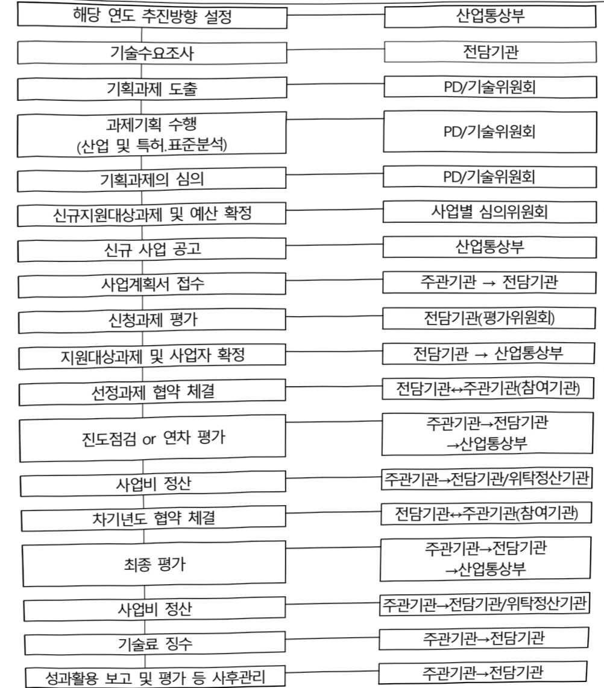

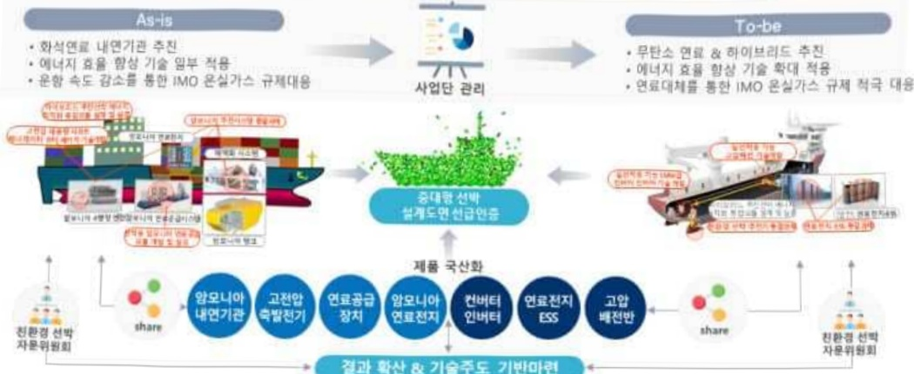

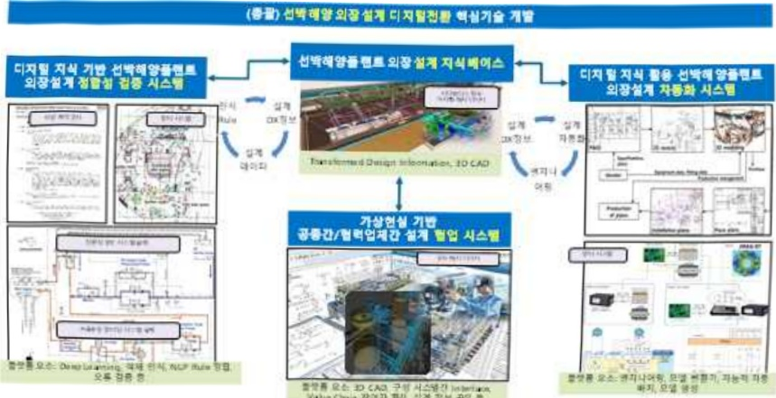

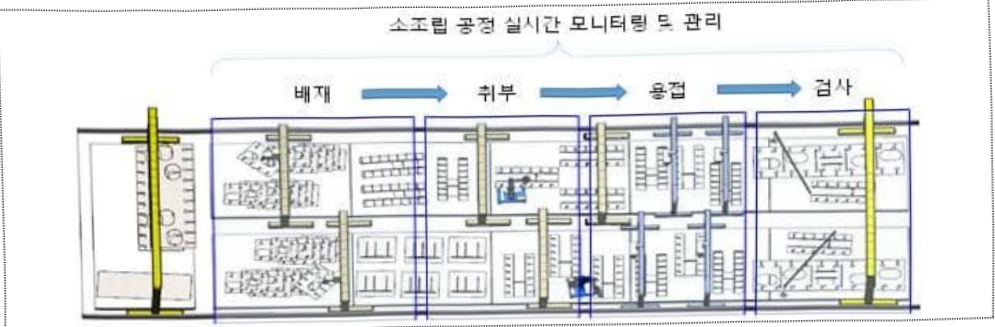

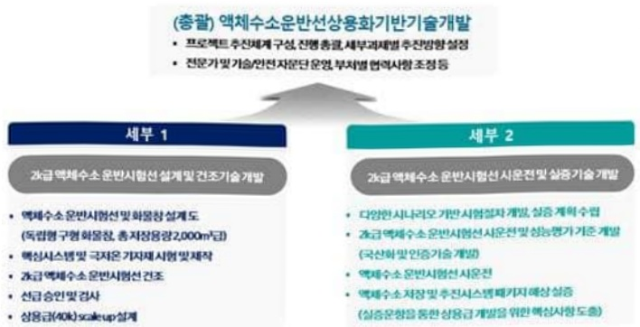

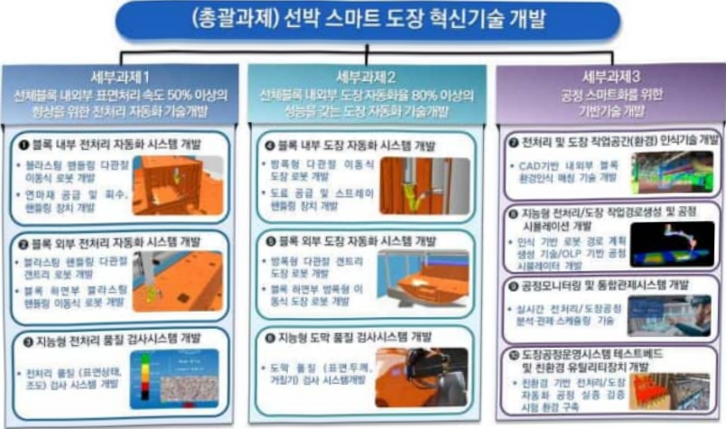

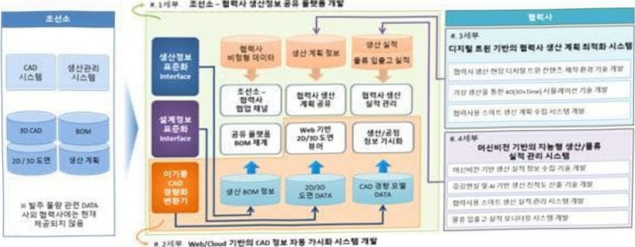

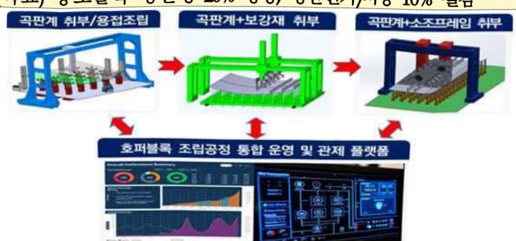

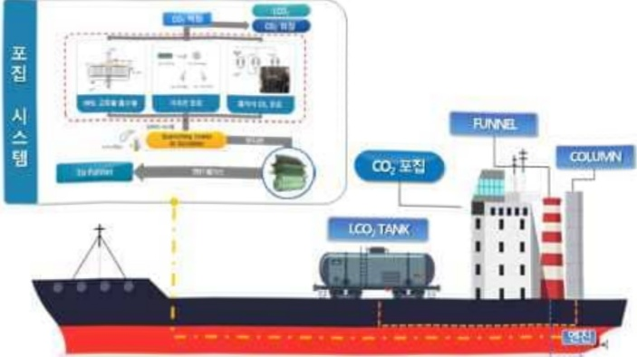

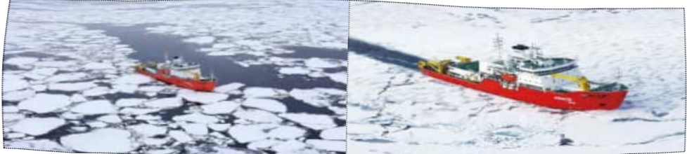

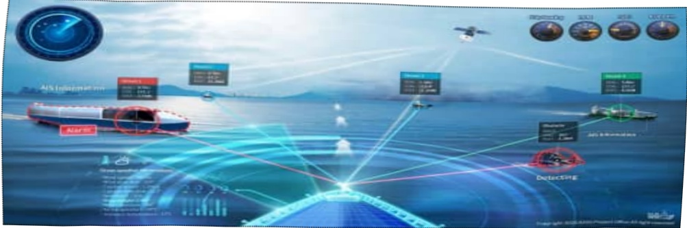

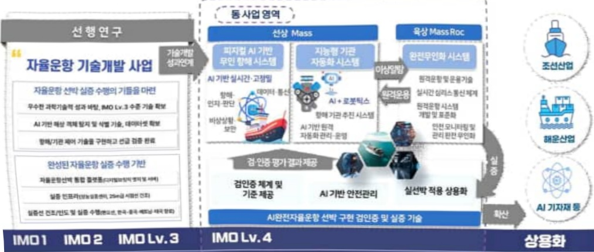

