# 지식서비스산업기술개발(R&D)

**해당 페이지**: PDF 4359 ~ 4383 쪽 해당

**부처**: 산업통상부
**분야**: 
**회계유형**: 일반
**2026 확정예산**: 12550.0 백만원
**전년대비 증감률**: -10.0%
**AI 도메인**: 제조/스마트팩토리

---

### 가.예산 총괄표

(단위:백만원,%)

<table border=1 style='margin: auto; word-wrap: break-word;'><tr><td rowspan="2">사업명</td><td rowspan="2">2024년 결산</td><td colspan="2">2025년 예산</td><td colspan="2">2026년</td><td rowspan="2">증감 (B-A)</td><td rowspan="2">(B-A)/A</td></tr><tr><td style='text-align: center; word-wrap: break-word;'>본예산(A)</td><td style='text-align: center; word-wrap: break-word;'>추경</td><td style='text-align: center; word-wrap: break-word;'>요구안</td><td style='text-align: center; word-wrap: break-word;'>확정(B)</td></tr><tr><td style='text-align: center; word-wrap: break-word;'>지식서비스산업 기술개발</td><td style='text-align: center; word-wrap: break-word;'>24,077</td><td style='text-align: center; word-wrap: break-word;'>13,950</td><td style='text-align: center; word-wrap: break-word;'>13,950</td><td style='text-align: center; word-wrap: break-word;'>21,950</td><td style='text-align: center; word-wrap: break-word;'>12,550</td><td style='text-align: center; word-wrap: break-word;'>△1,400</td><td style='text-align: center; word-wrap: break-word;'>△10.0</td></tr></table>

□ 기능별(내역사업별), 목별 예산 내역

(단위:백만원)

<table border=1 style='margin: auto; word-wrap: break-word;'><tr><td rowspan="3"></td><td colspan="5">2024</td><td colspan="7">2025(2025.12.11)</td><td rowspan="3">2026</td></tr><tr><td rowspan="2">예산액(추경)</td><td rowspan="2">예산현액</td><td rowspan="2">집행액[실집행액]</td><td rowspan="2">이월액</td><td rowspan="2">불용액</td><td rowspan="2">본예산</td><td rowspan="2">예산현액</td><td rowspan="2">집행액[실집행액]</td><td colspan="2">전년도 이월액제외</td><td rowspan="2">이월예산액</td><td rowspan="2">불용예산액</td></tr><tr><td style='text-align: center; word-wrap: break-word;'>예산현액</td><td style='text-align: center; word-wrap: break-word;'>집행액[실집행액]</td></tr><tr><td style='text-align: center; word-wrap: break-word;'>○ 기능별 분류(함께)</td><td style='text-align: center; word-wrap: break-word;'>24,077</td><td style='text-align: center; word-wrap: break-word;'>24,077</td><td style='text-align: center; word-wrap: break-word;'>24,077[24,077]</td><td style='text-align: center; word-wrap: break-word;'></td><td style='text-align: center; word-wrap: break-word;'></td><td style='text-align: center; word-wrap: break-word;'>13,950</td><td style='text-align: center; word-wrap: break-word;'>13,950</td><td style='text-align: center; word-wrap: break-word;'>9,208[9,208]</td><td style='text-align: center; word-wrap: break-word;'>13,950</td><td style='text-align: center; word-wrap: break-word;'>13,950[13,950]</td><td style='text-align: center; word-wrap: break-word;'></td><td style='text-align: center; word-wrap: break-word;'></td><td style='text-align: center; word-wrap: break-word;'>12,550</td></tr><tr><td style='text-align: center; word-wrap: break-word;'>· 서비스핵심기술개발· 서비스산업융합고도화</td><td style='text-align: center; word-wrap: break-word;'>7,723</td><td style='text-align: center; word-wrap: break-word;'>7,723</td><td style='text-align: center; word-wrap: break-word;'>7,723[7,723]16,354</td><td style='text-align: center; word-wrap: break-word;'>7,723[7,723]16,354[16,354]</td><td style='text-align: center; word-wrap: break-word;'></td><td style='text-align: center; word-wrap: break-word;'>6,700</td><td style='text-align: center; word-wrap: break-word;'>6,700</td><td style='text-align: center; word-wrap: break-word;'>4,144[4,144]5,064[5,064]</td><td style='text-align: center; word-wrap: break-word;'>6,700</td><td style='text-align: center; word-wrap: break-word;'>6,700[6,700]7,250[7,250]</td><td style='text-align: center; word-wrap: break-word;'></td><td style='text-align: center; word-wrap: break-word;'></td><td style='text-align: center; word-wrap: break-word;'>10,550</td></tr><tr><td style='text-align: center; word-wrap: break-word;'>○ 비목별 분류(함께)</td><td style='text-align: center; word-wrap: break-word;'>24,077</td><td style='text-align: center; word-wrap: break-word;'>24,077</td><td style='text-align: center; word-wrap: break-word;'>24,077[24,077]</td><td style='text-align: center; word-wrap: break-word;'>24,077[24,077]</td><td style='text-align: center; word-wrap: break-word;'></td><td style='text-align: center; word-wrap: break-word;'>13,950</td><td style='text-align: center; word-wrap: break-word;'>13,950</td><td style='text-align: center; word-wrap: break-word;'>9,208[9,208]</td><td style='text-align: center; word-wrap: break-word;'>13,950</td><td style='text-align: center; word-wrap: break-word;'>13,950[13,950]</td><td style='text-align: center; word-wrap: break-word;'></td><td style='text-align: center; word-wrap: break-word;'></td><td style='text-align: center; word-wrap: break-word;'>12,550</td></tr><tr><td style='text-align: center; word-wrap: break-word;'>· 연구개발활동비등(360-05)</td><td style='text-align: center; word-wrap: break-word;'>24,077</td><td style='text-align: center; word-wrap: break-word;'>24,077</td><td style='text-align: center; word-wrap: break-word;'>24,077[24,077]</td><td style='text-align: center; word-wrap: break-word;'>24,077[24,077]</td><td style='text-align: center; word-wrap: break-word;'></td><td style='text-align: center; word-wrap: break-word;'>13,950</td><td style='text-align: center; word-wrap: break-word;'>13,950</td><td style='text-align: center; word-wrap: break-word;'>9,208[9,208]</td><td style='text-align: center; word-wrap: break-word;'>13,950</td><td style='text-align: center; word-wrap: break-word;'>13,950[13,950]</td><td style='text-align: center; word-wrap: break-word;'></td><td style='text-align: center; word-wrap: break-word;'></td><td style='text-align: center; word-wrap: break-word;'>12,550</td></tr></table>

### 나. 사업설명자료

## 1 ) 사업목적·내용

- (세부사업 : 지식서비스산업기술개발) 지식서비스산업 핵심기술개발을 통해 제조업이

직면한 문제를 해결하고 제조·서비스 융합기술 개발을 통한 新 서비스산업 창출

- (내역사업 1 : 서비스핵심기술개발) 서비스요소기술을 기반으로 수요자 관점의 제조 전환, 제조업이 직면한 문제(생산성·효율성 감소, 숙련기술 단절 등) 해결 등 고부가 가치를 창출하여 제조 기술경쟁력 및 시장경쟁력 회복

- (내역사업 2 : 서비스산업융합고도화) 첨단기술을 활용한 기존서비스 고도화 및 산업·기술간 융합 서비스 모델 발굴, 新서비스 수요급증에 대응한 서비스 개발 지원

---

## 2 ) 사업개요

## □ 사업근거 및 추진경위

① 법령상 근거 및 조항 적시

## -산업발전법 제8조(지식서비스산업의 육성)

① 정부는 산업의 고부가가치화 및 경쟁력 강화를 위하여 지식서비스산업의 발전을 촉진하는 다음 각 호의 사업을 할 수 있다.

1. 국내외 지식서비스산업의 실태조사

2. 지식서비스산업의 전문인력 양성 및 연구 활성화 지원

3. 새로운 지식서비스 사업모델의 개발 및 확산

4. 지식서비스 정보시스템의 구축 및 활용 지원

5. 지식서비스산업 표준화 및 보급에 관한 지원

6. 지식서비스의 외주화(外主化) 촉진

7. 그 밖에 지식서비스산업의 경쟁력 향상을 위한 지원

## -산업기술혁신촉진법 제11조(산업기술개발사업)

① 산업통상부장관은 혁신계획 및 시행계획을 효율적으로 수행하기 위하여 관계 중앙행정기관의 장과 협의하여 다음 각 호의 산업기술 분야에서 기술개발사업(산업기술개발을 위하여 필요한 기획 및 조사를 포함한다. 이하 "산업기술개발사업"이라 한다)을 추진할 수 있다.

7. 디자인·브랜드·표준 관련 기술, 유통·전자거래 및 마케팅·비즈니스모델 등 지식기반 서비스 산업 관련 기술

- 이러닝(전자학습)산업 발전 및 이러닝 활용 촉진에 관한 법률 제10조(기술 개발 등의 지원)

정부는 이러닝산업 발전 및 이러닝 활용 촉진을 위하여 다음 각 호의 사업을 하는 자에게 필요한 자금의 전부 또는 일부를 지원할 수 있다.

## ② 추진경위

- 1990년 중기거점기술개발사업 착수

- 2004년 성장동력기술개발사업 착수

- 2008년 지식서비스전략기술개발사업으로 통합

- 2014년 지식서비스산업핵심기술개발사업으로 사업명 변경

- 2020년 지식서비스산업핵심기술개발사업, 창의산업전문기술개발사업 통합 및 지식서비스산업기술개발사업으로 사업명 변경

- 2023년 산업대전환 초격차 프로젝트(#7-2-2) 제조·서비스 융합 新비즈니스 창출

---

## □ 주요내용

① 사업규모

- 총사업비(해당되는 경우에만 기재) : : 해당없음

- 사업기간 : '09년~계속('23년 일몰관리혁신 점검 '조건부 유지')

- 최근 5년 간 투입된 사업비(예산액기준, 추경편성한 연도에는 추경포함)

<table border=1 style='margin: auto; word-wrap: break-word;'><tr><td style='text-align: center; word-wrap: break-word;'>$ \underline{\text{笹}} $</td><td style='text-align: center; word-wrap: break-word;'>2022</td><td style='text-align: center; word-wrap: break-word;'>2023</td><td style='text-align: center; word-wrap: break-word;'>2024</td><td style='text-align: center; word-wrap: break-word;'>2025</td><td style='text-align: center; word-wrap: break-word;'>2026</td></tr><tr><td style='text-align: center; word-wrap: break-word;'>$ \underline{\text{사업비}} $</td><td style='text-align: center; word-wrap: break-word;'>61,561</td><td style='text-align: center; word-wrap: break-word;'>53,227</td><td style='text-align: center; word-wrap: break-word;'>24,077</td><td style='text-align: center; word-wrap: break-word;'>13,950</td><td style='text-align: center; word-wrap: break-word;'>12,550</td></tr></table>

② 사업추진체계

- 사업시행방법 : 출연

- 사업시행주체 : 한국산업기술기획평가원

- 사업 수혜자 : 기업, 대학, 연구소 등

- 보조, 융자, 출연, 출자 등의 경우 보조·융자 등 지원 비율 및 법적근거

<table border=1 style='margin: auto; word-wrap: break-word;'><tr><td style='text-align: center; word-wrap: break-word;'>내역사업명</td><td style='text-align: center; word-wrap: break-word;'>구분</td><td style='text-align: center; word-wrap: break-word;'>피보조·피출연 등 기관명</td><td style='text-align: center; word-wrap: break-word;'>지원 금액 (2026예산)</td><td style='text-align: center; word-wrap: break-word;'>지원 비율(%)</td><td colspan="2">보조율 법적근거 (해당 조항)</td></tr><tr><td style='text-align: center; word-wrap: break-word;'>서비스핵심 기술개발</td><td rowspan="7">출연</td><td rowspan="7">기업, 대학, 연구소 등</td><td style='text-align: center; word-wrap: break-word;'>10,550</td><td rowspan="7">수행기관 유형별 달리 적용</td><td colspan="2">○ 산업기술혁신촉진법 제11조(산업기술개발사업)○ 산업기술혁신사업 공통운영요령 제24조 (출연금의 지원기준)② 장관은 연구개발비의 일부를 정부지원연구개발비로 지원할 경우 아래 표와 같이 연구개발기관 유형 및 연구개발과제 유형에 따라 정부지원연구개발비를 차등 지원할 수 있다.</td></tr><tr><td rowspan="6">서비스산업 융합고도화</td><td rowspan="6">2,000</td><td style='text-align: center; word-wrap: break-word;'>기관 유형</td><td style='text-align: center; word-wrap: break-word;'>과제 유형</td></tr><tr><td style='text-align: center; word-wrap: break-word;'>중소·중견기업이 아닌 기업</td><td style='text-align: center; word-wrap: break-word;'>원천기술형 혁신제품형</td></tr><tr><td style='text-align: center; word-wrap: break-word;'>중견기업</td><td style='text-align: center; word-wrap: break-word;'>해당 연구개발기관 연구개발비의 50% 이하</td></tr><tr><td style='text-align: center; word-wrap: break-word;'>중견기업</td><td style='text-align: center; word-wrap: break-word;'>해당 연구개발기관 연구개발비의 70% 이하</td></tr><tr><td style='text-align: center; word-wrap: break-word;'>중소기업</td><td style='text-align: center; word-wrap: break-word;'>해당 연구개발기관 연구개발비의 75% 이하</td></tr><tr><td style='text-align: center; word-wrap: break-word;'>그 외</td><td style='text-align: center; word-wrap: break-word;'>해당 연구개발기관 연구개발비의 100% 이하</td></tr></table>

---

## 3 ) 2026년도 예산 산출 근거

①지식서비스산업기술개발사업의 연구개발 지원

:(2025 본예산) 13,950백만원 → (2026 예산) 12,550백만원, 1,400백만원 감액

- (요구) 제조업이 직면한 문제(생산성·효율성 감소, 숙련기술 단절 등) 해결 등 고부가가치를 창출하고, 서비스 요소기술을 활용하여 제조업 경쟁력 향상에 기여하는 엔지니어링, 산업디지털, 제조컨설팅, 제조유통물류, 산업훈련, 시험인증 등 지식서비스 6大업종의 핵심기술 중점 개발을 위한 예산 요구

- (산출) 서비스핵심기술개발 10,550백만원

서비스산업융합고도화 2,000백만원

2025년도 예산 및 2026년도 예산 산출 세부내역 비교

<table border=1 style='margin: auto; word-wrap: break-word;'><tr><td colspan="2">2025년 분예산</td><td colspan="2">2026년 예산</td></tr><tr><td style='text-align: center; word-wrap: break-word;'>예산</td><td style='text-align: center; word-wrap: break-word;'>산출내역</td><td style='text-align: center; word-wrap: break-word;'>예산</td><td style='text-align: center; word-wrap: break-word;'>산출내역</td></tr><tr><td style='text-align: center; word-wrap: break-word;'>13,950</td><td style='text-align: center; word-wrap: break-word;'>①내역: 서비스핵심기술개발 6,700백만원 서비스요소기술을 기반으로 수요자 관점의 제조 전환, 제조업이 직면한 문제(생산성·효율성 감소, 숙련기술 단절 등) 해결 등 고부가가치를 창출하여 제조 기술경쟁력 및 시장경쟁력 회복 - 신규: 844백만원 × 6개 × 9/12개월 ≈ 3,800백만원 - 종료: 530백만원 × 5개 × 12/12개월 ≈ 2,650백만원 - 종료: 500백만원 × 1개 × 6/12개월 ≈ 250백만원 ②내역: 서비스산업용합고도화 7,250백만원 첨단기술을 활용한 기존서비스 고도화 및 산업기술간 용합 서비스 모델 발굴, 新서비스 수요급증에 대응한 서비스 개발 지원 ②-1내역: 일반형 6,500백만원 서비스핵심기술과 업종별 특화기술, 요소기술(AI, DT 등) 등을 결합하여 多엄종 활용 가능한 응용기술 개발 - 신규: 100백만원 × 2개 × 9/12개월 ≈ 150백만원 - 종료: 530백만원 × 12개 × 12/12개월 ≈ 6,350백만원 ②-2내역: 비연계형 750백만원 창의적도전적 비즈니스 아이디어(B)를 바탕으로 시장중심 유망BM 개발 ※ 경쟁형, 1차년도 6개월간 복수사업자 BM개발 → 경쟁을 통해 최종사업자 선정 및 2년간 후속 R&amp;D지원 - 종료: 250백만원 × 3개 × 12/12개월 ≈ 750백만원</td><td style='text-align: center; word-wrap: break-word;'>12,550</td><td style='text-align: center; word-wrap: break-word;'>①내역: 서비스핵심기술개발 10,550백만원 서비스요소기술을 활용하여 6大 지식서비스업종의 핵심기술 개발을 통해 수요자 관점의 제조 전환, 제조업이 직면한 문제(생산성·효율성 감소, 숙련기술 단절 등) 해결 등 고부가 가치를 창출하여 제조 기술경쟁력 회복 - 신규: 1,320백만원 × 5개 × 9/12개월 ≈ 4,950백만원 - 계속: 1,400백만원 × 4개 × 12/12개월 ≈ 5,600백만원 ②내역: 서비스산업용합고도화 2,000백만원 산업기술간 용합 서비스 모델 발굴을 위한 기술개발 과제의 계속 지원과 창의적·도전적 서비스 개념설계를 바탕으로 新서비스 수요급증에 대응한 서비스 기술개발 지원 - 신규: 200백만원 × 10개 × 6/12개월 ≈ 1,000백만원 - 계속: 500백만원 × 2개 × 12/12개월 ≈ 1,000백만원</td></tr></table>

---

## 4 ) 사업효과

□ 사업영향, 산출물 성과지표 등

① 2022~2026년도 성과계획서 상 성과지표 및 최근 5년간 성과 달성도

<table border=1 style='margin: auto; word-wrap: break-word;'><tr><td style='text-align: center; word-wrap: break-word;'>성과지표</td><td style='text-align: center; word-wrap: break-word;'>구분</td><td style='text-align: center; word-wrap: break-word;'>2022</td><td style='text-align: center; word-wrap: break-word;'>2023</td><td style='text-align: center; word-wrap: break-word;'>2024</td><td style='text-align: center; word-wrap: break-word;'>2025</td><td style='text-align: center; word-wrap: break-word;'>2026</td><td style='text-align: center; word-wrap: break-word;'>2026 목표치산출근거</td><td style='text-align: center; word-wrap: break-word;'>측정산식(또는 측정방법)</td><td style='text-align: center; word-wrap: break-word;'>자료수집방법(또는 자료출처)</td></tr><tr><td rowspan="3">융합BM개발(단위: 건)</td><td style='text-align: center; word-wrap: break-word;'>목표</td><td style='text-align: center; word-wrap: break-word;'>4.00</td><td style='text-align: center; word-wrap: break-word;'>4.00</td><td style='text-align: center; word-wrap: break-word;'>4.25</td><td style='text-align: center; word-wrap: break-word;'>4.25</td><td style='text-align: center; word-wrap: break-word;'>4.25</td><td rowspan="3">매년 BI연계형 신규지원 예산 10억원당 BM개발 건수 4건 이상 유지를 목표하고, 2024년부터 4.25로 목표치 상향</td><td rowspan="3">(BI연계형과제 BM개발 건수 /BI연계형과제 신규지원 예산 10억원당</td><td rowspan="3">BI연계형과제 단계보고서</td></tr><tr><td style='text-align: center; word-wrap: break-word;'>실적</td><td style='text-align: center; word-wrap: break-word;'>5.00</td><td style='text-align: center; word-wrap: break-word;'>5.00</td><td style='text-align: center; word-wrap: break-word;'>5.00</td><td style='text-align: center; word-wrap: break-word;'>지표 수정中</td><td style='text-align: center; word-wrap: break-word;'>-</td></tr><tr><td style='text-align: center; word-wrap: break-word;'>달성도</td><td style='text-align: center; word-wrap: break-word;'>100%</td><td style='text-align: center; word-wrap: break-word;'>100%</td><td style='text-align: center; word-wrap: break-word;'>100%</td><td style='text-align: center; word-wrap: break-word;'>-</td><td style='text-align: center; word-wrap: break-word;'>-</td></tr><tr><td rowspan="3">서비스이용자만족도(단위: 점)</td><td style='text-align: center; word-wrap: break-word;'>목표</td><td style='text-align: center; word-wrap: break-word;'>4.00</td><td style='text-align: center; word-wrap: break-word;'>4.00</td><td style='text-align: center; word-wrap: break-word;'>4.25</td><td style='text-align: center; word-wrap: break-word;'>4.25</td><td style='text-align: center; word-wrap: break-word;'>4.25</td><td rowspan="3">만족도 5점 리커트 척도를 기준으로 ‘우수’ 척도인 4.0점 이상의 만족도 유지를 목표하고, 2024년부터 4.25로 목표치 상향</td><td rowspan="3">전체 서비스 만족도(점)의 평균</td><td rowspan="3">지식서비스 이용자 만족도 조사 결과보고서</td></tr><tr><td style='text-align: center; word-wrap: break-word;'>실적</td><td style='text-align: center; word-wrap: break-word;'>4.54</td><td style='text-align: center; word-wrap: break-word;'>4.56</td><td style='text-align: center; word-wrap: break-word;'>4.60</td><td style='text-align: center; word-wrap: break-word;'>-</td><td style='text-align: center; word-wrap: break-word;'>-</td></tr><tr><td style='text-align: center; word-wrap: break-word;'>달성도</td><td style='text-align: center; word-wrap: break-word;'>100%</td><td style='text-align: center; word-wrap: break-word;'>100%</td><td style='text-align: center; word-wrap: break-word;'>100%</td><td style='text-align: center; word-wrap: break-word;'>-</td><td style='text-align: center; word-wrap: break-word;'>-</td></tr><tr><td rowspan="3">사업화매출액(단위: 억원)</td><td style='text-align: center; word-wrap: break-word;'>목표</td><td style='text-align: center; word-wrap: break-word;'>2.89</td><td style='text-align: center; word-wrap: break-word;'>2.80</td><td style='text-align: center; word-wrap: break-word;'>2.89</td><td style='text-align: center; word-wrap: break-word;'>2.97</td><td style='text-align: center; word-wrap: break-word;'>3.06</td><td rowspan="3">‘23년 목표치(‘20~’22년 평균 실적의 3% 상향)를 기준으로 매년 3% 상향하여 목표치를 설정</td><td rowspan="3">∑ (사업화매출액×기여율) / 정부지원금(10억원)</td><td rowspan="3">NTIS를 통해 검증된 사업화성과 정보</td></tr><tr><td style='text-align: center; word-wrap: break-word;'>실적</td><td style='text-align: center; word-wrap: break-word;'>2.51</td><td style='text-align: center; word-wrap: break-word;'>2.96</td><td style='text-align: center; word-wrap: break-word;'>7.46</td><td style='text-align: center; word-wrap: break-word;'>-</td><td style='text-align: center; word-wrap: break-word;'>-</td></tr><tr><td style='text-align: center; word-wrap: break-word;'>달성도</td><td style='text-align: center; word-wrap: break-word;'>86.9%</td><td style='text-align: center; word-wrap: break-word;'>100%</td><td style='text-align: center; word-wrap: break-word;'>100%</td><td style='text-align: center; word-wrap: break-word;'>-</td><td style='text-align: center; word-wrap: break-word;'>-</td></tr><tr><td rowspan="3">신규고용순증인원(단위: 명)</td><td style='text-align: center; word-wrap: break-word;'>목표</td><td style='text-align: center; word-wrap: break-word;'>4.03</td><td style='text-align: center; word-wrap: break-word;'>4.15</td><td style='text-align: center; word-wrap: break-word;'>4.27</td><td style='text-align: center; word-wrap: break-word;'>4.39</td><td style='text-align: center; word-wrap: break-word;'>4.50</td><td rowspan="3">‘20년 목표치를 기준으로 매년 3% 상향하여 목표치를 설정</td><td rowspan="3">∑ (신규고용인원×기여율) / 정부지원금(10억원)</td><td rowspan="3">NTIS를 통해 검증된 신규고용 성과 정보</td></tr><tr><td style='text-align: center; word-wrap: break-word;'>실적</td><td style='text-align: center; word-wrap: break-word;'>4.44</td><td style='text-align: center; word-wrap: break-word;'>4.17</td><td style='text-align: center; word-wrap: break-word;'>4.72</td><td style='text-align: center; word-wrap: break-word;'>-</td><td style='text-align: center; word-wrap: break-word;'>-</td></tr><tr><td style='text-align: center; word-wrap: break-word;'>달성도</td><td style='text-align: center; word-wrap: break-word;'>100%</td><td style='text-align: center; word-wrap: break-word;'>100%</td><td style='text-align: center; word-wrap: break-word;'>100%</td><td style='text-align: center; word-wrap: break-word;'>-</td><td style='text-align: center; word-wrap: break-word;'>-</td></tr></table>

② 성과지표 이외의 연도별 사업추진 경과 및 실적

<table border=1 style='margin: auto; word-wrap: break-word;'><tr><td style='text-align: center; word-wrap: break-word;'>2021</td><td style='text-align: center; word-wrap: break-word;'>○ 신규과제 37건, 계속과제 48건 지원(85개 과제)</td></tr><tr><td style='text-align: center; word-wrap: break-word;'>2022</td><td style='text-align: center; word-wrap: break-word;'>○ 신규과제 22건, 계속과제 63건 지원(85개 과제)</td></tr><tr><td style='text-align: center; word-wrap: break-word;'>2023</td><td style='text-align: center; word-wrap: break-word;'>○ 신규과제 24건, 계속과제 52건 지원(76개 과제)</td></tr><tr><td style='text-align: center; word-wrap: break-word;'>2024</td><td style='text-align: center; word-wrap: break-word;'>○ 계속과제 41건 지원(41개 과제)</td></tr><tr><td style='text-align: center; word-wrap: break-word;'>2025</td><td style='text-align: center; word-wrap: break-word;'>○ 신규과제 8건, 계속과제 20건 지원(28개 과제)</td></tr></table>

③향후(2026년도 이후)기대효과

기존산업(제조업 등)의 서비스융합을 통해 새로운 부가가치를 창출하는 제조 서비스화 기술역량 확보

0 창의적 지식서비스 비즈니스 모델 창출과 수출기반 제조-서비스 융합지원을 통한 지식서비스 글로벌 신시장 선점 및 고용창출 기여

---

5) 타당성조사 및 예비타당성조사 시행여부 및 결과 요지 : 해당없음

## 6 ) 총사업비 대상사업 여부 및 내역 : 해당없음

## 7 ) 사업 집행절차

[품목기획 단계] 지원 분야 선정

[1단계] 우수 BI를 기반한 BM 개발 기업선정 및 수행(6개월, 1억원 내외, 기술료비징수)

* 경제성 분석(목표시장에 대한 사업타당성, 진입장벽, 사업화전략) 및 특허 심층분석(권리범위 분석, 최적 특허 포트폴리오) 추진

[2단계] 우수 BM 선정 및 R&D지원(2~3년, 연간 5~10억원 내외, 기술료징수)

* 1단계 수행결과를 평가하여 ‘계속’으로 평가된 경우 2단계 기술개발 본격 착수

---

## 8 ) 중기재정계획 상 연도별 투자계획 및 추진경과

(단위:백만원)

<table border=1 style='margin: auto; word-wrap: break-word;'><tr><td style='text-align: center; word-wrap: break-word;'>2024 재정계획</td><td style='text-align: center; word-wrap: break-word;'>2025</td><td style='text-align: center; word-wrap: break-word;'>2026</td><td style='text-align: center; word-wrap: break-word;'>2027</td><td style='text-align: center; word-wrap: break-word;'>2028</td><td style='text-align: center; word-wrap: break-word;'>2029</td></tr><tr><td style='text-align: center; word-wrap: break-word;'>2024~2028</td><td style='text-align: center; word-wrap: break-word;'>24,077</td><td style='text-align: center; word-wrap: break-word;'>13,950</td><td style='text-align: center; word-wrap: break-word;'>12,550</td><td style='text-align: center; word-wrap: break-word;'>23,169</td><td style='text-align: center; word-wrap: break-word;'>24,327</td></tr><tr><td style='text-align: center; word-wrap: break-word;'>2025~2029</td><td style='text-align: center; word-wrap: break-word;'>☑</td><td style='text-align: center; word-wrap: break-word;'>13,950</td><td style='text-align: center; word-wrap: break-word;'>12,550</td><td style='text-align: center; word-wrap: break-word;'>24,273</td><td style='text-align: center; word-wrap: break-word;'>26,700</td></tr></table>

## 9 ) 최근 3년간 동 사업에 대한 주요 외부지적사항 및 평가, 문제점 및 대책

1) 국회(예결위, 상임위, 예정처, 국정감사 포함) 지적 :

- 지식서비스산업은 원재료가 필요하지 않아 매출액은 제조업 대비 매출이 크지 않고, 경기민감산업으로 경기 호, 불황에 따라 사업화 성과는 급격히 달라질 수 있음. '19년 이후 사업화 성과가 감소하여 개선방안 모색 필요(예정처, '22년 결산)

2) 감사원 또는 국무총리실 지적 : 해당없음

3) 자체평가 : 해당없음

4) 기타 시민단체, 언론 및 민원 : 해당없음

5) 문제점 지적에 대한 후속조치 : 해당없음

## 10 ) 향후 추진방향 및 추진계획

o (정책방향) 국정과제#26 '신성장동력 확보를 위한 서비스 경제 전환 촉진'(22.8)

*제5차 과학기술 기본계획(23~27) : (#3-2-2) 산업 전반의 디지털 혁신 가속화 및 신규 서비스 창출

*산업대전환 초격차 프로젝트(23) : (미션#7-2-2) 제조·서비스 융합 新비즈니스 창출

* 서비스산업발전TF "서비스 R&D 활성화 전략", "신비즈니스 모델 창출 시스템 구축방안"('23.11.)

°(사업주진) AI, 점단제조 기술에서 초격차 유지 · 신격차 확보를 통해 국내 제조업이 직면한 다양한 문제를 해결하고, 제조·서비스 융합기술 개발을 통한 新제조서비스 산업 창출을 위하여 엔지니어링, 산업디지털, 제조컨설팅, 제조유통물류, 산업훈련, 시험인증 등 지식서비스 6大업종의 첨단기술을 중점 개발

°(국제협력) 미국, 영국, 독일 등 전략적 국가와의 국제공동R&D을 통해 전략적 파트너쉽 및 표준협력 강화

## 11 ) 해당사업에 대한 각종 사업평가의 결과

·2021년 국가연구개발성과평가(상위평가): "우수" 등급

·2024년 국가연구개발성과평가(상위평가):“보통”등급

·2023년 일몰관리혁신 점검: "조건부 유지"

---

12) 해당사업에 대한 부처 자체평가의 결과

·2024년 국가연구개발성과평가(부처 자체평가):“보통” 등급 (82.6점)

## 13 ) 부처 건의사항 : 해당없음

### 다.최근 4년간 결산내역

1) 결산표

☐ 부처 결산내역

(단위:백만원,%)

<table border=1 style='margin: auto; word-wrap: break-word;'><tr><td rowspan="2">연도</td><td colspan="3">예산액</td><td rowspan="2">전년도 이월액</td><td rowspan="2">이·전용 등</td><td rowspan="2">예비비</td><td rowspan="2">예산 현액(B)</td><td rowspan="2">집행액 (C)</td><td rowspan="2">집행률 (C/A)</td><td rowspan="2">집행률 (C/B)</td><td rowspan="2">다음연도 이월액</td><td rowspan="2">불용액</td></tr><tr><td colspan="3">본예산 중감액</td></tr><tr><td style='text-align: center; word-wrap: break-word;'>2022</td><td style='text-align: center; word-wrap: break-word;'>61,561</td><td style='text-align: center; word-wrap: break-word;'>-</td><td style='text-align: center; word-wrap: break-word;'>61,561</td><td style='text-align: center; word-wrap: break-word;'>-</td><td style='text-align: center; word-wrap: break-word;'>-</td><td style='text-align: center; word-wrap: break-word;'>-</td><td style='text-align: center; word-wrap: break-word;'>61,561</td><td style='text-align: center; word-wrap: break-word;'>61,561</td><td style='text-align: center; word-wrap: break-word;'>100%</td><td style='text-align: center; word-wrap: break-word;'>100%</td><td style='text-align: center; word-wrap: break-word;'>-</td><td style='text-align: center; word-wrap: break-word;'>-</td></tr><tr><td style='text-align: center; word-wrap: break-word;'>2023</td><td style='text-align: center; word-wrap: break-word;'>53,227</td><td style='text-align: center; word-wrap: break-word;'>-</td><td style='text-align: center; word-wrap: break-word;'>53,227</td><td style='text-align: center; word-wrap: break-word;'>-</td><td style='text-align: center; word-wrap: break-word;'>-</td><td style='text-align: center; word-wrap: break-word;'>-</td><td style='text-align: center; word-wrap: break-word;'>53,227</td><td style='text-align: center; word-wrap: break-word;'>53,227</td><td style='text-align: center; word-wrap: break-word;'>100%</td><td style='text-align: center; word-wrap: break-word;'>100%</td><td style='text-align: center; word-wrap: break-word;'>-</td><td style='text-align: center; word-wrap: break-word;'>-</td></tr><tr><td style='text-align: center; word-wrap: break-word;'>2024</td><td style='text-align: center; word-wrap: break-word;'>24,077</td><td style='text-align: center; word-wrap: break-word;'>-</td><td style='text-align: center; word-wrap: break-word;'>24,077</td><td style='text-align: center; word-wrap: break-word;'>-</td><td style='text-align: center; word-wrap: break-word;'>-</td><td style='text-align: center; word-wrap: break-word;'>-</td><td style='text-align: center; word-wrap: break-word;'>24,077</td><td style='text-align: center; word-wrap: break-word;'>24,077</td><td style='text-align: center; word-wrap: break-word;'>100%</td><td style='text-align: center; word-wrap: break-word;'>100%</td><td style='text-align: center; word-wrap: break-word;'>-</td><td style='text-align: center; word-wrap: break-word;'>-</td></tr><tr><td style='text-align: center; word-wrap: break-word;'>2025</td><td style='text-align: center; word-wrap: break-word;'>13,950</td><td style='text-align: center; word-wrap: break-word;'>-</td><td style='text-align: center; word-wrap: break-word;'>13,950</td><td style='text-align: center; word-wrap: break-word;'>-</td><td style='text-align: center; word-wrap: break-word;'>-</td><td style='text-align: center; word-wrap: break-word;'>-</td><td style='text-align: center; word-wrap: break-word;'>13,950</td><td style='text-align: center; word-wrap: break-word;'>13,950</td><td style='text-align: center; word-wrap: break-word;'>100%</td><td style='text-align: center; word-wrap: break-word;'>100%</td><td style='text-align: center; word-wrap: break-word;'>-</td><td style='text-align: center; word-wrap: break-word;'>-</td></tr></table>

□출연·보조사업 등 실집행내역

(단위:백만원,%)

<table border=1 style='margin: auto; word-wrap: break-word;'><tr><td rowspan="2">구분</td><td colspan="3">부처</td><td colspan="6">사업시행주체(피출연·피보조 기관 등)</td></tr><tr><td colspan="2">예산액</td><td style='text-align: center; word-wrap: break-word;'>집행액</td><td style='text-align: center; word-wrap: break-word;'>교부액</td><td style='text-align: center; word-wrap: break-word;'>전년도 이월액</td><td style='text-align: center; word-wrap: break-word;'>교부 현액</td><td style='text-align: center; word-wrap: break-word;'>집행액 (B)</td><td style='text-align: center; word-wrap: break-word;'>이월액</td><td style='text-align: center; word-wrap: break-word;'>불용액 (B/A)</td></tr><tr><td style='text-align: center; word-wrap: break-word;'>2022</td><td style='text-align: center; word-wrap: break-word;'>61,561</td><td style='text-align: center; word-wrap: break-word;'>61,561</td><td style='text-align: center; word-wrap: break-word;'>61,561</td><td style='text-align: center; word-wrap: break-word;'>61,561</td><td style='text-align: center; word-wrap: break-word;'>-</td><td style='text-align: center; word-wrap: break-word;'>61,561</td><td style='text-align: center; word-wrap: break-word;'>61,561</td><td style='text-align: center; word-wrap: break-word;'>-</td><td style='text-align: center; word-wrap: break-word;'>- 100%</td></tr><tr><td style='text-align: center; word-wrap: break-word;'>2023</td><td style='text-align: center; word-wrap: break-word;'>53,227</td><td style='text-align: center; word-wrap: break-word;'>53,227</td><td style='text-align: center; word-wrap: break-word;'>53,227</td><td style='text-align: center; word-wrap: break-word;'>53,227</td><td style='text-align: center; word-wrap: break-word;'>-</td><td style='text-align: center; word-wrap: break-word;'>53,227</td><td style='text-align: center; word-wrap: break-word;'>53,227</td><td style='text-align: center; word-wrap: break-word;'>-</td><td style='text-align: center; word-wrap: break-word;'>- 100%</td></tr><tr><td style='text-align: center; word-wrap: break-word;'>2024</td><td style='text-align: center; word-wrap: break-word;'>24,077</td><td style='text-align: center; word-wrap: break-word;'>24,077</td><td style='text-align: center; word-wrap: break-word;'>24,077</td><td style='text-align: center; word-wrap: break-word;'>24,077</td><td style='text-align: center; word-wrap: break-word;'>-</td><td style='text-align: center; word-wrap: break-word;'>24,077</td><td style='text-align: center; word-wrap: break-word;'>24,077</td><td style='text-align: center; word-wrap: break-word;'>-</td><td style='text-align: center; word-wrap: break-word;'>- 100%</td></tr><tr><td style='text-align: center; word-wrap: break-word;'>2025. 12월기준</td><td style='text-align: center; word-wrap: break-word;'>13,950</td><td style='text-align: center; word-wrap: break-word;'>13,950</td><td style='text-align: center; word-wrap: break-word;'>13,950</td><td style='text-align: center; word-wrap: break-word;'>13,950</td><td style='text-align: center; word-wrap: break-word;'>-</td><td style='text-align: center; word-wrap: break-word;'>13,950</td><td style='text-align: center; word-wrap: break-word;'>13,950</td><td style='text-align: center; word-wrap: break-word;'>-</td><td style='text-align: center; word-wrap: break-word;'>- 100%</td></tr></table>

2) 주요 결산사항 : 해당없음

### 라. 기타 추가자료

---

# 지식서비스산업기술개발(R&D)사업 세부 설명자료

(개요) 지식서비스 분야 핵심·원천 기술개발 지원을 통해 기존산업(제조 업, 서비스업 등)을 고도화하고 채용시키는 창출 지원

·(기간)09~계속(일몰혁신)

• (예산) (총사업규모) 5,186억원(국비, 2025년까지)

('25년) 13,950백만원 →('26년) 12,550백만원 요구

* 과제당 지원 규모 : 연 10~20억원(총 3~5년 수행)

(수행방식) (1내역) 품목지정, (2내역) 자유공모

·(연구개발단계)개발(100%)

(전문기관/수행주체) 한국산업기술기획평가원/산(64%), 학(19%), 연(7%), 기타(10%)

• (집행률) 최근 4년간('20~'24년) 평균 실집행률 : 100.0%,

‘25년 12월까지 집행률/실집행률 : 100%/100%

## 1 사업개요

□ (목적) 지식서비스산업* 핵심기술개발 지원으로 국내 제조업이 직면한 다양한 문제를 해결하고, 제조-서비스 융합 기술 개발을 통한 제조서비스산업 창출

* (산업발전법§8) 지식의 생산·가공·활용·유통을 통해 부가가치를 창출하는 산업으로 정보 서비스·교육훈련·컨설팅·엔지니어링 등 36개 산업분야를 포함하는 전방위 산업

< 지식서비스산업기술개발(R&D) 지원방향 >

<table border=1 style='margin: auto; word-wrap: break-word;'><tr><td style='text-align: center; word-wrap: break-word;'>분야</td><td style='text-align: center; word-wrap: break-word;'>R&amp;D 추진 방향</td></tr><tr><td style='text-align: center; word-wrap: break-word;'>서비스핵심 기술개발</td><td style='text-align: center; word-wrap: break-word;'>○ 서비스 요소기술을 활용, 6大 지식서비스분야*에 대한 지식생산·수집·변환 등 핵심기술 증점 개발
* 엔지니어링, 산업디지털,, 시험인증, 제조생산물류, 산업훈련, 제조컨설팅</td></tr><tr><td style='text-align: center; word-wrap: break-word;'>서비스산업 융합고도화</td><td style='text-align: center; word-wrap: break-word;'>○ 핵심기술과 업종별 특화기술 결합을 통한 서비스 고도화 및 새로운 개념의 제조·서비스 융합기술 개발</td></tr></table>

---

### 2. 정책적 필요성

관련 주요 정책 및 국정과제

°(국정과제)#26 신성장동력 확보를 위한 서비스 경제 전환 촉진 (22.8)

° 제5차 과학기술 기본계획(23~27) 산업 전반의 디지털 혁신 가속화 및 신규 서비스 창출

○ 산업부 산업대전환 초격차 프로젝트('23~) (미션#7-2-2)제조·서비스 융합 윤비즈니스 창출

## ☐ 정부 지원 필요성

① (정책중요성) 혁신으로 도약하는 산업 르네상스, 서비스 융합을 통한 제조업 성장 및 혁신을 위해 지식서비스 R&D는 핵심 수단 → '국정과제 #26' 반영('22.8)

②(R&D 전략) 첨단기술 기반 유망 신서비스를 창출하고, 설계·공정 혁신, 물류 효율화 등을 통한 제조 경쟁력 강화를 위해 R&D 투자 필요

③(기술 수요)산업계 R&D 수요는 높으나,민간 서비스분야 투자여력 부족

(OECD 최하위) 및 기술수준(美比84%) 저조 → 정부의 R&D 마중물 역할 절실

*산업부 R&D 프로그램 중 가장 높은 경쟁률(지난 3년간 평균 6:1) / 6大 지식서비스업 기업(33,056개)

④(국제 동향)선도국에서는 혁신기업 중심으로 서비스 R&D 투자 활발, R&D 투자 중 서비스 비중 大(전체 R&D 中 서비스 비중 美 32.6% vs 韓 8.4%)

*【글로벌 혁신기업 사례】(엔지니어링) 지멘스, FLUOR (시험인증) SGS, Bureau Veritas

⑤(그간의 성과) 상위평가 우수(21年, 87.2점), CES 혁신상('22~, 23, 7개), 투자 유치*(10개 채 상장), 신시장 개척*, 선진국 진출**(美, 짧, 싱가폴) 등 성과 칭출

* (18~22) 정부지원 10억 원당 투자유치 : 지식서비스 4.69억 vs 제조 0.66억(산업부 연 500억 이상 규모 R&D)

** (신시장) 이륜차 배터리 교환 서비스(젠트로피), 제조현장 소음 환경 개선 서비스(미소정보기술)

*** (해외) 가스정압플랜트 실시간 관제시뮬레이션(책), 크레인연계 스마트 물류 솔루션(상), AR 훈련 플랫폼(美)

지식서비스업종 혁신을 지원하는 '유일한 R&D 프로그램'

중기부 R&D, 산업부 제조 핵심기술 R&D 등 他 R&D와 명확히 구분

---

### 3. 사업 내용 및 '26년 예산

(일반회계)

<단위:백만원>

<table border=1 style='margin: auto; word-wrap: break-word;'><tr><td style='text-align: center; word-wrap: break-word;'>사업명</td><td style='text-align: center; word-wrap: break-word;'>수행방식</td><td style='text-align: center; word-wrap: break-word;'>&#x27;23년</td><td style='text-align: center; word-wrap: break-word;'>&#x27;24년</td><td style='text-align: center; word-wrap: break-word;'>&#x27;25년</td><td style='text-align: center; word-wrap: break-word;'>&#x27;26년</td></tr><tr><td style='text-align: center; word-wrap: break-word;'>☐ 지식서비스산업기술개발</td><td rowspan="3">품목지정</td><td style='text-align: center; word-wrap: break-word;'>53,227</td><td style='text-align: center; word-wrap: break-word;'>24,077</td><td style='text-align: center; word-wrap: break-word;'>13,950</td><td style='text-align: center; word-wrap: break-word;'>12,550</td></tr><tr><td style='text-align: center; word-wrap: break-word;'>내역① 서비스핵심기술개발</td><td style='text-align: center; word-wrap: break-word;'>16,451</td><td style='text-align: center; word-wrap: break-word;'>7,723</td><td style='text-align: center; word-wrap: break-word;'>6,700</td><td style='text-align: center; word-wrap: break-word;'>10,550</td></tr><tr><td style='text-align: center; word-wrap: break-word;'>내역② 서비스산업융합고도화</td><td style='text-align: center; word-wrap: break-word;'>35,676</td><td style='text-align: center; word-wrap: break-word;'>16,354</td><td style='text-align: center; word-wrap: break-word;'>7,250</td><td style='text-align: center; word-wrap: break-word;'>2,000</td></tr></table>

서비스핵심기술개발 : 19,950백만원 요구 → 10,550백만원 반영

- 서비스요소기술을 활용하여 6大 지식서비스업종의 핵심기술 개발을 통해

①수요자 관점의 제조 전환, ②제조업이 직면한 문제(생산성·효율성 감소, 숙련

기술 단절 등) 해결 등 고부가가치를 창출하여 제조 기술경쟁력 및 시장

경쟁력 회복을 위한 신규과제 추진

* 신규 추진 과제는 핵심기술 개발을 위한 지식서비스산업의 게임 체인저형 대형·메가서비스

과제로 5년 동안 100억원 규모의 사업비 지원

○ (계속과제, '25~) 56억원(과제당 14억원 × 4개 과제)

<table border=1 style='margin: auto; word-wrap: break-word;'><tr><td style='text-align: center; word-wrap: break-word;'>과제명</td><td style='text-align: center; word-wrap: break-word;'>과제성격</td><td style='text-align: center; word-wrap: break-word;'>공모 방식</td><td style='text-align: center; word-wrap: break-word;'>기술분야</td></tr><tr><td style='text-align: center; word-wrap: break-word;'>제조업 경쟁력 향상을 위해 방산 산업용 언어모델 구축 및 표준 부품설계 속도가 2배 빠른 한국형 설계 자동화 모델 기술 개발</td><td style='text-align: center; word-wrap: break-word;'>혁신</td><td style='text-align: center; word-wrap: break-word;'>품목</td><td style='text-align: center; word-wrap: break-word;'>엔지니어링</td></tr><tr><td style='text-align: center; word-wrap: break-word;'>글로벌 탄소규제 대응과 친환경 제조 밸류체인 최적화를 위한 디지털 탄소발자국 관리/운영 AI 플랫폼 개발 및 현장 실증</td><td style='text-align: center; word-wrap: break-word;'>혁신</td><td style='text-align: center; word-wrap: break-word;'>품목</td><td style='text-align: center; word-wrap: break-word;'>제조컨설팅</td></tr><tr><td style='text-align: center; word-wrap: break-word;'>제조생산물류 현장의 실시간 대응을 위한 소프트웨어 기반 제조(SDF : Software Defined Factory) 플랫폼 기술 개발</td><td style='text-align: center; word-wrap: break-word;'>혁신</td><td style='text-align: center; word-wrap: break-word;'>품목</td><td rowspan="2">제조생산물류</td></tr><tr><td style='text-align: center; word-wrap: break-word;'>유통물류 풀필먼트 센터의 자율 협업을 위한 AI스마트클래스 기반의 연계통합 운영 기술 개발</td><td style='text-align: center; word-wrap: break-word;'>혁신</td><td style='text-align: center; word-wrap: break-word;'>품목</td></tr></table>

o (신규과제) 49.5억원(과제당 약 10억원 × 5개 과제*)

* 6대 지식서비스업종 각 분야에 대한 신규사업 추진 예정

---

## '26년 신규과제 지원(기획) 방향

## o 서비스요소기술을 활용한 6大 지식서비스업종 핵심기술 중점 개발

<table border=1 style='margin: auto; word-wrap: break-word;'><tr><td style='text-align: center; word-wrap: break-word;'>엔지니어링</td><td style='text-align: center; word-wrap: break-word;'>○ 설계특화FM 및 CAx-PLM연계 플랫폼 - 설계데이터 All-in-One 플랫폼</td><td style='text-align: center; word-wrap: break-word;'>[F [F26]</td></tr><tr><td style='text-align: center; word-wrap: break-word;'>산업디지털</td><td style='text-align: center; word-wrap: break-word;'>○ 제조특화 3D모델링 생성 전용LLM - 3D형상데이터, 제품특성·스펙, 공정 조건 학습</td><td style='text-align: center; word-wrap: break-word;'></td></tr><tr><td style='text-align: center; word-wrap: break-word;'>제조컨설팅</td><td style='text-align: center; word-wrap: break-word;'>○ 경량화설계·친환경·저에너지 소재·부품 AI 설계·추천 - BOM, 규제정보, 공급망, 생산이력 기반 분석</td><td style='text-align: center; word-wrap: break-word;'>  </td></tr><tr><td style='text-align: center; word-wrap: break-word;'>제조생산물류</td><td style='text-align: center; word-wrap: break-word;'>○ 공장내 생산물류 최적화 및 주문 예측 AI - 자재소요, 공정진척, 재고최적화 기반 생산물류</td><td style='text-align: center; word-wrap: break-word;'></td></tr><tr><td style='text-align: center; word-wrap: break-word;'>산업훈련</td><td style='text-align: center; word-wrap: break-word;'>○ 고숙련자 지식전이 플랫폼 - 암묵지 행동정보+환경정보기반 학습알고리즘</td><td style='text-align: center; word-wrap: break-word;'>[F8] [F22]</td></tr><tr><td style='text-align: center; word-wrap: break-word;'>시험인증</td><td style='text-align: center; word-wrap: break-word;'>○ 비파괴검사체 DT분석 시물레이션 - 디지털 트윈상 시물레이션, 계획수립·통합분석</td><td style='text-align: center; word-wrap: break-word;'> </td></tr></table>

* 과제당 지원규모 : 신규 과제당 5년간 연 20억원 규모 지원

---

## ② 서비스산업융합고도화기술개발 : 2,000백만원 요구 → 2,000백만원 반영

- 첨단기술을 활용한 기존서비스 고도화 및 산업·기술간 융합 서비스 모델 발굴, 윤리비스 수요급증에 대응한 서비스 개발 과제 추진

## '26년 신규과제 지원(기획) 방향

ㅇ 미래 新시장 창출을 위한 새로운 개념의 제조-서비스 융합 기술(서비스 솔루션/온디바이스 서비스 등) 중심 개발

<table border=1 style='margin: auto; word-wrap: break-word;'><tr><td rowspan="2">엔지니어링</td><td rowspan="2">○ GenAI+업종특획형 FM 활용 지능형 설계- 대화형I/F로 생성설계(제품·공정), CAE검증, 역설계</td><td rowspan="2"></td><td style='text-align: center; word-wrap: break-word;'></td><td style='text-align: center; word-wrap: break-word;'></td></tr><tr><td style='text-align: center; word-wrap: break-word;'></td><td style='text-align: center; word-wrap: break-word;'></td></tr><tr><td style='text-align: center; word-wrap: break-word;'>산업디지털</td><td style='text-align: center; word-wrap: break-word;'>○ 제조특화 DT모델 자동생성 솔루션- 공정시뮬레이션 자동 생성 및 검증</td><td style='text-align: center; word-wrap: break-word;'></td><td colspan="2"></td></tr><tr><td style='text-align: center; word-wrap: break-word;'>제조컨설팅</td><td style='text-align: center; word-wrap: break-word;'>○ 에너지·탄소배출·온실가스 최적화 솔루션- 설계·조달·생산·판매 전과정평가 및 시뮬레이션</td><td colspan="3"></td></tr><tr><td style='text-align: center; word-wrap: break-word;'>제조생산물류</td><td style='text-align: center; word-wrap: break-word;'>○ 확장형 생산물류 최적화 및 추천 솔루션- 생산계획기반 공급망·협력망 생산물류 최적화</td><td style='text-align: center; word-wrap: break-word;'>[F8]</td><td style='text-align: center; word-wrap: break-word;'></td><td style='text-align: center; word-wrap: break-word;'>[F28]</td></tr><tr><td rowspan="2">산업훈련</td><td rowspan="2">○ 분산작업장 다국적 노동자 동시 작업지시- 지식베이스기반 작업·품질관리, 동시 통번역</td><td style='text-align: center; word-wrap: break-word;'></td><td colspan="2"></td></tr><tr><td style='text-align: center; word-wrap: break-word;'></td><td style='text-align: center; word-wrap: break-word;'></td><td style='text-align: center; word-wrap: break-word;'></td></tr><tr><td style='text-align: center; word-wrap: break-word;'>시험인증</td><td style='text-align: center; word-wrap: break-word;'>○ 로봇·드론연계 비파괴 검사 실시간 수행·분석- 검사기+이동체+검사체 복합제어 실시간 검사</td><td style='text-align: center; word-wrap: break-word;'>[F2,[F33]</td><td colspan="2"></td></tr></table>

* 과제당 지원규모 : 신규 과제 1단계에는 서비스 개념설계를 위한 1억원의 사업비를, 2단계부터는 기술 및 서비스 개발을 위해 년 5억원의 사업비를 3년 간 지원

---

### 4. 주요 성과

° 정량적·정성적 성과(논문, 특허, 기술 사업화건수, 매출액, 고용창출 등 성과)

- (매출액 증가) 과제수행 주관기업의 매출액 증가율('19년~'22년) 평균 140%

* 같은 기간 국내 제조업 매출액 증가율은 122.9%, 전산업 매출액 증가율은 104.5%

- (기업성장 지원) 제조 R&D 대비 7배 이상의 투자 유치('18년~22년) 및 27배의 고용창출, 코스닥 상장 10개社(기술특례상장 6개社, '17년~21년) 배출

* (18~22) 정부지원 10억 원당 투자유치 : 지식서비스 4.69 vs 제조 0.66(산업부 연 500억 이상 규모 R&D)

(18~22) 정부지원 10억 원당 고용창출 : 지식서비스 5.03 vs 제조 1.81(산업부 연 500억 이상 규모 R&D)

<table border=1 style='margin: auto; width: max-content;'>
  <thead><tr><th style='text-align: center;'></th><th style='text-align: center;'>투자유치</th></tr></thead>
  <tbody>
    <tr><td style='text-align: center;'>지식서비스 R&D</td><td style='text-align: center;'>4.69</td></tr>
    <tr><td style='text-align: center;'>제조 R&D</td><td style='text-align: center;'>0.66</td></tr>
  </tbody>
</table>

<table border=1 style='margin: auto; width: max-content;'>
  <thead><tr><th style='text-align: center;'></th><th style='text-align: center;'>객응답절</th></tr></thead>
  <tbody>
    <tr><td style='text-align: center;'>지식서비스 R&D</td><td style='text-align: center;'>5.03</td></tr>
    <tr><td style='text-align: center;'>제조 R&D</td><td style='text-align: center;'>1.81</td></tr>
  </tbody>
</table>

◇주관기업 매출액 증가

♦ 기술특례상장

<table border=1 style='margin: auto; width: max-content;'>
  <thead><tr><th style='text-align: center;'>Category</th><th style='text-align: center;'>Value</th></tr></thead>
  <tbody>
    <tr><td style='text-align: center;'>지식서비스 R&D</td><td style='text-align: center;'>140.3%</td></tr>
    <tr><td style='text-align: center;'>제조업</td><td style='text-align: center;'>122.9%</td></tr>
    <tr><td style='text-align: center;'>전 산업</td><td style='text-align: center;'>104.5%</td></tr>
  </tbody>
</table>

<table border=1 style='margin: auto; width: max-content;'>
  <thead><tr><th style='text-align: center;'></th><th style='text-align: center;'>곡가 전체</th><th style='text-align: center;'>기술특례상장</th></tr></thead>
  <tbody>
    <tr><td style='text-align: center;'>지식서비스</td><td style='text-align: center;'>투입규모: 0.05%</td><td style='text-align: center;'>동·사업 배출 기술특례상장 기업: 7%</td></tr>
  </tbody>
</table>

(단위 : 명, 출처 : NTIS)

<table border=1 style='margin: auto; word-wrap: break-word;'><tr><td style='text-align: center; word-wrap: break-word;'>구분</td><td style='text-align: center; word-wrap: break-word;'>2018</td><td style='text-align: center; word-wrap: break-word;'>2019</td><td style='text-align: center; word-wrap: break-word;'>2020</td><td style='text-align: center; word-wrap: break-word;'>2021</td><td style='text-align: center; word-wrap: break-word;'>2022</td><td style='text-align: center; word-wrap: break-word;'>2023</td><td style='text-align: center; word-wrap: break-word;'>2024</td></tr><tr><td style='text-align: center; word-wrap: break-word;'>신규고용인원</td><td style='text-align: center; word-wrap: break-word;'>336</td><td style='text-align: center; word-wrap: break-word;'>277</td><td style='text-align: center; word-wrap: break-word;'>251</td><td style='text-align: center; word-wrap: break-word;'>288</td><td style='text-align: center; word-wrap: break-word;'>273</td><td style='text-align: center; word-wrap: break-word;'>222</td><td style='text-align: center; word-wrap: break-word;'>114</td></tr><tr><td style='text-align: center; word-wrap: break-word;'>투입 10억원당 신규고용인원</td><td style='text-align: center; word-wrap: break-word;'>6.1</td><td style='text-align: center; word-wrap: break-word;'>3.8</td><td style='text-align: center; word-wrap: break-word;'>5.4</td><td style='text-align: center; word-wrap: break-word;'>5.4</td><td style='text-align: center; word-wrap: break-word;'>4.4</td><td style='text-align: center; word-wrap: break-word;'>4.2</td><td style='text-align: center; word-wrap: break-word;'>4.7</td></tr></table>

(단위 : 억원, 출처 : NTIS)

<table border=1 style='margin: auto; word-wrap: break-word;'><tr><td style='text-align: center; word-wrap: break-word;'>구분</td><td style='text-align: center; word-wrap: break-word;'>2018</td><td style='text-align: center; word-wrap: break-word;'>2019</td><td style='text-align: center; word-wrap: break-word;'>2020</td><td style='text-align: center; word-wrap: break-word;'>2021</td><td style='text-align: center; word-wrap: break-word;'>2022</td><td style='text-align: center; word-wrap: break-word;'>2023</td><td style='text-align: center; word-wrap: break-word;'>2024</td></tr><tr><td style='text-align: center; word-wrap: break-word;'>사업화 매출액</td><td style='text-align: center; word-wrap: break-word;'>79</td><td style='text-align: center; word-wrap: break-word;'>159</td><td style='text-align: center; word-wrap: break-word;'>126</td><td style='text-align: center; word-wrap: break-word;'>149</td><td style='text-align: center; word-wrap: break-word;'>154</td><td style='text-align: center; word-wrap: break-word;'>158</td><td style='text-align: center; word-wrap: break-word;'>180</td></tr><tr><td style='text-align: center; word-wrap: break-word;'>투입 10억원 당 사업화 매출액</td><td style='text-align: center; word-wrap: break-word;'>1.9</td><td style='text-align: center; word-wrap: break-word;'>3.8</td><td style='text-align: center; word-wrap: break-word;'>2.7</td><td style='text-align: center; word-wrap: break-word;'>2.8</td><td style='text-align: center; word-wrap: break-word;'>2.5</td><td style='text-align: center; word-wrap: break-word;'>3.0</td><td style='text-align: center; word-wrap: break-word;'>7.5</td></tr><tr><td style='text-align: center; word-wrap: break-word;'>사업화 건수(건)</td><td style='text-align: center; word-wrap: break-word;'>85</td><td style='text-align: center; word-wrap: break-word;'>108</td><td style='text-align: center; word-wrap: break-word;'>80</td><td style='text-align: center; word-wrap: break-word;'>103</td><td style='text-align: center; word-wrap: break-word;'>124</td><td style='text-align: center; word-wrap: break-word;'>129</td><td style='text-align: center; word-wrap: break-word;'>58</td></tr></table>

- (프로그램 저작권) 산업부 R&D사업에서 창출된 프로그램 저작권 전체의 1/6이

동 사업에서 창출될 만큼, 디지털·융복합 시대 창조적인 핵심 기술·프로그램 다수 확보

---

<table border=1 style='margin: auto; word-wrap: break-word;'><tr><td style='text-align: center; word-wrap: break-word;'>구분(&#x27;21~&#x27;23)</td><td style='text-align: center; word-wrap: break-word;'>지식서비스산업기술개발</td><td style='text-align: center; word-wrap: break-word;'>KEIT 관리사업</td><td style='text-align: center; word-wrap: break-word;'>유사규모 사업 평균</td></tr><tr><td style='text-align: center; word-wrap: break-word;'>프로그램 저작권 등록 건수</td><td style='text-align: center; word-wrap: break-word;'>153</td><td style='text-align: center; word-wrap: break-word;'>982</td><td style='text-align: center; word-wrap: break-word;'>181</td></tr><tr><td style='text-align: center; word-wrap: break-word;'>프로그램 저작권 10억원당 등록 건수</td><td style='text-align: center; word-wrap: break-word;'>0.91</td><td style='text-align: center; word-wrap: break-word;'>0.13</td><td style='text-align: center; word-wrap: break-word;'>0.18</td></tr></table>

---

# - (코스닥 상장) 동 사업 서비스 R&D 지원을 통한 기업 기술·사업화 역량 제고로 최근 6개 중소기업이 코스닥에 상장

<기술특례상장 과제수행 기업목록>

<table border=1 style='margin: auto; word-wrap: break-word;'><tr><td style='text-align: center; word-wrap: break-word;'>기관명</td><td style='text-align: center; word-wrap: break-word;'>과제명(과제착수연도)</td><td style='text-align: center; word-wrap: break-word;'>상장연도</td><td style='text-align: center; word-wrap: break-word;'>기술성과기업유형</td></tr><tr><td style='text-align: center; word-wrap: break-word;'>이노시물레이션</td><td style='text-align: center; word-wrap: break-word;'>비정상 비행 상황 대응 팀 단위 협업훈련을 위한 가상 운항승무원 트레이닝 서비스 시스템 개발(&#x27;20)</td><td style='text-align: center; word-wrap: break-word;'>2023</td><td style='text-align: center; word-wrap: break-word;'>기술성장기업(기술특례상장)</td></tr><tr><td style='text-align: center; word-wrap: break-word;'>(쥐)버넥트</td><td style='text-align: center; word-wrap: break-word;'>증강현실(AR) 방식 항공정비사 작업 지원을 위한 5G 기반 항공정비 시스템 개발(&#x27;20)</td><td style='text-align: center; word-wrap: break-word;'>2023</td><td style='text-align: center; word-wrap: break-word;'>기술성장기업(기술특례상장)</td></tr><tr><td style='text-align: center; word-wrap: break-word;'>비아이매트릭스</td><td style='text-align: center; word-wrap: break-word;'>중소중견 전통 제조기업용 도메인 지식DB 기반 강화학습 AI기술 기반의 최적 의사결정 및 분석도구 응용서비스 개발(&#x27;20)</td><td style='text-align: center; word-wrap: break-word;'>2023</td><td style='text-align: center; word-wrap: break-word;'>-</td></tr><tr><td style='text-align: center; word-wrap: break-word;'>(쥐)코난테크놀로지</td><td style='text-align: center; word-wrap: break-word;'>소비재 제품 고객평가 데이터 AI 분석 및 제조 활용 서비스 개발(&#x27;20)</td><td style='text-align: center; word-wrap: break-word;'>2022</td><td style='text-align: center; word-wrap: break-word;'>기술성장기업(기술특례상장)</td></tr><tr><td style='text-align: center; word-wrap: break-word;'>(쥐)보이씨</td><td style='text-align: center; word-wrap: break-word;'>골프 IoT 빅데이터를 활용한 고부가가치 골프 정보 서비스 비즈니스 모델 개발(&#x27;17)</td><td style='text-align: center; word-wrap: break-word;'>2022</td><td style='text-align: center; word-wrap: break-word;'>-</td></tr><tr><td style='text-align: center; word-wrap: break-word;'>서호전기(쥐)</td><td style='text-align: center; word-wrap: break-word;'>5G기반 대용량 실시간 데이터를 활용한 항만크레인 연계 스마트 물류 서비스 개발(&#x27;19)</td><td style='text-align: center; word-wrap: break-word;'>2022</td><td style='text-align: center; word-wrap: break-word;'>-</td></tr></table>

## <대표 성과사례>

° 코딩자동화 기술 기반 업무 프로세스 자동화 혁신으로 200억원 투자 유치 및 코스닥 상장

(중소·중견 전통 제조기업용 도메인 지식DB 기반 강화학습 AI기술 기반의 최적 의사결정 및 분석도구 응용서비스 개발/‘20~’22, 32억원 지원, (쥐비아이매트릭스)

- (핵심기술 확보) 신기술이 적용된 세계 서비스 기술력을 확보했음을 국내·외

권위 있는 다수 평가를 통해 최고 품질 입증

(20년) '금융 의사결정 지원을 위한 인공지능 기술 기반 개인 금융 혜택 최적화 솔루션 우수성과 100선 선정

(22년~23년) 글로벌 CES혁신상 7건 수상

- (신시장 창출) 기존에 없던 세계 최초 비즈니스 모델 개발로 신산업 활성화

* (핀테크) 국내 핀테크 산업 활성화 및 세계 최초 금융비서 서비스 상용화(누적투자유치 950억 원 이상)

(리걸테크) 아시아 최초 법률 전문 생성형 AI 출시 및 리걸테크 산업 촉진

- (글로벌 개최) 국내 서비스산업의 한계를 극복하고 글로벌 시장 진출 포석 마련

(쥐서호전기 : 글로벌 최대 규모 항만인 싱가포르 투하스항의 크레인 연계 스마트물류 서비스 공급

(쥐웅진씽크빅 : AR 학습플랫폼 중화권 독점 공급 계약 및 미국, 일본 등 에듀테크 글로벌시장 개척

## <대표 성과사례>

° 세계 최초·최고수준 AR 학습솔루션 개발로 미국, 일본 등 글로벌 시장판로 개척 (증강현실 기반 독서 학습솔루션 ARpedia 개발/21~23, 24억원 지원, 웅진씽크빅)

---

### 5. 고려사항

주요 평가 결과 : 일목 적정성평가 결과 조건부 유지('24.1)

°(평가결과) 부처 특성에 부합하는 지식서비스 R&D 추진 방향이 필요하며, 챌린지위원회, 토너먼트별 평가 등을 통한 실행전략 보완 및 내역사업간 차별화 필요

#### 일몰 적정성평가 결과('24.1.) 조치 이행

1 (추진방향) 제조업경쟁력 향상에 기여하는 6대분야 중심으로 핵심기술 개발 및 신개념 제조-서비스 융합 모델 개발과제 발굴

* 6대분야 : 엔지니어링, 산업디지털, 스마트컨설팅, 시험인증, 디지털유통물류, 산업에듀테크

2 (챔린지 위원회) 산업과 서비스의 융합을 이끌어낼 수 있는 도전적 테마를 발굴할 수 있는 전문가로 지식서비스 챔린지위원회 운영

o (역할) 답테크·첨단기술 기반 제조서비스 융합 완신기술/서비스로 고부가가치를

창출할 수 있는 게임체인저형 메가서비스 발굴

③ (토너먼트별 평가) 창의적 아이디어 촉진 및 기술 확보를 위한 신규과제 대상 단계별 토너먼트형(3단계) 평가 방식 도입

*【1단계】서비스 개념설계 R&D (1년) →【2단계】本 R&D (서비스 공통핵심기술 + 서비스 모델 개발, 3년) →【3단계】서비스 실증 (국내·외 리빙랩 협력, 필요시 2년)

4 (내역사업 차별화) 내역사업별 R&D 타겟을 명확히 하여 차별성 강화

°(내역1) 서비스요소기술을 활용한 6大업종 핵심기술(대형과제 위주) 중점 개발

(내역2) 미래 창출을 위한 새로운 개념의 제조서비스 융합 기술

(서비스 솔루션/온디바이스 서비스 등) 중심 개발

☐ 내역사업별 평균 경쟁률(신규과제, 최근 5년)

<table border=1 style='margin: auto; word-wrap: break-word;'><tr><td rowspan="2">사업명</td><td rowspan="2">내역사업명</td><td colspan="6">신규과제 평균 경쟁률</td></tr><tr><td style='text-align: center; word-wrap: break-word;'>2020</td><td style='text-align: center; word-wrap: break-word;'>2021</td><td style='text-align: center; word-wrap: break-word;'>2022</td><td style='text-align: center; word-wrap: break-word;'>2023</td><td style='text-align: center; word-wrap: break-word;'>2024</td><td style='text-align: center; word-wrap: break-word;'>2025</td></tr><tr><td rowspan="2">지식서비스산업 기술개발</td><td style='text-align: center; word-wrap: break-word;'>서비스핵심기술개발</td><td style='text-align: center; word-wrap: break-word;'>10.2:1</td><td style='text-align: center; word-wrap: break-word;'>4.4:1</td><td style='text-align: center; word-wrap: break-word;'>3.0:1</td><td style='text-align: center; word-wrap: break-word;'>13.3:1</td><td style='text-align: center; word-wrap: break-word;'>-</td><td style='text-align: center; word-wrap: break-word;'>3.8:1</td></tr><tr><td style='text-align: center; word-wrap: break-word;'>서비스산업융합고도화</td><td style='text-align: center; word-wrap: break-word;'>11.4:1</td><td style='text-align: center; word-wrap: break-word;'>5.3:1</td><td style='text-align: center; word-wrap: break-word;'>5.1:1</td><td style='text-align: center; word-wrap: break-word;'>5.3:1</td><td style='text-align: center; word-wrap: break-word;'>-</td><td style='text-align: center; word-wrap: break-word;'>22:1</td></tr></table>

---

1업종과와 지식서비스 기술개발 간 차이점

<table border=1 style='margin: auto; word-wrap: break-word;'><tr><td style='text-align: center; word-wrap: break-word;'>구분</td><td style='text-align: center; word-wrap: break-word;'>업종과 기술개발</td><td style='text-align: center; word-wrap: break-word;'>지식서비스 기술개발</td></tr><tr><td rowspan="4">지식서비스 시업의 차별성</td><td colspan="2">공통기반기술을 지원하는 유일한 사업</td></tr><tr><td colspan="2">업종별 기술개발만으로는 오픈AI, 지멘스, 팔란티어, 테슬라 같은 첨단기술기업 창출 어려워</td></tr><tr><td style='text-align: center; word-wrap: break-word;'></td><td style='text-align: center; word-wrap: break-word;'></td></tr><tr><td style='text-align: center; word-wrap: break-word;'></td><td style='text-align: center; word-wrap: break-word;'>2003년 금융사기 탐지를 시작으로 NHS의 의료 데이터 분석, CIA, FBI의 테러방지, 국방부의 전장분석 등 정부기관 빅데이터분석으로 성장, 3천 여명의 종업원으로 25년 기준 시가총액 2,059억 달러 기록, 테러방지, 마약거래, 금융사기, 범죄예방 등 정부기관용 플랫폼(고담)과 재무, 인사, 물류, 재고 등 기업용 플랫폼(파운드리) 제공.</td></tr><tr><td rowspan="5">R&amp;D 지향점</td><td style='text-align: center; word-wrap: break-word;'></td><td style='text-align: center; word-wrap: break-word;'></td></tr><tr><td style='text-align: center; word-wrap: break-word;'></td><td style='text-align: center; word-wrap: break-word;'></td></tr><tr><td style='text-align: center; word-wrap: break-word;'></td><td style='text-align: center; word-wrap: break-word;'></td></tr><tr><td style='text-align: center; word-wrap: break-word;'></td><td style='text-align: center; word-wrap: break-word;'></td></tr><tr><td style='text-align: center; word-wrap: break-word;'></td><td style='text-align: center; word-wrap: break-word;'></td></tr><tr><td rowspan="4">R&amp;D 시작점</td><td style='text-align: center; word-wrap: break-word;'>기술문제 해결형</td><td style='text-align: center; word-wrap: break-word;'>사회문제 해결형</td></tr><tr><td style='text-align: center; word-wrap: break-word;'></td><td style='text-align: center; word-wrap: break-word;'></td></tr><tr><td style='text-align: center; word-wrap: break-word;'></td><td style='text-align: center; word-wrap: break-word;'></td></tr><tr><td style='text-align: center; word-wrap: break-word;'></td><td style='text-align: center; word-wrap: break-word;'></td></tr><tr><td rowspan="2">R&amp;D 활용</td><td style='text-align: center; word-wrap: break-word;'></td><td style='text-align: center; word-wrap: break-word;'></td></tr><tr><td style='text-align: center; word-wrap: break-word;'>(예) 자동차 완성품 및 중간재 부품</td><td rowspan="2"></td></tr><tr><td style='text-align: center; word-wrap: break-word;'>기술로드맵</td><td style='text-align: center; word-wrap: break-word;'>기술로드맵</td></tr></table>

---

## 2 지식서비스 내역사업간 명확화

1 (대상) 기준지식서비스산업 순 업종(산업발전법 정의 36개) → 개선 제조업 경쟁력

향상에 기여하는 6大 핵심 지식서비스업종 <참고 #3: 6대업종 지원근거 및 현황>

※ 서비스요소기술 : ① AI(빅데이터, 블록체인), ② 확장현실(XR), ③ RPA(로봇프로세스자동화), ④ 인지/감성기술(비전.음성.모션인식), ⑤ 인간공학(휴먼팩터) 등

2(내역사업 개편)서비스고도화,융합 촉진 등 임무 달성을 위한 전략성 강화

○ (내역1) 서비스요소기술을 활용한 6大 지식서비스업종 공통 핵심기술

중점 개발

*【목표】지식서비스생산성:(현재)62.9천불→(30년)89.7천불OECD 팽균

○ (내역2) 미래 창출을 위한 새로운 개념의 제조-서비스 융합기술

(서비스 솔루션/온디바이스 서비스 등) 중심 개발

*【목표】제조업 서비스 활용 : (현재) 23% → (30년) 35% 총 몰랐 수준

3(운영방식)도전적·혁신적 과제 중심으로 R&D 기획·평가체계 전면 혁신

(기획) PD 주도 과제 발굴 → 개선지식서비스 젤린지 위원회(기술, 서비스, 시장 전문가) 중심으로 답테크·첨단기술 기반의 공통 핵심기술 도출, 게임체인저형 메가서비스 발굴

* 산업부 '첨단기술 및 제품 고시(# 33 지식서비스 분야)' 지속 업데이트

* 신개념 지식서비스 테마 발굴·평가 체계 구축 (특허청 협업, 글로벌시장 조사, 대국민 아이디어 조사 → 지식서비스 공백 영역(Blank Area) 도출 시스템)

°(평가)기존경쟁형 방식 시범 운영 → 개선전주기 토너먼트형 평가 방식 확대

*【단계평가】(1단계) 서비스 개념설계 R&D (1년) → (2단계) 本 R&D (서비스 공통핵심기술 + 서비스 모델 개발, 3년) → (3단계) 서비스 실증 (국제리빙랩협회/글로벌 기업 협력, 필요시 2년)

---

3 지식서비스 6대 분야의 구체화

## 지식서비스 6대 분야 정의 및 근거 법령

<table border=1 style='margin: auto; word-wrap: break-word;'><tr><td style='text-align: center; word-wrap: break-word;'>업  종</td><td style='text-align: center; word-wrap: break-word;'>정의 및 근거 법령</td></tr><tr><td style='text-align: center; word-wrap: break-word;'>① 엔지니어링 - 기업: 7,269개(&#x27;21) - 시장: 8.4조원(&#x27;20)</td><td style='text-align: center; word-wrap: break-word;'>· 과학기술을 응용하여 사업 및 시설물에 대한 타당성조사, 설계, 계약, 구매, 시험 · 감리, 유지보수 서비스 · 법률 : 엔지니어링산업법</td></tr><tr><td style='text-align: center; word-wrap: break-word;'>② 산업디지털 - 기업: 8,014개 - 시장: 11.6조원(&#x27;20)</td><td style='text-align: center; word-wrap: break-word;'>· 산업데이터· AI 등 디지털 기술을 산업에 적용하여 산업활동 과정을 효율화, 新 부가가치를 창출하는 서비스 · 법률 : 산업디지털전환법</td></tr><tr><td style='text-align: center; word-wrap: break-word;'>③ 시험인증 - 기업: 5,027개 - 시장: 14.7조원(&#x27;20)</td><td style='text-align: center; word-wrap: break-word;'>· 표준과 기술기준을 바탕으로 제품, 서비스, 프로세스에 대해 시험·검사·교정·인증 등의 적합성 평가를 제공하는 서비스 · 법률 : 국가표준기본법</td></tr><tr><td style='text-align: center; word-wrap: break-word;'>④ 제조생산물류 - 기업: 405개 - 시장: 1.8조원 (&#x27;20, 풀멜먼트시장 추정)</td><td style='text-align: center; word-wrap: break-word;'>· 데이터기술 기반의 新 유통·물류 혁신 서비스 · 법률 : 유통산업발전법</td></tr><tr><td style='text-align: center; word-wrap: break-word;'>⑤ 제조전설팅 - 기업: 10,228개(&#x27;19) - 시장: 11.7조(&#x27;20)</td><td style='text-align: center; word-wrap: break-word;'>· 조직 목적 달성을 위한 경영상의 문제 해결 및 사업 기획 과정을 지원하는 독립적인 전문·자문 서비스 · 법률 : 산업발전법</td></tr><tr><td style='text-align: center; word-wrap: break-word;'>⑥ 산업훈련 - 기업: 2,113개사 - 시장: 4.6조원(&#x27;20)</td><td style='text-align: center; word-wrap: break-word;'>· 기존 이러닝이 확대된 산업으로, AI, 메타버스 등 첨단기술을 결합한 쌍방향·개인맞춤형 훈련·교육서비스 · 법률 : 이러닝산업법</td></tr></table>

---

## 4 내역사업 추진 방향

## 지식서비스업 고도화

<지식서비스 6대 분야 공통핵심기술(예) >

<table border=1 style='margin: auto; word-wrap: break-word;'><tr><td style='text-align: center; word-wrap: break-word;'>① 엔지니어링(제품·생산설계)</td><td style='text-align: center; word-wrap: break-word;'>② 산업디지털(제조특화솔루션)</td><td style='text-align: center; word-wrap: break-word;'>③ 시험인증(품질관리)</td></tr><tr><td rowspan="2">설계조건 입력 시, 생성형 AI를 통해 다양한 제품설계안을 자동 생성·탐색하는 기술&lt;(주)나니아랩스: Aslan Engineering&gt;</td><td style='text-align: center; word-wrap: break-word;'>고숙련 생산인력의 경험 및 노하우 지식전이(작업환경 모델링/모션, 동작인식) 기술</td><td style='text-align: center; word-wrap: break-word;'>실험체 파손없이 실시간으로 비파괴 검사를 통해 데이터를 머신러닝 모델에 학습시킨 예측 기술</td></tr><tr><td style='text-align: center; word-wrap: break-word;'>&lt; AI × XR 기반 숙련공 지식전이&gt;</td><td style='text-align: center; word-wrap: break-word;'>&lt;（獨） Fraunhoffer: 디지털트윈 비파괴 검사&gt;</td></tr><tr><td style='text-align: center; word-wrap: break-word;'>④ 제조유통물류</td><td style='text-align: center; word-wrap: break-word;'>⑤ 산업훈련</td><td style='text-align: center; word-wrap: break-word;'>⑥ 제조컨설팅</td></tr><tr><td rowspan="2">고객 행동, 동선 및 취향(감성 등) 데이터 기반의 매장 설계 및 상품 배치 분석 기술</td><td rowspan="2">고정밀 XR (메타휴먼, 동기화, 모션제어 및 인터렉션 기술) 기반의 산업현장 원격협업 및 훈련 기술</td><td style='text-align: center; word-wrap: break-word;'>AI기반의 빅데이터, 소셜 트렌드, 소비자 모델링 분석 기술</td></tr><tr><td style='text-align: center; word-wrap: break-word;'>&lt;（주)알에스앤: 루시 2.0&gt;</td></tr></table>

## 내역2 제조 + 지식서비스 융합

<지식서비스업 신시장 창출 (예)>

<table border=1 style='margin: auto; word-wrap: break-word;'><tr><td style='text-align: center; word-wrap: break-word;'>⑥배터리 교환 서비스</td><td style='text-align: center; word-wrap: break-word;'>②산업재해 예방 서비스</td><td style='text-align: center; word-wrap: break-word;'>④탄소 배출 관리 서비스</td><td style='text-align: center; word-wrap: break-word;'>③공급망 최적화 서비스</td></tr><tr><td style='text-align: center; word-wrap: break-word;'>무중단 에너지 공급 기술 기반의 E2W 서비스 (전기이륜차 배터리 교환 HW 및 솔루션)</td><td style='text-align: center; word-wrap: break-word;'>제조산업 재해 예방을 위한 온디바이스 서비스(노이즈 캔슬링, 디지털 생산지시 큐레이터)</td><td style='text-align: center; word-wrap: break-word;'>AI 기반 LCA 탄소배출 여정 추적, 관리, 예측 서비스</td><td style='text-align: center; word-wrap: break-word;'>AI 기반의 Low code 공급망 최적화 의사결정 서비스</td></tr><tr><td style='text-align: center; word-wrap: break-word;'></td><td style='text-align: center; word-wrap: break-word;'></td><td rowspan="2"></td><td style='text-align: center; word-wrap: break-word;'></td></tr><tr><td style='text-align: center; word-wrap: break-word;'>&lt;배터리 교환 HW× 공유 IT 솔루션&gt;</td><td style='text-align: center; word-wrap: break-word;'>&lt;산업안전 : AI × 노이즈캔슬링&gt;</td><td style='text-align: center; word-wrap: break-word;'>&lt;로우코드 기반 공급망 최적화 지원 서비스&gt;</td></tr></table>

---

<table border=1 style='margin: auto; word-wrap: break-word;'><tr><td style='text-align: center; word-wrap: break-word;'>구분</td><td style='text-align: center; word-wrap: break-word;'>[내역1] 서비스핵심기술개발</td><td style='text-align: center; word-wrap: break-word;'>[내역2] 서비스산업용합고도화</td></tr><tr><td style='text-align: center; word-wrap: break-word;'>R&amp;D 타겟</td><td style='text-align: center; word-wrap: break-word;'>지식서비스 요소기술 고도화</td><td style='text-align: center; word-wrap: break-word;'>제조·지식서비스 융합</td></tr><tr><td style='text-align: center; word-wrap: break-word;'>내역설명</td><td style='text-align: center; word-wrap: break-word;'>서비스요소기술*을 활용한 6大** 지식서비스업종 공통핵심기술 중점 개발 *AI, 빅데이터, 블록체인 XR, RPA 인간공학, 인지·감성기술 등 **연차·P림 산업·지털 시험·동 디팬·행동류 산업·캐릭터 스타트살림</td><td style='text-align: center; word-wrap: break-word;'>미래 新시장 창출을 위한 새로운 개념의 제조·서비스 융합 기술 중심 개발 *제조+제조, 제조+지식서비스, 지식서비스+지식서비스</td></tr><tr><td style='text-align: center; word-wrap: break-word;'>내역간 연계</td><td colspan="2">(1내역)에서 개발된 핵심기술은 서비스 중간재 및 선행기술로(단일결과물로도 합의미) (2내역)에 제공되어 제조·서비스 융합 결과물 창출에 기여</td></tr><tr><td style='text-align: center; word-wrap: break-word;'>중장기로드맵</td><td style='text-align: center; word-wrap: break-word;'>기술로드맵 (6대 업종에서 쓰이는 서비스요소기술 중심)</td><td style='text-align: center; word-wrap: break-word;'>서비스로드맵 (융합서비스 중심)</td></tr><tr><td rowspan="2">과제발굴 방식</td><td style='text-align: center; word-wrap: break-word;'>챌린지 위원회 ①시장정의(6대업종**), 시장전문가 -&gt; ②제품정의(서비스형태), 서비스전문가 -&gt; ③기술정의(서비스요소기술*) 기술전문가 -&gt; ④로드맵작성 -&gt;시장·서비스기술전문가협업</td><td style='text-align: center; word-wrap: break-word;'>시나리오 플래닝 기법 ※미래산업 시나리오기반 필요 서비스 역추적 (예시) Siemens의 PoF(Picture of the Future) [F2]</td></tr><tr><td style='text-align: center; word-wrap: break-word;'></td><td style='text-align: center; word-wrap: break-word;'>[F7] [F2]</td></tr><tr><td style='text-align: center; word-wrap: break-word;'>결과물 형태</td><td style='text-align: center; word-wrap: break-word;'>HW, HW-SW·일체형, SW, 알고리즘</td><td style='text-align: center; word-wrap: break-word;'>SW, 알고리즘, 서비스, 데이터, 프로세스, 서비스플랫폼</td></tr><tr><td style='text-align: center; word-wrap: break-word;'>성과측정</td><td style='text-align: center; word-wrap: break-word;'>공학적 성능 목표 매출, 영업이익, 특허 등</td><td style='text-align: center; word-wrap: break-word;'>비즈니스모델, M&amp;A, 펀딩, 기술거래, 지분거래투자, 기술특례상장, 기업가치, 지식재산기치 노동생산성 부가가치율 등</td></tr><tr><td style='text-align: center; word-wrap: break-word;'>성과확산</td><td style='text-align: center; word-wrap: break-word;'>글로벌 진출 지원 PG(KOTRA 협업)</td><td style='text-align: center; word-wrap: break-word;'>산업기술투자펀드 활용 지식서비스 투자협의회 구성(KEIT-KITIA-민간투자사)</td></tr><tr><td style='text-align: center; word-wrap: break-word;'>해외진출 방식</td><td style='text-align: center; word-wrap: break-word;'>기술기업 중심 민간 주도</td><td style='text-align: center; word-wrap: break-word;'>ODA, EDCF, KSP 프로그램 활용 정부주도 민관협력</td></tr><tr><td style='text-align: center; word-wrap: break-word;'>기대효과</td><td style='text-align: center; word-wrap: break-word;'>①부가가치 증대·창출 ②효율성·생산성·향상 ③원가절감·납기단축</td><td style='text-align: center; word-wrap: break-word;'>①부가가치 증대·창출 ②가치사슬 다양화·확대 ③고부가가치 전문인력 양성</td></tr><tr><td style='text-align: center; word-wrap: break-word;'>과제발굴 예시</td><td colspan="2">①(동시통합형 메가서비스 예시) (총괄)제조AI Adaptive FM(Foundation Model)+업종특화 생성형AI 개발 및 통합실증, (1세부)공장설계FM, (2세부)공정설계FM, (3세부)제품설계FM ②(이어달리기 메가서비스 예시) (1세약)제조업특화 sLLM 개발, (2내약-1)조립공정특화 DT 자동생성·검증, (2내약-2)연속공정 특화 멀티모달 입출력/F, (2내약-3)하이브리드공정특화 DPP(탄소발자국) 자동계산·검증</td></tr><tr><td style='text-align: center; word-wrap: break-word;'>타업종과 유사 과제와의 차별성</td><td colspan="2">단일업종 제조업의 서비스화(예)자동차스티어링률(제조)-판매방식의 다양화(서비스) -&gt; 공통기술기반 응용서비스(예)자동차스티어링률(제조)-심박센스(바이오)-건강관리·보험(서비스)</td></tr></table>

---

---

<table border=1 style='margin: auto; word-wrap: break-word;'><tr><td style='text-align: center; word-wrap: break-word;'>분야</td><td colspan="4">과제명</td></tr><tr><td rowspan="4">엔지니어링</td><td colspan="4">· 설계·생산 통합 및 자동화 솔루션(현재) 기획·설계(CAD·CAE·CAM)·생산(PLM·PDM) 분절화 → (목표) One Shot 자동화 솔루션</td></tr><tr><td style='text-align: center; word-wrap: break-word;'>구분</td><td style='text-align: center; word-wrap: break-word;'>추진과제</td><td style='text-align: center; word-wrap: break-word;'>개발내용</td><td style='text-align: center; word-wrap: break-word;'>Output</td></tr><tr><td style='text-align: center; word-wrap: break-word;'>서비스 핵심기술</td><td style='text-align: center; word-wrap: break-word;'>· 설계 특화 FM 및 CAx·PLM연계 플랫폼</td><td style='text-align: center; word-wrap: break-word;'>· CAx·PDM·PLM 이기종 설계데이터 연결 및 추적관리· 설계특화LLM기반 Foundation Model</td><td style='text-align: center; word-wrap: break-word;'>· 설계데이터 All-in-One 플랫폼</td></tr><tr><td style='text-align: center; word-wrap: break-word;'>서비스 용합기술</td><td style='text-align: center; word-wrap: break-word;'>· GenAI+업종특화형 지능형 설계기술개발</td><td style='text-align: center; word-wrap: break-word;'>· GenAI CAD: 생성적 최적설계· GenAI CAE: 다중물리해석 추천수행· GenAI 역설계: 설계·시뮬레이션조건, 발생원안 해결조건 특이해, 구속조건을 설명가능한AI</td><td style='text-align: center; word-wrap: break-word;'>· 설계데이터기반 지능화 솔루션</td></tr><tr><td rowspan="4">산업디지털</td><td colspan="4">· 제조특화 DT모델 자동생성·검증 솔루션(현재)3D스캐너 및 영상기반 단순 3D형상 → (목표) DT모델링 순과정 자동화 100%</td></tr><tr><td style='text-align: center; word-wrap: break-word;'>구분</td><td style='text-align: center; word-wrap: break-word;'>추진과제</td><td style='text-align: center; word-wrap: break-word;'>개발내용</td><td style='text-align: center; word-wrap: break-word;'>Output</td></tr><tr><td style='text-align: center; word-wrap: break-word;'>서비스 핵심기술</td><td style='text-align: center; word-wrap: break-word;'>· 제조특화 DT모델 생성용 LLM</td><td style='text-align: center; word-wrap: break-word;'>· 3D형상데이터, 제품특성, 공정조건, 해석 검증특성 등 다양한 입력형태를 반영한 제조특화 DT모델생성용 LLM</td><td style='text-align: center; word-wrap: break-word;'>· 제조업종별 DT모델생성용 LLM</td></tr><tr><td style='text-align: center; word-wrap: break-word;'>서비스 용합기술</td><td style='text-align: center; word-wrap: break-word;'>· 제조특화 DT모델 자동생성 솔루션</td><td style='text-align: center; word-wrap: break-word;'>· DT모델 생성용 LLM기반 제조공정 시뮬레이션 모델 자동생성 시뮬레이터</td><td style='text-align: center; word-wrap: break-word;'>· DT전용 LLM기반 공정시뮬레이션 모델 자동생성검증 솔루션</td></tr><tr><td rowspan="4">제조 컨설팅</td><td colspan="4">· 제조숲주기 최소자원·최적 에너지 어드바이저(현재)설계·생산 에너지·단소온실가스 개별 관리→(목표)제조생애주기 최소자원투입·최적에너지사용</td></tr><tr><td style='text-align: center; word-wrap: break-word;'>구분</td><td style='text-align: center; word-wrap: break-word;'>추진과제</td><td style='text-align: center; word-wrap: break-word;'>개발내용</td><td style='text-align: center; word-wrap: break-word;'>Output</td></tr><tr><td style='text-align: center; word-wrap: break-word;'>서비스 핵심기술</td><td style='text-align: center; word-wrap: break-word;'>· 경량화 및 진환경·저에너지 소재부품 설계 추천</td><td style='text-align: center; word-wrap: break-word;'>· 경량화 설계를 위한 BOM(자재명세서) 및 규제정보기반 Gen AI 최적설계 어드바이저· 동일부품 활용도 향상을 위한 3D부품정보 DB기반 지능형 부품관리 기술</td><td style='text-align: center; word-wrap: break-word;'>· 자원절약 및 재사용·경량화·환경고려 제품개발·발주·생산·판매·재활용·폐기기술</td></tr><tr><td style='text-align: center; word-wrap: break-word;'>서비스 용합기술</td><td style='text-align: center; word-wrap: break-word;'>· 에너지·탄소배출 추적 관리 및 최적화 솔루션</td><td style='text-align: center; word-wrap: break-word;'>· 환경규제(CBAM등) 대응 공급망·물류망 연계 에너지·탄소배출 데이터 자동측정·관리·검증·DT기반 에너지·탄소배출 모니터링 시각화</td><td style='text-align: center; word-wrap: break-word;'>· LCA기반 제조전주기 환경영향 평가 분석 자동화 및 에너지·탄소·온실가스 추적예측</td></tr><tr><td rowspan="4">제조 생산물류</td><td colspan="4">· 제조숲벨류체인 생산물류 최적화(현재)공장·생산물류·공장·조달·배송물류 분절화 → (목표)제조숲주기 생산물류 최적화</td></tr><tr><td style='text-align: center; word-wrap: break-word;'>구분</td><td style='text-align: center; word-wrap: break-word;'>추진과제</td><td style='text-align: center; word-wrap: break-word;'>개발내용</td><td style='text-align: center; word-wrap: break-word;'>Output</td></tr><tr><td style='text-align: center; word-wrap: break-word;'>서비스 핵심기술</td><td style='text-align: center; word-wrap: break-word;'>· 공장내 생산물류 최적화 및 주문예측AI</td><td style='text-align: center; word-wrap: break-word;'>· 제조데이터기반 작업자·이동형로봇·설비 연계 공장내 생산물류 최적화 알고리움 및 주문예측AI</td><td rowspan="2">· 균진로봇설비·인간협업 복합동시제어기반 생산수요 예측·생산물류전과정(판매량예측·생산계획·원자재부품주문·조달·생산·배송·판매) 어드바이저</td></tr><tr><td style='text-align: center; word-wrap: break-word;'>서비스 용합기술</td><td style='text-align: center; word-wrap: break-word;'>· 확장형 생산물류 최적화 및 추천솔루션</td><td style='text-align: center; word-wrap: break-word;'>· ERP연계 시계열 물류 예측 및 주문·창고 관리 최적화</td></tr><tr><td rowspan="4">산업훈련</td><td colspan="4">· 경험지 식기반 다국적 현장노동자 동시작업지시 플랫폼(현재)통역기반 현장작업지시+국내외 사업장 개별운영→(목표)전세계 사업장 동시작업지시</td></tr><tr><td style='text-align: center; word-wrap: break-word;'>구분</td><td style='text-align: center; word-wrap: break-word;'>추진과제</td><td style='text-align: center; word-wrap: break-word;'>개발내용</td><td style='text-align: center; word-wrap: break-word;'>Output</td></tr><tr><td style='text-align: center; word-wrap: break-word;'>서비스 핵심기술</td><td style='text-align: center; word-wrap: break-word;'>· 고속전자 지식전이 기술</td><td style='text-align: center; word-wrap: break-word;'>· 제조현장 특화 숙련기술·행동정보 및 암묵지 환경정보 취득 하이파오토메이션</td><td style='text-align: center; word-wrap: break-word;'>· 전세계 분산 현장 비교분석기반 최적 작업프로세스 지식베이스</td></tr><tr><td style='text-align: center; word-wrap: break-word;'>서비스 용합기술</td><td style='text-align: center; word-wrap: break-word;'>· 분산작업장 다국적 노동자 동시작업지시 및 품질 동기화</td><td style='text-align: center; word-wrap: break-word;'>· 제조특화 sLLM기반 M2M 다국어 동시작류역 작업지시 솔루션·전세계 분산작업장 동시작업지시 및 품질정보 동기화</td><td style='text-align: center; word-wrap: break-word;'>· 지식베이스·다국어 작업지시 및 분산작업장 동시작류 플랫폼</td></tr><tr><td rowspan="4">시험인증</td><td colspan="4">· DT+GenAI활용 실시간 분석 및 시험계획·개선방안 시나리오 자동 생성(현재)검사기+이동체+검사체 단절 및 분석지연→(목표)동시복합제어 및 GenAI기반 통합분석</td></tr><tr><td style='text-align: center; word-wrap: break-word;'>구분</td><td style='text-align: center; word-wrap: break-word;'>추진과제</td><td style='text-align: center; word-wrap: break-word;'>개발내용</td><td style='text-align: center; word-wrap: break-word;'>Output</td></tr><tr><td style='text-align: center; word-wrap: break-word;'>서비스 핵심기술</td><td style='text-align: center; word-wrap: break-word;'>· 고정형 비파괴검사체 DT분석 시뮬레이션</td><td style='text-align: center; word-wrap: break-word;'>· 자산관리기반 비파괴검사체 DT 가상모델링 및 고정밀 3차원 공간재체·인식 및 위치 추적·비파괴검사 데이터 실시간 취득·통합분석 기술</td><td style='text-align: center; word-wrap: break-word;'>· 멀티모델 대화형 AI에이전트기반 비파괴검사 계획수립·통합분석·개선계획 시뮬레이션</td></tr><tr><td style='text-align: center; word-wrap: break-word;'>서비스 용합기술</td><td style='text-align: center; word-wrap: break-word;'>· 로봇드론연계 비파괴검사 실시간 수행분석</td><td style='text-align: center; word-wrap: break-word;'>· 접근난이 높은 비파괴검사체함 로봇드론활용 고정밀 3차원 공간재체·인식 및 위치 추적기술·DT시뮬레이터 실시간 연계 및 이동체 복합제어</td><td style='text-align: center; word-wrap: break-word;'>· 검사기+이동체·검사체 복합제어 및 실시간 시뮬레이션 프로그램</td></tr></table>

---

<table border=1 style='margin: auto; word-wrap: break-word;'><tr><td style='text-align: center; word-wrap: break-word;'>사 업 명</td></tr><tr><td style='text-align: center; word-wrap: break-word;'>(1) 지역거점AX혁신기술개발(R&amp;D) (3541-302)</td></tr></table>

## □ 사업 코드 정보

<table border=1 style='margin: auto; word-wrap: break-word;'><tr><td style='text-align: center; word-wrap: break-word;'>구분</td><td style='text-align: center; word-wrap: break-word;'>회계</td><td style='text-align: center; word-wrap: break-word;'>소관</td><td style='text-align: center; word-wrap: break-word;'>실국(기관)</td><td style='text-align: center; word-wrap: break-word;'>계정</td><td style='text-align: center; word-wrap: break-word;'>분야</td><td style='text-align: center; word-wrap: break-word;'>부문</td></tr><tr><td style='text-align: center; word-wrap: break-word;'>코드</td><td style='text-align: center; word-wrap: break-word;'>39</td><td style='text-align: center; word-wrap: break-word;'>22</td><td style='text-align: center; word-wrap: break-word;'>산업성장실</td><td style='text-align: center; word-wrap: break-word;'>2</td><td style='text-align: center; word-wrap: break-word;'>110</td><td style='text-align: center; word-wrap: break-word;'>117</td></tr><tr><td style='text-align: center; word-wrap: break-word;'>명칭</td><td style='text-align: center; word-wrap: break-word;'>지역균형발전 특별회계</td><td style='text-align: center; word-wrap: break-word;'>산업통상부</td><td style='text-align: center; word-wrap: break-word;'>산업인공지능 정책관</td><td style='text-align: center; word-wrap: break-word;'>지역지원 계정</td><td style='text-align: center; word-wrap: break-word;'>산업·중소기업 및에너지</td><td style='text-align: center; word-wrap: break-word;'>산업혁신지원</td></tr></table>

<table border=1 style='margin: auto; word-wrap: break-word;'><tr><td style='text-align: center; word-wrap: break-word;'>구분</td><td style='text-align: center; word-wrap: break-word;'>프로그램</td><td style='text-align: center; word-wrap: break-word;'>단위사업</td><td style='text-align: center; word-wrap: break-word;'>세부사업</td></tr><tr><td style='text-align: center; word-wrap: break-word;'>코드</td><td style='text-align: center; word-wrap: break-word;'>3500</td><td style='text-align: center; word-wrap: break-word;'>3541</td><td style='text-align: center; word-wrap: break-word;'>302</td></tr><tr><td style='text-align: center; word-wrap: break-word;'>명칭</td><td style='text-align: center; word-wrap: break-word;'>주력산업진흥</td><td style='text-align: center; word-wrap: break-word;'>제조기반기술개발</td><td style='text-align: center; word-wrap: break-word;'>지역거점AX혁신기술개발</td></tr></table>

□ 사업 성격 (공통요구자료 Ⅱ-1 작성유의사항 4. 참조, 해당하는 사항에 “0” 표시)

<table border=1 style='margin: auto; word-wrap: break-word;'><tr><td style='text-align: center; word-wrap: break-word;'>신규</td><td style='text-align: center; word-wrap: break-word;'>계속</td><td style='text-align: center; word-wrap: break-word;'>완료</td><td style='text-align: center; word-wrap: break-word;'>예비타당성 실시여부</td><td style='text-align: center; word-wrap: break-word;'>총사업비 관리대상</td><td style='text-align: center; word-wrap: break-word;'>총액계상 예산사업</td><td style='text-align: center; word-wrap: break-word;'>사업소관 변경정보</td></tr><tr><td style='text-align: center; word-wrap: break-word;'></td><td style='text-align: center; word-wrap: break-word;'>O</td><td style='text-align: center; word-wrap: break-word;'></td><td style='text-align: center; word-wrap: break-word;'></td><td style='text-align: center; word-wrap: break-word;'></td><td style='text-align: center; word-wrap: break-word;'></td><td style='text-align: center; word-wrap: break-word;'>2025예산 시 소관</td></tr></table>

□ 사업 지원 형태 및 지원을 (최소한 한 개는 반드시 선택하시오. 해당사항에 0 표시)

<table border=1 style='margin: auto; word-wrap: break-word;'><tr><td style='text-align: center; word-wrap: break-word;'>직접</td><td style='text-align: center; word-wrap: break-word;'>출자</td><td style='text-align: center; word-wrap: break-word;'>출연</td><td style='text-align: center; word-wrap: break-word;'>보조</td><td style='text-align: center; word-wrap: break-word;'>융자</td><td style='text-align: center; word-wrap: break-word;'>국고보조율(%)</td><td style='text-align: center; word-wrap: break-word;'>융자율(%)</td></tr><tr><td style='text-align: center; word-wrap: break-word;'></td><td style='text-align: center; word-wrap: break-word;'></td><td style='text-align: center; word-wrap: break-word;'>O</td><td style='text-align: center; word-wrap: break-word;'></td><td style='text-align: center; word-wrap: break-word;'></td><td style='text-align: center; word-wrap: break-word;'></td><td style='text-align: center; word-wrap: break-word;'></td></tr></table>

## □ 사업 담당자

<table border=1 style='margin: auto; word-wrap: break-word;'><tr><td style='text-align: center; word-wrap: break-word;'>사업명</td><td colspan="5">구분</td></tr><tr><td rowspan="4">지역거점AX 혁신기술개발 (R&amp;D)</td><td rowspan="3">소관부처</td><td style='text-align: center; word-wrap: break-word;'>실·국·과(팀)</td><td style='text-align: center; word-wrap: break-word;'>과 장</td><td style='text-align: center; word-wrap: break-word;'>사무관</td><td style='text-align: center; word-wrap: break-word;'>주무관</td></tr><tr><td style='text-align: center; word-wrap: break-word;'>산업성장실 산업인공지능 정책관</td><td style='text-align: center; word-wrap: break-word;'>신용민</td><td style='text-align: center; word-wrap: break-word;'>안용열</td><td style='text-align: center; word-wrap: break-word;'>안용관</td></tr><tr><td style='text-align: center; word-wrap: break-word;'>인공지능기계로봇과</td><td style='text-align: center; word-wrap: break-word;'>044-203-4310</td><td style='text-align: center; word-wrap: break-word;'>044-203-4311</td><td style='text-align: center; word-wrap: break-word;'>044-203-4319</td></tr><tr><td style='text-align: center; word-wrap: break-word;'>사업시행주체</td><td style='text-align: center; word-wrap: break-word;'>한국산업기술 기획평가원</td><td style='text-align: center; word-wrap: break-word;'>기계로봇장비실</td><td style='text-align: center; word-wrap: break-word;'>박용수 실장 윤정환 책임</td><td style='text-align: center; word-wrap: break-word;'>053-718-8220 053-718-8469</td></tr></table>

---

### 원본 PDF 크롭 이미지

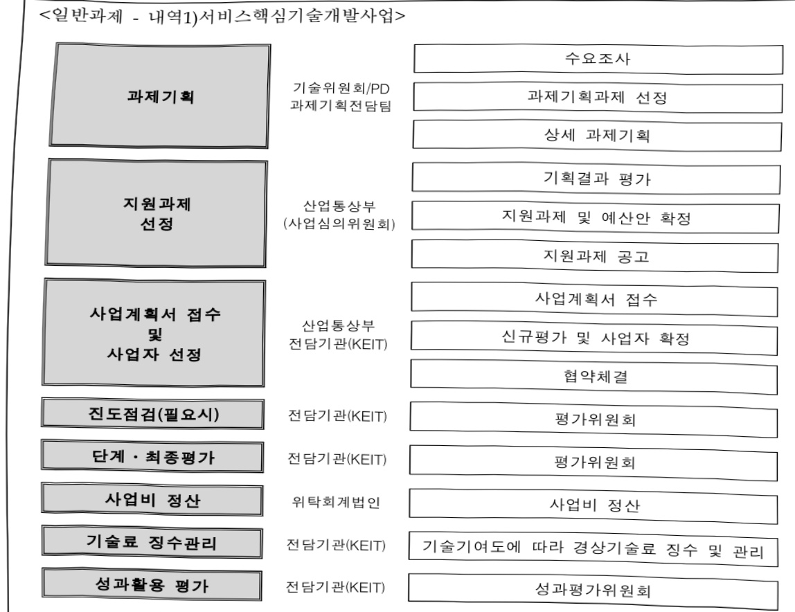

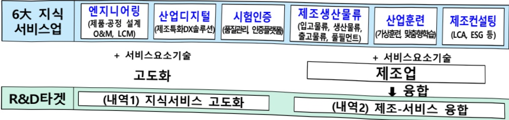

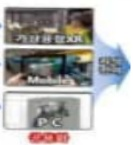

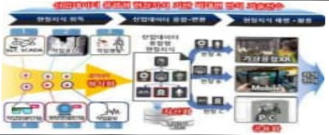

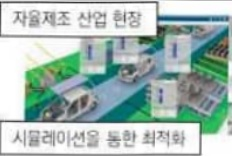

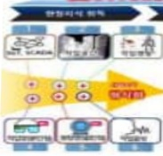

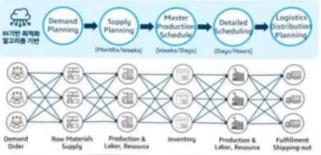

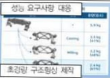

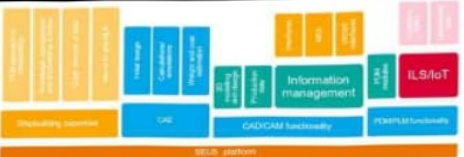

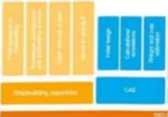

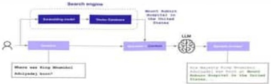

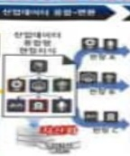

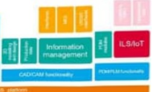

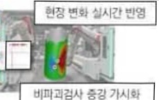

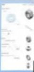

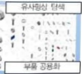

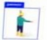

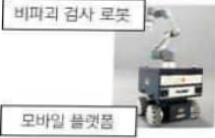

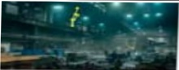

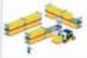

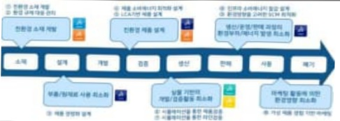

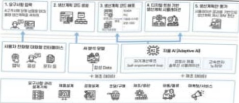

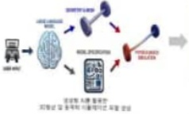

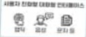

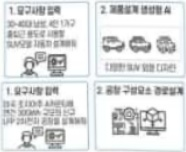

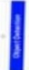

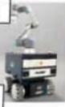

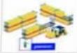

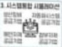

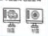

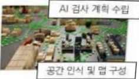

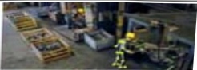

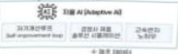

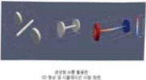

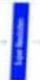

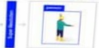

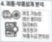

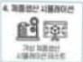

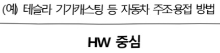

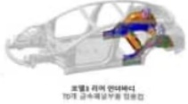

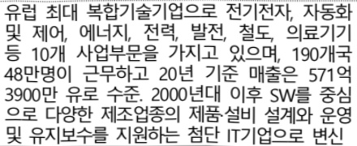

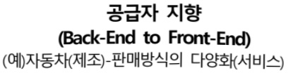

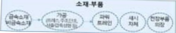

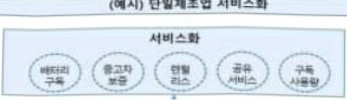

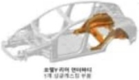

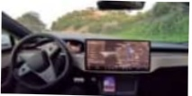

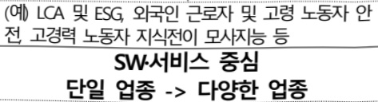

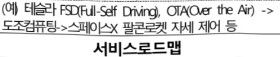

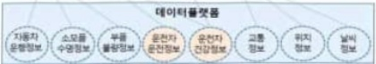

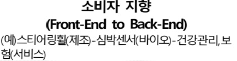

