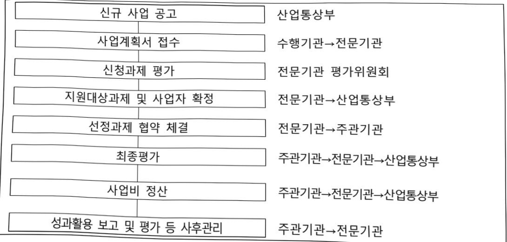
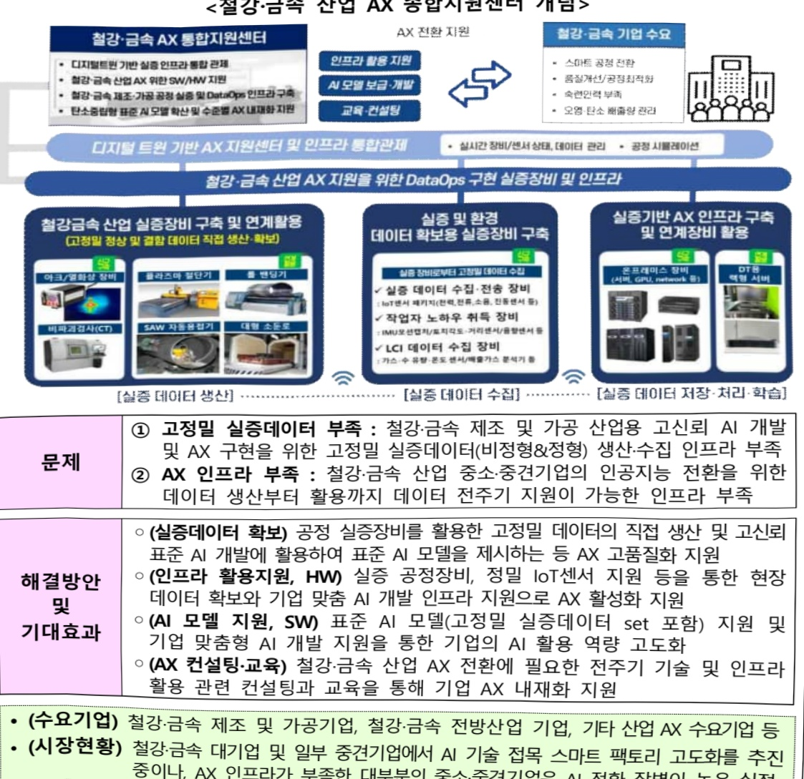
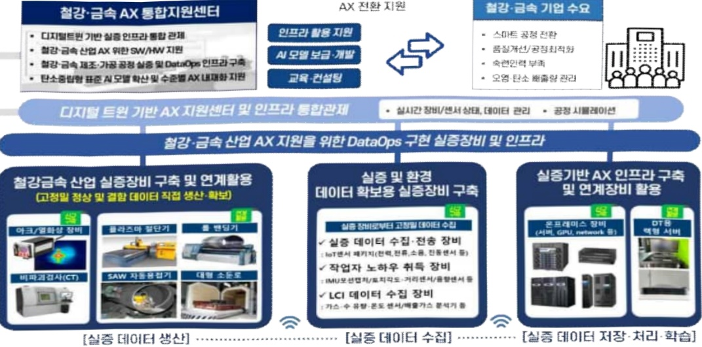

# 철강·금속 인공지능전환(AX) 실증센터 구축

**해당 페이지**: PDF 4414 ~ 4420 쪽 해당

**부처**: 산업통상부
**분야**: 산업·중소기업 및 에너지
**회계유형**: 일반회계
**2026 확정예산**: 2800.0 백만원
**전년대비 증감률**: None%
**AI 도메인**: 건설/스마트시티, 디지털전환(AX)

---

<table border=1 style='margin: auto; word-wrap: break-word;'><tr><td style='text-align: center; word-wrap: break-word;'>사 업 명</td></tr><tr><td style='text-align: center; word-wrap: break-word;'>(1) 철강·금속AX실증센터구축 (3171-496)</td></tr></table>

사업 코드 정보

<table border=1 style='margin: auto; word-wrap: break-word;'><tr><td style='text-align: center; word-wrap: break-word;'>구분</td><td style='text-align: center; word-wrap: break-word;'>회계</td><td style='text-align: center; word-wrap: break-word;'>소관</td><td style='text-align: center; word-wrap: break-word;'>실국(기관)</td><td style='text-align: center; word-wrap: break-word;'>계정</td><td style='text-align: center; word-wrap: break-word;'>분야</td><td style='text-align: center; word-wrap: break-word;'>부문</td></tr><tr><td style='text-align: center; word-wrap: break-word;'>코드</td><td rowspan="2">일반회계</td><td rowspan="2">산업통상부</td><td rowspan="2">산업자원안보실산업공급망정책관</td><td rowspan="2">-</td><td style='text-align: center; word-wrap: break-word;'>110</td><td style='text-align: center; word-wrap: break-word;'>117</td></tr><tr><td style='text-align: center; word-wrap: break-word;'>명칭</td><td style='text-align: center; word-wrap: break-word;'>산업·중소기업 및 에너지</td><td style='text-align: center; word-wrap: break-word;'>산업혁신지원</td></tr></table>

<table border=1 style='margin: auto; word-wrap: break-word;'><tr><td style='text-align: center; word-wrap: break-word;'>구분</td><td style='text-align: center; word-wrap: break-word;'>프로그램</td><td style='text-align: center; word-wrap: break-word;'>단위사업</td><td style='text-align: center; word-wrap: break-word;'>세부사업</td></tr><tr><td style='text-align: center; word-wrap: break-word;'>코드</td><td style='text-align: center; word-wrap: break-word;'>3100</td><td style='text-align: center; word-wrap: break-word;'>3171</td><td style='text-align: center; word-wrap: break-word;'>496</td></tr><tr><td style='text-align: center; word-wrap: break-word;'>명칭</td><td style='text-align: center; word-wrap: break-word;'>산업경쟁력기반구축</td><td style='text-align: center; word-wrap: break-word;'>산업기술기반구축</td><td style='text-align: center; word-wrap: break-word;'>철강·금속AX실증센터구축</td></tr></table>

사업 성격 (공통요구자료 Ⅱ-1 작성유의사항 4. 참조, 해당하는 사항에 “O” 표시)

<table border=1 style='margin: auto; word-wrap: break-word;'><tr><td rowspan="2">신규 계속</td><td rowspan="2">완료</td><td rowspan="2">예비타당성 실시여부</td><td rowspan="2">총사업비 관리대상</td><td rowspan="2">총액계상 예산사업</td><td style='text-align: center; word-wrap: break-word;'>사업소관 변경정보</td></tr><tr><td style='text-align: center; word-wrap: break-word;'>2025예산 시 소관</td></tr><tr><td style='text-align: center; word-wrap: break-word;'>O</td><td style='text-align: center; word-wrap: break-word;'></td><td style='text-align: center; word-wrap: break-word;'></td><td style='text-align: center; word-wrap: break-word;'></td><td style='text-align: center; word-wrap: break-word;'></td><td style='text-align: center; word-wrap: break-word;'></td></tr></table>

□ 사업 지원 형태 및 지원을 (최소한 한 개는 반드시 선택하시오. 해당사항에 ○ 표시)

<table border=1 style='margin: auto; word-wrap: break-word;'><tr><td style='text-align: center; word-wrap: break-word;'>직접</td><td style='text-align: center; word-wrap: break-word;'>출자</td><td style='text-align: center; word-wrap: break-word;'>출연</td><td style='text-align: center; word-wrap: break-word;'>보조</td><td style='text-align: center; word-wrap: break-word;'>융자</td><td style='text-align: center; word-wrap: break-word;'>국고보조율(%)</td><td style='text-align: center; word-wrap: break-word;'>융자율(%)</td></tr><tr><td style='text-align: center; word-wrap: break-word;'></td><td style='text-align: center; word-wrap: break-word;'></td><td style='text-align: center; word-wrap: break-word;'>○</td><td style='text-align: center; word-wrap: break-word;'></td><td style='text-align: center; word-wrap: break-word;'></td><td style='text-align: center; word-wrap: break-word;'></td><td style='text-align: center; word-wrap: break-word;'></td></tr></table>

사업담당자

<table border=1 style='margin: auto; word-wrap: break-word;'><tr><td style='text-align: center; word-wrap: break-word;'>사업명</td><td colspan="5">구분</td></tr><tr><td rowspan="2">철강·금속AX 실증센터구축</td><td style='text-align: center; word-wrap: break-word;'>소관부처</td><td style='text-align: center; word-wrap: break-word;'>실·국·과(팀) 산업자원안보실 산업공급망정책관 철강세라믹과</td><td style='text-align: center; word-wrap: break-word;'>과 장 송영상 044-203-4960</td><td rowspan="2">사무관 송석원 044-203-4694 주소영 실장</td><td rowspan="2">주무관 정지훤 044-203-4696 02-6009-3640</td></tr><tr><td style='text-align: center; word-wrap: break-word;'>사업시행주체</td><td style='text-align: center; word-wrap: break-word;'>한국산업기술진흥원</td><td style='text-align: center; word-wrap: break-word;'>산업안공지능혁신실</td></tr></table>

### 가. 예산 총괄표

(단위:백만원,%)

<table border=1 style='margin: auto; word-wrap: break-word;'><tr><td rowspan="2">사업명</td><td rowspan="2">2024년 결산</td><td colspan="2">2025년 예산</td><td colspan="2">2026년</td><td rowspan="2">중감 (B-A)</td><td rowspan="2">(B-A)/A</td></tr><tr><td style='text-align: center; word-wrap: break-word;'>본예산(A)</td><td style='text-align: center; word-wrap: break-word;'>추경</td><td style='text-align: center; word-wrap: break-word;'>요구안</td><td style='text-align: center; word-wrap: break-word;'>확정(B)</td></tr><tr><td style='text-align: center; word-wrap: break-word;'>철강·금속AX실증 센터구축</td><td style='text-align: center; word-wrap: break-word;'>-</td><td style='text-align: center; word-wrap: break-word;'>-</td><td style='text-align: center; word-wrap: break-word;'>-</td><td style='text-align: center; word-wrap: break-word;'>2,800</td><td style='text-align: center; word-wrap: break-word;'>2,800</td><td style='text-align: center; word-wrap: break-word;'>2,800</td><td style='text-align: center; word-wrap: break-word;'>순증</td></tr></table>

---

□ 기능별(내역사업별), 목별 예산 내역

(단위:백만원)

<table border=1 style='margin: auto; word-wrap: break-word;'><tr><td rowspan="3"></td><td colspan="5">2024</td><td colspan="7">2025(2025.12월말)</td><td rowspan="3">2026예산</td></tr><tr><td rowspan="2">예산액(추경)</td><td rowspan="2">예산현액</td><td rowspan="2">집행액[실집행액]</td><td rowspan="2">이월액</td><td rowspan="2">불용액</td><td rowspan="2">분예산</td><td rowspan="2">예산현액</td><td rowspan="2">집행액[실집행액]</td><td colspan="2">전년도아월액제외</td><td rowspan="2">이월예상액</td><td rowspan="2">불용예상액</td></tr><tr><td style='text-align: center; word-wrap: break-word;'>예산현액</td><td style='text-align: center; word-wrap: break-word;'>집행액[실집행액]</td></tr><tr><td style='text-align: center; word-wrap: break-word;'>○ 기능별 분류(함께)</td><td style='text-align: center; word-wrap: break-word;'>-</td><td style='text-align: center; word-wrap: break-word;'>-</td><td style='text-align: center; word-wrap: break-word;'>-</td><td style='text-align: center; word-wrap: break-word;'>-</td><td style='text-align: center; word-wrap: break-word;'>-</td><td style='text-align: center; word-wrap: break-word;'>-</td><td style='text-align: center; word-wrap: break-word;'>-</td><td style='text-align: center; word-wrap: break-word;'>-</td><td style='text-align: center; word-wrap: break-word;'>-</td><td style='text-align: center; word-wrap: break-word;'>-</td><td style='text-align: center; word-wrap: break-word;'>-</td><td style='text-align: center; word-wrap: break-word;'>-</td><td style='text-align: center; word-wrap: break-word;'>2,800</td></tr><tr><td style='text-align: center; word-wrap: break-word;'>· 광양철강·금속인공지능전환(AX)실증센터·기획평가관리비</td><td style='text-align: center; word-wrap: break-word;'>-</td><td style='text-align: center; word-wrap: break-word;'>-</td><td style='text-align: center; word-wrap: break-word;'>-</td><td style='text-align: center; word-wrap: break-word;'>-</td><td style='text-align: center; word-wrap: break-word;'>-</td><td style='text-align: center; word-wrap: break-word;'>-</td><td style='text-align: center; word-wrap: break-word;'>-</td><td style='text-align: center; word-wrap: break-word;'>-</td><td style='text-align: center; word-wrap: break-word;'>-</td><td style='text-align: center; word-wrap: break-word;'>-</td><td style='text-align: center; word-wrap: break-word;'>-</td><td style='text-align: center; word-wrap: break-word;'>-</td><td style='text-align: center; word-wrap: break-word;'>2,719</td></tr><tr><td style='text-align: center; word-wrap: break-word;'>○ 비목별 분류(함께)</td><td style='text-align: center; word-wrap: break-word;'>-</td><td style='text-align: center; word-wrap: break-word;'>-</td><td style='text-align: center; word-wrap: break-word;'>-</td><td style='text-align: center; word-wrap: break-word;'>-</td><td style='text-align: center; word-wrap: break-word;'>-</td><td style='text-align: center; word-wrap: break-word;'>-</td><td style='text-align: center; word-wrap: break-word;'>-</td><td style='text-align: center; word-wrap: break-word;'>-</td><td style='text-align: center; word-wrap: break-word;'>-</td><td style='text-align: center; word-wrap: break-word;'>-</td><td style='text-align: center; word-wrap: break-word;'>-</td><td style='text-align: center; word-wrap: break-word;'>-</td><td style='text-align: center; word-wrap: break-word;'>81</td></tr><tr><td style='text-align: center; word-wrap: break-word;'>· 사업출연금(350-02)·기관운영출연금(350-01)</td><td style='text-align: center; word-wrap: break-word;'>-</td><td style='text-align: center; word-wrap: break-word;'>-</td><td style='text-align: center; word-wrap: break-word;'>-</td><td style='text-align: center; word-wrap: break-word;'>-</td><td style='text-align: center; word-wrap: break-word;'>-</td><td style='text-align: center; word-wrap: break-word;'>-</td><td style='text-align: center; word-wrap: break-word;'>-</td><td style='text-align: center; word-wrap: break-word;'>-</td><td style='text-align: center; word-wrap: break-word;'>-</td><td style='text-align: center; word-wrap: break-word;'>-</td><td style='text-align: center; word-wrap: break-word;'>-</td><td style='text-align: center; word-wrap: break-word;'>-</td><td style='text-align: center; word-wrap: break-word;'>2,800</td></tr><tr><td style='text-align: center; word-wrap: break-word;'>○ 기능비목별 분류(함께)</td><td style='text-align: center; word-wrap: break-word;'>-</td><td style='text-align: center; word-wrap: break-word;'>-</td><td style='text-align: center; word-wrap: break-word;'>-</td><td style='text-align: center; word-wrap: break-word;'>-</td><td style='text-align: center; word-wrap: break-word;'>-</td><td style='text-align: center; word-wrap: break-word;'>-</td><td style='text-align: center; word-wrap: break-word;'>-</td><td style='text-align: center; word-wrap: break-word;'>-</td><td style='text-align: center; word-wrap: break-word;'>-</td><td style='text-align: center; word-wrap: break-word;'>-</td><td style='text-align: center; word-wrap: break-word;'>-</td><td style='text-align: center; word-wrap: break-word;'>-</td><td style='text-align: center; word-wrap: break-word;'>2,800</td></tr><tr><td style='text-align: center; word-wrap: break-word;'>· 광양철강·금속인공지능전환(AX)실증센터·사업출연금(350-02)·기획평가관리비</td><td style='text-align: center; word-wrap: break-word;'>-</td><td style='text-align: center; word-wrap: break-word;'>-</td><td style='text-align: center; word-wrap: break-word;'>-</td><td style='text-align: center; word-wrap: break-word;'>-</td><td style='text-align: center; word-wrap: break-word;'>-</td><td style='text-align: center; word-wrap: break-word;'>-</td><td style='text-align: center; word-wrap: break-word;'>-</td><td style='text-align: center; word-wrap: break-word;'>-</td><td style='text-align: center; word-wrap: break-word;'>-</td><td style='text-align: center; word-wrap: break-word;'>-</td><td style='text-align: center; word-wrap: break-word;'>-</td><td style='text-align: center; word-wrap: break-word;'>-</td><td style='text-align: center; word-wrap: break-word;'>2,719</td></tr><tr><td style='text-align: center; word-wrap: break-word;'>· 기획평가관리비</td><td style='text-align: center; word-wrap: break-word;'>-</td><td style='text-align: center; word-wrap: break-word;'>-</td><td style='text-align: center; word-wrap: break-word;'>-</td><td style='text-align: center; word-wrap: break-word;'>-</td><td style='text-align: center; word-wrap: break-word;'>-</td><td style='text-align: center; word-wrap: break-word;'>-</td><td style='text-align: center; word-wrap: break-word;'>-</td><td style='text-align: center; word-wrap: break-word;'>-</td><td style='text-align: center; word-wrap: break-word;'>-</td><td style='text-align: center; word-wrap: break-word;'>-</td><td style='text-align: center; word-wrap: break-word;'>-</td><td style='text-align: center; word-wrap: break-word;'>-</td><td style='text-align: center; word-wrap: break-word;'>2,719</td></tr><tr><td style='text-align: center; word-wrap: break-word;'>· 기관운영출연금(350-01)</td><td style='text-align: center; word-wrap: break-word;'>-</td><td style='text-align: center; word-wrap: break-word;'>-</td><td style='text-align: center; word-wrap: break-word;'>-</td><td style='text-align: center; word-wrap: break-word;'>-</td><td style='text-align: center; word-wrap: break-word;'>-</td><td style='text-align: center; word-wrap: break-word;'>-</td><td style='text-align: center; word-wrap: break-word;'>-</td><td style='text-align: center; word-wrap: break-word;'>-</td><td style='text-align: center; word-wrap: break-word;'>-</td><td style='text-align: center; word-wrap: break-word;'>-</td><td style='text-align: center; word-wrap: break-word;'>-</td><td style='text-align: center; word-wrap: break-word;'>-</td><td style='text-align: center; word-wrap: break-word;'>81</td></tr></table>

### 나. 사업설명자료

## 1 ) 사업목적·내용

°(목적) 철강·금속 제조 및 가공산업 AX 내재화 실현을 위한 AX 종합지원센터 및 실증

인프라 구축

°(내용) 실증 기반 철강·금속 산업 AX 종합지원센터 구축

- 철강·금속 제조 및 가공 산업 AX 지원 통합 인프라 구축

- 디지털트런 기반 AX 실증 인프라 통합관제실 구축 · 운영

- 철강·금속 제조 및 가공 기업 AX를 위한 표준 AI 모델 및 기업 맞춤형 AI 서비스 개발 · 지원

- 기업 AX 성숙도에 따른 단계별 기업지원을 통한 기업 AX 내재화 지원

---

## 2 ) 사업개요

□ 사업근거 및 추진경위

① 법령상 근거 및 조항 적시 : 산업기술혁신 촉진법 제19조

-「산업기술혁신촉진법」 제19조(산업기술기반조성사업)

## 제19조(산업기술기반조성사업) ① 산업통상부장관은 산업기술혁신의 기반 및 환경조성에 관한 다음 각 호의 사업(이하 “산업기술기반조성사업”이라 한다)을 추진할 수 있다

1. 산업기술인력의 활용 및 공급

2. 산업기술 연구장비·시설 등의 확충 및 활용촉진

3. 연구장비·시설·연구인력 및 정보 등 산업기술혁신 요소의 집적화(集積化) 촉진

4. 산업기술혁신을 위하여 필요한 기술·산업 등에 관한 각종 정보의 생산·관리 및 활용의 촉진

5. 산업기술의 표준화, 디자인·브랜드 선진화 등을 위한 기반구축

6. 산업기술문화공간의 설치·운영 등 산업기술저변의 확충

7. 그 밖에 산업기술혁신 기반 조성을 위하여 대통령령으로 정하는 사업

② 산업통상부장관은 연구기관, 대학, 그 밖에 대통령령으로 정하는 기관·단체로 하여금 산업기술기반조성사업을 실시하게 할 수 있으며, 산업기술기반조성사업을 주관하여 실시하는 자(이하 “주관기관”이라 한다)와 산업기술기반조성사업에 관한 협약을 체결하고, 주관기관에 해당 사업의 수행에 드는 비용의 전부 또는 일부를 출연 또는 보조할 수 있다.

③ 산업기술기반조성사업에 관하여는 제11조(제1항은 제외한다)·제11조의2 및 제11조의3을 준용한다. 이 경우 “주관연구기관”은 “주관기관”으로, “산업기술개발사업”은 “산업기술기반조성사업”으로 본다.

-「산업기술혁신촉진법」제21조(연구장비·시설 등의 확충 및 활용촉진)

제21조(연구장비·시설 등의 확충 및 활용촉진) ① 산업통상부장관은 주관기관이 연구장비·시설, 시험·평가장비 등(이하 “연구장비등”이라 한다) 연구기반을 확충할 수 있도록 지원하거나 그 밖에 필요한 방안을 마련하여야 한다.

② 제1항에 따라 연구장비등을 지원받은 주관기관과 주관연구기관 중 대통령령으로 정하는 기관(이하 이 조에서 “주관기관등”이라 한다)은 무상 또는 연구장비등의 유지·보수·운영에 드는 비용 등을 고려하여 산업통상부장관이 고시하는 기준에 따라 산정한 사용료를 받는 것을 조건으로 다른 기술혁신주체가 해당 연구장비등을 활용할 수 있도록 연구장비등의 활용촉진을 위한 방안을 마련하여 추진하여야 한다. 이 경우 산업통상부장관은 연구장비등의 활용촉진에 드는 비용의 전부 또는 일부를 주관기관등에 지원할 수 있다.

③ 주관기관등은 대통령령으로 정하는 바에 따라 연구장비등의 연도별 활용촉진 계획 및 활용실적을 산업통상부장관에게 제출하여야 한다.

④ 산업통상부장관은 주관기관들이 보유하고 있는 연구장비등의 효과적인 관리 및 활용촉진을 위하여 대통령령으로 정하는 기준에 따라 연구장비관리 전문기관을 지정하여 관련 업무를 수행하게 할 수 있다. 이 경우 산업통상부장관은 해당 전문기관에 연구장비등의 관리 및 활용촉진을 위하여 드는 비용의 전부 또는 일부를 지원할 수 있다.

---

② 추진경위 - 사업 시작년도, 추진배경, 부처별 중점과제, 대통령 공약사항 등

○ 산업 AI 내재화 전략(제1차 산업 디지털 전환 종합계획) ('23.1월, 관계부처 합동)

- AI내재화 공급산업 육성, 수요기업 AI 활용 역량 강화, 민간 주도 DX 생태계 조성

○산업 AI 확산을 위한 10대 과제 (25.1월, 산업부)

-산업AI 컴퓨팅 인프라(AI 모델 실증 인프라 구축)

## □ 주요내용

① 사업규모

- 총사업비(해당되는 경우에만 기재) : 해당없음

- 사업기간 : 2026년 ~ 2030년

- 최근 5년 간 투입된 사업비(예산액기준, 추경편성한 연도에는 추경포함)

<table border=1 style='margin: auto; word-wrap: break-word;'><tr><td style='text-align: center; word-wrap: break-word;'>연도</td><td style='text-align: center; word-wrap: break-word;'>2022</td><td style='text-align: center; word-wrap: break-word;'>2023</td><td style='text-align: center; word-wrap: break-word;'>2024</td><td style='text-align: center; word-wrap: break-word;'>2025</td><td style='text-align: center; word-wrap: break-word;'>2026</td></tr><tr><td style='text-align: center; word-wrap: break-word;'>사업비</td><td style='text-align: center; word-wrap: break-word;'>-</td><td style='text-align: center; word-wrap: break-word;'>-</td><td style='text-align: center; word-wrap: break-word;'>-</td><td style='text-align: center; word-wrap: break-word;'>-</td><td style='text-align: center; word-wrap: break-word;'>2,800</td></tr></table>

- 기타: 해당 없음

② 사업추진체계

- 사업시행방법 : 출연

- 사업시행주체 : 한국산업기술진흥원

- 사업 수혜자 : 대학, 연구소 등 비영리기관 및 관련 중소·중견기업 등

- 보조, 융자, 출연, 출자 등의 경우 보조·융자 등 지원 비율 및 법적근거

<table border=1 style='margin: auto; word-wrap: break-word;'><tr><td style='text-align: center; word-wrap: break-word;'>내역사업명</td><td style='text-align: center; word-wrap: break-word;'>구분</td><td style='text-align: center; word-wrap: break-word;'>피보조·피출연 등 기관명</td><td style='text-align: center; word-wrap: break-word;'>지원 금액 (2026예산)</td><td style='text-align: center; word-wrap: break-word;'>지원 비율(%)</td><td style='text-align: center; word-wrap: break-word;'>보조율 법적근거 (해당 조항)</td></tr><tr><td style='text-align: center; word-wrap: break-word;'>철강금속 AX지원 센터구축</td><td style='text-align: center; word-wrap: break-word;'>출연</td><td style='text-align: center; word-wrap: break-word;'>한국산업 기술진흥원</td><td style='text-align: center; word-wrap: break-word;'>2,800 백만원</td><td style='text-align: center; word-wrap: break-word;'>70% 이하</td><td style='text-align: center; word-wrap: break-word;'>산업기술혁신촉진법 제19조(산업기술기반조성사업)</td></tr></table>

## 3 ) 2026년도 예산 산출 근거

☐ 철강금속AX지원센터구축 : (2025 본예산) 0 → (2026) 2,800백만원, 순증

o 실증 기반 철강·금속 산업 AX 종합지원센터 구축을 위하여 2,800백만원 요구

- (산출) 신규 과제 1개 x 2,800백만원 = 2,719백만원 / 기획평가관리비 81백만원

- (시원내용) 설상·금속 세소 및 가능 산업 AX 지원 통합 인프라 구축, 디지털트런 기반 AX 실증 인프라 통합관제실 구축·운영, 철강·금속 제조 및 가공 기업 AX를 위한 표준 AI 모델 개발 및 맞춤형 AI 서비스 개발·지원,, 기업 AX 성숙도에 따른 단계별 기업지원을 통한 기업 AX 내재화 지원

<table border=1 style='margin: auto; word-wrap: break-word;'><tr><td colspan="2">2025년 본예산</td><td colspan="2">2026년 예산</td></tr><tr><td style='text-align: center; word-wrap: break-word;'>예산</td><td style='text-align: center; word-wrap: break-word;'>산출내역</td><td style='text-align: center; word-wrap: break-word;'>예산</td><td style='text-align: center; word-wrap: break-word;'>산출내역</td></tr><tr><td style='text-align: center; word-wrap: break-word;'>-</td><td style='text-align: center; word-wrap: break-word;'>-</td><td style='text-align: center; word-wrap: break-word;'>2,800</td><td style='text-align: center; word-wrap: break-word;'>○ 사업출연금(350-02) : 2,719백만원
- 광양철강·금속인공지능전환(AX)실증센터 2,719백만원
- (신규) 1개 × 2,719백만원
○ 기관운영출연금(350-01) : 81백만원
- 전문기관 기획평가관리비 81백만원</td></tr></table>

---

## 4 ) 사업효과

## □ 사업영향,산출물 성과지표 등

① 2022~2026년도 성과계획서 상 성과지표 및 최근 5년간 성과 달성도

<table border=1 style='margin: auto; word-wrap: break-word;'><tr><td style='text-align: center; word-wrap: break-word;'>성과지표</td><td style='text-align: center; word-wrap: break-word;'>구분</td><td style='text-align: center; word-wrap: break-word;'>2022</td><td style='text-align: center; word-wrap: break-word;'>2023</td><td style='text-align: center; word-wrap: break-word;'>2024</td><td style='text-align: center; word-wrap: break-word;'>2025</td><td style='text-align: center; word-wrap: break-word;'>2026</td><td style='text-align: center; word-wrap: break-word;'>2026 목표치산출근거</td><td style='text-align: center; word-wrap: break-word;'>측정산시(또는 측정방법)</td><td style='text-align: center; word-wrap: break-word;'>자료수집방법(또는 자료출처)</td></tr><tr><td style='text-align: center; word-wrap: break-word;'>기업 AX 기술지원(지도)(단위: 건)</td><td style='text-align: center; word-wrap: break-word;'>목표실적달성도</td><td style='text-align: center; word-wrap: break-word;'>-</td><td style='text-align: center; word-wrap: break-word;'>-</td><td style='text-align: center; word-wrap: break-word;'>-</td><td style='text-align: center; word-wrap: break-word;'>-</td><td style='text-align: center; word-wrap: break-word;'>3</td><td style='text-align: center; word-wrap: break-word;'>보유 장비를 활용한 기업 기술지원 및 지도 건수</td><td style='text-align: center; word-wrap: break-word;'>기술지원 및 지도 건수 합계</td><td style='text-align: center; word-wrap: break-word;'>기술지원(지도) 결과보고서</td></tr><tr><td style='text-align: center; word-wrap: break-word;'>기업맞춤형 AI 모델개발 지원(단위: 건)</td><td style='text-align: center; word-wrap: break-word;'>목표실적달성도</td><td style='text-align: center; word-wrap: break-word;'>-</td><td style='text-align: center; word-wrap: break-word;'>-</td><td style='text-align: center; word-wrap: break-word;'>-</td><td style='text-align: center; word-wrap: break-word;'>-</td><td style='text-align: center; word-wrap: break-word;'>1</td><td style='text-align: center; word-wrap: break-word;'>기업별 수요 AI 모델 개발 지원(HW, SW 등) 건수</td><td style='text-align: center; word-wrap: break-word;'>기업별 수요 AI 모델 개발 지원(HW, SW 등) 건수 합계</td><td rowspan="2">사업 결과보고서</td></tr><tr><td style='text-align: center; word-wrap: break-word;'>AX 융합 교육프로그램 개발 및 운영(단위: 건)</td><td style='text-align: center; word-wrap: break-word;'>목표실적달성도</td><td style='text-align: center; word-wrap: break-word;'>-</td><td style='text-align: center; word-wrap: break-word;'>-</td><td style='text-align: center; word-wrap: break-word;'>-</td><td style='text-align: center; word-wrap: break-word;'>2</td><td style='text-align: center; word-wrap: break-word;'>AX 융합 교육프로그램 개발 및 운영 건수</td><td style='text-align: center; word-wrap: break-word;'>교육프로그램 개발 건수+프로그램 운영 건수 합계</td><td style='text-align: center; word-wrap: break-word;'>사업 결과보고서</td></tr></table>

② 성과지표 이외의 연도별 사업추진 경과 및 실적 : 신규사업으로 해당없음

③ 향후(2026년도 이후) 기대효과 : 개조식으로 작성, 건 별로 계량적 수치 제시

- 미래 친환경 에너지 등 철강·금속 수요 기반 전방산업으로의 연계 및 AX 생태계

획장을 통한 고부가가치 창출(광양철강·금속인공지능전환(AX)실증센터 1개소 운영)

5) 타당성조사 및 예비타당성조사 시행여부 및 결과 요지 : 해당없음

6) 총사업비 대상사업 여부 및 내역 : 해당없음

## 7 ) 사업 집행절차

---

8) 중기재정계획 상 연도별 투자계획 및 추진경과

(단위:백만원)

<table border=1 style='margin: auto; word-wrap: break-word;'><tr><td style='text-align: center; word-wrap: break-word;'>중기 재정계획</td><td style='text-align: center; word-wrap: break-word;'>2024</td><td style='text-align: center; word-wrap: break-word;'>2025</td><td style='text-align: center; word-wrap: break-word;'>2026</td><td style='text-align: center; word-wrap: break-word;'>2027</td><td style='text-align: center; word-wrap: break-word;'>2028</td><td style='text-align: center; word-wrap: break-word;'>2029</td></tr><tr><td style='text-align: center; word-wrap: break-word;'>2024~2028 2025~2029</td><td style='text-align: center; word-wrap: break-word;'>-</td><td style='text-align: center; word-wrap: break-word;'>-</td><td style='text-align: center; word-wrap: break-word;'>-</td><td style='text-align: center; word-wrap: break-word;'>-</td><td style='text-align: center; word-wrap: break-word;'>-</td><td style='text-align: center; word-wrap: break-word;'>-</td></tr></table>

9) 최근 3년간 동 사업에 대한 주요 외부지적사항 및 평가, 문제점 및 대책 : 해당없음

10)향후 추진방향 및 추진계획

<table border=1 style='margin: auto; word-wrap: break-word;'><tr><td style='text-align: center; word-wrap: break-word;'>- 전통적인 철강·금속 공정 운영 중심에서 고정밀 데이터 기반 AI 활용 공정관리 체계 전환을 통한 제조 및 가공 중심 중소기업의 디지털/AI 역량 강화</td></tr><tr><td style='text-align: center; word-wrap: break-word;'>- AI 기반 품질 예측 및 공정 최적화에 따른 불량률 감소, 신규 인력의 빠른 숙련도 향상, 생산 수율 향상 등 중소·중견기업의 경쟁력 향상</td></tr><tr><td style='text-align: center; word-wrap: break-word;'>- 고정밀 실증데이터 및 표준 AI 모델을 기반으로 기업별 맞춤 AI 모델 확산을 통해 철강·금속 제조 및 가공 산업 AX 생태계 활성화</td></tr></table>

11) 해당사업에 대한 각종 사업평가의 결과 : 해당없음

12) 해당사업에 대한 부처 자체평가의 결과 : 해당없음

13) 부처 건의사항 : 해당없음

다. 최근 4년간 결산내역 : 해당없음

라. 기타 추가자료

(1) 사업 설명자료

---

## 붙임1

## 철강·금속AX지원센터구축사업개요

ny : ① 글로벌 공급과잉, 보호무역(관세), 탄소규제(CBAM) 등으로 철강·금속 산업 위기 심화

② 철강·금속 산업 대기업 위주 AX 도입 및 고도화→비용, 인력, 인프라 부족으로 중소·중견기업 AX 전환 지연→철강·금속 산업군 내 AX 격차 심화

③ 철강·금속 산업 고정밀·비정형 실증 데이터 운영 인프라 필요 (기존 데이터셋 활용 한계)

What : 철강·금속 제조 및 가공 산업 AX 실증지원(인프라, AI 모델, 교육·컨설팅)

How : 철강·금속 산업 AX 종합지원센터 구축을 통한 실증 데이터 전주기 운영기반 AX 인프라 구축, 고정밀 표준 AI 모델 개발·보급, AI 도입 수준별 기업지원 등을 통한 철강·금속 산업 AX 내재화 촉진

## <철강·금속 산업 AX 종합지원센터 개념>

## 해결방안 및 기대효과

---

### 원본 PDF 크롭 이미지

