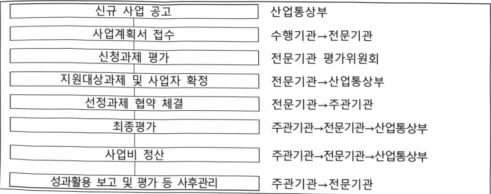
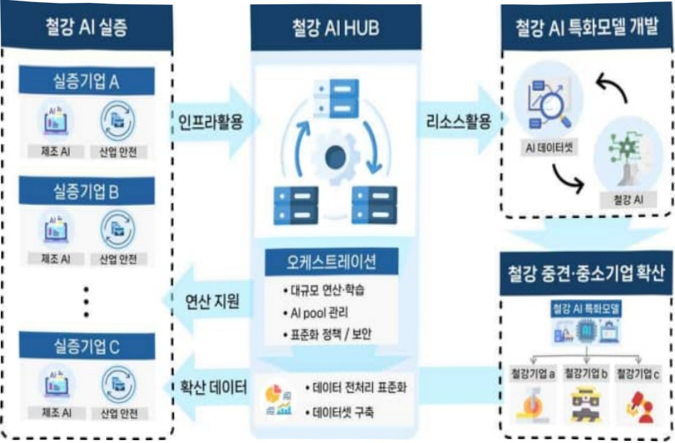

# 철강산업 AI융합실증 허브 구축사업

**해당 페이지**: PDF 4421 ~ 4428 쪽 해당

**부처**: 산업통상부
**분야**: 산업·중소기업 및 에너지
**회계유형**: 일반회계
**2026 확정예산**: 4000.0 백만원
**전년대비 증감률**: None%
**AI 도메인**: 제조/스마트팩토리, 디지털전환(AX)

---

□ 기능별(내역사업별), 목별 예산 내역

(단위:백만원)

<table border=1 style='margin: auto; word-wrap: break-word;'><tr><td rowspan="3"></td><td colspan="5">2024</td><td colspan="7">2025(2025.12월말)</td><td rowspan="3">2026예산</td></tr><tr><td rowspan="2">예산액(추경)</td><td rowspan="2">예산현액</td><td rowspan="2">집행액[실집행액]</td><td rowspan="2">이월액</td><td rowspan="2">불용액</td><td rowspan="2">분예산</td><td rowspan="2">예산현액</td><td rowspan="2">집행액[실집행액]</td><td colspan="2">전년도아월액제외</td><td rowspan="2">이월예상액</td><td rowspan="2">불용예상액</td></tr><tr><td style='text-align: center; word-wrap: break-word;'>예산현액</td><td style='text-align: center; word-wrap: break-word;'>집행액[실집행액]</td></tr><tr><td style='text-align: center; word-wrap: break-word;'>○기능별분류(함계)</td><td style='text-align: center; word-wrap: break-word;'>-</td><td style='text-align: center; word-wrap: break-word;'>-</td><td style='text-align: center; word-wrap: break-word;'>-</td><td style='text-align: center; word-wrap: break-word;'>-</td><td style='text-align: center; word-wrap: break-word;'>-</td><td style='text-align: center; word-wrap: break-word;'>-</td><td style='text-align: center; word-wrap: break-word;'>-</td><td style='text-align: center; word-wrap: break-word;'>-</td><td style='text-align: center; word-wrap: break-word;'>-</td><td style='text-align: center; word-wrap: break-word;'>-</td><td style='text-align: center; word-wrap: break-word;'>-</td><td style='text-align: center; word-wrap: break-word;'>-</td><td style='text-align: center; word-wrap: break-word;'>4,000</td></tr><tr><td style='text-align: center; word-wrap: break-word;'>·포항철강산업AI융합실증허브구축·기획평가관리비</td><td style='text-align: center; word-wrap: break-word;'>-</td><td style='text-align: center; word-wrap: break-word;'>-</td><td style='text-align: center; word-wrap: break-word;'>-</td><td style='text-align: center; word-wrap: break-word;'>-</td><td style='text-align: center; word-wrap: break-word;'>-</td><td style='text-align: center; word-wrap: break-word;'>-</td><td style='text-align: center; word-wrap: break-word;'>-</td><td style='text-align: center; word-wrap: break-word;'>-</td><td style='text-align: center; word-wrap: break-word;'>-</td><td style='text-align: center; word-wrap: break-word;'>-</td><td style='text-align: center; word-wrap: break-word;'>-</td><td style='text-align: center; word-wrap: break-word;'>-</td><td style='text-align: center; word-wrap: break-word;'>3,884</td></tr><tr><td style='text-align: center; word-wrap: break-word;'>○비목별분류(함계)</td><td style='text-align: center; word-wrap: break-word;'>-</td><td style='text-align: center; word-wrap: break-word;'>-</td><td style='text-align: center; word-wrap: break-word;'>-</td><td style='text-align: center; word-wrap: break-word;'>-</td><td style='text-align: center; word-wrap: break-word;'>-</td><td style='text-align: center; word-wrap: break-word;'>-</td><td style='text-align: center; word-wrap: break-word;'>-</td><td style='text-align: center; word-wrap: break-word;'>-</td><td style='text-align: center; word-wrap: break-word;'>-</td><td style='text-align: center; word-wrap: break-word;'>-</td><td style='text-align: center; word-wrap: break-word;'>-</td><td style='text-align: center; word-wrap: break-word;'>-</td><td style='text-align: center; word-wrap: break-word;'>116</td></tr><tr><td style='text-align: center; word-wrap: break-word;'>·사업출연금(350-02)·기관운영출연금(350-01)</td><td style='text-align: center; word-wrap: break-word;'>-</td><td style='text-align: center; word-wrap: break-word;'>-</td><td style='text-align: center; word-wrap: break-word;'>-</td><td style='text-align: center; word-wrap: break-word;'>-</td><td style='text-align: center; word-wrap: break-word;'>-</td><td style='text-align: center; word-wrap: break-word;'>-</td><td style='text-align: center; word-wrap: break-word;'>-</td><td style='text-align: center; word-wrap: break-word;'>-</td><td style='text-align: center; word-wrap: break-word;'>-</td><td style='text-align: center; word-wrap: break-word;'>-</td><td style='text-align: center; word-wrap: break-word;'>-</td><td style='text-align: center; word-wrap: break-word;'>-</td><td style='text-align: center; word-wrap: break-word;'>4,000</td></tr><tr><td style='text-align: center; word-wrap: break-word;'>○기능비목별분류(함계)</td><td style='text-align: center; word-wrap: break-word;'>-</td><td style='text-align: center; word-wrap: break-word;'>-</td><td style='text-align: center; word-wrap: break-word;'>-</td><td style='text-align: center; word-wrap: break-word;'>-</td><td style='text-align: center; word-wrap: break-word;'>-</td><td style='text-align: center; word-wrap: break-word;'>-</td><td style='text-align: center; word-wrap: break-word;'>-</td><td style='text-align: center; word-wrap: break-word;'>-</td><td style='text-align: center; word-wrap: break-word;'>-</td><td style='text-align: center; word-wrap: break-word;'>-</td><td style='text-align: center; word-wrap: break-word;'>-</td><td style='text-align: center; word-wrap: break-word;'>-</td><td style='text-align: center; word-wrap: break-word;'>4,000</td></tr><tr><td style='text-align: center; word-wrap: break-word;'>·포항철강산업AI융합실증허브구축·사업출연금(350-02)·기획평가관리비·기관운영출연금(350-01)</td><td style='text-align: center; word-wrap: break-word;'>-</td><td style='text-align: center; word-wrap: break-word;'>-</td><td style='text-align: center; word-wrap: break-word;'>-</td><td style='text-align: center; word-wrap: break-word;'>-</td><td style='text-align: center; word-wrap: break-word;'>-</td><td style='text-align: center; word-wrap: break-word;'>-</td><td style='text-align: center; word-wrap: break-word;'>-</td><td style='text-align: center; word-wrap: break-word;'>-</td><td style='text-align: center; word-wrap: break-word;'>-</td><td style='text-align: center; word-wrap: break-word;'>-</td><td style='text-align: center; word-wrap: break-word;'>-</td><td style='text-align: center; word-wrap: break-word;'>3,884</td><td style='text-align: center; word-wrap: break-word;'></td></tr></table>

### 나. 사업설명자료

## 1 ) 사업목적·내용

°(목적) 철강산업 위축, 산업안전·환경 등 노후화된 철강산업의 인공지능 전환(AX)

융합 실증 허브 구축을 통한 철강산업 진흥 기반 마련

°(내용) 철강AI 허브센터 인프라 구축 및 철강AI 개발-실증 전주기 지원체계 구축

- (철강AI 허브센터 인프라 구축) 철강기업 AI 개발 및 실증 가속화를 위한 공용

핵심 인프라 허브 구축

- (철강AI 개발-실증 전주기 지원 체계구축) 철강특화 AI 솔루션 및 기업지원 체계 구축

---

## 2 ) 사업개요

□ 사업근거 및 추진경위

① 법령상 근거 및 조항 적시 : 산업기술혁신 촉진법 제19조

-「산업기술혁신촉진법」 제19조(산업기술기반조성사업)

## 제19조(산업기술기반조성사업) ① 산업통상부장관은 산업기술혁신의 기반 및 환경조성에 관한 다음 각 호의 사업(이하 “산업기술기반조성사업”이라 한다)을 추진할 수 있다

1. 산업기술인력의 활용 및 공급

2. 산업기술 연구장비·시설 등의 확충 및 활용촉진

3. 연구장비·시설·연구인력 및 정보 등 산업기술혁신 요소의 집적화(集積化) 촉진

4. 산업기술혁신을 위하여 필요한 기술·산업 등에 관한 각종 정보의 생산·관리 및 활용의 촉진

5. 산업기술의 표준화, 디자인·브랜드 선진화 등을 위한 기반구축

6. 산업기술문화공간의 설치·운영 등 산업기술저변의 확충

7. 그 밖에 산업기술혁신 기반 조성을 위하여 대통령령으로 정하는 사업

② 산업통상부장관은 연구기관, 대학, 그 밖에 대통령령으로 정하는 기관·단체로 하여금 산업기술기반조성사업을 실시하게 할 수 있으며, 산업기술기반조성사업을 주관하여 실시하는 자(이하 “주관기관”이라 한다)와 산업기술기반조성사업에 관한 협약을 체결하고, 주관기관에 해당 사업의 수행에 드는 비용의 전부 또는 일부를 출연 또는 보조할 수 있다.

③ 산업기술기반조성사업에 관하여는 제11조(제1항은 제외한다)·제11조의2 및 제11조의3을 준용한다. 이 경우 “주관연구기관”은 “주관기관”으로, “산업기술개발사업”은 “산업기술기반조성사업”으로 본다.

-「산업기술혁신촉진법」제21조(연구장비·시설 등의 확충 및 활용촉진)

제21조(연구장비·시설 등의 확충 및 활용촉진) ① 산업통상부장관은 주관기관이 연구장비·시설, 시험·평가장비 등(이하 “연구장비등”이라 한다) 연구기반을 확충할 수 있도록 지원하거나 그 밖에 필요한 방안을 마련하여야 한다.

② 제1항에 따라 연구장비등을 지원받은 주관기관과 주관연구기관 중 대통령령으로 정하는 기관(이하 이 조에서 “주관기관등”이라 한다)은 무상 또는 연구장비등의 유지·보수·운영에 드는 비용 등을 고려하여 산업통상부장관이 고시하는 기준에 따라 산정한 사용료를 받는 것을 조건으로 다른 기술혁신주체가 해당 연구장비등을 활용할 수 있도록 연구장비등의 활용촉진을 위한 방안을 마련하여 추진하여야 한다. 이 경우 산업통상부장관은 연구장비등의 활용촉진에 드는 비용의 전부 또는 일부를 주관기관들에 지원할 수 있다.

③ 주관기관등은 대통령령으로 정하는 바에 따라 연구장비등의 연도별 활용촉진 계획 및 활용실적을 산업통상부장관에게 제출하여야 한다.

④ 산업통상부장관은 주관기관들이 보유하고 있는 연구장비등의 효과적인 관리 및 활용촉진을 위하여 대통령령으로 정하는 기준에 따라 연구장비관리 전문기관을 지정하여 관련 업무를 수행하게 할 수 있다. 이 경우 산업통상부장관은 해당 전문기관에 연구장비등의 관리 및 활용촉진을 위하여 드는 비용의 전부 또는 일부를 지원할 수 있다.

---

② 추진경위 - 사업 시작년도, 추진배경, 부처별 중점과제, 대통령 공약사항 등

○ 산업 AI 내재화 전략(제1차 산업 디지털 전환 종합계획) (23.1월, 관계부처 합동)

- AI내재화 공급산업 육성, 수요기업 AI 활용 역량 강화, 민간 주도 DX 생태계 조성

○산업 AI 확산을 위한 10대 과제 (25.1월, 산업부)

-산업AI 컴퓨팅 인프라(AI 모델 실증 인프라 구축)

## □ 주요내용

① 사업규모

- 총사업비(해당되는 경우에만 기재) : 해당없음

- 사업기간 : 2026년 ~ 2030년

- 최근 5년 간 투입된 사업비(예산액기준, 추경편성한 연도에는 추경포함)

<table border=1 style='margin: auto; word-wrap: break-word;'><tr><td style='text-align: center; word-wrap: break-word;'>2022</td><td style='text-align: center; word-wrap: break-word;'>2023</td><td style='text-align: center; word-wrap: break-word;'>2024</td><td style='text-align: center; word-wrap: break-word;'>2025</td><td style='text-align: center; word-wrap: break-word;'>2026</td></tr><tr><td style='text-align: center; word-wrap: break-word;'>사업비</td><td style='text-align: center; word-wrap: break-word;'>-</td><td style='text-align: center; word-wrap: break-word;'>-</td><td style='text-align: center; word-wrap: break-word;'>-</td><td style='text-align: center; word-wrap: break-word;'>4,000</td></tr></table>

- 기타: 해당 없음

② 사업추진체계

- 사업시행방법 : 출연

- 사업시행주체 : 한국산업기술진흥원

- 사업 수혜자 : 대학, 연구소 등 비영리기관 및 관련 중소·중견기업 등

- 보조, 융자, 출연, 출자 등의 경우 보조·융자 등 지원 비율 및 법적근거

<table border=1 style='margin: auto; word-wrap: break-word;'><tr><td style='text-align: center; word-wrap: break-word;'>내역사업명</td><td style='text-align: center; word-wrap: break-word;'>구분</td><td style='text-align: center; word-wrap: break-word;'>피보조·피출연 등 기관명</td><td style='text-align: center; word-wrap: break-word;'>지원 금액 (2026예산)</td><td style='text-align: center; word-wrap: break-word;'>지원 비율(%)</td><td style='text-align: center; word-wrap: break-word;'>보조율 법적근거 (해당 조항)</td></tr><tr><td style='text-align: center; word-wrap: break-word;'>철강산업AI 융합실증허브구축사업</td><td style='text-align: center; word-wrap: break-word;'>출연</td><td style='text-align: center; word-wrap: break-word;'>한국산업 기술진흥원</td><td style='text-align: center; word-wrap: break-word;'>4,000 백만원</td><td style='text-align: center; word-wrap: break-word;'>70% 이하</td><td style='text-align: center; word-wrap: break-word;'>산업기술혁신촉진법 제19조(산업기술기반조성사업)</td></tr></table>

## 3 ) 2026년도 예산 산출 근거

☐ 철강산업AI융합실증허브구축사업 : (2025 본예산) 0백만원 → (2026) 4,000백만원, 순종

☐ 철강산업 AI 융합실증 허브 구축을 위하여 4,000백만원 요구

- (산출) 신규 과제 1개 x 3,884백만원 = 3,884백만원 / 기획평가관리비 116백만원

- (지원내용) 철강AI 허브센터 인프라 구축 및 철강AI 개발-실증 전주기 지원체계 구축

<table border=1 style='margin: auto; word-wrap: break-word;'><tr><td colspan="2">2025년 본예산</td><td colspan="2">2026년 예산</td></tr><tr><td style='text-align: center; word-wrap: break-word;'>예산</td><td style='text-align: center; word-wrap: break-word;'>산출내역</td><td style='text-align: center; word-wrap: break-word;'>예산</td><td style='text-align: center; word-wrap: break-word;'>산출내역</td></tr><tr><td style='text-align: center; word-wrap: break-word;'>-</td><td style='text-align: center; word-wrap: break-word;'>-</td><td style='text-align: center; word-wrap: break-word;'>4,000</td><td style='text-align: center; word-wrap: break-word;'>○ 사업출연금(350-02): 3,884백만원
- 철강산업AI융합실증허브구축 3,884백만원
- (신규) 1개 × 3,884백만원
○ 기관운영출연금(350-01): 116백만원
- 전문기관 기획평가관리비 116백만원</td></tr></table>

---

## 4 ) 사업효과

□ 사업영향,산출물 성과지표 등

①2022~2026년도 성과계획서 상 성과지표 및 최근 5년간 성과 달성도

<table border=1 style='margin: auto; word-wrap: break-word;'><tr><td style='text-align: center; word-wrap: break-word;'>성과지표</td><td style='text-align: center; word-wrap: break-word;'>구분</td><td style='text-align: center; word-wrap: break-word;'>2022</td><td style='text-align: center; word-wrap: break-word;'>2023</td><td style='text-align: center; word-wrap: break-word;'>2024</td><td style='text-align: center; word-wrap: break-word;'>2025</td><td style='text-align: center; word-wrap: break-word;'>2026</td><td style='text-align: center; word-wrap: break-word;'>2026 목표치산출근거</td><td style='text-align: center; word-wrap: break-word;'>측정산식(또는 측정방법)</td><td style='text-align: center; word-wrap: break-word;'>자료수집방법(또는 자료출처)</td></tr><tr><td rowspan="3">칠강기업AI 솔루션도입 지원(단위: 건)</td><td style='text-align: center; word-wrap: break-word;'>목표</td><td style='text-align: center; word-wrap: break-word;'>-</td><td style='text-align: center; word-wrap: break-word;'>-</td><td style='text-align: center; word-wrap: break-word;'>-</td><td style='text-align: center; word-wrap: break-word;'>-</td><td style='text-align: center; word-wrap: break-word;'>10</td><td rowspan="3">칠강기업 AI 솔루션 도입 기업지원 건수</td><td rowspan="3">칠강기업 AI 솔루션 도입 기업지원 건수 합계</td><td rowspan="3">사업결과보고서</td></tr><tr><td style='text-align: center; word-wrap: break-word;'>실적</td><td style='text-align: center; word-wrap: break-word;'>-</td><td style='text-align: center; word-wrap: break-word;'>-</td><td style='text-align: center; word-wrap: break-word;'>-</td><td style='text-align: center; word-wrap: break-word;'>-</td><td style='text-align: center; word-wrap: break-word;'>-</td></tr><tr><td style='text-align: center; word-wrap: break-word;'>달성도</td><td style='text-align: center; word-wrap: break-word;'>-</td><td style='text-align: center; word-wrap: break-word;'>-</td><td style='text-align: center; word-wrap: break-word;'>-</td><td style='text-align: center; word-wrap: break-word;'>-</td><td style='text-align: center; word-wrap: break-word;'>-</td></tr><tr><td rowspan="3">칠강기업 현장실증 기업지원(단위: 건)</td><td style='text-align: center; word-wrap: break-word;'>목표</td><td style='text-align: center; word-wrap: break-word;'>-</td><td style='text-align: center; word-wrap: break-word;'>-</td><td style='text-align: center; word-wrap: break-word;'>-</td><td style='text-align: center; word-wrap: break-word;'>-</td><td style='text-align: center; word-wrap: break-word;'>5</td><td rowspan="3">칠강기업 현장실증 기업지원 건수</td><td rowspan="3">칠강기업 현장실증 기업지원 건수 합계</td><td rowspan="3">사업결과보고서</td></tr><tr><td style='text-align: center; word-wrap: break-word;'>실적</td><td style='text-align: center; word-wrap: break-word;'>-</td><td style='text-align: center; word-wrap: break-word;'>-</td><td style='text-align: center; word-wrap: break-word;'>-</td><td style='text-align: center; word-wrap: break-word;'>-</td><td style='text-align: center; word-wrap: break-word;'>-</td></tr><tr><td style='text-align: center; word-wrap: break-word;'>달성도</td><td style='text-align: center; word-wrap: break-word;'>-</td><td style='text-align: center; word-wrap: break-word;'>-</td><td style='text-align: center; word-wrap: break-word;'>-</td><td style='text-align: center; word-wrap: break-word;'>-</td><td style='text-align: center; word-wrap: break-word;'>-</td></tr></table>

② 성과지표 이외의 연도별 사업추진 경과 및 실적 : 신규사업으로 해당없음

③ 향후(2026년도 이후) 기대효과 : 개조식으로 작성, 건 별로 계량적 수치 제시

- 철강기업 지원을 위한 철강특화 AI솔루션(산업안전, 제조공정 등) 20개 이상 확보

- 철강 제조AI 실증기업 30개 차량 확보 및 실증기업 생산성 20% 이상 향상

5) 타당성조사 및 예비타당성조사 시행여부 및 결과 요지 : 해당없음

6) 총사업비 대상사업 여부 및 내역 : 해당없음

7) 사업 집행절차

8) 중기재정계획 상 연도별 투자계획 및 추진경과

(단위:백만원)

<table border=1 style='margin: auto; word-wrap: break-word;'><tr><td style='text-align: center; word-wrap: break-word;'>중기 재정계획</td><td style='text-align: center; word-wrap: break-word;'>2024</td><td style='text-align: center; word-wrap: break-word;'>2025</td><td style='text-align: center; word-wrap: break-word;'>2026</td><td style='text-align: center; word-wrap: break-word;'>2027</td><td style='text-align: center; word-wrap: break-word;'>2028</td><td style='text-align: center; word-wrap: break-word;'>2029</td></tr><tr><td style='text-align: center; word-wrap: break-word;'>2024~2028</td><td style='text-align: center; word-wrap: break-word;'>-</td><td style='text-align: center; word-wrap: break-word;'>-</td><td style='text-align: center; word-wrap: break-word;'>-</td><td style='text-align: center; word-wrap: break-word;'>-</td><td style='text-align: center; word-wrap: break-word;'>-</td><td style='text-align: center; word-wrap: break-word;'>-</td></tr><tr><td style='text-align: center; word-wrap: break-word;'>2025~2029</td><td style='text-align: center; word-wrap: break-word;'>-</td><td style='text-align: center; word-wrap: break-word;'>-</td><td style='text-align: center; word-wrap: break-word;'>-</td><td style='text-align: center; word-wrap: break-word;'>-</td><td style='text-align: center; word-wrap: break-word;'>-</td><td style='text-align: center; word-wrap: break-word;'>-</td></tr></table>

---

9) 최근 3년간 동 사업에 대한 주요 외부지적사항 및 평가, 문제점 및 대책 : 해당없음

10) 향후 추진방향 및 추진계획

<table border=1 style='margin: auto; word-wrap: break-word;'><tr><td style='text-align: center; word-wrap: break-word;'>- 전통적인 철강산업에서 AI 기반 고부가가치 첨단소재 산업으로의 성공적 전환 &#x27;핵심 기반&#x27; 마련</td></tr><tr><td style='text-align: center; word-wrap: break-word;'>- 대·중소기업 간 &#x27;AI 개발 역량&#x27; 격차 해소 및 공급망 전체의 동반 성장 생태계 구축</td></tr></table>

11) 해당사업에 대한 각종 사업평가의 결과 : 해당없음

12) 해당사업에 대한 부처 자체평가의 결과 : 해당없음

13) 부처 건의사항 : 해당없음

다. 최근 4년간 결산내역 : 해당없음

라. 기타 추가자료

(1) 사업 설명자료

---

## 붙임1

## 세부사업내용

°(철강AI 허브센터 인프라 구축) 철강기업 AI 개발 및 실증 가속화를 위한 공용 핵심 인프라 허브 구축

① (철강AI 융합 실증 허브센터 구축) 포항철강산업단지 내 유휴부지를 활용한 (美)피츠버그 MILL19형* 현장밀착형 복합혁신공간 조성

* MILL19 제조혁신연구소: 제조업, 첨단기술(AI, 로봇 등) 접목을 위해 폐공장을 연구

센터로 변경하여, 개발-실증-기업지원 전주기를 지원하는 혁신센터

②(철강 통합AI 서버 허브 구축) 철강 산업 특화 AI 모델의 신속한 개발·학습·검증을 위한 전용 컴퓨팅 인프라 구축 및 플랫폼 운영.

(i) 철강 대·중·소기업 공동 활용 고성능 GPU 클러스터 (H200/B100급) 중심 AI 서버 구축을 통해 인프라 중복투자 방지

(ii) 보안성(데이터주권)을 확보할 수 있는 GPU 클러스터 구축을 통해 대규모 철강 데이터(고해상도 이미지, 센서 등)의 신속한 처리 및 AI 모델 개발/도입 기간 단축 유도

③ (철강특화 AI솔루션 구축) 본 허브의 고성능 인프라를 활용하여, 기

존 사업과 연구기관 등에서 확보된 솔루션을 기반으로 철강 특화

## AI 모델 개발 및 맞춤형 솔루션 구축

(i) 산업/작업자 안전 AI솔루션 구축: 안전관리 · 중대재해 예방을 위한 AI솔루션 지원 네트워크 운영을 통해 철강기업 수요 대응

(ii) 공정/장비 AI솔루션 구축: 공정자동화, 품질관리, 생산성 향상을 유도하기 위한 철강 제조 AI솔루션 전문회사, 대학, 연구소 네트워크 구축을 통해 철강기업 수요 대응 (철강금속 DX실증센터 구축사업* 혈확보 솔루션 활용 연계)

* 철강금속 DX실증센터 구축사업 內 데이터수집/관리 솔루션 10종 연계(별첨 2)

---

°(철강AI 개발-실증 전주기 지원 체계구축) 기업지원 체계 구축

①(철강AI 매칭 네트워크 운영) 수요기업- 공급기업 개발 지원체계 확보

(i) 철강AI 전문 전문업체, 대학, 연구소 보유 기술 소개 및 수요

기업 연결 창구 역할 수행

(ii) 제한된 리소스의 효율적 운영을 위한 수요기업, 전문가로 구성된 공동운영 위원회 설립 및 운용

② (철강AI 실증기업 지원) 허브의 전용 AI 컴퓨팅 자원 및 전문가를 활용하여 개발된 AI 모델의 데이터 연결, 현장 적용 실증, 성능 검증 및 신속한 고도화(재학습)까지 One-Stop 지원.

(i) 철강기업 AI도입 기업지원(현황보 AI솔루션 활용)

- 택보된 AI솔루션을 활용하여, 철강 중건·중소기업 AI도입

신속 보급확산

(ii) 철강기업 현장 실증 기업지원

- 수요 중건·중소기업 현장 제조AI 실증 수행 현장 실무 지원

- 철강제조 및 공정 전문가 지원을 통한 AI모델 운용 기술지원

<참고> 철강AI 융합 실증 허브 활용 체계

---

<table border=1 style='margin: auto; word-wrap: break-word;'><tr><td style='text-align: center; word-wrap: break-word;'>사 업 명</td></tr><tr><td style='text-align: center; word-wrap: break-word;'>(192) 침단민군융합기술개발 (3541-409)</td></tr></table>

□ 사업 코드 정보

<table border=1 style='margin: auto; word-wrap: break-word;'><tr><td style='text-align: center; word-wrap: break-word;'>구분</td><td style='text-align: center; word-wrap: break-word;'>회계</td><td style='text-align: center; word-wrap: break-word;'>소관</td><td style='text-align: center; word-wrap: break-word;'>실국(기관)</td><td style='text-align: center; word-wrap: break-word;'>계정</td><td style='text-align: center; word-wrap: break-word;'>분야</td><td style='text-align: center; word-wrap: break-word;'>부문</td></tr><tr><td style='text-align: center; word-wrap: break-word;'>코드</td><td rowspan="2">일반회계</td><td rowspan="2">산업통상부</td><td rowspan="2">산업정책실 제조산업정책관</td><td rowspan="2"></td><td style='text-align: center; word-wrap: break-word;'>110</td><td style='text-align: center; word-wrap: break-word;'>117</td></tr><tr><td style='text-align: center; word-wrap: break-word;'>명칭</td><td style='text-align: center; word-wrap: break-word;'>산업·중소기업 및 에너지</td><td style='text-align: center; word-wrap: break-word;'>산업혁신지원</td></tr></table>

<table border=1 style='margin: auto; word-wrap: break-word;'><tr><td style='text-align: center; word-wrap: break-word;'>구분</td><td style='text-align: center; word-wrap: break-word;'>프로그램</td><td style='text-align: center; word-wrap: break-word;'>단위사업</td><td style='text-align: center; word-wrap: break-word;'>세부사업</td></tr><tr><td style='text-align: center; word-wrap: break-word;'>코드</td><td style='text-align: center; word-wrap: break-word;'>3500</td><td style='text-align: center; word-wrap: break-word;'>3541</td><td style='text-align: center; word-wrap: break-word;'>409</td></tr><tr><td style='text-align: center; word-wrap: break-word;'>명칭</td><td style='text-align: center; word-wrap: break-word;'>주력산업진흥</td><td style='text-align: center; word-wrap: break-word;'>제조기반기술개발</td><td style='text-align: center; word-wrap: break-word;'>첨단민군융합기술개발</td></tr></table>

<table border=1 style='margin: auto; word-wrap: break-word;'><tr><td colspan="2">☐ 사업 성격</td><td colspan="4">(공통요구자료 II-1 작성유의사항 4. 참조, 해당하는 사항에 “○” 표시)</td></tr><tr><td style='text-align: center; word-wrap: break-word;'>신규 계속</td><td style='text-align: center; word-wrap: break-word;'>완료</td><td style='text-align: center; word-wrap: break-word;'>예비타당성 실시여부</td><td style='text-align: center; word-wrap: break-word;'>총사업비 관리대상</td><td style='text-align: center; word-wrap: break-word;'>총액계상 예산사업</td><td style='text-align: center; word-wrap: break-word;'>사업소관 변경정보 2025예산 시 소관</td></tr><tr><td style='text-align: center; word-wrap: break-word;'></td><td style='text-align: center; word-wrap: break-word;'>○</td><td style='text-align: center; word-wrap: break-word;'></td><td style='text-align: center; word-wrap: break-word;'></td><td style='text-align: center; word-wrap: break-word;'></td><td style='text-align: center; word-wrap: break-word;'></td></tr></table>

사업 지원 형태 및 지원을 (최소한 한 개는 반드시 선택하시오. 해당사항에 O 표시)

<table border=1 style='margin: auto; word-wrap: break-word;'><tr><td style='text-align: center; word-wrap: break-word;'>직접</td><td style='text-align: center; word-wrap: break-word;'>출자</td><td style='text-align: center; word-wrap: break-word;'>출연</td><td style='text-align: center; word-wrap: break-word;'>보조</td><td style='text-align: center; word-wrap: break-word;'>융자</td><td style='text-align: center; word-wrap: break-word;'>국고보조율(%)</td><td style='text-align: center; word-wrap: break-word;'>융자율(%)</td></tr><tr><td style='text-align: center; word-wrap: break-word;'></td><td style='text-align: center; word-wrap: break-word;'></td><td style='text-align: center; word-wrap: break-word;'>○</td><td style='text-align: center; word-wrap: break-word;'></td><td style='text-align: center; word-wrap: break-word;'></td><td style='text-align: center; word-wrap: break-word;'></td><td style='text-align: center; word-wrap: break-word;'></td></tr></table>

## 사업 담당자

<table border=1 style='margin: auto; word-wrap: break-word;'><tr><td style='text-align: center; word-wrap: break-word;'>사업명</td><td colspan="5">구분</td></tr><tr><td rowspan="4">첨단민군융합 기술개발</td><td rowspan="3">소관부처</td><td style='text-align: center; word-wrap: break-word;'>실·국·과(팀)</td><td style='text-align: center; word-wrap: break-word;'>과  장</td><td style='text-align: center; word-wrap: break-word;'>사무관</td><td style='text-align: center; word-wrap: break-word;'>주무관</td></tr><tr><td style='text-align: center; word-wrap: break-word;'>산업정책실 제조산업정책관</td><td style='text-align: center; word-wrap: break-word;'>이선혜</td><td style='text-align: center; word-wrap: break-word;'>강진석</td><td style='text-align: center; word-wrap: break-word;'>이도하</td></tr><tr><td style='text-align: center; word-wrap: break-word;'>첨단민군협력과</td><td style='text-align: center; word-wrap: break-word;'>044-203-4150</td><td style='text-align: center; word-wrap: break-word;'>044-203-4154</td><td style='text-align: center; word-wrap: break-word;'>044-203-4156</td></tr><tr><td style='text-align: center; word-wrap: break-word;'>사업시행주체</td><td style='text-align: center; word-wrap: break-word;'>한국산업기술기획평가원</td><td style='text-align: center; word-wrap: break-word;'>조선방산항공실</td><td style='text-align: center; word-wrap: break-word;'>이재학 선임</td><td style='text-align: center; word-wrap: break-word;'>053-718-8274</td></tr></table>

---

### 원본 PDF 크롭 이미지

