# 첨단민군융합기술개발(R&D)

**해당 페이지**: PDF 4429 ~ 4446 쪽 해당

**부처**: 산업통상부
**분야**: 산업·중소기업 및 에너지
**회계유형**: 일반회계
**2026 확정예산**: 10287.0 백만원
**전년대비 증감률**: None%
**AI 도메인**: 국방/안보

---

### 가.예산 총괄표

(단위: 백만원, %)

<table border=1 style='margin: auto; word-wrap: break-word;'><tr><td rowspan="2">사업명</td><td rowspan="2">2024년 결산</td><td colspan="2">2025년 예산</td><td colspan="2">2026년</td><td rowspan="2">증감(B-A)</td><td rowspan="2">(B-A)/A</td></tr><tr><td style='text-align: center; word-wrap: break-word;'>본예산(A)</td><td style='text-align: center; word-wrap: break-word;'>추경</td><td style='text-align: center; word-wrap: break-word;'>요구안</td><td style='text-align: center; word-wrap: break-word;'>확정(B)</td></tr><tr><td style='text-align: center; word-wrap: break-word;'>첨단민군융합 기술개발</td><td style='text-align: center; word-wrap: break-word;'>4,800</td><td style='text-align: center; word-wrap: break-word;'>4,800</td><td style='text-align: center; word-wrap: break-word;'>-</td><td style='text-align: center; word-wrap: break-word;'>10,287</td><td style='text-align: center; word-wrap: break-word;'>10,287</td><td style='text-align: center; word-wrap: break-word;'>5,487</td><td style='text-align: center; word-wrap: break-word;'>114.3%</td></tr></table>

□ 기능별(내역사업별), 목별 예산 내역

(단위:백만원)

<table border=1 style='margin: auto; word-wrap: break-word;'><tr><td rowspan="3"></td><td colspan="5">2024</td><td colspan="7">2025(2025.12월말)</td><td rowspan="3">2026예산</td></tr><tr><td rowspan="2">예산액(추경)</td><td rowspan="2">예산현액</td><td rowspan="2">집행액[실집행액]</td><td rowspan="2">이월액</td><td rowspan="2">불용액</td><td rowspan="2">본예산</td><td rowspan="2">예산현액</td><td rowspan="2">집행액[실집행액]</td><td colspan="2">전년도이월액제외</td><td rowspan="2">이월예상액</td><td rowspan="2">불용예상액</td></tr><tr><td style='text-align: center; word-wrap: break-word;'>예산현액</td><td style='text-align: center; word-wrap: break-word;'>집행액[실집행액]</td></tr><tr><td style='text-align: center; word-wrap: break-word;'>○ 기능별 분류(합계)</td><td style='text-align: center; word-wrap: break-word;'>4,800</td><td style='text-align: center; word-wrap: break-word;'>4,800</td><td style='text-align: center; word-wrap: break-word;'>4,800</td><td style='text-align: center; word-wrap: break-word;'>-</td><td style='text-align: center; word-wrap: break-word;'>-</td><td style='text-align: center; word-wrap: break-word;'>4,800</td><td style='text-align: center; word-wrap: break-word;'>4,800</td><td style='text-align: center; word-wrap: break-word;'>4,800</td><td style='text-align: center; word-wrap: break-word;'>-</td><td style='text-align: center; word-wrap: break-word;'>-</td><td style='text-align: center; word-wrap: break-word;'>-</td><td style='text-align: center; word-wrap: break-word;'>-</td><td style='text-align: center; word-wrap: break-word;'>10,287</td></tr><tr><td style='text-align: center; word-wrap: break-word;'>• 첨단민군융합기술개발</td><td style='text-align: center; word-wrap: break-word;'>4,800</td><td style='text-align: center; word-wrap: break-word;'>4,800</td><td style='text-align: center; word-wrap: break-word;'>4,800</td><td style='text-align: center; word-wrap: break-word;'>-</td><td style='text-align: center; word-wrap: break-word;'>-</td><td style='text-align: center; word-wrap: break-word;'>4,800</td><td style='text-align: center; word-wrap: break-word;'>4,800</td><td style='text-align: center; word-wrap: break-word;'>4,800</td><td style='text-align: center; word-wrap: break-word;'>-</td><td style='text-align: center; word-wrap: break-word;'>-</td><td style='text-align: center; word-wrap: break-word;'>-</td><td style='text-align: center; word-wrap: break-word;'>-</td><td style='text-align: center; word-wrap: break-word;'>10,287</td></tr><tr><td style='text-align: center; word-wrap: break-word;'>○ 비목별 분류(합계)</td><td style='text-align: center; word-wrap: break-word;'>4,800</td><td style='text-align: center; word-wrap: break-word;'>4,800</td><td style='text-align: center; word-wrap: break-word;'>4,800</td><td style='text-align: center; word-wrap: break-word;'>-</td><td style='text-align: center; word-wrap: break-word;'>-</td><td style='text-align: center; word-wrap: break-word;'>4,800</td><td style='text-align: center; word-wrap: break-word;'>4,800</td><td style='text-align: center; word-wrap: break-word;'>4,800</td><td style='text-align: center; word-wrap: break-word;'>-</td><td style='text-align: center; word-wrap: break-word;'>-</td><td style='text-align: center; word-wrap: break-word;'>-</td><td style='text-align: center; word-wrap: break-word;'>-</td><td style='text-align: center; word-wrap: break-word;'>10,287</td></tr><tr><td style='text-align: center; word-wrap: break-word;'>• 연구개발활동비 등(360-05)</td><td style='text-align: center; word-wrap: break-word;'>4,800</td><td style='text-align: center; word-wrap: break-word;'>4,800</td><td style='text-align: center; word-wrap: break-word;'>4,800</td><td style='text-align: center; word-wrap: break-word;'>-</td><td style='text-align: center; word-wrap: break-word;'>-</td><td style='text-align: center; word-wrap: break-word;'>4,800</td><td style='text-align: center; word-wrap: break-word;'>4,800</td><td style='text-align: center; word-wrap: break-word;'>4,800</td><td style='text-align: center; word-wrap: break-word;'>-</td><td style='text-align: center; word-wrap: break-word;'>-</td><td style='text-align: center; word-wrap: break-word;'>-</td><td style='text-align: center; word-wrap: break-word;'>-</td><td style='text-align: center; word-wrap: break-word;'>10,287</td></tr><tr><td style='text-align: center; word-wrap: break-word;'>○ 기능비목별 분류(합계)</td><td style='text-align: center; word-wrap: break-word;'>4,800</td><td style='text-align: center; word-wrap: break-word;'>4,800</td><td style='text-align: center; word-wrap: break-word;'>4,800</td><td style='text-align: center; word-wrap: break-word;'>-</td><td style='text-align: center; word-wrap: break-word;'>-</td><td style='text-align: center; word-wrap: break-word;'>4,800</td><td style='text-align: center; word-wrap: break-word;'>4,800</td><td style='text-align: center; word-wrap: break-word;'>4,800</td><td style='text-align: center; word-wrap: break-word;'>-</td><td style='text-align: center; word-wrap: break-word;'>-</td><td style='text-align: center; word-wrap: break-word;'>-</td><td style='text-align: center; word-wrap: break-word;'>-</td><td style='text-align: center; word-wrap: break-word;'>10,287</td></tr><tr><td style='text-align: center; word-wrap: break-word;'>• 첨단민군융합기술개발-연구개발활동비 등(360-05)</td><td style='text-align: center; word-wrap: break-word;'>4,800</td><td style='text-align: center; word-wrap: break-word;'>4,800</td><td style='text-align: center; word-wrap: break-word;'>4,800</td><td style='text-align: center; word-wrap: break-word;'>-</td><td style='text-align: center; word-wrap: break-word;'>-</td><td style='text-align: center; word-wrap: break-word;'>4,800</td><td style='text-align: center; word-wrap: break-word;'>4,800</td><td style='text-align: center; word-wrap: break-word;'>4,800</td><td style='text-align: center; word-wrap: break-word;'>-</td><td style='text-align: center; word-wrap: break-word;'>-</td><td style='text-align: center; word-wrap: break-word;'>-</td><td style='text-align: center; word-wrap: break-word;'>-</td><td style='text-align: center; word-wrap: break-word;'>10,287</td></tr></table>

### 나. 사업설명자료

## 1 ) 사업목적·내용

- (첨단민군융합기술개발) 미래전장(戰場) 및 민간산업에서 활용 가능한 첨단장비의 제어기술 개발을 통한 수출 증대

## 2 ) 사업개요

## □ 사업근거 및 추진경위

① 법령상 근거 및 조항 적시 : 산업기술혁신촉진법 제11조(산업기술개발사업)

---

② 추진경위

- 8대 게임체인저 분야(인공지능, 극초음속, 합성생물학, 고에너지, 미래통신/사이버, 우주, 무인자율, 양자물리)를 비롯한 미래 핵심기술 선제적 확보 추진('22.11, 방산수출전략회의)

- 첨단바이오, 인공지능, 사이버보안, 양자, 반도체, 이차전지, 우주 등 7대 핵심분야

투자 대폭 확대 발표('23.8, 과기정통부)

- 방산 제조시스템 고도화하여 글로벌 경쟁력 강화('23.12, 제2차 방산 수출 전략회의)

□ 주요내용

① 사업규모

- 총사업비(해당되는 경우에만 기재) : 해당 없음

- 사업기간 : '24~'27

- 최근 5년 간 투입된 사업비(예산액기준, 추경편성한 연도에는 추경포함)

<table border=1 style='margin: auto; word-wrap: break-word;'><tr><td style='text-align: center; word-wrap: break-word;'>연도</td><td style='text-align: center; word-wrap: break-word;'>2022</td><td style='text-align: center; word-wrap: break-word;'>2023</td><td style='text-align: center; word-wrap: break-word;'>2024</td><td style='text-align: center; word-wrap: break-word;'>2025</td><td style='text-align: center; word-wrap: break-word;'>2026</td></tr><tr><td style='text-align: center; word-wrap: break-word;'>사업비</td><td style='text-align: center; word-wrap: break-word;'>-</td><td style='text-align: center; word-wrap: break-word;'>-</td><td style='text-align: center; word-wrap: break-word;'>4,800</td><td style='text-align: center; word-wrap: break-word;'>4,800</td><td style='text-align: center; word-wrap: break-word;'>10,287</td></tr></table>

-기타: 해당 없음

② 사업추진체계

- 사업시행방법 : 출연

- 사업시행주체 : 한국산업기술기획평가원

- 사업 수혜자 : 기업, 대학, 연구소 등

- 보조, 융자, 출연, 출자 등의 경우 보조·융자 등 지원 비율 및 법적근거

<table border=1 style='margin: auto; word-wrap: break-word;'><tr><td style='text-align: center; word-wrap: break-word;'>내역사업명</td><td style='text-align: center; word-wrap: break-word;'>구분</td><td style='text-align: center; word-wrap: break-word;'>피보조·피출연 등 기관명</td><td style='text-align: center; word-wrap: break-word;'>지원 금액 (2026예산)</td><td style='text-align: center; word-wrap: break-word;'>지원 비율(%)</td><td style='text-align: center; word-wrap: break-word;'>보조율 법적근거 (해당 조항)</td></tr><tr><td style='text-align: center; word-wrap: break-word;'>첨 단 민 군 융합기술개발</td><td style='text-align: center; word-wrap: break-word;'>출연</td><td style='text-align: center; word-wrap: break-word;'>기업, 대학, 연구소 등</td><td style='text-align: center; word-wrap: break-word;'>10,287</td><td style='text-align: center; word-wrap: break-word;'>총 사업비의 100% 아내 (과제성격 및 기관성격에 따라 차등 지원)</td><td style='text-align: center; word-wrap: break-word;'>산업기술혁신촉진법 제11조 (산업기술개발사업)</td></tr></table>

---

## 3 ) 2026년도 예산 산출 근거

① 첨단민군융합기술개발

:(2025 본예산) 4,800백만원 → (2026) 10,287백만원, 5,487백만원 증액

- (내용) 미래전장(뭐)과 민간산업에서 활용가능한 첨단장비 제어기술 개발을 위한 예산

- (산출) (기일치) 3개x3,429백만원x12/12=10,287백만원

02025년도 예산 및 2026년도 예산 산출 세부내역 비교

<table border=1 style='margin: auto; word-wrap: break-word;'><tr><td colspan="2">2025년 본예산</td><td colspan="2">2026년 예산</td></tr><tr><td style='text-align: center; word-wrap: break-word;'>예산</td><td style='text-align: center; word-wrap: break-word;'>산출내역</td><td style='text-align: center; word-wrap: break-word;'>예산</td><td style='text-align: center; word-wrap: break-word;'>산출내역</td></tr><tr><td style='text-align: center; word-wrap: break-word;'>4,800</td><td style='text-align: center; word-wrap: break-word;'>○ 연구개발활동비 등(360-05): 4,800백만원 7人. (기일차) 3개x1,600백만원x12/12=4,800백만원</td><td style='text-align: center; word-wrap: break-word;'>10,278</td><td style='text-align: center; word-wrap: break-word;'>○ 연구개발활동비 등(360-05): 10,287백만원 7人. (기일차) 3개x3,429백만원x12/12=10,287백만원</td></tr></table>

## 4 ) 사업효과

□ 사업영향, 산출물 성과지표 등

①2022~2026년도 성과계획서 상 성과지표 및 최근 5년간 성과 달성도

<table border=1 style='margin: auto; word-wrap: break-word;'><tr><td style='text-align: center; word-wrap: break-word;'>성과지표</td><td style='text-align: center; word-wrap: break-word;'>구분</td><td style='text-align: center; word-wrap: break-word;'>2022</td><td style='text-align: center; word-wrap: break-word;'>2023</td><td style='text-align: center; word-wrap: break-word;'>2024</td><td style='text-align: center; word-wrap: break-word;'>2025</td><td style='text-align: center; word-wrap: break-word;'>2026</td><td style='text-align: center; word-wrap: break-word;'>2026 목표치산출근거</td><td style='text-align: center; word-wrap: break-word;'>측정산식(또는 측정방법)</td><td style='text-align: center; word-wrap: break-word;'>자료수집방법(또는 자료출처)</td></tr><tr><td rowspan="3">스마트통합함교체계성능목표달성도(단위: %)</td><td style='text-align: center; word-wrap: break-word;'>목표</td><td style='text-align: center; word-wrap: break-word;'>-</td><td style='text-align: center; word-wrap: break-word;'>-</td><td style='text-align: center; word-wrap: break-word;'>-</td><td style='text-align: center; word-wrap: break-word;'>100</td><td style='text-align: center; word-wrap: break-word;'>100</td><td rowspan="3">동 사업의기획시성과목표 기준</td><td rowspan="3">(연차별 목표치달성 항목 수합계) / (연차별 목표치 제시 항목 수)</td><td rowspan="3">연차보고서 및 공인시험기관 성적서, 자체평가보고서(외부전문가 검토)</td></tr><tr><td style='text-align: center; word-wrap: break-word;'>실적</td><td style='text-align: center; word-wrap: break-word;'>-</td><td style='text-align: center; word-wrap: break-word;'>-</td><td style='text-align: center; word-wrap: break-word;'>-</td><td style='text-align: center; word-wrap: break-word;'>-</td><td style='text-align: center; word-wrap: break-word;'>-</td></tr><tr><td style='text-align: center; word-wrap: break-word;'>달성도</td><td style='text-align: center; word-wrap: break-word;'>-</td><td style='text-align: center; word-wrap: break-word;'>-</td><td style='text-align: center; word-wrap: break-word;'>-</td><td style='text-align: center; word-wrap: break-word;'>-</td><td style='text-align: center; word-wrap: break-word;'>-</td></tr><tr><td rowspan="3">유도탄 공정생산성 향상률(단위: %)</td><td style='text-align: center; word-wrap: break-word;'>목표</td><td style='text-align: center; word-wrap: break-word;'>-</td><td style='text-align: center; word-wrap: break-word;'>-</td><td style='text-align: center; word-wrap: break-word;'>-</td><td style='text-align: center; word-wrap: break-word;'>10</td><td style='text-align: center; word-wrap: break-word;'>10</td><td rowspan="3">동 사업의기획시성과목표 기준(도장, 세척, 충진)</td><td rowspan="3">개발 품목적용시 생산시간(감소시간) / 기존 소요시간 * 100%</td><td rowspan="3">연차보고서 및 공인시험기관 성적서, 자체평가보고서(외부전문가 검토)</td></tr><tr><td style='text-align: center; word-wrap: break-word;'>실적</td><td style='text-align: center; word-wrap: break-word;'>-</td><td style='text-align: center; word-wrap: break-word;'>-</td><td style='text-align: center; word-wrap: break-word;'>-</td><td style='text-align: center; word-wrap: break-word;'>-</td><td style='text-align: center; word-wrap: break-word;'>-</td></tr><tr><td style='text-align: center; word-wrap: break-word;'>달성도</td><td style='text-align: center; word-wrap: break-word;'>-</td><td style='text-align: center; word-wrap: break-word;'>-</td><td style='text-align: center; word-wrap: break-word;'>-</td><td style='text-align: center; word-wrap: break-word;'>-</td><td style='text-align: center; word-wrap: break-word;'>-</td></tr><tr><td rowspan="3">SDR 무전기기술개발성능목표달성도(단위: %)</td><td style='text-align: center; word-wrap: break-word;'>목표</td><td style='text-align: center; word-wrap: break-word;'>-</td><td style='text-align: center; word-wrap: break-word;'>-</td><td style='text-align: center; word-wrap: break-word;'>-</td><td style='text-align: center; word-wrap: break-word;'>100</td><td style='text-align: center; word-wrap: break-word;'>100</td><td rowspan="3">동 사업의기획시성과목표 기준</td><td rowspan="3">(연차별 목표치달성 항목 수합계) / (연차별 목표치 제시 항목 수)</td><td rowspan="3">연차보고서 및 공인시험기관 성적서, 자체평가보고서(외부전문가 검토)</td></tr><tr><td style='text-align: center; word-wrap: break-word;'>실적</td><td style='text-align: center; word-wrap: break-word;'>-</td><td style='text-align: center; word-wrap: break-word;'>-</td><td style='text-align: center; word-wrap: break-word;'>-</td><td style='text-align: center; word-wrap: break-word;'>-</td><td style='text-align: center; word-wrap: break-word;'>-</td></tr><tr><td style='text-align: center; word-wrap: break-word;'>달성도</td><td style='text-align: center; word-wrap: break-word;'>-</td><td style='text-align: center; word-wrap: break-word;'>-</td><td style='text-align: center; word-wrap: break-word;'>-</td><td style='text-align: center; word-wrap: break-word;'>-</td><td style='text-align: center; word-wrap: break-word;'>-</td></tr><tr><td rowspan="3">사업화 실적달성도(단위: 건)</td><td style='text-align: center; word-wrap: break-word;'>목표</td><td style='text-align: center; word-wrap: break-word;'>-</td><td style='text-align: center; word-wrap: break-word;'>-</td><td style='text-align: center; word-wrap: break-word;'>-</td><td style='text-align: center; word-wrap: break-word;'>-</td><td style='text-align: center; word-wrap: break-word;'>-</td><td rowspan="3">사업 목적상수출제고를 위한 사업화활동에 대해 제시가필요함에 따라 지표 설정</td><td rowspan="3">MoU, 구매의향서, 계약서 등 계약체결 건수</td><td rowspan="3">사업화 관련 양해각서, 구매의향서, 계약서 등 관련 자료</td></tr><tr><td style='text-align: center; word-wrap: break-word;'>실적</td><td style='text-align: center; word-wrap: break-word;'>-</td><td style='text-align: center; word-wrap: break-word;'>-</td><td style='text-align: center; word-wrap: break-word;'>-</td><td style='text-align: center; word-wrap: break-word;'>-</td><td style='text-align: center; word-wrap: break-word;'>-</td></tr><tr><td style='text-align: center; word-wrap: break-word;'>달성도</td><td style='text-align: center; word-wrap: break-word;'>-</td><td style='text-align: center; word-wrap: break-word;'>-</td><td style='text-align: center; word-wrap: break-word;'>-</td><td style='text-align: center; word-wrap: break-word;'>-</td><td style='text-align: center; word-wrap: break-word;'>-</td></tr><tr><td style='text-align: center; word-wrap: break-word;'>신규 인력순고용순증수(10억원당)</td><td style='text-align: center; word-wrap: break-word;'>목표</td><td style='text-align: center; word-wrap: break-word;'>-</td><td style='text-align: center; word-wrap: break-word;'>-</td><td style='text-align: center; word-wrap: break-word;'>-</td><td style='text-align: center; word-wrap: break-word;'>1.57</td><td style='text-align: center; word-wrap: break-word;'>1.60</td><td style='text-align: center; word-wrap: break-word;'>유사사업(기계)의 순고용인력 약</td><td style='text-align: center; word-wrap: break-word;'>∑(신규 인력채용인원-퇴직인원) /</td><td style='text-align: center; word-wrap: break-word;'>한국산업기술기획평가원성과조사시스</td></tr></table>

---

<table border=1 style='margin: auto; word-wrap: break-word;'><tr><td rowspan="2">(단위: 명 )</td><td style='text-align: center; word-wrap: break-word;'>실적</td><td style='text-align: center; word-wrap: break-word;'>-</td><td style='text-align: center; word-wrap: break-word;'>-</td><td style='text-align: center; word-wrap: break-word;'>-</td><td style='text-align: center; word-wrap: break-word;'>-</td><td style='text-align: center; word-wrap: break-word;'>-</td><td rowspan="2">1.57명을 ‘24년 기준치로 설정하고 매년 2% 상향하여 목표 설정</td><td rowspan="2">정부지원금 (10억원당)</td><td rowspan="2">템 (I-tech 시스템 또는 IRIS)을 통해 검증된 신규고용 성과 정보 활용 *4대보험 가입자 명부, 고용계약서 등</td></tr><tr><td style='text-align: center; word-wrap: break-word;'>달성도</td><td style='text-align: center; word-wrap: break-word;'>-</td><td style='text-align: center; word-wrap: break-word;'>-</td><td style='text-align: center; word-wrap: break-word;'>-</td><td style='text-align: center; word-wrap: break-word;'>-</td><td style='text-align: center; word-wrap: break-word;'>-</td></tr></table>

② 성과지표 이외의 연도별 사업추진 경과 및 실적

<table border=1 style='margin: auto; word-wrap: break-word;'><tr><td style='text-align: center; word-wrap: break-word;'>2022</td><td style='text-align: center; word-wrap: break-word;'></td></tr><tr><td style='text-align: center; word-wrap: break-word;'>2023</td><td style='text-align: center; word-wrap: break-word;'></td></tr><tr><td style='text-align: center; word-wrap: break-word;'>2024</td><td style='text-align: center; word-wrap: break-word;'>- 신규 품목 3건 연구수행기관 선정</td></tr><tr><td style='text-align: center; word-wrap: break-word;'>2025</td><td style='text-align: center; word-wrap: break-word;'>- 계속과제 3건 지원</td></tr></table>

③ 향후(2026년도 이후) 기대효과 : 스마트 통합함교체계, 유도탄 제조공정 자동화, SDR 무전기 애드홈 네트워크 기술 등 미래전장(戰場) 및 민간산업에서 활용 가능한 첨단장비의 인공지능(AI) 기반 제어기술 개발을 통해 K-방산 기술 경쟁력 및 수출 제고

5) 타당성조사 및 예비타당성조사 시행여부 및 결과 요지 : 해당 없음

6) 총사업비 대상사업 여부 및 내역 : 해당 없음

---

---

## 8 ) 중기재정계획 상 연도별 투자계획 및 추진경과

(단위: 백만원)

<table border=1 style='margin: auto; word-wrap: break-word;'><tr><td style='text-align: center; word-wrap: break-word;'>$ \underset{\cdot}{今} $ $ \underset{\cdot}{乃} $ 2024</td><td style='text-align: center; word-wrap: break-word;'>2025</td><td style='text-align: center; word-wrap: break-word;'>2026</td><td style='text-align: center; word-wrap: break-word;'>2027</td><td style='text-align: center; word-wrap: break-word;'>2028</td><td style='text-align: center; word-wrap: break-word;'>2029</td></tr><tr><td style='text-align: center; word-wrap: break-word;'>2024~2028</td><td style='text-align: center; word-wrap: break-word;'>4,800</td><td style='text-align: center; word-wrap: break-word;'>4,800</td><td style='text-align: center; word-wrap: break-word;'>10,287</td><td style='text-align: center; word-wrap: break-word;'>8,070</td><td style='text-align: center; word-wrap: break-word;'>-</td></tr><tr><td style='text-align: center; word-wrap: break-word;'>2025~2029</td><td style='text-align: center; word-wrap: break-word;'>-</td><td style='text-align: center; word-wrap: break-word;'>4,800</td><td style='text-align: center; word-wrap: break-word;'>10,287</td><td style='text-align: center; word-wrap: break-word;'>8,070</td><td style='text-align: center; word-wrap: break-word;'>-</td></tr></table>

## 9 ) 최근 3년간 동 사업에 대한 주요 외부지적사항 및 평가, 문제점 및 대책

<table border=1 style='margin: auto; word-wrap: break-word;'><tr><td style='text-align: center; word-wrap: break-word;'>1) 국회(예결위, 상임위, 예정처, 국정감사 포함) 지적 : 해당 없음</td></tr><tr><td style='text-align: center; word-wrap: break-word;'>2) 감사원 감사 또는 국무총리실 지적 : 해당 없음</td></tr><tr><td style='text-align: center; word-wrap: break-word;'>3) 자체평가·감사 : 해당 없음</td></tr><tr><td style='text-align: center; word-wrap: break-word;'>4) 기타 시민단체, 언론 및 민원 : 해당 없음</td></tr><tr><td style='text-align: center; word-wrap: break-word;'>5) 문제점 지적에 대한 후속조치 : 해당 없음</td></tr></table>

## 10 ) 향후 추진방향 및 추진계획

□ 미래전장(戦場) 및 민간산업에서 활용 가능한 첨단장비의 인공지능(AI) 기반 제어 기술 개발을 통해 방산수출 증대

- 함정 핵심제어부품 기술개발, 유도무기 제조공정 자동화 및 위험모니터링 기술, SDR 기반 무전기 플랫폼 및 애드홈 기술개발을 통한 국내·외 시장 진출 기반 마련

---

11) 해당사업에 대한 각종 사업평가의 결과 : 해당 없음

12) 해당사업에 대한 부처 자체평가의 결과 : 해당없음

## 13 ) 부처 건의사항

- 정부 정책을 성공적으로 이행하며 첨단 인공지능 기술을 적용하여 방위산업을 빠른 공급역량, 가격경쟁력, 첨단기술을 갖춘 수출 선도산업으로의 성장을 위한 R&D지원 필요

### 다. 최근 4년간 결산내역

## 1 ) 결산표

☐ 부처 결산내역

(단위: 백만원, %)

<table border=1 style='margin: auto; word-wrap: break-word;'><tr><td rowspan="2">闰도</td><td colspan="3">예산액</td><td rowspan="2">전년도 이월액</td><td rowspan="2">이·전용 등</td><td rowspan="2">예비비</td><td rowspan="2">예산 현액(B)</td><td rowspan="2">집행액(C)</td><td rowspan="2">집행률(C/A)</td><td rowspan="2">집행률(C/B)</td><td rowspan="2">다음연도 이월액</td><td rowspan="2">불용액</td></tr><tr><td style='text-align: center; word-wrap: break-word;'>본예산 중감액</td><td style='text-align: center; word-wrap: break-word;'>추경 중감액</td><td style='text-align: center; word-wrap: break-word;'>추경(A)</td></tr><tr><td style='text-align: center; word-wrap: break-word;'>2022</td><td style='text-align: center; word-wrap: break-word;'>-</td><td style='text-align: center; word-wrap: break-word;'>-</td><td style='text-align: center; word-wrap: break-word;'>-</td><td style='text-align: center; word-wrap: break-word;'>-</td><td style='text-align: center; word-wrap: break-word;'>-</td><td style='text-align: center; word-wrap: break-word;'>-</td><td style='text-align: center; word-wrap: break-word;'>-</td><td style='text-align: center; word-wrap: break-word;'>-</td><td style='text-align: center; word-wrap: break-word;'>-</td><td style='text-align: center; word-wrap: break-word;'>-</td><td style='text-align: center; word-wrap: break-word;'>-</td><td style='text-align: center; word-wrap: break-word;'>-</td></tr><tr><td style='text-align: center; word-wrap: break-word;'>2023</td><td style='text-align: center; word-wrap: break-word;'>-</td><td style='text-align: center; word-wrap: break-word;'>-</td><td style='text-align: center; word-wrap: break-word;'>-</td><td style='text-align: center; word-wrap: break-word;'>-</td><td style='text-align: center; word-wrap: break-word;'>-</td><td style='text-align: center; word-wrap: break-word;'>-</td><td style='text-align: center; word-wrap: break-word;'>-</td><td style='text-align: center; word-wrap: break-word;'>-</td><td style='text-align: center; word-wrap: break-word;'>-</td><td style='text-align: center; word-wrap: break-word;'>-</td><td style='text-align: center; word-wrap: break-word;'>-</td><td style='text-align: center; word-wrap: break-word;'>-</td></tr><tr><td style='text-align: center; word-wrap: break-word;'>2024</td><td style='text-align: center; word-wrap: break-word;'>4,800</td><td style='text-align: center; word-wrap: break-word;'>-</td><td style='text-align: center; word-wrap: break-word;'>4,800</td><td style='text-align: center; word-wrap: break-word;'>-</td><td style='text-align: center; word-wrap: break-word;'>-</td><td style='text-align: center; word-wrap: break-word;'>-</td><td style='text-align: center; word-wrap: break-word;'>4,800</td><td style='text-align: center; word-wrap: break-word;'>4,800</td><td style='text-align: center; word-wrap: break-word;'>100</td><td style='text-align: center; word-wrap: break-word;'>100</td><td style='text-align: center; word-wrap: break-word;'>-</td><td style='text-align: center; word-wrap: break-word;'>-</td></tr><tr><td style='text-align: center; word-wrap: break-word;'>2025</td><td style='text-align: center; word-wrap: break-word;'>4,800</td><td style='text-align: center; word-wrap: break-word;'>-</td><td style='text-align: center; word-wrap: break-word;'>4,800</td><td style='text-align: center; word-wrap: break-word;'>-</td><td style='text-align: center; word-wrap: break-word;'>-</td><td style='text-align: center; word-wrap: break-word;'>-</td><td style='text-align: center; word-wrap: break-word;'>4,800</td><td style='text-align: center; word-wrap: break-word;'>4,800</td><td style='text-align: center; word-wrap: break-word;'>100</td><td style='text-align: center; word-wrap: break-word;'>100</td><td style='text-align: center; word-wrap: break-word;'>-</td><td style='text-align: center; word-wrap: break-word;'>-</td></tr></table>

□출연·보조사업 등 실집행내역

(단위:백만원,%)

<table border=1 style='margin: auto; word-wrap: break-word;'><tr><td rowspan="3">구분</td><td colspan="3">부처</td><td colspan="7">사업시행주체(피출연·피보조 기관 등)</td></tr><tr><td colspan="2">예산액</td><td rowspan="2">집행액</td><td rowspan="2">교부액</td><td rowspan="2">전년도 이월액</td><td rowspan="2">교부 현액</td><td rowspan="2">집행액 (B)</td><td rowspan="2">이월액</td><td rowspan="2">불용액</td><td rowspan="2">실집행률 (B/A)</td></tr><tr><td style='text-align: center; word-wrap: break-word;'>본예산</td><td style='text-align: center; word-wrap: break-word;'>추경(A)</td></tr><tr><td style='text-align: center; word-wrap: break-word;'>2022</td><td style='text-align: center; word-wrap: break-word;'>-</td><td style='text-align: center; word-wrap: break-word;'>-</td><td style='text-align: center; word-wrap: break-word;'>-</td><td style='text-align: center; word-wrap: break-word;'>-</td><td style='text-align: center; word-wrap: break-word;'>-</td><td style='text-align: center; word-wrap: break-word;'>-</td><td style='text-align: center; word-wrap: break-word;'>-</td><td style='text-align: center; word-wrap: break-word;'>-</td><td style='text-align: center; word-wrap: break-word;'>-</td><td style='text-align: center; word-wrap: break-word;'>-</td></tr><tr><td style='text-align: center; word-wrap: break-word;'>2023</td><td style='text-align: center; word-wrap: break-word;'>-</td><td style='text-align: center; word-wrap: break-word;'>-</td><td style='text-align: center; word-wrap: break-word;'>-</td><td style='text-align: center; word-wrap: break-word;'>-</td><td style='text-align: center; word-wrap: break-word;'>-</td><td style='text-align: center; word-wrap: break-word;'>-</td><td style='text-align: center; word-wrap: break-word;'>-</td><td style='text-align: center; word-wrap: break-word;'>-</td><td style='text-align: center; word-wrap: break-word;'>-</td><td style='text-align: center; word-wrap: break-word;'>-</td></tr><tr><td style='text-align: center; word-wrap: break-word;'>2024</td><td style='text-align: center; word-wrap: break-word;'>4,800</td><td style='text-align: center; word-wrap: break-word;'>4,800</td><td style='text-align: center; word-wrap: break-word;'>4,800</td><td style='text-align: center; word-wrap: break-word;'>4,800</td><td style='text-align: center; word-wrap: break-word;'>-</td><td style='text-align: center; word-wrap: break-word;'>4,800</td><td style='text-align: center; word-wrap: break-word;'>4,800</td><td style='text-align: center; word-wrap: break-word;'>-</td><td style='text-align: center; word-wrap: break-word;'>-</td><td style='text-align: center; word-wrap: break-word;'>100</td></tr><tr><td style='text-align: center; word-wrap: break-word;'>2025. 12월기준</td><td style='text-align: center; word-wrap: break-word;'>4,800</td><td style='text-align: center; word-wrap: break-word;'>4,800</td><td style='text-align: center; word-wrap: break-word;'>4,800</td><td style='text-align: center; word-wrap: break-word;'>4,800</td><td style='text-align: center; word-wrap: break-word;'>-</td><td style='text-align: center; word-wrap: break-word;'>4,800</td><td style='text-align: center; word-wrap: break-word;'>4,800</td><td style='text-align: center; word-wrap: break-word;'>-</td><td style='text-align: center; word-wrap: break-word;'>-</td><td style='text-align: center; word-wrap: break-word;'>100</td></tr></table>

---

## 2 ) 주요 결산사항

□ 2022~2025년 결산 주요 지적사항 및 시정요구사항 : 해당없음

2025년 이·전용 등 세부내역 : 해당없음

2025년 예비비 배정 세부내역 : 해당없음

### 라. 기타 추가자료

---

## 참고1 사업 개요 및 세부 추진전략

□ 사업개요

<table border=1 style='margin: auto; word-wrap: break-word;'><tr><td colspan="2">구분</td><td style='text-align: center; word-wrap: break-word;'>내용</td></tr><tr><td colspan="2">사업내용</td><td style='text-align: center; word-wrap: break-word;'>방위산업의 수출경쟁력 제고를 위해 미래전장(戰場) 및 민간산업에서 활용 가능한 AI 기반의 첨단장비 개발 및 제어기술 개발 지원</td></tr><tr><td colspan="2">사업기간</td><td style='text-align: center; word-wrap: break-word;'>(당초) ‘24 ~ ’27 → (변경) ‘24 ~ ’27</td></tr><tr><td colspan="2">과제협약기간</td><td style='text-align: center; word-wrap: break-word;'>‘24.7월 ~ ’27.12월</td></tr><tr><td colspan="2">총사업비</td><td style='text-align: center; word-wrap: break-word;'>417억원(국고 291억원) * ‘25년까지 기투자액 : 96억원</td></tr><tr><td style='text-align: center; word-wrap: break-word;'></td><td style='text-align: center; word-wrap: break-word;'>(건축)</td><td style='text-align: center; word-wrap: break-word;'>억원(국고 억원) * ‘25년까지 기투자액 : 억원</td></tr><tr><td style='text-align: center; word-wrap: break-word;'></td><td style='text-align: center; word-wrap: break-word;'>(장비)</td><td style='text-align: center; word-wrap: break-word;'>억원(국고 억원) * ‘25년까지 기투자액 : 억원</td></tr><tr><td style='text-align: center; word-wrap: break-word;'></td><td style='text-align: center; word-wrap: break-word;'>(연구비 등)</td><td style='text-align: center; word-wrap: break-word;'>417억원(국고 291억원) * ‘25년까지 기투자액 : 96억원</td></tr><tr><td colspan="2">사업규모</td><td style='text-align: center; word-wrap: break-word;'>‘24년 신규사업(3개 과제)</td></tr><tr><td colspan="2">지원조건</td><td style='text-align: center; word-wrap: break-word;'>출연(연구기관특성에 따라 차등 지원)</td></tr><tr><td colspan="2">연구관리전문기관</td><td style='text-align: center; word-wrap: break-word;'>한국산업기술기획평가원</td></tr><tr><td colspan="2">수행기관</td><td style='text-align: center; word-wrap: break-word;'>(주관기관) 기업, 대학, 연구소 등, (참여기관) 기업, 대학, 연구소 등</td></tr><tr><td colspan="2">사업특성</td><td style='text-align: center; word-wrap: break-word;'>민간의 첨단기술을 수출형 방산제품에 적용하고, 위험도 높은 방산제품 제조공정을 첨단화하여, 방산수출 제고 및 생태계 경쟁력 강화</td></tr><tr><td colspan="2">사업유형</td><td style='text-align: center; word-wrap: break-word;'>기초연구( ), 응용연구( ), 개발연구(○), 연구시설·장비( ), 인력양성( ), 연구기관지원( ), 표준화·인증 등 기타( )</td></tr></table>

---

## □ 사업추진 로드맵

---

□ 첨단기술 기반의 안전 및 효율을 강조하는 글로벌 함정시장의 수요변화를 기반으로, 인공지능(AI) 및 통합제어 솔루션을 적용하여 병력 절감이 가능한 해외 장비 대비 차별화된 스마트 통합함교체계 개발

0 인적자원에 의지하던 기존 합교 운용체계를 대체할 수 있는 인공지능 기반의 통합 운용 시스템을 개발하기 위해, 기술개발 과정에서 수요기업 및 실사용자 기반의 사용성 검증 수행

0 병력 절감형 통함함교체계 개발

- 최소 사용자로 운용 가능한 형태의 콘솔 및 하드웨어를 구성하고 함정 운항

상황 및 사용자의 필요에 따라 자유롭게 운용 가능한 소프트웨어 개발

-함정 운항 및 작전 상황을 기반으로 통합함교체계 운용 시나리오를 개발하고

시나리오 기반의 사용자 검증 수행

## ㅇ 체계통합 미들웨어 장치 개발

- 힘고 장치들의 정보와 상태를 감시 및 합성 운항/작전 상황에 맞는 운용을 위한 힘고 체계 통합연결 미들에 장치 개발

- 함정 상태를 전반적으로 감시할 수 있도록 타 체계와의 연결을 지원하며 함정 보안 기준을 충족하는 미들웨어 장치 개발

## 0 인공지능 기반 상황인식 및 경보체계 개발

-함정운항빅데이터를활용한실시간센서데이터기반함정운항상황감지

 및 학습된 시나리오에 따른 위험 상황 경보 발생 기술 개발

- 음성인식 기술을 활용한 사용자 명령 분석 및 사용자 명령에 따른 합교 운항/

작전 지원 기술 개발

- 함정 내외 설치된 영상 입력장치를 활용한 신경망 모델 기반의 영상처리 및

물체 탐지를 통해 위험 상황 경보 발생 기술 개발

## 0 작전 지원 스마트 모니터링 기술 개발

- 합정 운항 및 작전 수행 중 합정 주변 상황의 육안 인지 향상을 위한 외부

- 건시 강화 기술 개발

- 함정의 작전/운항 상황, 내부상태, 각 장치들의 운용 상태 등 함정 운용의 전반적인 상황을 대형 스크린 기반의 실시간 통합전시 장치 개발

---

# 【인공지능 기반의 스마트 통합함교체계 기술개발 과제 산출물(예시)】

## 항해계통

---

## □ K방산 유도탄 수출증대에 따라 고위험 및 인체유해 유도탄 추진기관 제조공정 자동화 기술개발

°추진기관 제조 공정 중 작업자가 폭발물에 직접 노출되는 환경의 공정과 수작업으로 진행되는 공정을 생산성과 안전성 향상을 위해 자동화/무인화기반의 기술개발

- 로봇 기반 자동화/무인화 개발 : 폭발물을 다루는 작업환경에 로봇 기술을 활용한 자동화를 도입하여 작업환경의 안정성과 생산성을 동시에 향상

- 센서 및 인공지능 기술 통합 개발 : 고도의 센서 기술과 인공지능 알고리즘을 통합하여 장비 상태 실시간으로 모니터링하고 폭발 위험이 있는 상황을 실시간으로 감지하여 AI 기반의 예측 유지 보수 시스템 도입

- 제품/기술 개발부터 시험, 신뢰성 검증까지 폭발물 자동화 기술개발을 통한 생산시설 산업 진출 추진

---

☐ 미·중 안보 갈등의 여파로 아태지역 방산 및 보안 시장에서는 중국산 무전기를 대체하고 기운영 중인 미국, 유럽산 무전기에 대한 대체 수요에 대응하기 위해 소량 생산과 맞춤형 제작이 필수적인 소프트웨어 기반 무전기 플랫폼에 대한  국산화 기술 개발

- 담양한 웨이브폼 IP 활용이 가능한 SDR 기반의 군용 무전기 트랜시버 모듈 개발

- 개방형 H/W 및 S/W 기반 다중 대역 동시 지원 트랜시버 개발

- 다중 주파수 대역을 이용한 항재밍(Anti-Jamming) 기술 개발

0 인공지능 기술을 적용한 모바일 애드혹 네트워크 기술 개발

- 주변 단말 정보를 활용한 최적 메쉬 네트워크 구성 및 효율적 멀티 홈 지원

라우팅 기술 개발

- 서버연동 없이 임베디드 시스템에 적용 가능한 옛지 AI 엔진 최적화 기술 개발

○ 소프트웨어 기반 무전기 플랫폼 설계 기술 개발

- 다양한 송수신부 적용 가능한 무전기 플랫폼 기술 개발

-상용 이동통신망, 저케도 위성 등과 연동하여 서비스 확장 가능한 구조 설계

- 소형/경량/저전력화 기술을 적용한 설계 기술 개발

- SDR 기반의 무전기 트랜시버 모듈 개발시 국제 표준 기술을 포함한 다양한 웨이브폼을 적용하고 평가

- 수요기업의 요구사항 반영한 시험평가 수행하고 MIL-STD 신뢰성 기준 도입

【소프트웨어 기반 무전기 플랫폼 및 모바일 애드혹 네트워크 기술개발 과제 산출물(예시)】

---

## 현황

기존 방산제품 수출 호조 외에도 한화의 레드백(차세대 장갑차) 같은 수출 목표의 도전적 방산제품 개발은 K-방산 이미지 제고에 기여

O KAI는 산업부 포드 통합개발 과제 성과를 T/FA-50 적용, 40억불

(폴란드, 말레이시아, 태국 등 68대) 수출, 이후 국내 군 수요* 창출 추진 중

* 국내 군 FA50의 중간수명연장사업(MLU, Mid-Life Update) 제안

<최근 방산 수출 주요 사례>

<타게팅 포드(스나이퍼) 통합 개발 사례>

## □ 한계점

국내군 소요 중심*의 방산 R&D 특성상, 수출을 겨냥한 한화에어로 스페이스의 레드백은 정부R&D 지원 없이 한화 자체 개발

* 기존 방위산업은 국내 군의 소요가 있어야 개발 진행되는 구조로, 산업구조 자체가 수출보다는 국내수요에만 의존되는 한계점 존재(수출형 도전적 R&D 추진 한계)

O KAI의 타게팅 포드 같은 성공사례도 단발성 과제 수준에 머물러,

현재 방산 R&D로는 방산 수출 세계 4대 강국 도약에 한계

ㅇ 폭발성, 고하중, 분진 등 위험도 높은 방산제품 제조공정 첨단화를

통한 방산기업의 중대재해처벌법 대응, 근로환경 개선 시급

*정밀유도부기 제조공정 과정에서 '18년 이후 2건의 폭팔사고로 사망자 8명 발생

(추진방향) 민간의 첨단기술을 수출형 방산제품에 적용하고, 위험도 높은 방산제품 제조공정을 첨단화하여, 방산수출 제고 및 생태계 경쟁력 강화

---

## [민간자체 R&D] 한화에어로스페이스 레드백(차세대 장갑차)

## 보병전투장갑차'레드백'

기동성이 우수하고,지뢰와 총탄 공격에

대비한 특수 방호설계로 방호력 대폭 향상

제작사 한화디펜스·향속거리 500km

·차체중량 421

*엔진성능 1,000 마력

최고속도 65 kph

탑승인원 승무원3,보병8

※ 레드백: 치명적인 독을 가진

호주 토착종 독거미 이름 따옴

## ㅇ 추진현황

-18.8 호주 육군 RFP 공고

-19.3 RMA(Risk Mitigation Activity) 제안서 제출

-19.9 최종후보 대상(Short list) 선정(4:1→2:1)

-19.10~21.10 RMA 사업 수행

-23년 최종대상 선정(6조원 규모 계약 수주)

## ㅇ 현지공장 투자

- '22.4 호주 장갑차 생산센터 착공, '24년 완공해 한국산 K9 지주포의 호주형 모델인 AS9 헌츠맨 30문 및 AS10 방호탄약 운반 장갑차 양산예정, 사업 수주시 레드백도 생산예정

o (시사점) 해외 군수요 방산제품 개발 정부 R&D 지원 필요

- 최종수주 불확실성에도 불구, 한화에어로스페이스는 개발비, 시제 4대 제작비, RMA 사업 수행비용 등을 자체 투자하여 도전적 방산수출 진행

## [산업부 R&D] FA-50 스나이퍼(타게팅 포드) 통합 개발

## ○산업부 과제정보

- 과제명: 표적획득/추적장비(EO TGP)의 초음속 경공격기

체계통합 및 항공전자 소프트웨어 개발

- 수행기간: 2018.9~2020.12

- 총 사업비 74억, 총출연금 36억

-주관 한국항공우주산업(KAI),참여 지아이시스템

o (시사점) 세계 4개 방산 수출 강국 도약을 위해서는 단발성

과제가 아닌 체계적인 수출형 방산 R&D사업 도출 필요

- 본 과제는 방산 수출을 목표로 도출된 과제이나,

항공우주분야의 단발성 과제에 머물고 있음

## 기대효과

(산업구조) 국내수요 위주의 기존 방위산업 한계 극복으로 매출제고, 일자리

창출, 첨단기술 투자 촉진 및 국내 군 소요 선도 여건 마련

(공급망 구축) 핵심기술 수출허가* 문제로 수출 불가 및 핵심기술 수입 지

연으로 인한 국방력 유지 차질 방지를 위한 핵심기술 확보 필요

* 핵심부품 제조국이 특정국에 대한 수출허가(Export License, EL)를 내주지 않는다면,

해당부품이 사용된 우리 방산제품 전체를 특정국에 수출할 수 없음

(방위력개선) 수출 방산제품을 국내에 적용, 개발 비용·기간 단축,

다양한 체계 확보로 방산 수출과 군 전력 증강의 선순환 구조 구축

---

0 국방부 및 방사청은 국내 군 전력증강을 위한 사업에 치중, 수출형

방산제품의 핵심기술 개발, 제조공정 고도화 등에 대한 지원 전무

□기존사업과의차별성

---

<table border=1 style='margin: auto; word-wrap: break-word;'><tr><td style='text-align: center; word-wrap: break-word;'>사 업 명</td></tr><tr><td style='text-align: center; word-wrap: break-word;'>(1) 한국형Manufacturing-X플랫폼표준모델개발및실증(R&amp;D) (3174-420)</td></tr></table>

## □ 사업 코드 정보

<table border=1 style='margin: auto; word-wrap: break-word;'><tr><td style='text-align: center; word-wrap: break-word;'>구분</td><td style='text-align: center; word-wrap: break-word;'>회계</td><td style='text-align: center; word-wrap: break-word;'>소관</td><td style='text-align: center; word-wrap: break-word;'>실국(기관)</td><td style='text-align: center; word-wrap: break-word;'>계정</td><td style='text-align: center; word-wrap: break-word;'>분야</td><td style='text-align: center; word-wrap: break-word;'>부문</td></tr><tr><td style='text-align: center; word-wrap: break-word;'>코드</td><td rowspan="2">일반회계</td><td rowspan="2">산업통상부</td><td rowspan="2">산업성장실산업인공지능정책국</td><td rowspan="2">-</td><td style='text-align: center; word-wrap: break-word;'>110</td><td style='text-align: center; word-wrap: break-word;'>117</td></tr><tr><td style='text-align: center; word-wrap: break-word;'>명칭</td><td style='text-align: center; word-wrap: break-word;'>산업·중소기업 및 에너지</td><td style='text-align: center; word-wrap: break-word;'>산업혁신지원</td></tr></table>

<table border=1 style='margin: auto; word-wrap: break-word;'><tr><td style='text-align: center; word-wrap: break-word;'>구분</td><td style='text-align: center; word-wrap: break-word;'>프로그램</td><td style='text-align: center; word-wrap: break-word;'>단위사업</td><td style='text-align: center; word-wrap: break-word;'>세부사업</td></tr><tr><td style='text-align: center; word-wrap: break-word;'>코드</td><td style='text-align: center; word-wrap: break-word;'>3100</td><td style='text-align: center; word-wrap: break-word;'>3174</td><td style='text-align: center; word-wrap: break-word;'>420</td></tr><tr><td style='text-align: center; word-wrap: break-word;'>명칭</td><td style='text-align: center; word-wrap: break-word;'>산업경쟁력기반구축</td><td style='text-align: center; word-wrap: break-word;'>우수기술역량강화</td><td style='text-align: center; word-wrap: break-word;'>한국형Manufacturing-X플랫폼표준모델개발및실증(R&amp;D)</td></tr></table>

## □ 사업 성격

<table border=1 style='margin: auto; word-wrap: break-word;'><tr><td style='text-align: center; word-wrap: break-word;'>신규</td><td style='text-align: center; word-wrap: break-word;'>계속</td><td style='text-align: center; word-wrap: break-word;'>완료</td><td style='text-align: center; word-wrap: break-word;'>예비타당성 실시여부</td><td style='text-align: center; word-wrap: break-word;'>총사업비 관리대상</td><td style='text-align: center; word-wrap: break-word;'>총액계상 예산사업</td><td style='text-align: center; word-wrap: break-word;'>사업소관 변경정보</td></tr><tr><td style='text-align: center; word-wrap: break-word;'>○</td><td style='text-align: center; word-wrap: break-word;'></td><td style='text-align: center; word-wrap: break-word;'></td><td style='text-align: center; word-wrap: break-word;'></td><td style='text-align: center; word-wrap: break-word;'></td><td style='text-align: center; word-wrap: break-word;'></td><td style='text-align: center; word-wrap: break-word;'></td></tr></table>

□ 사업 지원 형태 및 지원율

<table border=1 style='margin: auto; word-wrap: break-word;'><tr><td style='text-align: center; word-wrap: break-word;'>직접</td><td style='text-align: center; word-wrap: break-word;'>출자</td><td style='text-align: center; word-wrap: break-word;'>출연</td><td style='text-align: center; word-wrap: break-word;'>보조</td><td style='text-align: center; word-wrap: break-word;'>융자</td><td style='text-align: center; word-wrap: break-word;'>국고보조율(%)</td><td style='text-align: center; word-wrap: break-word;'>융자율(%)</td></tr><tr><td style='text-align: center; word-wrap: break-word;'></td><td style='text-align: center; word-wrap: break-word;'></td><td style='text-align: center; word-wrap: break-word;'>○</td><td style='text-align: center; word-wrap: break-word;'></td><td style='text-align: center; word-wrap: break-word;'></td><td style='text-align: center; word-wrap: break-word;'></td><td style='text-align: center; word-wrap: break-word;'></td></tr></table>

## □ 사업 담당자

<table border=1 style='margin: auto; word-wrap: break-word;'><tr><td style='text-align: center; word-wrap: break-word;'>사업명</td><td colspan="5">구분</td></tr><tr><td rowspan="4">한국형Manu facturing-X 플랫폼표준 모델개발및 실증(R&amp;D)</td><td rowspan="3">소관부처</td><td style='text-align: center; word-wrap: break-word;'>실·국·과(팀)</td><td style='text-align: center; word-wrap: break-word;'>과 장</td><td style='text-align: center; word-wrap: break-word;'>사무관</td><td style='text-align: center; word-wrap: break-word;'>주무관</td></tr><tr><td style='text-align: center; word-wrap: break-word;'>산업성장실산업공지능정책국</td><td style='text-align: center; word-wrap: break-word;'>임경섭</td><td style='text-align: center; word-wrap: break-word;'>유지나</td><td style='text-align: center; word-wrap: break-word;'>박수민</td></tr><tr><td style='text-align: center; word-wrap: break-word;'>제조인공지능전환협력과</td><td style='text-align: center; word-wrap: break-word;'>044-203-3840</td><td style='text-align: center; word-wrap: break-word;'>044-203-3843</td><td style='text-align: center; word-wrap: break-word;'>044-203-3846</td></tr><tr><td style='text-align: center; word-wrap: break-word;'>사업시행주체</td><td style='text-align: center; word-wrap: break-word;'>한국산업기술진흥원</td><td style='text-align: center; word-wrap: break-word;'>산업인공지능혁신실</td><td style='text-align: center; word-wrap: break-word;'>주소영 실장</td><td style='text-align: center; word-wrap: break-word;'>02-6009-3640</td></tr></table>

---

### 원본 PDF 크롭 이미지

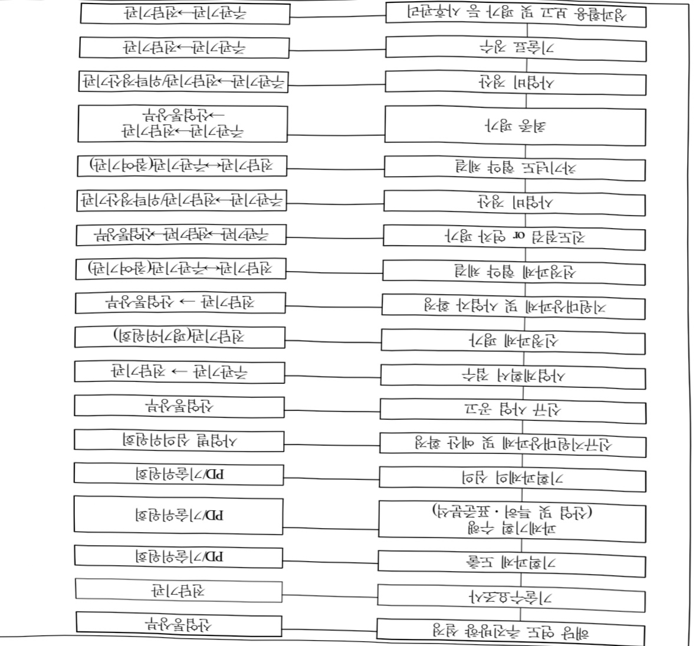

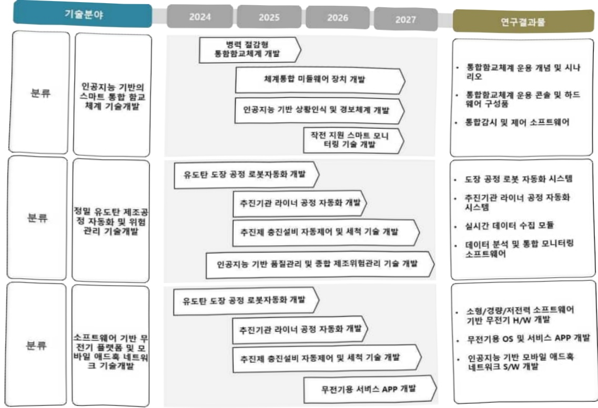

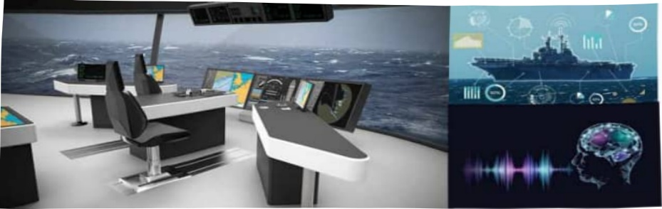

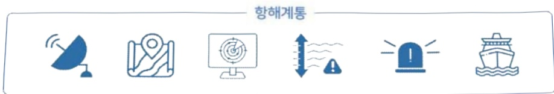

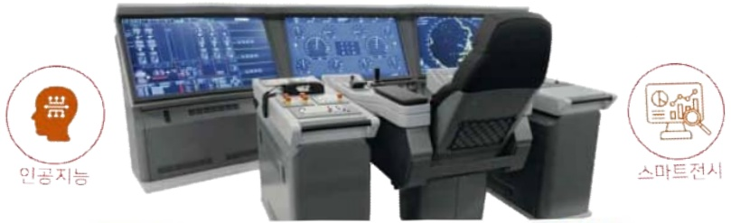

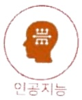

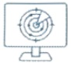

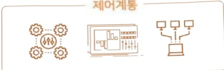

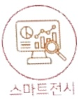

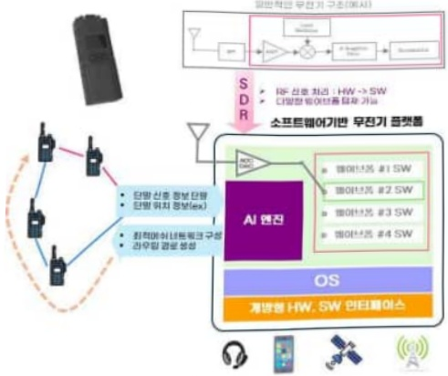

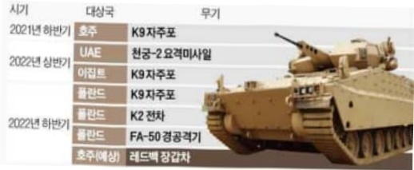

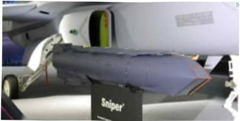

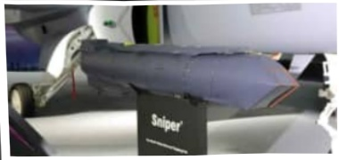

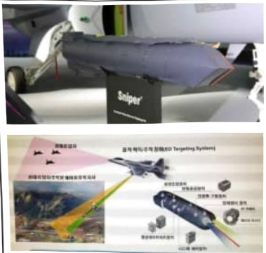

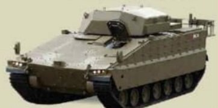

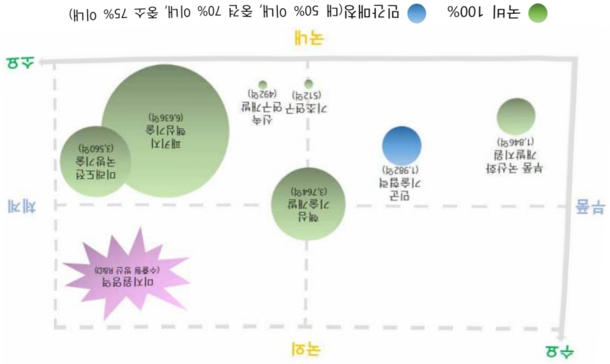

