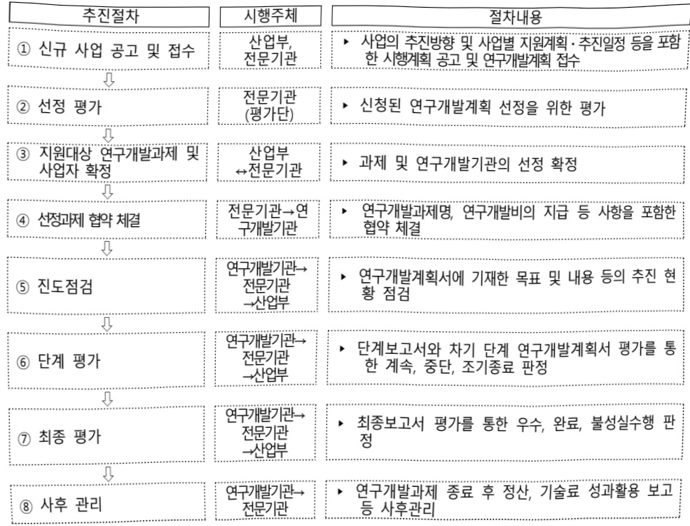

# 한국형Manufacturing-X플랫폼표준모델개발및실증(R&D)

**해당 페이지**: PDF 4447 ~ 4454 쪽 해당

**부처**: 산업통상부
**분야**: 산업·중소기업 및 에너지
**회계유형**: 일반회계
**2026 확정예산**: 5250.0 백만원
**전년대비 증감률**: None%
**AI 도메인**: 데이터, 에너지, 건설/스마트시티

---

### 가.예산 총괄표

(단위: 백만원, %)

<table border=1 style='margin: auto; word-wrap: break-word;'><tr><td rowspan="2">사업명</td><td rowspan="2">2024년 결산</td><td colspan="2">2025년 예산</td><td colspan="2">2026년</td><td rowspan="2">중감(B-A)</td><td rowspan="2">(B-A)/A</td></tr><tr><td style='text-align: center; word-wrap: break-word;'>본예산(A)</td><td style='text-align: center; word-wrap: break-word;'>추경</td><td style='text-align: center; word-wrap: break-word;'>요구안</td><td style='text-align: center; word-wrap: break-word;'>확정(B)</td></tr><tr><td style='text-align: center; word-wrap: break-word;'>한국형Manufacturing-X를끼침품표준모델개발및실증(R&amp;D)</td><td style='text-align: center; word-wrap: break-word;'>-</td><td style='text-align: center; word-wrap: break-word;'>-</td><td style='text-align: center; word-wrap: break-word;'>-</td><td style='text-align: center; word-wrap: break-word;'>5,250</td><td style='text-align: center; word-wrap: break-word;'>5,250</td><td style='text-align: center; word-wrap: break-word;'>5,250</td><td style='text-align: center; word-wrap: break-word;'>순증</td></tr></table>

□ 기능별(내역사업별), 목별 예산 내역

(단위:백만원)

<table border=1 style='margin: auto; word-wrap: break-word;'><tr><td rowspan="3"></td><td colspan="5">2024</td><td colspan="7">2025(2025.12월말)</td><td rowspan="3">2026예산</td></tr><tr><td rowspan="2">예산액(추경)</td><td rowspan="2">예산현액</td><td rowspan="2">집행액[실집행액]</td><td rowspan="2">이월액</td><td rowspan="2">불용액</td><td rowspan="2">본예산</td><td rowspan="2">예산현액</td><td rowspan="2">집행액[실집행액]</td><td colspan="2">전년도이월액제외</td><td rowspan="2">이월예상액</td><td rowspan="2">불용예상액</td></tr><tr><td style='text-align: center; word-wrap: break-word;'>예산현액</td><td style='text-align: center; word-wrap: break-word;'>집행액[실집행액]</td></tr><tr><td style='text-align: center; word-wrap: break-word;'>○ 기능별 분류(합계)</td><td style='text-align: center; word-wrap: break-word;'>-</td><td style='text-align: center; word-wrap: break-word;'>-</td><td style='text-align: center; word-wrap: break-word;'>-</td><td style='text-align: center; word-wrap: break-word;'>-</td><td style='text-align: center; word-wrap: break-word;'>-</td><td style='text-align: center; word-wrap: break-word;'>-</td><td style='text-align: center; word-wrap: break-word;'>-</td><td style='text-align: center; word-wrap: break-word;'>-</td><td style='text-align: center; word-wrap: break-word;'>-</td><td style='text-align: center; word-wrap: break-word;'>-</td><td style='text-align: center; word-wrap: break-word;'>-</td><td style='text-align: center; word-wrap: break-word;'>-</td><td style='text-align: center; word-wrap: break-word;'>5,250</td></tr><tr><td style='text-align: center; word-wrap: break-word;'>· 한국형Manufacturing-X를 맺품표준모델개발및실증</td><td style='text-align: center; word-wrap: break-word;'>-</td><td style='text-align: center; word-wrap: break-word;'>-</td><td style='text-align: center; word-wrap: break-word;'>-</td><td style='text-align: center; word-wrap: break-word;'>-</td><td style='text-align: center; word-wrap: break-word;'>-</td><td style='text-align: center; word-wrap: break-word;'>-</td><td style='text-align: center; word-wrap: break-word;'>-</td><td style='text-align: center; word-wrap: break-word;'>-</td><td style='text-align: center; word-wrap: break-word;'>-</td><td style='text-align: center; word-wrap: break-word;'>-</td><td style='text-align: center; word-wrap: break-word;'>-</td><td style='text-align: center; word-wrap: break-word;'>-</td><td style='text-align: center; word-wrap: break-word;'>5,250</td></tr><tr><td style='text-align: center; word-wrap: break-word;'>○ 비목별 분류(합계)</td><td style='text-align: center; word-wrap: break-word;'>-</td><td style='text-align: center; word-wrap: break-word;'>-</td><td style='text-align: center; word-wrap: break-word;'>-</td><td style='text-align: center; word-wrap: break-word;'>-</td><td style='text-align: center; word-wrap: break-word;'>-</td><td style='text-align: center; word-wrap: break-word;'>-</td><td style='text-align: center; word-wrap: break-word;'>-</td><td style='text-align: center; word-wrap: break-word;'>-</td><td style='text-align: center; word-wrap: break-word;'>-</td><td style='text-align: center; word-wrap: break-word;'>-</td><td style='text-align: center; word-wrap: break-word;'>-</td><td style='text-align: center; word-wrap: break-word;'>-</td><td style='text-align: center; word-wrap: break-word;'>5,250</td></tr><tr><td style='text-align: center; word-wrap: break-word;'>· 연구개발활동비등(360-05)</td><td style='text-align: center; word-wrap: break-word;'>-</td><td style='text-align: center; word-wrap: break-word;'>-</td><td style='text-align: center; word-wrap: break-word;'>-</td><td style='text-align: center; word-wrap: break-word;'>-</td><td style='text-align: center; word-wrap: break-word;'>-</td><td style='text-align: center; word-wrap: break-word;'>-</td><td style='text-align: center; word-wrap: break-word;'>-</td><td style='text-align: center; word-wrap: break-word;'>-</td><td style='text-align: center; word-wrap: break-word;'>-</td><td style='text-align: center; word-wrap: break-word;'>-</td><td style='text-align: center; word-wrap: break-word;'>-</td><td style='text-align: center; word-wrap: break-word;'>-</td><td style='text-align: center; word-wrap: break-word;'>5,250</td></tr><tr><td style='text-align: center; word-wrap: break-word;'>○ 기능비목별 분류(합계)</td><td style='text-align: center; word-wrap: break-word;'>-</td><td style='text-align: center; word-wrap: break-word;'>-</td><td style='text-align: center; word-wrap: break-word;'>-</td><td style='text-align: center; word-wrap: break-word;'>-</td><td style='text-align: center; word-wrap: break-word;'>-</td><td style='text-align: center; word-wrap: break-word;'>-</td><td style='text-align: center; word-wrap: break-word;'>-</td><td style='text-align: center; word-wrap: break-word;'>-</td><td style='text-align: center; word-wrap: break-word;'>-</td><td style='text-align: center; word-wrap: break-word;'>-</td><td style='text-align: center; word-wrap: break-word;'>-</td><td style='text-align: center; word-wrap: break-word;'>-</td><td style='text-align: center; word-wrap: break-word;'>5,250</td></tr><tr><td style='text-align: center; word-wrap: break-word;'>· 한국형Manufacturing-X를 맺품표준모델개발및실증-연구개발활동비등(360-05)</td><td style='text-align: center; word-wrap: break-word;'>-</td><td style='text-align: center; word-wrap: break-word;'>-</td><td style='text-align: center; word-wrap: break-word;'>-</td><td style='text-align: center; word-wrap: break-word;'>-</td><td style='text-align: center; word-wrap: break-word;'>-</td><td style='text-align: center; word-wrap: break-word;'>-</td><td style='text-align: center; word-wrap: break-word;'>-</td><td style='text-align: center; word-wrap: break-word;'>-</td><td style='text-align: center; word-wrap: break-word;'>-</td><td style='text-align: center; word-wrap: break-word;'>-</td><td style='text-align: center; word-wrap: break-word;'>-</td><td style='text-align: center; word-wrap: break-word;'>-</td><td style='text-align: center; word-wrap: break-word;'>5,250</td></tr></table>

### 나.사업설명자료

## 1 ) 사업목적·내용

- (목적) 전 산업의 다양한 주체가 자유롭게 참여하고, 데이터를 안전하게 연결·공유할 수 있는 한국형 Manufacturing-X 플랫폼 표준모델 설계·구현 및 실증 지원

- (내용) M-X 플랫폼 요소기술 및 표준모델 5종 개발, 국제상호인정 및 실증 추진

·(공통 기술 개발) 유럽의 표준 데이터 스페이스 기술을 기반으로, 국내 제조 산업 데이터의 연계 및 활용 촉진을 위한 공통 요소 및 서비스 기술 개발

·(M-X 모델 개발) MX 기반에서 AI 서비스 개발에 활용할 수 있는 5대 AI 기반 핵심 공통 모델 개발

* ①공급망수요관리, ②디지털트런엔엔계, ③자동화·예지보전, ④품질검사·불량예측, ⑤에너지최적화·탄소저감

·(표준개발·인정) 시스템 및 데이터 표준 개발 및 보급, 국제상호인정 추진

·(실효성 검증 및 실증) 자동차, 전자 등 2개 산업에서의 대표기업 중심 데이터

BM 수리 후 사용성 검색도 편견 특징 취소

---

## 2 ) 사업개요

□ 사업근거 및 추진경위

① 법령상 근거 및 조항 적시

o산업 디지털 전환 촉진법 제2조,제10조,제20조

## 산업 디지털 전환 촉진법

제2조(정의)이 법에서 사용하는 용어의 뜻은 다음과 같다.

제2조(정의) 이 법에서 사용하는 용어의 뜻은 다음과 같다.

1. "산업데이터"란「산업발전법」제2조에 따른 산업,「광업법」제3조제2호에 따른 광업,「에너지법」제2조제1호에 따른 에너지 관련 산업 및「신에너지 및 재생에너지 개발·이용·보급 촉진법」제2조제1호 및 제2호에 따른 신에너지 및 재생에너지 관련 산업의 제품 또는 서비스 개발·생산·유통·소비 등 활동(이하 "산업활동"이라 한다)과정에서 생성 또는 활용되는 것으로서 광(光) 또는 전자적 방식으로 처리될 수 있는 모든 종류의 자료 또는 정보를 말한다.

2. "산업데이터 생성"이란 산업활동 과정에서 인적 또는 물적으로 상당한 투자와 노력을 통하여 기존에 존재하지 아니하였던 산업데이터가 새롭게 발생하는 것(산업데이터의 활용을 통하여 독자성을 인정할 수 있는 새로운 산업데이터가 발생하는 경우를 포함한다)을 말한다.

3. "산업데이터 활용"이란 산업데이터의 수집, 연계, 저장, 보유, 가공, 분석, 이용, 제공, 공개 및 그밖에 이와 유사한 행위를 말한다.

제10조(산업데이터 활용 촉진) ① 산업통상부장관은 산업데이터의 합리적 유통 및 공정한 거래 등 원활하고 안전한 산업데이터 생성·활용 환경을 보장하고 기업등의 산업데이터 생성·활용 활성화를 위하여 필요한 지원을 할 수 있다.

② 산업통상부장관은 제9조에 따른 산업데이터 활용 및 보호 원칙을 준수하도록 하고, 같은 조 제5항에 따른 계약의 체결을 촉진하기 위하여 관계 중앙행정기관의 장과 협의를 거쳐 산업데이터 활용 계약에 관한 지침을 마련할 수 있다.

제20조(기술·서비스 개발 등의 촉진) 산업통상부장관은 산업 디지털 전환에 관한 기술·장비·소프트웨어와 산업 디지털 전환을 통한 제품·서비스(이하 "기술등"이라 한다)의 개발을 촉진하기 위하여 다음 각 호의 사업을 추진할 수 있다.

5. 그 밖에 기술등의 개발을 위하여 필요한 사업

## 0산업기술혁신 촉진법 제11조

## 산업기술혁신 촉진법

제11조(산업기술개발사업) 산업통상부장관은 혁신계획 및 시행계획을 효율적으로 수행하기 위하여 관계 중앙행정기관의 장과 협의하여 다음 각 호의 산업기술분야에서 기술개발사업(산업기술개발을 위하여 필요한 기획 및 조사를 포함한다. 이하 "산업기술개발사업"이라 한다)을 추진할 수 있다.

2.산업기술 분야의 미래 유망 기술

11.개발된산업기술의사업화에필요한연계기술

12. 제1호부터 세10호까지의 기술 간 결합을 통한 시장지향형 융합기술

13. 그 밖에 산업기술혁신을 위하여 우선적으로 개발이 필요한 기술로서 산업통상부장관이 정하는 기술

② 산업통상부장관은 연구기관, 대학, 그 밖에 대통령령으로 정하는 기관·단체 또는 기업 등으로 하여금 산업기술개발사업을 수행하게 할 수 있다. 이 경우 산업통상부장관은 다음 각 호의 자와 산업기술개발사업에 관한 협약을 체결하고 해당 사업의 수행에 드는 비용의 전부 또는 일부를 출연 또는 보조할 수 있다.

---

② 추진경위

°「산업 AI 내재화 전략」(산업부, '23.1)

- '다양한 주체가 양질의 산업데이터를 제공·공유·거래하는 통합연계 플랫폼 구축'에 부합

o 「산업 AX를 위한 산업데이터 활용 활성화 방안」(부처합동, '24.10)

- '산업 AX 뒷받침을 위한 기업 산업데이터 활용 기반 마련'을 위한 2단계 전략 '데이터 교환, 인증 서비스 등을 확충하여 산업 데이터 스페이스 구축'에 부합

°「산업 AI 확산을 위한 10대 과제 발표」(산업부, '25.1)

①AI 선도 프로젝트, ②AI 에이전트와 피지컬 AI ③산업 AI 컴퓨팅 인프라, ④산업데이터, ⑤AI 반도체, ⑥AI 인재, ⑦전력 인프라, ⑧산업AI 자본, ⑨AI 생태계, ⑩산업 AI 제도

-기업간데이터연계·활용을위한산업데이터스페이스구축에부합

- 기업간 자발적인 데이터 공유 → 공유된 데이터를 활용하여 AI 학습, 채비즈니스 등장 등 새로운 가치 창출

- 책·日 등과 플랫폼 상호인정을 통해 데이터의 국제 호환성 제고

°「AI데이터 확충 및 개방 확대방안」(국가AI위, '25.2)

- 'AI 데이터 확중 및 개방 확대 주신선택으로서 AI 개발 촉진을 위한 고품질 데이터 제공 확대'에 부합

## □ 주요내용

① 사업규모

- 총사업비(해당되는 경우에만 기재) : 해당없음

- 사업기간 : 2026년 ~ 2029년

- 최근 5년 간 투입된 사업비(예산액기준, 추경편성한 연도에는 추경포함)

<table border=1 style='margin: auto; word-wrap: break-word;'><tr><td style='text-align: center; word-wrap: break-word;'>$ H_{2}O $</td><td style='text-align: center; word-wrap: break-word;'>2022</td><td style='text-align: center; word-wrap: break-word;'>2023</td><td style='text-align: center; word-wrap: break-word;'>2024</td><td style='text-align: center; word-wrap: break-word;'>2025</td><td style='text-align: center; word-wrap: break-word;'>2026</td></tr><tr><td style='text-align: center; word-wrap: break-word;'>사업비</td><td style='text-align: center; word-wrap: break-word;'>-</td><td style='text-align: center; word-wrap: break-word;'>-</td><td style='text-align: center; word-wrap: break-word;'>-</td><td style='text-align: center; word-wrap: break-word;'>-</td><td style='text-align: center; word-wrap: break-word;'>5,250</td></tr></table>

-기타: 해당 없음

② 사업추진체계

- 사업시행방법 : 출연

- 사업시행주체 : 한국산업기술진흥원

- 사업 수혜자 : 데이터 스페이스 이해도 및 구축 전문성을 갖춘 비영리기관, 수요기업 등

- 보조, 융자, 출연, 출자 등의 경우 보조·융자 등 지원 비율 및 법적근거

<table border=1 style='margin: auto; word-wrap: break-word;'><tr><td style='text-align: center; word-wrap: break-word;'>내역사업명</td><td style='text-align: center; word-wrap: break-word;'>구분</td><td style='text-align: center; word-wrap: break-word;'>피보조·피출연 등 기관명</td><td style='text-align: center; word-wrap: break-word;'>지원 금액 (2026예산)</td><td style='text-align: center; word-wrap: break-word;'>지원 비율(%)</td><td style='text-align: center; word-wrap: break-word;'>보조율 법적근거 (해당 조항)</td></tr><tr><td style='text-align: center; word-wrap: break-word;'>한국형Manufacturing·X플랫폼표준모델개발 및실증</td><td style='text-align: center; word-wrap: break-word;'>출연</td><td style='text-align: center; word-wrap: break-word;'>한국산업기술진흥원</td><td style='text-align: center; word-wrap: break-word;'>5,250백만원</td><td style='text-align: center; word-wrap: break-word;'>67%이내 (중소기업기준)</td><td style='text-align: center; word-wrap: break-word;'>산업기술혁신촉진법 제11조(산업기술개발사업)</td></tr></table>

---

## 3 ) 2026년도 예산 산출 근거

①한국형Manufacturing-X플랫폼표준모델개발및실증(R&D):5,250백만원

:(2025 본예산) 0 → (2026) 5,250백만원, 5,250백만원 증액(순증)

- (요구) 산업 데이터 공유·활용·확산 플랫폼의 요소기술 개발, AI 활용 표준모델 개발, 국제상호인정 획득 및 실증 등에 따른 비용을 산정하여 5,250백만원 요구

- (산출) 신규과제 1개 x 7,000백만원 x 9/12개월 = 5,250백만원

02025년도 예산 및 2026년도 예산 산출 세부내역 비교

<table border=1 style='margin: auto; word-wrap: break-word;'><tr><td colspan="2">2025년 본예산</td><td colspan="2">2026년 예산</td></tr><tr><td style='text-align: center; word-wrap: break-word;'>예산</td><td style='text-align: center; word-wrap: break-word;'>산출내역</td><td style='text-align: center; word-wrap: break-word;'>예산</td><td style='text-align: center; word-wrap: break-word;'>산출내역</td></tr><tr><td style='text-align: center; word-wrap: break-word;'>-</td><td style='text-align: center; word-wrap: break-word;'>-</td><td style='text-align: center; word-wrap: break-word;'>한국형 Manufacturing-X 플랫폼 표준 모델 개발및실증 5,250</td><td style='text-align: center; word-wrap: break-word;'>○ 연구개발활동비 등(360-05): 5,250백만원 가. 한국형Manufacturing-X플랫폼표준모델개발및실증(신규) 1개 과제 × 7,000백만원 × 9/12개월</td></tr></table>

## 4 ) 사업효과

□ 사업영향, 산출물 성과지표 등

① 2022~2026년도 성과계획서 상 성과지표 및 최근 5년간 성과 달성도

<table border=1 style='margin: auto; word-wrap: break-word;'><tr><td style='text-align: center; word-wrap: break-word;'>성과지표</td><td style='text-align: center; word-wrap: break-word;'>구분</td><td style='text-align: center; word-wrap: break-word;'>2022</td><td style='text-align: center; word-wrap: break-word;'>2023</td><td style='text-align: center; word-wrap: break-word;'>2024</td><td style='text-align: center; word-wrap: break-word;'>2025</td><td style='text-align: center; word-wrap: break-word;'>2026</td><td style='text-align: center; word-wrap: break-word;'>2026 목표치산출근거</td><td style='text-align: center; word-wrap: break-word;'>측정산식(또는 측정방법)</td><td style='text-align: center; word-wrap: break-word;'>자료수집방법(또는 자료출처)</td></tr><tr><td rowspan="2">M-X 플랫폼</td><td style='text-align: center; word-wrap: break-word;'>목표</td><td style='text-align: center; word-wrap: break-word;'>-</td><td style='text-align: center; word-wrap: break-word;'>-</td><td style='text-align: center; word-wrap: break-word;'>-</td><td style='text-align: center; word-wrap: break-word;'>-</td><td style='text-align: center; word-wrap: break-word;'>3</td><td rowspan="3">사업기간 및 시작연도임을 감안하여 전체 공통요소기술 중 25% 이상 완성 예정</td><td rowspan="3">계획된 층 공통요소기술 건수 중 개발 완료된 공통요소기술 건수</td><td rowspan="3">공인인증시험 등</td></tr><tr><td style='text-align: center; word-wrap: break-word;'>실적</td><td style='text-align: center; word-wrap: break-word;'>-</td><td style='text-align: center; word-wrap: break-word;'>-</td><td style='text-align: center; word-wrap: break-word;'>-</td><td style='text-align: center; word-wrap: break-word;'>-</td><td style='text-align: center; word-wrap: break-word;'>-</td></tr><tr><td style='text-align: center; word-wrap: break-word;'>개발 수 (건)</td><td style='text-align: center; word-wrap: break-word;'>달성도</td><td style='text-align: center; word-wrap: break-word;'>-</td><td style='text-align: center; word-wrap: break-word;'>-</td><td style='text-align: center; word-wrap: break-word;'>-</td><td style='text-align: center; word-wrap: break-word;'>-</td><td style='text-align: center; word-wrap: break-word;'>-</td></tr><tr><td rowspan="3">모델 학습용 데이터셋 구축 수 (건)</td><td style='text-align: center; word-wrap: break-word;'>목표</td><td style='text-align: center; word-wrap: break-word;'>-</td><td style='text-align: center; word-wrap: break-word;'>-</td><td style='text-align: center; word-wrap: break-word;'>-</td><td style='text-align: center; word-wrap: break-word;'>-</td><td style='text-align: center; word-wrap: break-word;'>3</td><td rowspan="3">총 5개의 공통 AI 모델에 대해 정의 및 데이터셋 구축 필요</td><td rowspan="3">계획된 층 데이터셋 건수 중 개발 완료된 데이터셋 건수</td><td rowspan="3">공인인증시험 등</td></tr><tr><td style='text-align: center; word-wrap: break-word;'>실적</td><td style='text-align: center; word-wrap: break-word;'>-</td><td style='text-align: center; word-wrap: break-word;'>-</td><td style='text-align: center; word-wrap: break-word;'>-</td><td style='text-align: center; word-wrap: break-word;'>-</td><td style='text-align: center; word-wrap: break-word;'>-</td></tr><tr><td style='text-align: center; word-wrap: break-word;'>달성도</td><td style='text-align: center; word-wrap: break-word;'>-</td><td style='text-align: center; word-wrap: break-word;'>-</td><td style='text-align: center; word-wrap: break-word;'>-</td><td style='text-align: center; word-wrap: break-word;'>-</td><td style='text-align: center; word-wrap: break-word;'>-</td></tr></table>

② 성과지표 이외의 연도별 사업추진 경과 및 실적 : 해당없음(2026년 신규)

③ 향후(2026년도 이후) 기대효과 : 개조식으로 작성, 건 별로 계량적 수치 제시

-한국형 데이터 스페이스 플랫폼 표준모델 1종

- 한국형 데이터 스페이스 플랫폼 기반의 AI 기반 M-X 공통 모델 5종

- 실증 확산 산업분야 1개 이상

## 5 ) 타당성조사 및 예비타당성조사 시행여부 및 결과 요지

시행하지 않은 경우 그 이유를 적시 : 농 사업은 국가재정법 제38조, 동법 시행령

제13조의 예비타당성조사 대상(500억원 이상 신규사업) 조건에 해당되지 않음

---

## 6 ) 총사업비 대상사업 여부 및 내역 : 해당없음

## 7 ) 사업 집행절차

8) 중기재정계획 상 연도별 투자계획 및 추진경과

(단위: 백만원)

<table border=1 style='margin: auto; word-wrap: break-word;'><tr><td style='text-align: center; word-wrap: break-word;'>$ 중기 $ 재정계획</td><td style='text-align: center; word-wrap: break-word;'>2024</td><td style='text-align: center; word-wrap: break-word;'>2025</td><td style='text-align: center; word-wrap: break-word;'>2026</td><td style='text-align: center; word-wrap: break-word;'>2027</td><td style='text-align: center; word-wrap: break-word;'>2028</td><td style='text-align: center; word-wrap: break-word;'>2029</td></tr><tr><td style='text-align: center; word-wrap: break-word;'>2024~2028</td><td style='text-align: center; word-wrap: break-word;'>-</td><td style='text-align: center; word-wrap: break-word;'>-</td><td style='text-align: center; word-wrap: break-word;'>-</td><td style='text-align: center; word-wrap: break-word;'>-</td><td style='text-align: center; word-wrap: break-word;'>-</td><td style='text-align: center; word-wrap: break-word;'>☑</td></tr><tr><td style='text-align: center; word-wrap: break-word;'>2025~2029</td><td style='text-align: center; word-wrap: break-word;'>☑</td><td style='text-align: center; word-wrap: break-word;'>-</td><td style='text-align: center; word-wrap: break-word;'>5,250</td><td style='text-align: center; word-wrap: break-word;'>8,100</td><td style='text-align: center; word-wrap: break-word;'>8,100</td><td style='text-align: center; word-wrap: break-word;'>8,100</td></tr></table>

9) 최근 3년간 동 사업에 대한 주요 외부지적사항 및 평가, 문제점 및 대책 : 해당없음(2026년 신규)

---

## 10 ) 향후 추진방향 및 추진계획

- 산업 데이터 공유 및 활용 활성화를 위해. 전 산업의 다양한 주체가 데이터를 안전하게 연결·공유할 수 있는 데이터 스페이스 플랫폼의 한국형 표준모델을 구축 필요

- 기존 중앙집중형 데이터 플랫폼은 운영 주체의 정책에 따라 참여 기업의 데이터 사용 방식이 제한되어 데이터 공유 기반으로 적합성이 떨어지므로, 산업데이터 기반의 공급망 내 기업 간 협업을 구조적으로 개선시키는 한국형 데이터 공유체계의 개발이 시급

- 동 사업은 중기재정계획에 반영된 예산사업으로 계획에 따라 예산 확보·집행 예정

11) 해당사업에 대한 각종 사업평가의 결과 : 해당없음(2026년 신규)

12) 해당사업에 대한 부처 자체평가의 결과 : 해당없음(2026년 신규)

13) 부처 건의사항 : 해당없음(2026년 신규)

다. 최근 4년간 결산내역 : 해당없음(2026년 신규)

### 라. 기타 추가자료

(1) 기재부에 제출한 사업 계획서 및 설명자료 첨부(필수 제출) : [참고]

---

## 참 고 사업 설명자료

□ (배경) 기업 간 데이터 교환을 손쉽게 하여 생산계획 최적화 등 산업의 대표적인 문제에 대응하고, 공급망 단위의 산업 혁신 유도 필요

(데이터 기반 산업 혁신 필요) 주요 제조 선진국은 데이터 스페이스를

기반으로 한 산업혁신 통해 제조 경쟁력 강화, 공급망 유연화, 지속가능한

산업생태계조성중

* 공급망 내 데이터 공유 및 활용을 촉진하는 플랫폼. 데이터는 중앙에 저장되지 않고 데이터가 생성된 곳에 저장되며 필요할 때만 공유

(인공지능 모델 학습 인프라 구축) 데이터 스페이스는 인공지능 모델

학습을 위한 데이터를 제공·교환하는 인프라 역할

AI 모델의 성능은 학습에 사용된 데이터에 따라 좌우되므로 양질의 대규모 산업

데이터를 확보하여 고성능 산업 AI 모델 확보에 기여

□ (목적) 제조업 등 다양한 산업 분야에서 AI와 데이터 활용을 촉진하기 위한 한국형 Manufacturing-X 플랫폼 표준모델을 개발하고 산업별 데이터 생태계 확장 지원

□ (기간/예산) '26년 ~ '29년 (3년 9개월) / 295.5억원(국비 기준)

□ (주요 내용) 다양한 주체가 자유롭게 참여, 데이터를 안전하게 연결·공유할 수 있는 한국형 Manufacturing-X 플랫폼 표준모델 설계·구현 및 실증 지원

°(공통 기술 개발) 유럽의 표준 데이터 스페이스 기술을 기반으로, 국내 제조

산업데이터의 연계 및 활용 촉진을 위한 공통 요소 및 서비스 기술 개발

° (M-X 모델 개발) M-X 기반에서 AI 서비스 개발에 활용할 수 있는 5대 AI 기반 핵심 공통 모델* 개발

* ①공급망수요관리, ②디지털트원연계, ③자동화·예지보전, ④품질검사·불량예측, ⑤에너지최적화·탄소저감

°(표준개발·인정) 시스템 및 데이터 표준 개발 및 보급, 국제상호인정 추진

°(실효성 검증 및 실증) 자동차, 전자 등 2개 산업에서의 대표기업 중심 데이터 BM 수립 후 사용성, 경제성, 등 평가 통해 피드백 실시

---

<table border=1 style='margin: auto; word-wrap: break-word;'><tr><td style='text-align: center; word-wrap: break-word;'>사 업 명</td></tr><tr><td style='text-align: center; word-wrap: break-word;'>119빅데이터 분석·운영 (1133-311)</td></tr></table>

□ 사업 코드 정보

<table border=1 style='margin: auto; word-wrap: break-word;'><tr><td style='text-align: center; word-wrap: break-word;'>구분</td><td style='text-align: center; word-wrap: break-word;'>회계</td><td style='text-align: center; word-wrap: break-word;'>소관</td><td style='text-align: center; word-wrap: break-word;'>실국(기관)</td><td style='text-align: center; word-wrap: break-word;'>계정</td><td style='text-align: center; word-wrap: break-word;'>분야</td><td style='text-align: center; word-wrap: break-word;'>부문</td></tr><tr><td style='text-align: center; word-wrap: break-word;'>코드</td><td rowspan="2">일반회계</td><td rowspan="2">소방청</td><td rowspan="2">화재예방국(소방분석제도과)</td><td rowspan="2">0</td><td style='text-align: center; word-wrap: break-word;'>020</td><td style='text-align: center; word-wrap: break-word;'>025</td></tr><tr><td style='text-align: center; word-wrap: break-word;'>명칭</td><td style='text-align: center; word-wrap: break-word;'>공공검서 및 안전</td><td style='text-align: center; word-wrap: break-word;'>재난관리</td></tr></table>

<table border=1 style='margin: auto; word-wrap: break-word;'><tr><td style='text-align: center; word-wrap: break-word;'>구분</td><td style='text-align: center; word-wrap: break-word;'>프로그램</td><td style='text-align: center; word-wrap: break-word;'>단위사업</td><td style='text-align: center; word-wrap: break-word;'>세부사업</td></tr><tr><td style='text-align: center; word-wrap: break-word;'>코드</td><td style='text-align: center; word-wrap: break-word;'>1100</td><td style='text-align: center; word-wrap: break-word;'>1133</td><td style='text-align: center; word-wrap: break-word;'>311</td></tr><tr><td style='text-align: center; word-wrap: break-word;'>명칭</td><td style='text-align: center; word-wrap: break-word;'>소방정책지원</td><td style='text-align: center; word-wrap: break-word;'>화재예방제도 선진화</td><td style='text-align: center; word-wrap: break-word;'>119빅데이터 분석운영</td></tr></table>

사업 성격 (공통요구자료 Ⅱ-1 작성유의사항 4. 참조, 해당하는 사항에 “O” 표시)

<table border=1 style='margin: auto; word-wrap: break-word;'><tr><td rowspan="2">신규</td><td rowspan="2">계속</td><td rowspan="2">완료</td><td rowspan="2">예비타당성 실시여부</td><td rowspan="2">총사업비 관리대상</td><td rowspan="2">총액계상 예산사업</td><td style='text-align: center; word-wrap: break-word;'>사업소관 변경정보</td></tr><tr><td style='text-align: center; word-wrap: break-word;'>2025예산 시 소관</td></tr><tr><td style='text-align: center; word-wrap: break-word;'></td><td style='text-align: center; word-wrap: break-word;'>○</td><td style='text-align: center; word-wrap: break-word;'></td><td style='text-align: center; word-wrap: break-word;'></td><td style='text-align: center; word-wrap: break-word;'></td><td style='text-align: center; word-wrap: break-word;'></td><td style='text-align: center; word-wrap: break-word;'></td></tr></table>

□ 사업 지원 형태 및 지원을 (최소한 한 개는 반드시 선택하시오. 해당사항에 0 표시)

<table border=1 style='margin: auto; word-wrap: break-word;'><tr><td style='text-align: center; word-wrap: break-word;'>직접</td><td style='text-align: center; word-wrap: break-word;'>출자</td><td style='text-align: center; word-wrap: break-word;'>출연</td><td style='text-align: center; word-wrap: break-word;'>보조</td><td style='text-align: center; word-wrap: break-word;'>융자</td><td style='text-align: center; word-wrap: break-word;'>국고보조율(%)</td><td style='text-align: center; word-wrap: break-word;'>융자율(%)</td></tr><tr><td style='text-align: center; word-wrap: break-word;'>○</td><td style='text-align: center; word-wrap: break-word;'></td><td style='text-align: center; word-wrap: break-word;'></td><td style='text-align: center; word-wrap: break-word;'></td><td style='text-align: center; word-wrap: break-word;'></td><td style='text-align: center; word-wrap: break-word;'></td><td style='text-align: center; word-wrap: break-word;'></td></tr></table>

☐ 사업 담당자

<table border=1 style='margin: auto; word-wrap: break-word;'><tr><td style='text-align: center; word-wrap: break-word;'>사업명</td><td colspan="5">구분</td></tr><tr><td rowspan="3">119빅데이터 분석운영</td><td rowspan="3">소관부처</td><td style='text-align: center; word-wrap: break-word;'>실·국·과(팀)</td><td style='text-align: center; word-wrap: break-word;'>과 장</td><td style='text-align: center; word-wrap: break-word;'>사무관</td><td style='text-align: center; word-wrap: break-word;'>주무관</td></tr><tr><td style='text-align: center; word-wrap: break-word;'>화재예방국</td><td style='text-align: center; word-wrap: break-word;'>윤강열</td><td style='text-align: center; word-wrap: break-word;'>한민훈</td><td style='text-align: center; word-wrap: break-word;'>강인한</td></tr><tr><td style='text-align: center; word-wrap: break-word;'>소방분석제도과(119빅데이터팀)</td><td style='text-align: center; word-wrap: break-word;'>044-205-7520</td><td style='text-align: center; word-wrap: break-word;'>044-205-7543</td><td style='text-align: center; word-wrap: break-word;'>044-205-7541</td></tr></table>

### 가. 예산 총괄표

(단위: 백만원, %)

<table border=1 style='margin: auto; word-wrap: break-word;'><tr><td rowspan="2">사업명</td><td style='text-align: center; word-wrap: break-word;'>2024년</td><td colspan="2">2025년 예산</td><td style='text-align: center; word-wrap: break-word;'>2026년</td><td colspan="2">증감</td></tr><tr><td style='text-align: center; word-wrap: break-word;'>결산</td><td style='text-align: center; word-wrap: break-word;'>본예산(A)</td><td style='text-align: center; word-wrap: break-word;'>추경</td><td style='text-align: center; word-wrap: break-word;'>예산(B)</td><td style='text-align: center; word-wrap: break-word;'>(B-A)</td><td style='text-align: center; word-wrap: break-word;'>(B-A)/A</td></tr><tr><td style='text-align: center; word-wrap: break-word;'>119빅데이터</td><td style='text-align: center; word-wrap: break-word;'>1,760</td><td style='text-align: center; word-wrap: break-word;'>1,907</td><td style='text-align: center; word-wrap: break-word;'>1,907</td><td style='text-align: center; word-wrap: break-word;'>1,705</td><td style='text-align: center; word-wrap: break-word;'>△202</td><td style='text-align: center; word-wrap: break-word;'>△10.6</td></tr></table>

---

### 원본 PDF 크롭 이미지

