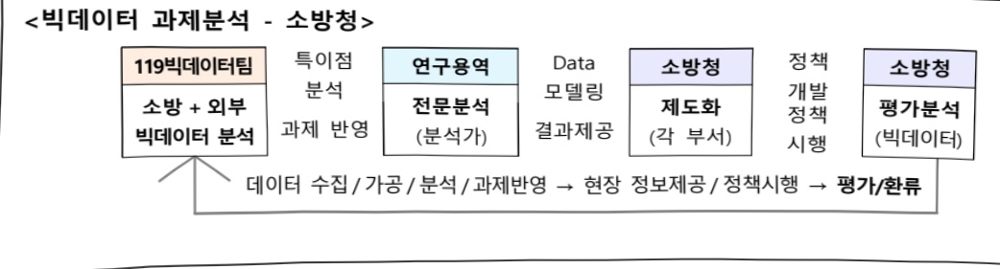
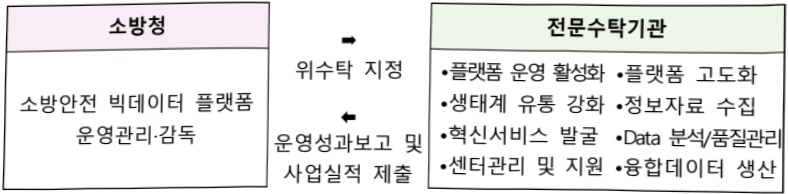
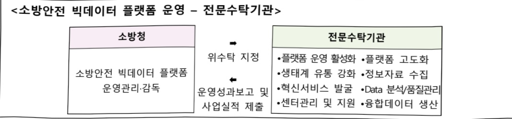
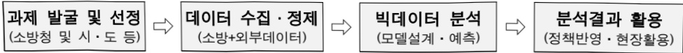
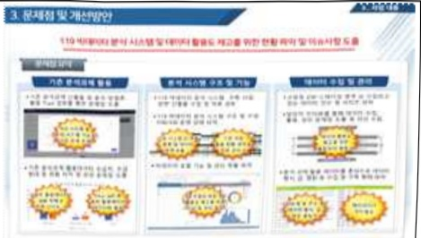
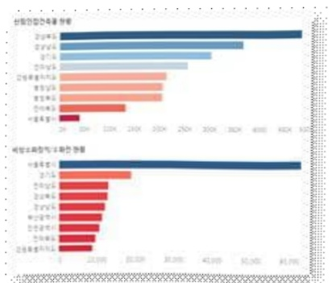
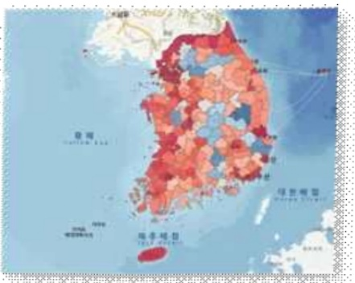

# 119빅데이터 분석운영

**해당 페이지**: PDF 4455 ~ 4474 쪽 해당

**부처**: 소방청
**분야**: 공공질서 및 안전
**회계유형**: 일반회계
**2026 확정예산**: -202.0 백만원
**전년대비 증감률**: None%
**AI 도메인**: 데이터, 행정/전자정부, 재난/안전, 피지컬AI/디바이스

---

<table border=1 style='margin: auto; word-wrap: break-word;'><tr><td style='text-align: center; word-wrap: break-word;'>사 업 명</td></tr><tr><td style='text-align: center; word-wrap: break-word;'>119빅데이터 분석·운영 (1133-311)</td></tr></table>

□ 사업 코드 정보

<table border=1 style='margin: auto; word-wrap: break-word;'><tr><td style='text-align: center; word-wrap: break-word;'>구분</td><td style='text-align: center; word-wrap: break-word;'>회계</td><td style='text-align: center; word-wrap: break-word;'>소관</td><td style='text-align: center; word-wrap: break-word;'>실국(기관)</td><td style='text-align: center; word-wrap: break-word;'>계정</td><td style='text-align: center; word-wrap: break-word;'>분야</td><td style='text-align: center; word-wrap: break-word;'>부문</td></tr><tr><td style='text-align: center; word-wrap: break-word;'>코드</td><td rowspan="2">일반회계</td><td rowspan="2">소방청</td><td rowspan="2">화재예방국(소방분석제도과)</td><td rowspan="2">0</td><td style='text-align: center; word-wrap: break-word;'>020</td><td style='text-align: center; word-wrap: break-word;'>025</td></tr><tr><td style='text-align: center; word-wrap: break-word;'>명칭</td><td style='text-align: center; word-wrap: break-word;'>공공검서 및 안전</td><td style='text-align: center; word-wrap: break-word;'>재난관리</td></tr></table>

<table border=1 style='margin: auto; word-wrap: break-word;'><tr><td style='text-align: center; word-wrap: break-word;'>구분</td><td style='text-align: center; word-wrap: break-word;'>프로그램</td><td style='text-align: center; word-wrap: break-word;'>단위사업</td><td style='text-align: center; word-wrap: break-word;'>세부사업</td></tr><tr><td style='text-align: center; word-wrap: break-word;'>코드</td><td style='text-align: center; word-wrap: break-word;'>1100</td><td style='text-align: center; word-wrap: break-word;'>1133</td><td style='text-align: center; word-wrap: break-word;'>311</td></tr><tr><td style='text-align: center; word-wrap: break-word;'>명칭</td><td style='text-align: center; word-wrap: break-word;'>소방정책지원</td><td style='text-align: center; word-wrap: break-word;'>화재예방제도 선진화</td><td style='text-align: center; word-wrap: break-word;'>119빅데이터 분석운영</td></tr></table>

사업 성격 (공통요구자료 Ⅱ-1 작성유의사항 4. 참조, 해당하는 사항에 “O” 표시)

<table border=1 style='margin: auto; word-wrap: break-word;'><tr><td rowspan="2">신규</td><td rowspan="2">계속</td><td rowspan="2">완료</td><td rowspan="2">예비타당성 실시여부</td><td rowspan="2">총사업비 관리대상</td><td rowspan="2">총액계상 예산사업</td><td style='text-align: center; word-wrap: break-word;'>사업소관 변경정보</td></tr><tr><td style='text-align: center; word-wrap: break-word;'>2025예산 시 소관</td></tr><tr><td style='text-align: center; word-wrap: break-word;'></td><td style='text-align: center; word-wrap: break-word;'>○</td><td style='text-align: center; word-wrap: break-word;'></td><td style='text-align: center; word-wrap: break-word;'></td><td style='text-align: center; word-wrap: break-word;'></td><td style='text-align: center; word-wrap: break-word;'></td><td style='text-align: center; word-wrap: break-word;'></td></tr></table>

□ 사업 지원 형태 및 지원을 (최소한 한 개는 반드시 선택하시오. 해당사항에 0 표시)

<table border=1 style='margin: auto; word-wrap: break-word;'><tr><td style='text-align: center; word-wrap: break-word;'>직접</td><td style='text-align: center; word-wrap: break-word;'>출자</td><td style='text-align: center; word-wrap: break-word;'>출연</td><td style='text-align: center; word-wrap: break-word;'>보조</td><td style='text-align: center; word-wrap: break-word;'>융자</td><td style='text-align: center; word-wrap: break-word;'>국고보조율(%)</td><td style='text-align: center; word-wrap: break-word;'>융자율(%)</td></tr><tr><td style='text-align: center; word-wrap: break-word;'>○</td><td style='text-align: center; word-wrap: break-word;'></td><td style='text-align: center; word-wrap: break-word;'></td><td style='text-align: center; word-wrap: break-word;'></td><td style='text-align: center; word-wrap: break-word;'></td><td style='text-align: center; word-wrap: break-word;'></td><td style='text-align: center; word-wrap: break-word;'></td></tr></table>

☐ 사업 담당자

<table border=1 style='margin: auto; word-wrap: break-word;'><tr><td style='text-align: center; word-wrap: break-word;'>사업명</td><td colspan="5">구분</td></tr><tr><td rowspan="3">119빅데이터 분석운영</td><td rowspan="3">소관부처</td><td style='text-align: center; word-wrap: break-word;'>실·국·과(팀)</td><td style='text-align: center; word-wrap: break-word;'>과 장</td><td style='text-align: center; word-wrap: break-word;'>사무관</td><td style='text-align: center; word-wrap: break-word;'>주무관</td></tr><tr><td style='text-align: center; word-wrap: break-word;'>화재예방국</td><td style='text-align: center; word-wrap: break-word;'>윤강열</td><td style='text-align: center; word-wrap: break-word;'>한민훈</td><td style='text-align: center; word-wrap: break-word;'>강인한</td></tr><tr><td style='text-align: center; word-wrap: break-word;'>소방분석제도과(119빅데이터팀)</td><td style='text-align: center; word-wrap: break-word;'>044-205-7520</td><td style='text-align: center; word-wrap: break-word;'>044-205-7543</td><td style='text-align: center; word-wrap: break-word;'>044-205-7541</td></tr></table>

### 가. 예산 총괄표

(단위: 백만원, %)

<table border=1 style='margin: auto; word-wrap: break-word;'><tr><td rowspan="2">사업명</td><td style='text-align: center; word-wrap: break-word;'>2024년</td><td colspan="2">2025년 예산</td><td style='text-align: center; word-wrap: break-word;'>2026년</td><td colspan="2">증감</td></tr><tr><td style='text-align: center; word-wrap: break-word;'>결산</td><td style='text-align: center; word-wrap: break-word;'>본예산(A)</td><td style='text-align: center; word-wrap: break-word;'>추경</td><td style='text-align: center; word-wrap: break-word;'>예산(B)</td><td style='text-align: center; word-wrap: break-word;'>(B-A)</td><td style='text-align: center; word-wrap: break-word;'>(B-A)/A</td></tr><tr><td style='text-align: center; word-wrap: break-word;'>119빅데이터</td><td style='text-align: center; word-wrap: break-word;'>1,760</td><td style='text-align: center; word-wrap: break-word;'>1,907</td><td style='text-align: center; word-wrap: break-word;'>1,907</td><td style='text-align: center; word-wrap: break-word;'>1,705</td><td style='text-align: center; word-wrap: break-word;'>△202</td><td style='text-align: center; word-wrap: break-word;'>△10.6</td></tr></table>

---

□ 기능별(내역사업별), 목별 예산 내역

(단위:백만원)

<table border=1 style='margin: auto; word-wrap: break-word;'><tr><td rowspan="3"></td><td colspan="5">2024</td><td colspan="7">2025</td><td rowspan="3">2026예산</td></tr><tr><td rowspan="2">예산액(추경)</td><td rowspan="2">예산현액</td><td rowspan="2">집행액[실집행액]</td><td rowspan="2">이왈액</td><td rowspan="2">불용액</td><td rowspan="2">분예산</td><td rowspan="2">예산현액</td><td rowspan="2">집행액[실집행액]</td><td colspan="2">전년도 이왈액제외</td><td rowspan="2">이왈액상액</td><td rowspan="2">불용액상액</td></tr><tr><td style='text-align: center; word-wrap: break-word;'>예산현액</td><td style='text-align: center; word-wrap: break-word;'>집행액[실집행액]</td></tr><tr><td style='text-align: center; word-wrap: break-word;'>ㅇ 기능별 분류(합계)</td><td style='text-align: center; word-wrap: break-word;'>1,910</td><td style='text-align: center; word-wrap: break-word;'>2,258</td><td style='text-align: center; word-wrap: break-word;'>1,760</td><td style='text-align: center; word-wrap: break-word;'>285</td><td style='text-align: center; word-wrap: break-word;'>213</td><td style='text-align: center; word-wrap: break-word;'>1,907</td><td style='text-align: center; word-wrap: break-word;'>2,192</td><td style='text-align: center; word-wrap: break-word;'>2,181</td><td style='text-align: center; word-wrap: break-word;'>1,907</td><td style='text-align: center; word-wrap: break-word;'>1,896</td><td style='text-align: center; word-wrap: break-word;'>-</td><td style='text-align: center; word-wrap: break-word;'>11</td><td style='text-align: center; word-wrap: break-word;'>1,705</td></tr><tr><td style='text-align: center; word-wrap: break-word;'>· 119빅데이터 분석</td><td style='text-align: center; word-wrap: break-word;'>690</td><td style='text-align: center; word-wrap: break-word;'>1,038</td><td style='text-align: center; word-wrap: break-word;'>974</td><td style='text-align: center; word-wrap: break-word;'>-</td><td style='text-align: center; word-wrap: break-word;'>64</td><td style='text-align: center; word-wrap: break-word;'>690</td><td style='text-align: center; word-wrap: break-word;'>690</td><td style='text-align: center; word-wrap: break-word;'>690</td><td style='text-align: center; word-wrap: break-word;'>690</td><td style='text-align: center; word-wrap: break-word;'>690</td><td style='text-align: center; word-wrap: break-word;'>-</td><td style='text-align: center; word-wrap: break-word;'>-</td><td style='text-align: center; word-wrap: break-word;'>400</td></tr><tr><td style='text-align: center; word-wrap: break-word;'>· 119빅데이터 운영</td><td style='text-align: center; word-wrap: break-word;'>70</td><td style='text-align: center; word-wrap: break-word;'>70</td><td style='text-align: center; word-wrap: break-word;'>70</td><td style='text-align: center; word-wrap: break-word;'>-</td><td style='text-align: center; word-wrap: break-word;'>-</td><td style='text-align: center; word-wrap: break-word;'>67</td><td style='text-align: center; word-wrap: break-word;'>67</td><td style='text-align: center; word-wrap: break-word;'>67</td><td style='text-align: center; word-wrap: break-word;'>67</td><td style='text-align: center; word-wrap: break-word;'>67</td><td style='text-align: center; word-wrap: break-word;'>-</td><td style='text-align: center; word-wrap: break-word;'>-</td><td style='text-align: center; word-wrap: break-word;'>67</td></tr><tr><td style='text-align: center; word-wrap: break-word;'>· 소방안전 빅데이터 플랫폼 운영</td><td style='text-align: center; word-wrap: break-word;'>1,100</td><td style='text-align: center; word-wrap: break-word;'>1,100</td><td style='text-align: center; word-wrap: break-word;'>666</td><td style='text-align: center; word-wrap: break-word;'>285</td><td style='text-align: center; word-wrap: break-word;'>149</td><td style='text-align: center; word-wrap: break-word;'>1,100</td><td style='text-align: center; word-wrap: break-word;'>1,385</td><td style='text-align: center; word-wrap: break-word;'>1,374</td><td style='text-align: center; word-wrap: break-word;'>1,100</td><td style='text-align: center; word-wrap: break-word;'>1,089</td><td style='text-align: center; word-wrap: break-word;'>-</td><td style='text-align: center; word-wrap: break-word;'>11</td><td style='text-align: center; word-wrap: break-word;'>1,100</td></tr><tr><td style='text-align: center; word-wrap: break-word;'>· 시각화SW 구매</td><td style='text-align: center; word-wrap: break-word;'>50</td><td style='text-align: center; word-wrap: break-word;'>50</td><td style='text-align: center; word-wrap: break-word;'>50</td><td style='text-align: center; word-wrap: break-word;'>-</td><td style='text-align: center; word-wrap: break-word;'>-</td><td style='text-align: center; word-wrap: break-word;'>50</td><td style='text-align: center; word-wrap: break-word;'>50</td><td style='text-align: center; word-wrap: break-word;'>50</td><td style='text-align: center; word-wrap: break-word;'>50</td><td style='text-align: center; word-wrap: break-word;'>50</td><td style='text-align: center; word-wrap: break-word;'>-</td><td style='text-align: center; word-wrap: break-word;'>-</td><td style='text-align: center; word-wrap: break-word;'>138</td></tr><tr><td style='text-align: center; word-wrap: break-word;'>ㅇ 비목별 분류(합계)</td><td style='text-align: center; word-wrap: break-word;'>1,910</td><td style='text-align: center; word-wrap: break-word;'>2,258</td><td style='text-align: center; word-wrap: break-word;'>1,760</td><td style='text-align: center; word-wrap: break-word;'>285</td><td style='text-align: center; word-wrap: break-word;'>213</td><td style='text-align: center; word-wrap: break-word;'>1,907</td><td style='text-align: center; word-wrap: break-word;'>2,192</td><td style='text-align: center; word-wrap: break-word;'>2,181</td><td style='text-align: center; word-wrap: break-word;'>1,907</td><td style='text-align: center; word-wrap: break-word;'>1,896</td><td style='text-align: center; word-wrap: break-word;'>-</td><td style='text-align: center; word-wrap: break-word;'>11</td><td style='text-align: center; word-wrap: break-word;'>1,705</td></tr><tr><td style='text-align: center; word-wrap: break-word;'>· 일반 수용 비(210-01)</td><td style='text-align: center; word-wrap: break-word;'>70</td><td style='text-align: center; word-wrap: break-word;'>70</td><td style='text-align: center; word-wrap: break-word;'>70</td><td style='text-align: center; word-wrap: break-word;'>-</td><td style='text-align: center; word-wrap: break-word;'>-</td><td style='text-align: center; word-wrap: break-word;'>67</td><td style='text-align: center; word-wrap: break-word;'>67</td><td style='text-align: center; word-wrap: break-word;'>67</td><td style='text-align: center; word-wrap: break-word;'>67</td><td style='text-align: center; word-wrap: break-word;'>67</td><td style='text-align: center; word-wrap: break-word;'>-</td><td style='text-align: center; word-wrap: break-word;'>-</td><td style='text-align: center; word-wrap: break-word;'>67</td></tr><tr><td style='text-align: center; word-wrap: break-word;'>· 일반 연구 비(260-01)</td><td style='text-align: center; word-wrap: break-word;'>690</td><td style='text-align: center; word-wrap: break-word;'>1,038</td><td style='text-align: center; word-wrap: break-word;'>974</td><td style='text-align: center; word-wrap: break-word;'>-</td><td style='text-align: center; word-wrap: break-word;'>64</td><td style='text-align: center; word-wrap: break-word;'>690</td><td style='text-align: center; word-wrap: break-word;'>690</td><td style='text-align: center; word-wrap: break-word;'>690</td><td style='text-align: center; word-wrap: break-word;'>690</td><td style='text-align: center; word-wrap: break-word;'>690</td><td style='text-align: center; word-wrap: break-word;'>-</td><td style='text-align: center; word-wrap: break-word;'>-</td><td style='text-align: center; word-wrap: break-word;'>400</td></tr><tr><td style='text-align: center; word-wrap: break-word;'>· 민간위탁사업비(320-02)</td><td style='text-align: center; word-wrap: break-word;'>1,100</td><td style='text-align: center; word-wrap: break-word;'>1,100</td><td style='text-align: center; word-wrap: break-word;'>666</td><td style='text-align: center; word-wrap: break-word;'>285</td><td style='text-align: center; word-wrap: break-word;'>149</td><td style='text-align: center; word-wrap: break-word;'>1,100</td><td style='text-align: center; word-wrap: break-word;'>1,385</td><td style='text-align: center; word-wrap: break-word;'>1,374</td><td style='text-align: center; word-wrap: break-word;'>1,100</td><td style='text-align: center; word-wrap: break-word;'>1,089</td><td style='text-align: center; word-wrap: break-word;'>-</td><td style='text-align: center; word-wrap: break-word;'>11</td><td style='text-align: center; word-wrap: break-word;'>1,100</td></tr><tr><td style='text-align: center; word-wrap: break-word;'>· 자산취득비(430-01)</td><td style='text-align: center; word-wrap: break-word;'>50</td><td style='text-align: center; word-wrap: break-word;'>50</td><td style='text-align: center; word-wrap: break-word;'>50</td><td style='text-align: center; word-wrap: break-word;'>-</td><td style='text-align: center; word-wrap: break-word;'>-</td><td style='text-align: center; word-wrap: break-word;'>50</td><td style='text-align: center; word-wrap: break-word;'>50</td><td style='text-align: center; word-wrap: break-word;'>50</td><td style='text-align: center; word-wrap: break-word;'>50</td><td style='text-align: center; word-wrap: break-word;'>50</td><td style='text-align: center; word-wrap: break-word;'>-</td><td style='text-align: center; word-wrap: break-word;'>-</td><td style='text-align: center; word-wrap: break-word;'>138</td></tr><tr><td style='text-align: center; word-wrap: break-word;'>ㅇ 기능비목별 분류(합계)</td><td style='text-align: center; word-wrap: break-word;'>1,910</td><td style='text-align: center; word-wrap: break-word;'>2,258</td><td style='text-align: center; word-wrap: break-word;'>1,760</td><td style='text-align: center; word-wrap: break-word;'>285</td><td style='text-align: center; word-wrap: break-word;'>213</td><td style='text-align: center; word-wrap: break-word;'>1,907</td><td style='text-align: center; word-wrap: break-word;'>2,192</td><td style='text-align: center; word-wrap: break-word;'>2,181</td><td style='text-align: center; word-wrap: break-word;'>1,907</td><td style='text-align: center; word-wrap: break-word;'>1,896</td><td style='text-align: center; word-wrap: break-word;'>-</td><td style='text-align: center; word-wrap: break-word;'>11</td><td style='text-align: center; word-wrap: break-word;'>1,705</td></tr><tr><td style='text-align: center; word-wrap: break-word;'>· 119빅데이터 분석</td><td style='text-align: center; word-wrap: break-word;'>690</td><td style='text-align: center; word-wrap: break-word;'>1,038</td><td style='text-align: center; word-wrap: break-word;'>974</td><td style='text-align: center; word-wrap: break-word;'>-</td><td style='text-align: center; word-wrap: break-word;'>64</td><td style='text-align: center; word-wrap: break-word;'>690</td><td style='text-align: center; word-wrap: break-word;'>690</td><td style='text-align: center; word-wrap: break-word;'>690</td><td style='text-align: center; word-wrap: break-word;'>690</td><td style='text-align: center; word-wrap: break-word;'>690</td><td style='text-align: center; word-wrap: break-word;'>-</td><td style='text-align: center; word-wrap: break-word;'>-</td><td style='text-align: center; word-wrap: break-word;'>400</td></tr><tr><td style='text-align: center; word-wrap: break-word;'>· 일반 연구 비(260-01)</td><td style='text-align: center; word-wrap: break-word;'>690</td><td style='text-align: center; word-wrap: break-word;'>1,038</td><td style='text-align: center; word-wrap: break-word;'>974</td><td style='text-align: center; word-wrap: break-word;'>-</td><td style='text-align: center; word-wrap: break-word;'>64</td><td style='text-align: center; word-wrap: break-word;'>690</td><td style='text-align: center; word-wrap: break-word;'>690</td><td style='text-align: center; word-wrap: break-word;'>690</td><td style='text-align: center; word-wrap: break-word;'>690</td><td style='text-align: center; word-wrap: break-word;'>690</td><td style='text-align: center; word-wrap: break-word;'>-</td><td style='text-align: center; word-wrap: break-word;'>-</td><td style='text-align: center; word-wrap: break-word;'>400</td></tr><tr><td style='text-align: center; word-wrap: break-word;'>· 119빅데이터 운영</td><td style='text-align: center; word-wrap: break-word;'>70</td><td style='text-align: center; word-wrap: break-word;'>70</td><td style='text-align: center; word-wrap: break-word;'>70</td><td style='text-align: center; word-wrap: break-word;'>-</td><td style='text-align: center; word-wrap: break-word;'>-</td><td style='text-align: center; word-wrap: break-word;'>67</td><td style='text-align: center; word-wrap: break-word;'>67</td><td style='text-align: center; word-wrap: break-word;'>67</td><td style='text-align: center; word-wrap: break-word;'>67</td><td style='text-align: center; word-wrap: break-word;'>67</td><td style='text-align: center; word-wrap: break-word;'>-</td><td style='text-align: center; word-wrap: break-word;'>-</td><td style='text-align: center; word-wrap: break-word;'>67</td></tr><tr><td style='text-align: center; word-wrap: break-word;'>· 일반 수용 비(210-01)</td><td style='text-align: center; word-wrap: break-word;'>70</td><td style='text-align: center; word-wrap: break-word;'>70</td><td style='text-align: center; word-wrap: break-word;'>70</td><td style='text-align: center; word-wrap: break-word;'>-</td><td style='text-align: center; word-wrap: break-word;'>-</td><td style='text-align: center; word-wrap: break-word;'>67</td><td style='text-align: center; word-wrap: break-word;'>67</td><td style='text-align: center; word-wrap: break-word;'>67</td><td style='text-align: center; word-wrap: break-word;'>67</td><td style='text-align: center; word-wrap: break-word;'>67</td><td style='text-align: center; word-wrap: break-word;'>-</td><td style='text-align: center; word-wrap: break-word;'>-</td><td style='text-align: center; word-wrap: break-word;'>67</td></tr><tr><td style='text-align: center; word-wrap: break-word;'>· 소방안전 빅데이터 플랫폼 운영</td><td style='text-align: center; word-wrap: break-word;'>1,100</td><td style='text-align: center; word-wrap: break-word;'>1,100</td><td style='text-align: center; word-wrap: break-word;'>666</td><td style='text-align: center; word-wrap: break-word;'>285</td><td style='text-align: center; word-wrap: break-word;'>149</td><td style='text-align: center; word-wrap: break-word;'>1,100</td><td style='text-align: center; word-wrap: break-word;'>1,385</td><td style='text-align: center; word-wrap: break-word;'>1,374</td><td style='text-align: center; word-wrap: break-word;'>1,100</td><td style='text-align: center; word-wrap: break-word;'>1,089</td><td style='text-align: center; word-wrap: break-word;'>-</td><td style='text-align: center; word-wrap: break-word;'>11</td><td style='text-align: center; word-wrap: break-word;'>1,100</td></tr><tr><td style='text-align: center; word-wrap: break-word;'>· 민간위탁사업비(320-02)</td><td style='text-align: center; word-wrap: break-word;'>1,100</td><td style='text-align: center; word-wrap: break-word;'>1,100</td><td style='text-align: center; word-wrap: break-word;'>666</td><td style='text-align: center; word-wrap: break-word;'>285</td><td style='text-align: center; word-wrap: break-word;'>149</td><td style='text-align: center; word-wrap: break-word;'>1,100</td><td style='text-align: center; word-wrap: break-word;'>1,385</td><td style='text-align: center; word-wrap: break-word;'>1,374</td><td style='text-align: center; word-wrap: break-word;'>1,100</td><td style='text-align: center; word-wrap: break-word;'>1,089</td><td style='text-align: center; word-wrap: break-word;'>-</td><td style='text-align: center; word-wrap: break-word;'>11</td><td style='text-align: center; word-wrap: break-word;'>1,100</td></tr><tr><td style='text-align: center; word-wrap: break-word;'>· 시각화SW 구매</td><td style='text-align: center; word-wrap: break-word;'>50</td><td style='text-align: center; word-wrap: break-word;'>50</td><td style='text-align: center; word-wrap: break-word;'>50</td><td style='text-align: center; word-wrap: break-word;'>-</td><td style='text-align: center; word-wrap: break-word;'>-</td><td style='text-align: center; word-wrap: break-word;'>50</td><td style='text-align: center; word-wrap: break-word;'>50</td><td style='text-align: center; word-wrap: break-word;'>50</td><td style='text-align: center; word-wrap: break-word;'>50</td><td style='text-align: center; word-wrap: break-word;'>50</td><td style='text-align: center; word-wrap: break-word;'>-</td><td style='text-align: center; word-wrap: break-word;'>-</td><td style='text-align: center; word-wrap: break-word;'>138</td></tr><tr><td style='text-align: center; word-wrap: break-word;'>· 자산 취 득 비(430-01)</td><td style='text-align: center; word-wrap: break-word;'>50</td><td style='text-align: center; word-wrap: break-word;'>50</td><td style='text-align: center; word-wrap: break-word;'>50</td><td style='text-align: center; word-wrap: break-word;'>-</td><td style='text-align: center; word-wrap: break-word;'>-</td><td style='text-align: center; word-wrap: break-word;'>50</td><td style='text-align: center; word-wrap: break-word;'>50</td><td style='text-align: center; word-wrap: break-word;'>50</td><td style='text-align: center; word-wrap: break-word;'>50</td><td style='text-align: center; word-wrap: break-word;'>50</td><td style='text-align: center; word-wrap: break-word;'>-</td><td style='text-align: center; word-wrap: break-word;'>-</td><td style='text-align: center; word-wrap: break-word;'>138</td></tr></table>

---

### 나. 사업설명자료

## 1 ) 사업목적·내용

°(119빅데이터 분석운영) 빅데이터를 활용한 선제적 정책 수립 및 과학적 현장 대응

°(주요내용)

- (빅데이터 분석) 재난안전 현안에 대한 데이터 분석으로 정책수립 및 현장대응 지원

- (빅데이터 운영) 데이터위원회, 분석 및 시각화 활용 공공 AI·데이터 역량강화 교육 운영

- (소방안전 빅데이터 플랫폼 위탁운영) 소방 출동, 소방 IoT, 건물 화재보험 등 국민의 안전과 관련된 정보를 효율적으로 생산·개방하기 위해 데이터 전문업체 플랫폼 민간 위탁운영

- (시각화SW 구매) 시각화·GIS 전문도구 도입, 분석결과의 성능향상 및 인사이트 도출 지원

## 2 ) 사업개요

## □ 사업근거 및 추진경위

① 법령상 근거 및 조항 적시

o「데이터기반행정 활성화에 관한 법률」(법률 제19408호)

제3조(국가 등의 책무) ① 국가 및 지방자치단체는 데이터기반행정을 활성화하기 위한 시책을 수립하고, 그 추진에 필요한 행정적·기술적·재정적 조치를 마련하여야 한다.

③ 공공기관은 데이터의 최신성·정확성 및 상호연계성이 유지되도록 노력하여야 한다

제16조(데이터관리체계의 구축) ① 공공기관의 장은 생성하거나 취득하여 관리하는 데이터에 대한 메타데이터(데이터의 체계적인 관리와 편리한 검색 및 활용을 위하여 데이터의 구조, 속성, 특성, 이력 등을 표현한 자료를 말한다. 이하 같다) 및 데이터관계도(데이터 간의 관계를 나타낸 그림을 말한다. 이하 같다)를 체계적으로 관리하여야 한다.

o「데이터 산업진흥 및 이용 촉진에 관한 기본법」(법률 제18475호)

제9조(데이터의 생산 활성화) ① 정부는 다양한 분야와 형태의 데이터와 데이터상품이 생산될 수 있는 환경을 조성하여야 하며, 데이터생산자의 전문성을 높이고 경쟁력을 강화하기 위한 시책을 마련하여야 한다.

④ 관계 중앙행정기관의 장은 대통령령으로 정하는 바에 따라 제1항에 따라 마련된 분야별·형태별 데이터 생산 활성화 시책을 시행계획에 반영하여야 한다.

## ② 추진경위

## <정부 핵심공약>

°‘정부 핵심공약 사항’ 중 하나인 'AI(인공지능) 세계 3대 강국 진입'과 관련 재난 안전 및 소방업무 현안에 대해 빅데이터와 AI기술을 활용하여 과학적이고 선제적인 정책수립 및 현장대응 지원

---

## <추진경과>

° '20년도 소방청 소요 정원으로 화재예방국 설치 요청('19.4.1.)

- 화재안전특별조사 및 예측기분 예방정책 추진 위해 빅데이터센터 설치

° 소방안전 빅데이터센터 추진 TF 구성('19.9.)

° 수시직제 요구·협의 및 예산 협의('19.10.~'20.3.)

°「소방청과 그 소속기관 직제 시행규칙」개정('20.7.17.)

- 빅데이터 기반의 체계적 화재 예방정책 추진을 위한 '소방분석제도과' 신설

° 빅데이터 분석 인프라(시스템, 분석SW 등) 구축('20~'21년)

° 빅데이터 분석 기반 고도화('22년)

°「소방청 빅데이터 분석·운영 지침」 제정(예규 제59호, '22.4.18.)

- 소방기관의 데이터를 기반으로 한 행정의 활성화에 필요한 사항을 규정함

°「소방청과 그 소속기관 직제 시행규칙」개정('22.12.13.)

- 데이터기반행정 활성화를 위한 계획 수립·추진 등 데이터 관리 등 총괄

ㅇ 소방청「데이터기반행정 위원회」구성·운영('23.3.24.)

o 소방청 데이터 제공 적정성 자체검토 절차 수립('23.9.4.)

°‘23년 소방청 데이터기반행정 실태점검 “우수” 등급 획득

°「소방 데이터기반행정 활성화에 관한 규정」 훈령 제정('24.8.1.)

°24년 디지털정부 혁신(공유데이터 활성화 분야) 관련 행정안전부 장관 표창

° '24년 디지털정부 혁신(데이터기반행정 활성화 분야) 관련 행정안전부 장관 표창

° '24년 재난안전사업 상위평가 "1위, 우수" 등급 달성

## □ 주요내용

① 사업규모

- 총사업비(해당되는 경우에만 기재) : 해당없음

-사업기간:계속

- 최근 5년 간 투입된 사업비(예산액기준, 추경편성한 연도에는 추경포함)

<table border=1 style='margin: auto; word-wrap: break-word;'><tr><td style='text-align: center; word-wrap: break-word;'>$ \underline{\text{所}} $</td><td style='text-align: center; word-wrap: break-word;'>2022</td><td style='text-align: center; word-wrap: break-word;'>2023</td><td style='text-align: center; word-wrap: break-word;'>2024</td><td style='text-align: center; word-wrap: break-word;'>2025</td><td style='text-align: center; word-wrap: break-word;'>2026</td></tr><tr><td style='text-align: center; word-wrap: break-word;'>$ \underline{\text{사업비}} $</td><td style='text-align: center; word-wrap: break-word;'>1,424</td><td style='text-align: center; word-wrap: break-word;'>2,250</td><td style='text-align: center; word-wrap: break-word;'>1,910</td><td style='text-align: center; word-wrap: break-word;'>1,907</td><td style='text-align: center; word-wrap: break-word;'>1,705</td></tr></table>

② 사업추진체계

- 사업시행방법 : 직접수행(35.5%), 민간위탁(64.5%)

- 사업시행주체 : 소방청(119빅데이터 분석 및 운영, 시각화SW 및 GIS엔진 구매)

전문수탁기관(소방안전 빅데이터 플랫폼 운영)

- 사업 수혜자 : 일반국민, 소방공무원

- 보조, 융자, 출연, 출자 등의 경우 보조·융자 등 지원 비율 및 법적근거 : 해당없음

---

## 3 ) 2026년도 예산 산출 근거

①119빅데이터 분석:(2025 본예산)690백만원→(2026 예산)400백만원,△290백만원

- (요구) 재난안전 현안에 대한 데이터 분석으로 정책수립 및 현장대응 지원을 위해 심의 조정된 수준의 예산 요구

※ 소방 현안분석 수요의 급격한 증가 대비 추진 예산 부족

<table border=1 style='margin: auto; width: max-content;'>
  <thead><tr><th style='text-align: center;'>年</th><th style='text-align: center;'>엔진(엔진)</th><th style='text-align: center;'>엔진(엔진)</th></tr></thead>
  <tbody>
    <tr><td style='text-align: center;'>211센</td><td style='text-align: center;'>10</td><td style='text-align: center;'>200</td></tr>
    <tr><td style='text-align: center;'>221센</td><td style='text-align: center;'>100</td><td style='text-align: center;'>1000</td></tr>
    <tr><td style='text-align: center;'>231센</td><td style='text-align: center;'>105</td><td style='text-align: center;'>1000</td></tr>
    <tr><td style='text-align: center;'>241센</td><td style='text-align: center;'>105</td><td style='text-align: center;'>600</td></tr>
    <tr><td style='text-align: center;'>251센</td><td style='text-align: center;'>100</td><td style='text-align: center;'>1600</td></tr>
    <tr><td style='text-align: center;'>261센</td><td style='text-align: center;'>0</td><td style='text-align: center;'>1900</td></tr>
  </tbody>
</table>

- (산출) 400백만원 (분석과제 3건, 1식 x 400백만원 = 400백만원)

* 빅데이터와 AI를 활용한 소방 데이터 3건 분석과제(1식 x 400백만원 = 400백만원)

* 산출근거: 3개과제 x 133백만원

※ 행안부 제공 공공 빅데이터 분석 사업비 대가산정 가이드 및 자동 산정툴을 통한 산정

2025년도 예산 및 2026년도 예산 산출 세부내역 비교

<table border=1 style='margin: auto; word-wrap: break-word;'><tr><td rowspan="2">예산</td><td colspan="2">2025년 본예산</td><td colspan="2">2026년 예산</td></tr><tr><td colspan="2">산출내역</td><td style='text-align: center; word-wrap: break-word;'>예산</td><td style='text-align: center; word-wrap: break-word;'>산출내역</td></tr><tr><td rowspan="3">690</td><td colspan="2">○ 일반연구비(260-01) : 690백만원</td><td colspan="2">○ 일반연구비(260-01) : 400백만원</td></tr><tr><td colspan="2">가. 빅데이터 분석과제(690백만원)</td><td style='text-align: center; word-wrap: break-word;'>400</td><td style='text-align: center; word-wrap: break-word;'>가. 빅데이터 분석과제(400백만원)</td></tr><tr><td colspan="2">· 과제분석 : 1식 × 690백만원(5개과제 × 138백만원)</td><td colspan="2">· 과제분석 : 1식 × 400백만원(3개과제 × 133백만원)</td></tr></table>

② 119빅데이터 운영 : (2025 본예산) 67백만원 → (2026 예산) 67백만원, 전년동

- (요구) 「소방청 데이터기반행정 위원회('23.3월)」 구성에 따라 회의, 심의·자문 등의 정기적 개최, 내부직원의 데이터 역량강화를 위한 교육비, 데이터 정책개발·경진대화·홍보 추진 등을 위한 '25년 대비 동일 수준으로 예산 요구

- (산출) 67백만원

*산출근거

(위원회, 자문 등 운영) 0.2백만원 x 10명 x 10회 = 20백만원 * 전년동

(데이터 정책개발·경진대회·홍보) 4백만원 x 4회 = 16백만원 * 전년동

(우수사례집 발간) 0.05백만원 x 40부 = 2백만원 * 전년동

(데이터 교육) 1.2백만원 x 24명 x 1주 = 29백만원 * 전년동

ㅇ 2025년도 예산 및 2026년도 예산 산출 세부내역 비교

<table border=1 style='margin: auto; word-wrap: break-word;'><tr><td colspan="2">2025년 본예산</td><td colspan="2">2026년 예산</td></tr><tr><td style='text-align: center; word-wrap: break-word;'>예산</td><td style='text-align: center; word-wrap: break-word;'>산출내역</td><td style='text-align: center; word-wrap: break-word;'>예산</td><td style='text-align: center; word-wrap: break-word;'>산출내역</td></tr><tr><td style='text-align: center; word-wrap: break-word;'>67</td><td style='text-align: center; word-wrap: break-word;'>○ 일반수용비(210-01) : 67백만원가. 위원회 회의, 심의자문 증가 등 추진 • 위원회, 자문수당 : 0.2백만원 × 10명 × 10회 = 20백만원 • 데이터 정책개발·정진대회·홍보 : 4백만원 × 4회 = 16백만원 • 우수사례집 발간 : 0.05백만원 × 40부 = 2백만원 • 데이터교육 : 1.2백만원 × 24명 × 1주 = 29백만원</td><td style='text-align: center; word-wrap: break-word;'>67</td><td style='text-align: center; word-wrap: break-word;'>○ 일반수용비(210-01) : 67백만원가. 위원회 회의, 심의자문 증가 등 추진 • 위원회, 자문수당 : 0.2백만원 × 10명 × 10회 = 20백만원 • 데이터 정책개발·정진대회·홍보 : 4백만원 × 4회 = 16백만원 • 우수사례집 발간 : 0.05백만원 × 40부 = 2백만원 • 데이터교육 : 1.2백만원 × 24명 × 1주 = 29백만원</td></tr></table>

③ 소방안전 빅데이터 플랫폼 운영 : (2025 본예산) 1,100백만원 → (2026 예산) 1,100백만원, 전년동

- (요구) 과기성동부 냉모사업('20~'22년/97억)으로 구축한 「소방안전 빅데이터 플랫폼」의 국민안전 맞춤형 데이터 생산 및 전면 개방, 데이터 최신화 표준화로 데이터 산업 생태계 조성과 활용 촉진을 위해 전문 민간업체 위탁운영 필요, 플랫폼 확장과 신규데이터 상품 개발, 품질관리를 위해 필요한 위탁비를 '24년 대비 동일 수준으로 요구

---

- (산출)1,100백만원

*산출근거

(플랫폼 운영관리) 1식 x 615백만원 = 615백만원 * 전년동

(데이터생성 및 품질관리) 1식 x 260백만원 = 260백만원 * 전년동

(인프라 유지관리) 1식 x 225백만원 = 225백만원 * 전년동

°2025년도 예산 및 2026년도 예산 산출 세부내역 비교

<table border=1 style='margin: auto; word-wrap: break-word;'><tr><td colspan="2">2025년 본예산</td><td colspan="2">2026년 예산</td></tr><tr><td style='text-align: center; word-wrap: break-word;'>예산</td><td style='text-align: center; word-wrap: break-word;'>산출내역</td><td style='text-align: center; word-wrap: break-word;'>예산</td><td style='text-align: center; word-wrap: break-word;'>산출내역</td></tr><tr><td rowspan="4">1,100</td><td style='text-align: center; word-wrap: break-word;'>○ 민간위탁사업비(320-02): 1,100백만원</td><td colspan="2">○ 민간위탁사업비(320-02): 1,100백만원</td></tr><tr><td style='text-align: center; word-wrap: break-word;'>가. 데이터, 플랫폼, 인프라 등 운영관리 비용 • 플랫폼, 운영관리: 1식 x 615백만원 = 615백만원</td><td style='text-align: center; word-wrap: break-word;'>1,100</td><td style='text-align: center; word-wrap: break-word;'>가. 데이터, 플랫폼, 인프라 등 운영관리 비용 • 플랫폼, 운영관리: 1식 x 615백만원 = 615백만원</td></tr><tr><td style='text-align: center; word-wrap: break-word;'>• 데이터생성 및 품질관리: 1식 x 260백만원 = 260백만원</td><td colspan="2">• 데이터생성 및 품질관리: 1식 x 260백만원 = 260백만원</td></tr><tr><td style='text-align: center; word-wrap: break-word;'>• 인프라 유지고과리: 1식 x 225백만원 = 225백만원</td><td colspan="2">• 인프라 유지관리: 1식 x 225백만원 = 225백만원</td></tr></table>

④ 시각화SW 구매 : (2025 본예산) 50백만원 → (2026 예산) 138백만원, +88백만원

- (요구) '22년 빅데이터 분석시스템 고도화 사업추진 시 시각화SW 도입. '21~'23년 119빅데이터 사업 결과 시각화·활용을 위해 부서·시도본부별로 라이센스 배정하여 사용 중이며, '25년12월 사용만료 예정으로 '26년에 추가 구매가 필요, 또한 소방업무 특성상 지도기반 분석수요가 많은 점(전체의 70%)과 119빅데이터 분석시스템의 한계 극복을 위해 GIS엔진 추가 도입 '25년 50빅만원 대비 88빅만원 증액한 138빅만원 요구

※ (26년 요구) GIS엔진 도입으로119분석시스템의 공간분석 및 시각화 기능 강화

- (산출) 138백만원

* 산출근거: (시각화SW 구매) 1식 x 50백만원 * 전년동

(GIS엔진 구매) 2식 x 44백만원(8core 기준) * +88백만원

o 2025년도 예산 및 2026년도 예산 산출 세부내역 비교

<table border=1 style='margin: auto; word-wrap: break-word;'><tr><td colspan="2">2025년 본예산</td><td colspan="2">2026년 예산</td></tr><tr><td style='text-align: center; word-wrap: break-word;'>예산</td><td style='text-align: center; word-wrap: break-word;'>산출내역</td><td style='text-align: center; word-wrap: break-word;'>예산</td><td style='text-align: center; word-wrap: break-word;'>산출내역</td></tr><tr><td rowspan="4">50</td><td style='text-align: center; word-wrap: break-word;'>○ 자산취득비(430-01) : 50백만원</td><td colspan="2">○ 자산취득비(430-01) : 138백만원</td></tr><tr><td style='text-align: center; word-wrap: break-word;'>가. 시각화SW 구매</td><td style='text-align: center; word-wrap: break-word;'>138</td><td style='text-align: center; word-wrap: break-word;'>가. 시각화SW 및 GIS엔진 구매</td></tr><tr><td rowspan="2">· 시각화SW 구매 : 1식 x 50백만원 = 50백만원</td><td colspan="2">· 시각화SW 구매 : 1식 x 50백만원 = 50백만원</td></tr><tr><td colspan="2">· GIS엔진 구매 : 2식 x 44백만원 = 88백만원</td></tr></table>

## 4 ) 사업효과

□ 사업영향, 산출물 성과지표 등

①2022~2026년도 성과계획서 상 성과지표 및 최근 5년간 성과 달성도

<table border=1 style='margin: auto; word-wrap: break-word;'><tr><td style='text-align: center; word-wrap: break-word;'>성과지표</td><td style='text-align: center; word-wrap: break-word;'>구분</td><td style='text-align: center; word-wrap: break-word;'>2022</td><td style='text-align: center; word-wrap: break-word;'>2023</td><td style='text-align: center; word-wrap: break-word;'>2024</td><td style='text-align: center; word-wrap: break-word;'>2025</td><td style='text-align: center; word-wrap: break-word;'>2026</td><td style='text-align: center; word-wrap: break-word;'>2026 목표치산출근거</td><td style='text-align: center; word-wrap: break-word;'>측정산식(또는 측정방법)</td><td style='text-align: center; word-wrap: break-word;'>자료수집방법(또는 자료출처)</td></tr><tr><td rowspan="3">빅데이터분석건수(단위: %)</td><td style='text-align: center; word-wrap: break-word;'>목표</td><td style='text-align: center; word-wrap: break-word;'>6</td><td style='text-align: center; word-wrap: break-word;'>4</td><td style='text-align: center; word-wrap: break-word;'>5</td><td style='text-align: center; word-wrap: break-word;'>7</td><td style='text-align: center; word-wrap: break-word;'>5</td><td rowspan="3">확보한 예산 범위내 수행 가능한 과제 건수(예산 감액 등을 고려하여 하향 조정)</td><td rowspan="3">해당연도12월 말 기준결과 보고(공문서 등)</td><td rowspan="3">공문 등 취합</td></tr><tr><td style='text-align: center; word-wrap: break-word;'>실적</td><td style='text-align: center; word-wrap: break-word;'>6</td><td style='text-align: center; word-wrap: break-word;'>4</td><td style='text-align: center; word-wrap: break-word;'>6</td><td style='text-align: center; word-wrap: break-word;'>7</td><td style='text-align: center; word-wrap: break-word;'>-</td></tr><tr><td style='text-align: center; word-wrap: break-word;'>달성도</td><td style='text-align: center; word-wrap: break-word;'>100</td><td style='text-align: center; word-wrap: break-word;'>100</td><td style='text-align: center; word-wrap: break-word;'>120</td><td style='text-align: center; word-wrap: break-word;'>100</td><td style='text-align: center; word-wrap: break-word;'>-</td></tr></table>

---

② 성과지표 이외의 연도별 사업추진 경과 및 실적

<table border=1 style='margin: auto; word-wrap: break-word;'><tr><td style='text-align: center; word-wrap: break-word;'>2022</td><td colspan="3">○ 빅데이터 분석시스템 고도화 / 비정형데이터 분석 및 시각화 기능보강○「소방정 빅데이터 분석·운영 지침」제정(예규)○ 빅데이터 화재·구조·구급 등 유형별 과제분석 / 6개과제 분석 및 6개 정책반영* * 비화재보 저감 위한 소방용품의 내구성능 강화하기 위해 기술기준 상향(예정)(소방산업과) * 안전사고 다발 위험요인 도출로 안전사고 예방대책 운영 중(보건안전담당관) * 최적 출동노선 선정 및 소방차량(경형평프차) 배치(전국 시도본부) * 구조 공백지역 펌프 구조대 배치 등 현장인력 배치 운영(예정)(구조과) * 구급 활동 및 정책 효과성 분석(구급과) * 신규 구급 품질관리 체계 구축(구급과)○ 소방안전 빅데이터 플랫폼 데이터 상품 개방(&#x27;22.12월 기준) - 총 1,996건, 다운로드 29,465건○ 중앙소방학교 및 빅데이터 위탁 실무교육(KISTI) 운영, 총 125명 수료</td></tr></table>

---

<table border=1 style='margin: auto; word-wrap: break-word;'><tr><td rowspan="4">2025</td><td colspan="6">○ ‘24년 재난안전사업 상위평가 “1위, 우수” 등급 달성
○ 중앙소방학교 및 빅데이터 위탁 실무교육(KISTI) 운영, 수료 49명</td></tr><tr><td style='text-align: center; word-wrap: break-word;'>구분</td><td style='text-align: center; word-wrap: break-word;'>구분</td><td style='text-align: center; word-wrap: break-word;'>시기</td><td style='text-align: center; word-wrap: break-word;'>교육일수</td><td style='text-align: center; word-wrap: break-word;'>인원</td><td style='text-align: center; word-wrap: break-word;'>대상</td></tr><tr><td style='text-align: center; word-wrap: break-word;'>중앙소방학교</td><td style='text-align: center; word-wrap: break-word;'>일상교육</td><td style='text-align: center; word-wrap: break-word;'>‘24.6월
’24.8월</td><td style='text-align: center; word-wrap: break-word;'>1주</td><td style='text-align: center; word-wrap: break-word;'>22명
17명</td><td style='text-align: center; word-wrap: break-word;'>소방청 및 소속기관,
사·도소방본부</td></tr><tr><td style='text-align: center; word-wrap: break-word;'>한국과학기술 연구원(KISTI)</td><td style='text-align: center; word-wrap: break-word;'>전문교육</td><td style='text-align: center; word-wrap: break-word;'>‘24.4월</td><td style='text-align: center; word-wrap: break-word;'>2주</td><td style='text-align: center; word-wrap: break-word;'>10명</td><td style='text-align: center; word-wrap: break-word;'>소방청 및 소속기관,
사·도소방본부</td></tr><tr><td rowspan="5">2025</td><td colspan="6">○ 119빅데이터 분석과제 5건(추진 중)
- 화재, 구조, 예방등 주요 현안에 대한 분석과제 용역 및 자체분석 추진
○ 소방안전 빅데이터 플랫폼 전문 민간위탁 운영(추진중)
○ 정책연구 「이상치 탐지 및 원인분석·예측 프로토콜 개발」(추진 중)
- 구급활동일지 등을 활용 비상상황에서의 신속 대응 가능한 체계의 수립
○ 국가중점데이터 개방 사업(추진 중)
- 특소방대상물 소방시설(숙박시설의 스프링클러) 정보 데이터 대국민 개방 추진
○ 소방청 AI·데이터 인재양성 교육 운영</td></tr><tr><td style='text-align: center; word-wrap: break-word;'>구분</td><td style='text-align: center; word-wrap: break-word;'>구분</td><td style='text-align: center; word-wrap: break-word;'>시기</td><td style='text-align: center; word-wrap: break-word;'>교육일수</td><td style='text-align: center; word-wrap: break-word;'>인원</td><td style='text-align: center; word-wrap: break-word;'>대상</td></tr><tr><td style='text-align: center; word-wrap: break-word;'>데이터안심구역 대구센터</td><td style='text-align: center; word-wrap: break-word;'>전문분석교육</td><td style='text-align: center; word-wrap: break-word;'>‘24.9월
’24.10월</td><td style='text-align: center; word-wrap: break-word;'>2주</td><td style='text-align: center; word-wrap: break-word;'>17명
7명</td><td style='text-align: center; word-wrap: break-word;'>소방청 및 소속기관,
사·도소방본부</td></tr><tr><td style='text-align: center; word-wrap: break-word;'>교육기관 제공(서울)</td><td rowspan="2">일상활용교육</td><td style='text-align: center; word-wrap: break-word;'>‘24.8월
’24.9월</td><td rowspan="2">3일</td><td rowspan="2">29명
34명
15명</td><td rowspan="2">소방청 및 소속기관,
사·도소방본부</td></tr><tr><td style='text-align: center; word-wrap: break-word;'>교육기관 제공(세종)</td><td style='text-align: center; word-wrap: break-word;'>‘24.11월</td></tr></table>

③ 향후(2026년도 이후) 기대효과

- 빅데이터 활용한 선제적 정책 수립 및 과학적 현장 대응

- 소방안전 빅데이터 플랫폼 전문 운영으로 국민안전 문화 강화

5) 타당성조사 및 예비타당성조사 시행여부 및 결과 요지 : 해당없음

6) 총사업비 대상사업 여부 및 내역 : 해당없음

7) 사업 집행절차

<빅데이터 과제분석 - 소방청>

---

8) 중기재정계획 상 연도별 투자계획 및 추진경과

(단위: 백만원)

<table border=1 style='margin: auto; word-wrap: break-word;'><tr><td style='text-align: center; word-wrap: break-word;'>2024 재정계획</td><td style='text-align: center; word-wrap: break-word;'>2024</td><td style='text-align: center; word-wrap: break-word;'>2025</td><td style='text-align: center; word-wrap: break-word;'>2026</td><td style='text-align: center; word-wrap: break-word;'>2027</td><td style='text-align: center; word-wrap: break-word;'>2028</td><td style='text-align: center; word-wrap: break-word;'>2029</td></tr><tr><td style='text-align: center; word-wrap: break-word;'>2024~2028</td><td style='text-align: center; word-wrap: break-word;'>1,910</td><td style='text-align: center; word-wrap: break-word;'>1,907</td><td style='text-align: center; word-wrap: break-word;'>1,907</td><td style='text-align: center; word-wrap: break-word;'>1,907</td><td style='text-align: center; word-wrap: break-word;'>1,097</td><td style='text-align: center; word-wrap: break-word;'></td></tr><tr><td style='text-align: center; word-wrap: break-word;'>2025~2029</td><td style='text-align: center; word-wrap: break-word;'></td><td style='text-align: center; word-wrap: break-word;'>1,907</td><td style='text-align: center; word-wrap: break-word;'>3,325</td><td style='text-align: center; word-wrap: break-word;'>3,411</td><td style='text-align: center; word-wrap: break-word;'>3,549</td><td style='text-align: center; word-wrap: break-word;'>3,549</td></tr></table>

## 9 ) 최근 3년간 동 사업에 대한 주요 외부지적사항 및 평가, 문제점 및 대책

1) '23년 결산 국회(행안위, 예결위, 예정처) 지적

- 소방안전 빅데이터 플랫폼 신규 데이터 등록 건수 감소 및 활성화 방안 마련할 것

2) 문제점 지적에 대한 후속조치

- 소방안전 빅데이터 플랫폼 활성화 계획 수립('24.9.20.) 및 추진 결과

· 플랫폼의 데이터 등록 및 이용활성화를 위하여 ①참여기관 확대, ②융합데이터 등록, ③혁신서비스 개선을 중심으로 별도의 운영 활성화 계획을 수립하여 추진함

<table border=1 style='margin: auto; word-wrap: break-word;'><tr><td style='text-align: center; word-wrap: break-word;'>연번</td><td style='text-align: center; word-wrap: break-word;'>추진과제</td><td colspan="2">추진실적</td><td style='text-align: center; word-wrap: break-word;'>추진결과</td></tr><tr><td rowspan="3">1</td><td rowspan="3">참여기관 확대</td><td colspan="2">시도본부·기관 담당자 설명회 개최</td><td style='text-align: center; word-wrap: break-word;'>참여기관 18개→30개</td></tr><tr><td colspan="2">민간기업 대상 홍보 및 상담 부스 운영 (한국안전학회, 10.30~11.1/BEXCO)</td><td rowspan="2">신규회원 205명 및 다운로드 2,671건 증가</td></tr><tr><td colspan="2">민간기업 대상 설명회</td></tr><tr><td rowspan="2">2</td><td rowspan="2">융합데이터 등록</td><td colspan="2">공공데이터 융합 추진</td><td rowspan="2">643건 신규 등록완료 (&#x27;24.12.31.기준)</td></tr><tr><td colspan="2">민간데이터 융합 추진</td></tr><tr><td rowspan="5">3</td><td rowspan="5">혁신서비스 개선</td><td rowspan="2">기존 서비스 정비</td><td style='text-align: center; word-wrap: break-word;'>위험정보 중개, 언론보도사고자료 서비스 업데이트</td><td style='text-align: center; word-wrap: break-word;'>서비스 개선 완료</td></tr><tr><td style='text-align: center; word-wrap: break-word;'>홈페이지 메인 디자인 개선, 관리자 통계관리 등 기능개선</td><td style='text-align: center; word-wrap: break-word;'>홈페이지 개편 완료</td></tr><tr><td rowspan="3">신규 서비스 발굴</td><td style='text-align: center; word-wrap: break-word;'>익수사고 다발지역 분석</td><td style='text-align: center; word-wrap: break-word;'>악수사고 위험지도 제작 완료</td></tr><tr><td style='text-align: center; word-wrap: break-word;'>생성형 AI를 활용한 데이터 카닐로그 생성</td><td style='text-align: center; word-wrap: break-word;'>사용자 이해도 제고를 위한 데이터 설명문 추가</td></tr><tr><td style='text-align: center; word-wrap: break-word;'>보도자료 요약·생성 서비스</td><td style='text-align: center; word-wrap: break-word;'>소방관련 보도자료 요약 및 요약결과(hwp) 지원</td></tr></table>

---

(신규데이터 등록) '24.12.3.1. 기준 643건 신규등록 완료('23년 206건)
(데이터센터* 확대) 시도본부 및 소속·산하기관 담당자 지정 추진 및 데이터 센터
참여 유도를 위한 플랫폼 설명회 개최
*플랫폼에 데이터를 생산·제공하기 위해 구성된 공공기관 및 민간기업
↔ 소방청, 19개 소방본부, 9개 소속·산하기관 담당자로 구성된 단체 대화방
(카카오톡) 개설 등 협조체계 운영
※ 공공데이터센터 담당자 지정 및 플랫폼설명회('24.10.07.) 완료
※ 민간데이터센터 간담회('24.9.24.) 및 플랫폼설명회(10.31.) 완료

## 10 ) 향후 추진방향 및 추진계획

(119빅데이터 분석)
- 사회적 변화에 따라 시급한 현안에 대한 지속적 분석 수행
- 분석 결과의 접근과 활용이 쉬운 웹 형식의 시각화 화면 제공
- GIS 소프트웨어 도입을 통해 지도 기반 분석의 비중 증가에 대응
- 초거대AI(LLM)의 도입을 통해 기존 빅데이터 분석의 효율성과 성능의 한계 극복
(빅데이터 플랫폼 운영)
- 융합 데이터에 기반한 혁신 서비스 개발·기획 확대 추진
- 공급자-수요자 간 매칭 서비스, 데이터 품질관리를 통한 신뢰도·편의성 개선
- 소방분야 데이터 거래의 활성화를 통한 소방사업 및 데이터사업 확정화 화대

## 11 ) 해당사업에 대한 각종 사업평가의 결과 : 해당없음

## 12 ) 해당사업에 대한 부처 자체평가의 결과

1) 2024년도 부처 재난안전사업 자체평가 결과: 우수

- 119빅데이터 분석·운영 사업이 적절히 수행되어 사업성과 효과 및 확산을 위해 다양한 노력과 사업을 위한 예산 집행률 제고 등을 통해 소방청 재난안전사업 자체평가 결과 ‘우수’ 등급 달성

---

## 13 ) 부처 건의사항

- 환경 변화(기후 등), 사회구조 변화(고령화, 다문화 확대 등) 등으로 인한 재난의 대형화, 복잡화에 대응하여 빅데이터·AI(인공지능) 기술의 활용은 필수적인 상황이나.

- 기존에 누적된 정형데이터 위주의 단순 분석으로는 이에 대응하기 곤란하며, 향후

관련 데이터의 통합 활용을 위한 조직체계 개선 및 예산의 집중적 투자가 요구됨

- 소방안전 빅데이터 센터 운영 및 재난 예방·예측을 위한 연구 확대 필요

### 다. 최근 4년간 결산내역

## 1 ) 결산표

☐ 부처 결산내역

(단위: 백만원, %)

<table border=1 style='margin: auto; word-wrap: break-word;'><tr><td rowspan="2">闰도</td><td colspan="3">예산액</td><td rowspan="2">전년도 이월액</td><td rowspan="2">이·전용 등</td><td rowspan="2">예비비</td><td rowspan="2">예산 현액(B)</td><td rowspan="2">집행액(C)</td><td rowspan="2">집행률(C/A)</td><td rowspan="2">집행률(C/B)</td><td rowspan="2">다음연도 이월액</td><td rowspan="2">불용액</td></tr><tr><td style='text-align: center; word-wrap: break-word;'>본예산 중감액</td><td style='text-align: center; word-wrap: break-word;'>추경중감액</td><td style='text-align: center; word-wrap: break-word;'>추경(A)</td></tr><tr><td style='text-align: center; word-wrap: break-word;'>2022</td><td style='text-align: center; word-wrap: break-word;'>1,424</td><td style='text-align: center; word-wrap: break-word;'>-</td><td style='text-align: center; word-wrap: break-word;'>1,424</td><td style='text-align: center; word-wrap: break-word;'>-</td><td style='text-align: center; word-wrap: break-word;'>-</td><td style='text-align: center; word-wrap: break-word;'>-</td><td style='text-align: center; word-wrap: break-word;'>1,424</td><td style='text-align: center; word-wrap: break-word;'>1,414</td><td style='text-align: center; word-wrap: break-word;'>99.3</td><td style='text-align: center; word-wrap: break-word;'>99.3</td><td style='text-align: center; word-wrap: break-word;'>-</td><td style='text-align: center; word-wrap: break-word;'>10</td></tr><tr><td style='text-align: center; word-wrap: break-word;'>2023</td><td style='text-align: center; word-wrap: break-word;'>2,250</td><td style='text-align: center; word-wrap: break-word;'>-</td><td style='text-align: center; word-wrap: break-word;'>2,250</td><td style='text-align: center; word-wrap: break-word;'>-</td><td style='text-align: center; word-wrap: break-word;'>-</td><td style='text-align: center; word-wrap: break-word;'>-</td><td style='text-align: center; word-wrap: break-word;'>2,250</td><td style='text-align: center; word-wrap: break-word;'>1,700</td><td style='text-align: center; word-wrap: break-word;'>75.6</td><td style='text-align: center; word-wrap: break-word;'>75.6</td><td style='text-align: center; word-wrap: break-word;'>348</td><td style='text-align: center; word-wrap: break-word;'>202</td></tr><tr><td style='text-align: center; word-wrap: break-word;'>2024</td><td style='text-align: center; word-wrap: break-word;'>1,910</td><td style='text-align: center; word-wrap: break-word;'>-</td><td style='text-align: center; word-wrap: break-word;'>1,910</td><td style='text-align: center; word-wrap: break-word;'>348</td><td style='text-align: center; word-wrap: break-word;'>-</td><td style='text-align: center; word-wrap: break-word;'>-</td><td style='text-align: center; word-wrap: break-word;'>2,258</td><td style='text-align: center; word-wrap: break-word;'>1,760</td><td style='text-align: center; word-wrap: break-word;'>92.1</td><td style='text-align: center; word-wrap: break-word;'>77.9</td><td style='text-align: center; word-wrap: break-word;'>285</td><td style='text-align: center; word-wrap: break-word;'>213</td></tr><tr><td style='text-align: center; word-wrap: break-word;'>2025</td><td style='text-align: center; word-wrap: break-word;'>1,907</td><td style='text-align: center; word-wrap: break-word;'>-</td><td style='text-align: center; word-wrap: break-word;'>1,907</td><td style='text-align: center; word-wrap: break-word;'>285</td><td style='text-align: center; word-wrap: break-word;'>-</td><td style='text-align: center; word-wrap: break-word;'>-</td><td style='text-align: center; word-wrap: break-word;'>2,192</td><td style='text-align: center; word-wrap: break-word;'>2,181</td><td style='text-align: center; word-wrap: break-word;'>114.4</td><td style='text-align: center; word-wrap: break-word;'>99.5</td><td style='text-align: center; word-wrap: break-word;'>-</td><td style='text-align: center; word-wrap: break-word;'>11</td></tr></table>

□ 출연·보조사업 등 실집행내역 : 해당없음

## 2 ) 주요 결산사항

2022~2025년 결산 주요 지적사항 및 시정요구사항

<table border=1 style='margin: auto; word-wrap: break-word;'><tr><td style='text-align: center; word-wrap: break-word;'>2022</td><td style='text-align: center; word-wrap: break-word;'>- (불용) 조달 낙찰차액 10백만원 불용</td></tr><tr><td style='text-align: center; word-wrap: break-word;'>2023</td><td style='text-align: center; word-wrap: break-word;'>- (이월) 사고이월(준공기한 미준수) 348백만원
- (불용) 조달 낙찰차액 202백만원 불용</td></tr><tr><td style='text-align: center; word-wrap: break-word;'>2024</td><td style='text-align: center; word-wrap: break-word;'>- (이월) 사고이월(준공기한 미준수) 285백만원
- (불용) 조달 낙찰차액 213백만원 불용</td></tr><tr><td style='text-align: center; word-wrap: break-word;'>2025</td><td style='text-align: center; word-wrap: break-word;'>- (불용) 조달 낙찰차액 11백만원 불용 예정</td></tr></table>

---

□ 2025년 이·전용 등 세부내역 : 해당없음

2025년 예비비 배정 세부내역 : 해당없음

### 라. 기타 추가자료 : 붙임 자료 참고

① [붙임1] 119빅데이터 분석과제 사업 설명자료

- (참고1) '25년 분석과제 주요내용

② [붙임2] 119빅데이터 운영

③ [붙임3]소방청 데이터기반행정 위원회 구성·운영

④ [붙임4] 소방 데이터 활용역량 강화를 위한 교육 운영

⑤ [붙임5] 소방안전 빅데이터 플랫폼 위탁운영

⑥ [붙임6] 119빅데이터 분석시스템 시각화SW 구매 및 GIS엔진 도입 설명자료

---

## □추진배경

o 수집·저장된 데이터를 가공·분석·표현 등의 방법으로 정책에 필요한

의사결정에 활용하여 데이터 기반의 효과적 소방업무 추진

## 사업개요

°(사 업 명) 119빅데이터 분석 현행화 및 시각화(계속)

°(예산과목)119빅데이터 분석·운영 일반연구비(1100-1133-311-260-01)

° (신청예산) 400백만원, △290백만원

- 소방 정책수립 및 현장활용 빅데이터 분석(3개과제)

* (25년) 분석과제 5개 과제 → (26년) 분석과제 3개 과제(전년 대비 예산 감액에 따른 감소)

- 산출근거 : 3개 과제 × 133백만원

※ 공공 빅데이터 분석 사업비 대가산정 가이드 및 자동산정률(엑셀) (행안부, NIA)

업무 단계별(데이터 수집전처리 분석모델링 시각화 등) 투입공수 및 보정계수를 틀에 따라 자동산정

## 기대효과

(소방정책) 빅데이터 분석을 활용한 과학적인 재난 소방정책 수립

- 빅데이터를 활용한 재난 위험분석 및 발생가능성 예측으로 신뢰성

있는 소방정책 수립

(현장대응) 기 분석된 분석과제에 대한 현장 맞춤형 분석정보를

현행화 및 제공으로 재난현장 대응력 향상

- 빅데이터 정보자원(신고내용, 주변환경 등)에 대한 실시간 분석 및 자료 지원을 통해 신속한 현장 의사결정 등 소방 대응력 향상

---

## □'25년 분석과제 주요내용

<table border=1 style='margin: auto; word-wrap: break-word;'><tr><td style='text-align: center; word-wrap: break-word;'>연번</td><td style='text-align: center; word-wrap: break-word;'>과제명(분야)</td><td style='text-align: center; word-wrap: break-word;'>주요내용</td></tr><tr><td style='text-align: center; word-wrap: break-word;'>1</td><td style='text-align: center; word-wrap: break-word;'>화재조사 데이터 분석으로 발화열원 예측 (화재)</td><td style='text-align: center; word-wrap: break-word;'>(목표) 화재 조사서의 빅데이터 분석을 통해 화재 조사기간 단축 및 조사 결과의 정확성을 높이고 화재 조사관의 안전사고 예방 (분석) 화재 유형·요인별 감식 및 조사 결과의 통계 분석 및 시각화, 화재조사 자료 데이터 활용 화재원인, 발화열원 예측 모델 개발 (활용) 발화지점 예측 모델을 활용 화재조사의 신속 및 정확성 증대와 분석결과 현장활동 시 정보 활용</td></tr><tr><td style='text-align: center; word-wrap: break-word;'>2</td><td style='text-align: center; word-wrap: break-word;'>연안 고립사고 및 수색구조 지점 예측 (구조)</td><td style='text-align: center; word-wrap: break-word;'>(목표) 연안 고립사고 위험지역을 제공하여 사전 사고 예방 및 사고 발생 시 구조가 용이한 지점을 제공하여 골든타임 확보 (분석) 연안에서 월·분기·계절별 주 채집 해산물 서식지에 따른 발생 지점(육지와의 거리)에 따른 사고 지점 예측 모델 개발 (활용) 연안 사고 발생이 예측되는 기간·시간대에 전진배치 및 수색전문 드론 베이워치 모형 설계 등 구조 작전에 활용</td></tr><tr><td style='text-align: center; word-wrap: break-word;'>3</td><td style='text-align: center; word-wrap: break-word;'>소방 출동과 다양한 요인의 상관관계 분석 (소방일반)</td><td style='text-align: center; word-wrap: break-word;'>(목표) 소방출동 데이터 및 지역별 유동인구 데이터 분석으로 소방기관별 인력배치 산정기준 개정 필요성 검토 (분석) 지역, 기간, 시간 등에 따른 소방수요 데이터 시각화, 유동인구 데이터와 소방 출동 데이터 간 상관관계 시각화, 유동인구가 급증하는 특정 시점을 분석하여 소방수요 증가여부 및 상관관계 분석 (활용) 소방기관별 근무인원의 배치기준 개정작업 시 참고자료로 활용 및 소방기관 신설의 타당성 검토자료로 활용</td></tr><tr><td style='text-align: center; word-wrap: break-word;'>4</td><td style='text-align: center; word-wrap: break-word;'>기상 및 다양한 요인에 따른 신고 집중지역 예측 (신고접수)</td><td style='text-align: center; word-wrap: break-word;'>(목표) 119신고와 기상 데이터를 용합, 기상 변화에 따른 신고 패턴을 예측하여 119종합상황실에서 신속하고 효율적인 대응 추진 (분석) 지역, 기간, 재난유형, 환경 요인별 119신고에 대한 전반적인 통계 분석 및 폭우·폭설 등 기상에 따른 신고건수의 변화 시각화 (활용) 기상 특보가 발효되기 전날 또는 당일의 신고 패턴 예측을 통해 상황실 인력 비상근무 배치 최적화</td></tr><tr><td style='text-align: center; word-wrap: break-word;'>5</td><td style='text-align: center; word-wrap: break-word;'>소방 민원 분석을 통한 대국민 서비스 품질 개선 (예방)</td><td style='text-align: center; word-wrap: break-word;'>(목표) 민원 처리 시간을 단축할 수 있는 방법 제시, 민원 처리 내용과 만족도의 상관관계를 분석하여 처리 방식 개선 등 민원 대응 전략 수립 (분석) 만족도와 관련된 다양한 인자들의 상관 관계를 분석하여 만족도를 높일 수 있는 요소 파악, 지역, 계절, 시간대별 민원발생량, 난이도, 긴급성 예측모델 개발 (활용) 민원의 긴급성·난이도, 업무의 몰림, 담당자의 처리 능력과 민원 발생량을 예측하여 업무계획 수립</td></tr><tr><td colspan="3">합계(부가세 포함): 690백만원</td></tr></table>

---

## 붙임 2 119빅데이터 운영

## □추진배경

ㅇ 데이터에 기반한 객관적·과학적인 정책수립 및 현장대응 정보제공

0 119빅데이터에 필요한 위원회, 자문, 교육재원 마련하여 효율적 사업 추진

## 사업내용

ㅇ 데이터 관련 사업·정책추진 등을 위한 자문·위원회 등 운영

※「소방청 데이터기반행정 위원회」정기회의, 자문회의, 과업심의, 제안서평가 등

0 소방 데이터기반행정 활성화를 위한 정책개발·경진대회·홍보

-데이터기반의 정책개발을 위한 경진대회(청·시도 직원 및 국민 대상)

- 청·시도본부 빅데이터 담당자 간 소통·협력 강화를 위한 워크숍 개최

- 소방데이터 분석활용 우수사례집 발간

## '26년 소요예산

°(119빅데이터 운영) 38백만원

- 위원회, 자문 등 운영(0.2백만원×10명×10회=20백만원) 전년동

※「소방청 데이터기반행정 위원회(23.3.)」를 구성하여 정기회의, 심의·자문 등 회의 운영

-데이터 정책개발·경진대회·홍보 등(4백만원×4회=16백만원) 전년동

- 우수사례집 발간(0.05백만원×40부=2백만원) 전년동

## 기대효과

° 빅데이터 분석을 기반으로 체계적·과학적 소방업무 수행

o 소방기관 간 분석결과 공유·활용 확산으로 데이터기반의 소방행정 정착

---

## 붙임 3

관련근거

o「데이터기반행정 활성화에 관한 법률」제3조(국가 등의 책무)

o「소방 데이터기반행정 활성화에 관한 규정」제8조(위원회의 설치 및 구성)

## ☐ 구성·운영개요

°(위원구성) 총 9명(위원장 1명 포함)

<table border=1 style='margin: auto; word-wrap: break-word;'><tr><td style='text-align: center; word-wrap: break-word;'>구분</td><td style='text-align: center; word-wrap: break-word;'>소속</td><td style='text-align: center; word-wrap: break-word;'>직위</td><td style='text-align: center; word-wrap: break-word;'>성명</td><td style='text-align: center; word-wrap: break-word;'>전문분야</td><td style='text-align: center; word-wrap: break-word;'>비고</td></tr><tr><td rowspan="2">내부(2)</td><td style='text-align: center; word-wrap: break-word;'>화재예방국 소방분석제도과</td><td style='text-align: center; word-wrap: break-word;'>과장</td><td style='text-align: center; word-wrap: break-word;'>윤강열</td><td style='text-align: center; word-wrap: break-word;'>데이터행정</td><td style='text-align: center; word-wrap: break-word;'></td></tr><tr><td style='text-align: center; word-wrap: break-word;'>장비기술국 정보통신과</td><td style='text-align: center; word-wrap: break-word;'>과장</td><td style='text-align: center; word-wrap: break-word;'>김형국</td><td style='text-align: center; word-wrap: break-word;'>정보보안</td><td style='text-align: center; word-wrap: break-word;'></td></tr><tr><td rowspan="7">외부(7)</td><td style='text-align: center; word-wrap: break-word;'>KISTI 문제해결연구단</td><td style='text-align: center; word-wrap: break-word;'>단장</td><td style='text-align: center; word-wrap: break-word;'>양명석</td><td style='text-align: center; word-wrap: break-word;'>데이터·AI</td><td style='text-align: center; word-wrap: break-word;'></td></tr><tr><td style='text-align: center; word-wrap: break-word;'>비씨카드 데이터사업팀</td><td style='text-align: center; word-wrap: break-word;'>팀장</td><td style='text-align: center; word-wrap: break-word;'>이동연</td><td style='text-align: center; word-wrap: break-word;'>데이터·AI(금융)</td><td style='text-align: center; word-wrap: break-word;'></td></tr><tr><td style='text-align: center; word-wrap: break-word;'>해양경찰청 해양치안빅데이터팀</td><td style='text-align: center; word-wrap: break-word;'>팀장</td><td style='text-align: center; word-wrap: break-word;'>이지혜</td><td style='text-align: center; word-wrap: break-word;'>데이터·AI(치안)</td><td style='text-align: center; word-wrap: break-word;'></td></tr><tr><td style='text-align: center; word-wrap: break-word;'>국립암센터 암빅데이터센터</td><td style='text-align: center; word-wrap: break-word;'>팀장</td><td style='text-align: center; word-wrap: break-word;'>차효성</td><td style='text-align: center; word-wrap: break-word;'>데이터·의료</td><td style='text-align: center; word-wrap: break-word;'></td></tr><tr><td style='text-align: center; word-wrap: break-word;'>금강방재주식회사</td><td style='text-align: center; word-wrap: break-word;'>대표</td><td style='text-align: center; word-wrap: break-word;'>정진이</td><td style='text-align: center; word-wrap: break-word;'>소방</td><td style='text-align: center; word-wrap: break-word;'></td></tr><tr><td style='text-align: center; word-wrap: break-word;'>인하대학교 자연과학대학</td><td style='text-align: center; word-wrap: break-word;'>학장</td><td style='text-align: center; word-wrap: break-word;'>박헌진</td><td style='text-align: center; word-wrap: break-word;'>통계</td><td style='text-align: center; word-wrap: break-word;'></td></tr><tr><td style='text-align: center; word-wrap: break-word;'>서울대학교 자유전공학부/통계학과</td><td style='text-align: center; word-wrap: break-word;'>조교수</td><td style='text-align: center; word-wrap: break-word;'>신예은</td><td style='text-align: center; word-wrap: break-word;'>통계</td><td style='text-align: center; word-wrap: break-word;'></td></tr><tr><td style='text-align: center; word-wrap: break-word;'>간사</td><td style='text-align: center; word-wrap: break-word;'>화재예방국 소방분석제도과</td><td style='text-align: center; word-wrap: break-word;'>빅데이터팀장</td><td style='text-align: center; word-wrap: break-word;'>한민훈</td><td style='text-align: center; word-wrap: break-word;'>전산</td><td style='text-align: center; word-wrap: break-word;'></td></tr></table>

°(주요역할) 소방 데이터 정책 및 제도개선 등에 관한 자문·심의 등

## ☐ 운영내용

°「소방청 데이터기반행정 위원회」 구성·운영('23.3.24.)

- 위원회 정기회의 2회 추진('23.12.21., '24.2.22.)

ㅇ 데이터 제공 적정성 검토 서면자문 검토 추진('23.9.4.)

-데이터 제공신청 건에 대한 제공 적정성 여부 등 종합적 검토

<table border=1 style='margin: auto; word-wrap: break-word;'><tr><td style='text-align: center; word-wrap: break-word;'>요청기관</td><td style='text-align: center; word-wrap: break-word;'>요청데이터명</td><td style='text-align: center; word-wrap: break-word;'>항목</td><td style='text-align: center; word-wrap: break-word;'>비고</td></tr><tr><td rowspan="2">행정안전부(재난안전데이터관리과)</td><td style='text-align: center; word-wrap: break-word;'>1) 구급활동일지</td><td style='text-align: center; word-wrap: break-word;'>1) 신고일시, 환자발생위치, 환자발생장소, CPR실시, AED 등</td><td style='text-align: center; word-wrap: break-word;'></td></tr><tr><td style='text-align: center; word-wrap: break-word;'>2) 심폐정지환자</td><td style='text-align: center; word-wrap: break-word;'>2) 발견자 심폐소생술 실시여부, 발견자 자동제세동기 부착여부 등</td><td style='text-align: center; word-wrap: break-word;'></td></tr></table>

o 「소방청 데이터기반행정 위원회」 정기회의 개최('24.2.22.)

-2024년 소방청 데이터기반행정 시행계획(안) 심의 등 주요 안건 논의

---

기대효과

ㅇ 수준별 맞춤형 교육으로 직원 전체적으로 데이터기반행정 역량강화

* (일상활용) 1.21백만원 × 24명 × 1주 = 29백만원

(전문분석) 과기정통부 지원 사업으로 교육기관 지원

□'26년 소요예산 : 29백만원

<table border=1 style='margin: auto; word-wrap: break-word;'><tr><td style='text-align: center; word-wrap: break-word;'>구분</td><td style='text-align: center; word-wrap: break-word;'>장소</td><td style='text-align: center; word-wrap: break-word;'>교육과정</td><td style='text-align: center; word-wrap: break-word;'>교육대상</td><td style='text-align: center; word-wrap: break-word;'>교육인원</td><td style='text-align: center; word-wrap: break-word;'>교육기관</td></tr><tr><td rowspan="2">전문분석</td><td rowspan="2">데이터 안심구역 대구센터 (비합숙)</td><td style='text-align: center; word-wrap: break-word;'>기초 9.1.~9.12.(10일)</td><td style='text-align: center; word-wrap: break-word;'>데이터 분석 및 업무 연계 활용에 대한 학습 희망자</td><td style='text-align: center; word-wrap: break-word;'>17명</td><td rowspan="2">경북대 첨단정보통신 융합산업기술원</td></tr><tr><td style='text-align: center; word-wrap: break-word;'>심화 10.20.~10.31.(10일)</td><td style='text-align: center; word-wrap: break-word;'>분석업무 수행 / 프로그래밍 유경첨 및 전공자</td><td style='text-align: center; word-wrap: break-word;'>7명</td></tr><tr><td rowspan="3">일상활용</td><td rowspan="3">교육기관 제공장소 (과정별 별도안내/ 비합숙)</td><td style='text-align: center; word-wrap: break-word;'>생성형 AI 활용 (1차) 8.4.~8.6.(3일)</td><td rowspan="3">프로그래밍 지식무관 사전 교육 이수자</td><td style='text-align: center; word-wrap: break-word;'>29명</td><td rowspan="2">관련 분야 교육 전문업체</td></tr><tr><td style='text-align: center; word-wrap: break-word;'>생성형 AI 활용 (2차) 9.22.~9.24.(3일)</td><td style='text-align: center; word-wrap: break-word;'>34명</td></tr><tr><td style='text-align: center; word-wrap: break-word;'>생성형 AI 활용 (3차) 11.10.~11.12.(3일)</td><td style='text-align: center; word-wrap: break-word;'>15명</td><td style='text-align: center; word-wrap: break-word;'>한국과학기술 정보연구원</td></tr></table>

<2025년 AI·데이터 인재양성 교육 추진 현황 >

°(교육내용) Python, 머신러닝 등 심화 분석도구부터 인공지능과 빅데이터에 대한 기초 역량 및 생성형 AI를 활용한 실무 중심의 교육과정을 통해 다각적 역량 강화

°(교육운영) 전문분석·일상활용으로 구분된 수준별 이원화 과정을 운영 및

“데이터 안심구역” 등 최신 인프라를 활용하여 교육 내실화

□교육개요

양성 필요

0 소방 데이터의 특수성 및 보완성을 고려한 내부 데이터 분석 전문가

수립·지원 필요성 증대

0 재난환경의 복잡·다양화에 따른 데이터 기반의 과학적 소방정책

□추진배경

붙임 4

소방 데이터 활용역량 강화를 위한 교육 운영

---

## □추진배경

° 빅데이터 플랫폼 구축사업 완료('20~22년)에 따른 체계적 운영·관리

- 과기정통부의「빅데이터 플랫폼 및 센터 구축」3개년 공모사업 완료*

(22.12.)에 따른, '23년 이후부터 지속적인 운영·유지관리 필요

* (현황/성과) 플랫폼 및 센터(9개) 구축 / 건물화재위험지수, 소방oT정보 등 데이터 상품 개방

<table border=1 style='margin: auto; word-wrap: break-word;'><tr><td style='text-align: center; word-wrap: break-word;'>소방안전 빅데이터 플랫폼</td><td style='text-align: center; word-wrap: break-word;'>단위</td><td style='text-align: center; word-wrap: break-word;'>계</td><td style='text-align: center; word-wrap: break-word;'>유료</td><td style='text-align: center; word-wrap: break-word;'>민간분야</td><td style='text-align: center; word-wrap: break-word;'>무료</td><td style='text-align: center; word-wrap: break-word;'>공공분야</td></tr><tr><td style='text-align: center; word-wrap: break-word;'>KOREA FIRE SAFETY BIG DATA PLATFORM</td><td rowspan="2">데이터 상품</td><td rowspan="2">3,736건</td><td rowspan="2">2,140건</td><td rowspan="2"></td><td rowspan="2">1,596건</td><td rowspan="2"></td></tr><tr><td style='text-align: center; word-wrap: break-word;'>국민에게 필요한 소방안전 정보 개방·공유</td></tr></table>

## 사업내용

°(안정적 운영) 플랫폼의 수익성을 개선하여 지속가능한 환경 구축

- 자체 투자계획, 수익모델* 개선 및 표준·메타데이터 정비, 데이터

업로드시 품질점검 기능 개선 등을 통해 보유데이터 가치 제고

*데이터바우처,분석과제수행,구독형서비스등추가수익창출방안검토

(유통·거래 개선) 개인생성데이터 거래 기능 추가, 온오프라인 소통* 확대,

융합데이터 제공·컨설팅 강화 등 플랫폼 기능·역할 확대 추진

* 리빙랩, 창업경진대회, 아이디어 공모전, 사업설명회, 로드쇼 등 개최

° (문석활용 고도화) 오프라인 분석 공간(폐쇄형 안심구역) 운영을 통해 분석서비스를 개편하고, 생성형AI 활용 신규 혁신서비스 개발 추진

* (사례) 국토교통, 문화, 농림부 등 주요 데이터 플랫폼에서 분석공간 운영 중

□'26년 소요예산:1,100백만원 전년동

°(민간위탁사업비) 1식 × 1,100백만원

## 기대효과

0 소방안전 정보의 개방·공유·유통 역할을 안정적으로 수행

0 빅데이터 기반 혁신서비스 창출을 통해 신규 비즈니스 도출 기여

---

## 붙임 6 「분석시스템」시각화SW 구매 및 GIS 도입

## □추진배경

0 소방 빅데이터 분석 강화 및 사용자 친화적인 분석결과 서비스를 위해 시각화SW 도입 활용중이며 비교적 사용이 쉬운 SW 필요

0 소방업무 특성상 지도기반 분석 수요가 많아(전체 분석과제의 70%) 기 분석

(22~23년) 사업을 통해 분석시스템에 대한 공간 분석 및 시각화 한계 확인

「23년 119빅데이터 분석 및 재난영상 표준화 사업」시스템 개선방안 컨설팅 p11
GIS 시각화 등 분석 시스템 기능상 구현 한계 개선 필요
(공간 데이터 전처리 어려움, GIS시각화 편집 어려움, 외부 분석자원과의 연동 제한 등)

※ (이슈사항) '25.3월 경북(의성·안동 등) 등 역대급 대형 산불 발생으로 다수의 인명·재산피해 발생과 관련 산림인접마을에 대한 재난대응 강화로 GIS엔진 도입 필요성 제고

## 사업개요

o (시각화SW 구매) 기 분석된 서비스 유지 및 '26년 분석사업 추진을 위해 시각화SW 라이센스 구매

o (GIS엔진 도입) [119빅데이터 분석 시스템] 의 공간 분석 및 시각화 기능 강화를 위해 GIS 엔진 도입

## □'26년 소요예산 : 138백만원 +88백만원(GIS엔진 구매)

° (시각화SW 구매) 50백만원 * 시각화SW 라이센스 구매(1년)

※ 구매방법: 조달청 종합쇼핑몰 구매(3자단가계약 물품)

° (GIS SW구매) +88백만원 * GIS엔진, GIS솔루션, 8Core 구매

※ 장비도입: 250백만원(WEB(2), WSA(2), DB(2)) * 국자원 위임발주

## 기대효과

0 분석 사업 시 시각화 개발 활용 및 라이센스 배정(청, 시도본부)하여 자체 분석 활용

0 소방 데이터와 지리적 특성을 융합한 시각화 제공을 통한 공간적 인사이트 제공

---

## □ GIS 도입 전·후 비교

<table border=1 style='margin: auto; word-wrap: break-word;'><tr><td style='text-align: center; word-wrap: break-word;'>구분</td><td style='text-align: center; word-wrap: break-word;'>AS-IS</td><td style='text-align: center; word-wrap: break-word;'>TO-BE</td></tr><tr><td style='text-align: center; word-wrap: break-word;'>데이터 시각화</td><td style='text-align: center; word-wrap: break-word;'>표, 차트 위주 결과물로 공간적 맥락 파악이 어려움 </td><td style='text-align: center; word-wrap: break-word;'>지도 기반의 시각화를 통해 데이터의 직관적 이해와 분석 가능 </td></tr><tr><td style='text-align: center; word-wrap: break-word;'>공간분석 능력</td><td style='text-align: center; word-wrap: break-word;'>기본적인 통계 분석에 국한되어 공간적 요소 반영 제한</td><td style='text-align: center; word-wrap: break-word;'>고급 공간분석(버퍼링, 공간조인 등)을 활용해 심층 분석 가능</td></tr><tr><td style='text-align: center; word-wrap: break-word;'>데이터 결합</td><td style='text-align: center; word-wrap: break-word;'>일반 데이터 중심의 분석으로 위치 정보의 결합이 제한</td><td style='text-align: center; word-wrap: break-word;'>공간 정보와 비공간 데이터를 결합하여 종합적인 분석 가능</td></tr><tr><td style='text-align: center; word-wrap: break-word;'>의사결정 지원</td><td style='text-align: center; word-wrap: break-word;'>데이터를 해석하는 데 시간이 오래 걸려 의사결정이 지연될 수 있음</td><td style='text-align: center; word-wrap: break-word;'>실시간 분석과 시각화를 통해 빠르고 정확한 의사결정 지원</td></tr><tr><td style='text-align: center; word-wrap: break-word;'>응답 시간</td><td style='text-align: center; word-wrap: break-word;'>분석 응답 시간이 느려 실시간 대응이 어려움</td><td style='text-align: center; word-wrap: break-word;'>빠른 응답 시간과 실시간 데이터 분석이 가능</td></tr><tr><td style='text-align: center; word-wrap: break-word;'>추세·패턴 인식</td><td style='text-align: center; word-wrap: break-word;'>제한된 데이터를 바탕으로 패턴 인식이 어려움</td><td style='text-align: center; word-wrap: break-word;'>지리적 패턴과 추세를 시각화하여 쉽게 인식 가능</td></tr><tr><td style='text-align: center; word-wrap: break-word;'>데이터 업데이트</td><td style='text-align: center; word-wrap: break-word;'>데이터 업데이트가 수동으로 이루어져 비효율적임</td><td style='text-align: center; word-wrap: break-word;'>자동화된 데이터 수집 및 업데이트로 효율적 관리 가능</td></tr></table>

---

### 원본 PDF 크롭 이미지

