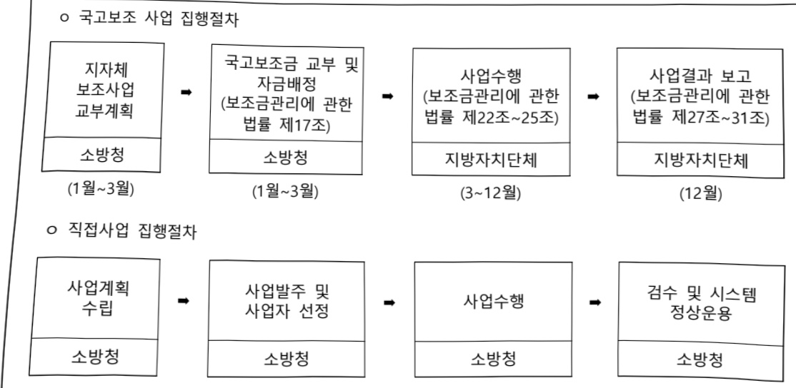
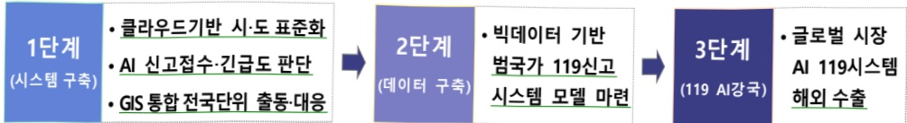
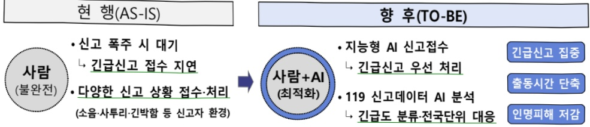
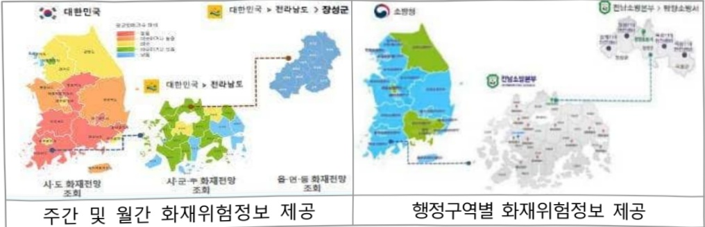

# 소방정보시스템구축(정보화)

**해당 페이지**: PDF 4475 ~ 4492 쪽 해당

**부처**: 소방청
**분야**: 공공질서 및 안전
**회계유형**: 일반회계
**2026 확정예산**: 1973.0 백만원
**전년대비 증감률**: None%
**AI 도메인**: 데이터, 교통/모빌리티, 통신/네트워크, 우주/위성, 건설/스마트시티, 재난/안전

---

<table border=1 style='margin: auto; word-wrap: break-word;'><tr><td style='text-align: center; word-wrap: break-word;'>사 업 명</td></tr><tr><td style='text-align: center; word-wrap: break-word;'>소방정보시스템구축(정보화) (1150-500)</td></tr></table>

## □ 사업 코드 정보

<table border=1 style='margin: auto; word-wrap: break-word;'><tr><td style='text-align: center; word-wrap: break-word;'>구분</td><td style='text-align: center; word-wrap: break-word;'>회계</td><td style='text-align: center; word-wrap: break-word;'>소관</td><td style='text-align: center; word-wrap: break-word;'>실국(기관)</td><td style='text-align: center; word-wrap: break-word;'>계정</td><td style='text-align: center; word-wrap: break-word;'>분야</td><td style='text-align: center; word-wrap: break-word;'>부문</td></tr><tr><td style='text-align: center; word-wrap: break-word;'>코드</td><td rowspan="2">일반회계</td><td rowspan="2">소방청</td><td rowspan="2">장비기술국</td><td rowspan="2">0</td><td style='text-align: center; word-wrap: break-word;'>020</td><td style='text-align: center; word-wrap: break-word;'>025</td></tr><tr><td style='text-align: center; word-wrap: break-word;'>명칭</td><td style='text-align: center; word-wrap: break-word;'>공공질서 및 안전</td><td style='text-align: center; word-wrap: break-word;'>재난관리</td></tr></table>

<table border=1 style='margin: auto; word-wrap: break-word;'><tr><td style='text-align: center; word-wrap: break-word;'>구분</td><td style='text-align: center; word-wrap: break-word;'>프로그램</td><td style='text-align: center; word-wrap: break-word;'>단위사업</td><td style='text-align: center; word-wrap: break-word;'>세부사업</td></tr><tr><td style='text-align: center; word-wrap: break-word;'>코드</td><td style='text-align: center; word-wrap: break-word;'>1100</td><td style='text-align: center; word-wrap: break-word;'>1150</td><td style='text-align: center; word-wrap: break-word;'>500</td></tr><tr><td style='text-align: center; word-wrap: break-word;'>명칭</td><td style='text-align: center; word-wrap: break-word;'>소방정책지원</td><td style='text-align: center; word-wrap: break-word;'>소방정보시스템구축(정보화)</td><td style='text-align: center; word-wrap: break-word;'>소방정보시스템구축(정보화)</td></tr></table>

## ☐ 사업 성격

<table border=1 style='margin: auto; word-wrap: break-word;'><tr><td rowspan="2">신규</td><td rowspan="2">계속</td><td rowspan="2">완료</td><td rowspan="2">예비타당성 실시여부</td><td rowspan="2">총사업비 관리대상</td><td rowspan="2">총액계상 예산사업</td><td style='text-align: center; word-wrap: break-word;'>사업소관 변경정보</td></tr><tr><td style='text-align: center; word-wrap: break-word;'>2025예산 시 소관</td></tr><tr><td style='text-align: center; word-wrap: break-word;'></td><td style='text-align: center; word-wrap: break-word;'>○</td><td style='text-align: center; word-wrap: break-word;'></td><td style='text-align: center; word-wrap: break-word;'></td><td style='text-align: center; word-wrap: break-word;'></td><td style='text-align: center; word-wrap: break-word;'></td><td style='text-align: center; word-wrap: break-word;'></td></tr></table>

## □ 사업 지원 형태 및 지원율

<table border=1 style='margin: auto; word-wrap: break-word;'><tr><td style='text-align: center; word-wrap: break-word;'>직접</td><td style='text-align: center; word-wrap: break-word;'>출자</td><td style='text-align: center; word-wrap: break-word;'>출연</td><td style='text-align: center; word-wrap: break-word;'>보조</td><td style='text-align: center; word-wrap: break-word;'>융자</td><td style='text-align: center; word-wrap: break-word;'>국고보조율(%)</td><td style='text-align: center; word-wrap: break-word;'>융자율(%)</td></tr><tr><td style='text-align: center; word-wrap: break-word;'>○</td><td style='text-align: center; word-wrap: break-word;'></td><td style='text-align: center; word-wrap: break-word;'></td><td style='text-align: center; word-wrap: break-word;'>○</td><td style='text-align: center; word-wrap: break-word;'></td><td style='text-align: center; word-wrap: break-word;'>40</td><td style='text-align: center; word-wrap: break-word;'></td></tr></table>

## □ 사업 담당자

<table border=1 style='margin: auto; word-wrap: break-word;'><tr><td style='text-align: center; word-wrap: break-word;'>사업명</td><td colspan="5">구분</td></tr><tr><td style='text-align: center; word-wrap: break-word;'>소방정보 시스템구축(정보화)</td><td style='text-align: center; word-wrap: break-word;'>소관부처</td><td style='text-align: center; word-wrap: break-word;'>실·국·과(팀) 장비기술국 정보통신과</td><td style='text-align: center; word-wrap: break-word;'>과 장 김형국 044-205-7260</td><td style='text-align: center; word-wrap: break-word;'>사무관 조성계 044-205-7261</td><td style='text-align: center; word-wrap: break-word;'>주무관 유상규 044-205-7262</td></tr></table>

---

### 가. 예산 총괄표

(단위: 백만원, %)

<table border=1 style='margin: auto; word-wrap: break-word;'><tr><td rowspan="2">사업명</td><td rowspan="2">2024년 결산</td><td colspan="2">2025년 예산</td><td rowspan="2">2026년 예산(B)</td><td rowspan="2">증감(B-A)</td><td rowspan="2">(B-A)/A</td></tr><tr><td style='text-align: center; word-wrap: break-word;'>본예산(A)</td><td style='text-align: center; word-wrap: break-word;'>추경</td></tr><tr><td style='text-align: center; word-wrap: break-word;'>소방정보시스템 구축(정보화)</td><td style='text-align: center; word-wrap: break-word;'>8,703</td><td style='text-align: center; word-wrap: break-word;'>13,337</td><td style='text-align: center; word-wrap: break-word;'>13,337</td><td style='text-align: center; word-wrap: break-word;'>15,310</td><td style='text-align: center; word-wrap: break-word;'>1,973</td><td style='text-align: center; word-wrap: break-word;'>14.8</td></tr></table>

□ 기능별(내역사업별), 목별 예산 내역

(단위:백만원)

<table border=1 style='margin: auto; word-wrap: break-word;'><tr><td rowspan="3">구분</td><td colspan="5">2024</td><td colspan="7">2025</td><td rowspan="3">2026예산</td></tr><tr><td rowspan="2">예산액(추정)</td><td rowspan="2">예산현액</td><td rowspan="2">집행액[실집행액]</td><td rowspan="2">이월액</td><td rowspan="2">불용액</td><td rowspan="2">본예산</td><td rowspan="2">예산현액</td><td rowspan="2">집행액[실집행액]</td><td colspan="2">전년도 이월액제외</td><td rowspan="2">이월예상액</td><td rowspan="2">불용예상액</td></tr><tr><td style='text-align: center; word-wrap: break-word;'>예산현액</td><td style='text-align: center; word-wrap: break-word;'>집행액[실집행액]</td></tr><tr><td style='text-align: center; word-wrap: break-word;'>○ 기능별 분류(합계)</td><td style='text-align: center; word-wrap: break-word;'>11,334</td><td style='text-align: center; word-wrap: break-word;'>11,334</td><td style='text-align: center; word-wrap: break-word;'>8,703</td><td style='text-align: center; word-wrap: break-word;'>-</td><td style='text-align: center; word-wrap: break-word;'>2,631</td><td style='text-align: center; word-wrap: break-word;'>13,337</td><td style='text-align: center; word-wrap: break-word;'>13,295</td><td style='text-align: center; word-wrap: break-word;'>11,627(11,627)</td><td style='text-align: center; word-wrap: break-word;'>13,295</td><td style='text-align: center; word-wrap: break-word;'>11,627(11,627)</td><td style='text-align: center; word-wrap: break-word;'>344</td><td style='text-align: center; word-wrap: break-word;'>1,324</td><td style='text-align: center; word-wrap: break-word;'>15,310</td></tr><tr><td style='text-align: center; word-wrap: break-word;'>· 소방정보시스템국고보조지원</td><td style='text-align: center; word-wrap: break-word;'>240</td><td style='text-align: center; word-wrap: break-word;'>240</td><td style='text-align: center; word-wrap: break-word;'>240</td><td style='text-align: center; word-wrap: break-word;'>-</td><td style='text-align: center; word-wrap: break-word;'>-</td><td style='text-align: center; word-wrap: break-word;'>240</td><td style='text-align: center; word-wrap: break-word;'>240</td><td style='text-align: center; word-wrap: break-word;'>240(240)</td><td style='text-align: center; word-wrap: break-word;'>240</td><td style='text-align: center; word-wrap: break-word;'>240(240)</td><td style='text-align: center; word-wrap: break-word;'>-</td><td style='text-align: center; word-wrap: break-word;'>-</td><td style='text-align: center; word-wrap: break-word;'>240</td></tr><tr><td style='text-align: center; word-wrap: break-word;'>· 소방정보시스템구축·운영</td><td style='text-align: center; word-wrap: break-word;'>4,681</td><td style='text-align: center; word-wrap: break-word;'>4,681</td><td style='text-align: center; word-wrap: break-word;'>4,170</td><td style='text-align: center; word-wrap: break-word;'>-</td><td style='text-align: center; word-wrap: break-word;'>510</td><td style='text-align: center; word-wrap: break-word;'>6,041</td><td style='text-align: center; word-wrap: break-word;'>5,999</td><td style='text-align: center; word-wrap: break-word;'>5,124</td><td style='text-align: center; word-wrap: break-word;'>5,999</td><td style='text-align: center; word-wrap: break-word;'>5,124</td><td style='text-align: center; word-wrap: break-word;'>-</td><td style='text-align: center; word-wrap: break-word;'>875</td><td style='text-align: center; word-wrap: break-word;'>5,670</td></tr><tr><td style='text-align: center; word-wrap: break-word;'>· 비상위성통신망구축</td><td style='text-align: center; word-wrap: break-word;'>1,783</td><td style='text-align: center; word-wrap: break-word;'>1,783</td><td style='text-align: center; word-wrap: break-word;'>1,764</td><td style='text-align: center; word-wrap: break-word;'>-</td><td style='text-align: center; word-wrap: break-word;'>19</td><td style='text-align: center; word-wrap: break-word;'>1,714</td><td style='text-align: center; word-wrap: break-word;'>1,714</td><td style='text-align: center; word-wrap: break-word;'>1,651</td><td style='text-align: center; word-wrap: break-word;'>1,714</td><td style='text-align: center; word-wrap: break-word;'>1,651</td><td style='text-align: center; word-wrap: break-word;'>-</td><td style='text-align: center; word-wrap: break-word;'>63</td><td style='text-align: center; word-wrap: break-word;'>1,715</td></tr><tr><td style='text-align: center; word-wrap: break-word;'>· 소방항공운항관리시스템 구축운영</td><td style='text-align: center; word-wrap: break-word;'>1,510</td><td style='text-align: center; word-wrap: break-word;'>1,510</td><td style='text-align: center; word-wrap: break-word;'>1,483</td><td style='text-align: center; word-wrap: break-word;'>-</td><td style='text-align: center; word-wrap: break-word;'>27</td><td style='text-align: center; word-wrap: break-word;'>1,300</td><td style='text-align: center; word-wrap: break-word;'>1,300</td><td style='text-align: center; word-wrap: break-word;'>1,250</td><td style='text-align: center; word-wrap: break-word;'>1,300</td><td style='text-align: center; word-wrap: break-word;'>1,250</td><td style='text-align: center; word-wrap: break-word;'>-</td><td style='text-align: center; word-wrap: break-word;'>50</td><td style='text-align: center; word-wrap: break-word;'>967</td></tr><tr><td style='text-align: center; word-wrap: break-word;'>· 소방 긴급구조데이터망</td><td style='text-align: center; word-wrap: break-word;'>3,120</td><td style='text-align: center; word-wrap: break-word;'>3,120</td><td style='text-align: center; word-wrap: break-word;'>1,045</td><td style='text-align: center; word-wrap: break-word;'>-</td><td style='text-align: center; word-wrap: break-word;'>2075</td><td style='text-align: center; word-wrap: break-word;'>3,120</td><td style='text-align: center; word-wrap: break-word;'>3,120</td><td style='text-align: center; word-wrap: break-word;'>2,790</td><td style='text-align: center; word-wrap: break-word;'>3,120</td><td style='text-align: center; word-wrap: break-word;'>2,790</td><td style='text-align: center; word-wrap: break-word;'>-</td><td style='text-align: center; word-wrap: break-word;'>330</td><td style='text-align: center; word-wrap: break-word;'>3,036</td></tr><tr><td style='text-align: center; word-wrap: break-word;'>· 119안전신고시스템노후장비 교체</td><td style='text-align: center; word-wrap: break-word;'>-</td><td style='text-align: center; word-wrap: break-word;'>-</td><td style='text-align: center; word-wrap: break-word;'>-</td><td style='text-align: center; word-wrap: break-word;'>-</td><td style='text-align: center; word-wrap: break-word;'>-</td><td style='text-align: center; word-wrap: break-word;'>922</td><td style='text-align: center; word-wrap: break-word;'>922</td><td style='text-align: center; word-wrap: break-word;'>572</td><td style='text-align: center; word-wrap: break-word;'>922</td><td style='text-align: center; word-wrap: break-word;'>572</td><td style='text-align: center; word-wrap: break-word;'>344</td><td style='text-align: center; word-wrap: break-word;'>6</td><td style='text-align: center; word-wrap: break-word;'>-</td></tr><tr><td style='text-align: center; word-wrap: break-word;'>· 차세대 119시스템구축 ISMP</td><td style='text-align: center; word-wrap: break-word;'>-</td><td style='text-align: center; word-wrap: break-word;'>-</td><td style='text-align: center; word-wrap: break-word;'>-</td><td style='text-align: center; word-wrap: break-word;'>-</td><td style='text-align: center; word-wrap: break-word;'>-</td><td style='text-align: center; word-wrap: break-word;'>-</td><td style='text-align: center; word-wrap: break-word;'>-</td><td style='text-align: center; word-wrap: break-word;'>-</td><td style='text-align: center; word-wrap: break-word;'>-</td><td style='text-align: center; word-wrap: break-word;'>-</td><td style='text-align: center; word-wrap: break-word;'>-</td><td style='text-align: center; word-wrap: break-word;'>-</td><td style='text-align: center; word-wrap: break-word;'>1,393</td></tr><tr><td style='text-align: center; word-wrap: break-word;'>· 국가 화 재 정 보시스템 고도화 ISP</td><td style='text-align: center; word-wrap: break-word;'>-</td><td style='text-align: center; word-wrap: break-word;'>-</td><td style='text-align: center; word-wrap: break-word;'>-</td><td style='text-align: center; word-wrap: break-word;'>-</td><td style='text-align: center; word-wrap: break-word;'>-</td><td style='text-align: center; word-wrap: break-word;'>-</td><td style='text-align: center; word-wrap: break-word;'>-</td><td style='text-align: center; word-wrap: break-word;'>-</td><td style='text-align: center; word-wrap: break-word;'>-</td><td style='text-align: center; word-wrap: break-word;'>-</td><td style='text-align: center; word-wrap: break-word;'>-</td><td style='text-align: center; word-wrap: break-word;'>-</td><td style='text-align: center; word-wrap: break-word;'>292</td></tr><tr><td style='text-align: center; word-wrap: break-word;'>· 소방자동차 교통안전분석시스템 구축·운영</td><td style='text-align: center; word-wrap: break-word;'>-</td><td style='text-align: center; word-wrap: break-word;'>-</td><td style='text-align: center; word-wrap: break-word;'>-</td><td style='text-align: center; word-wrap: break-word;'>-</td><td style='text-align: center; word-wrap: break-word;'>-</td><td style='text-align: center; word-wrap: break-word;'>-</td><td style='text-align: center; word-wrap: break-word;'>-</td><td style='text-align: center; word-wrap: break-word;'>-</td><td style='text-align: center; word-wrap: break-word;'>-</td><td style='text-align: center; word-wrap: break-word;'>-</td><td style='text-align: center; word-wrap: break-word;'>-</td><td style='text-align: center; word-wrap: break-word;'>-</td><td style='text-align: center; word-wrap: break-word;'>1,997</td></tr><tr><td style='text-align: center; word-wrap: break-word;'>○ 비목별 분류(합계)</td><td style='text-align: center; word-wrap: break-word;'>11,334</td><td style='text-align: center; word-wrap: break-word;'>11,334</td><td style='text-align: center; word-wrap: break-word;'>8,703</td><td style='text-align: center; word-wrap: break-word;'>-</td><td style='text-align: center; word-wrap: break-word;'>2,631</td><td style='text-align: center; word-wrap: break-word;'>13,337</td><td style='text-align: center; word-wrap: break-word;'>13,295</td><td style='text-align: center; word-wrap: break-word;'>11,627(11,627)</td><td style='text-align: center; word-wrap: break-word;'>13,295</td><td style='text-align: center; word-wrap: break-word;'>11,627(11,627)</td><td style='text-align: center; word-wrap: break-word;'>344</td><td style='text-align: center; word-wrap: break-word;'>1,324</td><td style='text-align: center; word-wrap: break-word;'>15,310</td></tr><tr><td style='text-align: center; word-wrap: break-word;'>· 일반수용비(210-01)</td><td style='text-align: center; word-wrap: break-word;'>20</td><td style='text-align: center; word-wrap: break-word;'>20</td><td style='text-align: center; word-wrap: break-word;'>20</td><td style='text-align: center; word-wrap: break-word;'>-</td><td style='text-align: center; word-wrap: break-word;'>-</td><td style='text-align: center; word-wrap: break-word;'>20</td><td style='text-align: center; word-wrap: break-word;'>20</td><td style='text-align: center; word-wrap: break-word;'>20</td><td style='text-align: center; word-wrap: break-word;'>20</td><td style='text-align: center; word-wrap: break-word;'>20</td><td style='text-align: center; word-wrap: break-word;'>-</td><td style='text-align: center; word-wrap: break-word;'>-</td><td style='text-align: center; word-wrap: break-word;'>20</td></tr><tr><td style='text-align: center; word-wrap: break-word;'>· 공공요금 및 제세(210-02)</td><td style='text-align: center; word-wrap: break-word;'>4,868</td><td style='text-align: center; word-wrap: break-word;'>4,868</td><td style='text-align: center; word-wrap: break-word;'>2,767</td><td style='text-align: center; word-wrap: break-word;'>-</td><td style='text-align: center; word-wrap: break-word;'>2,101</td><td style='text-align: center; word-wrap: break-word;'>4,868</td><td style='text-align: center; word-wrap: break-word;'>4,868</td><td style='text-align: center; word-wrap: break-word;'>4,452</td><td style='text-align: center; word-wrap: break-word;'>4,868</td><td style='text-align: center; word-wrap: break-word;'>4,451</td><td style='text-align: center; word-wrap: break-word;'>-</td><td style='text-align: center; word-wrap: break-word;'>416</td><td style='text-align: center; word-wrap: break-word;'>5,137</td></tr><tr><td style='text-align: center; word-wrap: break-word;'>· 시설장비유지비(210-09)</td><td style='text-align: center; word-wrap: break-word;'>-</td><td style='text-align: center; word-wrap: break-word;'>20</td><td style='text-align: center; word-wrap: break-word;'>17</td><td style='text-align: center; word-wrap: break-word;'>-</td><td style='text-align: center; word-wrap: break-word;'>3</td><td style='text-align: center; word-wrap: break-word;'>-</td><td style='text-align: center; word-wrap: break-word;'>-</td><td style='text-align: center; word-wrap: break-word;'>-</td><td style='text-align: center; word-wrap: break-word;'>-</td><td style='text-align: center; word-wrap: break-word;'>-</td><td style='text-align: center; word-wrap: break-word;'>-</td><td style='text-align: center; word-wrap: break-word;'>-</td><td style='text-align: center; word-wrap: break-word;'>-</td></tr><tr><td style='text-align: center; word-wrap: break-word;'>· 관리용역비(210-15)</td><td style='text-align: center; word-wrap: break-word;'>4,621</td><td style='text-align: center; word-wrap: break-word;'>4,601</td><td style='text-align: center; word-wrap: break-word;'>4,101</td><td style='text-align: center; word-wrap: break-word;'>-</td><td style='text-align: center; word-wrap: break-word;'>500</td><td style='text-align: center; word-wrap: break-word;'>5,987</td><td style='text-align: center; word-wrap: break-word;'>5,945</td><td style='text-align: center; word-wrap: break-word;'>5,093</td><td style='text-align: center; word-wrap: break-word;'>5,945</td><td style='text-align: center; word-wrap: break-word;'>5,093</td><td style='text-align: center; word-wrap: break-word;'>-</td><td style='text-align: center; word-wrap: break-word;'>852</td><td style='text-align: center; word-wrap: break-word;'>6,574</td></tr></table>

---

<table border=1 style='margin: auto; word-wrap: break-word;'><tr><td rowspan="3">구분</td><td colspan="5">2024</td><td colspan="7">2025</td><td rowspan="3">2026예산</td></tr><tr><td rowspan="2">예산액(추정)</td><td rowspan="2">예산현액</td><td rowspan="2">집행액[실집행액]</td><td rowspan="2">이월액</td><td rowspan="2">불용액</td><td rowspan="2">본예산</td><td rowspan="2">예산현액</td><td rowspan="2">집행액[실집행액]</td><td colspan="2">전년도이월액제외</td><td rowspan="2">이월예상액</td><td rowspan="2">불용예상액</td></tr><tr><td style='text-align: center; word-wrap: break-word;'>예산현액</td><td style='text-align: center; word-wrap: break-word;'>집행액[실집행액]</td></tr><tr><td style='text-align: center; word-wrap: break-word;'>·일반연구비(260-01)</td><td style='text-align: center; word-wrap: break-word;'>1,100</td><td style='text-align: center; word-wrap: break-word;'>1,100</td><td style='text-align: center; word-wrap: break-word;'>1,073</td><td style='text-align: center; word-wrap: break-word;'>-</td><td style='text-align: center; word-wrap: break-word;'>27</td><td style='text-align: center; word-wrap: break-word;'>1,407</td><td style='text-align: center; word-wrap: break-word;'>1,407</td><td style='text-align: center; word-wrap: break-word;'>1,405</td><td style='text-align: center; word-wrap: break-word;'>1,407</td><td style='text-align: center; word-wrap: break-word;'>1,405</td><td style='text-align: center; word-wrap: break-word;'>-</td><td style='text-align: center; word-wrap: break-word;'>2</td><td style='text-align: center; word-wrap: break-word;'>2,775</td></tr><tr><td style='text-align: center; word-wrap: break-word;'>·자치단체자본보조(330-03)</td><td style='text-align: center; word-wrap: break-word;'>240</td><td style='text-align: center; word-wrap: break-word;'>240</td><td style='text-align: center; word-wrap: break-word;'>240</td><td style='text-align: center; word-wrap: break-word;'>-</td><td style='text-align: center; word-wrap: break-word;'>-</td><td style='text-align: center; word-wrap: break-word;'>240</td><td style='text-align: center; word-wrap: break-word;'>240</td><td style='text-align: center; word-wrap: break-word;'>240(240)</td><td style='text-align: center; word-wrap: break-word;'>240</td><td style='text-align: center; word-wrap: break-word;'>240(240)</td><td style='text-align: center; word-wrap: break-word;'>-</td><td style='text-align: center; word-wrap: break-word;'>-</td><td style='text-align: center; word-wrap: break-word;'>240</td></tr><tr><td style='text-align: center; word-wrap: break-word;'>·공사비(420-03)</td><td style='text-align: center; word-wrap: break-word;'>75</td><td style='text-align: center; word-wrap: break-word;'>75</td><td style='text-align: center; word-wrap: break-word;'>74</td><td style='text-align: center; word-wrap: break-word;'>-</td><td style='text-align: center; word-wrap: break-word;'>1</td><td style='text-align: center; word-wrap: break-word;'>-</td><td style='text-align: center; word-wrap: break-word;'>-</td><td style='text-align: center; word-wrap: break-word;'>-</td><td style='text-align: center; word-wrap: break-word;'>-</td><td style='text-align: center; word-wrap: break-word;'>-</td><td style='text-align: center; word-wrap: break-word;'>-</td><td style='text-align: center; word-wrap: break-word;'>-</td><td style='text-align: center; word-wrap: break-word;'>-</td></tr><tr><td style='text-align: center; word-wrap: break-word;'>·자산취득비(430-01)</td><td style='text-align: center; word-wrap: break-word;'>410</td><td style='text-align: center; word-wrap: break-word;'>410</td><td style='text-align: center; word-wrap: break-word;'>410</td><td style='text-align: center; word-wrap: break-word;'>-</td><td style='text-align: center; word-wrap: break-word;'>-</td><td style='text-align: center; word-wrap: break-word;'>815</td><td style='text-align: center; word-wrap: break-word;'>815</td><td style='text-align: center; word-wrap: break-word;'>417</td><td style='text-align: center; word-wrap: break-word;'>815</td><td style='text-align: center; word-wrap: break-word;'>417</td><td style='text-align: center; word-wrap: break-word;'>344</td><td style='text-align: center; word-wrap: break-word;'>54</td><td style='text-align: center; word-wrap: break-word;'>564</td></tr><tr><td style='text-align: center; word-wrap: break-word;'>○기능비목별분류액제</td><td style='text-align: center; word-wrap: break-word;'>11,334</td><td style='text-align: center; word-wrap: break-word;'>11,334</td><td style='text-align: center; word-wrap: break-word;'>8,703</td><td style='text-align: center; word-wrap: break-word;'>-</td><td style='text-align: center; word-wrap: break-word;'>2,631</td><td style='text-align: center; word-wrap: break-word;'>13,337</td><td style='text-align: center; word-wrap: break-word;'>13,295</td><td style='text-align: center; word-wrap: break-word;'>11,627(11,627)</td><td style='text-align: center; word-wrap: break-word;'>13,295</td><td style='text-align: center; word-wrap: break-word;'>11,627(11,627)</td><td style='text-align: center; word-wrap: break-word;'>344</td><td style='text-align: center; word-wrap: break-word;'>1,324</td><td style='text-align: center; word-wrap: break-word;'>15,310</td></tr><tr><td style='text-align: center; word-wrap: break-word;'>·소방정보시스템국고보조지원</td><td style='text-align: center; word-wrap: break-word;'>240</td><td style='text-align: center; word-wrap: break-word;'>240</td><td style='text-align: center; word-wrap: break-word;'>240</td><td style='text-align: center; word-wrap: break-word;'>-</td><td style='text-align: center; word-wrap: break-word;'>-</td><td style='text-align: center; word-wrap: break-word;'>240</td><td style='text-align: center; word-wrap: break-word;'>240</td><td style='text-align: center; word-wrap: break-word;'>240(240)</td><td style='text-align: center; word-wrap: break-word;'>240</td><td style='text-align: center; word-wrap: break-word;'>240(240)</td><td style='text-align: center; word-wrap: break-word;'>-</td><td style='text-align: center; word-wrap: break-word;'>-</td><td style='text-align: center; word-wrap: break-word;'>240</td></tr><tr><td style='text-align: center; word-wrap: break-word;'>·자치단체자본보조(330-03)</td><td style='text-align: center; word-wrap: break-word;'>240</td><td style='text-align: center; word-wrap: break-word;'>240</td><td style='text-align: center; word-wrap: break-word;'>240</td><td style='text-align: center; word-wrap: break-word;'>-</td><td style='text-align: center; word-wrap: break-word;'>-</td><td style='text-align: center; word-wrap: break-word;'>240</td><td style='text-align: center; word-wrap: break-word;'>240</td><td style='text-align: center; word-wrap: break-word;'>240(240)</td><td style='text-align: center; word-wrap: break-word;'>240</td><td style='text-align: center; word-wrap: break-word;'>240(240)</td><td style='text-align: center; word-wrap: break-word;'>-</td><td style='text-align: center; word-wrap: break-word;'>-</td><td style='text-align: center; word-wrap: break-word;'>240</td></tr><tr><td style='text-align: center; word-wrap: break-word;'>·소방정보시스템구축·운영</td><td style='text-align: center; word-wrap: break-word;'>4,681</td><td style='text-align: center; word-wrap: break-word;'>4,681</td><td style='text-align: center; word-wrap: break-word;'>4,170</td><td style='text-align: center; word-wrap: break-word;'>-</td><td style='text-align: center; word-wrap: break-word;'>510</td><td style='text-align: center; word-wrap: break-word;'>6,041</td><td style='text-align: center; word-wrap: break-word;'>5,999</td><td style='text-align: center; word-wrap: break-word;'>5,124</td><td style='text-align: center; word-wrap: break-word;'>5,999</td><td style='text-align: center; word-wrap: break-word;'>5,124</td><td style='text-align: center; word-wrap: break-word;'>-</td><td style='text-align: center; word-wrap: break-word;'>875</td><td style='text-align: center; word-wrap: break-word;'>5,670</td></tr><tr><td style='text-align: center; word-wrap: break-word;'>·일반수용비(210-01)</td><td style='text-align: center; word-wrap: break-word;'>20</td><td style='text-align: center; word-wrap: break-word;'>20</td><td style='text-align: center; word-wrap: break-word;'>20</td><td style='text-align: center; word-wrap: break-word;'>-</td><td style='text-align: center; word-wrap: break-word;'>-</td><td style='text-align: center; word-wrap: break-word;'>20</td><td style='text-align: center; word-wrap: break-word;'>20</td><td style='text-align: center; word-wrap: break-word;'>20</td><td style='text-align: center; word-wrap: break-word;'>20</td><td style='text-align: center; word-wrap: break-word;'>20</td><td style='text-align: center; word-wrap: break-word;'>-</td><td style='text-align: center; word-wrap: break-word;'>-</td><td style='text-align: center; word-wrap: break-word;'>20</td></tr><tr><td style='text-align: center; word-wrap: break-word;'>·공공요금및제세(210-02)</td><td style='text-align: center; word-wrap: break-word;'>150</td><td style='text-align: center; word-wrap: break-word;'>150</td><td style='text-align: center; word-wrap: break-word;'>137</td><td style='text-align: center; word-wrap: break-word;'>-</td><td style='text-align: center; word-wrap: break-word;'>13</td><td style='text-align: center; word-wrap: break-word;'>150</td><td style='text-align: center; word-wrap: break-word;'>150</td><td style='text-align: center; word-wrap: break-word;'>126</td><td style='text-align: center; word-wrap: break-word;'>150</td><td style='text-align: center; word-wrap: break-word;'>126</td><td style='text-align: center; word-wrap: break-word;'>-</td><td style='text-align: center; word-wrap: break-word;'>24</td><td style='text-align: center; word-wrap: break-word;'>150</td></tr><tr><td style='text-align: center; word-wrap: break-word;'>·관리용액비(210-15)</td><td style='text-align: center; word-wrap: break-word;'>4,511</td><td style='text-align: center; word-wrap: break-word;'>4,511</td><td style='text-align: center; word-wrap: break-word;'>4,013</td><td style='text-align: center; word-wrap: break-word;'>-</td><td style='text-align: center; word-wrap: break-word;'>497</td><td style='text-align: center; word-wrap: break-word;'>5,871</td><td style='text-align: center; word-wrap: break-word;'>5,829</td><td style='text-align: center; word-wrap: break-word;'>4,978</td><td style='text-align: center; word-wrap: break-word;'>5,829</td><td style='text-align: center; word-wrap: break-word;'>4,978</td><td style='text-align: center; word-wrap: break-word;'>-</td><td style='text-align: center; word-wrap: break-word;'>851</td><td style='text-align: center; word-wrap: break-word;'>5,500</td></tr><tr><td style='text-align: center; word-wrap: break-word;'>·비상위성통신망구축</td><td style='text-align: center; word-wrap: break-word;'>1,783</td><td style='text-align: center; word-wrap: break-word;'>1,783</td><td style='text-align: center; word-wrap: break-word;'>1,764</td><td style='text-align: center; word-wrap: break-word;'>-</td><td style='text-align: center; word-wrap: break-word;'>19</td><td style='text-align: center; word-wrap: break-word;'>1,714</td><td style='text-align: center; word-wrap: break-word;'>1,714</td><td style='text-align: center; word-wrap: break-word;'>1,651</td><td style='text-align: center; word-wrap: break-word;'>1,714</td><td style='text-align: center; word-wrap: break-word;'>1,651</td><td style='text-align: center; word-wrap: break-word;'>-</td><td style='text-align: center; word-wrap: break-word;'>63</td><td style='text-align: center; word-wrap: break-word;'>1,715</td></tr><tr><td style='text-align: center; word-wrap: break-word;'>·공공요금및제세(210-02)</td><td style='text-align: center; word-wrap: break-word;'>1,598</td><td style='text-align: center; word-wrap: break-word;'>1,598</td><td style='text-align: center; word-wrap: break-word;'>1,585</td><td style='text-align: center; word-wrap: break-word;'>-</td><td style='text-align: center; word-wrap: break-word;'>13</td><td style='text-align: center; word-wrap: break-word;'>1,598</td><td style='text-align: center; word-wrap: break-word;'>1,598</td><td style='text-align: center; word-wrap: break-word;'>1,536</td><td style='text-align: center; word-wrap: break-word;'>1,598</td><td style='text-align: center; word-wrap: break-word;'>1,536</td><td style='text-align: center; word-wrap: break-word;'>-</td><td style='text-align: center; word-wrap: break-word;'>62</td><td style='text-align: center; word-wrap: break-word;'>1,598</td></tr><tr><td style='text-align: center; word-wrap: break-word;'>·관리용액비(210-15)</td><td style='text-align: center; word-wrap: break-word;'>110</td><td style='text-align: center; word-wrap: break-word;'>110</td><td style='text-align: center; word-wrap: break-word;'>105</td><td style='text-align: center; word-wrap: break-word;'>-</td><td style='text-align: center; word-wrap: break-word;'>5</td><td style='text-align: center; word-wrap: break-word;'>116</td><td style='text-align: center; word-wrap: break-word;'>116</td><td style='text-align: center; word-wrap: break-word;'>115</td><td style='text-align: center; word-wrap: break-word;'>116</td><td style='text-align: center; word-wrap: break-word;'>115</td><td style='text-align: center; word-wrap: break-word;'>-</td><td style='text-align: center; word-wrap: break-word;'>1</td><td style='text-align: center; word-wrap: break-word;'>117</td></tr><tr><td style='text-align: center; word-wrap: break-word;'>·공사비(420-03)</td><td style='text-align: center; word-wrap: break-word;'>75</td><td style='text-align: center; word-wrap: break-word;'>75</td><td style='text-align: center; word-wrap: break-word;'>74</td><td style='text-align: center; word-wrap: break-word;'>-</td><td style='text-align: center; word-wrap: break-word;'>1</td><td style='text-align: center; word-wrap: break-word;'>-</td><td style='text-align: center; word-wrap: break-word;'>-</td><td style='text-align: center; word-wrap: break-word;'>-</td><td style='text-align: center; word-wrap: break-word;'>-</td><td style='text-align: center; word-wrap: break-word;'>-</td><td style='text-align: center; word-wrap: break-word;'>-</td><td style='text-align: center; word-wrap: break-word;'>-</td><td style='text-align: center; word-wrap: break-word;'>-</td></tr><tr><td style='text-align: center; word-wrap: break-word;'>·소방항공운항관리시스템구축·운영</td><td style='text-align: center; word-wrap: break-word;'>1,510</td><td style='text-align: center; word-wrap: break-word;'>1,510</td><td style='text-align: center; word-wrap: break-word;'>1,483</td><td style='text-align: center; word-wrap: break-word;'>-</td><td style='text-align: center; word-wrap: break-word;'>27</td><td style='text-align: center; word-wrap: break-word;'>1,300</td><td style='text-align: center; word-wrap: break-word;'>1,300</td><td style='text-align: center; word-wrap: break-word;'>1,250</td><td style='text-align: center; word-wrap: break-word;'>1,300</td><td style='text-align: center; word-wrap: break-word;'>1,250</td><td style='text-align: center; word-wrap: break-word;'>-</td><td style='text-align: center; word-wrap: break-word;'>50</td><td style='text-align: center; word-wrap: break-word;'>967</td></tr><tr><td style='text-align: center; word-wrap: break-word;'>·공공요금및제세(210-02)</td><td style='text-align: center; word-wrap: break-word;'>-</td><td style='text-align: center; word-wrap: break-word;'>-</td><td style='text-align: center; word-wrap: break-word;'>-</td><td style='text-align: center; word-wrap: break-word;'>-</td><td style='text-align: center; word-wrap: break-word;'>-</td><td style='text-align: center; word-wrap: break-word;'>-</td><td style='text-align: center; word-wrap: break-word;'>-</td><td style='text-align: center; word-wrap: break-word;'>-</td><td style='text-align: center; word-wrap: break-word;'>-</td><td style='text-align: center; word-wrap: break-word;'>-</td><td style='text-align: center; word-wrap: break-word;'>-</td><td style='text-align: center; word-wrap: break-word;'>-</td><td style='text-align: center; word-wrap: break-word;'>10</td></tr><tr><td style='text-align: center; word-wrap: break-word;'>·관리용액비(210-15)</td><td style='text-align: center; word-wrap: break-word;'>-</td><td style='text-align: center; word-wrap: break-word;'>-</td><td style='text-align: center; word-wrap: break-word;'>-</td><td style='text-align: center; word-wrap: break-word;'>-</td><td style='text-align: center; word-wrap: break-word;'>-</td><td style='text-align: center; word-wrap: break-word;'>-</td><td style='text-align: center; word-wrap: break-word;'>-</td><td style='text-align: center; word-wrap: break-word;'>-</td><td style='text-align: center; word-wrap: break-word;'>-</td><td style='text-align: center; word-wrap: break-word;'>-</td><td style='text-align: center; word-wrap: break-word;'>-</td><td style='text-align: center; word-wrap: break-word;'>-</td><td style='text-align: center; word-wrap: break-word;'>957</td></tr><tr><td style='text-align: center; word-wrap: break-word;'>·일반연구비(260-01)</td><td style='text-align: center; word-wrap: break-word;'>1,100</td><td style='text-align: center; word-wrap: break-word;'>1,100</td><td style='text-align: center; word-wrap: break-word;'>1,073</td><td style='text-align: center; word-wrap: break-word;'>-</td><td style='text-align: center; word-wrap: break-word;'>27</td><td style='text-align: center; word-wrap: break-word;'>1,000</td><td style='text-align: center; word-wrap: break-word;'>1,000</td><td style='text-align: center; word-wrap: break-word;'>1,000</td><td style='text-align: center; word-wrap: break-word;'>1,000</td><td style='text-align: center; word-wrap: break-word;'>1,000</td><td style='text-align: center; word-wrap: break-word;'>-</td><td style='text-align: center; word-wrap: break-word;'>-</td><td style='text-align: center; word-wrap: break-word;'>-</td></tr><tr><td style='text-align: center; word-wrap: break-word;'>·자산취득비(430-01)</td><td style='text-align: center; word-wrap: break-word;'>410</td><td style='text-align: center; word-wrap: break-word;'>410</td><td style='text-align: center; word-wrap: break-word;'>410</td><td style='text-align: center; word-wrap: break-word;'>-</td><td style='text-align: center; word-wrap: break-word;'>-</td><td style='text-align: center; word-wrap: break-word;'>300</td><td style='text-align: center; word-wrap: break-word;'>300</td><td style='text-align: center; word-wrap: break-word;'>250</td><td style='text-align: center; word-wrap: break-word;'>300</td><td style='text-align: center; word-wrap: break-word;'>250</td><td style='text-align: center; word-wrap: break-word;'>-</td><td style='text-align: center; word-wrap: break-word;'>50</td><td style='text-align: center; word-wrap: break-word;'>-</td></tr><tr><td style='text-align: center; word-wrap: break-word;'>·소방긴급구조테이터망</td><td style='text-align: center; word-wrap: break-word;'>3,120</td><td style='text-align: center; word-wrap: break-word;'>3,120</td><td style='text-align: center; word-wrap: break-word;'>1,045</td><td style='text-align: center; word-wrap: break-word;'>-</td><td style='text-align: center; word-wrap: break-word;'>2,075</td><td style='text-align: center; word-wrap: break-word;'>3,120</td><td style='text-align: center; word-wrap: break-word;'>3,120</td><td style='text-align: center; word-wrap: break-word;'>2,790</td><td style='text-align: center; word-wrap: break-word;'>3,120</td><td style='text-align: center; word-wrap: break-word;'>2,790</td><td style='text-align: center; word-wrap: break-word;'>-</td><td style='text-align: center; word-wrap: break-word;'>330</td><td style='text-align: center; word-wrap: break-word;'>3,036</td></tr><tr><td style='text-align: center; word-wrap: break-word;'>·공공요금및제세(210-02)</td><td style='text-align: center; word-wrap: break-word;'>3,120</td><td style='text-align: center; word-wrap: break-word;'>3,120</td><td style='text-align: center; word-wrap: break-word;'>1,045</td><td style='text-align: center; word-wrap: break-word;'>-</td><td style='text-align: center; word-wrap: break-word;'>2,075</td><td style='text-align: center; word-wrap: break-word;'>3,120</td><td style='text-align: center; word-wrap: break-word;'>3,120</td><td style='text-align: center; word-wrap: break-word;'>2,790</td><td style='text-align: center; word-wrap: break-word;'>3,120</td><td style='text-align: center; word-wrap: break-word;'>2,790</td><td style='text-align: center; word-wrap: break-word;'>-</td><td style='text-align: center; word-wrap: break-word;'>330</td><td style='text-align: center; word-wrap: break-word;'>3,036</td></tr><tr><td style='text-align: center; word-wrap: break-word;'>·119안전신고센터고도화</td><td style='text-align: center; word-wrap: break-word;'>-</td><td style='text-align: center; word-wrap: break-word;'>-</td><td style='text-align: center; word-wrap: break-word;'>-</td><td style='text-align: center; word-wrap: break-word;'>-</td><td style='text-align: center; word-wrap: break-word;'>-</td><td style='text-align: center; word-wrap: break-word;'>922</td><td style='text-align: center; word-wrap: break-word;'>922</td><td style='text-align: center; word-wrap: break-word;'>572</td><td style='text-align: center; word-wrap: break-word;'>922</td><td style='text-align: center; word-wrap: break-word;'>572</td><td style='text-align: center; word-wrap: break-word;'>-</td><td style='text-align: center; word-wrap: break-word;'>6</td><td style='text-align: center; word-wrap: break-word;'>-</td></tr><tr><td style='text-align: center; word-wrap: break-word;'>·일반연구비(260-01)</td><td style='text-align: center; word-wrap: break-word;'>-</td><td style='text-align: center; word-wrap: break-word;'>-</td><td style='text-align: center; word-wrap: break-word;'>-</td><td style='text-align: center; word-wrap: break-word;'>-</td><td style='text-align: center; word-wrap: break-word;'>-</td><td style='text-align: center; word-wrap: break-word;'>407</td><td style='text-align: center; word-wrap: break-word;'>407</td><td style='text-align: center; word-wrap: break-word;'>405</td><td style='text-align: center; word-wrap: break-word;'>407</td><td style='text-align: center; word-wrap: break-word;'>405</td><td style='text-align: center; word-wrap: break-word;'>-</td><td style='text-align: center; word-wrap: break-word;'>2</td><td style='text-align: center; word-wrap: break-word;'>-</td></tr></table>

---

<table border=1 style='margin: auto; word-wrap: break-word;'><tr><td rowspan="3">구분</td><td colspan="5">2024</td><td colspan="7">2025</td><td rowspan="3">2026예산</td></tr><tr><td rowspan="2">예산액(추정)</td><td rowspan="2">예산현액</td><td rowspan="2">집행액[실집행액]</td><td rowspan="2">이월액</td><td rowspan="2">불용액</td><td rowspan="2">본예산</td><td rowspan="2">예산현액</td><td rowspan="2">집행액[실집행액]</td><td colspan="2">전년도이월액제외</td><td rowspan="2">이월예상액</td><td rowspan="2">불용예상액</td></tr><tr><td style='text-align: center; word-wrap: break-word;'>예산현액</td><td style='text-align: center; word-wrap: break-word;'>집행액[실집행액]</td></tr><tr><td style='text-align: center; word-wrap: break-word;'>- 자산취득비(430-01)</td><td style='text-align: center; word-wrap: break-word;'>-</td><td style='text-align: center; word-wrap: break-word;'>-</td><td style='text-align: center; word-wrap: break-word;'>-</td><td style='text-align: center; word-wrap: break-word;'>-</td><td style='text-align: center; word-wrap: break-word;'>-</td><td style='text-align: center; word-wrap: break-word;'>515</td><td style='text-align: center; word-wrap: break-word;'>515</td><td style='text-align: center; word-wrap: break-word;'>167</td><td style='text-align: center; word-wrap: break-word;'>515</td><td style='text-align: center; word-wrap: break-word;'>167</td><td style='text-align: center; word-wrap: break-word;'>344</td><td style='text-align: center; word-wrap: break-word;'>4</td><td style='text-align: center; word-wrap: break-word;'>-</td></tr><tr><td style='text-align: center; word-wrap: break-word;'>- 차세대 119시스템구축 ISMP</td><td style='text-align: center; word-wrap: break-word;'>-</td><td style='text-align: center; word-wrap: break-word;'>-</td><td style='text-align: center; word-wrap: break-word;'>-</td><td style='text-align: center; word-wrap: break-word;'>-</td><td style='text-align: center; word-wrap: break-word;'>-</td><td style='text-align: center; word-wrap: break-word;'>-</td><td style='text-align: center; word-wrap: break-word;'>-</td><td style='text-align: center; word-wrap: break-word;'>-</td><td style='text-align: center; word-wrap: break-word;'>-</td><td style='text-align: center; word-wrap: break-word;'>-</td><td style='text-align: center; word-wrap: break-word;'>-</td><td style='text-align: center; word-wrap: break-word;'>-</td><td style='text-align: center; word-wrap: break-word;'>1,393</td></tr><tr><td style='text-align: center; word-wrap: break-word;'>- 일반연구비(260-01)</td><td style='text-align: center; word-wrap: break-word;'>-</td><td style='text-align: center; word-wrap: break-word;'>-</td><td style='text-align: center; word-wrap: break-word;'>-</td><td style='text-align: center; word-wrap: break-word;'>-</td><td style='text-align: center; word-wrap: break-word;'>-</td><td style='text-align: center; word-wrap: break-word;'>-</td><td style='text-align: center; word-wrap: break-word;'>-</td><td style='text-align: center; word-wrap: break-word;'>-</td><td style='text-align: center; word-wrap: break-word;'>-</td><td style='text-align: center; word-wrap: break-word;'>-</td><td style='text-align: center; word-wrap: break-word;'>-</td><td style='text-align: center; word-wrap: break-word;'>-</td><td style='text-align: center; word-wrap: break-word;'>1,393</td></tr><tr><td style='text-align: center; word-wrap: break-word;'>- 국가화재정보시스템 고도화 ISP</td><td style='text-align: center; word-wrap: break-word;'>-</td><td style='text-align: center; word-wrap: break-word;'>-</td><td style='text-align: center; word-wrap: break-word;'>-</td><td style='text-align: center; word-wrap: break-word;'>-</td><td style='text-align: center; word-wrap: break-word;'>-</td><td style='text-align: center; word-wrap: break-word;'>-</td><td style='text-align: center; word-wrap: break-word;'>-</td><td style='text-align: center; word-wrap: break-word;'>-</td><td style='text-align: center; word-wrap: break-word;'>-</td><td style='text-align: center; word-wrap: break-word;'>-</td><td style='text-align: center; word-wrap: break-word;'>-</td><td style='text-align: center; word-wrap: break-word;'>-</td><td style='text-align: center; word-wrap: break-word;'>292</td></tr><tr><td style='text-align: center; word-wrap: break-word;'>- 일반연구비(260-01)</td><td style='text-align: center; word-wrap: break-word;'>-</td><td style='text-align: center; word-wrap: break-word;'>-</td><td style='text-align: center; word-wrap: break-word;'>-</td><td style='text-align: center; word-wrap: break-word;'>-</td><td style='text-align: center; word-wrap: break-word;'>-</td><td style='text-align: center; word-wrap: break-word;'>-</td><td style='text-align: center; word-wrap: break-word;'>-</td><td style='text-align: center; word-wrap: break-word;'>-</td><td style='text-align: center; word-wrap: break-word;'>-</td><td style='text-align: center; word-wrap: break-word;'>-</td><td style='text-align: center; word-wrap: break-word;'>-</td><td style='text-align: center; word-wrap: break-word;'>-</td><td style='text-align: center; word-wrap: break-word;'>292</td></tr><tr><td style='text-align: center; word-wrap: break-word;'>- 소방자동차 교통안전분석시스템 구축운영</td><td style='text-align: center; word-wrap: break-word;'>-</td><td style='text-align: center; word-wrap: break-word;'>-</td><td style='text-align: center; word-wrap: break-word;'>-</td><td style='text-align: center; word-wrap: break-word;'>-</td><td style='text-align: center; word-wrap: break-word;'>-</td><td style='text-align: center; word-wrap: break-word;'>-</td><td style='text-align: center; word-wrap: break-word;'>-</td><td style='text-align: center; word-wrap: break-word;'>-</td><td style='text-align: center; word-wrap: break-word;'>-</td><td style='text-align: center; word-wrap: break-word;'>-</td><td style='text-align: center; word-wrap: break-word;'>-</td><td style='text-align: center; word-wrap: break-word;'>-</td><td style='text-align: center; word-wrap: break-word;'>1,997</td></tr><tr><td style='text-align: center; word-wrap: break-word;'>- 공공요금및제세(210-02)</td><td style='text-align: center; word-wrap: break-word;'>-</td><td style='text-align: center; word-wrap: break-word;'>-</td><td style='text-align: center; word-wrap: break-word;'>-</td><td style='text-align: center; word-wrap: break-word;'>-</td><td style='text-align: center; word-wrap: break-word;'>-</td><td style='text-align: center; word-wrap: break-word;'>-</td><td style='text-align: center; word-wrap: break-word;'>-</td><td style='text-align: center; word-wrap: break-word;'>-</td><td style='text-align: center; word-wrap: break-word;'>-</td><td style='text-align: center; word-wrap: break-word;'>-</td><td style='text-align: center; word-wrap: break-word;'>-</td><td style='text-align: center; word-wrap: break-word;'>-</td><td style='text-align: center; word-wrap: break-word;'>343</td></tr><tr><td style='text-align: center; word-wrap: break-word;'>- 일반연구비(260-01)</td><td style='text-align: center; word-wrap: break-word;'>-</td><td style='text-align: center; word-wrap: break-word;'>-</td><td style='text-align: center; word-wrap: break-word;'>-</td><td style='text-align: center; word-wrap: break-word;'>-</td><td style='text-align: center; word-wrap: break-word;'>-</td><td style='text-align: center; word-wrap: break-word;'>-</td><td style='text-align: center; word-wrap: break-word;'>-</td><td style='text-align: center; word-wrap: break-word;'>-</td><td style='text-align: center; word-wrap: break-word;'>-</td><td style='text-align: center; word-wrap: break-word;'>-</td><td style='text-align: center; word-wrap: break-word;'>-</td><td style='text-align: center; word-wrap: break-word;'>-</td><td style='text-align: center; word-wrap: break-word;'>1,090</td></tr><tr><td style='text-align: center; word-wrap: break-word;'>- 자산취득비(430-01)</td><td style='text-align: center; word-wrap: break-word;'>-</td><td style='text-align: center; word-wrap: break-word;'>-</td><td style='text-align: center; word-wrap: break-word;'>-</td><td style='text-align: center; word-wrap: break-word;'>-</td><td style='text-align: center; word-wrap: break-word;'>-</td><td style='text-align: center; word-wrap: break-word;'>-</td><td style='text-align: center; word-wrap: break-word;'>-</td><td style='text-align: center; word-wrap: break-word;'>-</td><td style='text-align: center; word-wrap: break-word;'>-</td><td style='text-align: center; word-wrap: break-word;'>-</td><td style='text-align: center; word-wrap: break-word;'>-</td><td style='text-align: center; word-wrap: break-word;'>-</td><td style='text-align: center; word-wrap: break-word;'>564</td></tr></table>

### 나. 사업설명자료

## 1 ) 사업목적·내용

- (소방정보시스템 국고보조지원) 소방 현장영상과 스마트시티 CCTV 영상 등의 통합 관제체계 구축을 위한 관련기관 CCTV 영상정보 연계사업 시·도 확산 지원

- (소방정보시스템 구축·운영) 전국 소방관서에 보급·운영 중인 소방정보시스템의

안정적인 운영과 기능 고도화를 통한 신속한 소방서비스 제공·지원

- (비상위성통신망 구축·운영) 지진, 산불 등 대형재난 발생으로 인한 기지국 소실 등

유무선 통신망의 두절 상황에 대비하여 위성통신망 및 위성중계차량 등 긴급통신

수단을 마련함으로써 안정적인 재난 대응을 지원

- (소방항공 운항관리시스템 구축·운영) 전국소방헬기 통합운영, 소방 국가직화등에 따라 시·도별 분산된 소방항공 업무 표준화를 위한 운항관리시스템 구축·운영

- (소방 긴급구조 데이터망) 소방청, 중앙119구조본부, 전국 19개 시·도 소방본부 구간의

긴급구조 업무용 정보, 재난영상, 실시간 영상회의 등 대용량의 데이터 전송 및 개인

정보, 주요정보 외부 유출 차단을 위한 전용망 운영

---

(차세대 119시스템 구축) 풍수해, 태풍 등 대형·광범위 재난시 119신고 폭주대응 및 전국 소방력 동원, 시도 구분 없는 최단거리 출동 등을 위한 AI 기반 지능형 119신고 접수 출동 체계 구현

- (국가화재정보시스템 고도화) 빅데이터·AI·클라우드 등 첨단기술을 활용해 전국의

화재 데이터를 통합·분석하여 과학적이고 체계적인 화재예방 정책수립과 신속한

현장대응을 지원함으로써 국민 안전과 재난대응 체계 강화 추진

- (소방자동차 교통안전분석시스템 구축·운영) 소방자동차 운행기록데이터를 체계적으로 수집하고 운행 특수성(긴급성·위험성·효율성 등)을 고려한 과학적 분석으로 소방차 교통사고 안전관리 강화를 위한 교통안전분석시스템 구축·운영

## 2 ) 사업개요

## □ 사업근거 및 추진경위

① 법령상 근거 및 조항

- (소방정보시스템 국고보조 지원) 「소방기본법」 제9조(소방장비에 대한 국고보조)

- (소방정보시스템 구축·운영)「재난 및 안전관리기본법」제25조의2(재난책임기관의

장의 재난예방조치 등)

- (비상위성통신망 구축·운영) [재난 및 안전관리기본법] 제34조의2(재난현장 긴급 통신수단의 마련)

- (소방항공 운항관리시스템 구축·운영) 「119구조·구급에 관한 법률」 제12조의2(119항공운항관제실 설치·운영), 「범부처 응급의료헬기 공동운영규정」 제4조(출동요청 접수·대응 등)

- (소방 긴급구조 데이터망) 「재난 및 안전관리기본법」 제25조의2(재난책임기관의 장의 재난예방조치 등), 「재난 및 안전관리기본법」 제34조의8(재난현장 긴급통신수단의 마련)

- (차세대 119시스템 구축 ISMP) 119긴급신고법 제15조(119정보통신시스템 구축·운영)

- (국가화재정보시스템 고도화 ISP) 「소방의 화재조사에 관한 법률」 제19조(국가화재 정보시스템의 구축·운영), 「통계법」 제7조(통계작성기관의 인력 및 예산확보)

- (소방자동차 교통안전시스템 구축·운영) 소방기본법 제21조의3(소방자동차 교통안전 분석 시스템 구축·운영)

---

② 추진경위 - 사업 시작년도, 추진배경, 부처별 중점과제, 대통령 공약사항 등

사업 시작년도: 2005년

## ○ 추진배경

## (1) 소방정보시스템 국고보조 지원

- 지자체 CCTV 관제센터와 실시간 연계로 출동경로 상의 교통정체 우회 등 최적의 출동경로 확보와 현장상황 모니터링으로 신속정확한 상황판단을 통한 효과적인 현장지원체계 마련

## (2) 소방정보시스템 구축·운영

- '05년 감사원 권고사항 : 표준화 시스템 구축 추진

- 18개 소방본부 대상 긴급구조표준시스템 구축·확산 : '06~'15년

- 119다매체신고, 소방현장통합관리, 119수색구조 등 전자정부지원사업 추진 : '11~'16

- 국정과제 추진(U-119신고서비스 환경개선, 현장중심 안전관리 시스템구현) : '13~'16

## (3) 비상위성통신망 구축·운영

- '01년 소방종합통신망 구축계획 수립·시행(124억, 청,경기,충북)

- 행정자치부 위성중계차량 4대(부산,강원,충남,전남) 인수 : '12.3.16

- 18년 이원화(소방, 행안부 인수) 운영 중인 위성시스템 통합

## (4) 소방항공 운항관리시스템 구축·운영

- '15년~'17년 2단계에 거쳐 시스템 구축 · 개발

- '20년 조종사 휴대용 단말기 재개발 및 기능개선

- 전국소방헬기 통합운영, 소방 국가직화등에 따라 시·도별 분산된 소방항공 업무 프로세스 표준화를 위한 ISP 수립 ※ (ISP사업) '21. 4. 28. ~ 9. 25 (5개월)

- '23년~'25년 소방항공 운항관리시스템 고도화

-사용자 요구사항을 분석하여 노후화된 시스템을 사용자 중심으로 기능 개편

## (5) 소방 긴급구조 데이터망(청↔시·도)

- 소방기본법 제4조의2(소방통신망 구축·운영), 주요정보통신기반시설「긴급 구조표준시스템」운영을 위한 데이터망은 전용망로 별도로 분리 운영 필요

- 재난현장 영상정보 확대, 실시간 영상회의 등 대용량 트랙픽 발생, 보안성, 안정성이 확보된 고품질의 소방전용 데이터망 필요

* 경찰청 정보통신망('13년), 해양경찰청 정보통신망('15년)

## - 데이터망 장애로 신고자 위치정보, 출동지령 장애 발생 우려

* '18년 KT 전화국 화재, '19년·22년 강원·경북 산불

---

(6) 차세대 119시스템 구축

- 차세대 119긴급구조통합시스템 구축 기본계획 수립 : '21. 6월

- 차세대 119통합시스템 구축을 위한 BPR/ISP 수립 : '22. 12월

- 예비타당성조사 대상 선정(2023년 제4차 재정사업평가위원회) : '23. 8월

- 예비타당성조사 실시(KDI): '23. 10월 ~ '24. 11월

- 예비타당성조사 통과(총사업비 2,598억원): '24. 12월

(7) 국가화재정보시스템 고도화 ISP

- '08년 국가화재정보시스템 구축 및 통계·분석기능 개발

- '09년~'10년 과학적 화재원인검증 및 분석프로그램 구축

- '11년~'21년 화재정보관리센터 구축 및 대국민 서비스 확대

- 노후 서버 교체 및 화재정보시스템 고도화를 위한 정보화 전략 수립 추진

## (8) 소방자동차 교통안전시스템 구축운영

- 도로교통법 개정('21.1.12.)에 따라 긴급출동 소방차 법적 면책범위 확대로 교통사고 저감 후속대책 필요

- 소방기본법 개정('22.4.26.)에 따라 소방자동차 안전한 운행 및 교통사고 예방을 위하여 주력 소방자동차 12종에 대한 운행기록장치 의무화

- 대상 소방자동차 7,506대 운행기록장치 장착 완료(24.4.1.)

- 소방자동차 교통안전분석시스템 구축을 위한 정보화전략계획(ISP) 수립('24.12월)

## □ 주요내용

① 사업규모

- 총사업비 : 해당없음

- 사업기간 : '05년 ~ 계속

- 최근 5년 간 투입된 사업비(예산액기준, 추경편성한 연도에는 추경포함)

<table border=1 style='margin: auto; word-wrap: break-word;'><tr><td style='text-align: center; word-wrap: break-word;'>$ \underline{\text{所}} $</td><td style='text-align: center; word-wrap: break-word;'>2022</td><td style='text-align: center; word-wrap: break-word;'>2023</td><td style='text-align: center; word-wrap: break-word;'>2024</td><td style='text-align: center; word-wrap: break-word;'>2025</td><td style='text-align: center; word-wrap: break-word;'>2026</td></tr><tr><td style='text-align: center; word-wrap: break-word;'>$ \underline{\text{사업}} $</td><td style='text-align: center; word-wrap: break-word;'>11,438</td><td style='text-align: center; word-wrap: break-word;'>12,696</td><td style='text-align: center; word-wrap: break-word;'>11,334</td><td style='text-align: center; word-wrap: break-word;'>13,337</td><td style='text-align: center; word-wrap: break-word;'>15,310</td></tr></table>

② 사업추진체계

- 사업시행방법 : 직접수행, 보조(국비 40%, 지방비 60%)

- 사업시행주체 : 소방청, 시 · 도 소방본부

-사업 수혜자 : 대한민국 국민

- 보조, 융자, 출연, 출자 등의 경우 보조·융자 등 지원 비율 및 법적 근거

---

<table border=1 style='margin: auto; word-wrap: break-word;'><tr><td style='text-align: center; word-wrap: break-word;'>내역사업명</td><td style='text-align: center; word-wrap: break-word;'>구분</td><td style='text-align: center; word-wrap: break-word;'>피보조·피출연 등 기관명</td><td style='text-align: center; word-wrap: break-word;'>지원 금액 (2025예산)</td><td style='text-align: center; word-wrap: break-word;'>지원 비율(%)</td><td style='text-align: center; word-wrap: break-word;'>보조율 법적근거 (해당 조항)</td></tr><tr><td style='text-align: center; word-wrap: break-word;'>소방정보시스템국고보조지원</td><td style='text-align: center; word-wrap: break-word;'>보조</td><td style='text-align: center; word-wrap: break-word;'>지자체보조 (소방본부)</td><td style='text-align: center; word-wrap: break-word;'>240백만원</td><td style='text-align: center; word-wrap: break-word;'>40</td><td style='text-align: center; word-wrap: break-word;'>「보조금 관리에 관한 법률 시행령」 제4조 1항 관련 별표 1. 기재부 협의 정함</td></tr></table>

## 3 ) '26년도 예산 산출 근거

①소방정보시스템 국고보조지원

: (2025 몬예산) 240백만원 → (2026 예산) 240백만원, 전년 동

- (요구) 스마트CCTV 연계사업 미구축 8개 시·도 사업 국고보조지원 전년수준 예산 요구

- (산출) 600백만원 × 지자체 보조 40% × 1개소 240백만원

2025년도 예산 및 2026년도 예산 산출 세부내역 비교

<table border=1 style='margin: auto; word-wrap: break-word;'><tr><td colspan="2">2025년 본예산</td><td colspan="2">2026년 예산</td></tr><tr><td style='text-align: center; word-wrap: break-word;'>예산</td><td style='text-align: center; word-wrap: break-word;'>산출내역</td><td style='text-align: center; word-wrap: break-word;'>예산</td><td style='text-align: center; word-wrap: break-word;'>산출내역</td></tr><tr><td rowspan="3">240</td><td style='text-align: center; word-wrap: break-word;'>○ 자치단체자본보조(330-03): 240백만원</td><td colspan="2">○ 자치단체자본보조(330-03): 240백만원</td></tr><tr><td style='text-align: center; word-wrap: break-word;'>가. 소방정보시스템 구축 국고보조 지원</td><td style='text-align: center; word-wrap: break-word;'>240</td><td style='text-align: center; word-wrap: break-word;'>가. 소방정보시스템 구축 국고보조 지원</td></tr><tr><td style='text-align: center; word-wrap: break-word;'>• 스마트CCTV연계 (240) 1개소 x 600 x 40% = 240백만원</td><td colspan="2">• 스마트CCTV연계 (240) 1개소 x 600 x 40% = 240백만원</td></tr></table>

## ② 소방정보시스템 구축·운영

: (2025 본예산) 6,041백만원 → (2026 예산) 5,670백만원, △371백만원 감액

- (요구) 119신고접수·출동·현장활동 지원을 위한 정보화시스템 운영비 전년수준 요구, 소방정보시스템 '24년 결산금액(낙찰차액) 반영 유지보수비 예산절감분 감액

- (산출) ① 소방정보시스템 운영비(홍보물품 제작 10백만원 + 회의자료 및 자문수당 10백만원 = 20백만원),

② 소망성보시스템 운영(119이동전화 위치정보시스템 이용요금 12.5백만원 x 12개월 = 150백만원),

③ 소방정보시스템 유지보수비(유지관리 용역비 458백만원 x 12개월 = 5,500백만원)

2025년도 예산 및 2026년도 예산 산출 세부내역 비교

<table border=1 style='margin: auto; word-wrap: break-word;'><tr><td rowspan="2">예산</td><td colspan="2">2025년 본예산</td><td colspan="2">2026년 예산</td></tr><tr><td colspan="2">산출내역</td><td style='text-align: center; word-wrap: break-word;'>예산</td><td style='text-align: center; word-wrap: break-word;'>산출내역</td></tr><tr><td rowspan="5">6,041</td><td colspan="2">○ 일반수용비(210-01): 20백만원</td><td rowspan="5">5,670</td><td style='text-align: center; word-wrap: break-word;'>○ 일반수용비(210-01): 20백만원</td></tr><tr><td colspan="2">가. 119다매체 신고 홍보물 제작 1식 x 10백만원 = 10백만원 나. 회의자료 인쇄 및 자문수당 1식 x 10백만원 = 10백만원</td><td style='text-align: center; word-wrap: break-word;'>가. 119다매체 신고 홍보물 제작 1식 x 10백만원 = 10백만원 나. 회의자료 인쇄 및 자문수당 1식 x 10백만원 = 10백만원</td></tr><tr><td colspan="2">○ 공공요금 및 제세(210-02): 150백만원</td><td style='text-align: center; word-wrap: break-word;'>○ 공공요금 및 제세(210-02): 150백만원</td></tr><tr><td colspan="2">가. 이동전화 위치정보 이용료 33월 x 992건 x 365일 = 12 나. 119다매체신고서비스 138백만원 • 전용회선료 1.5백만원 x 12월 = 17.6 • 영상신고 수신요금(1) 200원 x 600건 x 365일=43.8 • 영상신고 수신요금(2) 700원 x 300건 x 365일=76.6 ○ 관리용역비(210-15): 5,871백만원</td><td style='text-align: center; word-wrap: break-word;'>가. 이동전화 위치정보 이용료 33월 x 992건 x 365일 = 12 나. 119다매체신고서비스 138백만원 • 전용회선료 1.5백만원 x 12월 = 17.6 • 영상신고 수신요금(1) 200원 x 600건 x 365일=43.8 • 영상신고 수신요금(2) 700원 x 300건 x 365일=76.6 ○ 관리용역비(210-15): 5,500백만원</td></tr><tr><td colspan="2">가. 소방정보시스템 유지보수 4,852백만원 • 개발SW: 53,055 x 7% = 3,774백만원 • 상용SW: 11,549 x 7% = 808백만원</td><td style='text-align: center; word-wrap: break-word;'>가. 소방정보시스템 유지보수 4,675백만원 • 개발SW: 65,735 x 5.43% = 3,570백만원 • 상용SW: 14,806 x 6.2% = 916백만원</td></tr></table>

---

<table border=1 style='margin: auto; word-wrap: break-word;'><tr><td colspan="2">2025년 본예산</td><td colspan="2">2026년 예산</td></tr><tr><td style='text-align: center; word-wrap: break-word;'>예산</td><td style='text-align: center; word-wrap: break-word;'>산출내역</td><td style='text-align: center; word-wrap: break-word;'>예산</td><td style='text-align: center; word-wrap: break-word;'>산출내역</td></tr><tr><td style='text-align: center; word-wrap: break-word;'></td><td style='text-align: center; word-wrap: break-word;'>• H/W: 5,400 x 5% = 270백만원
나. 홈페이지:업무포털, 정보통신망, 공공데이터 637백만원
• 개발SW: 591 x 7% = 41백만원
• 상용SW: 1,252 x 7% = 88백만원
• H/W: 786 x 5% = 39백만원
• 인건비: 155(정보통신망) + 199(홈페이지) + 77(공공데이터) = 432백만원
다. 상황관리시스템 382백만원
• H/W: 7,643 x 5% = 382백만원</td><td style='text-align: center; word-wrap: break-word;'>예산</td><td style='text-align: center; word-wrap: break-word;'>• H/W: 3,385 x 5.6% = 189백만원
나. 홈페이지:업무포털, 정보통신망, 공공데이터 825백만원
• 상용SW: 1,449 x 6.5% = 94백만원
• H/W: 1,344 x 5.6% = 75백만원
• 인건비: 184(정보통신망) + 346(홈페이지) + 126(공공데이터) = 656백만원</td></tr></table>

③비상위성통신망 구축·운영

:(2025 본예산) 1,714백만원 → (2026 예산) 1,715백만원, 전년수준 요구

- (요구) 지진, 산불 등 대형재난으로 유무선 통신망 두절 시 통신위성 활용 긴급통신지원을 위한 주파수 사용료, 위성차량 노후장비 교체 및 보강

- (산출) ① 주파수 사용료 133백만원 x 12개월 = 1,598백만원, ② 비상위성통신망 유지관리 용역 9.7백만원 x 12개월 = 117백만원

o 2025년도 예산 및 2026년도 예산 산출 세부내역 비교

<table border=1 style='margin: auto; word-wrap: break-word;'><tr><td colspan="2">2025년 본예산</td><td colspan="2">2026년 예산</td></tr><tr><td style='text-align: center; word-wrap: break-word;'>예산</td><td style='text-align: center; word-wrap: break-word;'>산출내역</td><td style='text-align: center; word-wrap: break-word;'>예산</td><td style='text-align: center; word-wrap: break-word;'>산출내역</td></tr><tr><td style='text-align: center; word-wrap: break-word;'>1,714</td><td style='text-align: center; word-wrap: break-word;'>○ 공공요금 및 제세(210-02) : 1,598백만원 가. 위성통신망 주파수 사용료 1,598백만원
• 주파수 사용료 133백만원 x 12億=1,598 백만원
○ 관리용역비(210-15) : 116백만원 가. 비상위성통신망유지보수 116백만원
• 시설장비 유지보수 9.6백만원 x 12개월 = 116백만원</td><td style='text-align: center; word-wrap: break-word;'>1,715</td><td style='text-align: center; word-wrap: break-word;'>○ 공공요금 및 제세(210-02) : 1,598백만원 가. 위성통신망 주파수 사용료 1,598백만원
• 주파수 사용료 133백만원 x 12億=1,598 백만원
○ 관리용역비(210-15) : 117백만원 가. 비상위성통신망유지보수 117백만원
• 시설장비 유지보수 9.7백만원 x 12개월 = 116백만원</td></tr></table>

## ④ 소방항공 운항관리시스템 구축·운영

:(2025 본예산) 1,300백만원 → (2026 예산) 967백만원, △333백만원 감액

- (요구) 소방항공 운항관리시스템 고도화 사업완료('25년), 사업종료에 따른 순감 반영 및 유지관리비 예산 요구

- (산출) ① 유지관리비 79.8백만원 x 12개월 = 957백만원, ② 회선 공공요금 0.8백만원 x 12개월 = 10백만원

- 2025년도 예산 및 2026년도 예산 산출 세부내역 비교

<table border=1 style='margin: auto; word-wrap: break-word;'><tr><td colspan="2">2025년 본예산</td><td colspan="2">2026년 예산</td><td style='text-align: center; word-wrap: break-word;'></td></tr><tr><td style='text-align: center; word-wrap: break-word;'>예산</td><td style='text-align: center; word-wrap: break-word;'>산출내역</td><td style='text-align: center; word-wrap: break-word;'>예산</td><td style='text-align: center; word-wrap: break-word;'>산출내역</td><td style='text-align: center; word-wrap: break-word;'></td></tr><tr><td style='text-align: center; word-wrap: break-word;'>1,300</td><td style='text-align: center; word-wrap: break-word;'>○ 일반연구비 (260-01) : 1,000백만원가. 소방항공 운항관리 시스템 고도화 1,000백만원 · 시스템 개발용역비 950백만원, 감리비 50백만원</td><td style='text-align: center; word-wrap: break-word;'>967</td><td style='text-align: center; word-wrap: break-word;'>○ 공공요금 및 제세 (210-02) : 10백만원가. 회선 공공요금 0.8백만원 × 12개월 = 10백만원○ 관리용역비 (210-15) : 957백만원가. 소방항공 운항관리시스템 운영 · 개발SW 유지보수 4,123백만원 × 11.0% = 453백만원가. ADS-B 휴대용 단말기 20대 × 10백만원 = 200백만원나. 서비 이중화솔루션 10대 × 10백만원 = 100백만원</td><td style='text-align: center; word-wrap: break-word;'>· 상용SW 유지보수 953백만원 × 12.0% = 115백만원· HW 유지보수 1,417백만원 × 6.2% = 88백만원· 헬기 설치장비 점검 301백만원 × 1식 = 301백만원</td></tr></table>

⑤ 소방 긴급구조 데이터망 운영

:(2025 본예산) 3,120백만원 → (2026 예산) 3,036백만원, △84백만원 감액

- (요구) 소방청 및 시·도본부 재난현장 영상정보, 대용량 데이터 전달 등 긴급구조 데이터망 운용비, 소방 긴급 구조 데이터망 계약금액 범위 내 감액조정하여 예산 요구

- (산출) 253백만원 x 12개월 = 3,036백만원

---

02025년도 예산 및 2026년도 예산 산출 세부내역 비교

<table border=1 style='margin: auto; word-wrap: break-word;'><tr><td colspan="3">2025년 본예산</td><td colspan="2">2026년 예산</td></tr><tr><td style='text-align: center; word-wrap: break-word;'>예산</td><td colspan="2">산출내역</td><td style='text-align: center; word-wrap: break-word;'>예산</td><td style='text-align: center; word-wrap: break-word;'>산출내역</td></tr><tr><td rowspan="2">3,120</td><td colspan="2">○ 공공요금 및 제세(210-02) : 3,120백만원 가. 소방 긴급구조 데이터망 구축</td><td rowspan="2">3,036</td><td style='text-align: center; word-wrap: break-word;'>○ 공공요금 및 제세(210-02) : 3,036백만원 가. 소방 긴급구조 데이터망 구축</td></tr><tr><td colspan="2">· 회선요금 및 네트워크 장비 임대 260백만원 × 12월 = 3,120백만원</td><td style='text-align: center; word-wrap: break-word;'>· 회선요금 및 네트워크 장비 임대 253백만원 × 12월 = 3,036백만원</td></tr></table>

⑥차세대 119시스템 구축 ISMP

:(2026 예산) 1,393백만원, 신규사업

- (요구) 시·도별 비표준화된 119시스템을 국가차원으로 통합개선하여 AI 및 클라우드 기반 차세대 119시스템 구축, 사업추진을 위한 상세설계비(ISMP) 예산 요구

- (산출) ISMP 1식 x 1,393백만원

o 2025년도 예산 및 2026년도 예산 산출 세부내역 비교

<table border=1 style='margin: auto; word-wrap: break-word;'><tr><td colspan="2">2025년 본예산</td><td colspan="2">2026년 예산</td></tr><tr><td style='text-align: center; word-wrap: break-word;'>예산</td><td style='text-align: center; word-wrap: break-word;'>산출내역</td><td style='text-align: center; word-wrap: break-word;'>예산</td><td style='text-align: center; word-wrap: break-word;'>산출내역</td></tr><tr><td style='text-align: center; word-wrap: break-word;'>-</td><td style='text-align: center; word-wrap: break-word;'>-</td><td style='text-align: center; word-wrap: break-word;'>1,393</td><td style='text-align: center; word-wrap: break-word;'>○ 일반연구비(260-01) : 1,393백만원 가. 차세대 119시스템 구축 ISMP 1식 × 1,393백만원 = 1,393백만원</td></tr></table>

⑦ 국가화재정보시스템 고도화 ISP

:(2026 예산) 292백만원, 신규사업

- (요구) 기존 시스템의 노후화('07년 도입)으로 성능저하 및 빈번한 장애발생, 사업추진을 위한 기본설계비(ISP) 요구

- (산출) ISP 1식 x 292백만원

2025년도 예산 및 2026년도 예산 산출 세부내역 비교

<table border=1 style='margin: auto; word-wrap: break-word;'><tr><td colspan="2">2025년 본예산</td><td colspan="2">2026년 예산</td></tr><tr><td style='text-align: center; word-wrap: break-word;'>예산</td><td style='text-align: center; word-wrap: break-word;'>산출내역</td><td style='text-align: center; word-wrap: break-word;'>예산</td><td style='text-align: center; word-wrap: break-word;'>산출내역</td></tr><tr><td style='text-align: center; word-wrap: break-word;'>-</td><td style='text-align: center; word-wrap: break-word;'>-</td><td style='text-align: center; word-wrap: break-word;'>292</td><td style='text-align: center; word-wrap: break-word;'>○ 일반연구비(260-01) : 292백만원 가. 국가화재정보시스템 고도화 ISP 1식 x 292백만원 = 292백만원</td></tr></table>

⑧ 소방자동차 교통안전분석시스템 구축·운영

:(2026 예산) 1,997백만원, 신규사업

- (요구) 긴급출동 소방자동차 면책범위 확대, 교통사고 저감 후속방안을 위한 교통안전분선시스템 초기구축비 요구

- (산출) 시스템 구축비 1,090백만원, 클라우드 이용료 343백만원, 하드웨어 구매 자산취득비 564백만원

ㅇ 2025년도 예산 및 2026년도 예산 산출 세부내역 비교

<table border=1 style='margin: auto; word-wrap: break-word;'><tr><td colspan="2">2025년 본예산</td><td colspan="2">2026년 예산</td></tr><tr><td style='text-align: center; word-wrap: break-word;'>예산</td><td style='text-align: center; word-wrap: break-word;'>산출내역</td><td style='text-align: center; word-wrap: break-word;'>예산</td><td style='text-align: center; word-wrap: break-word;'>산출내역</td></tr><tr><td style='text-align: center; word-wrap: break-word;'>-</td><td style='text-align: center; word-wrap: break-word;'>-</td><td style='text-align: center; word-wrap: break-word;'>1,997</td><td style='text-align: center; word-wrap: break-word;'>○ 공공요금및제세(210-02): 343백만원 가. 클라우드 운영비 28.5백만원 × 12개월 = 343백만원
○ 일반연구비(260-01): 1,090백만원 가. 시스템 초기구축비 1년차 1,090백만원
○ 자산취득비(430-01): 564백만원 가. 시스템 구축 하드웨어 구매 1식 × 564백만원 = 564백만원</td></tr></table>

---

## 4 ) 사업효과

☐ 사업영향, 산출물 성과지표 등

① 2022~2026년도 성과계획서 상 성과지표 및 최근 5년간 성과 달성도

<table border=1 style='margin: auto; word-wrap: break-word;'><tr><td style='text-align: center; word-wrap: break-word;'>성과지표</td><td style='text-align: center; word-wrap: break-word;'>구분</td><td style='text-align: center; word-wrap: break-word;'>2022</td><td style='text-align: center; word-wrap: break-word;'>2023</td><td style='text-align: center; word-wrap: break-word;'>2024</td><td style='text-align: center; word-wrap: break-word;'>2025</td><td style='text-align: center; word-wrap: break-word;'>2026</td><td style='text-align: center; word-wrap: break-word;'>2026목표치산출근거</td><td style='text-align: center; word-wrap: break-word;'>측정산식(또는측정방법)</td><td style='text-align: center; word-wrap: break-word;'>자료수집방법(또는자료출처)</td></tr><tr><td rowspan="3">소방정보시스템기능(노후화)개선을(단위: % )</td><td style='text-align: center; word-wrap: break-word;'>목표</td><td style='text-align: center; word-wrap: break-word;'>신규</td><td style='text-align: center; word-wrap: break-word;'>65</td><td style='text-align: center; word-wrap: break-word;'>75</td><td style='text-align: center; word-wrap: break-word;'>95</td><td style='text-align: center; word-wrap: break-word;'>95</td><td rowspan="3">최근 기능개선반영률 및 전년도실적치 94%를 고려하여 설정</td><td rowspan="3">[기능개선 반영 건수 / 기능개선 요청건수(시·도) X 100</td><td rowspan="3">연 2회표준협의회 심의실시, 결과에 따른 기능개선 반영사항 집계</td></tr><tr><td style='text-align: center; word-wrap: break-word;'>실적</td><td style='text-align: center; word-wrap: break-word;'>-</td><td style='text-align: center; word-wrap: break-word;'>90</td><td style='text-align: center; word-wrap: break-word;'>94</td><td style='text-align: center; word-wrap: break-word;'>100</td><td style='text-align: center; word-wrap: break-word;'>-</td></tr><tr><td style='text-align: center; word-wrap: break-word;'>달성도</td><td style='text-align: center; word-wrap: break-word;'>-</td><td style='text-align: center; word-wrap: break-word;'>138</td><td style='text-align: center; word-wrap: break-word;'>125</td><td style='text-align: center; word-wrap: break-word;'>105</td><td style='text-align: center; word-wrap: break-word;'>-</td></tr></table>

② 성과지표 이외의 연도별 사업추진 경과 및 실적

<table border=1 style='margin: auto; word-wrap: break-word;'><tr><td style='text-align: center; word-wrap: break-word;'>2022</td><td style='text-align: center; word-wrap: break-word;'>- 분산된 정보시스템을 지능화 기반으로 고도화한 차세대119시스템 설계- 노후화된 시스템을 사용자 중심으로 재설계한 소방장비종합정보포털 구축- 위험물질 초기대응 정보 제공을 위한 화학재난 통합대응시스템 2차 구축</td></tr><tr><td style='text-align: center; word-wrap: break-word;'>2023</td><td style='text-align: center; word-wrap: break-word;'>- 소방정보시스템(25종)의 안정적 유지관리 및 기능개선을 통한 최적화 시스템지원- 화학재난 통합대응시스템 3차 구축, 차세대 119시스템 예비타당성조사- 소방연구정보 성과를 활용한 현안해결 및 정책개발 등 연구개발시스템 ISP수립</td></tr><tr><td style='text-align: center; word-wrap: break-word;'>2024</td><td style='text-align: center; word-wrap: break-word;'>- 소방정보시스템의 안정적 유지관리 및 기능개선을 통한 최적화 시스템지원- 119긴급신고법 시행에 따른 하위법령 제정 등(시행령, 시행규칙, 기본계획) - 지방자치단체 CCTV 연계를 통한 재난 대응체계 강화</td></tr><tr><td style='text-align: center; word-wrap: break-word;'>2025</td><td style='text-align: center; word-wrap: break-word;'>- 소방 긴급구조 데이터망 이중화 구축완료에 따른 통신안전성 강화- 스마트CCTV 통합플랫폼 구축사업 대상자 선정(&#x27;25. 6월) - 소방항공 운항관리시스템 고도화 완료(&#x27;25. 12월 중)</td></tr></table>

## ③ 향후('25년도 이후) 기대효과

- (소방정보시스템 국고보조지원) 재난현장 영상정보 제공으로 상황판단 능력 향상,

신속한 의사결정으로 초기 선제적 대응 및 피해 최소화

- (소방정보시스템 구축·운영) 소방정보시스템(25종)의 안정적 유지관리 및 기능개선을 통한 시스템 품질 개선 등 최적화된 현장정보서비스 지원

- (비상위성통신망 구축·운영) 지상통신망(유·무선, 이동통신 등) 두절 시 비상위성통신망과 위성중계차량 이용한 비상통신 지원으로 재난지휘역량 강화

- (소방항공운항관리 시스템 구축·운영) 소방항공 운항관리 시스템 고도화로 효율적인

운항관리로 항공유절감, 사고방지, 정비비용 절감 등 투자대비 7.1배의 편익 발생 기대

---

(소방 긴급구조 데이터망 구축) 중단없는 현장대응 및 현장 정보지원을 위한 기반마련과 개인정보 보안성 강화

- (차세대 119시스템 구축) 119신고 폭주시에도 AI 긴급도 판단 및 신속한 출동으로, 구급 구조·화재 등 응급상황에 처한 국민의 생명 보호 및 재산 피해 최소화

- (국가화재정보시스템 고도화) 화재원인 분석의 정확성과 신뢰성을 기반으로 화재예방

정책과 현장대응을 강화하고 유관 기관 간 협업을 통해 국민안전 서비스 지원 기대

(소방자동차 교통안전분석시스템 구축·운영) 소방자동차 교통안전분석시스템 구축 시 개인별 운전습관 종합진단에 따른 교육훈련 효율 향상, 교통사고 저감, 교통안전관리 업무 효율 향상, 교통안전분석정보 획득 비용 절감 등 구축 후 10년간 총 616억원 편익발생 기대

## 5 ) 타당성조사 및 예비타당성조사 시행여부 및 결과 요지

- AI가 긴급한 신고를 우선 처리하고 전국단위 출동을 실시간 편성하는 119

통합시스템 구축 예비타당성 조사 통과('24.12.9. KDI)

* 기본설계('22년) → 예타 통과('24) → 상세설계('26) → 구축('27년~'29년)

## 6 ) 총사업비 대상사업 여부 및 내역 : 해당없음

## 7 ) 사업 집행절차

---

8) 중기재정계획 상 연도별 투자계획 및 추진경과

(단위:백만원)

<table border=1 style='margin: auto; word-wrap: break-word;'><tr><td style='text-align: center; word-wrap: break-word;'>2024 2025 2026 2027 2028 2029</td><td style='text-align: center; word-wrap: break-word;'>2024</td><td style='text-align: center; word-wrap: break-word;'>2025</td><td style='text-align: center; word-wrap: break-word;'>2026</td><td style='text-align: center; word-wrap: break-word;'>2027</td><td style='text-align: center; word-wrap: break-word;'>2028</td><td style='text-align: center; word-wrap: break-word;'>2029</td></tr><tr><td rowspan="2">2024~2028 11,334 13,337 13,337 13,337 13,337 2025~2029</td><td style='text-align: center; word-wrap: break-word;'>11,334</td><td style='text-align: center; word-wrap: break-word;'>13,337</td><td style='text-align: center; word-wrap: break-word;'>13,337</td><td style='text-align: center; word-wrap: break-word;'>13,337</td><td style='text-align: center; word-wrap: break-word;'>13,337</td><td style='text-align: center; word-wrap: break-word;'>☑</td></tr><tr><td style='text-align: center; word-wrap: break-word;'>13,337</td><td style='text-align: center; word-wrap: break-word;'>19,972</td><td style='text-align: center; word-wrap: break-word;'>84,482</td><td style='text-align: center; word-wrap: break-word;'>61,543</td><td style='text-align: center; word-wrap: break-word;'>65,981</td><td style='text-align: center; word-wrap: break-word;'></td></tr></table>

9) 최근 3년간 동 사업에 대한 주요 외부지적사항 및 평가, 문제점 및 대책 : 해당없음

## 10 ) 향후 추진방향 및 추진계획

- 안정적인 긴급구조표준시스템 운영을 위하여 18개 시·도에 보조금 지속 지원

- 차세대 119시스템 구축 상세설계 실시 및 초기구축비 요구 등 조속한 사업추진

- 정보화 기술 발전에 따른 노후화시스템 단계적 개선 지속추진(AI도입, 기능개선 등)

11) 해당사업에 대한 각종 사업평가의 결과 : 해당없음

## 12 ) 부처 건의사항 : 해당없음

### 다.최근 4년간 결산내역

1) 결산표

☐ 부처 결산내역

(단위: 백만원, %)

<table border=1 style='margin: auto; word-wrap: break-word;'><tr><td rowspan="2">闰도</td><td colspan="3">예산액</td><td rowspan="2">전년도 이월액</td><td rowspan="2">이·전용 등</td><td rowspan="2">예비비</td><td rowspan="2">예산 현액(B)</td><td rowspan="2">집행액 (C)</td><td rowspan="2">집행률 (C/A)</td><td rowspan="2">집행률 (C/B)</td><td rowspan="2">다음연도 이월액</td><td rowspan="2">불용액</td></tr><tr><td style='text-align: center; word-wrap: break-word;'>본예산 중감액</td><td style='text-align: center; word-wrap: break-word;'>추경</td><td style='text-align: center; word-wrap: break-word;'>추경(A)</td></tr><tr><td style='text-align: center; word-wrap: break-word;'>2022</td><td style='text-align: center; word-wrap: break-word;'>11,438</td><td style='text-align: center; word-wrap: break-word;'>-</td><td style='text-align: center; word-wrap: break-word;'>11,438</td><td style='text-align: center; word-wrap: break-word;'>4,240</td><td style='text-align: center; word-wrap: break-word;'>-</td><td style='text-align: center; word-wrap: break-word;'>-</td><td style='text-align: center; word-wrap: break-word;'>15,678</td><td style='text-align: center; word-wrap: break-word;'>12,512</td><td style='text-align: center; word-wrap: break-word;'>109</td><td style='text-align: center; word-wrap: break-word;'>80</td><td style='text-align: center; word-wrap: break-word;'>2,821</td><td style='text-align: center; word-wrap: break-word;'>345</td></tr><tr><td style='text-align: center; word-wrap: break-word;'>2023</td><td style='text-align: center; word-wrap: break-word;'>12,696</td><td style='text-align: center; word-wrap: break-word;'>-</td><td style='text-align: center; word-wrap: break-word;'>12,696</td><td style='text-align: center; word-wrap: break-word;'>2,821</td><td style='text-align: center; word-wrap: break-word;'>-</td><td style='text-align: center; word-wrap: break-word;'>-</td><td style='text-align: center; word-wrap: break-word;'>15,517</td><td style='text-align: center; word-wrap: break-word;'>13,951</td><td style='text-align: center; word-wrap: break-word;'>109.9</td><td style='text-align: center; word-wrap: break-word;'>89.9</td><td style='text-align: center; word-wrap: break-word;'>-</td><td style='text-align: center; word-wrap: break-word;'>1,566</td></tr><tr><td style='text-align: center; word-wrap: break-word;'>2024</td><td style='text-align: center; word-wrap: break-word;'>11,334</td><td style='text-align: center; word-wrap: break-word;'>-</td><td style='text-align: center; word-wrap: break-word;'>11,334</td><td style='text-align: center; word-wrap: break-word;'>-</td><td style='text-align: center; word-wrap: break-word;'>-</td><td style='text-align: center; word-wrap: break-word;'>-</td><td style='text-align: center; word-wrap: break-word;'>11,334</td><td style='text-align: center; word-wrap: break-word;'>8,703</td><td style='text-align: center; word-wrap: break-word;'>77</td><td style='text-align: center; word-wrap: break-word;'>77</td><td style='text-align: center; word-wrap: break-word;'>-</td><td style='text-align: center; word-wrap: break-word;'>2,631</td></tr><tr><td style='text-align: center; word-wrap: break-word;'>2025</td><td style='text-align: center; word-wrap: break-word;'>13,337</td><td style='text-align: center; word-wrap: break-word;'>-</td><td style='text-align: center; word-wrap: break-word;'>13,337</td><td style='text-align: center; word-wrap: break-word;'>-</td><td style='text-align: center; word-wrap: break-word;'>△42</td><td style='text-align: center; word-wrap: break-word;'>-</td><td style='text-align: center; word-wrap: break-word;'>13,295</td><td style='text-align: center; word-wrap: break-word;'>11,627</td><td style='text-align: center; word-wrap: break-word;'>87.5</td><td style='text-align: center; word-wrap: break-word;'>87.5</td><td style='text-align: center; word-wrap: break-word;'>344</td><td style='text-align: center; word-wrap: break-word;'>1,324</td></tr></table>

---

□ 출연·보조사업 등 실집행내역

(단위: 백만원, %)

<table border=1 style='margin: auto; word-wrap: break-word;'><tr><td rowspan="3">구분</td><td colspan="3">부처</td><td colspan="6">사업시행주체(피출연·피보조기관 등)</td></tr><tr><td colspan="2">예산액</td><td rowspan="2">집행액</td><td rowspan="2">교부액</td><td rowspan="2">전년도이월액</td><td rowspan="2">교부현액</td><td rowspan="2">집행액(B)</td><td rowspan="2">이월액</td><td rowspan="2">실집행률(B/A)</td></tr><tr><td style='text-align: center; word-wrap: break-word;'>본예산</td><td style='text-align: center; word-wrap: break-word;'>추경(A)</td></tr><tr><td style='text-align: center; word-wrap: break-word;'>2022</td><td style='text-align: center; word-wrap: break-word;'>480</td><td style='text-align: center; word-wrap: break-word;'>480</td><td style='text-align: center; word-wrap: break-word;'>480</td><td style='text-align: center; word-wrap: break-word;'>480</td><td style='text-align: center; word-wrap: break-word;'>-</td><td style='text-align: center; word-wrap: break-word;'>480</td><td style='text-align: center; word-wrap: break-word;'>479</td><td style='text-align: center; word-wrap: break-word;'>-</td><td style='text-align: center; word-wrap: break-word;'>99.8</td></tr><tr><td style='text-align: center; word-wrap: break-word;'>2023</td><td style='text-align: center; word-wrap: break-word;'>240</td><td style='text-align: center; word-wrap: break-word;'>240</td><td style='text-align: center; word-wrap: break-word;'>240</td><td style='text-align: center; word-wrap: break-word;'>240</td><td style='text-align: center; word-wrap: break-word;'>-</td><td style='text-align: center; word-wrap: break-word;'>240</td><td style='text-align: center; word-wrap: break-word;'>240</td><td style='text-align: center; word-wrap: break-word;'>-</td><td style='text-align: center; word-wrap: break-word;'>100</td></tr><tr><td style='text-align: center; word-wrap: break-word;'>2024</td><td style='text-align: center; word-wrap: break-word;'>240</td><td style='text-align: center; word-wrap: break-word;'>240</td><td style='text-align: center; word-wrap: break-word;'>240</td><td style='text-align: center; word-wrap: break-word;'>240</td><td style='text-align: center; word-wrap: break-word;'>-</td><td style='text-align: center; word-wrap: break-word;'>240</td><td style='text-align: center; word-wrap: break-word;'>240</td><td style='text-align: center; word-wrap: break-word;'>-</td><td style='text-align: center; word-wrap: break-word;'>100</td></tr><tr><td style='text-align: center; word-wrap: break-word;'>2025</td><td style='text-align: center; word-wrap: break-word;'>240</td><td style='text-align: center; word-wrap: break-word;'>240</td><td style='text-align: center; word-wrap: break-word;'>240</td><td style='text-align: center; word-wrap: break-word;'>240</td><td style='text-align: center; word-wrap: break-word;'>-</td><td style='text-align: center; word-wrap: break-word;'>240</td><td style='text-align: center; word-wrap: break-word;'>240</td><td style='text-align: center; word-wrap: break-word;'>-</td><td style='text-align: center; word-wrap: break-word;'>100</td></tr></table>

## 2 ) 주요 결산사항

□ 2021년~2024년 결산사항

<table border=1 style='margin: auto; word-wrap: break-word;'><tr><td style='text-align: center; word-wrap: break-word;'>2022</td><td style='text-align: center; word-wrap: break-word;'>- 불용액 발생사유: 정보화 사업 추진 낙찰차액 및 집행잔액(746백만원) - 이월액 발생사유: 화학재난통합대응시스템 2차 구축 사업지연에 따른 이월(2,821백만원)</td></tr><tr><td style='text-align: center; word-wrap: break-word;'>2023</td><td style='text-align: center; word-wrap: break-word;'>- 불용액 발생사유: 정보화 사업 및 소방 긴급구조 데이터망 구축 집행잔액(1,566백만원) * 정보화 사업 낙찰차액 550백만원, 소방 긴급구조데이터망 구축 사업지연에 따른 집행잔액 불용(1,016백만원)</td></tr><tr><td style='text-align: center; word-wrap: break-word;'>2024</td><td style='text-align: center; word-wrap: break-word;'>- 불용액 발생사유: 소방 긴급구조 데이터망 구축 사업추진 지연에 따른 불용(2,075백만원)</td></tr><tr><td style='text-align: center; word-wrap: break-word;'>2025</td><td style='text-align: center; word-wrap: break-word;'>- 해당없음</td></tr></table>

□ 2025년 이·전용 등 세부내역

<table border=1 style='margin: auto; word-wrap: break-word;'><tr><td rowspan="2">구분(날짜)</td><td colspan="2">~에서</td><td rowspan="2">금액</td><td colspan="2">~으로</td><td rowspan="2">이·전용 등 사유</td></tr><tr><td style='text-align: center; word-wrap: break-word;'>세부사업 명(사업코드)</td><td style='text-align: center; word-wrap: break-word;'>목-세목 코드</td><td style='text-align: center; word-wrap: break-word;'>세부사업 명(사업코드)</td><td style='text-align: center; word-wrap: break-word;'>목-세목 코드</td></tr><tr><td style='text-align: center; word-wrap: break-word;'>전용(2025.7.28)</td><td style='text-align: center; word-wrap: break-word;'>소방정보시스템 구축(500)</td><td style='text-align: center; word-wrap: break-word;'>관리용역비(210-15)</td><td style='text-align: center; word-wrap: break-word;'>42,000천원</td><td style='text-align: center; word-wrap: break-word;'>소방행정정보화(506)</td><td style='text-align: center; word-wrap: break-word;'>일반연구비(260-01)</td><td style='text-align: center; word-wrap: break-word;'>소방예방정보시스템 구축 감리비 재원마련</td></tr></table>

□ 2025년 예비비 배정 세부내역 : 해당없음

라. 기타 추가자료 : 차세대 119시스템 구축 등 신규 내역사업 3전

---

## □ 사업배경

○ 대규모 재난 발생 시 신고폭주로 긴급신고 처리지연 등 문제발생

○ 시도별 비표준화된 119시스템 개별구축,국가 차원의 통합개선 필요

«차세대 119통합시스템 구축사업 개요»

(구축기간) 2027년 ~ 2029년(3년간) 예타통과: '24.12.9.
(총사업비) 2,598억원 (국비 1,351억원 / 지방비 1,247억원)
(구축대상) 소방청 및 18개 시·도 소방본부
(주요내용) 인공지능(AI) 및 클라우드 기반 119 통합시스템 구축

## ☐ 사업개요

(사업건명) 차세대 119통합시스템 구축 ISMP

(사업기간)2026년(단년도사업)

○(소요예산)1,393백만원(일십삼억구천삼백만원)

※ 실시설계비(260-01) 금1,393백만원

○ (주요내용) 「차세대 119 통합시스템」 구축 상세설계비(ISMP*)

* ISMP(Information System Master Plan) : 시스템 구축사업 전반분석 및 상세설계

- 대내·외 환경 분석 및 사례조사를 통한 정보화 추진방향·전략 설정

-표준 정보시스템 아키텍쳐·기반기술 요건 및 AI·클라우드 도입 설계

-상용 SW 및 HW 도입·구축을 위한 세부 이행방안 수립

## ☐ 향후계획

○ 차세대 119통합시스템 구축 ISMP 용역 추진('26. 상반기)

---

## 참고1-1

## 차세대 119통합시스템 구축 ※국정기획위원회 공약과제(안)

## □ 사업배경

○ 대규모 재난 발생 시 신고폭주로 긴급신고 처리지연 등 문제발생

○ 시도별 비표준화된 119시스템 개별 구축, 국가차원 통합 개선 필요

## «차세대 119통합시스템 구축사업 개요》

(구축기간) 2027년 ~ 2029년(3년간) ※ 예타통과: '24.12.9.

(총사업비)금2,598억원(금이천오백구십팔억원)※국비1,351억원(52%)/지방비1,247억원(48%)

(구축대상) 소방청 및 18개 시·도 소방본부

(주요내용)인공지능(AI) 및 클라우드 기반 119 통합시스템 구축

1단계

(시스템 구축)

·클라우드기반 시·도 표준화

·AI 신고접수·긴급도 판단

·GIS 통합 전국단위 출동대응

2단계

(데이터 구축)

3단계

(119 AI 각국)

·글로벌 시장

AI 119시스템

해외수출

□ 추진내용 → 사·도별 분산된 시스템을 최신기술로 통합 및 지능화

(AI 신고접수) 119신고접수 시 신고자의 목소리 떨림, 긴박함 등

AI를 활용하여 정보파악, 오인·긴급신고 등 신고 긴급도 분류

기대효과:10초 이상 접수시간 단축,연간 10.4명 사망감소 기대(KDI 예타보고서)

(클라우드 표준화) 시·도 개별 운영 중인 노후 119시스템을 클라우드 기반으로 통합·재구축하여 시스템 표준화 및 무중단 운영

(소방 GIS 통합) 시·도에 국한된 지도, 상이한 좌표체계 및 배경

지도 등을 전국이 공동으로 사용하는 '통합 GIS시스템'으로 구축

---

## 참고 2 국가화재정보시스템 고도화 ISP

## □추진배경

○ 시스템 도입 이후 18년 경과, 성능저하 및 빈번한 장애 발생

0 현 시스템은 IE(Internet Explorer) 웹 브라우저를 사용, '29년 이후 서비스 중단

## 주요내용

(사업기간) 2026년(단년도사업)

(소요예산) 292백만원 ※ 총사업비는 ISP 이후 산출예정

- 2026년 국가화재정보시스템 고도화 기본설계비 292백만원 요구

(주요내용) 신유형 재난대응 및 원인분석을 위한 시스템 구축

-산·학·연등유관기관연계를위한정보기술아키텍쳐구성

-AI기반화재원인·패턴분석을통한화재주의보등예측기반마련

-화재정보의실시간공유및분석으로국민안전사전대응체계강화

## 기대효과

0 화재정보 온라인 시스템 구축 예방정책 자료 활용

0 화재원인 및 분석을 통한 위험요인 예측으로 소방정책 지원

---

## 참고 3

## □ 추진배경 및 필요성

○ 긴급출동 소방자동차 법적 면책범위 확대로 교통사고 저감 후속대책 필요

* 최근 5년간(20~24년) 소방자동차 교통사고 1,025건 발생하여 871명 사상

○ 소방자동차 운행기록 수집 장치 장착 의무화 제도 마련 및 장착 완료(244월)

* 소방기본법 제21조의3(소방자동차 교통안전 분석 시스템 구축·운영) 개정(22.4월)

## 사업개요

(사업기간) 2026년 ~ 2028년(3개년사업)/ 26년 1,997백만원

* (26년) 구축 및 기반 조성 → (27년) 서비스 고도화 → (28년) 활용 확대 및 안정화

(총사업비) 7,150백만원

* 공공요금 및 제세 1,135 + 일반연구비 5,451 + 자산취득비 564

(단위: 백만원)

<table border=1 style='margin: auto; word-wrap: break-word;'><tr><td style='text-align: center; word-wrap: break-word;'>구분</td><td style='text-align: center; word-wrap: break-word;'>2026년</td><td style='text-align: center; word-wrap: break-word;'>2027년</td><td style='text-align: center; word-wrap: break-word;'>2028년</td></tr><tr><td style='text-align: center; word-wrap: break-word;'>공공요금 및 제세(210-02)</td><td style='text-align: center; word-wrap: break-word;'>343</td><td style='text-align: center; word-wrap: break-word;'>377</td><td style='text-align: center; word-wrap: break-word;'>415</td></tr><tr><td style='text-align: center; word-wrap: break-word;'>일반연구비(260-01)</td><td style='text-align: center; word-wrap: break-word;'>1,090</td><td style='text-align: center; word-wrap: break-word;'>2,894</td><td style='text-align: center; word-wrap: break-word;'>1,467</td></tr><tr><td style='text-align: center; word-wrap: break-word;'>자산취득비(430-01)</td><td style='text-align: center; word-wrap: break-word;'>564</td><td style='text-align: center; word-wrap: break-word;'>-</td><td style='text-align: center; word-wrap: break-word;'>-</td></tr><tr><td style='text-align: center; word-wrap: break-word;'>총계</td><td style='text-align: center; word-wrap: break-word;'>1,997</td><td style='text-align: center; word-wrap: break-word;'>3,271</td><td style='text-align: center; word-wrap: break-word;'>1,882</td></tr></table>

○ (주요내용) 소방자동차 교통안전 분석을 위한 시스템 구축·운영

- 소방자동차 운행기록장치(DTG) 유선→무선 수집 전환 환경조성

- 소방자동차별(12종) 위험운전 행동기준 그룹·연도별 연구개발

- 소방자동차 교통안전분석시스템 기능개발·인프라 구축(DB, 연계부분)

## 기대효과

○ 소방자동차의 운행 특수성(긴급·위험·효율성 등)을 고려한 과학적 분석

기반 마련으로 교통안전관리 강화와 정책 수립 의사결정 수립 지원

○ 교통안전분석시스템 구축 이후 10년간 총 616억원 편익 발생 추정

* 운전자별 교육훈련 효율 향상(연 56억원), 교통사고 저감(연 19억원), 교통안전관리 업무 효율 향상(연 16억원), 교통안전분석 정보 획득 비용 절감(연 17억원)

---

### 원본 PDF 크롭 이미지

