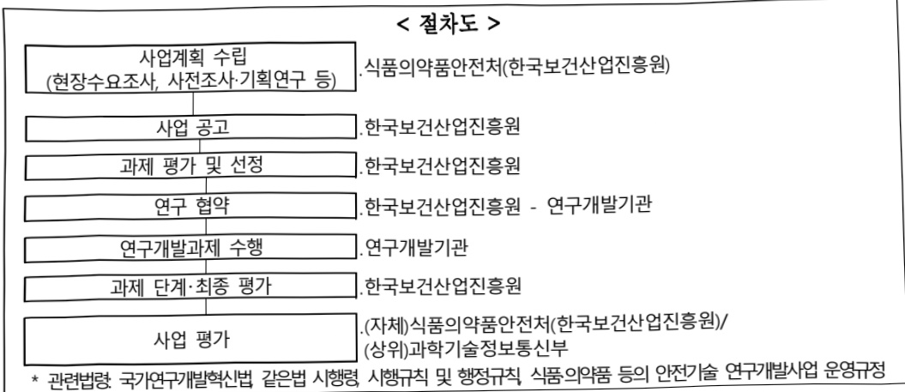

# AI 기반 독성예측 평가기술 개발연구(R&D)

**해당 페이지**: PDF 4501 ~ 4506 쪽 해당

**부처**: 식품의약품안전처
**분야**: 보건
**회계유형**: 일반회계
**2026 확정예산**: 5916.0 백만원
**전년대비 증감률**: None%
**AI 도메인**: 데이터, 의료/바이오

---

### 가. 예산 총괄표

(단위: 백만원, %)

<table border=1 style='margin: auto; word-wrap: break-word;'><tr><td rowspan="2">사업명</td><td rowspan="2">2024년 결산</td><td colspan="2">2025년 예산</td><td colspan="2">2026년</td><td rowspan="2">증감(B-A)</td><td rowspan="2">(B-A)/A</td></tr><tr><td style='text-align: center; word-wrap: break-word;'>본예산(A)</td><td style='text-align: center; word-wrap: break-word;'>추경</td><td style='text-align: center; word-wrap: break-word;'>요구</td><td style='text-align: center; word-wrap: break-word;'>예산(B)</td></tr><tr><td style='text-align: center; word-wrap: break-word;'>AI 기반 독성예측 평가기술 개발연구(R&amp;D)</td><td style='text-align: center; word-wrap: break-word;'>-</td><td style='text-align: center; word-wrap: break-word;'>-</td><td style='text-align: center; word-wrap: break-word;'>-</td><td style='text-align: center; word-wrap: break-word;'>5,916</td><td style='text-align: center; word-wrap: break-word;'>5,916</td><td style='text-align: center; word-wrap: break-word;'>5,916</td><td style='text-align: center; word-wrap: break-word;'>순증</td></tr></table>

□ 기능별(내역사업별) 예산 내역

(단위:백만원)

<table border=1 style='margin: auto; word-wrap: break-word;'><tr><td rowspan="3"></td><td colspan="5">2024</td><td colspan="7">2025</td><td rowspan="3">2026예산</td></tr><tr><td rowspan="2">예산액(추정)</td><td rowspan="2">예산현액</td><td rowspan="2">집행액[실집행액]</td><td rowspan="2">이월액</td><td rowspan="2">불용액</td><td rowspan="2">본예산</td><td rowspan="2">예산현액</td><td rowspan="2">집행액[실집행액]</td><td colspan="2">전년도아월액제외</td><td rowspan="2">이월액</td><td rowspan="2">불용액</td></tr><tr><td style='text-align: center; word-wrap: break-word;'>예산현액</td><td style='text-align: center; word-wrap: break-word;'>집행액[실집행액]</td></tr><tr><td style='text-align: center; word-wrap: break-word;'>○기능별 분류(합계)</td><td style='text-align: center; word-wrap: break-word;'>-</td><td style='text-align: center; word-wrap: break-word;'>-</td><td style='text-align: center; word-wrap: break-word;'>-</td><td style='text-align: center; word-wrap: break-word;'>-</td><td style='text-align: center; word-wrap: break-word;'>-</td><td style='text-align: center; word-wrap: break-word;'>-</td><td style='text-align: center; word-wrap: break-word;'>-</td><td style='text-align: center; word-wrap: break-word;'>-</td><td style='text-align: center; word-wrap: break-word;'>-</td><td style='text-align: center; word-wrap: break-word;'>-</td><td style='text-align: center; word-wrap: break-word;'>-</td><td style='text-align: center; word-wrap: break-word;'>-</td><td style='text-align: center; word-wrap: break-word;'>5,916</td></tr><tr><td style='text-align: center; word-wrap: break-word;'>·의료정보 연계통합 오믹스 기반의약품 부작용예측 평가 연구·통합 오믹스 AI기반 부작용 및 독성예측 평가기술 개발</td><td style='text-align: center; word-wrap: break-word;'>-</td><td style='text-align: center; word-wrap: break-word;'>-</td><td style='text-align: center; word-wrap: break-word;'>-</td><td style='text-align: center; word-wrap: break-word;'>-</td><td style='text-align: center; word-wrap: break-word;'>-</td><td style='text-align: center; word-wrap: break-word;'>-</td><td style='text-align: center; word-wrap: break-word;'>-</td><td style='text-align: center; word-wrap: break-word;'>-</td><td style='text-align: center; word-wrap: break-word;'>-</td><td style='text-align: center; word-wrap: break-word;'>-</td><td style='text-align: center; word-wrap: break-word;'>-</td><td style='text-align: center; word-wrap: break-word;'>4,216</td><td style='text-align: center; word-wrap: break-word;'>1,700</td></tr></table>

---

### 나. 사업설명자료

## 1 ) 사업목적·내용

- (AI 기반 독성예측 평가기술 개발연구) 의약품에 대한 기존 부작용(독성)평가 결과의 개인별 적용 한계 극복을 위해 국내 의약품 복용 환자 대상 의료기관의 빅데이터·AI를 활용한 부작용(독성)예측 평가기술 개발을 위한 연구를 지원하는 것임

- (의료정보 연계통합 오믹스 기반 의약품 부작용 예측 평가 연구) 한국인 환자 중심의 의약품 부작용 및 독성예측기술개발을 위한 기반 구축을 위해 환자 시료(혈액, 뇨, DNA 등) 수집을 통한 통합 오믹스 빅데이터 구축 연구를 지원하는 것임

- (통합 오믹스 AI 기반 부작용 및 독성 예측 평가기술 개발) 대사체 및 의료

빅데이터 기반 개인 맞춤형 독성예측평가 기술 확보를 위해 AI 기반 개인별 맞춤형

의약품 부작용(독성) 예측 평가 기술 개발 연구를 지원하는 것임

## 2 ) 사업개요

## □ 사업근거 및 추진경위

① 법령상 근거 및 시책

ㅇ 식품 · 의약품 등의 안전 및 제품화 지원에 관한 규제과학혁신법 제5조(규제과학혁신기본계획 수립) ① 식품의약품안전처장은 관계 중앙행정기관의 장과의 협의를 거쳐 5년마다 규제과학혁신을 위한 기본계획(이하 "기본계획"이라 하다)을 수립하여야 하다.

0 식품·의약품 등의 안전 및 제품화 지원에 관한 규제과학혁신법 제7조(연구개발사업의 추진) ① 식품의약품안전처장은 식품·의약품 등이 신속하게 제품화되어 국민이 안전하게 사용하는 데 필요한 새로운 평가기술·기준 및 방법 등의 과학적 근거를 개발하는 등 식품·의약품 등의 안전관리를 합리적으로 수행하기 위하여 필요한 연구개발사업(이하 “연구개발사업”이라 한다)을 한다.

◯ 식품·의약품 등의 안전 및 제품화 지원에 관한 규제과학혁신법 제8조(출연금)

① 식품의약품안전처장은 제7조제2항에 따른 연구를 수행하는 데 드는 비용을

충당하기 위하여 예산의 범위에서 연구개발기관에 출연금을 지급할 수 있다.

° 국정과제 25. 바이오 디지털헬스 글로벌 중심국가 도약 첨단기술 발전에 따른

맞춤형 규제체계 개선 및 데이터 활용체계 확대 강조, 의약품 허가 후 사용정보

---

수집·평가를 통한 사후관리체계 고도화, 데이터 구축을 통한 의료제품 맞춤형 전주기 안전관리체계 확립

0 제3차 보건의료기술육성기본계획('23~'27) 국민이 건강하고 행복한 삶의 유지를 위해 어디서나 필요한 서비스를 받을 수 있는 디지털 혁신·융복합 기술 기반 혁신 필요에 따라 데이터를 활용한 디지털 헬스케어 혁신, 비용효과적인 환자 중심 보건의료 기술 개발 등 커넥터드 헬스케어 기반 보편적 건강보장을 목표로 함(보건복지부, 과기정통부 등)

0 비이오·헬스 데이터 구축연계활용 지원 전략에 따른 R&D 지원·육성 강화(과기정통부 국가위원회 '24.5)

° 제4차 생명공학육성기본계획('23~'32) 바이오 대전환시대, 디지털융합·전략적 R&D·스케일업을 통해 2030 바이오경제 선도국으로 도약을 위하여 데이터 기반 바이오 융합연구 활성화 제시, 디지털 기반 안전관리시스템 구축 등 규제혁신을 통해 전문성 제고 및 바이오산업 경쟁력 강화(과기정통부, 보건복지부, 식약처 등)

0 제3차 제약산업 육성지원계획('23~27) AI·빅데이터 기술을 의약품 안전관리에 접목하여 환자안전 강화(환자의 임상·유전 정보 활용한 맞품형 위험도 평가시스템 구축으로 중증부작용 발생 30% 이상 감소)(과기정통부, 보건복지부 등)

o 제5차 과학기술 기본계획('23~'27) 주요 정책에서 현안 및 미래 문제 등 국가적 문제해결에 기여하기 위한 과학기술 역할 확대 강조로 초기 기반 확립 등을 정부의 역할로 제시, 100세 시대 과학기술 기반 국민건강 증진 목표 + 데이터 활용 바이오 연구개발 및 맞춤보건의료 촉진 등 목표(과기정통부, 보건복지부 등)

② 추진경위

ㅇ 신규사업 추진 관련 간담회('24.12., '25.1.)

- '26년 신규사업 추진을 위한 연구 중점추진 전략 등 논의

o 환자 의료정보 연계 통합 오믹스 기반 의약품 반응 예측평가기술 연구포럼 개최('25.2.)

°26년 신규사업 목표, 사업범위 및 세부내용, 국내외 연구 동향 발표 등을 통한 전문가 의견 청취 및 정보 교류

(현장의견) 통합 오믹스 AI 기반 개인 의약품 부작용 및 독성·반응 예측 연구의 선제적 추진으로 국제적 선도 필요

기존 국내 공급자 중심의 데이터 구축은 접근·확장·활용 한계가 있어 의약품 복용 특정 환자 대상 통합 오믹스 및 의료정보 등 종적 장기 의약품 부작용(독성)과 반응 추적 연구는 AI 바이오 분야에서 우리의 미래가 될수 있음.

---

① 사업규모

- 총사업비 : 해당없음

- 사업기간 : '26~'30

- 최근 5년 간 투입된 사업비

(단위:백만원)

<table border=1 style='margin: auto; word-wrap: break-word;'><tr><td style='text-align: center; word-wrap: break-word;'>연도</td><td style='text-align: center; word-wrap: break-word;'>2022</td><td style='text-align: center; word-wrap: break-word;'>2023</td><td style='text-align: center; word-wrap: break-word;'>2024</td><td style='text-align: center; word-wrap: break-word;'>2025</td><td style='text-align: center; word-wrap: break-word;'>2026</td></tr><tr><td style='text-align: center; word-wrap: break-word;'>사업비</td><td style='text-align: center; word-wrap: break-word;'>-</td><td style='text-align: center; word-wrap: break-word;'>-</td><td style='text-align: center; word-wrap: break-word;'>-</td><td style='text-align: center; word-wrap: break-word;'>-</td><td style='text-align: center; word-wrap: break-word;'>5,916</td></tr></table>

- 기타: 해당없음

## ② 사업추진체계

- 사업시행방법 : 출연

- 사업시행주체 : 식품의약품안전처(전문기관: 한국보건산업진흥원)

- 사업 수혜자 : 일반국민, 식품·의약품 등의 관련 학계, 업계 등

- 보조, 융자, 출연, 출자 등의 경우 보조·융자 등 지원 비율 및 법적근거

<table border=1 style='margin: auto; word-wrap: break-word;'><tr><td style='text-align: center; word-wrap: break-word;'>내역사업명</td><td style='text-align: center; word-wrap: break-word;'>구분</td><td style='text-align: center; word-wrap: break-word;'>피보조·피출연 등 기관명</td><td style='text-align: center; word-wrap: break-word;'>지원 금액 (2026예산)</td><td style='text-align: center; word-wrap: break-word;'>지원 비율(%)</td><td style='text-align: center; word-wrap: break-word;'>보조율 법적근거 (해당 조항)</td></tr><tr><td rowspan="4">의료정보 연계 통합 오믹스 기반의 약품 부작용 예측 평가 연구</td><td rowspan="4">출연</td><td style='text-align: center; word-wrap: break-word;'>대학, 졸연연 등바탕가관</td><td rowspan="4">4,216백만원</td><td style='text-align: center; word-wrap: break-word;'>100</td><td rowspan="8">• 식품·의약품 등의 안전 및 제품화 지원에 관한 규제과학혁신법 제8조제1항 • 국가연구개발혁신법 제13조제1항 및 동법 시행령 제19조제3항</td></tr><tr><td style='text-align: center; word-wrap: break-word;'>대기업, 공기업</td><td style='text-align: center; word-wrap: break-word;'>50</td></tr><tr><td style='text-align: center; word-wrap: break-word;'>중견기업</td><td style='text-align: center; word-wrap: break-word;'>70</td></tr><tr><td style='text-align: center; word-wrap: break-word;'>중소기업</td><td style='text-align: center; word-wrap: break-word;'>75</td></tr><tr><td rowspan="4">통합 오믹스 AI 기반 부작용 및 독성예측 평가기술 개발</td><td rowspan="4">줄연</td><td style='text-align: center; word-wrap: break-word;'>대학, 졸연연 등바탕가관</td><td rowspan="4">1,700백만원</td><td style='text-align: center; word-wrap: break-word;'>100</td></tr><tr><td style='text-align: center; word-wrap: break-word;'>대기업, 공기업</td><td style='text-align: center; word-wrap: break-word;'>50</td></tr><tr><td style='text-align: center; word-wrap: break-word;'>중견기업</td><td style='text-align: center; word-wrap: break-word;'>70</td></tr><tr><td style='text-align: center; word-wrap: break-word;'>중소기업</td><td style='text-align: center; word-wrap: break-word;'>75</td></tr></table>

## 3 )2026년도 예산 산출 근거

①의료정보 연계 통합 오믹스 기반 의약품 부작용 예측평가 연구

:(25)→(26)4,216백만원,순증

- (요구) 의료정보 연계 통합 오믹스 기반 의약품 부작용 예측평가 연구

: 한국인 사용 "의약품 중심"의 병원 기반 대규모 전향적·목적형 코호트 구축(국내 대규모 병원(4개) 기반 특정 의약품 사용 환자의 인체시료(혈액, 뇨 등) 및 임상정보 수집) 및 투약 전후 및 장기효과 전향적 연구, 의약품 부작용 예측평가를 위한 통합 오믹스 데이터 생산 및 임상데이터·통합오믹스 데이터간 연계를 통한 통합 DB 구축 및 지속 추적 체계 구축 등 연구를 위하여 4,216백만원 요구

- (산출) 1과제×5,621백만원×9/12개월=4,216백만원

## ②통합오믹스AI기반부작용및독성예측평가기술개발

:(25)→(26)1,700백만원,순증

- (요구) 코호트 데이터 정제·가공 및 저장 체계 구축 및 해외 바이오뱅크 데이터 확보·가공, 대사체·단백체·전사체·(후성)유전체 연관성 분석을 통한 의약품 부작용·반응성 예측 모델 구축, 한국인 의약품 특이적 대사체·단백체·전사체(후성)유전체 연관성 확인 AI 기반 개인 맞춤형 부작용 및 독성 예측평가 플랫폼 구축 등 연구를 위하여 1,700백만원 요구 1과제×2,267백만원×9/12개월=1,700백만원

---

## 4 ) 사업효과

□ 사업영향, 산출물 성과지표 등

① '22~'26년도 성과계획서 상 성과지표 및 최근 5년간 성과 달성도 : 해당사항없음

② 성과지표 이외의 연도별 사업추진 경과 및 실적 : 해당사항 없음

③ 향후(26년도 이후) 기대효과

· 대형 병원 기반 환자코호트에 대한 개인별 부작용 및 의약품 반응성 정보, 유전체, 전사체, 단백체, 대사체 정보 DB 구축

·통합 오믹스 데이터 기반 인공지능 적용 자료의 허가·심사 활용 안전성평가 가이드라인(안) 마련

개인맞춤형 의약품 처방을 통한 환자 치료효과 상승

치료효과 높은 개인맞춤형 의약품 개발을 통한 판매로 기업 이윤 창출 극대화 및 국가 보험 제정 건전화 기여

5)타당성조사 및 예비타당성조사 시행여부 및 결과 요지 : 해당없음

6) 총사업비 대상사업 여부 및 내역 : 해당없음

7) 사업 집행절차

8) 각종 평가 : 해당 없음

다.최근 4년간 결산내역 : 해당없음

---

<table border=1 style='margin: auto; word-wrap: break-word;'><tr><td style='text-align: center; word-wrap: break-word;'>사 업 명</td></tr><tr><td style='text-align: center; word-wrap: break-word;'>(80) AI응용제품 신속 상용화 지원사업(식품·의료기기 등)(7034-306)</td></tr></table>

사업 코드 정보

<table border=1 style='margin: auto; word-wrap: break-word;'><tr><td style='text-align: center; word-wrap: break-word;'>구분</td><td style='text-align: center; word-wrap: break-word;'>회계</td><td style='text-align: center; word-wrap: break-word;'>소관</td><td style='text-align: center; word-wrap: break-word;'>실국(기관)</td><td style='text-align: center; word-wrap: break-word;'>계정</td><td style='text-align: center; word-wrap: break-word;'>분야</td><td style='text-align: center; word-wrap: break-word;'>부문</td></tr><tr><td style='text-align: center; word-wrap: break-word;'>코드</td><td rowspan="2">일반회계</td><td rowspan="2">식품의약품안전처</td><td rowspan="2">의료기기안전국</td><td rowspan="2"></td><td style='text-align: center; word-wrap: break-word;'>090</td><td style='text-align: center; word-wrap: break-word;'>093</td></tr><tr><td style='text-align: center; word-wrap: break-word;'>명칭</td><td style='text-align: center; word-wrap: break-word;'>보건</td><td style='text-align: center; word-wrap: break-word;'>식품의약안전</td></tr></table>

<table border=1 style='margin: auto; word-wrap: break-word;'><tr><td style='text-align: center; word-wrap: break-word;'>구분</td><td style='text-align: center; word-wrap: break-word;'>프로그램</td><td style='text-align: center; word-wrap: break-word;'>단위사업</td><td style='text-align: center; word-wrap: break-word;'>세부사업</td></tr><tr><td style='text-align: center; word-wrap: break-word;'>코드</td><td style='text-align: center; word-wrap: break-word;'>프로그램코드(7000)</td><td style='text-align: center; word-wrap: break-word;'>단위사업코드(7034)</td><td style='text-align: center; word-wrap: break-word;'>세부사업코드(306)</td></tr><tr><td style='text-align: center; word-wrap: break-word;'>명칭</td><td style='text-align: center; word-wrap: break-word;'>식의약품 행정지원</td><td style='text-align: center; word-wrap: break-word;'>창의행정 활성화</td><td style='text-align: center; word-wrap: break-word;'>AI응용제품 신속 상용화 지원사업(식품·의료기기 등)</td></tr></table>

□ 사업 성격 (공통요구자료 Ⅱ-1 작성유의사항 4. 참조, 해당하는 사항에 “○” 표시)

<table border=1 style='margin: auto; word-wrap: break-word;'><tr><td style='text-align: center; word-wrap: break-word;'>신규</td><td style='text-align: center; word-wrap: break-word;'>계속</td><td style='text-align: center; word-wrap: break-word;'>완료</td><td style='text-align: center; word-wrap: break-word;'>예비타당성 실시여부</td><td style='text-align: center; word-wrap: break-word;'>총사업비 관리대상</td><td style='text-align: center; word-wrap: break-word;'>총액계상 예산사업</td><td style='text-align: center; word-wrap: break-word;'>사업소관 변경정보</td></tr><tr><td style='text-align: center; word-wrap: break-word;'>O</td><td style='text-align: center; word-wrap: break-word;'></td><td style='text-align: center; word-wrap: break-word;'></td><td style='text-align: center; word-wrap: break-word;'></td><td style='text-align: center; word-wrap: break-word;'></td><td style='text-align: center; word-wrap: break-word;'></td><td style='text-align: center; word-wrap: break-word;'></td></tr></table>

□ 사업 지원 형태 및 지원을 (최소한 한 개는 반드시 선택하시오. 해당사항에 0 표시)

<table border=1 style='margin: auto; word-wrap: break-word;'><tr><td style='text-align: center; word-wrap: break-word;'>직접</td><td style='text-align: center; word-wrap: break-word;'>출자</td><td style='text-align: center; word-wrap: break-word;'>출연</td><td style='text-align: center; word-wrap: break-word;'>보조</td><td style='text-align: center; word-wrap: break-word;'>융자</td><td style='text-align: center; word-wrap: break-word;'>국고보조율(%)</td><td style='text-align: center; word-wrap: break-word;'>융자율(%)</td></tr><tr><td style='text-align: center; word-wrap: break-word;'></td><td style='text-align: center; word-wrap: break-word;'></td><td style='text-align: center; word-wrap: break-word;'></td><td style='text-align: center; word-wrap: break-word;'>O</td><td style='text-align: center; word-wrap: break-word;'></td><td style='text-align: center; word-wrap: break-word;'>80</td><td style='text-align: center; word-wrap: break-word;'></td></tr></table>

## □ 사업 담당자

<table border=1 style='margin: auto; word-wrap: break-word;'><tr><td style='text-align: center; word-wrap: break-word;'>사업명</td><td colspan="2">구분</td></tr><tr><td rowspan="3">첨단 AI 기반 디지털 의료기기 신속제품화 지원사업</td><td rowspan="2">소관부처</td><td style='text-align: center; word-wrap: break-word;'>의료기기안전국</td></tr><tr><td style='text-align: center; word-wrap: break-word;'>의료기기정책과</td></tr><tr><td style='text-align: center; word-wrap: break-word;'>사업시행주체</td><td style='text-align: center; word-wrap: break-word;'>한국의료기기안전정보원</td></tr><tr><td rowspan="3">AI 식욕 이물검출기 개발지원 사업</td><td rowspan="2">소관부처</td><td style='text-align: center; word-wrap: break-word;'>식품소비안전국</td></tr><tr><td style='text-align: center; word-wrap: break-word;'>축산물안전정책과</td></tr><tr><td style='text-align: center; word-wrap: break-word;'>사업시행주체</td><td style='text-align: center; word-wrap: break-word;'>한국식품안전관리인증원</td></tr></table>

---

### 원본 PDF 크롭 이미지

