# 식의약품 안전정보체계 선진화(정보화)

**해당 페이지**: PDF 4513 ~ 4583 쪽 해당

**부처**: 식품의약품안전처
**분야**: 보건
**회계유형**: 일반
**2026 확정예산**: 17739.0 백만원
**전년대비 증감률**: 41.8%
**AI 도메인**: 데이터, 보안/사이버, 의료/바이오

---

<table border=1 style='margin: auto; word-wrap: break-word;'><tr><td style='text-align: center; word-wrap: break-word;'>사 업 명</td></tr><tr><td style='text-align: center; word-wrap: break-word;'>(77) 식의약품 안전정보체계 선진화(정보화) (7032-503)</td></tr></table>

□ 사업 코드 정보

<table border=1 style='margin: auto; word-wrap: break-word;'><tr><td style='text-align: center; word-wrap: break-word;'>구분</td><td style='text-align: center; word-wrap: break-word;'>회계</td><td style='text-align: center; word-wrap: break-word;'>소관</td><td style='text-align: center; word-wrap: break-word;'>실국(기관)</td><td style='text-align: center; word-wrap: break-word;'>계정</td><td style='text-align: center; word-wrap: break-word;'>분야</td><td style='text-align: center; word-wrap: break-word;'>부문</td></tr><tr><td style='text-align: center; word-wrap: break-word;'>코드</td><td rowspan="2">일반</td><td rowspan="2">식품의약품안전처</td><td rowspan="2">기획조정관</td><td rowspan="2"></td><td style='text-align: center; word-wrap: break-word;'>090</td><td style='text-align: center; word-wrap: break-word;'>093</td></tr><tr><td style='text-align: center; word-wrap: break-word;'>명칭</td><td style='text-align: center; word-wrap: break-word;'>보건</td><td style='text-align: center; word-wrap: break-word;'>식품의약안전</td></tr></table>

<table border=1 style='margin: auto; word-wrap: break-word;'><tr><td style='text-align: center; word-wrap: break-word;'>구분</td><td style='text-align: center; word-wrap: break-word;'>프로그램</td><td style='text-align: center; word-wrap: break-word;'>단위사업</td><td style='text-align: center; word-wrap: break-word;'>세부사업</td></tr><tr><td style='text-align: center; word-wrap: break-word;'>코드</td><td style='text-align: center; word-wrap: break-word;'>7000</td><td style='text-align: center; word-wrap: break-word;'>7032</td><td style='text-align: center; word-wrap: break-word;'>503</td></tr><tr><td style='text-align: center; word-wrap: break-word;'>명칭</td><td style='text-align: center; word-wrap: break-word;'>식의약품행정지원</td><td style='text-align: center; word-wrap: break-word;'>식의약품 정보화</td><td style='text-align: center; word-wrap: break-word;'>식의약품 안전정보체계 선진화(정보화)</td></tr></table>

□ 사업 성격 (공통요구자료 Ⅱ-1 작성유의사항 4. 참조, 해당하는 사항에 “○” 표시)

<table border=1 style='margin: auto; word-wrap: break-word;'><tr><td rowspan="2">신규</td><td rowspan="2">계속</td><td rowspan="2">완료</td><td rowspan="2">예비타당성 실시여부</td><td rowspan="2">총사업비 관리대상</td><td rowspan="2">총액계상 예산사업</td><td style='text-align: center; word-wrap: break-word;'>사업소관 변경정보</td></tr><tr><td style='text-align: center; word-wrap: break-word;'>2025예산 시 소관</td></tr><tr><td style='text-align: center; word-wrap: break-word;'></td><td style='text-align: center; word-wrap: break-word;'>○</td><td style='text-align: center; word-wrap: break-word;'></td><td style='text-align: center; word-wrap: break-word;'></td><td style='text-align: center; word-wrap: break-word;'></td><td style='text-align: center; word-wrap: break-word;'></td><td style='text-align: center; word-wrap: break-word;'></td></tr></table>

사업 지원 형태 및 지원을 (최소한 한 개는 반드시 선택하시오. 해당사항에 O 표시)

<table border=1 style='margin: auto; word-wrap: break-word;'><tr><td style='text-align: center; word-wrap: break-word;'>직접</td><td style='text-align: center; word-wrap: break-word;'>출자</td><td style='text-align: center; word-wrap: break-word;'>출연</td><td style='text-align: center; word-wrap: break-word;'>보조</td><td style='text-align: center; word-wrap: break-word;'>융자</td><td style='text-align: center; word-wrap: break-word;'>국고보조율(%)</td><td style='text-align: center; word-wrap: break-word;'>융자율(%)</td></tr><tr><td style='text-align: center; word-wrap: break-word;'>○</td><td style='text-align: center; word-wrap: break-word;'></td><td style='text-align: center; word-wrap: break-word;'></td><td style='text-align: center; word-wrap: break-word;'></td><td style='text-align: center; word-wrap: break-word;'></td><td style='text-align: center; word-wrap: break-word;'></td><td style='text-align: center; word-wrap: break-word;'></td></tr></table>

## □ 사업 담당자

<table border=1 style='margin: auto; word-wrap: break-word;'><tr><td style='text-align: center; word-wrap: break-word;'>사업명</td><td colspan="2">구분</td></tr><tr><td rowspan="2">식의약품안전정보체계선진화(정보화)</td><td rowspan="2">소관부처</td><td style='text-align: center; word-wrap: break-word;'>기획조정관</td></tr><tr><td style='text-align: center; word-wrap: break-word;'>정보화담당관</td></tr></table>

---

### 가.예산 총괄표

(단위: 백만원, %)

<table border=1 style='margin: auto; word-wrap: break-word;'><tr><td rowspan="2">사업명</td><td rowspan="2">2024년 결산</td><td colspan="2">2025년 예산</td><td colspan="2">2026년</td><td rowspan="2">중감(B-A)</td><td rowspan="2">(B-A)/A</td></tr><tr><td style='text-align: center; word-wrap: break-word;'>본예산(A)</td><td style='text-align: center; word-wrap: break-word;'>추경</td><td style='text-align: center; word-wrap: break-word;'>요구</td><td style='text-align: center; word-wrap: break-word;'>예산(B)</td></tr><tr><td style='text-align: center; word-wrap: break-word;'>식의약품 안전정보체계 선진화(정보화)</td><td style='text-align: center; word-wrap: break-word;'>14,926</td><td style='text-align: center; word-wrap: break-word;'>12,512</td><td style='text-align: center; word-wrap: break-word;'>13,820</td><td style='text-align: center; word-wrap: break-word;'>17,739</td><td style='text-align: center; word-wrap: break-word;'>17,739</td><td style='text-align: center; word-wrap: break-word;'>5,227</td><td style='text-align: center; word-wrap: break-word;'>41.8</td></tr></table>

□ 기능별(내역사업별) 예산 내역

(단위:백만원)

<table border=1 style='margin: auto; word-wrap: break-word;'><tr><td rowspan="3"></td><td colspan="5">2024</td><td colspan="7">2025</td><td rowspan="3">2026 예산</td></tr><tr><td rowspan="2">예산액 (추경)</td><td rowspan="2">예산 현액</td><td rowspan="2">집행액 [실집 행액]</td><td rowspan="2">이일액</td><td rowspan="2">불용액</td><td rowspan="2">본예산</td><td rowspan="2">예산 현액</td><td rowspan="2">집행액 [실집 행액]</td><td colspan="2">전년도 이일액 제외</td><td rowspan="2">이일액</td><td rowspan="2">불용액</td></tr><tr><td style='text-align: center; word-wrap: break-word;'>예산 현액</td><td style='text-align: center; word-wrap: break-word;'>집행액 [실집 행액]</td></tr><tr><td style='text-align: center; word-wrap: break-word;'>○ 기능별 분류(합계)</td><td style='text-align: center; word-wrap: break-word;'>15,281</td><td style='text-align: center; word-wrap: break-word;'>15,281</td><td style='text-align: center; word-wrap: break-word;'>14,926</td><td style='text-align: center; word-wrap: break-word;'>-</td><td style='text-align: center; word-wrap: break-word;'>355</td><td style='text-align: center; word-wrap: break-word;'>12,512</td><td style='text-align: center; word-wrap: break-word;'>13,820</td><td style='text-align: center; word-wrap: break-word;'>13,212</td><td style='text-align: center; word-wrap: break-word;'>13,820</td><td style='text-align: center; word-wrap: break-word;'>13,212</td><td style='text-align: center; word-wrap: break-word;'>518</td><td style='text-align: center; word-wrap: break-word;'>90</td><td style='text-align: center; word-wrap: break-word;'>17,739</td></tr><tr><td style='text-align: center; word-wrap: break-word;'>· 의약품  하가심사 자동화체계 구축</td><td style='text-align: center; word-wrap: break-word;'>-</td><td style='text-align: center; word-wrap: break-word;'>-</td><td style='text-align: center; word-wrap: break-word;'>-</td><td style='text-align: center; word-wrap: break-word;'>-</td><td style='text-align: center; word-wrap: break-word;'>-</td><td style='text-align: center; word-wrap: break-word;'>317</td><td style='text-align: center; word-wrap: break-word;'>317</td><td style='text-align: center; word-wrap: break-word;'>316</td><td style='text-align: center; word-wrap: break-word;'>317</td><td style='text-align: center; word-wrap: break-word;'>316</td><td style='text-align: center; word-wrap: break-word;'>-</td><td style='text-align: center; word-wrap: break-word;'>1</td><td style='text-align: center; word-wrap: break-word;'>8,010</td></tr><tr><td style='text-align: center; word-wrap: break-word;'>· 식품정보시스템 구축 ISP</td><td style='text-align: center; word-wrap: break-word;'>-</td><td style='text-align: center; word-wrap: break-word;'>-</td><td style='text-align: center; word-wrap: break-word;'>-</td><td style='text-align: center; word-wrap: break-word;'>-</td><td style='text-align: center; word-wrap: break-word;'>-</td><td style='text-align: center; word-wrap: break-word;'>-</td><td style='text-align: center; word-wrap: break-word;'>-</td><td style='text-align: center; word-wrap: break-word;'>-</td><td style='text-align: center; word-wrap: break-word;'>-</td><td style='text-align: center; word-wrap: break-word;'>-</td><td style='text-align: center; word-wrap: break-word;'>-</td><td style='text-align: center; word-wrap: break-word;'>-</td><td style='text-align: center; word-wrap: break-word;'>877</td></tr><tr><td style='text-align: center; word-wrap: break-word;'>· 규제과학인재원 운영 플랫폼 구축 ISP</td><td style='text-align: center; word-wrap: break-word;'>-</td><td style='text-align: center; word-wrap: break-word;'>-</td><td style='text-align: center; word-wrap: break-word;'>-</td><td style='text-align: center; word-wrap: break-word;'>-</td><td style='text-align: center; word-wrap: break-word;'>-</td><td style='text-align: center; word-wrap: break-word;'>-</td><td style='text-align: center; word-wrap: break-word;'>-</td><td style='text-align: center; word-wrap: break-word;'>-</td><td style='text-align: center; word-wrap: break-word;'>-</td><td style='text-align: center; word-wrap: break-word;'>-</td><td style='text-align: center; word-wrap: break-word;'>-</td><td style='text-align: center; word-wrap: break-word;'>-</td><td style='text-align: center; word-wrap: break-word;'>274</td></tr><tr><td style='text-align: center; word-wrap: break-word;'>· 식품안전디지털 유통망 구축</td><td style='text-align: center; word-wrap: break-word;'>4,378</td><td style='text-align: center; word-wrap: break-word;'>4,378</td><td style='text-align: center; word-wrap: break-word;'>4,183</td><td style='text-align: center; word-wrap: break-word;'>-</td><td style='text-align: center; word-wrap: break-word;'>195</td><td style='text-align: center; word-wrap: break-word;'>2,370</td><td style='text-align: center; word-wrap: break-word;'>2,370</td><td style='text-align: center; word-wrap: break-word;'>2,352</td><td style='text-align: center; word-wrap: break-word;'>2,370</td><td style='text-align: center; word-wrap: break-word;'>2,352</td><td style='text-align: center; word-wrap: break-word;'>-</td><td style='text-align: center; word-wrap: break-word;'>18</td><td style='text-align: center; word-wrap: break-word;'>1,380</td></tr><tr><td style='text-align: center; word-wrap: break-word;'>· 식의약 데이터플랫폼 구축</td><td style='text-align: center; word-wrap: break-word;'>1,745</td><td style='text-align: center; word-wrap: break-word;'>1,745</td><td style='text-align: center; word-wrap: break-word;'>1,944</td><td style='text-align: center; word-wrap: break-word;'>-</td><td style='text-align: center; word-wrap: break-word;'>3</td><td style='text-align: center; word-wrap: break-word;'>739</td><td style='text-align: center; word-wrap: break-word;'>739</td><td style='text-align: center; word-wrap: break-word;'>729</td><td style='text-align: center; word-wrap: break-word;'>739</td><td style='text-align: center; word-wrap: break-word;'>729</td><td style='text-align: center; word-wrap: break-word;'>-</td><td style='text-align: center; word-wrap: break-word;'>10</td><td style='text-align: center; word-wrap: break-word;'>530</td></tr><tr><td style='text-align: center; word-wrap: break-word;'>· 수입식품통합시스템 구축·운영</td><td style='text-align: center; word-wrap: break-word;'>1,947</td><td style='text-align: center; word-wrap: break-word;'>1,947</td><td style='text-align: center; word-wrap: break-word;'>1,656</td><td style='text-align: center; word-wrap: break-word;'>-</td><td style='text-align: center; word-wrap: break-word;'>89</td><td style='text-align: center; word-wrap: break-word;'>1,435</td><td style='text-align: center; word-wrap: break-word;'>1,435</td><td style='text-align: center; word-wrap: break-word;'>1,419</td><td style='text-align: center; word-wrap: break-word;'>1,435</td><td style='text-align: center; word-wrap: break-word;'>1,419</td><td style='text-align: center; word-wrap: break-word;'>-</td><td style='text-align: center; word-wrap: break-word;'>16</td><td style='text-align: center; word-wrap: break-word;'>1,633</td></tr><tr><td style='text-align: center; word-wrap: break-word;'>· 의약품통합정보시스템 구축·운영</td><td style='text-align: center; word-wrap: break-word;'>2,401</td><td style='text-align: center; word-wrap: break-word;'>2,401</td><td style='text-align: center; word-wrap: break-word;'>2,386</td><td style='text-align: center; word-wrap: break-word;'>-</td><td style='text-align: center; word-wrap: break-word;'>15</td><td style='text-align: center; word-wrap: break-word;'>2,493</td><td style='text-align: center; word-wrap: break-word;'>2,493</td><td style='text-align: center; word-wrap: break-word;'>2,481</td><td style='text-align: center; word-wrap: break-word;'>2,493</td><td style='text-align: center; word-wrap: break-word;'>2,481</td><td style='text-align: center; word-wrap: break-word;'>-</td><td style='text-align: center; word-wrap: break-word;'>12</td><td style='text-align: center; word-wrap: break-word;'>2,443</td></tr><tr><td style='text-align: center; word-wrap: break-word;'>· 위기대응 의료제품 시스템 구축·운영</td><td style='text-align: center; word-wrap: break-word;'>1,719</td><td style='text-align: center; word-wrap: break-word;'>1,719</td><td style='text-align: center; word-wrap: break-word;'>1,718</td><td style='text-align: center; word-wrap: break-word;'>-</td><td style='text-align: center; word-wrap: break-word;'>1</td><td style='text-align: center; word-wrap: break-word;'>833</td><td style='text-align: center; word-wrap: break-word;'>833</td><td style='text-align: center; word-wrap: break-word;'>824</td><td style='text-align: center; word-wrap: break-word;'>833</td><td style='text-align: center; word-wrap: break-word;'>824</td><td style='text-align: center; word-wrap: break-word;'>-</td><td style='text-align: center; word-wrap: break-word;'>9</td><td style='text-align: center; word-wrap: break-word;'>468</td></tr><tr><td style='text-align: center; word-wrap: break-word;'>· 첨단바이오의약품 장기추적조사시스템 구축·운영</td><td style='text-align: center; word-wrap: break-word;'>553</td><td style='text-align: center; word-wrap: break-word;'>553</td><td style='text-align: center; word-wrap: break-word;'>546</td><td style='text-align: center; word-wrap: break-word;'>-</td><td style='text-align: center; word-wrap: break-word;'>7</td><td style='text-align: center; word-wrap: break-word;'>359</td><td style='text-align: center; word-wrap: break-word;'>359</td><td style='text-align: center; word-wrap: break-word;'>357</td><td style='text-align: center; word-wrap: break-word;'>359</td><td style='text-align: center; word-wrap: break-word;'>357</td><td style='text-align: center; word-wrap: break-word;'>-</td><td style='text-align: center; word-wrap: break-word;'>2</td><td style='text-align: center; word-wrap: break-word;'>359</td></tr><tr><td style='text-align: center; word-wrap: break-word;'>· 의료기기통합 시스템 구축·운영</td><td style='text-align: center; word-wrap: break-word;'>1,746</td><td style='text-align: center; word-wrap: break-word;'>1,746</td><td style='text-align: center; word-wrap: break-word;'>1,711</td><td style='text-align: center; word-wrap: break-word;'>-</td><td style='text-align: center; word-wrap: break-word;'>35</td><td style='text-align: center; word-wrap: break-word;'>1,337</td><td style='text-align: center; word-wrap: break-word;'>2,645</td><td style='text-align: center; word-wrap: break-word;'>2,106</td><td style='text-align: center; word-wrap: break-word;'>2,645</td><td style='text-align: center; word-wrap: break-word;'>2,106</td><td style='text-align: center; word-wrap: break-word;'>518</td><td style='text-align: center; word-wrap: break-word;'>21</td><td style='text-align: center; word-wrap: break-word;'>1,765</td></tr><tr><td style='text-align: center; word-wrap: break-word;'>· 정보보호 및 정보 통신기반 강화</td><td style='text-align: center; word-wrap: break-word;'>486</td><td style='text-align: center; word-wrap: break-word;'>486</td><td style='text-align: center; word-wrap: break-word;'>486</td><td style='text-align: center; word-wrap: break-word;'>-</td><td style='text-align: center; word-wrap: break-word;'>0</td><td style='text-align: center; word-wrap: break-word;'>2,629</td><td style='text-align: center; word-wrap: break-word;'>2,629</td><td style='text-align: center; word-wrap: break-word;'>2,628</td><td style='text-align: center; word-wrap: break-word;'>2,629</td><td style='text-align: center; word-wrap: break-word;'>2,628</td><td style='text-align: center; word-wrap: break-word;'>-</td><td style='text-align: center; word-wrap: break-word;'>1</td><td style='text-align: center; word-wrap: break-word;'>-</td></tr><tr><td style='text-align: center; word-wrap: break-word;'>· 실험동물자원은행 운영시스템 고도화</td><td style='text-align: center; word-wrap: break-word;'>306</td><td style='text-align: center; word-wrap: break-word;'>306</td><td style='text-align: center; word-wrap: break-word;'>296</td><td style='text-align: center; word-wrap: break-word;'>-</td><td style='text-align: center; word-wrap: break-word;'>10</td><td style='text-align: center; word-wrap: break-word;'>-</td><td style='text-align: center; word-wrap: break-word;'>-</td><td style='text-align: center; word-wrap: break-word;'>-</td><td style='text-align: center; word-wrap: break-word;'>-</td><td style='text-align: center; word-wrap: break-word;'>-</td><td style='text-align: center; word-wrap: break-word;'>-</td><td style='text-align: center; word-wrap: break-word;'>-</td><td style='text-align: center; word-wrap: break-word;'>-</td></tr></table>

---

### 나. 사업설명자료

## 1 ) 사업목적·내용

- 식의약품 민원서비스 개선, 업무처리 효율화, 대국민 정보제공 강화 및 시스템 활성화 등을 위한 정보시스템 구축 및 성능개선을 추진하여 식의약품 안전정보체계 선진화

(식품 안전 정보화) 국가 식품안전정보를 통합 구축하고 과학적 행정 및 대국민 정보제공

(의료제품 안전 전산화) 국제기준에 조화하고 의료제품 전주기 안전관리 및 대국민 정보제공

(정보보호) 정보보호 예방·대응 능력 강화를 위한 사이버안전센터 운영 및 기반 지원

## 2 ) 사업개요

## □ 사업근거 및 추진경위

① 법령상 근거

-「지능정보화 기본법」 제14조(공공지능정보화의 추진)

· 국가기관 등은 공공서비스의 지능정보화를 도모하고 국민 편의 증진 등을 위하여 행정, 보건, 사회복지, 교육, 문화, 환경, 과학기술, 재난안전, 치안, 국방, 에너지 등 소관 업무에 지능정보화(이하 “공공지능 정보화”라 한다)를 추진하여야 한다.

국가기관 등은 공공지능정보화를 효율적으로 추진하기 위하여 필요한 방안을 마련하여야 한다.

- 「식품안전기본법」 제24조의2(통합식품안전정보망 구축·운영)

- 「수입식품안전관리 특별법」 제39조의2(수입식품통합정보시스템의 구축·운영)

- 「약사법」 제83조의5(의약품통합정보시스템의 구축·운영 등)

- 「마약류관리에 관한 법률」 제11조의3(마약류통합관리시스템의 구축·운영)

- 「의료기기법」 제31조의3(의료기기통합정보시스템 구축 등)

- 「국가사이버안전관리규정」 제4조(사이버안전 확보의 책무), 제10조의 2(보안관제센터의 설·운영)

## ② 추진경위

- 민원서비스 증진과 행정업무 효율화를 위해 ‘식의약품종합정보시스템’ 고도화 추진

· 참여정부 전자정부 31대 과제로 '식의약품종합정보서비스 구축' 사업 선정

(정부혁신지방분권위원회, '03.10) 및 단계적 사업추진('05~08)

※ '05년 식품 → '06년 의약품 → '07년 의료기기 → '08년 식품나라

- 정보기술아키텍처(EA) 고도화

---

「정보시스템의 효율적 도입 및 운영 등에 관한 법률」에 따라 행정기관의 정보기술아키텍처 도입 의무화('06.7)

· 정보기술아키텍처 기반구축 및 정보화전략계획 수립('08)

· 정보기술아키텍처 현행화 및 고도화 추진('10~12)

## - 정보보호 및 정보통신기반 강화

· 중요 전자문서의 '위 · 변조 방지', '개인정보 접근기록 분석' 등 정보보호 환경 강화('13~21)

24시간 365일 사이버 침해사고 대응을 위한 사이버관제 및 로 식의약품 정보자산 안정적 운영('17~'21)

## -통합식품안전정보망 구축

· 부처별 분산된 식품안전 관련 정보를 통합하여 내부적으로는 각 부처 정책에 활용하고 외부적으로 국민에게 종합적인 식품안전 정보 제공을 위해 시스템 구축('14~'15)

※ 국정과제(79, 먹을거리 관리로 식품안전 신뢰 제고)

## - 식품이력추적관리시스템 고도화

· 식품이력추적 의무화('14.12)로 단계별(4단계, '14~17) 대상 업체 확대에 따른 업무를 지원하고 유관기관 이력정보 연계·공유 등을 위해 고도화 추진('14~16)

## - 실험실정보관리시스템(LIMS) 통합

업무 절차가 유사한 다수의 실험실정보관리시스템(LIMS)을 통합하여 코드

표준화 및 상호 운용성 확보 등을 통한 운영관리의 효율성 증대('15)

## - 인체조직안전관리통합전산망 구축

· 인체조직은행의 인체조직 채취·가공·보관·분배·이식 전주기에 대한 이력정보 및 허가

정보, 지도·감독 정보를 통합 관리하는 시스템 구축('15)

- 식중독 원인규명의 국제적 패러다임을 반영한 유전체 정보 기반의 정보시스템 구축

·유전체정보 기반의 식중독 원인조사를 위한 정보화전략계획 수립('19)

·식품·환자·환경의 분리주간의 비교·분석으로 식중독 원인균 및 원인식품의 신속 규명('20)

-식품 및 의료제품에 포함된 유해물질이 인체에 미치는 영향을 종합적으로 평가

할 수 있는 인체위해성평가 관리시스템 구축

· 제품군 분류정보 및 자료를 정비하고 개별 제품의 위해성평가 관리체계 구축('20)

## - 의료기기 표준코드 기반 통합정보시스템 구축

· 의료기기 식별 표준코드를 도입, 허가부터 유통·사용까지 전주기 관리체계를

---

마련하여 신속·정확한 의료기기통합관리시스템 실현('19~,24)

- 국제기준과 조화하는 의약품안전관리를 위한 정보관리체계 구축

· 의약품 식별체계와 이상사례 용어·관리항목을 국제 표준화하고 임상부터 사후 관리까지 정보추적이 가능한 안전관리 구현('18~'19)

· 종이 없는 e-허가증 체계 마련으로 민원처리 효율성을 제고하고 의료 공공성

확보를 위해 국가필수의약품의 공급중단 관리시스템 구축('20)

- 데이터 기반 과학적인 먹거리 안전관리 지원을 위한 식품분야 정보화 추진

· 환경, 공간 등 식품안전 연관정보 활용, 식품위해 사전대응('19~'24)

·단순업무 자동화 및 최신 IT기술을 접목한 수입식품검사 지능화 구현('19~,24)

- 식품안전정보 손쉬운 확인 및 식품안전 이슈 신속 대응 등 식품안전 디지털 유통망 구축 정보화전략계획(ISP) 수립('23)

- 식품안전 디지털 유통망 구축('24)

·푸드QR 표시 등 식품 표시체계와 식품 전주기 정보를 표준화된 데이터로 제공

·디지털 환경 속 식품 소비자 선택권 보장 및 산업체의 산업 경쟁력 제고

- 의약품 등 허가심사 자동화 체계 구축 정보화전략계획 수립('25)

·허가·심사업무자동화를통해인력부족문제를해소하고신속한허가로제약·

바이오 창고 창고 창고 창고 창고 창고 창고 창고 창고 창고 창고 창고 창고 창고 창고 창고 창고 창고 창고 창고 창고 창고 창고 창고 창고 창고 창고 창고 창고 창고 창고 창고 창고 창고 창고 창고 창고 창고 창고 창고 창고 창고 창고 창고 창고 창고 창고 창고 창고 창고 창고 창고 창고 창고 창고 창고 창고 창고 창고 창고 창고 창고 창고 창고 창고 창고 창고 창고 창고 창고 창고 창고 창고 창고 창고 창고 창고 창고 창고 창고 창고 창고 창고 창고 창고 창고 창고 창고 창고 창고 창고 창고 창고 창고 창고 창고 창고 창고 창고 창고 창고 창고 창고 창고 창고 창고 창고 창고 창고 창고 창고 창고 창고 창고 창고 창고 창고 창고 창고 창고 창고 창고 창고 창고 창고 창고 창고 창고 창고 창고 창고 창고 창고 창고 창고 창고 창고 창고 창고 창고 창고 창고 창고 창고 창고 창고 창고 창고 창고 창고 창고 창고 창고 창고 창고 창고 창고 창고 창고 창고 창고 창고 창고 창고 창고 창고 창고 창고 창고 창고 창고 창고 창고 창고 창고 창고 창고 창고 창고 창고 창고 창고 창고 창고 창고 창고 창고 창고 창고 창고 창고 창고 창고 창고 창고 창고 창고 창고 창고 창고 창고 창고 창고 창고 창고 창고 창고 창고 창고 창고 창고 창고 창고 창고 창고 창고 창고 창고 창고 창고 창고 창고 창고 창고 창고 창고 창고 창고 창고 창고 창고 창고 창고 창고 창고 창고 창고 창고 창고 창고 창고 창고 창고 창고 창고 창고 창고 창고 창고 창고 창고 창고 창고 창고 창고 창고 창고 창고 창고 창고 창고 창고 창고 창고 창고 창고 창고 창고 창고 창고 창고 창고 창고 창고 창고 창고 창고 창고 창고 창고 창고 창고 창고 창고 창고 창고 창고 창고 창고 창고 창고 창고 창고 창고 창고 창고 창고 창고 창고 창고 창고 창고 창고 창고 창고 창고 창고 창고 창고 창고 창고 창고 창고 창고 창고 창고 창고 창고 창고 창고 창고 창고 창고 창고 창고 창고 창고 창고 창고 창고 창고 창고 창고 창고 창고 창고 창고 창고 창고 창고 창고 창고 창고 창고 창고 창고 창고 창고 창고 창고 창고 창고 창고 창고 창고 창고 창고 창고 창고 창고 창고 창고 창고 창고 창고 창고 창고 창고 창고 창고 창고 창고 창고 창고 창고 창고 창고 창고 창고 창고 창고 창고 창고 창고 창고 창고 창고 창고 창고 창고 창고 창고 창고 창고 창고 창고 창고 창고 창고 창고 창고 창고 창고 창고 창고 창고 창고 창고 창고 창고 창고 창고 창고 창고 창고 창고 창고 창고 창고 창고 창고 창고 창고 창고 창고 창고 창고 창고 창고 창고 창고 창고 창고 창고 창고 창고 창고 창고 창고 창고 창고 창고 창고 창고 창고 창고 창고 창고 창고 창고 창고 창고 창고 창고 창고 창고 창고 창고 창고 창고 창고 창고 창고 창고 창고 창고 창고 창고 창고 창고 창고 창고 창고 창고 창고 창고 창고 창고 창고 창고 창고 창고 창고 창고 창고 창고 창고 창고 창고 창고 창고 창고 창고 창고 창고 창고 창고 창고 창고 창고 창고 창고 창고 창고 창고 창고 창고 창고 창고 창고 창고 창고 창고 창고 창고 창고 창고 창고 창고 창고 창고 창고 창고 창고 창고 창고 창고 창고 창고 창고 창고 창고 창고 창고 창고 창고 창고 창고 창고 창고 창고 창고 창고 창고 창고 창고 창고 창고 창고 창고 창고 창고 창고 창고 창고 창고 창고 창고 창고 창고 창고 창고 창고 창고 창고 창고 창고 창고 창고 창고 창고 창고 창고 창고 창고 창고 창고 창고 창고 창고 창고 창고 창고 창고 창고 창고 창고 창고 창고 창고 창고 창고 창고 창고 창고 창고 창고 창고 창고 창고 창고 창고 창고 창고 창고 창고 창고 창고 창고 창고 창고 창고 창고 창고 창고 창고 창고 창고 창고 창고 창고 창고 창고 창고 창고 창고 창고 창고 창고 창고 창고 창고 창고 창고 창고 창고 창고 창고 창고 창고 창고 창고 창고 창고 창고 창고 창고 창고 창고 창고 창고 창고 창고 창고 창고 창고 창고 창고 창고 창고 창고 창고 창고 창고 창고 창고 창고 창고 창고 창고 창고 창고 창고 창고 창고 창고 창고 창고 창고 창고 창고 창고 창고 창고 창고 창고 창고 창고 창고 창고 창고 창고 창고 창고 창고 창고 창고 창고 창고 창고 창고 창고 창고 창고 창고 창고 창고 창고 창고 창고 창고 창고 창고 창고 창고 창고 창고 창고 창고 창고 창고 창고 창고 창고 창고 창고 창고 창고 창고 창고 창고 창고 창고 창고 창고 창고 창고 창고 창고 창고 창고 창고 창고 창고 창고 창고 창고 창고 창고 창고 창고 창고 창고 창고 창고 창고 창고 창고 창고 창고 창고 창고 창고 창고 창고 창고 창고 창고 창고 창고 창고 창고 창고 창고 창고 창고 창고 창고 창고 창고 창고 창고 창고 창고 창고 창고 창고 창고 창고 창고 창고 창고 창고 창고 창고 창고 창고 창고 창고 창고 창고 창고 창고 창고 창고 창고 창고 창고 창고 창고 

## □ 주요내용

① 사업규모

- 총사업비(해당되는 경우에만 기재) : 해당없음

- 사업기간 : '98년 ~ 계속

- 최근 5년 간 투입된 사업비(예산액기준, 추경편성한 연도에는 추경포함)

<table border=1 style='margin: auto; word-wrap: break-word;'><tr><td style='text-align: center; word-wrap: break-word;'>$ \underline{\text{所}} $</td><td style='text-align: center; word-wrap: break-word;'>2022</td><td style='text-align: center; word-wrap: break-word;'>2023</td><td style='text-align: center; word-wrap: break-word;'>2024</td><td style='text-align: center; word-wrap: break-word;'>2025</td><td style='text-align: center; word-wrap: break-word;'>2026</td></tr><tr><td style='text-align: center; word-wrap: break-word;'>$ \underline{\text{사}} $</td><td style='text-align: center; word-wrap: break-word;'>15,879</td><td style='text-align: center; word-wrap: break-word;'>13,602</td><td style='text-align: center; word-wrap: break-word;'>15,281</td><td style='text-align: center; word-wrap: break-word;'>13,820</td><td style='text-align: center; word-wrap: break-word;'>17,739</td></tr></table>

- 기타: 해당없음

② 사업추진체계

- 사업시행방법 : 직접수행

- 사업시행주체 : 식품의약품안전처

- 사업 수혜자 : 국민, 민원인, 공무원

- 보조, 융자, 출연, 출자 등의 경우 보조·융자 등 지원 비율 및 법적근거 : 해당 없음

---

3) 2026년도 예산 산출 근거

(1) 의약품 AI 심사 및 산업지원 체계 구축 : 8,010백만원

## □ 목적

°바이오·디지털헬스 제품 등에 대한 효율적인 심층 심사 업무 수행 및 글로벌 수준의

규제·산업 경쟁력 확보를 위한 허가·심사 업무 자동화 체계 마련 추진

국정과제 전략 3 : 혁신으로 도약하는 산업 르네상스

*실천과제32.의료AI·제약·바이오헬스강국실현

새정부경제성장전략AI대전환을위한15대선도프로젝트

* (공공 부문) AI 신약심사 : "신약 등 허가 심사기간 대폭 단축"

의약품 안전관리 제2차 종합계획 2-7. 인공지능 활용 의약품 허가심사 효율화 기반 구축

* 약사법 제83조의5(의약품 안전관리 종합계획 등)

국제기준 WHO 우수규제기관 목록(MLA) 등재 추진을 통한 해외수출지원 및 규제 선진화

## □필요성

√ 바이오헬스 산업 육성 및 수출지원·규제 선진화를 위한 허가·심사 역량 강화 필요

* 글로벌 바이오의약품 시장: ('23년) 663조 → ('29년) 1,113조

✓ 전문성이 필요한 고난도 심사 수요는 폭발적으로 증가하고 단순 민원에서 허가·심사

까지 의약품 민원은 연간 10만 건 이상이나 심사 전문인력은 만성적으로 부족한 상황

* '18년 대비 '23년 신약등 심사건수는 2배 증가(1,979→3,839), 연구관은 3명 증가(64→67)

신약 허가 1건 자료량은 평균 28만 쪽 분량(최대 50만여 쪽, 아파트 9~15층 높이)

** 심사관 인력(명): ('24년) 285 / (적정) 499 ⇒ 만성적인 부족 상황

→ AI·자동화 기반 신속 허가 지원으로 글로벌 제약·바이오 채용 시장 선정 및 환자 치료

기회 확대 등 "의약품 AI 심사 및 산업 지원체계 구축" 시급

*의약품등허가·심사자동화체계전환을위한정보화전략계획(ISP)수립('25.3~8월)

국가 핵심전략 산업으로 육성 중인 제약·바이오헬스 제품의 혁신 성장을 지속하기 위해 식약처의 허가·심사 역량 강화 필요

- 제약·바이오헬스 제품은 허가·심사를 통해 최종 시장에 진입하는 만큼 식약처의 전문

허가·심사 역량은 제품의 경쟁력 및 품질과 직결

* 국내 바이오헬스 산업은 바이오의약품 생산능력(세계 2위), 임상시험 글로벌 점유율(세계 5위, 8.9%) 등 세계시장을 선도할 잠재력 보유

-식약처는 세계보건기구(WHO) 의약품 우수규제기관(WLA)으로 등재('23.10월)하였으나,

---

시판허가(MA) 파트는 기준 미충족으로 등재가 제외되어 국제 표준 준수 필요

* 의약품 허가심사 시 중간 · 최종검토자의 심사 검토의견 미작성, 동료검토 미실시 등 지적

## ※ WHO 우수규제기관 목록(WHO Listed Authorities, WLA)

√ ( ) WHO가 각국 의약품 규제시스템과 업무수행능력을 허가심사, 임상시험, 시험검사 등 업무 기능별로 평가하여 기준 통과 시 우수 규제기관 목록(WLA) 등재

√ (기대효과) 국내제품 수출 시 상대국 규제 기준에 따라 허가심사를 받아야 하나, WLA 등재 시

허가심사 절차 간소화 등으로 해외 시장에 신속 진출이 가능하여 국가 경쟁력 향상

- WLA 추가 등재를 위해 검토의견 상세작성 관련 업무지침을 개정('23.12~'24.2)하였으나, 현 인력으로는 수행이 불가능하여 미실시*하고 있는 상황으로 업무 지원 체계 개선 시급

* 상세하고 심도깊은 담당자, 검토자별 검토의견 작성, 동료검토(peer review) 실시로 심사기간 2배 소요

- 또한 국제공통기술문서(CTD) 제출대상 확대*, CTD 중심의 제조방법 심사**로 심사업무는

증가(허가자료 요약 1쪽 → CTD 요약 600쪽)하고 신속심사 지정 급증(400%)으로 처리 임계점 도달

* 신약, 자료제출의약품 등에서 전문의약품 전체로 확대되었으며 '25년 4월 기준 전체 의약품 중 85% 차지

** 의약품 제조방법 기반으로 종합 심사를 수행하는 전주기 품질관리 체계 도입('22), 우선(신속)심사 제도 개선('23)

0 정부의 바이오헬스 산업 육성에 따라 전문성이 필요한 고난도 심사 수요의 폭발적 증가

- 신약 등 고난도 심사* 건은 증가하나 허가·심사 업무 수행을 위한 심사인력은 상시

부족**한 상황으로 업무 부담 가중

* 신약, 신규 바이오의약품 등 기허가가 없는 신규의약품(최초허가품목, 최초임상승인, 사전검토(개발계획 등), 희귀의약품지정 등) → 「의약품등 품목허가·신고·심사 규정」 제7조(심사자료의 요건)에 따른 자료 검토 수행

**최근 5년간 고난도 심사 194% 증가, 반면 전문 인력은 5% 증가

< 신약 등 심사 수요 및 인력 추이 >

<table border=1 style='margin: auto; word-wrap: break-word;'><tr><td colspan="2">구분</td><td colspan="2">2014</td><td colspan="2">2018</td><td colspan="2">2023</td><td style='text-align: center; word-wrap: break-word;'>비고</td></tr><tr><td colspan="2">신약 등 고난도 심사(건)*</td><td colspan="2">1,961</td><td colspan="2">1,979</td><td colspan="2">3,839</td><td style='text-align: center; word-wrap: break-word;'>·&#x27;18년 대비 2배 증가</td></tr><tr><td rowspan="2">공무원 심사인력</td><td style='text-align: center; word-wrap: break-word;'>연구관</td><td rowspan="2">160</td><td style='text-align: center; word-wrap: break-word;'>59</td><td rowspan="2">175</td><td style='text-align: center; word-wrap: break-word;'>64</td><td rowspan="2">183</td><td style='text-align: center; word-wrap: break-word;'>67</td><td rowspan="2">·&#x27;18년 대비 연구관 +3명</td></tr><tr><td style='text-align: center; word-wrap: break-word;'>연구사</td><td style='text-align: center; word-wrap: break-word;'>101</td><td style='text-align: center; word-wrap: break-word;'>111</td><td style='text-align: center; word-wrap: break-word;'>116</td></tr></table>

## o 복잡·전문성 있는 심사 외에도 의약품 민원은 매년 약 10만 건 이상으로 업무처리 한계 도달

- 처리 업무량에 비해 식약처 심사 인력은 적정인력보다 부족한 상황으로 업무 부담은

심사 품질 저하, 심사 지연으로 이어져 업무 간소화 체계 도입이 시급

* 식품의약품안전평가원 심사 및 심사지원 직무 적정인력(499명) 보다 43%(214명) 부족(심사관리체계 고도화 기획 연구, '24.11월 식품의약품안전평가원)

** (사례) FDA는 생성형 인공지능 도구 'Elsa'를 기관 전반에 도입 발표('25.5.8.)

---

## [현장의 소리]

·식약처,허가·심사 인력 부족 … 심사 결과 신뢰성 '흡집' 우려('19.9, 약업신문)

·식약처 인력 충원하여 전문 플랫폼 지원하는 시스템 필요('22.1, 바이오헬스 산업 육성 신년 대담회)

·식약처 의약품 심사인력 확충 시급('24.7, 한국제약바이오협회장)

√ 국제기준과 조화하는 허가·심사 업무 수행, 지속적인 허가·심사 인력 부족 문제 해소를 위해 업무자동화, AI 기술을 활용한 지능형 허가·심사 지원 체계 마련 절실

## □ 사업내용

<목표시스템 구성도>

---

<주요 서비스 추진 로드맵안>

<table border=1 style='margin: auto; word-wrap: break-word;'><tr><td style='text-align: center; word-wrap: break-word;'>구분</td><td style='text-align: center; word-wrap: break-word;'>계</td><td style='text-align: center; word-wrap: break-word;'>&#x27;26년(구축 1차)</td><td style='text-align: center; word-wrap: break-word;'>&#x27;27년(구축 2차)</td><td style='text-align: center; word-wrap: break-word;'>&#x27;28년(구축 3차)</td></tr><tr><td style='text-align: center; word-wrap: break-word;'>예산</td><td style='text-align: center; word-wrap: break-word;'>223억</td><td style='text-align: center; word-wrap: break-word;'>80억</td><td style='text-align: center; word-wrap: break-word;'>78억</td><td style='text-align: center; word-wrap: break-word;'>65억</td></tr><tr><td rowspan="3">주요 내용</td><td style='text-align: center; word-wrap: break-word;'>단순·반복 업무 자동화</td><td style='text-align: center; word-wrap: break-word;'>▲의약품 분야 253종</td><td style='text-align: center; word-wrap: break-word;'>▲바이오의약품 분야 187종</td><td style='text-align: center; word-wrap: break-word;'>▲의약외품, 한약 분야 107종 ▲화장품, 실험동물 분야 77종</td></tr><tr><td style='text-align: center; word-wrap: break-word;'>AI 검토서 요약·작성</td><td style='text-align: center; word-wrap: break-word;'>▲제네릭의약품 등 13종</td><td style='text-align: center; word-wrap: break-word;'>▲자료제출 의약품 등 19종</td><td style='text-align: center; word-wrap: break-word;'>▲신약 등 23종</td></tr><tr><td colspan="4">(공통) ▲AI 기본도구(요약·비교·번역) ▲심사자료 자가점검 체계 ▲AI검색모델, 학습데이터셋 공개 등</td></tr></table>

① 지능형 대국민·산업지원 서비스 구축 : 1,609백만원

(단순반복 업무 자동화) 생성형+문자인식 등 AI 기술, 자동화 알고리즘을 활용해 의약품

민원 업무(624종)의 단순·반복 검토 절차 자동화

<민원 업무 자동처리 추진 로드맵안>

<table border=1 style='margin: auto; word-wrap: break-word;'><tr><td style='text-align: center; word-wrap: break-word;'>구분</td><td style='text-align: center; word-wrap: break-word;'>&#x27;26년 1단계</td><td style='text-align: center; word-wrap: break-word;'>&#x27;27년 2단계</td><td style='text-align: center; word-wrap: break-word;'>&#x27;28년 3단계</td></tr><tr><td style='text-align: center; word-wrap: break-word;'>분야</td><td style='text-align: center; word-wrap: break-word;'>의약품</td><td style='text-align: center; word-wrap: break-word;'>바이오의약품 등</td><td style='text-align: center; word-wrap: break-word;'>의약외품, 한약(생약) 화장품, 실험동물 등</td></tr><tr><td style='text-align: center; word-wrap: break-word;'>민원 분야</td><td style='text-align: center; word-wrap: break-word;'>• 품목 허가·신고 • 마약류 품목 허가(수입) • 생물의약품 등록·변경 • 원료의약품 등록·변경 • (영문)증명서 발급 등</td><td style='text-align: center; word-wrap: break-word;'>• 바이오의약품섬단 포함) 신약 희귀의약품 심사 • 임상·비임상 시험 • 업허가(책임자·기관 지정) • 사전상담 등</td><td style='text-align: center; word-wrap: break-word;'>• 품목 허가변경 신고 • 제조업 허가·신고 • (영문)증명서 발급 • 화장품 심사 • 수출입 승인·허가 등</td></tr><tr><td style='text-align: center; word-wrap: break-word;'>종수</td><td style='text-align: center; word-wrap: break-word;'>253종</td><td style='text-align: center; word-wrap: break-word;'>187종</td><td style='text-align: center; word-wrap: break-word;'>184종</td></tr><tr><td colspan="4">○ (자가검증) 제약사가 의약품 허가를 위한 심사 자료 제출 전 필수값 누락, 데이터 미비 등 형식·요건에 대한 자가 검증 체계 구축○ (개방) 제약사, 연구자, 일반국민 등 민간에서 AI 기반 의약품 관련 개발·연구에 활용 가능한 AI검색모델, 학습데이터, 용어사전 등 공개○ (규제정보 수집·관리 체계 구축) 허가·심사 시 활용되는 해외 의약품 정보, 국제기준 등의 자료를 자동 수집·제공○ (AI 민원응답 가이드) AI 대화형 질의를 통해 의약품 등 민원 신청을 위한 절차, 수수료 등을 학습된 지식데이터 기반으로 실시간 응답② 지능형 허가·심사 포털 구축 : 2,472백만원○ (AI 기본 도구) AI를 활용해 자료 요약·번역, 기 허가사항 비교 등 실무에 활용 가능한</td></tr></table>

---

## AI 지원 도구 개발

## AI 기본 도구 기능

①(요약·번역)허가·심사 전문용어를 잘 이해하는 요약·번역 서비스 제공

②(비교·검색) AI 유사도 기반 검색을 활용하여 기 허가·심사 유사 품목 심사 사례,

품목 간 비교표 등 비교·분석 정보 제공하고 검색 기능 강화

(AI 심사 도구) AI 기반 허가·심사검토서(55종) 작성 지원

- AI와 의약품DB를 활용하여 허가·심사자료(CTD)에 대한 검색, 요약, 비교, 번역 등 우 수심사기준(GRP)에 따른 검토 지원 도구 제공

<AI 심사 검토 도구(예시화면)>

<AI 기반 허가·심사 검토서 도구 지원 로드맵안>

<table border=1 style='margin: auto; word-wrap: break-word;'><tr><td style='text-align: center; word-wrap: break-word;'>구분</td><td style='text-align: center; word-wrap: break-word;'>&#x27;26년 1단계</td><td style='text-align: center; word-wrap: break-word;'>&#x27;27년 2단계</td><td style='text-align: center; word-wrap: break-word;'>&#x27;28년 3단계</td></tr><tr><td style='text-align: center; word-wrap: break-word;'>주요 분야</td><td style='text-align: center; word-wrap: break-word;'>제네릭의약품 등</td><td style='text-align: center; word-wrap: break-word;'>자료제출 의약품 등</td><td style='text-align: center; word-wrap: break-word;'>신약 등 확대</td></tr><tr><td style='text-align: center; word-wrap: break-word;'>검토서</td><td style='text-align: center; word-wrap: break-word;'>• 생동성시험 변경 승인 검토서 • 생동성시험 보고서 검토서 등</td><td style='text-align: center; word-wrap: break-word;'>• 기준 및 시험방법 검토 요약서 • 위해성 관리계획 검토서 등</td><td style='text-align: center; word-wrap: break-word;'>• 안전성유효성 검토 요약서 • 임상, 비임상 승인검토서 등</td></tr><tr><td style='text-align: center; word-wrap: break-word;'>종수</td><td style='text-align: center; word-wrap: break-word;'>13종</td><td style='text-align: center; word-wrap: break-word;'>19종</td><td style='text-align: center; word-wrap: break-word;'>23종</td></tr></table>

---

등을 활용한 AI의 단점(할루시네이션) 보완 등

* 의약품 전문용어 50만건, 허가·심사 사례 2만건, 국제기준코드(MedDRA, ATC) 3만건 등

(어가심사 자료 디지털 전환) AI비전-OCR 기술을 활용하여 검토서, 심사자료, 스캔문서, 이미지 등의 비정형데이터를 디지털화

(허가심사 검토 표준화 체계 구축) 심사 분야별 검토보고서의 표준화된 목차를 정립하고 목차별 핵심 검토 항목 및 평가 기준 정의

o (AI 인프라 구축) GPU 서버 등 맞춤형 AI 인프라* 마련 (14종 23식)

*범정부 초거대 AI 기반 인프라 활용(행안부 대구 국가정보자원관리원)

<상세 사항>

<table border=1 style='margin: auto; word-wrap: break-word;'><tr><td style='text-align: center; word-wrap: break-word;'>구분</td><td style='text-align: center; word-wrap: break-word;'>품목</td><td style='text-align: center; word-wrap: break-word;'>용량 (Core/TB)</td><td style='text-align: center; word-wrap: break-word;'>수량(식)</td></tr><tr><td rowspan="4">AI 모델</td><td style='text-align: center; word-wrap: break-word;'>파운데이션 모델</td><td style='text-align: center; word-wrap: break-word;'>식</td><td style='text-align: center; word-wrap: break-word;'>1</td></tr><tr><td style='text-align: center; word-wrap: break-word;'>NLU/챗봇 엔진/플랫폼</td><td style='text-align: center; word-wrap: break-word;'>식</td><td style='text-align: center; word-wrap: break-word;'>1</td></tr><tr><td style='text-align: center; word-wrap: break-word;'>고급 검색/지식그래프</td><td style='text-align: center; word-wrap: break-word;'>식</td><td style='text-align: center; word-wrap: break-word;'>1</td></tr><tr><td style='text-align: center; word-wrap: break-word;'>지능형 문서 처리(IDP)</td><td style='text-align: center; word-wrap: break-word;'>식</td><td style='text-align: center; word-wrap: break-word;'>1</td></tr><tr><td rowspan="7">HW</td><td style='text-align: center; word-wrap: break-word;'>민원업무 자동화 GPU서버(AI/ML)</td><td style='text-align: center; word-wrap: break-word;'>32vCore</td><td style='text-align: center; word-wrap: break-word;'>4</td></tr><tr><td style='text-align: center; word-wrap: break-word;'>민원업무 자동화 스토리지(100TB)</td><td style='text-align: center; word-wrap: break-word;'>100TB</td><td style='text-align: center; word-wrap: break-word;'>1</td></tr><tr><td style='text-align: center; word-wrap: break-word;'>지능형 의약품 허가·심사 CPU서버</td><td style='text-align: center; word-wrap: break-word;'>96vCore</td><td style='text-align: center; word-wrap: break-word;'>3</td></tr><tr><td style='text-align: center; word-wrap: break-word;'>지능형 의약품 허가·심사 GPU서버</td><td style='text-align: center; word-wrap: break-word;'>128vCore</td><td style='text-align: center; word-wrap: break-word;'>2</td></tr><tr><td style='text-align: center; word-wrap: break-word;'>Vector DB서버</td><td style='text-align: center; word-wrap: break-word;'>16vCore</td><td style='text-align: center; word-wrap: break-word;'>2</td></tr><tr><td style='text-align: center; word-wrap: break-word;'>AI Data 플랫폼(Cloud Hadoop)</td><td style='text-align: center; word-wrap: break-word;'>25Node</td><td style='text-align: center; word-wrap: break-word;'>1</td></tr><tr><td style='text-align: center; word-wrap: break-word;'>AI 플랫폼 스토리지</td><td style='text-align: center; word-wrap: break-word;'>500TB</td><td style='text-align: center; word-wrap: break-word;'>1</td></tr><tr><td rowspan="3">시스템 SW</td><td style='text-align: center; word-wrap: break-word;'>DevOps Service</td><td style='text-align: center; word-wrap: break-word;'>식</td><td style='text-align: center; word-wrap: break-word;'>1</td></tr><tr><td style='text-align: center; word-wrap: break-word;'>AI/ML(NVIDIA AI Enterprise)</td><td style='text-align: center; word-wrap: break-word;'>식</td><td style='text-align: center; word-wrap: break-word;'>2</td></tr><tr><td style='text-align: center; word-wrap: break-word;'>AI&amp;MLOpsPlatform)</td><td style='text-align: center; word-wrap: break-word;'>96vCore</td><td style='text-align: center; word-wrap: break-word;'>2</td></tr><tr><td style='text-align: center; word-wrap: break-word;'>계</td><td colspan="2">14종</td><td style='text-align: center; word-wrap: break-word;'>23식</td></tr></table>

④ AI 개발·운영 인프라 구축 : 147백만원

안정적 서비스를 위한 웹에디터/편집기 등 상용 소프트웨어 인프라 도입(3종 19식)

*허가·심사 검토서 작성을 위한 소프트웨어

<상세사항>

---

<table border=1 style='margin: auto; word-wrap: break-word;'><tr><td style='text-align: center; word-wrap: break-word;'>구분</td><td style='text-align: center; word-wrap: break-word;'>품목</td><td style='text-align: center; word-wrap: break-word;'>용량 (Core/TB)</td><td style='text-align: center; word-wrap: break-word;'>수량(식)</td></tr><tr><td rowspan="3">상용 SW</td><td style='text-align: center; word-wrap: break-word;'>웹에디터/편집기</td><td style='text-align: center; word-wrap: break-word;'>식</td><td style='text-align: center; word-wrap: break-word;'>2</td></tr><tr><td style='text-align: center; word-wrap: break-word;'>UI Tool</td><td style='text-align: center; word-wrap: break-word;'>식</td><td style='text-align: center; word-wrap: break-word;'>16</td></tr><tr><td style='text-align: center; word-wrap: break-word;'>SSO 서비스</td><td style='text-align: center; word-wrap: break-word;'>식</td><td style='text-align: center; word-wrap: break-word;'>1</td></tr><tr><td style='text-align: center; word-wrap: break-word;'>계</td><td colspan="2">3종</td><td style='text-align: center; word-wrap: break-word;'>19식</td></tr></table>

□ 소요예산

< 총괄표 >

<table border=1 style='margin: auto; word-wrap: break-word;'><tr><td style='text-align: center; word-wrap: break-word;'>순위</td><td style='text-align: center; word-wrap: break-word;'>구축 시스템 또는 과제명</td><td style='text-align: center; word-wrap: break-word;'>예산(백만원)</td></tr><tr><td style='text-align: center; word-wrap: break-word;'>①</td><td style='text-align: center; word-wrap: break-word;'>지능형 대국민·산업지원 서비스 구축</td><td style='text-align: center; word-wrap: break-word;'>1,609</td></tr><tr><td style='text-align: center; word-wrap: break-word;'>②</td><td style='text-align: center; word-wrap: break-word;'>지능형 허가·심사 포털 구축</td><td style='text-align: center; word-wrap: break-word;'>2,472</td></tr><tr><td style='text-align: center; word-wrap: break-word;'>③</td><td style='text-align: center; word-wrap: break-word;'>AI 전환을 위한 데이터 기반 및 허가·심사 모델 구축</td><td style='text-align: center; word-wrap: break-word;'>3,782</td></tr><tr><td style='text-align: center; word-wrap: break-word;'>④</td><td style='text-align: center; word-wrap: break-word;'>AI 개발·운영 인프라 구축</td><td style='text-align: center; word-wrap: break-word;'>147</td></tr><tr><td colspan="2">합계</td><td style='text-align: center; word-wrap: break-word;'>8,010</td></tr></table>

① 지능형 대국민·산업지원 서비스 구축 : 1,609백만원

<table border=1 style='margin: auto; word-wrap: break-word;'><tr><td rowspan="2">총 기능접수</td><td rowspan="2">기능접수 당 단가</td><td colspan="5">보정계산</td><td rowspan="2">개발원가(원)</td></tr><tr><td style='text-align: center; word-wrap: break-word;'>규모</td><td style='text-align: center; word-wrap: break-word;'>연계복잡성</td><td style='text-align: center; word-wrap: break-word;'>성능</td><td style='text-align: center; word-wrap: break-word;'>운영환경</td><td style='text-align: center; word-wrap: break-word;'>보안성</td></tr><tr><td style='text-align: center; word-wrap: break-word;'>2,183.2</td><td style='text-align: center; word-wrap: break-word;'>605,784</td><td style='text-align: center; word-wrap: break-word;'>0.9207</td><td style='text-align: center; word-wrap: break-word;'>1.00</td><td style='text-align: center; word-wrap: break-word;'>1.00</td><td style='text-align: center; word-wrap: break-word;'>1.060</td><td style='text-align: center; word-wrap: break-word;'>1.03</td><td style='text-align: center; word-wrap: break-word;'>1,329,451,671</td></tr><tr><td colspan="7">개발비=(개발원가+직접경비+이윤(개발원가 10%)) $ \times $1.1(부가세) ※ 십만단위 절사</td><td style='text-align: center; word-wrap: break-word;'>1,609,000,000</td></tr></table>

② 지능형 허가·심사 포털 구축 : 2,472백만원

<table border=1 style='margin: auto; word-wrap: break-word;'><tr><td rowspan="2">총 기능점수</td><td rowspan="2">기능점수 당 단가</td><td colspan="5">보정계수</td><td rowspan="2">개발원가(원)</td></tr><tr><td style='text-align: center; word-wrap: break-word;'>규모</td><td style='text-align: center; word-wrap: break-word;'>연계복잡성</td><td style='text-align: center; word-wrap: break-word;'>성능</td><td style='text-align: center; word-wrap: break-word;'>운영환경</td><td style='text-align: center; word-wrap: break-word;'>보안성</td></tr><tr><td style='text-align: center; word-wrap: break-word;'>2,703.8</td><td style='text-align: center; word-wrap: break-word;'>605,784</td><td style='text-align: center; word-wrap: break-word;'>1.0895</td><td style='text-align: center; word-wrap: break-word;'>1.00</td><td style='text-align: center; word-wrap: break-word;'>1.00</td><td style='text-align: center; word-wrap: break-word;'>1.060</td><td style='text-align: center; word-wrap: break-word;'>1.08</td><td style='text-align: center; word-wrap: break-word;'>2,042,886,324</td></tr><tr><td colspan="7">개발비=(개발원가+직접경비+이윤(개발원가 10%)) $ \times $1.1(부가세) ※ 심만단위 절사</td><td style='text-align: center; word-wrap: break-word;'>2,472,000,000</td></tr></table>

## ③ AI 전환을 위한 데이터 기반 및 허가·심사 모델 구축 : 3,782백만원

-학습데이터셋 구축 : 1,461백만원

---

<table border=1 style='margin: auto; word-wrap: break-word;'><tr><td style='text-align: center; word-wrap: break-word;'>구분</td><td style='text-align: center; word-wrap: break-word;'>컨설턴트 평균임금(원)</td><td style='text-align: center; word-wrap: break-word;'>투입공수(MM)</td><td style='text-align: center; word-wrap: break-word;'>한달일수</td><td style='text-align: center; word-wrap: break-word;'>금액(원)</td></tr><tr><td style='text-align: center; word-wrap: break-word;'>IT 기획자</td><td style='text-align: center; word-wrap: break-word;'>562,993</td><td style='text-align: center; word-wrap: break-word;'>9.0</td><td rowspan="6">20.6</td><td style='text-align: center; word-wrap: break-word;'>104,378,902</td></tr><tr><td style='text-align: center; word-wrap: break-word;'>응용SW 개발자</td><td style='text-align: center; word-wrap: break-word;'>337,061</td><td style='text-align: center; word-wrap: break-word;'>10.0</td><td style='text-align: center; word-wrap: break-word;'>69,434,566</td></tr><tr><td style='text-align: center; word-wrap: break-word;'>데이터 분석가</td><td style='text-align: center; word-wrap: break-word;'>376,271</td><td style='text-align: center; word-wrap: break-word;'>10.0</td><td style='text-align: center; word-wrap: break-word;'>77,511,826</td></tr><tr><td style='text-align: center; word-wrap: break-word;'>IT아키텍트</td><td style='text-align: center; word-wrap: break-word;'>492,609</td><td style='text-align: center; word-wrap: break-word;'>9.0</td><td style='text-align: center; word-wrap: break-word;'>91,329,709</td></tr><tr><td style='text-align: center; word-wrap: break-word;'>NPL(전문응용개발자)</td><td style='text-align: center; word-wrap: break-word;'>337,061</td><td style='text-align: center; word-wrap: break-word;'>8.0</td><td style='text-align: center; word-wrap: break-word;'>55,547,653</td></tr><tr><td style='text-align: center; word-wrap: break-word;'>LLM(전문응용개발자)</td><td style='text-align: center; word-wrap: break-word;'>337,061</td><td style='text-align: center; word-wrap: break-word;'>8.0</td><td style='text-align: center; word-wrap: break-word;'>55,547,653</td></tr><tr><td colspan="3">직접인건비 합계</td><td style='text-align: center; word-wrap: break-word;'></td><td style='text-align: center; word-wrap: break-word;'>453,750,308</td></tr><tr><td colspan="3">제경비(직접인건비의 144~154%)</td><td style='text-align: center; word-wrap: break-word;'>144%</td><td style='text-align: center; word-wrap: break-word;'>653,400,444</td></tr><tr><td colspan="3">기술료([직접인건비+제경비])의 20~40%)</td><td style='text-align: center; word-wrap: break-word;'>20%</td><td style='text-align: center; word-wrap: break-word;'>221,430,150</td></tr><tr><td colspan="3">직접경비</td><td style='text-align: center; word-wrap: break-word;'></td><td style='text-align: center; word-wrap: break-word;'>0</td></tr><tr><td colspan="3">합계(부가세 별도)</td><td style='text-align: center; word-wrap: break-word;'></td><td style='text-align: center; word-wrap: break-word;'>1,328,580,903</td></tr><tr><td colspan="3">부가가치세</td><td style='text-align: center; word-wrap: break-word;'>10%</td><td style='text-align: center; word-wrap: break-word;'>132,858,090</td></tr><tr><td colspan="3">합계(부가세 포함)※ 십만단위 절사</td><td style='text-align: center; word-wrap: break-word;'></td><td style='text-align: center; word-wrap: break-word;'>1,461,438,993</td></tr></table>

-임베딩·언어모델 구축 : 1,080백만원

<table border=1 style='margin: auto; word-wrap: break-word;'><tr><td style='text-align: center; word-wrap: break-word;'>구분</td><td style='text-align: center; word-wrap: break-word;'>컨설턴트 평균임금(원)</td><td style='text-align: center; word-wrap: break-word;'>투입공수(MM)</td><td style='text-align: center; word-wrap: break-word;'>한달일수</td><td style='text-align: center; word-wrap: break-word;'>금액(원)</td></tr><tr><td style='text-align: center; word-wrap: break-word;'>업무분석가</td><td style='text-align: center; word-wrap: break-word;'>436,765</td><td style='text-align: center; word-wrap: break-word;'>6.5</td><td rowspan="6">20.6</td><td style='text-align: center; word-wrap: break-word;'>58,482,834</td></tr><tr><td style='text-align: center; word-wrap: break-word;'>데이터분석가</td><td style='text-align: center; word-wrap: break-word;'>376,271</td><td style='text-align: center; word-wrap: break-word;'>6.5</td><td style='text-align: center; word-wrap: break-word;'>50,382,687</td></tr><tr><td style='text-align: center; word-wrap: break-word;'>IT아키텍트</td><td style='text-align: center; word-wrap: break-word;'>492,609</td><td style='text-align: center; word-wrap: break-word;'>7.5</td><td style='text-align: center; word-wrap: break-word;'>76,108,091</td></tr><tr><td style='text-align: center; word-wrap: break-word;'>UI/UX기획/개발자</td><td style='text-align: center; word-wrap: break-word;'>326,566</td><td style='text-align: center; word-wrap: break-word;'>8.0</td><td style='text-align: center; word-wrap: break-word;'>53,818,077</td></tr><tr><td style='text-align: center; word-wrap: break-word;'>UI/UX디자이너</td><td style='text-align: center; word-wrap: break-word;'>251,272</td><td style='text-align: center; word-wrap: break-word;'>7.4</td><td style='text-align: center; word-wrap: break-word;'>38,303,904</td></tr><tr><td style='text-align: center; word-wrap: break-word;'>응용SW개발자</td><td style='text-align: center; word-wrap: break-word;'>337,061</td><td style='text-align: center; word-wrap: break-word;'>8.5</td><td style='text-align: center; word-wrap: break-word;'>58,494,081</td></tr><tr><td colspan="3">직접인건비 합계</td><td style='text-align: center; word-wrap: break-word;'></td><td style='text-align: center; word-wrap: break-word;'>335,589,672</td></tr><tr><td colspan="3">제경비(직접인건비의 144~154%)</td><td style='text-align: center; word-wrap: break-word;'>144%</td><td style='text-align: center; word-wrap: break-word;'>483,249,128</td></tr><tr><td colspan="3">기술료([직접인건비+제경비]의 20~40%)</td><td style='text-align: center; word-wrap: break-word;'>20%</td><td style='text-align: center; word-wrap: break-word;'>163,767,760</td></tr><tr><td colspan="3">직접경비</td><td style='text-align: center; word-wrap: break-word;'></td><td style='text-align: center; word-wrap: break-word;'>0</td></tr><tr><td colspan="3">합계(부가세 별도)</td><td style='text-align: center; word-wrap: break-word;'></td><td style='text-align: center; word-wrap: break-word;'>982,606,561</td></tr><tr><td colspan="3">부가가치세</td><td style='text-align: center; word-wrap: break-word;'>10%</td><td style='text-align: center; word-wrap: break-word;'>98,260,656</td></tr><tr><td colspan="3">합계(부가세 포함)※ 십만단위 절사</td><td style='text-align: center; word-wrap: break-word;'></td><td style='text-align: center; word-wrap: break-word;'>1,080,867,217</td></tr></table>

-조거대 AI 사용 비용 : 1,241백만원 (행안부 범정부 초거대 AI 공통기반 활용)

---

<table border=1 style='margin: auto; word-wrap: break-word;'><tr><td style='text-align: center; word-wrap: break-word;'>구분</td><td style='text-align: center; word-wrap: break-word;'>품목</td><td style='text-align: center; word-wrap: break-word;'>용량 (Core/TB)</td><td style='text-align: center; word-wrap: break-word;'>단가(원)</td><td style='text-align: center; word-wrap: break-word;'>수량 (식)</td><td style='text-align: center; word-wrap: break-word;'>적용</td><td style='text-align: center; word-wrap: break-word;'>금액(원)</td></tr><tr><td rowspan="5">AI 모델</td><td style='text-align: center; word-wrap: break-word;'>파운데이션 모델</td><td style='text-align: center; word-wrap: break-word;'>식</td><td style='text-align: center; word-wrap: break-word;'>900,000,000</td><td style='text-align: center; word-wrap: break-word;'>1</td><td style='text-align: center; word-wrap: break-word;'>6개월</td><td style='text-align: center; word-wrap: break-word;'>450,000,000</td></tr><tr><td style='text-align: center; word-wrap: break-word;'>NLU/챗봇 엔진/플랫폼</td><td style='text-align: center; word-wrap: break-word;'>식</td><td style='text-align: center; word-wrap: break-word;'>100,000,000</td><td style='text-align: center; word-wrap: break-word;'>1</td><td style='text-align: center; word-wrap: break-word;'>6개월</td><td style='text-align: center; word-wrap: break-word;'>50,000,000</td></tr><tr><td style='text-align: center; word-wrap: break-word;'>고급 검색/지식그래프</td><td style='text-align: center; word-wrap: break-word;'>식</td><td style='text-align: center; word-wrap: break-word;'>100,000,000</td><td style='text-align: center; word-wrap: break-word;'>1</td><td style='text-align: center; word-wrap: break-word;'>6개월</td><td style='text-align: center; word-wrap: break-word;'>50,000,000</td></tr><tr><td style='text-align: center; word-wrap: break-word;'>지능형 문서 처리(IDP)</td><td style='text-align: center; word-wrap: break-word;'>식</td><td style='text-align: center; word-wrap: break-word;'>100,000,000</td><td style='text-align: center; word-wrap: break-word;'>1</td><td style='text-align: center; word-wrap: break-word;'>6개월</td><td style='text-align: center; word-wrap: break-word;'>50,000,000</td></tr><tr><td colspan="5">소계(부가세 포함)</td><td style='text-align: center; word-wrap: break-word;'>600,000,000</td></tr><tr><td rowspan="8">HW</td><td style='text-align: center; word-wrap: break-word;'>민원업무 자동화 GPU서버(AI/ML)</td><td style='text-align: center; word-wrap: break-word;'>32vCore</td><td style='text-align: center; word-wrap: break-word;'>109,212,000</td><td style='text-align: center; word-wrap: break-word;'>4</td><td style='text-align: center; word-wrap: break-word;'>6개월</td><td style='text-align: center; word-wrap: break-word;'>218,424,000</td></tr><tr><td style='text-align: center; word-wrap: break-word;'>민원업무 자동화 스토리지(100TB)</td><td style='text-align: center; word-wrap: break-word;'>100TB</td><td style='text-align: center; word-wrap: break-word;'>80,126,760</td><td style='text-align: center; word-wrap: break-word;'>1</td><td style='text-align: center; word-wrap: break-word;'>6개월</td><td style='text-align: center; word-wrap: break-word;'>40,063,380</td></tr><tr><td style='text-align: center; word-wrap: break-word;'>지능형 의약품 허가·심사 CPU서버</td><td style='text-align: center; word-wrap: break-word;'>96vCore</td><td style='text-align: center; word-wrap: break-word;'>20,183,400</td><td style='text-align: center; word-wrap: break-word;'>3</td><td style='text-align: center; word-wrap: break-word;'>6개월</td><td style='text-align: center; word-wrap: break-word;'>30,275,100</td></tr><tr><td style='text-align: center; word-wrap: break-word;'>지능형 의약품 허가·심사 GPU서버</td><td style='text-align: center; word-wrap: break-word;'>128vCore</td><td style='text-align: center; word-wrap: break-word;'>194,163,600</td><td style='text-align: center; word-wrap: break-word;'>2</td><td style='text-align: center; word-wrap: break-word;'>6개월</td><td style='text-align: center; word-wrap: break-word;'>194,163,600</td></tr><tr><td style='text-align: center; word-wrap: break-word;'>Vector DB서버</td><td style='text-align: center; word-wrap: break-word;'>16vCore</td><td style='text-align: center; word-wrap: break-word;'>11,320,200</td><td style='text-align: center; word-wrap: break-word;'>2</td><td style='text-align: center; word-wrap: break-word;'>6개월</td><td style='text-align: center; word-wrap: break-word;'>11,320,200</td></tr><tr><td style='text-align: center; word-wrap: break-word;'>AI Data 플랫폼(Cloud Hadoop)</td><td style='text-align: center; word-wrap: break-word;'>25Node</td><td style='text-align: center; word-wrap: break-word;'>92,373,600</td><td style='text-align: center; word-wrap: break-word;'>1</td><td style='text-align: center; word-wrap: break-word;'>6개월</td><td style='text-align: center; word-wrap: break-word;'>46,186,800</td></tr><tr><td style='text-align: center; word-wrap: break-word;'>AI 플랫폼 스토리지</td><td style='text-align: center; word-wrap: break-word;'>500TB</td><td style='text-align: center; word-wrap: break-word;'>80,850,000</td><td style='text-align: center; word-wrap: break-word;'>1</td><td style='text-align: center; word-wrap: break-word;'>6개월</td><td style='text-align: center; word-wrap: break-word;'>40,425,000</td></tr><tr><td colspan="5">소계(부가세 포함)</td><td style='text-align: center; word-wrap: break-word;'>580,858,080</td></tr><tr><td rowspan="4">시스템 SW</td><td style='text-align: center; word-wrap: break-word;'>DevOps Service</td><td style='text-align: center; word-wrap: break-word;'>식</td><td style='text-align: center; word-wrap: break-word;'>25,316,280</td><td style='text-align: center; word-wrap: break-word;'>1</td><td style='text-align: center; word-wrap: break-word;'>6개월</td><td style='text-align: center; word-wrap: break-word;'>12,658,140</td></tr><tr><td style='text-align: center; word-wrap: break-word;'>AI/ML(NVIDIA AI Enterprise)</td><td style='text-align: center; word-wrap: break-word;'>식</td><td style='text-align: center; word-wrap: break-word;'>31,900,000</td><td style='text-align: center; word-wrap: break-word;'>2</td><td style='text-align: center; word-wrap: break-word;'>6개월</td><td style='text-align: center; word-wrap: break-word;'>31,900,000</td></tr><tr><td style='text-align: center; word-wrap: break-word;'>AI&amp;MLOpsPlatform)</td><td style='text-align: center; word-wrap: break-word;'>96vCore</td><td style='text-align: center; word-wrap: break-word;'>16,326,200</td><td style='text-align: center; word-wrap: break-word;'>2</td><td style='text-align: center; word-wrap: break-word;'>6개월</td><td style='text-align: center; word-wrap: break-word;'>16,326,200</td></tr><tr><td colspan="5">소계(부가세 포함)</td><td style='text-align: center; word-wrap: break-word;'>60,884,340</td></tr><tr><td colspan="6">합계 ※ 십만단위 절사</td><td style='text-align: center; word-wrap: break-word;'>1,241,742,420</td></tr></table>

## ④ AI 개발·운영 인프라 구축 : 147백만원

- 상용 SW 구입비 : 147백만원

<table border=1 style='margin: auto; word-wrap: break-word;'><tr><td style='text-align: center; word-wrap: break-word;'>구분</td><td style='text-align: center; word-wrap: break-word;'>품목</td><td style='text-align: center; word-wrap: break-word;'>용량 (Core/TB)</td><td style='text-align: center; word-wrap: break-word;'>수량 (식)</td><td style='text-align: center; word-wrap: break-word;'>단가(원)</td><td style='text-align: center; word-wrap: break-word;'>금액(원)</td></tr><tr><td rowspan="4">상용 SW</td><td style='text-align: center; word-wrap: break-word;'>웹에디터/편집기</td><td style='text-align: center; word-wrap: break-word;'>식</td><td style='text-align: center; word-wrap: break-word;'>2</td><td style='text-align: center; word-wrap: break-word;'>12,800,000</td><td style='text-align: center; word-wrap: break-word;'>25,600,000</td></tr><tr><td style='text-align: center; word-wrap: break-word;'>UI Tool</td><td style='text-align: center; word-wrap: break-word;'>식</td><td style='text-align: center; word-wrap: break-word;'>16</td><td style='text-align: center; word-wrap: break-word;'>6,400,000</td><td style='text-align: center; word-wrap: break-word;'>102,400,000</td></tr><tr><td style='text-align: center; word-wrap: break-word;'>SSO 서비스</td><td style='text-align: center; word-wrap: break-word;'>식</td><td style='text-align: center; word-wrap: break-word;'>1</td><td style='text-align: center; word-wrap: break-word;'>19,000,000</td><td style='text-align: center; word-wrap: break-word;'>19,000,000</td></tr><tr><td colspan="4">소계(부가세 포함) ※ 십만단위 절사</td><td style='text-align: center; word-wrap: break-word;'>147,000,000</td></tr></table>

---

## (2) 식품 정보시스템 통합구축 ISP 수립 : 877백만원

□목적

10년 이상 노후화된 대표 식품 정보시스템 3종과 3·4등급인 정보시스템 등 15종을 하나로 통폐합*하고 인공지능 기술로 민원·행정도 혁신하는 차세대 통합시스템 구축

* 국민 이용이 낮은 3·4등급 정보시스템 통폐합으로 관리 효율성 향상(행정전산망 개선 종합대책, '24.1.)

<table border=1 style='margin: auto; word-wrap: break-word;'><tr><td style='text-align: center; word-wrap: break-word;'>시스템 (약칭)</td></tr><tr><td style='text-align: center; word-wrap: break-word;'>구축</td></tr><tr><td style='text-align: center; word-wrap: break-word;'>등급</td></tr></table>

<table border=1 style='margin: auto; word-wrap: break-word;'><tr><td style='text-align: center; word-wrap: break-word;'>통합식품안전정보망</td></tr><tr><td style='text-align: center; word-wrap: break-word;'>&#x27;14년</td></tr><tr><td style='text-align: center; word-wrap: break-word;'>1등급</td></tr></table>

<table border=1 style='margin: auto; word-wrap: break-word;'><tr><td style='text-align: center; word-wrap: break-word;'>실험실정보관리시스템 (LIMS)</td></tr><tr><td style='text-align: center; word-wrap: break-word;'>&#x27;15년</td></tr><tr><td style='text-align: center; word-wrap: break-word;'>2등급</td></tr></table>

↓

통합

<table border=1 style='margin: auto; word-wrap: break-word;'><tr><td style='text-align: center; word-wrap: break-word;'>온라인유통관리시스템 (e-로봇)</td></tr><tr><td style='text-align: center; word-wrap: break-word;'>&#x27;15년</td></tr><tr><td style='text-align: center; word-wrap: break-word;'>4등급</td></tr></table>

<table border=1 style='margin: auto; word-wrap: break-word;'><tr><td style='text-align: center; word-wrap: break-word;'>12종 3·4등급 정보시스템</td></tr><tr><td style='text-align: center; word-wrap: break-word;'>-</td></tr><tr><td style='text-align: center; word-wrap: break-word;'>3~4등급</td></tr></table>

↓

↓

↓

차세대 "통합식품안전정보망" → AI 활용 민원·행정, 구축·운영비 절감

## □필요성

°(전국 장애 개선) 노후화된 1등급 '통합식품안전정보망' 등 재구축 불가피

- 10년 이상 사용하여 성능 저하, 전산 장애 빈발로 국민·산업체, 부처·지자체 공무원 등 모두 불편하여 재구축 시급

* '25년 1~2월 5만여 식품업체 식품 생산실적 온라인 보고 시 장애(응답지연) 222회 발생(참고3-5)

- 서버 장비만 교체할 수도 있으나, 이 경우 DB 이중화 부재 과거 기술의 기능한계

▲데이터량 급증 및 구버전 DB 사용에 따른 성능 저하 잦은 기능 변경으로 관리·운영

복잡도 및 비용 증가 등 불가피

* (연간 데이터 증가량) 통합식품안전정보망 7천만 건, 실험실정보관리시스템 100만 건 등

- 프로그램 및 DB 최적화(튜닝), 데이터 테이블 분산, 서버 메모리 일부 증설 등 지속

개선을 추진하고 있으나 근본적인 문제 해결에는 한계

《장애 빈발로 인한 최근 2년 통합식품안전정보망 개선 작업》

① DB社 등 엔지니어 방문하여 서버환경 점검 및 설정 변경 작업('23.1~)

② 장비성능 강화를 위한 DB서버 메모리 증설(20Gb 증설(192Gb → 212Gb), '23.2)

③ 식품안전나라 크롤링 접근 제한 강화('23.5)

④ 데이터 분산하여 검색속도 개선('19년 기준으로 데이터 분리, '23.11)

⑤ '업체검색, 제품검색' 검색속도 개선('24.7)

⑥ 공공데이터 서비스, 1399, 위생교육, 자료정비 등 속도개선 튜닝 실시('25.1~2)

→ 시스템 중단 시 연간 방문자 31백만명인 '식품안전나라' 서비스 중단, 식품 업체 제품 인허가 등 전자민원(181여종) 업무 중단 등 국민, 산업체 혼란 발생

---

°(전산비용 절감) 15종 정보시스템을 하나로 통폐합하여 향후 10년 총 60억 원 절감

- 정부에서는 "디지털행정서비스 장애재발 방지와 재도약 기반 마련"에 따라 정보시스템의 관리 효율 향상을 위해 3·4등급 정보시스템의 단계적 통·폐합 추진

* 제34회 국정현안 관계장관회의('24. 1. 31.)

## « 시스템 통합 전·후 구성도 »

## - 향후 10년간 현행 정보시스템 운영·개선 비용과 신규 통합시스템 구축·운영 비용을 비교해 보면 총 60억 원 예산 절감 기대

## «현행 15종 시스템 및 통합시스템 간 향후 10년 비용(억원) 추산 »

<table border=1 style='margin: auto; word-wrap: break-word;'><tr><td style='text-align: center; word-wrap: break-word;'>연도</td><td style='text-align: center; word-wrap: break-word;'>&#x27;26년</td><td style='text-align: center; word-wrap: break-word;'>&#x27;27년</td><td style='text-align: center; word-wrap: break-word;'>&#x27;28년</td><td style='text-align: center; word-wrap: break-word;'>&#x27;29년</td><td style='text-align: center; word-wrap: break-word;'>&#x27;30년</td><td style='text-align: center; word-wrap: break-word;'>&#x27;31년</td><td style='text-align: center; word-wrap: break-word;'>&#x27;32년</td><td style='text-align: center; word-wrap: break-word;'>&#x27;33년</td><td style='text-align: center; word-wrap: break-word;'>&#x27;34년</td><td style='text-align: center; word-wrap: break-word;'>&#x27;35년</td><td style='text-align: center; word-wrap: break-word;'>계</td></tr><tr><td style='text-align: center; word-wrap: break-word;'>현행시스템</td><td style='text-align: center; word-wrap: break-word;'>22.5</td><td style='text-align: center; word-wrap: break-word;'>120.5</td><td style='text-align: center; word-wrap: break-word;'>31.5</td><td style='text-align: center; word-wrap: break-word;'>29.5</td><td style='text-align: center; word-wrap: break-word;'>37.5</td><td style='text-align: center; word-wrap: break-word;'>29.5</td><td style='text-align: center; word-wrap: break-word;'>29.5</td><td style='text-align: center; word-wrap: break-word;'>29.5</td><td style='text-align: center; word-wrap: break-word;'>29.5</td><td style='text-align: center; word-wrap: break-word;'>29.5</td><td style='text-align: center; word-wrap: break-word;'>389</td></tr><tr><td style='text-align: center; word-wrap: break-word;'>통합시스템</td><td style='text-align: center; word-wrap: break-word;'>9.7</td><td style='text-align: center; word-wrap: break-word;'>130</td><td style='text-align: center; word-wrap: break-word;'>65</td><td style='text-align: center; word-wrap: break-word;'>37</td><td style='text-align: center; word-wrap: break-word;'>12</td><td style='text-align: center; word-wrap: break-word;'>15</td><td style='text-align: center; word-wrap: break-word;'>15</td><td style='text-align: center; word-wrap: break-word;'>15</td><td style='text-align: center; word-wrap: break-word;'>15</td><td style='text-align: center; word-wrap: break-word;'>15</td><td style='text-align: center; word-wrap: break-word;'>328.7</td></tr><tr><td style='text-align: center; word-wrap: break-word;'>절감효과</td><td style='text-align: center; word-wrap: break-word;'>$ \triangle $12.8</td><td style='text-align: center; word-wrap: break-word;'>9.5</td><td style='text-align: center; word-wrap: break-word;'>33.5</td><td style='text-align: center; word-wrap: break-word;'>7.5</td><td style='text-align: center; word-wrap: break-word;'>$ \triangle $25.5</td><td style='text-align: center; word-wrap: break-word;'>$ \triangle $14.5</td><td style='text-align: center; word-wrap: break-word;'>$ \triangle $14.5</td><td style='text-align: center; word-wrap: break-word;'>$ \triangle $14.5</td><td style='text-align: center; word-wrap: break-word;'>$ \triangle $14.5</td><td style='text-align: center; word-wrap: break-word;'>$ \triangle $14.5</td><td style='text-align: center; word-wrap: break-word;'>$ \triangle $60.3</td></tr></table>

## ※ (현행) 매년 운영비, 노후 장비 교체비(추산), 고도화 비용 반영

(통합) ISP, 구축비(2년, 추산), 서버·시스템SW 도입비(추산), 운영비, 고도화 비용 반영

## ° (AX·DX 기술 활용) 新 정보기술로 민원·안전관리 행정 편의성·효율성 혁신

* (AX, 인공지능 전환) AI Transformation, (DX, 디지털 전환) Digital Transformation

- 인공지능 및 디지털 기술을 식품안전관리 행정에 활용하여 언제나(365일×24시간),

자동화된 민원처리와 실시간 정보확인 구현

## «통합시스템 체계로 달라지는 점 »

√ (국민) 내가 먹는 식품 안전은 실시간 바로 확인 (포장지QR → 온라인 제품 정보)

√ (업체) 상담은 24시간 가능, AI가 민원신청 지원, 구비서류는 전자제출(마이데이터)

√ (공무원) AI가 민원 검토·처리 지원, AI로 위험도 점수화 → 선별·집중 관리

---

* 서버 인프라는 클라우드네이티브(MSA: Microservice Architecture) 방식으로 구현

---

## □ 사업내용

◇ 식품 정보시스템 차세대 통합구축 ISP 수립 : 877백만원

## ° 정보시스템 통합구축 환경분석

(내부환경) 숲 식품 분야*에서 디지털 식품 유통·소비 증가, 인공지능, 자동화(RPA) 등 정보기술 발전, 무설탕·GMO 등 소비자의 정보요구 증가 등에 따른 관리 환경 변화를 조사·분석

* 농산물, 축산물, 수산물, 가공식품, 식품첨가물, 건강기능식품, 식품용 기구·용기·포장, 국·찌개·탕·면 등 조리식품

(외부환경) 미국·중국 등 주요 국가와 CODEX(국제식품규격위원회) 등의 식품안전관리

정책·규제와 소비 환경 변화 조사·분석

- (법·제도) 「식품안전기본법」 등 11개 소관 식품 관련 법률과 시행령, 시행규칙, 고시 등 하위 규정에서 정하는 제도 환경 분석

* ①식품안전기본법, ②식품위생법, ③축산물위생관리법, ④농수산물품질관리법,

⑤건강기능식품법, ⑥수입식품법, ⑦위생용품관리법, ⑧식품표시광고법, ⑨사회복지시설급식법,

⑩식품안전관리인증원법, ⑪어린이식생활법

- (정보기술동향) 다양한 인공지능 기술*, 로봇자동화(RPA), 블록체인, 모바일, 통신망(5G) 등 식품안전관리에 활용할 수 있는 정보기술 수준과 발전·활용 가능성 등 조사·분석

* 생성형 인공지능(LLM, SLLM), 컴퓨터 비전 또는 인식, 심층학습 등

- (선진사례 분석) 국세청·관세청 등 정보화 선진기관, 미국 FDA 등 해외 선진기관, 풀무원(두부*) 등 민간 선진사례를 조사·분석

* 두부 생산품에 고유번호를 부여·인쇄해 생산·축고·유통·소비 관리 자동화

## 0 정보시스템 통합구축 현황 분석 및 개선방향 도출

- (업무현황) 11개 법률과 식약처 및 8개 식품 유관부처, 17개 시도 및 270여 시·군·구, 공공기관 등에서 수행하는 숲 식품 안전관리 및 식품정보 구성 체계 현황과 문제점, 개선방향 분석

* 농식품부(농축산물), 해수부(수산물), 환경부(물·지하수), 교육부(학교급식), 국방부(군급식), 행안부(지자체), 관세청(수입식품), 복지부(복지시설급식)

(정보화현황) 통합식품안전정보망 포함 15종 식품 정보시스템의 기능과 사용자, 정보서비스 구성체계 등의 현황과 문제점, 개선방향 분석

* 농식품부, 해수부, 교육부 등 타부처 연계 정보시스템 현황도 함께 분석

- (요구사항분석) 현행 업무체계의 수준과 소비자, 민간업체, 부처, 지자체, 공공기관

업무담당자와의 인터뷰를 통한 개선방향 분석

---

0 정보시스템 통합구축 목표 모델 설계

- (비전·전략수립) 통합구축으로 달성하는 식품안전관리의 비전을 도출하고 이를 실현하기 위한 관리적, 기술적 전략을 마련

- (목표시스템모델) 미래 디지털자동화 환경에 맞는 식품안전관리 체계에 부합하는 시스템 모델 설계

<table border=1 style='margin: auto; word-wrap: break-word;'><tr><td style='text-align: center; word-wrap: break-word;'>영역</td><td colspan="2">목표시스템</td></tr><tr><td style='text-align: center; word-wrap: break-word;'>대국민 정보 전달</td><td style='text-align: center; word-wrap: break-word;'>·방대한 통합 콘텐츠 ·인터넷 검색·조회</td><td style='text-align: center; word-wrap: break-word;'>→ 제품별 통합 정보포털 → 포장지QR+온라인 연결</td></tr><tr><td style='text-align: center; word-wrap: break-word;'>민원 신청·처리</td><td style='text-align: center; word-wrap: break-word;'>·공문·서류기반 상담 ·(신청) 수기 입력 ·(처리) 수작업 검토</td><td style='text-align: center; word-wrap: break-word;'>→ AI 기반 24시간 상담 → AI 자동 채움 등 민원 신청 → AI·규칙기반 자동 검토</td></tr><tr><td style='text-align: center; word-wrap: break-word;'>식품안전관리 행정</td><td style='text-align: center; word-wrap: break-word;'>·단순통계 기반 단속 ·규제·단속 위주 관리</td><td style='text-align: center; word-wrap: break-word;'>→ AI 위험패턴감지 선별 단속 → AI 자율관리 보조·지원</td></tr><tr><td style='text-align: center; word-wrap: break-word;'>온라인 안전관리</td><td style='text-align: center; word-wrap: break-word;'>·사람 기반 불법 모니터 ·해외직구 무방비</td><td style='text-align: center; word-wrap: break-word;'>→ 자동화된 크롤링·위험 인식 → 탐색기 확장, AI 위해원료 탐지</td></tr><tr><td style='text-align: center; word-wrap: break-word;'>시험·검사 체계</td><td style='text-align: center; word-wrap: break-word;'>·공무원 위주 데이터 관리 ·검사 기준 서면 공개</td><td style='text-align: center; word-wrap: break-word;'>→ 민간·정부 분석정보 통합DB → 시험·검사 기준 디지털화</td></tr></table>

- (추진과제정의) 목표시스템 모델을 구축하기 위하여 추진해야 할 업무적, 기술적 관리적 추진과제를 정의

---

0 정보시스템 통합구축 이행계획 수립

- (이행과제정의) 과제를 추진하기 위한 세부 사업과제 도출

- (우선순위도출) 이행과제 추진 우선순위 및 연차 정의

- (소요예산산정) 하드웨어, 시스템·상용 소프트웨어, 데이터정비, 알고리즘 개발

컨설팅 등 구축을 위한 예산 산정

- (기대효과산출) 국민, 산업체(식품업체), 공무원 등과 관련한 정량적, 정성적인 직접 및 간접 기대효과 산출

## □ 소요예산

< 총괄표 >

<table border=1 style='margin: auto; word-wrap: break-word;'><tr><td style='text-align: center; word-wrap: break-word;'>순위</td><td style='text-align: center; word-wrap: break-word;'>구축 시스템 또는 과제명</td><td style='text-align: center; word-wrap: break-word;'>예산(백만원)</td></tr><tr><td style='text-align: center; word-wrap: break-word;'>①</td><td style='text-align: center; word-wrap: break-word;'>식품 정보시스템 통합구축 ISP 수립</td><td style='text-align: center; word-wrap: break-word;'>877</td></tr><tr><td colspan="2">합계</td><td style='text-align: center; word-wrap: break-word;'>877</td></tr></table>

◇ 식품 정보시스템 통합구축 ISP 수립 : 877백만원

(단위 : 원)

<table border=1 style='margin: auto; word-wrap: break-word;'><tr><td colspan="2">업무</td><td style='text-align: center; word-wrap: break-word;'>업무별 가중치</td><td style='text-align: center; word-wrap: break-word;'>해당 여부</td><td style='text-align: center; word-wrap: break-word;'>총업무 가중치</td><td style='text-align: center; word-wrap: break-word;'>업무요소</td><td style='text-align: center; word-wrap: break-word;'>난이도 결정</td><td style='text-align: center; word-wrap: break-word;'>해당 여부</td><td style='text-align: center; word-wrap: break-word;'>난이도 계산</td></tr><tr><td rowspan="3">소요제기</td><td style='text-align: center; word-wrap: break-word;'>경영환경 분석</td><td style='text-align: center; word-wrap: break-word;'>3.5</td><td style='text-align: center; word-wrap: break-word;'>X</td><td rowspan="16">41.8</td><td style='text-align: center; word-wrap: break-word;'>업무규모(단순)</td><td style='text-align: center; word-wrap: break-word;'>0.7</td><td style='text-align: center; word-wrap: break-word;'>X</td><td rowspan="16">1.69</td></tr><tr><td style='text-align: center; word-wrap: break-word;'>정보기술 환경분석</td><td style='text-align: center; word-wrap: break-word;'>3.7</td><td style='text-align: center; word-wrap: break-word;'>O</td><td style='text-align: center; word-wrap: break-word;'>업무규모(보통)</td><td style='text-align: center; word-wrap: break-word;'>1.0</td><td style='text-align: center; word-wrap: break-word;'>X</td></tr><tr><td style='text-align: center; word-wrap: break-word;'>제도/규정 분석</td><td style='text-align: center; word-wrap: break-word;'>2.0</td><td style='text-align: center; word-wrap: break-word;'>X</td><td style='text-align: center; word-wrap: break-word;'>업무규모(복잡)</td><td style='text-align: center; word-wrap: break-word;'>1.3</td><td style='text-align: center; word-wrap: break-word;'>O</td></tr><tr><td rowspan="5">현황분석</td><td style='text-align: center; word-wrap: break-word;'>경영전략 분석</td><td style='text-align: center; word-wrap: break-word;'>2.8</td><td style='text-align: center; word-wrap: break-word;'>X</td><td style='text-align: center; word-wrap: break-word;'>업무의특성(단순)</td><td style='text-align: center; word-wrap: break-word;'>0.6</td><td style='text-align: center; word-wrap: break-word;'>X</td></tr><tr><td style='text-align: center; word-wrap: break-word;'>업무분석</td><td style='text-align: center; word-wrap: break-word;'>6.1</td><td style='text-align: center; word-wrap: break-word;'>O</td><td style='text-align: center; word-wrap: break-word;'>업무의특성(보통)</td><td style='text-align: center; word-wrap: break-word;'>1.0</td><td style='text-align: center; word-wrap: break-word;'>O</td></tr><tr><td style='text-align: center; word-wrap: break-word;'>정보시스템 분석</td><td style='text-align: center; word-wrap: break-word;'>6.1</td><td style='text-align: center; word-wrap: break-word;'>O</td><td style='text-align: center; word-wrap: break-word;'>업무의특성(복잡)</td><td style='text-align: center; word-wrap: break-word;'>1.4</td><td style='text-align: center; word-wrap: break-word;'>X</td></tr><tr><td style='text-align: center; word-wrap: break-word;'>벤치마킹</td><td style='text-align: center; word-wrap: break-word;'>2.5</td><td style='text-align: center; word-wrap: break-word;'>X</td><td style='text-align: center; word-wrap: break-word;'>기존시스템(단순)</td><td style='text-align: center; word-wrap: break-word;'>0.7</td><td style='text-align: center; word-wrap: break-word;'>X</td></tr><tr><td style='text-align: center; word-wrap: break-word;'>차이분석</td><td style='text-align: center; word-wrap: break-word;'>2.0</td><td style='text-align: center; word-wrap: break-word;'>X</td><td style='text-align: center; word-wrap: break-word;'>기존시스템(보통)</td><td style='text-align: center; word-wrap: break-word;'>1.0</td><td style='text-align: center; word-wrap: break-word;'>X</td></tr><tr><td rowspan="4">목표모델수립</td><td style='text-align: center; word-wrap: break-word;'>정보화 전략 수립</td><td style='text-align: center; word-wrap: break-word;'>3.3</td><td style='text-align: center; word-wrap: break-word;'>O</td><td style='text-align: center; word-wrap: break-word;'>기존시스템(복잡)</td><td style='text-align: center; word-wrap: break-word;'>1.3</td><td style='text-align: center; word-wrap: break-word;'>O</td></tr><tr><td style='text-align: center; word-wrap: break-word;'>정보시스템 구조 설계</td><td style='text-align: center; word-wrap: break-word;'>5.0</td><td style='text-align: center; word-wrap: break-word;'>O</td><td style='text-align: center; word-wrap: break-word;'>ISP유형(보통)</td><td style='text-align: center; word-wrap: break-word;'>1.0</td><td style='text-align: center; word-wrap: break-word;'>O</td></tr><tr><td style='text-align: center; word-wrap: break-word;'>정보관리 체계수립</td><td style='text-align: center; word-wrap: break-word;'>3.8</td><td style='text-align: center; word-wrap: break-word;'>O</td><td style='text-align: center; word-wrap: break-word;'>ISP유형(복잡)</td><td style='text-align: center; word-wrap: break-word;'>1.4</td><td style='text-align: center; word-wrap: break-word;'>X</td></tr><tr><td style='text-align: center; word-wrap: break-word;'>제도/규정 개선안 수립</td><td style='text-align: center; word-wrap: break-word;'>2.5</td><td style='text-align: center; word-wrap: break-word;'>X</td><td style='text-align: center; word-wrap: break-word;'>정보지원규모(단순)</td><td style='text-align: center; word-wrap: break-word;'>0.6</td><td style='text-align: center; word-wrap: break-word;'>X</td></tr><tr><td style='text-align: center; word-wrap: break-word;'>이행계획수립</td><td style='text-align: center; word-wrap: break-word;'>정보시스템 구축계획 수립</td><td style='text-align: center; word-wrap: break-word;'>3.8</td><td style='text-align: center; word-wrap: break-word;'>O</td><td style='text-align: center; word-wrap: break-word;'>정보지원규모(보통)</td><td style='text-align: center; word-wrap: break-word;'>1.0</td><td style='text-align: center; word-wrap: break-word;'>X</td></tr><tr><td rowspan="3">세부계획작성</td><td style='text-align: center; word-wrap: break-word;'>소요예산 산출</td><td style='text-align: center; word-wrap: break-word;'>3.5</td><td style='text-align: center; word-wrap: break-word;'>O</td><td style='text-align: center; word-wrap: break-word;'>정보지원규모(복잡)</td><td style='text-align: center; word-wrap: break-word;'>1.4</td><td style='text-align: center; word-wrap: break-word;'>O</td></tr><tr><td style='text-align: center; word-wrap: break-word;'>기대효과 산정</td><td style='text-align: center; word-wrap: break-word;'>2.5</td><td style='text-align: center; word-wrap: break-word;'>O</td><td style='text-align: center; word-wrap: break-word;'></td><td style='text-align: center; word-wrap: break-word;'></td><td style='text-align: center; word-wrap: break-word;'></td></tr><tr><td style='text-align: center; word-wrap: break-word;'>제안요청서 작성</td><td style='text-align: center; word-wrap: break-word;'>4.0</td><td style='text-align: center; word-wrap: break-word;'>O</td><td style='text-align: center; word-wrap: break-word;'></td><td style='text-align: center; word-wrap: break-word;'></td><td style='text-align: center; word-wrap: break-word;'></td></tr><tr><td colspan="6">컨설팅업무량 계산 (가중치 x 난이도)</td><td colspan="3">70.642</td></tr><tr><td colspan="6">ISP 단가(해당연도)</td><td colspan="3">11,290,936</td></tr><tr><td colspan="6">직접경비</td><td colspan="3">0</td></tr><tr><td colspan="6">정보전략계획 수립비</td><td colspan="3">797,614,301</td></tr><tr><td colspan="6">정보전략계획 수립비 (부가세 포함) *십만단위절사</td><td colspan="3">877,000,000</td></tr></table>

---

## (3) 식의약품 규제과학인재원 운영 플랫폼 구축 ISP 수립 : 274백만원

□ 목적

0 식의약 종사자(산·학·연·관) 대상 규제과학 전문 인력 양성을 위한 식품의약품 규제과학 인재원(이하 '인재원') 설립·운영에 소요되는 관리체계 마련 추진

## 식품의약품 규제과학인재원 개요

▶ (사업규모) 연면적 5,025 m², 대지면적 17,500 m²

▶(대상부지) 제천시 청풍면 교리 225, 225-1번지 일원

▶(총사업비) 19,360백만원

▶(사업기간)2024~2027(4년)

* 기본 및 실시설계('24.12~'25.12), 공사착공('26.1~)

## □필요성

√ 인재원 설립 추진으로 '27년부터 식의약 안전관리 직무·전문 교육(182개* 과정 + α)을 직접 수행함에 따라 교육 프로그램을 통합 관리하고, 관리자와 학습자의 소통을 지원하는 관리체계 구축 필요

* (직무교육) 식의약법령의 이해과정 등 40개 (전문교육) HACCP 지도관 양성교육 등 72개,

(사이버교육) 위해정보 분석의 이해 등 70개 과정

※ 그간 보건복지인재원에 위탁하여 식의약 안전관리 교육 수행(~'27년)

(인재원 설립목적) 식의약 규제과학분야 전문인력 양성, 배출 및 교육을 통해 개인·기관별

시험능력의 격차를 해소하고 전문성 상향 평준화 추진

- 선제적 안전관리를 통해 안전한 제품의 유통, 전문성 배양을 통한 신속한 위해여부

판단, 식·의약 산업 혁신성장을 도모하는 전문인력 양성

<table border=1 style='margin: auto; word-wrap: break-word;'><tr><td style='text-align: center; word-wrap: break-word;'>AS IS</td><td style='text-align: center; word-wrap: break-word;'>TO BE</td></tr><tr><td style='text-align: center; word-wrap: break-word;'>✓ 교재배포 및 비대면(유선)설명✓ 강의형 이론 교육✓ 사건·사고 발생 시, 일부기관(식약처·시·도)시험검사 결과로 늑장 조치→ (교육효과 한계) 시험검정능력 저하 및 유통제품 안전성 우려</td><td style='text-align: center; word-wrap: break-word;'>✓ 집합교육 및 교육대상 확대✓ 참여형 실습 교육✓ 사건·사고발생 시, 다수 기관(민간 시험검사기관 등) 동시 시험검사 결과로 신속 조치 가능→ (교육효과 최상) 시험검정능력 상향 평준화 및 안전제품 유통 확보</td></tr></table>

○ (추진경과) 국유재산관리기금으로 2024년 정부예산에 반영('23.1월)되어 규제과학인재원제천 건립 확정('24.4), 부지 매입비 등 총사업비 협의를 완료('24.5월), 기본설계 및 실시설계 진행 중('24.11월~'25.10월)에 있음

---

<table border=1 style='margin: auto; word-wrap: break-word;'><tr><td style='text-align: center; word-wrap: break-word;'>번호</td><td style='text-align: center; word-wrap: break-word;'>일정</td><td style='text-align: center; word-wrap: break-word;'>주요 내용</td></tr><tr><td style='text-align: center; word-wrap: break-word;'>1</td><td style='text-align: center; word-wrap: break-word;'>&#x27;23.12.</td><td style='text-align: center; word-wrap: break-word;'>국유재산관리기금 2024년 정부예산 반영(524백만원)</td></tr><tr><td style='text-align: center; word-wrap: break-word;'>2</td><td style='text-align: center; word-wrap: break-word;'>&#x27;24.01.</td><td style='text-align: center; word-wrap: break-word;'>건립부지(읍리 산12-1) 도시계획 검토(생태1등급 84%로 건축불가)</td></tr><tr><td style='text-align: center; word-wrap: break-word;'>3</td><td style='text-align: center; word-wrap: break-word;'>&#x27;24.02.</td><td style='text-align: center; word-wrap: break-word;'>대체부지 검토(교리 66-5번지 일원)</td></tr><tr><td style='text-align: center; word-wrap: break-word;'>4</td><td style='text-align: center; word-wrap: break-word;'>&#x27;24.02.</td><td style='text-align: center; word-wrap: break-word;'>국민연금공단 대체부지 협의 및 가감정 완료</td></tr><tr><td style='text-align: center; word-wrap: break-word;'>5</td><td style='text-align: center; word-wrap: break-word;'>&#x27;24.04.</td><td style='text-align: center; word-wrap: break-word;'>식약처 제천 건립 확정 및 부지 변경 협조 요청</td></tr><tr><td style='text-align: center; word-wrap: break-word;'>6</td><td style='text-align: center; word-wrap: break-word;'>&#x27;24.05.</td><td style='text-align: center; word-wrap: break-word;'>부지변경에 따른 매입비 등 총사업비 증액 협의완료(기재부)</td></tr><tr><td style='text-align: center; word-wrap: break-word;'>7</td><td style='text-align: center; word-wrap: break-word;'>&#x27;24.05.</td><td style='text-align: center; word-wrap: break-word;'>식의약 규제과학센터 업무협약 체결(식약처·충북도·제천시·국민연금공단)</td></tr><tr><td style='text-align: center; word-wrap: break-word;'>8</td><td style='text-align: center; word-wrap: break-word;'>&#x27;24.11.~&#x27;25.10.</td><td style='text-align: center; word-wrap: break-word;'>기본 및 실시설계(진행중)</td></tr><tr><td style='text-align: center; word-wrap: break-word;'>9</td><td style='text-align: center; word-wrap: break-word;'>&#x27;26.02.~&#x27;27.10.</td><td style='text-align: center; word-wrap: break-word;'>공사착공 및 준공</td></tr></table>

## °(인재원 운영 전략체계)

- 다양한 수준별 교육을 개발 및 제공하여 학습자의 요구를 충족하고, 전문강사를 확보하여 교육효과를 극대화

- 전문 실습 환경을 구축하여 이론과 현업에 적용하는 기회 제공으로 교육의 현업 적용도 제고

- 체계적인 정보 공유체계를 구축하여 시험·검사 애로사항을 해소하고 문제 대응을 지원

- 주요 수출입국 공무원을 교육대상자로 포함하여 국제사회에서 위상을 강화하고, 국제

세미나 등을 개최하여 시험·검사자의 국제 네트워킹 지원

## (교육 운영 현황) 리더십 등 공통역량 강화 교육과 HACCP 지도관 양성교육 등 전문역량을 강화하는 교육으로 구성·운영

- 전체 182개 교육과정 중 집합교육은 112개 과정, 사이버 교육은 70개 과정으로 유의

<table border=1 style='margin: auto; word-wrap: break-word;'><tr><td rowspan="2">교육분야 (182과정)</td><td style='text-align: center; word-wrap: break-word;'>직무교육(리더십 등 공통역량)</td><td style='text-align: center; word-wrap: break-word;'>전문교육(식의약 전문역량)</td></tr><tr><td style='text-align: center; word-wrap: break-word;'>40과정(22%)</td><td style='text-align: center; word-wrap: break-word;'>142과정(78%)</td></tr></table>

---

라이드 스튜디오

사이버 교육 제작, 실시간 비대면 교육 등에 소요되는 라이브 스튜디오와 영상 콘텐츠

촬영과 편집이 가능한 스튜디오 필요

능동학습강의실(ACL: Active Learning Classroom) : 강의실 내 교수자-학습자, 학습자-

* 문제기반학습(PBL: Problem-Based Learning) : 교수자와 학습자가 함께 참여하여

- 토론식 수업 및 상호작용이 중요한 학습자 중심 수업에 최적화된 PBL/ACL 강의실 구축

- 대면과 비대면 학습자를 동시에 대상으로 하는 혼합형 강의를 수행할 수 있는 하이

플렉스 러닝 강의실 구축

(정보화 장비) 교육의 효율성 제고를 위해 최신 교육시설 트렌드를 반영한 강의실, 라

- 수강신청, 교육과정(온·오프라인) 개설 및 관리, 학습자 평가 및 수료 등 교육과정 운영

관리에 필요한 학사관리시스템 구축 필요

- 교육 효율성 증대, 학습자의 교육 활동 지원 등 관리자와 학습자의 소통을 강화하고 행정

- 그간 교육 요구를 체계적으로 수집할 수 있는 시스템 없이 교육 일정이 확정되면 수

요자를 찾는 방식으로 운영되어 일정 조율, 이수 현황 등 관리에 어려움 발생

°(교육 플랫폼) 교육 운영관리의 효율성 제고를 위해 인재원 운영관리 플랫폼 구축 필요

---

## □ 사업내용

## ◇ 식품의약품 규제과학인재원 운영 플랫폼 구축 ISP 수립 : 274백만원

국내외인재원플랫폼구축관련환경분석

-식의약품교육관련법·제도및교육정책등국내외환경분석

-대내외교육플랫폼선진사례서비스현황및기술조사장단점분석

-정보화기술환경및기술동향분석을통한정보기술적용성파악

-식약처,관련기관요구사항조사분석

- 폴랫폼 관련 정보시스템 현황 분석을 통한 추진과제 도출

- 조직 역할 및 업무체계 분석 및 개선 방향 도출

- 법·제도 및 업무·정보화 계획 등 조사·분석 및 개선 방향 도출

- 정보기술 현황 분석을 통한 상용 솔루션 도입, 시스템 연계 방안 등 제시

- 정보시스템, 통신망 등 정보화 기반 현황 조사·분석 및 개선 방향 도출

- 최신 정보기술을 도입한 국내·외 선진 사례 분석을 통한 시사점 도출

- 현황 분석을 통해 도출된 이슈를 종합하여 개선과제 도출

0 인재원 운영 플랫폼 구축 목표 모델 설계

- 환경·현황 분석 결과를 기반으로 플랫폼 비전 및 전략 수립, 이행과제 구체화

- 차별화된 교육서비스 제공 및 개인 맞춤형 교육서비스 모델 설계방안 제시

- 확장성 및 연계성을 고려한 디지털 배지 시스템 운영 관리 방안 제시

- 정보 관리 표준화 및 관리체계 정비

- 정보 DB 및 정보시스템 구축 방안 수립

- 관련 정보시스템 효율적 연계관리 및 활용 방안 수립

- 정보시스템 운영을 위한 관리·운용 방안 수립

- 데이터 수집·분석 및 공공데이터 개방 방안 수립

- 사업 목표 달성을 위한 추진 체계, 실행 로드맵 수립 등 통합 이행 계획 수립

- 예산 확보를 위한 단계별/연도별 플랫폼 구축 및 운영 비용을 포함한 총구축비(SW개발비, 정보자원) 산출

- 정성적·정량적 기대효과 도출

- ISP 사업 후속 과제 추진을 위한 1차년도('26년) 사업계획안 마련

- 정보보안을 위한 관리직, 기술직 보안 등의 측면에서 정보보호체계 제시

---

□ 소요예산

< 총괄표 >

<table border=1 style='margin: auto; word-wrap: break-word;'><tr><td style='text-align: center; word-wrap: break-word;'>순위</td><td style='text-align: center; word-wrap: break-word;'>내용</td><td style='text-align: center; word-wrap: break-word;'>예산(백만원)</td></tr><tr><td style='text-align: center; word-wrap: break-word;'>①</td><td style='text-align: center; word-wrap: break-word;'>식품의약품 규제과학인재원 운영 플랫폼 구축 ISP 수립</td><td style='text-align: center; word-wrap: break-word;'>274</td></tr></table>

① 식품의약품 규제과학인재원 운영 플랫폼 구축 ISP 수립 : 274백만원

(단위 :원)

<table border=1 style='margin: auto; word-wrap: break-word;'><tr><td colspan="2">업무</td><td style='text-align: center; word-wrap: break-word;'>업무별 가중치</td><td style='text-align: center; word-wrap: break-word;'>해당 여부</td><td style='text-align: center; word-wrap: break-word;'>총업무 가중치</td><td style='text-align: center; word-wrap: break-word;'>업무요소</td><td style='text-align: center; word-wrap: break-word;'>난이도 결정</td><td style='text-align: center; word-wrap: break-word;'>해당 여부</td><td style='text-align: center; word-wrap: break-word;'>난이도 계산</td></tr><tr><td rowspan="3">소요제기</td><td style='text-align: center; word-wrap: break-word;'>경영환경 분석</td><td style='text-align: center; word-wrap: break-word;'>3.5</td><td style='text-align: center; word-wrap: break-word;'>O</td><td rowspan="16">52.6</td><td style='text-align: center; word-wrap: break-word;'>업무규모(단순)</td><td style='text-align: center; word-wrap: break-word;'>0.7</td><td style='text-align: center; word-wrap: break-word;'>O</td><td rowspan="14">0.42</td></tr><tr><td style='text-align: center; word-wrap: break-word;'>정보기술 환경분석</td><td style='text-align: center; word-wrap: break-word;'>3.7</td><td style='text-align: center; word-wrap: break-word;'>O</td><td style='text-align: center; word-wrap: break-word;'>업무규모(보통)</td><td style='text-align: center; word-wrap: break-word;'>1.0</td><td style='text-align: center; word-wrap: break-word;'>X</td></tr><tr><td style='text-align: center; word-wrap: break-word;'>제도/규정 분석</td><td style='text-align: center; word-wrap: break-word;'>2.0</td><td style='text-align: center; word-wrap: break-word;'>O</td><td style='text-align: center; word-wrap: break-word;'>업무규모(복잡)</td><td style='text-align: center; word-wrap: break-word;'>1.3</td><td style='text-align: center; word-wrap: break-word;'>X</td></tr><tr><td rowspan="5">현황분석</td><td style='text-align: center; word-wrap: break-word;'>경영전략 분석</td><td style='text-align: center; word-wrap: break-word;'>2.8</td><td style='text-align: center; word-wrap: break-word;'>O</td><td style='text-align: center; word-wrap: break-word;'>업무의특성(단순)</td><td style='text-align: center; word-wrap: break-word;'>0.6</td><td style='text-align: center; word-wrap: break-word;'>O</td></tr><tr><td style='text-align: center; word-wrap: break-word;'>업무분석</td><td style='text-align: center; word-wrap: break-word;'>6.1</td><td style='text-align: center; word-wrap: break-word;'>O</td><td style='text-align: center; word-wrap: break-word;'>업무의특성(보통)</td><td style='text-align: center; word-wrap: break-word;'>1.0</td><td style='text-align: center; word-wrap: break-word;'>X</td></tr><tr><td style='text-align: center; word-wrap: break-word;'>정보시스템 분석</td><td style='text-align: center; word-wrap: break-word;'>6.1</td><td style='text-align: center; word-wrap: break-word;'>O</td><td style='text-align: center; word-wrap: break-word;'>업무의특성(복잡)</td><td style='text-align: center; word-wrap: break-word;'>1.4</td><td style='text-align: center; word-wrap: break-word;'>X</td></tr><tr><td style='text-align: center; word-wrap: break-word;'>벤치마킹</td><td style='text-align: center; word-wrap: break-word;'>2.5</td><td style='text-align: center; word-wrap: break-word;'>X</td><td style='text-align: center; word-wrap: break-word;'>기존시스템(단순)</td><td style='text-align: center; word-wrap: break-word;'>0.7</td><td style='text-align: center; word-wrap: break-word;'>X</td></tr><tr><td style='text-align: center; word-wrap: break-word;'>차이분석</td><td style='text-align: center; word-wrap: break-word;'>2.0</td><td style='text-align: center; word-wrap: break-word;'>X</td><td style='text-align: center; word-wrap: break-word;'>기존시스템(보통)</td><td style='text-align: center; word-wrap: break-word;'>1.0</td><td style='text-align: center; word-wrap: break-word;'>O</td></tr><tr><td rowspan="4">목표모델수립</td><td style='text-align: center; word-wrap: break-word;'>정보화 전략 수립</td><td style='text-align: center; word-wrap: break-word;'>3.3</td><td style='text-align: center; word-wrap: break-word;'>O</td><td style='text-align: center; word-wrap: break-word;'>기존시스템(복잡)</td><td style='text-align: center; word-wrap: break-word;'>1.3</td><td style='text-align: center; word-wrap: break-word;'>X</td></tr><tr><td style='text-align: center; word-wrap: break-word;'>정보시스템 구조 설계</td><td style='text-align: center; word-wrap: break-word;'>5.0</td><td style='text-align: center; word-wrap: break-word;'>O</td><td style='text-align: center; word-wrap: break-word;'>ISP유형(보통)</td><td style='text-align: center; word-wrap: break-word;'>1.0</td><td style='text-align: center; word-wrap: break-word;'>O</td></tr><tr><td style='text-align: center; word-wrap: break-word;'>정보관리 체계수립</td><td style='text-align: center; word-wrap: break-word;'>3.8</td><td style='text-align: center; word-wrap: break-word;'>O</td><td style='text-align: center; word-wrap: break-word;'>ISP유형(복잡)</td><td style='text-align: center; word-wrap: break-word;'>1.4</td><td style='text-align: center; word-wrap: break-word;'>X</td></tr><tr><td style='text-align: center; word-wrap: break-word;'>제도/규정 개선안 수립</td><td style='text-align: center; word-wrap: break-word;'>2.5</td><td style='text-align: center; word-wrap: break-word;'>O</td><td style='text-align: center; word-wrap: break-word;'>정보지원규모(단순)</td><td style='text-align: center; word-wrap: break-word;'>0.6</td><td style='text-align: center; word-wrap: break-word;'>X</td></tr><tr><td style='text-align: center; word-wrap: break-word;'>이행계획수립</td><td style='text-align: center; word-wrap: break-word;'>정보시스템 구축계획 수립</td><td style='text-align: center; word-wrap: break-word;'>3.8</td><td style='text-align: center; word-wrap: break-word;'>O</td><td style='text-align: center; word-wrap: break-word;'>정보지원규모(보통)</td><td style='text-align: center; word-wrap: break-word;'>1.0</td><td style='text-align: center; word-wrap: break-word;'>O</td></tr><tr><td rowspan="3">세부계획작성</td><td style='text-align: center; word-wrap: break-word;'>소요예산 산출</td><td style='text-align: center; word-wrap: break-word;'>3.5</td><td style='text-align: center; word-wrap: break-word;'>O</td><td style='text-align: center; word-wrap: break-word;'>정보지원규모(복잡)</td><td style='text-align: center; word-wrap: break-word;'>1.4</td><td style='text-align: center; word-wrap: break-word;'>X</td></tr><tr><td style='text-align: center; word-wrap: break-word;'>기대효과 산정</td><td style='text-align: center; word-wrap: break-word;'>2.5</td><td style='text-align: center; word-wrap: break-word;'>O</td><td style='text-align: center; word-wrap: break-word;'></td><td style='text-align: center; word-wrap: break-word;'></td><td style='text-align: center; word-wrap: break-word;'></td><td style='text-align: center; word-wrap: break-word;'></td></tr><tr><td style='text-align: center; word-wrap: break-word;'>제안요청서 작성</td><td style='text-align: center; word-wrap: break-word;'>4.0</td><td style='text-align: center; word-wrap: break-word;'>O</td><td style='text-align: center; word-wrap: break-word;'></td><td style='text-align: center; word-wrap: break-word;'></td><td style='text-align: center; word-wrap: break-word;'></td><td style='text-align: center; word-wrap: break-word;'></td></tr><tr><td colspan="6">컨설팅업무량 계산 (가중치 x 난이도)</td><td colspan="3">22.092</td></tr><tr><td colspan="6">ISP 단가(해당연도)</td><td colspan="3">11,290,936</td></tr><tr><td colspan="6">직접경비</td><td colspan="3">-</td></tr><tr><td colspan="6">정보전략계획 수립비</td><td colspan="3">249,439,358</td></tr><tr><td colspan="6">정보전략계획 수립비 (부가세 포함) *십만단위절사</td><td colspan="3">274,000,000</td></tr></table>

---

(4) 식품안전 디지털 유통망 구축(3차) : 1,380백만원

□ 목적

°「식품안전 디지털 유통망 구축」연차(3차) 사업으로 푸드QR 통한 식품 정보 전주기

정보 전달체계 통합 추진

- 식품 전주기 정보의 전달체계를 푸드QR로 전환하여 식품안전관리 시스템 통합

(푸드QR) GS1(Global Standard No.1)*의 최신 2차원 바코드인 디지털링크** 형식을 적용하여 식품 고유 식별코드와 해당 식품 정보 확인용 인터넷 주소를 담은 QR코드

* 전 세계 116개 국가로 구성된 유통 물류 분야 비영리 민간 국제표준기구

** 기존 2차원 바코드와 내용은 동일하며 인터넷 주소 형식으로 표현하여 연결성 향상

□필요성

ㅇ 푸드QR을 통한 식품 전주기 관리를 위해 식품안전관리 시스템 통합 필요

- 식품 전주기 정보의 전달체계 디지털화를 위해 '식품이력추적관리시스템'의 서버 이관 및 고도화('24년)에 이어 '위해식품판매차단시스템' 서버 이관 및 고도화 필요

□ 사업내용

①푸드QR을 통한 식품 전주기 정보 전달체계 확대 구축 : 305백만원

○ 위해식품판매차단시스템 정보 전달체계 전환 구축

- 부적합 식품정보를 유통사에 전달하는 위해식품판매차단시스템*의 1차원 바코드 전달체계를 푸드QR(2차원 바코드)로 전환하여 회수대상 제품 판매를 차단하도록 구축

* 위해식품판매차단시스템 : 위생점검, 수거·검사를 통해 적발한 위해 식품의 정보를 신속히 마트 계산대로 전송하여 판매(결제)를 차단하는 시스템

- 민간 IDC 센터에 구축된 '위해식품판매차단시스템'을 G클라우드 인프라로 이관

°국내 농·축·수산물에 대해서도 식품정보 디지털 서비스 제공 필요

식품정보 디지털 서비스 제공의 일환으로 국내 가공식품('24년)과 수입식품('25년)

에 이어, 국내 농·축·수산물까지 확대 필요

---

② 통합식품망 스토리지 증설(자연 증가분) <국가정보자원관리원 편성 대상>

* SAN 스토리지 10TB

<table border=1 style='margin: auto; word-wrap: break-word;'><tr><td style='text-align: center; word-wrap: break-word;'>순번</td><td style='text-align: center; word-wrap: break-word;'>대상 서버</td><td style='text-align: center; word-wrap: break-word;'>전체용량 (TB)</td><td style='text-align: center; word-wrap: break-word;'>사용량 (TB)</td><td style='text-align: center; word-wrap: break-word;'>잔여량 (TB)</td><td style='text-align: center; word-wrap: break-word;'>사용률 (%)</td><td style='text-align: center; word-wrap: break-word;'>증설 필요량 (TB)</td></tr><tr><td style='text-align: center; word-wrap: break-word;'>1</td><td style='text-align: center; word-wrap: break-word;'>통합식품안전정보망 LINK#1</td><td rowspan="12">82</td><td rowspan="12">75</td><td rowspan="12">7.2</td><td rowspan="12">91</td><td rowspan="12">4.0</td></tr><tr><td style='text-align: center; word-wrap: break-word;'>2</td><td style='text-align: center; word-wrap: break-word;'>통합식품안전정보망 LINK#2</td></tr><tr><td style='text-align: center; word-wrap: break-word;'>3</td><td style='text-align: center; word-wrap: break-word;'>통합식품안전정보망 SSO</td></tr><tr><td style='text-align: center; word-wrap: break-word;'>4</td><td style='text-align: center; word-wrap: break-word;'>통합식품안전정보망 SCH(xcisec)</td></tr><tr><td style='text-align: center; word-wrap: break-word;'>5</td><td style='text-align: center; word-wrap: break-word;'>통합식품안전정보망 DB보안</td></tr><tr><td style='text-align: center; word-wrap: break-word;'>6</td><td style='text-align: center; word-wrap: break-word;'>Open-API DB (openapi-exdb)</td></tr><tr><td style='text-align: center; word-wrap: break-word;'>7</td><td style='text-align: center; word-wrap: break-word;'>임베디드 WEB#01 (embedded-web1)</td></tr><tr><td style='text-align: center; word-wrap: break-word;'>8</td><td style='text-align: center; word-wrap: break-word;'>임베디드 WEB#02 (embedded-web2)</td></tr><tr><td style='text-align: center; word-wrap: break-word;'>9</td><td style='text-align: center; word-wrap: break-word;'>임베디드 WAS#01 (embedded-was1)</td></tr><tr><td style='text-align: center; word-wrap: break-word;'>10</td><td style='text-align: center; word-wrap: break-word;'>임베디드 WAS#02 (embedded-was2)</td></tr><tr><td style='text-align: center; word-wrap: break-word;'>11</td><td style='text-align: center; word-wrap: break-word;'>임베디드 WEB (embedded-web)</td></tr><tr><td style='text-align: center; word-wrap: break-word;'>12</td><td style='text-align: center; word-wrap: break-word;'>임베디드 WAS (embedded-was)</td></tr><tr><td style='text-align: center; word-wrap: break-word;'>13</td><td style='text-align: center; word-wrap: break-word;'>통합식품안전정보망 정보연계처리 APP</td><td style='text-align: center; word-wrap: break-word;'>2.1</td><td style='text-align: center; word-wrap: break-word;'>1.7</td><td style='text-align: center; word-wrap: break-word;'>0.4</td><td style='text-align: center; word-wrap: break-word;'>81</td><td style='text-align: center; word-wrap: break-word;'>0.3</td></tr><tr><td style='text-align: center; word-wrap: break-word;'>14</td><td style='text-align: center; word-wrap: break-word;'>통합식품안전정보망 SMS</td><td style='text-align: center; word-wrap: break-word;'>5.2</td><td style='text-align: center; word-wrap: break-word;'>5</td><td style='text-align: center; word-wrap: break-word;'>0.2</td><td style='text-align: center; word-wrap: break-word;'>96</td><td style='text-align: center; word-wrap: break-word;'>0.7</td></tr><tr><td style='text-align: center; word-wrap: break-word;'>15</td><td style='text-align: center; word-wrap: break-word;'>정보공동활용 WEB/WAS(내부)</td><td style='text-align: center; word-wrap: break-word;'>82</td><td style='text-align: center; word-wrap: break-word;'>75</td><td style='text-align: center; word-wrap: break-word;'>7</td><td style='text-align: center; word-wrap: break-word;'>92</td><td style='text-align: center; word-wrap: break-word;'>4.0</td></tr><tr><td style='text-align: center; word-wrap: break-word;'>16</td><td style='text-align: center; word-wrap: break-word;'>통합식품안전정보망 WAS(내부)#1</td><td rowspan="2">7.2</td><td rowspan="2">6.6</td><td rowspan="2">0.6</td><td rowspan="2">92</td><td rowspan="2">1.0</td></tr><tr><td style='text-align: center; word-wrap: break-word;'>17</td><td style='text-align: center; word-wrap: break-word;'>통합식품안전정보망 WAS(내부)#2</td></tr><tr><td colspan="6">합계</td><td style='text-align: center; word-wrap: break-word;'>10</td></tr></table>

## □ 소요예산

< 총괄표 >

<table border=1 style='margin: auto; word-wrap: break-word;'><tr><td style='text-align: center; word-wrap: break-word;'>순위</td><td style='text-align: center; word-wrap: break-word;'>구축 시스템 또는 과제명</td><td style='text-align: center; word-wrap: break-word;'>예산(백만원)</td></tr><tr><td style='text-align: center; word-wrap: break-word;'>①</td><td style='text-align: center; word-wrap: break-word;'>위해식품판매차단시스템 정보 전달체계 전환 구축</td><td style='text-align: center; word-wrap: break-word;'>305</td></tr><tr><td style='text-align: center; word-wrap: break-word;'>②</td><td style='text-align: center; word-wrap: break-word;'>통합식품안전정보망 스토리지 자연증가분 증설 &lt;국가정보자원관리원 편성 대상&gt;</td><td style='text-align: center; word-wrap: break-word;'>-</td></tr><tr><td style='text-align: center; word-wrap: break-word;'>③</td><td style='text-align: center; word-wrap: break-word;'>식품안전 디지털 유통망 위탁 운영</td><td style='text-align: center; word-wrap: break-word;'>1,075</td></tr><tr><td colspan="2">합계</td><td style='text-align: center; word-wrap: break-word;'>1,380</td></tr></table>

---

① 위해식품판매차단시스템 정보 전달체계 전환 구축 : 305백만원

<table border=1 style='margin: auto; word-wrap: break-word;'><tr><td rowspan="2">총 기능점수</td><td rowspan="2">기능점수 당 단가</td><td colspan="5">보정계수</td><td rowspan="2">개발원가(원)</td></tr><tr><td style='text-align: center; word-wrap: break-word;'>규모</td><td style='text-align: center; word-wrap: break-word;'>연계복잡성</td><td style='text-align: center; word-wrap: break-word;'>성능</td><td style='text-align: center; word-wrap: break-word;'>운영환경</td><td style='text-align: center; word-wrap: break-word;'>보안성</td></tr><tr><td style='text-align: center; word-wrap: break-word;'>317</td><td style='text-align: center; word-wrap: break-word;'>605,784</td><td style='text-align: center; word-wrap: break-word;'>1.28</td><td style='text-align: center; word-wrap: break-word;'>0.94</td><td style='text-align: center; word-wrap: break-word;'>1.00</td><td style='text-align: center; word-wrap: break-word;'>1.06</td><td style='text-align: center; word-wrap: break-word;'>1.03</td><td style='text-align: center; word-wrap: break-word;'>252,265,566</td></tr><tr><td colspan="7">개발비=(개발원가+직접경비+이윤(개발원가 10%)) $ \times $1.1(부가세) ※ 십만단위 절사</td><td style='text-align: center; word-wrap: break-word;'>305,000,000</td></tr></table>

② 통합식품안전정보망 스토리지 자연증가분 증설 : 150백만원 <국가정보지원관리원 편성 대상>

<table border=1 style='margin: auto; word-wrap: break-word;'><tr><td style='text-align: center; word-wrap: break-word;'>구분</td><td style='text-align: center; word-wrap: break-word;'>품목</td><td style='text-align: center; word-wrap: break-word;'>용량 (Core/TB)</td><td style='text-align: center; word-wrap: break-word;'>수량 (식)</td><td style='text-align: center; word-wrap: break-word;'>단가(원)</td><td style='text-align: center; word-wrap: break-word;'>금액(원)</td></tr><tr><td style='text-align: center; word-wrap: break-word;'>스토리지</td><td style='text-align: center; word-wrap: break-word;'>SAN</td><td style='text-align: center; word-wrap: break-word;'>1TB</td><td style='text-align: center; word-wrap: break-word;'>10</td><td style='text-align: center; word-wrap: break-word;'>15,000,000</td><td style='text-align: center; word-wrap: break-word;'>150,000,000</td></tr><tr><td colspan="5">소계(부가세 포함) ※ 십만단위 절사</td><td style='text-align: center; word-wrap: break-word;'>150,000,000</td></tr></table>

③ 식품안전 디지털 유통망 위탁 운영 : 1,075백만원

○ 운영인력 인건비 : 427백만원(전년 동)

- 월평균 급여 3,975천원 × 8명 × 12개월 = 427,786천원

<table border=1 style='margin: auto; word-wrap: break-word;'><tr><td rowspan="3">운영업무</td><td colspan="5">인원수(명)</td></tr><tr><td colspan="4">&#x27;25년</td><td rowspan="2">증감</td></tr><tr><td style='text-align: center; word-wrap: break-word;'>계</td><td style='text-align: center; word-wrap: break-word;'>책임</td><td style='text-align: center; word-wrap: break-word;'>선임</td><td style='text-align: center; word-wrap: break-word;'>사원</td></tr><tr><td style='text-align: center; word-wrap: break-word;'>합계</td><td style='text-align: center; word-wrap: break-word;'>14</td><td style='text-align: center; word-wrap: break-word;'>2</td><td style='text-align: center; word-wrap: break-word;'>6</td><td style='text-align: center; word-wrap: break-word;'>6</td><td style='text-align: center; word-wrap: break-word;'>순증</td></tr><tr><td style='text-align: center; word-wrap: break-word;'>대국민·산업체 포털 및 정보시스템 기능 유지·관리</td><td style='text-align: center; word-wrap: break-word;'>2</td><td style='text-align: center; word-wrap: break-word;'>1</td><td style='text-align: center; word-wrap: break-word;'>1</td><td style='text-align: center; word-wrap: break-word;'></td><td rowspan="4">순증</td></tr><tr><td style='text-align: center; word-wrap: break-word;'>온라인 식품표시 데이터 신뢰성 관리</td><td style='text-align: center; word-wrap: break-word;'>2</td><td style='text-align: center; word-wrap: break-word;'></td><td style='text-align: center; word-wrap: break-word;'>2</td><td style='text-align: center; word-wrap: break-word;'></td></tr><tr><td style='text-align: center; word-wrap: break-word;'>숲 국민 및 4만 산업체 대상 푸드QR 서비스 교육 및 홍보</td><td style='text-align: center; word-wrap: break-word;'>1</td><td style='text-align: center; word-wrap: break-word;'></td><td style='text-align: center; word-wrap: break-word;'>1</td><td style='text-align: center; word-wrap: break-word;'></td></tr><tr><td style='text-align: center; word-wrap: break-word;'>10만 식품 제조·유통업체 푸드QR 도입 기술지원</td><td style='text-align: center; word-wrap: break-word;'>3</td><td style='text-align: center; word-wrap: break-word;'>1</td><td style='text-align: center; word-wrap: break-word;'>2</td><td style='text-align: center; word-wrap: break-word;'></td></tr></table>

< 인건비 산출근거>

(단위: 천원)

<table border=1 style='margin: auto; word-wrap: break-word;'><tr><td rowspan="2">직급</td><td colspan="7">급여내역</td><td style='text-align: center; word-wrap: break-word;'>인원수②</td><td rowspan="2">인건비(①×②)</td></tr><tr><td style='text-align: center; word-wrap: break-word;'>기준연봉</td><td style='text-align: center; word-wrap: break-word;'>고정수당</td><td style='text-align: center; word-wrap: break-word;'>초과근무수당1)</td><td style='text-align: center; word-wrap: break-word;'>4대보험부담금2)</td><td style='text-align: center; word-wrap: break-word;'>복리후생비</td><td style='text-align: center; word-wrap: break-word;'>퇴직충당금</td><td style='text-align: center; word-wrap: break-word;'>합계①</td><td style='text-align: center; word-wrap: break-word;'>계</td></tr><tr><td style='text-align: center; word-wrap: break-word;'>책임급</td><td style='text-align: center; word-wrap: break-word;'>46,830</td><td style='text-align: center; word-wrap: break-word;'>500</td><td style='text-align: center; word-wrap: break-word;'>6,386</td><td style='text-align: center; word-wrap: break-word;'>4,683</td><td style='text-align: center; word-wrap: break-word;'>1,000</td><td style='text-align: center; word-wrap: break-word;'>4,476</td><td style='text-align: center; word-wrap: break-word;'>63,875</td><td style='text-align: center; word-wrap: break-word;'>2</td><td style='text-align: center; word-wrap: break-word;'>127,750</td></tr><tr><td style='text-align: center; word-wrap: break-word;'>선임급</td><td style='text-align: center; word-wrap: break-word;'>36,410</td><td style='text-align: center; word-wrap: break-word;'>500</td><td style='text-align: center; word-wrap: break-word;'>4,965</td><td style='text-align: center; word-wrap: break-word;'>3,641</td><td style='text-align: center; word-wrap: break-word;'>1,000</td><td style='text-align: center; word-wrap: break-word;'>3,490</td><td style='text-align: center; word-wrap: break-word;'>50,006</td><td style='text-align: center; word-wrap: break-word;'>6</td><td style='text-align: center; word-wrap: break-word;'>300,036</td></tr><tr><td colspan="8">합계</td><td style='text-align: center; word-wrap: break-word;'>8</td><td style='text-align: center; word-wrap: break-word;'>427,786</td></tr></table>

1) 월 19시간 기준, 2) 연봉의 10%, * 인건비 기준 : 식품안전정보원 보수규정(22)

○ 운영경비 : 191백만원(전년 동)

-홍보비 및 유인물 제작비 : 50백만원

---

## · 대국민 SNS, 카드뉴스 제작 홍보 4회 = 10,000천원×4회=40,000천원

· 국민용 푸드QR 리플릿 제작: 1천원×10,000부×1회=10,000천원

## - 임차료 : 38백만원

· 사무실 임차: 100천원×20평×12개월=24,000천원

* (면적) 사무공간(16평=2평×8명) + 공용공간(4평) = 20평

· 교육장 임차: 1,000천원×14회=14,000천원

* 1회 참석인원 300~400명 규모 회의장 임차

## - 공공요금 및 디지털서비스 요금 : 42백만원

· 전기 및 전화요금: 1,000천원×12개월=12,000천원

(청각장애인용) 아바타 수어영상 생성 서비스 요금: 2,500천원×12개월=30,000천원

## - 국내여비 : 9백만원

## ·업무협의, 홍보, 간담회 등: 75,800원×2명×28회=4,244천원

* 삼성·LG전자 푸드QR 워킹그룹 운영 1회×4개월 = 4회

푸드QR 산업체 방문·업무협의 1회×12개월=12회

식품산업협회, 건강기능산업협회 등 유관단체 협의 1회×12개월=12회

· 정보시스템 사용자 교육: 75,800원×4인×14회=4,760천원

* 전국 식품제조·유통업체 대상 7개 도시 상·하반기 교육

## - 소모품비 : 3백만원

· 소모성 사무용품 구입: 150천원×6회=900천원

· 프린터 토너 구입비: 500천원×4회=2,000천원

## - 회의비 : 3백만원

· 민관협의체 간담회: 30천원×10명×10회=3,000천원

* 푸드QR 가전사 실무그룹 운영 8회, 식품·건강기능식품산업협회 등 유관단체 협의 12회

## - 자산취득비 : 26백만원

· 업무망, 인터넷망 PC등 구입비: 1,100천원×8명×2대=17,600천원

· 사무용 가구 구입비: 1,000천원×8명=8,000천원

- 일반연구비 : 20백만원

· 국민·산업체 푸드QR 인식 조사비: 20천원×1000명×1회=20,000천원

## ° 전산 유지관리 사업비 : 457백만원

- 개발소프트웨어 유지보수: 3,153,000천원×10.28%=324,128천원

< 개발 소프트웨어 유지관리 대상 >

---

<table border=1 style='margin: auto; word-wrap: break-word;'><tr><td rowspan="2">사업명</td><td colspan="5">구축비(백만원)</td></tr><tr><td style='text-align: center; word-wrap: break-word;'>&#x27;23년</td><td style='text-align: center; word-wrap: break-word;'>&#x27;24년</td><td style='text-align: center; word-wrap: break-word;'>&#x27;25년</td><td style='text-align: center; word-wrap: break-word;'>&#x27;26년</td><td style='text-align: center; word-wrap: break-word;'>합계</td></tr><tr><td style='text-align: center; word-wrap: break-word;'>식품안전 디지털유통망 구축</td><td style='text-align: center; word-wrap: break-word;'>-</td><td style='text-align: center; word-wrap: break-word;'>3,153</td><td style='text-align: center; word-wrap: break-word;'>-</td><td style='text-align: center; word-wrap: break-word;'>-</td><td style='text-align: center; word-wrap: break-word;'>3,153</td></tr><tr><td style='text-align: center; word-wrap: break-word;'>합계</td><td style='text-align: center; word-wrap: break-word;'>-</td><td style='text-align: center; word-wrap: break-word;'>3,153</td><td style='text-align: center; word-wrap: break-word;'>-</td><td style='text-align: center; word-wrap: break-word;'>-</td><td style='text-align: center; word-wrap: break-word;'>3,153</td></tr></table>

- 상용소프트웨어 유지보수: 1,109,415천원×12%=133,130천원

< 상용 소프트웨어 유지관리 대상 >

<table border=1 style='margin: auto; word-wrap: break-word;'><tr><td style='text-align: center; word-wrap: break-word;'>연번</td><td style='text-align: center; word-wrap: break-word;'>용도</td><td style='text-align: center; word-wrap: break-word;'>도입연도</td><td style='text-align: center; word-wrap: break-word;'>단가(천원)</td><td style='text-align: center; word-wrap: break-word;'>수량</td><td style='text-align: center; word-wrap: break-word;'>도입금액(천원)</td></tr><tr><td style='text-align: center; word-wrap: break-word;'>1</td><td style='text-align: center; word-wrap: break-word;'>UI 도구</td><td style='text-align: center; word-wrap: break-word;'>2024</td><td style='text-align: center; word-wrap: break-word;'>9,405</td><td style='text-align: center; word-wrap: break-word;'>32</td><td style='text-align: center; word-wrap: break-word;'>291,931</td></tr><tr><td style='text-align: center; word-wrap: break-word;'>2</td><td style='text-align: center; word-wrap: break-word;'>웹콘텐츠관리</td><td style='text-align: center; word-wrap: break-word;'>2024</td><td style='text-align: center; word-wrap: break-word;'>77,000</td><td style='text-align: center; word-wrap: break-word;'>1</td><td style='text-align: center; word-wrap: break-word;'>77,000</td></tr><tr><td style='text-align: center; word-wrap: break-word;'>3</td><td style='text-align: center; word-wrap: break-word;'>웹한글기안기</td><td style='text-align: center; word-wrap: break-word;'>2024</td><td style='text-align: center; word-wrap: break-word;'>8,085</td><td style='text-align: center; word-wrap: break-word;'>12</td><td style='text-align: center; word-wrap: break-word;'>97,020</td></tr><tr><td style='text-align: center; word-wrap: break-word;'>4</td><td style='text-align: center; word-wrap: break-word;'>웹에디터</td><td style='text-align: center; word-wrap: break-word;'>2024</td><td style='text-align: center; word-wrap: break-word;'>5,000</td><td style='text-align: center; word-wrap: break-word;'>8</td><td style='text-align: center; word-wrap: break-word;'>40,000</td></tr><tr><td style='text-align: center; word-wrap: break-word;'>5</td><td style='text-align: center; word-wrap: break-word;'>웹파일뷰어</td><td style='text-align: center; word-wrap: break-word;'>2024</td><td style='text-align: center; word-wrap: break-word;'>5,720</td><td style='text-align: center; word-wrap: break-word;'>4</td><td style='text-align: center; word-wrap: break-word;'>22,880</td></tr><tr><td style='text-align: center; word-wrap: break-word;'>6</td><td style='text-align: center; word-wrap: break-word;'>DB암호화</td><td style='text-align: center; word-wrap: break-word;'>2024</td><td style='text-align: center; word-wrap: break-word;'>28,840</td><td style='text-align: center; word-wrap: break-word;'>4</td><td style='text-align: center; word-wrap: break-word;'>107,360</td></tr><tr><td style='text-align: center; word-wrap: break-word;'>7</td><td style='text-align: center; word-wrap: break-word;'>API도구</td><td style='text-align: center; word-wrap: break-word;'>2024</td><td style='text-align: center; word-wrap: break-word;'>32,450</td><td style='text-align: center; word-wrap: break-word;'>4</td><td style='text-align: center; word-wrap: break-word;'>128,502</td></tr><tr><td style='text-align: center; word-wrap: break-word;'>8</td><td style='text-align: center; word-wrap: break-word;'>검색엔진</td><td style='text-align: center; word-wrap: break-word;'>2024</td><td style='text-align: center; word-wrap: break-word;'>11,000</td><td style='text-align: center; word-wrap: break-word;'>8</td><td style='text-align: center; word-wrap: break-word;'>88,000</td></tr><tr><td style='text-align: center; word-wrap: break-word;'>9</td><td style='text-align: center; word-wrap: break-word;'>리포팅툴</td><td style='text-align: center; word-wrap: break-word;'>2024</td><td style='text-align: center; word-wrap: break-word;'>16,280</td><td style='text-align: center; word-wrap: break-word;'>2</td><td style='text-align: center; word-wrap: break-word;'>32,560</td></tr><tr><td style='text-align: center; word-wrap: break-word;'>10</td><td style='text-align: center; word-wrap: break-word;'>SSO Agent</td><td style='text-align: center; word-wrap: break-word;'>2024</td><td style='text-align: center; word-wrap: break-word;'>9,500</td><td style='text-align: center; word-wrap: break-word;'>4</td><td style='text-align: center; word-wrap: break-word;'>38,000</td></tr><tr><td style='text-align: center; word-wrap: break-word;'>11</td><td style='text-align: center; word-wrap: break-word;'>SSO Server</td><td style='text-align: center; word-wrap: break-word;'>2024</td><td style='text-align: center; word-wrap: break-word;'>16,500</td><td style='text-align: center; word-wrap: break-word;'>1</td><td style='text-align: center; word-wrap: break-word;'>16,500</td></tr><tr><td style='text-align: center; word-wrap: break-word;'>12</td><td style='text-align: center; word-wrap: break-word;'>파일전송</td><td style='text-align: center; word-wrap: break-word;'>2024</td><td style='text-align: center; word-wrap: break-word;'>11,000</td><td style='text-align: center; word-wrap: break-word;'>4</td><td style='text-align: center; word-wrap: break-word;'>44,000</td></tr><tr><td style='text-align: center; word-wrap: break-word;'>13</td><td style='text-align: center; word-wrap: break-word;'>시점확인</td><td style='text-align: center; word-wrap: break-word;'>2024</td><td style='text-align: center; word-wrap: break-word;'>16,500</td><td style='text-align: center; word-wrap: break-word;'>2</td><td style='text-align: center; word-wrap: break-word;'>33,000</td></tr><tr><td style='text-align: center; word-wrap: break-word;'>14</td><td style='text-align: center; word-wrap: break-word;'>개발도구</td><td style='text-align: center; word-wrap: break-word;'>2024</td><td style='text-align: center; word-wrap: break-word;'>6,130</td><td style='text-align: center; word-wrap: break-word;'>1</td><td style='text-align: center; word-wrap: break-word;'>6,130</td></tr><tr><td style='text-align: center; word-wrap: break-word;'>15</td><td style='text-align: center; word-wrap: break-word;'>점자인쇄</td><td style='text-align: center; word-wrap: break-word;'>2024</td><td style='text-align: center; word-wrap: break-word;'>32,700</td><td style='text-align: center; word-wrap: break-word;'>1</td><td style='text-align: center; word-wrap: break-word;'>32,700</td></tr><tr><td style='text-align: center; word-wrap: break-word;'>16</td><td style='text-align: center; word-wrap: break-word;'>스트리밍솔루션</td><td style='text-align: center; word-wrap: break-word;'>2024</td><td style='text-align: center; word-wrap: break-word;'>26,400</td><td style='text-align: center; word-wrap: break-word;'>1</td><td style='text-align: center; word-wrap: break-word;'>26,400</td></tr><tr><td style='text-align: center; word-wrap: break-word;'>17</td><td style='text-align: center; word-wrap: break-word;'>QR코드 생성기</td><td style='text-align: center; word-wrap: break-word;'>2024</td><td style='text-align: center; word-wrap: break-word;'>9,144</td><td style='text-align: center; word-wrap: break-word;'>3</td><td style='text-align: center; word-wrap: break-word;'>27,432</td></tr><tr><td style='text-align: center; word-wrap: break-word;'></td><td style='text-align: center; word-wrap: break-word;'></td><td style='text-align: center; word-wrap: break-word;'></td><td style='text-align: center; word-wrap: break-word;'></td><td style='text-align: center; word-wrap: break-word;'>92</td><td style='text-align: center; word-wrap: break-word;'>1,109,415</td></tr></table>

---

## (5) 식의약 데이터 플랫폼 구축(5차) : 530백만원

## □ 목적

쇠의약 데이터의 통합 및 체계적 관리를 통해 누구나 쉽게 데이터에 접근·활용할 수 있도록 하여 데이터 기반 과학적·공감적 행정을 실현하기 위한 기반 마련(5차 사업)

▲식의약 정보시스템, 뉴스, SNS, 위해정보사이트 등으로부터 데이터 수집·관리

▲내·외부에서 활용할 수 있는 데이터 분석도구 제공 ▲데이터·AI 활용 서비스 제공

* (근거) ▲「공공데이터법」제24조(공공데이터의 제공기반 구축) ▲「데이터기반행정법」제16조(데이터관리체계의 구축) ▲「식품의약품안전처 데이터 관리 규정」제24조(데이터관리체계의 구축), 제25조(식의약데이터포털 구축)

## 필요성

## (ISP) 정보화전략계획(ISP)에 따라 5년('22~26년)간 구축 추진 중

(목적) 팬 AI시대에 따라 효율적 업무 지원을 위한 기존 인프라 고도화 필요

- 기존 데이터 플랫폼은 데이터 구축·융합 중심의 구축으로 AI 발전에 맞춘 고도화 필요

(AI) '24년 생성형AI 모델 구축 및 검색 등의 POC를 통해 기반을 마련하였으며 '25년부터 기존 구축된 모델을 활용한 서비스를 오픈하여 사용자 지원 확대 예정

* 분야별 POC를 통해 개발된 생성형AI 챗봇의 통합적 데이터·기능 관리 및 국민·직원 활용 통합서비스 구축

(분석) 기존 데이터 분석을 위한 기능을 마련하였으나, 분석 도구의 난이도가 높아 사용자

편의성과 접근성이 부족 → 사용자 수준별로 사용할 수 있는 분석 환경 마련 필요

* AI·데이터 교육계획을 분석도구 활용에 맞추어 사용자 교육·활용성 최대화

(행정지원) 그 동안 축적된 데이터를 응용하여 국민·사업부서 수요에 따라 다양한 서비스를 구축하였고, AI 기반 모델을 통한 신규 서비스 확대 구축 필요

* '26년 AI 기반 농산물 자동선별 검사 모델

○「공공데이터법」「데이터기반행정법」기반으로 국가적 데이터 관리 및 공유, 데이터 분석 및 인공지능 활용이 제도화됨에 따라 식약처는 식·의약 분야 과학적 행정 실현의 기반 필요

-ISP를 통해 수립한 5단계 구축계획의 마지막 차 과업을 추진함과 동시에, 지속적으로

추가되는 식의약 데이터의 추가 수집 및 개방과 분석 기능·도구의 고도화 지속

## ○ 생성형 AI 기반 행정지원 체계 구축

- '24년 POC(시범모델 구축을 통한 개념검증)을 실시해 행정 혁신의 가능성을 확인했던

생성형AI 기반의 문서 검색, 요약, 번역 등 행정 지원 시스템의 단계적 구축·통합과 지속

가능한 AI 활용을 위한 학습데이터 관리 및 개선작업 추진

* 생성형AI 모델(LAMA 기반의 바이브젬) 선도적 도입('24년)

---

- 부서별 데이터 관리 및 AI 서비스 운영의 중복성으로 인해 발생하는 비효율성을 해소, 서비스 확장성과 지속 가능성을 확보하기 위한 통합적 데이터 관리 및 AI 운영체계 구축

* (문제점) ①부서별 학습데이터의 구축(재구축) 및 검색구조가 각기 달라 성능 편차 발생 ②규정 변경 시 부서별 독립적 재학습 진행에 따른 업데이트 주기 불일치로 답변내용의 편차 발생

<식의약 생성형 AI 챗봇 서비스 현황 >

<table border=1 style='margin: auto; word-wrap: break-word;'><tr><td style='text-align: center; word-wrap: break-word;'>구분</td><td colspan="2">식품</td><td style='text-align: center; word-wrap: break-word;'>의약품</td><td style='text-align: center; word-wrap: break-word;'>화장품</td><td colspan="2">식약처 공통</td></tr><tr><td style='text-align: center; word-wrap: break-word;'>서비스명</td><td style='text-align: center; word-wrap: break-word;'>유권해석 검색봇</td><td style='text-align: center; word-wrap: break-word;'>식품표시 AI</td><td style='text-align: center; word-wrap: break-word;'>질의응답 챗봇</td><td style='text-align: center; word-wrap: break-word;'>코스봇</td><td style='text-align: center; word-wrap: break-word;'>민원인 안내서 공무원 지침서 검색 서비스</td><td style='text-align: center; word-wrap: break-word;'>법령 검색 서비스</td></tr><tr><td style='text-align: center; word-wrap: break-word;'>내용</td><td style='text-align: center; word-wrap: break-word;'>식품표시 관련 질의/답변 검색</td><td style='text-align: center; word-wrap: break-word;'>식품표시 관련 법령 검색</td><td style='text-align: center; word-wrap: break-word;'>표준제조기준, 안전정보 검색</td><td style='text-align: center; word-wrap: break-word;'>국내외 규제 정보 제공</td><td style='text-align: center; word-wrap: break-word;'>안내서/지침서 검색 및 요약</td><td style='text-align: center; word-wrap: break-word;'>식의약 범령 검색 및 요약</td></tr><tr><td style='text-align: center; word-wrap: break-word;'>AI 모델/구축사</td><td style='text-align: center; word-wrap: break-word;'>ChatGPT 4.0 (인포벨리)</td><td style='text-align: center; word-wrap: break-word;'>ChatGPT 4.0 (인포벨리)</td><td style='text-align: center; word-wrap: break-word;'>Solar-mini (도순티)</td><td style='text-align: center; word-wrap: break-word;'>Solar-mini (업스테이지)</td><td style='text-align: center; word-wrap: break-word;'>ChatGPT 4.0 (바이브컴퍼니)</td><td style='text-align: center; word-wrap: break-word;'>VAIV AI (바이브컴퍼니)</td></tr><tr><td style='text-align: center; word-wrap: break-word;'>학습 데이터</td><td style='text-align: center; word-wrap: break-word;'>FAQ 및 게시판 데이터</td><td style='text-align: center; word-wrap: break-word;'>법률 9종 및 FAQ 답변 데이터</td><td style='text-align: center; word-wrap: break-word;'>의약품표준 제조기준 및 FAQ 데이터</td><td style='text-align: center; word-wrap: break-word;'>국내외 화장품 법령</td><td style='text-align: center; word-wrap: break-word;'>민원인 안내서 및 공무원 지침서</td><td style='text-align: center; word-wrap: break-word;'>법령 및 행정규칙</td></tr></table>

(위해요소 모니터링) 지속적이고 체계적인 모니터링 시스템으로 식의약 위해요소를

조기에 발견·차단함으로써 국민 건강을 지키고 산업 피해를 최소화

* 모니터링 요소 : 식품·축산물·농산물 부적합 품목, 지도점검, 수거검사, 식의약 이슈 기사 등

- 시스템이 허가·심사·감독·리스크 관리 업무와 연동되어 해당 분야의 담당자가 사건 발생 즉시 사건을 분석·대응하여 사회적 비용을 절감하는 신속 대응 체계가 필요

○ 정보화전략계획(ISP)에 따른 데이터셋 구축 및 공공데이터 개방 확대

<데이터셋 구축 및 공공데이터 개방 경과 및 계획>

<table border=1 style='margin: auto; word-wrap: break-word;'><tr><td style='text-align: center; word-wrap: break-word;'>추진연도</td><td style='text-align: center; word-wrap: break-word;'>&#x27;22년</td><td style='text-align: center; word-wrap: break-word;'>&#x27;23년</td><td style='text-align: center; word-wrap: break-word;'>&#x27;24년</td><td style='text-align: center; word-wrap: break-word;'>&#x27;25년</td><td style='text-align: center; word-wrap: break-word;'>&#x27;26년~</td></tr><tr><td style='text-align: center; word-wrap: break-word;'>데이터셋 구축</td><td style='text-align: center; word-wrap: break-word;'>43종</td><td style='text-align: center; word-wrap: break-word;'>38종</td><td style='text-align: center; word-wrap: break-word;'>24종</td><td style='text-align: center; word-wrap: break-word;'>20종</td><td style='text-align: center; word-wrap: break-word;'>65종</td></tr><tr><td style='text-align: center; word-wrap: break-word;'>공공데이터개방</td><td style='text-align: center; word-wrap: break-word;'>40종</td><td style='text-align: center; word-wrap: break-word;'>30종</td><td style='text-align: center; word-wrap: break-word;'>30종</td><td style='text-align: center; word-wrap: break-word;'>15종</td><td style='text-align: center; word-wrap: break-word;'>30종</td></tr></table>

식의약 관련 정보를 누구나 쉽고 편리하게 활용할 수 있도록 ISP에 따라 데이터셋 구축, OpenAPI 서비스 제공 범위를 점진적으로 확대 추진

- 국민 수요에 맞춘 공공데이터를 개방·확대함으로써 민간 기업과 연구기관의 혁신을 촉진하고 내부적으로 국민 안전을 위한 편리하고 효율적인 공공서비스를 제공 가능

## □ 사업내용

① 식의약 통합 데이터 구축: 106백만원

(데이터셋 구축) 식품, 의약품 제품 식별자 등 데이터 연결키를 통해 2종 이상의 데이터를 상호 연결하여 주요 정보를 원천 시스템에서 수집 및 연결한 데이터셋 구축

-원천 데이터 수집을 위한 각 정보시스템벌 ETCL(추출-변환-정제-적재) 연계 기능 개발 및

---

<table border=1 style='margin: auto; word-wrap: break-word;'><tr><td style='text-align: center; word-wrap: break-word;'>추진 연도</td><td style='text-align: center; word-wrap: break-word;'>&#x27;22년</td><td style='text-align: center; word-wrap: break-word;'>&#x27;23년</td><td style='text-align: center; word-wrap: break-word;'>&#x27;24년</td><td style='text-align: center; word-wrap: break-word;'>&#x27;25년</td><td style='text-align: center; word-wrap: break-word;'>&#x27;26년~</td></tr><tr><td style='text-align: center; word-wrap: break-word;'>구축 범위</td><td style='text-align: center; word-wrap: break-word;'>(식품·의약품 분야) · 식품 데이터셋 15종 (인허가, 생산/제조, 유통/판매, 모니터링) · 의약품 데이터셋 28종 (임상시험, 허가 심사, 제조/수입/유통/사용, 사후 관리)</td><td style='text-align: center; word-wrap: break-word;'>(수입식품·의료기기 분야) · 수입식품 데이터셋 17종 (사전, 수입통관, 유통, 모니터링) · 의료기기 데이터셋 15종 (임상시험, 허가인증, 제조/공급, 사후관리) · 위생용품 데이터셋 6종 (업소/제품 정보, 제조/생산, 수입신고)</td><td style='text-align: center; word-wrap: break-word;'>(타부처 정보) · 축수산 인허가정보 데이터셋 14종 (가축사육업, 부화업, 종축업, 수산업체 정보 등) · 공간정보, 환경정보 등 데이터셋 10종 (기상정보, 수질정보, 가축매물지 정보 등)</td><td style='text-align: center; word-wrap: break-word;'>(식의약 관련 분야) · 인체조직 데이터셋 20종 (점검·결과, 부작용 및 관리현황 등)</td><td style='text-align: center; word-wrap: break-word;'>(생약 및 독성정보, 마약정보 분야) · 생약 및 독성정보 등 데이터셋 23종 (생약 정보목록, 생산실적, 독성정보 목록 등) · 의약품 등 데이터셋 43종 (품목업체 민원 및 보고 신청·처리 현황 등)</td></tr><tr><td style='text-align: center; word-wrap: break-word;'>데이터셋</td><td style='text-align: center; word-wrap: break-word;'>43종</td><td style='text-align: center; word-wrap: break-word;'>38종</td><td style='text-align: center; word-wrap: break-word;'>24종</td><td style='text-align: center; word-wrap: break-word;'>20종</td><td style='text-align: center; word-wrap: break-word;'>65종</td></tr><tr><td style='text-align: center; word-wrap: break-word;'>예산 (백만원)</td><td style='text-align: center; word-wrap: break-word;'>845</td><td style='text-align: center; word-wrap: break-word;'>675</td><td style='text-align: center; word-wrap: break-word;'>622</td><td style='text-align: center; word-wrap: break-word;'>289</td><td style='text-align: center; word-wrap: break-word;'>106</td></tr></table>

## ② 식의약 개방 데이터 구축: 239백만원

식의약 데이터를 분석 가능한 형태로 수집·가공·개방하여 민간에서 식의약 데이터를 활발하게 분석·공유할 수 있는 플랫폼 구축 필요

0 식품·의약품·의료기기·분야 공통 등 업무 프로세스 중심의 데이터기반행정 및 서비스 전반에 걸쳐 사용이 가능한 수요 기반 통합 DB구축

<table border=1 style='margin: auto; word-wrap: break-word;'><tr><td style='text-align: center; word-wrap: break-word;'>추진연도</td><td style='text-align: center; word-wrap: break-word;'>&#x27;22년</td><td style='text-align: center; word-wrap: break-word;'>&#x27;23년</td><td style='text-align: center; word-wrap: break-word;'>&#x27;24년</td><td style='text-align: center; word-wrap: break-word;'>&#x27;25년</td><td style='text-align: center; word-wrap: break-word;'>&#x27;26년</td></tr><tr><td style='text-align: center; word-wrap: break-word;'>구축범위</td><td style='text-align: center; word-wrap: break-word;'>(수입식품 등) · 수입식품, 추적관리 의료기기 등 40종 개방</td><td style='text-align: center; word-wrap: break-word;'>(의료기기 등) · 의료기기 감시, 의약품 부작용, 한약재 등 30종 개방</td><td style='text-align: center; word-wrap: break-word;'>(마약인체조직 등 확대) · 마약, 인체조직, 의약품 확대, 수입식품 확대 등 30종 개방</td><td style='text-align: center; word-wrap: break-word;'>(의약품 확대) · 의약품 해외특허 및 임상시험 등 15종 개방</td><td style='text-align: center; word-wrap: break-word;'>(수입식품, 화장품 등 확대) · 수입식품 해외 제조업소, 보세창고 정보 등 30종 개방</td></tr><tr><td style='text-align: center; word-wrap: break-word;'>데이터켓</td><td style='text-align: center; word-wrap: break-word;'>40종</td><td style='text-align: center; word-wrap: break-word;'>30종</td><td style='text-align: center; word-wrap: break-word;'>30종</td><td style='text-align: center; word-wrap: break-word;'>15종</td><td style='text-align: center; word-wrap: break-word;'>30종</td></tr><tr><td style='text-align: center; word-wrap: break-word;'>예산(백만원)</td><td style='text-align: center; word-wrap: break-word;'>514</td><td style='text-align: center; word-wrap: break-word;'>485</td><td style='text-align: center; word-wrap: break-word;'>646</td><td style='text-align: center; word-wrap: break-word;'>249</td><td style='text-align: center; word-wrap: break-word;'>239</td></tr></table>

---

○ ETL 시스템 안정화를 위한 소프트웨어 도입

- 각 시스템에서 수집하는 데이터량이 증가함에 발생하는 ETL 시스템 문제 해결을 위한 ETL 서버 신규 도입 및 기존 라이센스 업그레이드 필요

° 정보화전략계획 수립 결과에 따라 제품 생애주기 데이터 중 '26년 개방 대상(30종)의

OpenAPI 서비스를 구축하고 국민의 데이터 요구사항에 맞춘 품질관리 필요

* 현재('24.12월 604종 개방) 식품·의약품·의료기기 등 총 528종 개방 중 ('24년 민원308건)

- 민간인·공공기관 등의 수요에 따른 맞춤형 DB 구축 및 정비

- 각 시스템 ETL을 통한 원천데이터 수집 모듈 개발, 개방 데이터에 대한 품질진단 및 오류 데이터 정비, 비표준 데이터 식별 및 표준화 적용

<26년 개방 데이터 구축 계획>

<table border=1 style='margin: auto; word-wrap: break-word;'><tr><td style='text-align: center; word-wrap: break-word;'>번호</td><td style='text-align: center; word-wrap: break-word;'>데이터셋명</td><td style='text-align: center; word-wrap: break-word;'>번호</td><td style='text-align: center; word-wrap: break-word;'>데이터셋명</td></tr><tr><td style='text-align: center; word-wrap: break-word;'>1</td><td style='text-align: center; word-wrap: break-word;'>화장품 사용 원료 및 성분 보고 조회</td><td style='text-align: center; word-wrap: break-word;'>16</td><td style='text-align: center; word-wrap: break-word;'>수입식품 검사선별 조회</td></tr><tr><td style='text-align: center; word-wrap: break-word;'>2</td><td style='text-align: center; word-wrap: break-word;'>화장품 배합 한도 및 금지 조회</td><td style='text-align: center; word-wrap: break-word;'>17</td><td style='text-align: center; word-wrap: break-word;'>수입식품 관능검사 판정정보 조회</td></tr><tr><td style='text-align: center; word-wrap: break-word;'>3</td><td style='text-align: center; word-wrap: break-word;'>기능성 화장품 제형/성분 정보 조회</td><td style='text-align: center; word-wrap: break-word;'>18</td><td style='text-align: center; word-wrap: break-word;'>현장검사 결과 현황 조회</td></tr><tr><td style='text-align: center; word-wrap: break-word;'>4</td><td style='text-align: center; word-wrap: break-word;'>기능성 화장품 제조원 현황 조회</td><td style='text-align: center; word-wrap: break-word;'>19</td><td style='text-align: center; word-wrap: break-word;'>수입식품 보세창고작업 계획 조회</td></tr><tr><td style='text-align: center; word-wrap: break-word;'>5</td><td style='text-align: center; word-wrap: break-word;'>유해사례 관련 화장품 정보 조회</td><td style='text-align: center; word-wrap: break-word;'>20</td><td style='text-align: center; word-wrap: break-word;'>수입식품 해외 제조업소 신청서 조회</td></tr><tr><td style='text-align: center; word-wrap: break-word;'>6</td><td style='text-align: center; word-wrap: break-word;'>화장품 유해사례 조회</td><td style='text-align: center; word-wrap: break-word;'>21</td><td style='text-align: center; word-wrap: break-word;'>수입식품 해외 제조업소 신청서 상세 조회</td></tr><tr><td style='text-align: center; word-wrap: break-word;'>7</td><td style='text-align: center; word-wrap: break-word;'>화장품 위탁 제조업소 및 제조원 조회</td><td style='text-align: center; word-wrap: break-word;'>22</td><td style='text-align: center; word-wrap: break-word;'>수입식품 관련 업소 신청 조회</td></tr><tr><td style='text-align: center; word-wrap: break-word;'>8</td><td style='text-align: center; word-wrap: break-word;'>수입식품 검사시료 현황 조회</td><td style='text-align: center; word-wrap: break-word;'>23</td><td style='text-align: center; word-wrap: break-word;'>수입식품 유해물질 관련 업소 조회</td></tr><tr><td style='text-align: center; word-wrap: break-word;'>9</td><td style='text-align: center; word-wrap: break-word;'>위생용품 검사시료 현황 조회</td><td style='text-align: center; word-wrap: break-word;'>24</td><td style='text-align: center; word-wrap: break-word;'>수입검사 공인검사기관정보 조회</td></tr><tr><td style='text-align: center; word-wrap: break-word;'>10</td><td style='text-align: center; word-wrap: break-word;'>수입식품 해외장업장통계 조회</td><td style='text-align: center; word-wrap: break-word;'>25</td><td style='text-align: center; word-wrap: break-word;'>수입식품 보세창고 그룹 조회</td></tr><tr><td style='text-align: center; word-wrap: break-word;'>11</td><td style='text-align: center; word-wrap: break-word;'>수입식품 년도별/국가별 통계(건수, 중량, 금액) 조회</td><td style='text-align: center; word-wrap: break-word;'>26</td><td style='text-align: center; word-wrap: break-word;'>수입식품 보세창고 조회</td></tr><tr><td style='text-align: center; word-wrap: break-word;'>12</td><td style='text-align: center; word-wrap: break-word;'>수입식품 위해정보 통계 조회</td><td style='text-align: center; word-wrap: break-word;'>27</td><td style='text-align: center; word-wrap: break-word;'>수입식품 불성실 업체 조회</td></tr><tr><td style='text-align: center; word-wrap: break-word;'>13</td><td style='text-align: center; word-wrap: break-word;'>수입식품 무작위 추출 통계 조회</td><td style='text-align: center; word-wrap: break-word;'>28</td><td style='text-align: center; word-wrap: break-word;'>수입식품 특별관리 영업자 조회</td></tr><tr><td style='text-align: center; word-wrap: break-word;'>14</td><td style='text-align: center; word-wrap: break-word;'>수입식품 품목 통계 조회</td><td style='text-align: center; word-wrap: break-word;'>29</td><td style='text-align: center; word-wrap: break-word;'>건강기능식품 재평가 조회</td></tr><tr><td style='text-align: center; word-wrap: break-word;'>15</td><td style='text-align: center; word-wrap: break-word;'>수입식품 계획 수입 대장 조회</td><td style='text-align: center; word-wrap: break-word;'>30</td><td style='text-align: center; word-wrap: break-word;'>우수판매업소 지정 목록 조회</td></tr></table>

- 수집한 식의약 데이터를 진단하고 오류 데이터를 개선해 고품질 데이터 개방 <품질 관리 개선수행(안)>

---

√식의약데이터융합분석을통한전문적신뢰적안전관리

-고품질 데이터를 상시 열람·분석하여, 사고를 사전에 예측·예방하는 등 안전

관리강화 및 분석결과를바탕으로신규정책수립가능

√데이터개방·공유를통해공공·민간이함께조성하는‘안전생태계’

- 개방한 데이터를 DB를 민간에서도 자유롭게 연구·분석·활용하고 결과를 공유해 각각의 전문성을 강화·활용

## ③ 지속 가능한 AI 행정지원 기반 마련 : 96백만원

※식의약 SLLM* 기반의 행정지원 서비스 확장 : "바이블AI" / "식의약 번역AI"

* 챗GPT와 유사한 챗봇 기능의 더욱 경량화된 거대언어모델로, 식약처는 "VAIV AI"를 24년도에 도입하여 행정지원 플랫폼 구축 추진 중

(바이블 AI : 복잡한 규정을 학습을 통해 쉽게 알려주는 AI) 식의약 법령·규정 및 분야별 국민신문고·FAQ의 표준답변 등 식약처 내 "기준데이터" 학습을 통한 업무 보조형 질의응답 AI 본격 확장

- (주요내용) ① 기준데이터를 표준화된 학습데이터로 변환 및 주제별 라벨링

② 식의약 용어사전(형태소 분석 시 더 이상 쪼개지지 않는 최소단위의 단어) 구축

③ 관리기능 구축(학습데이터 관리, FAQ 관리, 프롬프트 관리, 질의·답변 모니터링 등)

④ '바이블 AI' 질의응답 서비스 구축

⑤ 민원질의 유형과 감정 등 민원 분석내용 제시 및 응대방법 가이드

* (경과 및 계획) (25년) 의약품 분야 데이터로 학습·검증 및 내부 직원 대상 시범운영 →

(26년) 식의약 전분야 데이터로 학습·검증 및 외부 업계 대상 시범운영

(효과) 민원이 가장 많은 부처인 식약처에서 업무에 활용 가능한 가장 효과적인 AI로, 과거 민원의 답변 사례와 최신 규정을 참고하여 식의약 민원성 질의에 대한 정확한 답변을 제시

(식의약 번역AI : 식의약 전문 용어 말뭉치 기반의 한-영번역) R&D를 통해 개발된 식의약 전문용어의 번역 말뭉치를 학습하여, 획일적이고 표준적인 번역모델 구축

- (주요내용) ① 관리기능 구축(학습데이터 관리 등)

2) '식의약 번역 AI' 서비스 구축

* (경과 및 계획) ('25~'26년) 식의약 전문번역 모델개발 R&D(국제표준 및 번역본 조사·연구 포함) → ('26년) R&D로 개발된 학습데이터 및 모델 탑재 및 내부 직원 대상 시범운영

(효과) 챗GPT와 구글에서도 불가능한 식의약 전문용어의 정확하고 획일적인 번역 품질 제고로 에디터 비용 절감 및 해외 규제기관과의 공동심사 신속대응 체계 마련

---

④ AI기반 위해요소 사전예측 서비스 구축 : 89백만원

<table border=1 style='margin: auto; word-wrap: break-word;'><tr><td style='text-align: center; word-wrap: break-word;'>추진연도</td><td style='text-align: center; word-wrap: break-word;'>&#x27;22년</td><td style='text-align: center; word-wrap: break-word;'>&#x27;23년</td><td style='text-align: center; word-wrap: break-word;'>&#x27;24년</td><td style='text-align: center; word-wrap: break-word;'>&#x27;26년</td></tr><tr><td style='text-align: center; word-wrap: break-word;'>구축범위</td><td style='text-align: center; word-wrap: break-word;'>· 정보수집 채널 선정 등 시스템 설계 · 수집 정보 분석 알고리즘 연구</td><td style='text-align: center; word-wrap: break-word;'>· 언론-SNS-위해정보 사이트 등 데이터 수집기 개발 · 용어집-학습 데이터 및 분석 알고리즘 개발</td><td style='text-align: center; word-wrap: break-word;'>· 언론-SNS-위해정보 사이트 등 데이터 수집기 개발</td><td style='text-align: center; word-wrap: break-word;'>· 언론정보 수집채널 추가 · 분석 알고리즘 개선</td></tr><tr><td style='text-align: center; word-wrap: break-word;'>예산(백만원)</td><td style='text-align: center; word-wrap: break-word;'>252</td><td style='text-align: center; word-wrap: break-word;'>252</td><td style='text-align: center; word-wrap: break-word;'>590</td><td style='text-align: center; word-wrap: break-word;'>89</td></tr></table>

ㅇ 모니터 요원을 통해 수집되는 국내·외 식·의약품 위해정보와 소비자원 신고정보, 내부 실험정보(제품 부적합) 등의 데이터를 활용해 위해요소를 사전 탐지하고 평가하여 사고 발생 이전에 신속하게 대응·조치할 수 있는 서비스

(시스템 기능 확대) 국내·외 데이터 수집/정제/적재, 분석모델 관리, 분야별 잠재이슈 및 잠재이슈 후보 자동 선정, 잠재이슈 모니터링 및 대응기능 고도화

- (분석모델 고도화) 구축된 분석모델의 수집·모니터링 기능을 개선하여 정보수집체계

완성도를 높이고 우선순위 도출 기능을 고도화해 실효성 있는 서비스 운영

⑤ 인프라 확충: <국가정보자원관리원 편성분> ※ ③번 과제와 연계

ㅇ 내부 직원(약 2,000명)이 안정적으로 행정지원 AI를 활용할 수 있도록 식약처 고유언어

모델 학습 및 처리를 위한 GPU 서버 확대

- 인프라의 단계적 확장으로 전 직원이 활용할 수 있는 서버 인프라 마련

* 팬 H100 6대(학습 4대, 처리 2대)로 감당 가능한 인원 수 : 100명, 전체 직원 수 2,000명

## □ 소요예산

< 총괄표 >

<table border=1 style='margin: auto; word-wrap: break-word;'><tr><td style='text-align: center; word-wrap: break-word;'>순위</td><td style='text-align: center; word-wrap: break-word;'>구축 시스템 또는 과제명</td><td style='text-align: center; word-wrap: break-word;'>예산(백만원)</td></tr><tr><td style='text-align: center; word-wrap: break-word;'>①</td><td style='text-align: center; word-wrap: break-word;'>식의약 통합 데이터 구축</td><td style='text-align: center; word-wrap: break-word;'>106</td></tr><tr><td style='text-align: center; word-wrap: break-word;'>②</td><td style='text-align: center; word-wrap: break-word;'>식의약 개방 데이터 구축</td><td style='text-align: center; word-wrap: break-word;'>239</td></tr><tr><td style='text-align: center; word-wrap: break-word;'>③</td><td style='text-align: center; word-wrap: break-word;'>AI 행정지원 기반 마련</td><td style='text-align: center; word-wrap: break-word;'>96</td></tr><tr><td style='text-align: center; word-wrap: break-word;'>④</td><td style='text-align: center; word-wrap: break-word;'>AI 기반 위해요소 사전예측 구축</td><td style='text-align: center; word-wrap: break-word;'>89</td></tr><tr><td style='text-align: center; word-wrap: break-word;'>⑤</td><td style='text-align: center; word-wrap: break-word;'>데이터 플랫폼 인프라 확충 &lt;국가정보자원관리원 편성 대상&gt;</td><td style='text-align: center; word-wrap: break-word;'>-</td></tr><tr><td colspan="2">합계</td><td style='text-align: center; word-wrap: break-word;'>530</td></tr></table>

---

① 식의약 통합 데이터 구축 : 106백만원

- 분석 데이터 구축 시스템 개발비 : 17백만원

<table border=1 style='margin: auto; word-wrap: break-word;'><tr><td rowspan="2">총 기능접수</td><td rowspan="2">기능접수 당 단가</td><td colspan="5">보정계수</td><td rowspan="2">개발원가(원)</td></tr><tr><td style='text-align: center; word-wrap: break-word;'>규모</td><td style='text-align: center; word-wrap: break-word;'>연계복잡성</td><td style='text-align: center; word-wrap: break-word;'>성능</td><td style='text-align: center; word-wrap: break-word;'>운영환경</td><td style='text-align: center; word-wrap: break-word;'>보안성</td></tr><tr><td style='text-align: center; word-wrap: break-word;'>18.0</td><td style='text-align: center; word-wrap: break-word;'>605,784</td><td style='text-align: center; word-wrap: break-word;'>1.28</td><td style='text-align: center; word-wrap: break-word;'>0.94</td><td style='text-align: center; word-wrap: break-word;'>1.00</td><td style='text-align: center; word-wrap: break-word;'>1.06</td><td style='text-align: center; word-wrap: break-word;'>1.06</td><td style='text-align: center; word-wrap: break-word;'>14,741,438</td></tr><tr><td colspan="7">개발비=(개발원가+직접경비+이윤(개발원가의 10%)) $ \times $1.1(부가세 10%) ※ 십만단위 절사</td><td style='text-align: center; word-wrap: break-word;'>17,000,000</td></tr></table>

- 분석 데이터 DB구축비 : 89백만원

<table border=1 style='margin: auto; word-wrap: break-word;'><tr><td style='text-align: center; word-wrap: break-word;'>구분</td><td style='text-align: center; word-wrap: break-word;'>평균임금(원)</td><td style='text-align: center; word-wrap: break-word;'>투입공수(MM)</td><td style='text-align: center; word-wrap: break-word;'>한달일수</td><td style='text-align: center; word-wrap: break-word;'>금액(원)</td></tr><tr><td style='text-align: center; word-wrap: break-word;'>데이터 아키텍트</td><td style='text-align: center; word-wrap: break-word;'>518,084</td><td style='text-align: center; word-wrap: break-word;'>1.0</td><td rowspan="2">20.6</td><td style='text-align: center; word-wrap: break-word;'>10,672,530</td></tr><tr><td style='text-align: center; word-wrap: break-word;'>데이터 분석가</td><td style='text-align: center; word-wrap: break-word;'>347,476</td><td style='text-align: center; word-wrap: break-word;'>3.0</td><td style='text-align: center; word-wrap: break-word;'>21,474,017</td></tr><tr><td colspan="3">직접인건비 합계</td><td style='text-align: center; word-wrap: break-word;'></td><td style='text-align: center; word-wrap: break-word;'>32,146,547</td></tr><tr><td colspan="3">제경비(직접인건비의 110~120%)</td><td style='text-align: center; word-wrap: break-word;'>110%</td><td style='text-align: center; word-wrap: break-word;'>35,361,201</td></tr><tr><td colspan="3">기술료([직접인건비+제경비]의 20~40%)</td><td style='text-align: center; word-wrap: break-word;'>20%</td><td style='text-align: center; word-wrap: break-word;'>13,501,549</td></tr><tr><td colspan="3">직접경비</td><td style='text-align: center; word-wrap: break-word;'></td><td style='text-align: center; word-wrap: break-word;'>0</td></tr><tr><td colspan="3">합계(부가세 별도)</td><td style='text-align: center; word-wrap: break-word;'></td><td style='text-align: center; word-wrap: break-word;'>81,009,297</td></tr><tr><td colspan="3">부가가치세</td><td style='text-align: center; word-wrap: break-word;'>10%</td><td style='text-align: center; word-wrap: break-word;'>8,100,929</td></tr><tr><td colspan="3">합계(부가세 포함)※ 십만단위 절사</td><td style='text-align: center; word-wrap: break-word;'></td><td style='text-align: center; word-wrap: break-word;'>89,000,000</td></tr></table>

②식의약 개방 데이터 구축: 239백만원

-개방 데이터 DB 구축 :199백만원

<table border=1 style='margin: auto; word-wrap: break-word;'><tr><td style='text-align: center; word-wrap: break-word;'>구분</td><td style='text-align: center; word-wrap: break-word;'>컨설턴트 평균임금(원)</td><td style='text-align: center; word-wrap: break-word;'>투입공수(MM)</td><td style='text-align: center; word-wrap: break-word;'>한달일수</td><td style='text-align: center; word-wrap: break-word;'>금액(원)</td></tr><tr><td style='text-align: center; word-wrap: break-word;'>데이터 아키텍트</td><td style='text-align: center; word-wrap: break-word;'>492,609</td><td style='text-align: center; word-wrap: break-word;'>2.0</td><td rowspan="2">20.6</td><td style='text-align: center; word-wrap: break-word;'>20,295,491</td></tr><tr><td style='text-align: center; word-wrap: break-word;'>DB 운용자</td><td style='text-align: center; word-wrap: break-word;'>492,943</td><td style='text-align: center; word-wrap: break-word;'>5.0</td><td style='text-align: center; word-wrap: break-word;'>50,773,129</td></tr><tr><td colspan="3">직접인건비 합계</td><td style='text-align: center; word-wrap: break-word;'></td><td style='text-align: center; word-wrap: break-word;'>71,068,620</td></tr><tr><td colspan="3">제경비(직접인건비의 110~120%)</td><td style='text-align: center; word-wrap: break-word;'>110%</td><td style='text-align: center; word-wrap: break-word;'>78,175,482</td></tr><tr><td colspan="3">기술료([직접인건비+제경비])의 20~40%)</td><td style='text-align: center; word-wrap: break-word;'>21.5%</td><td style='text-align: center; word-wrap: break-word;'>32,087,481</td></tr><tr><td colspan="3">직접경비</td><td style='text-align: center; word-wrap: break-word;'></td><td style='text-align: center; word-wrap: break-word;'>0</td></tr><tr><td colspan="3">합계(부가세 별도)</td><td style='text-align: center; word-wrap: break-word;'></td><td style='text-align: center; word-wrap: break-word;'>181,331,583</td></tr><tr><td colspan="3">부가가치세</td><td style='text-align: center; word-wrap: break-word;'>10%</td><td style='text-align: center; word-wrap: break-word;'>18,133,158</td></tr><tr><td colspan="3">합계(부가세 포함)※ 십만단위 절사</td><td style='text-align: center; word-wrap: break-word;'></td><td style='text-align: center; word-wrap: break-word;'>199,000,000</td></tr></table>

- (시스템 SW) 소프트웨어 라이센스 : 40백만원

<table border=1 style='margin: auto; word-wrap: break-word;'><tr><td style='text-align: center; word-wrap: break-word;'>구분</td><td style='text-align: center; word-wrap: break-word;'>품목</td><td style='text-align: center; word-wrap: break-word;'>용량 (Core/TB)</td><td style='text-align: center; word-wrap: break-word;'>수량 (식)</td><td style='text-align: center; word-wrap: break-word;'>단가(원)</td><td style='text-align: center; word-wrap: break-word;'>금액(원)</td></tr><tr><td rowspan="3">시스템 SW</td><td style='text-align: center; word-wrap: break-word;'>ETL 라이센스 도입</td><td style='text-align: center; word-wrap: break-word;'>8Core</td><td style='text-align: center; word-wrap: break-word;'>1</td><td style='text-align: center; word-wrap: break-word;'>30,000,000</td><td style='text-align: center; word-wrap: break-word;'>30,000,000</td></tr><tr><td style='text-align: center; word-wrap: break-word;'>ETL 라이센스 업그레이드</td><td style='text-align: center; word-wrap: break-word;'>8Core</td><td style='text-align: center; word-wrap: break-word;'>1</td><td style='text-align: center; word-wrap: break-word;'>10,000,000</td><td style='text-align: center; word-wrap: break-word;'>10,000,000</td></tr><tr><td colspan="4">소계(부가세 포함) ※ 십만단위 절사</td><td style='text-align: center; word-wrap: break-word;'>40,000,000</td></tr><tr><td colspan="5">합계</td><td style='text-align: center; word-wrap: break-word;'>40,000,000</td></tr></table>

---

## ③ 지속 가능한 AI 행정지원 기반 마련 : 96백만원

- (생성형 AI 시스템) 통합서비스 구축 개발비 : 45백만원

<table border=1 style='margin: auto; word-wrap: break-word;'><tr><td rowspan="2">층 기능접수</td><td rowspan="2">기능접수 당 단가</td><td colspan="5">보정계수</td><td rowspan="2">개발원가(원)</td></tr><tr><td style='text-align: center; word-wrap: break-word;'>규모</td><td style='text-align: center; word-wrap: break-word;'>연계복잡성</td><td style='text-align: center; word-wrap: break-word;'>성능</td><td style='text-align: center; word-wrap: break-word;'>운영환경</td><td style='text-align: center; word-wrap: break-word;'>보안성</td></tr><tr><td style='text-align: center; word-wrap: break-word;'>46</td><td style='text-align: center; word-wrap: break-word;'>605,784</td><td style='text-align: center; word-wrap: break-word;'>1.28</td><td style='text-align: center; word-wrap: break-word;'>0.94</td><td style='text-align: center; word-wrap: break-word;'>1.00</td><td style='text-align: center; word-wrap: break-word;'>1.06</td><td style='text-align: center; word-wrap: break-word;'>1.06</td><td style='text-align: center; word-wrap: break-word;'>37,672,564</td></tr><tr><td colspan="7">개발비=(개발원가+직접경비+이윤(개발원가의 10%)) $ \times $1.1(부가세 10%) ※ 십만단위 절사</td><td style='text-align: center; word-wrap: break-word;'>45,000,000</td></tr></table>

- (학습 데이터 구축) 데이터 구축·관리 개발비 : 51백만원

<table border=1 style='margin: auto; word-wrap: break-word;'><tr><td style='text-align: center; word-wrap: break-word;'>구분</td><td style='text-align: center; word-wrap: break-word;'>컨설턴트 평균임금(원)</td><td style='text-align: center; word-wrap: break-word;'>투입공수(MM)</td><td style='text-align: center; word-wrap: break-word;'>한달일수</td><td style='text-align: center; word-wrap: break-word;'>금액(원)</td></tr><tr><td style='text-align: center; word-wrap: break-word;'>IT 기획자</td><td style='text-align: center; word-wrap: break-word;'>562,993</td><td style='text-align: center; word-wrap: break-word;'>1.0</td><td rowspan="2">20.6</td><td style='text-align: center; word-wrap: break-word;'>11,597,656</td></tr><tr><td style='text-align: center; word-wrap: break-word;'>응용SW 개발자</td><td style='text-align: center; word-wrap: break-word;'>337,061</td><td style='text-align: center; word-wrap: break-word;'>1.0</td><td style='text-align: center; word-wrap: break-word;'>6,943,457</td></tr><tr><td colspan="3">직접인건비 합계</td><td style='text-align: center; word-wrap: break-word;'></td><td style='text-align: center; word-wrap: break-word;'>18,541,113</td></tr><tr><td colspan="3">제경비(직접인건비의 110~120%)</td><td style='text-align: center; word-wrap: break-word;'>110%</td><td style='text-align: center; word-wrap: break-word;'>20,395,224</td></tr><tr><td colspan="3">기술료([직접인건비+제경비]의 20~40%)</td><td style='text-align: center; word-wrap: break-word;'>20%</td><td style='text-align: center; word-wrap: break-word;'>7,787,267</td></tr><tr><td colspan="3">직접경비</td><td style='text-align: center; word-wrap: break-word;'></td><td style='text-align: center; word-wrap: break-word;'>0</td></tr><tr><td colspan="3">합계(부가세 별도)</td><td style='text-align: center; word-wrap: break-word;'></td><td style='text-align: center; word-wrap: break-word;'>46,723,604</td></tr><tr><td colspan="3">부가가치세</td><td style='text-align: center; word-wrap: break-word;'>10%</td><td style='text-align: center; word-wrap: break-word;'>4,672,360</td></tr><tr><td colspan="3">합계(부가세 포함)※ 십만단위 절사</td><td style='text-align: center; word-wrap: break-word;'></td><td style='text-align: center; word-wrap: break-word;'>51,000,000</td></tr></table>

## ④ AI 기반 위해요소 사전예측 서비스 : 89백만원

- (시스템 기능 확대) 데이터 수집·모니터링 시스템 확대 구축 개발비 : 89백만원

<table border=1 style='margin: auto; word-wrap: break-word;'><tr><td rowspan="2">총 기능점수</td><td rowspan="2">기능점수 당 단가</td><td colspan="5">보정계수</td><td rowspan="2">개발원가(원)</td></tr><tr><td style='text-align: center; word-wrap: break-word;'>규모</td><td style='text-align: center; word-wrap: break-word;'>연계복잡성</td><td style='text-align: center; word-wrap: break-word;'>성능</td><td style='text-align: center; word-wrap: break-word;'>운영환경</td><td style='text-align: center; word-wrap: break-word;'>보안성</td></tr><tr><td style='text-align: center; word-wrap: break-word;'>90</td><td style='text-align: center; word-wrap: break-word;'>605,784</td><td style='text-align: center; word-wrap: break-word;'>1.28</td><td style='text-align: center; word-wrap: break-word;'>0.94</td><td style='text-align: center; word-wrap: break-word;'>1.00</td><td style='text-align: center; word-wrap: break-word;'>1.06</td><td style='text-align: center; word-wrap: break-word;'>1.06</td><td style='text-align: center; word-wrap: break-word;'>81,077,910</td></tr><tr><td colspan="7">개발비=(개발원가+직접경비+이윤(개발원가의 10%)) $ \times $1.1(부가세 10%) ※ 십만단위 절사</td><td style='text-align: center; word-wrap: break-word;'>89,000,000</td></tr></table>

⑤ 식의약 데이터 플랫폼 인프라 확충 : 2,348백만원 (국가정보자원관리원 편성 대상)

- (정보자원) 하드웨어 및 소프트웨어 구입비 : 2,348백만원

---

<table border=1 style='margin: auto; word-wrap: break-word;'><tr><td style='text-align: center; word-wrap: break-word;'>구분</td><td style='text-align: center; word-wrap: break-word;'>품목</td><td style='text-align: center; word-wrap: break-word;'>용량</td><td style='text-align: center; word-wrap: break-word;'>단위 (core/TB/GB)</td><td style='text-align: center; word-wrap: break-word;'>수량</td><td style='text-align: center; word-wrap: break-word;'>단가(원)</td><td style='text-align: center; word-wrap: break-word;'>금액(원)</td></tr><tr><td style='text-align: center; word-wrap: break-word;'>SW</td><td style='text-align: center; word-wrap: break-word;'>Oracle Database(DB 이중화)</td><td style='text-align: center; word-wrap: break-word;'>1</td><td style='text-align: center; word-wrap: break-word;'>Core</td><td style='text-align: center; word-wrap: break-word;'>16</td><td style='text-align: center; word-wrap: break-word;'>35,150,000</td><td style='text-align: center; word-wrap: break-word;'>562,400,000</td></tr><tr><td style='text-align: center; word-wrap: break-word;'>SW</td><td style='text-align: center; word-wrap: break-word;'>Oracle RAC 구성</td><td style='text-align: center; word-wrap: break-word;'>1</td><td style='text-align: center; word-wrap: break-word;'>Core</td><td style='text-align: center; word-wrap: break-word;'>32</td><td style='text-align: center; word-wrap: break-word;'>17,600,000</td><td style='text-align: center; word-wrap: break-word;'>563,200,000</td></tr><tr><td style='text-align: center; word-wrap: break-word;'>HW</td><td style='text-align: center; word-wrap: break-word;'>UNIX 서버(DB 이중화)</td><td style='text-align: center; word-wrap: break-word;'>16</td><td style='text-align: center; word-wrap: break-word;'>Core</td><td style='text-align: center; word-wrap: break-word;'>1</td><td style='text-align: center; word-wrap: break-word;'>397,000,000</td><td style='text-align: center; word-wrap: break-word;'>397,000,000</td></tr><tr><td style='text-align: center; word-wrap: break-word;'>HW</td><td style='text-align: center; word-wrap: break-word;'>서버 SAN 추가(이중화 및 AI)</td><td style='text-align: center; word-wrap: break-word;'>10,240</td><td style='text-align: center; word-wrap: break-word;'>GB</td><td style='text-align: center; word-wrap: break-word;'>1</td><td style='text-align: center; word-wrap: break-word;'>100,000,000</td><td style='text-align: center; word-wrap: break-word;'>100,000,000</td></tr><tr><td style='text-align: center; word-wrap: break-word;'>HW</td><td style='text-align: center; word-wrap: break-word;'>Linux 서버(ETL 연계서버)</td><td style='text-align: center; word-wrap: break-word;'>8</td><td style='text-align: center; word-wrap: break-word;'>Core</td><td style='text-align: center; word-wrap: break-word;'>1</td><td style='text-align: center; word-wrap: break-word;'>2,900,000</td><td style='text-align: center; word-wrap: break-word;'>29,000,000</td></tr><tr><td style='text-align: center; word-wrap: break-word;'>HW</td><td style='text-align: center; word-wrap: break-word;'>Linux 서버(통합 연계DB 이중화)</td><td style='text-align: center; word-wrap: break-word;'>4</td><td style='text-align: center; word-wrap: break-word;'>Core</td><td style='text-align: center; word-wrap: break-word;'>2</td><td style='text-align: center; word-wrap: break-word;'>12,000,000</td><td style='text-align: center; word-wrap: break-word;'>24,000,000</td></tr><tr><td style='text-align: center; word-wrap: break-word;'>HW</td><td style='text-align: center; word-wrap: break-word;'>Linux 서버(AI 모델 학습·운영)</td><td style='text-align: center; word-wrap: break-word;'>24</td><td style='text-align: center; word-wrap: break-word;'>Core</td><td style='text-align: center; word-wrap: break-word;'>2</td><td style='text-align: center; word-wrap: break-word;'>96,000,000</td><td style='text-align: center; word-wrap: break-word;'>192,000,000</td></tr><tr><td style='text-align: center; word-wrap: break-word;'>HW</td><td style='text-align: center; word-wrap: break-word;'>GPU H100 80GB(모델 학습·운영)</td><td style='text-align: center; word-wrap: break-word;'>-</td><td style='text-align: center; word-wrap: break-word;'>-</td><td style='text-align: center; word-wrap: break-word;'>6</td><td style='text-align: center; word-wrap: break-word;'>80,000,000</td><td style='text-align: center; word-wrap: break-word;'>480,000,000</td></tr><tr><td colspan="6">합계(부가세 포함)※ 십만단위 절사</td><td style='text-align: center; word-wrap: break-word;'>2,348,000,000</td></tr></table>

* 국가정보자원관리원 책정기준(UNIX서버 core 당 23백만원, Linux서버 core 당 3백만원, MEM 1GB 당 150천원, 스토리지 SAN 1TB 당 10백만원, NAS 1TB 당 10백만원, GPU H100 80백만원)으로 산정

** 국가정보자원관리원 설계기준 core 당 MEM 4GB이며, 기 운영 서버 MEM 설계가 OracleDB(256GB), VectorDB서버(256GB), 딥러닝 서버(348GB)로 운영환경과 동일구성을 위한 MEM 증설(DB서버 192GB*3식, AI서버 268GB*3식) 필요

---

## (6) 수입식품통합시스템 구축 및 운영 : 1,633백만원

<table border=1 style='margin: auto; word-wrap: break-word;'><tr><td style='text-align: center; word-wrap: break-word;'>☐ 목적</td></tr><tr><td style='text-align: center; word-wrap: break-word;'>(배경) 국정과제, 행안부 정부혁신 &quot;벤처형조직&quot; 과제 및 &#x27;23, &#x27;24년 식약처 선도 과제 ① 국정과제 68번「안심 먹거리, 건강한 생활환경」 - (실천과제) 1번 &#x27;새로운 일상의 먹거리 안전망 강화&#x27; - (세부내용) 위해 수입식품의 국내 유입 원천 차단을 위한 &#x27;전자 수입검사 체계로 전환&#x27; 및 &#x27;빅데이터 기반 예측검사 체계 도입&#x27; ② &#x27;21년 행안부 정부혁신 &quot;벤처형 조직&quot; 과제 (⇒식약처런 &#x27;디지털수입안전기획과&#x27; 신설) - (과제명) 인공지능 기반 수입식품 자동 심사체계 구축 - 식약처의 핵심 브랜드 &quot;수입식품전자심사24(Safe-i 24)&quot; ③ 국정현안관계장관회의 총리 보고(2022.12.22), &#x27;23년 식약처 주요 업무 추진 과제 VIP 보고 - (주제) &quot;안전하고 안정적인 식품 공급체계 구축을 위한 디지털 기반 수입식품 안전 관리 혁신방안&quot; - (주요내용) 식품 수입서류의 전자적 자동심사, 위험예측 기반 지능형 통합시스템 구축, 빅데이터 플랫폼을 통한 정보 공유 등 수입식품 안전관리의 디지털 전환을 위한 전략 보고 ④ &#x27;24년 식약처 주요 업무추진 과제&#x27;(24.2.19.) - (1-1) 과제) 수입식품 전자심사(SAFE-i 24) 대상을 모든 식품으로 확대하여 사람이 하던 서류검사를 디지털로 자동 신고수리 적용</td></tr><tr><td style='text-align: center; word-wrap: break-word;'>○ &#x27;수입식품 전자심사&#x27;를 통한 단순·반복적인 신고 서류검토를 자동화, 일관성 있는 검토를 기반으로 자동 신고수리 하여 행정 업무혁신 도모 &lt; AI를 활용한 업무 처리 자동화 사례(24년 정부혁신 종합계획 6. 데이터·안공지능 기반 과학행정) &gt; ■ (식약처) 식품 수입신고 서류를 자동 검토·수리하는「전자심사24」시스템 적용 품목 확대 ■ (특허청) 인공지능 기반의 문자인식 기술을 활용해 단순·반복적 특허심판 서류심사 업무 자동화 ■ (조달청) 나라장터를 AI·빅데이터 기반으로 재구축해 기업별 공고, 구매이력 등을 분석해 맞춤형 상품 추천</td></tr><tr><td style='text-align: center; word-wrap: break-word;'>☐ 필요성</td></tr><tr><td style='text-align: center; word-wrap: break-word;'>○ 수입식품 전자심사 체계를 위생용품, 인터넷 구매대행 등 타 분야로 확산하고, 자동 심사 체계를 안정적으로 운영하기 위한 기반 마련 필요 - 수입 위생용품 품목 확대(&#x27;25.6월~&#x27;)로 수입신고 건수가 10배 정도 증가할 것으로 예상되어 전자심사를 통한 자동 신고수리의 조속한 도입 필요 *「위생용품 관리법」개정으로 구강관리용품, 문신용 염료가 환경부로부터 이관 예정이며, 현재 1.4만 건의 수입검사 건수가 최대 13만 건으로 증가 예상 - 전자심사를 통한 자동 신고수리된 수입식품에 대해 절차에 따라 적정하게 수행되었는지 여부를 전자적으로 검토할 수 있는 체계 마련 필요 * &#x27;인력&#x27;에 의한 적정성 여부 판단과 &#x27;시스템&#x27;에 의한 이중 적적성 검토 체계를 통해 안전한 수입식품이 유통될 수 있는 환경 조성</td></tr></table>

---

## ○ AI 기반 실시간 해외 위해정보 분석 등을 통한 수입식품 모든 단계 안전관리를 지원할 수 있는 체계 마련 필요

- 연간 2.7만 건 이상 수집되는 해외 위해정보를 국가, 품목, 위험유형별로 분석하여 해외 현지 실사(수입전), 수입식품 검사(통관), 제품 수거 대상 선정(유통)을 위한 기초자료 활용 가능

- 민원인 수입신고 오류 감소, 공무원 검토 정확성 향상을 위한 식품의 유형 분석 및 자동

판단 도입 필요성 제기

## o 전자위생증명서 연계 국가 확대에 따른 표준화된 체계적 관리 체계 마련 필요

- 각국 정부에서 발행하는 ①위생증명서의 위변조를 방지하고, ②종이증명서 국제우편 발송에 따른 비용 절감, ③종이문서 감축에 따른 탄소중립 실현을 위해 전자위생증명서 연계 국가를 확대하는 중

* 호주('21), 질레('22), 뉴실랜드('24), 미국('25 예정)까지 확대 시 전체 축산물의 68% 전자증명 적용

- 국가별 상이한 위생증명서 교환 및 관리 방식을 표준화하고, 연계 국가 확대 시 비용 절감을 위한 체계 마련이 필요한 상황

## □ 사업내용

## «목표 시스템 개요도 및 '25년 추진 과제 »

---

① 위생용품 인공지능 전자심사 구축 : 292백만원

○ 위생용품 수입 검사 전자심사 기능 신규 개발

√'23.6월「위생용품관리법」이개정되어'25.6월부터구강관리용품맞문신용염료가

위생용품으로 추가됨에 따라 지방식약청에서 수입 검사 업무 추가 예정

세척제, 종이컵, 나무젓가락, 일회용 접시 등 // ** 칫솔, 치실, 설태 제거기 등

√위생용품수입검사건수가연간1.4만→13만건으로10배가량증가예상

- (전자심사 기능) 관세청에서 신청된 신고서의 접수 전 자동검토 접수 전자 검토

자동수리검사기준·규칙관리등위생용품전자심사기능개발

《전자심사 기능 구성》

기능

내용

①사전자동검토

신고기재사항

자동오류확인

접수,담당배정

검사종류판정

③전자 검토

규칙 기반 점검

AI 위험도 산출

④자동수리

검사필증 발급

관세청 통보

품목·원재료·시험항목 코드, 지시·검사 기준DB, 점검규칙 목록의 설정·관리

1) 영업자 폐업, 영업정지 기간 여부, 해외제조업소 수입금지 등 270여 점검 항목

- (AI 부삭위 선정 기능) 과거 부삭압 자료를 학습하여 인지 불가능한 복합요인 부적합

가능성을 계산해 재수입 제품에 대한 무작위 표본검사를 선정하는 AI 기능 개발

* 수입국가, 해외제조회사, 품목, 원재료, 수입업체 등 변수

<위생용품 관리법 개정(안) 백종헌 의원 대표 발의('25.2) >

제8조의2(수입신고 수리의 자동화) ① 제8조제1항에 따른 수입신고 중 국민건강에 미치는 위해발생 우려가 낮고 반복적으로 수입되는 수입 위생용품 등의 수입신고는「행정기본법」 제20조에 따라 제28조의3의 위생용품수입정보시스템에 의하여 완전히 자동화된 방식으로 수리할 수 있다.

② 제1항에 따른 완전히 자동화된 수입신고 수리의 절차 등에 관한 세부적인 사항은 총리령으로 정한다.

o 인터넷 구매대행 신고 전자심사 신규 개발

√「수입식품법」제20조(수입신고 등) 및 같은 법 시행규칙 제27조(수입식품등의 수입신고) 제2항에 따른 인터넷 구매대행 수입식품 검사를 지방식약청에서 수행 중

√ 구매대행 검사 건수가 (18년) 200만 → (24) 400만 건으로 2배 급증하고 있으며,

지방식약척 검사관 1명당 하루에 600~2,000건 처리하여 업무 부담 극심

- (수입 전자심사 기능) 구매대행 검사 식품의 판매사이트 주소, 제조사명, 제품명, 수입자 등 목록화된 점검 규칙을 기반으로 자동 검토 및 결과 리포트 기능 개발

- (AI 사전 검토 기능) 구매대행 신고된 제품 판매사이트 주소(URL)의 콘텐츠를 자동

---

수집(크롤링)하고 구글·OpenAI社 AI 서비스와 연계해 위해 원료 유무 사전 확인

* 광학문자인식(OCR: Optical Character Recognition) 또는 컴퓨터 비전(Vision-API) 서비스

- (검사관 검토 도구) 해외 판매사이트 상의 제품명, 제조사, 위해 원료(성분) 등을 원

클릭 자동 번역·검토를 할 수 있도록 전용 프로그램 개발

* 구글 번역API 연계 텍스트·이미지 번역, 위해 원료명 자동 검색·비교, 문제 화면 원클릭 캡처 등

## ○ 수입식품 전자심사 자동화 기능 추가 개발

√ 사람의 개입이 없는 완전 자동화된 수입식품 전자심사 시스템은 민원 수입신고서

기재 항목과 제품 사진(표시사항)의 자동 검토 기능에 대한 지속 보완·추가 필요

- (AI 기반 신고 항목 검토) 종전 400만 건(5년) 규모의 신고서 데이터를 딥러닝으로 학습하여 수입 신고자의 오기재 차단 및 검사관 검토 보조 기능 개발

* (대상) 수입식품등의 수입신고서 상의 179개 신고 기재 항목 // 예) 1) 신고인의 오기재 의심 항목을 검사관에게 제시(공무원), 2) 한글표시사항과 신고서 기재항목에 대한 비교 등(영업자)

- (AI 기반 제품표시 입력 도움창) 수입 신고자료 오류 최소화 및 입력 지원을 위해 제품사진 업로드 및 관련 입력항목*을 한 화면에서 보고·등록하는 도움창 개발

* 제품명, 제조회사명과 주소, 원재료명, 알레르기 유발원료, 섭취 주의사항 등

## ② 수입식품 전자심사 적정성 검증시스템 구축 : 150백만원

√「수입식품법」제20조의2(수입신고 수리의 자동화)에 따른 수입신고 검사는 컴퓨터에 의한 완전한 자동적 처분(수리) 체계로 '24년 기준 8만 건(전체의 10%) 처리

√「수입식품법 시행령」제4조의2(수입신고 수리의 자동화) 신설 및 시행('24.7.2.)

으로 식약처장은 자동 수입신고 수리 적정성을 정기적으로 확인하여야 함

## ○ 수입식품 자동 수리 적정성 검증시스템 개발

- 사람 개입이 없는 완전 자동 수리 체계에서 기능 및 설정 오류에 의한 문제 식품 유입을 적시에 발견·조치하기 위하여 적정성 자동 관리시스템 개발

* (현행) 처리 중심 자동 기능 → (향후) 처리와 확인 상호 보완 자동 기능 → 자동 체계 완전성 강화

---

시스템

수입 전자심사 시스템

작동시점

신고 접수 이전과 처리

(상호보완)

적정성 관리시스템

설정된 규칙에 따라 오류를

점검하고 수입 자동 검사

역할

신고 수리 이후

중국산 김치는 해외제조업소

중 HACCP 인증여부 체크

예시

설정 규칙에 따른 처리여부

자동 점검·이력 관리

이중

확인

중국산 김치 중 제조업소

HACCP이 없는 수입 건 탐색

## ③ 수입식품통합시스템 위탁 운영 : 1,191백만원

√ 「수입식품안전관리 특별법」 제39조의2에 따른 수입식품통합정보시스템을 전문기관 (식품안전 정보원)에 위탁하여 운영하기 위한 인건비, 경비, 전산유지보수비 예산 필요

* 법 제40조(권한의 위임·위탁)제2항 및 시행령 제14조제2항제5호

√ 특히,「수입식품법 시행령」개정(24.7.3. 시행)으로 자동 신고수리 적정성 검증 업무를

위탁함에 따라, 이를 수행하기 위한 인력이 반드시 필요

* 제4조의2(수입신고 수리의 자동화), 제14조(권한 및 업무의 위임·위탁)제2항제6호

√ 수입 위생용품의 효율적인 안전관리를 위한 위생용품수입정보시스템 구축·운영 및 전문기관을 통한 시스템 위탁 운영 근거 마련을 위한「위생용품 관리법」개정 추진 중('25년 하반기 중 개정·시행 예정)

## ㅇ 시스템 콘텐츠·기능 운영(인건비)

- (자동 신고수리 적정성 검증) 연간 10만 건 이상 자동 신고수리 되는 수입신고서의 중대한 오류를 확인하여 유통을 미연에 방지하기 위한 적정성 검증 업무 수행

- (위생용품수입정보시스템 구축·운영) 수입 위생용품 제조업소, 원재료 등록 민원 처리 및 민원 상담 및 자동 수리된 신고서의 적정성 확인

< 위생용품 관리법 개정(안) 백종헌 의원 대표 발의(25.2) >

제28조의3(위생용품수입정보시스템의 구축·운영) ① 식품의약품안전처장은 수입 위생용품의 안전관리에 관한 업무를 효율적으로 수행하기 위하여 위생용품수입정보 시스템을 구축·운영할 수 있다.

② 식품의약품안전처장은 제1항에 따른 위생용품수입정보시스템의 구축·운영을 대통령령으로 정하는 기관에 위탁할 수 있다. 이 경우 식품의약품안전처장은 예산의 범위에서 그 운영에 드는 비용의 전부 또는 일부를 지원할 수 있다.

- (무작위 표본검사 선별 로직 관리) 연간 약 2만3천 건 수집되는 위해정보를 분석·가공하여 다양한 변수를 발굴 및 선별 알고리즘 개선

* 텍스트 형태의 위해정보를 국가, 해외제조업소, 품목(유형) 등을 정형화하여 활용

- (대국민 서비스 운영) 수입식품 정보 포털인「수입식품정보마루」의 등록게시물 등

---

## 콘텐츠와 조회통계 등 기능관리

* 전자민원, 안전정보, 알림자료, 통계정보 등 전체 234개 기능 메뉴

- (데이터 품질관리) 그간 축적된 데이터 중 이상치를 모니터링 및 보정하여 고품질의 수입

식품 안전정보를 관리하고, 매년 공공데이터 품질관리 실태평가 대응

- (연계정보 관리) 12개 기관, 156종, 연간 1.1억건 이상의 수입식품 관련 연계정보를 관리하고, 이상 유무 모니터링

- (수입식품통합시스템(행정) 운영) 수입식품검사 등 기능·콘텐츠 관리

* 수입식품검사, 현지실사대장 등 행정용 기능 233개 메뉴

- (전산코드·데이터관리) 해외제조사·수입자·식품분류·원재료코드 등 시스템 코드 등록/

변경 관리 및 데이터 오류 관리

* (코드) '22. 1.~'22. 12. 40,787건 등록, (데이터) '21년 81만 건 수입처리

- (사용자 지원) 수입 제도와 시스템 관련 국민·수입자 대상 전화문의 응대, FAQ 관리

* (실적) '22. 1. ~'22. 12. 42,401건 응대 / 일일 170건 응대 (1명 당 56건, 건당 9분)

- (현장행정시스템 운영) 안정적·효율적 현장행정시스템 운영을 위한 태블릿컴퓨터 운영 방식을 자산 구매 기반에서 신형 기기 요금 약정 방식으로 변경

* 기존 구매 태블릿컴퓨터 내용연수(5년)가 도래하는 '26년부터 신형 기기 요금 약정 방식으로 변경 시 매년 20백만원 이상 예산 절감 효과 기대

## <태블릿컴퓨터 기반 수입식품 현장행정시스템>

- (개요) 6개 지방청 23개 검사업무부서(검사소)의 현장행정 지원을 위한 태블릿컴퓨터 140대를 구매하여 운영 중('21~)

(필요성) 현재 정부에서 구매하여 운영 중인 태블릿 컴퓨터의 통신요금을 위탁 운영 기관인 식품안전정보원의 위탁운영비로 부담하고 있는 상황 → 현장(보세창고) 내부에서 원활한 통신이 가능하고, 비용 대비 효율이 높은 '5G 기업 요금제' 편성 필요

- (주요기능) 수입식품 검사 담당 공무원이 태블릿컴퓨터를 지참하여 현장에서 검사 결과를 입력하고, 정밀검사 대상 검체 수거 시 전자수거증을 발행

## → 종이 없는 행정을 구현하여 탄소중립에 기여하고, 검사 결과를 현장 또는 이동 중에 입력할 수 있어 행정 효율화 기여

---

## ○ 운영업무 수행을 위한 필요 경비

- (임차료) 사무실 145.2m²(약44평), PC원격접속SW 등 임차

* 사무공간(10명×4평) + 공용공간(4평) = 44평

- (공공요금) 수입식품 스마트 현장행정을 위한 통신비(140대), 전기·전화요금(12개월) 및 인터넷 구매대행 수입신고 전자심사를 위한 OCR·번역 API 이용요금(12개월)

- (출장) 업무협의·홍보·간담회 등 40회, 시스템 사용자 교육 6회

- (만족도조사) 위탁 성과측정을 위한 사용자 1,100명 만족도 조사

- (기타) 소모품구입(6회), 회의비(10회), 자산취득비(PC 8대) 등

## ○ 수입식품통합시스템 유지관리

- 수입식품통합시스템(개발SW) 유지관리('19~'24 개발비)

< 개발 소프트웨어 유지관리 대상 >

<table border=1 style='margin: auto; word-wrap: break-word;'><tr><td rowspan="2">사업명</td><td colspan="6">구축비(백만원)</td></tr><tr><td style='text-align: center; word-wrap: break-word;'>&#x27;19년</td><td style='text-align: center; word-wrap: break-word;'>&#x27;20년</td><td style='text-align: center; word-wrap: break-word;'>&#x27;21년</td><td style='text-align: center; word-wrap: break-word;'>&#x27;22년</td><td style='text-align: center; word-wrap: break-word;'>&#x27;23년</td><td style='text-align: center; word-wrap: break-word;'>&#x27;24년</td></tr><tr><td style='text-align: center; word-wrap: break-word;'>&#x27;19~&#x27;24년 5개 정보화 사업 추진</td><td style='text-align: center; word-wrap: break-word;'>4,034</td><td style='text-align: center; word-wrap: break-word;'>1,960</td><td style='text-align: center; word-wrap: break-word;'>701</td><td style='text-align: center; word-wrap: break-word;'>351</td><td style='text-align: center; word-wrap: break-word;'>1,083</td><td style='text-align: center; word-wrap: break-word;'>315</td></tr><tr><td style='text-align: center; word-wrap: break-word;'>지능형 수입식품통합시스템 구축</td><td style='text-align: center; word-wrap: break-word;'>4,034</td><td style='text-align: center; word-wrap: break-word;'>961</td><td style='text-align: center; word-wrap: break-word;'>656</td><td style='text-align: center; word-wrap: break-word;'>-</td><td style='text-align: center; word-wrap: break-word;'></td><td style='text-align: center; word-wrap: break-word;'></td></tr><tr><td style='text-align: center; word-wrap: break-word;'>블록체인 기반 식품안전 데이터 플랫폼 구축과기부 지원</td><td style='text-align: center; word-wrap: break-word;'>-</td><td style='text-align: center; word-wrap: break-word;'>960</td><td style='text-align: center; word-wrap: break-word;'>-</td><td style='text-align: center; word-wrap: break-word;'>-</td><td style='text-align: center; word-wrap: break-word;'></td><td style='text-align: center; word-wrap: break-word;'>960</td></tr><tr><td style='text-align: center; word-wrap: break-word;'>방사능 안전정보 누리집(일본 원전사고 관련)</td><td style='text-align: center; word-wrap: break-word;'>-</td><td style='text-align: center; word-wrap: break-word;'>39</td><td style='text-align: center; word-wrap: break-word;'>-</td><td style='text-align: center; word-wrap: break-word;'>-</td><td style='text-align: center; word-wrap: break-word;'></td><td style='text-align: center; word-wrap: break-word;'>39</td></tr><tr><td style='text-align: center; word-wrap: break-word;'>현지실사 사전안전관리 체계 정비</td><td style='text-align: center; word-wrap: break-word;'>-</td><td style='text-align: center; word-wrap: break-word;'>-</td><td style='text-align: center; word-wrap: break-word;'>45</td><td style='text-align: center; word-wrap: break-word;'>-</td><td style='text-align: center; word-wrap: break-word;'></td><td style='text-align: center; word-wrap: break-word;'>45</td></tr><tr><td style='text-align: center; word-wrap: break-word;'>지능형 수입식품통합시스템 고도화</td><td style='text-align: center; word-wrap: break-word;'>-</td><td style='text-align: center; word-wrap: break-word;'>-</td><td style='text-align: center; word-wrap: break-word;'>-</td><td style='text-align: center; word-wrap: break-word;'>351</td><td style='text-align: center; word-wrap: break-word;'>1,083</td><td style='text-align: center; word-wrap: break-word;'>315</td></tr><tr><td style='text-align: center; word-wrap: break-word;'>인공지능 수입식품 위험예측 모델 고도화</td><td style='text-align: center; word-wrap: break-word;'></td><td style='text-align: center; word-wrap: break-word;'></td><td style='text-align: center; word-wrap: break-word;'></td><td style='text-align: center; word-wrap: break-word;'></td><td style='text-align: center; word-wrap: break-word;'>188</td><td style='text-align: center; word-wrap: break-word;'>188</td></tr></table>

## □ 소요예산

< 총괄표 >

<table border=1 style='margin: auto; word-wrap: break-word;'><tr><td style='text-align: center; word-wrap: break-word;'>순위</td><td style='text-align: center; word-wrap: break-word;'>구축 시스템 또는 과제명</td><td style='text-align: center; word-wrap: break-word;'>예산(백만원)</td></tr><tr><td style='text-align: center; word-wrap: break-word;'>①</td><td style='text-align: center; word-wrap: break-word;'>위생용품 인공지능 전자심사 구축</td><td style='text-align: center; word-wrap: break-word;'>292</td></tr><tr><td style='text-align: center; word-wrap: break-word;'>②</td><td style='text-align: center; word-wrap: break-word;'>수입식품 전자심사 적정성 검증시스템 구축</td><td style='text-align: center; word-wrap: break-word;'>150</td></tr><tr><td style='text-align: center; word-wrap: break-word;'>③</td><td style='text-align: center; word-wrap: break-word;'>수입식품통합시스템 위탁 운영</td><td style='text-align: center; word-wrap: break-word;'>1,191</td></tr><tr><td colspan="2">합계</td><td style='text-align: center; word-wrap: break-word;'>1,633</td></tr></table>

---

① 위생용품 인공지능 전자심사 구축 : 292백만원

- 인공지능 자동·무인 전자심사 확대 구축 개발비 : 292백만원

<table border=1 style='margin: auto; word-wrap: break-word;'><tr><td rowspan="2">총 기능점수 단가</td><td colspan="5">보정계수</td><td rowspan="2">개발원가(원)</td></tr><tr><td style='text-align: center; word-wrap: break-word;'>규모</td><td style='text-align: center; word-wrap: break-word;'>연계복잡성</td><td style='text-align: center; word-wrap: break-word;'>성능</td><td style='text-align: center; word-wrap: break-word;'>운영환경</td><td style='text-align: center; word-wrap: break-word;'>보안성</td></tr><tr><td style='text-align: center; word-wrap: break-word;'>288</td><td style='text-align: center; word-wrap: break-word;'>605,784</td><td style='text-align: center; word-wrap: break-word;'>1.28</td><td style='text-align: center; word-wrap: break-word;'>1.00</td><td style='text-align: center; word-wrap: break-word;'>1.05</td><td style='text-align: center; word-wrap: break-word;'>1.00</td><td style='text-align: center; word-wrap: break-word;'>241,516,485</td></tr><tr><td colspan="6">개발비=(개발원가+직접경비+이윤(개발원가 10%)) $ \times $1.(부가세) ※ 십만단위 절사</td><td style='text-align: center; word-wrap: break-word;'>292,000,000</td></tr></table>

② 수입식품 전자심사 적정성 검증시스템 구축 : 150백만원

- 수입식품 전자심사 적정성 검증시스템 구축 개발비 : 150백만원

<table border=1 style='margin: auto; word-wrap: break-word;'><tr><td rowspan="2">총 기능점수</td><td rowspan="2">기능점수 당 단가</td><td colspan="5">보정계수</td><td rowspan="2">개발원가(원)</td></tr><tr><td style='text-align: center; word-wrap: break-word;'>규모</td><td style='text-align: center; word-wrap: break-word;'>연계복잡성</td><td style='text-align: center; word-wrap: break-word;'>성능</td><td style='text-align: center; word-wrap: break-word;'>운영환경</td><td style='text-align: center; word-wrap: break-word;'>보안성</td></tr><tr><td style='text-align: center; word-wrap: break-word;'>203.5</td><td style='text-align: center; word-wrap: break-word;'>605,784</td><td style='text-align: center; word-wrap: break-word;'>1.28</td><td style='text-align: center; word-wrap: break-word;'>1.00</td><td style='text-align: center; word-wrap: break-word;'>1.05</td><td style='text-align: center; word-wrap: break-word;'>1.00</td><td style='text-align: center; word-wrap: break-word;'>1.00</td><td style='text-align: center; word-wrap: break-word;'>124,568,575</td></tr><tr><td colspan="7">개발비=(개발원가+직접경비+이윤(개발원가 10%)) $ \times $1.1(부가세) ※ 십만단위 절사</td><td style='text-align: center; word-wrap: break-word;'>150,000,000</td></tr></table>

③ 수입식품통합시스템 위탁 운영 : 1,191백만원

ㅇ 기존 운영인력 인건비 : 283백만원(전년동)

- 월평균 급여 3,931천원 × 6명 × 12개월 = 283백만원

<table border=1 style='margin: auto; word-wrap: break-word;'><tr><td style='text-align: center; word-wrap: break-word;'>운영업무</td><td style='text-align: center; word-wrap: break-word;'>인원수(명)</td></tr><tr><td style='text-align: center; word-wrap: break-word;'>합계</td><td style='text-align: center; word-wrap: break-word;'>6</td></tr><tr><td style='text-align: center; word-wrap: break-word;'>기준정보 및 데이터 품질관리, 통계 및 대외제공</td><td style='text-align: center; word-wrap: break-word;'>2</td></tr><tr><td style='text-align: center; word-wrap: break-word;'>수입식품 1천만 건 데이터 분석, 위험예측 모델 개선</td><td style='text-align: center; word-wrap: break-word;'>1</td></tr><tr><td style='text-align: center; word-wrap: break-word;'>10만 수입자 등 시스템 이용문의(전화, 인터넷) 응대</td><td style='text-align: center; word-wrap: break-word;'>3</td></tr></table>

< 인건비 산출근거>

(단위: 천원)

<table border=1 style='margin: auto; word-wrap: break-word;'><tr><td rowspan="2">직급</td><td colspan="7">급여내역</td><td style='text-align: center; word-wrap: break-word;'>인원수②</td><td rowspan="2">인건비(①×②)</td></tr><tr><td style='text-align: center; word-wrap: break-word;'>기준연봉</td><td style='text-align: center; word-wrap: break-word;'>고정수당</td><td style='text-align: center; word-wrap: break-word;'>초과근무수당1)</td><td style='text-align: center; word-wrap: break-word;'>4대보험부담금2)</td><td style='text-align: center; word-wrap: break-word;'>복리후생비</td><td style='text-align: center; word-wrap: break-word;'>퇴직충당금</td><td style='text-align: center; word-wrap: break-word;'>합계①</td><td style='text-align: center; word-wrap: break-word;'>계</td></tr><tr><td style='text-align: center; word-wrap: break-word;'>책임급</td><td style='text-align: center; word-wrap: break-word;'>47,883</td><td style='text-align: center; word-wrap: break-word;'>500</td><td style='text-align: center; word-wrap: break-word;'>6,873</td><td style='text-align: center; word-wrap: break-word;'>4,788</td><td style='text-align: center; word-wrap: break-word;'>1,000</td><td style='text-align: center; word-wrap: break-word;'>4,605</td><td style='text-align: center; word-wrap: break-word;'>65,649</td><td style='text-align: center; word-wrap: break-word;'>2</td><td style='text-align: center; word-wrap: break-word;'>131,298</td></tr><tr><td style='text-align: center; word-wrap: break-word;'>선임급</td><td style='text-align: center; word-wrap: break-word;'>37,703</td><td style='text-align: center; word-wrap: break-word;'>500</td><td style='text-align: center; word-wrap: break-word;'>5,412</td><td style='text-align: center; word-wrap: break-word;'>3,770</td><td style='text-align: center; word-wrap: break-word;'>1,000</td><td style='text-align: center; word-wrap: break-word;'>3,635</td><td style='text-align: center; word-wrap: break-word;'>52,020</td><td style='text-align: center; word-wrap: break-word;'>2</td><td style='text-align: center; word-wrap: break-word;'>104,040</td></tr><tr><td style='text-align: center; word-wrap: break-word;'>원급</td><td style='text-align: center; word-wrap: break-word;'>29,688</td><td style='text-align: center; word-wrap: break-word;'>500</td><td style='text-align: center; word-wrap: break-word;'>4,261</td><td style='text-align: center; word-wrap: break-word;'>2,969</td><td style='text-align: center; word-wrap: break-word;'>1,000</td><td style='text-align: center; word-wrap: break-word;'>2,871</td><td style='text-align: center; word-wrap: break-word;'>41,289</td><td style='text-align: center; word-wrap: break-word;'>4</td><td style='text-align: center; word-wrap: break-word;'>165,156</td></tr><tr><td colspan="3"></td><td colspan="5">합계</td><td style='text-align: center; word-wrap: break-word;'>8</td><td style='text-align: center; word-wrap: break-word;'>400,494</td></tr></table>

1) 월 20시간 기준, 2) 연봉의 10%, * 인건비 기준 : 식품안전정보원 보수규정(25)

---

## ○ 운영경비 : 107백만원

- 임차료 : 26백만원

· 사무실 임차: 46.15천원×26평×12개월=14,664천원

* (면적) 사무공간(24평=4평×6명) + 공용공간(2평) = 26평

· 전화상담시스템 임차: 9,600천원(5회선)×1년=9,600천원

· PC원격접속SW 임차: 2,000천원×2User×1년=2,000천원

## -공공요금:59백만원

· 모바일 수입검사기기 통신비: 25,000원×140대×12개월=42,000천원

· 전기 및 전화요금: 420천원×12개월=5,040천원

· 인터넷 구매대행 수입식품 전자심사를 위한 OCR 및 번역 API 사용요금: 1,000천원 ×12개월=12,000천원

## -국내여비:7백만원

·업무협의, 홍보, 간담회 등: 75,800원×2명×36회=5,457천원

· 정보시스템 사용자 교육: 75,800원×3인×6회=1,364천원

## -소모품비:3백만원

· 소모성 사무용품 구입: 80천원×6회=480천원

·프린터 토너 구입비: 500천원×6회=3,000천원

-회의비:2백만원

· 민관협의체 간담회: 30천원×10명×6회=1,800천원

-일반연구비:10백만원

· 만족도 조사비: 20천원×500명×1회=10,000천원

## ° 전산유지관리비 : 801백만원

- '19년~'21년 개발 소프트웨어 유지보수 : 8,632백만원×8.68%=750백만원

<table border=1 style='margin: auto; word-wrap: break-word;'><tr><td rowspan="2">사업명</td><td colspan="6">구축비(백만원)</td></tr><tr><td style='text-align: center; word-wrap: break-word;'>&#x27;19년</td><td style='text-align: center; word-wrap: break-word;'>&#x27;20년</td><td style='text-align: center; word-wrap: break-word;'>&#x27;21년</td><td style='text-align: center; word-wrap: break-word;'>&#x27;22년</td><td style='text-align: center; word-wrap: break-word;'>&#x27;23년</td><td style='text-align: center; word-wrap: break-word;'>&#x27;24년</td></tr><tr><td style='text-align: center; word-wrap: break-word;'>지능형 수입식품통합시스템 구축</td><td style='text-align: center; word-wrap: break-word;'>4,034</td><td style='text-align: center; word-wrap: break-word;'>961</td><td style='text-align: center; word-wrap: break-word;'>656</td><td style='text-align: center; word-wrap: break-word;'>351</td><td style='text-align: center; word-wrap: break-word;'>1,083</td><td style='text-align: center; word-wrap: break-word;'>315</td></tr><tr><td style='text-align: center; word-wrap: break-word;'>인공지능 수입식품 위험예측 모델 고도화</td><td style='text-align: center; word-wrap: break-word;'></td><td style='text-align: center; word-wrap: break-word;'></td><td style='text-align: center; word-wrap: break-word;'></td><td style='text-align: center; word-wrap: break-word;'></td><td style='text-align: center; word-wrap: break-word;'></td><td style='text-align: center; word-wrap: break-word;'>188</td></tr><tr><td style='text-align: center; word-wrap: break-word;'>블록체인 기반 식품안전 데이터 플랫폼 구축과기부 지원</td><td style='text-align: center; word-wrap: break-word;'>-</td><td style='text-align: center; word-wrap: break-word;'>960</td><td style='text-align: center; word-wrap: break-word;'>-</td><td style='text-align: center; word-wrap: break-word;'>-</td><td style='text-align: center; word-wrap: break-word;'></td><td style='text-align: center; word-wrap: break-word;'>960</td></tr><tr><td style='text-align: center; word-wrap: break-word;'>방사능 안전정보 누리집(일본 원전사고 관련)</td><td style='text-align: center; word-wrap: break-word;'>-</td><td style='text-align: center; word-wrap: break-word;'>39</td><td style='text-align: center; word-wrap: break-word;'>-</td><td style='text-align: center; word-wrap: break-word;'>-</td><td style='text-align: center; word-wrap: break-word;'></td><td style='text-align: center; word-wrap: break-word;'>39</td></tr><tr><td style='text-align: center; word-wrap: break-word;'>현지실사 사전안전관리 체계 정비</td><td style='text-align: center; word-wrap: break-word;'>-</td><td style='text-align: center; word-wrap: break-word;'>-</td><td style='text-align: center; word-wrap: break-word;'>45</td><td style='text-align: center; word-wrap: break-word;'>-</td><td style='text-align: center; word-wrap: break-word;'></td><td style='text-align: center; word-wrap: break-word;'>45</td></tr><tr><td colspan="6">합계</td><td style='text-align: center; word-wrap: break-word;'>8.632</td></tr></table>

---

- '20년~'21년 상용 소프트웨어 유지보수 : 689백만원×7.4%=51백만원

<table border=1 style='margin: auto; word-wrap: break-word;'><tr><td style='text-align: center; word-wrap: break-word;'>도입연도</td><td style='text-align: center; word-wrap: break-word;'>용도</td><td style='text-align: center; word-wrap: break-word;'>수량(식)</td><td style='text-align: center; word-wrap: break-word;'>단가(원)</td><td style='text-align: center; word-wrap: break-word;'>도입금액(원)</td></tr><tr><td rowspan="4">2020</td><td style='text-align: center; word-wrap: break-word;'>사용자 UI 도구</td><td style='text-align: center; word-wrap: break-word;'>10</td><td style='text-align: center; word-wrap: break-word;'>9,350,000</td><td style='text-align: center; word-wrap: break-word;'>93,500,000</td></tr><tr><td style='text-align: center; word-wrap: break-word;'>DB 암호화</td><td style='text-align: center; word-wrap: break-word;'>1</td><td style='text-align: center; word-wrap: break-word;'>27,038,000</td><td style='text-align: center; word-wrap: break-word;'>27,038,000</td></tr><tr><td style='text-align: center; word-wrap: break-word;'>차트솔루션</td><td style='text-align: center; word-wrap: break-word;'>1</td><td style='text-align: center; word-wrap: break-word;'>4,070,000</td><td style='text-align: center; word-wrap: break-word;'>4,070,000</td></tr><tr><td style='text-align: center; word-wrap: break-word;'>맵차트솔루션</td><td style='text-align: center; word-wrap: break-word;'>1</td><td style='text-align: center; word-wrap: break-word;'>4,180,000</td><td style='text-align: center; word-wrap: break-word;'>4,180,000</td></tr><tr><td rowspan="7">2021</td><td style='text-align: center; word-wrap: break-word;'>사용자 UI 도구</td><td style='text-align: center; word-wrap: break-word;'>14</td><td style='text-align: center; word-wrap: break-word;'>9,350,000</td><td style='text-align: center; word-wrap: break-word;'>130,900,000</td></tr><tr><td style='text-align: center; word-wrap: break-word;'>모바일 GPKI</td><td style='text-align: center; word-wrap: break-word;'>1</td><td style='text-align: center; word-wrap: break-word;'>21,340,000</td><td style='text-align: center; word-wrap: break-word;'>21,340,000</td></tr><tr><td style='text-align: center; word-wrap: break-word;'>암호통신, 인증서 이동 서버</td><td style='text-align: center; word-wrap: break-word;'>1</td><td style='text-align: center; word-wrap: break-word;'>14,750,000</td><td style='text-align: center; word-wrap: break-word;'>14,750,000</td></tr><tr><td style='text-align: center; word-wrap: break-word;'>암호통신, 인증서 이동 클라이언트</td><td style='text-align: center; word-wrap: break-word;'>1</td><td style='text-align: center; word-wrap: break-word;'>12,550,000</td><td style='text-align: center; word-wrap: break-word;'>12,550,000</td></tr><tr><td style='text-align: center; word-wrap: break-word;'>모바일 단말 관리 서버</td><td style='text-align: center; word-wrap: break-word;'>1</td><td style='text-align: center; word-wrap: break-word;'>26,796,000</td><td style='text-align: center; word-wrap: break-word;'>26,796,000</td></tr><tr><td style='text-align: center; word-wrap: break-word;'>모바일 단말 관리 클라이언트</td><td style='text-align: center; word-wrap: break-word;'>51</td><td style='text-align: center; word-wrap: break-word;'>36,960</td><td style='text-align: center; word-wrap: break-word;'>1,884,960</td></tr><tr><td style='text-align: center; word-wrap: break-word;'>파일전송</td><td style='text-align: center; word-wrap: break-word;'>2</td><td style='text-align: center; word-wrap: break-word;'>11,000,000</td><td style='text-align: center; word-wrap: break-word;'>22,000,000</td></tr><tr><td rowspan="2">2024</td><td style='text-align: center; word-wrap: break-word;'>머신러닝 자동화플랫폼</td><td style='text-align: center; word-wrap: break-word;'>2</td><td style='text-align: center; word-wrap: break-word;'>142,500,000</td><td style='text-align: center; word-wrap: break-word;'>285,000,000</td></tr><tr><td style='text-align: center; word-wrap: break-word;'>데이터관리 솔루션</td><td style='text-align: center; word-wrap: break-word;'>1</td><td style='text-align: center; word-wrap: break-word;'>45,000,000</td><td style='text-align: center; word-wrap: break-word;'>45,000,000</td></tr><tr><td colspan="4">합계</td><td style='text-align: center; word-wrap: break-word;'>689,008,960</td></tr></table>

---

## (7) 의약품통합정보시스템 구축 및 운영 : 2,443백만원

## □ 목적

°법령 개정 및 정책 추진에 따른 시스템 기능 확대와 의약품통합정보시스템의 안정적인

운영과 서비스 유지관리

* 의약품등의 임상시험, 품목허가, 제조·수입·판매·사용 등 안전관리에 필요한 업무를 수행하기 위해 정보시스템 구축·운영

## □ 필요성

## ① 법령 개정, 정책 추진을 위한 의약품통합정보시스템 기능 확대 및 지속적인 서비스 제공

신약 허가 혁신 방안('24.9.9. 발표) 및 신약 허가 수수료 개편[의약품 등의 허가 등에 관한 수수료 규정], 「첨단바이오의약품 안전 및 지원에 관한 규칙」 개정('25.1.1. 시행)]에 따라 신약의 신속한 허가를 위한 허가·심사 절차를 마련('24.12.)

- 허가 서비스의 신속성·투명성을 확충하고자 신약 허가·심사 정보시스템 구비

°「약사법」제31조, 제37조의3, 제38조, 제42조 및「의약품 등의 안전에 관한 규칙」제48조제14호, 제60조제2항제10호에 따라, 의약품 제조·수입업자는 자사 품목 중 니트로사민류(104종) 불순물의 검출을 확인하고 관련 조치를 하여야 함

- '18년 고혈압약(발사르탄)을 시작으로 의약품에서 니트로사민류 불순물이 지속 검출됨에 따라 불순물의 장기적인 안전관리를 위해 체계적인 정보관리 필요

*현재는 불순물 허용기준(1일 섭취허용량) 신설 신청, 검출 보고, 현황 관리 등의 업무를 온나라, 전자메일, 엑셀자료 등 산재된 방법으로 수행·관리하고 있음

## ② 의약품통합정보시스템 위탁 운영

°「약사법」제83조의6에 따라 '20년부터 의약품통합정보시스템의 운영 및 유지관리에 필요한 업무를 한국의약품안전관리원에 위탁함에 따라 소요 비용을 지원

- (운영) 국제 전자표준(eCTD, E2B 등)으로 제출되는 정보의 데이터 전처리 및 정합성 검증, 기준정보 관리, 데이터 품질 모니터링 및 상담 서비스 제공을 위한 인력 필요

* 데이터품질관리(8명), 전문상담(6명) 운영 지원 인력(총 14명) 인건비 및 경비 지원

- (유지관리) 의약품통합정보시스템의 개발 및 상용 소프트웨어에 대한 유지관리 필요

* '24년에 도입한 개발 소프트웨어에 대한 유지관리 대상 추가

## □ 사업내용

① 의약품통합정보시스템 기능 확대 및 지속적인 서비스 제공 : 99백만원

신약 품목허가·심사 업무 절차 고려한 단계별 심사 전자적 처리

---

민원 접수 후 허가심사 개시회의, 허가심사 보완요청 또는 제출자료 회의의 실시

결과를 기록하고 회의결과를 신청인에게 통지, 추가 확인이 필요한 사항에 대해

회의결과 통지 전 사전 공유

- 안유·품질·RMP·GMP·GCP 단계별 식약처의 요청 상세내용, 요구자료 종류, 범위, 요건 등을 신청인에게 설명하고, 신청인 질의에 답변

- 신청인은 사전등록한 보완제출자료를 설명하고 식약처는 그 검토결과를 설명하는 등

사전등록 자료에 대해 논의

<회의결과 작성 및 통지절차 요약흐름도>

신약 품목허가·심사 업무 절차에 따른 '목표허가일'을 포함한 각 단계별 시점은 캘린더

데이기준으로 심사기한을 산정

- 접수 및 예비심사(+0일), 개시회의(+14일), 보완 자료준비 및 제출(+235일), 최종회의(+290일), 민원처리(+295일)

② 의약품통합정보시스템 위탁 운영 : 2,344백만원(전년동)

(운영) 국제 전자표준(eCTD, E2B, CDISC 등)으로 제출되는 정보의 데이터 전처리 및

정합성 검증, 기준정보 관리, 데이터 품질 모니터링 및 상담 서비스 제공

- (교육·홍보) 시스템 이용자 대상 사용자 교육 및 홍보

* 사용자 별 교육 콘텐츠 제작·배포, 온·오프라인교육, SNS·뉴스레터 등

(유지관리) 의약품통합정보시스템의 안정적 운영 및 지속적인 서비스 제공을 위해 개발 소프트웨어(SW) 및 상용 소프트웨어(SW)의 유지관리

---

## 소요예산

< 총괄표 >

<table border=1 style='margin: auto; word-wrap: break-word;'><tr><td style='text-align: center; word-wrap: break-word;'>순위</td><td style='text-align: center; word-wrap: break-word;'>구축 시스템 또는 과제명</td><td style='text-align: center; word-wrap: break-word;'>예산(백만원)</td></tr><tr><td style='text-align: center; word-wrap: break-word;'>①</td><td style='text-align: center; word-wrap: break-word;'>의약품통합정보시스템 기능 확대 및 지속적인 서비스 제공</td><td style='text-align: center; word-wrap: break-word;'>99</td></tr><tr><td style='text-align: center; word-wrap: break-word;'>①-1</td><td style='text-align: center; word-wrap: break-word;'>신약 품목허가·심사 전자적 처리</td><td style='text-align: center; word-wrap: break-word;'>99</td></tr><tr><td style='text-align: center; word-wrap: break-word;'>②</td><td style='text-align: center; word-wrap: break-word;'>의약품통합정보시스템 위탁 운영</td><td style='text-align: center; word-wrap: break-word;'>2,344</td></tr><tr><td style='text-align: center; word-wrap: break-word;'>②-1</td><td style='text-align: center; word-wrap: break-word;'>운영비</td><td style='text-align: center; word-wrap: break-word;'>672</td></tr><tr><td style='text-align: center; word-wrap: break-word;'>②-2</td><td style='text-align: center; word-wrap: break-word;'>시스템 유지관리비</td><td style='text-align: center; word-wrap: break-word;'>1,672</td></tr><tr><td colspan="2">합계</td><td style='text-align: center; word-wrap: break-word;'>2,443</td></tr></table>

① 의약품통합정보시스템 기능 확대 및 지속적인 서비스 제공 : 99백만원

ㅇ 신약 품목허가·심사 전자적 처리 : 99백만원

- 시스템 개발비 : 99백만원

<table border=1 style='margin: auto; word-wrap: break-word;'><tr><td rowspan="2">총 기능점수 단가</td><td colspan="5">보정계수</td><td rowspan="2">개발원가(원)</td></tr><tr><td style='text-align: center; word-wrap: break-word;'>규모</td><td style='text-align: center; word-wrap: break-word;'>연계복잡성</td><td style='text-align: center; word-wrap: break-word;'>성능</td><td style='text-align: center; word-wrap: break-word;'>운영환경</td><td style='text-align: center; word-wrap: break-word;'>보안성</td></tr><tr><td style='text-align: center; word-wrap: break-word;'>108</td><td style='text-align: center; word-wrap: break-word;'>605,784</td><td style='text-align: center; word-wrap: break-word;'>1.28</td><td style='text-align: center; word-wrap: break-word;'>0.88</td><td style='text-align: center; word-wrap: break-word;'>1.05</td><td style='text-align: center; word-wrap: break-word;'>1.00</td><td style='text-align: center; word-wrap: break-word;'>82,021,812</td></tr><tr><td colspan="6">개발비=(개발원가+직접경비+이윤(개발원가 10%)) $ \times $1.(부가세) ※ 십만단위 절사</td><td style='text-align: center; word-wrap: break-word;'>99,000,000</td></tr></table>

## ② 의약품통합정보시스템 위탁 운영비 : 2,344백만원(전년동)

° 운영인력 인건비 : 606백만원 (전년동)

- 월평균 급여 3,607천원×14명×12개월=605,918천원

(단위:천원)

<table border=1 style='margin: auto; word-wrap: break-word;'><tr><td rowspan="2">구분</td><td colspan="9">운영 지원 인력 인건비</td><td style='text-align: center; word-wrap: break-word;'></td></tr><tr><td style='text-align: center; word-wrap: break-word;'>직급</td><td style='text-align: center; word-wrap: break-word;'>기준 연봉</td><td style='text-align: center; word-wrap: break-word;'>4대 보험</td><td style='text-align: center; word-wrap: break-word;'>퇴직 충당금</td><td style='text-align: center; word-wrap: break-word;'>상여</td><td style='text-align: center; word-wrap: break-word;'>복지 포인트</td><td style='text-align: center; word-wrap: break-word;'>인원 수</td><td style='text-align: center; word-wrap: break-word;'>급여 합계</td><td style='text-align: center; word-wrap: break-word;'>월평균 급여</td><td style='text-align: center; word-wrap: break-word;'>인건비</td></tr><tr><td rowspan="2">품질, 전문 상담</td><td style='text-align: center; word-wrap: break-word;'>과장</td><td style='text-align: center; word-wrap: break-word;'>43,000</td><td style='text-align: center; word-wrap: break-word;'>3,999</td><td style='text-align: center; word-wrap: break-word;'>3,583</td><td style='text-align: center; word-wrap: break-word;'>300</td><td style='text-align: center; word-wrap: break-word;'>800</td><td style='text-align: center; word-wrap: break-word;'>4</td><td style='text-align: center; word-wrap: break-word;'>206,728</td><td rowspan="2">3,607</td><td rowspan="2">605,918</td></tr><tr><td style='text-align: center; word-wrap: break-word;'>대리</td><td style='text-align: center; word-wrap: break-word;'>33,000</td><td style='text-align: center; word-wrap: break-word;'>3,069</td><td style='text-align: center; word-wrap: break-word;'>2,750</td><td style='text-align: center; word-wrap: break-word;'>300</td><td style='text-align: center; word-wrap: break-word;'>800</td><td style='text-align: center; word-wrap: break-word;'>10</td><td style='text-align: center; word-wrap: break-word;'>399,190</td></tr></table>

ㅇ 운영경비 : 66백만원 (전년동)

-임차료:38백만원

· 사무실 임차 : 3,250천원×12월 = 29,280천원

· 교육, 회의 등 행사장 임차 : 1,000천원×4회=4,000천원

·원격상담SW 임차료 : 4,400천원(5User)×1년=4,400천원

-공공요금:6백만원

· 전기 및 전화요금 : 100천원×12개월=1,200천원

·SMS발송비 : 20원(장문자메시지)×22,000건×12개월=5,280천원

-국내여비:8백만원

---

·업무협의,홍보,간담회 등:75,800원×2명×48회=7,277천원

·정보시스템 사용자 교육 : 75,800원×3인×4회=910천원

-소모품비:4백만원

· 소모성 사무용품 구입 : 10천원×14명×6회=840천원

·프린트 토너 구입비 : 500천원×6회=3,000천원

-일반연구비:10백만원

·사용자만족도 조사비:20천원×500명×1회=10,000천원

* 위탁 운영 성과의 객관적 조사를 위한 용역연구비

ㅇ 개발 소프트웨어 유지보수 : 1,508백만원(전년동)

- '26년 유지보수비용 산출 : 15,080백만원×10%=1,508백만원

<table border=1 style='margin: auto; word-wrap: break-word;'><tr><td rowspan="2">구분</td><td colspan="7">구축비(백만원)</td></tr><tr><td style='text-align: center; word-wrap: break-word;'>&#x27;18년</td><td style='text-align: center; word-wrap: break-word;'>&#x27;19년</td><td style='text-align: center; word-wrap: break-word;'>&#x27;20년</td><td style='text-align: center; word-wrap: break-word;'>&#x27;21년</td><td style='text-align: center; word-wrap: break-word;'>&#x27;22년</td><td style='text-align: center; word-wrap: break-word;'>&#x27;23년</td><td style='text-align: center; word-wrap: break-word;'>&#x27;24년</td></tr><tr><td style='text-align: center; word-wrap: break-word;'>의약품통합정보 시스템 구축</td><td style='text-align: center; word-wrap: break-word;'>5,700</td><td style='text-align: center; word-wrap: break-word;'>2,730</td><td style='text-align: center; word-wrap: break-word;'>2,323</td><td style='text-align: center; word-wrap: break-word;'>1,470</td><td style='text-align: center; word-wrap: break-word;'>1,233</td><td style='text-align: center; word-wrap: break-word;'>1,624</td><td style='text-align: center; word-wrap: break-word;'>570 $ ^{*} $</td></tr></table>

* '24년 정보시스템 구축에 따른 유지보수 대상 구축비 : 위기대응 의료제품 정보시스템 구축(2차) 및 의약품통합정보시스템 고도화(570백만원) : 유지관리비 반영 제외

ㅇ 상용 소프트웨어(SW) 유지보수 : 95백만원 (전년동)

- 정보화지원 솔루션 등 13종 : 792,913천원×12%=95,150천원

<상용 소프트웨어(SW) 내역>

(단위: 천원, 식)

<table border=1 style='margin: auto; word-wrap: break-word;'><tr><td style='text-align: center; word-wrap: break-word;'>연벌</td><td style='text-align: center; word-wrap: break-word;'>용도</td><td style='text-align: center; word-wrap: break-word;'>도입연도</td><td style='text-align: center; word-wrap: break-word;'>단가</td><td style='text-align: center; word-wrap: break-word;'>수량</td><td style='text-align: center; word-wrap: break-word;'>도입금액</td></tr><tr><td style='text-align: center; word-wrap: break-word;'>1</td><td style='text-align: center; word-wrap: break-word;'>UI Tool</td><td style='text-align: center; word-wrap: break-word;'>2018</td><td style='text-align: center; word-wrap: break-word;'>9,405</td><td style='text-align: center; word-wrap: break-word;'>8</td><td style='text-align: center; word-wrap: break-word;'>75,240</td></tr><tr><td style='text-align: center; word-wrap: break-word;'>2</td><td style='text-align: center; word-wrap: break-word;'>파일전송</td><td style='text-align: center; word-wrap: break-word;'>2018</td><td style='text-align: center; word-wrap: break-word;'>32,340</td><td style='text-align: center; word-wrap: break-word;'>1</td><td style='text-align: center; word-wrap: break-word;'>32,340</td></tr><tr><td style='text-align: center; word-wrap: break-word;'>3</td><td style='text-align: center; word-wrap: break-word;'>PDF 변환</td><td style='text-align: center; word-wrap: break-word;'>2018</td><td style='text-align: center; word-wrap: break-word;'>32,340</td><td style='text-align: center; word-wrap: break-word;'>1</td><td style='text-align: center; word-wrap: break-word;'>32,340</td></tr><tr><td style='text-align: center; word-wrap: break-word;'>4</td><td style='text-align: center; word-wrap: break-word;'>문서관리</td><td style='text-align: center; word-wrap: break-word;'>2018</td><td style='text-align: center; word-wrap: break-word;'>89,600</td><td style='text-align: center; word-wrap: break-word;'>2</td><td style='text-align: center; word-wrap: break-word;'>179,200</td></tr><tr><td style='text-align: center; word-wrap: break-word;'>5</td><td style='text-align: center; word-wrap: break-word;'>UI Tool</td><td style='text-align: center; word-wrap: break-word;'>2019</td><td style='text-align: center; word-wrap: break-word;'>9,405</td><td style='text-align: center; word-wrap: break-word;'>15</td><td style='text-align: center; word-wrap: break-word;'>141,075</td></tr><tr><td style='text-align: center; word-wrap: break-word;'>6</td><td style='text-align: center; word-wrap: break-word;'>DB암호화(4코어)</td><td style='text-align: center; word-wrap: break-word;'>2019</td><td style='text-align: center; word-wrap: break-word;'>13,700</td><td style='text-align: center; word-wrap: break-word;'>1</td><td style='text-align: center; word-wrap: break-word;'>13,700</td></tr><tr><td style='text-align: center; word-wrap: break-word;'>7</td><td style='text-align: center; word-wrap: break-word;'>PDF 변환</td><td style='text-align: center; word-wrap: break-word;'>2019</td><td style='text-align: center; word-wrap: break-word;'>27,000</td><td style='text-align: center; word-wrap: break-word;'>2</td><td style='text-align: center; word-wrap: break-word;'>54,000</td></tr><tr><td style='text-align: center; word-wrap: break-word;'>8</td><td style='text-align: center; word-wrap: break-word;'>지도(맵) 차트</td><td style='text-align: center; word-wrap: break-word;'>2019</td><td style='text-align: center; word-wrap: break-word;'>4,180</td><td style='text-align: center; word-wrap: break-word;'>1</td><td style='text-align: center; word-wrap: break-word;'>4,180</td></tr><tr><td style='text-align: center; word-wrap: break-word;'>9</td><td style='text-align: center; word-wrap: break-word;'>DB암호화(4코어)</td><td style='text-align: center; word-wrap: break-word;'>2020</td><td style='text-align: center; word-wrap: break-word;'>13,700</td><td style='text-align: center; word-wrap: break-word;'>1</td><td style='text-align: center; word-wrap: break-word;'>13,700</td></tr><tr><td style='text-align: center; word-wrap: break-word;'>10</td><td style='text-align: center; word-wrap: break-word;'>DB암호화(8코어)</td><td style='text-align: center; word-wrap: break-word;'>2020</td><td style='text-align: center; word-wrap: break-word;'>22,000</td><td style='text-align: center; word-wrap: break-word;'>1</td><td style='text-align: center; word-wrap: break-word;'>22,000</td></tr><tr><td style='text-align: center; word-wrap: break-word;'>11</td><td style='text-align: center; word-wrap: break-word;'>실시간데이터동기화도구</td><td style='text-align: center; word-wrap: break-word;'>2021</td><td style='text-align: center; word-wrap: break-word;'>167,200</td><td style='text-align: center; word-wrap: break-word;'>1</td><td style='text-align: center; word-wrap: break-word;'>167,200</td></tr><tr><td style='text-align: center; word-wrap: break-word;'>12</td><td style='text-align: center; word-wrap: break-word;'>문서관리</td><td style='text-align: center; word-wrap: break-word;'>2021</td><td style='text-align: center; word-wrap: break-word;'>24,800</td><td style='text-align: center; word-wrap: break-word;'>2</td><td style='text-align: center; word-wrap: break-word;'>49,600</td></tr><tr><td style='text-align: center; word-wrap: break-word;'>13</td><td style='text-align: center; word-wrap: break-word;'>DB암호화(2코어)</td><td style='text-align: center; word-wrap: break-word;'>2021</td><td style='text-align: center; word-wrap: break-word;'>8,338</td><td style='text-align: center; word-wrap: break-word;'>1</td><td style='text-align: center; word-wrap: break-word;'>8,338</td></tr><tr><td style='text-align: center; word-wrap: break-word;'></td><td colspan="3">합 계</td><td style='text-align: center; word-wrap: break-word;'>37</td><td style='text-align: center; word-wrap: break-word;'>792,913</td></tr></table>

ㅇ 소프트웨어(SW)사용 라이선스 : 69백만원 (전년동)

<상용 소프트웨어(SW)라이선스>

(단위:천원,식)

<table border=1 style='margin: auto; word-wrap: break-word;'><tr><td style='text-align: center; word-wrap: break-word;'>연벤</td><td style='text-align: center; word-wrap: break-word;'>용도</td><td style='text-align: center; word-wrap: break-word;'>도입연도</td><td style='text-align: center; word-wrap: break-word;'>단가</td><td style='text-align: center; word-wrap: break-word;'>수량</td><td style='text-align: center; word-wrap: break-word;'>도입금액</td></tr><tr><td style='text-align: center; word-wrap: break-word;'>1</td><td style='text-align: center; word-wrap: break-word;'>바코드 인식</td><td style='text-align: center; word-wrap: break-word;'>2021</td><td style='text-align: center; word-wrap: break-word;'>1,500</td><td style='text-align: center; word-wrap: break-word;'>1</td><td style='text-align: center; word-wrap: break-word;'>1,500</td></tr><tr><td style='text-align: center; word-wrap: break-word;'>2</td><td style='text-align: center; word-wrap: break-word;'>임상 분석도구(JMP 8 User)</td><td style='text-align: center; word-wrap: break-word;'>2021</td><td style='text-align: center; word-wrap: break-word;'>32,428</td><td style='text-align: center; word-wrap: break-word;'>1</td><td style='text-align: center; word-wrap: break-word;'>32,428</td></tr><tr><td style='text-align: center; word-wrap: break-word;'>3</td><td style='text-align: center; word-wrap: break-word;'>임상 분석도구(SAS 8 User)</td><td style='text-align: center; word-wrap: break-word;'>2024</td><td style='text-align: center; word-wrap: break-word;'>34,780</td><td style='text-align: center; word-wrap: break-word;'>1</td><td style='text-align: center; word-wrap: break-word;'>34,780</td></tr><tr><td style='text-align: center; word-wrap: break-word;'></td><td colspan="3">합 계</td><td style='text-align: center; word-wrap: break-word;'>3</td><td style='text-align: center; word-wrap: break-word;'>68.708</td></tr></table>

---

## (8) 위기대응 의료제품 정보시스템 구축운영 : 468백만원

## □ 목적

o 공중보건 위기대응 정보시스템의 안정적인 운영과 서비스 유지관리를 위한 소요비용 지원

* 공중보건 위기대응 의료제품의 개발 촉진과 긴급 사용 공급 기반 조성을 위한 법령 시행('21.11.)에 따라

행정지원을 위한 정보시스템 구축·운영

## □필요성

° '22년 정보화전략계획 수립으로 이행과제를 도출하고 3개년('23~'25년)에 걸쳐 구축 완료

<위기대응 의료제품 정보시스템 구축 추진 사항>

<table border=1 style='margin: auto; word-wrap: break-word;'><tr><td style='text-align: center; word-wrap: break-word;'>구분</td><td style='text-align: center; word-wrap: break-word;'>&#x27;23년</td><td style='text-align: center; word-wrap: break-word;'>&#x27;24년</td><td style='text-align: center; word-wrap: break-word;'>&#x27;25년</td></tr><tr><td style='text-align: center; word-wrap: break-word;'>소요예산(백만원)</td><td style='text-align: center; word-wrap: break-word;'>3,463</td><td style='text-align: center; word-wrap: break-word;'>1,719</td><td style='text-align: center; word-wrap: break-word;'>833</td></tr><tr><td style='text-align: center; word-wrap: break-word;'>주요과제</td><td style='text-align: center; word-wrap: break-word;'>· 위기대응 품목 지정 등 위기대응의료제품법 관련 전자민원 신청, 전자보고 및 행정 처리 기능 개발 · 전자민원·행정 서비스의 안정적인 운영을 위한 서버, 소프트웨어 등 정보자원 도입</td><td style='text-align: center; word-wrap: break-word;'>· 위기대응 의료제품 공급·유통관리체계 구축 · 위기대응 의료제품 안전사용조치·추적조사 행정서비스 구축 · 위기대응 의료제품 협업 및 정보공유</td><td style='text-align: center; word-wrap: break-word;'>· 위기대응 의료제품의 공급·유통 현황 정책지원(통계·도식화) 개발 · 시스템 운영 및 유지관리체계 마련</td></tr></table>

<table border=1 style='margin: auto; word-wrap: break-word;'><tr><td style='text-align: center; word-wrap: break-word;'>○「위기대응의료제품법」제30조에 따른 정보시스템의 유지·관리에 필요한 업무를 한국의약품안전관리원에 위탁함에 따라 소요 비용을 지원</td></tr><tr><td style='text-align: center; word-wrap: break-word;'>- 위기대응 지정 의료제품의 공급 현황 정보 제공, 데이터 전처리·정합성 검증, 데이터 품질관리 및 각종 상담 서비스 제공</td></tr><tr><td style='text-align: center; word-wrap: break-word;'>* 수급현황 모니터링, 상담 등 운영지원 인력 총 5명의 인건비 및 경비 지원</td></tr><tr><td style='text-align: center; word-wrap: break-word;'>- 정보시스템의 안정적 운영을 위한 개발 및 상용 소프트웨어(SW)에 대한 유지관리 필요</td></tr><tr><td style='text-align: center; word-wrap: break-word;'>☐ 사업내용</td></tr><tr><td style='text-align: center; word-wrap: break-word;'>① 공중보건 위기대응 의료제품 정보시스템 위탁 운영 : 468백만원(전년동)</td></tr><tr><td style='text-align: center; word-wrap: break-word;'>○ (운영) 위기대응 의료제품의 공급 현황을 모니터링하여 의사결정을 위한 데이터를 제공하고, 원활한 시스템 사용을 위한 문의 응대</td></tr><tr><td style='text-align: center; word-wrap: break-word;'>- (공급 데이터 제공) 데이터 전처리 및 정합성 검증, 데이터 품질관리, 분석자료 제공</td></tr><tr><td style='text-align: center; word-wrap: break-word;'>- (시스템 사용 상담) 전화, 인터넷 게시판 등을 통한 사용자별 맞춤형 상담 제공</td></tr><tr><td style='text-align: center; word-wrap: break-word;'>○ (유지관리) 위기대응 의료제품 정보시스템의 안정적 운영 및 지속적인 서비스 제공을 위해 개발 소프트웨어(SW) 및 상용 소프트웨어(SW)에 대한 유지관리</td></tr><tr><td style='text-align: center; word-wrap: break-word;'>- (개발 소프트웨어) &#x27;24년에 개발된 소프트웨어(SW)의 유지관리 추가</td></tr></table>

---

- (상용 소프트웨어) DB암호화, UI 및 차트 도구 등 정보화지원 솔루션 유지관리

7 소요예산

< 총괄표 >

<table border=1 style='margin: auto; word-wrap: break-word;'><tr><td style='text-align: center; word-wrap: break-word;'>순위</td><td style='text-align: center; word-wrap: break-word;'>구축 시스템 또는 과제명</td><td style='text-align: center; word-wrap: break-word;'>금액(백만원)</td></tr><tr><td style='text-align: center; word-wrap: break-word;'>①</td><td style='text-align: center; word-wrap: break-word;'>위기대응 의료제품 정보시스템 위탁 운영</td><td style='text-align: center; word-wrap: break-word;'>468</td></tr><tr><td style='text-align: center; word-wrap: break-word;'>①-1</td><td style='text-align: center; word-wrap: break-word;'>운영비</td><td style='text-align: center; word-wrap: break-word;'>364</td></tr><tr><td style='text-align: center; word-wrap: break-word;'>①-2</td><td style='text-align: center; word-wrap: break-word;'>시스템 유지관리비</td><td style='text-align: center; word-wrap: break-word;'>104</td></tr><tr><td colspan="2">합계</td><td style='text-align: center; word-wrap: break-word;'>468</td></tr></table>

① 위기대응 의료제품 정보시스템 위탁 운영 : 468백만원(전년동)

° 운영인력 인건비 : 278백만원 (전년동)

- 월평균 급여 4,632천원×5명×12개월=277,902천원

<table border=1 style='margin: auto; word-wrap: break-word;'><tr><td rowspan="2">구분</td><td colspan="10">운영 지원 인력 인건비(천원)</td></tr><tr><td style='text-align: center; word-wrap: break-word;'>직급</td><td style='text-align: center; word-wrap: break-word;'>기준 연봉</td><td style='text-align: center; word-wrap: break-word;'>4대 보험</td><td style='text-align: center; word-wrap: break-word;'>퇴직 충당금</td><td style='text-align: center; word-wrap: break-word;'>상여</td><td style='text-align: center; word-wrap: break-word;'>복지 포인트</td><td style='text-align: center; word-wrap: break-word;'>인원수</td><td style='text-align: center; word-wrap: break-word;'>급여 합계</td><td style='text-align: center; word-wrap: break-word;'>월평균 급여</td><td style='text-align: center; word-wrap: break-word;'>인건비</td></tr><tr><td rowspan="3">수급 모니터링</td><td style='text-align: center; word-wrap: break-word;'>차장</td><td style='text-align: center; word-wrap: break-word;'>57,500</td><td style='text-align: center; word-wrap: break-word;'>5,175</td><td style='text-align: center; word-wrap: break-word;'>4,791</td><td style='text-align: center; word-wrap: break-word;'>300</td><td style='text-align: center; word-wrap: break-word;'>800</td><td style='text-align: center; word-wrap: break-word;'>1</td><td style='text-align: center; word-wrap: break-word;'>68,566</td><td rowspan="3">4,632</td><td rowspan="3">277,902</td></tr><tr><td style='text-align: center; word-wrap: break-word;'>과장</td><td style='text-align: center; word-wrap: break-word;'>43,000</td><td style='text-align: center; word-wrap: break-word;'>3,999</td><td style='text-align: center; word-wrap: break-word;'>3,583</td><td style='text-align: center; word-wrap: break-word;'>300</td><td style='text-align: center; word-wrap: break-word;'>800</td><td style='text-align: center; word-wrap: break-word;'>3</td><td style='text-align: center; word-wrap: break-word;'>155,046</td></tr><tr><td style='text-align: center; word-wrap: break-word;'>대리</td><td style='text-align: center; word-wrap: break-word;'>33,000</td><td style='text-align: center; word-wrap: break-word;'>3,069</td><td style='text-align: center; word-wrap: break-word;'>2,750</td><td style='text-align: center; word-wrap: break-word;'>300</td><td style='text-align: center; word-wrap: break-word;'>800</td><td style='text-align: center; word-wrap: break-word;'>1</td><td style='text-align: center; word-wrap: break-word;'>54,290</td></tr></table>

° 운영경비 : 86백만원 (전년동)

- 임차료 : 51백만원

· 사무실 임차 : 2,000천원×12월 = 24,000천원

· 교육, 회의 등 행사장 임차 : 1,000천원×2회=2,000천원

· 원격상담SW 임차 : 3,300천원(2User)×1년=3,300천원

· 상담시스템 임차 : 5,760천원×1년=5,760천원

· 개인용컴퓨터 임차 : 1,100천원×5명×2식(망분리)=11,000천원

· 사무가구(책상, 의자, 파티션 등) 임차 : 1,000천원×5식=5,000천원

- 홍보물 제작 및 광고비 : 6백만원

· 사용자 매뉴얼, 가이드 등 인쇄 : 1.5천원×2,000부×2회=6,000천원

- 공공요금 : 12백만원

· 전기 및 전화요금 : 400천원×12개월=4,800천원

·SMS발송비 : 20원(장문자메시지)×20,000건×12개월=4,800천원

· 인터넷 회선 요금 : 100천원×12개월 = 1,200천원

본인인증 사용료 : 100천원×12개월 = 1,200천원

- 국내여비 : 3백만원

---

·업무협의, 홍보, 간담회 등 : 75,800원×2명×18회=2,729천원

· 정보시스템 사용자 교육 : 75,800원×3인×2회=455천원

· 소모성 사무용품 구입 : 10천원×10명×3회=300천원

-소모품비:2백만원

·프린트 토너 구입비 : 500천원×3회=1,500천원

· 만족도 조사비(민간위탁사업 평가) : 10천원×1,000명×1회=10,000천원

-일반용역비:10백만원

-회의비:1백만원

·유관협회 등 간담회 : 30천원×10명×4회=1,200천원

-평가·자문위원 수당 : 1백만원

· 전문가 자문위원 수당 : 100천원×4명×2회=800천원

ㅇ 개발 소프트웨어 유지관리 : 78백만원(전년동)

- '26년 유지관리 비용 산출 : 778,792천원×10%=77,879천원 *'24년 유지관리비 미반영

<table border=1 style='margin: auto; word-wrap: break-word;'><tr><td rowspan="2">구분</td><td colspan="3">구축비(천원)</td></tr><tr><td style='text-align: center; word-wrap: break-word;'>&#x27;23년</td><td style='text-align: center; word-wrap: break-word;'>&#x27;24년</td><td style='text-align: center; word-wrap: break-word;'>합계</td></tr><tr><td style='text-align: center; word-wrap: break-word;'>위기대응의료제품 정보시스템</td><td style='text-align: center; word-wrap: break-word;'>778,792</td><td style='text-align: center; word-wrap: break-word;'>548,427</td><td style='text-align: center; word-wrap: break-word;'>778,792</td></tr></table>

o 상용 소프트웨어(SW) 유지보수 : 26백만원(전년동)

- 정보화지원 솔루션 등 4종 : 219,794천원×12%=26,375천원

<상용 소프트웨어(SW) 내역>

(단위: 천원, 식)

<table border=1 style='margin: auto; word-wrap: break-word;'><tr><td style='text-align: center; word-wrap: break-word;'>연범</td><td style='text-align: center; word-wrap: break-word;'>용도</td><td style='text-align: center; word-wrap: break-word;'>도입연도</td><td style='text-align: center; word-wrap: break-word;'>단가</td><td style='text-align: center; word-wrap: break-word;'>수량</td><td style='text-align: center; word-wrap: break-word;'>도입금액</td></tr><tr><td style='text-align: center; word-wrap: break-word;'>1</td><td style='text-align: center; word-wrap: break-word;'>DB 암호화(4코어)</td><td style='text-align: center; word-wrap: break-word;'>2023</td><td style='text-align: center; word-wrap: break-word;'>13,508</td><td style='text-align: center; word-wrap: break-word;'>1</td><td style='text-align: center; word-wrap: break-word;'>13,508</td></tr><tr><td style='text-align: center; word-wrap: break-word;'>2</td><td style='text-align: center; word-wrap: break-word;'>DB 암호화(2코어)</td><td style='text-align: center; word-wrap: break-word;'>2023</td><td style='text-align: center; word-wrap: break-word;'>8,338</td><td style='text-align: center; word-wrap: break-word;'>2</td><td style='text-align: center; word-wrap: break-word;'>16,676</td></tr><tr><td style='text-align: center; word-wrap: break-word;'>3</td><td style='text-align: center; word-wrap: break-word;'>사용자 인터페이스(UI) 도구</td><td style='text-align: center; word-wrap: break-word;'>2023</td><td style='text-align: center; word-wrap: break-word;'>94,050</td><td style='text-align: center; word-wrap: break-word;'>2</td><td style='text-align: center; word-wrap: break-word;'>188,100</td></tr><tr><td style='text-align: center; word-wrap: break-word;'>4</td><td style='text-align: center; word-wrap: break-word;'>차트 도구</td><td style='text-align: center; word-wrap: break-word;'>2023</td><td style='text-align: center; word-wrap: break-word;'>1,510</td><td style='text-align: center; word-wrap: break-word;'>1</td><td style='text-align: center; word-wrap: break-word;'>1,510</td></tr><tr><td colspan="4">합계</td><td style='text-align: center; word-wrap: break-word;'>6</td><td style='text-align: center; word-wrap: break-word;'>219,794</td></tr></table>

---

## (9) 첨단바이오의약품 장기추적조사시스템 구축 및 운영 : 359백만원

## □ 목적

°「첨단재생의료 및 첨단바이오의약품 안전 및 지원에 관한 법률」(이하「첨단재생바이오법」, '20. 8월 시행)에 따라 장기추적조사 제도의 원활한 이행을 위해 구축된 첨단바이오의약품 장기추적조사시스템의 안정적인 운영과 전자증례기록 기능 개선

## ☐ 필요성

(사회적 이슈)첨단바이오의약품의 환자안전관리에 대한 사회적 관심 급증

- 인보사케이주(유전자치료제) 사건* 이후 첨단바이오의약품 투여 환자에 대한 안전관리 체계 필요

* 인보사케이주(골관절염치료제)의 주성분 중 1개 성분(2액)이 당초 허가받은 '연골세포'가 아닌 '신장세포'로 확인되어 품목허가 취소 및 15년간 추적조사를 명령('19.3월)

코오롱생명과학 인보사 "연골세포 아닌 신장세포 확인"
식악저, 투여 환자 3800명 장기추적조사 실시
주민선 기자 | cms@newsprime.co.kr | 2019.04.15 15:42:02
[프라임경제] 코오롱생명과학(102940)의 유전자치료제 '인보사'의 주성분이 허가
내용과 다른 신장유래세포로 밝혀졌다.
식품의약품안전처(처장 이의경)는 '인보사게이주'의 수거·검사 결과 주성분 중 2액
이 허가 당시 제출한 자료에 기재된 연골세포가 아닌 신장세포인 것으로 확인됐다고
15일 밝혔다. 식약처는 투여받은 환자 3800명 전원을 대상으로 장기 추적조사를 실시한다는 방침이다.

o (법제정)첨단바이오의약품 특성에 맞는 시판 후 안전관리 체계 마련 필요성 증대

- 첨단바이오의약품은 살아있는 세포나 조직 또는 유전자 등을 원료로 제조한 의약품으로 기존 합성의약품과는 다른 특성을 지니고 있어 단계별 위험도를 고려하여 전주기 환자안전 관리 체계가 필요

※ 술기세포·유전자치료제 등은 투여 후 유전자 도입 등 인체에 상당기간 잔류하여 특성변화, 종양원성 등 지연성 이상사례 발생 가능성 존재

- 첨단바이오의약품은 지연성 이상반응(종양, 면역반응 등)의 발생 가능성이 있어 최대 30년까지 추적관찰이 필요함

* 기존의 일반 화학의약품 중심의 부작용 평가체계는 평가대상 선별 주기 및 평가주기가 짧아 유의미 한 사례가 배제될 가능성이 있음

---

- 첨단바이오의약품의 특성을 반영하여 환자 안전관리를 위해 장기추적 관리가 의무화* 되었고, 이를 수행하기 위한 정보관리 체계**가 마련되었음

* 「첨단재생바이오법」(제정 '19.8.27., 시행 '20.8.28.)

** 첨단바이오의약품 장기추적조사시스템 구축('21.3~'21.11.)

(서비스 품질)안정적·효과적인 장기추적조사 지원을 위한 시스템 개선 및 보완 필요

- 장기추적조사 대상으로 지정되고 있는 첨단바이오의약품이 지속적으로 증가함에

따라, 최대 30년의 추적조사 및 관리·보존해야 하는 장기추적조사의 자료관리

특성에 맞는 안정적이고 무결성있는 시스템 운영이 필요

<장기추적조사 대상 지정에 따른 발생 자료의 양>

* 제출된 장기추적조사 관련 자료에 대해 보완이 요구될 수 있으며, 보완 자료 검토 건수도 1건으로 산정됨

* (22.12.31. 기준) 5년 지정 24품목, 15년 지정 6품목, 30년 지정 1품목

* (24.12.31. 기준) 장기추적조사 대상 지정 60품목, 지정 해제 3품목

장기추적조사 (변경)계획서 검토 (21년)43건, (22년)27건, (23년)59건, (24년)60건

판매·공급내역 보고 (21년)143건, (22년)781건, (23년)641건, (24년)407건

투여내역 보고 (~'21년)134건, ('22년)753건, ('23년)618건, ('24년)371건

중대한 이상사례 보고 (~'21년)13건, ('22년)31건, ('23년)182건, ('24년)385건

장기추적조사 이행·평가 결과 보고 검토 ('22년)7건, ('23년)28건, ('24년)54건

- 이행·평가 결과는 최초 판매 1년 후부터 제출하는 자료로 '22년부터 접수됨

4)「첨단재생의료 및 첨단바이오의약품 안전 및 지원에 관한 법률」 제32조(첨단바이오의약품 규제과학센터의 설립·지정) ① 식품의약품안전처장은 제30조에 따른 첨단바이오의약품 장기추적조사와 첨단바이오의약품에 대한 종합적인 정보·기술의 지원을 위하여 첨단바이오의약품 규제과학센터를 설립하거나 관계 전문기관·단체 또는 법인을 규제과학센터로 지정할 수 있다.

③ 규제과학센터는 다음 각 호의 사업을 한다.

1. 제30조제4항 및 제5항에 따른 첨단바이오의약품 투여 및 판매·공급 내역의 등록·관리에 필요한 전산망의 구축 및 운영

---

## <첨단바이오의약품 장기추적조사 시스템 개요>

(시스템 개요) 첨단바이오의약품을 투여받은 환자의 전주기 안전관리를 위한 장기추적조사 전단계의 민원 접수 및 처리를 지원하는 통합정보시스템

* 장기추적조사 대상 지정, 계획서 제출·결과통보, 판매·공급 내역 보고, 투여내역 보고, 중대한 이상사례 발생 및 조사·분석 결과 보고, 연차별 장기추적조사 이행·평가 결과 보고

°(구축) '21년 11월

(사용자) 장기추적조사 실시자(제조수입업체), 의료기관, 식약처 및 규제과학센터 담당자

## °(시스템 기능)

① 첨단바이오의약품 장기추적조사 시스템(대민)

- 판매·공급 및 투여내역 등록

- 제도 소개, 이용가이드 등 장기추적조사 콘텐츠 제공

- 폐업에 따른 장기추적조사 자료이관 신청 민원 접수 및 관리('23년 기능 구축)

- 학습관리시스템 시범 도입('23년 기능 구축)

- 전자증례기록 솔루션 제공('24년 기능 개선)

## ② 규제과학 행정포털(행정)

- 판매·공급 및 투여내역 관리, 시스템 관리, 제출서류양식 관리 등 장기추적조사 시스템 대민서비스의 정보관리 업무 처리

- 건강보험심사평가원 등 유관기관 정보연계 구축

- 특별관리품목 의약품 품목정보 추가 및 이상사례 보고 심사위원회 업무(23년 기능 구축)

- 특별관리품목대상의약품 투여자 관리('23년 기능 구축)

## ③ 의약품안전나라(대민)

- 장기추적조사 계획 제출, 중대한 이상사례 보고, 장기추적조사 이행·평가 결과 보고

## ④ 의약품통합정보시스템(행정)

- 장기추적조사 계획 접수 및 결과 통보, 중대한 이상사례 보고 접수 및 현황관리

- 연차별 이행·평가 결과보고 및 지정해제를 위한 최종 결과보고 접수 및 현황 관리('24년 기능 개선)

- 장기추적조사 위반사항에 대한 조사 행정조치 업무

## ⑤ 정보공동활용포털(행정)

- 장기추적조사 계획 접수 및 결과 통보, 중대한 이상사례 보고 접수 및 현황 관리, 이행·평가 결과보고 접수 및 현황 관리

- 첨단바이오의약품에 대한 국내외 이상사례 보고내역 등 연계

- 장기추적조사 실시 단계별 진행 현황에 대한 통합 관리

---

## □ 사업내용

## ① 첨단바이오의약품 장기추적조사시스템 위탁운영 : 359백만원

°(운영지원) 위탁운영 사업 관리, 정보보안·개인정보보호 관리, 기능개선 및 유지보수 사업 추진, 데이터 품질 모니터링 및 민원 상담 서비스 제공 등 : 147백만원(인건비 +운영경비)

- 위탁운영 사업 기획·행정(0.5명), 시스템 기능개선 및 유지관리(0.5명), 데이터 품질관리를 위한 데이터베이스 운용(0.5명), 전문 상담 및 교육·홍보(0.5명) 인력 총 2명의 인건비 및 사업 운영 경비

## < 운영 업무별 상세내용 >

<table border=1 style='margin: auto; word-wrap: break-word;'><tr><td style='text-align: center; word-wrap: break-word;'>업무 구분</td><td style='text-align: center; word-wrap: break-word;'>주요 수행업무</td><td style='text-align: center; word-wrap: break-word;'>필요인원</td></tr><tr><td style='text-align: center; word-wrap: break-word;'>사업 기획·행정</td><td style='text-align: center; word-wrap: break-word;'>·위탁운영 사업 및 정보화 사업 기획 ·사업계획 수립 및 실적 보고, 성과관리 ·시스템 운영 업무절차 표준화 및 개선 ·예산 수립·관리</td><td style='text-align: center; word-wrap: break-word;'>0.5명</td></tr><tr><td style='text-align: center; word-wrap: break-word;'>시스템 기능개선 및 유지관리</td><td style='text-align: center; word-wrap: break-word;'>·시스템 개발 및 기능개선 ·유지보수 사업 관리 ·서비스 모니터링을 통한 장애 사전 예방 ·장애 발생 시 조치 및 대응 ·연간 보안업무 계획 수립 및 수행, 실적관리 ·개인정보 처리 방침 수립 및 개인정보보호 점검·관리 ·시스템 인프라 자산관리</td><td style='text-align: center; word-wrap: break-word;'>0.5명</td></tr><tr><td style='text-align: center; word-wrap: break-word;'>데이터베이스 품질관리</td><td style='text-align: center; word-wrap: break-word;'>·데이터 성능 모니터링 ·성능 향상을 위한 시스템 점검 및 보완 ·데이터 품질관리 수행 ·자료 요청에 따른 통계정보 추출 및 분석 처리</td><td style='text-align: center; word-wrap: break-word;'>0.5명</td></tr><tr><td style='text-align: center; word-wrap: break-word;'>전문 상담 및 교육·홍보</td><td style='text-align: center; word-wrap: break-word;'>·시스템 운영 관련 민원 전문 상담 응대 ·민원 이력 관리 및 민원 통계 관리 ·전문교육 계획 수립 및 운영 ·사용자 매뉴얼 제작 배포 ·교육·홍보물 제작 배포 ·만족도 조사 수행 및 서비스 품질개선</td><td style='text-align: center; word-wrap: break-word;'>0.5명</td></tr><tr><td style='text-align: center; word-wrap: break-word;'>합 계</td><td style='text-align: center; word-wrap: break-word;'></td><td style='text-align: center; word-wrap: break-word;'>2명</td></tr></table>

---

<시스템 운영 관련 주요 수행 업무 >

1. (대국민 서비스 운영) 첨단바이오의약품 장기추적조사시스템 대민 서비스의 등록

게시물 등 콘텐츠와 제도소개·교육안내 등 메뉴 기능 관리

* 제도소개, 뉴스/소식, 규제과학센터 소개 등을 통한 정보 제공

2. (기능개선) 신규 기능개발, 시스템 오류 수정 및 서비스 요청사항 처리

* 기능개선 사항 발굴 및 서비스 요청사항에 대해 연간 약 300건 가량 처리

3. (데이터 품질) 데이터 전처리, 내부 및 공개 데이터 품질 개선 및 통계 관리

* 연간 1000건 이상의 판매공급내역 데이터, 800건 이상의 투여내역 데이터 대상 품질진단 실시 등

4. (교육·홍보) 시스템 이용자 대상 사용자 교육 및 홍보

*사용자별교육콘텐츠제작·배포,온라인교육,카드뉴스등

5. (사용자 지원) 장기추적조사 실시자, 의료기관, 공무원 등 제도 및 시스템에 대한 문의 응대, FAQ 및 문의게시판 관리

* 제도 및 시스템 사용법, 일반문의 등 메일문의전화게시판을 통한 300건 이상의 접수내용 응대

°(유지관리) 첨단바이오의약품 장기추적조사시스템 유지관리 : 212백만원

<개발 소프트웨어 유지관리 대상 >

<table border=1 style='margin: auto; word-wrap: break-word;'><tr><td style='text-align: center; word-wrap: break-word;'>구분</td><td style='text-align: center; word-wrap: break-word;'>유지관리 항목</td><td style='text-align: center; word-wrap: break-word;'>사업명</td><td style='text-align: center; word-wrap: break-word;'>예산(백만원)</td></tr><tr><td rowspan="2">유지관리</td><td style='text-align: center; word-wrap: break-word;'>신규구축</td><td style='text-align: center; word-wrap: break-word;'>첨단바이오의약품 장기추적조사시스템 구축</td><td style='text-align: center; word-wrap: break-word;'>199</td></tr><tr><td style='text-align: center; word-wrap: break-word;'>기능개선</td><td style='text-align: center; word-wrap: break-word;'>2024년 장기추적조사시스템 기능개선</td><td style='text-align: center; word-wrap: break-word;'>13</td></tr><tr><td colspan="3">합계</td><td style='text-align: center; word-wrap: break-word;'>212</td></tr></table>

## □ 소요예산

< 총괄표 >

<table border=1 style='margin: auto; word-wrap: break-word;'><tr><td style='text-align: center; word-wrap: break-word;'>순위</td><td style='text-align: center; word-wrap: break-word;'>구축 시스템 또는 과제명</td><td style='text-align: center; word-wrap: break-word;'>예산(백만원)</td></tr><tr><td style='text-align: center; word-wrap: break-word;'>①</td><td style='text-align: center; word-wrap: break-word;'>첨단바이오의약품 장기추적조사시스템 위탁운영</td><td style='text-align: center; word-wrap: break-word;'>359</td></tr><tr><td colspan="2">합계</td><td style='text-align: center; word-wrap: break-word;'>359</td></tr></table>

① 첨단바이오의약품 장기추적조사시스템 위탁운영 : 359백만원(전년동)

○ 운영인력 인건비: 104백만원(전년동)

-월급여(평균) 4,371천원 x 2명 x 12개월 = 104,904천원

---

(단위:천원)

<table border=1 style='margin: auto; word-wrap: break-word;'><tr><td rowspan="2">구분</td><td colspan="9">운영 지원 인력 인건비 산출 근거</td></tr><tr><td style='text-align: center; word-wrap: break-word;'>직급</td><td style='text-align: center; word-wrap: break-word;'>기준 연봉</td><td style='text-align: center; word-wrap: break-word;'>4대 보험 및 퇴직충당금</td><td style='text-align: center; word-wrap: break-word;'>상여</td><td style='text-align: center; word-wrap: break-word;'>기타 수당</td><td style='text-align: center; word-wrap: break-word;'>인원 수</td><td style='text-align: center; word-wrap: break-word;'>급여 합계</td><td style='text-align: center; word-wrap: break-word;'>월평균 급여</td><td style='text-align: center; word-wrap: break-word;'>인건비</td></tr><tr><td rowspan="2">운영 지원 인력</td><td style='text-align: center; word-wrap: break-word;'>과장</td><td style='text-align: center; word-wrap: break-word;'>48,000</td><td style='text-align: center; word-wrap: break-word;'>8,729</td><td style='text-align: center; word-wrap: break-word;'>300</td><td style='text-align: center; word-wrap: break-word;'>750</td><td style='text-align: center; word-wrap: break-word;'>1</td><td style='text-align: center; word-wrap: break-word;'>57,779</td><td rowspan="2">4,371</td><td rowspan="2">104,904</td></tr><tr><td style='text-align: center; word-wrap: break-word;'>대리</td><td style='text-align: center; word-wrap: break-word;'>39,000</td><td style='text-align: center; word-wrap: break-word;'>7,093</td><td style='text-align: center; word-wrap: break-word;'>300</td><td style='text-align: center; word-wrap: break-word;'>737</td><td style='text-align: center; word-wrap: break-word;'>1</td><td style='text-align: center; word-wrap: break-word;'>47,130</td></tr></table>

* 한국의약품안전관리원 인건비 규정에 따라 산정

° 운영경비: 43백만원(전년동)

- 사무용품 구입비 : 400천원

· 사무용품 구입 : 50천원×2명×4회=400천원

- 인쇄비 및 유인물비 : 660천원

· 업무 보고서 등 : 30천원×20부×1회=600천원

· 명함 및 명찰 제작 : 30천원×2명×1회=60천원

- 안내 홍보물 등 제작비 : 8,000천원

· 시스템 홍보물 제작 : 8,000천원×1회=8,000천원

- 소모성 물품 구입비 : 1000천원

· 소모성 사무용품 구입(토너, A4용지) : 250천원×4개=1000천원

-간행물 등 구입비 : 500천원

· 시스템 관련 도서 간행물 구입 : 250천원×2회=500천원

- 수수료 및 사용료 : 1,834천원

· 유시보수 계약 수수료(조달) : 1,334천원×1회=1,334천원

·과업심의위원평가 수수료 등 : 100천원×1회=100천원

· 기술평가(조달청) : 250천원×1회=250천원

· 정부수입인지 구매 : 150천원×1회=150천원

- 교육훈련비 : 1,800천원

· 시스템 운영 역량강화 교육 등 : 900천원×2명×1회=1,800천원

- 공공요금 및 제세 : 5,200천원

· 전기사용료 : 250천원×12회=3000천원

· 본인인증 및 SMS 사용료 등 : 2,200천원×1회=2,200천원

임차료 : 9,000천원

---

· 사무실 및 사무가구 임차 : 350천원×12회=4,200천원

·PC 및 오피스 등(한컴,MS오피스,보안프로그램 등) : 200천원×2식×12회=4,800천원

-일반용역비:11,025천원

· 웹접근성 심사비 : 825천원×1회=825천원

· 유지보수 사업 원가계산 의뢰 : 200천원×1회=200천원

·사용자 만족도 조사 용역 : 10,000천원×1회=10,000천원

- 국내여비 : 1,800천원

· 업무협의, 간담회, 홍보 : 70천원×2명×10회=1,400천원

· 정보시스템 사용자 교육 : 20천원×2명×10회=400천원

- 사업추진비 : 2000천원

· 정보화시스템 업무협의 등 운영비 : 50천원×5명×8회=2000천원

o 전산유지관리비 : 212백만원(전년동)

- 장기추적조사시스템 구축 유지보수 : 2,514백만원 X 8.45% = 212백만원

* 유지보수 요율 8.45% 반영

<table border=1 style='margin: auto; word-wrap: break-word;'><tr><td style='text-align: center; word-wrap: break-word;'>구분</td><td style='text-align: center; word-wrap: break-word;'>유지관리 대상</td><td style='text-align: center; word-wrap: break-word;'>사업명</td><td style='text-align: center; word-wrap: break-word;'>예산(백만원)</td></tr><tr><td rowspan="2">유지 관리</td><td style='text-align: center; word-wrap: break-word;'>신규 구축</td><td style='text-align: center; word-wrap: break-word;'>&#x27;21년 첨단바이오의약품 장기추적조사시스템 구축</td><td style='text-align: center; word-wrap: break-word;'>2,363</td></tr><tr><td style='text-align: center; word-wrap: break-word;'>기능개선</td><td style='text-align: center; word-wrap: break-word;'>&#x27;24년 장기추적조사시스템 기능개선</td><td style='text-align: center; word-wrap: break-word;'>151</td></tr><tr><td colspan="3">합계</td><td style='text-align: center; word-wrap: break-word;'>2,514</td></tr></table>

---

(10) 의료기기통합시스템 구축 및 운영 : 1,765백만원

□ 목적

° 국민의 안전한 일상을 위한 디지털 기반의 의료기기 전(손)주기* 안전관리 실현

- [위탁 운영] 신규 법제도 등 변화하는 환경에 대응하고 디지털 기반의 의료기기 안전

관리업무혁신을위해지속적인시스템개선관리대상확대에따른운영비증가

-【장기추적】위해도가 높은 인체이식 의료기기의 장기추적조사를 통해 장기적 이상사

레 모니터링 및 신속한 후속조치 등 실사용 정보를 활용한 시판 후 안전 관리 국

## 정과제법개정

② 식품의약품안전처장은 추적관리대상 의료기기 중 인체 삽입 후 부작용이 자주 발생하거나 중대한 부작용이 우려되어 장기 추적조사가 필요한 의료기기(이하 "장기추적조사대상 의료기기"라 한다)를 별도로 정하여 관리할 수 있다. <신설 2025. 1. 31.> [시행일: 2025. 8. 1.]

□필요성

①【위탁 운영】의료기기통합정보시스템 위탁 운영

신개발의료기기 등의 신속한 인허가를 위한 시스템 운영 지원 및 위기대응의료제품법에 따른 필수 의료기기 추적조사 등 업무 지원

②【장기추적】인체이식 의료기기 장기추적조사 시스템 구축

«'21~23년 연구사업에 참여한 이식 환자 수»

<table border=1 style='margin: auto; word-wrap: break-word;'><tr><td style='text-align: center; word-wrap: break-word;'>구분</td><td style='text-align: center; word-wrap: break-word;'>&#x27;21</td><td style='text-align: center; word-wrap: break-word;'>&#x27;22</td><td style='text-align: center; word-wrap: break-word;'>&#x27;23</td><td style='text-align: center; word-wrap: break-word;'>&#x27;24</td><td style='text-align: center; word-wrap: break-word;'>&#x27;25( $ \sim $6.30)</td><td style='text-align: center; word-wrap: break-word;'>합계</td></tr><tr><td style='text-align: center; word-wrap: break-word;'>인공유방</td><td style='text-align: center; word-wrap: break-word;'>1</td><td style='text-align: center; word-wrap: break-word;'>1,441</td><td style='text-align: center; word-wrap: break-word;'>1,364</td><td style='text-align: center; word-wrap: break-word;'>1,110</td><td style='text-align: center; word-wrap: break-word;'>458</td><td style='text-align: center; word-wrap: break-word;'>4,374</td></tr><tr><td style='text-align: center; word-wrap: break-word;'>이식형심장박동기</td><td style='text-align: center; word-wrap: break-word;'>-</td><td style='text-align: center; word-wrap: break-word;'>-</td><td style='text-align: center; word-wrap: break-word;'>150</td><td style='text-align: center; word-wrap: break-word;'>229</td><td style='text-align: center; word-wrap: break-word;'>105</td><td style='text-align: center; word-wrap: break-word;'>484</td></tr><tr><td style='text-align: center; word-wrap: break-word;'>인공영덩이관절</td><td style='text-align: center; word-wrap: break-word;'>-</td><td style='text-align: center; word-wrap: break-word;'>74</td><td style='text-align: center; word-wrap: break-word;'>629</td><td style='text-align: center; word-wrap: break-word;'>316</td><td style='text-align: center; word-wrap: break-word;'>235</td><td style='text-align: center; word-wrap: break-word;'>1,254</td></tr><tr><td style='text-align: center; word-wrap: break-word;'>합계</td><td style='text-align: center; word-wrap: break-word;'>1</td><td style='text-align: center; word-wrap: break-word;'>1,515</td><td style='text-align: center; word-wrap: break-word;'>2,144</td><td style='text-align: center; word-wrap: break-word;'>1,658</td><td style='text-align: center; word-wrap: break-word;'>798</td><td style='text-align: center; word-wrap: break-word;'>6,112</td></tr></table>

o 인체이식 의료기기의 부작용 보고가 급증함5년 5,573건에 따라 추적관리 필요성이 제기되어 제도가 본격 시행25.8.1·되었으나 이를 뒷받침할 시스템의 부재로 '이식 환자 건강정보' 등 민감정보의 수집·분석·평가가 불가능

※ (24년 국감, 더불어민주당 서영석) "부작용 빈번 의료기기 철저한 추적관리 필요"

---

- 인체 삽입 후 사망 또는 완치 불가능한 희귀암 등의 발생 우려가 있는 의료기기의 실사용 정보*를 의료기관으로부터 제출받아 분석평가하여 예상치 못한 이상 사례를 조기 탐지하고 신속 조치하기 위한 시스템 구축

* 장기추적조사대상 의료기기의 시술 환경 및 이상사례, 시술 환자의 건강정보 등

인체이식 제품의 이상사례 조기발견을 위해서는 인체이식 의료기기 시술 초기정보 및 환자 이상사례 등을 주기적·객관적으로 수집 및 분석해야 하나,

- 현재 의료기기 안전성 정보는 의료기기 제조·수입업체 등 의료기기취급자가 보고하는

형태의 수동적 정보 수집으로 선제적 안전관리에 한계가 있음

- 주기적으로 인체이식 의료기사용 환자의 실사용 데이터를 수집하고 이를 바탕

으로 장기적인 안전관리 체계 수립을 위한 정부 주도의 시스템 구축

예) 이식형심장박동기 이식 후 장기적으로 발생할 수 있는 치명적 부작용(사망, 희귀암 등)의 장기 추적 관리 부재로 원인규명 및 후속조치 등 선제적 대응 불가

## □ 사업내용

## ①【위탁 운영】의료기기통합정보시스템 위탁 운영

° (운영비) 전문기관에서 시스템 운영을 위한 8명 인건비 및 관리비 필요

- (관리 총괄, 1명) 데이터 정비 및 분석, 대국민 정보서비스 운영, 행정 시스템 운영,

전산 코드 및 데이터 품질관리 등 시스템 운영 전반을 총괄 관리

- (데이터 정비 및 정보분석, 2명) 통계와 데이터분석 역량을 보유한 전문인력을 배치하여 통계 및 데이터를 관리하고, 수요자 맞춤형 정보를 생산·제공

- (정보보안관리, 1명) 정보시스템 및 웹사이트 정보보안 관리, 개인정보보호 활동 및 관리

- (대국민 서비스 못 못

* 전자민원, UDI 통합정보, 안전정보, 알림자료, 통계정보 등 전체 405개 기능

- (행정시스템 운영, 1명) 의료기기 인허가 민원처리 등 기능·콘텐츠 관리

* 의료기기 업·품목 인허가, 사후관리 등 행정용 기능 761개

- (통합UI·전산코드·권한·연계시스템 관리, 1명) 의료기기 수입/제조/판매/유통업 코드·의료기기품목코드·원재료 코드 등 시스템 코드 등록/변경 관리 및 데이터 오류, 공통UI 및 사용자 접근 권한 등 권한관리, 대·내외 기관 시스템 및 정보연계 관리 및 운영

* (코드) '20.4월 75.633건 등록, (데이터) '21년 74만 건 처리

* 연계: (대외) 행안부, 복지부, 관세청 등, (대내) 의약품통합정보시스템, 식품통합망, 행정포털 등

(유지관리비) '22년 ~ '24년 구축 시스템 및 상용SW의 유지관리비

②【장기추적】인체이식 의료기기 장기추적조사 시스템 구축

ㅇ 환자등록 정보 수집을 통한 이상사례 탐지 및 장기추적조사

---

- 장기추적조사 대상 품목별 수집정보 등록 수행

(주체) 장기추적조사 대상 의료기기를 취급하는 의료기관 개설자 등 사용자

(내용) 장기추적조사 품목 대상 임상정보·제품정보(UDI 등)·환자정보 등 등록

0 장기추적조사 수집 데이터 품질관리 및 분석을 통한 실사용 정보 활용

- 수집 항목별 데이터 정합성·무결성 검토 등 품질 검증 및 데이터 관리 수행

- 실사용 인체이식 의료기기 장기추적을 통하여 안전성·유효성 모니터링 및 환류

* (규제기관) 판매중지 · 회수 · 허가변경 등 시판 후 안전조치 활용

** (산업계 및 의료진) 정보제공을 통한 제품개선 및 환자별 맞춤 치료법 결정 가능

## □ 소요예산

< 총괄표 >

<table border=1 style='margin: auto; word-wrap: break-word;'><tr><td style='text-align: center; word-wrap: break-word;'>순위</td><td style='text-align: center; word-wrap: break-word;'>구축 시스템 또는 과제명</td><td style='text-align: center; word-wrap: break-word;'>예산(백만원)</td></tr><tr><td style='text-align: center; word-wrap: break-word;'>①</td><td style='text-align: center; word-wrap: break-word;'>의료기기통합정보시스템 위탁 운영</td><td style='text-align: center; word-wrap: break-word;'>1,433</td></tr><tr><td style='text-align: center; word-wrap: break-word;'>②</td><td style='text-align: center; word-wrap: break-word;'>인체이식 의료기기 장기추적조사 시스템 구축</td><td style='text-align: center; word-wrap: break-word;'>332</td></tr><tr><td colspan="2">합계</td><td style='text-align: center; word-wrap: break-word;'>1,765</td></tr></table>

①의료기기통합정보시스템 위탁 운영 : 1,433백만원

°운영인력 인건비 : 447백만원(전년동)

- 기존 인원에 대한 평균임금 기반 인건비 : 447백만원(전년동)

(단위 : 천원, 12개월 기준)

<table border=1 style='margin: auto; word-wrap: break-word;'><tr><td rowspan="2">직급</td><td colspan="6">급여내역</td><td rowspan="2">인원수②계</td><td rowspan="2">인건비(①×②)</td></tr><tr><td style='text-align: center; word-wrap: break-word;'>기준연봉</td><td style='text-align: center; word-wrap: break-word;'>초과근무수당 $ ^{1)} $</td><td style='text-align: center; word-wrap: break-word;'>4대보험부담금 $ ^{2)} $</td><td style='text-align: center; word-wrap: break-word;'>퇴직충당금 $ ^{3)} $</td><td style='text-align: center; word-wrap: break-word;'>복리후생 $ ^{4)} $</td><td style='text-align: center; word-wrap: break-word;'>합계(절사)①</td></tr><tr><td style='text-align: center; word-wrap: break-word;'>가급</td><td style='text-align: center; word-wrap: break-word;'>53,994</td><td style='text-align: center; word-wrap: break-word;'>-</td><td style='text-align: center; word-wrap: break-word;'>4,860</td><td style='text-align: center; word-wrap: break-word;'>4,500</td><td style='text-align: center; word-wrap: break-word;'>8,100</td><td style='text-align: center; word-wrap: break-word;'>71,000</td><td style='text-align: center; word-wrap: break-word;'>1</td><td style='text-align: center; word-wrap: break-word;'>71,000</td></tr><tr><td style='text-align: center; word-wrap: break-word;'>나급</td><td style='text-align: center; word-wrap: break-word;'>45,771</td><td style='text-align: center; word-wrap: break-word;'>-</td><td style='text-align: center; word-wrap: break-word;'>4,119</td><td style='text-align: center; word-wrap: break-word;'>3,814</td><td style='text-align: center; word-wrap: break-word;'>7,414</td><td style='text-align: center; word-wrap: break-word;'>61,000</td><td style='text-align: center; word-wrap: break-word;'>2</td><td style='text-align: center; word-wrap: break-word;'>122,000</td></tr><tr><td style='text-align: center; word-wrap: break-word;'>다급</td><td style='text-align: center; word-wrap: break-word;'>38,761</td><td style='text-align: center; word-wrap: break-word;'>3,876</td><td style='text-align: center; word-wrap: break-word;'>3,488</td><td style='text-align: center; word-wrap: break-word;'>3,230</td><td style='text-align: center; word-wrap: break-word;'>6,830</td><td style='text-align: center; word-wrap: break-word;'>56,000</td><td style='text-align: center; word-wrap: break-word;'>3</td><td style='text-align: center; word-wrap: break-word;'>168,000</td></tr><tr><td style='text-align: center; word-wrap: break-word;'>바급(상담원)</td><td style='text-align: center; word-wrap: break-word;'>29,690</td><td style='text-align: center; word-wrap: break-word;'>2,965</td><td style='text-align: center; word-wrap: break-word;'>2,672</td><td style='text-align: center; word-wrap: break-word;'>2,474</td><td style='text-align: center; word-wrap: break-word;'>6,074</td><td style='text-align: center; word-wrap: break-word;'>43,000</td><td style='text-align: center; word-wrap: break-word;'>2</td><td style='text-align: center; word-wrap: break-word;'>86,000</td></tr><tr><td colspan="7">합계</td><td style='text-align: center; word-wrap: break-word;'>10</td><td style='text-align: center; word-wrap: break-word;'>447,000</td></tr></table>

1) 기본급의 10% 수준, 2) 기본연봉의 9%, 3) 기본연봉의 1/12, 4) 정액급식비, 능력개발보조비, 명절휴가비, 성과급「한국의료기기안전정보원 무기계약 근로자 운영규정」(22) 준용

---

<운영인력 업무 및 인원수>

<table border=1 style='margin: auto; word-wrap: break-word;'><tr><td rowspan="2">업무구분</td><td rowspan="2">세부 수행 사항</td><td colspan="5">직급</td></tr><tr><td style='text-align: center; word-wrap: break-word;'>계</td><td style='text-align: center; word-wrap: break-word;'>가급</td><td style='text-align: center; word-wrap: break-word;'>나급</td><td style='text-align: center; word-wrap: break-word;'>다급</td><td style='text-align: center; word-wrap: break-word;'>바급</td></tr><tr><td style='text-align: center; word-wrap: break-word;'>시스템 관리 총괄</td><td style='text-align: center; word-wrap: break-word;'>▪팀장급, 시스템 운영 총괄</td><td style='text-align: center; word-wrap: break-word;'>1</td><td style='text-align: center; word-wrap: break-word;'>1</td><td style='text-align: center; word-wrap: break-word;'>-</td><td style='text-align: center; word-wrap: break-word;'>-</td><td style='text-align: center; word-wrap: break-word;'>-</td></tr><tr><td style='text-align: center; word-wrap: break-word;'>데이터 정비 및 정보분석</td><td style='text-align: center; word-wrap: break-word;'>▪의료기기 전주기 통계 및 데이터 품질관리 ▪수요자 맞춤형 정보 생산 및 제공</td><td style='text-align: center; word-wrap: break-word;'>2</td><td style='text-align: center; word-wrap: break-word;'>-</td><td style='text-align: center; word-wrap: break-word;'>1</td><td style='text-align: center; word-wrap: break-word;'>1</td><td style='text-align: center; word-wrap: break-word;'>-</td></tr><tr><td style='text-align: center; word-wrap: break-word;'>정보보안관리</td><td style='text-align: center; word-wrap: break-word;'>▪정보시스템 및 웹사이트 사이버보안 관리 ▪개인정보보호 활동 및 관리</td><td style='text-align: center; word-wrap: break-word;'>1</td><td style='text-align: center; word-wrap: break-word;'>-</td><td style='text-align: center; word-wrap: break-word;'>-</td><td style='text-align: center; word-wrap: break-word;'>-</td><td style='text-align: center; word-wrap: break-word;'>1</td></tr><tr><td style='text-align: center; word-wrap: break-word;'>대국민 서비스 및 전자민원시스템 운영</td><td style='text-align: center; word-wrap: break-word;'>▪AI챗봇 서비스 시나리오 개발 등 기능 관리 ▪대민 포털 조회·통계 기능 및 콘텐츠 관리</td><td style='text-align: center; word-wrap: break-word;'>2</td><td style='text-align: center; word-wrap: break-word;'>-</td><td style='text-align: center; word-wrap: break-word;'>-</td><td style='text-align: center; word-wrap: break-word;'>1</td><td style='text-align: center; word-wrap: break-word;'>1</td></tr><tr><td style='text-align: center; word-wrap: break-word;'>행정시스템 운영 관리</td><td style='text-align: center; word-wrap: break-word;'>▪인허가·사후관리·부작용관리·의료기기추적 등 행정 업무기능 운영관리</td><td style='text-align: center; word-wrap: break-word;'>1</td><td style='text-align: center; word-wrap: break-word;'>-</td><td style='text-align: center; word-wrap: break-word;'>1</td><td style='text-align: center; word-wrap: break-word;'>-</td><td style='text-align: center; word-wrap: break-word;'>-</td></tr><tr><td style='text-align: center; word-wrap: break-word;'>연계시스템 및 공통관리</td><td style='text-align: center; word-wrap: break-word;'>▪시스템 코드 등록/변경 관리 및 접근권한 관리 ▪대·내외 기관 시스템 및 정보연계 관리</td><td style='text-align: center; word-wrap: break-word;'>1</td><td style='text-align: center; word-wrap: break-word;'>-</td><td style='text-align: center; word-wrap: break-word;'>-</td><td style='text-align: center; word-wrap: break-word;'>1</td><td style='text-align: center; word-wrap: break-word;'>-</td></tr><tr><td colspan="2">총계</td><td style='text-align: center; word-wrap: break-word;'>8</td><td style='text-align: center; word-wrap: break-word;'>1</td><td style='text-align: center; word-wrap: break-word;'>2</td><td style='text-align: center; word-wrap: break-word;'>3</td><td style='text-align: center; word-wrap: break-word;'>2</td></tr></table>

## °운영경비:200백만원(전년동)

- 임차료 : 93백만원

· 사무실 임차료 : 5,000천원(총150평)×12개월 = 60,000천원

※ (유사비용) 안양시 소재 마약류통합관리시스템(40명) 위탁 : 월 700만 원

• 원격상담SW 임차료 : 150천원(유저)×5명×12개월 = 9,000천원

·상담시스템 임차료 : 2,000천원×12개월=24,000천원

## - 홍보물 제작 및 광고비 : 22백만원

·제도 홍보물 제작·배포 : 1.5천원×2,000부×2회 = 6,000천원

·사용자 매뉴얼, 가이드 등 인쇄 : 1.5천원×2,000부×2회 = 6,000천원

· 네이버 등 포털 온라인 홍보 : 10,000천원×1회 = 10,000천원

## -공공요금 요금 : 37백만원

· 전기 및 전화 요금: 1,000천원×12개월 = 12,000천원

·문자발송 요금: 25원×3만명 × 18회 = 13,500천원

· 인터넷 회선 요금: 500천원 × 12개월 = 6,000천원

본인인증 사용료: 500천원 × 12개월 = 6,000천원

## -국내여비:9백만원

·간담회, 홍보 등 행사 참석 : 80천원×5명×4회 = 1,600천원

· 의료기기 민원인 단체 교육 : 80천원×5명×4회 = 1,600천원

* 서울, 인천, 강원, 충청, 전라, 경상 등 6개 권역 대상 상·하반기 민원인 교육

---

·유관부처·지자체·단체 업무협의 : 80천원×8명×10회 = 6,400천원

-일반용역비:20백만원 *예산 집행지침에 따른 민간위탁사업 사업평가

· 만족도 조사비 : 20천원×1,000명×1회 = 20,000천원

## - 소모품비 : 4백만원

· 사무용품 구입 : 38천원×8명×3회 = 1,216천원

·프린트 토너 구입비 : 1,500천원×2회 = 3,000천원

## - 교육훈련비 : 5백만원

· 정보화교육 등 위탁교육비 등 : 125천원×8명×5회 = 5,000천원

## -회의비:5백만원

·유관협회 등 간담회 : 100천원×10명×5회 = 5,000천원

## -평가·자문위원 수당 : 4백만원

· 전문가 자문위원 수당 : 100천원×4명×10회=4,000천원

## - 기타 일반 관리비 : 1백만원

·위탁정산 수수료 : 1,000천원

## ○ 운영시스템 유지관리비: 739백만원

- '22년 개발SW 유지관리비용: 7,397백만원*10%=739백만원

<table border=1 style='margin: auto; word-wrap: break-word;'><tr><td rowspan="2">번호</td><td rowspan="2">사업명</td><td colspan="4">구축비(백만원)</td></tr><tr><td style='text-align: center; word-wrap: break-word;'>&#x27;22년</td><td style='text-align: center; word-wrap: break-word;'>&#x27;23년</td><td style='text-align: center; word-wrap: break-word;'>&#x27;24년</td><td style='text-align: center; word-wrap: break-word;'>소계</td></tr><tr><td style='text-align: center; word-wrap: break-word;'>1</td><td style='text-align: center; word-wrap: break-word;'>의료기기 통합정보시스템 구축</td><td style='text-align: center; word-wrap: break-word;'>4,819</td><td style='text-align: center; word-wrap: break-word;'>1,411</td><td style='text-align: center; word-wrap: break-word;'>401</td><td style='text-align: center; word-wrap: break-word;'>6,631</td></tr><tr><td style='text-align: center; word-wrap: break-word;'>2</td><td style='text-align: center; word-wrap: break-word;'>위기대응 의료제품시스템 구축</td><td style='text-align: center; word-wrap: break-word;'>-</td><td style='text-align: center; word-wrap: break-word;'>294</td><td style='text-align: center; word-wrap: break-word;'>472</td><td style='text-align: center; word-wrap: break-word;'>766</td></tr><tr><td colspan="5">합 계</td><td style='text-align: center; word-wrap: break-word;'>7,397</td></tr></table>

---

- '22년 도입 상용SW 유지관리비용: 535백만원*8.78%=47백만원

<table border=1 style='margin: auto; word-wrap: break-word;'><tr><td style='text-align: center; word-wrap: break-word;'>순번</td><td style='text-align: center; word-wrap: break-word;'>상용 소프트웨어 목록</td><td style='text-align: center; word-wrap: break-word;'>도입연도</td><td style='text-align: center; word-wrap: break-word;'>도입금액(원)</td><td style='text-align: center; word-wrap: break-word;'>비고</td></tr><tr><td style='text-align: center; word-wrap: break-word;'>1</td><td style='text-align: center; word-wrap: break-word;'>통합검색 및 분석</td><td style='text-align: center; word-wrap: break-word;'>2022</td><td style='text-align: center; word-wrap: break-word;'>88,530,000</td><td style='text-align: center; word-wrap: break-word;'></td></tr><tr><td style='text-align: center; word-wrap: break-word;'>2</td><td style='text-align: center; word-wrap: break-word;'>유사도 검색</td><td style='text-align: center; word-wrap: break-word;'>2022</td><td style='text-align: center; word-wrap: break-word;'>77,250,000</td><td style='text-align: center; word-wrap: break-word;'></td></tr><tr><td style='text-align: center; word-wrap: break-word;'>3</td><td style='text-align: center; word-wrap: break-word;'>DB 암호화</td><td style='text-align: center; word-wrap: break-word;'>2022</td><td style='text-align: center; word-wrap: break-word;'>20,858,000</td><td style='text-align: center; word-wrap: break-word;'></td></tr><tr><td style='text-align: center; word-wrap: break-word;'>4</td><td style='text-align: center; word-wrap: break-word;'>UI Tool</td><td style='text-align: center; word-wrap: break-word;'>2022</td><td style='text-align: center; word-wrap: break-word;'>75,342,000</td><td style='text-align: center; word-wrap: break-word;'></td></tr><tr><td style='text-align: center; word-wrap: break-word;'>5</td><td style='text-align: center; word-wrap: break-word;'>챗봇</td><td style='text-align: center; word-wrap: break-word;'>2022</td><td style='text-align: center; word-wrap: break-word;'>55,530,000</td><td style='text-align: center; word-wrap: break-word;'></td></tr><tr><td style='text-align: center; word-wrap: break-word;'>6</td><td style='text-align: center; word-wrap: break-word;'>리포트</td><td style='text-align: center; word-wrap: break-word;'>2022</td><td style='text-align: center; word-wrap: break-word;'>16,490,000</td><td style='text-align: center; word-wrap: break-word;'></td></tr><tr><td style='text-align: center; word-wrap: break-word;'>7</td><td style='text-align: center; word-wrap: break-word;'>PDF변환서버</td><td style='text-align: center; word-wrap: break-word;'>2023</td><td style='text-align: center; word-wrap: break-word;'>27,000,000</td><td style='text-align: center; word-wrap: break-word;'></td></tr><tr><td style='text-align: center; word-wrap: break-word;'>8</td><td style='text-align: center; word-wrap: break-word;'>ECM서버</td><td style='text-align: center; word-wrap: break-word;'>2024</td><td style='text-align: center; word-wrap: break-word;'>52,250,000</td><td style='text-align: center; word-wrap: break-word;'></td></tr><tr><td style='text-align: center; word-wrap: break-word;'>9</td><td style='text-align: center; word-wrap: break-word;'>ECM 라이센스</td><td style='text-align: center; word-wrap: break-word;'>2024</td><td style='text-align: center; word-wrap: break-word;'>78,650,000</td><td style='text-align: center; word-wrap: break-word;'></td></tr><tr><td style='text-align: center; word-wrap: break-word;'>10</td><td style='text-align: center; word-wrap: break-word;'>파일업로드</td><td style='text-align: center; word-wrap: break-word;'>2024</td><td style='text-align: center; word-wrap: break-word;'>44,000,000</td><td style='text-align: center; word-wrap: break-word;'></td></tr><tr><td colspan="3">합계</td><td style='text-align: center; word-wrap: break-word;'>535,900,000</td><td style='text-align: center; word-wrap: break-word;'></td></tr></table>

② 인체이식 의료기기 장기추적조사 시스템 구축 : 332백만원

인체이식 의료기기 장기추적조사 시스템 개발 : 332백만원

<table border=1 style='margin: auto; word-wrap: break-word;'><tr><td rowspan="2">층 기능접수</td><td rowspan="2">기능접수 당 단가</td><td colspan="5">보정계수</td><td rowspan="2">개발원가(원)</td></tr><tr><td style='text-align: center; word-wrap: break-word;'>규모</td><td style='text-align: center; word-wrap: break-word;'>연계복잡성</td><td style='text-align: center; word-wrap: break-word;'>성능</td><td style='text-align: center; word-wrap: break-word;'>운영환경</td><td style='text-align: center; word-wrap: break-word;'>보안성</td></tr><tr><td style='text-align: center; word-wrap: break-word;'>328.3</td><td style='text-align: center; word-wrap: break-word;'>605,784</td><td style='text-align: center; word-wrap: break-word;'>1.28</td><td style='text-align: center; word-wrap: break-word;'>1.00</td><td style='text-align: center; word-wrap: break-word;'>1.00</td><td style='text-align: center; word-wrap: break-word;'>1.00</td><td style='text-align: center; word-wrap: break-word;'>1.08</td><td style='text-align: center; word-wrap: break-word;'>274,930,174</td></tr><tr><td colspan="7">개발비=(개발원가+직접경비+이윤(개발원가 10%)) $ \times $1.1(부가세) ※ 십만단위 절사</td><td style='text-align: center; word-wrap: break-word;'>332,000,000</td></tr></table>

- 인체이식 의료기기 장기추적조사 데이터 수집 및 설문 관리

·eCRF 기반의 연구 데이터 수집 및 관리기능

·연구자 설문, 의료진 자료실, 사용자 지원 등

·서비스보안, 인증, 백업 기능 등

-인체이식 의료기기 장기추적조사 개인정보관리 시스템

·환자등록정보 수집변경 등 이력 관리

·Patient-Reported Outcom(PRO,환자설문)문항 관리·배포·수집 기능

·R 기반의 데이터 실시간 통계분석 기능

* 통계분석 언어(R) 활용하여 환자 데이터를 기반으로 '추세 그래프', '이상값 감지', '위험도 예측' 등을 수행·제공

---

## 4 ) 사업효과

☐ 사업영향, 산출물 성과지표 등

① 2022~2026년도 성과계획서 상 성과지표 및 최근 5년간 성과 달성도

<table border=1 style='margin: auto; word-wrap: break-word;'><tr><td style='text-align: center; word-wrap: break-word;'>성과지표</td><td style='text-align: center; word-wrap: break-word;'>구분</td><td style='text-align: center; word-wrap: break-word;'>2022</td><td style='text-align: center; word-wrap: break-word;'>2023</td><td style='text-align: center; word-wrap: break-word;'>2024</td><td style='text-align: center; word-wrap: break-word;'>2025</td><td style='text-align: center; word-wrap: break-word;'>2026</td><td style='text-align: center; word-wrap: break-word;'>‘26목표치산출근거</td><td style='text-align: center; word-wrap: break-word;'>측정산식(또는 측정방법)</td><td style='text-align: center; word-wrap: break-word;'>자료수집방법(또는 자료출처)</td></tr><tr><td rowspan="3">①정보시스템사용자만족도(단위:점)</td><td style='text-align: center; word-wrap: break-word;'>목표</td><td style='text-align: center; word-wrap: break-word;'>신규</td><td style='text-align: center; word-wrap: break-word;'>88.4</td><td style='text-align: center; word-wrap: break-word;'>88.6</td><td style='text-align: center; word-wrap: break-word;'>88.8</td><td style='text-align: center; word-wrap: break-word;'>89.0</td><td rowspan="3">‘25년 목표 대비 + 0.2점(상승분) 설정</td><td rowspan="3">(내부사용자만족도 + 외부사용자 만족도) / 2</td><td rowspan="3">정보시스템사용자 만족도 조사 결과</td></tr><tr><td style='text-align: center; word-wrap: break-word;'>실적</td><td style='text-align: center; word-wrap: break-word;'>88.1</td><td style='text-align: center; word-wrap: break-word;'>88.4</td><td style='text-align: center; word-wrap: break-word;'>88.7</td><td style='text-align: center; word-wrap: break-word;'>-</td><td style='text-align: center; word-wrap: break-word;'>-</td></tr><tr><td style='text-align: center; word-wrap: break-word;'>달성도</td><td style='text-align: center; word-wrap: break-word;'>-</td><td style='text-align: center; word-wrap: break-word;'>100</td><td style='text-align: center; word-wrap: break-word;'>100.1</td><td style='text-align: center; word-wrap: break-word;'>-</td><td style='text-align: center; word-wrap: break-word;'>-</td></tr></table>

② 성과지표 이외의 연도별 사업추진 경과 및 실적

<table border=1 style='margin: auto; word-wrap: break-word;'><tr><td style='text-align: center; word-wrap: break-word;'>2022</td><td style='text-align: center; word-wrap: break-word;'>- 식의약 데이터 활용을 위한 데이터 융합 플랫폼 구축</td></tr><tr><td style='text-align: center; word-wrap: break-word;'>2023</td><td style='text-align: center; word-wrap: break-word;'>- 공중보건 위기대응 의료제품 정보시스템 구축</td></tr><tr><td style='text-align: center; word-wrap: break-word;'>2024</td><td style='text-align: center; word-wrap: break-word;'>- 식품안전 디지털유통망 구축</td></tr><tr><td style='text-align: center; word-wrap: break-word;'>2025</td><td style='text-align: center; word-wrap: break-word;'>- 의약품 등 허가심사 자동화체계 구축 ISP 수립</td></tr></table>

③향후(2026년도 이후) 기대효과

- 식의약품 민원서비스 개선, 행정업무 효율화 지원 등 정보시스템 구축 및 성능 개선을 추진하여 식의약품 안전정보체계를 선진화

- 인공지능(AI), 빅데이터, 사물인터넷 등의 신기술 도입으로 식의약 정보관리체계의 디지털 전환(Digital Transformation) 가속화

- 사이버 위협의 상시 감시체계로 침해사고에 신속 대응하고 정보보호를 위한

선제적·자율적 관리체계 강화

5) 타당성조사 및 예비타당성조사 시행여부 및 결과 요지 : 해당 없음

6) 총사업비 대상사업 여부 및 내역 : 해당 없음

---

## 7 ) 사업 집행절차

8) 각종 평가 : 해당없음

### 다. 최근 4년간 결산내역

1) 결산표

☐ 부처 결산내역

(단위: 백만원, %)

<table border=1 style='margin: auto; word-wrap: break-word;'><tr><td rowspan="2">연도</td><td colspan="3">예산액</td><td rowspan="2">전년도 이월액</td><td rowspan="2">이·전용 등</td><td rowspan="2">예비비</td><td rowspan="2">예산 현액(B)</td><td rowspan="2">집행액(C)</td><td rowspan="2">집행률(C/A)</td><td rowspan="2">집행률(C/B)</td><td rowspan="2">다음연도 이월액</td><td rowspan="2">불용액</td></tr><tr><td style='text-align: center; word-wrap: break-word;'>본예산</td><td style='text-align: center; word-wrap: break-word;'>추경증감액</td><td style='text-align: center; word-wrap: break-word;'>추경(A)</td></tr><tr><td style='text-align: center; word-wrap: break-word;'>2022</td><td style='text-align: center; word-wrap: break-word;'>15,879</td><td style='text-align: center; word-wrap: break-word;'>-</td><td style='text-align: center; word-wrap: break-word;'>15,879</td><td style='text-align: center; word-wrap: break-word;'>-</td><td style='text-align: center; word-wrap: break-word;'>75△75</td><td style='text-align: center; word-wrap: break-word;'>-</td><td style='text-align: center; word-wrap: break-word;'>15,879</td><td style='text-align: center; word-wrap: break-word;'>15,724</td><td style='text-align: center; word-wrap: break-word;'>99.0</td><td style='text-align: center; word-wrap: break-word;'>99.0</td><td style='text-align: center; word-wrap: break-word;'>139</td><td style='text-align: center; word-wrap: break-word;'>16</td></tr><tr><td style='text-align: center; word-wrap: break-word;'>2023</td><td style='text-align: center; word-wrap: break-word;'>13,602</td><td style='text-align: center; word-wrap: break-word;'>-</td><td style='text-align: center; word-wrap: break-word;'>13,602</td><td style='text-align: center; word-wrap: break-word;'>139</td><td style='text-align: center; word-wrap: break-word;'>△95</td><td style='text-align: center; word-wrap: break-word;'>-</td><td style='text-align: center; word-wrap: break-word;'>13,646</td><td style='text-align: center; word-wrap: break-word;'>13,556</td><td style='text-align: center; word-wrap: break-word;'>99.3</td><td style='text-align: center; word-wrap: break-word;'>99.3</td><td style='text-align: center; word-wrap: break-word;'>-</td><td style='text-align: center; word-wrap: break-word;'>46</td></tr><tr><td style='text-align: center; word-wrap: break-word;'>2024</td><td style='text-align: center; word-wrap: break-word;'>15,281</td><td style='text-align: center; word-wrap: break-word;'>-</td><td style='text-align: center; word-wrap: break-word;'>15,281</td><td style='text-align: center; word-wrap: break-word;'>-</td><td style='text-align: center; word-wrap: break-word;'>-</td><td style='text-align: center; word-wrap: break-word;'>-</td><td style='text-align: center; word-wrap: break-word;'>15,281</td><td style='text-align: center; word-wrap: break-word;'>14,926</td><td style='text-align: center; word-wrap: break-word;'>97.7</td><td style='text-align: center; word-wrap: break-word;'>97.7</td><td style='text-align: center; word-wrap: break-word;'>-</td><td style='text-align: center; word-wrap: break-word;'>355</td></tr><tr><td style='text-align: center; word-wrap: break-word;'>2025</td><td style='text-align: center; word-wrap: break-word;'>12,512</td><td style='text-align: center; word-wrap: break-word;'>-</td><td style='text-align: center; word-wrap: break-word;'>13,820</td><td style='text-align: center; word-wrap: break-word;'>-</td><td style='text-align: center; word-wrap: break-word;'>-</td><td style='text-align: center; word-wrap: break-word;'>-</td><td style='text-align: center; word-wrap: break-word;'>13,820</td><td style='text-align: center; word-wrap: break-word;'>13,212</td><td style='text-align: center; word-wrap: break-word;'>95.6</td><td style='text-align: center; word-wrap: break-word;'>95.6</td><td style='text-align: center; word-wrap: break-word;'>518</td><td style='text-align: center; word-wrap: break-word;'>90</td></tr></table>

□출연·보조사업 등 실집행내역 : 해당 없음

## 2 ) 주요 결산사항

□ 2022~2025년 결산사항

(단위:백만원)

<table border=1 style='margin: auto; word-wrap: break-word;'><tr><td style='text-align: center; word-wrap: break-word;'>2022</td><td style='text-align: center; word-wrap: break-word;'>- 불용(16백만원): 낙찰차액- 이월(139백만원): 사업기간 미도래에 따른 잔금 이월(인체조직 안전관리통합망 개선)</td></tr><tr><td style='text-align: center; word-wrap: break-word;'>2023</td><td style='text-align: center; word-wrap: break-word;'>- 불용(46백만원): 낙찰차액- 전용(95백만원): 마약류 오남용 통합감시 ISP 수립</td></tr><tr><td style='text-align: center; word-wrap: break-word;'>2024</td><td style='text-align: center; word-wrap: break-word;'>- 불용(355백만원): 용업사업 낙찰차액(355)</td></tr><tr><td style='text-align: center; word-wrap: break-word;'>2025</td><td style='text-align: center; word-wrap: break-word;'>- 불용(90백만원): 용업사업 낙찰차액(90)- 이월(518백만원): 2차 추경예산 확보에 따른 사업기간 미도래(디지털의료제품안전관리)</td></tr></table>

□2025년 이·전용 등 세부내역 : 해당 없음

---

### 원본 PDF 크롭 이미지

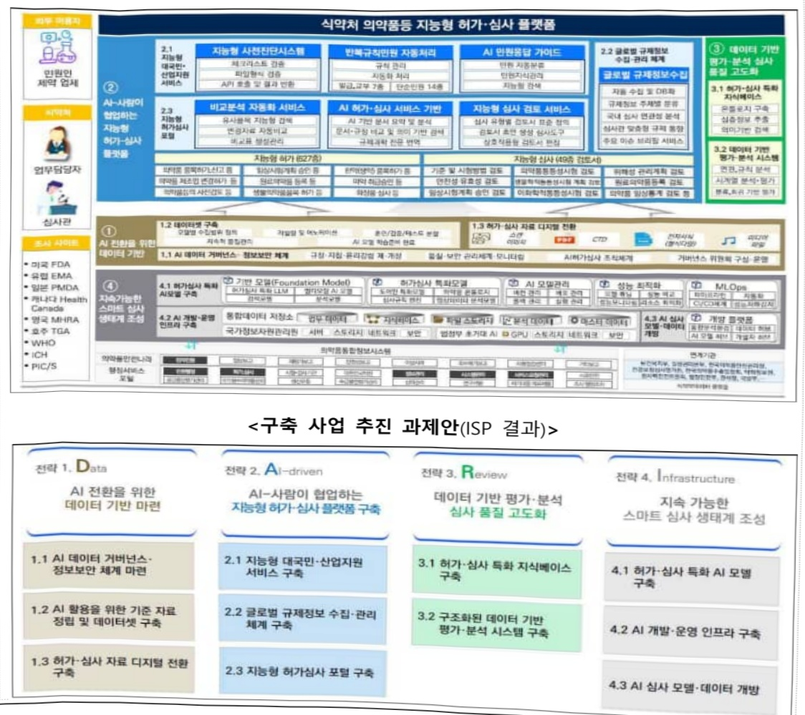

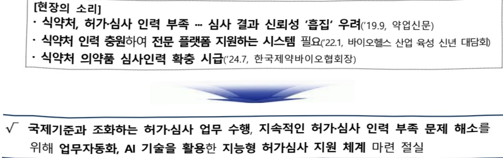

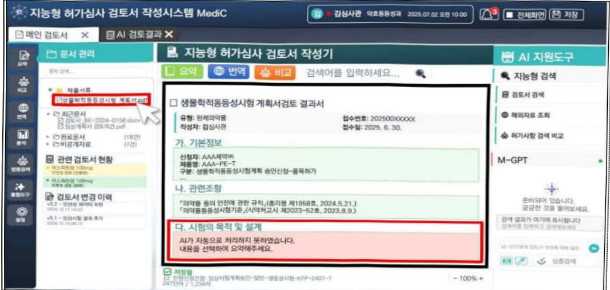

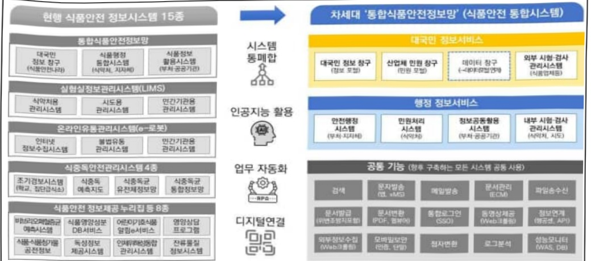

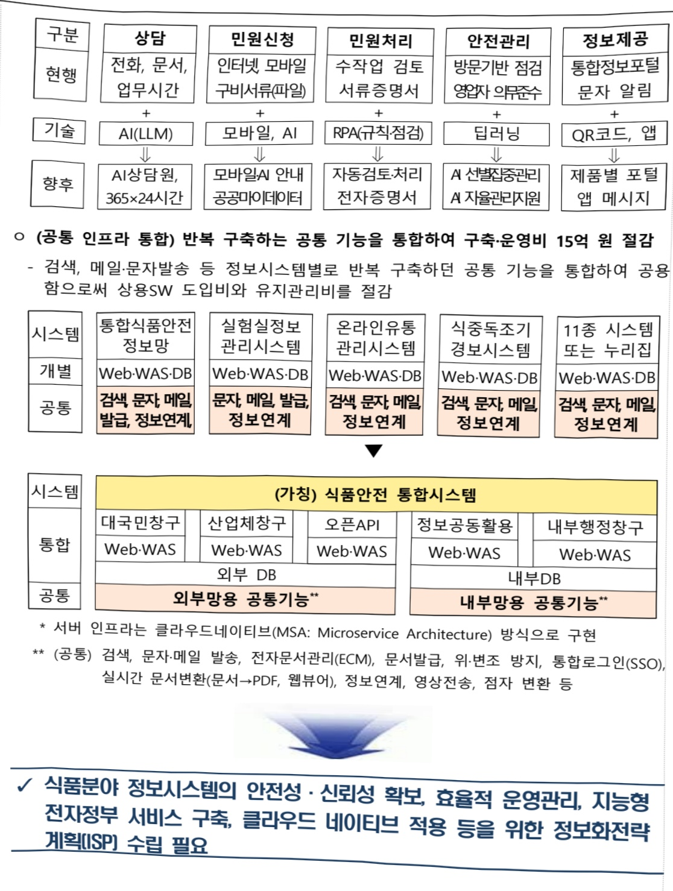

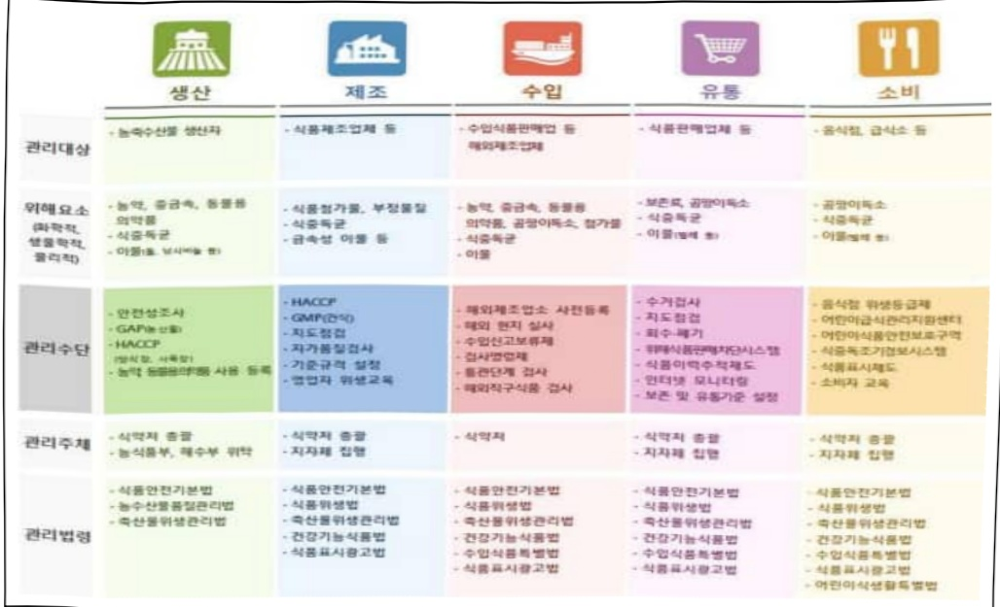

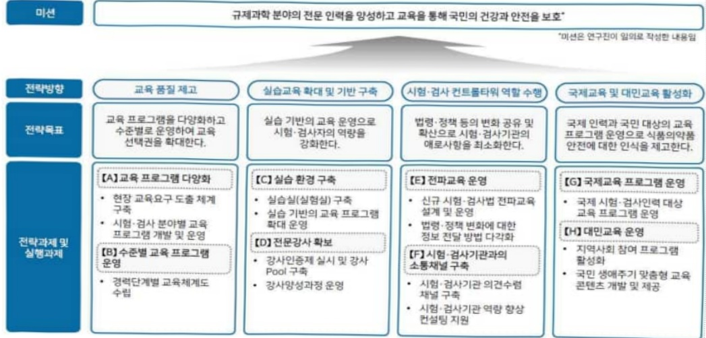

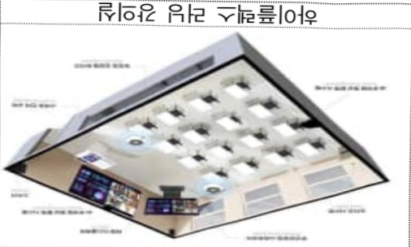

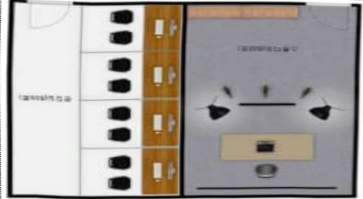

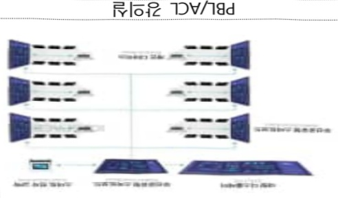

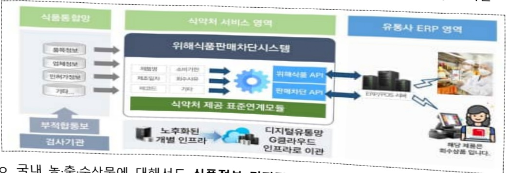

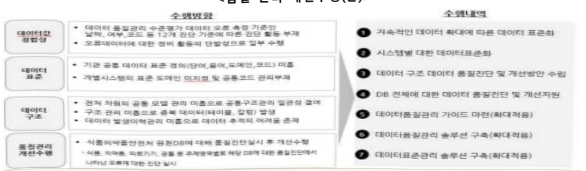

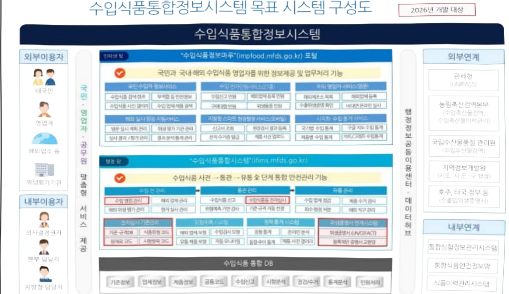

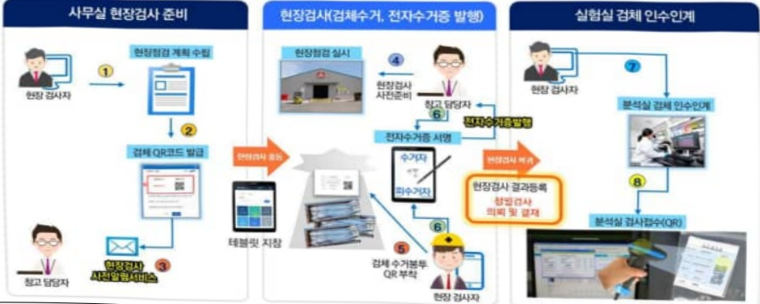

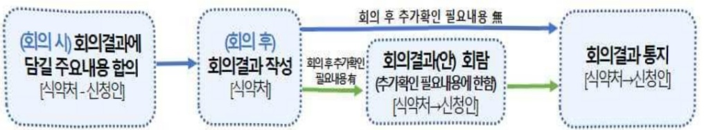

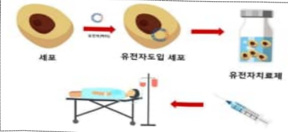

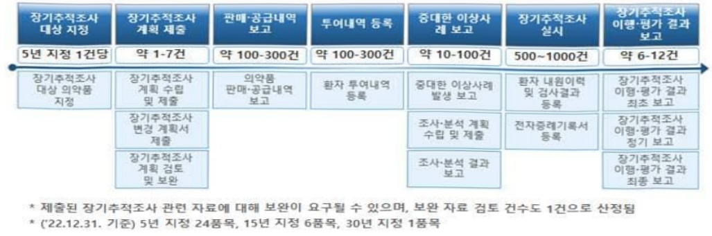

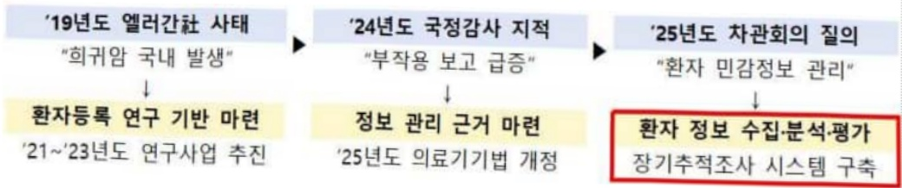

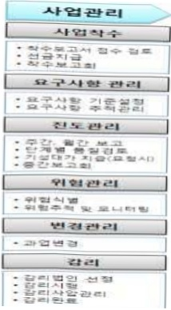

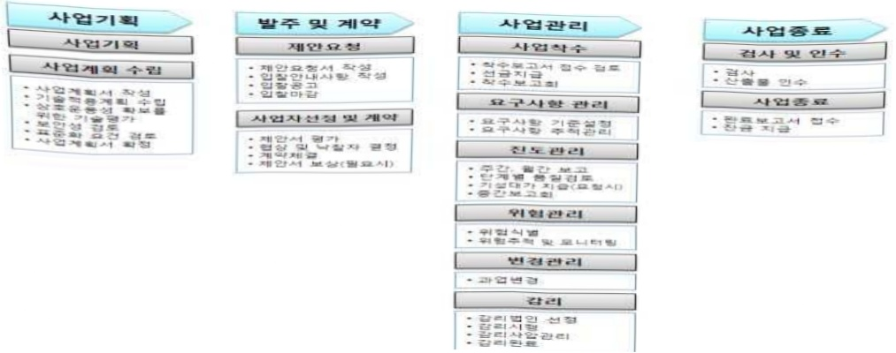

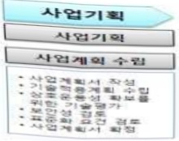

