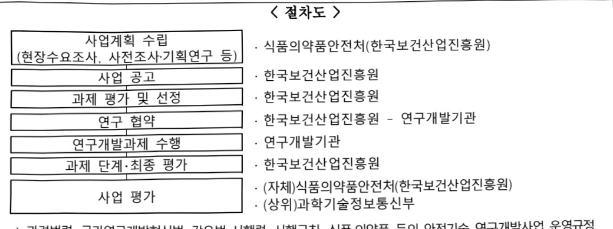

# 신기술 적용 식품(푸드테크) 안전기술 지원(R&D)

**해당 페이지**: PDF 4584 ~ 4590 쪽 해당

**부처**: 식품의약품안전처
**분야**: 보건
**회계유형**: 일반회계
**2026 확정예산**: 2552.0 백만원
**전년대비 증감률**: 4.1%
**AI 도메인**: 데이터, 의료/바이오, 농업/식품

---

### 가.예산 총괄표

(단위: 백만원, %)

<table border=1 style='margin: auto; word-wrap: break-word;'><tr><td rowspan="2">사업명</td><td rowspan="2">2024년 결산</td><td colspan="2">2025년 예산</td><td colspan="2">2026년</td><td rowspan="2">증감(B-A)</td><td rowspan="2">(B-A)/A</td></tr><tr><td style='text-align: center; word-wrap: break-word;'>본예산(A)</td><td style='text-align: center; word-wrap: break-word;'>추경</td><td style='text-align: center; word-wrap: break-word;'>요구</td><td style='text-align: center; word-wrap: break-word;'>예산(B)</td></tr><tr><td style='text-align: center; word-wrap: break-word;'>신기술 적용식품(푸드테크)안전기술 지원(R&amp;D)</td><td style='text-align: center; word-wrap: break-word;'>1,614</td><td style='text-align: center; word-wrap: break-word;'>2,452</td><td style='text-align: center; word-wrap: break-word;'>2,452</td><td style='text-align: center; word-wrap: break-word;'>2,552</td><td style='text-align: center; word-wrap: break-word;'>2,552</td><td style='text-align: center; word-wrap: break-word;'>100</td><td style='text-align: center; word-wrap: break-word;'>4.07</td></tr></table>

□ 기능별(내역사업별) 예산 내역

(단위:백만원)

<table border=1 style='margin: auto; word-wrap: break-word;'><tr><td rowspan="3"></td><td colspan="5">2024</td><td colspan="7">2025</td><td rowspan="3">2026예산</td></tr><tr><td rowspan="2">예산액(추경)</td><td rowspan="2">예산현액</td><td rowspan="2">집행액[실집행액]</td><td rowspan="2">이월액</td><td rowspan="2">불용액</td><td rowspan="2">본예산</td><td rowspan="2">예산현액</td><td rowspan="2">집행액[실집행액]</td><td colspan="2">전년도 이월액제외</td><td rowspan="2">이월액</td><td rowspan="2">불용액</td></tr><tr><td style='text-align: center; word-wrap: break-word;'>예산현액</td><td style='text-align: center; word-wrap: break-word;'>집행액[실집행액]</td></tr><tr><td style='text-align: center; word-wrap: break-word;'>○ 기능별 분류(합계)</td><td style='text-align: center; word-wrap: break-word;'>1,614</td><td style='text-align: center; word-wrap: break-word;'>1,614</td><td style='text-align: center; word-wrap: break-word;'>1,614[1,614]</td><td style='text-align: center; word-wrap: break-word;'>-</td><td style='text-align: center; word-wrap: break-word;'>-</td><td style='text-align: center; word-wrap: break-word;'>2,452</td><td style='text-align: center; word-wrap: break-word;'>2,452[2,452]</td><td style='text-align: center; word-wrap: break-word;'>2,452</td><td style='text-align: center; word-wrap: break-word;'>2,452</td><td style='text-align: center; word-wrap: break-word;'>2,452[2,452]</td><td style='text-align: center; word-wrap: break-word;'>-</td><td style='text-align: center; word-wrap: break-word;'>-</td><td style='text-align: center; word-wrap: break-word;'>2,552</td></tr><tr><td rowspan="2">· 대체식품의 소재생산 인천기술 개발· 빅데이터·AI 기반푸드 테크 유통소비안전기술 개발· 산술 적용 식품 안전기술 확산 및 적용 연구</td><td style='text-align: center; word-wrap: break-word;'>1,214</td><td style='text-align: center; word-wrap: break-word;'>1,214</td><td style='text-align: center; word-wrap: break-word;'>1,214[1,214]</td><td style='text-align: center; word-wrap: break-word;'>-</td><td style='text-align: center; word-wrap: break-word;'>-</td><td style='text-align: center; word-wrap: break-word;'>1,619</td><td style='text-align: center; word-wrap: break-word;'>1,619[1,619]</td><td style='text-align: center; word-wrap: break-word;'>1,619</td><td style='text-align: center; word-wrap: break-word;'>1,619[1,619]</td><td style='text-align: center; word-wrap: break-word;'>-</td><td style='text-align: center; word-wrap: break-word;'>-</td><td style='text-align: center; word-wrap: break-word;'>1,619</td><td style='text-align: center; word-wrap: break-word;'>533</td></tr><tr><td style='text-align: center; word-wrap: break-word;'>400</td><td style='text-align: center; word-wrap: break-word;'>400</td><td style='text-align: center; word-wrap: break-word;'>400[400]</td><td style='text-align: center; word-wrap: break-word;'>-</td><td style='text-align: center; word-wrap: break-word;'>-</td><td style='text-align: center; word-wrap: break-word;'>533</td><td style='text-align: center; word-wrap: break-word;'>533[533]</td><td style='text-align: center; word-wrap: break-word;'>533</td><td style='text-align: center; word-wrap: break-word;'>533[533]</td><td style='text-align: center; word-wrap: break-word;'>-</td><td style='text-align: center; word-wrap: break-word;'>-</td><td style='text-align: center; word-wrap: break-word;'>533</td><td style='text-align: center; word-wrap: break-word;'>400</td></tr></table>

---

### 나.사업설명자료

## 1 ) 사업목적·내용

- (신기술 적용 식품(푸드테크) 안전기술 지원) 급성장하는 푸드테크 시장에 선제적

대응 및 산업발전을 위해 푸드테크 안전기술 개발·검증·지원체계 구축

- (대체식품의 소재생산 안전기술 개발) 동/식물성 단백질 소재의 가공 안전기술 개발 및 배양육 생산 안전기술 개발 등 신규 대체식품의 안전성 확인 및 평가기술을 개발하는 것임

- (빅데이터·AI 기반 푸드테크 유통소비 안전기술 개발) 빅데이터·AI 기반의 DB 구축 및 유용성 검증 등을 통해 식품 안전성 판단 및 예측 기술을 개발하는 것임

- (신기술 적용 식품 안전기술 확산 및 적용 연구) 신기술 적용식품 안전기술의 민간 보급확산 및 적용 연구를 통해 안전한 제품 생산 지원 및 글로벌 규제 대응력을 강화하는 것임

## 2 ) 사업개요

## ☐ 사업근거 및 추진경위

① 법령상 근거 및 조항

- 「식품·의약품 등의 안전 및 제품화 지원에 관한 규제과학혁신법」 제7조(연구개발사업추진)

- 「식품·의약품 등의 안전 및 제품화 지원에 관한 규제과학혁신법」 제8조(출연금)

② 추진경위

- 5대 유망식품 육성을 통한 식품산업 활력 제고 대책(관계부처합동, 2019)

- 그린바이오 융합형 신산업 육성방안(관계부처합동, 2020)

* 그린바이오 융합형 갑산업 육성방안에서는 대체식품, 메디푸드 등을 그린바이오 5대 산업으로 선정하고 이를 4차 산업혁명 기술과 육복합하여 육성하는 계획 수립

- 식품 분야 유망기술 R&D 추진계획(농림축산식품부, 2020)

* 식품산업 트렌드, 글로벌 기업 및 주요국 기술개발 동향 등을 고려하여 향후 중점 투자가 필요한 3대 유망 분야(3개 식품 분야+푸드테크) 도출

- 첨단푸드테크 분야 국정과제(식약처, 2022~2027)

* 신기술을 이용한 식품의 안전 관리 기준 및 체계를 마련하고 신식품산업의 성장을 지원하기 위한 푸드테크 분야 육성 계획 수립

- 푸드테크 등 식품산업 발전을 위한 간담회 개최(식약처, 2022)

*푸드테크 관련 식품산업의 발전을 위해 식품 안전성을 중점으로 한 간담회를 개최, 업계 관계자들의 의견을 청취하고 향후 정책 방향에 대해 논의

---

## □ 주요내용

① 사업규모

- 총사업비 : 해당없음

- 사업기간 : 2024~2029

- 최근 5년 간 투입된 사업비

(단위: 백만원)

<table border=1 style='margin: auto; word-wrap: break-word;'><tr><td style='text-align: center; word-wrap: break-word;'>$ \underline{\text{연도}} $</td><td style='text-align: center; word-wrap: break-word;'>2022</td><td style='text-align: center; word-wrap: break-word;'>2023</td><td style='text-align: center; word-wrap: break-word;'>2024</td><td style='text-align: center; word-wrap: break-word;'>2025</td><td style='text-align: center; word-wrap: break-word;'>2026</td></tr><tr><td style='text-align: center; word-wrap: break-word;'>$ \underline{\text{사업비}} $</td><td style='text-align: center; word-wrap: break-word;'>-</td><td style='text-align: center; word-wrap: break-word;'>-</td><td style='text-align: center; word-wrap: break-word;'>1,614</td><td style='text-align: center; word-wrap: break-word;'>2,452</td><td style='text-align: center; word-wrap: break-word;'>2,552</td></tr></table>

② 사업추진체계

- 사업시행방법 : 출연

- 사업시행주체 : 식품의약품안전처(전문기관: 한국보건산업진흥원)

- 사업 수혜자 : 민간

- 보조, 융자, 출연, 출자 등의 경우 보조·융자 등 지원 비율 및 법적근거

<table border=1 style='margin: auto; word-wrap: break-word;'><tr><td style='text-align: center; word-wrap: break-word;'>내역사업명</td><td style='text-align: center; word-wrap: break-word;'>구분</td><td style='text-align: center; word-wrap: break-word;'>피보조·피출연 등기관명</td><td style='text-align: center; word-wrap: break-word;'>지원 금액 (2026예산)</td><td style='text-align: center; word-wrap: break-word;'>지원 비율(%)</td><td style='text-align: center; word-wrap: break-word;'>보조율 법적근거 (해당 조항)</td></tr><tr><td rowspan="4">대체식품의 소재 생산 안전기술 개발</td><td rowspan="4">출연</td><td style='text-align: center; word-wrap: break-word;'>대학 출연연 등바탕기관</td><td rowspan="4">1,619백만원</td><td style='text-align: center; word-wrap: break-word;'>100</td><td rowspan="12">• 식품·의약품 등의 안전 및 제품화 지원에 관한 규제과학혁신법 제8조제1항 • 국가연구개발혁신법 제13조제1항 및 동법 시행령 제19조제3항</td></tr><tr><td style='text-align: center; word-wrap: break-word;'>대기업, 공기업</td><td style='text-align: center; word-wrap: break-word;'>50</td></tr><tr><td style='text-align: center; word-wrap: break-word;'>중건기업</td><td style='text-align: center; word-wrap: break-word;'>70</td></tr><tr><td style='text-align: center; word-wrap: break-word;'>중소기업</td><td style='text-align: center; word-wrap: break-word;'>75</td></tr><tr><td rowspan="4">빅테이터·AI 기반 푸드테크 유통소비 안전기술 개발</td><td rowspan="4">출연</td><td style='text-align: center; word-wrap: break-word;'>대학 출연연 등바탕기관</td><td rowspan="4">533백만원</td><td style='text-align: center; word-wrap: break-word;'>100</td></tr><tr><td style='text-align: center; word-wrap: break-word;'>대기업, 공기업</td><td style='text-align: center; word-wrap: break-word;'>50</td></tr><tr><td style='text-align: center; word-wrap: break-word;'>중건기업</td><td style='text-align: center; word-wrap: break-word;'>70</td></tr><tr><td style='text-align: center; word-wrap: break-word;'>중소기업</td><td style='text-align: center; word-wrap: break-word;'>75</td></tr><tr><td rowspan="4">신기술 적용 식품 안전 기술 확산 및 적용 연구</td><td rowspan="4">출연</td><td style='text-align: center; word-wrap: break-word;'>대학 출연연 등바탕기관</td><td rowspan="4">400백만원</td><td style='text-align: center; word-wrap: break-word;'>100</td></tr><tr><td style='text-align: center; word-wrap: break-word;'>대기업, 공기업</td><td style='text-align: center; word-wrap: break-word;'>50</td></tr><tr><td style='text-align: center; word-wrap: break-word;'>중건기업</td><td style='text-align: center; word-wrap: break-word;'>70</td></tr><tr><td style='text-align: center; word-wrap: break-word;'>중소기업</td><td style='text-align: center; word-wrap: break-word;'>75</td></tr></table>

---

## 3 ) 2026년도 예산 산출 근거

① 대체식품의 소재 생산 안전기술 개발
 : ('25) 1,619백만원 → ('26) 1,619백만원, 전년동
- (요구) 동/식물성 단백질 소재의 특성 및 알레르겐 확인개술 개발 등 계속 지원을 위해 '26년도 1,619백만원 요구 - (산출) 6과제 × 270백만원 × 12/12개월 = 1,619백만원

② 빅데이터·AI 기반 푸드테크 유통소비 안전기술 개발
 : ('25) 533백만원 → ('26) 533백만원, 전년동
- (요구) 빅데이터·AI 기반 식품 안전성 판단 알고리즘 개발 등 계속 지원을 위해 '26년도 533백만원 요구 - (산출) 2과제 × 267백만원 × 12/12개월 = 533백만원

③ 신기술 적용 식품 안전기술 확산 및 적용 연구
 : ('25) 300백만원 → ('26) 400백만원, 100백만원 증액
- (요구) 신기술 적용식품 안전기술의 민간 보급확산 및 적용 연구 등 계속 지원을 위해 '26년도 400백만원 요구 - (산출) 1과제 × 400백만원 × 12/12개월 = 400백만원

## 4 ) 사업효과

☐ 사업영향, 산출물 성과지표 등

①2022~2026년도 성과계획서 상 성과지표 및 최근 5년간 성과 달성도

<table border=1 style='margin: auto; word-wrap: break-word;'><tr><td rowspan="2">성과지표</td><td rowspan="2">가중치</td><td rowspan="2">성과분야</td><td colspan="8">실적 및 목표치</td><td rowspan="2">측정산식 또는 측정방법</td><td rowspan="2">자료 수집 방법/출처</td></tr><tr><td style='text-align: center; word-wrap: break-word;'>구분</td><td style='text-align: center; word-wrap: break-word;'>&#x27;22</td><td style='text-align: center; word-wrap: break-word;'>&#x27;23</td><td style='text-align: center; word-wrap: break-word;'>&#x27;24</td><td style='text-align: center; word-wrap: break-word;'>&#x27;25</td><td style='text-align: center; word-wrap: break-word;'>&#x27;26</td><td style='text-align: center; word-wrap: break-word;'>&#x27;27</td><td style='text-align: center; word-wrap: break-word;'>&#x27;28</td></tr><tr><td rowspan="2">①식·의약안전 정책연계율(%)</td><td rowspan="2">1</td><td rowspan="2">R&amp;D</td><td style='text-align: center; word-wrap: break-word;'>목표</td><td style='text-align: center; word-wrap: break-word;'>70</td><td style='text-align: center; word-wrap: break-word;'>71</td><td style='text-align: center; word-wrap: break-word;'>71.5</td><td style='text-align: center; word-wrap: break-word;'>72</td><td style='text-align: center; word-wrap: break-word;'>72.5</td><td style='text-align: center; word-wrap: break-word;'>72.5</td><td style='text-align: center; word-wrap: break-word;'>72.5</td><td rowspan="2">(당해연도 정책 반영건수) / (정책제안건수) × 100</td><td rowspan="2">고시 개정 (안), 가이드라인 지침 등 정책 제안 관련 공문</td></tr><tr><td style='text-align: center; word-wrap: break-word;'>실적</td><td style='text-align: center; word-wrap: break-word;'>70.1</td><td style='text-align: center; word-wrap: break-word;'>71.4</td><td style='text-align: center; word-wrap: break-word;'>71.6</td><td style='text-align: center; word-wrap: break-word;'>-</td><td style='text-align: center; word-wrap: break-word;'>-</td><td style='text-align: center; word-wrap: break-word;'>-</td><td style='text-align: center; word-wrap: break-word;'>-</td></tr></table>

② 성과지표 이외의 연도별 사업추진 경과 및 실적

---

<table border=1 style='margin: auto; word-wrap: break-word;'><tr><td style='text-align: center; word-wrap: break-word;'>2022</td><td style='text-align: center; word-wrap: break-word;'>-</td></tr><tr><td style='text-align: center; word-wrap: break-word;'>2023</td><td style='text-align: center; word-wrap: break-word;'>-</td></tr><tr><td style='text-align: center; word-wrap: break-word;'>2024</td><td style='text-align: center; word-wrap: break-word;'>○ 대체식품의 소재 생산 안전기술 개발 - 「Development of Safety Evaluation Technology for Cultivated Meat Products」등 학술회의 발표(14건) ○ 빅데이터·AI 기반 푸드테크 유통소비 안전기술 개발 - 「화합물의 폐 발암성 예측을 위한 그래프 신경망 접근법」등 학술회의 발표(5건) - 「그래프 어텐션을 이용하여 약물의 심장독성을 예측하는 방법, 장치 및 컴퓨터 프로그램」등 특허 출원(2건)</td></tr><tr><td style='text-align: center; word-wrap: break-word;'>2025</td><td style='text-align: center; word-wrap: break-word;'>○ 대체식품의 소재 생산 안전기술 개발 - 「Isolation and Characterization of Novel Bacteriophage INF J2 Infecting Yersinia enterocolitica」등 학술회의 발표(14건) ○ 빅데이터·AI 기반 푸드테크 유통소비 안전기술 개발 - 「Interpretable prediction of drug-drug interactions via text embedding in biomedical literature」등 SCI급 학술지게재논문(4건)</td></tr></table>

③향후(2026년도 이후) 기대효과

- 푸드테크 기술협력 및 사업화 촉진 기반조성을 통해 R&D환경을 지속적으로 개선하고, 영세 식품제조업의 기술경쟁력 향상으로 연결(안전기술개발지수 2점 이상)

- 신기술 적용식품의 개발 단계부터 기술-규제 정합성 확보, 제품화를 위한 맞춤형 컨설팅 등을 통해 국가 R&D 투자의 효율성 증대(안전기술기반구축 2점 이상)

- 푸드테크 新소재·식품·서비스에 대한 명확한 가이드라인의 근거자료로 활용함

으로써 태동·성장 단계인 관련 기술의 조기상용화 및 식품산업 발전 기대(연구

성과 확산·활용 지수 1.95점 이상)

5)타당성조사 및 예비타당성조사 시행여부 및 결과 요지:해당없음

6) 총사업비 대상사업 여부 및 내역 : 해당없음

7) 사업 집행절차

*관련법령:국가연구개발혁신법,같은법 시행령,시행규칙,식품의약품 등의 안전기술 연구개발사업 운영규정

---

## 8 ) 각종 평가 : 해당없음

### 다.최근 4년간 결산내역

## 1 ) 결산표

☐ 부처 결산내역

(단위:백만원,%)

<table border=1 style='margin: auto; word-wrap: break-word;'><tr><td rowspan="2">연도</td><td colspan="3">예산액</td><td rowspan="2">전년도 이월액</td><td rowspan="2">이·전용 등</td><td rowspan="2">예비비</td><td rowspan="2">예산 현액(B)</td><td rowspan="2">집행액 (C)</td><td rowspan="2">집행률 (C/A)</td><td rowspan="2">집행률 (C/B)</td><td rowspan="2">다음연도 이월액</td><td rowspan="2">불용액</td></tr><tr><td style='text-align: center; word-wrap: break-word;'>본예산</td><td style='text-align: center; word-wrap: break-word;'>추경 중감액</td><td style='text-align: center; word-wrap: break-word;'>추경(A)</td></tr><tr><td style='text-align: center; word-wrap: break-word;'>2022</td><td style='text-align: center; word-wrap: break-word;'>-</td><td style='text-align: center; word-wrap: break-word;'>-</td><td style='text-align: center; word-wrap: break-word;'>-</td><td style='text-align: center; word-wrap: break-word;'>-</td><td style='text-align: center; word-wrap: break-word;'>-</td><td style='text-align: center; word-wrap: break-word;'>-</td><td style='text-align: center; word-wrap: break-word;'>-</td><td style='text-align: center; word-wrap: break-word;'>-</td><td style='text-align: center; word-wrap: break-word;'>-</td><td style='text-align: center; word-wrap: break-word;'>-</td><td style='text-align: center; word-wrap: break-word;'>-</td><td style='text-align: center; word-wrap: break-word;'>-</td></tr><tr><td style='text-align: center; word-wrap: break-word;'>2023</td><td style='text-align: center; word-wrap: break-word;'>-</td><td style='text-align: center; word-wrap: break-word;'>-</td><td style='text-align: center; word-wrap: break-word;'>-</td><td style='text-align: center; word-wrap: break-word;'>-</td><td style='text-align: center; word-wrap: break-word;'>-</td><td style='text-align: center; word-wrap: break-word;'>-</td><td style='text-align: center; word-wrap: break-word;'>-</td><td style='text-align: center; word-wrap: break-word;'>-</td><td style='text-align: center; word-wrap: break-word;'>-</td><td style='text-align: center; word-wrap: break-word;'>-</td><td style='text-align: center; word-wrap: break-word;'>-</td><td style='text-align: center; word-wrap: break-word;'>-</td></tr><tr><td style='text-align: center; word-wrap: break-word;'>2024</td><td style='text-align: center; word-wrap: break-word;'>1,614</td><td style='text-align: center; word-wrap: break-word;'>-</td><td style='text-align: center; word-wrap: break-word;'>1,614</td><td style='text-align: center; word-wrap: break-word;'>-</td><td style='text-align: center; word-wrap: break-word;'>-</td><td style='text-align: center; word-wrap: break-word;'>-</td><td style='text-align: center; word-wrap: break-word;'>1,614</td><td style='text-align: center; word-wrap: break-word;'>1,614</td><td style='text-align: center; word-wrap: break-word;'>100</td><td style='text-align: center; word-wrap: break-word;'>100</td><td style='text-align: center; word-wrap: break-word;'>-</td><td style='text-align: center; word-wrap: break-word;'>-</td></tr><tr><td style='text-align: center; word-wrap: break-word;'>2025</td><td style='text-align: center; word-wrap: break-word;'>2,452</td><td style='text-align: center; word-wrap: break-word;'>-</td><td style='text-align: center; word-wrap: break-word;'>2,452</td><td style='text-align: center; word-wrap: break-word;'>-</td><td style='text-align: center; word-wrap: break-word;'>-</td><td style='text-align: center; word-wrap: break-word;'>-</td><td style='text-align: center; word-wrap: break-word;'>2,452</td><td style='text-align: center; word-wrap: break-word;'>2,452</td><td style='text-align: center; word-wrap: break-word;'>100</td><td style='text-align: center; word-wrap: break-word;'>100</td><td style='text-align: center; word-wrap: break-word;'>-</td><td style='text-align: center; word-wrap: break-word;'>-</td></tr></table>

□출연·보조사업 등 실집행내역

(단위:백만원,%)

<table border=1 style='margin: auto; word-wrap: break-word;'><tr><td rowspan="2">구분</td><td colspan="3">부처</td><td colspan="7">사업시행주체(피출연·피보조기관 등)</td></tr><tr><td colspan="2">예산액</td><td style='text-align: center; word-wrap: break-word;'>집행액</td><td style='text-align: center; word-wrap: break-word;'>교부액</td><td style='text-align: center; word-wrap: break-word;'>전년도이월액</td><td style='text-align: center; word-wrap: break-word;'>교부현액</td><td style='text-align: center; word-wrap: break-word;'>집행액(B)</td><td style='text-align: center; word-wrap: break-word;'>이월액</td><td style='text-align: center; word-wrap: break-word;'>불용액</td><td style='text-align: center; word-wrap: break-word;'>실집행률(B/A)</td></tr><tr><td style='text-align: center; word-wrap: break-word;'>2022</td><td style='text-align: center; word-wrap: break-word;'>-</td><td style='text-align: center; word-wrap: break-word;'>-</td><td style='text-align: center; word-wrap: break-word;'>-</td><td style='text-align: center; word-wrap: break-word;'>-</td><td style='text-align: center; word-wrap: break-word;'>-</td><td style='text-align: center; word-wrap: break-word;'>-</td><td style='text-align: center; word-wrap: break-word;'>-</td><td style='text-align: center; word-wrap: break-word;'>-</td><td style='text-align: center; word-wrap: break-word;'>-</td><td style='text-align: center; word-wrap: break-word;'>-</td></tr><tr><td style='text-align: center; word-wrap: break-word;'>2023</td><td style='text-align: center; word-wrap: break-word;'>-</td><td style='text-align: center; word-wrap: break-word;'>-</td><td style='text-align: center; word-wrap: break-word;'>-</td><td style='text-align: center; word-wrap: break-word;'>-</td><td style='text-align: center; word-wrap: break-word;'>-</td><td style='text-align: center; word-wrap: break-word;'>-</td><td style='text-align: center; word-wrap: break-word;'>-</td><td style='text-align: center; word-wrap: break-word;'>-</td><td style='text-align: center; word-wrap: break-word;'>-</td><td style='text-align: center; word-wrap: break-word;'>-</td></tr><tr><td style='text-align: center; word-wrap: break-word;'>2024</td><td style='text-align: center; word-wrap: break-word;'>1,614</td><td style='text-align: center; word-wrap: break-word;'>1,614</td><td style='text-align: center; word-wrap: break-word;'>1,614</td><td style='text-align: center; word-wrap: break-word;'>1,614</td><td style='text-align: center; word-wrap: break-word;'>-</td><td style='text-align: center; word-wrap: break-word;'>1,614</td><td style='text-align: center; word-wrap: break-word;'>1,614</td><td style='text-align: center; word-wrap: break-word;'>-</td><td style='text-align: center; word-wrap: break-word;'>-</td><td style='text-align: center; word-wrap: break-word;'>100</td></tr><tr><td style='text-align: center; word-wrap: break-word;'>2025</td><td style='text-align: center; word-wrap: break-word;'>2,452</td><td style='text-align: center; word-wrap: break-word;'>2,452</td><td style='text-align: center; word-wrap: break-word;'>2,452</td><td style='text-align: center; word-wrap: break-word;'>2,452</td><td style='text-align: center; word-wrap: break-word;'>-</td><td style='text-align: center; word-wrap: break-word;'>2,452</td><td style='text-align: center; word-wrap: break-word;'>2,452</td><td style='text-align: center; word-wrap: break-word;'>-</td><td style='text-align: center; word-wrap: break-word;'>-</td><td style='text-align: center; word-wrap: break-word;'>100</td></tr></table>

2) 주요 결산사항 : 해당없음

---

<table border=1 style='margin: auto; word-wrap: break-word;'><tr><td style='text-align: center; word-wrap: break-word;'>사 업 명</td></tr><tr><td style='text-align: center; word-wrap: break-word;'>(66) 중독자 데이터 기반 마약 중독 재활기술 개발연구(R&amp;D) (4031-348)</td></tr></table>

☐ 사업 코드 정보

<table border=1 style='margin: auto; word-wrap: break-word;'><tr><td style='text-align: center; word-wrap: break-word;'>구분</td><td style='text-align: center; word-wrap: break-word;'>회계</td><td style='text-align: center; word-wrap: break-word;'>소관</td><td style='text-align: center; word-wrap: break-word;'>실국(기관)</td><td style='text-align: center; word-wrap: break-word;'>계정</td><td style='text-align: center; word-wrap: break-word;'>분야</td><td style='text-align: center; word-wrap: break-word;'>부문</td></tr><tr><td style='text-align: center; word-wrap: break-word;'>코드</td><td rowspan="2">일반회계</td><td style='text-align: center; word-wrap: break-word;'>식품의약품</td><td style='text-align: center; word-wrap: break-word;'>식품의약품</td><td rowspan="2"></td><td style='text-align: center; word-wrap: break-word;'>090</td><td style='text-align: center; word-wrap: break-word;'>093</td></tr><tr><td style='text-align: center; word-wrap: break-word;'>명칭</td><td style='text-align: center; word-wrap: break-word;'>안전처</td><td style='text-align: center; word-wrap: break-word;'>안전평가원</td><td style='text-align: center; word-wrap: break-word;'>보건</td><td style='text-align: center; word-wrap: break-word;'>식품의약안전</td></tr></table>

<table border=1 style='margin: auto; word-wrap: break-word;'><tr><td style='text-align: center; word-wrap: break-word;'>구분</td><td style='text-align: center; word-wrap: break-word;'>프로그램</td><td style='text-align: center; word-wrap: break-word;'>단위사업</td><td style='text-align: center; word-wrap: break-word;'>세부사업</td></tr><tr><td style='text-align: center; word-wrap: break-word;'>코드</td><td style='text-align: center; word-wrap: break-word;'>4000</td><td style='text-align: center; word-wrap: break-word;'>4031</td><td style='text-align: center; word-wrap: break-word;'>348</td></tr><tr><td style='text-align: center; word-wrap: break-word;'>명칭</td><td style='text-align: center; word-wrap: break-word;'>과학적 안전관리 연구 및 허가심사 안전성 제고</td><td style='text-align: center; word-wrap: break-word;'>식의약품 안전 연구개발</td><td style='text-align: center; word-wrap: break-word;'>중독자 데이터 기반 마약 중독 재활기술 개발연구(R&amp;D)</td></tr></table>

## □ 사업 성격

<table border=1 style='margin: auto; word-wrap: break-word;'><tr><td rowspan="2">신규</td><td rowspan="2">계속</td><td rowspan="2">완료</td><td rowspan="2">예비타당성 실시여부</td><td rowspan="2">총사업비 관리대상</td><td rowspan="2">총액계상 예산사업</td><td style='text-align: center; word-wrap: break-word;'>사업소관 변경정보</td></tr><tr><td style='text-align: center; word-wrap: break-word;'>2025예산 시 소관</td></tr><tr><td style='text-align: center; word-wrap: break-word;'>○</td><td style='text-align: center; word-wrap: break-word;'></td><td style='text-align: center; word-wrap: break-word;'></td><td style='text-align: center; word-wrap: break-word;'></td><td style='text-align: center; word-wrap: break-word;'></td><td style='text-align: center; word-wrap: break-word;'></td><td style='text-align: center; word-wrap: break-word;'></td></tr></table>

□ 사업 지원 형태 및 지원을

<table border=1 style='margin: auto; word-wrap: break-word;'><tr><td style='text-align: center; word-wrap: break-word;'>직접</td><td style='text-align: center; word-wrap: break-word;'>출자</td><td style='text-align: center; word-wrap: break-word;'>출연</td><td style='text-align: center; word-wrap: break-word;'>보조</td><td style='text-align: center; word-wrap: break-word;'>융자</td><td style='text-align: center; word-wrap: break-word;'>국고보조율(%)</td><td style='text-align: center; word-wrap: break-word;'>융자율(%)</td></tr><tr><td style='text-align: center; word-wrap: break-word;'></td><td style='text-align: center; word-wrap: break-word;'></td><td style='text-align: center; word-wrap: break-word;'>○</td><td style='text-align: center; word-wrap: break-word;'></td><td style='text-align: center; word-wrap: break-word;'></td><td style='text-align: center; word-wrap: break-word;'></td><td style='text-align: center; word-wrap: break-word;'></td></tr></table>

## □ 사업 담당자

<table border=1 style='margin: auto; word-wrap: break-word;'><tr><td style='text-align: center; word-wrap: break-word;'>사업명</td><td colspan="2">구분</td></tr><tr><td rowspan="3">중독자 데이터 기반 마약 중독 재활기술 개발연구(R&amp;D)</td><td rowspan="2">소관부처</td><td style='text-align: center; word-wrap: break-word;'>독성평가연구부</td></tr><tr><td style='text-align: center; word-wrap: break-word;'>약리마약연구과</td></tr><tr><td style='text-align: center; word-wrap: break-word;'>사업 시행 주체</td><td style='text-align: center; word-wrap: break-word;'>한국보건산업진흥원</td></tr></table>

---

### 원본 PDF 크롭 이미지

