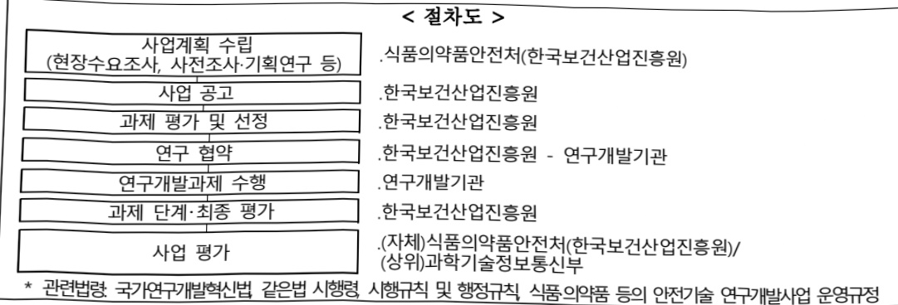

# 중독자 데이터 기반 마약 중독 재활기술 개발연구(R&D)

**해당 페이지**: PDF 4591 ~ 4595 쪽 해당

**부처**: 식품의약품안전처
**분야**: 보건
**회계유형**: 일반회계
**2026 확정예산**: 3755.0 백만원
**전년대비 증감률**: None%
**AI 도메인**: 데이터, 의료/바이오, 법률/치안

---

### 가.예산 총괄표

(단위: 백만원, %)

<table border=1 style='margin: auto; word-wrap: break-word;'><tr><td rowspan="2">사업명</td><td rowspan="2">2024년 결산</td><td colspan="2">2025년 예산</td><td colspan="2">2026년</td><td rowspan="2">증감(B-A)</td><td rowspan="2">(B-A)/A</td></tr><tr><td style='text-align: center; word-wrap: break-word;'>본예산(A)</td><td style='text-align: center; word-wrap: break-word;'>추경</td><td style='text-align: center; word-wrap: break-word;'>요구</td><td style='text-align: center; word-wrap: break-word;'>예산(B)</td></tr><tr><td style='text-align: center; word-wrap: break-word;'>중독자 데이터 기반 마약 중독 재활기술 개발연구(R&amp;D)</td><td style='text-align: center; word-wrap: break-word;'>-</td><td style='text-align: center; word-wrap: break-word;'>-</td><td style='text-align: center; word-wrap: break-word;'>-</td><td style='text-align: center; word-wrap: break-word;'>3,755</td><td style='text-align: center; word-wrap: break-word;'>3,755</td><td style='text-align: center; word-wrap: break-word;'>3,755</td><td style='text-align: center; word-wrap: break-word;'>순증</td></tr></table>

□ 기능별(내역사업별) 예산 내역

(단위:백만원)

<table border=1 style='margin: auto; word-wrap: break-word;'><tr><td rowspan="3"></td><td colspan="5">2024</td><td colspan="7">2025</td><td rowspan="3">2026예산</td></tr><tr><td rowspan="2">예산액(추경)</td><td rowspan="2">예산현액</td><td rowspan="2">집행액[실집행액]</td><td rowspan="2">이월액</td><td rowspan="2">불용액</td><td rowspan="2">본예산</td><td rowspan="2">예산현액</td><td rowspan="2">집행액[실집행액]</td><td colspan="2">전년도 이월액제의</td><td rowspan="2">이월액</td><td rowspan="2">불용액</td></tr><tr><td style='text-align: center; word-wrap: break-word;'>예산현액</td><td style='text-align: center; word-wrap: break-word;'>집행액[실집행액]</td></tr><tr><td style='text-align: center; word-wrap: break-word;'>○ 기능별 분류(합계)</td><td style='text-align: center; word-wrap: break-word;'>-</td><td style='text-align: center; word-wrap: break-word;'>-</td><td style='text-align: center; word-wrap: break-word;'>-</td><td style='text-align: center; word-wrap: break-word;'>-</td><td style='text-align: center; word-wrap: break-word;'>-</td><td style='text-align: center; word-wrap: break-word;'>-</td><td style='text-align: center; word-wrap: break-word;'>-</td><td style='text-align: center; word-wrap: break-word;'>-</td><td style='text-align: center; word-wrap: break-word;'>-</td><td style='text-align: center; word-wrap: break-word;'>-</td><td style='text-align: center; word-wrap: break-word;'>-</td><td style='text-align: center; word-wrap: break-word;'>-</td><td style='text-align: center; word-wrap: break-word;'>3,755</td></tr><tr><td style='text-align: center; word-wrap: break-word;'>• AI 기반 마약중독맞춤형 재활기술개발</td><td style='text-align: center; word-wrap: break-word;'>-</td><td style='text-align: center; word-wrap: break-word;'>-</td><td style='text-align: center; word-wrap: break-word;'>-</td><td style='text-align: center; word-wrap: break-word;'>-</td><td style='text-align: center; word-wrap: break-word;'>-</td><td style='text-align: center; word-wrap: break-word;'>-</td><td style='text-align: center; word-wrap: break-word;'>-</td><td style='text-align: center; word-wrap: break-word;'>-</td><td style='text-align: center; word-wrap: break-word;'>-</td><td style='text-align: center; word-wrap: break-word;'>-</td><td style='text-align: center; word-wrap: break-word;'>-</td><td style='text-align: center; word-wrap: break-word;'>-</td><td style='text-align: center; word-wrap: break-word;'>3,755</td></tr></table>

### 나. 사업설명자료

## 1 ) 사업목적·내용

(중독자 데이터 기반 마약 중독 재활기술 개발연구) 동 세부사업은 마약류 중독자의 사회

복귀를 위한 개인 맞춤형 재활 및 재발 예측 기술 개발 연구 지원하는 것임

- (AI 기반 마약중독 맞춤형 재활 기술 개발) 동 내역사업은 마약류 중독자 데이터를 활용하여 마약 중독 단계별 뇌변화 모니터링, AI 기반 재활 및 재발 예측 모델 개발, 마약류 중독·재발 기전 예측 모델 개발 등을 통해 개인 맞춤형 치료·재활 기술 개발 지원하는 것임

## 2 ) 사업개요

## □ 사업근거 및 추진경위

①법령상 근거 및 조항 적시

「식품·의약품 등의 안전기술 진흥법」(15.5.18. 제정)

---

<table border=1 style='margin: auto; word-wrap: break-word;'><tr><td style='text-align: center; word-wrap: break-word;'>제1조 (목적) 국민이 안전하고 건강한 삶을 영위할 수 있도록 식품·의약품 등의 안전기술 발전기반 조성 및 진흥 방안 마련을 위한 연구개발사업 추진</td></tr><tr><td style='text-align: center; word-wrap: break-word;'>제7조 (연구개발사업의 추진) 기본계획과 시행계획을 효율적으로 추진하기 위하여 식품·의약품 등의 안전기술 연구개발사업을 추진</td></tr><tr><td style='text-align: center; word-wrap: break-word;'>제8조 (출연금) 연구를 수행하는 데 드는 비용을 충당하도록 연구기관 등에 출연금을 지급</td></tr></table>

-「마약류 관리에 관한 법률」제51조의2(마약류 오남용 예방 및 사회재활사업)

① 식품의약품안전처장은 마약류의 오남용을 예방하고 마약류 중독자의 사회복귀와 정상적인 일상생활의 유지·보호를 지원하기 위하여 다음 각 호의 업무를 수행한다. <개정 2025. 4. 1.>

④ 식품의약품안전처장은 마약류 중독자를 체계적·효율적으로 보호하고 지원하기 위한 시스템(이하 “마약류 중독자관리시스템”이라 한다)을 구축·운영하여야 하고, 이를 위하여 제2항 각 호의 자료 또는 정보를 연계하여 활용할 수 있다. <신설 2025. 4. 1.>

② 추진경위

- 대통령, 범정부 차원의 마약 범죄 관련 종합대책 추진 지시(국무회의, '22.10.11)

- 대통령, 전사회적 ‘마약과의 전쟁’ 절실하며 미래세대를 지켜야 한다는 사명감으로 특단의 대책 마련할 것(총리 주례회동, '22.10.24)

-「마약류 관리 종합대책」관련 당정 협의회 개최('22.10.26)

-마약류 중독자 예방·사회재활 지원을 위한 방안연구

·마약류 중독의 체계적인 예방·사회재활 지원 방안 마련 및 후속 연구과제 발굴 마약류 과리 기본계획 및 시행계획 수련

· 국민 일상에 마약범죄가 침투하는 것을 방지하기 위해 정부 최초로 중장기 마약류 관리 기본계획 수립, 수사·단속부터 치료·재활·예방에 이르기까지 범정부 총력 대응체계 구축

## □ 주요내용

①사업규모

- 총사업비(해당되는 경우에만 기재) : 해당없음

-사업기간:2026~2030

-최근 5년 간 투입된 사업비(예산액기준, 추경편성한 연도에는 추경포함)

(단위:백만원)

<table border=1 style='margin: auto; word-wrap: break-word;'><tr><td style='text-align: center; word-wrap: break-word;'>연도</td><td style='text-align: center; word-wrap: break-word;'>2022</td><td style='text-align: center; word-wrap: break-word;'>2023</td><td style='text-align: center; word-wrap: break-word;'>2024</td><td style='text-align: center; word-wrap: break-word;'>2025</td><td style='text-align: center; word-wrap: break-word;'>2026</td></tr><tr><td style='text-align: center; word-wrap: break-word;'>사업비</td><td style='text-align: center; word-wrap: break-word;'>-</td><td style='text-align: center; word-wrap: break-word;'>-</td><td style='text-align: center; word-wrap: break-word;'>-</td><td style='text-align: center; word-wrap: break-word;'>-</td><td style='text-align: center; word-wrap: break-word;'>3,755</td></tr></table>

② 사업추진체계

-사업시행방법:출연

-사업시행주체:식품의약품안전처(전문기관:한국보건산업진흥원)

- 사업 수혜자 : 일반국민, 식품·의약품 등의 관련 학계, 업계 등

- 보조, 융자, 출연, 출자 등의 경우 보조·융자 등 지원 비율 및 법적근거

<table border=1 style='margin: auto; word-wrap: break-word;'><tr><td style='text-align: center; word-wrap: break-word;'>대역사업명</td><td style='text-align: center; word-wrap: break-word;'>구분</td><td style='text-align: center; word-wrap: break-word;'>피보조·피출연 등 기관명</td><td style='text-align: center; word-wrap: break-word;'>지원 금액 (2026예산)</td><td style='text-align: center; word-wrap: break-word;'>지원 비율(%)</td><td style='text-align: center; word-wrap: break-word;'>보조율 법적근거 (해당 조항)</td></tr><tr><td rowspan="4">AI 기반 마약중독 맞춤형 재활 기술 개발</td><td rowspan="4">출연</td><td style='text-align: center; word-wrap: break-word;'>대학 출연연 등바탕가런</td><td rowspan="4">3,755백만원</td><td style='text-align: center; word-wrap: break-word;'>100</td><td rowspan="4">· 식품·의약품 등의 안전 및 제품화 지원에 관한 규제과학혁신법 제8조제1항 · 국가연구개발혁신법 제13조제1항 및 동법 시행령 제19조제3항</td></tr><tr><td style='text-align: center; word-wrap: break-word;'>대기업, 공기업</td><td style='text-align: center; word-wrap: break-word;'>50</td></tr><tr><td style='text-align: center; word-wrap: break-word;'>중전기업</td><td style='text-align: center; word-wrap: break-word;'>70</td></tr><tr><td style='text-align: center; word-wrap: break-word;'>중소기업</td><td style='text-align: center; word-wrap: break-word;'>75</td></tr></table>

---

## 3 ) 2026년도 예산 산출 근거

① AI 기반 마약중독 맞춤형 재활 기술 개발 : (25) 000백만원 → (26) 3,755백만원, 순증

- (요구) 마약류 중독자 데이터를 활용하여 마약 중독 단계별 뇌변화 모니터링, AI 기반 중독 재발 기전 예측 모델 개발 및 마약류 중독·재발 기전 예측 모델 개발 등의 연구를 위하여 '26년도 3,755백만원 신규 요구

- (산출) 3과제 × 1,669백만원 × 9/12개월 = 3,755백만원

## 4 ) 사업효과

□ 사업영향, 산출물 성과지표 등

① 2022~2026년도 성과계획서 상 성과지표 및 최근 5년간 성과 달성도

<table border=1 style='margin: auto; word-wrap: break-word;'><tr><td rowspan="2">성과지표</td><td rowspan="2">가중치</td><td rowspan="2">성과분야</td><td colspan="8">실적 및 목표치</td><td rowspan="2">측정산식 또는 측정방법</td><td rowspan="2">자료 수집 방법/출처</td></tr><tr><td style='text-align: center; word-wrap: break-word;'>구분</td><td style='text-align: center; word-wrap: break-word;'>&#x27;22</td><td style='text-align: center; word-wrap: break-word;'>&#x27;23</td><td style='text-align: center; word-wrap: break-word;'>&#x27;24</td><td style='text-align: center; word-wrap: break-word;'>&#x27;25</td><td style='text-align: center; word-wrap: break-word;'>&#x27;26</td><td style='text-align: center; word-wrap: break-word;'>&#x27;27</td><td style='text-align: center; word-wrap: break-word;'>&#x27;28</td></tr><tr><td rowspan="2">①식·의약안전 정책연계율(%)</td><td rowspan="2">1</td><td rowspan="2">R&amp;D</td><td style='text-align: center; word-wrap: break-word;'>목표</td><td style='text-align: center; word-wrap: break-word;'>70</td><td style='text-align: center; word-wrap: break-word;'>71</td><td style='text-align: center; word-wrap: break-word;'>71.5</td><td style='text-align: center; word-wrap: break-word;'>72</td><td style='text-align: center; word-wrap: break-word;'>72.5</td><td style='text-align: center; word-wrap: break-word;'>72.5</td><td style='text-align: center; word-wrap: break-word;'>72.5</td><td rowspan="2">(당해연도 정책 반영건수) / (정책제안건수) × 100</td><td rowspan="2">고시 개정 (안), 가이드라인 지침 등 정책 제안 관련 공문</td></tr><tr><td style='text-align: center; word-wrap: break-word;'>실적</td><td style='text-align: center; word-wrap: break-word;'>70.1</td><td style='text-align: center; word-wrap: break-word;'>71.4</td><td style='text-align: center; word-wrap: break-word;'>71.6</td><td style='text-align: center; word-wrap: break-word;'>-</td><td style='text-align: center; word-wrap: break-word;'>-</td><td style='text-align: center; word-wrap: break-word;'>-</td><td style='text-align: center; word-wrap: break-word;'>-</td></tr></table>

② 성과지표 이외의 연도별 사업추진 경과 및 실적 : 해당없음

③ 향후(2026년도 이후) 기대효과

(과학기술적) 마약 중독 단계별 기전 연구 및 마약 중독·재활 바이오마커 발굴을 통한 맞춤형 재활 기술 확보 및 국제 협력 강화

(사회경제적) 마약류 중독자의 사회 복귀 증진 및 재발 방지를 통한 범죄 발생률 감소,

의료비 절감 등 사회적 비용 축소 및 건강한 사회 구성원 복귀를 통한 국가 경쟁력 강화

5) 타당성조사 및 예비타당성조사 시행여부 및 결과 요지 : 해당없음

6) 총사업비 대상사업 여부 및 내역 : 해당없음

---

## 7 ) 사업 집행절차

*관련법령 국가연구개발혁신법 같은법 시행령 시행규칙 및 행정규칙 식품의약품 등의 인전기술 연구개발사업 운영규정

8) 각종 평가:해당없음

다.최근 4년간 결산내역:해당없음

---

<table border=1 style='margin: auto; word-wrap: break-word;'><tr><td style='text-align: center; word-wrap: break-word;'>사 업 명</td></tr><tr><td style='text-align: center; word-wrap: break-word;'>(56) 컴퓨터모델링 기반 의료기기 평가체계 구축(R&amp;D) (4031-320)</td></tr></table>

## ☐ 사업 코드 정보

<table border=1 style='margin: auto; word-wrap: break-word;'><tr><td style='text-align: center; word-wrap: break-word;'>구분</td><td style='text-align: center; word-wrap: break-word;'>회계</td><td style='text-align: center; word-wrap: break-word;'>소관</td><td style='text-align: center; word-wrap: break-word;'>실국(기관)</td><td style='text-align: center; word-wrap: break-word;'>계정</td><td style='text-align: center; word-wrap: break-word;'>분야</td><td style='text-align: center; word-wrap: break-word;'>부문</td></tr><tr><td style='text-align: center; word-wrap: break-word;'>코드</td><td rowspan="2">일반회계</td><td style='text-align: center; word-wrap: break-word;'>식품의약품</td><td style='text-align: center; word-wrap: break-word;'>식품의약품</td><td rowspan="2"></td><td style='text-align: center; word-wrap: break-word;'>090</td><td style='text-align: center; word-wrap: break-word;'>093</td></tr><tr><td style='text-align: center; word-wrap: break-word;'>명칭</td><td style='text-align: center; word-wrap: break-word;'>안전처</td><td style='text-align: center; word-wrap: break-word;'>안전평가원</td><td style='text-align: center; word-wrap: break-word;'>보건</td><td style='text-align: center; word-wrap: break-word;'>식품의약안전</td></tr></table>

<table border=1 style='margin: auto; word-wrap: break-word;'><tr><td style='text-align: center; word-wrap: break-word;'>구분</td><td style='text-align: center; word-wrap: break-word;'>프로그램</td><td style='text-align: center; word-wrap: break-word;'>단위사업</td><td style='text-align: center; word-wrap: break-word;'>세부사업</td></tr><tr><td style='text-align: center; word-wrap: break-word;'>코드</td><td style='text-align: center; word-wrap: break-word;'>4000</td><td style='text-align: center; word-wrap: break-word;'>4031</td><td style='text-align: center; word-wrap: break-word;'>320</td></tr><tr><td style='text-align: center; word-wrap: break-word;'>명칭</td><td style='text-align: center; word-wrap: break-word;'>과학적 안전관리 연구 및 허가심사 안전성 제고</td><td style='text-align: center; word-wrap: break-word;'>식의약품 안전 연구개발</td><td style='text-align: center; word-wrap: break-word;'>컴퓨터모델링 기반 의료기기 평가체계 구축(R&amp;D)</td></tr></table>

☐ 사업 성격

<table border=1 style='margin: auto; word-wrap: break-word;'><tr><td rowspan="2">신규</td><td rowspan="2">계속</td><td rowspan="2">완료</td><td rowspan="2">예비타당성 실시여부</td><td rowspan="2">총사업비 관리대상</td><td rowspan="2">총액계상 예산사업</td><td style='text-align: center; word-wrap: break-word;'>사업소관 변경정보</td></tr><tr><td style='text-align: center; word-wrap: break-word;'>2025예산 시 소관</td></tr><tr><td style='text-align: center; word-wrap: break-word;'></td><td style='text-align: center; word-wrap: break-word;'>O</td><td style='text-align: center; word-wrap: break-word;'></td><td style='text-align: center; word-wrap: break-word;'></td><td style='text-align: center; word-wrap: break-word;'></td><td style='text-align: center; word-wrap: break-word;'></td><td style='text-align: center; word-wrap: break-word;'></td></tr></table>

□ 사업 지원 형태 및 지원을

<table border=1 style='margin: auto; word-wrap: break-word;'><tr><td style='text-align: center; word-wrap: break-word;'>직접</td><td style='text-align: center; word-wrap: break-word;'>출자</td><td style='text-align: center; word-wrap: break-word;'>출연</td><td style='text-align: center; word-wrap: break-word;'>보조</td><td style='text-align: center; word-wrap: break-word;'>융자</td><td style='text-align: center; word-wrap: break-word;'>국고보조율(%)</td><td style='text-align: center; word-wrap: break-word;'>융자율(%)</td></tr><tr><td style='text-align: center; word-wrap: break-word;'></td><td style='text-align: center; word-wrap: break-word;'></td><td style='text-align: center; word-wrap: break-word;'>O</td><td style='text-align: center; word-wrap: break-word;'></td><td style='text-align: center; word-wrap: break-word;'></td><td style='text-align: center; word-wrap: break-word;'></td><td style='text-align: center; word-wrap: break-word;'></td></tr></table>

## □ 사업 담당자

<table border=1 style='margin: auto; word-wrap: break-word;'><tr><td style='text-align: center; word-wrap: break-word;'>사업명</td><td colspan="2">구분</td></tr><tr><td rowspan="3">컴퓨터모델링기반의료기기평가체계구축(R&amp;D)</td><td rowspan="2">소관부처</td><td style='text-align: center; word-wrap: break-word;'>의료제품연구부</td></tr><tr><td style='text-align: center; word-wrap: break-word;'>의료기기연구과</td></tr><tr><td style='text-align: center; word-wrap: break-word;'>사업시행주체</td><td style='text-align: center; word-wrap: break-word;'>한국보건산업진흥원</td></tr></table>

---

### 원본 PDF 크롭 이미지

