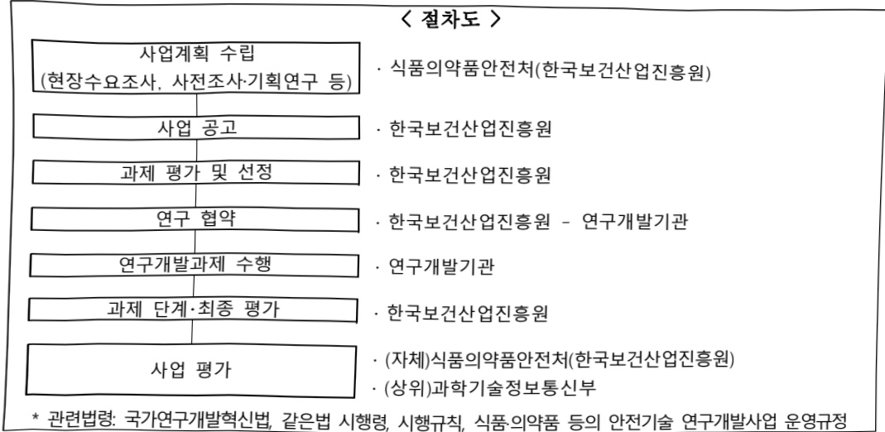

# 컴퓨터모델링 기반 의료기기 평가체계 구축(R&D)

**해당 페이지**: PDF 4596 ~ 4603 쪽 해당

**부처**: 식품의약품안전처
**분야**: 보건
**회계유형**: 일반회계
**2026 확정예산**: 7592.0 백만원
**전년대비 증감률**: 14.3%
**AI 도메인**: LLM/언어모델, 의료/바이오, 건설/스마트시티

---

<table border=1 style='margin: auto; word-wrap: break-word;'><tr><td style='text-align: center; word-wrap: break-word;'>사 업 명</td></tr><tr><td style='text-align: center; word-wrap: break-word;'>(56) 컴퓨터모델링 기반 의료기기 평가체계 구축(R&amp;D) (4031-320)</td></tr></table>

## ☐ 사업 코드 정보

<table border=1 style='margin: auto; word-wrap: break-word;'><tr><td style='text-align: center; word-wrap: break-word;'>구분</td><td style='text-align: center; word-wrap: break-word;'>회계</td><td style='text-align: center; word-wrap: break-word;'>소관</td><td style='text-align: center; word-wrap: break-word;'>실국(기관)</td><td style='text-align: center; word-wrap: break-word;'>계정</td><td style='text-align: center; word-wrap: break-word;'>분야</td><td style='text-align: center; word-wrap: break-word;'>부문</td></tr><tr><td style='text-align: center; word-wrap: break-word;'>코드</td><td rowspan="2">일반회계</td><td style='text-align: center; word-wrap: break-word;'>식품의약품</td><td style='text-align: center; word-wrap: break-word;'>식품의약품</td><td rowspan="2"></td><td style='text-align: center; word-wrap: break-word;'>090</td><td style='text-align: center; word-wrap: break-word;'>093</td></tr><tr><td style='text-align: center; word-wrap: break-word;'>명칭</td><td style='text-align: center; word-wrap: break-word;'>안전처</td><td style='text-align: center; word-wrap: break-word;'>안전평가원</td><td style='text-align: center; word-wrap: break-word;'>보건</td><td style='text-align: center; word-wrap: break-word;'>식품의약안전</td></tr></table>

<table border=1 style='margin: auto; word-wrap: break-word;'><tr><td style='text-align: center; word-wrap: break-word;'>구분</td><td style='text-align: center; word-wrap: break-word;'>프로그램</td><td style='text-align: center; word-wrap: break-word;'>단위사업</td><td style='text-align: center; word-wrap: break-word;'>세부사업</td></tr><tr><td style='text-align: center; word-wrap: break-word;'>코드</td><td style='text-align: center; word-wrap: break-word;'>4000</td><td style='text-align: center; word-wrap: break-word;'>4031</td><td style='text-align: center; word-wrap: break-word;'>320</td></tr><tr><td style='text-align: center; word-wrap: break-word;'>명칭</td><td style='text-align: center; word-wrap: break-word;'>과학적 안전관리 연구 및 허가심사 안전성 제고</td><td style='text-align: center; word-wrap: break-word;'>식의약품 안전 연구개발</td><td style='text-align: center; word-wrap: break-word;'>컴퓨터모델링 기반 의료기기 평가체계 구축(R&amp;D)</td></tr></table>

☐ 사업 성격

<table border=1 style='margin: auto; word-wrap: break-word;'><tr><td rowspan="2">신규</td><td rowspan="2">계속</td><td rowspan="2">완료</td><td rowspan="2">예비타당성 실시여부</td><td rowspan="2">총사업비 관리대상</td><td rowspan="2">총액계상 예산사업</td><td style='text-align: center; word-wrap: break-word;'>사업소관 변경정보</td></tr><tr><td style='text-align: center; word-wrap: break-word;'>2025예산 시 소관</td></tr><tr><td style='text-align: center; word-wrap: break-word;'></td><td style='text-align: center; word-wrap: break-word;'>O</td><td style='text-align: center; word-wrap: break-word;'></td><td style='text-align: center; word-wrap: break-word;'></td><td style='text-align: center; word-wrap: break-word;'></td><td style='text-align: center; word-wrap: break-word;'></td><td style='text-align: center; word-wrap: break-word;'></td></tr></table>

□ 사업 지원 형태 및 지원을

<table border=1 style='margin: auto; word-wrap: break-word;'><tr><td style='text-align: center; word-wrap: break-word;'>직접</td><td style='text-align: center; word-wrap: break-word;'>출자</td><td style='text-align: center; word-wrap: break-word;'>출연</td><td style='text-align: center; word-wrap: break-word;'>보조</td><td style='text-align: center; word-wrap: break-word;'>융자</td><td style='text-align: center; word-wrap: break-word;'>국고보조율(%)</td><td style='text-align: center; word-wrap: break-word;'>융자율(%)</td></tr><tr><td style='text-align: center; word-wrap: break-word;'></td><td style='text-align: center; word-wrap: break-word;'></td><td style='text-align: center; word-wrap: break-word;'>O</td><td style='text-align: center; word-wrap: break-word;'></td><td style='text-align: center; word-wrap: break-word;'></td><td style='text-align: center; word-wrap: break-word;'></td><td style='text-align: center; word-wrap: break-word;'></td></tr></table>

## □ 사업 담당자

<table border=1 style='margin: auto; word-wrap: break-word;'><tr><td style='text-align: center; word-wrap: break-word;'>사업명</td><td colspan="2">구분</td></tr><tr><td rowspan="3">컴퓨터모델링기반의료기기평가체계구축(R&amp;D)</td><td rowspan="2">소관부처</td><td style='text-align: center; word-wrap: break-word;'>의료제품연구부</td></tr><tr><td style='text-align: center; word-wrap: break-word;'>의료기기연구과</td></tr><tr><td style='text-align: center; word-wrap: break-word;'>사업시행주체</td><td style='text-align: center; word-wrap: break-word;'>한국보건산업진흥원</td></tr></table>

---

### 가.예산 총괄표

(단위: 백만원, %)

<table border=1 style='margin: auto; word-wrap: break-word;'><tr><td rowspan="2">사업명</td><td rowspan="2">2024년 결산</td><td colspan="2">2025년 예산</td><td colspan="2">2026년</td><td rowspan="2">중감(B-A)</td><td rowspan="2">(B-A)/A</td></tr><tr><td style='text-align: center; word-wrap: break-word;'>본예산(A)</td><td style='text-align: center; word-wrap: break-word;'>추경</td><td style='text-align: center; word-wrap: break-word;'>요구</td><td style='text-align: center; word-wrap: break-word;'>예산(B)</td></tr><tr><td style='text-align: center; word-wrap: break-word;'>컴퓨터모델링 기반의료기기 평가체계 구축(R&amp;D)</td><td style='text-align: center; word-wrap: break-word;'>3,742</td><td style='text-align: center; word-wrap: break-word;'>6,642</td><td style='text-align: center; word-wrap: break-word;'>6,642</td><td style='text-align: center; word-wrap: break-word;'>7,592</td><td style='text-align: center; word-wrap: break-word;'>7,592</td><td style='text-align: center; word-wrap: break-word;'>950</td><td style='text-align: center; word-wrap: break-word;'>14.3</td></tr></table>

□ 기능별(내역사업별) 예산 내역

(단위:백만원)

<table border=1 style='margin: auto; word-wrap: break-word;'><tr><td rowspan="3"></td><td colspan="5">2024</td><td colspan="7">2025</td><td rowspan="3">2026예산</td></tr><tr><td rowspan="2">예산액(추경)</td><td rowspan="2">예산현액</td><td rowspan="2">집행액[실집행액]</td><td rowspan="2">이월액</td><td rowspan="2">불용액</td><td rowspan="2">본예산</td><td rowspan="2">예산현액</td><td rowspan="2">집행액[실집행액]</td><td colspan="2">전년도 이월액제외</td><td rowspan="2">이월액</td><td rowspan="2">불용액</td></tr><tr><td style='text-align: center; word-wrap: break-word;'>예산현액</td><td style='text-align: center; word-wrap: break-word;'>집행액[실집행액]</td></tr><tr><td style='text-align: center; word-wrap: break-word;'>○ 기능별 분류(합계)</td><td style='text-align: center; word-wrap: break-word;'>3,742</td><td style='text-align: center; word-wrap: break-word;'>3,742</td><td style='text-align: center; word-wrap: break-word;'>3,742[3,742]</td><td style='text-align: center; word-wrap: break-word;'>-</td><td style='text-align: center; word-wrap: break-word;'>-</td><td style='text-align: center; word-wrap: break-word;'>6,642</td><td style='text-align: center; word-wrap: break-word;'>6,642[6,642]</td><td style='text-align: center; word-wrap: break-word;'>6,642[6,642]</td><td style='text-align: center; word-wrap: break-word;'>6,642[6,642]</td><td style='text-align: center; word-wrap: break-word;'>6,642[6,642]</td><td style='text-align: center; word-wrap: break-word;'>-</td><td style='text-align: center; word-wrap: break-word;'>-</td><td style='text-align: center; word-wrap: break-word;'>7,592</td></tr><tr><td style='text-align: center; word-wrap: break-word;'>· 컴퓨터모델링시뮬레이션 디지털평가기반 마련</td><td style='text-align: center; word-wrap: break-word;'>3,742</td><td style='text-align: center; word-wrap: break-word;'>3,742</td><td style='text-align: center; word-wrap: break-word;'>3,742[3,742]</td><td style='text-align: center; word-wrap: break-word;'>-</td><td style='text-align: center; word-wrap: break-word;'>-</td><td style='text-align: center; word-wrap: break-word;'>3,742</td><td style='text-align: center; word-wrap: break-word;'>3,742[3,742]</td><td style='text-align: center; word-wrap: break-word;'>3,742[3,742]</td><td style='text-align: center; word-wrap: break-word;'>3,742[3,742]</td><td style='text-align: center; word-wrap: break-word;'>3,742[3,742]</td><td style='text-align: center; word-wrap: break-word;'>-</td><td style='text-align: center; word-wrap: break-word;'>-</td><td style='text-align: center; word-wrap: break-word;'>3,742</td></tr><tr><td style='text-align: center; word-wrap: break-word;'>· 첨단의료 AI안전성 · 신뢰성향상 기술개발</td><td style='text-align: center; word-wrap: break-word;'>-</td><td style='text-align: center; word-wrap: break-word;'>-</td><td style='text-align: center; word-wrap: break-word;'>-</td><td style='text-align: center; word-wrap: break-word;'>-</td><td style='text-align: center; word-wrap: break-word;'>-</td><td style='text-align: center; word-wrap: break-word;'>2,900</td><td style='text-align: center; word-wrap: break-word;'>2,900[2,900]</td><td style='text-align: center; word-wrap: break-word;'>2,900[2,900]</td><td style='text-align: center; word-wrap: break-word;'>2,900[2,900]</td><td style='text-align: center; word-wrap: break-word;'>2,900[2,900]</td><td style='text-align: center; word-wrap: break-word;'>-</td><td style='text-align: center; word-wrap: break-word;'>-</td><td style='text-align: center; word-wrap: break-word;'>3,850</td></tr></table>

---

### 나. 사업설명자료

## 1 ) 사업목적·내용

- (컴퓨터모델링 기반 의료기기 평가체계 구축) 컴퓨터모델링 및 시뮬레이션(CM&S)

기반 의료기기 디지털 개발 도구(M3DT) 개발 및 첨단 AI 기술 기반 디지털의료제품

위험 분석·관리 시스템 개발

- (컴퓨터모델링 시뮬레이션 디지털 평가기반 마련) 동 내역사업은 디지털 트윈의 핵심 기술인 컴퓨터모델링 및 시뮬레이션(CMS)을 이용한 의료기기 디지털 개발도구(Medical Device Digital Development Tool, M3DT)의 개발로 의료기기 디지털 평가기반 구축을 지원하는 것임

O CMS(Computational Modeling and Simulation): 현실세계를 컴퓨터 기반의 가상 시스템에 구현 및 구동하는 기술
O M3DT(Medical Device Digital Development Tools)
- 의료기기의 안전성 및 유효성을 평가하는데 사용하는 디지털화된 가상의 평가도구
- 기존의 의료기기 평가체계에 디지털 처리기술을 접목한 평가기술 자체를 의미할 뿐만 아니라, 평가기술을 디지털화하기 위해 필요한 다양한 평가·개발도구를 포함함

- (첨단의료 AI 안전성·신뢰성 향상 기술개발) 동 내역사업은 생성형 AI, 멀티모달 AI 등 첨단 AI 기술에 기반한 디지털 의료제품의 안전성과 신뢰성 향상을 위한 기준 및 시스템을 개발하고, 디지털 의료제품의 제조·수입 등 취급과 관리 및 지원할 수 있는 근거를 마련하는 것임

## 2 ) 사업개요

## □ 사업근거 및 추진경위

① 법령상 근거 및 조항 적시

- 식품·의약품 등의 안전 및 제품화 지원에 관한 규제과학혁신법 제7조(연구개발 사업의 추진) ① 식품의약품안전처장은 식품·의약품 등이 신속하게 제품화되어 국민이 안전하게 사용하는 데 필요한 새로운 평가기술·기준 및 방법 등의 과학적 근거를 개발하는 등 식품·의약품 등의 안전관리를 합리적으로 수행하기 위하여 필요한 연구개발사업(이하 “연구개발사업”이라 한다)을 한다.

- 식품·의약품 등의 안전 및 제품화 지원에 관한 규제과학혁신법 제8조(출연금)

① 식품의약품안전처장은 제7조제2항에 따른 연구를 수행하는 데 드는 비용을 충당하기 위하여 예산의 범위에서 연구개발기관에 출연금을 지급할 수 있다.

- 의료기기법 제19조(기준규격) 식품의약품안전처장은 의료기기의 품질에 대한 기준이 필요하다고 인정하는 의료기기에 대하여 그 적용범위, 형상 또는 구조, 시험규격, 기재사항 등을 기준규격으로 정할 수 있다.

---

- 의료기기법 제27조(시험검사) ① 식품의약품안전처장은 제6조제2항, 제12조 또는 제15조제2항 · 제6항에 따라 허가 또는 인증을 하거나 신고를 받기 전이나 제33조에 따라 검사명령을 한 경우에는 의료기기의 안전성 및 성능 등에 관하여 시험검사를 할 수 있다. ② 식품의약품안전처장은 제1항에 따른 시험검사를 「식품·의약품분야 시험·검사 등에 관한 법률」 제6조제2항제4호에 따라 식품의약품안전처장이 지정한 의료기기 시험·검사기관에서 수행하도록 할 수 있다.

- 의료기기산업 육성 및 혁신의료기기 지원법 제25조(연구개발사업 추진 및 지원)

① 정부는 의료기기 품질평가 기반 구축, 의료기기 기준 규격화사업 지원, 그 밖에 의료기기산업의 발전을 위한 연구개발사업을 추진할 수 있다. ② 정부는 제1항에 따른 사업을 관련 기관 및 단체로 하여금 수행하게 할 수 있고, 이에 필요한 비용을 지원할 수 있다.

- 디지털의료제품법 제42조(연구개발 및 표준화 지원) ① 식품의약품안전처장은 디지털의료제품의 안전관리를 효과적으로 수행하기 위하여 필요한 연구개발사업을 할 수 있다. ② 식품의약품안전처장은 제1항에 따른 연구개발사업 등을 통하여 개발된 디지털의료제품 평가 기술·기준 및 방법 등의 표준화를 위하여 국내외 표준의 조사·연구·개발, 표준화기반 구축 등을 지원할 수 있다.

## ② 추진경위

- '17.08 : 4차 산업 혁명 위원회 설치로 AI, 로봇 등의 의료기기(건강분야) 육성

- '17.10 : 「제3차 생명공학육성기본계획(2018~2025)」 수립

- '18.01 : 「제2차 보건의료기술육성 기본계획」

- '18.03 : 「제4차 과학기술 기본계획(2018~2022)」

- '18.09 : 의료기기 분야 혁신성장 확산 추진

- '20.05 : 「의료기기산업 육성 및 혁신의료기기 지원법」 시행

- '20.05 : 「체외진단의료기기법」 시행

- '21.03 : 「'22년 정부연구개발 투자방향 및 기준」마련

- '21.06 : 「바이오헬스 규제과학 발전전략」마련(과학기술관계장관회의)

- '21.09 : 사업 추진을 위한 기획연구 추진 완료

- '22.03 : '23년 정부연구개발 투자방향 및 기준」마련

- '23.04 : 연구개발기관 선정·협약 및 연구 개시

- '23.09 : 사업 추진을 위한 기획연구 추진 완료(첨단의료 AI)

- '24.01 : 「디지털의료제품법」 제정

- '24.03 : 「'24년 정부연구개발 투자방향 및 기준」마련

---

□ 주요내용

① 사업규모

- 총사업비 : 해당없음

- 사업기간 : 2023 ~ 2027

- 최근 5년 간 투입된 사업비

(단위: 백만원)

<table border=1 style='margin: auto; word-wrap: break-word;'><tr><td style='text-align: center; word-wrap: break-word;'>$ \underline{\text{연도}} $</td><td style='text-align: center; word-wrap: break-word;'>2022</td><td style='text-align: center; word-wrap: break-word;'>2023</td><td style='text-align: center; word-wrap: break-word;'>2024</td><td style='text-align: center; word-wrap: break-word;'>2025</td><td style='text-align: center; word-wrap: break-word;'>2026</td></tr><tr><td style='text-align: center; word-wrap: break-word;'>$ \underline{\text{사업비}} $</td><td style='text-align: center; word-wrap: break-word;'>-</td><td style='text-align: center; word-wrap: break-word;'>2,809</td><td style='text-align: center; word-wrap: break-word;'>3,742</td><td style='text-align: center; word-wrap: break-word;'>6,642</td><td style='text-align: center; word-wrap: break-word;'>7,592</td></tr></table>

② 사업추진체계

- 사업시행방법 : 출연

- 사업시행주체 : 식품의약품안전처(전문기관: 한국보건산업진흥원)

- 사업 수혜자 : 민간

- 보조, 융자, 출연, 출자 등의 경우 보조 · 융자 등 지원 비율 및 법적근거

<table border=1 style='margin: auto; word-wrap: break-word;'><tr><td style='text-align: center; word-wrap: break-word;'>내역사업명</td><td style='text-align: center; word-wrap: break-word;'>구분</td><td style='text-align: center; word-wrap: break-word;'>피보조·피출연 등 기관명</td><td style='text-align: center; word-wrap: break-word;'>지원 금액 (2026예산)</td><td style='text-align: center; word-wrap: break-word;'>지원 비율(%)</td><td style='text-align: center; word-wrap: break-word;'>보조율 법적근거 (해당 조항)</td></tr><tr><td rowspan="4">컴퓨터모델링 시뮬레이션 디지털 평가기반 마련</td><td rowspan="4">출연</td><td style='text-align: center; word-wrap: break-word;'>대학 출연연 등비량기반</td><td rowspan="4">3,742백만원</td><td style='text-align: center; word-wrap: break-word;'>100</td><td rowspan="8">• 식품·의약품 등의 안전 및 제품화 지원에 관한 규제과학혁신법 제8조제1항 • 국가연구개발혁신법 제13조제1항 및 동법 시행령 제19조제3항</td></tr><tr><td style='text-align: center; word-wrap: break-word;'>대기업, 공기업</td><td style='text-align: center; word-wrap: break-word;'>50</td></tr><tr><td style='text-align: center; word-wrap: break-word;'>중견기업</td><td style='text-align: center; word-wrap: break-word;'>70</td></tr><tr><td style='text-align: center; word-wrap: break-word;'>중소기업</td><td style='text-align: center; word-wrap: break-word;'>75</td></tr><tr><td rowspan="4">첨단의료 AI 안전성·신뢰성 향상 기술개발</td><td rowspan="4">출연</td><td style='text-align: center; word-wrap: break-word;'>대학 출연연 등비량기반</td><td rowspan="4">3,850백만원</td><td style='text-align: center; word-wrap: break-word;'>100</td></tr><tr><td style='text-align: center; word-wrap: break-word;'>대기업, 공기업</td><td style='text-align: center; word-wrap: break-word;'>50</td></tr><tr><td style='text-align: center; word-wrap: break-word;'>중견기업</td><td style='text-align: center; word-wrap: break-word;'>70</td></tr><tr><td style='text-align: center; word-wrap: break-word;'>중소기업</td><td style='text-align: center; word-wrap: break-word;'>75</td></tr></table>

---

## 3 ) 2026년도 예산 산출 근거

<table border=1 style='margin: auto; word-wrap: break-word;'><tr><td style='text-align: center; word-wrap: break-word;'>① 컴퓨터모델링 시뮬레이션 디지털 평가기반 마련 : (2025) 3,742백만원 → (2026) 3,742백만원. 전년동 - (요구) M3DT 개발/평가/활용 프레임워크 마련 및 공유 플랫폼 구축·운영, 의료기기 분야별 M3DT 개발 및 실증, 실효성 검증방안 마련 등 계속과제의 연차소요를 위해 ‘26년 3,742백만원 요구 - (산출) (계속) 6과제×624백만×12/12개월=3,742백만원</td></tr><tr><td style='text-align: center; word-wrap: break-word;'>② 첨단의료 AI 안전성·신뢰성 향상 기술개발 : (2025) 2,900백만원 → (2026) 3,850백만원, 950백만원 증액 - (요구) 생성형 AI 디지털의료제품 취약점 식별 기술 개발, AI 디지털의료제품 사이버보안 지원 기술 개발, AI 기반 디지털의료제품 등 유형별 안전성 평가 기술 개발 등 계속과제의 단가 조정 감안, ‘26년 3,850백만원 요구 - (산출) (계속) 7과제×550백만×12/12개월=3,850백만원</td></tr></table>

## 4 ) 사업효과

## □ 사업영향, 산출물 성과지표 등

① 2022~2026년도 성과계획서 상 성과지표 및 최근 5년간 성과 달성도

<table border=1 style='margin: auto; word-wrap: break-word;'><tr><td rowspan="2">성과지표</td><td rowspan="2">가중치</td><td rowspan="2">성과분야</td><td colspan="8">실적 및 목표치</td><td rowspan="2">측정산식 또는 측정방법</td><td rowspan="2">자료수집방법/출처</td></tr><tr><td style='text-align: center; word-wrap: break-word;'>구분</td><td style='text-align: center; word-wrap: break-word;'>&#x27;22</td><td style='text-align: center; word-wrap: break-word;'>&#x27;23</td><td style='text-align: center; word-wrap: break-word;'>&#x27;24</td><td style='text-align: center; word-wrap: break-word;'>&#x27;25</td><td style='text-align: center; word-wrap: break-word;'>&#x27;26</td><td style='text-align: center; word-wrap: break-word;'>&#x27;27</td><td style='text-align: center; word-wrap: break-word;'>&#x27;28</td></tr><tr><td rowspan="2">①식·의약안전정책연계율(%)</td><td rowspan="2">1</td><td rowspan="2">R&amp;D</td><td style='text-align: center; word-wrap: break-word;'>목표</td><td style='text-align: center; word-wrap: break-word;'>70</td><td style='text-align: center; word-wrap: break-word;'>71</td><td style='text-align: center; word-wrap: break-word;'>71.5</td><td style='text-align: center; word-wrap: break-word;'>72</td><td style='text-align: center; word-wrap: break-word;'>72.5</td><td style='text-align: center; word-wrap: break-word;'>72.5</td><td style='text-align: center; word-wrap: break-word;'>72.5</td><td rowspan="2">(당해연도 정책 반영건수) / (정책제안건수) × 100</td><td rowspan="2">고시개정(안), 가이드라인지침 등정책제안관련공문</td></tr><tr><td style='text-align: center; word-wrap: break-word;'>실적</td><td style='text-align: center; word-wrap: break-word;'>70.1</td><td style='text-align: center; word-wrap: break-word;'>71.4</td><td style='text-align: center; word-wrap: break-word;'>71.6</td><td style='text-align: center; word-wrap: break-word;'>-</td><td style='text-align: center; word-wrap: break-word;'>-</td><td style='text-align: center; word-wrap: break-word;'>-</td><td style='text-align: center; word-wrap: break-word;'>-</td></tr></table>

② 성과지표 이외의 연도별 사업추진 경과 및 실적

<table border=1 style='margin: auto; word-wrap: break-word;'><tr><td style='text-align: center; word-wrap: break-word;'>2022</td><td style='text-align: center; word-wrap: break-word;'>-</td></tr><tr><td style='text-align: center; word-wrap: break-word;'>2023</td><td style='text-align: center; word-wrap: break-word;'>○ SCIE 논문 게재(4건)○ 국내 특허 출원(1건)○ 연구성과 교류회 개최(2건)</td></tr><tr><td style='text-align: center; word-wrap: break-word;'>2024</td><td style='text-align: center; word-wrap: break-word;'>○ SCIE 논문 게재(9건)○ 연구성과 교류회 개최(3건)</td></tr><tr><td style='text-align: center; word-wrap: break-word;'>2025</td><td style='text-align: center; word-wrap: break-word;'>○ 컴퓨터모델링 기반 의료기기 평가체계 구축 사업 연구수행 중</td></tr></table>

---

③ 향후(2026년도 이후) 기대효과

- CM&S 기반의 디지털 평가체계 마련을 위한 M3DT 공유 플랫폼 구축 완료

(27년 기준, 구축률 100%)

- 디지털 평가체계 신뢰성 확보를 위한 M3DT 유효성(실효성) 검증(18건)

- 디지털의료제품 취약점 식별을 위한 레드팀 테스팅 운영(6건)

5) 타당성조사 및 예비타당성조사 시행여부 및 결과 요지 : 해당없음

6) 총사업비 대상사업 여부 및 내역 : 해당없음

## 7 ) 사업 집행절차

9) 최근 3년간 동 사업에 대한 주요 외부지적사항 및 평가, 문제점 및 대책 : 해당없음

---

### 다. 최근 4년간 결산내역

## 1 ) 결산표

☐ 부처 결산내역

(단위: 백만원, %)

<table border=1 style='margin: auto; word-wrap: break-word;'><tr><td rowspan="2">闰도</td><td colspan="3">예산액</td><td rowspan="2">전년도 이월액</td><td rowspan="2">이·전용 등</td><td rowspan="2">예비비</td><td rowspan="2">예산 현액(B)</td><td rowspan="2">집행액 (C)</td><td rowspan="2">집행률 (C/A)</td><td rowspan="2">집행률 (C/B)</td><td rowspan="2">다음연도 이월액</td><td rowspan="2">불용액</td></tr><tr><td style='text-align: center; word-wrap: break-word;'>본예산</td><td style='text-align: center; word-wrap: break-word;'>추경중감액</td><td style='text-align: center; word-wrap: break-word;'>추경(A)</td></tr><tr><td style='text-align: center; word-wrap: break-word;'>2022</td><td style='text-align: center; word-wrap: break-word;'>-</td><td style='text-align: center; word-wrap: break-word;'>-</td><td style='text-align: center; word-wrap: break-word;'>-</td><td style='text-align: center; word-wrap: break-word;'>-</td><td style='text-align: center; word-wrap: break-word;'>-</td><td style='text-align: center; word-wrap: break-word;'>-</td><td style='text-align: center; word-wrap: break-word;'>-</td><td style='text-align: center; word-wrap: break-word;'>-</td><td style='text-align: center; word-wrap: break-word;'>-</td><td style='text-align: center; word-wrap: break-word;'>-</td><td style='text-align: center; word-wrap: break-word;'>-</td><td style='text-align: center; word-wrap: break-word;'>-</td></tr><tr><td style='text-align: center; word-wrap: break-word;'>2023</td><td style='text-align: center; word-wrap: break-word;'>2,809</td><td style='text-align: center; word-wrap: break-word;'>-</td><td style='text-align: center; word-wrap: break-word;'>2,809</td><td style='text-align: center; word-wrap: break-word;'>-</td><td style='text-align: center; word-wrap: break-word;'>-</td><td style='text-align: center; word-wrap: break-word;'>-</td><td style='text-align: center; word-wrap: break-word;'>2,809</td><td style='text-align: center; word-wrap: break-word;'>2,809</td><td style='text-align: center; word-wrap: break-word;'>100</td><td style='text-align: center; word-wrap: break-word;'>100</td><td style='text-align: center; word-wrap: break-word;'>-</td><td style='text-align: center; word-wrap: break-word;'>-</td></tr><tr><td style='text-align: center; word-wrap: break-word;'>2024</td><td style='text-align: center; word-wrap: break-word;'>3,742</td><td style='text-align: center; word-wrap: break-word;'>-</td><td style='text-align: center; word-wrap: break-word;'>3,742</td><td style='text-align: center; word-wrap: break-word;'>-</td><td style='text-align: center; word-wrap: break-word;'>-</td><td style='text-align: center; word-wrap: break-word;'>-</td><td style='text-align: center; word-wrap: break-word;'>3,742</td><td style='text-align: center; word-wrap: break-word;'>3,742</td><td style='text-align: center; word-wrap: break-word;'>100</td><td style='text-align: center; word-wrap: break-word;'>100</td><td style='text-align: center; word-wrap: break-word;'>-</td><td style='text-align: center; word-wrap: break-word;'>-</td></tr><tr><td style='text-align: center; word-wrap: break-word;'>2025</td><td style='text-align: center; word-wrap: break-word;'>6,642</td><td style='text-align: center; word-wrap: break-word;'>-</td><td style='text-align: center; word-wrap: break-word;'>6,642</td><td style='text-align: center; word-wrap: break-word;'>-</td><td style='text-align: center; word-wrap: break-word;'>-</td><td style='text-align: center; word-wrap: break-word;'>-</td><td style='text-align: center; word-wrap: break-word;'>6,642</td><td style='text-align: center; word-wrap: break-word;'>6,642</td><td style='text-align: center; word-wrap: break-word;'>100</td><td style='text-align: center; word-wrap: break-word;'>100</td><td style='text-align: center; word-wrap: break-word;'>-</td><td style='text-align: center; word-wrap: break-word;'>-</td></tr></table>

□ 출연·보조사업 등 실집행내역

(단위: 백만원, %)

<table border=1 style='margin: auto; word-wrap: break-word;'><tr><td rowspan="3">구분</td><td colspan="3">부처</td><td colspan="6">사업시행주체(피출연·피보조 기관 등)</td></tr><tr><td colspan="2">예산액</td><td rowspan="2">집행액</td><td rowspan="2">교부액</td><td rowspan="2">전년도 이월액</td><td rowspan="2">교부 현액</td><td rowspan="2">집행액 (B)</td><td rowspan="2">이월액</td><td rowspan="2">불용액 (B/A)</td></tr><tr><td style='text-align: center; word-wrap: break-word;'>본예산</td><td style='text-align: center; word-wrap: break-word;'>추경(A)</td></tr><tr><td style='text-align: center; word-wrap: break-word;'>2022</td><td style='text-align: center; word-wrap: break-word;'>-</td><td style='text-align: center; word-wrap: break-word;'>-</td><td style='text-align: center; word-wrap: break-word;'>-</td><td style='text-align: center; word-wrap: break-word;'>-</td><td style='text-align: center; word-wrap: break-word;'>-</td><td style='text-align: center; word-wrap: break-word;'>-</td><td style='text-align: center; word-wrap: break-word;'>-</td><td style='text-align: center; word-wrap: break-word;'>-</td><td style='text-align: center; word-wrap: break-word;'>-</td></tr><tr><td style='text-align: center; word-wrap: break-word;'>2023</td><td style='text-align: center; word-wrap: break-word;'>2,809</td><td style='text-align: center; word-wrap: break-word;'>2,809</td><td style='text-align: center; word-wrap: break-word;'>2,809</td><td style='text-align: center; word-wrap: break-word;'>2,809</td><td style='text-align: center; word-wrap: break-word;'>-</td><td style='text-align: center; word-wrap: break-word;'>2,809</td><td style='text-align: center; word-wrap: break-word;'>2,809</td><td style='text-align: center; word-wrap: break-word;'>-</td><td style='text-align: center; word-wrap: break-word;'>-</td></tr><tr><td style='text-align: center; word-wrap: break-word;'>2024</td><td style='text-align: center; word-wrap: break-word;'>3,742</td><td style='text-align: center; word-wrap: break-word;'>3,742</td><td style='text-align: center; word-wrap: break-word;'>3,742</td><td style='text-align: center; word-wrap: break-word;'>3,742</td><td style='text-align: center; word-wrap: break-word;'>-</td><td style='text-align: center; word-wrap: break-word;'>3,742</td><td style='text-align: center; word-wrap: break-word;'>3,742</td><td style='text-align: center; word-wrap: break-word;'>-</td><td style='text-align: center; word-wrap: break-word;'>-</td></tr><tr><td style='text-align: center; word-wrap: break-word;'>2025</td><td style='text-align: center; word-wrap: break-word;'>6,642</td><td style='text-align: center; word-wrap: break-word;'>6,642</td><td style='text-align: center; word-wrap: break-word;'>6,642</td><td style='text-align: center; word-wrap: break-word;'>6,642</td><td style='text-align: center; word-wrap: break-word;'>-</td><td style='text-align: center; word-wrap: break-word;'>6,642</td><td style='text-align: center; word-wrap: break-word;'>6,642</td><td style='text-align: center; word-wrap: break-word;'>-</td><td style='text-align: center; word-wrap: break-word;'>-</td></tr></table>

## 2 ) 주요 결산사항

2022~2025년 결산사항 : 해당없음

2025년 이·전용 등 세부내역 : 해당없음

---

### 원본 PDF 크롭 이미지

