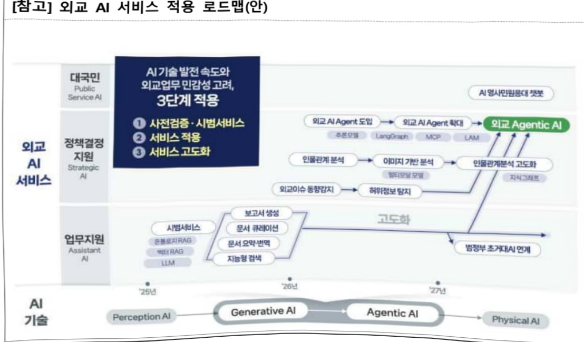
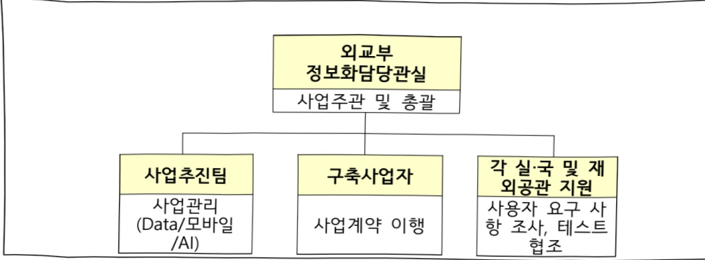

# 외교업무 디지털 혁신(정보화)

**해당 페이지**: PDF 4604 ~ 4613 쪽 해당

**부처**: 외교부
**분야**: 외교·통일
**회계유형**: 일반회계
**2026 확정예산**: 13962.0 백만원
**전년대비 증감률**: 5.3%
**AI 도메인**: 데이터, 통신/네트워크, 디지털전환(AX)

---

<table border=1 style='margin: auto; word-wrap: break-word;'><tr><td style='text-align: center; word-wrap: break-word;'>시스템 운영 및 유지관리</td><td style='text-align: center; word-wrap: break-word;'>사업 시행 주체</td><td style='text-align: center; word-wrap: break-word;'>외교부</td></tr><tr><td rowspan="3">지능형 외교안보 데이터 플랫폼 구축</td><td rowspan="2">소관부처</td><td style='text-align: center; word-wrap: break-word;'>기획조정실 정보관리기획관실</td></tr><tr><td style='text-align: center; word-wrap: break-word;'>정보화담당관실</td></tr><tr><td style='text-align: center; word-wrap: break-word;'>사업 시행 주체</td><td style='text-align: center; word-wrap: break-word;'>외교부</td></tr></table>

### 가.예산 총괄표

(단위:백만원,%)

<table border=1 style='margin: auto; word-wrap: break-word;'><tr><td rowspan="2">사업명</td><td rowspan="2">2024년 결산</td><td colspan="2">2025년 예산</td><td colspan="2">2026년 예산</td><td rowspan="2">증감(B-A)</td><td rowspan="2">(B-A)/A</td></tr><tr><td style='text-align: center; word-wrap: break-word;'>본예산</td><td style='text-align: center; word-wrap: break-word;'>추경*(A)</td><td style='text-align: center; word-wrap: break-word;'>요구안</td><td style='text-align: center; word-wrap: break-word;'>본예산(B)</td></tr><tr><td style='text-align: center; word-wrap: break-word;'>정보보호 및 외교정보시스템 구축·운영(정보화)</td><td style='text-align: center; word-wrap: break-word;'>2,569</td><td style='text-align: center; word-wrap: break-word;'>13,254</td><td style='text-align: center; word-wrap: break-word;'>13,254</td><td style='text-align: center; word-wrap: break-word;'>13,962</td><td style='text-align: center; word-wrap: break-word;'>13,962</td><td style='text-align: center; word-wrap: break-word;'>708</td><td style='text-align: center; word-wrap: break-word;'>5.3</td></tr></table>

*추경: 추경중감액을 포함한 최종 예산액을 기재

## □ 기능별(내역사업별) 예산 내역

(단위:백만원)

<table border=1 style='margin: auto; word-wrap: break-word;'><tr><td rowspan="2"></td><td colspan="5">2024</td><td colspan="5">2025</td><td rowspan="2">2026예산</td></tr><tr><td style='text-align: center; word-wrap: break-word;'>예산액(추경)</td><td style='text-align: center; word-wrap: break-word;'>예산현액</td><td style='text-align: center; word-wrap: break-word;'>집행액</td><td style='text-align: center; word-wrap: break-word;'>아월액</td><td style='text-align: center; word-wrap: break-word;'>불용액</td><td style='text-align: center; word-wrap: break-word;'>예산액(추경)</td><td style='text-align: center; word-wrap: break-word;'>예산현액</td><td style='text-align: center; word-wrap: break-word;'>집행액</td><td style='text-align: center; word-wrap: break-word;'>이월액</td><td style='text-align: center; word-wrap: break-word;'>불용액</td></tr><tr><td style='text-align: center; word-wrap: break-word;'>○ 기능별 분류(합계)</td><td style='text-align: center; word-wrap: break-word;'>2,666</td><td style='text-align: center; word-wrap: break-word;'>2,666</td><td style='text-align: center; word-wrap: break-word;'>2,569</td><td style='text-align: center; word-wrap: break-word;'>-</td><td style='text-align: center; word-wrap: break-word;'>97</td><td style='text-align: center; word-wrap: break-word;'>13,254</td><td style='text-align: center; word-wrap: break-word;'>13,254</td><td style='text-align: center; word-wrap: break-word;'>13,038</td><td style='text-align: center; word-wrap: break-word;'>-</td><td style='text-align: center; word-wrap: break-word;'>216</td><td style='text-align: center; word-wrap: break-word;'>13,962</td></tr><tr><td rowspan="7">·재외공관 클라우드기반의 해외정보 범정부 활용체계 운영·재외공관 스마트 업무환경 구축 후 운영관리·5G 정부망 운영·5G 정부망 통신료·외교정보단 DB 구축·스마트 업무환경 시스템 운영 및 유지관리·지능형 외교 안보데이터 플랫폼 구축</td><td style='text-align: center; word-wrap: break-word;'>500</td><td style='text-align: center; word-wrap: break-word;'>500</td><td style='text-align: center; word-wrap: break-word;'>448</td><td style='text-align: center; word-wrap: break-word;'>-</td><td style='text-align: center; word-wrap: break-word;'>52</td><td style='text-align: center; word-wrap: break-word;'>1,632</td><td style='text-align: center; word-wrap: break-word;'>1,634</td><td style='text-align: center; word-wrap: break-word;'>1,608</td><td style='text-align: center; word-wrap: break-word;'>-</td><td style='text-align: center; word-wrap: break-word;'>26</td><td style='text-align: center; word-wrap: break-word;'>2,204</td></tr><tr><td style='text-align: center; word-wrap: break-word;'>239</td><td style='text-align: center; word-wrap: break-word;'>239</td><td style='text-align: center; word-wrap: break-word;'>235</td><td style='text-align: center; word-wrap: break-word;'>-</td><td style='text-align: center; word-wrap: break-word;'>4</td><td style='text-align: center; word-wrap: break-word;'>-</td><td style='text-align: center; word-wrap: break-word;'>-</td><td style='text-align: center; word-wrap: break-word;'>-</td><td style='text-align: center; word-wrap: break-word;'>-</td><td style='text-align: center; word-wrap: break-word;'>-</td><td style='text-align: center; word-wrap: break-word;'>-</td></tr><tr><td style='text-align: center; word-wrap: break-word;'>600</td><td style='text-align: center; word-wrap: break-word;'>600</td><td style='text-align: center; word-wrap: break-word;'>600</td><td style='text-align: center; word-wrap: break-word;'>-</td><td style='text-align: center; word-wrap: break-word;'>-</td><td style='text-align: center; word-wrap: break-word;'>-</td><td style='text-align: center; word-wrap: break-word;'>-</td><td style='text-align: center; word-wrap: break-word;'>-</td><td style='text-align: center; word-wrap: break-word;'>-</td><td style='text-align: center; word-wrap: break-word;'>-</td><td style='text-align: center; word-wrap: break-word;'>-</td></tr><tr><td style='text-align: center; word-wrap: break-word;'>300</td><td style='text-align: center; word-wrap: break-word;'>300</td><td style='text-align: center; word-wrap: break-word;'>300</td><td style='text-align: center; word-wrap: break-word;'>-</td><td style='text-align: center; word-wrap: break-word;'>-</td><td style='text-align: center; word-wrap: break-word;'>-</td><td style='text-align: center; word-wrap: break-word;'>-</td><td style='text-align: center; word-wrap: break-word;'>-</td><td style='text-align: center; word-wrap: break-word;'>-</td><td style='text-align: center; word-wrap: break-word;'>-</td><td style='text-align: center; word-wrap: break-word;'>-</td></tr><tr><td style='text-align: center; word-wrap: break-word;'>1,027</td><td style='text-align: center; word-wrap: break-word;'>1,027</td><td style='text-align: center; word-wrap: break-word;'>986</td><td style='text-align: center; word-wrap: break-word;'>-</td><td style='text-align: center; word-wrap: break-word;'>41</td><td style='text-align: center; word-wrap: break-word;'>-</td><td style='text-align: center; word-wrap: break-word;'>-</td><td style='text-align: center; word-wrap: break-word;'>-</td><td style='text-align: center; word-wrap: break-word;'>-</td><td style='text-align: center; word-wrap: break-word;'>-</td><td style='text-align: center; word-wrap: break-word;'>-</td></tr><tr><td style='text-align: center; word-wrap: break-word;'>-</td><td style='text-align: center; word-wrap: break-word;'>-</td><td style='text-align: center; word-wrap: break-word;'>-</td><td style='text-align: center; word-wrap: break-word;'>-</td><td style='text-align: center; word-wrap: break-word;'>-</td><td style='text-align: center; word-wrap: break-word;'>1,017</td><td style='text-align: center; word-wrap: break-word;'>1,015</td><td style='text-align: center; word-wrap: break-word;'>941</td><td style='text-align: center; word-wrap: break-word;'>-</td><td style='text-align: center; word-wrap: break-word;'>74</td><td style='text-align: center; word-wrap: break-word;'>1,017</td></tr><tr><td style='text-align: center; word-wrap: break-word;'>-</td><td style='text-align: center; word-wrap: break-word;'>-</td><td style='text-align: center; word-wrap: break-word;'>-</td><td style='text-align: center; word-wrap: break-word;'>-</td><td style='text-align: center; word-wrap: break-word;'>-</td><td style='text-align: center; word-wrap: break-word;'>10,605</td><td style='text-align: center; word-wrap: break-word;'>10,605</td><td style='text-align: center; word-wrap: break-word;'>10,489</td><td style='text-align: center; word-wrap: break-word;'>-</td><td style='text-align: center; word-wrap: break-word;'>116</td><td style='text-align: center; word-wrap: break-word;'>10,741</td></tr></table>

---

### 나. 사업설명자료

## 1 ) 사업목적·내용

°포스트 코로나 시대 디지털 핵심기술(데이터-스마트 업무환경-인공지능)

을 업무에 적용하여 외교환경의 변화와 업무영역의 확대에 선제적으로 대응

이 가능한 업무환경 마련

ㅇ 디지털 핵심기술을 업무에 적용, 행정 인프라 강화 및 외교업무 지능화

(스마트 업무환경) 포스트 코로나 시대 비대면·현장 중심 업무방식 지원 (전용 노트북으로 재택·현장업무 수행)

(AI) 정형화된 자료 수집·작성 등 단순·반복 업무를 자동화하여 외교역

량을 핵심 업무에 투입할 수 있는 기반 마련

(데이터) 각종 외교정보 및 해외 공개정보 적시 수집 및 활용 역할의 중요성 증가에 따라 정부기관 및 정책결정자, 기업 및 일반 국민이 필요로하는 다양한 형태의 데이터 제공 지원

## 2 ) 사업개요

## ☐ 사업근거 및 추진경위

① 법령상 근거

ㅇ 데이터 구축·개방·활용, AI기반 지능형 정부 과제 관련

0 국격에 걸맞는 글로벌 중추국가 역할 강화, 능동적 경제안보 외교 추진 등 우리부 국정과제 추진 지원

ㅇ 데이터 안전 활용 기반 강화, 일하는 방식 전환 등 디지털플랫폼정부 과제 이행을 위한 부내 중점추진 사업으로 선정

- 120대 국정과제 과력

<table border=1 style='margin: auto; word-wrap: break-word;'><tr><td colspan="3">11. 모든 데이터가 연결되는 세계 최고의 디지털플랫폼정부 구현</td></tr><tr><td style='text-align: center; word-wrap: break-word;'>과제목표</td><td colspan="2">모든 데이터가 연결되는 ‘디지털 플랫폼’위에서 국민, 기업, 정부가 함께 사회문제를 해결하고, 새로운 가치를 창출하는 정부 구현</td></tr><tr><td colspan="2">주요내용</td><td style='text-align: center; word-wrap: break-word;'>관련 사업</td></tr><tr><td colspan="2">일하는 방식 대전환</td><td style='text-align: center; word-wrap: break-word;'>· 디지털 기반 스마트 업무환경 구축 · AI를 활용한 업무자동화 MOFA Bot 도입 · 지능형 외교안보 데이터 활용전략 수립 BPR/ISP · 지능형 외교안보 데이터 플랫폼 구축(&#x27;25~&#x27;27)</td></tr><tr><td colspan="2">데이터 안전 활용 기반 강화</td><td style='text-align: center; word-wrap: break-word;'>· 지능형 외교안보 데이터 활용전략 수립 BPR/ISP · 지능형 외교안보 데이터 플랫폼 구축(&#x27;25~&#x27;27)</td></tr></table>

※ '20.12월 ㄷ데이터기반행정 활성화에 관한 법률 ㅅ시행, ㄷ디지털 정부 혁신 추진계획('19.10)」(과제 4) 현장중심 협업을 지원하는 스마트 업무환경 구현, ㄷ제6차 국가정보화기본계획 ㅅ(~2022), 인공 지능 기반의 지능형 정부 구현, ㄷ디지털플랫폼정부 실현계획('23.4.)」, 인공지능·데이터 기반의

---

## 과학적 행정 일상화

②추진경위

°2020년 외교 기반 인프라 개선을 위한 거점 클라우드 구축 ISP 사업 완료

° 정책의사결정을 위한 외부데이터 분석과제 이행( '20.4~8.)

-데이터기반 정책 지원 시스템 구축을 위한 사전 실증사업

°20년 행정안전부 주관 업무자동화(RPA)컨설팅 수행

- 재외공관 현지/한국인 행정직원 급여 업무에 RPA도입

## 주요내용

① 사업규모

- 총사업비(해당되는 경우에만 기재) : 해당없음

- 사업기간 : '22년 ~ 계속

- 최근 5년 간 투입된 사업비(예산액기준, 추경편성한 연도에는 추경포함)

<table border=1 style='margin: auto; word-wrap: break-word;'><tr><td style='text-align: center; word-wrap: break-word;'>연도</td><td style='text-align: center; word-wrap: break-word;'>2022</td><td style='text-align: center; word-wrap: break-word;'>2023</td><td style='text-align: center; word-wrap: break-word;'>2024</td><td style='text-align: center; word-wrap: break-word;'>2025</td><td style='text-align: center; word-wrap: break-word;'>2026</td></tr><tr><td style='text-align: center; word-wrap: break-word;'>사업비</td><td style='text-align: center; word-wrap: break-word;'>3,131</td><td style='text-align: center; word-wrap: break-word;'>3,649</td><td style='text-align: center; word-wrap: break-word;'>2,666</td><td style='text-align: center; word-wrap: break-word;'>13,254</td><td style='text-align: center; word-wrap: break-word;'>13,962</td></tr></table>

② 사업추진체계

- 사업시행방법 : 직접수행

- 사업시행주체 : 외교부

- 사업 수혜자 : 본부 및 재외공관

- 보조, 융자, 출연, 출자 등의 경우 보조·융자 등 지원 비율 및 법적근거 : 해당없음

## 3 ) 2026년도 예산 산출 근거

### (1) 재외공관 클라우드 기반의 해외정보 범정부 활용체계 운영 : ('25)1,632백만원 → ('26) 2,204백만원, +35.0%

- (요구)

'22~'24년「재외공관 클라우드 기반의 해외정보 범정부 활용체계」1~3차 구축 사업을 통해 구축한 클라우드 시스템의 운영 및 유지관리 예산

* 총 사업비 : 232억원 (1차 : 7,004백만원, 2차 : 8,210백만원, 3차 : 7,017백만원)

* 구축 시스템(클라우드 인프라, 무중단 시스템)의 무상 하자유지 보수 기간 만료에 따라 증액

## (2) 스마트 업무 환경 시스템 운영 및 유지관리 : (25)1,017→(26)1,017만원, 동결 - (요구)

· 5G 정부망 구축 선도사업('22년-23년, 행안부 예산)을 통해 신규 도입된 5G 정부망 운영 및 통신료 확보 필요

·재외공관 스마트 업무환경 구축사업(1단계) 완료 후 시스템 운영 예산 확보 필요.

·1단계 사업 완료 후'24년부터 HW유지보수 비용

※ 24년 3개 내역사업 통합: 재외공관 스마트업무환경 구축 후 운영관리, 5G 정부망 운영, 5G 정부망 통신료

---

- (산출):1,072백만원

·스마트 업무환경(5G,1단계)HW 유지보수 비용:704백만원

·조달수수료 및 제안평가수당:1회 x 13백만원

·700대(에그모뎀)×35,750원(월 통신료)×12개월=300백만원

### (3) 지능형 외교 안보 데이터 플랫폼 구축(2단계):('25)10,605→('26) 10,741백만원, 1.3%

(요구) 인공지능과 데이터에 기반한 지능형 외교안보 데이터 플랫폼 구축사업의 성공적 이행을 위한 2차년도 예산요구

ㅇ 재외공관 수집정보와 해외 오픈데이터를 융합·분석하여 정책결정자, 범정부, 대국민에게 맞춤형으로 제공

- (정책결정자·범정부) 재외공관 현안보고 분석, 해외 허위정보 사전 식별, 주요이슈 관련 오픈 데이터 자동 수집·분류 등

- (대국민) 해외안전.비즈니스 정보 제공, 1인 1영사 돌보미 서비스 등

° 주요국은 외교안보 특화의 생성형 AI를 적극 도입 중인바, 외교부도 AI 외교경쟁력 우위 확보를 위해서는 전용 AI 도입 시급

○ 외교부는 비밀로 인해 보안영역에 프라이빗 클라우드 구축 필요, 그 외 부분은 범정부 초거대 AI와 연계하여 추진 예정

※ 대기업 참여제안 심의통과(('24.11.19.), 국정원 보안성 검토('24.12.5.~'25.2.26.)

※ 지능형 외교안보 데이터 플랫폼 구축사업 착수 예정('25.5월말, 3개년 장기계속 계약)

- (산출):10,741백만원

o 정보보안 강화 인프라 구축(5,986)

-H/W 2,103,S/W 구매비 3,883

ㅇ 시스템 구축 및 개발(3,829)

ㅇ 정보시스템 감리 및 조달수수료 등(926)

[참고]외교 AI 서비스 적용 로드맵(안)

---

## 4 ) 사업효과

사업영향, 산출물 성과지표 등

① 2022~2026년도 성과계획서 상 성과지표 및 최근 5년간 성과 달성도

- '22년부터 성과계획서 비대상 사업으로 분류됨

② 성과지표 이외의 연도별 사업추진 경과 및 실적

<table border=1 style='margin: auto; word-wrap: break-word;'><tr><td style='text-align: center; word-wrap: break-word;'>2022</td><td style='text-align: center; word-wrap: break-word;'>① 재외공관 클라우드 기반의 해외정보 범정부 활용체계 구축(1차) 사업 - &#x27;22년도 전자정부지원사업으로 &#x27;재외공관 클라우드 기반의 해외정보 범정부 활용체계 구축(1·2·3차)&#x27; 사업 추진 - 클라우드 기반 &quot;해외정보 융합·분석 플랫폼&quot;을 구축하여, 재외공관에서 수집하는 해외정보를 통합·활용하는 공유체계 구축 - 아주공관 업무시스템 정보자원 효율화 및 서비스 안정성 강화 ② 재외공관 스마트 업무환경 구축 : 1단계(2022년) - 56개 아주/오세아니아 지역 공관에 비대면 업무 수행(재택, 출장, 회의, 현장 등) 이 가능한 스마트 업무환경 조성 ③ AI를 활용한 업무 자동화 MOFA봇 도입 - 단순·반복 업무 자동화 지능형 업무기반 마련 - 자료 취합, 정형화된 문서 작성 등 단순·업무 자동화 구현 - 단순·반복 업무 자동화 서비스 확대 추진 방안 수립</td></tr><tr><td style='text-align: center; word-wrap: break-word;'>2023</td><td style='text-align: center; word-wrap: break-word;'>① 재외공관 클라우드 기반의 해외정보 범정부 활용체계 구축(2차) 사업 - &#x27;22년도 전자정부지원사업으로 &#x27;재외공관 클라우드 기반의 해외정보 범정부 활용체계 구축(1·2·3차)&#x27; 사업 추진 - 클라우드 기반 &quot;해외정보 융합·분석 플랫폼&quot;을 구축하여, 재외공관에서 수집하는 해외정보를 통합·활용하는 공유체계 구축 - 미주공관 업무시스템 정보자원 효율화 및 서비스 안정성 강화 ② 재외공관 클라우드 기반의 해외정보 범정부 활용체계 운영 - 재외공관에서 개별적으로 운영되는 정보자원 관리를 클라우드 기반으로 통합하여 운영·관리함으로써 정보시스템 운영 효율성, 보안성 제고 및 비용 절감 효과 기대 - 재외공관에서 생산하는 해외정보를 통합·분석하여 범정부 및 대국민 데이터 공유·활용 체계 구축 - 전담 지원 체계 확보를 통해 시스템 운영 안정성 강화 및 재외공관 업무 연속성 확보에 기여 ③ 재외공관 스마트 업무환경 구축 : 2단계(2023년) - 61개 미주/중동 지역 공관에 비대면 업무 수행(재택, 출장, 회의, 현장 등)이 가능한 스마트 업무환경 조성 ④ AI를 활용한 업무 자동화 MOFA봇 도입</td></tr></table>

---

<table border=1 style='margin: auto; word-wrap: break-word;'><tr><td style='text-align: center; word-wrap: break-word;'></td><td style='text-align: center; word-wrap: break-word;'>- 단순·반복 업무 자동화 지능형 업무기반 마련- 자료 취합, 정형화된 문서 작성 등 단순·업무 자동화 구현- 단순·반복 업무 자동화 서비스 확대 추진 방안 수립5 지능형 외교안보 데이터 활용전략 수립(BPR/ISP)- 문서 중심의 획일적 정보 유통 및 활용으로 외교현안에 대한 종합적 대응체계 미흡- 실시간 외교문서 기반의 다각적이고 통합적인 외교정책 지원 체계 구축 필요- 데이터 컨트롤타워(가칭 : 외교안보 데이터분석센터) 운영으로 상시 대응 체계 마련- 인력에 의한 분석, 정보 공유 칸막이로 외교현안에 대한 적시 대응 한계- 데이터 기반의 과학적 정세분석, 조기경보 등 최적의 정책결정 지원 및 외교업무 수행을 위한 정책지원 디지털플랫폼 구축- 외교안보 정보 융합적 활용을 위한 차세대 외교정보 보호 및 사이버보안 체계 구축- 폐쇄적, 수동적인 외교정보 공유 체계에 대한 외부 지적 해소 필요- 통합적 외교안보 분석정보 공유를 통해 대통령실, 안보 부처 정책 효율성 향상</td></tr><tr><td style='text-align: center; word-wrap: break-word;'>2024</td><td style='text-align: center; word-wrap: break-word;'>1 재외공관 클라우드 기반의 해외정보 범정부 활용체계 구축(3차) 사업- &#x27;22년도 전자정부지원사업으로 &#x27;재외공관 클라우드 기반의 해외정보 범정부 활용체계 구축(1·2·3차)&#x27; 사업 추진- 클라우드 기반 &quot;해외정보 융합·분석 플랫폼&quot;을 구축하여, 재외공관에서 수집하는 해외정보를 통합·활용하는 공유체계 구축- 본부 및 구주공관 업무시스템 정보자원 효율화 및 서비스 안정성 강화2 재외공관 클라우드 기반의 해외정보 범정부 활용체계 운영 및 유지보수- 재외공관에서 개별적으로 운영되는 정보자원 관리를 클라우드 기반으로 통합하여 운영·관리함으로써 정보시스템 운영 효율성, 보안성 제고 및 비용 절감 효과 기대- 재외공관에서 생산하는 해외정보를 통합·분석하여 범정부 및 대국민 데이터 공유·활용 체계 구축- 전담 지원 체계 확보를 통해 시스템 운영 안정성 강화 및 재외공관 업무연속성 확보에 기여3 재외공관 스마트업무환경 구축 후 운영관리- 재외공관의 비대면·현장업무 능력 강화를 위해 구축된 동 시스템의 중요성 및 활용도등 감안, 안정적인 시스템 운영·관리4 5G정부망 운영- 업무망에 5G 기술을 활용하여 초고속 · 저지연 디지털정부에 부합하는 초연결 무선 통신망 안정적 운영5 외교정보단 DB구축0 외교정보단 TF 활동을 통한 본부 및 재외공관 데이터 협력체계 강화로 실효성 있는 데이터 확보 가능- 정세분석, 지역국 등 업무담당자와 정보화 조직 간의 유기적 협력으로 다양한 데이터 구축 및 활용성 강화 도모0 각종 외교정보 및 해외 공개정보를 활용한 주재국 외교동향 정례화를 통한 DB축적으로 유관기관 및 대국민 제공체계 구축</td></tr></table>

---

<table border=1 style='margin: auto; word-wrap: break-word;'><tr><td style='text-align: center; word-wrap: break-word;'></td><td style='text-align: center; word-wrap: break-word;'>○ 문서의 단순한 생산 및 보고체계를 개선하여 다양한 외교활동정보의 데이터화 및 해외 오픈데이터와 융합을 통해 외교데이터의 고부가가치 창출</td></tr><tr><td style='text-align: center; word-wrap: break-word;'>2025</td><td style='text-align: center; word-wrap: break-word;'>① 재외공관 클라우드 기반의 해외정보 범정부 활용체계 운영 및 유지보수 - 재외공관에서 개별적으로 운영되는 정보자원 관리를 클라우드 기반으로 통합하여 운영·관리함으로써 정보시스템 운영 효율성, 보안성 제고 및 비용 절감 효과 기대 - 클라우드 인프라에 대한 전담 운영관리 체계를 확보하여 시스템 운영 안정성 강화 및 재외공관 업무 연속성 확보 - 범정부 및 대국민 상대로 외교부 본부 및 전 재외공관으로부터 수집된 해외정보에 대한 융합분석 서비스를 안정적으로 운영 ② 스마트 업무 환경 시스템 운영 및 유지관리 - 정보시스템 운영 및 유지관리 전문 업체의 전문성과 기술력을 활용해 외교부 및 아주, 미주에 구축된 스마트 업무환경 시스템의 안정적 운영환경 확보 ③ 지능형 외교 안보 데이터 플랫폼 구축(1단계) - 인공지능과 데이터에 기반한 지능형 외교안보 데이터 플랫폼 구축으로 외교업무 수행방식을 혁신하고, 외교정보 분석 역량을 강화 - 외교 AI 활용을 통한 업무 효율화 및 외교 수행체제 혁신 추진</td></tr></table>

③향후(2026년도 이후)기대효과

<table border=1 style='margin: auto; word-wrap: break-word;'><tr><td style='text-align: center; word-wrap: break-word;'>2026년 이후</td><td style='text-align: center; word-wrap: break-word;'>① 재외공관 클라우드 기반의 해외정보 범정부 활용체계 운영 및 유지보수 - 재외공관에서 개별적으로 운영되는 정보자원 관리를 클라우드 기반으로 통합하여 운영·관리함으로써 정보시스템 운영 효율성, 보안성 제고 및 비용 절감 효과 기대 - 클라우드 인프라에 대한 전담 운영관리 체계를 확보하여 시스템 운영 안정성 강화 및 재외공관 업무 연속성 확보 - 범정부 및 대국민 상대로 외교부 본부 및 전 재외공관으로부터 수집된 해외정보에 대한 융합분석 서비스를 안정적으로 운영 ② 스마트 업무 환경 시스템 운영 및 유지관리 - 정보시스템 운영 및 유지관리 전문 업체의 전문성과 기술력을 활용해 외교부 본부 및 아주, 미주에 구축된 스마트 업무환경 시스템의 안정적 운영환경 확보 - 구주지역 확대 구축을 통한 원활한 스마트 업무환경 제공 ③ 지능형 외교 안보 데이터 플랫폼 구축 - 인공지능과 데이터에 기반한 지능형 외교안보 데이터 플랫폼 구축으로 외교 업무 수행방식을 혁신하고, 외교정보 분석 역량을 강화 - 보안성과 확장성을 고려한 클라우드 인프라 증설, 재외공관 확산 기반 마련 - 외교도메인 데이터 수집 확대, 모델 최적화 추진 - 에이전틱 AI 도입 등 외교 특화 서비스의 단계적 확대 추진</td></tr></table>

5) 타당성조사 및 예비타당성조사 시행여부 및 결과 요지 : 해당없음

6) 총사업비 대상사업 정보 : 해당없음

---

## 7 ) 사업 집행절차

## 8 ) 각종 평가

1) 국회(예결위, 상임위, 예정처, 국정감사 포함) 지적

°'범정부 인공지능 공통기반 구현사업'의 구체적 운용계획을 참고하여 지능형 외교안

보 데이터 플랫폼의 대국민 서비스를 구축하는 방안을 검토할 필요가 있음(예결위,

예정처, 외통위, 25예산안)

0 현 시점에서 고비용 독자 플랫폼 구축은 시기상조로 과학 기술의 발전 속도에 비추어 활용하는 시점에는 이미 구 기술이 될 수 있다는 우려(외통위, 25예산안)

- 조치 : 국회 지적 사항을 감안하여 사업 추진 예정

2) 대외공개 평가 : 해당없음

3) 자체평가 : 재정사업자율평가 결과 보통

---

### 다. 최근 4년간 결산내역

## 1 ) 결산표

☐ 부처 결산내역

(단위: 백만원, %)

<table border=1 style='margin: auto; word-wrap: break-word;'><tr><td rowspan="2">연도</td><td colspan="3">예산액</td><td rowspan="2">예산현액(A)</td><td rowspan="2">집행액(B)</td><td rowspan="2">집행률(B/A)</td><td rowspan="2">다음연도이월액</td><td rowspan="2">불용액</td></tr><tr><td style='text-align: center; word-wrap: break-word;'>본예산</td><td style='text-align: center; word-wrap: break-word;'>추경중감액</td><td style='text-align: center; word-wrap: break-word;'>추경</td></tr><tr><td style='text-align: center; word-wrap: break-word;'>2022</td><td style='text-align: center; word-wrap: break-word;'>3,131</td><td style='text-align: center; word-wrap: break-word;'>-</td><td style='text-align: center; word-wrap: break-word;'>3,131</td><td style='text-align: center; word-wrap: break-word;'>3,131</td><td style='text-align: center; word-wrap: break-word;'>2,375(2,375)</td><td style='text-align: center; word-wrap: break-word;'>75.9</td><td style='text-align: center; word-wrap: break-word;'>716</td><td style='text-align: center; word-wrap: break-word;'>40</td></tr><tr><td style='text-align: center; word-wrap: break-word;'>2023</td><td style='text-align: center; word-wrap: break-word;'>3,649</td><td style='text-align: center; word-wrap: break-word;'>-</td><td style='text-align: center; word-wrap: break-word;'>3,649</td><td style='text-align: center; word-wrap: break-word;'>4,365</td><td style='text-align: center; word-wrap: break-word;'>4,313(3,597)</td><td style='text-align: center; word-wrap: break-word;'>118.2</td><td style='text-align: center; word-wrap: break-word;'>-</td><td style='text-align: center; word-wrap: break-word;'>52</td></tr><tr><td style='text-align: center; word-wrap: break-word;'>2024</td><td style='text-align: center; word-wrap: break-word;'>2,666</td><td style='text-align: center; word-wrap: break-word;'>-</td><td style='text-align: center; word-wrap: break-word;'>2,666</td><td style='text-align: center; word-wrap: break-word;'>2,666</td><td style='text-align: center; word-wrap: break-word;'>2,569</td><td style='text-align: center; word-wrap: break-word;'>96.4</td><td style='text-align: center; word-wrap: break-word;'>-</td><td style='text-align: center; word-wrap: break-word;'>97</td></tr><tr><td style='text-align: center; word-wrap: break-word;'>2025</td><td style='text-align: center; word-wrap: break-word;'>13,254</td><td style='text-align: center; word-wrap: break-word;'>-</td><td style='text-align: center; word-wrap: break-word;'>13,254</td><td style='text-align: center; word-wrap: break-word;'>13,254</td><td style='text-align: center; word-wrap: break-word;'>13,038</td><td style='text-align: center; word-wrap: break-word;'>98.4</td><td style='text-align: center; word-wrap: break-word;'>-</td><td style='text-align: center; word-wrap: break-word;'>216</td></tr></table>

## 2 ) 주요 결산사항

□ 2022~2025년 결산 주요사항

<table border=1 style='margin: auto; word-wrap: break-word;'><tr><td style='text-align: center; word-wrap: break-word;'>2022</td><td style='text-align: center; word-wrap: break-word;'>- 불용(40백만원): 낙찰차액(35백만원), 집행잔액(5백만원) - 이월: 715백만원 ※ 이월 사유: 본 “재외공관 스마트업무환경 구축사업” 은 전자정부지원사업(재외공관 클라우드 기반의 해외정보 범정부 활용체계 구축사업)과 연계되어 진행되어 있어 동전자정부 지원사업이 구축된 후 사업종료 예정</td></tr><tr><td style='text-align: center; word-wrap: break-word;'>2023</td><td style='text-align: center; word-wrap: break-word;'>- 불용 (52백만원): 낙찰차액(47.5), 집행잔액(4.5)</td></tr><tr><td style='text-align: center; word-wrap: break-word;'>2024</td><td style='text-align: center; word-wrap: break-word;'>- 불용 (97백만원): 낙찰차액(95), 집행잔액(2)</td></tr><tr><td style='text-align: center; word-wrap: break-word;'>2025</td><td style='text-align: center; word-wrap: break-word;'>- 불용 (217백만원): 낙찰차액(116), 집행잔액(101) - 내역사업 간 조정 : ‘스마트 업무환경 시스템 운영 및 유지관리’ 일반수용비(2.2백만원)를 ‘재외공관 클라우드 기반의 해외정보 범정부 활용체계 운영’의 기술평가 위원 수당 지불을 위해 조정</td></tr></table>

□ 2025년 이·전용 등 세부내역 : 해당없음

---

<table border=1 style='margin: auto; word-wrap: break-word;'><tr><td style='text-align: center; word-wrap: break-word;'>사 업 명</td></tr><tr><td style='text-align: center; word-wrap: break-word;'>(76) 국제 거대전파망원경 건설 사업(R&amp;D) (1634-306)</td></tr></table>

□ 사업 코드 정보

<table border=1 style='margin: auto; word-wrap: break-word;'><tr><td style='text-align: center; word-wrap: break-word;'>구분</td><td style='text-align: center; word-wrap: break-word;'>회계</td><td style='text-align: center; word-wrap: break-word;'>소관</td><td style='text-align: center; word-wrap: break-word;'>실국(기관)</td><td style='text-align: center; word-wrap: break-word;'>계정</td><td style='text-align: center; word-wrap: break-word;'>분야</td><td style='text-align: center; word-wrap: break-word;'>부문</td></tr><tr><td style='text-align: center; word-wrap: break-word;'>코드</td><td rowspan="2">일반회계</td><td rowspan="2">우주항공청</td><td rowspan="2">우주과학탐사부문</td><td rowspan="2"></td><td style='text-align: center; word-wrap: break-word;'>150</td><td style='text-align: center; word-wrap: break-word;'>155</td></tr><tr><td style='text-align: center; word-wrap: break-word;'>명칭</td><td style='text-align: center; word-wrap: break-word;'>과학기술</td><td style='text-align: center; word-wrap: break-word;'>과학기술 연구개발</td></tr></table>

<table border=1 style='margin: auto; word-wrap: break-word;'><tr><td style='text-align: center; word-wrap: break-word;'>구분</td><td style='text-align: center; word-wrap: break-word;'>프로그램</td><td style='text-align: center; word-wrap: break-word;'>단위사업</td><td style='text-align: center; word-wrap: break-word;'>세부사업</td></tr><tr><td style='text-align: center; word-wrap: break-word;'>코드</td><td style='text-align: center; word-wrap: break-word;'>1600</td><td style='text-align: center; word-wrap: break-word;'>1634</td><td style='text-align: center; word-wrap: break-word;'>306</td></tr><tr><td style='text-align: center; word-wrap: break-word;'>명칭</td><td style='text-align: center; word-wrap: break-word;'>우주과학탐사추진</td><td style='text-align: center; word-wrap: break-word;'>우주 탐사 사업</td><td style='text-align: center; word-wrap: break-word;'>국제 거대전파망원경 건설 사업(R&amp;D)</td></tr></table>

☐ 사업 성격

<table border=1 style='margin: auto; word-wrap: break-word;'><tr><td rowspan="2">신규</td><td rowspan="2">계속</td><td rowspan="2">완료</td><td style='text-align: center; word-wrap: break-word;'>예비타당성</td><td style='text-align: center; word-wrap: break-word;'>총사업비</td><td style='text-align: center; word-wrap: break-word;'>총액계상</td><td style='text-align: center; word-wrap: break-word;'>사업소관 변경정보</td></tr><tr><td style='text-align: center; word-wrap: break-word;'>실시여부</td><td style='text-align: center; word-wrap: break-word;'>관리대상</td><td style='text-align: center; word-wrap: break-word;'>예산사업</td><td style='text-align: center; word-wrap: break-word;'>2025예산 시 소관</td></tr><tr><td style='text-align: center; word-wrap: break-word;'></td><td style='text-align: center; word-wrap: break-word;'>○</td><td style='text-align: center; word-wrap: break-word;'></td><td style='text-align: center; word-wrap: break-word;'></td><td style='text-align: center; word-wrap: break-word;'></td><td style='text-align: center; word-wrap: break-word;'></td><td style='text-align: center; word-wrap: break-word;'></td></tr></table>

□ 사업 지원 형태 및 지원을

<table border=1 style='margin: auto; word-wrap: break-word;'><tr><td style='text-align: center; word-wrap: break-word;'>직접</td><td style='text-align: center; word-wrap: break-word;'>출자</td><td style='text-align: center; word-wrap: break-word;'>출연</td><td style='text-align: center; word-wrap: break-word;'>보조</td><td style='text-align: center; word-wrap: break-word;'>융자</td><td style='text-align: center; word-wrap: break-word;'>국고보조율(%)</td><td style='text-align: center; word-wrap: break-word;'>융자율(%)</td></tr><tr><td style='text-align: center; word-wrap: break-word;'>○</td><td style='text-align: center; word-wrap: break-word;'></td><td style='text-align: center; word-wrap: break-word;'>○</td><td style='text-align: center; word-wrap: break-word;'></td><td style='text-align: center; word-wrap: break-word;'></td><td style='text-align: center; word-wrap: break-word;'></td><td style='text-align: center; word-wrap: break-word;'></td></tr></table>

## □ 사업 담당자

<table border=1 style='margin: auto; word-wrap: break-word;'><tr><td style='text-align: center; word-wrap: break-word;'>사업명</td><td colspan="5">구분</td></tr><tr><td rowspan="4">국제 거대전과 망원경 건설 사업(R&amp;D)</td><td rowspan="3">소관부처</td><td style='text-align: center; word-wrap: break-word;'>실·국·과(팀)</td><td style='text-align: center; word-wrap: break-word;'>과 장</td><td style='text-align: center; word-wrap: break-word;'>사무관</td><td style='text-align: center; word-wrap: break-word;'>주무관</td></tr><tr><td style='text-align: center; word-wrap: break-word;'>우주과학탐사부문</td><td style='text-align: center; word-wrap: break-word;'>강현우</td><td style='text-align: center; word-wrap: break-word;'>김학섭</td><td style='text-align: center; word-wrap: break-word;'>김재범</td></tr><tr><td style='text-align: center; word-wrap: break-word;'>우주과학탐사 임무설계프로그램</td><td style='text-align: center; word-wrap: break-word;'>055-856-5310</td><td style='text-align: center; word-wrap: break-word;'>055-856-5317</td><td style='text-align: center; word-wrap: break-word;'>055-856-5314</td></tr><tr><td style='text-align: center; word-wrap: break-word;'>사업시행주체</td><td style='text-align: center; word-wrap: break-word;'>한국천문연구원</td><td style='text-align: center; word-wrap: break-word;'>SKA-ALMA 센터</td><td style='text-align: center; word-wrap: break-word;'>손봉원 책임연구원</td><td style='text-align: center; word-wrap: break-word;'>042-865-2173</td></tr></table>

---

### 원본 PDF 크롭 이미지

