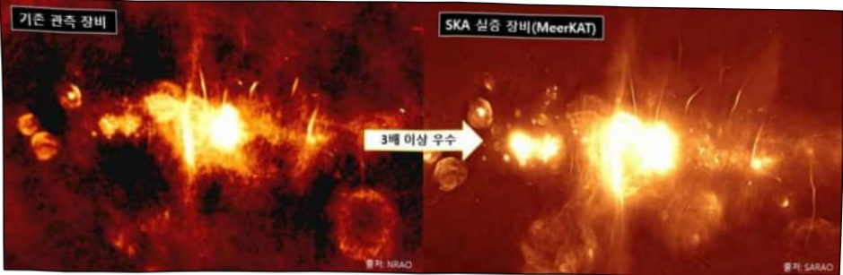
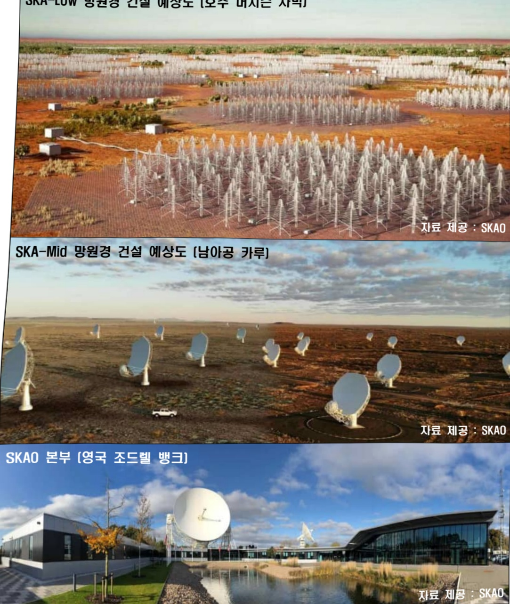
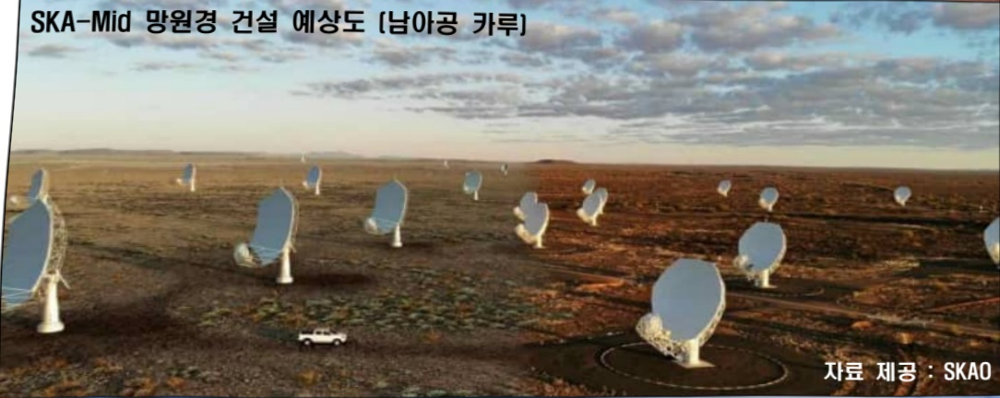
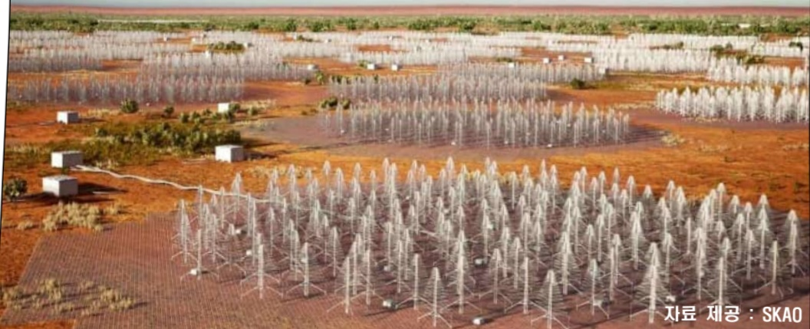
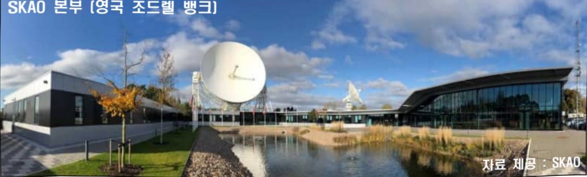

# 국제 거대전파망원경 건설 사업(R&D)

**해당 페이지**: PDF 4614 ~ 4625 쪽 해당

**부처**: 우주항공청
**분야**: 과학기술
**회계유형**: 일반회계
**2026 확정예산**: 6883.0 백만원
**전년대비 증감률**: 244.2%
**AI 도메인**: 데이터, 디지털전환(AX)

---

### 가.예산 총괄표

(단위: 백만원, %)

<table border=1 style='margin: auto; word-wrap: break-word;'><tr><td rowspan="2">사업명</td><td rowspan="2">2024년 결산</td><td colspan="2">2025년 예산</td><td colspan="2">2026년</td><td rowspan="2">중감(B-A)</td><td rowspan="2">(B-A)/A</td></tr><tr><td style='text-align: center; word-wrap: break-word;'>본예산(A)</td><td style='text-align: center; word-wrap: break-word;'>추경</td><td style='text-align: center; word-wrap: break-word;'>정부안</td><td style='text-align: center; word-wrap: break-word;'>확정(B)</td></tr><tr><td style='text-align: center; word-wrap: break-word;'>국제 거대전파망원경 건설 사업(R&amp;D)</td><td style='text-align: center; word-wrap: break-word;'></td><td style='text-align: center; word-wrap: break-word;'>2,000</td><td style='text-align: center; word-wrap: break-word;'>2,000</td><td style='text-align: center; word-wrap: break-word;'>6,883</td><td style='text-align: center; word-wrap: break-word;'>6,883</td><td style='text-align: center; word-wrap: break-word;'>4,883</td><td style='text-align: center; word-wrap: break-word;'>244.2</td></tr></table>

## □ 기능별(내역사업별), 목별 예산 내역

(단위:백만원)

<table border=1 style='margin: auto; word-wrap: break-word;'><tr><td rowspan="3"></td><td colspan="5">2024</td><td colspan="7">2025(2025.12월말)</td><td rowspan="3">2026예산</td></tr><tr><td rowspan="2">예산액(추정)</td><td rowspan="2">예산현액</td><td rowspan="2">집행액[실집행액]</td><td rowspan="2">이월액</td><td rowspan="2">불용액</td><td rowspan="2">본예산</td><td rowspan="2">예산현액</td><td rowspan="2">집행액[실집행액]</td><td colspan="2">전년도아월액제의</td><td rowspan="2">이월예상액</td><td rowspan="2">불용예상액</td></tr><tr><td style='text-align: center; word-wrap: break-word;'>예산현액</td><td style='text-align: center; word-wrap: break-word;'>집행액[실집행액]</td></tr><tr><td style='text-align: center; word-wrap: break-word;'>ㅇ기능별분류(합계)</td><td style='text-align: center; word-wrap: break-word;'>-</td><td style='text-align: center; word-wrap: break-word;'>-</td><td style='text-align: center; word-wrap: break-word;'>-</td><td style='text-align: center; word-wrap: break-word;'>-</td><td style='text-align: center; word-wrap: break-word;'>-</td><td style='text-align: center; word-wrap: break-word;'>2,000.0</td><td style='text-align: center; word-wrap: break-word;'>2,000.0</td><td style='text-align: center; word-wrap: break-word;'>1,991.9[1687.0]</td><td style='text-align: center; word-wrap: break-word;'>2,000.0</td><td style='text-align: center; word-wrap: break-word;'>1,991.9[1687.0]</td><td style='text-align: center; word-wrap: break-word;'>-</td><td style='text-align: center; word-wrap: break-word;'>-</td><td style='text-align: center; word-wrap: break-word;'>6,883.0</td></tr><tr><td style='text-align: center; word-wrap: break-word;'>·기여금</td><td style='text-align: center; word-wrap: break-word;'>-</td><td style='text-align: center; word-wrap: break-word;'>-</td><td style='text-align: center; word-wrap: break-word;'>-</td><td style='text-align: center; word-wrap: break-word;'>-</td><td style='text-align: center; word-wrap: break-word;'>-</td><td style='text-align: center; word-wrap: break-word;'>1,200.0</td><td style='text-align: center; word-wrap: break-word;'>1,200.0</td><td style='text-align: center; word-wrap: break-word;'>1,200.0[1,200.0]</td><td style='text-align: center; word-wrap: break-word;'>1,200.0</td><td style='text-align: center; word-wrap: break-word;'>1,200.0[1,200.0]</td><td style='text-align: center; word-wrap: break-word;'>-</td><td style='text-align: center; word-wrap: break-word;'>-</td><td style='text-align: center; word-wrap: break-word;'>5,800.0</td></tr><tr><td style='text-align: center; word-wrap: break-word;'>·기술개발 및천문연구</td><td style='text-align: center; word-wrap: break-word;'>-</td><td style='text-align: center; word-wrap: break-word;'>-</td><td style='text-align: center; word-wrap: break-word;'>-</td><td style='text-align: center; word-wrap: break-word;'>-</td><td style='text-align: center; word-wrap: break-word;'>-</td><td style='text-align: center; word-wrap: break-word;'>600.0</td><td style='text-align: center; word-wrap: break-word;'>600.0</td><td style='text-align: center; word-wrap: break-word;'>595.9[401.1]</td><td style='text-align: center; word-wrap: break-word;'>600.0</td><td style='text-align: center; word-wrap: break-word;'>595.9[401.1]</td><td style='text-align: center; word-wrap: break-word;'>-</td><td style='text-align: center; word-wrap: break-word;'>-</td><td style='text-align: center; word-wrap: break-word;'>650.0</td></tr><tr><td style='text-align: center; word-wrap: break-word;'>·SKA 데이터센터</td><td style='text-align: center; word-wrap: break-word;'>-</td><td style='text-align: center; word-wrap: break-word;'>-</td><td style='text-align: center; word-wrap: break-word;'>-</td><td style='text-align: center; word-wrap: break-word;'>-</td><td style='text-align: center; word-wrap: break-word;'>-</td><td style='text-align: center; word-wrap: break-word;'>200.0</td><td style='text-align: center; word-wrap: break-word;'>200.0</td><td style='text-align: center; word-wrap: break-word;'>195.9[85.9]</td><td style='text-align: center; word-wrap: break-word;'>200.0</td><td style='text-align: center; word-wrap: break-word;'>195.9[85.9]</td><td style='text-align: center; word-wrap: break-word;'>-</td><td style='text-align: center; word-wrap: break-word;'>-</td><td style='text-align: center; word-wrap: break-word;'>433.0</td></tr><tr><td style='text-align: center; word-wrap: break-word;'>ㅇ비목별분류(합계)</td><td style='text-align: center; word-wrap: break-word;'>-</td><td style='text-align: center; word-wrap: break-word;'>-</td><td style='text-align: center; word-wrap: break-word;'>-</td><td style='text-align: center; word-wrap: break-word;'>-</td><td style='text-align: center; word-wrap: break-word;'>-</td><td style='text-align: center; word-wrap: break-word;'>2,000.0</td><td style='text-align: center; word-wrap: break-word;'>2,000.0</td><td style='text-align: center; word-wrap: break-word;'>1,991.9[1687.0]</td><td style='text-align: center; word-wrap: break-word;'>2,000.0</td><td style='text-align: center; word-wrap: break-word;'>1,991.9[1687.0]</td><td style='text-align: center; word-wrap: break-word;'>-</td><td style='text-align: center; word-wrap: break-word;'>-</td><td style='text-align: center; word-wrap: break-word;'>6,883.0</td></tr><tr><td style='text-align: center; word-wrap: break-word;'>·시험연구비(210-13)</td><td style='text-align: center; word-wrap: break-word;'>-</td><td style='text-align: center; word-wrap: break-word;'>-</td><td style='text-align: center; word-wrap: break-word;'>-</td><td style='text-align: center; word-wrap: break-word;'>-</td><td style='text-align: center; word-wrap: break-word;'>-</td><td style='text-align: center; word-wrap: break-word;'>50.0</td><td style='text-align: center; word-wrap: break-word;'>50.0</td><td style='text-align: center; word-wrap: break-word;'>50.0[49.7]</td><td style='text-align: center; word-wrap: break-word;'>50.0</td><td style='text-align: center; word-wrap: break-word;'>50.0[49.7]</td><td style='text-align: center; word-wrap: break-word;'>-</td><td style='text-align: center; word-wrap: break-word;'>-</td><td style='text-align: center; word-wrap: break-word;'>순감</td></tr><tr><td style='text-align: center; word-wrap: break-word;'>·일반연구비(260-01)</td><td style='text-align: center; word-wrap: break-word;'>-</td><td style='text-align: center; word-wrap: break-word;'>-</td><td style='text-align: center; word-wrap: break-word;'>-</td><td style='text-align: center; word-wrap: break-word;'>-</td><td style='text-align: center; word-wrap: break-word;'>-</td><td style='text-align: center; word-wrap: break-word;'>750.0</td><td style='text-align: center; word-wrap: break-word;'>750.0</td><td style='text-align: center; word-wrap: break-word;'>741.9[437.2]</td><td style='text-align: center; word-wrap: break-word;'>750.0</td><td style='text-align: center; word-wrap: break-word;'>741.9[437.2]</td><td style='text-align: center; word-wrap: break-word;'>-</td><td style='text-align: center; word-wrap: break-word;'>-</td><td style='text-align: center; word-wrap: break-word;'>순감</td></tr><tr><td style='text-align: center; word-wrap: break-word;'>·국제부담금(340-02)</td><td style='text-align: center; word-wrap: break-word;'>-</td><td style='text-align: center; word-wrap: break-word;'>-</td><td style='text-align: center; word-wrap: break-word;'>-</td><td style='text-align: center; word-wrap: break-word;'>-</td><td style='text-align: center; word-wrap: break-word;'>-</td><td style='text-align: center; word-wrap: break-word;'>1,200.0</td><td style='text-align: center; word-wrap: break-word;'>1,200.0</td><td style='text-align: center; word-wrap: break-word;'>1,200.0[1,200.0]</td><td style='text-align: center; word-wrap: break-word;'>1,200.0</td><td style='text-align: center; word-wrap: break-word;'>1,200.0[1,200.0]</td><td style='text-align: center; word-wrap: break-word;'>-</td><td style='text-align: center; word-wrap: break-word;'>-</td><td style='text-align: center; word-wrap: break-word;'>5,800.0</td></tr><tr><td style='text-align: center; word-wrap: break-word;'>·연구개발활동비등(360-05)</td><td style='text-align: center; word-wrap: break-word;'>-</td><td style='text-align: center; word-wrap: break-word;'>-</td><td style='text-align: center; word-wrap: break-word;'>-</td><td style='text-align: center; word-wrap: break-word;'>-</td><td style='text-align: center; word-wrap: break-word;'>-</td><td style='text-align: center; word-wrap: break-word;'>-</td><td style='text-align: center; word-wrap: break-word;'>-</td><td style='text-align: center; word-wrap: break-word;'>-</td><td style='text-align: center; word-wrap: break-word;'>-</td><td style='text-align: center; word-wrap: break-word;'>-</td><td style='text-align: center; word-wrap: break-word;'>-</td><td style='text-align: center; word-wrap: break-word;'>-</td><td style='text-align: center; word-wrap: break-word;'>1,083.0</td></tr><tr><td style='text-align: center; word-wrap: break-word;'>ㅇ기능비목별분류(합계)</td><td style='text-align: center; word-wrap: break-word;'>-</td><td style='text-align: center; word-wrap: break-word;'>-</td><td style='text-align: center; word-wrap: break-word;'>-</td><td style='text-align: center; word-wrap: break-word;'>-</td><td style='text-align: center; word-wrap: break-word;'>-</td><td style='text-align: center; word-wrap: break-word;'>2,000.0</td><td style='text-align: center; word-wrap: break-word;'>2,000.0</td><td style='text-align: center; word-wrap: break-word;'>1,991.9[1687.0]</td><td style='text-align: center; word-wrap: break-word;'>2,000.0</td><td style='text-align: center; word-wrap: break-word;'>1,991.9[1687.0]</td><td style='text-align: center; word-wrap: break-word;'>-</td><td style='text-align: center; word-wrap: break-word;'>-</td><td style='text-align: center; word-wrap: break-word;'>6,883.0</td></tr><tr><td style='text-align: center; word-wrap: break-word;'>·기여금</td><td style='text-align: center; word-wrap: break-word;'>-</td><td style='text-align: center; word-wrap: break-word;'>-</td><td style='text-align: center; word-wrap: break-word;'>-</td><td style='text-align: center; word-wrap: break-word;'>-</td><td style='text-align: center; word-wrap: break-word;'>-</td><td style='text-align: center; word-wrap: break-word;'>1,200.0</td><td style='text-align: center; word-wrap: break-word;'>1,200.0</td><td style='text-align: center; word-wrap: break-word;'>1,200.0[1,200.0]</td><td style='text-align: center; word-wrap: break-word;'>1,200.0</td><td style='text-align: center; word-wrap: break-word;'>1,200.0[1,200.0]</td><td style='text-align: center; word-wrap: break-word;'>-</td><td style='text-align: center; word-wrap: break-word;'>-</td><td style='text-align: center; word-wrap: break-word;'>5,800.0</td></tr><tr><td style='text-align: center; word-wrap: break-word;'>·국제부담금(340-02)</td><td style='text-align: center; word-wrap: break-word;'>-</td><td style='text-align: center; word-wrap: break-word;'>-</td><td style='text-align: center; word-wrap: break-word;'>-</td><td style='text-align: center; word-wrap: break-word;'>-</td><td style='text-align: center; word-wrap: break-word;'>-</td><td style='text-align: center; word-wrap: break-word;'>1,200.0</td><td style='text-align: center; word-wrap: break-word;'>1,200.0</td><td style='text-align: center; word-wrap: break-word;'>1,200.0[1,200.0]</td><td style='text-align: center; word-wrap: break-word;'>1,200.0</td><td style='text-align: center; word-wrap: break-word;'>1,200.0[1,200.0]</td><td style='text-align: center; word-wrap: break-word;'>-</td><td style='text-align: center; word-wrap: break-word;'>-</td><td style='text-align: center; word-wrap: break-word;'>5,800.0</td></tr></table>

---

<table border=1 style='margin: auto; word-wrap: break-word;'><tr><td rowspan="3"></td><td colspan="5">2024</td><td colspan="7">2025(2025.12월말)</td><td rowspan="3">2026예산</td></tr><tr><td rowspan="2">예산액(추경)</td><td rowspan="2">예산현액</td><td rowspan="2">집행액[실집행액]</td><td rowspan="2">이월액</td><td rowspan="2">불용액</td><td rowspan="2">본예산</td><td rowspan="2">예산현액</td><td rowspan="2">집행액[실집행액]</td><td colspan="2">전년도이월액제외</td><td rowspan="2">이월예상액</td><td rowspan="2">불용예상액</td></tr><tr><td style='text-align: center; word-wrap: break-word;'>예산현액</td><td style='text-align: center; word-wrap: break-word;'>집행액[실집행액]</td></tr><tr><td style='text-align: center; word-wrap: break-word;'>·기술개발 및천문연구</td><td style='text-align: center; word-wrap: break-word;'>-</td><td style='text-align: center; word-wrap: break-word;'>-</td><td style='text-align: center; word-wrap: break-word;'>-</td><td style='text-align: center; word-wrap: break-word;'>-</td><td style='text-align: center; word-wrap: break-word;'>-</td><td style='text-align: center; word-wrap: break-word;'>600.0</td><td style='text-align: center; word-wrap: break-word;'>600.0</td><td style='text-align: center; word-wrap: break-word;'>595.9[401.1]</td><td style='text-align: center; word-wrap: break-word;'>600.0</td><td style='text-align: center; word-wrap: break-word;'>595.9[401.1]</td><td style='text-align: center; word-wrap: break-word;'>-</td><td style='text-align: center; word-wrap: break-word;'>-</td><td style='text-align: center; word-wrap: break-word;'>650.0</td></tr><tr><td style='text-align: center; word-wrap: break-word;'>·일반연구비(260-01)</td><td style='text-align: center; word-wrap: break-word;'>-</td><td style='text-align: center; word-wrap: break-word;'>-</td><td style='text-align: center; word-wrap: break-word;'>-</td><td style='text-align: center; word-wrap: break-word;'>-</td><td style='text-align: center; word-wrap: break-word;'>-</td><td style='text-align: center; word-wrap: break-word;'>550.0</td><td style='text-align: center; word-wrap: break-word;'>550.0</td><td style='text-align: center; word-wrap: break-word;'>545.9[351.3]</td><td style='text-align: center; word-wrap: break-word;'>550.0</td><td style='text-align: center; word-wrap: break-word;'>545.9[351.3]</td><td style='text-align: center; word-wrap: break-word;'>-</td><td style='text-align: center; word-wrap: break-word;'>-</td><td style='text-align: center; word-wrap: break-word;'>순감</td></tr><tr><td style='text-align: center; word-wrap: break-word;'>·시험연구비(210-13)</td><td style='text-align: center; word-wrap: break-word;'>-</td><td style='text-align: center; word-wrap: break-word;'>-</td><td style='text-align: center; word-wrap: break-word;'>-</td><td style='text-align: center; word-wrap: break-word;'>-</td><td style='text-align: center; word-wrap: break-word;'>-</td><td style='text-align: center; word-wrap: break-word;'>50.0</td><td style='text-align: center; word-wrap: break-word;'>50.0</td><td style='text-align: center; word-wrap: break-word;'>50.0[49.7]</td><td style='text-align: center; word-wrap: break-word;'>50.0</td><td style='text-align: center; word-wrap: break-word;'>50.0[49.7]</td><td style='text-align: center; word-wrap: break-word;'>-</td><td style='text-align: center; word-wrap: break-word;'>-</td><td style='text-align: center; word-wrap: break-word;'>순감</td></tr><tr><td style='text-align: center; word-wrap: break-word;'>·연구개발활동비등(360-05)</td><td style='text-align: center; word-wrap: break-word;'>-</td><td style='text-align: center; word-wrap: break-word;'>-</td><td style='text-align: center; word-wrap: break-word;'>-</td><td style='text-align: center; word-wrap: break-word;'>-</td><td style='text-align: center; word-wrap: break-word;'>-</td><td style='text-align: center; word-wrap: break-word;'>-</td><td style='text-align: center; word-wrap: break-word;'>-</td><td style='text-align: center; word-wrap: break-word;'>-</td><td style='text-align: center; word-wrap: break-word;'>-</td><td style='text-align: center; word-wrap: break-word;'>-</td><td style='text-align: center; word-wrap: break-word;'>-</td><td style='text-align: center; word-wrap: break-word;'>-</td><td style='text-align: center; word-wrap: break-word;'>650.0</td></tr><tr><td style='text-align: center; word-wrap: break-word;'>·SKA 데이터센터</td><td style='text-align: center; word-wrap: break-word;'>-</td><td style='text-align: center; word-wrap: break-word;'>-</td><td style='text-align: center; word-wrap: break-word;'>-</td><td style='text-align: center; word-wrap: break-word;'>-</td><td style='text-align: center; word-wrap: break-word;'>-</td><td style='text-align: center; word-wrap: break-word;'>200.0</td><td style='text-align: center; word-wrap: break-word;'>200.0</td><td style='text-align: center; word-wrap: break-word;'>195.9[85.9]</td><td style='text-align: center; word-wrap: break-word;'>200.0</td><td style='text-align: center; word-wrap: break-word;'>195.9[85.9]</td><td style='text-align: center; word-wrap: break-word;'>-</td><td style='text-align: center; word-wrap: break-word;'>-</td><td style='text-align: center; word-wrap: break-word;'>433.0</td></tr><tr><td style='text-align: center; word-wrap: break-word;'>·일반연구비(260-01)</td><td style='text-align: center; word-wrap: break-word;'>-</td><td style='text-align: center; word-wrap: break-word;'>-</td><td style='text-align: center; word-wrap: break-word;'>-</td><td style='text-align: center; word-wrap: break-word;'>-</td><td style='text-align: center; word-wrap: break-word;'>-</td><td style='text-align: center; word-wrap: break-word;'>200.0</td><td style='text-align: center; word-wrap: break-word;'>200.0</td><td style='text-align: center; word-wrap: break-word;'>195.9[85.9]</td><td style='text-align: center; word-wrap: break-word;'>200.0</td><td style='text-align: center; word-wrap: break-word;'>195.9[85.9]</td><td style='text-align: center; word-wrap: break-word;'>-</td><td style='text-align: center; word-wrap: break-word;'>-</td><td style='text-align: center; word-wrap: break-word;'>순감</td></tr><tr><td style='text-align: center; word-wrap: break-word;'>·연구개발활동비등(360-05)</td><td style='text-align: center; word-wrap: break-word;'>-</td><td style='text-align: center; word-wrap: break-word;'>-</td><td style='text-align: center; word-wrap: break-word;'>-</td><td style='text-align: center; word-wrap: break-word;'>-</td><td style='text-align: center; word-wrap: break-word;'>-</td><td style='text-align: center; word-wrap: break-word;'>-</td><td style='text-align: center; word-wrap: break-word;'>-</td><td style='text-align: center; word-wrap: break-word;'>-</td><td style='text-align: center; word-wrap: break-word;'>-</td><td style='text-align: center; word-wrap: break-word;'>-</td><td style='text-align: center; word-wrap: break-word;'>-</td><td style='text-align: center; word-wrap: break-word;'>-</td><td style='text-align: center; word-wrap: break-word;'>433.0</td></tr></table>

### 나. 사업설명자료

## 1 ) 사업목적·내용

- (국제 거대전과망원경 건설 사업(R&D)) 인류 최대규모의 SKA* 데이터 우선 활용과 AI 활용

천문우주 난제 도전, 국가 간 분산형 네트워크 구축으로 빅데이터 활용 강국 도약

* 국세 서내선파방원경(Square Kilometre Array): 총 집광 면적이 1km²로 세계 최대 규모의 전파망원경 - (기여금)

- 국제기구 SKAO*의 국제 분담금, SKA 건설 및 운영에서 국내기업의 참여를 위한 기반 마련

* 국제 거대전파망원경 관측소(Square Kilometre Array Observatory): SKA 건설 및 운영 총괄 - (기술개발 및 천문연구)

- 차세대 전파관측 기술개발 참여 및 5개 이상 대학 기관의 참여를 통한 AI 활용

천문우주 난제 도전

## - (SKA 데이터센터)

- SKA 빅데이터의 효율적인 배포, 분석 등을 위한 국가 간 분산형 네트워크 (SRCNet)의 한국 지역망 구축과 AI 활용 플랫폼 및 소프트웨어 등 개발

---

## 2 ) 사업개요

## □ 사업근거 및 추진경위

①법령상근거

가.「국가연구개발혁신법」 제5조(정부의 책무)3항, 연구개발기관 간의 협력, 기술

학문·산업간의융합및창의적·도전적연구개발촉진

나.「과학기술기본법」 제15조의2(도전적 연구개발의 촉진)1항, 정부는 과학기술혁신을 위하여 도전적 연구개발을 적극적으로 촉진·지원하여야 하고, 필요한 재원(財源)을 우선적으로 확보하기 위하여 노력하여야 한다.

다.「과학기술기본법」 제18조(과학기술의 국제화 촉진)1항, 정부는 국제사회에 공헌하고 국내 과학기술 수준을 향상시킬 수 있도록 외국정부, 국제기구 또는 외국의 연구개발 관련 기관·단체 등과 과학기술분야의 국제협력을 촉진하기 위하여 다음 각 호의 사항에 관한 시책을 세우고 추진하여야 한다.

- 7호, 국제기구를 통한 다자간 과학기술협력

라.「우주개발 진흥법」 제18조의6 (전문인력 양성) 우주항공청장은 우주개발에 필요한

전문인력을 양성하기 위하여 다음 각 호의 시책을 수립·시행하여야 한다

## ② 추진경위

가.「제4차 우주개발진흥 기본계획」(22. 12.)

## (세부 추진계획 전략1-1) 민간 주도의 우주산업 생태계 촉진

2. 글로벌 시장 진출 지원

- 아르테미스 프로그램 등 대형 국제협력사업, 글로벌 기업의 위성인터넷 등 대형국제 우주 사업에 국내 기업의 참여 적극 지원

(세부 추진계획 전략1-4) 글로벌 우주개발 협력에서 역할 강화 및 국격 제고

1. 국제공동 탐사·공동 연구 참여 확대

- SKA' 건설사업 등에 참여해 기술개발 및 관측 접근권 우선 확보

*평방 킬로미터 배열(Square Kilometre Array) 국제 전파망원경

나. 다우닝가 합의서 중 SKAO 협력 추진('23.11.)

#### 0 한영 다우닝가 합의 전문('23.11.)

- 양국 간 지속적인 과학 및 연구 협력을 바탕으로, 우리는 한국이 국제 전파 망원경 구축(SKAO) 협력 협정에 서명할 기회를 갖기를 고대한다.

---

다. 대한민국 우주과학탐사 추진전략('25. 2.)

(세부 추진전략 1) 우주과학탐사 국제협력 주도

2. (확장형 전파망원경 개발) 지상·우주 전파망원경에 초장거리전파간섭계기술을 적용하여 초고분해능·초고감도 전파망원경 구현

* Very Long Baseline Interferometry

※ 국제 거대전파망원경 건설 사업 수행 ('25~31)

### 라. 추진 현황

- 과기부 추인 SKAO 이사회 옵서버 참석 ('21.2.~)

- 과기부·출연연 착수회의 ('22.11.)

- 과기부·연구재단·출연연 기획 회의 ('22.12.)

- 신규사업 기획연구 전문가 협의회 ('23.1.)

- 한국천문학회 봄학술대회 SKA 특별세션 개최('23.4.)

- 한영 정상회담 합의서에 SKAO 협력 추진('23.11.)

- SKAO 대표단 과기부 우주협력전문관실 방문 협력 회의 ('24.4.)

- SKAO 사무총장 우주항공청 내방 ('25.4.)

- KASA-SKAO 양해각서(MoU) 체결 ('25.5.)

- 국제 거대전파망원경 건설사업(R&D)의 기술개발 및 천문연구와 SKA 데이터센터 내역사업 착수 ('25.6.)

## □ 주요내용

① 사업규모

- 총사업비 : 해당 없음

- 사업기간 : 2025 ~ 2031년 (7년)

- 최근 5년 간 투입된 사업비

<table border=1 style='margin: auto; word-wrap: break-word;'><tr><td style='text-align: center; word-wrap: break-word;'>연도</td><td style='text-align: center; word-wrap: break-word;'>2022</td><td style='text-align: center; word-wrap: break-word;'>2023</td><td style='text-align: center; word-wrap: break-word;'>2024</td><td style='text-align: center; word-wrap: break-word;'>2025</td><td style='text-align: center; word-wrap: break-word;'>2026</td></tr><tr><td style='text-align: center; word-wrap: break-word;'>사업비</td><td style='text-align: center; word-wrap: break-word;'>-</td><td style='text-align: center; word-wrap: break-word;'>-</td><td style='text-align: center; word-wrap: break-word;'>-</td><td style='text-align: center; word-wrap: break-word;'>2,000</td><td style='text-align: center; word-wrap: break-word;'>6,883</td></tr></table>

- 기타 : 해당 없음

② 사업추진체계

- 사업시행방법 : 출연, 직접수행

- 사업시행주체 : 우주항공청

- 사업 수혜자 : 산학연 등

---

- 보조, 융자, 출연, 출자 등의 경우 보조 · 융자 등 지원 비율 및 법적근거

<table border=1 style='margin: auto; word-wrap: break-word;'><tr><td style='text-align: center; word-wrap: break-word;'>내역사업명</td><td style='text-align: center; word-wrap: break-word;'>구분</td><td style='text-align: center; word-wrap: break-word;'>피보조·피출연 등 기관명</td><td style='text-align: center; word-wrap: break-word;'>지원 금액 (2026예산)</td><td style='text-align: center; word-wrap: break-word;'>지원 비율(%)</td><td style='text-align: center; word-wrap: break-word;'>보조율 법적근거 (해당 조항)</td></tr><tr><td style='text-align: center; word-wrap: break-word;'>기여금</td><td style='text-align: center; word-wrap: break-word;'>직접</td><td style='text-align: center; word-wrap: break-word;'>우주항공청</td><td style='text-align: center; word-wrap: break-word;'>5,800백만원</td><td style='text-align: center; word-wrap: break-word;'>84.27</td><td style='text-align: center; word-wrap: break-word;'>-</td></tr><tr><td style='text-align: center; word-wrap: break-word;'>기술개발 및 천문연구</td><td style='text-align: center; word-wrap: break-word;'>출연</td><td style='text-align: center; word-wrap: break-word;'>한국천문연구원</td><td style='text-align: center; word-wrap: break-word;'>650백만원</td><td style='text-align: center; word-wrap: break-word;'>9.44</td><td rowspan="2">제11조(국가연구개발사업의 추진) ① 중앙행정기관의 장은 기본계획에 따라 맡은 분야의 국가연구개발사업과 그 시책을 세워 추진하여야 한다.</td></tr><tr><td style='text-align: center; word-wrap: break-word;'>SKA 데이터센터</td><td style='text-align: center; word-wrap: break-word;'>출연</td><td style='text-align: center; word-wrap: break-word;'>한국천문연구원</td><td style='text-align: center; word-wrap: break-word;'>433백만원</td><td style='text-align: center; word-wrap: break-word;'>6.29</td></tr></table>

## 3 ) 2026년도 예산 산출 근거

국제 거대전파망원경 건설 사업(R&D): (2025 예산) 2,000백만원 → (2026 예산) 6,883백만원

① 기여금: (2025 예산) 1,200 → (2026 예산) 5,800 백만원, +383.3%

- 국제 거대전파망원경 건설 관련 사업권 획득을 위한 국제분담금 본격 납부, '25년 대비 +383.3% 증액

- (산출) 5,800백만원

* 총 기여금의 345억원을 사업 기간 동안 나누어 납부 ('26년 2차년도)

② 기술개발 및 천문연구: (2025 예산) 600 → (2026 예산) 650백만원, +8.3%

- SKA 실증 실험 장비(프리커서) 활용 주요 연구 분야의 선행연구 및 SKA 차세대 기술 개발 참여로 GPU 상관기 등 개발 추진

- (산출) 650백만원

* 국제기구 SKAO 이사회 등 국제협력 활동 증가

* SKA 프리커서 관측 데이터 확보와 선행연구 수행, 차세대 전파관측 기술개발

③ SKA 데이터센터: (2025 예산) 200 → (2026 예산) 433백만원, +116.5%

- 국가간 분산형 네트워크(플랫폼) 확장 계획에 따른 회원국 간 개발 약속 이행

- (산출) 433백만원

* 회원국 간 논의에 따른 '26년 저장공간 및 연산자원 확보와 연구 플랫폼 검증, 시범운영

2025년도 예산 및 2026년도 예산 산출 세부내역 비교

<table border=1 style='margin: auto; word-wrap: break-word;'><tr><td rowspan="2">예산</td><td colspan="2">2025년 예산</td><td colspan="2">2026년 예산</td></tr><tr><td colspan="2">산출내역</td><td style='text-align: center; word-wrap: break-word;'>예산</td><td style='text-align: center; word-wrap: break-word;'>산출내역</td></tr><tr><td rowspan="2">1,200 백만원</td><td colspan="2">&lt; 기여금 1,200백만원 &gt;</td><td colspan="2">&lt; 기여금 5,800백만원 &gt;</td></tr><tr><td colspan="2">가. (SKAO 국제분담금) 1개 × 1/12개월 × 1,200백만원 = 1,200백만원 · 국제 거대전파망원경(SKA) 건설 및 운영 분담금</td><td style='text-align: center; word-wrap: break-word;'>5,800 백만원</td><td style='text-align: center; word-wrap: break-word;'>가. (SKAO 국제분담금) 1개 × 1/12개월 × 5,800백만원 = 5,800백만원 · 국제 거대전파망원경(SKA) 건설 및 운영 분담금</td></tr><tr><td rowspan="2">600 백만원</td><td colspan="2">&lt; 기술개발 및 천문연구 600백만원 &gt;</td><td style='text-align: center; word-wrap: break-word;'>650 백만원</td><td style='text-align: center; word-wrap: break-word;'>&lt; 기술개발 및 천문연구 650백만원 &gt;</td></tr><tr><td style='text-align: center; word-wrap: break-word;'>가. (기술개발 및 천문연구) 1개 × 9/12개월 × 550백만원 = 550백만원 · 고감도 광대역 전파 수신 시스템 개발 계획 수립 · 초고속 데이터 전송처리저장 시스템 개발 계획 수립 · 천문우주 난제 도전을 위한 5개 이상 대학 기관 협력 나. (시험연구비) 1개 × 12/12개월 × 50백만원 = 50백만원 · 임차료(210-07) 국내 SKA 워크샵 지원 등 · 국외업무여비(220-02) 국제기구 SKAO 이사회 및 재정위원회 참석 등</td><td style='text-align: center; word-wrap: break-word;'>650 백만원</td><td style='text-align: center; word-wrap: break-word;'>650 백만원</td><td style='text-align: center; word-wrap: break-word;'>가. (기술개발 및 천문연구) 1개 × 9/12개월 × 650백만원 = 650백만원 · 고감도 광대역 전파 수신 시스템 개발 · 초고속 데이터 전송처리저장 시스템 개발 · 천문우주 난제 도전을 위한 5개 이상 대학 기관 협력, SKA 프리커서 관측 데이터 확보</td></tr></table>

---

<table border=1 style='margin: auto; word-wrap: break-word;'><tr><td colspan="2">2025년 예산</td><td colspan="2">2026년 예산</td></tr><tr><td style='text-align: center; word-wrap: break-word;'>예산</td><td style='text-align: center; word-wrap: break-word;'>산출내역</td><td style='text-align: center; word-wrap: break-word;'>예산</td><td style='text-align: center; word-wrap: break-word;'>산출내역</td></tr><tr><td style='text-align: center; word-wrap: break-word;'></td><td style='text-align: center; word-wrap: break-word;'>·일반수용비(210-01) SKAO와 양해각서 및 협력 협약에 대한 법률 자문 등</td><td style='text-align: center; word-wrap: break-word;'></td><td style='text-align: center; word-wrap: break-word;'></td></tr><tr><td style='text-align: center; word-wrap: break-word;'>200 백만원</td><td style='text-align: center; word-wrap: break-word;'>&lt; SKA 데이터센터 200백만원 &gt; 가. (국가 간 분산형 네트워크) 1개 × 9/12개월 × 200백만원 = 200백만원 · 국가 간 분산형 네트워크(SRCNet) 개발 및 운영 계획 수립</td><td style='text-align: center; word-wrap: break-word;'>433 백만원</td><td style='text-align: center; word-wrap: break-word;'>&lt; SKA 데이터센터 433백만원 &gt; 가. (국가 간 분산형 네트워크) 1개 × 9/12개월 × 433백만원 = 433백만원 · SKA 관측 데이터 처리를 위한 테스트 · SRCNet 한국 지역망(KRSRC) 개발을 위한 자원 확보</td></tr></table>

## 4 ) 사업효과

□ 사업영향, 산출물 성과지표 등

① 2022~2026년도 성과계획서 상 성과지표 및 최근 5년간 성과 달성도

<table border=1 style='margin: auto; word-wrap: break-word;'><tr><td style='text-align: center; word-wrap: break-word;'>성과지표</td><td style='text-align: center; word-wrap: break-word;'>구분</td><td style='text-align: center; word-wrap: break-word;'>2022</td><td style='text-align: center; word-wrap: break-word;'>2023</td><td style='text-align: center; word-wrap: break-word;'>2024</td><td style='text-align: center; word-wrap: break-word;'>2025</td><td style='text-align: center; word-wrap: break-word;'>2026</td><td style='text-align: center; word-wrap: break-word;'>2026 목표치산출근거</td><td style='text-align: center; word-wrap: break-word;'>측정산식(또는 측정방법)</td><td style='text-align: center; word-wrap: break-word;'>자료수집방법(또는 자료출처)</td></tr><tr><td rowspan="3">국제전파망원경활용 연구 실적(단위: % )</td><td style='text-align: center; word-wrap: break-word;'>목표</td><td style='text-align: center; word-wrap: break-word;'>-</td><td style='text-align: center; word-wrap: break-word;'>-</td><td style='text-align: center; word-wrap: break-word;'>-</td><td style='text-align: center; word-wrap: break-word;'>100</td><td style='text-align: center; word-wrap: break-word;'>68.87</td><td rowspan="3">파기부 주요 R&amp;D 평균인 68.87로 설정</td><td rowspan="3">SKA 프리커서 활용 연구 SCI 논문 건당 표준화된 순위보정영향력지수(mrnIF) 산술평균(N: 분야내 저널 수, mIF: 순위보정영향력지수)</td><td rowspan="3">국가과학기술지식정보서비스(NTIS) 등록자료</td></tr><tr><td style='text-align: center; word-wrap: break-word;'>실적</td><td style='text-align: center; word-wrap: break-word;'>-</td><td style='text-align: center; word-wrap: break-word;'>-</td><td style='text-align: center; word-wrap: break-word;'>-</td><td style='text-align: center; word-wrap: break-word;'>33.3</td><td style='text-align: center; word-wrap: break-word;'>-</td></tr><tr><td style='text-align: center; word-wrap: break-word;'>달성도</td><td style='text-align: center; word-wrap: break-word;'>-</td><td style='text-align: center; word-wrap: break-word;'>-</td><td style='text-align: center; word-wrap: break-word;'>-</td><td style='text-align: center; word-wrap: break-word;'>33.3</td><td style='text-align: center; word-wrap: break-word;'>-</td></tr><tr><td rowspan="3">SKA 차세대기술개발(‘26년 신규’)</td><td style='text-align: center; word-wrap: break-word;'>목표</td><td style='text-align: center; word-wrap: break-word;'>-</td><td style='text-align: center; word-wrap: break-word;'>-</td><td style='text-align: center; word-wrap: break-word;'>-</td><td style='text-align: center; word-wrap: break-word;'>-</td><td style='text-align: center; word-wrap: break-word;'>100</td><td rowspan="3">GPU 기술을 이용한 32Gbps 데이터 송수신 시연</td><td rowspan="3">연구자가 제출한 연도별 시연 검증 증빙자료(시험 성적서 등 연차실적 계획서)를 통한 달성도 평가</td><td rowspan="3">연구책임자 대상 성과조사 결과</td></tr><tr><td style='text-align: center; word-wrap: break-word;'>실적</td><td style='text-align: center; word-wrap: break-word;'>-</td><td style='text-align: center; word-wrap: break-word;'>-</td><td style='text-align: center; word-wrap: break-word;'>-</td><td style='text-align: center; word-wrap: break-word;'>-</td><td style='text-align: center; word-wrap: break-word;'>-</td></tr><tr><td style='text-align: center; word-wrap: break-word;'>달성도</td><td style='text-align: center; word-wrap: break-word;'>-</td><td style='text-align: center; word-wrap: break-word;'>-</td><td style='text-align: center; word-wrap: break-word;'>-</td><td style='text-align: center; word-wrap: break-word;'>-</td><td style='text-align: center; word-wrap: break-word;'>-</td></tr><tr><td rowspan="3">국가 간 분산형 네트워크(SRCNet) 개발(‘26년 신규’)</td><td style='text-align: center; word-wrap: break-word;'>목표</td><td style='text-align: center; word-wrap: break-word;'>-</td><td style='text-align: center; word-wrap: break-word;'>-</td><td style='text-align: center; word-wrap: break-word;'>-</td><td style='text-align: center; word-wrap: break-word;'>-</td><td style='text-align: center; word-wrap: break-word;'>100</td><td rowspan="3">SRCNet 저장공간 1PB, 연산능력 0.04PFLOPS 확보</td><td rowspan="3">연구자가 제출한 시험 성적서, 연차 실적보고서 등을 통한 저장공간 및 연산능력 측정</td><td rowspan="3">연차실적보고서, SRCNet Top Level 로드맵 등</td></tr><tr><td style='text-align: center; word-wrap: break-word;'>실적</td><td style='text-align: center; word-wrap: break-word;'>-</td><td style='text-align: center; word-wrap: break-word;'>-</td><td style='text-align: center; word-wrap: break-word;'>-</td><td style='text-align: center; word-wrap: break-word;'>-</td><td style='text-align: center; word-wrap: break-word;'>-</td></tr><tr><td style='text-align: center; word-wrap: break-word;'>달성도</td><td style='text-align: center; word-wrap: break-word;'>-</td><td style='text-align: center; word-wrap: break-word;'>-</td><td style='text-align: center; word-wrap: break-word;'>-</td><td style='text-align: center; word-wrap: break-word;'>-</td><td style='text-align: center; word-wrap: break-word;'>-</td></tr></table>

※ 동 사업 전략계획서 수립에 따른 신규 성과지표 반영 예정

② 성과지표 이외의 연도별 사업추진 경과 및 실적

<table border=1 style='margin: auto; word-wrap: break-word;'><tr><td style='text-align: center; word-wrap: break-word;'>2022</td><td style='text-align: center; word-wrap: break-word;'>해당 없음</td></tr><tr><td style='text-align: center; word-wrap: break-word;'>2023</td><td style='text-align: center; word-wrap: break-word;'>해당 없음</td></tr><tr><td style='text-align: center; word-wrap: break-word;'>2024</td><td style='text-align: center; word-wrap: break-word;'>해당 없음</td></tr><tr><td style='text-align: center; word-wrap: break-word;'>2025</td><td style='text-align: center; word-wrap: break-word;'>1. SKAO 사무총장 우주항공청 내방 및 양자면담(&#x27;25. 4.) 2. KASA-SKAO 양해각서(MoU) 체결(&#x27;25. 5.) 3. &#x27;25년 국제분담금 납부(&#x27;25. 6.) 4. 수행기관 선정 및 사업 착수(&#x27;25. 6.) 5. 국제 거대전파망원경(SKA-Low) 건설 현장 점검(&#x27;25.11.)</td></tr></table>

---

③향후(2026년도 이후)기대효과

- 세계 최고 수준의 데이터를 활용하여 초기 우주, 암흑물질, 외계 생명 탐색 등

현대 천문학 핵심 난제들에 대한 도전 기회 제공

국가간 분산형 데이터 처리 네트워크 구축 및 운용으로 SKA 빅데이터의 처리·분석, 초고속 컴퓨팅·송수신 등 분야의 기술 혁신 촉진

- SKAO 참여국 간 천문우주과학의 새로운 지식, 첨단기술 등의 교류를 통해 국제

협력 강화 및 국제적 위상 제고

- 인류 최대 규모의 전파망원경 건설 프로젝트에 참여로, 과학, 공학, 데이터 분석,

인공지능 등의 전문인력 양성 기회 제공

- SKAO 조달 사업 참여로 첨단 기술과 연구 장비 개발 기회를 확보하고, 국내 기업의 해외 진출 및 경제적 이익 창출 기회 제공

## 5 ) 타당성조사 및 예비타당성조사 시행여부 및 결과 요지: 해당 없음

6) 총사업비 대상사업 여부 및 내역: 해당 없음

## 7 ) 사업 집행절차

<table border=1 style='margin: auto; word-wrap: break-word;'><tr><td style='text-align: center; word-wrap: break-word;'>주진절차</td><td style='text-align: center; word-wrap: break-word;'>시행주체</td><td style='text-align: center; word-wrap: break-word;'>절차내용</td></tr><tr><td style='text-align: center; word-wrap: break-word;'>① 추진계획 수립</td><td style='text-align: center; word-wrap: break-word;'>우주항공청</td><td style='text-align: center; word-wrap: break-word;'>추진계획 수립</td></tr><tr><td style='text-align: center; word-wrap: break-word;'>② 사업 협약</td><td style='text-align: center; word-wrap: break-word;'>우주항공청</td><td style='text-align: center; word-wrap: break-word;'>수행기관 선정 및 협약</td></tr><tr><td style='text-align: center; word-wrap: break-word;'>③ 연구비 지급</td><td style='text-align: center; word-wrap: break-word;'>우주항공청</td><td style='text-align: center; word-wrap: break-word;'>연구 수행기관 연구비 지급</td></tr><tr><td style='text-align: center; word-wrap: break-word;'>④ 진도점검</td><td style='text-align: center; word-wrap: break-word;'>우주항공청</td><td style='text-align: center; word-wrap: break-word;'>우주항공청 주관 연구 단계별 평가</td></tr><tr><td style='text-align: center; word-wrap: break-word;'>⑤ 연구 결과 평가</td><td style='text-align: center; word-wrap: break-word;'>우주항공청</td><td style='text-align: center; word-wrap: break-word;'>우주항공청 주관 연구 결과 평가</td></tr><tr><td style='text-align: center; word-wrap: break-word;'>⑥ 연구비 정산</td><td style='text-align: center; word-wrap: break-word;'>수행기관</td><td style='text-align: center; word-wrap: break-word;'>연구비 정산 및 결과 보고</td></tr><tr><td style='text-align: center; word-wrap: break-word;'>⑦ 성과 관리</td><td style='text-align: center; word-wrap: break-word;'>우주항공청</td><td style='text-align: center; word-wrap: break-word;'>연구개발결과 활용 실태 점검</td></tr></table>

(내역사업)기여금

<table border=1 style='margin: auto; word-wrap: break-word;'><tr><td style='text-align: center; word-wrap: break-word;'>부처</td><td style='text-align: center; word-wrap: break-word;'></td><td style='text-align: center; word-wrap: break-word;'>피출연·피보조기관</td><td style='text-align: center; word-wrap: break-word;'></td><td style='text-align: center; word-wrap: break-word;'>간접보조사업자·사업수행자</td></tr><tr><td style='text-align: center; word-wrap: break-word;'>우주항공청(5,800)</td><td style='text-align: center; word-wrap: break-word;'>직접 기여금 집행(5,800)</td><td style='text-align: center; word-wrap: break-word;'>-</td><td style='text-align: center; word-wrap: break-word;'>-</td><td style='text-align: center; word-wrap: break-word;'>-</td></tr></table>

---

(내역사업) 기술개발 및 천문연구

<table border=1 style='margin: auto; word-wrap: break-word;'><tr><td style='text-align: center; word-wrap: break-word;'>부처</td><td style='text-align: center; word-wrap: break-word;'></td><td style='text-align: center; word-wrap: break-word;'>피출연·피보조기관</td><td style='text-align: center; word-wrap: break-word;'></td><td style='text-align: center; word-wrap: break-word;'>간접보조사업자·사업수행자</td></tr><tr><td style='text-align: center; word-wrap: break-word;'>우주항공청(650)</td><td style='text-align: center; word-wrap: break-word;'>=&gt;(650)</td><td style='text-align: center; word-wrap: break-word;'>한국천문연구원</td><td style='text-align: center; word-wrap: break-word;'>=&gt;(협의 중)</td><td style='text-align: center; word-wrap: break-word;'>대학 등에서 수행</td></tr></table>

(내역사업) SKA 데이터센터

<table border=1 style='margin: auto; word-wrap: break-word;'><tr><td style='text-align: center; word-wrap: break-word;'>부처</td><td style='text-align: center; word-wrap: break-word;'></td><td style='text-align: center; word-wrap: break-word;'>피출연·피보조기관</td><td style='text-align: center; word-wrap: break-word;'></td><td style='text-align: center; word-wrap: break-word;'>간접보조사업자·사업수행자</td></tr><tr><td style='text-align: center; word-wrap: break-word;'>우주항공청(433)</td><td style='text-align: center; word-wrap: break-word;'>=&gt;(433)</td><td style='text-align: center; word-wrap: break-word;'>한국천문연구원</td><td style='text-align: center; word-wrap: break-word;'>-</td><td style='text-align: center; word-wrap: break-word;'>-</td></tr></table>

## 8 ) 중기재정계획 상 연도별 투자계획 및 추진경과

(단위: 백만원)

<table border=1 style='margin: auto; word-wrap: break-word;'><tr><td style='text-align: center; word-wrap: break-word;'>2024</td><td style='text-align: center; word-wrap: break-word;'>2025</td><td style='text-align: center; word-wrap: break-word;'>2026</td><td style='text-align: center; word-wrap: break-word;'>2027</td><td style='text-align: center; word-wrap: break-word;'>2028</td><td style='text-align: center; word-wrap: break-word;'>2029</td></tr><tr><td style='text-align: center; word-wrap: break-word;'>2024~2028</td><td style='text-align: center; word-wrap: break-word;'>2,000</td><td style='text-align: center; word-wrap: break-word;'>2,000</td><td style='text-align: center; word-wrap: break-word;'>2,000</td><td style='text-align: center; word-wrap: break-word;'>2,000</td><td style='text-align: center; word-wrap: break-word;'>☑</td></tr><tr><td style='text-align: center; word-wrap: break-word;'>2025~2029</td><td style='text-align: center; word-wrap: break-word;'>2,000</td><td style='text-align: center; word-wrap: break-word;'>7,200</td><td style='text-align: center; word-wrap: break-word;'>7,950</td><td style='text-align: center; word-wrap: break-word;'>7,450</td><td style='text-align: center; word-wrap: break-word;'>6,650</td></tr></table>

9) 최근 3년간 동 사업에 대한 주요 외부지적사항 및 평가, 문제점 및 대책 : 해당 없음

## 10 ) 향후 추진방향 및 추진계획

<table border=1 style='margin: auto; word-wrap: break-word;'><tr><td style='text-align: center; word-wrap: break-word;'>○ (1단계) SKA 주요 연구 분야 선행연구 및 기반 마련 (&#x27;25~&#x27;27) - 한국의 SKAO 회원국 자격 획득 - SKA 실증 실험 장비 (MeerKAT, MWA, HERA 등) 활용 연구 추진으로 SKA 데이터 활용을 대비한 연구 추진</td></tr><tr><td style='text-align: center; word-wrap: break-word;'>○ (2단계) SKA 초기 데이터 활용 연구 추진 (&#x27;28~&#x27;31) - SKA의 데이터 처리를 포함한 운용 과정 시험 - SKA 초기 데이터 활용으로 SKA 주요 연구 분야*의 국제협력 주도 및 연구 수행 * 우주재이온화기, 중력파, 우주론과 암흑에너지, 은하진화, 우리은하, 생명기원탐색, 근접항성, 우주자기장, 빠른전파폭발 등 - 국가간 분산형 데이터 네트워크 최종 구축 및 시험</td></tr></table>

---

11) 해당사업에 대한 각종 사업평가의 결과 : 해당 없음

12) 해당사업에 대한 부처 자체평가의 결과 : 해당 없음

13) 부처 건의사항 : 해당 없음

다. 최근 4년간 결산내역 : 해당 없음

라. 기타 추가자료

(1) 참고1

(2) 참고2

---

## 참고1

## 국제 거대전파망원경 건설 사업(R&D) 개요

## ☐ 개요

인류 최대 규모 전파망원경 건설을 위한 국제 협력 프로젝트, 다수의 망원경을

①중간주파수,②낮은주파수대역으로나누어건설하여총집광면적1km²구현

※ 국제 거대전파망원경(Square Kilometre Array)

①(중간 주파수) 남아공 카루에 최장기선 150km의 144개 망원경 건설(~'31년)

②(낮은 주파수) 호주 머치슨 사막에 최장기선 74km의 약 7.8만개 망원경 건설(~'30년)

※ SKAO의 최종 목표는 중간 주파수 197개 낮은 주파수 13만개로 확장 논의 중

○ 현존 최고 전파망원경 대비 약 135배 관측 속도로 매년 2억 5천만개의 고화질 관측자료 생성 예정, AI 활용 최대 난제 도전으로 인류 지식 확장 주도

주요 내용

○ (전체 사업규모) 약 2조 6,418억 원 (€ 1,986백만), SKAO 주도 16개국 참여 중

* 국제 거대전파망원경 관측소(Square Kilometre Array Observatory): SKA 건설 및 운영 총괄

** (회원국) 영국·남아공·호주·네덜란드·이탈리아·중국·독일·스웨덴·스위스·스페인·인도·

캐나다·포르투갈, (참여 예정국) 한국·프랑스·일본으로 총 16개국이 참여 중

○ (기간/예산(안)) '25~'31 (7년) / 총 483억 원 (총 분담금 345억원)

※ 국제기구 SKAO 회원국 가입 추진 중

<국제 거대전파망원경 건설 사업(R&D) 예산(안)>

(단위, 백만원)

<table border=1 style='margin: auto; word-wrap: break-word;'><tr><td style='text-align: center; word-wrap: break-word;'>내역사업명</td><td style='text-align: center; word-wrap: break-word;'>&#x27;25</td><td style='text-align: center; word-wrap: break-word;'>&#x27;26</td><td style='text-align: center; word-wrap: break-word;'>&#x27;27</td><td style='text-align: center; word-wrap: break-word;'>&#x27;28</td><td style='text-align: center; word-wrap: break-word;'>&#x27;29</td><td style='text-align: center; word-wrap: break-word;'>&#x27;30</td><td style='text-align: center; word-wrap: break-word;'>&#x27;31</td><td style='text-align: center; word-wrap: break-word;'>합계</td></tr><tr><td style='text-align: center; word-wrap: break-word;'>기여금</td><td style='text-align: center; word-wrap: break-word;'>1,200</td><td style='text-align: center; word-wrap: break-word;'>5,800</td><td style='text-align: center; word-wrap: break-word;'>6,350</td><td style='text-align: center; word-wrap: break-word;'>5,850</td><td style='text-align: center; word-wrap: break-word;'>5,050</td><td style='text-align: center; word-wrap: break-word;'>5,050</td><td style='text-align: center; word-wrap: break-word;'>5,200</td><td style='text-align: center; word-wrap: break-word;'>34,500</td></tr><tr><td style='text-align: center; word-wrap: break-word;'>기술개발 및 천문연구</td><td style='text-align: center; word-wrap: break-word;'>600</td><td style='text-align: center; word-wrap: break-word;'>650</td><td style='text-align: center; word-wrap: break-word;'>950</td><td style='text-align: center; word-wrap: break-word;'>1,000</td><td style='text-align: center; word-wrap: break-word;'>1,000</td><td style='text-align: center; word-wrap: break-word;'>1,100</td><td style='text-align: center; word-wrap: break-word;'>1,100</td><td style='text-align: center; word-wrap: break-word;'>6,400</td></tr><tr><td style='text-align: center; word-wrap: break-word;'>SKA 데이터센터</td><td style='text-align: center; word-wrap: break-word;'>200</td><td style='text-align: center; word-wrap: break-word;'>433</td><td style='text-align: center; word-wrap: break-word;'>1,200</td><td style='text-align: center; word-wrap: break-word;'>1,200</td><td style='text-align: center; word-wrap: break-word;'>1,267</td><td style='text-align: center; word-wrap: break-word;'>1,400</td><td style='text-align: center; word-wrap: break-word;'>1,700</td><td style='text-align: center; word-wrap: break-word;'>7,400</td></tr><tr><td style='text-align: center; word-wrap: break-word;'>합계</td><td style='text-align: center; word-wrap: break-word;'>2,000</td><td style='text-align: center; word-wrap: break-word;'>6,883</td><td style='text-align: center; word-wrap: break-word;'>8,500</td><td style='text-align: center; word-wrap: break-word;'>8,050</td><td style='text-align: center; word-wrap: break-word;'>7,317</td><td style='text-align: center; word-wrap: break-word;'>7,550</td><td style='text-align: center; word-wrap: break-word;'>8,000</td><td style='text-align: center; word-wrap: break-word;'>48,300</td></tr></table>

---

## 참고2

☐ SKA-Low, SKA-Mid, SKAO 본부 모습

SKA-Low 망원경 건설 예상도 [호주 머치슨 사막]

SKA-Mid 망원경 건설 예상도 [남아공 카루]

자료 제공 : SKAO

자료 제공 : SKAO

SKAO 본부 (영국 조드렐 뱅크)

---

<table border=1 style='margin: auto; word-wrap: break-word;'><tr><td style='text-align: center; word-wrap: break-word;'>사 업 명</td></tr><tr><td style='text-align: center; word-wrap: break-word;'>(6) 우주전파재난 위험분석 및 대응기술 개발(R&amp;D) (1342-301)</td></tr></table>

□ 사업 코드 정보

<table border=1 style='margin: auto; word-wrap: break-word;'><tr><td style='text-align: center; word-wrap: break-word;'>구분</td><td style='text-align: center; word-wrap: break-word;'>회계</td><td style='text-align: center; word-wrap: break-word;'>소관</td><td style='text-align: center; word-wrap: break-word;'>실국(기관)</td><td style='text-align: center; word-wrap: break-word;'>계정</td><td style='text-align: center; word-wrap: break-word;'>분야</td><td style='text-align: center; word-wrap: break-word;'>부문</td></tr><tr><td style='text-align: center; word-wrap: break-word;'>코드</td><td rowspan="2">일반회계</td><td rowspan="2">우주항공청</td><td rowspan="2">우주환경센터</td><td rowspan="2"></td><td style='text-align: center; word-wrap: break-word;'>130</td><td style='text-align: center; word-wrap: break-word;'>131</td></tr><tr><td style='text-align: center; word-wrap: break-word;'>명칭</td><td style='text-align: center; word-wrap: break-word;'>통신</td><td style='text-align: center; word-wrap: break-word;'>방송통신</td></tr></table>

<table border=1 style='margin: auto; word-wrap: break-word;'><tr><td style='text-align: center; word-wrap: break-word;'>구분</td><td style='text-align: center; word-wrap: break-word;'>프로그램</td><td style='text-align: center; word-wrap: break-word;'>단위사업</td><td style='text-align: center; word-wrap: break-word;'>세부사업</td></tr><tr><td style='text-align: center; word-wrap: break-word;'>코드</td><td style='text-align: center; word-wrap: break-word;'>1300</td><td style='text-align: center; word-wrap: break-word;'>1342</td><td style='text-align: center; word-wrap: break-word;'>301</td></tr><tr><td style='text-align: center; word-wrap: break-word;'>명칭</td><td style='text-align: center; word-wrap: break-word;'>우주항공진흥</td><td style='text-align: center; word-wrap: break-word;'>우주전파환경연구</td><td style='text-align: center; word-wrap: break-word;'>우주전파재난 위험분석 및 대응기술 개발(R&amp;D)</td></tr></table>

☐ 사업 성격

<table border=1 style='margin: auto; word-wrap: break-word;'><tr><td rowspan="2">신규</td><td rowspan="2">계속</td><td rowspan="2">완료</td><td rowspan="2">예비타당성 실시여부</td><td rowspan="2">총사업비 관리대상</td><td rowspan="2">총액계상 예산사업</td><td style='text-align: center; word-wrap: break-word;'>사업소관 변경정보</td></tr><tr><td style='text-align: center; word-wrap: break-word;'>2025예산 시 소관</td></tr><tr><td style='text-align: center; word-wrap: break-word;'></td><td style='text-align: center; word-wrap: break-word;'>O</td><td style='text-align: center; word-wrap: break-word;'></td><td style='text-align: center; word-wrap: break-word;'></td><td style='text-align: center; word-wrap: break-word;'></td><td style='text-align: center; word-wrap: break-word;'></td><td style='text-align: center; word-wrap: break-word;'></td></tr></table>

□사업지원형태및지원을

<table border=1 style='margin: auto; word-wrap: break-word;'><tr><td style='text-align: center; word-wrap: break-word;'>직접</td><td style='text-align: center; word-wrap: break-word;'>출자</td><td style='text-align: center; word-wrap: break-word;'>출연</td><td style='text-align: center; word-wrap: break-word;'>보조</td><td style='text-align: center; word-wrap: break-word;'>융자</td><td style='text-align: center; word-wrap: break-word;'>국고보조율(%)</td><td style='text-align: center; word-wrap: break-word;'>융자율(%)</td></tr><tr><td style='text-align: center; word-wrap: break-word;'>O</td><td style='text-align: center; word-wrap: break-word;'></td><td style='text-align: center; word-wrap: break-word;'>O</td><td style='text-align: center; word-wrap: break-word;'></td><td style='text-align: center; word-wrap: break-word;'></td><td style='text-align: center; word-wrap: break-word;'></td><td style='text-align: center; word-wrap: break-word;'></td></tr></table>

## □ 사업 담당자

<table border=1 style='margin: auto; word-wrap: break-word;'><tr><td style='text-align: center; word-wrap: break-word;'>사업명</td><td colspan="5">구분</td></tr><tr><td rowspan="3">우주전파재난위험분석 및 대응기술개발(R&amp;D)</td><td rowspan="3">소관부처</td><td style='text-align: center; word-wrap: break-word;'>실·국·과(팀)</td><td style='text-align: center; word-wrap: break-word;'>과 장</td><td style='text-align: center; word-wrap: break-word;'>사무관</td><td style='text-align: center; word-wrap: break-word;'>주무관</td></tr><tr><td rowspan="2">우주환경센터</td><td style='text-align: center; word-wrap: break-word;'>나현준</td><td style='text-align: center; word-wrap: break-word;'>윤기창</td><td style='text-align: center; word-wrap: break-word;'>이강진</td></tr><tr><td style='text-align: center; word-wrap: break-word;'>064-797-7001</td><td style='text-align: center; word-wrap: break-word;'>064-797-7030</td><td style='text-align: center; word-wrap: break-word;'>064-797-7033</td></tr></table>

---

### 원본 PDF 크롭 이미지

