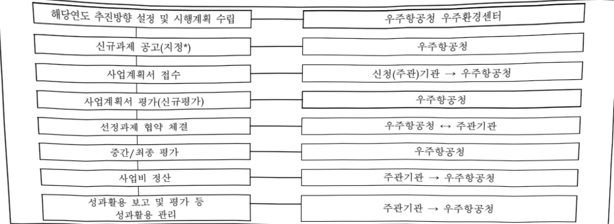

# 우주전파재난 위험분석 및 대응기술 개발(R&D)

**해당 페이지**: PDF 4626 ~ 4641 쪽 해당

**부처**: 우주항공청
**분야**: 통신
**회계유형**: 일반회계
**2026 확정예산**: 2583.0 백만원
**전년대비 증감률**: 10.8%
**AI 도메인**: 데이터

---

### 가. 예산 총괄표

(단위: 백만원, %)

<table border=1 style='margin: auto; word-wrap: break-word;'><tr><td rowspan="2">사업명</td><td rowspan="2">2024년 결산</td><td colspan="2">2025년 예산</td><td colspan="2">2026년</td><td rowspan="2">증감(B-A)</td><td rowspan="2">(B-A)/A</td></tr><tr><td style='text-align: center; word-wrap: break-word;'>본예산(A)</td><td style='text-align: center; word-wrap: break-word;'>추경</td><td style='text-align: center; word-wrap: break-word;'>정부안</td><td style='text-align: center; word-wrap: break-word;'>확정(B)</td></tr><tr><td style='text-align: center; word-wrap: break-word;'>우주전파재난위험분석 및 대응기술 개발(R&amp;D)</td><td style='text-align: center; word-wrap: break-word;'>1,046</td><td style='text-align: center; word-wrap: break-word;'>2,331</td><td style='text-align: center; word-wrap: break-word;'>2,331</td><td style='text-align: center; word-wrap: break-word;'>2,583</td><td style='text-align: center; word-wrap: break-word;'>2,583</td><td style='text-align: center; word-wrap: break-word;'>252</td><td style='text-align: center; word-wrap: break-word;'>10.8</td></tr></table>

## □ 기능별(내역사업별), 목별 예산 내역

(단위:백만원)

<table border=1 style='margin: auto; word-wrap: break-word;'><tr><td rowspan="3"></td><td colspan="5">2024</td><td colspan="7">2025(2025.12월말)</td><td rowspan="3">2026예산</td></tr><tr><td rowspan="2">예산액(추경)</td><td rowspan="2">예산현액</td><td rowspan="2">집행액[실집행액]</td><td rowspan="2">이월액</td><td rowspan="2">불용액</td><td rowspan="2">분예산</td><td rowspan="2">예산현액</td><td rowspan="2">집행액[실집행액]</td><td colspan="2">전년도이월액제외</td><td rowspan="2">이월예상액</td><td rowspan="2">불용예상액</td></tr><tr><td style='text-align: center; word-wrap: break-word;'>예산현액</td><td style='text-align: center; word-wrap: break-word;'>집행액[실집행액]</td></tr><tr><td style='text-align: center; word-wrap: break-word;'>○ 기능별 분류(합계)</td><td style='text-align: center; word-wrap: break-word;'>1,046</td><td style='text-align: center; word-wrap: break-word;'>1,046</td><td style='text-align: center; word-wrap: break-word;'>1,046[1,046]</td><td style='text-align: center; word-wrap: break-word;'>-</td><td style='text-align: center; word-wrap: break-word;'>-</td><td style='text-align: center; word-wrap: break-word;'>2,331</td><td style='text-align: center; word-wrap: break-word;'>2,331</td><td style='text-align: center; word-wrap: break-word;'>2,331[2,144]</td><td style='text-align: center; word-wrap: break-word;'>2,331</td><td style='text-align: center; word-wrap: break-word;'>2,331[2,144]</td><td style='text-align: center; word-wrap: break-word;'>-</td><td style='text-align: center; word-wrap: break-word;'>-</td><td style='text-align: center; word-wrap: break-word;'>2,583</td></tr><tr><td style='text-align: center; word-wrap: break-word;'>· 인공지능(테이터)기반 우주전파재난예보 체계 개발</td><td style='text-align: center; word-wrap: break-word;'>600</td><td style='text-align: center; word-wrap: break-word;'>600</td><td style='text-align: center; word-wrap: break-word;'>600[600]</td><td style='text-align: center; word-wrap: break-word;'>-</td><td style='text-align: center; word-wrap: break-word;'>-</td><td style='text-align: center; word-wrap: break-word;'>1,500</td><td style='text-align: center; word-wrap: break-word;'>1,500</td><td style='text-align: center; word-wrap: break-word;'>1,500[1,361]</td><td style='text-align: center; word-wrap: break-word;'>1,500</td><td style='text-align: center; word-wrap: break-word;'>1,500[1,361]</td><td style='text-align: center; word-wrap: break-word;'>-</td><td style='text-align: center; word-wrap: break-word;'>-</td><td style='text-align: center; word-wrap: break-word;'>1,176</td></tr><tr><td style='text-align: center; word-wrap: break-word;'>· 근지구 우주전파환경 예정보 체계 개발</td><td style='text-align: center; word-wrap: break-word;'>446</td><td style='text-align: center; word-wrap: break-word;'>446</td><td style='text-align: center; word-wrap: break-word;'>446[446]</td><td style='text-align: center; word-wrap: break-word;'>-</td><td style='text-align: center; word-wrap: break-word;'>-</td><td style='text-align: center; word-wrap: break-word;'>831</td><td style='text-align: center; word-wrap: break-word;'>831</td><td style='text-align: center; word-wrap: break-word;'>831[783]</td><td style='text-align: center; word-wrap: break-word;'>831</td><td style='text-align: center; word-wrap: break-word;'>831[783]</td><td style='text-align: center; word-wrap: break-word;'>-</td><td style='text-align: center; word-wrap: break-word;'>-</td><td style='text-align: center; word-wrap: break-word;'>1,407</td></tr><tr><td style='text-align: center; word-wrap: break-word;'>○ 비목별 분류(합계)</td><td style='text-align: center; word-wrap: break-word;'>1,046</td><td style='text-align: center; word-wrap: break-word;'>1,046</td><td style='text-align: center; word-wrap: break-word;'>1,046[1,046]</td><td style='text-align: center; word-wrap: break-word;'>-</td><td style='text-align: center; word-wrap: break-word;'>-</td><td style='text-align: center; word-wrap: break-word;'>2,331</td><td style='text-align: center; word-wrap: break-word;'>2,331</td><td style='text-align: center; word-wrap: break-word;'>2,331[2,144]</td><td style='text-align: center; word-wrap: break-word;'>2,331</td><td style='text-align: center; word-wrap: break-word;'>2,331[2,144]</td><td style='text-align: center; word-wrap: break-word;'>-</td><td style='text-align: center; word-wrap: break-word;'>-</td><td style='text-align: center; word-wrap: break-word;'>2,583</td></tr><tr><td rowspan="2">· 연구개발활동비등(360-05)· 시험 연 구 비(210-13)</td><td style='text-align: center; word-wrap: break-word;'>1,006</td><td style='text-align: center; word-wrap: break-word;'>1,006</td><td style='text-align: center; word-wrap: break-word;'>1,006[1,006]</td><td style='text-align: center; word-wrap: break-word;'>-</td><td style='text-align: center; word-wrap: break-word;'>-</td><td style='text-align: center; word-wrap: break-word;'>2,261</td><td style='text-align: center; word-wrap: break-word;'>2,261</td><td style='text-align: center; word-wrap: break-word;'>2,261[2,074]</td><td style='text-align: center; word-wrap: break-word;'>2,261</td><td style='text-align: center; word-wrap: break-word;'>2,261[2,074]</td><td style='text-align: center; word-wrap: break-word;'>-</td><td style='text-align: center; word-wrap: break-word;'>-</td><td style='text-align: center; word-wrap: break-word;'>2,483</td></tr><tr><td style='text-align: center; word-wrap: break-word;'>40</td><td style='text-align: center; word-wrap: break-word;'>40</td><td style='text-align: center; word-wrap: break-word;'>40[40]</td><td style='text-align: center; word-wrap: break-word;'>-</td><td style='text-align: center; word-wrap: break-word;'>-</td><td style='text-align: center; word-wrap: break-word;'>70</td><td style='text-align: center; word-wrap: break-word;'>70</td><td style='text-align: center; word-wrap: break-word;'>70[70]</td><td style='text-align: center; word-wrap: break-word;'>70</td><td style='text-align: center; word-wrap: break-word;'>70[70]</td><td style='text-align: center; word-wrap: break-word;'>-</td><td style='text-align: center; word-wrap: break-word;'>-</td><td style='text-align: center; word-wrap: break-word;'>100</td></tr><tr><td style='text-align: center; word-wrap: break-word;'>○ 기능비목별 분류(합계)</td><td style='text-align: center; word-wrap: break-word;'>1,046</td><td style='text-align: center; word-wrap: break-word;'>1,046</td><td style='text-align: center; word-wrap: break-word;'>1,046[1,046]</td><td style='text-align: center; word-wrap: break-word;'>-</td><td style='text-align: center; word-wrap: break-word;'>-</td><td style='text-align: center; word-wrap: break-word;'>2,331</td><td style='text-align: center; word-wrap: break-word;'>2,331</td><td style='text-align: center; word-wrap: break-word;'>2,331[2,144]</td><td style='text-align: center; word-wrap: break-word;'>2,331</td><td style='text-align: center; word-wrap: break-word;'>2,331[2,144]</td><td style='text-align: center; word-wrap: break-word;'>-</td><td style='text-align: center; word-wrap: break-word;'>-</td><td style='text-align: center; word-wrap: break-word;'>2,583</td></tr><tr><td style='text-align: center; word-wrap: break-word;'>· 인공지능(테이터)기반 우주전파재난예보 체계 개발</td><td style='text-align: center; word-wrap: break-word;'>600</td><td style='text-align: center; word-wrap: break-word;'>600</td><td style='text-align: center; word-wrap: break-word;'>600[600]</td><td style='text-align: center; word-wrap: break-word;'>-</td><td style='text-align: center; word-wrap: break-word;'>-</td><td style='text-align: center; word-wrap: break-word;'>1,500</td><td style='text-align: center; word-wrap: break-word;'>1,500</td><td style='text-align: center; word-wrap: break-word;'>1,500[1,361]</td><td style='text-align: center; word-wrap: break-word;'>1,500</td><td style='text-align: center; word-wrap: break-word;'>1,500[1,361]</td><td style='text-align: center; word-wrap: break-word;'>-</td><td style='text-align: center; word-wrap: break-word;'>-</td><td style='text-align: center; word-wrap: break-word;'>1,176</td></tr><tr><td rowspan="2">· 연구개발활동비등(360-05)· 근지구 우주전파환경 예정보 체계 개발</td><td style='text-align: center; word-wrap: break-word;'>600</td><td style='text-align: center; word-wrap: break-word;'>600</td><td style='text-align: center; word-wrap: break-word;'>600[600]</td><td style='text-align: center; word-wrap: break-word;'>-</td><td style='text-align: center; word-wrap: break-word;'>-</td><td style='text-align: center; word-wrap: break-word;'>1,500</td><td style='text-align: center; word-wrap: break-word;'>1,500</td><td style='text-align: center; word-wrap: break-word;'>1,500[1,361]</td><td style='text-align: center; word-wrap: break-word;'>1,500</td><td style='text-align: center; word-wrap: break-word;'>1,500[1,361]</td><td style='text-align: center; word-wrap: break-word;'>-</td><td style='text-align: center; word-wrap: break-word;'>-</td><td style='text-align: center; word-wrap: break-word;'>1,176</td></tr><tr><td style='text-align: center; word-wrap: break-word;'>446</td><td style='text-align: center; word-wrap: break-word;'>446</td><td style='text-align: center; word-wrap: break-word;'>446[446]</td><td style='text-align: center; word-wrap: break-word;'>-</td><td style='text-align: center; word-wrap: break-word;'>-</td><td style='text-align: center; word-wrap: break-word;'>831</td><td style='text-align: center; word-wrap: break-word;'>831</td><td style='text-align: center; word-wrap: break-word;'>831[783]</td><td style='text-align: center; word-wrap: break-word;'>831</td><td style='text-align: center; word-wrap: break-word;'>831[783]</td><td style='text-align: center; word-wrap: break-word;'>-</td><td style='text-align: center; word-wrap: break-word;'>-</td><td style='text-align: center; word-wrap: break-word;'>1,407</td></tr><tr><td rowspan="2">· 연구개발활동비등(360-05)· 시험 연 구 비(210-13)</td><td style='text-align: center; word-wrap: break-word;'>406</td><td style='text-align: center; word-wrap: break-word;'>406</td><td style='text-align: center; word-wrap: break-word;'>406[406]</td><td style='text-align: center; word-wrap: break-word;'>-</td><td style='text-align: center; word-wrap: break-word;'>-</td><td style='text-align: center; word-wrap: break-word;'>761</td><td style='text-align: center; word-wrap: break-word;'>761</td><td style='text-align: center; word-wrap: break-word;'>761[713]</td><td style='text-align: center; word-wrap: break-word;'>761</td><td style='text-align: center; word-wrap: break-word;'>761[713]</td><td style='text-align: center; word-wrap: break-word;'>-</td><td style='text-align: center; word-wrap: break-word;'>-</td><td style='text-align: center; word-wrap: break-word;'>1,307</td></tr><tr><td style='text-align: center; word-wrap: break-word;'>40</td><td style='text-align: center; word-wrap: break-word;'>40</td><td style='text-align: center; word-wrap: break-word;'>40[40]</td><td style='text-align: center; word-wrap: break-word;'>-</td><td style='text-align: center; word-wrap: break-word;'>-</td><td style='text-align: center; word-wrap: break-word;'>70</td><td style='text-align: center; word-wrap: break-word;'>70</td><td style='text-align: center; word-wrap: break-word;'>70[70]</td><td style='text-align: center; word-wrap: break-word;'>70</td><td style='text-align: center; word-wrap: break-word;'>70[70]</td><td style='text-align: center; word-wrap: break-word;'>-</td><td style='text-align: center; word-wrap: break-word;'>-</td><td style='text-align: center; word-wrap: break-word;'>100</td></tr></table>

---

### 나. 사업설명자료

## 1 ) 사업목적·내용

- (우주전파재난 위험분석 및 대응기술 개발) 우주전파재난에 취약한 신산업 인프라 보호를 위해 빅데이터·인공지능 기술을 접목한 우주환경 예측·분석 기술 개발로 우주전파재난 예·경보 및 대응 역량 강화

- (인공지능(데이터) 기반 우주전파재난 예보체계 개발) 우주환경 관측데이터와 인공 지능·빅데이터 기술을 결합한 신규 예·경보 모델 개발

- (근지구 우주전파환경 예경보 체계 개발) 중·저궤도 위성 등 우주환경 변화에 따라

극심하게 변화하는 근지구 영역에서의 우주환경 분석·예측 기술 확보

## 2 ) 사업개요

## □ 사업근거 및 추진경위

① 법령상 근거 및 조항 적시

- 우주항공청의 설치 및 운영에 관한 특별법 제7조

제7조(소관 사무) 우주항공청의 소관 사무는 다음 각 호와 같다.

8. 태양 흑점, 지구자기장 등 우주환경의 변화로 발생하는 재난과 우주공간에 있는 우주물체의 추락, 충돌 등에 따른 위험에의 대비에 관한 사항

10. 우주자산의 관리 및 우주안보에 관한 사항으로서 우주항공청장이 관계 중앙행정기관의 장과 협의하여 정하는 사항(국가안보 관련 외교 사항과 순수 국방 목적 관련 사항은 제외한다)

- 전파법 제51조(우주전파재난관리 기본계획의 수립·시행)

제51조(우주전파재난관리 기본계획의 수립·시행) 과학기술정보통신부장관과 우주항공청장은 지구 대기권 밖에 존재하는 전자파에너지의 변화로 발생하는 전파와 관련한 재난(이하 "우주전파재난"이라 한다)에 대비하고, 우주전파재난을 신속하게 수습·복구하기 위하여 다음 각 호의 사항이 포함된 우주전파재난관리 기본계획을 5년마다 수립·시행하여야 한다.

1. 지구 대기권 밖의 전자파에너지 변화의 관측 및 감시에 관한 사항

2. 지구 대기권 밖의 전자파에너지 변화 및 이에 따른 우주전파재난 예보·경보에 관한 사항

3. 우주전파재난의 예방 및 관리를 위한 연구개발 및 국제협력에 관한 사항

4. 그 밖에 우주전파재난의 관리에 필요하다고 인정되는 사항

- 전파법 제61조(전파 연구)

제61조(전파 연구) ② 우주항공청장은 우주전파와 관련하여 다음 각 호의 연구를 수행하여야 한다.

1. 우주전파 수신기술 연구 및 수신자료 분석

2. 지자기(地磁氣) 및 전리층(電離層)의 관측

3. 태양 흑점의 관측

4. 제2호와 제3호에 따른 관측 결과의 분석 및 예보 · 경보

---

- 우주개발진흥법 제5조(우주개발진흥기본계획의 수립) / 제15조(우주위험대비기본계획의 수립)

제5조(우주개발진흥 기본계획의 수립) ① 정부는 우주개발의 진흥과 우주물체의 이용·관리 등을 위하여 5년마다 우주개발에 관한 중장기 정책 목표 및 기본방향을 정하는 우주개발진흥 기본계획(이하 “기본계획”이라 한다)을 수립하여야 한다.
제15조(우주위험대비기본계획의 수립 등) ① 정부는 우주위험에 대비하기 위하여 10년마다 우주위험 대비에 관한 중장기 정책 목표 및 기본방향을 정하는 우주위험대비기본계획(이하 “우주위험대비기본계획”이라 한다)을 수립하여야 한다.
② 우주위험대비기본계획에는 다음 각 호의 사항이 포함되어야 한다.
1. 우주공간의 환경 보호와 감시에 관한 사항
2. 우주위험의 예보 및 경보에 관한 사항
3. 우주위험의 예방 및 대비를 위한 연구개발에 관한 사항
4. 우주위험의 예방 및 대비를 위한 국제협력에 관한 사항
5. 그 밖에 우주위험의 대비에 관하여 필요한 사항
※ 위 조항에 따라 제4차 우주개발진흥 기본계획('23~27, 관계부처 합동) 전략1-과제5(우주를 통한, 우주를 위한 안보 체계 확립)에 우주전파재난 대비체계 확립(우주전파재난 관리 기본계획 수립, 맞춤형 우주 전파환경 정보 제공 등) 관련 사항을, 제1차 우주위험대비 기본계획('14~23, 관계부처 합동) 추진과제 2-4에 태양위험 감시 및 대응시스템 고도화(예측 기술력 강화 포함) 관련 사항을 반영하여 추진 중

- 재난 및 안전관리 기본법 제3조 (정의), 제4조(국가 등의 책무)

제3조(정의) 이 법에서 사용하는 용어의 뜻은 다음과 같다. <개정 2023. 5. 16.>
1. “재난”이란 국민의 생명·신체·재산과 국가에 피해를 주거나 줄 수 있는 것으로서 다음 각 목의 것을 말한다.
가. 자연재난: 태풍, 홍수, 호우(豪雨), 강풍, 풍랑, 해일(海溢), 대설, 한파, 낙뢰, 가뭄, 폭염, 지진, 황사(黄砂), 조류(藻類) 대발생, 조수(潮水), 화산활동, 소행성·유성체 등 자연우주물체의 추락·충돌, 그 밖에 이에 준하는 자연현상으로 인하여 발생하는 재해
나. 사회재난: 화재·봉괴·폭발·교통사고(항공사고 및 해상사고를 포함한다)·화생방사고·환경오염사고 등으로 인하여 발생하는 대통령령으로 정하는 규모 이상의 피해와 국가핵심기반의 마비, 「감염병의 예방 및 관리에 관한 법률」에 따른 감염병 또는 「가축전염병예방법」에 따른 가축전염병의 확산, 「미세먼지 저감 및 관리에 관한 특별법」에 따른 미세먼지 등으로 인한 피해
5의2. “재난관리주관기관”이란 재난이나 그 밖의 각종 사고에 대하여 그 유형별로 예방·대비·대응 및 복구 등의 업무를 주관하여 수행하도록 대통령령으로 정하는 관계 중앙행정기관을 말한다.
제4조(국가 등의 책무) ① 국가와 지방자치단체는 재난이나 그 밖의 각종 사고로부터 국민의 생명·신체 및 재산을 보호할 책무를 지고, 재난이나 그 밖의 각종 사고를 예방하고 피해를 줄이기 위하여 노력하여야 하며, 발생한 피해를 신속히 대응·복구하여 일상으로 회복할 수 있도록 지원하기 위한 계획을 수립·시행하여야 한다. <개정 2013. 8. 6., 2023. 5. 16.>
② 국가와 지방자치단체는 안전에 관한 정보를 적극적으로 공개하여야 하며, 누구든지 이를 편리하게 이용할 수 있도록 하여야 한다. <신설 2019. 12. 3.>
③ 국가와 지방자치단체는 재난이나 그 밖의 각종 사고를 수습하는 과정에서 피해자의 인권이 침해받지 아니하도록 노력하여야 한다. <신설 2024. 1. 16.>

---

④ 제3조제5호나목에 따른 재난관리책임기관의 장은 소관 업무와 관련된 안전관리에 관한 계획을 수립하고 시행하여야 하며, 그 소재지를 관할하는 특별시·광역시·특별자치시·도·특별자치도(이하 “시·도”라 한다)와 시(「제주특별자치도 설치 및 국제자유도시 조성을 위한 특별법」 제10조제2항에 따른 행정시를 포함한다. 이하 같다)·군·구(자치구를 말한다. 이하 같다)의 재난 및 안전관리업무에 협조하여야 한다. <개정 2012. 2. 22., 2014. 12. 30., 2015. 7. 24., 2019. 12. 3., 2024. 1. 16.>

[별표 1의3] 재난 및 각종 사고 유형별 재난관리주관기관

1. 자연재난 유형별 재난관리주관기관

<table border=1 style='margin: auto; word-wrap: break-word;'><tr><td style='text-align: center; word-wrap: break-word;'>재난관리주관기관</td><td style='text-align: center; word-wrap: break-word;'>자연재난 유형</td></tr><tr><td style='text-align: center; word-wrap: break-word;'>가. 과학기술정보통신부및 우주항공청</td><td style='text-align: center; word-wrap: break-word;'>2) 「전파법」제51조에 따른 우주전파재난</td></tr><tr><td colspan="2">※ 위 조항에 따라 수립된 제4차 국가안전관리 기본계획(‘20~’24, 중앙안전관리위원회)에 우주전파재난 대응관련 사항이 포함되어 있음</td></tr></table>

② 추진경위

- 우주전파센터 설립('11.8)

※ 전파법 제61조에 따른 우주전파환경 예·경보 연구 및 서비스 제공

- 우주전파교란 상시감시체계 구축사업 추진('12~'17)

- 태양위험 분석 및 대응기술 연구 사업 추진('18~, '22)

- 우주전과재난을 '재난 및 안전관리기본법'에 따른 법정재난으로 반영하고, 주관기관으로 과기정통부 지정('14)

- 태양위험 분석 및 대응기술 연구 사업 종료에 따른 신규 연구개발 과제 기획('20~'22)

- 우주전파재난 위험분석 및 대응기술 개발 연구 사업 추진('23~27)

-우주항공청 개청('24.5)에 따라 우주전파센터에서 우주환경센터로 기관 변경

## □ 주요내용

① 사업규모

- 총사업비 : 해당 없음

- 사업기간 : 2023 ~ 2027

- 최근 5년 간 투입된 사업비

<table border=1 style='margin: auto; word-wrap: break-word;'><tr><td style='text-align: center; word-wrap: break-word;'>연도</td><td style='text-align: center; word-wrap: break-word;'>2022</td><td style='text-align: center; word-wrap: break-word;'>2023</td><td style='text-align: center; word-wrap: break-word;'>2024</td><td style='text-align: center; word-wrap: break-word;'>2025</td><td style='text-align: center; word-wrap: break-word;'>2026</td></tr><tr><td style='text-align: center; word-wrap: break-word;'>사업비</td><td style='text-align: center; word-wrap: break-word;'>-</td><td style='text-align: center; word-wrap: break-word;'>1,500</td><td style='text-align: center; word-wrap: break-word;'>1,046</td><td style='text-align: center; word-wrap: break-word;'>2,331</td><td style='text-align: center; word-wrap: break-word;'>2,583</td></tr></table>

-기타:해당 없음

---

## ② 사업추진체계

- 사업시행방법 : 출연, 직접수행

- 사업시행주체 : 우주항공청 우주환경센터

- 사업 수혜자 : 우주전파재난 관련 기관 및 국민

- 보조, 융자, 출연, 출자 등의 경우 보조 · 융자 등 지원 비율 및 법적근거

<table border=1 style='margin: auto; word-wrap: break-word;'><tr><td style='text-align: center; word-wrap: break-word;'>내역사업명</td><td style='text-align: center; word-wrap: break-word;'>구분</td><td style='text-align: center; word-wrap: break-word;'>피보조·피출연 등 기관명</td><td style='text-align: center; word-wrap: break-word;'>지원 금액 (2026예산)</td><td style='text-align: center; word-wrap: break-word;'>지원 비율(%)</td><td style='text-align: center; word-wrap: break-word;'>보조율 법적근거 (해당 조항)</td></tr><tr><td style='text-align: center; word-wrap: break-word;'>인공지능(데이터) 기반 우주전파제난 예보 체계 개발</td><td style='text-align: center; word-wrap: break-word;'>출연</td><td style='text-align: center; word-wrap: break-word;'>-</td><td style='text-align: center; word-wrap: break-word;'>1,176백만원</td><td style='text-align: center; word-wrap: break-word;'>100</td><td style='text-align: center; word-wrap: break-word;'>· 국가연구개발혁신법 제22조제3항 · 정보통신 진흥 및 융합 활성화 등에 관한 특별법 제32조제3항</td></tr><tr><td style='text-align: center; word-wrap: break-word;'>근지구 우주전파환경 예정보 체계 개발</td><td style='text-align: center; word-wrap: break-word;'>출연</td><td style='text-align: center; word-wrap: break-word;'>-</td><td style='text-align: center; word-wrap: break-word;'>1,407백만원</td><td style='text-align: center; word-wrap: break-word;'>100</td><td style='text-align: center; word-wrap: break-word;'>· 국가연구개발혁신법 제22조제3항 · 정보통신 진흥 및 융합 활성화 등에 관한 특별법 제32조제3항</td></tr></table>

## 3 ) 2026년도 예산 산출 근거

① 인공지능(데이터) 기반 우주전파재난 예보 체계 개발

:(25)1,500백만원→(26)1,176백만원,324백만원 감액

- 인공지능 기반 우주전파재난 예보 체계 개발 1.176백만원

- (산출) (계속) 2과제×588백만원(평균) = 1,176백만원

② 근지구 우주전파환경 예경보 체계 개발

:(25)831백만원→(26)1,407백만원,576백만원증액

- 근지구 우주전파환경 예경보 체계 개발 1,407백만원

- (산출) (계속) 3과제×469백만원(평균) = 1,407백만원

2025년도 예산 및 2026년도 예산 산출 세부내역 비교

<table border=1 style='margin: auto; word-wrap: break-word;'><tr><td colspan="2">2025년 예산</td><td colspan="2">2026년 예산</td></tr><tr><td style='text-align: center; word-wrap: break-word;'>예산</td><td style='text-align: center; word-wrap: break-word;'>산출내역</td><td style='text-align: center; word-wrap: break-word;'>예산</td><td style='text-align: center; word-wrap: break-word;'>산출내역</td></tr><tr><td style='text-align: center; word-wrap: break-word;'>2,331 백만원</td><td style='text-align: center; word-wrap: break-word;'>○ 연구개발활동비등(360-05): 2,261백만원가. 인공지능(데이터) 기반 우주전파재난 예보 체계 개발: 1,500백만원• 인공지능 기반 태양 표면 자기장 지도 개발: 600백만원• 스포래딩 E층 발생 예측 모델 개발: 300백만원• 우주전파재난 관측 알고리즘 개선 연구: 600백만원나. 근지구 우주전파환경 예경보 체계 개발: 761백만원• 저궤도 우주전파환경 예보모델 개발: 361백만원• 태양풍·태양입자유입 예측모델 개발: 400백만원○ 시험연구비(210-13): 70백만원가. 근지구 우주전파환경 예경보 체계 개발: 70백만원• 우주전파재난 대응 기술 및 대응체계 고도화 연구: 70백만원</td><td style='text-align: center; word-wrap: break-word;'>2,583 백만원</td><td style='text-align: center; word-wrap: break-word;'>○ 연구개발활동비등(360-05): 2,483백만원가. 인공지능(데이터) 기반 우주전파재난 예보 체계 개발: 1,176백만원• 인공지능 기반 태양 표면 자기장 지도 개발: 540백만원• 우주전파재난 관측 알고리즘 개선 연구: 636백만원나. 근지구 우주전파환경 예경보 체계 개발: 1,307백만원• 저궤도 우주전파환경 예보모델 개발: 851백만원• 태양풍·태양입자유입 예측모델 개발: 456백만원○ 시험연구비(210-13): 100백만원가. 근지구 우주전파환경 예경보 체계 개발: 100백만원• 우주전파재난 대응 기술 및 대응체계 고도화 연구: 100백만원</td></tr></table>

---

## 4 ) 사업효과

□ 사업영향, 산출물 성과지표 등

1 '22~26년도 성과계획서 상 성과지표 및 최근 5년간 성과 달성도

<table border=1 style='margin: auto; word-wrap: break-word;'><tr><td style='text-align: center; word-wrap: break-word;'>성과지표</td><td style='text-align: center; word-wrap: break-word;'>구분</td><td style='text-align: center; word-wrap: break-word;'>2022</td><td style='text-align: center; word-wrap: break-word;'>2023</td><td style='text-align: center; word-wrap: break-word;'>2024</td><td style='text-align: center; word-wrap: break-word;'>2025</td><td style='text-align: center; word-wrap: break-word;'>2026</td><td style='text-align: center; word-wrap: break-word;'>2026 목표치산출근거</td><td style='text-align: center; word-wrap: break-word;'>측정산식(또는 측정방법)</td><td style='text-align: center; word-wrap: break-word;'>자료수집방법(또는 자료출처)</td></tr><tr><td rowspan="3">논문의 표준화된 순위보정 영향력 지수(mrnIF)</td><td style='text-align: center; word-wrap: break-word;'>목표</td><td style='text-align: center; word-wrap: break-word;'>-</td><td style='text-align: center; word-wrap: break-word;'>신규</td><td style='text-align: center; word-wrap: break-word;'>63.37</td><td style='text-align: center; word-wrap: break-word;'>64.00</td><td style='text-align: center; word-wrap: break-word;'>64.64</td><td rowspan="3">동 사업을 통해 산출되는 주요 과학적 성과(논문 성과의 질적 수준을 측정)</td><td rowspan="3">∑mrnIF / SCI논문</td><td rowspan="3">연차보고서, NTIS, JCR DB 등</td></tr><tr><td style='text-align: center; word-wrap: break-word;'>실적</td><td style='text-align: center; word-wrap: break-word;'>-</td><td style='text-align: center; word-wrap: break-word;'>-</td><td style='text-align: center; word-wrap: break-word;'>67.87</td><td style='text-align: center; word-wrap: break-word;'>90.9</td><td style='text-align: center; word-wrap: break-word;'>-</td></tr><tr><td style='text-align: center; word-wrap: break-word;'>달성도</td><td style='text-align: center; word-wrap: break-word;'>-</td><td style='text-align: center; word-wrap: break-word;'>-</td><td style='text-align: center; word-wrap: break-word;'>107%</td><td style='text-align: center; word-wrap: break-word;'>142%</td><td style='text-align: center; word-wrap: break-word;'>-</td></tr><tr><td rowspan="3">우주전과재난 분석 모델 (SW) 개발 진척도</td><td style='text-align: center; word-wrap: break-word;'>목표</td><td style='text-align: center; word-wrap: break-word;'>-</td><td style='text-align: center; word-wrap: break-word;'>신규</td><td style='text-align: center; word-wrap: break-word;'>30</td><td style='text-align: center; word-wrap: break-word;'>50</td><td style='text-align: center; word-wrap: break-word;'>70</td><td rowspan="3">예경보 서비스기반 마련의 목표 달성을 위해 모델 최적화 설계 및 요소기술의 반영 여부를 평가</td><td rowspan="3">(구현 완료 요소기술 수)/(구현 필요 요소기술 수) x 100</td><td rowspan="3">수요기관 평가서, 연차보고서 등</td></tr><tr><td style='text-align: center; word-wrap: break-word;'>실적</td><td style='text-align: center; word-wrap: break-word;'>-</td><td style='text-align: center; word-wrap: break-word;'>-</td><td style='text-align: center; word-wrap: break-word;'>30</td><td style='text-align: center; word-wrap: break-word;'>50</td><td style='text-align: center; word-wrap: break-word;'>-</td></tr><tr><td style='text-align: center; word-wrap: break-word;'>달성도</td><td style='text-align: center; word-wrap: break-word;'>-</td><td style='text-align: center; word-wrap: break-word;'>-</td><td style='text-align: center; word-wrap: break-word;'>100%</td><td style='text-align: center; word-wrap: break-word;'>100%</td><td style='text-align: center; word-wrap: break-word;'>-</td></tr><tr><td rowspan="3">근지구 우주환경 모델의 예경보 서비스 활용도</td><td style='text-align: center; word-wrap: break-word;'>목표</td><td style='text-align: center; word-wrap: break-word;'></td><td style='text-align: center; word-wrap: break-word;'>신규</td><td style='text-align: center; word-wrap: break-word;'>1</td><td style='text-align: center; word-wrap: break-word;'>1</td><td style='text-align: center; word-wrap: break-word;'>1</td><td rowspan="3">관련 모델의 실제 예경보서비스 현업에 사용 여부를 평가</td><td rowspan="3">수요기관 평가</td><td rowspan="3">수요기관 평가서, 연차보고서 등</td></tr><tr><td style='text-align: center; word-wrap: break-word;'>실적</td><td style='text-align: center; word-wrap: break-word;'>-</td><td style='text-align: center; word-wrap: break-word;'>-</td><td style='text-align: center; word-wrap: break-word;'>1</td><td style='text-align: center; word-wrap: break-word;'>1</td><td style='text-align: center; word-wrap: break-word;'>-</td></tr><tr><td style='text-align: center; word-wrap: break-word;'>달성도</td><td style='text-align: center; word-wrap: break-word;'>-</td><td style='text-align: center; word-wrap: break-word;'>-</td><td style='text-align: center; word-wrap: break-word;'>100%</td><td style='text-align: center; word-wrap: break-word;'>100%</td><td style='text-align: center; word-wrap: break-word;'>-</td></tr></table>

② 성과지표 이외의 연도별 사업추진 경과 및 실적

<table border=1 style='margin: auto; word-wrap: break-word;'><tr><td style='text-align: center; word-wrap: break-word;'>2022</td><td style='text-align: center; word-wrap: break-word;'>-</td></tr><tr><td style='text-align: center; word-wrap: break-word;'>2023</td><td style='text-align: center; word-wrap: break-word;'>&lt;실적&gt; - 인공지능 기반 초기 태양 자기장 노이즈 제거 모델 및 태양 영상 전처리 기술 개발 ※ SCI 논문 2건, 국내 학술대회 발표 및 학회지 기고 5건 - 국내 스포래딕-E층 발생 경향성 통계 분석 및 머신러닝을 이용한 국내 스포래딕-E층 발생 예측 베이스라인 모델 개발 ※ 국내 학술대회 발표 1건, S/W 저작권 등록 1건, 기술문서 1건 - 태양전파 관측자료 처리기술 및 관측기기 고도화를 위한 개선방안 및 시스템 규격 도출 - 인공위성 대전현상 기초연구 수행, 고에너지 입자산출 모델 도입, 궤도저하 예측을 위한 섭동력 분석, 군집위성군 우주환경 영향 분석 수행 ※ 국제 및 국내논문 각 1건, 기술문서 3건, 국내외 학술대회 발표 및 학회지 기고 16건 - 3차원 코로나 밀도 서비스 모델 및 CME 자동 탐지 분석 모델 등 전체 모델 설계</td></tr><tr><td style='text-align: center; word-wrap: break-word;'>2024</td><td style='text-align: center; word-wrap: break-word;'>&lt;실적&gt; • 저궤도 초소형 위성 대전현상 시뮬레이션 수행 - 국제학술대회 발표 1건 • 우주환경을 적용한 궤도전파기 개선 및 위성고도 변화 연구 수행 - 국내학술대회 발표 1건, 석사학위 논문 1건 • 태양고에너지 양성자 현상 전수조사 및 관련 태양활동 연구수행 - 석사학위 논문 1건</td></tr></table>

---

<table border=1 style='margin: auto; word-wrap: break-word;'><tr><td style='text-align: center; word-wrap: break-word;'></td><td style='text-align: center; word-wrap: break-word;'>- SCI 논문 1건- 국제학술대회 발표 5건, 국내학술대회발표 2건• 수치모델(ENLIL)을 이용한 근지구 태양풍 변화 예측연구 수행- 국제학술대회 발표 1건• 태양 극대기 코로나 3차원 전자밀도 결정 연구수행- 국제학술대회 발표 2건• 지상기반 태양 선속밀도 측정장치와 교정방안에 대한 연구수행- 특허출원 2건• 국내 스포츠덱딘 E층 발생 예측대상 정의 및 머신러닝 모델 5종 테스트 수행• 베이스라인 모델 결과 및 각 머신러닝 모델 결과분석- 특허출원1건, 국제학술대회 발표 1건, 국내학술대회 발표 2건, S/W 저작권 등록 2건, 기술문서 1건, 성과홍보 1건• 태양전과관측자료 잡음 저감기법 연구 및 태양자기장활동과 Ku대역 전과플릭스 상관성 연구수행- 기술문서 2건</td></tr><tr><td style='text-align: center; word-wrap: break-word;'>2025</td><td style='text-align: center; word-wrap: break-word;'>&lt;실적&gt;• 저혜도 위성환경 모델 개발 관련 논문 1건- 인공지능 기반 태양 표면 자기장 지도 개발 관련 논문 5건, 특허 출원 2건, 기술문서 1건, SW 등록 1건 등- 우주환경 관측자료 처리기술 및 관측기기 고도화 관련 기술문서 1건, 특허출원 1건, 특허 등록 2건 등</td></tr></table>

## ③ 향후(2026년도 이후) 기대효과

ㅇ 다중의 신규 모델 개발 - 인공지능 기술을 적용하여 개발한 신규 예측 모델, 태양 영상 및 관측데이터 품질개선 알고리즘 등을 센터 보유 우주전파환경 예·경보 모델에 적용하여 예·경보 역량 향상

0 위성표면대전현상, 위성궤도 저하현상 등 위성체·통신 등에 피해를 줄 수 있는

우주전파재난에 대한 신규 예경보 서비스 및 예보관 현업지원체계 개발

- 단과통신 장애 예·경보 서비스, 우주선(누리호 등)/위성(KPS, 차세대 중형위성 등)

발사 시 우주환경 정보 제공 등

0 영역/고도/지역별 우주환경 감시·분석·예측 체계 구축을 통해 4차산업혁명과 우주 개발 관련 기술의 안정적 운용 및 최적의 전파통신 이용환경 조성

- 태양흑점 폭발 감시 및 이로 인한 지구 주변의 전파/잡음 환경 예측·분석 역량

강화로 우주전파재난 피해 경감 및 대국민 통신 불편 최소화

5) 타당성조사 및 예비타당성조사 시행여부 및 결과 요지 : 해당 없음

6) 총사업비 대상사업 여부 및 내역 : 해당 없음

---

## 7 ) 사업 집행절차

## 8 ) 중기재정계획 상 연도별 투자계획 및 추진경과

(단위: 백만원)

<table border=1 style='margin: auto; word-wrap: break-word;'><tr><td style='text-align: center; word-wrap: break-word;'>중기 재정계획</td><td style='text-align: center; word-wrap: break-word;'>2024</td><td style='text-align: center; word-wrap: break-word;'>2025</td><td style='text-align: center; word-wrap: break-word;'>2026</td><td style='text-align: center; word-wrap: break-word;'>2027</td><td style='text-align: center; word-wrap: break-word;'>2028</td><td style='text-align: center; word-wrap: break-word;'>2029</td></tr><tr><td rowspan="2">2024~2028 2025~2029</td><td style='text-align: center; word-wrap: break-word;'>1,046</td><td style='text-align: center; word-wrap: break-word;'>2,331</td><td style='text-align: center; word-wrap: break-word;'>2,583</td><td style='text-align: center; word-wrap: break-word;'>2,090</td><td style='text-align: center; word-wrap: break-word;'></td><td style='text-align: center; word-wrap: break-word;'></td></tr><tr><td style='text-align: center; word-wrap: break-word;'></td><td style='text-align: center; word-wrap: break-word;'>2,331</td><td style='text-align: center; word-wrap: break-word;'>2,583</td><td style='text-align: center; word-wrap: break-word;'>1,644</td><td style='text-align: center; word-wrap: break-word;'>-</td><td style='text-align: center; word-wrap: break-word;'>-</td></tr></table>

## 9 ) 최근 3년간 동 사업에 대한 주요 외부지적사항 및 평가, 문제점 및 대책 : 해당 없음

## 10 ) 향후 추진방향 및 추진계획

<table border=1 style='margin: auto; word-wrap: break-word;'><tr><td style='text-align: center; word-wrap: break-word;'>○ 우주환경 관측데이터와 IT, 인공지능·빅데이터 기술을 결합하여 예·경보 현업 지원 모델 개발 등 우주환경 예경보 기술 혁신</td></tr><tr><td style='text-align: center; word-wrap: break-word;'>- AI 기술을 활용, 태양 영상 관측자료와 태양 자기장 지도의 품질을 개선(노이즈 제거 기술 개발, 후면을 포함한 태양 전체 Synoptic map 생성 등)하여 센터 보유 모델의 우주환경 예측 정확도 향상</td></tr><tr><td style='text-align: center; word-wrap: break-word;'>- 한반도를 포함한 동북아 지역에서 자주 발생하여 단파(HF), 초단파(VHF) 통신 두절과 GPS 교란을 발생시키는 스포츠닌-E층의 발생 양상을 빅데이터·AI 기술을 활용하여 분석·예측하는 기술 개발</td></tr><tr><td style='text-align: center; word-wrap: break-word;'>- 외부 잡음에 취약한 전파 기반 관측 시설의 잡음 특성 분석 및 대응 기술을 개발하여 우주환경 관측 정확도 제고</td></tr><tr><td style='text-align: center; word-wrap: break-word;'>○ 우주환경 변화에 따라 가장 극심하게 변화하는 근지구에서의 우주환경 분석·예측 역량 확보</td></tr></table>

---

<table border=1 style='margin: auto; word-wrap: break-word;'><tr><td style='text-align: center; word-wrap: break-word;'>- 우주전파재난으로부터 위성체를 보호하기 위해 위성표면 대전현상, 위성궤도 저하현상 등 관련 위성 피해 예측모델을 도입·개발하여 국가 위성 개발 지원을 위한 신규 예·경보 서비스 개발</td></tr><tr><td style='text-align: center; word-wrap: break-word;'>- 우주전파재난을 발생시키는 핵심 요소 중 하나인 태양풍, 태양 입자의 예측·발생·진행 과정을 분석하는 모델 개발을 통해 예보 역량 증진</td></tr><tr><td style='text-align: center; word-wrap: break-word;'>○ 우주전파재난의 피해를 줄이고 피해 상황에 효과적으로 대응하기 위한 우주전파재난 대응기술 및 대응체계 고도화 연구 추진</td></tr><tr><td style='text-align: center; word-wrap: break-word;'>- 국내·외 우주전파재난 대응기술, 신규 피해 가능 분야 및 재난 대응체계에 대한 조사·연구 수행과 우리나라 우주전파재난 대응체계의 점검 및 재정비를 통해 우주전파재난 대응 효과를 높이고, 국제적 우주전파재난 공조체계 구축 추진</td></tr></table>

11) 해당사업에 대한 각종 사업평가의 결과 : 해당 없음

12) 해당사업에 대한 부처 자체평가의 결과 : 해당 없음

13) 부처 건의사항 : 해당 없음

---

### 다. 최근 4년간 결산내역

## 1 ) 결산표

☐ 부처 결산내역

(단위: 백만원, %)

<table border=1 style='margin: auto; word-wrap: break-word;'><tr><td rowspan="2">闰도</td><td colspan="3">예산액</td><td rowspan="2">전년도이월액</td><td rowspan="2">이·전용등</td><td rowspan="2">예비비</td><td rowspan="2">예산현액(B)</td><td rowspan="2">집행액(C)</td><td rowspan="2">집행률(C/A)</td><td rowspan="2">집행률(C/B)</td><td rowspan="2">다음연도이월액</td><td rowspan="2">불용액</td></tr><tr><td style='text-align: center; word-wrap: break-word;'>본예산</td><td style='text-align: center; word-wrap: break-word;'>추경중감액</td><td style='text-align: center; word-wrap: break-word;'>추경(A)</td></tr><tr><td style='text-align: center; word-wrap: break-word;'>2022</td><td style='text-align: center; word-wrap: break-word;'>-</td><td style='text-align: center; word-wrap: break-word;'>-</td><td style='text-align: center; word-wrap: break-word;'>-</td><td style='text-align: center; word-wrap: break-word;'>-</td><td style='text-align: center; word-wrap: break-word;'>-</td><td style='text-align: center; word-wrap: break-word;'>-</td><td style='text-align: center; word-wrap: break-word;'>-</td><td style='text-align: center; word-wrap: break-word;'>-</td><td style='text-align: center; word-wrap: break-word;'>-</td><td style='text-align: center; word-wrap: break-word;'>-</td><td style='text-align: center; word-wrap: break-word;'>-</td><td style='text-align: center; word-wrap: break-word;'>-</td></tr><tr><td style='text-align: center; word-wrap: break-word;'>2023</td><td style='text-align: center; word-wrap: break-word;'>1,500</td><td style='text-align: center; word-wrap: break-word;'>-</td><td style='text-align: center; word-wrap: break-word;'>1,500</td><td style='text-align: center; word-wrap: break-word;'>-</td><td style='text-align: center; word-wrap: break-word;'>-</td><td style='text-align: center; word-wrap: break-word;'>-</td><td style='text-align: center; word-wrap: break-word;'>1,500</td><td style='text-align: center; word-wrap: break-word;'>1,476</td><td style='text-align: center; word-wrap: break-word;'>98.4</td><td style='text-align: center; word-wrap: break-word;'>98.4</td><td style='text-align: center; word-wrap: break-word;'>-</td><td style='text-align: center; word-wrap: break-word;'>24</td></tr><tr><td style='text-align: center; word-wrap: break-word;'>2024</td><td style='text-align: center; word-wrap: break-word;'>1,046</td><td style='text-align: center; word-wrap: break-word;'>-</td><td style='text-align: center; word-wrap: break-word;'>1,046</td><td style='text-align: center; word-wrap: break-word;'>-</td><td style='text-align: center; word-wrap: break-word;'>-</td><td style='text-align: center; word-wrap: break-word;'>-</td><td style='text-align: center; word-wrap: break-word;'>1,046</td><td style='text-align: center; word-wrap: break-word;'>1,046</td><td style='text-align: center; word-wrap: break-word;'>100</td><td style='text-align: center; word-wrap: break-word;'>100</td><td style='text-align: center; word-wrap: break-word;'>-</td><td style='text-align: center; word-wrap: break-word;'>-</td></tr><tr><td style='text-align: center; word-wrap: break-word;'>2025</td><td style='text-align: center; word-wrap: break-word;'>2,331</td><td style='text-align: center; word-wrap: break-word;'>-</td><td style='text-align: center; word-wrap: break-word;'>2,331</td><td style='text-align: center; word-wrap: break-word;'>-</td><td style='text-align: center; word-wrap: break-word;'>-</td><td style='text-align: center; word-wrap: break-word;'>-</td><td style='text-align: center; word-wrap: break-word;'>2,331</td><td style='text-align: center; word-wrap: break-word;'>2,331</td><td style='text-align: center; word-wrap: break-word;'>100</td><td style='text-align: center; word-wrap: break-word;'>100</td><td style='text-align: center; word-wrap: break-word;'>-</td><td style='text-align: center; word-wrap: break-word;'>-</td></tr></table>

□출연·보조사업 등 실집행내역

(단위: 백만원, %)

<table border=1 style='margin: auto; word-wrap: break-word;'><tr><td rowspan="3">구분</td><td colspan="3">부처</td><td colspan="6">사업시행주체(피출연·피보조 기관 등)</td></tr><tr><td colspan="2">예산액</td><td rowspan="2">집행액</td><td rowspan="2">교부액</td><td rowspan="2">전년도 이월액</td><td rowspan="2">교부 현액</td><td rowspan="2">집행액(B)</td><td rowspan="2">이월액</td><td rowspan="2">불용액(B/A)</td></tr><tr><td style='text-align: center; word-wrap: break-word;'>본예산</td><td style='text-align: center; word-wrap: break-word;'>추경(A)</td></tr><tr><td style='text-align: center; word-wrap: break-word;'>2022</td><td style='text-align: center; word-wrap: break-word;'>-</td><td style='text-align: center; word-wrap: break-word;'>-</td><td style='text-align: center; word-wrap: break-word;'>-</td><td style='text-align: center; word-wrap: break-word;'>-</td><td style='text-align: center; word-wrap: break-word;'>-</td><td style='text-align: center; word-wrap: break-word;'>-</td><td style='text-align: center; word-wrap: break-word;'>-</td><td style='text-align: center; word-wrap: break-word;'>-</td><td style='text-align: center; word-wrap: break-word;'>-</td></tr><tr><td style='text-align: center; word-wrap: break-word;'>2023</td><td style='text-align: center; word-wrap: break-word;'>1,400</td><td style='text-align: center; word-wrap: break-word;'>1,400</td><td style='text-align: center; word-wrap: break-word;'>1,400</td><td style='text-align: center; word-wrap: break-word;'>1,400</td><td style='text-align: center; word-wrap: break-word;'>-</td><td style='text-align: center; word-wrap: break-word;'>1,400</td><td style='text-align: center; word-wrap: break-word;'>1,400</td><td style='text-align: center; word-wrap: break-word;'>-</td><td style='text-align: center; word-wrap: break-word;'>-</td></tr><tr><td style='text-align: center; word-wrap: break-word;'>2024</td><td style='text-align: center; word-wrap: break-word;'>1,006</td><td style='text-align: center; word-wrap: break-word;'>1,006</td><td style='text-align: center; word-wrap: break-word;'>1,006</td><td style='text-align: center; word-wrap: break-word;'>1,006</td><td style='text-align: center; word-wrap: break-word;'>-</td><td style='text-align: center; word-wrap: break-word;'>1,006</td><td style='text-align: center; word-wrap: break-word;'>1,006</td><td style='text-align: center; word-wrap: break-word;'>-</td><td style='text-align: center; word-wrap: break-word;'>-</td></tr><tr><td style='text-align: center; word-wrap: break-word;'>2025</td><td style='text-align: center; word-wrap: break-word;'>2,261</td><td style='text-align: center; word-wrap: break-word;'>2,261</td><td style='text-align: center; word-wrap: break-word;'>2,261</td><td style='text-align: center; word-wrap: break-word;'>2,261</td><td style='text-align: center; word-wrap: break-word;'>-</td><td style='text-align: center; word-wrap: break-word;'>2,261</td><td style='text-align: center; word-wrap: break-word;'>2,144</td><td style='text-align: center; word-wrap: break-word;'>-</td><td style='text-align: center; word-wrap: break-word;'>-</td></tr></table>

2) 주요 결산사항 : 해당 없음

### 라. 기타 추가자료

(1) 참고1

---

## 참고1

(목적) 태양활동 극대기에 대비, 우주전과재난에 취약한 전파기반 신산업·전략기술 인프라(위성, 자율주행 등) 보호를 위해 우주환경 예측·분석 모델에 빅데이터·인공지능 기술을 접목하여 우주전과재난 예·경보 역량 향상과 재난 대응체계 고도화 추진

• (기간) '23년 ~ '27년 (5년)

(예산) (총 사업규모) 95.5억원(국비 95.5억원), (25년 요구) 31.3억원

(수행방식) 출연(5개 과제), 자체수행(1개 과제)

(연구개발단계)개발연구

(전문기관/수행주체) 정보통신기획평가원/경희대학교, 한국천문연구원 등

### 1. 추진배경 및 현황

□추진배경

° '24~'26년경 차기 태양활동 극대기 도래로 우주, 항법(GNSS·KPS), 통신 등 ICT 인프라가 받는 우주전파재난 피해도 증가할 것으로 전망

- 극대기가 다가오면서 최근 우주전파재난 발생 증가 추세

<table border=1 style='margin: auto; word-wrap: break-word;'><tr><td style='text-align: center; word-wrap: break-word;'>$ \text{연도} $</td><td style='text-align: center; word-wrap: break-word;'>&#x27;19</td><td style='text-align: center; word-wrap: break-word;'>&#x27;20</td><td style='text-align: center; word-wrap: break-word;'>&#x27;21</td><td style='text-align: center; word-wrap: break-word;'>&#x27;22</td><td style='text-align: center; word-wrap: break-word;'>&#x27;23</td><td style='text-align: center; word-wrap: break-word;'>&#x27;24</td><td style='text-align: center; word-wrap: break-word;'>&#x27;25</td></tr><tr><td style='text-align: center; word-wrap: break-word;'>우주환경경보(건)</td><td style='text-align: center; word-wrap: break-word;'>22</td><td style='text-align: center; word-wrap: break-word;'>13</td><td style='text-align: center; word-wrap: break-word;'>61</td><td style='text-align: center; word-wrap: break-word;'>275</td><td style='text-align: center; word-wrap: break-word;'>480</td><td style='text-align: center; word-wrap: break-word;'>1,031</td><td style='text-align: center; word-wrap: break-word;'>279</td></tr></table>

※ '23.3월 6년 만에 우주전파재난 위기경보 “관심” 단계가 발령되었으며, 이후 '24.5.11일까지 3차례의 관심 발령이 추가되었으며, '24.5.11일 우주전파재난 위기경보 “주의” 단계로 격상 발령됨

※ (최근 피해 사례) 커스페이스X사의 스타링크 위성 49기가 발사(2.4.)되었으나 5단계 중 가장 낮은 1단계 지자기교란 발생(2.5.) 상황에서 38기가 궤도를 이탈하여 소실('22.2.)

0 태양활동으로부터 위성·미래전파자원을 보호하고 첨단 IT 기술의 안정적 전파활용 지원을 위해 태양활동 예측, 분석 등 관련 기술 개발 필요

## 국내외 시장 및 기술동향

o (UN) 우주전파재난을 재난 카테고리(Profile of Risk reduction)에 포함하여 각 국별 우주전파재난 대응방안 마련 권고

°(미국) 태양활동 예측 및 경보 역량 강화를 위한 연구개발진흥법 제정('20.10), 우주전파재난 대응전략 수립('19.3.)

- 해양대기청(NOAA) 산하 우주환경예측센터 내 연구개발전담부서 설치

- 우주전파재난 탐지 역량 강화를 위해 지자기예측모델(geospace) 개발('19), 위성우주환경 예보 및 심우주위성(SWFO-L1, IMAP) 개발 중

- NASA는 인공지능 기반의 태양~지자기 예측모델 개발 중('17~')

---

°(영국) 총리실 주도로 우주전파재난 준비전략 수립('15)

- 우주전파재난 발생 확률을 감염병 다음으로 평가하고 국가재난에 편입

- 위성분야 피해예방을 위한 위성통신 주파수 교란 예측모델 개발('20)

°(일본) 정보통신연구기구(NICT) 주도로 산학연과 함께 5개 분야별 우주전과재난 대응기술 R&D 프로젝트 수행('15-'19) 및 재난 대응계획 수립('18)

- 태양흑점 폭발 예측, CME 방출, 태양풍 도달시간 예측, 우주방사선예측모델 등 우주전파재난 예측·분석을 위한 예측모델 개발

°(국내) 전담기관 설립(우주전파센터), 법정 재난화(재난및안전관리기본법), 상시감시체계 구축 R&D('12-'16), 태양위험분석 및 감시기술 R&D('17-'21) 등 재난 대응을 위한 기반 마련

### 2. 사업의 타당성

## 지원근거

° 전파법 제44조의3(안전한 전파환경 기반 조성), 전파법 제49조 및 시행령 제70조(전파감시), 제51조(우주전파재난관리 기본계획의 수립·시행), 제61조(전파연구)

° 재난 및 안전관리 기본법 제3조(정의) 및 시행령 제3조의2(재난관리 주관기관)

○「제3차 우주전파재난 관리 기본계획(23'27)」，「제3차 전파진흥기본계획(19~23)」，「제1차 우주위험대비 기본계획(14'23)」，「제4차 우주개발 진흥 기본계획(23'27)」 및 관련 세부 시행계획 등

o (국정과제) (경제2-7) 세계를 선도할 넥스트(NEXT) 전략기술 육성(k-space 포함),

(경제2-7-2) 우리 기술로 K-space 도전

## □추진경과

○ 우주전파센터 설립(11년) 및 '12~'17년 우주전파환경 상시감시체계 구축사업(1차, R&D·방발기금)을 통해 전파법 제61조에 따른 태양활동 분석 · 예측 기반 마련

## <우주전파환경 상시감시체계 구축사업 주요 성과 >

ㅇ 세계최초로 태양흑점 폭발 확률을 자동 분석하는 모델(ASSA)을 개발하여 미 SWPC,

NASA 등에 제공(현재 활용 중)하는 등 세계적 수준의 예·경보 기술역량 확보

° 국내 전력망 유도전류 발생 예측모델, 항공 우주방사선 위험 분석기술 등 수요자

맞춤형 우주전파재난 피해예방 지원체계 개발

° 태양관측 위성(美 ACE, STEREO, DSCOVR 위성) 수신국, 전리층 사입사 관측시스템(日 NICT,

中 우한대 등과 협력) 등 우주전파환경 상시 국제공동관측을 위한 시스템 및 협력체계 구축

0 태양위험 분석 및 대응기술 개발사업(2차, R&D)을 통해 커넥엘 판측위성 수신역량 확대 및 기초 예측모델 개발 역량 확보

---

## <태양위험 분석 및 대응기술 개발사업 주요 성과 >

국내 전리권 교란 예측모델, 한국형 지자기교란 산출 알고리즘 개발 등 국내 상황을 반영한 우주전파환경 예·경보 역량 확보

° 태양 자기력선 구조 수치모델 구현으로 태양 활동의 예측·분석 및 우주전파재난

예·경보 정확도 향상을 위한 기반 마련

## 사업의 시급성

○ 차기 태양활동 극대기('24~'26년) 도래에 따라 증가하는 강력한 우주전파재난으로부터 위성(KPS 등)·자율주행·드론 등 국가전략기술 인프라를 보호하기 위해 태양활동 영향 분석 및 예·경보 역량 강화 필요

- GPS를 포함한 위성통신 및 이를 이용한 초연결 모빌리티 기술은 우주전파 재난 발생 시 큰 피해를 입을 수 있어, 관련 영향을 분석하고 이를 사전에 알려줄 수 있는 체계 개발이 시급

## <우주전파재난 주요 피해 사례>

<table border=1 style='margin: auto; word-wrap: break-word;'><tr><td style='text-align: center; word-wrap: break-word;'>발생일</td><td style='text-align: center; word-wrap: break-word;'>장애대상</td><td style='text-align: center; word-wrap: break-word;'>피해 내용</td></tr><tr><td style='text-align: center; word-wrap: break-word;'>1859년 1989년</td><td style='text-align: center; word-wrap: break-word;'>유럽·북미 전신시스템 캐나다 송전시설</td><td style='text-align: center; word-wrap: break-word;'>ㅇ 유럽과 북아메리카 전역 전신시스템 마비 ㅇ 캐나다 쿼벨 지역 송전시설에 2만MW 전력손실로 9시간 동안 정전 발생</td></tr><tr><td style='text-align: center; word-wrap: break-word;'>2003년</td><td style='text-align: center; word-wrap: break-word;'>전세계 항공, 항법, 위성, 전력 등</td><td style='text-align: center; word-wrap: break-word;'>ㅇ 유럽, 아프리카 등 일부 대륙에서 항공, 항법, 위성, 전력, 방송통신 분야 피해 발생</td></tr><tr><td style='text-align: center; word-wrap: break-word;'>2010년 4월 2012년</td><td style='text-align: center; word-wrap: break-word;'>미국 통신위성(Galaxy 5) 미국 통신위성(Terra 1)</td><td style='text-align: center; word-wrap: break-word;'>ㅇ 지자기교란으로 약 9개월간 통제 불능 ㅇ 고에너지입자로 인해 3주간 위성운용 장애 국내 항공기 30편 북극 항로 우회 운항</td></tr><tr><td style='text-align: center; word-wrap: break-word;'>2013년</td><td style='text-align: center; word-wrap: break-word;'>한국 항공기</td><td style='text-align: center; word-wrap: break-word;'>ㅇ 국내 항공기 17편 북극 항로 우회 운항</td></tr><tr><td style='text-align: center; word-wrap: break-word;'>2014년</td><td style='text-align: center; word-wrap: break-word;'>한국 항공기</td><td style='text-align: center; word-wrap: break-word;'>ㅇ 국내 항공기 20편 북극 항로 우회 운항</td></tr><tr><td style='text-align: center; word-wrap: break-word;'>2015년</td><td style='text-align: center; word-wrap: break-word;'>한국 항공기</td><td style='text-align: center; word-wrap: break-word;'>ㅇ 국내 항공기 120편 북극 항로 우회 운항</td></tr><tr><td style='text-align: center; word-wrap: break-word;'>2017년</td><td style='text-align: center; word-wrap: break-word;'>한국 항공기</td><td style='text-align: center; word-wrap: break-word;'>ㅇ 지자기교란으로 인한 대기 항력 증가로 발사 위성 49기 중 38기가 궤도 이탈 및 소실</td></tr><tr><td style='text-align: center; word-wrap: break-word;'>2022년 2월</td><td style='text-align: center; word-wrap: break-word;'>미국 위성(스타링크)</td><td style='text-align: center; word-wrap: break-word;'>ㅇ 일부 지역에서 단파통신 장애 발생</td></tr><tr><td style='text-align: center; word-wrap: break-word;'>2022년 4월</td><td style='text-align: center; word-wrap: break-word;'>동남아시아 단파통신</td><td style='text-align: center; word-wrap: break-word;'>ㅇ 지자기교란으로 인한 대기 항력 증가로 발사 위성 49기 중 38기가 궤도 이탈 및 소실</td></tr></table>

##### < 스타링크 피해 사건('22.2.5.) 개요 >

코로나물질방출(CME)에 의한 1단계 지자기교란(G1)으로 인해 미국 스페이스X사에서

운용 중인 초소형 위성망(Starlink, 전지구 인터넷망) 49기중 38기 궤도 이탈

(원인) 실시간 대기 항력 정보가 아니라 3시간 단위의 지자기교란 지수를 활용한 자체 대기 항력 모델 결과만을 활용하여 발사 강행

- (美의 대응) 스페이스X사의 위성데이터, 정부의 CME 분석/예측 및 데이터 동화 기술 자료를 서로 공유하는 등 정부-산업체 간 공조 강화로 위성환경 예보서비스 개선

※ '23.2.27일 차세대 스타링크 위성(V2 mini) 발사 시 촌정부의 지자기교란 경보

상황 예측을 고려, 예정 발사 시간보다 4.5시간 늦춰 발사

---

### 3. 사업 내용

## 사업 목적

○ 우주전과재난에 취약한 전과통신·우주항공분야 신산업 및 전략기술 인프라의 보호를 위해 우주환경 예측·분석 모델에 AI·빅데이터 기술을 접목한 신규 모델 개발을 통해 우주전과재난 예·경보 역량 향상과 재난 대응체계 고도화

○ 우주환경센터 고유 업무인 우주환경 관측 및 예·경보 역량을 강화하고,

우주전파재난 피해 예측·예방을 위한 R&D 추진

## 사업목표

0 인공지능·머신러닝 기술을 적용하여 태양 표면 자기장 지도, 스포레닉-E 층 발생

예측모델 등 데이터 기반의 우주환경 예측기술 개발

ICT, 신호처리 기술을 활용한 관측데이터 잡음 제거 기술을 개발하여 관측

정확도 제고 및 성능 고도화

0 저케도 우주환경 예보체계 등 국가 위성개발 지원을 위한 신규 예·경보서비스 개발

0 태양풍 등 재난재해 예측 및 분석 기술 개발

## 사업 상세 내용

## 1 인공지능(데이터) 기반 우주전파재난 예보체계 개발

○ 우주환경 관측데이터와 IT, 인공지능·빅데이터 기술을 결합한 예·경보 현업 지원 모델 개발 등 우주환경 예정보 기술 혁신

- (인공지능 기반 태양 표면 자기장 지도 개발) 인공지능을 이용하여 태양 자기장 지도의 품질을 개선(노이즈 제거 기술 개발, 태양 전체 Synoptic Map 생성 등), 기존 분석·예측모델에 적용하여 우주환경 예보역량 강화

⇒ (26년 목표) 태양 극자외선 영상 노이즈 제거 모델 개발·검증, Solar Orbiter 관측자료 활용 중·고위도 자기장 모델 개발·검증 및 최적화

- (우주전파환경 관측자료 처리기술 및 관측기기 고도화) 외부 잡음에 취약한 전파 기반 관측시설의 잡음 특성 분석 및 대응기술을 개발하여 우주환경 관측 정확도 제고

⇒ (‘26년 목표) 태양흑점폭발 유형관측기(3~30GHz), 태양활동 수준관측기(2.8GHz)의 관측자료 품질개선 연구(RF 필터기법, DC 전원잡음 개선, 수신부 시스템 이득/잡음특성 개선 등) 및 적용, 3~30GHz대역 초고주파 태양흑점폭발 유형관측기 수신시스템 통합 및 성능검증

---

## ② 근지구 우주전파환경 예·경보체계 개발

○우주환경 변화에 따라 가장 극심하게 변화하는 근지구(중·저궤도 위성 운용 고도)에서의 우주환경 분석·예측역량 확보

- (저궤도 우주전파환경 예보모델 개발) 우주환경변화에 따른 안정적 위성 운영 지원을 위해 위성표면대전현상, 위성궤도 저하현상 등 관련 위성 피해 예측모델을 도입·개발 및 위성분야 신규 예경보서비스 개발

⇒ (26년 목표) 다양한 저궤도 위성에 대하여 모델 운영 시험 및 분석(저궤도 위성망 분석, 단일위성 결과 응용연구, 위성망 적용 결과 분석), 지방시 변화를 반영한 코드 개발 및 지방시별 오차 산출, 우주환경에 의한 궤도저하 분석과 모델링, 대형/거대 군집위성군 충돌위험분석 모듈 구현

- (CME 자동 탐지 분석 모델 개발을 통한 태양풍 변화 예측 및 고에너지 입자(>10MeV proton) 근지구 도달 예측 모델 개발) 우주전파재난을 발생시키는 핵심요소 중 하나인 태양풍·CME, 태양 고에너지 입자의 발생 예측 및 진행과정을 분석하는 모델 개발을 통해 예보역량 증진

⇒ (26년 목표) 6시간 범위 time-intensity profile 예측 모델로 확장, 행성간 공간의 3차원 코로나 밀도와 관측된 충격파의 전파 양상 비교 분석, CME 자동 탐지 및 분석 모델 개발 완료

- (우주전파재난 위험분석 및 대응기술개발) 국내·외 우주전파재난 대응기술, 신규

피해 가능 분야 및 재난대응체계 조사·연구를 통해 효과적인 우주전파재난 대응체계

점검 및 재정비, 국가 간 우주전파재난 공조체계 구축 추진

⇒ (26년 목표) 미국(NOAA, NASA, FEMA), 유럽(ESA) 등 해외 선진기관과 우주환경 분야 기술·정책 교류(MoU 등) 및 우주전파재난 공조체계 구축

---

<table border=1 style='margin: auto; word-wrap: break-word;'><tr><td style='text-align: center; word-wrap: break-word;'>사 업 명</td></tr><tr><td style='text-align: center; word-wrap: break-word;'>(9) 한국항공우주연구원 연구 운영비 지원(R&amp;D) (1334-302)</td></tr></table>

## □ 사업 코드 정보

<table border=1 style='margin: auto; word-wrap: break-word;'><tr><td style='text-align: center; word-wrap: break-word;'>구분</td><td style='text-align: center; word-wrap: break-word;'>회계</td><td style='text-align: center; word-wrap: break-word;'>소관</td><td style='text-align: center; word-wrap: break-word;'>실국(기관)</td><td style='text-align: center; word-wrap: break-word;'>계정</td><td style='text-align: center; word-wrap: break-word;'>분야</td><td style='text-align: center; word-wrap: break-word;'>부문</td></tr><tr><td style='text-align: center; word-wrap: break-word;'>코드</td><td rowspan="2">일반회계</td><td rowspan="2">우주항공청</td><td rowspan="2">우주항공정책국</td><td rowspan="2"></td><td style='text-align: center; word-wrap: break-word;'>150</td><td style='text-align: center; word-wrap: break-word;'>152</td></tr><tr><td style='text-align: center; word-wrap: break-word;'>명칭</td><td style='text-align: center; word-wrap: break-word;'>과학기술</td><td style='text-align: center; word-wrap: break-word;'>과학기술 연구지원</td></tr></table>

<table border=1 style='margin: auto; word-wrap: break-word;'><tr><td style='text-align: center; word-wrap: break-word;'>구분</td><td style='text-align: center; word-wrap: break-word;'>프로그램</td><td style='text-align: center; word-wrap: break-word;'>단위사업</td><td style='text-align: center; word-wrap: break-word;'>세부사업</td></tr><tr><td style='text-align: center; word-wrap: break-word;'>코드</td><td style='text-align: center; word-wrap: break-word;'>1300</td><td style='text-align: center; word-wrap: break-word;'>1334</td><td style='text-align: center; word-wrap: break-word;'>302</td></tr><tr><td style='text-align: center; word-wrap: break-word;'>명칭</td><td style='text-align: center; word-wrap: break-word;'>우주항공진흥</td><td style='text-align: center; word-wrap: break-word;'>출연연구기관지원</td><td style='text-align: center; word-wrap: break-word;'>한국항공우주연구원 연구 운영비 지원(R&amp;D)</td></tr></table>

□ 사업 성격

<table border=1 style='margin: auto; word-wrap: break-word;'><tr><td rowspan="2">신규</td><td rowspan="2">계속</td><td rowspan="2">완료</td><td style='text-align: center; word-wrap: break-word;'>예비타당성</td><td style='text-align: center; word-wrap: break-word;'>총사업비</td><td style='text-align: center; word-wrap: break-word;'>총액계상</td><td style='text-align: center; word-wrap: break-word;'>사업소관 변경정보</td></tr><tr><td style='text-align: center; word-wrap: break-word;'>실시여부</td><td style='text-align: center; word-wrap: break-word;'>관리대상</td><td style='text-align: center; word-wrap: break-word;'>예산사업</td><td style='text-align: center; word-wrap: break-word;'>2025예산 시 소관</td></tr><tr><td style='text-align: center; word-wrap: break-word;'></td><td style='text-align: center; word-wrap: break-word;'>○</td><td style='text-align: center; word-wrap: break-word;'></td><td style='text-align: center; word-wrap: break-word;'></td><td style='text-align: center; word-wrap: break-word;'></td><td style='text-align: center; word-wrap: break-word;'></td><td style='text-align: center; word-wrap: break-word;'></td></tr></table>

□ 사업 지원 형태 및 지원을

<table border=1 style='margin: auto; word-wrap: break-word;'><tr><td style='text-align: center; word-wrap: break-word;'>직접</td><td style='text-align: center; word-wrap: break-word;'>출자</td><td style='text-align: center; word-wrap: break-word;'>출연</td><td style='text-align: center; word-wrap: break-word;'>보조</td><td style='text-align: center; word-wrap: break-word;'>융자</td><td style='text-align: center; word-wrap: break-word;'>국고보조율(%)</td><td style='text-align: center; word-wrap: break-word;'>융자율(%)</td></tr><tr><td style='text-align: center; word-wrap: break-word;'></td><td style='text-align: center; word-wrap: break-word;'></td><td style='text-align: center; word-wrap: break-word;'>○</td><td style='text-align: center; word-wrap: break-word;'></td><td style='text-align: center; word-wrap: break-word;'></td><td style='text-align: center; word-wrap: break-word;'></td><td style='text-align: center; word-wrap: break-word;'></td></tr></table>

## 사업 담당자

<table border=1 style='margin: auto; word-wrap: break-word;'><tr><td style='text-align: center; word-wrap: break-word;'>사업명</td><td colspan="5">구분</td></tr><tr><td rowspan="4">한국항공우주연구원 연구운영비 지원 (R&amp;D)</td><td rowspan="3">소관부처</td><td style='text-align: center; word-wrap: break-word;'>실·국·과(팀)</td><td style='text-align: center; word-wrap: break-word;'>과 장</td><td style='text-align: center; word-wrap: break-word;'>사무관</td><td style='text-align: center; word-wrap: break-word;'>주무관</td></tr><tr><td style='text-align: center; word-wrap: break-word;'>우주항공정책국</td><td style='text-align: center; word-wrap: break-word;'>현영목</td><td style='text-align: center; word-wrap: break-word;'>심경식</td><td style='text-align: center; word-wrap: break-word;'>허영준</td></tr><tr><td style='text-align: center; word-wrap: break-word;'>우주항공정책과</td><td style='text-align: center; word-wrap: break-word;'>055-856-4210</td><td style='text-align: center; word-wrap: break-word;'>055-856-4218</td><td style='text-align: center; word-wrap: break-word;'>055-856-4213</td></tr><tr><td style='text-align: center; word-wrap: break-word;'>사업시행주체</td><td style='text-align: center; word-wrap: break-word;'>한국항공우주연구원</td><td style='text-align: center; word-wrap: break-word;'>예산팀</td><td style='text-align: center; word-wrap: break-word;'>노현제</td><td style='text-align: center; word-wrap: break-word;'>042-860-2140</td></tr></table>

---

### 원본 PDF 크롭 이미지

