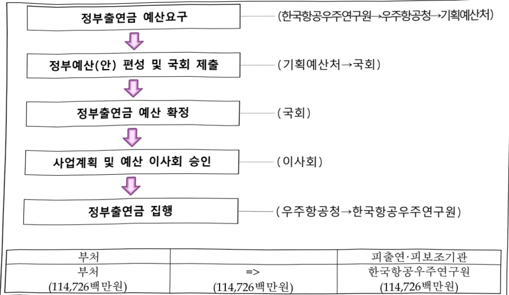

# 한국항공우주연구원 연구 운영비 지원(R&D)

**해당 페이지**: PDF 4642 ~ 4656 쪽 해당

**부처**: 우주항공청
**분야**: 과학기술
**회계유형**: 일반회계
**2026 확정예산**: 114726.0 백만원
**전년대비 증감률**: 5.4%
**AI 도메인**: 우주/위성, R&D 지원

---

### 가.예산 총괄표

(단위: 백만원, %)

<table border=1 style='margin: auto; word-wrap: break-word;'><tr><td rowspan="2">사업명</td><td rowspan="2">2024년 결산</td><td colspan="2">2025년 예산</td><td colspan="2">2026년</td><td rowspan="2">중감(B-A)</td><td rowspan="2">(B-A)/A</td></tr><tr><td style='text-align: center; word-wrap: break-word;'>본예산(A)</td><td style='text-align: center; word-wrap: break-word;'>추경</td><td style='text-align: center; word-wrap: break-word;'>정부안</td><td style='text-align: center; word-wrap: break-word;'>확정(B)</td></tr><tr><td style='text-align: center; word-wrap: break-word;'>한국항공우주연구원연구운영비 지원(R&amp;D)</td><td style='text-align: center; word-wrap: break-word;'>97,523</td><td style='text-align: center; word-wrap: break-word;'>108,886</td><td style='text-align: center; word-wrap: break-word;'>108,886</td><td style='text-align: center; word-wrap: break-word;'>114,726</td><td style='text-align: center; word-wrap: break-word;'>114,726</td><td style='text-align: center; word-wrap: break-word;'>5,840</td><td style='text-align: center; word-wrap: break-word;'>5.4</td></tr></table>

## □ 기능별(내역사업별), 목별 예산 내역

(단위:백만원)

<table border=1 style='margin: auto; word-wrap: break-word;'><tr><td rowspan="3"></td><td colspan="5">2024</td><td colspan="7">2025(25.12월말)</td><td rowspan="3">2026예산</td></tr><tr><td rowspan="2">예산액(추경)</td><td rowspan="2">예산현액</td><td rowspan="2">집행액[실집행액]</td><td rowspan="2">이월액</td><td rowspan="2">불용액</td><td rowspan="2">본예산</td><td rowspan="2">예산현액</td><td rowspan="2">집행액[실집행액]</td><td colspan="2">전년도이월액제외</td><td rowspan="2">이월예상액</td><td rowspan="2">불용예상액</td></tr><tr><td style='text-align: center; word-wrap: break-word;'>예산현액</td><td style='text-align: center; word-wrap: break-word;'>집행액[실집행액]</td></tr><tr><td style='text-align: center; word-wrap: break-word;'>○ 기능별 분류(합계)</td><td style='text-align: center; word-wrap: break-word;'>100,165</td><td style='text-align: center; word-wrap: break-word;'>100,165</td><td style='text-align: center; word-wrap: break-word;'>97,523[98,979]</td><td style='text-align: center; word-wrap: break-word;'>-</td><td style='text-align: center; word-wrap: break-word;'>2,642</td><td style='text-align: center; word-wrap: break-word;'>108,886</td><td style='text-align: center; word-wrap: break-word;'>108,886</td><td style='text-align: center; word-wrap: break-word;'>106,853[107,887]</td><td style='text-align: center; word-wrap: break-word;'>108,886</td><td style='text-align: center; word-wrap: break-word;'>106,853[106,853]</td><td style='text-align: center; word-wrap: break-word;'>-</td><td style='text-align: center; word-wrap: break-word;'>2,033</td><td style='text-align: center; word-wrap: break-word;'>114,726</td></tr><tr><td style='text-align: center; word-wrap: break-word;'>·기관운영비</td><td style='text-align: center; word-wrap: break-word;'>60,227</td><td style='text-align: center; word-wrap: break-word;'>60,227</td><td style='text-align: center; word-wrap: break-word;'>57,585[57,859]</td><td style='text-align: center; word-wrap: break-word;'>-</td><td style='text-align: center; word-wrap: break-word;'>2,642</td><td style='text-align: center; word-wrap: break-word;'>62,057</td><td style='text-align: center; word-wrap: break-word;'>62,057</td><td style='text-align: center; word-wrap: break-word;'>60,024[60,027]</td><td style='text-align: center; word-wrap: break-word;'>62,057</td><td style='text-align: center; word-wrap: break-word;'>60,024[60,024]</td><td style='text-align: center; word-wrap: break-word;'>-</td><td style='text-align: center; word-wrap: break-word;'>2,033</td><td style='text-align: center; word-wrap: break-word;'>64,259</td></tr><tr><td style='text-align: center; word-wrap: break-word;'>·주요사업비</td><td style='text-align: center; word-wrap: break-word;'>39,938</td><td style='text-align: center; word-wrap: break-word;'>39,938</td><td style='text-align: center; word-wrap: break-word;'>39,938[41,120]</td><td style='text-align: center; word-wrap: break-word;'>-</td><td style='text-align: center; word-wrap: break-word;'>-</td><td style='text-align: center; word-wrap: break-word;'>46,829</td><td style='text-align: center; word-wrap: break-word;'>46,829</td><td style='text-align: center; word-wrap: break-word;'>46,829[47,860]</td><td style='text-align: center; word-wrap: break-word;'>46,829</td><td style='text-align: center; word-wrap: break-word;'>46,829[46,829]</td><td style='text-align: center; word-wrap: break-word;'>-</td><td style='text-align: center; word-wrap: break-word;'>-</td><td style='text-align: center; word-wrap: break-word;'>50,467</td></tr><tr><td style='text-align: center; word-wrap: break-word;'>○ 비목별 분류(합계)</td><td style='text-align: center; word-wrap: break-word;'>100,165</td><td style='text-align: center; word-wrap: break-word;'>100,165</td><td style='text-align: center; word-wrap: break-word;'>97,523[98,979]</td><td style='text-align: center; word-wrap: break-word;'>-</td><td style='text-align: center; word-wrap: break-word;'>2,642</td><td style='text-align: center; word-wrap: break-word;'>108,886</td><td style='text-align: center; word-wrap: break-word;'>108,886</td><td style='text-align: center; word-wrap: break-word;'>106,853[107,887]</td><td style='text-align: center; word-wrap: break-word;'>108,886</td><td style='text-align: center; word-wrap: break-word;'>106,853[106,853]</td><td style='text-align: center; word-wrap: break-word;'>-</td><td style='text-align: center; word-wrap: break-word;'>2,033</td><td style='text-align: center; word-wrap: break-word;'>114,726</td></tr><tr><td style='text-align: center; word-wrap: break-word;'>·연구개발인건비(360-01)</td><td style='text-align: center; word-wrap: break-word;'>58,502</td><td style='text-align: center; word-wrap: break-word;'>58,502</td><td style='text-align: center; word-wrap: break-word;'>55,860[56,134]</td><td style='text-align: center; word-wrap: break-word;'>-</td><td style='text-align: center; word-wrap: break-word;'>2,642</td><td style='text-align: center; word-wrap: break-word;'>60,297</td><td style='text-align: center; word-wrap: break-word;'>60,297</td><td style='text-align: center; word-wrap: break-word;'>58,264[58,267]</td><td style='text-align: center; word-wrap: break-word;'>60,297</td><td style='text-align: center; word-wrap: break-word;'>58,264[58,264]</td><td style='text-align: center; word-wrap: break-word;'>-</td><td style='text-align: center; word-wrap: break-word;'>2,033</td><td style='text-align: center; word-wrap: break-word;'>62,449</td></tr><tr><td style='text-align: center; word-wrap: break-word;'>·연구개발경상비(360-02)</td><td style='text-align: center; word-wrap: break-word;'>1,725</td><td style='text-align: center; word-wrap: break-word;'>1,725</td><td style='text-align: center; word-wrap: break-word;'>1,725[1,725]</td><td style='text-align: center; word-wrap: break-word;'>-</td><td style='text-align: center; word-wrap: break-word;'>-</td><td style='text-align: center; word-wrap: break-word;'>1,760</td><td style='text-align: center; word-wrap: break-word;'>1,760</td><td style='text-align: center; word-wrap: break-word;'>1,760[1,760]</td><td style='text-align: center; word-wrap: break-word;'>1,760</td><td style='text-align: center; word-wrap: break-word;'>1,760[1,760]</td><td style='text-align: center; word-wrap: break-word;'>-</td><td style='text-align: center; word-wrap: break-word;'>-</td><td style='text-align: center; word-wrap: break-word;'>1,810</td></tr><tr><td style='text-align: center; word-wrap: break-word;'>·연구개발장바시스템구축비(360-04)</td><td style='text-align: center; word-wrap: break-word;'>1,153</td><td style='text-align: center; word-wrap: break-word;'>1,153</td><td style='text-align: center; word-wrap: break-word;'>1,153[1,250]</td><td style='text-align: center; word-wrap: break-word;'>-</td><td style='text-align: center; word-wrap: break-word;'>-</td><td style='text-align: center; word-wrap: break-word;'>1,153</td><td style='text-align: center; word-wrap: break-word;'>1,153</td><td style='text-align: center; word-wrap: break-word;'>1,153[1,164]</td><td style='text-align: center; word-wrap: break-word;'>1,153</td><td style='text-align: center; word-wrap: break-word;'>1,153[1,153]</td><td style='text-align: center; word-wrap: break-word;'>-</td><td style='text-align: center; word-wrap: break-word;'>-</td><td style='text-align: center; word-wrap: break-word;'>1,328</td></tr><tr><td style='text-align: center; word-wrap: break-word;'>·연구개발활동비등(360-05)</td><td style='text-align: center; word-wrap: break-word;'>38,785</td><td style='text-align: center; word-wrap: break-word;'>38,785</td><td style='text-align: center; word-wrap: break-word;'>38,785[39,870]</td><td style='text-align: center; word-wrap: break-word;'>-</td><td style='text-align: center; word-wrap: break-word;'>-</td><td style='text-align: center; word-wrap: break-word;'>45,676</td><td style='text-align: center; word-wrap: break-word;'>45,676</td><td style='text-align: center; word-wrap: break-word;'>45,676[46,696]</td><td style='text-align: center; word-wrap: break-word;'>45,676</td><td style='text-align: center; word-wrap: break-word;'>45,676[45,676]</td><td style='text-align: center; word-wrap: break-word;'>-</td><td style='text-align: center; word-wrap: break-word;'>-</td><td style='text-align: center; word-wrap: break-word;'>49,139</td></tr></table>

---

### 나. 사업설명자료

## 1 ) 사업목적·내용

□ 항공우주 과학기술영역의 새로운 탐구, 기술선도, 개발 및 보급을 통하여 국가 경제의 발전과 국민생활 향상에 기여

## 2 ) 사업개요

## □ 사업근거 및 추진경위

① 법령상 근거 및 조항

-「우주항공청의 설치 및 운영에 관한 특별법」제21조

제21조(항공우주연구원 및 천문연구원의 운영재원) ① 항공우주연구원 및 천문연구원은 정부의 출연금과 그 밖의 수익금으로 운영한다.

② 정부는 항공우주연구원 및 천문연구원의 설립·운영에 드는 경비에 충당하기 위하여 예산의 범위에서 항공우주연구원 및 천문연구원에 출연금을 지급할 수 있다. 이 경우 정부는 항공우주연구원 및 천문연구원의 지속적이고 안정적인 운영을 위하여 필요한 재원이 마련될 수 있도록 노력하여야 한다.

③ 지방자치단체의 요청에 따라 항공우주연구원 및 천문연구원이 해당 지방자치단체에 지역조직을 설립·운영할 경우 지방자치단체는 이에 필요한 경비에 충당하기 위하여 예산의 범위에서 항공우주연구원 및 천문연구원에 출연금을 지급할 수 있다.

## ② 추진경위

- '87. 12 : 관계법 제정 '항공우주산업개발촉진법

- '89. 10 : 한국기계연구원 부설『항공우주연구소』설립

- '96. 11 : 재단법인 한국항공우주연구소로 독립

- '99. 01 : 한국항공우주연구소 설립

정부출연연구기관등의 설립·운영 및 육성에 관한 법률

- '01. 01 : 한국항공우주연구원으로 명칭 변경

- '04. 10 : 한국항공우주연구원 설립근거 변경

과학기술분야 정부출연 연구기관 등의 설립·운영 및 육성에 관한 법률

- '16. 12 : 국가 우주개발 전문기관 지정

- '24. 05 : 한국항공우주연구원 설립근거 변경

우주항공청의 설치 및 운영에 관한 특별법

---

□주요내용

① 사업규모

- 총사업비 : 해당 없음

- 사업기간 : '90~계속

- 최근 5년 간 투입된 사업비

<table border=1 style='margin: auto; word-wrap: break-word;'><tr><td style='text-align: center; word-wrap: break-word;'>$ \underline{\text{西}} $</td><td style='text-align: center; word-wrap: break-word;'>2022</td><td style='text-align: center; word-wrap: break-word;'>2023</td><td style='text-align: center; word-wrap: break-word;'>2024</td><td style='text-align: center; word-wrap: break-word;'>2025</td><td style='text-align: center; word-wrap: break-word;'>2026</td></tr><tr><td style='text-align: center; word-wrap: break-word;'>$ \underline{\text{사업비}} $</td><td style='text-align: center; word-wrap: break-word;'>124,487</td><td style='text-align: center; word-wrap: break-word;'>119,190</td><td style='text-align: center; word-wrap: break-word;'>100,165</td><td style='text-align: center; word-wrap: break-word;'>108,886</td><td style='text-align: center; word-wrap: break-word;'>114,726</td></tr></table>

② 사업추진체계

- 사업시행방법 : 출연

- 사업시행주체 : 한국항공우주연구원

- 사업 수혜자 : 산업계, 학계, 연구계, 공공부문 등 국가 모든분야

- 보조, 융자, 출연, 출자 등의 경우 보조·융자 등 지원 비율 및 법적근거

<table border=1 style='margin: auto; word-wrap: break-word;'><tr><td colspan="2">내역사업명</td><td style='text-align: center; word-wrap: break-word;'>구분</td><td style='text-align: center; word-wrap: break-word;'>피보조·피출연 등 기관명</td><td style='text-align: center; word-wrap: break-word;'>지원 금액 (2026예산)</td><td style='text-align: center; word-wrap: break-word;'>지원 비율(%)</td><td style='text-align: center; word-wrap: break-word;'>보조율 법적근거 (해당 조항)</td></tr><tr><td colspan="2">합계</td><td rowspan="9">출연</td><td rowspan="9">한국항공 우주연구원</td><td style='text-align: center; word-wrap: break-word;'>114,726</td><td rowspan="9">100</td><td rowspan="9">우주항공청의 설치 및 운영에 관한 특별법 제21조(항공우주연구원 및 천문연구원의 운영재원)</td></tr><tr><td colspan="2">기관운영비</td><td style='text-align: center; word-wrap: break-word;'>64,259</td></tr><tr><td rowspan="7">주요 사업비</td><td style='text-align: center; word-wrap: break-word;'>항공우주 중장기 임무 핵심 기술 개발</td><td style='text-align: center; word-wrap: break-word;'>9,328</td></tr><tr><td style='text-align: center; word-wrap: break-word;'>우주자산 기반 국민체감형 기술개발</td><td style='text-align: center; word-wrap: break-word;'>10,359</td></tr><tr><td style='text-align: center; word-wrap: break-word;'>항공우주 신산업 창출 혁신기술 개발</td><td style='text-align: center; word-wrap: break-word;'>3,529</td></tr><tr><td style='text-align: center; word-wrap: break-word;'>항공우주 인프라 운영 및 미래 전략 연구</td><td style='text-align: center; word-wrap: break-word;'>17,705</td></tr><tr><td style='text-align: center; word-wrap: break-word;'>장비구입비</td><td style='text-align: center; word-wrap: break-word;'>1,328</td></tr><tr><td style='text-align: center; word-wrap: break-word;'>(전략연구사업) 다층궤도 위성항법을 위한 저궤도 우주부품 국산화 및 우주궤도 실증시험</td><td style='text-align: center; word-wrap: break-word;'>5,305</td></tr><tr><td style='text-align: center; word-wrap: break-word;'>(전략연구사업) eVTOL 디지털 통합시험 COMPLEX 개발 및 운용</td><td style='text-align: center; word-wrap: break-word;'>2,913</td></tr></table>

---

3)2026년도 예산 산출 근거

☐ 한국항공우주연구원 연구운영비 지원(R&D) : (2025 본예산) 108,886백만원 → (2026 예산) 114,726백만원, 5,840백만원 증액

① 기관운영비

: (2025 본예산) 62,057백만원 → (2026 예산) 64,259백만원, 2,202백만원 증액

1) 인건비 (2025 본예산) 60,297백만원 → (2026 예산) 62,449백만원, 2,152백만원 증액

- '25년 신규인력 미반영 인건비,'26년 인건비 처우개선

- (산출) '25년 신규인력 미반영(2명) 인건비 40백만원, 인건비 처우개선 2,112백만원

2) 경상경비 (2025 본예산) 1,760백만원 → (2026 예산) 1,810백만원, 50백만원 증액

-경상비 효율화(공통감액), 자회사 처우개선 부담금, 공공요금(전기/가스)

- (산출) 경상비 일괄감액 △44백만원, 자회사 처우개선 31백만원, 공공요금 증액 소요 63백만원

② 주요사업비

:(2025 본예산) 46,829백만원 → (2026 예산) 50,467백만원, 3,638백만원 증액

·항공우주 중장기 임무 핵심 기술 개발, 전략연구사업 등 반영

- (산출) 항공우주 중장기 임무 핵심 기술 개발 9,328백만원 ('25년 대비 △3,973백만원 감액)

우주자산 기반 국민체감형 기술 개발 10,359백만원 ('25년 대비 △874백만원 감액)

항공우주 신산업 창출 혁신기술 개발 3,529백만원 ('25년 대비 △1,502백만원 감액)

항공우주 인프라 운영 및 미래 전략 연구 17,705백만원(25년 대비 1,594백만원 증액)

장비구입비 1,328백만원(25년 대비 175백만원 증액)

(전략연구사업) 다층궤도 위성항법을 위한 저궤도 우주부품 국산화 및 우주궤도 실증시험 5,305백만원

('25년 대비 순증)

(선택연구사업) eVTOL 디지털 통합시험 COMPLEX 개발 및 운용 2,913백만원 ('25년 대비 순증)

ㅇ 2025년도 예산 및 2026년도 예산 산출 세부내역 비교

<table border=1 style='margin: auto; word-wrap: break-word;'><tr><td colspan="2">2025년 본예산</td><td colspan="2">2026년 예산</td></tr><tr><td style='text-align: center; word-wrap: break-word;'>예산</td><td style='text-align: center; word-wrap: break-word;'>산출내역</td><td style='text-align: center; word-wrap: break-word;'>예산</td><td style='text-align: center; word-wrap: break-word;'>산출내역</td></tr><tr><td style='text-align: center; word-wrap: break-word;'>108,886 백만원</td><td style='text-align: center; word-wrap: break-word;'>&lt; 한국항공우주연구원 연구운영비 지원(R&amp;D) 108,886백만원 &gt; ○ 기관운영비: 62,057백만원 - 인건비: 60,297백만원 가. 전년도 인건비(58,502백만원) • 정원 1,038명×56백만원×12/12개월=58,502백만원 나. &#x27;25년 신규인력 인건비(40백만원) • 2명×40백만원×6/12개월=40백만원 다. &#x27;25년 인건비 처우개선(1,755백만원) • (전년도 인건비 58,502백만원+&#x27;24년 신규인력 인건비 -백만원)×3.0%=1,755백만원 - 경상경비: 1,760백만원 가. 자회사 처우개선 부담금(27백만원) 나. 경상비 일괄감액(△5%) 및 공공요금 증액 등(8백만원) ○ 주요사업비: 46,829백만원 가. 항공우주 중장기 임무 핵심 기술 개발(13,301백만원) • 7개 과제×1,900백만원=13,301백만원</td><td style='text-align: center; word-wrap: break-word;'>114,726 백만원</td><td style='text-align: center; word-wrap: break-word;'>&lt; 한국항공우주연구원 연구운영비 지원(R&amp;D) 114,726백만원 &gt; ○ 기관운영비: 64,259백만원 - 인건비: 62,449백만원 가. 전년도 인건비(60,297백만원) • 정원 1,042명×58백만원×12/12개월=60,297백만원 나. &#x27;25년 신규인력 미반영 인건비(40백만원) • 2명×40백만원×6/12개월=40백만원 다. &#x27;26년 인건비 처우개선(2,112백만원) • (전년도 인건비 60,297백만원+&#x27;25년 신규인력 인건비 40백만원)×3.5%=2,112백만원 - 경상경비: 1,810백만원 가. 전년도 인건비(1,760백만원) • 정원 1,042명×2백만원×12/12개월=1,760백만원 나. 경상비 일괄감액(2.5%) (△44백만원) 다. 자회사 처우개선 부담금(31백만원) 라. 공공요금 증액 소요(63백만원) ○ 주요사업비: 50,467백만원</td></tr></table>

---

<table border=1 style='margin: auto; word-wrap: break-word;'><tr><td colspan="2">2025년 본예산</td><td colspan="2">2026년 예산</td></tr><tr><td style='text-align: center; word-wrap: break-word;'>예산</td><td style='text-align: center; word-wrap: break-word;'>산출내역</td><td style='text-align: center; word-wrap: break-word;'>예산</td><td style='text-align: center; word-wrap: break-word;'>산출내역</td></tr><tr><td rowspan="7"></td><td style='text-align: center; word-wrap: break-word;'></td><td style='text-align: center; word-wrap: break-word;'></td><td style='text-align: center; word-wrap: break-word;'>가. 항공우주 중장기 임무 핵심 기술 개발(9,328백만원)
• 7개 과제×1,333백만원=9,328백만원</td></tr><tr><td style='text-align: center; word-wrap: break-word;'>나. 우주자산 기반 국민체감형 기술 개발(11,233백만원)
• 2개 과제×5,617백만원=11,233백만원</td><td style='text-align: center; word-wrap: break-word;'></td><td style='text-align: center; word-wrap: break-word;'>나. 우주자산 기반 국민체감형 기술 개발(10,359백만원)
• 2개 과제×5,180백만원=10,359백만원</td></tr><tr><td style='text-align: center; word-wrap: break-word;'>다. 항공우주 신산업 창출 혁신기술 개발(5,031백만원)
• 4개 과제×1,258만원=5,031백만원</td><td style='text-align: center; word-wrap: break-word;'></td><td style='text-align: center; word-wrap: break-word;'>다. 항공우주 신산업 창출 혁신기술 개발(3,529백만원)
• 4개 과제×882만원=3,529백만원</td></tr><tr><td style='text-align: center; word-wrap: break-word;'>라. 항공우주 인프라 운영 및 미래 전략 연구(16,111백만원)
• 2개 과제×8,056백만원=16,111백만원</td><td style='text-align: center; word-wrap: break-word;'></td><td style='text-align: center; word-wrap: break-word;'>라. 항공우주 인프라 운영 및 미래 전략 연구(17,705백만원)
• 2개 과제×8,853백만원=17,705백만원</td></tr><tr><td style='text-align: center; word-wrap: break-word;'>마. 장비구입비(1,153백만원)
• 29개×40백만원=1,153백만원</td><td style='text-align: center; word-wrap: break-word;'></td><td style='text-align: center; word-wrap: break-word;'>마. 장비구입비(1,328백만원)
• 5개×266백만원=1,328백만원</td></tr><tr><td style='text-align: center; word-wrap: break-word;'></td><td style='text-align: center; word-wrap: break-word;'></td><td style='text-align: center; word-wrap: break-word;'>바. (전략연구사업) 다층궤도 위성항법을 위한 저궤도 우주부품 국산화 및 우주궤도 실증시험(5,305백만원)
• 1개 과제×5,305백만원=5,305백만원</td></tr><tr><td style='text-align: center; word-wrap: break-word;'></td><td style='text-align: center; word-wrap: break-word;'></td><td style='text-align: center; word-wrap: break-word;'>사. (전략연구사업) eVTOL 디지털 통합시험 COMPLEX 개발 및 운용(2,913백만원)
• 1개 과제×2,913백만원=2,913백만원</td></tr></table>

## 4 ) 사업효과

□ 사업영향, 산출물 성과지표 등

① 2022~2026년도 성과계획서 상 성과지표 및 최근 5년간 성과 달성도 : 해당 없음

② 성과지표 이외의 연도별 사업추진 경과 및 실적

<table border=1 style='margin: auto; word-wrap: break-word;'><tr><td style='text-align: center; word-wrap: break-word;'>2022</td><td style='text-align: center; word-wrap: break-word;'>(항공) - 5인승급 UAM 설계요구도 수립 및 eVTOL객실 내추락 핵심구성품(착륙장치, 주의 / 동체 연결부) 요구도 설정 - 하이브리드 전기추진시스템 핵심구성품 설계/제작 및 시험평가 (우주) - 다단연소 TDM3 모드/추력제어 재점화 시험 및 다단엔진용 연소기 DM2 설계/제작 - 소형발사체 시스템 구성안 설 및 분석, 상단엔진 시제품 제작 - 궤도상 서비싱용 매니폴레이터 개발 및 기계전장품 개발/조립/시험</td></tr><tr><td style='text-align: center; word-wrap: break-word;'>2023</td><td style='text-align: center; word-wrap: break-word;'>(항공) - UAM(Urban Air Mobility) 항공기 설계를 통한 다분야 최적설계(MDO) 시스템 개발 - TBCC (turbine-based combined cycle) 엔진의 핵심 기술 지상 시험용 축소 모델 개발 - 하이브리드 전기추진시스템 설계/시뮬레이션 및 지상통합시험리그와 통합 성능시험 (우주) - 터보펌프·예연소기 일체형 파워헤드 터빈부 상세설계 및 개폐제어통합 연료밸브 개발 - 초소형위성 또는 큐브위성의 발사와 신기술 및 국산 핵심부품의 우주검증을 위한 테스트 플랫폼 개발 - 궤도상 서비싱 임무 및 운용 기술 개발</td></tr></table>

---

<table border=1 style='margin: auto; word-wrap: break-word;'><tr><td style='text-align: center; word-wrap: break-word;'>2024</td><td style='text-align: center; word-wrap: break-word;'>(항공) - 하이브리드 추진시스템 구성품 설계 및 5인승급 UAM(Urban Air Mobility) 최적설계 기술개발 및 시스템 구축 - 극초음속 추진기관 주요 구성품 설계 기술 확보, 축소형 모델 및 비행체 열보호 시스템 시제 설계 (우주) - 고효율 단단연소 사이클 로켓엔진 개선을 통한 차세대발사체 엔진의 성능 고도화 - 달 궤도선 운영을 통한 궤도선 국내 과학/기술검증 탑재체 5종 지원 - 궤도상 서비싱 기반기술 검증용 로봇위성 시스템 임무 및 운용 기술 개발</td></tr><tr><td style='text-align: center; word-wrap: break-word;'>2025</td><td style='text-align: center; word-wrap: break-word;'>(항공) - 하이브리드 추진시스템 5인승급 UAM(Urban Air Mobility) 2차 설계, 시제 제작 및 성능검증 시험 - 극초음속 미래비행체 유사 비행 환경 예비성능 시험, 엔진 축소형 모델 운영 특성 데이터 확보, 초고속 비행체 궤적 해석 기술 확보 및 상세모델링 분석 (우주) - 심우주 탐사용 이온 추력시 EM 상세설계 및 시제품 제작, 자율운항 우주선 핵심 기술(돌아웃 태양전지판, 재급유 도킹 모듈 등) 개념 설계 - 우주발사체 킥스테이지 관련 이원추진제 엔진 형상 설계 및 추력기 설계, 소형 복합재 추진제 탱크 제작 착수 - 심우주탐사 천이궤적, 궤도결정, 목표궤도 등 기본설계, 심우주 탐사용 시연기 (STD 1.0) 개발을 위한 시스템 예비설계 완료 및 상세설계</td></tr></table>

## ③ 향후(2026년도 이후) 기대효과

-항공분야

· 도심 운용이 가능한 차세대 항공모빌리티 안전성 향상을 위한 핵심기술 확보를 통해 수직이 착륙 미래비행체(UAM) 개발 활용

· 극초음속 비행용 스크랩젯 추진기관 개발 등 기반기술 확보, 비행체 열보호 시스템 설계 및 제작 기술 확보

· 우주비행기 축소기를 활용한 우주비행기 핵심기술 및 재진입기술 확보

## -우주분야

·위성 수명연장 및 우주쓰레기 처리 등 궤도상 서비싱 기반기술 활용 토대 마련

·발사체 임무 확장, 심우주 탐사 능력 확대 가능한 킥스테이지 시스템 제작 및

핵심기술 확보 등 후속 발사체 개발에 활용

· 근지구 및 심우주탐사 임무수행을 위한 우주화물선 핵심 요소기술(롤아웃 태양전지판, 도킹 모듈, 다중위성 자율 운항임무 알고리즘, 친환경 고비추력 우주추진시스템) 확보

· 심우주탐사 궤적 연구용 시연기 개발을 통해 심우주탐사 궤적연구, 소행성

샘플귀환선 등 미래 우주탐사선 개발에 활용가능한 토대 마련

---

5) 타당성조사 및 예비타당성조사 시행여부 및 결과 요지 : 해당 없음

6) 총사업비 대상사업 여부 및 내역 : 해당 없음

7) 사업 집행절차

8) 중기재정계획 상 연도별 투자계획 및 추진경과

(단위:백만원)

<table border=1 style='margin: auto; word-wrap: break-word;'><tr><td rowspan="2">2024~2028</td><td style='text-align: center; word-wrap: break-word;'>2024</td><td style='text-align: center; word-wrap: break-word;'>2025</td><td style='text-align: center; word-wrap: break-word;'>2026</td><td style='text-align: center; word-wrap: break-word;'>2027</td><td style='text-align: center; word-wrap: break-word;'>2028</td><td style='text-align: center; word-wrap: break-word;'>2029</td></tr><tr><td style='text-align: center; word-wrap: break-word;'>97,523</td><td style='text-align: center; word-wrap: break-word;'>108,886</td><td style='text-align: center; word-wrap: break-word;'>114,098</td><td style='text-align: center; word-wrap: break-word;'>120,200</td><td style='text-align: center; word-wrap: break-word;'>125,973</td><td style='text-align: center; word-wrap: break-word;'>☑</td></tr><tr><td style='text-align: center; word-wrap: break-word;'>2025~2029</td><td style='text-align: center; word-wrap: break-word;'>☑</td><td style='text-align: center; word-wrap: break-word;'>108,886</td><td style='text-align: center; word-wrap: break-word;'>114,726</td><td style='text-align: center; word-wrap: break-word;'>128,969</td><td style='text-align: center; word-wrap: break-word;'>133,857</td><td style='text-align: center; word-wrap: break-word;'>139,086</td></tr></table>

---

9) 최근 3년간 동 사업에 대한 주요 외부지적사항 및 평가, 문제점 및 대책

1) 국회(예결위, 상임위, 예정처, 국정감사 포함) 지적

<table border=1 style='margin: auto; word-wrap: break-word;'><tr><td style='text-align: center; word-wrap: break-word;'>예결위 검토보고서 (&#x27;22 결산&#x27;)</td><td style='text-align: center; word-wrap: break-word;'>○ (지적) &#x27;민간 소형발사체 발사장 구축 사업&#x27;은 환경부 행위허가 및 공사기간 연장 등으로 실집행이 부진하고, 이후 조달청 · 기획재정부의 협의절차로 인한 공정계획이 추가로 지연될 수 있으므로 면밀한 사업관리 필요○ (조치) 환경부 인허가 완료(&#x27;23.6월)하였으며, 이후 조달청 적정성 검토(&#x27;23.8월) 및 총사업비 협의(&#x27;23.11월)가 완료 되었으며 면밀한 공정 및 사업관리를 통해 원활한 사업수행 및 실집행 해소에 적극 노력</td></tr><tr><td style='text-align: center; word-wrap: break-word;'>예정처 검토보고서 (&#x27;22 결산&#x27;)</td><td style='text-align: center; word-wrap: break-word;'>○ (지적) 민간 소형발사체 발사장 구축 지연에 따른 민간 발사 시험 수요 해소 방안 모색 필요○ (조치) 환경부 인허가 완료(&#x27;23.6월)하였으며, 이후 조달청 적정성 검토(&#x27;23.8월) 및 총사업비 협의(&#x27;23.11월)가 완료 되었으며 민간 발사체 발사 수요에 대응하여 본 발사장을 잘 활용할 수 있도록 공정계획 및 사업관리 등 지속 노력</td></tr></table>

2) 감사원 감사 또는 국무총리실 지적 : 해당 없음

3) 자체평가·감사 : 해당 없음

4) 기타 시민단체, 언론 및 민원 : 해당 없음

5) 문제점 지적에 대한 후속조치 : 해당 없음

---

## 사명선언문

항공우주 기술 혁신 · 선도연구와 산업생태계 구축을 통해

보다 안전하고, 풍요로운 국민의 삶을 구현

## 1 

## 항공우주핵심 선도기술 개발 및 확보

## 상위역학

♦ 우주발사체 기술자립을 통한 자주적인 우주개발 역량 확보

미래 선도 저케도 및 정지케도 위성 핵심기술 연구

◆항공산업 핵심역량 구축 및 미래 선행기술 개발

▶ 우주발사체 엔진기술

## 2 

▶ 초고해상도 광학랍재체

▶친환경 항공기 기술

## 다양한 국가 수요 충족과 국민생활의 편익 증대를 위한 대국민 서비스 강화

## 및

SBAS개발 및 구축을 통한 정밀위치 서비스 구현

국민안전,국민삶의질향상을위한위성활용서비스고도화

SBAS기술

▶임무운영체계 기술

한국형 위성향법시스템 개발 및 구축

▶위성향법시스템 개발

## 3 

## 주요역할

## 항공우주와 타 분야의 융합으로 신시장, 신기술을 이끄는 프론티어

4차 산업혁명기술 용합을 통한 항공우주 기술 고도화

(초)소형위성 성능 고도화 및 활용 다변화

자율비행 기술

◆우주탐사의 활동영역 확장을 통한 주도적 참여

▶지상관측 기술

▶우주람사 기술

## 항공우주 산업생태계 구축을 위한 육성 지원

♦산·학·연역할을명확화하고산업생태계구축을위한

다양한지원활동과산업체역량강화,인력양성등선도적역할수행

## 추 진 기 반

## 과학문화 확산 및 소통 강화

## 싱크탱크 및 국제협력 강화

## 효율적 기관 운영

과학문화·교육프로그램 학대

대내외 소통강화

국가정책지원 등 상크탱크 역할

항공우주개발 국제협력 종량

지원과 창구로서의 역할 수행

사업관리체계·연구윤리 선진화

자발적 조직문화 개선 및

연구물입 환경 조성

11) 해당사업에 대한 각종 사업평가의 결과 : 해당 없음

12) 해당사업에 대한 부처 자체평가의 결과 : 해당 없음

13) 부처 건의사항 : 해당 없음

---

### 다. 최근 4년간 결산내역

## 1 ) 결산표

☐ 부처 결산내역

(단위: 백만원, %)

<table border=1 style='margin: auto; word-wrap: break-word;'><tr><td rowspan="2">연도</td><td colspan="3">예산액</td><td rowspan="2">전년도 이월액</td><td rowspan="2">이·전용 등</td><td rowspan="2">예비비</td><td rowspan="2">예산 현액(B)</td><td rowspan="2">집행액(C)</td><td rowspan="2">집행률(C/A)</td><td rowspan="2">집행률(C/B)</td><td rowspan="2">다음연도 이월액</td><td rowspan="2">불용액</td></tr><tr><td style='text-align: center; word-wrap: break-word;'>본예산 중감액</td><td style='text-align: center; word-wrap: break-word;'>추경</td><td style='text-align: center; word-wrap: break-word;'>추경(A)</td></tr><tr><td style='text-align: center; word-wrap: break-word;'>2022</td><td style='text-align: center; word-wrap: break-word;'>124,487</td><td style='text-align: center; word-wrap: break-word;'>-</td><td style='text-align: center; word-wrap: break-word;'>124,487</td><td style='text-align: center; word-wrap: break-word;'>-</td><td style='text-align: center; word-wrap: break-word;'>-</td><td style='text-align: center; word-wrap: break-word;'>-</td><td style='text-align: center; word-wrap: break-word;'>124,487</td><td style='text-align: center; word-wrap: break-word;'>123,350</td><td style='text-align: center; word-wrap: break-word;'>99.1</td><td style='text-align: center; word-wrap: break-word;'>99.1</td><td style='text-align: center; word-wrap: break-word;'>-</td><td style='text-align: center; word-wrap: break-word;'>1,137</td></tr><tr><td style='text-align: center; word-wrap: break-word;'>2023</td><td style='text-align: center; word-wrap: break-word;'>119,190</td><td style='text-align: center; word-wrap: break-word;'>-</td><td style='text-align: center; word-wrap: break-word;'>119,190</td><td style='text-align: center; word-wrap: break-word;'>-</td><td style='text-align: center; word-wrap: break-word;'>-</td><td style='text-align: center; word-wrap: break-word;'>-</td><td style='text-align: center; word-wrap: break-word;'>119,190</td><td style='text-align: center; word-wrap: break-word;'>116,299</td><td style='text-align: center; word-wrap: break-word;'>97.6</td><td style='text-align: center; word-wrap: break-word;'>97.6</td><td style='text-align: center; word-wrap: break-word;'>-</td><td style='text-align: center; word-wrap: break-word;'>2,891</td></tr><tr><td style='text-align: center; word-wrap: break-word;'>2024</td><td style='text-align: center; word-wrap: break-word;'>100,165</td><td style='text-align: center; word-wrap: break-word;'>-</td><td style='text-align: center; word-wrap: break-word;'>100,165</td><td style='text-align: center; word-wrap: break-word;'>-</td><td style='text-align: center; word-wrap: break-word;'>-</td><td style='text-align: center; word-wrap: break-word;'>-</td><td style='text-align: center; word-wrap: break-word;'>100,165</td><td style='text-align: center; word-wrap: break-word;'>97,523</td><td style='text-align: center; word-wrap: break-word;'>97.4</td><td style='text-align: center; word-wrap: break-word;'>97.4</td><td style='text-align: center; word-wrap: break-word;'>-</td><td style='text-align: center; word-wrap: break-word;'>2,642</td></tr><tr><td style='text-align: center; word-wrap: break-word;'>2025</td><td style='text-align: center; word-wrap: break-word;'>108,886</td><td style='text-align: center; word-wrap: break-word;'>-</td><td style='text-align: center; word-wrap: break-word;'>108,886</td><td style='text-align: center; word-wrap: break-word;'>-</td><td style='text-align: center; word-wrap: break-word;'>-</td><td style='text-align: center; word-wrap: break-word;'>-</td><td style='text-align: center; word-wrap: break-word;'>108,886</td><td style='text-align: center; word-wrap: break-word;'>106,853</td><td style='text-align: center; word-wrap: break-word;'>98.1</td><td style='text-align: center; word-wrap: break-word;'>98.1</td><td style='text-align: center; word-wrap: break-word;'>-</td><td style='text-align: center; word-wrap: break-word;'>2,033</td></tr></table>

□ 출연·보조사업 등 실집행내역

(단위: 백만원, %)

<table border=1 style='margin: auto; word-wrap: break-word;'><tr><td rowspan="3">구분</td><td colspan="3">부처</td><td colspan="7">사업시행주체(피출연·피보조 기관 등)</td></tr><tr><td colspan="2">예산액</td><td rowspan="2">집행액</td><td rowspan="2">교부액</td><td rowspan="2">전년도 이월액</td><td rowspan="2">교부 현액</td><td rowspan="2">집행액 (B)</td><td rowspan="2">이월액</td><td rowspan="2">불용액</td><td rowspan="2">실집행률 (B/A)</td></tr><tr><td style='text-align: center; word-wrap: break-word;'>본예산</td><td style='text-align: center; word-wrap: break-word;'>추경(A)</td></tr><tr><td style='text-align: center; word-wrap: break-word;'>2022</td><td style='text-align: center; word-wrap: break-word;'>124,487</td><td style='text-align: center; word-wrap: break-word;'>124,487</td><td style='text-align: center; word-wrap: break-word;'>123,350</td><td style='text-align: center; word-wrap: break-word;'>123,350</td><td style='text-align: center; word-wrap: break-word;'>2,949</td><td style='text-align: center; word-wrap: break-word;'>126,299</td><td style='text-align: center; word-wrap: break-word;'>110,518</td><td style='text-align: center; word-wrap: break-word;'>15,781</td><td style='text-align: center; word-wrap: break-word;'>-</td><td style='text-align: center; word-wrap: break-word;'>88.8</td></tr><tr><td style='text-align: center; word-wrap: break-word;'>2023</td><td style='text-align: center; word-wrap: break-word;'>119,190</td><td style='text-align: center; word-wrap: break-word;'>119,190</td><td style='text-align: center; word-wrap: break-word;'>116,299</td><td style='text-align: center; word-wrap: break-word;'>116,299</td><td style='text-align: center; word-wrap: break-word;'>15,781</td><td style='text-align: center; word-wrap: break-word;'>132,080</td><td style='text-align: center; word-wrap: break-word;'>111,847</td><td style='text-align: center; word-wrap: break-word;'>20,233</td><td style='text-align: center; word-wrap: break-word;'>-</td><td style='text-align: center; word-wrap: break-word;'>93.8</td></tr><tr><td style='text-align: center; word-wrap: break-word;'>2024</td><td style='text-align: center; word-wrap: break-word;'>100,165</td><td style='text-align: center; word-wrap: break-word;'>100,165</td><td style='text-align: center; word-wrap: break-word;'>97,523</td><td style='text-align: center; word-wrap: break-word;'>97,523</td><td style='text-align: center; word-wrap: break-word;'>2,490</td><td style='text-align: center; word-wrap: break-word;'>100,013</td><td style='text-align: center; word-wrap: break-word;'>98,979</td><td style='text-align: center; word-wrap: break-word;'>1,034</td><td style='text-align: center; word-wrap: break-word;'>-</td><td style='text-align: center; word-wrap: break-word;'>98.8</td></tr><tr><td style='text-align: center; word-wrap: break-word;'>2025. 12월기준</td><td style='text-align: center; word-wrap: break-word;'>108,886</td><td style='text-align: center; word-wrap: break-word;'>108,886</td><td style='text-align: center; word-wrap: break-word;'>106,853</td><td style='text-align: center; word-wrap: break-word;'>106,853</td><td style='text-align: center; word-wrap: break-word;'>1,034</td><td style='text-align: center; word-wrap: break-word;'>107,887</td><td style='text-align: center; word-wrap: break-word;'>107,887</td><td style='text-align: center; word-wrap: break-word;'>-</td><td style='text-align: center; word-wrap: break-word;'>-</td><td style='text-align: center; word-wrap: break-word;'>99.1</td></tr></table>

## 2 ) 주요 결산사항

□ 2022~2025년 결산 주요 지적사항 및 시정요구사항

<table border=1 style='margin: auto; word-wrap: break-word;'><tr><td style='text-align: center; word-wrap: break-word;'>2022</td><td style='text-align: center; word-wrap: break-word;'>○ 붙용 1,137백만원 - 정부지침에 따른 출연금 인건비 집행예상잔액 미교부 1,033백만원 - &#x27;21년 종료 시설사업(나로우주센터우주과학관확장사업) 집행잔액에 대한 불용차액분 104백만원 미교부</td></tr><tr><td style='text-align: center; word-wrap: break-word;'>2023</td><td style='text-align: center; word-wrap: break-word;'>○ 붙용 2,891백만원 - 정부지침에 따른 출연금 인건비 집행예상잔액 미교부 2,092백만원 - &#x27;22년 종료 시설사업(나로우주센터2단계건설사업) 집행잔액에 대한 불용차액분 799백만원 미교부</td></tr><tr><td style='text-align: center; word-wrap: break-word;'>2024</td><td style='text-align: center; word-wrap: break-word;'>○ 불용 2,642백만원 - 정부지침에 따른 출연금 인건비 집행예상잔액 미교부 2,642백만원</td></tr><tr><td style='text-align: center; word-wrap: break-word;'>2025</td><td style='text-align: center; word-wrap: break-word;'>-</td></tr></table>

---

2025년 이·전용 등 세부내역 : 해당 없음

2025년 예비비 배정 세부내역 : 해당 없음

### 라. 기타 추가자료

(1) 咎고

---

## 참고

## 사업개요

(사업목적 및 내용) 항공우주 과학기술영역의 새로운 탐구, 기술선도, 개발 및 보급을 통하여 국가경제의 발전과 국민생활 향상에 기여

°(사업기간)1990년~계속

°(사업시행주체 및 조건) 한국항공우주연구원(출연금 100%)

## 26 년 예산 방향

° (‘26년 예산) (‘25) 108,886 → (‘26) 114,726 백만원 (+5,840, +5.4%)

0 (추진 방향)

- (인건비) '26년 신규인력 인건비 및 인건비 처우개선

- (경상비) 경상비 일괄액, 자회사 처우개선, 공공요금 증액 소요 반영

- (주요사업비)

· 기관고유 임무사업 : 계속과제 연차소요 예산 반영

(신규) 전략연구사업 2개 추진 : 다층궤도 위성항법을 위한 저궤도 우주부품 국산화 및 우주궤도 실증시험, eVTOL 디지털 통합시험 COMPLEX 개발 및 운용 예산 반영

## 주요내용

## <기관고유임무사업>

(대과제1.항공우주중장기임무핵심기술개발)발사체기술자립 및위성/

항공분야 미래 핵심기술 개발 목적의 연구개발 수행

-심우주탐사용고효율이온추진핵심기술연구:심우주탐사를위한고비추력

이온추력기 시제품 개발 및 심우주 탐사 추진시스템 개발 계획 수립

-우주센터선진화사업:누리호추가발사에따른발사장운용및장비성능

고도화,향후상용발사서비스시장진출의토대구축

---

- 우주비행기 핵심기술개발 및 재진입기술 우주검증 : 우주비행기 재진입을 위한 핵심기술을 개발하고, 우주비행기 축소형 기체를 이용하여 자동 활강 기술을 검증함

- 학장형 자율운항 우주선 체계 핵심기술 연구 : 지구-우주공간 물자운송임무 수행을 위한 우주수송선 핵심기술 연구

- 우주발사체 임무다각화를 위한 킥스테이지 시스템 연구 : 친환경 추진제 기반

킥스테이지 시스템 기술 확보

- 극초음속 미래비행체 핵심기술 개발 : 지상 정지에서 극초음속까지(마하 0→5) 운용이 가능한 극초음속 비행체 핵심 기술 확보

- 심우주 탐사 퀘적연구 시연기 개발: 심우주탐사를 위한 퀘적연구 및 초소형위성급 시연기 개발

(대과제2 우주자산 기반 국민체감형 기술 개발) 위성운영 및 위성정보 활용 서비스 제공, 달궤도선 운영 등 국가우주자산을 활용함으로써 국가수요 충족과 국민생활 편익을 도모하는 연구개발 수행

- 위성임무관제 및 정보활용 : 우주자산(위성, 지상국)의 효율적 운영 및 위성정보 제공

- 달궤도선 임무운영 및 성과활용 : 달 궤도선 정상운영 연장을 통해 각 탑재체

임무목표 초과달성 지원 및 임무수행 결과 도출된 성과를 기반으로 제반 과학

연구 수행과 국제협력을 통한 활용 극대화

(대과제3. 타분야 융합을 통한 항공우주 신기술 혁신사업) 극초음속 미래비행체 및

궤도상서비싱 로봇위성 등 미래 신산업 수요대응을 위한 연구개발 수행

- 궤도상 서비싱 기반기술 개발 : 궤도상 서비싱을 위한 로봇팔 및 기계/전기접속 모듈 운용

- 한국형발사체를 활용한 우주환경 테스트 플랫폼 개발 : 초소형위성 또는 큐브위성의

발사와 신기술 및 국산 핵심부품의 우주검증을 위한 테스트 플랫폼 개발

- 유인 미래모빌리티 하이브리드 추진시스템 기술 개발 : 도심기반 친환경 미래 도심항공모빌리티와 함께 다양한 서비스 확장(고속/장거리 비행 및 유상하중 증대)과 다수의 공공수요(긴급 물자, 환자 수송 등)과 화물 수송을 위한 하이브리드 전기추진시스템 통합 기술 개발

- 차세대 항공모빌리티 안전성 향상 핵심기술 연구 : 도심 운용이 가능한 차세대 항공모빌리티의 안전성 향상을 위한 핵심 기술확보

---

(대과제4.항공우주인프라운영 및 미래전략연구)항공우주연구개발을위한국가

기반시설/장비운영 및 관리,각종시험지원수행,사업화지원

국가항공우주인프라운영:우주센터,항공센터,우주종합시험센터,항공시험평

가설비,우주과학관등항공우주인프라의효율적인운영및개선

연구개발성과학산 및 사업화지원:연구개발성과학산 및 사업화지원을통한

우주기술산업화 및산업생태계육성

°(장비비) 연구장비 구축 및 개선

- 1억원 이상 장비 5건 구매/교체 추진

## <전략연구사업>

(다층궤도 위성항법을 위한 저궤도 우주부품 국산화 및 우주궤도 실증 시험) 국민 편의

증진 및 교통 효율화 등을 위한 다중계층·저궤도 위성항법시스템 개발 및 시험

운용, 우주 부품 국산화를 위한 연구개발 수행

°(eVTOL 디지털 통합시험 COMPLEX 개발 및 운용) 다양한 도심운용 환경(충돌회피, 도심풍, 통신지연, 전파간섭 등)을 종합적으로 모사 가능한 디지털 통합시험 COMPLEX 구축 및 검증을 통해 eVTOL 항공기의 비행안전성 확보를 위한 연구 개발 수행

---

<table border=1 style='margin: auto; word-wrap: break-word;'><tr><td style='text-align: center; word-wrap: break-word;'>사 업 명</td></tr><tr><td style='text-align: center; word-wrap: break-word;'>(81) 항공AI 안전성 확보를 위한 자율임무 신뢰성 보증기술 개발(R&amp;D) (1733-311)</td></tr></table>

□ 사업 코드 정보

<table border=1 style='margin: auto; word-wrap: break-word;'><tr><td style='text-align: center; word-wrap: break-word;'>구분</td><td style='text-align: center; word-wrap: break-word;'>회계</td><td style='text-align: center; word-wrap: break-word;'>소관</td><td style='text-align: center; word-wrap: break-word;'>실국(기관)</td><td style='text-align: center; word-wrap: break-word;'>계정</td><td style='text-align: center; word-wrap: break-word;'>분야</td><td style='text-align: center; word-wrap: break-word;'>부문</td></tr><tr><td style='text-align: center; word-wrap: break-word;'>코드</td><td rowspan="2">일반회계</td><td rowspan="2">우주항공청</td><td rowspan="2">항공혁신부문</td><td rowspan="2">-</td><td style='text-align: center; word-wrap: break-word;'>150</td><td style='text-align: center; word-wrap: break-word;'>155</td></tr><tr><td style='text-align: center; word-wrap: break-word;'>명칭</td><td style='text-align: center; word-wrap: break-word;'>과학기술</td><td style='text-align: center; word-wrap: break-word;'>과학기술 연구개발</td></tr></table>

<table border=1 style='margin: auto; word-wrap: break-word;'><tr><td style='text-align: center; word-wrap: break-word;'>구분</td><td style='text-align: center; word-wrap: break-word;'>프로그램</td><td style='text-align: center; word-wrap: break-word;'>단위사업</td><td style='text-align: center; word-wrap: break-word;'>세부사업</td></tr><tr><td style='text-align: center; word-wrap: break-word;'>코드</td><td style='text-align: center; word-wrap: break-word;'>1700</td><td style='text-align: center; word-wrap: break-word;'>1733</td><td style='text-align: center; word-wrap: break-word;'>311</td></tr><tr><td style='text-align: center; word-wrap: break-word;'>명칭</td><td style='text-align: center; word-wrap: break-word;'>항공혁신임무수행</td><td style='text-align: center; word-wrap: break-word;'>항공융합기술개발</td><td style='text-align: center; word-wrap: break-word;'>항공AI 안전성 확보를 위한 자율임무신뢰성 보증기술개발(R&amp;D)</td></tr></table>

☐ 사업 성격

<table border=1 style='margin: auto; word-wrap: break-word;'><tr><td rowspan="2">신규</td><td rowspan="2">계속</td><td rowspan="2">완료</td><td style='text-align: center; word-wrap: break-word;'>예비타당성</td><td style='text-align: center; word-wrap: break-word;'>총사업비</td><td style='text-align: center; word-wrap: break-word;'>총액계상</td><td style='text-align: center; word-wrap: break-word;'>사업소관 변경정보</td></tr><tr><td style='text-align: center; word-wrap: break-word;'>실시여부</td><td style='text-align: center; word-wrap: break-word;'>관리대상</td><td style='text-align: center; word-wrap: break-word;'>예산사업</td><td style='text-align: center; word-wrap: break-word;'>2025예산 시 소관</td></tr><tr><td style='text-align: center; word-wrap: break-word;'>○</td><td style='text-align: center; word-wrap: break-word;'></td><td style='text-align: center; word-wrap: break-word;'></td><td style='text-align: center; word-wrap: break-word;'></td><td style='text-align: center; word-wrap: break-word;'></td><td style='text-align: center; word-wrap: break-word;'></td><td style='text-align: center; word-wrap: break-word;'></td></tr></table>

□ 사업 지원 형태 및 지원율

<table border=1 style='margin: auto; word-wrap: break-word;'><tr><td style='text-align: center; word-wrap: break-word;'>직접</td><td style='text-align: center; word-wrap: break-word;'>출자</td><td style='text-align: center; word-wrap: break-word;'>출연</td><td style='text-align: center; word-wrap: break-word;'>보조</td><td style='text-align: center; word-wrap: break-word;'>융자</td><td style='text-align: center; word-wrap: break-word;'>국고보조율(%)</td><td style='text-align: center; word-wrap: break-word;'>융자율(%)</td></tr><tr><td style='text-align: center; word-wrap: break-word;'></td><td style='text-align: center; word-wrap: break-word;'></td><td style='text-align: center; word-wrap: break-word;'>○</td><td style='text-align: center; word-wrap: break-word;'></td><td style='text-align: center; word-wrap: break-word;'></td><td style='text-align: center; word-wrap: break-word;'></td><td style='text-align: center; word-wrap: break-word;'></td></tr></table>

## □ 사업 담당자

<table border=1 style='margin: auto; word-wrap: break-word;'><tr><td style='text-align: center; word-wrap: break-word;'>사업명</td><td colspan="5">구분</td></tr><tr><td rowspan="3">항공AI 안전성 확보를 위한 자율임무 신뢰성 보증기술 개발(R&amp;D)</td><td rowspan="3">소관부처</td><td style='text-align: center; word-wrap: break-word;'>실·국·과(팀)</td><td style='text-align: center; word-wrap: break-word;'>과 장</td><td style='text-align: center; word-wrap: break-word;'>사무관</td><td style='text-align: center; word-wrap: break-word;'>주무관</td></tr><tr><td style='text-align: center; word-wrap: break-word;'>우주항공임무본부 항공혁신부문</td><td style='text-align: center; word-wrap: break-word;'>최미진</td><td style='text-align: center; word-wrap: break-word;'>이학봉</td><td style='text-align: center; word-wrap: break-word;'>박종현</td></tr><tr><td style='text-align: center; word-wrap: break-word;'>항공혁신임무 보증프로그램</td><td style='text-align: center; word-wrap: break-word;'>055-856-5430</td><td style='text-align: center; word-wrap: break-word;'>055-856-5432</td><td style='text-align: center; word-wrap: break-word;'>055-856-5437</td></tr></table>

---

### 원본 PDF 크롭 이미지

