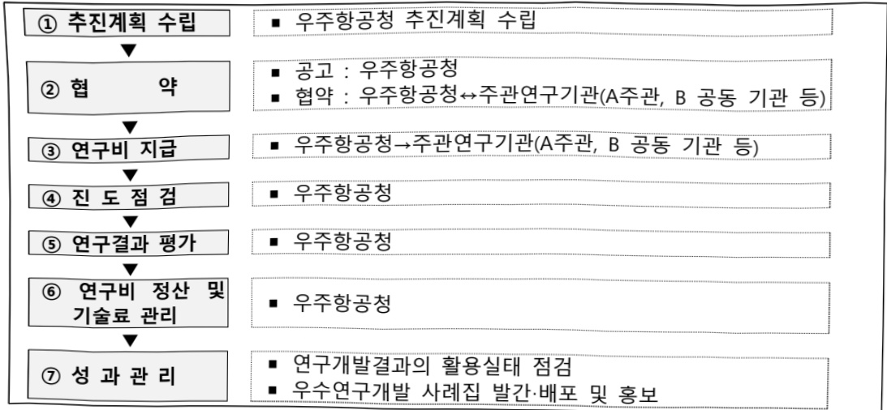

# 항공AI 안전성 확보를 위한 자율임무 신뢰성 보증기술 개발(R…

**해당 페이지**: PDF 4657 ~ 4666 쪽 해당

**부처**: 우주항공청
**분야**: 과학기술
**회계유형**: 일반회계
**2026 확정예산**: 3000.0 백만원
**전년대비 증감률**: None%
**AI 도메인**: 우주/위성

---

### 가.예산 총괄표

(단위: 백만원, %)

<table border=1 style='margin: auto; word-wrap: break-word;'><tr><td rowspan="2">사업명</td><td rowspan="2">2024년 결산</td><td colspan="2">2025년 예산</td><td colspan="2">2026년</td><td rowspan="2">중감(B-A)</td><td rowspan="2">(B-A)/A</td></tr><tr><td style='text-align: center; word-wrap: break-word;'>본예산(A)</td><td style='text-align: center; word-wrap: break-word;'>추경</td><td style='text-align: center; word-wrap: break-word;'>정부안</td><td style='text-align: center; word-wrap: break-word;'>확정(B)</td></tr><tr><td style='text-align: center; word-wrap: break-word;'>항공AI 안전성 확보를 위한 자율임무 신뢰성 보증기술 개발(R&amp;D)</td><td style='text-align: center; word-wrap: break-word;'>-</td><td style='text-align: center; word-wrap: break-word;'>-</td><td style='text-align: center; word-wrap: break-word;'>-</td><td style='text-align: center; word-wrap: break-word;'>3,000</td><td style='text-align: center; word-wrap: break-word;'>3,000</td><td style='text-align: center; word-wrap: break-word;'>3,000</td><td style='text-align: center; word-wrap: break-word;'>순증</td></tr></table>

## □ 기능별(내역사업별), 목별 예산 내역

(단위:백만원)

<table border=1 style='margin: auto; word-wrap: break-word;'><tr><td rowspan="3"></td><td colspan="5">2024</td><td colspan="7">2025(2025.12월말)</td><td rowspan="3">2026예산</td></tr><tr><td rowspan="2">예산액(추정)</td><td rowspan="2">예산현액</td><td rowspan="2">집행액[실질행액]</td><td rowspan="2">이월액</td><td rowspan="2">불용액</td><td rowspan="2">분예산</td><td rowspan="2">예산현액</td><td rowspan="2">집행액[실질행액]</td><td colspan="2">전년도이월액제외</td><td rowspan="2">이월예상액</td><td rowspan="2">불용예상액</td></tr><tr><td style='text-align: center; word-wrap: break-word;'>예산현액</td><td style='text-align: center; word-wrap: break-word;'>집행액[실질행액]</td></tr><tr><td style='text-align: center; word-wrap: break-word;'>○ 기능별 분류(합계)</td><td style='text-align: center; word-wrap: break-word;'>-</td><td style='text-align: center; word-wrap: break-word;'>-</td><td style='text-align: center; word-wrap: break-word;'>-</td><td style='text-align: center; word-wrap: break-word;'>-</td><td style='text-align: center; word-wrap: break-word;'>-</td><td style='text-align: center; word-wrap: break-word;'>-</td><td style='text-align: center; word-wrap: break-word;'>-</td><td style='text-align: center; word-wrap: break-word;'>-</td><td style='text-align: center; word-wrap: break-word;'>-</td><td style='text-align: center; word-wrap: break-word;'>-</td><td style='text-align: center; word-wrap: break-word;'>-</td><td style='text-align: center; word-wrap: break-word;'>-</td><td style='text-align: center; word-wrap: break-word;'>3,000</td></tr><tr><td style='text-align: center; word-wrap: break-word;'>· 항공AI 인전성확보를 위한 자율임무 신뢰성 보증기술 개발</td><td style='text-align: center; word-wrap: break-word;'>-</td><td style='text-align: center; word-wrap: break-word;'>-</td><td style='text-align: center; word-wrap: break-word;'>-</td><td style='text-align: center; word-wrap: break-word;'>-</td><td style='text-align: center; word-wrap: break-word;'>-</td><td style='text-align: center; word-wrap: break-word;'>-</td><td style='text-align: center; word-wrap: break-word;'>-</td><td style='text-align: center; word-wrap: break-word;'>-</td><td style='text-align: center; word-wrap: break-word;'>-</td><td style='text-align: center; word-wrap: break-word;'>-</td><td style='text-align: center; word-wrap: break-word;'>-</td><td style='text-align: center; word-wrap: break-word;'>-</td><td style='text-align: center; word-wrap: break-word;'>3,000</td></tr><tr><td style='text-align: center; word-wrap: break-word;'>○ 비목별 분류(합계)</td><td style='text-align: center; word-wrap: break-word;'>-</td><td style='text-align: center; word-wrap: break-word;'>-</td><td style='text-align: center; word-wrap: break-word;'>-</td><td style='text-align: center; word-wrap: break-word;'>-</td><td style='text-align: center; word-wrap: break-word;'>-</td><td style='text-align: center; word-wrap: break-word;'>-</td><td style='text-align: center; word-wrap: break-word;'>-</td><td style='text-align: center; word-wrap: break-word;'>-</td><td style='text-align: center; word-wrap: break-word;'>-</td><td style='text-align: center; word-wrap: break-word;'>-</td><td style='text-align: center; word-wrap: break-word;'>-</td><td style='text-align: center; word-wrap: break-word;'>-</td><td style='text-align: center; word-wrap: break-word;'>3,000</td></tr><tr><td style='text-align: center; word-wrap: break-word;'>· 연구개발활동비등(360-05)</td><td style='text-align: center; word-wrap: break-word;'>-</td><td style='text-align: center; word-wrap: break-word;'>-</td><td style='text-align: center; word-wrap: break-word;'>-</td><td style='text-align: center; word-wrap: break-word;'>-</td><td style='text-align: center; word-wrap: break-word;'>-</td><td style='text-align: center; word-wrap: break-word;'>-</td><td style='text-align: center; word-wrap: break-word;'>-</td><td style='text-align: center; word-wrap: break-word;'>-</td><td style='text-align: center; word-wrap: break-word;'>-</td><td style='text-align: center; word-wrap: break-word;'>-</td><td style='text-align: center; word-wrap: break-word;'>-</td><td style='text-align: center; word-wrap: break-word;'>-</td><td style='text-align: center; word-wrap: break-word;'>3,000</td></tr><tr><td style='text-align: center; word-wrap: break-word;'>○ 기능비목별 분류(합계)</td><td style='text-align: center; word-wrap: break-word;'>-</td><td style='text-align: center; word-wrap: break-word;'>-</td><td style='text-align: center; word-wrap: break-word;'>-</td><td style='text-align: center; word-wrap: break-word;'>-</td><td style='text-align: center; word-wrap: break-word;'>-</td><td style='text-align: center; word-wrap: break-word;'>-</td><td style='text-align: center; word-wrap: break-word;'>-</td><td style='text-align: center; word-wrap: break-word;'>-</td><td style='text-align: center; word-wrap: break-word;'>-</td><td style='text-align: center; word-wrap: break-word;'>-</td><td style='text-align: center; word-wrap: break-word;'>-</td><td style='text-align: center; word-wrap: break-word;'>-</td><td style='text-align: center; word-wrap: break-word;'>3,000</td></tr><tr><td style='text-align: center; word-wrap: break-word;'>· 항공AI 인전성확보를 위한 자율임무 신뢰성 보증기술 개발</td><td style='text-align: center; word-wrap: break-word;'>-</td><td style='text-align: center; word-wrap: break-word;'>-</td><td style='text-align: center; word-wrap: break-word;'>-</td><td style='text-align: center; word-wrap: break-word;'>-</td><td style='text-align: center; word-wrap: break-word;'>-</td><td style='text-align: center; word-wrap: break-word;'>-</td><td style='text-align: center; word-wrap: break-word;'>-</td><td style='text-align: center; word-wrap: break-word;'>-</td><td style='text-align: center; word-wrap: break-word;'>-</td><td style='text-align: center; word-wrap: break-word;'>-</td><td style='text-align: center; word-wrap: break-word;'>-</td><td style='text-align: center; word-wrap: break-word;'>-</td><td style='text-align: center; word-wrap: break-word;'>3,000</td></tr><tr><td style='text-align: center; word-wrap: break-word;'>· 연구개발활동비등(360-05)</td><td style='text-align: center; word-wrap: break-word;'>-</td><td style='text-align: center; word-wrap: break-word;'>-</td><td style='text-align: center; word-wrap: break-word;'>-</td><td style='text-align: center; word-wrap: break-word;'>-</td><td style='text-align: center; word-wrap: break-word;'>-</td><td style='text-align: center; word-wrap: break-word;'>-</td><td style='text-align: center; word-wrap: break-word;'>-</td><td style='text-align: center; word-wrap: break-word;'>-</td><td style='text-align: center; word-wrap: break-word;'>-</td><td style='text-align: center; word-wrap: break-word;'>-</td><td style='text-align: center; word-wrap: break-word;'>-</td><td style='text-align: center; word-wrap: break-word;'>-</td><td style='text-align: center; word-wrap: break-word;'>3,000</td></tr></table>

---

### 나. 사업설명자료

## 1 ) 사업목적·내용

- (항공AI 안전성 확보를 위한 자율임무 신뢰성 보증기술 개발) 인적 사고 방지 및 조종사 업무 경감을 위한 인간-AI 협업 자율임무 핵심 기술 및 항공기 적용 AI 안전성 증명을 위한 자율임무 보증 기술을 개발하고 비행실증을 통해 항공AI의 신뢰성을 확보

2) 사업개요

□ 사업근거 및 추진경위

① 법령상 근거 및 조항 적시

- 과학기술기본법 제11조(국가연구개발사업의 추진)

·제11조(국가연구개발사업의 추진)

① 중앙행정기관의 장은 기본계획에 따라 말은 분야의 국가연구개발사업과 그 시책을 세워 추진하여야 한다.

-항공우주산업개발촉진법 제4조(항공우주산업의 육성)

· 제4조(항공우주산업의 육성)

①정부는 항공우주산업의 육성을 위하여 다음 각호의 사업에 관한 시책을 추진하여야 한다.

1. 여객용항공기·화물용항공기 및 무인항공기의 개발에 관한 사업

4. 기기류 및 소재류의 기술개발에 관한 사업

③정부는 제1항의 규정에 의한 항공우주산업의 육성을 위한 사업을 실시하는 자에 대하여 그 사업에 소요되는 비용의 전부 또는 일부를 출연할 수 있다.

## ② 추진경위

- '25. 3월 : 대한민국 항공혁신 추진전략

· (전략 3-1) AI 기반 융복합 완전자율비행 기술 확보

- '25. 5월 : 신규사업 사전적격성 심의

· 정부 국정과제 “28. 세계를 선도할 넥스트(NEXT) 전략기술 육성

- '25. 7~11월 : 신규사업 상세기획 전문가 자문회의

□ 주요내용

① 사업규모

- 총사업비 : 해당 없음

- 사업기간 : '26~'29

- 최근 5년 간 투입된 사업비

<table border=1 style='margin: auto; word-wrap: break-word;'><tr><td style='text-align: center; word-wrap: break-word;'>연도</td><td style='text-align: center; word-wrap: break-word;'>2022</td><td style='text-align: center; word-wrap: break-word;'>2023</td><td style='text-align: center; word-wrap: break-word;'>2024</td><td style='text-align: center; word-wrap: break-word;'>2025</td><td style='text-align: center; word-wrap: break-word;'>2026</td></tr><tr><td style='text-align: center; word-wrap: break-word;'>사업비</td><td style='text-align: center; word-wrap: break-word;'>-</td><td style='text-align: center; word-wrap: break-word;'>-</td><td style='text-align: center; word-wrap: break-word;'>-</td><td style='text-align: center; word-wrap: break-word;'>-</td><td style='text-align: center; word-wrap: break-word;'>3,000</td></tr></table>

- 기타 : 해당 없음

---

## ② 사업추진체계

- 사업시행방법 : 출연(민간 매칭)

- 사업시행주체 : 우주항공청

- 사업 수혜자 : 기업, 대학, 연구소 등

- 보조, 융자, 출연, 출자 등의 경우 보조·융자 등 지원 비율 및 법적근거

<table border=1 style='margin: auto; word-wrap: break-word;'><tr><td style='text-align: center; word-wrap: break-word;'>내역사업명</td><td style='text-align: center; word-wrap: break-word;'>구분</td><td style='text-align: center; word-wrap: break-word;'>피보조·피출연 등 기관명</td><td style='text-align: center; word-wrap: break-word;'>지원 금액 (2026예산)</td><td style='text-align: center; word-wrap: break-word;'>지원 비율(%)</td><td style='text-align: center; word-wrap: break-word;'>보조율 법적근거 (해당 조항)</td></tr><tr><td style='text-align: center; word-wrap: break-word;'>항공AI 안전성 확보를 위한 자율임무 신뢰성 보증기술 개발</td><td style='text-align: center; word-wrap: break-word;'>출연</td><td style='text-align: center; word-wrap: break-word;'>출연(연), 대학, 기업 등</td><td style='text-align: center; word-wrap: break-word;'>3,000백만원</td><td style='text-align: center; word-wrap: break-word;'>총사업비의 100% 이내 (과제별 특성 및 기관 성격에 따라 차등 지원)</td><td style='text-align: center; word-wrap: break-word;'>항공우주산업개발촉진법 제4조</td></tr></table>

## 3 ) 2026년도 예산 산출 근거

① 항공AI 안전성 확보를 위한 자율임무 신뢰성 보증기술 개발 : (2025 본예산) - → (2026 예산) 3,000백만원

- 다양한 임무 환경에서 안전한 미래항공기 자율임무 보증 기술 개발 및 실증을 위한 2026년도 예산

- (산출) (25) - → (26) 1개 x 4,000백만원 x 9/12개월

- (지원 필요성) : 다양한 임무 환경에서 안전한 미래항공기 자율임무 실현을 위해 신뢰성 로드맵 개발, 인간-AI

협업 기능 검증 도구, 소형 유무인기 구조 변경 설계 등 기술개발 필요

2025년도 예산 및 2026년도 예산 산출 세부내역 비교

<table border=1 style='margin: auto; word-wrap: break-word;'><tr><td colspan="2">2025년 본예산</td><td colspan="2">2026년 예산</td></tr><tr><td style='text-align: center; word-wrap: break-word;'>예산</td><td style='text-align: center; word-wrap: break-word;'>산출내역</td><td style='text-align: center; word-wrap: break-word;'>예산</td><td style='text-align: center; word-wrap: break-word;'>산출내역</td></tr><tr><td style='text-align: center; word-wrap: break-word;'>-</td><td style='text-align: center; word-wrap: break-word;'>&lt;항공AI 안전성 확보를 위한 자율임무 신뢰성 보증기술 개발&gt;- &#x27;26년도 신규사업으로 해당 없음</td><td style='text-align: center; word-wrap: break-word;'>3,000백만원</td><td style='text-align: center; word-wrap: break-word;'>&lt;항공AI 안전성 확보를 위한 자율임무 신뢰성 보증기술 개발&gt;○ 연구개발연구활동비등(360-05): 3,000백만원가. (구성기술 1) 항공AI 신뢰성 보증 표준 및 방법론 개발• FAA/EASA의 AI 로드맵 및 안전기준, 타산업 AI 안전기준 분석• 항공AI 자율임무 시스템 신뢰성 보증 추진 로드맵 개발나. (구성기술 2) 고난도 자율임무를 위한 인간AI 협업 항공AI 핵심기술 개발• 인간-AI 협업 기능 검증 도구 개발• 자율임무 프로파일 검증도구 요구사항 분석/설계• 인간-AI 협업을 위한 안전요구사항 분석/설계• AI 기반 자율임무시스템 분석/설계다. (구성기술 3) 인간-AI 협업 기반 항공AI 자율임무 검증 및 실증• AI 항공전자 장비 시스템 장착을 위한 항공기 플랫폼 선정• 기체 개조 범위 확정 및 설계</td></tr></table>

---

## 4 ) 사업효과

☐ 사업영향, 산출물 성과지표 등

① 2022~2026년도 성과계획서 상 성과지표 및 최근 5년간 성과 달성도

<table border=1 style='margin: auto; word-wrap: break-word;'><tr><td style='text-align: center; word-wrap: break-word;'>성과지표</td><td style='text-align: center; word-wrap: break-word;'>구분</td><td style='text-align: center; word-wrap: break-word;'>2022</td><td style='text-align: center; word-wrap: break-word;'>2023</td><td style='text-align: center; word-wrap: break-word;'>2024</td><td style='text-align: center; word-wrap: break-word;'>2025</td><td style='text-align: center; word-wrap: break-word;'>2026</td><td style='text-align: center; word-wrap: break-word;'>2026 목표치산출근거</td><td style='text-align: center; word-wrap: break-word;'>측정산식(또는 측정방법)</td><td style='text-align: center; word-wrap: break-word;'>자료수집방법(또는 자료출처)</td></tr><tr><td rowspan="3">신뢰성 보증항공AI 가이드라인(단위: EASA 자율화 테벨)</td><td style='text-align: center; word-wrap: break-word;'>목표</td><td style='text-align: center; word-wrap: break-word;'>-</td><td style='text-align: center; word-wrap: break-word;'>-</td><td style='text-align: center; word-wrap: break-word;'>-</td><td style='text-align: center; word-wrap: break-word;'>-</td><td style='text-align: center; word-wrap: break-word;'>신규</td><td rowspan="3">EASA, 28년 테벨2 가이드라인 목표와 대등한 목표 수립</td><td rowspan="3">목표 대비 실적 달성도</td><td rowspan="3">외부 전문가 평가위원회</td></tr><tr><td style='text-align: center; word-wrap: break-word;'>실적</td><td style='text-align: center; word-wrap: break-word;'>-</td><td style='text-align: center; word-wrap: break-word;'>-</td><td style='text-align: center; word-wrap: break-word;'>-</td><td style='text-align: center; word-wrap: break-word;'>-</td><td style='text-align: center; word-wrap: break-word;'>신규</td></tr><tr><td style='text-align: center; word-wrap: break-word;'>달성도</td><td style='text-align: center; word-wrap: break-word;'>-</td><td style='text-align: center; word-wrap: break-word;'>-</td><td style='text-align: center; word-wrap: break-word;'>-</td><td style='text-align: center; word-wrap: break-word;'>-</td><td style='text-align: center; word-wrap: break-word;'>신규</td></tr><tr><td rowspan="3">인간-AI 협업 프레임워크(단위: EASA 자율화 테벨)</td><td style='text-align: center; word-wrap: break-word;'>목표</td><td style='text-align: center; word-wrap: break-word;'>-</td><td style='text-align: center; word-wrap: break-word;'>-</td><td style='text-align: center; word-wrap: break-word;'>-</td><td style='text-align: center; word-wrap: break-word;'>-</td><td style='text-align: center; word-wrap: break-word;'>신규</td><td rowspan="3">EASA, 35년 승인 시작에 대비한 29년 시범 적용 가능한 테벨2B 수준의 도전적 목표</td><td rowspan="3">목표 대비 실적 달성도</td><td rowspan="3">실험 데이터 최종연도 시험 성적서</td></tr><tr><td style='text-align: center; word-wrap: break-word;'>실적</td><td style='text-align: center; word-wrap: break-word;'>-</td><td style='text-align: center; word-wrap: break-word;'>-</td><td style='text-align: center; word-wrap: break-word;'>-</td><td style='text-align: center; word-wrap: break-word;'>-</td><td style='text-align: center; word-wrap: break-word;'>신규</td></tr><tr><td style='text-align: center; word-wrap: break-word;'>달성도</td><td style='text-align: center; word-wrap: break-word;'>-</td><td style='text-align: center; word-wrap: break-word;'>-</td><td style='text-align: center; word-wrap: break-word;'>-</td><td style='text-align: center; word-wrap: break-word;'>-</td><td style='text-align: center; word-wrap: break-word;'>신규</td></tr><tr><td rowspan="3">자율임무 실증 단계 진척도(단위: %)</td><td style='text-align: center; word-wrap: break-word;'>목표</td><td style='text-align: center; word-wrap: break-word;'>-</td><td style='text-align: center; word-wrap: break-word;'>-</td><td style='text-align: center; word-wrap: break-word;'>-</td><td style='text-align: center; word-wrap: break-word;'>-</td><td style='text-align: center; word-wrap: break-word;'>신규</td><td rowspan="3">신뢰성 보증 기준에 따른 참조시스템 개발 (&#x27;26) 기체개조 (&#x27;27년 이후) 단계별 인증 기준에 따라 참조 시스템 개발</td><td rowspan="3">개별 단계별 진행율에 대한 산술 평균 (∑단계별 인증진행율) / (총 단계수)</td><td rowspan="3">외부 전문가 평가위원회</td></tr><tr><td style='text-align: center; word-wrap: break-word;'>실적</td><td style='text-align: center; word-wrap: break-word;'>-</td><td style='text-align: center; word-wrap: break-word;'>-</td><td style='text-align: center; word-wrap: break-word;'>-</td><td style='text-align: center; word-wrap: break-word;'>-</td><td style='text-align: center; word-wrap: break-word;'>신규</td></tr><tr><td style='text-align: center; word-wrap: break-word;'>달성도</td><td style='text-align: center; word-wrap: break-word;'>-</td><td style='text-align: center; word-wrap: break-word;'>-</td><td style='text-align: center; word-wrap: break-word;'>-</td><td style='text-align: center; word-wrap: break-word;'>-</td><td style='text-align: center; word-wrap: break-word;'>신규</td></tr></table>

② 성과지표 이외의 연도별 사업추진 경과 및 실적 : 해당 없음

③ 향후(2026년도 이후) 기대효과

- 국제적으로 미 수립된 인공지능 분야 항공기 표준에 대비하여 정책적으로 빠르게

반영할 수 있는 기반 마련

- 항공AI 활용 시 항공기 비상상황에서 평균 상황인지속도 2.0초 수준으로 향상

5) 타당성조사 및 예비타당성조사 시행여부 및 결과 요지 : 해당 없음

6) 총사업비 대상사업 여부 및 내역 : 해당 없음

---

## 7 ) 사업 집행절차

## 8 ) 중기재정계획 상 연도별 투자계획 및 추진경과

(단위:백만원)

<table border=1 style='margin: auto; word-wrap: break-word;'><tr><td style='text-align: center; word-wrap: break-word;'>중기 재정계획</td><td style='text-align: center; word-wrap: break-word;'>2024</td><td style='text-align: center; word-wrap: break-word;'>2025</td><td style='text-align: center; word-wrap: break-word;'>2026</td><td style='text-align: center; word-wrap: break-word;'>2027</td><td style='text-align: center; word-wrap: break-word;'>2028</td><td style='text-align: center; word-wrap: break-word;'>2029</td></tr><tr><td style='text-align: center; word-wrap: break-word;'>2024~2028</td><td style='text-align: center; word-wrap: break-word;'>-</td><td style='text-align: center; word-wrap: break-word;'>-</td><td style='text-align: center; word-wrap: break-word;'>-</td><td style='text-align: center; word-wrap: break-word;'>-</td><td style='text-align: center; word-wrap: break-word;'>-</td><td style='text-align: center; word-wrap: break-word;'>☑</td></tr><tr><td style='text-align: center; word-wrap: break-word;'>2025~2029</td><td style='text-align: center; word-wrap: break-word;'>☑</td><td style='text-align: center; word-wrap: break-word;'>-</td><td style='text-align: center; word-wrap: break-word;'>6,300</td><td style='text-align: center; word-wrap: break-word;'>11,900</td><td style='text-align: center; word-wrap: break-word;'>11,900</td><td style='text-align: center; word-wrap: break-word;'>7,900</td></tr></table>

## 9 ) 최근 3년간 동 사업에 대한 주요 외부지적사항 및 평가, 문제점 및 대책 : 해당 없음

## 10 ) 향후 추진방향 및 추진계획

<table border=1 style='margin: auto; word-wrap: break-word;'><tr><td style='text-align: center; word-wrap: break-word;'>- 미래항공기의 자율비행을 위해 신뢰할 수 있는 AI 항전시스템 핵심기술 및 자율임무 보증 개발을 위한 항공AI 안전성 확보를 위한 자율임무 신뢰성 보증기술 개발 2차년도 과제 지원가. (구성기술 1) 항공AI 신뢰성 보증 표준 및 방법론 개발 · 항공시스템 인증기준과 AI 신뢰성 기준 연계 방안 수립 · AI 신뢰성/임무보증 프로세스 개발 나. (구성기술 2) 고난도 자율임무를 위한 인간-AI 협업 항공AI 핵심기술 개발 · 학습 데이터 편향성 분석 및 동적 추적성 지원 · 서버 및 온보드 LLM 통합 구축 · 인간-AI 협업 프레임워크 프로토타입 · AI 통제를 위한 항전장비 설계 다. (구성기술 3) 인간-AI 협업 기반 항공AI 자율임무 검증 및 실증 · 구조변경 상세설계 · AI 성능 검증을 위한 SIL/HIL 체계구성</td></tr></table>

---

11) 해당사업에 대한 각종 사업평가의 결과 : 해당 없음

12) 해당사업에 대한 부처 자체평가의 결과 : 해당 없음

13) 부처 건의사항 : 해당 없음

다. 최근 4년간 결산내역 : 해당 없음

라. 기타 추가자료

(1) 참고1

---

참고 1 신규사업 기획보고서 요약본

<table border=1 style='margin: auto; word-wrap: break-word;'><tr><td style='text-align: center; word-wrap: break-word;'>사업명</td><td colspan="5">항공AI 안전성 확보를 위한 자율임무 신뢰성 보증기술 개발</td></tr><tr><td style='text-align: center; word-wrap: break-word;'>총 사업비</td><td colspan="3">470억원 (국비: 380억원)</td><td style='text-align: center; word-wrap: break-word;'>사업기간</td><td style='text-align: center; word-wrap: break-word;'>26년~29년(총 4년)</td></tr><tr><td rowspan="2">수행주체</td><td colspan="5">우주항공청 / 항공혁신임무보증프로그램 / 최미진(055-856-5430, mjchoi74@kasa.go.kr)</td></tr><tr><td colspan="5">우주항공청 / 항공혁신임무보증프로그램 / 박종현(055-856-5437, jonghyun535@kasa.go.kr)</td></tr><tr><td colspan="6">[성과목표]
○인적 사고 및 조종사 업무 경감을 위해 인간-AI 협업 기반 자율임무 핵심기술을 개발하고 비행실증을 통해 자율임무 보증 기술을 개발하여 AI 신뢰성 확보</td></tr><tr><td colspan="6">[성과지표]</td></tr><tr><td rowspan="2">성과지표명</td><td colspan="4">목표치</td><td rowspan="2">측정방법</td></tr><tr><td style='text-align: center; word-wrap: break-word;'>&#x27;26</td><td style='text-align: center; word-wrap: break-word;'>&#x27;27</td><td style='text-align: center; word-wrap: break-word;'>&#x27;28</td><td style='text-align: center; word-wrap: break-word;'>&#x27;29</td></tr><tr><td style='text-align: center; word-wrap: break-word;'>개발 단계별 기준 진행율</td><td style='text-align: center; word-wrap: break-word;'>-</td><td style='text-align: center; word-wrap: break-word;'>40</td><td style='text-align: center; word-wrap: break-word;'>80</td><td style='text-align: center; word-wrap: break-word;'>100</td><td style='text-align: center; word-wrap: break-word;'>개발 단계별 진행율에 대한 산술 평균
(∑단계별 인증진행율) / (총 단계수)</td></tr><tr><td style='text-align: center; word-wrap: break-word;'>AI안전생명주기
단계 적용 비율 및 신뢰도</td><td style='text-align: center; word-wrap: break-word;'>-</td><td style='text-align: center; word-wrap: break-word;'>50</td><td style='text-align: center; word-wrap: break-word;'>70</td><td style='text-align: center; word-wrap: break-word;'>100</td><td style='text-align: center; word-wrap: break-word;'>(∑단계 적용 비율) X (신뢰도) /
(총 단계수)</td></tr><tr><td style='text-align: center; word-wrap: break-word;'>신뢰성 보증 항공AI 가이드라인
(EASA 자율화 레벨)</td><td style='text-align: center; word-wrap: break-word;'>레벨1</td><td style='text-align: center; word-wrap: break-word;'>레벨2A</td><td style='text-align: center; word-wrap: break-word;'>레벨2B</td><td style='text-align: center; word-wrap: break-word;'>레벨2B</td><td style='text-align: center; word-wrap: break-word;'>목표 대비 실적 달성도</td></tr><tr><td style='text-align: center; word-wrap: break-word;'>인간-AI 협업 프레임워크
(EASA 자율화 레벨)</td><td style='text-align: center; word-wrap: break-word;'>-</td><td style='text-align: center; word-wrap: break-word;'>레벨1</td><td style='text-align: center; word-wrap: break-word;'>레벨2A</td><td style='text-align: center; word-wrap: break-word;'>레벨2B</td><td style='text-align: center; word-wrap: break-word;'>목표 대비 실적 달성도</td></tr><tr><td style='text-align: center; word-wrap: break-word;'>자율임무 실증
단계 진척도</td><td style='text-align: center; word-wrap: break-word;'>(개조)</td><td style='text-align: center; word-wrap: break-word;'>20</td><td style='text-align: center; word-wrap: break-word;'>50</td><td style='text-align: center; word-wrap: break-word;'>100</td><td style='text-align: center; word-wrap: break-word;'>개발 단계별 진행율에 대한 산술 평균
(∑단계별 진행율) / (총 단계수)</td></tr><tr><td colspan="6">[정책적 연계성]
○(상위계획과의 부합성) 등 사업은 관계법령 및 주요정책에 반영되어 있음
- 관계 법령
* 항공우주산업개발 촉진법 제4조(항공우주산업의 육성)
* 도심항공교통 활용 촉진 및 지원에 관한 법률 제23조(도심항공교통산업 육성을 위한 지원시책)
- 주요 정책
* 제3차 항공산업발전 기본계획(&#x27;21~30&#x27;)
* 정부 국정과제
- 미래항공기(AAV) 개발로 새로운 하늘길을 개척
* 우주항공청 전략서 (&#x27;25.05)
- (전략 3-1) AI 기반 융복합 완전자율비행 기술 확보
- (전략 3-3) 다수·이종 유무인 복합체계 실현</td></tr><tr><td colspan="6">[중점투자 분야 및 기술]
○ 항공AI 신뢰성 보증 표준 및 방법론 개발
- 국내외 항공당국 및 국제표준단체와 협력을 통한 항공용 AI 시스템의 안전·신뢰성
보증을 위한 정책 및 요건 분석
- 항공용 AI 시스템의 안전·신뢰성 보증을 위한 정책, 로드맵 및 위험수준별 세부
요건 개발</td></tr></table>

---

<table border=1 style='margin: auto; word-wrap: break-word;'><tr><td style='text-align: center; word-wrap: break-word;'>- 항공용 AI 시스템의 안전·신뢰성 보증을 위한 정책, 로늄범 및 취임수준&quot;을 세우고 요건 개발- 항공용 AI 시스템 신뢰성 및 임무 보증 표준 프로세스 개발- 항공AI 시스템 임무보증 실증 수행- 항공 AI 자율임무 시스템 신뢰성 보증 및 평가 가이드라인 개발- 고난도 자율임무를 위한 인간·AI 협업 항공AI 핵심기술 개발- AI 학습데이터 품질 평가 및 표준 규격 개발- 인간·AI 협업 임무 보증/검증 지원 도구- 자율임무 프로파일 검증 지원 도구- 인간·AI 협업 기반 항공AI 자율임무 검증 및 실증- 항공AI 자율임무 시스템 참조기체 확보 및 기체 개조- 항공AI 적용 비상착륙 임무프로파일 실증</td></tr><tr><td style='text-align: center; word-wrap: break-word;'>[사업 추진체계 및 추진방식]○ 추진체계- 일반과제로 구성하여, 산·학·연 공동연구 수행- 민간 기업 참여로 국가시책 동참- 적극적인 기술이전 및 지적재산권 확보로 국제경쟁력 강화</td></tr></table>

ㅇ 추진주체 간 역할분담 : 부처-총괄주관기관

<table border=1 style='margin: auto; word-wrap: break-word;'><tr><td style='text-align: center; word-wrap: break-word;'>수행주체</td><td colspan="5">역할 세부내용</td></tr><tr><td style='text-align: center; word-wrap: break-word;'>우주항공청</td><td colspan="5">ㅇ 사업추진 관련 주요 의사결정 및 사업종합조정 등 ㅇ 사업 및 과제 관리 및 평가</td></tr><tr><td style='text-align: center; word-wrap: break-word;'>총괄주관기관</td><td colspan="5">ㅇ 실제 연구 수행을 총괄 주관하는 기관으로서, 해당 세부과제 수행 뿐 아니라 타 세부과제 간 협업 주도 및 전반적인 추진상황 점검</td></tr><tr><td colspan="6">ㅇ 추진방식 - 과제 선정은 일반적인 절차(경쟁)에 따라 우주항공청에서 수행</td></tr><tr><td colspan="6">[연도별 사업 추진계획] (단위: 억원)</td></tr><tr><td style='text-align: center; word-wrap: break-word;'>내역사업명</td><td style='text-align: center; word-wrap: break-word;'>구분</td><td style='text-align: center; word-wrap: break-word;'>&#x27;26</td><td style='text-align: center; word-wrap: break-word;'>&#x27;27</td><td style='text-align: center; word-wrap: break-word;'>&#x27;28</td><td style='text-align: center; word-wrap: break-word;'>&#x27;29</td></tr><tr><td rowspan="3">항공AI 안전성 확보를 위한 자율임무 신뢰성 보증기술 개발</td><td style='text-align: center; word-wrap: break-word;'>국비</td><td style='text-align: center; word-wrap: break-word;'>30</td><td style='text-align: center; word-wrap: break-word;'>140</td><td style='text-align: center; word-wrap: break-word;'>130</td><td style='text-align: center; word-wrap: break-word;'>80</td></tr><tr><td style='text-align: center; word-wrap: break-word;'>지방비</td><td style='text-align: center; word-wrap: break-word;'>-</td><td style='text-align: center; word-wrap: break-word;'>-</td><td style='text-align: center; word-wrap: break-word;'>-</td><td style='text-align: center; word-wrap: break-word;'>-</td></tr><tr><td style='text-align: center; word-wrap: break-word;'>민자</td><td style='text-align: center; word-wrap: break-word;'>-</td><td style='text-align: center; word-wrap: break-word;'>30</td><td style='text-align: center; word-wrap: break-word;'>40</td><td style='text-align: center; word-wrap: break-word;'>20</td></tr><tr><td rowspan="4">합계</td><td style='text-align: center; word-wrap: break-word;'>국비</td><td style='text-align: center; word-wrap: break-word;'>30</td><td style='text-align: center; word-wrap: break-word;'>140</td><td style='text-align: center; word-wrap: break-word;'>130</td><td style='text-align: center; word-wrap: break-word;'>80</td></tr><tr><td style='text-align: center; word-wrap: break-word;'>지방비</td><td style='text-align: center; word-wrap: break-word;'>-</td><td style='text-align: center; word-wrap: break-word;'>-</td><td style='text-align: center; word-wrap: break-word;'>-</td><td style='text-align: center; word-wrap: break-word;'>-</td></tr><tr><td style='text-align: center; word-wrap: break-word;'>민자</td><td style='text-align: center; word-wrap: break-word;'>-</td><td style='text-align: center; word-wrap: break-word;'>30</td><td style='text-align: center; word-wrap: break-word;'>40</td><td style='text-align: center; word-wrap: break-word;'>20</td></tr><tr><td style='text-align: center; word-wrap: break-word;'>계</td><td style='text-align: center; word-wrap: break-word;'>30</td><td style='text-align: center; word-wrap: break-word;'>170</td><td style='text-align: center; word-wrap: break-word;'>170</td><td style='text-align: center; word-wrap: break-word;'>100</td></tr><tr><td colspan="6">[재원조달 방안] ㅇ 우주항공청 예산 확보 추진 - 본 신규사업은 총 470.0억원(정부 380억, 기업 90.0억)이 소요되며, 정부와 민간의 재원 투자비율은 정부 75%, 민간 25%로 중견·중소기업 참여율을 높여 정부출연금에 대해 민간기업 매칭펀드를 조성하여 연구비 재원을 확보할 예정</td></tr></table>

---

<table border=1 style='margin: auto; word-wrap: break-word;'><tr><td style='text-align: center; word-wrap: break-word;'>사업명</td><td style='text-align: center; word-wrap: break-word;'>사업기간</td><td style='text-align: center; word-wrap: break-word;'>사업목표</td><td style='text-align: center; word-wrap: break-word;'>차별성</td></tr><tr><td style='text-align: center; word-wrap: break-word;'>DNA+드론기술개발(우주청)</td><td style='text-align: center; word-wrap: break-word;'>&#x27;20년~&#x27;24년</td><td style='text-align: center; word-wrap: break-word;'>D(데이터), N(네트워크), A(인공지능) 융합 개방형 드론 서비스 플랫폼 개발 및 신BM 창출을 통한 검증</td><td style='text-align: center; word-wrap: break-word;'>균집 무인이동체와 5G 특화망 기반 실시간 수색 탐지에 비해 본사업은 AI 기반 자율적인 비행 및임무수행 위주 기술 개발</td></tr><tr><td style='text-align: center; word-wrap: break-word;'>eVTOL 자율비행핵심기술 및 비행안정성 운용성 시험평가 기술개발(우주청)</td><td style='text-align: center; word-wrap: break-word;'>&#x27;21년~&#x27;24년</td><td style='text-align: center; word-wrap: break-word;'>차세대 신개념 도심용 3차원운송 시장 조기 정착을 위한 고안정성 확보 및 도심내 운용을 위한 고신회도 자율비행기술개발</td><td style='text-align: center; word-wrap: break-word;'>자율비행 기술개발의 주제가 유사하나 대상기체가 다르고 AI 활용 유무 부품 성능 및 기술 구현도 자율비행 레벨에서 차이 존재</td></tr><tr><td style='text-align: center; word-wrap: break-word;'>디지털트윈을 활용한 AI 파일릿개발 및 무인기 탑재 실증(방사정)</td><td style='text-align: center; word-wrap: break-word;'>&#x27;24년~&#x27;28년</td><td style='text-align: center; word-wrap: break-word;'>유인 무기체계 기반에서 지능형 무인화로의 천화을 위해 무인 항공기에 탑재 가능한 AI 파일릿 기술을 개발하고 실증하는 것을 목표</td><td style='text-align: center; word-wrap: break-word;'>전장의 가상 디지털트윈 환경 구축과 유무인 무기체계 운용을 위한 임무 위주 AI 파일릿 기술 개발에 비해 본 사업은 AI 기반 고신회 자율 비행 제어 위주 핵심 기술을 개발</td></tr><tr><td colspan="4">o(연계방안) - 국내에서 개발된 소형 유무인항공기를 활용하여 AI 신뢰성 보증기술 개발</td></tr><tr><td colspan="4">[성과 활용방안]  o 연구개발 이후 적용될 UAM 기체 SVO(Simplified Vehicle Operation)* 기술 활용 * 항공기에서 비행 조작을 단순화하여 조종사의 부담을 줄이고, 효율성을 높이기 위한 시스템을 지칭  o 국내 개발 자체 항공기용 AI 플랫폼 확보 후 신규 수출 수요 창출  o 산불/해상/재해 탐지를 위한 고비용/고위험/장시간 소요의 민간 영역의 임무 대체 가능  o 국가차원의 R&amp;D 기술개발을 통해 국내 항공 산업 발전의 성장 발판을 마련하고, 국내 항전 장치 및 부품산업 활성화를 통해 즉각적인 시장 대응이 가능함으로써 미래 (新)산업 진입을 위한 생태계를 조성</td></tr><tr><td colspan="4">[파급효과]  o 정책적 기대효과  - 인공지능을 항공기 자율임무에 적용하기 위한 정책적 기반 마련  - 국제적으로 미 수립된 인공지능 분야 항공기 인증기준을 미리 대비하고 빠르게 정책적으로 반영할 수 있는 방안 마련  o 과학기술적 기대효과  - 항공기의 비상상황에서의 신속하고 정확한 의사결정에 도움을 주어 조종사가 자체 판단을 내리기 전 중요한 상황을 미리 예측 및 지원 가능  - 최적화된 비상착륙 경로 및 지점을 선택하여 안전한 장소를 추천할 수 있음  o 사회적 기대효과  - 승객 안전성을 향상 시켜 사고 감소 및 생명보호, 빠르고 정확한 대응가능  - 사회적 신뢰와 기술 수용성 향상을 통해 항공사 및 정부 신뢰성강화 및 타산업분야에도 신뢰 증가  - 항공산업 발전 및 경쟁력 강화를 통해 산업 혁신 촉진 및 글로벌 경쟁우위 확보 가능</td></tr></table>

---

<table border=1 style='margin: auto; word-wrap: break-word;'><tr><td style='text-align: center; word-wrap: break-word;'>사 업 명</td></tr><tr><td style='text-align: center; word-wrap: break-word;'>국가인재개발 지능형 오픈 플랫폼 운영(정보화) (1732-301)</td></tr></table>

## □ 사업 코드 정보

<table border=1 style='margin: auto; word-wrap: break-word;'><tr><td style='text-align: center; word-wrap: break-word;'>구분</td><td style='text-align: center; word-wrap: break-word;'>회계</td><td style='text-align: center; word-wrap: break-word;'>소관</td><td style='text-align: center; word-wrap: break-word;'>실국(기관)</td><td style='text-align: center; word-wrap: break-word;'>계정</td><td style='text-align: center; word-wrap: break-word;'>분야</td><td style='text-align: center; word-wrap: break-word;'>부문</td></tr><tr><td style='text-align: center; word-wrap: break-word;'>코드</td><td rowspan="2">일반회계</td><td rowspan="2">인사혁신처</td><td rowspan="2">인사관리국</td><td rowspan="2"></td><td style='text-align: center; word-wrap: break-word;'>010</td><td style='text-align: center; word-wrap: break-word;'>015</td></tr><tr><td style='text-align: center; word-wrap: break-word;'>명칭</td><td style='text-align: center; word-wrap: break-word;'>일반·지방행정</td><td style='text-align: center; word-wrap: break-word;'>정부자원관리</td></tr></table>

<table border=1 style='margin: auto; word-wrap: break-word;'><tr><td style='text-align: center; word-wrap: break-word;'>구분</td><td style='text-align: center; word-wrap: break-word;'>프로그램</td><td style='text-align: center; word-wrap: break-word;'>단위사업</td><td style='text-align: center; word-wrap: break-word;'>세부사업</td></tr><tr><td style='text-align: center; word-wrap: break-word;'>코드</td><td style='text-align: center; word-wrap: break-word;'>1700</td><td style='text-align: center; word-wrap: break-word;'>1732</td><td style='text-align: center; word-wrap: break-word;'>301</td></tr><tr><td style='text-align: center; word-wrap: break-word;'>명칭</td><td style='text-align: center; word-wrap: break-word;'>인재개발</td><td style='text-align: center; word-wrap: break-word;'>공무원인재개발</td><td style='text-align: center; word-wrap: break-word;'>국가 인재개발 지능형 오픈 플랫폼 운영(정보화)</td></tr></table>

☐ 사업 성격

<table border=1 style='margin: auto; word-wrap: break-word;'><tr><td rowspan="2">신규</td><td rowspan="2">계속</td><td rowspan="2">완료</td><td rowspan="2">예비타당성 실시여부</td><td rowspan="2">총사업비 관리대상</td><td rowspan="2">총액계상 예산사업</td><td style='text-align: center; word-wrap: break-word;'>사업소관 변경정보</td></tr><tr><td style='text-align: center; word-wrap: break-word;'>2025예산 시 소관</td></tr><tr><td style='text-align: center; word-wrap: break-word;'></td><td style='text-align: center; word-wrap: break-word;'>○</td><td style='text-align: center; word-wrap: break-word;'></td><td style='text-align: center; word-wrap: break-word;'></td><td style='text-align: center; word-wrap: break-word;'></td><td style='text-align: center; word-wrap: break-word;'></td><td style='text-align: center; word-wrap: break-word;'></td></tr></table>

□ 사업 지원 형태 및 지원율

<table border=1 style='margin: auto; word-wrap: break-word;'><tr><td style='text-align: center; word-wrap: break-word;'>직접</td><td style='text-align: center; word-wrap: break-word;'>출자</td><td style='text-align: center; word-wrap: break-word;'>출연</td><td style='text-align: center; word-wrap: break-word;'>보조</td><td style='text-align: center; word-wrap: break-word;'>융자</td><td style='text-align: center; word-wrap: break-word;'>국고보조율(%)</td><td style='text-align: center; word-wrap: break-word;'>융자율(%)</td></tr><tr><td style='text-align: center; word-wrap: break-word;'>○</td><td style='text-align: center; word-wrap: break-word;'></td><td style='text-align: center; word-wrap: break-word;'></td><td style='text-align: center; word-wrap: break-word;'></td><td style='text-align: center; word-wrap: break-word;'></td><td style='text-align: center; word-wrap: break-word;'></td><td style='text-align: center; word-wrap: break-word;'></td></tr></table>

## □ 사업 담당자

<table border=1 style='margin: auto; word-wrap: break-word;'><tr><td style='text-align: center; word-wrap: break-word;'>사업명</td><td colspan="2">구분</td></tr><tr><td rowspan="2">국가 인재개발 지능형 오픈 플랫폼 운영 (정보화)</td><td style='text-align: center; word-wrap: break-word;'>소관부처</td><td style='text-align: center; word-wrap: break-word;'>인사관리국 인재개발과</td></tr><tr><td style='text-align: center; word-wrap: break-word;'>사업시행주체</td><td style='text-align: center; word-wrap: break-word;'>인사혁신처</td></tr></table>

---

### 원본 PDF 크롭 이미지

