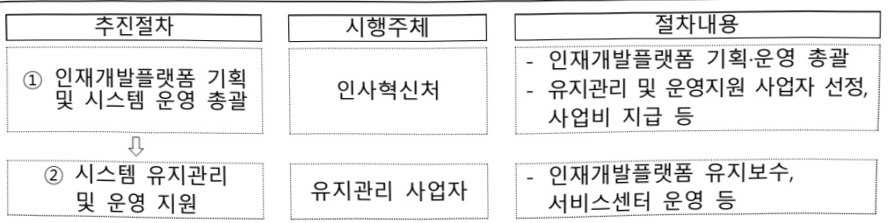

# 국가인재개발 지능형 오픈 플랫폼 운영(정보화)

**해당 페이지**: PDF 4667 ~ 4671 쪽 해당

**부처**: 인사혁신처
**분야**: 일반·지방행정
**회계유형**: 일반회계
**2026 확정예산**: -70.0 백만원
**전년대비 증감률**: None%
**AI 도메인**: 데이터

---

<table border=1 style='margin: auto; word-wrap: break-word;'><tr><td style='text-align: center; word-wrap: break-word;'>사 업 명</td></tr><tr><td style='text-align: center; word-wrap: break-word;'>국가인재개발 지능형 오픈 플랫폼 운영(정보화) (1732-301)</td></tr></table>

## □ 사업 코드 정보

<table border=1 style='margin: auto; word-wrap: break-word;'><tr><td style='text-align: center; word-wrap: break-word;'>구분</td><td style='text-align: center; word-wrap: break-word;'>회계</td><td style='text-align: center; word-wrap: break-word;'>소관</td><td style='text-align: center; word-wrap: break-word;'>실국(기관)</td><td style='text-align: center; word-wrap: break-word;'>계정</td><td style='text-align: center; word-wrap: break-word;'>분야</td><td style='text-align: center; word-wrap: break-word;'>부문</td></tr><tr><td style='text-align: center; word-wrap: break-word;'>코드</td><td rowspan="2">일반회계</td><td rowspan="2">인사혁신처</td><td rowspan="2">인사관리국</td><td rowspan="2"></td><td style='text-align: center; word-wrap: break-word;'>010</td><td style='text-align: center; word-wrap: break-word;'>015</td></tr><tr><td style='text-align: center; word-wrap: break-word;'>명칭</td><td style='text-align: center; word-wrap: break-word;'>일반·지방행정</td><td style='text-align: center; word-wrap: break-word;'>정부자원관리</td></tr></table>

<table border=1 style='margin: auto; word-wrap: break-word;'><tr><td style='text-align: center; word-wrap: break-word;'>구분</td><td style='text-align: center; word-wrap: break-word;'>프로그램</td><td style='text-align: center; word-wrap: break-word;'>단위사업</td><td style='text-align: center; word-wrap: break-word;'>세부사업</td></tr><tr><td style='text-align: center; word-wrap: break-word;'>코드</td><td style='text-align: center; word-wrap: break-word;'>1700</td><td style='text-align: center; word-wrap: break-word;'>1732</td><td style='text-align: center; word-wrap: break-word;'>301</td></tr><tr><td style='text-align: center; word-wrap: break-word;'>명칭</td><td style='text-align: center; word-wrap: break-word;'>인재개발</td><td style='text-align: center; word-wrap: break-word;'>공무원인재개발</td><td style='text-align: center; word-wrap: break-word;'>국가 인재개발 지능형 오픈 플랫폼 운영(정보화)</td></tr></table>

☐ 사업 성격

<table border=1 style='margin: auto; word-wrap: break-word;'><tr><td rowspan="2">신규</td><td rowspan="2">계속</td><td rowspan="2">완료</td><td rowspan="2">예비타당성 실시여부</td><td rowspan="2">총사업비 관리대상</td><td rowspan="2">총액계상 예산사업</td><td style='text-align: center; word-wrap: break-word;'>사업소관 변경정보</td></tr><tr><td style='text-align: center; word-wrap: break-word;'>2025예산 시 소관</td></tr><tr><td style='text-align: center; word-wrap: break-word;'></td><td style='text-align: center; word-wrap: break-word;'>○</td><td style='text-align: center; word-wrap: break-word;'></td><td style='text-align: center; word-wrap: break-word;'></td><td style='text-align: center; word-wrap: break-word;'></td><td style='text-align: center; word-wrap: break-word;'></td><td style='text-align: center; word-wrap: break-word;'></td></tr></table>

□ 사업 지원 형태 및 지원율

<table border=1 style='margin: auto; word-wrap: break-word;'><tr><td style='text-align: center; word-wrap: break-word;'>직접</td><td style='text-align: center; word-wrap: break-word;'>출자</td><td style='text-align: center; word-wrap: break-word;'>출연</td><td style='text-align: center; word-wrap: break-word;'>보조</td><td style='text-align: center; word-wrap: break-word;'>융자</td><td style='text-align: center; word-wrap: break-word;'>국고보조율(%)</td><td style='text-align: center; word-wrap: break-word;'>융자율(%)</td></tr><tr><td style='text-align: center; word-wrap: break-word;'>○</td><td style='text-align: center; word-wrap: break-word;'></td><td style='text-align: center; word-wrap: break-word;'></td><td style='text-align: center; word-wrap: break-word;'></td><td style='text-align: center; word-wrap: break-word;'></td><td style='text-align: center; word-wrap: break-word;'></td><td style='text-align: center; word-wrap: break-word;'></td></tr></table>

## □ 사업 담당자

<table border=1 style='margin: auto; word-wrap: break-word;'><tr><td style='text-align: center; word-wrap: break-word;'>사업명</td><td colspan="2">구분</td></tr><tr><td rowspan="2">국가 인재개발 지능형 오픈 플랫폼 운영 (정보화)</td><td style='text-align: center; word-wrap: break-word;'>소관부처</td><td style='text-align: center; word-wrap: break-word;'>인사관리국 인재개발과</td></tr><tr><td style='text-align: center; word-wrap: break-word;'>사업시행주체</td><td style='text-align: center; word-wrap: break-word;'>인사혁신처</td></tr></table>

---

### 가. 예산 총괄표

(단위: 백만원, %)

<table border=1 style='margin: auto; word-wrap: break-word;'><tr><td style='text-align: center; word-wrap: break-word;'>사업명</td><td style='text-align: center; word-wrap: break-word;'>2024년 결산</td><td style='text-align: center; word-wrap: break-word;'>2025년 예산 본예산(A)</td><td colspan="2">2026년</td><td style='text-align: center; word-wrap: break-word;'>증감 (B-A)</td><td style='text-align: center; word-wrap: break-word;'>(B-A)/A</td></tr><tr><td style='text-align: center; word-wrap: break-word;'>국가 인재개발 지능형 오픈 플랫폼 운영(정보화)</td><td style='text-align: center; word-wrap: break-word;'>1,890</td><td style='text-align: center; word-wrap: break-word;'>1,988</td><td style='text-align: center; word-wrap: break-word;'>1,988</td><td style='text-align: center; word-wrap: break-word;'>1,918</td><td style='text-align: center; word-wrap: break-word;'>△70</td><td style='text-align: center; word-wrap: break-word;'>△3.5</td></tr></table>

□ 기능별(내역사업별) 예산 내역

(단위:백만원)

<table border=1 style='margin: auto; word-wrap: break-word;'><tr><td rowspan="2"></td><td colspan="5">2024</td><td colspan="7">2025(25.11월말)</td><td rowspan="2">2026예산</td></tr><tr><td style='text-align: center; word-wrap: break-word;'>예산의(추경)</td><td style='text-align: center; word-wrap: break-word;'>예산현액</td><td style='text-align: center; word-wrap: break-word;'>집행의[실집행액]</td><td style='text-align: center; word-wrap: break-word;'>이윌액</td><td style='text-align: center; word-wrap: break-word;'>불용액</td><td style='text-align: center; word-wrap: break-word;'>본예산</td><td style='text-align: center; word-wrap: break-word;'>예산현액</td><td style='text-align: center; word-wrap: break-word;'>집행의[실집행액]</td><td colspan="2">제의</td><td style='text-align: center; word-wrap: break-word;'>이윌액예상액</td><td style='text-align: center; word-wrap: break-word;'>불용예상액</td></tr><tr><td style='text-align: center; word-wrap: break-word;'>○ 기능별 분류(합계)</td><td style='text-align: center; word-wrap: break-word;'>1,988</td><td style='text-align: center; word-wrap: break-word;'>1,988</td><td style='text-align: center; word-wrap: break-word;'>1,890</td><td style='text-align: center; word-wrap: break-word;'>-</td><td style='text-align: center; word-wrap: break-word;'>98</td><td style='text-align: center; word-wrap: break-word;'>1,988</td><td style='text-align: center; word-wrap: break-word;'>1,988</td><td style='text-align: center; word-wrap: break-word;'>1,633</td><td style='text-align: center; word-wrap: break-word;'>1,988</td><td style='text-align: center; word-wrap: break-word;'>1,633</td><td style='text-align: center; word-wrap: break-word;'>-</td><td style='text-align: center; word-wrap: break-word;'>-</td><td style='text-align: center; word-wrap: break-word;'>1,918</td></tr><tr><td style='text-align: center; word-wrap: break-word;'>• 국가인재개발 지능형오픈 플랫폼 운영</td><td style='text-align: center; word-wrap: break-word;'>1,988</td><td style='text-align: center; word-wrap: break-word;'>1,988</td><td style='text-align: center; word-wrap: break-word;'>1,890</td><td style='text-align: center; word-wrap: break-word;'>-</td><td style='text-align: center; word-wrap: break-word;'>98</td><td style='text-align: center; word-wrap: break-word;'>1,988</td><td style='text-align: center; word-wrap: break-word;'>1,988</td><td style='text-align: center; word-wrap: break-word;'>1,633</td><td style='text-align: center; word-wrap: break-word;'>1,988</td><td style='text-align: center; word-wrap: break-word;'>1,633</td><td style='text-align: center; word-wrap: break-word;'>-</td><td style='text-align: center; word-wrap: break-word;'>-</td><td style='text-align: center; word-wrap: break-word;'>1,918</td></tr></table>

### 나. 사업설명자료

## 1 ) 사업목적·내용

- 정부·민간의 다양한 학습 콘텐츠를 한곳에 모아 제공하고, AI·빅데이터 기반 개인별 맞춤형 학습을 추천하여 공무원의 역량 개발을 지원하는 정보시스템 운영

① 정부·민간의 다양한 학습 콘텐츠를 한 곳에 모아 제공

② AI·빅데이터 기술을 적용하여 개인 맞춤형 학습 콘텐츠 추천

③ 보안성, 교육 특화 기능을 갖춘 비대면 실시간 화상 교육 시스템 운영

## 2 ) 사업개요

## □ 사업근거 및 추진경위

① 법령상 근거 및 조항 적시

-「공무원 인재개발법」제2조(중앙인재개발 관장기관)

제2조(중앙인재개발 관장기관) 국가공무원의 인재개발에 관한 기본정책 및 일반지침의 수립과 그 운영에 필요한 사무는 인사혁신처장이 관장한다.

-「공무원 인재개발법」시행령 제14조의4(지능형인재개발플랫폼의 운영)

---

제14조의4(지능형인재개발플랫폼의 운영) ① 인사혁신처장은 인공지능 등의 기술을 통해 공무원의 이러닝과 자기개발 학습을 지원하고 공무원의 학습이력 등의 데이터를 수집·저장·가공·분석·활용하는 데이터 기반의 인재개발을 활성화하기 위하여 지능형인재개발플랫폼을 구축하여 운영할 수 있다. (이하 생략)

## ② 추진경위

- 과기정통부 주관「국가디지털전환사업」선정('19.12.)

-「국가 인재개발 지능형 오픈 플랫폼 구축(1단계)」 사업 추진('20.6. ~ 12.)

- 「국가 인재개발 지능형 오픈 플랫폼 구축(2단계)」 사업 추진('21.5. ~ 12.)

-「국가 인재개발 지능형 오픈 플랫폼 구축(3단계)」 사업 추진('22.5. ~ 12.)

- 「국가 인재개발 지능형 오픈 플랫폼 구축 정식 서비스 개시('23.1.)

## □ 주요내용

① 사업규모

- 총사업비 : 해당없음

- 사업기간 : '21년~

- 최근 5년 간 투입된 사업비

<table border=1 style='margin: auto; word-wrap: break-word;'><tr><td style='text-align: center; word-wrap: break-word;'>연도</td><td style='text-align: center; word-wrap: break-word;'>2022</td><td style='text-align: center; word-wrap: break-word;'>2023</td><td style='text-align: center; word-wrap: break-word;'>2024</td><td style='text-align: center; word-wrap: break-word;'>2025</td><td style='text-align: center; word-wrap: break-word;'>2026</td></tr><tr><td style='text-align: center; word-wrap: break-word;'>사업비</td><td style='text-align: center; word-wrap: break-word;'>5,059</td><td style='text-align: center; word-wrap: break-word;'>1,520</td><td style='text-align: center; word-wrap: break-word;'>1,988</td><td style='text-align: center; word-wrap: break-word;'>1,988</td><td style='text-align: center; word-wrap: break-word;'>1,918</td></tr></table>

② 사업추진체계

- 사업시행방법 : 직접수행

- 사업시행주체 : 인사혁신처

- 사업 수혜자 : 중앙부처 국가공무원, 민간 콘텐츠 사업자 및 전문가 등

- 보조, 융자, 출연, 출자 등의 경우 보조·융자 등 지원 비율 및 법적근거 : 해당없음

## 3 ) '26년도 예산 산출 근거

① 국가 인재개발 지능형 오픈 플랫폼 운영

:(25)1,988백만원→(26)1,918백만원(△70백만원)

- (요구) 화상교육 민간 클라우드 사용료 절감(△70백)

- (산출) 간담회 등 플랫폼 운영비 20백만원, 플랫폼 운영 공공요금 196백만원, 시스템 유지관리 1,182백만원, 시스템 운영지원 520백만원

## 4 ) 사업효과

☐ 사업영향, 산출물 성과지표 등

① '22~'26년도 성과계획서 상 성과지표 및 최근 5년간 성과 달성도 : 해당없음

---

② 성과지표 이외의 연도별 사업추진 경과 및 실적

<table border=1 style='margin: auto; word-wrap: break-word;'><tr><td style='text-align: center; word-wrap: break-word;'>2022</td><td style='text-align: center; word-wrap: break-word;'>- 인재개발플랫폼 3단계 개발사업(&#x27;22.5.~12.) 추진을 통한 플랫폼 서비스 완성 - 플랫폼 시범운영 실시(&#x27;22.12월 기준 51개 부처)</td></tr><tr><td style='text-align: center; word-wrap: break-word;'>2023</td><td style='text-align: center; word-wrap: break-word;'>- 플랫폼 정규 서비스 개시(&#x27;23.1.~&#x27;)</td></tr><tr><td style='text-align: center; word-wrap: break-word;'>2024</td><td style='text-align: center; word-wrap: break-word;'>- 플랫폼 활용 저변 확대를 위한 대국민 학습 서비스(열린강좌) 개시</td></tr><tr><td style='text-align: center; word-wrap: break-word;'>2025</td><td style='text-align: center; word-wrap: break-word;'>- 공무원 AI 전문성 향상을 위한 전용 학습 페이지(AI 전용관) 구현 완료</td></tr></table>

③향후('26년도 이후) 기대효과

- 정부·민간의 양질의 학습 콘텐츠를 확대하고 AI·빅데이터 기반 개인별 맞춤형 학습을 추천하여 공무원 역량개발 지원

-학습 데이터를 수집·분석하여 이용자별 인사이트를 제공함으로써 데이터 기반 인재개발·정책 추진 지원

- 공무원 AI 역량 강화를 위한 학습 콘텐츠 강화 등을 바탕으로 AI정부 구현 지원

- 플랫폼을 통한 일과 학습의 병행이 보다 일상화 될 수 있도록 학습 서비스 지속 개선

5) 타당성조사 및 예비타당성조사 시행여부 및 결과 요지 : 해당없음

6) 총사업비 대상사업 여부 및 내역 : 해당없음

## 7 ) 사업 집행절차

① 인재개발플랫폼 기획 및 시스템 운영 총괄

인사혁신처

- 인재개발플랫폼 기획·운영 총괄

- 유지관리 및 운영지원 사업자 선정

사업비 지급 등

② 시스템 유지관리

및 운영 지원

유지관리 사업자

- 인재개발플랫폼 유지보수,

서비스센터 운영 등

## 8 ) 각종평가

1)2025년도 부처 재정사업 자율평가 결과: 우수

1) 2025년도 부처 채정사업 자율평가 결과: 우수

「인재개발플랫폼」 정규서비스 개시 및 안정적 운영을 통해 효과적인 온라인 교육환경 조성, 데이터 기반 HRD 지원, 기능 개선 및 이용 활성화 등을 통한 공무원 역량강화에 기여하였고 AI·빅테이터 기반 추천 서비스를 바탕으로 공공·민간의 다양한 학습 콘텐츠(230만 건)를 학습자에게 맞춤형으로 통합 제공하여 직무 중심의 자기주도 학습 활성화 지원

---

### 다. 최근 4년간 결산내역

## 1 ) 결산표

☐ 부처 결산내역

(단위: 백만원, %)

<table border=1 style='margin: auto; word-wrap: break-word;'><tr><td rowspan="2">연도</td><td colspan="3">예산액</td><td rowspan="2">예산현액(B)</td><td rowspan="2">집행액(C)</td><td rowspan="2">집행률(C/B)</td><td rowspan="2">다음연도이월액</td><td rowspan="2">불용액</td></tr><tr><td style='text-align: center; word-wrap: break-word;'>본예산</td><td style='text-align: center; word-wrap: break-word;'>추경증감액</td><td style='text-align: center; word-wrap: break-word;'>추경(A)</td></tr><tr><td style='text-align: center; word-wrap: break-word;'>2022</td><td style='text-align: center; word-wrap: break-word;'>5,059</td><td style='text-align: center; word-wrap: break-word;'>-</td><td style='text-align: center; word-wrap: break-word;'>5,059</td><td style='text-align: center; word-wrap: break-word;'>5,059</td><td style='text-align: center; word-wrap: break-word;'>4,991</td><td style='text-align: center; word-wrap: break-word;'>98.6</td><td style='text-align: center; word-wrap: break-word;'>-</td><td style='text-align: center; word-wrap: break-word;'>68</td></tr><tr><td style='text-align: center; word-wrap: break-word;'>2023</td><td style='text-align: center; word-wrap: break-word;'>1,520</td><td style='text-align: center; word-wrap: break-word;'>-</td><td style='text-align: center; word-wrap: break-word;'>1,520</td><td style='text-align: center; word-wrap: break-word;'>1,520</td><td style='text-align: center; word-wrap: break-word;'>1,461</td><td style='text-align: center; word-wrap: break-word;'>96.1</td><td style='text-align: center; word-wrap: break-word;'>-</td><td style='text-align: center; word-wrap: break-word;'>59</td></tr><tr><td style='text-align: center; word-wrap: break-word;'>2024</td><td style='text-align: center; word-wrap: break-word;'>1,988</td><td style='text-align: center; word-wrap: break-word;'>-</td><td style='text-align: center; word-wrap: break-word;'>1,988</td><td style='text-align: center; word-wrap: break-word;'>1,988</td><td style='text-align: center; word-wrap: break-word;'>1,890</td><td style='text-align: center; word-wrap: break-word;'>95.1</td><td style='text-align: center; word-wrap: break-word;'>-</td><td style='text-align: center; word-wrap: break-word;'>98</td></tr><tr><td style='text-align: center; word-wrap: break-word;'>2025.11</td><td style='text-align: center; word-wrap: break-word;'>1,988</td><td style='text-align: center; word-wrap: break-word;'>-</td><td style='text-align: center; word-wrap: break-word;'>1,988</td><td style='text-align: center; word-wrap: break-word;'>1,988</td><td style='text-align: center; word-wrap: break-word;'>1,633</td><td style='text-align: center; word-wrap: break-word;'>82.1</td><td style='text-align: center; word-wrap: break-word;'>-</td><td style='text-align: center; word-wrap: break-word;'>-</td></tr></table>

## 2 ) 주요 결산사항

□ 2022년~2025년 결산사항

<table border=1 style='margin: auto; word-wrap: break-word;'><tr><td style='text-align: center; word-wrap: break-word;'>2022</td><td style='text-align: center; word-wrap: break-word;'>- 불용(68백만원) : 정보화사업 낙찰차액 및 집행잔액</td></tr><tr><td style='text-align: center; word-wrap: break-word;'>2023</td><td style='text-align: center; word-wrap: break-word;'>- 불용(59백만원) : 정보화사업 낙찰차액 및 집행잔액</td></tr><tr><td style='text-align: center; word-wrap: break-word;'>2024</td><td style='text-align: center; word-wrap: break-word;'>- 불용(98백만원) : 정보화사업 낙찰차액 및 집행잔액</td></tr><tr><td style='text-align: center; word-wrap: break-word;'>2025</td><td style='text-align: center; word-wrap: break-word;'>-</td></tr></table>

□ 2025년 이·전용 등 세부내역 : 해당없음

---

### 원본 PDF 크롭 이미지

