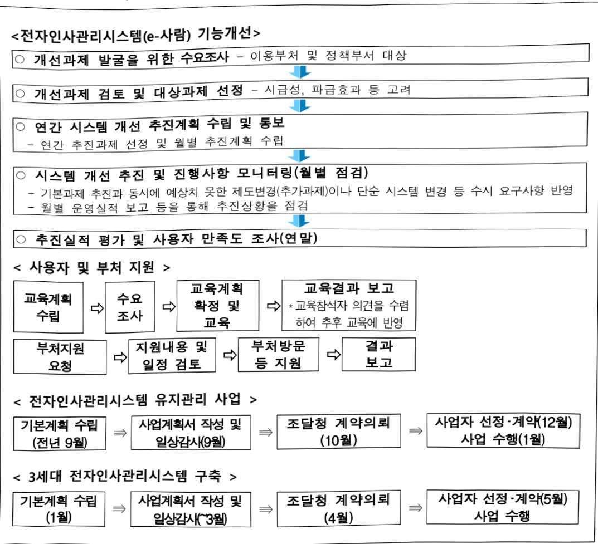
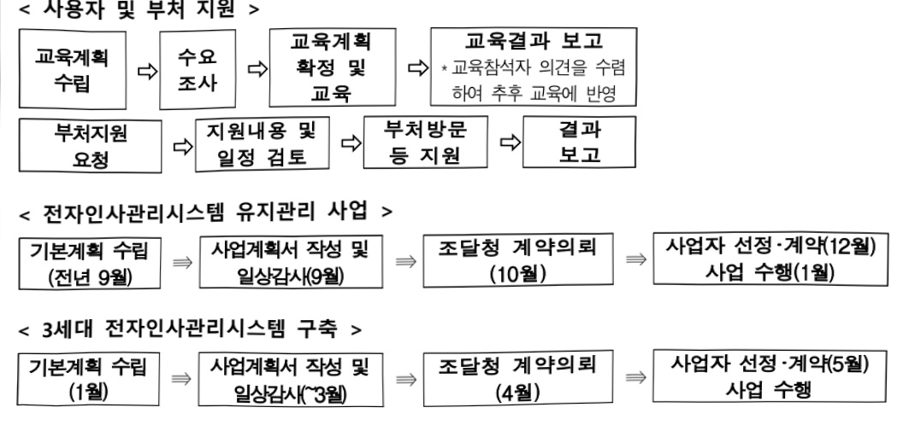
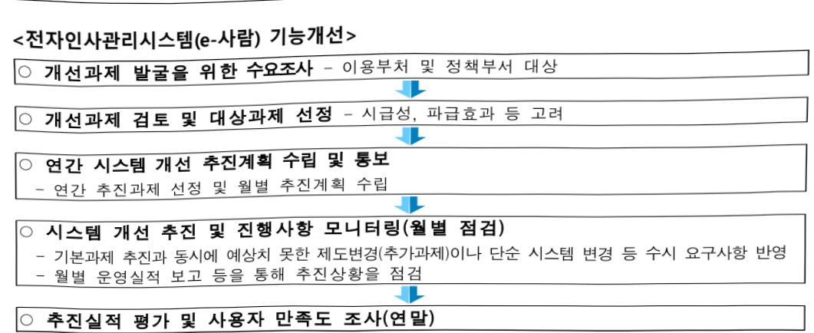

# 전자인사관리시스템운영(정보화)

**해당 페이지**: PDF 4672 ~ 4678 쪽 해당

**부처**: 인사혁신처
**분야**: 일반·지방행정
**회계유형**: 일반회계
**2026 확정예산**: -5797.0 백만원
**전년대비 증감률**: None%
**AI 도메인**: 디지털전환(AX)

---

### 가.예산 총괄표

(단위: 백만원, %)

<table border=1 style='margin: auto; word-wrap: break-word;'><tr><td rowspan="2">사업명</td><td rowspan="2">2024년 결산</td><td rowspan="2">2025년 예산 본예산(A)</td><td colspan="2">2026년</td><td rowspan="2">중감 (B-A)</td><td rowspan="2">(B-A)/A</td></tr><tr><td style='text-align: center; word-wrap: break-word;'>요구안</td><td style='text-align: center; word-wrap: break-word;'>확정(B)</td></tr><tr><td style='text-align: center; word-wrap: break-word;'>전자인사관리 시스템운영(정보화)</td><td style='text-align: center; word-wrap: break-word;'>8,394</td><td style='text-align: center; word-wrap: break-word;'>13,284</td><td style='text-align: center; word-wrap: break-word;'>9,344</td><td style='text-align: center; word-wrap: break-word;'>7,487</td><td style='text-align: center; word-wrap: break-word;'>△5,797</td><td style='text-align: center; word-wrap: break-word;'>△43.6</td></tr></table>

□ 기능별(내역사업별) 예산 내역

(단위:백만원)

<table border=1 style='margin: auto; word-wrap: break-word;'><tr><td rowspan="3"></td><td colspan="5">2024</td><td colspan="7">2025(25.11월말)</td><td rowspan="3">2026예산</td></tr><tr><td rowspan="2">예산액(추정)</td><td rowspan="2">예산현액</td><td rowspan="2">집행액[실집행액]</td><td rowspan="2">이율액</td><td rowspan="2">불용액</td><td rowspan="2">본예산</td><td rowspan="2">예산현액</td><td rowspan="2">집행액[실집행액]</td><td colspan="2">전년도이율액제외</td><td rowspan="2">이율액예상액</td><td rowspan="2">불용예상액</td></tr><tr><td style='text-align: center; word-wrap: break-word;'>예산현액</td><td style='text-align: center; word-wrap: break-word;'>집행액[실집행액]</td></tr><tr><td style='text-align: center; word-wrap: break-word;'>○ 기능별 분류(합계)</td><td style='text-align: center; word-wrap: break-word;'>8,609</td><td style='text-align: center; word-wrap: break-word;'>8,609</td><td style='text-align: center; word-wrap: break-word;'>8,394</td><td style='text-align: center; word-wrap: break-word;'>-</td><td style='text-align: center; word-wrap: break-word;'>215</td><td style='text-align: center; word-wrap: break-word;'>13,284</td><td style='text-align: center; word-wrap: break-word;'>13,284</td><td style='text-align: center; word-wrap: break-word;'>11,466</td><td style='text-align: center; word-wrap: break-word;'>13,284</td><td style='text-align: center; word-wrap: break-word;'>11,466</td><td style='text-align: center; word-wrap: break-word;'>-</td><td style='text-align: center; word-wrap: break-word;'>-</td><td style='text-align: center; word-wrap: break-word;'>7,487</td></tr><tr><td rowspan="2">· 전자인사관리시스템유지관리 및 운영지원· 전자인사관리시스템기반전환</td><td style='text-align: center; word-wrap: break-word;'>2,184</td><td style='text-align: center; word-wrap: break-word;'>2,184</td><td style='text-align: center; word-wrap: break-word;'>2,163</td><td style='text-align: center; word-wrap: break-word;'>-</td><td style='text-align: center; word-wrap: break-word;'>21</td><td style='text-align: center; word-wrap: break-word;'>2,416</td><td style='text-align: center; word-wrap: break-word;'>2,416</td><td style='text-align: center; word-wrap: break-word;'>2,000</td><td style='text-align: center; word-wrap: break-word;'>2,416</td><td style='text-align: center; word-wrap: break-word;'>2,000</td><td style='text-align: center; word-wrap: break-word;'>-</td><td style='text-align: center; word-wrap: break-word;'>-</td><td style='text-align: center; word-wrap: break-word;'>2,348</td></tr><tr><td style='text-align: center; word-wrap: break-word;'>6,425</td><td style='text-align: center; word-wrap: break-word;'>6,425</td><td style='text-align: center; word-wrap: break-word;'>6,230</td><td style='text-align: center; word-wrap: break-word;'>-</td><td style='text-align: center; word-wrap: break-word;'>195</td><td style='text-align: center; word-wrap: break-word;'>10,868</td><td style='text-align: center; word-wrap: break-word;'>10,868</td><td style='text-align: center; word-wrap: break-word;'>9,466</td><td style='text-align: center; word-wrap: break-word;'>10,868</td><td style='text-align: center; word-wrap: break-word;'>9,466</td><td style='text-align: center; word-wrap: break-word;'>-</td><td style='text-align: center; word-wrap: break-word;'>-</td><td style='text-align: center; word-wrap: break-word;'>5,139</td></tr></table>

### 나. 사업설명자료

## 1 ) 사업목적·내용

- (전자인사관리시스템 유지관리 및 운영지원) 전자인사관리시스템(e·사람)의 효율적인 유지보수 및 운영을 통해 중앙행정기관 40만 공무원 인사·급여·복무 등 인사행정 전반의 업무를 체계적으로 지원

- (전자인사관리시스템 기반전환) 노후화된 e-사람을 재구축하여 정부 인사행정 전과정의

디지털 전환을 통해 일 잘하는 정부 구현

## 2 ) 사업개요

## ☐ 사업근거 및 추진경위

①법령상근거

-국가공무원법 제19조의2(인사관리의 전자화)

---

-「디지털인사관리규정」

-「디지털인사관리규칙」

② 추진경위

°00년 2월 인사개혁 8대과제로 선정되어 정보화지원사업(정책과제) 확정(00.7)

- 1단계('00.10~01.12) : 인사전반에 걸친 업무분석과 재설계(BPR), 시스템 개발 및 기획예산처 등 4개 부처 시범적용

- 2단계('02.4~12) : 정보통신부 등 31개 중앙행정기관에 시스템 확대 적용

- 3단계('03.8~04.5) : 경찰청 등 16개 중앙행정기관에 시스템 추가 확산, 국가인재DB와 연계

○ 제도 반영('05. 8~06. 6) : 고위공무원제도, 직무성과관리, 정부 인사발령 등

○ 제도 반영('07. 8~08. 1) : 여비실비정산, 총액인건비 등

e·사람 정보전략계획(ISP) 수립('09.6~'09.12) : 기반전환(C/S→Web), 기관별 분산 관리되던 정보자원 및 데이터 통합 방안, 데이터 및 응용프로그램(AP) 전환방안 수립 등

○ 차세대 e-사람 시스템 구축('11.~'12.)

- 1단계('11. 4~12) : 부처용 표준인사시스템 전면 재개발(C/S→Web) 및 기관별 정보자원(HW 및 DB) 통합 등

- 2단계('12. 5~12) : 중앙인사관장기관용 정책지원시스템 전면 재개발(C/S→Web) 및 공무원 총조사 등 통계분석시스템 구축

○ 제도 반영('13. 8~12) : 직종개편에 따른 관계법령 개정사항 등

e-사람 모바일 시범사업('13. 9~12) : 근무상황, 출장신청 등 모바일 서비스

e-사람 급여와 회계시스템(d-Brain) 연계('13. 8~'15. 8) : 회계부정 및 유용 방지를 위한 급여 처리결과 자동 지출 기능 구축

○ 온라인 제증명 서비스 확대('17. 2~17. 7) : 재직, 경력 등 4종 증명서 온라인 자동발급

O 통합 클라우드 기반 보수자동화 BPR/ISMP 컨설팅 사업('18.4~'18.8) : 보수처리 업무재설계를 통한 정보시스템 마스터플랜(ISMP) 수립

☐ 인사정책지원시스템 개선('18. 6~18. 11) : 직제, 개인별 보직경로와 생산문서 융합·분석을 통한 데이터 기반 직무분석·역량식별체계 마련, 맞춤형 인재 추천 등

○ 지능형 보수자동화시스템 구축('20. 4~'20. 12) <1단계> * 3개 부처 적용

※ 보수자동화 및 일괄처리에 특화된 시스템 구축, 국가·지방·교육 공무원 간 수당 이중

지급방지 검증체계 구축, 연금공단 등 연계 확대 등

☐ 전자인사관리시스템 기반으로 소방인사 통합 구축('20. 6~'20. 12) <1단계>

※ 전자인사관리시스템 내 소방특화기능 개발 등 지방소방인사시스템 통합, 시·도 소방

인사 데이터 전환 프로그램 개발 및 2개 시도(서울, 충남) 시범 전환

○ 보수데이터 분석·활용 체계 구축 및 소방공무원 인사관리 통합사업('21.3.~12.) <2단계>

---

※ 보수자동화시스템(1단계)의 확산, 보수데이터 분석·활용체계 구축 및 16개 시·도 소방

공무원 인사자료를 e-사람으로 통합

○ 3세대 e-사람 BPR/ISP 사업('22.5. ~ 11.)

○ 3세대 전자인사관리시스템 구축 1단계 사업 추진('24.5.~12.)

○ 3세대 전자인사관리시스템 구축 2단계 사업 추진('25.1.~12.)

## □ 주요내용

① 사업규모

- 총사업비 : 해당없음

- 사업기간 : '04년~

- 최근 5년 간 투입된 사업비

<table border=1 style='margin: auto; word-wrap: break-word;'><tr><td style='text-align: center; word-wrap: break-word;'>연도</td><td style='text-align: center; word-wrap: break-word;'>2022</td><td style='text-align: center; word-wrap: break-word;'>2023</td><td style='text-align: center; word-wrap: break-word;'>2024</td><td style='text-align: center; word-wrap: break-word;'>2025</td><td style='text-align: center; word-wrap: break-word;'>2026</td></tr><tr><td style='text-align: center; word-wrap: break-word;'>사업비</td><td style='text-align: center; word-wrap: break-word;'>2,539</td><td style='text-align: center; word-wrap: break-word;'>2,195</td><td style='text-align: center; word-wrap: break-word;'>8,609</td><td style='text-align: center; word-wrap: break-word;'>13,284</td><td style='text-align: center; word-wrap: break-word;'>7,487</td></tr></table>

-기타:해당없음

② 사업추진체계

- 사업시행방법 : 직접수행

- 사업시행주체 : 인사혁신처

- 사업 수혜자 : 중앙행정기관 공부원

- 보조, 융자, 출연, 출자 등의 경우 보조·융자 등 지원 비율 및 법적근거 : 해당없음

## 3 ) '26년도 예산 산출 근거

① 전자인사관리시스템 유지관리 및 운영지원

:(25)2,416백만원→(26)2,348백만원(△68백만원)

- (요구) 3세대 시스템 유지관리비(+2,035백), 2세대 시스템 유지관리 종료(△2,118백), 신규시스템 지원 등 운영경비(수용비+7백, 출장여비+2백), 개인맞춤형 문자발송 등 공공요금(+6백)

- (산출) 전자인사관리시스템 응용SW 및 상용SW 유지관리(2,035백), 서비스센터 운영(263백), 사용자 교육 등 유영지원(50백)

② 전자인사관리시스템 기반전환

:(25)10,868백만원→(26)5,139백만원(△5,729백만원)

- (요구) 3세대 전자인사관리시스템(e-사람) 구축(3단계) 비용

- (산출) 3세대 전자인사관리시스템(e-사람) 구축 응용SW 개발(3,037백), 감리(269백), 상용SW 도입(1,833백)

---

## 4 ) 사업효과

☐ 사업영향,산출물 성과지표 등

1 '22~'26년도 성과계획서 상 성과지표 및 최근 5년간 성과 달성도

<table border=1 style='margin: auto; word-wrap: break-word;'><tr><td style='text-align: center; word-wrap: break-word;'>성과지표</td><td style='text-align: center; word-wrap: break-word;'>구분</td><td style='text-align: center; word-wrap: break-word;'>&#x27;22</td><td style='text-align: center; word-wrap: break-word;'>&#x27;23</td><td style='text-align: center; word-wrap: break-word;'>&#x27;24</td><td style='text-align: center; word-wrap: break-word;'>&#x27;25</td><td style='text-align: center; word-wrap: break-word;'>&#x27;26</td><td style='text-align: center; word-wrap: break-word;'>&#x27;26목표치산출근거</td><td style='text-align: center; word-wrap: break-word;'>측정산식(또는 측정방법)</td><td style='text-align: center; word-wrap: break-word;'>자료수집방법(또는 자료출처)</td></tr><tr><td rowspan="3">서비스수준관리(SLA)종합평가 접수(점)</td><td style='text-align: center; word-wrap: break-word;'>목표</td><td style='text-align: center; word-wrap: break-word;'>91.5</td><td style='text-align: center; word-wrap: break-word;'>92.4</td><td style='text-align: center; word-wrap: break-word;'>폐지</td><td style='text-align: center; word-wrap: break-word;'>-</td><td style='text-align: center; word-wrap: break-word;'>-</td><td rowspan="3">과거실적 및 추세와 전년도 실적감안</td><td rowspan="3">∑(SLA 관리지표별 평가점수× 관리지표별 가중지) 월별 측정후 연간 평균</td><td rowspan="3">서비스수준실적 보고서</td></tr><tr><td style='text-align: center; word-wrap: break-word;'>실적</td><td style='text-align: center; word-wrap: break-word;'>91.5</td><td style='text-align: center; word-wrap: break-word;'>92.4</td><td style='text-align: center; word-wrap: break-word;'>-</td><td style='text-align: center; word-wrap: break-word;'>-</td><td style='text-align: center; word-wrap: break-word;'>-</td></tr><tr><td style='text-align: center; word-wrap: break-word;'>달성도</td><td style='text-align: center; word-wrap: break-word;'>100</td><td style='text-align: center; word-wrap: break-word;'>100</td><td style='text-align: center; word-wrap: break-word;'>-</td><td style='text-align: center; word-wrap: break-word;'>-</td><td style='text-align: center; word-wrap: break-word;'>-</td></tr></table>

② 성과지표 이외의 연도별 사업추진 경과 및 실적

<table border=1 style='margin: auto; word-wrap: break-word;'><tr><td style='text-align: center; word-wrap: break-word;'>2022</td><td style='text-align: center; word-wrap: break-word;'>- 연말정산 간소화자료 일괄제공 연계서비스 제공, e-사람 공무원 연금정보 원클릭 조회서비스 기능 신설 등 783건 기능개선 완료- 연말정산 담당자 교육(3회, 708명 교육), e-사람 인사·복무·급여담당자 교육(7회, 1,145명) 및 이러닝 교육(상시운영), 헬프데스크(58,217건) 운영- 3세대 e-사람 구축을 위한 업무재설계(BPR) 및 정보전략계획(ISP) 수립(&#x27;22. 5.~11.)</td></tr><tr><td style='text-align: center; word-wrap: break-word;'>2023</td><td style='text-align: center; word-wrap: break-word;'>- 국가공무원법, 여비·복무규정 등 법·제도 개정 사항 시스템 반영, 가족수당 이중지급 검증 시스템 대상기관 확대 등 753건 기능개선 완료- 스마트 복무관리서비스(출장정산 자동화, 모바일기반 출퇴근 관리 등) 구축(6~12월, 과기부 지원사업) - 국가보훈부, 재외동포청 출범에 따른 기관별 표준인사관리시스템 개설 및 사용 지원- 연말정산 담당자교육(3회, 708명 교육), e-사람 인사·복무·급여 화상교육(7회, 1,125명) 및 이러닝 교육(상시 운영), 헬프데스크(58,217건) 운영</td></tr><tr><td style='text-align: center; word-wrap: break-word;'>2024</td><td style='text-align: center; word-wrap: break-word;'>- 동료평가 시행, 노조 근무시간 면제자 복무관리, 육아휴직 기간·수당 변경, 공무원 겸직신고 등 535건 기능개선 완료- 3세대 전자인사관리시스템(e-사람) 구축 1단계 사업 추진(5~12월) - 국가유산청, 우주항공청 출범에 따른 기관별 표준인사관리시스템 개설 및 사용 지원- 연말정산 담당자교육(3회, 764명 교육), e-사람 인사·복무·급여 화상교육(9회, 872명) 및 이러닝 교육(상시 운영), 헬프데스크(65,115건) 운영</td></tr><tr><td style='text-align: center; word-wrap: break-word;'>2025</td><td style='text-align: center; word-wrap: break-word;'>- 육아휴직경력기간 인정확대, 장기재직휴가, 배우자 출산휴가 확대 등 인사·급여·복무 업무별 제도개선사항 시스템 반영(계속) - 3세대 전자인사관리시스템(e-사람) 구축 1단계 사업 추진(1~12월) - 사용자 교육(연중) 및 위크숍, 서비스데스크 운영 등 사용자와 기관의 업무처리 지원(계속)</td></tr></table>

③향후(26년도 이후)기대효과

○ 중앙행정기관 40만 국가직 공무원의 인사·급여·복무 등 인사행정 전반의 업무를 이용하는 공통 인사관리시스템 유지관리·운영지원을 통해 안정적이고 효율적인 정부 인사업무 지원

○ 3세대 전자인사관리시스템 구축사업을 통해 정부 인사행정 전 과정을 디지털로 전환하여 공무원이 가치있는 일에 몰두하고, 일하는 방식을 혁신하여 일잘하는 정부 구현

5) 타당성조사 및 예비타당성조사 시행여부 및 결과 요지 : 해당없음

6) 총사업비 대상사업 여부 및 내역 : 해당없음

---

## 7 ) 사업 집행절차

## < 사용자 및 부처 지원 >

## 8 ) 각종 평가

1) 2025년도 부처 재정사업 자율평가 결과: 보통

전자인사관리시스템의 안정적 운영·유지관리와 3세대 e·사람 구축 사업을 통해 인사·급여

·복무 등 정부인사 전반의 디지털 전환을 추진하고 공무원의 일상을 체계적으로 지원

---

### 다. 최근 4년간 결산내역

## 1 ) 결산표

☐ 부처 결산내역

(단위: 백만원, %)

<table border=1 style='margin: auto; word-wrap: break-word;'><tr><td rowspan="2">연도</td><td colspan="3">예산액</td><td rowspan="2">예산현액(A)</td><td rowspan="2">집행액(B)</td><td rowspan="2">집행률(B/A)</td><td rowspan="2">다음연도이월액</td><td rowspan="2">불용액</td></tr><tr><td style='text-align: center; word-wrap: break-word;'>본예산</td><td style='text-align: center; word-wrap: break-word;'>추경중감액</td><td style='text-align: center; word-wrap: break-word;'>추경</td></tr><tr><td style='text-align: center; word-wrap: break-word;'>2022</td><td style='text-align: center; word-wrap: break-word;'>2,539</td><td style='text-align: center; word-wrap: break-word;'>-</td><td style='text-align: center; word-wrap: break-word;'>2,539</td><td style='text-align: center; word-wrap: break-word;'>2,539</td><td style='text-align: center; word-wrap: break-word;'>2,475</td><td style='text-align: center; word-wrap: break-word;'>97.5</td><td style='text-align: center; word-wrap: break-word;'>-</td><td style='text-align: center; word-wrap: break-word;'>64</td></tr><tr><td style='text-align: center; word-wrap: break-word;'>2023</td><td style='text-align: center; word-wrap: break-word;'>2,195</td><td style='text-align: center; word-wrap: break-word;'>-</td><td style='text-align: center; word-wrap: break-word;'>2,195</td><td style='text-align: center; word-wrap: break-word;'>2,195</td><td style='text-align: center; word-wrap: break-word;'>2,166</td><td style='text-align: center; word-wrap: break-word;'>98.7</td><td style='text-align: center; word-wrap: break-word;'>-</td><td style='text-align: center; word-wrap: break-word;'>29</td></tr><tr><td style='text-align: center; word-wrap: break-word;'>2024</td><td style='text-align: center; word-wrap: break-word;'>8,609</td><td style='text-align: center; word-wrap: break-word;'>-</td><td style='text-align: center; word-wrap: break-word;'>8,609</td><td style='text-align: center; word-wrap: break-word;'>8,609</td><td style='text-align: center; word-wrap: break-word;'>8,393</td><td style='text-align: center; word-wrap: break-word;'>97.5</td><td style='text-align: center; word-wrap: break-word;'>-</td><td style='text-align: center; word-wrap: break-word;'>215</td></tr><tr><td style='text-align: center; word-wrap: break-word;'>2025.11</td><td style='text-align: center; word-wrap: break-word;'>13,284</td><td style='text-align: center; word-wrap: break-word;'>-</td><td style='text-align: center; word-wrap: break-word;'>13,284</td><td style='text-align: center; word-wrap: break-word;'>13,284</td><td style='text-align: center; word-wrap: break-word;'>11,466</td><td style='text-align: center; word-wrap: break-word;'>86.3</td><td style='text-align: center; word-wrap: break-word;'>-</td><td style='text-align: center; word-wrap: break-word;'>-</td></tr></table>

## 2 ) 주요 결산사항 : 해당없음

2022년~2025년 결산사항

<table border=1 style='margin: auto; word-wrap: break-word;'><tr><td style='text-align: center; word-wrap: break-word;'>2022</td><td style='text-align: center; word-wrap: break-word;'>- (불용) 사업 낙찰차액(64백)</td></tr><tr><td style='text-align: center; word-wrap: break-word;'>2023</td><td style='text-align: center; word-wrap: break-word;'>- (불용) 사업 낙찰차액(29백)</td></tr><tr><td style='text-align: center; word-wrap: break-word;'>2024</td><td style='text-align: center; word-wrap: break-word;'>- (불용) 사업 낙찰차액(215백)</td></tr><tr><td style='text-align: center; word-wrap: break-word;'>2025</td><td style='text-align: center; word-wrap: break-word;'>-</td></tr></table>

2025년 이·전용 등 세부내역 : 해당없음

---

<table border=1 style='margin: auto; word-wrap: break-word;'><tr><td rowspan="3">조달정보화(정보화)</td><td rowspan="2">소관부처</td><td style='text-align: center; word-wrap: break-word;'>실·국·과(팀)</td><td style='text-align: center; word-wrap: break-word;'>과 장</td><td style='text-align: center; word-wrap: break-word;'>서기관</td><td style='text-align: center; word-wrap: break-word;'>주무관</td></tr><tr><td style='text-align: center; word-wrap: break-word;'>디지털공정조달국 전자조달기획과</td><td style='text-align: center; word-wrap: break-word;'>방형준</td><td style='text-align: center; word-wrap: break-word;'>최민수</td><td style='text-align: center; word-wrap: break-word;'>박지희</td></tr><tr><td style='text-align: center; word-wrap: break-word;'>사업시행주체</td><td style='text-align: center; word-wrap: break-word;'>조달청</td><td style='text-align: center; word-wrap: break-word;'>042-724-7901</td><td style='text-align: center; word-wrap: break-word;'>042-724-7124</td><td style='text-align: center; word-wrap: break-word;'>042-724-7135</td></tr></table>

□사업담당자

<table border=1 style='margin: auto; word-wrap: break-word;'><tr><td style='text-align: center; word-wrap: break-word;'>직접</td><td style='text-align: center; word-wrap: break-word;'>춤자</td><td style='text-align: center; word-wrap: break-word;'>춤연</td><td style='text-align: center; word-wrap: break-word;'>보조</td><td style='text-align: center; word-wrap: break-word;'>읍자</td><td style='text-align: center; word-wrap: break-word;'>국고보조율(%)</td><td style='text-align: center; word-wrap: break-word;'>읍자율(%)</td></tr><tr><td style='text-align: center; word-wrap: break-word;'>○</td><td style='text-align: center; word-wrap: break-word;'></td><td style='text-align: center; word-wrap: break-word;'></td><td style='text-align: center; word-wrap: break-word;'></td><td style='text-align: center; word-wrap: break-word;'></td><td style='text-align: center; word-wrap: break-word;'></td><td style='text-align: center; word-wrap: break-word;'></td></tr></table>

□사업지원형태 및 지원을(최소한 한 개는 반드시 선택하시오. 해당사항에 O 표시)

<table border=1 style='margin: auto; word-wrap: break-word;'><tr><td rowspan="2">신규</td><td rowspan="2">계속</td><td rowspan="2">완료</td><td rowspan="2">예비타당성 실시여부</td><td rowspan="2">총사업비 관리대상</td><td rowspan="2">총액계상 예산사업</td><td style='text-align: center; word-wrap: break-word;'>사업소관 변경정보</td></tr><tr><td style='text-align: center; word-wrap: break-word;'>2025예산 시 소관</td></tr><tr><td style='text-align: center; word-wrap: break-word;'></td><td style='text-align: center; word-wrap: break-word;'>○</td><td style='text-align: center; word-wrap: break-word;'></td><td style='text-align: center; word-wrap: break-word;'></td><td style='text-align: center; word-wrap: break-word;'></td><td style='text-align: center; word-wrap: break-word;'></td><td style='text-align: center; word-wrap: break-word;'></td></tr></table>

□사업성격(공통요구자료Ⅱ-1 작성유의사항 4.참조,해당하는 사항에"O"표시)

<table border=1 style='margin: auto; word-wrap: break-word;'><tr><td style='text-align: center; word-wrap: break-word;'>구분</td><td style='text-align: center; word-wrap: break-word;'>프로그램</td><td style='text-align: center; word-wrap: break-word;'>단위사업</td><td style='text-align: center; word-wrap: break-word;'>세부사업</td></tr><tr><td style='text-align: center; word-wrap: break-word;'>코드</td><td style='text-align: center; word-wrap: break-word;'>1100</td><td style='text-align: center; word-wrap: break-word;'>1131</td><td style='text-align: center; word-wrap: break-word;'>501</td></tr><tr><td style='text-align: center; word-wrap: break-word;'>명칭</td><td style='text-align: center; word-wrap: break-word;'>전자조달 및 국유재산 관리</td><td style='text-align: center; word-wrap: break-word;'>전자조달 운영 및 개발</td><td style='text-align: center; word-wrap: break-word;'>조달정보화(정보화)</td></tr></table>

<table border=1 style='margin: auto; word-wrap: break-word;'><tr><td style='text-align: center; word-wrap: break-word;'>구분</td><td style='text-align: center; word-wrap: break-word;'>회계</td><td style='text-align: center; word-wrap: break-word;'>소관</td><td style='text-align: center; word-wrap: break-word;'>실국(기관)</td><td style='text-align: center; word-wrap: break-word;'>계정</td><td style='text-align: center; word-wrap: break-word;'>분야</td><td style='text-align: center; word-wrap: break-word;'>부문</td></tr><tr><td style='text-align: center; word-wrap: break-word;'>코드</td><td rowspan="2">조달특별회계</td><td rowspan="2">조달청</td><td rowspan="2">디지털 공정조달국</td><td rowspan="2">손익</td><td style='text-align: center; word-wrap: break-word;'>010</td><td style='text-align: center; word-wrap: break-word;'>016</td></tr><tr><td style='text-align: center; word-wrap: break-word;'>명칭</td><td style='text-align: center; word-wrap: break-word;'>일반·지방행정</td><td style='text-align: center; word-wrap: break-word;'>일반행정</td></tr></table>

□사업코드정보

<table border=1 style='margin: auto; word-wrap: break-word;'><tr><td style='text-align: center; word-wrap: break-word;'>사 업 명</td></tr><tr><td style='text-align: center; word-wrap: break-word;'>(1) 조달정보화(정보화) (1131 - 501)</td></tr></table>

---

### 원본 PDF 크롭 이미지

