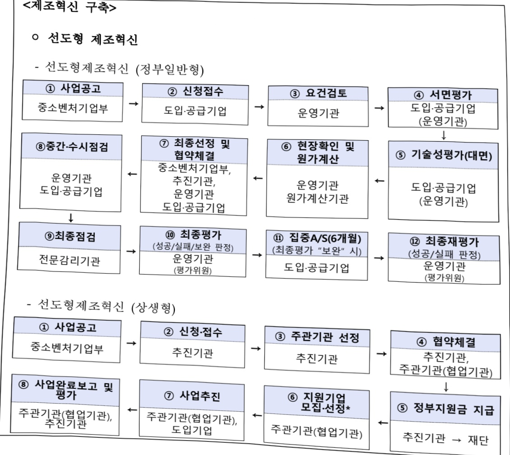
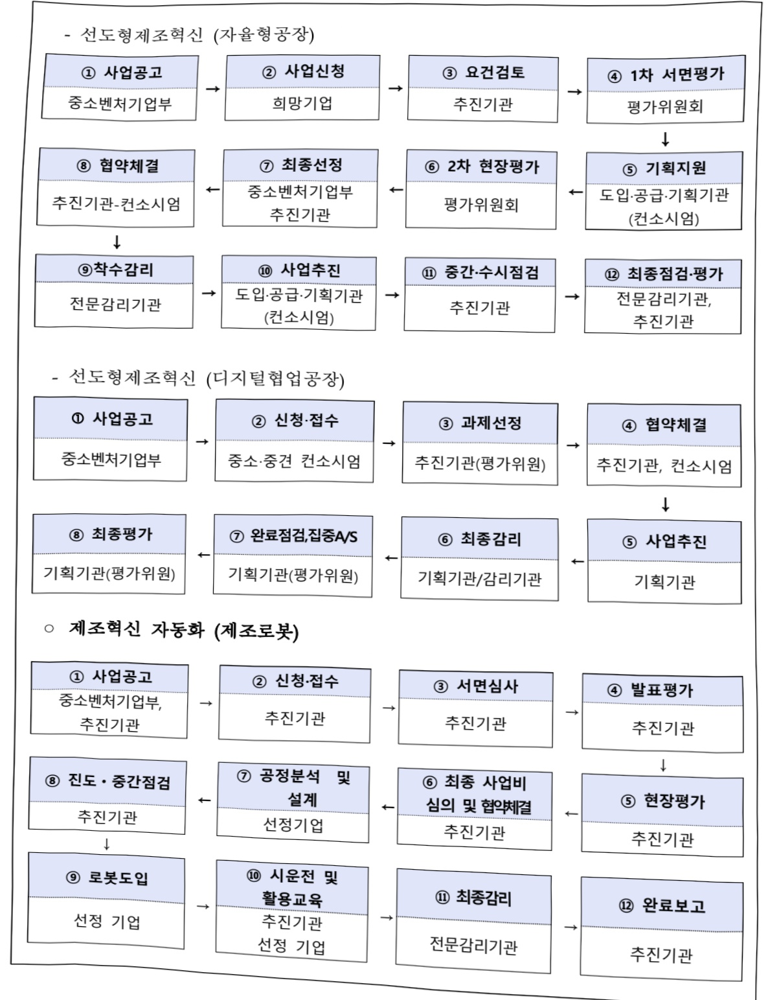
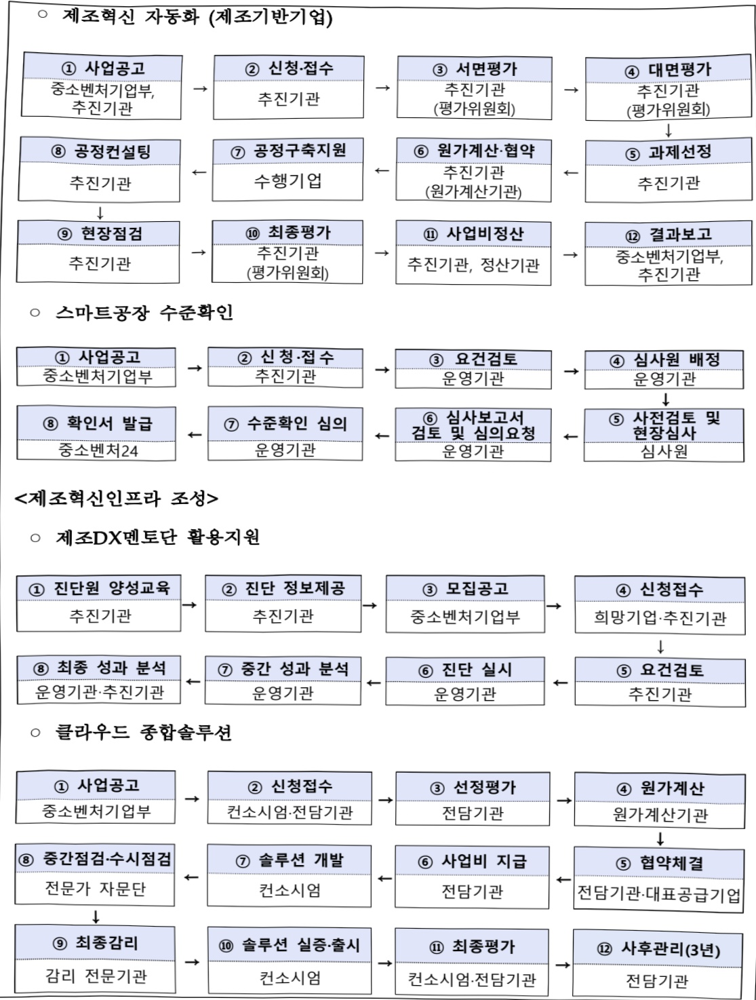
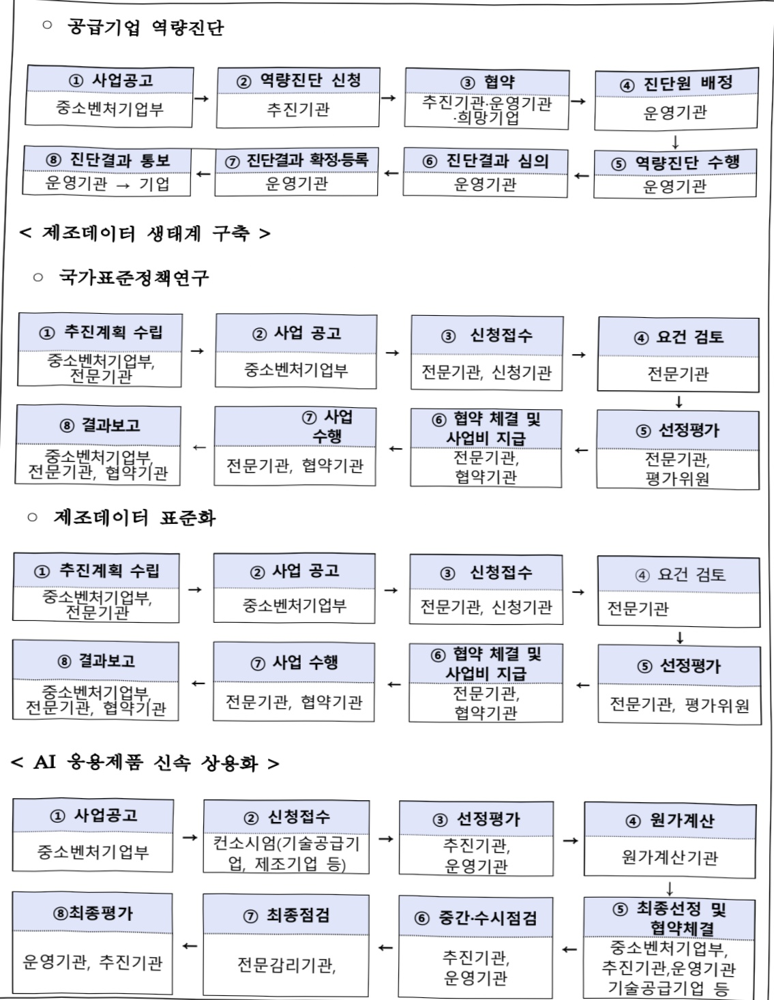

# ICT융합스마트공장보급확산

**해당 페이지**: PDF 4701 ~ 4715 쪽 해당

**부처**: 중소벤처기업부
**분야**: 산업·중소기업 및 에너지
**회계유형**: 일반회계
**2026 확정예산**: 402056.0 백만원
**전년대비 증감률**: 40.1%
**AI 도메인**: 데이터, 로봇, 제조/스마트팩토리, 통신/네트워크, 디지털전환(AX)

---

<table border=1 style='margin: auto; word-wrap: break-word;'><tr><td style='text-align: center; word-wrap: break-word;'>사 업 명</td></tr><tr><td style='text-align: center; word-wrap: break-word;'>(4) ICT 융합스마트공장보급·확산 (2111-303)</td></tr></table>

□사업 코드 정보

<table border=1 style='margin: auto; word-wrap: break-word;'><tr><td style='text-align: center; word-wrap: break-word;'>구분</td><td style='text-align: center; word-wrap: break-word;'>회계</td><td style='text-align: center; word-wrap: break-word;'>소관</td><td style='text-align: center; word-wrap: break-word;'>실국(기관)</td><td style='text-align: center; word-wrap: break-word;'>계정</td><td style='text-align: center; word-wrap: break-word;'>분야</td><td style='text-align: center; word-wrap: break-word;'>부문</td></tr><tr><td style='text-align: center; word-wrap: break-word;'>코드</td><td rowspan="2">일반회계</td><td rowspan="2">중소벤처기업부</td><td rowspan="2">중소기업정책실지역기업정책관</td><td rowspan="2"></td><td style='text-align: center; word-wrap: break-word;'>110</td><td style='text-align: center; word-wrap: break-word;'>119</td></tr><tr><td style='text-align: center; word-wrap: break-word;'>명칭</td><td style='text-align: center; word-wrap: break-word;'>산업·중소기업 및 에너지</td><td style='text-align: center; word-wrap: break-word;'>중소기업 및 소상공인육성</td></tr></table>

<table border=1 style='margin: auto; word-wrap: break-word;'><tr><td style='text-align: center; word-wrap: break-word;'>구분</td><td style='text-align: center; word-wrap: break-word;'>프로그램</td><td style='text-align: center; word-wrap: break-word;'>단위사업</td><td style='text-align: center; word-wrap: break-word;'>세부사업</td></tr><tr><td style='text-align: center; word-wrap: break-word;'>코드</td><td style='text-align: center; word-wrap: break-word;'>2100</td><td style='text-align: center; word-wrap: break-word;'>2111</td><td style='text-align: center; word-wrap: break-word;'>303</td></tr><tr><td style='text-align: center; word-wrap: break-word;'>명칭</td><td style='text-align: center; word-wrap: break-word;'>중소기업기술개발지원</td><td style='text-align: center; word-wrap: break-word;'>중소기업경쟁력강화</td><td style='text-align: center; word-wrap: break-word;'>ICT용합스마트공장보급·확산</td></tr></table>

□ 사업 성격

<table border=1 style='margin: auto; word-wrap: break-word;'><tr><td style='text-align: center; word-wrap: break-word;'>신규</td><td style='text-align: center; word-wrap: break-word;'>계속</td><td style='text-align: center; word-wrap: break-word;'>완료</td><td style='text-align: center; word-wrap: break-word;'>예비타당성 실시여부</td><td style='text-align: center; word-wrap: break-word;'>총사업비 관리대상</td><td style='text-align: center; word-wrap: break-word;'>총액계상 예산사업</td><td style='text-align: center; word-wrap: break-word;'>사업소관 변경정보</td></tr><tr><td style='text-align: center; word-wrap: break-word;'></td><td style='text-align: center; word-wrap: break-word;'>O</td><td style='text-align: center; word-wrap: break-word;'></td><td style='text-align: center; word-wrap: break-word;'></td><td style='text-align: center; word-wrap: break-word;'></td><td style='text-align: center; word-wrap: break-word;'></td><td style='text-align: center; word-wrap: break-word;'></td></tr></table>

□ 사업 지원 형태 및 지원을

<table border=1 style='margin: auto; word-wrap: break-word;'><tr><td style='text-align: center; word-wrap: break-word;'>직접</td><td style='text-align: center; word-wrap: break-word;'>출자</td><td style='text-align: center; word-wrap: break-word;'>출연</td><td style='text-align: center; word-wrap: break-word;'>보조</td><td style='text-align: center; word-wrap: break-word;'>융자</td><td style='text-align: center; word-wrap: break-word;'>국고보조율(%)</td><td style='text-align: center; word-wrap: break-word;'>융자율(%)</td></tr><tr><td style='text-align: center; word-wrap: break-word;'>O</td><td style='text-align: center; word-wrap: break-word;'></td><td style='text-align: center; word-wrap: break-word;'>O</td><td style='text-align: center; word-wrap: break-word;'>O</td><td style='text-align: center; word-wrap: break-word;'></td><td style='text-align: center; word-wrap: break-word;'>30~100%</td><td style='text-align: center; word-wrap: break-word;'></td></tr></table>

## □ 사업 담당자

<table border=1 style='margin: auto; word-wrap: break-word;'><tr><td style='text-align: center; word-wrap: break-word;'>사업명</td><td colspan="2">구분</td></tr><tr><td rowspan="2">ICT융합스마트공장보급·확산</td><td rowspan="2">소관부처</td><td style='text-align: center; word-wrap: break-word;'>중소기업정책실 지역기업정책관</td></tr><tr><td style='text-align: center; word-wrap: break-word;'>제조혁신과</td></tr><tr><td style='text-align: center; word-wrap: break-word;'>제조혁신구축지원 (선도형 제조혁신, 스마트공장 수준확인) 제조혁신 인프라 조성 제조테이터 생태계구축 AI 응용제품 신속 상용화</td><td rowspan="3">사업시행 주체</td><td style='text-align: center; word-wrap: break-word;'>중소기업기술정보진흥원</td></tr><tr><td style='text-align: center; word-wrap: break-word;'>제조혁신구축지원 (제조혁신 자동화)</td><td style='text-align: center; word-wrap: break-word;'>한국로봇산업진흥원</td></tr><tr><td style='text-align: center; word-wrap: break-word;'>제조혁신구축지원 (제조혁신 자동화)</td><td style='text-align: center; word-wrap: break-word;'>한국생산기술연구원</td></tr></table>

---

### 가. 예산 총괄표

(단위: 백만원, %)

<table border=1 style='margin: auto; word-wrap: break-word;'><tr><td rowspan="2">사업명</td><td rowspan="2">2024년 결산</td><td colspan="2">2025년 예산</td><td colspan="2">2026년 예산</td><td rowspan="2">중감(B-A)</td><td rowspan="2">(B-A)/A</td></tr><tr><td style='text-align: center; word-wrap: break-word;'>본예산</td><td style='text-align: center; word-wrap: break-word;'>추경(A)</td><td style='text-align: center; word-wrap: break-word;'>요구안</td><td style='text-align: center; word-wrap: break-word;'>본예산(B)</td></tr><tr><td style='text-align: center; word-wrap: break-word;'>ICT융합 스마트공장보급·확산</td><td style='text-align: center; word-wrap: break-word;'>219,054</td><td style='text-align: center; word-wrap: break-word;'>236,076</td><td style='text-align: center; word-wrap: break-word;'>286,923</td><td style='text-align: center; word-wrap: break-word;'>436,556</td><td style='text-align: center; word-wrap: break-word;'>402,056</td><td style='text-align: center; word-wrap: break-word;'>115,133</td><td style='text-align: center; word-wrap: break-word;'>40.1</td></tr></table>

□ 기능별(내역사업별) 예산 내역

(단위:백만원)

<table border=1 style='margin: auto; word-wrap: break-word;'><tr><td rowspan="2"></td><td colspan="5">2024</td><td colspan="5">2025</td><td rowspan="2">2026예산</td></tr><tr><td style='text-align: center; word-wrap: break-word;'>예산액(추경)</td><td style='text-align: center; word-wrap: break-word;'>예산현액</td><td style='text-align: center; word-wrap: break-word;'>집행액</td><td style='text-align: center; word-wrap: break-word;'>이월액</td><td style='text-align: center; word-wrap: break-word;'>불용액</td><td style='text-align: center; word-wrap: break-word;'>예산액(추경)</td><td style='text-align: center; word-wrap: break-word;'>예산현액</td><td style='text-align: center; word-wrap: break-word;'>집행액</td><td style='text-align: center; word-wrap: break-word;'>이월액</td><td style='text-align: center; word-wrap: break-word;'>불용액</td></tr><tr><td style='text-align: center; word-wrap: break-word;'>○ 기능별 분류(합계)</td><td style='text-align: center; word-wrap: break-word;'>219,054</td><td style='text-align: center; word-wrap: break-word;'>219,054</td><td style='text-align: center; word-wrap: break-word;'>218,440</td><td style='text-align: center; word-wrap: break-word;'>-</td><td style='text-align: center; word-wrap: break-word;'>614</td><td style='text-align: center; word-wrap: break-word;'>286,923</td><td style='text-align: center; word-wrap: break-word;'>286,923</td><td style='text-align: center; word-wrap: break-word;'>286,923</td><td style='text-align: center; word-wrap: break-word;'>-</td><td style='text-align: center; word-wrap: break-word;'>-</td><td style='text-align: center; word-wrap: break-word;'>402,056</td></tr><tr><td style='text-align: center; word-wrap: break-word;'>· 제 조 혁 신 구 축 지원</td><td style='text-align: center; word-wrap: break-word;'>205,651</td><td style='text-align: center; word-wrap: break-word;'>205,651</td><td style='text-align: center; word-wrap: break-word;'>205,037</td><td style='text-align: center; word-wrap: break-word;'>-</td><td style='text-align: center; word-wrap: break-word;'>614</td><td style='text-align: center; word-wrap: break-word;'>270,141</td><td style='text-align: center; word-wrap: break-word;'>270,141</td><td style='text-align: center; word-wrap: break-word;'>270,141</td><td style='text-align: center; word-wrap: break-word;'>-</td><td style='text-align: center; word-wrap: break-word;'>-</td><td style='text-align: center; word-wrap: break-word;'>317,290</td></tr><tr><td style='text-align: center; word-wrap: break-word;'>· 제조혁신 인프라 조성</td><td style='text-align: center; word-wrap: break-word;'>11,910</td><td style='text-align: center; word-wrap: break-word;'>11,910</td><td style='text-align: center; word-wrap: break-word;'>11,910</td><td style='text-align: center; word-wrap: break-word;'>-</td><td style='text-align: center; word-wrap: break-word;'>-</td><td style='text-align: center; word-wrap: break-word;'>13,782</td><td style='text-align: center; word-wrap: break-word;'>13,782</td><td style='text-align: center; word-wrap: break-word;'>13,782</td><td style='text-align: center; word-wrap: break-word;'>-</td><td style='text-align: center; word-wrap: break-word;'>-</td><td style='text-align: center; word-wrap: break-word;'>12,126</td></tr><tr><td style='text-align: center; word-wrap: break-word;'>· 제조데이터 생태계 구축</td><td style='text-align: center; word-wrap: break-word;'>1,493</td><td style='text-align: center; word-wrap: break-word;'>1,493</td><td style='text-align: center; word-wrap: break-word;'>1,493</td><td style='text-align: center; word-wrap: break-word;'>-</td><td style='text-align: center; word-wrap: break-word;'>-</td><td style='text-align: center; word-wrap: break-word;'>3,000</td><td style='text-align: center; word-wrap: break-word;'>3,000</td><td style='text-align: center; word-wrap: break-word;'>3,000</td><td style='text-align: center; word-wrap: break-word;'>-</td><td style='text-align: center; word-wrap: break-word;'>-</td><td style='text-align: center; word-wrap: break-word;'>8,140</td></tr><tr><td style='text-align: center; word-wrap: break-word;'>· AI 응용제품 신속 상용화</td><td style='text-align: center; word-wrap: break-word;'>-</td><td style='text-align: center; word-wrap: break-word;'>-</td><td style='text-align: center; word-wrap: break-word;'>-</td><td style='text-align: center; word-wrap: break-word;'>-</td><td style='text-align: center; word-wrap: break-word;'>-</td><td style='text-align: center; word-wrap: break-word;'>-</td><td style='text-align: center; word-wrap: break-word;'>-</td><td style='text-align: center; word-wrap: break-word;'>-</td><td style='text-align: center; word-wrap: break-word;'>-</td><td style='text-align: center; word-wrap: break-word;'>-</td><td style='text-align: center; word-wrap: break-word;'>64,500</td></tr></table>

### 나.사업설명자료

## 1 ) 사업목적·내용

- (ICT융합 스마트공장 보급·확산) 대내외 환경변화의 효과적 대응을 위해 제조 중소·중견기업 대상 DX 맞춤 지원 사업

- (제조혁신 구축지원) 동 내역사업은 한국 제조현실에 적합한 제조 혁신을 중소·중견 기업 대상으로 지원하여 전체 제조업의 경쟁력 향상 도모

① (선도형 제조혁신) 중소·중견 제조기업을 대상으로 스마트화 기반 강화와 생산성 향상 등 제조업 경쟁력 제고를 위해 스마트공장 구축 지원

② (제조혁신 자동화) 제조로봇·자동화설비 등을 통한 생산성 향상, 산업재해 감소, 인력난 해소 등 제조공정의 디지털 전환으로 국내 제조업의 경쟁력 향상

③ (스마트공장 수준확인) 스마트공장 구축 수준확인 제도 운영을 통한 민간의 자발적인 스마트공장 구축 확산

---

- (제조혁신 인프라조성) 스마트공장 도입기업의 운영 애로사항 해결을 위한 컨설팅을 지원하고, 공급기업 역량진단 및 제조솔루션 구축을 통한 스마트공장 활용도 제고

① (공급기업 역량진단) 공급기업의 객관적인 역량결과를 제공하여 자발적 역량강화 촉진, 전문기업 지정 및 우수공급기업 정보공개를 통해 양질의 스마트공장 구축 지원

② (클라우드 종합솔루션) 중소 공급기업의 제조솔루션 클라우드 전환 및 다수의 제조 솔루션을 통합하여 클라우드·패키지 형태로 개발 지원

③ (제조DX멘토단 활용지원) 스마트공장 도입기업의 운영 애로사항 해결을 위한 제조혁신 전문가 컨설팅 지원과 사후관리 지원

- (제조데이터 생태계 구축) 스마트공장의 ①업종별 공정, ②장비별 제조데이터 표준화를 통해 표준기반의 스마트공장 구축을 촉진하여 스마트제조 생태계 활성화

① (국가표준정책연구) 제조현장의 생산성 제고를 위한 스마트공장 표준개발 및 활용지원

② (제조데이터 표준화) 현장설비의 각기 다른 데이터 정보들을 표준화하여 장비·공정 간 데이터 연계를 통해 공정 최적화 및 협업기업간 데이터 공유 기반 마련

- (AI 응용제품 신속 상용화) 중소제조현장의 신속한 AI전환 촉진을 위해 1~2년 내

성과도출이 가능한 스마트제조 분야 AI 제품·서비스 상용화 및 확산 지원

2) 사업개요

□ 사업근거 및 추진경위

① 법령상 근거 및 조항

스마트제조혁신촉진법 제8조(스마트제조혁신 촉진), 제12조(제조데이터 활용 지원)

제8조(스마트제조혁신 촉진) ① 중소벤처기업부장관은 스마트제조혁신 촉진을 위하여 다음 각 호의 지원사업을 추진할 수 있다.

1. 스마트공장 보급 및 확산, 사후관리 지원

2. 스마트제조혁신 기술경쟁력 제고

3. 스마트제조혁신 관련 중소기업과 중견기업, 대기업 간의 협력 촉진

4.산·학·연공동스마트제조혁신지원

5. 제조데이터의 활용 촉진

6. 디지털 클러스터 구축 지원

7. 공급기업의 육성

8. 스마트제조혁신 전문인력의 양성 및 공급

9. 스마트제조혁신 관련 교육 및 홍보

10. 스마트제조혁신 관련 기업의 국내외 판로 개척

---

11.그밖에스마트제조혁신촉진에필요한사업으로서대통령령으로정하는사업

② 중소벤처기업부장관은 제1항에 따른 지원사업에 참여하는 대학, 연구기관, 공공기관, 중소기업 등에 대하여 그 비용의 전부 또는 일부를 출연하거나 지원할 수 있다.

제12조(제조데이터 활용 지원) ① 중소벤처기업부장관은 중소기업의 제조데이터 활용을 위하여 필요한 시책을 수립·시행할 수 있다.

② 중소벤처기업부장관은 중소기업의 제조데이터 생산·수집, 가공·분석, 공유·유통을 촉진하기 위한 지원사업을 추진할 수 있다.

③ 중소벤처기업부장관은 제2항에 따른 지원사업에 참여하는 대학, 연구기관, 공공기관, 중소기업 등에 대하여 그 비용의 전부 또는 일부를 출연하거나 지원할 수 있다.

④ 제조데이터 활용 지원을 위한 지원기준, 지원방법 등 제2항의 지원사업 추진에 필요한 사항은 대통령령으로 정한다.

0 지능형로봇개발 및 보급촉진법 제3조(국가 및 지방자치단체의 책무), 제6조(자금지원 등)

제3조(국가 및 지방자치단체의 책무) ① 국가 및 지방자치단체는 지능형 로봇이 국민의 안전과 편의를 증진시키는 방향으로 개발·보급될 수 있도록 사회적 기반을 조성하여야 한다.

② 국가 및 지방자치단체는 지능형 로봇의 개발 및 보급을 촉진하기 위하여 필요한 예산을 확보하고 관련 시책을 종합적이고 효과적으로 수립·추진하여야 한다.

제6조(자금지원 등) ① 정부는 기본계획 및 실행계획을 효과적으로 추진하기 위하여 필요한 자금을 확보하기 위하여 노력하여야 한다.

○ 뿌리산업 진흥과 침단화에 관한 법률 제15조(뿌리기술 전문기업의 지정 및 지원), 제18조(뿌리기업의 침단화와 친환경화 촉진 등)

제15조(뿌리기술 전문기업의 지정 및 지원) ① 산업통상자원부장관은 뿌리기술의 육성 및 관련 산업의 발전을 촉진하기 위하여 제14조제1항에 따라 지정된 핵심 뿌리기술을 보유하고 다음 각 호의 요건을 모두 갖춘 기업을 뿌리기술 전문기업으로 지정하고 이를 지원할 수 있다.

1. 총 매출액 중 뿌리기술을 이용한 사업의 매출액이 대통령령으로 정하는 기준에 해당하는 기업

2.「독점규제 및 공정거래에 관한 법률」 제31조제1항에 따른 상호출자제한기업집단에 속하지 아니하는 기업

3. 그 밖에 기술수준과 경영역량 등 대통령령으로 정하는 요건을 충족하는 기업

② 산업통상자원부장관은 제1항에 따른 지원사업을 추진하는 기관 또는 단체에 필요한 비용을 출연 또는 보조할 수 있다.

③ 정부는「병역법」제36조제1항에 따른 전문연구요원이 종사할 병역지정업체의 선정에 있어 뿌리기술 전문기업을 우대할 수 있다.

④ 제1항에 따른 뿌리기술 전문기업의 지정절차 및 지원내용 등에 관한 구체적인 사항은 대통령령으로 정한다.

제18조(뿌리기업의 첨단화와 친환경화 촉진 등) 뿌리기업의 자동화, 지능화 및 환경친화적 기업으로의 전환 촉진을 위한 재정적 지원을 할 수 있다

---

## ② 추진경위

- '전국상의 회장단(경제5단체장) 간담회'에서 「제조업혁신3.0전략」 발표('14.6.26)

- 「제조업혁신3.0전략」의 핵심과제로 스마트공장 보급·확산 추진

- '제7차 무역투자진흥회의'에서 「제조업 혁신3.0전략 실행대책」 발표('15.3.19)

- '제1차 핵심개혁과제 점검회의('15.6.25')'에서 상반기 추진상황 점검

- '중소기업 정책간담회'에서「스마트 제조혁신비전 2025」 발표 ('17.4.20)

- (국정과제) 38-1 4차 산업혁명 대응을 위한 제조업 부흥 (17.7.19)

* '22년까지 스마트공장 2만개 보급 · 확산을 통한 제조기업 경쟁력 확보 및 고부가가치 일자리 창출 지원

- 중소기업정보화역량강화 세부사업에서 생산현장디지털화 내역사업 이관('18)

- 스마트공장 확산 및 고도화 전략 발표(4차위, '18.3.8), 대한민국 혁신성장 보고대회 VIP 보고('18.5.7), 중소기업 스마트 제조혁신 전략 발표('18.12.13)

- 'AI·데이터 기반 제조혁신 고도화 전략' 발표('20.7.23)

- '스마트 제조혁신 실행 전략'발표('20.11.12)

- (국정과제) 31 중소기업 정책을 민간주도 “혁신성장”의 관점에서 재설계('22.5.3)

* '제조 디지털 전환 클라우드 플랫폼(DTaaS)'구축 및 스마트공장(미래형 선도 스마트공장 등) 추가보급

- '新 디지털 제조혁신 추진전략' 발표('23.9.18)

- '스마트제조 혁신 생태계 고도화 방안' 발표('24.10.2)

- 'AI 기반 스마트제조혁신 3.0 전략' 발표('25.10.24.)

---

## 주요내용

① 사업규모

- 총사업비 : 해당 없음

- 사업기간 : '15~계속

- 최근 5년 간 투입된 사업비(예산액기준, 주경편성한 연도에는 추경포함)

<table border=1 style='margin: auto; word-wrap: break-word;'><tr><td style='text-align: center; word-wrap: break-word;'>연도</td><td style='text-align: center; word-wrap: break-word;'>2022</td><td style='text-align: center; word-wrap: break-word;'>2023</td><td style='text-align: center; word-wrap: break-word;'>2024</td><td style='text-align: center; word-wrap: break-word;'>2025</td><td style='text-align: center; word-wrap: break-word;'>2026</td></tr><tr><td style='text-align: center; word-wrap: break-word;'>사업비</td><td style='text-align: center; word-wrap: break-word;'>346,637</td><td style='text-align: center; word-wrap: break-word;'>167,091</td><td style='text-align: center; word-wrap: break-word;'>219,054</td><td style='text-align: center; word-wrap: break-word;'>286,923</td><td style='text-align: center; word-wrap: break-word;'>402,056</td></tr></table>

② 사업추진체계

- 사업시행방법 : 보조(스마트공장 수준확인, 제조DX멘토단 활용지원), 출연(선도형 제조혁신, 제조혁신 자동화, 클라우드 종합솔루션, 공급기업 역량진단, 국가표준정책연구, 제조데이터 표준화)

- 사업시행주체 : 중소기업기술정보진흥원, 한국로봇산업진흥원, 한국생산기술연구원

- 사업 수혜자 : 중소 · 중견기업

- 보조·융자 등 지원 비율 및 법적근거

<table border=1 style='margin: auto; word-wrap: break-word;'><tr><td colspan="2">내역 사업명</td><td style='text-align: center; word-wrap: break-word;'>구분</td><td style='text-align: center; word-wrap: break-word;'>피보조·피 출연 등 기관명</td><td style='text-align: center; word-wrap: break-word;'>지원 금액 (2026예산)</td><td style='text-align: center; word-wrap: break-word;'>지원 비율(%)</td><td style='text-align: center; word-wrap: break-word;'>보조율 법적근거 (해당 조항)</td></tr><tr><td colspan="2">제조혁신 구축</td><td style='text-align: center; word-wrap: break-word;'></td><td style='text-align: center; word-wrap: break-word;'></td><td style='text-align: center; word-wrap: break-word;'></td><td style='text-align: center; word-wrap: break-word;'></td><td style='text-align: center; word-wrap: break-word;'></td></tr><tr><td rowspan="4"></td><td style='text-align: center; word-wrap: break-word;'>선도형 제조혁신</td><td rowspan="3">출연</td><td style='text-align: center; word-wrap: break-word;'>중소기업 기술정보 진흥원</td><td style='text-align: center; word-wrap: break-word;'>257,931</td><td style='text-align: center; word-wrap: break-word;'>30~50</td><td style='text-align: center; word-wrap: break-word;'>스마트제조혁신법 제8조 제2항</td></tr><tr><td rowspan="2">제조혁신 자동화</td><td style='text-align: center; word-wrap: break-word;'>한국로봇산 업진흥원</td><td style='text-align: center; word-wrap: break-word;'>45,000</td><td style='text-align: center; word-wrap: break-word;'>50</td><td style='text-align: center; word-wrap: break-word;'>스마트제조혁신법 제8조 제2항 지능형로봇개발 및 보급 촉진법 제3조</td></tr><tr><td style='text-align: center; word-wrap: break-word;'>한국생산 기술연구원</td><td style='text-align: center; word-wrap: break-word;'>12,290</td><td style='text-align: center; word-wrap: break-word;'>50~100</td><td style='text-align: center; word-wrap: break-word;'>스마트제조혁신법 제8조 제2항 뿌리산업 진흥과 첨단화에 관한 법률 제18조</td></tr><tr><td style='text-align: center; word-wrap: break-word;'>스마트공장 수준확인</td><td style='text-align: center; word-wrap: break-word;'>보조</td><td style='text-align: center; word-wrap: break-word;'>중소기업 기술정보 진흥원</td><td style='text-align: center; word-wrap: break-word;'>2,000</td><td style='text-align: center; word-wrap: break-word;'>100</td><td style='text-align: center; word-wrap: break-word;'>스마트제조혁신법 제11조</td></tr><tr><td colspan="2">제조혁신 인프라 조성</td><td style='text-align: center; word-wrap: break-word;'></td><td style='text-align: center; word-wrap: break-word;'></td><td style='text-align: center; word-wrap: break-word;'></td><td style='text-align: center; word-wrap: break-word;'></td><td style='text-align: center; word-wrap: break-word;'></td></tr><tr><td rowspan="3"></td><td style='text-align: center; word-wrap: break-word;'>DX멘토단 활용지원</td><td style='text-align: center; word-wrap: break-word;'>보조</td><td rowspan="3">중소기업 기술정보 진흥원</td><td style='text-align: center; word-wrap: break-word;'>8,620</td><td style='text-align: center; word-wrap: break-word;'>50~85</td><td style='text-align: center; word-wrap: break-word;'>스마트제조혁신법 제8조 제2항</td></tr><tr><td style='text-align: center; word-wrap: break-word;'>클라우드 종합솔루션</td><td style='text-align: center; word-wrap: break-word;'>출연</td><td style='text-align: center; word-wrap: break-word;'>2,706</td><td style='text-align: center; word-wrap: break-word;'>50</td><td style='text-align: center; word-wrap: break-word;'>스마트제조혁신법 제8조 제2항</td></tr><tr><td style='text-align: center; word-wrap: break-word;'>공급기업 역량진단</td><td style='text-align: center; word-wrap: break-word;'>출연</td><td style='text-align: center; word-wrap: break-word;'>800</td><td style='text-align: center; word-wrap: break-word;'>80</td><td style='text-align: center; word-wrap: break-word;'>스마트제조혁신법 제8조 제2항</td></tr><tr><td colspan="2">제조데이터 생태계 구축</td><td style='text-align: center; word-wrap: break-word;'>출연</td><td rowspan="2">중소기업 기술정보 진흥원</td><td style='text-align: center; word-wrap: break-word;'>8,140</td><td style='text-align: center; word-wrap: break-word;'>100</td><td style='text-align: center; word-wrap: break-word;'>스마트제조혁신법 제12조 제3항</td></tr><tr><td colspan="2">AI 응용제품 신속 상용화</td><td style='text-align: center; word-wrap: break-word;'>출연</td><td style='text-align: center; word-wrap: break-word;'>64,500</td><td style='text-align: center; word-wrap: break-word;'>80</td><td style='text-align: center; word-wrap: break-word;'>스마트제조혁신법 제8조 제2항</td></tr></table>

---

3) 2026년도 예산 산출 근거

□ ICT융합 스마트공장 보급확산 : (2025 제1·2회 추경) 286,923백만원 → (2026 본예산) 402,056백만원, 115,133백만원 증액 * (2025 본예산 236,076백만원 → 제1회 추경 262,923백만원 → 제2회 추경 286,923백만원)

① 제조혁신 구축지원 : (2025 추경) 270,141 백만원 → (2026 예산) 317,290 백만원, 47,149 백만원 증액 * (2025 본예산 221,166 백만원 → 제1회 추경 246,141 백만원 → 제2회 추경 270,141 백만원)

- (내용) 자동화→지능화→자율화로 이어지는 단계별 제조AI 확산을 위한 스마트공장·자동화 구축지원을 위해 전년도 추가경정예산 대비 47,149백만원 증액

- (산출) 정부일반형 107,000백만원, 자율형 공장(AI트랙 포함) 95,000백만원, 상생형 공장(AI트랙 포함) 40,000백만원,

디지털협업공장 6,000백만원, R&D성과확산 10,000백만원, 제조로봇 45,000백만원, 제조기반기업 12,290

백만원, 수준확인 2,000백만원

② 제조혁신 인프라 조성 : (2025 제1회 추경) 13,782백만원 → (2026 본예산) 12,126백만원, △1,656백만원 * (2025 본예산 11,910백만원 → 제1회 추경 13,782백만원)

- (내용) 제조AI 기술도입에 필요한 클라우드 솔루션 개발지원 물량 조정('25.추경 11개 → '26안 8개) 등에 따라,

전년도 추가경정예산 대비 1,656백만원 감액

- (산출) 제조DX멘토단 활용 8,620백만원, 클라우드 종합솔루션 2,706백만원, 공급기업 역량진단 800백만원

③ 제조제이터 생태계구축 : (2025 본예산) 3,000백만원 → (2026 본예산) 8,140백만원, 5,140백만원 증액

- (내용) 장비공정공장간 디지털 연결을 위해 제조장비 제조데이터 표준화 및 공정별 대표공정도 수립을 위한 증액

- (산출) 국가표준정책연구 880백만원, 제조데이터 표준화 7,260백만원

④ AI 응용제품 신속 상용화 : (2026 예산) 64,500백만원, 신설

- (내용) 스마트 제조분야 AI 제품·서비스 상용화 및 확산을 위한 증액

- (산출) (타입1) 21개×20억 + (타입2) 15개×15억 = 64,500백만원

## 4 ) 사업효과

사업영향, 산출물 성과지표 등

① 2022~2026년도 성과계획서 상 성과지표 및 최근 5년간 성과 달성도

<table border=1 style='margin: auto; word-wrap: break-word;'><tr><td style='text-align: center; word-wrap: break-word;'>성과지표</td><td style='text-align: center; word-wrap: break-word;'>구분</td><td style='text-align: center; word-wrap: break-word;'>2022</td><td style='text-align: center; word-wrap: break-word;'>2023</td><td style='text-align: center; word-wrap: break-word;'>2024</td><td style='text-align: center; word-wrap: break-word;'>2025</td><td style='text-align: center; word-wrap: break-word;'>2026</td><td style='text-align: center; word-wrap: break-word;'>2026 목표치산출근거</td><td style='text-align: center; word-wrap: break-word;'>측정산식(또는 측정방법)</td><td style='text-align: center; word-wrap: break-word;'>자료수집방법(또는 자료출처)</td></tr><tr><td rowspan="3">스마트공장구축기업핵심성과지표개선(단위:%)</td><td style='text-align: center; word-wrap: break-word;'>목표</td><td style='text-align: center; word-wrap: break-word;'>29.3</td><td style='text-align: center; word-wrap: break-word;'>31.2</td><td style='text-align: center; word-wrap: break-word;'>32.0</td><td style='text-align: center; word-wrap: break-word;'>35.3</td><td style='text-align: center; word-wrap: break-word;'>38.6</td><td rowspan="3">25년 목표치35.3%에 4개년연평균증가율(21~24년)3.3%를 상향한38.6%를 목표치로설정</td><td rowspan="3">스마트공장 구축 기업 KPI 개선율(%) = {∑(지원후KPI-지원전KPI)/지원전KPI×100}/지원기업수</td><td rowspan="3">스마트공장 전담기관(스마트공장 전문가가 현장 방문시 성과측정)</td></tr><tr><td style='text-align: center; word-wrap: break-word;'>실적</td><td style='text-align: center; word-wrap: break-word;'>31.1</td><td style='text-align: center; word-wrap: break-word;'>34.8</td><td style='text-align: center; word-wrap: break-word;'>40.2</td><td style='text-align: center; word-wrap: break-word;'>-</td><td style='text-align: center; word-wrap: break-word;'>-</td></tr><tr><td style='text-align: center; word-wrap: break-word;'>달성도</td><td style='text-align: center; word-wrap: break-word;'>106.1</td><td style='text-align: center; word-wrap: break-word;'>111.5</td><td style='text-align: center; word-wrap: break-word;'>125.6</td><td style='text-align: center; word-wrap: break-word;'>-</td><td style='text-align: center; word-wrap: break-word;'>-</td></tr></table>

② 성과지표 이외의 연도별 사업추진 경과 및 실적

<table border=1 style='margin: auto; word-wrap: break-word;'><tr><td style='text-align: center; word-wrap: break-word;'>2022</td><td style='text-align: center; word-wrap: break-word;'>○ (구축 및 고도화) ‘22년 5,105개사 보급(정부 2,418개, 민간 2,687개)</td></tr></table>

---

<table border=1 style='margin: auto; word-wrap: break-word;'><tr><td style='text-align: center; word-wrap: break-word;'></td><td style='text-align: center; word-wrap: break-word;'>○ (로봇활용) 67개 기업에 로봇도입을 지원해 생산성 향상(56.5%), 불량률 감소 (71.4%), 원가절감(47.9%) 등 우수성과 달성(67개 수행기업 평균)○ (권역별 스마트공장 테스트베드) 충북 신규구축(충북) 바이오 천연물 후공정, 레이저 정밀 기계장비 2종 및 환경 구축○ (스마트마이스터 활용지원) 대기업 출신 전문가 938명 선발, 스마트공장 도입 전·후 중소·중견기업에 파견, 현장애로 즉시 해결○ (스마트공장 표준 및 수준확인) 스마트제조 표준 개발, 수준확인 및 역량진단 추진, 1,606개시에 대한 수준확인 완료, 스마트제조 표준 개발 및 확산을 위한 연구용역 추진, 공급기업의 역량 확인을 위해 경영, 기술, 프로젝트관리 3대 핵심역량에 대해 9개분류, 36개 진단지표 개발 및 32개사 시범 진단 실시○ (스마트공장 AS지원) 353개사에 고장·결함 수리, 업그레이드 등을 지원하여 스마트공장 활용도 제고, 구축기업 2,003개사 대상 활용실태점검 추진</td></tr><tr><td style='text-align: center; word-wrap: break-word;'>2023</td><td style='text-align: center; word-wrap: break-word;'>○ (선도형 스마트공장 구축지원) 1,268개사 보급 (정부 415개, 민간 853개)○ (디지털 클러스터) 충북지역 테스트베드 고도화 완료○ (로봇활용) 고위험·단순반복 공정에 제조현장 안전 확보, 근로환경 개선, 생산성 향상을 위한 제조 로봇 66개사 지원○ (권역별 스마트공장 테스트베드) 충북지역 테스트베드 고도화 완료○ (스마트마이스터 활용지원) 대기업 출신 전문가 300명 선발, 스마트공장 도입 전·후 중소·중견기업에 파견, 현장애로 즉시 해결○ (스마트공장 표준 및 수준확인) 스마트제조 표준 개발, 수준확인 및 역량진단 추진, 1,250개사에 대한 수준확인 완료, 스마트제조 표준 개발 및 확산을 위한 제조 표준안 8종 도출 및 개발연구용역 추진, 공급기업 300개사 역량진단○ (클라우드 종합솔루션) 업종별 스마트화에 요구되는 솔루션을 표준화된 데이터 체계에 따라 클라우드 환경에서 폐키지 형태로 개발○ (스마트공장 AS지원) 737개에 고장·결함 수리, 업그레이드 등 지원, 구축기업 1,622개사 대상 실태점검 추진</td></tr><tr><td style='text-align: center; word-wrap: break-word;'>2024</td><td style='text-align: center; word-wrap: break-word;'>○ 제조혁신 구축- (선도형 제조혁신) 제조업 경쟁력 향상을 위해 신규 1,087개, 계속 18개 과제지원- (제조혁신 자동화) 고위험·단순반복 공정에 제조현장 안전 확보, 근로 환경 개선, 생산성 향상을 위한 제조 로봇 108개사 지원, 공정 자동화 75개사 지원- (수준확인) 기업의 스마트화 수준확인을 위해 1,533개사 지원○ 제조혁신 인프라조성- (공급기업 역량진단) 공급기업 300개사의 기본·심화역량진단 지원- (스마트마이스터활용지원) 대기업 등 현장경험이 풍부한 제조혁신 전문가를 활용, 스마트공장 구축 희망기업(1,101개사)에 사업기획부터 전주기 컨설팅 등을 제공- (클라우드 종합솔루션) 산업현장의 중대재해 방지를 위해 클라우드 종합솔루션 개발·실증- (스마트공장 AS지원) 364개사에 고장·결함 수리, 업그레이드 등 AS지원 예정, 구축업 1,058개사 대상으로 활용실태점검완료○ 제조데이터 생태계 구축- (국가표준정책 연구) 스마트공장 표준 4종 개발 및 중장기 스마트공장 표준로드맵과 제조현장에서 활용 가능한 업종별 공정에 대한 참조모델 설계- (제조데이터 표준화) 표준화가 시급한 50개 핵심장비 중 50개 장비를 선별하고, 공모를 통해 장비별 표준 참조모델 및 가이던스 개발</td></tr><tr><td style='text-align: center; word-wrap: break-word;'>2025</td><td style='text-align: center; word-wrap: break-word;'>○ 제조혁신 구축- (선도형 제조혁신) 제조업 경쟁력 향상을 위해 신규 1,305개, 계속 21개 과제지원- (제조혁신 자동화) 고위험·단순반복 공정에 제조현장 안전 확보, 근로 환경 개선, 생산성 향상을 위한 제조 로봇 180개사 지원, 공정 자동화 127개사 지원</td></tr></table>

---

<table border=1 style='margin: auto; word-wrap: break-word;'><tr><td style='text-align: center; word-wrap: break-word;'>- (수준확인) 기업의 스마트화 수준확인을 위해 2,000개사 지원</td></tr><tr><td style='text-align: center; word-wrap: break-word;'>- 제조혁신 인프라조성</td></tr><tr><td style='text-align: center; word-wrap: break-word;'>- (제조DX멘토단 활용지원) 제조혁신 전문가를 활용, 스마트공장 구축 희망기업(1,150개사)에 사업기획부터 전주기 전설팀 사후관리 등을 제공, 스마트공장 구축기업(200개사)에 부품교체, 고장결합 수리, HW/SW 업그레이드 등 사후관리 전 분야 지원</td></tr><tr><td style='text-align: center; word-wrap: break-word;'>- (클라우드 종합솔루션) 기존 보유·사업화 중인 제조솔루션을 클라우드 형태로 전환하는 ‘클라우드화’ 과제 9개 지원, 다수의 제조솔루션을 통합하여 클라우드 폐기지형태로 개발하는 ‘종합솔루션화’ 과제 2개 지원</td></tr><tr><td style='text-align: center; word-wrap: break-word;'>- (공급기업 역량진단) 공급기업 960개사 기본·심화역량진단 및 성과확산 등 지원</td></tr><tr><td style='text-align: center; word-wrap: break-word;'>- 제조데이터 생태계 구축</td></tr><tr><td style='text-align: center; word-wrap: break-word;'>- (국가표준정책 연구) 스마트공장 표준로드맵과 연계하여 스마트공장 표준 3종 개발 및 표준 기반 제조 공정 설계·구축을 지원하는 공정별 대표공정도 80개 개발</td></tr><tr><td style='text-align: center; word-wrap: break-word;'>- (제조데이터 표준화) 국제표준(AAS) 기반 표준화가 시급한 500개 핵심장비 중 115개(누적 165개) 장비를 선별하고, 공모를 통해 장비별 표준 참조모델 및 가이던스 개발</td></tr></table>

## ③향후(2026년도 이후)기대효과

## <제조혁신 구축지원>

° (선도형 제조혁신) 중소·중견 제조기업을 대상으로 현장에 적합한 형태의 스마트 공장 구축을 지원하여 생산성 향상과 국내외 환경변화에 따른 대처능력 강화 등 제조업 경쟁력 제고

○ (제조혁신 자동화) 제조기반기업의 제조로봇·자동화설비 구축을 통한 생산성 향상,

산업재해 감소, 인력난 해소를 지원하여 제조공정의 디지털 전환 촉진(제조 로봇 200개사,

제조기반기업 127개사 지원 예정)

°(스마트공장 수준확인) 스마트공장 구축 수준확인 제도 운영을 통한 민간의 자발적인 스마트공장 구축 확산

## <제조혁신 인프라 조성 >

o (공급기업 역량진단) 공급기업에 성장가이드 제공을 통해 공급기업의 역량을 제고하고, 도입기업에게 양질의 공급기업 정보를 제공

°(클라우드 종합솔루션) 중소기업에서 사용하고 있는 제조솔루션의 클라우드 전환을 통해 DX·AX에 적용할 수 있는 스마트제조 전문기술 생태계 기반 마련

## °(DX멘토단 활용지원)

(사전기획지원) 현장경험이 풍부한 제조혁신 전문가(DX멘토단)를 활용하여 스마트 공장 구축희망 기업 대상 스마트공장 도입 전략 수립 컨설팅 지원

(사후관리) 스마트공장 관련 부품교체, 고장·결함 수리, HW/SW 업그레이드, 사용법 전수 및 기능개선 등 활용도 제고에 필요한 전 부야 지원을 통해 애로해결

## < 제조데이터 생태계 구축 >

°(국가표준정책연구) 스마트공장 표준 및 공정별 대표공정도 개발·확산을 통한 중소 제조기업의 표준화 공정 구축 촉진

---

°(제조데이터 표준화) 장비·공정 간 데이터 연계를 위해 공정별 공통 적용이 가능한 주요 장비(500개)에 대해 참조모델 개발 후 업종별 특화장비 등 단계적 확대, 민간 확산 유도

< AI 응용제품 신속 상용화 >

스마트제조분야 AI 응용제품·솔루션의 신속한 상용화를 통해 제조AI 기술 공급 기업의 기술력 향상 및 제조혁신 생태계의 성장동력 마련

5) 타당성조사 및 예비타당성조사 시행여부 및 결과 요지 : 해당 없음

6) 총사업비 대상사업 여부 및 내역 : 해당 없음

## 7 ) 사업 집행절차

---

---

---

---

## 8 ) 각종 평가

<table border=1 style='margin: auto; word-wrap: break-word;'><tr><td style='text-align: center; word-wrap: break-word;'>1) 국회(예결위, 상임위, 예정처, 국정감사 포함) 지적- 제재조치 제재환수금 징수 지연 방지 및 제재부가금 부과필요(산중위, ‘23결산’- 선도형 스마트공장 구축지원 사업 정산절차 강화 및 사업지연 방지 필요(예정처, ‘23결산’- 스마트공장 고도화 중심 정책추진 및 지원규모 확대(‘24 국감’- 출연사업 운영비를 별도 내역으로 편성하지 않았으며, 사업출연금 용도에 맞지 않는 기관운영 경비 집행 부적정(산중위, ‘24결산’- 스마트공장 도입기업의 데이터질 관리 미흡(‘25 국감’- 스마트공장 기초단계 예산복원 필요(‘25 국감’- AI 중심 스마트공장 실현을 위한 제조데이터 표준화, 운영인력 양성, AI 실증 등 생태계 조성을 위한 예산확대 및 사업 운영 필요(‘25 종감’)</td></tr><tr><td style='text-align: center; word-wrap: break-word;'>2) 대외공개 평가</td></tr><tr><td style='text-align: center; word-wrap: break-word;'>① 보조사업 연장평가(24.5) : “사업방식 변경”- 중소기업의 지속가능한 경쟁력 강화를 위해 본 사업의 추진방식 변경을 적극적으로 검토하고 사업효과 및 시너지 제고를 위해 성과지표의 개선 등의 노력 필요② ‘24년 중소기업 지원사업 성과평가 : “우수”</td></tr><tr><td style='text-align: center; word-wrap: break-word;'>3) 자체평가</td></tr><tr><td style='text-align: center; word-wrap: break-word;'>① 2023년도 부처 재정사업 자율평가 결과: 평가대상 제외② 2024년도 부처 재정사업 자율평가 결과: 평가대상 제외③ 2025년도 부처 재정사업 자율평가 결과: 평가대상 제외</td></tr></table>

---

### 다. 최근 4년간 결산내역

## 1 ) 결산표

☐ 부처 결산내역

(단위: 백만원, %)

<table border=1 style='margin: auto; word-wrap: break-word;'><tr><td rowspan="2">연도</td><td colspan="3">예산액</td><td rowspan="2">예산현액(A)</td><td rowspan="2">집행액(B)</td><td rowspan="2">집행률(B/A)</td><td rowspan="2">다음연도이월액</td><td rowspan="2">불용액</td></tr><tr><td style='text-align: center; word-wrap: break-word;'>본예산</td><td style='text-align: center; word-wrap: break-word;'>추경증감액</td><td style='text-align: center; word-wrap: break-word;'>추경</td></tr><tr><td style='text-align: center; word-wrap: break-word;'>2022</td><td style='text-align: center; word-wrap: break-word;'>357,037</td><td style='text-align: center; word-wrap: break-word;'>10,400</td><td style='text-align: center; word-wrap: break-word;'>357,037</td><td style='text-align: center; word-wrap: break-word;'>357,037</td><td style='text-align: center; word-wrap: break-word;'>357,037</td><td style='text-align: center; word-wrap: break-word;'>100.0</td><td style='text-align: center; word-wrap: break-word;'>-</td><td style='text-align: center; word-wrap: break-word;'>-</td></tr><tr><td style='text-align: center; word-wrap: break-word;'>2023</td><td style='text-align: center; word-wrap: break-word;'>167,091</td><td style='text-align: center; word-wrap: break-word;'>-</td><td style='text-align: center; word-wrap: break-word;'>167,091</td><td style='text-align: center; word-wrap: break-word;'>167,091</td><td style='text-align: center; word-wrap: break-word;'>167,091</td><td style='text-align: center; word-wrap: break-word;'>100.0</td><td style='text-align: center; word-wrap: break-word;'>-</td><td style='text-align: center; word-wrap: break-word;'>-</td></tr><tr><td style='text-align: center; word-wrap: break-word;'>2024</td><td style='text-align: center; word-wrap: break-word;'>219,054</td><td style='text-align: center; word-wrap: break-word;'>-</td><td style='text-align: center; word-wrap: break-word;'>219,054</td><td style='text-align: center; word-wrap: break-word;'>219,054</td><td style='text-align: center; word-wrap: break-word;'>218,440</td><td style='text-align: center; word-wrap: break-word;'>99.7</td><td style='text-align: center; word-wrap: break-word;'>-</td><td style='text-align: center; word-wrap: break-word;'>614 $ ^{*} $</td></tr><tr><td style='text-align: center; word-wrap: break-word;'>2025</td><td style='text-align: center; word-wrap: break-word;'>236,076</td><td style='text-align: center; word-wrap: break-word;'>50,847</td><td style='text-align: center; word-wrap: break-word;'>286,923</td><td style='text-align: center; word-wrap: break-word;'>286,923</td><td style='text-align: center; word-wrap: break-word;'>286,923</td><td style='text-align: center; word-wrap: break-word;'>100.0</td><td style='text-align: center; word-wrap: break-word;'>-</td><td style='text-align: center; word-wrap: break-word;'></td></tr></table>

* (24년도 불용사유) 일부 과제 수행기업의 사업 포기로 인한 국비 환수금 회수

## 2 ) 주요 결산사항

□ 2022~2025년 결산 주요사항

<table border=1 style='margin: auto; word-wrap: break-word;'><tr><td style='text-align: center; word-wrap: break-word;'>2022</td><td style='text-align: center; word-wrap: break-word;'>- 특이사항 없음</td></tr><tr><td style='text-align: center; word-wrap: break-word;'>2023</td><td style='text-align: center; word-wrap: break-word;'>- 특이사항 없음</td></tr><tr><td style='text-align: center; word-wrap: break-word;'>2024</td><td style='text-align: center; word-wrap: break-word;'>- (614백만원 불용사유) 일부 과제 수행기업의 사업 포기로 인한 국비 환수금 회수 - 출연사업 예산집행 관리 강화 필요 - 디지털전환 역량 취약기업의 기초 단계 스마트 공장 지원 수요 고려 필요</td></tr><tr><td style='text-align: center; word-wrap: break-word;'>2025</td><td style='text-align: center; word-wrap: break-word;'>- 특이사항 없음</td></tr></table>

□ 2025년 이·전용 등 세부내역 : 해당 없음

---

### 원본 PDF 크롭 이미지

