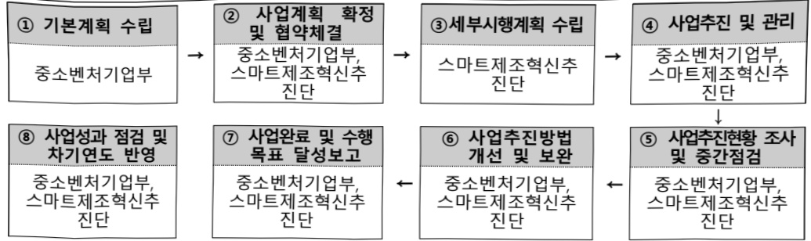

# 데이터 인프라구축(정보화)

**해당 페이지**: PDF 4716 ~ 4722 쪽 해당

**부처**: 중소벤처기업부
**분야**: 산업·중소기업 및 에너지
**회계유형**: 일반회계
**2026 확정예산**: 5922.0 백만원
**전년대비 증감률**: 1.5%
**AI 도메인**: 데이터, 디지털전환(AX)

---

<table border=1 style='margin: auto; word-wrap: break-word;'><tr><td style='text-align: center; word-wrap: break-word;'>사 업 명</td></tr><tr><td style='text-align: center; word-wrap: break-word;'>(6) 데이터 인프라구축(정보화) (2111-305)</td></tr></table>

## 사업 코드 정보

<table border=1 style='margin: auto; word-wrap: break-word;'><tr><td style='text-align: center; word-wrap: break-word;'>구분</td><td style='text-align: center; word-wrap: break-word;'>회계</td><td style='text-align: center; word-wrap: break-word;'>소관</td><td style='text-align: center; word-wrap: break-word;'>실국(기관)</td><td style='text-align: center; word-wrap: break-word;'>계정</td><td style='text-align: center; word-wrap: break-word;'>분야</td><td style='text-align: center; word-wrap: break-word;'>부문</td></tr><tr><td style='text-align: center; word-wrap: break-word;'>코드</td><td rowspan="2">일반회계</td><td rowspan="2">중소벤처기업부</td><td rowspan="2">중소기업정책실지역기업정책관</td><td rowspan="2"></td><td style='text-align: center; word-wrap: break-word;'>110</td><td style='text-align: center; word-wrap: break-word;'>119</td></tr><tr><td style='text-align: center; word-wrap: break-word;'>명칭</td><td style='text-align: center; word-wrap: break-word;'>산업·중소기업 및 에너지</td><td style='text-align: center; word-wrap: break-word;'>중소기업 및 소상공인 육성</td></tr></table>

<table border=1 style='margin: auto; word-wrap: break-word;'><tr><td style='text-align: center; word-wrap: break-word;'>구분</td><td style='text-align: center; word-wrap: break-word;'>프로그램</td><td style='text-align: center; word-wrap: break-word;'>단위사업</td><td style='text-align: center; word-wrap: break-word;'>세부사업</td></tr><tr><td style='text-align: center; word-wrap: break-word;'>코드</td><td style='text-align: center; word-wrap: break-word;'>2100</td><td style='text-align: center; word-wrap: break-word;'>2111</td><td style='text-align: center; word-wrap: break-word;'>305</td></tr><tr><td style='text-align: center; word-wrap: break-word;'>명칭</td><td style='text-align: center; word-wrap: break-word;'>중소기업기술개발지원</td><td style='text-align: center; word-wrap: break-word;'>중소기업경쟁력강화</td><td style='text-align: center; word-wrap: break-word;'>데이터 인프라구축(정보화)</td></tr></table>

<table border=1 style='margin: auto; word-wrap: break-word;'><tr><td colspan="6">☐ 사업 성격 (공통요구자료 II-1 작성유의사항 4. 참조, 해당하는 사항에 “○” 표시)</td></tr><tr><td style='text-align: center; word-wrap: break-word;'>신규 계속</td><td style='text-align: center; word-wrap: break-word;'>완료</td><td style='text-align: center; word-wrap: break-word;'>예비타당성 실시여부</td><td style='text-align: center; word-wrap: break-word;'>총사업비 관리대상</td><td style='text-align: center; word-wrap: break-word;'>총액계상 예산사업</td><td style='text-align: center; word-wrap: break-word;'>사업소관 변경정보 2025예산 시 소관</td></tr><tr><td style='text-align: center; word-wrap: break-word;'></td><td style='text-align: center; word-wrap: break-word;'>☐</td><td style='text-align: center; word-wrap: break-word;'></td><td style='text-align: center; word-wrap: break-word;'></td><td style='text-align: center; word-wrap: break-word;'></td><td style='text-align: center; word-wrap: break-word;'></td></tr></table>

□ 사업 지원 형태 및 지원을 (최소한 한 개는 반드시 선택하시오. 해당사항에 0 표시)

<table border=1 style='margin: auto; word-wrap: break-word;'><tr><td style='text-align: center; word-wrap: break-word;'>직접</td><td style='text-align: center; word-wrap: break-word;'>출자</td><td style='text-align: center; word-wrap: break-word;'>출연</td><td style='text-align: center; word-wrap: break-word;'>보조</td><td style='text-align: center; word-wrap: break-word;'>융자</td><td style='text-align: center; word-wrap: break-word;'>국고보조율(%)</td><td style='text-align: center; word-wrap: break-word;'>융자율(%)</td></tr><tr><td style='text-align: center; word-wrap: break-word;'></td><td style='text-align: center; word-wrap: break-word;'></td><td style='text-align: center; word-wrap: break-word;'>○</td><td style='text-align: center; word-wrap: break-word;'></td><td style='text-align: center; word-wrap: break-word;'></td><td style='text-align: center; word-wrap: break-word;'>80~100</td><td style='text-align: center; word-wrap: break-word;'></td></tr></table>

□사업 소관부처 및 시행주체

<table border=1 style='margin: auto; word-wrap: break-word;'><tr><td style='text-align: center; word-wrap: break-word;'>사업명</td><td colspan="2">구분</td></tr><tr><td rowspan="3">데이터 인프라구축 (정보화)</td><td rowspan="2">소관부처</td><td style='text-align: center; word-wrap: break-word;'>중소기업정책실 지역기업정책관</td></tr><tr><td style='text-align: center; word-wrap: break-word;'>제조혁신과</td></tr><tr><td style='text-align: center; word-wrap: break-word;'>사업시행주체</td><td style='text-align: center; word-wrap: break-word;'>중소기업기술정보진흥원</td></tr></table>

---

### 가. 예산 총괄표

(단위: 백만원, %)

<table border=1 style='margin: auto; word-wrap: break-word;'><tr><td rowspan="2">사업명</td><td rowspan="2">2024년 결산</td><td colspan="2">2025년 예산</td><td colspan="2">2026년 예산</td><td rowspan="2">중감(B-A)</td><td rowspan="2">(B-A)/A</td></tr><tr><td style='text-align: center; word-wrap: break-word;'>본예산</td><td style='text-align: center; word-wrap: break-word;'>추경(A)</td><td style='text-align: center; word-wrap: break-word;'>요구안</td><td style='text-align: center; word-wrap: break-word;'>본예산(B)</td></tr><tr><td style='text-align: center; word-wrap: break-word;'>데이터인프라 구축(정보화)</td><td style='text-align: center; word-wrap: break-word;'>6,900</td><td style='text-align: center; word-wrap: break-word;'>5,836</td><td style='text-align: center; word-wrap: break-word;'>5,836</td><td style='text-align: center; word-wrap: break-word;'>7,400</td><td style='text-align: center; word-wrap: break-word;'>5,922</td><td style='text-align: center; word-wrap: break-word;'>86</td><td style='text-align: center; word-wrap: break-word;'>1.5</td></tr></table>

□ 기능별(내역사업별) 예산 내역

(단위: 백만원)

<table border=1 style='margin: auto; word-wrap: break-word;'><tr><td rowspan="2"></td><td colspan="5">2024</td><td colspan="5">2025</td><td rowspan="2">2026 倉圧</td></tr><tr><td style='text-align: center; word-wrap: break-word;'>倉圧の (専門)</td><td style='text-align: center; word-wrap: break-word;'>倉圧の 専門</td><td style='text-align: center; word-wrap: break-word;'>倉圧の 専門</td><td style='text-align: center; word-wrap: break-word;'>倉圧の 専門</td><td style='text-align: center; word-wrap: break-word;'>倉圧の 専門</td><td style='text-align: center; word-wrap: break-word;'>倉圧の (専門)</td><td style='text-align: center; word-wrap: break-word;'>倉圧の 専門</td><td style='text-align: center; word-wrap: break-word;'>倉圧の 専門</td><td style='text-align: center; word-wrap: break-word;'>倉圧の 専門</td><td style='text-align: center; word-wrap: break-word;'>倉圧の 専門</td></tr><tr><td style='text-align: center; word-wrap: break-word;'>○ 기능별 분류(합계)</td><td style='text-align: center; word-wrap: break-word;'>6,900</td><td style='text-align: center; word-wrap: break-word;'>6,900</td><td style='text-align: center; word-wrap: break-word;'>6,900</td><td style='text-align: center; word-wrap: break-word;'>-</td><td style='text-align: center; word-wrap: break-word;'>-</td><td style='text-align: center; word-wrap: break-word;'>5,836</td><td style='text-align: center; word-wrap: break-word;'>5,836</td><td style='text-align: center; word-wrap: break-word;'>5,836</td><td style='text-align: center; word-wrap: break-word;'>-</td><td style='text-align: center; word-wrap: break-word;'>-</td><td style='text-align: center; word-wrap: break-word;'>5,922</td></tr><tr><td style='text-align: center; word-wrap: break-word;'>・ 데이터인프라구축</td><td style='text-align: center; word-wrap: break-word;'>4,000</td><td style='text-align: center; word-wrap: break-word;'>4,000</td><td style='text-align: center; word-wrap: break-word;'>4,000</td><td style='text-align: center; word-wrap: break-word;'>-</td><td style='text-align: center; word-wrap: break-word;'>-</td><td style='text-align: center; word-wrap: break-word;'>3,186</td><td style='text-align: center; word-wrap: break-word;'>3,186</td><td style='text-align: center; word-wrap: break-word;'>3,186</td><td style='text-align: center; word-wrap: break-word;'>-</td><td style='text-align: center; word-wrap: break-word;'>-</td><td style='text-align: center; word-wrap: break-word;'>3,272</td></tr><tr><td style='text-align: center; word-wrap: break-word;'>・ 데이터거래지원</td><td style='text-align: center; word-wrap: break-word;'>2,900</td><td style='text-align: center; word-wrap: break-word;'>2,900</td><td style='text-align: center; word-wrap: break-word;'>2,900</td><td style='text-align: center; word-wrap: break-word;'>-</td><td style='text-align: center; word-wrap: break-word;'>-</td><td style='text-align: center; word-wrap: break-word;'>2,650</td><td style='text-align: center; word-wrap: break-word;'>2,650</td><td style='text-align: center; word-wrap: break-word;'>2,650</td><td style='text-align: center; word-wrap: break-word;'>-</td><td style='text-align: center; word-wrap: break-word;'>-</td><td style='text-align: center; word-wrap: break-word;'>2,650</td></tr></table>

### 나. 사업설명자료

## 1 ) 사업목적·내용

- (데이터인프라 구축사업) 중소 제조기업의 데이터 및 인공지능 활용을 촉진하는

민간 클라우드 기반의 제조분야 디지털전환 종합 플랫폼(제조DTaaS) 구현

- (데이터인프라구축) 중소 제조기업의 AI 분석 기반 제조데이터 활용을 지원하는 인공지능 제조 플랫폼(KAMP)의 운영

- (데이터거래지원) 제조데이터 공유 활성화를 위한 데이터 가공, 구매비용 지원, 제조데이터 거래소 운영 및 민간 주도의 컨설팅 지원

## 2 ) 사업개요

사업근거 및 추진경위

① 법령상 근거 및 조항 적시

---

- 스마트제조혁신촉진법 제12조, 제13조

제12조(제조데이터 활용 지원) ① 중소벤처기업부장관은 중소기업의 제조데이터 활용을 위하여 필요한 시책을 수립·시행할 수 있다.

② 중소벤처기업부장관은 중소기업의 제조데이터 생산·수집, 가공·분석, 공유·유통을 촉진하기 위한 지원사업을 추진할 수 있다.

③ 중소벤저기업부장관은 제2항에 따른 지원사업에 참여하는 대학, 연구기관, 공공기관, 중소기업 등에 대하여 그 비용의 전부 또는 일부를 출연하거나 지원할 수 있다.

④ 제조데이터 활용 지원을 위한 지원기준, 지원방법 등 제2항의 지원사업 추진에 필요한 사항은 대통령령으로 정한다.

제13조(제조데이터 플랫폼 구축·운영) ① 중소벤처기업부장관은 중소기업의 제조데이터 활용 촉진을 위하여 기업, 공공기관 등이 제조데이터 플랫폼을 구축·운영할 수 있도록 지원할 수 있다.

② 중소벤처기업부장관은 제1항에 따른 지원사업에 참여하는 대학, 연구기관, 공공기관, 중소기업 등에 대하여 그 비용의 전부 또는 일부를 출연하거나 지원할 수 있다.

-중소기업기술혁신촉진법 제18

제18조(중소기업 정보화 지원사업) ① 중소벤처기업부장관은 중소기업의 정보화에 필요한 중소기업 정보화의 기반조성과 정보기술의 보급·확산에 관한 지원사업을 추진할 수 있다.

② 중소벤처기업부장관은 제1항에 따른 사업을 효율적으로 추진하기 위하여 필요하다고 인정할 때에는 대학·연구기관·공공기관·민간단체 및 중소기업 등에 사용되는 비용을 출연할 수 있다.

③ 세1항에 따른 중소기업 성보화의 기반조성과 정보기술의 보급·확산 지원사업에 관하여 필요한 사항은 대통령령으로 정한다.

② 추진경위

- 스마트공장 확산 및 고도화 전략 (18.3)

-데이터 산업 활성화 전략 (18.6)

-중소기업 스마트 제조혁신 전략(18.12)

- 플랫폼 경제 추진성과 및 향후 확산 방안 (19.6)

-한국판 뉴딜 (20.5)

- AI·데이터 기반 중소기업 제조혁신 고도화 전략 (20.7)

- (국정과제) 31 중소기업 정책을 민간주도“혁신성장”의 관점에서 재설계('22.5.3)

* '제조 디지털 전환 클라우드 플랫폼(DTaaS)' 구축 및 스마트공장(미래형 선도 스마트공장 등) 추가보급

- '新 디지털 제조혁신 추진전략' 발표('23.9.18)

- '스마트제조 혁신 생태계 고도화 방안' 발표('24.10.2)

- 'AI 기반 스마트제조혁신 3.0 전략' 발표('25.10.24.)

## 주요내용

① 사업규모

- 총사업비(해당되는 경우에만 기재) : 해당없음

- 사업기간 : '20 ~ 계속

---

## -최근 5년 간 투입된 사업비

<table border=1 style='margin: auto; word-wrap: break-word;'><tr><td style='text-align: center; word-wrap: break-word;'>연도</td><td style='text-align: center; word-wrap: break-word;'>2022</td><td style='text-align: center; word-wrap: break-word;'>2023</td><td style='text-align: center; word-wrap: break-word;'>2024</td><td style='text-align: center; word-wrap: break-word;'>2025</td><td style='text-align: center; word-wrap: break-word;'>2026</td></tr><tr><td style='text-align: center; word-wrap: break-word;'>사업비</td><td style='text-align: center; word-wrap: break-word;'>15,425</td><td style='text-align: center; word-wrap: break-word;'>8,500</td><td style='text-align: center; word-wrap: break-word;'>6,900</td><td style='text-align: center; word-wrap: break-word;'>5,836</td><td style='text-align: center; word-wrap: break-word;'>5,922</td></tr></table>

② 사업추진체계

- 사업시행방법 : 출연

- 사업시행주체 : (전문기관) 중소기업기술정보진흥원 부설 스마트제조혁신추진단

-사업 수혜자 : 국내 중소 · 중견기업

- 보조, 융자, 출연, 출자 등의 경우 보조·융자 등 지원 비율 및 법적근거

<table border=1 style='margin: auto; word-wrap: break-word;'><tr><td style='text-align: center; word-wrap: break-word;'>내역사업명</td><td style='text-align: center; word-wrap: break-word;'>구분</td><td style='text-align: center; word-wrap: break-word;'>피보조·피출연 등 기관명</td><td style='text-align: center; word-wrap: break-word;'>지원 금액 (2026예산)</td><td style='text-align: center; word-wrap: break-word;'>지원 비율(%)</td><td style='text-align: center; word-wrap: break-word;'>보조율 법적근거 (해당 조항)</td></tr><tr><td style='text-align: center; word-wrap: break-word;'>데이터 인프라구축</td><td rowspan="2">출연</td><td rowspan="2">기정원</td><td style='text-align: center; word-wrap: break-word;'>3,272</td><td style='text-align: center; word-wrap: break-word;'>100</td><td rowspan="2">스마트제조혁신촉진법 제12조 및 제13조</td></tr><tr><td style='text-align: center; word-wrap: break-word;'>데이터 거래지원</td><td style='text-align: center; word-wrap: break-word;'>2,650</td><td style='text-align: center; word-wrap: break-word;'>80~10</td></tr></table>

## 3 ) 2026년도 예산 산출 근거

□ 데이터 인프라구축 : (2025년) 5,836백만원 → (2026년) 5,922백만원, +86백만원 증액

①데이터인프라구축:(2025년)3,186백만원→(2026년)3,272백만원,+86백만원 증액

- (요구) 중소기업의 AI 분석 기반, 제조데이터 관리·활용 인프라를 지원하고, 플랫폼 개편을 위한 ISP 추진을 위해 예산 증액 요구

- (산출) 제조AI 24 플랫폼 ISP : 1식 x 522백만원 = 522백만원

인프라구축·운영 : 민간클라우드 임차(1,390백만원) + 유지보수(210백만원) = 1,600백만원

생태계조성 : 1식 x 1,150백만원 = 1,150백만원

②데이터거래지원:(2025년)2,650백만원→(2026년)2,650백만원,전년동

- (요구) 제조데이터 거래 활성화를 위한 환경 조성 및 데이터 가공지원, 구매지원, 컨설팅 서비스 제공을 위해 전년과 동일한 예산 요구

- (산술) 세소네이터가공지원 : 25개 x 62.5백만원 x 80% = 1,250백만원

제조데이터거래컨설팅 : 25개 x 10백만원 = 250백만원

제조데이터 거래환경 조성 : 민간클라우드 임차(1,000백만원) + 유지보수(150백만원) = 1,150백만원

---

## 4 ) 사업효과

□ 사업영향, 산출물 성과지표 등

①2022~2026년도 성과계획서 상 성과지표 및 최근 5년간 성과 달성도

<table border=1 style='margin: auto; word-wrap: break-word;'><tr><td style='text-align: center; word-wrap: break-word;'>성과지표</td><td style='text-align: center; word-wrap: break-word;'>구분</td><td style='text-align: center; word-wrap: break-word;'>2022</td><td style='text-align: center; word-wrap: break-word;'>2023</td><td style='text-align: center; word-wrap: break-word;'>2024</td><td style='text-align: center; word-wrap: break-word;'>2025</td><td style='text-align: center; word-wrap: break-word;'>2026</td><td style='text-align: center; word-wrap: break-word;'>2026 목표치산출근거</td><td style='text-align: center; word-wrap: break-word;'>측정산식(또는 측정방법)</td><td style='text-align: center; word-wrap: break-word;'>자료수집방법(또는 자료출처)</td></tr><tr><td rowspan="3">제조데이터인프라 활용률(단위: %)</td><td style='text-align: center; word-wrap: break-word;'>목표</td><td style='text-align: center; word-wrap: break-word;'>80</td><td style='text-align: center; word-wrap: break-word;'>105</td><td style='text-align: center; word-wrap: break-word;'>110</td><td style='text-align: center; word-wrap: break-word;'>115</td><td style='text-align: center; word-wrap: break-word;'>120</td><td rowspan="3">- 플랫폼 서비스개발 및 인프라구축 시점을 고려‘21년부터 실적반영-제조 A 서비스 및 고도화 일정을 고려목표치를 점진적으로 향상</td><td rowspan="3">(중소제조기업이 활용한 서비스 수/구축 서비스 수) x 100</td><td rowspan="3">연차완료 보고서</td></tr><tr><td style='text-align: center; word-wrap: break-word;'>실적</td><td style='text-align: center; word-wrap: break-word;'>100</td><td style='text-align: center; word-wrap: break-word;'>121</td><td style='text-align: center; word-wrap: break-word;'>111</td><td style='text-align: center; word-wrap: break-word;'>115</td><td style='text-align: center; word-wrap: break-word;'>-</td></tr><tr><td style='text-align: center; word-wrap: break-word;'>달성도</td><td style='text-align: center; word-wrap: break-word;'>125</td><td style='text-align: center; word-wrap: break-word;'>116</td><td style='text-align: center; word-wrap: break-word;'>101</td><td style='text-align: center; word-wrap: break-word;'>100</td><td style='text-align: center; word-wrap: break-word;'>-</td></tr></table>

② 성과지표 이외의 연도별 사업추진 경과 및 실적

<table border=1 style='margin: auto; word-wrap: break-word;'><tr><td style='text-align: center; word-wrap: break-word;'>2022</td><td style='text-align: center; word-wrap: break-word;'>○ NFT 블록체인 기반 제조데이터 거래시스템 구축 추진○ 데이터 상품 제작 및 거래과정 실증을 통한 품질 및 가격 가이드라인 도출○ AI 공급기업(227개 기업) Pool 확보 및 AI 솔루션 기술검증 수요기업 100개 선정·지원○ 제조 AI 데이터셋을 활용한 제2회 AI 분석모델 개발 경진대회 개최·운영(&#x27;22.12)○ 스마트공장 제조데이터 및 표준데이터 기반 인공지능 표준모델 26종 추가 구축(&#x27;22.12)</td></tr><tr><td style='text-align: center; word-wrap: break-word;'>2023</td><td style='text-align: center; word-wrap: break-word;'>○ 계속사업 전환에 따른 사업 추진체계 개편 및 신규 운영기관 공모(&#x27;23.1~3)○ 제조데이터 가공·구매 지원사업 추진(&#x27;23.4~&#x27;) 및 제조데이터 거래 시스템 시범 오픈(&#x27;23.5)○ 논코딩형 AI 개발환경 및 인공지능 표준모델(26종), 분석지원도구(3종) 오픈(&#x27;23.8)○ 제조 AI 데이터셋을 활용한 제3회 AI 분석모델 개발 경진대회 개최·운영(&#x27;23.11)</td></tr><tr><td style='text-align: center; word-wrap: break-word;'>2024</td><td style='text-align: center; word-wrap: break-word;'>○ AI 솔루션 실증 지원과제(100개)의 데이터셋 및 설명자료 오픈○ 개발환경 웹메뉴얼, 교육용 동영상 및 우수사례 소개 동영상 각 2종 오픈○ 제조 AI 데이터셋을 활용한 제4회 AI 분석모델 개발 경진대회 개최·운영(&#x27;24.11)</td></tr><tr><td style='text-align: center; word-wrap: break-word;'>2025</td><td style='text-align: center; word-wrap: break-word;'>○ 제조AI 24 플랫폼 PoC를 통해 LLM 기반 지능형 협업 서비스 실증○ 제조데이터 상품가공 26개사, 제조데이터 컨설팅 50개사 선정·지원○ 제조 AI 데이터셋을 활용한 제5회 AI 분석모델 개발 경진대회 개최 예정</td></tr></table>

## ③ 향후(2026년도 이후) 기대효과 : 개조식으로 작성, 건 별로 계량적 수치 제시

- 기존 인프라(KAMP)를 활용하여 중소 제조기업의 디지털 전환을 지원하기 위한

종합 플랫폼(DTaaS)으로 전환 도모

· 개별 스마트공장에 머물러 있는 제조데이터를 활용, AI 분석 등 제조기업의 문제 해결을 지원하는 인프라 제공으로 제조데이터에 대한 낮은 접근성을 제고(제조 AI데이터셋 300개 구축 및 공개)

· 제조데이터 가공·분석·등록·거래 등에 활용할 수 있는 지원 시스템 운영 및 기업 지원 추진('23, 25개사 → '24, 25개사 → '25, 25개사)

·민간 주도의 거래 서비스를 기반으로 제조데이터 판매자·가공자의 수익 창출 및 수요·공급 생태계 조성

---

5) 타당성조사 및 예비타당성조사 시행여부 및 결과 요지 : 해당 없음

6) 총사업비 대상사업 정보 : 해당없음

## 7 ) 사업 집행절차

## -데이터인프라구축

<table border=1 style='margin: auto; word-wrap: break-word;'><tr><td style='text-align: center; word-wrap: break-word;'>부처</td><td style='text-align: center; word-wrap: break-word;'></td><td style='text-align: center; word-wrap: break-word;'>피출연·피보조기관</td><td style='text-align: center; word-wrap: break-word;'></td><td style='text-align: center; word-wrap: break-word;'>사업수행자</td></tr><tr><td style='text-align: center; word-wrap: break-word;'>중소벤처기업부(5,922)</td><td style='text-align: center; word-wrap: break-word;'>=&gt;(5,922)</td><td style='text-align: center; word-wrap: break-word;'>중소기업기술정보진흥원 부설 스마트제조혁신 추진단(300)</td><td style='text-align: center; word-wrap: break-word;'>=&gt;(5,622)</td><td style='text-align: center; word-wrap: break-word;'>선정예정(&#x27;26.4월&#x27;)</td></tr></table>

## 8 ) 각종 평가

1)2022년도 부처 재정사업 자율평가 결과: 보통(84.5)

2) 2023년도 부처 재정사업 자율평가 결과: 보통(84.6)

3) 2024년도 부처 재정사업 자율평가 결과: 보통(89.7)

4)2024년도 중소기업 지원사업 성과평가 : 보통

---

### 다. 최근 4년간 결산내역

## 1 ) 결산표

☐ 부처 결산내역

(단위: 백만원, %)

<table border=1 style='margin: auto; word-wrap: break-word;'><tr><td rowspan="2">闰五</td><td colspan="3">예산액</td><td rowspan="2">예산현액(A)</td><td rowspan="2">집행액(B)</td><td rowspan="2">집행률(B/A)</td><td rowspan="2">다음연도이월액</td><td rowspan="2">불용액</td></tr><tr><td style='text-align: center; word-wrap: break-word;'>본예산</td><td style='text-align: center; word-wrap: break-word;'>추경증감액</td><td style='text-align: center; word-wrap: break-word;'>추경</td></tr><tr><td style='text-align: center; word-wrap: break-word;'>2022</td><td style='text-align: center; word-wrap: break-word;'>15,425</td><td style='text-align: center; word-wrap: break-word;'>-</td><td style='text-align: center; word-wrap: break-word;'>15,425</td><td style='text-align: center; word-wrap: break-word;'>15,425</td><td style='text-align: center; word-wrap: break-word;'>15,425</td><td style='text-align: center; word-wrap: break-word;'>100</td><td style='text-align: center; word-wrap: break-word;'>-</td><td style='text-align: center; word-wrap: break-word;'>-</td></tr><tr><td style='text-align: center; word-wrap: break-word;'>2023</td><td style='text-align: center; word-wrap: break-word;'>8,500</td><td style='text-align: center; word-wrap: break-word;'>-</td><td style='text-align: center; word-wrap: break-word;'>8,500</td><td style='text-align: center; word-wrap: break-word;'>8,500</td><td style='text-align: center; word-wrap: break-word;'>8,500</td><td style='text-align: center; word-wrap: break-word;'>100</td><td style='text-align: center; word-wrap: break-word;'>-</td><td style='text-align: center; word-wrap: break-word;'>-</td></tr><tr><td style='text-align: center; word-wrap: break-word;'>2024</td><td style='text-align: center; word-wrap: break-word;'>6,900</td><td style='text-align: center; word-wrap: break-word;'>-</td><td style='text-align: center; word-wrap: break-word;'>6,900</td><td style='text-align: center; word-wrap: break-word;'>6,900</td><td style='text-align: center; word-wrap: break-word;'>6,562</td><td style='text-align: center; word-wrap: break-word;'>100</td><td style='text-align: center; word-wrap: break-word;'>-</td><td style='text-align: center; word-wrap: break-word;'>-</td></tr><tr><td style='text-align: center; word-wrap: break-word;'>2025</td><td style='text-align: center; word-wrap: break-word;'>5,836</td><td style='text-align: center; word-wrap: break-word;'>-</td><td style='text-align: center; word-wrap: break-word;'>5,836</td><td style='text-align: center; word-wrap: break-word;'>5,836</td><td style='text-align: center; word-wrap: break-word;'>5,836</td><td style='text-align: center; word-wrap: break-word;'>100</td><td style='text-align: center; word-wrap: break-word;'>-</td><td style='text-align: center; word-wrap: break-word;'>-</td></tr></table>

## 2 ) 주요 결산사항

□ 2022~2025년 결산 주요사항

<table border=1 style='margin: auto; word-wrap: break-word;'><tr><td style='text-align: center; word-wrap: break-word;'>2022</td><td style='text-align: center; word-wrap: break-word;'>○ 해당 없음</td></tr><tr><td style='text-align: center; word-wrap: break-word;'>2023</td><td style='text-align: center; word-wrap: break-word;'>○ 해당 없음</td></tr><tr><td style='text-align: center; word-wrap: break-word;'>2024</td><td style='text-align: center; word-wrap: break-word;'>○ 해당 없음</td></tr><tr><td style='text-align: center; word-wrap: break-word;'>2025</td><td style='text-align: center; word-wrap: break-word;'>○ (예결위) 데이터셋 등록·이용·거래 부진 개선 필요
- 데이터셋 수집·가공에 만전을 기하는 한편, 무료로 이용 가능한 제조 데이터셋을 확충하여 중소기업의 제조 AI 도입에 적극적으로 노력</td></tr></table>

□ 2025년 이·전용 등 세부내역 : 해당 없음

---

### 원본 PDF 크롭 이미지

