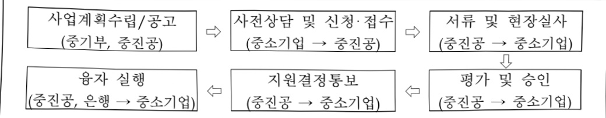

# 신성장기반자금(융자)

**해당 페이지**: PDF 4732 ~ 4738 쪽 해당

**부처**: 중소벤처기업부
**분야**: 산업·중소기업 및 에너지
**회계유형**: 기금
**2026 확정예산**: 1081110.0 백만원
**전년대비 증감률**: -17.5%
**AI 도메인**: 에너지

---

<table border=1 style='margin: auto; word-wrap: break-word;'><tr><td style='text-align: center; word-wrap: break-word;'>사 업 명</td></tr><tr><td style='text-align: center; word-wrap: break-word;'>(2) 신성장기반자금(융자) (1261-301)</td></tr></table>

□ 사업 코드 정보

<table border=1 style='margin: auto; word-wrap: break-word;'><tr><td style='text-align: center; word-wrap: break-word;'>구분</td><td style='text-align: center; word-wrap: break-word;'>기금</td><td style='text-align: center; word-wrap: break-word;'>소관</td><td style='text-align: center; word-wrap: break-word;'>실국(기관)</td><td style='text-align: center; word-wrap: break-word;'>계정</td><td style='text-align: center; word-wrap: break-word;'>분야</td><td style='text-align: center; word-wrap: break-word;'>부문</td></tr><tr><td style='text-align: center; word-wrap: break-word;'>코드</td><td rowspan="2">중소벤처기업창업 및 진흥기금</td><td rowspan="2">중소벤처기업부</td><td rowspan="2">중소기업정책실글로벌성장정책관</td><td rowspan="2"></td><td style='text-align: center; word-wrap: break-word;'>110</td><td style='text-align: center; word-wrap: break-word;'>119</td></tr><tr><td style='text-align: center; word-wrap: break-word;'>명칭</td><td style='text-align: center; word-wrap: break-word;'>산업·중소기업 및 에너지</td><td style='text-align: center; word-wrap: break-word;'>중소기업 및 소상공인육성</td></tr></table>

<table border=1 style='margin: auto; word-wrap: break-word;'><tr><td style='text-align: center; word-wrap: break-word;'>구분</td><td style='text-align: center; word-wrap: break-word;'>프로그램</td><td style='text-align: center; word-wrap: break-word;'>단위사업</td><td style='text-align: center; word-wrap: break-word;'>세부사업</td></tr><tr><td style='text-align: center; word-wrap: break-word;'>코드</td><td style='text-align: center; word-wrap: break-word;'>1200</td><td style='text-align: center; word-wrap: break-word;'>1261</td><td style='text-align: center; word-wrap: break-word;'>301</td></tr><tr><td style='text-align: center; word-wrap: break-word;'>명칭</td><td style='text-align: center; word-wrap: break-word;'>중소기업성장안정지원</td><td style='text-align: center; word-wrap: break-word;'>성장안정자금(기금)</td><td style='text-align: center; word-wrap: break-word;'>신성장기반자금(융자)</td></tr></table>

□ 사업 성격 (공통요구자료 II-1 작성유의사항 4. 참조, 해당하는 사항에 “○” 표시)

<table border=1 style='margin: auto; word-wrap: break-word;'><tr><td rowspan="2">신규</td><td rowspan="2">계속</td><td rowspan="2">완료</td><td rowspan="2">예비타당성실시여부</td><td rowspan="2">총사업비관리대상</td><td rowspan="2">총액계상예산사업</td><td style='text-align: center; word-wrap: break-word;'>사업소관 변경정보</td></tr><tr><td style='text-align: center; word-wrap: break-word;'>2025예산 시 소관</td></tr><tr><td style='text-align: center; word-wrap: break-word;'></td><td style='text-align: center; word-wrap: break-word;'>○</td><td style='text-align: center; word-wrap: break-word;'></td><td style='text-align: center; word-wrap: break-word;'></td><td style='text-align: center; word-wrap: break-word;'></td><td style='text-align: center; word-wrap: break-word;'></td><td style='text-align: center; word-wrap: break-word;'></td></tr></table>

사업지원형태 및 지원을(최소한 한 개는 반드시 선택하시오. 해당사항에 O 표시)

<table border=1 style='margin: auto; word-wrap: break-word;'><tr><td style='text-align: center; word-wrap: break-word;'>직접</td><td style='text-align: center; word-wrap: break-word;'>출자</td><td style='text-align: center; word-wrap: break-word;'>출연</td><td style='text-align: center; word-wrap: break-word;'>보조</td><td style='text-align: center; word-wrap: break-word;'>융자</td><td style='text-align: center; word-wrap: break-word;'>국고보조율(%)</td><td style='text-align: center; word-wrap: break-word;'>융자율(%)</td></tr><tr><td style='text-align: center; word-wrap: break-word;'></td><td style='text-align: center; word-wrap: break-word;'></td><td style='text-align: center; word-wrap: break-word;'></td><td style='text-align: center; word-wrap: break-word;'></td><td style='text-align: center; word-wrap: break-word;'>○</td><td style='text-align: center; word-wrap: break-word;'></td><td style='text-align: center; word-wrap: break-word;'></td></tr></table>

□사업 소관부처 및 시행주체

<table border=1 style='margin: auto; word-wrap: break-word;'><tr><td style='text-align: center; word-wrap: break-word;'>사업명</td><td colspan="2">구분</td></tr><tr><td rowspan="2">신성장 기반자금 (융자)</td><td style='text-align: center; word-wrap: break-word;'>소관부처</td><td style='text-align: center; word-wrap: break-word;'>중소기업정책실 글로벌성장정책관 기업금융과</td></tr><tr><td style='text-align: center; word-wrap: break-word;'>사업시행주체</td><td style='text-align: center; word-wrap: break-word;'>중소벤처기업진흥공단</td></tr></table>

---

### 가.지출계획 총괄표

(단위: 백만원, %)

<table border=1 style='margin: auto; word-wrap: break-word;'><tr><td rowspan="2">사업명</td><td rowspan="2">2024년 결산</td><td colspan="2">2025년 예산</td><td colspan="2">2026년 예산</td><td rowspan="2">증감 (B-A)</td><td rowspan="2">(B-A)/A</td></tr><tr><td style='text-align: center; word-wrap: break-word;'>본예산</td><td style='text-align: center; word-wrap: break-word;'>추경(A)</td><td style='text-align: center; word-wrap: break-word;'>요구안</td><td style='text-align: center; word-wrap: break-word;'>본예산(B)</td></tr><tr><td style='text-align: center; word-wrap: break-word;'>신성장기반자금 (용자)</td><td style='text-align: center; word-wrap: break-word;'>1,508,327</td><td style='text-align: center; word-wrap: break-word;'>1,311,110</td><td style='text-align: center; word-wrap: break-word;'>1,311,110</td><td style='text-align: center; word-wrap: break-word;'>1,111,110</td><td style='text-align: center; word-wrap: break-word;'>1,081,110</td><td style='text-align: center; word-wrap: break-word;'>△230,000</td><td style='text-align: center; word-wrap: break-word;'>△17.5</td></tr></table>

□ 기능별(내역사업별) 계획 내역

(단위:백만원)

<table border=1 style='margin: auto; word-wrap: break-word;'><tr><td rowspan="2"></td><td colspan="5">2024</td><td colspan="5">2025</td><td rowspan="2">2026 계획</td></tr><tr><td style='text-align: center; word-wrap: break-word;'>계획액(추경)</td><td style='text-align: center; word-wrap: break-word;'>계획현액</td><td style='text-align: center; word-wrap: break-word;'>집행액</td><td style='text-align: center; word-wrap: break-word;'>이월액</td><td style='text-align: center; word-wrap: break-word;'>불용액</td><td style='text-align: center; word-wrap: break-word;'>계획액(추경)</td><td style='text-align: center; word-wrap: break-word;'>계획현액</td><td style='text-align: center; word-wrap: break-word;'>집행액</td><td style='text-align: center; word-wrap: break-word;'>이월액</td><td style='text-align: center; word-wrap: break-word;'>불용액</td></tr><tr><td style='text-align: center; word-wrap: break-word;'>○ 기능별 분류(합계)</td><td style='text-align: center; word-wrap: break-word;'>1,478,944</td><td style='text-align: center; word-wrap: break-word;'>1,508,944</td><td style='text-align: center; word-wrap: break-word;'>1,508,327[15,08,327]</td><td style='text-align: center; word-wrap: break-word;'>-</td><td style='text-align: center; word-wrap: break-word;'>617</td><td style='text-align: center; word-wrap: break-word;'>1,311,110</td><td style='text-align: center; word-wrap: break-word;'>1,311,110</td><td style='text-align: center; word-wrap: break-word;'>1,311,110[1,311,110]</td><td style='text-align: center; word-wrap: break-word;'>-</td><td style='text-align: center; word-wrap: break-word;'>-</td><td style='text-align: center; word-wrap: break-word;'>1,081,110</td></tr><tr><td style='text-align: center; word-wrap: break-word;'>• 혁신성장지원</td><td style='text-align: center; word-wrap: break-word;'>806,050</td><td style='text-align: center; word-wrap: break-word;'>836,050</td><td style='text-align: center; word-wrap: break-word;'>835,692[835,692]</td><td style='text-align: center; word-wrap: break-word;'>-</td><td style='text-align: center; word-wrap: break-word;'>357</td><td style='text-align: center; word-wrap: break-word;'>690,750</td><td style='text-align: center; word-wrap: break-word;'>690,750</td><td style='text-align: center; word-wrap: break-word;'>690,750[690,750]</td><td style='text-align: center; word-wrap: break-word;'>-</td><td style='text-align: center; word-wrap: break-word;'>-</td><td style='text-align: center; word-wrap: break-word;'>510,750</td></tr><tr><td style='text-align: center; word-wrap: break-word;'>• 제조현장스마트화</td><td style='text-align: center; word-wrap: break-word;'>476,220</td><td style='text-align: center; word-wrap: break-word;'>476,220</td><td style='text-align: center; word-wrap: break-word;'>476,041[476,041]</td><td style='text-align: center; word-wrap: break-word;'>-</td><td style='text-align: center; word-wrap: break-word;'>179</td><td style='text-align: center; word-wrap: break-word;'>466,610</td><td style='text-align: center; word-wrap: break-word;'>466,610</td><td style='text-align: center; word-wrap: break-word;'>466,610[466,610]</td><td style='text-align: center; word-wrap: break-word;'>-</td><td style='text-align: center; word-wrap: break-word;'>-</td><td style='text-align: center; word-wrap: break-word;'>416,610</td></tr><tr><td style='text-align: center; word-wrap: break-word;'>• Net-Zero 유망기업</td><td style='text-align: center; word-wrap: break-word;'>96,674</td><td style='text-align: center; word-wrap: break-word;'>96,674</td><td style='text-align: center; word-wrap: break-word;'>96,593[96,593]</td><td style='text-align: center; word-wrap: break-word;'>-</td><td style='text-align: center; word-wrap: break-word;'>81</td><td style='text-align: center; word-wrap: break-word;'>93,750</td><td style='text-align: center; word-wrap: break-word;'>93,750</td><td style='text-align: center; word-wrap: break-word;'>93,750[93,750]</td><td style='text-align: center; word-wrap: break-word;'>-</td><td style='text-align: center; word-wrap: break-word;'>-</td><td style='text-align: center; word-wrap: break-word;'>93,750</td></tr><tr><td style='text-align: center; word-wrap: break-word;'>• 스케일업금융</td><td style='text-align: center; word-wrap: break-word;'>100,000</td><td style='text-align: center; word-wrap: break-word;'>100,000</td><td style='text-align: center; word-wrap: break-word;'>100,000[100,000]</td><td style='text-align: center; word-wrap: break-word;'>-</td><td style='text-align: center; word-wrap: break-word;'>-</td><td style='text-align: center; word-wrap: break-word;'>60,000</td><td style='text-align: center; word-wrap: break-word;'>60,000</td><td style='text-align: center; word-wrap: break-word;'>60,000[60,000]</td><td style='text-align: center; word-wrap: break-word;'>-</td><td style='text-align: center; word-wrap: break-word;'>-</td><td style='text-align: center; word-wrap: break-word;'>60,000</td></tr></table>

### 나.사업설명자료

## 1 ) 사업목적·내용

- (혁신성장지원) 사업성과 기술성이 우수한 성장유망 중소기업의 생산성향상, 고부가 가치화 등 경쟁력 강화에 필요한 자금을 지원하여 성장 동력 창출

- (제조현장스마트화) 4차 산업혁명을 대비하여 중소기업의 제조현장 스마트화 및 생산 공정 혁신을 지원함으로써 기업경쟁력 제고 및 산업 고도화 촉진

- (Net-Zero 유망기업) 중소기업 그린기술 사업화 및 친환경 제조 전환을 촉진하여 그린경제 기반 구축 및 탄소중립 산업 생태계 조성

- (스케일업 금융) 혁신성장 가능한 중기업의 대규모 자금조달 애로를 해소하여 스케일업을 지원(P-CBO방식)함으로써 중견기업으로 도약을 지원

---

## 2 ) 사업개요

☐ 사업근거 및 추진경위

① 법령상 근거 및 조항 적시 : 중소기업진흥에 관한 법률 제66조, 제67조, 제74조

## 중소기업진흥에 관한 법률 제66조, 제67조, 제74조

제66조(기금의 운용과 관리) ⑤ 기금관리자는 제66조의 2에 따른 기금운용계획에 따라 기금을 대출 등의 방법으로 운용할 수 있다.

제67조(기금의 사용 등) ① 기금은 다음 각 호의 사업을 위하여 사용할 수 있다.

6.중소기업·벤처기업에 대한 자동화의 지원

12.중소기업·벤처기업에 대한 협동화사업의 지원

13.중소기업·벤처기업에 대한 협업사업의 지원

17.중소기업·벤처기업에 대한 경영 정상화의 지원

18.중소기업·벤처기업의 주식 및 사채의 인수

제74조(사업) ① 중소벤처기업진흥공단은 중소기업에 관한 다음 각 호의 사업을 실시하거나 그에 관한 사업을 지원할 수 있다.

1.자동화의 지원

7. 협동화사업의 추진과 협동화사업을 위한 토지·건물 및 시설 등의 취득, 단지의 조성 또는 공동시설의 설치와 그 대여 및 양도

8.협업사업의 지원

12.환경오염을 줄이기 위한 지원

16.경영 정상화의 지원

17.중소기업·벤처기업의 주식 또는 사채의 인수

② 추진경위

- 1979 일본 구조고도화사업을 도입하여 국내 실정에 맞게 협동화사업 시작

-1993.5 '신경제 100일 계획'에 의거 중소기업 구조개선사업 추진

-2005.7 중소기업 정책자금 개편방안(6.23대책)

-2007.1 구조개선자금과 협동화자금을 경영혁신자금 및 기업간협력자금으로 개편

- 2008. 5 중소기업 지원체계 효율화(국정과제)의 일환으로 '09년부터 경영혁신자금 및 기업간협력자금, 산업기반자금을 신성장기반지원으로 통합

-2010.1 농공단지입주기업지원자금을 신성장기반지원으로 통합

-2014.1 기술사업성우수기업전용자금 신규 지원

-2017.1 육복합사업을 신성장유망자금에 통합 운영, 기초제조기업성장자금 폐지

-2018.1 제조현장스마트화자금 신설

- 2019. 1 기술사업성우수기업전용자금 폐지

-2021.1 Net-Zero 유망기업 자금 신설

-2023.1 신성장기반지원자금 내 스케일업자금 이관 및 이차보전 사업 방식 신설

- 2023. 1 성장공유형 대출방식 추가(혁신성장지원)

-2025.1 신성장기반지원자금 내 이차보전 사업을 정책자금지원성과향상으로 이관

---

## □ 주요내용

① 사업규모

- 총사업비 : 해당사항 없음

- 사업기간 : '79년 ~ 계속

- 최근 5년 간 투입된 사업비

<table border=1 style='margin: auto; word-wrap: break-word;'><tr><td style='text-align: center; word-wrap: break-word;'>$ \underline{\text{연도}} $</td><td style='text-align: center; word-wrap: break-word;'>2022</td><td style='text-align: center; word-wrap: break-word;'>2023</td><td style='text-align: center; word-wrap: break-word;'>2024</td><td style='text-align: center; word-wrap: break-word;'>2025</td><td style='text-align: center; word-wrap: break-word;'>2026</td></tr><tr><td style='text-align: center; word-wrap: break-word;'>$ \underline{\text{사업비}} $</td><td style='text-align: center; word-wrap: break-word;'>1,710,000</td><td style='text-align: center; word-wrap: break-word;'>1,293,100</td><td style='text-align: center; word-wrap: break-word;'>1,508,944</td><td style='text-align: center; word-wrap: break-word;'>1,311,110</td><td style='text-align: center; word-wrap: break-word;'>1,081,110</td></tr></table>

- 기타: 해당사항 없음

② 사업추진체계

- 사업시행방법 : 융자

- 사업시행주체 : 중소벤처기업진흥공단

- 사업 수혜자 : 중소기업

- 보조, 융자, 출연, 출자 등의 경우 보조 · 융자 등 지원 비율 및 법적근거

<table border=1 style='margin: auto; word-wrap: break-word;'><tr><td style='text-align: center; word-wrap: break-word;'>내역사업명</td><td style='text-align: center; word-wrap: break-word;'>구분</td><td style='text-align: center; word-wrap: break-word;'>피보조·피출연 등 기관명</td><td style='text-align: center; word-wrap: break-word;'>지원 금액 (2026계획)</td><td style='text-align: center; word-wrap: break-word;'>지원 비율(%)</td><td style='text-align: center; word-wrap: break-word;'>보조율 법적근거 (해당 조항)</td></tr><tr><td style='text-align: center; word-wrap: break-word;'>혁신성장 지원</td><td style='text-align: center; word-wrap: break-word;'>융자</td><td style='text-align: center; word-wrap: break-word;'>중소기업</td><td style='text-align: center; word-wrap: break-word;'>5,108억원</td><td style='text-align: center; word-wrap: break-word;'>정책자금 기준금리 + 0.5%</td><td style='text-align: center; word-wrap: break-word;'>중소기업진흥에 관한 법률 제66조</td></tr><tr><td style='text-align: center; word-wrap: break-word;'>제조현장 스마트화</td><td style='text-align: center; word-wrap: break-word;'>융자</td><td style='text-align: center; word-wrap: break-word;'>중소기업</td><td style='text-align: center; word-wrap: break-word;'>4,166억원</td><td style='text-align: center; word-wrap: break-word;'>정책자금 기준금리</td><td style='text-align: center; word-wrap: break-word;'>중소기업진흥에 관한 법률 제66조</td></tr><tr><td style='text-align: center; word-wrap: break-word;'>Net-Zero 유망기업</td><td style='text-align: center; word-wrap: break-word;'>융자</td><td style='text-align: center; word-wrap: break-word;'>중소기업</td><td style='text-align: center; word-wrap: break-word;'>938억원</td><td style='text-align: center; word-wrap: break-word;'>정책자금 기준금리 + 0.5%</td><td style='text-align: center; word-wrap: break-word;'>중소기업진흥에 관한 법률 제66조</td></tr><tr><td style='text-align: center; word-wrap: break-word;'>스케일업 금융</td><td style='text-align: center; word-wrap: break-word;'>융자</td><td style='text-align: center; word-wrap: break-word;'>중기업</td><td style='text-align: center; word-wrap: break-word;'>600억원</td><td style='text-align: center; word-wrap: break-word;'>신용평가등급별 및 발행증권별 차등</td><td style='text-align: center; word-wrap: break-word;'>중소기업진흥에 관한 법률 제66조</td></tr></table>

## 3 ) 2026년도 계획 산출 근거

□ 신성장기반자금(융자): (2025 당초계획) 1,311,110백만원 → (2026 계획) 1,081,110백만원, 230,000백만원 감액

① 혁신성장지원 : (2025 당초계획) 690,750백만원 → (2026 계획) 510,750백만원, 180,000백만원 감액

- (내용) AI·반도체 등 첨단산업분야 및 신기술에 대한 인프라 구축 지원으로 첨단기술 경쟁 및 통상환경 불확실성에 대응한 중소기업 산업경쟁력 강화를 위해 5,108억원 지원

② 제조현장스마트화 : (2025 당초계획) 466,610백만원 → (2026 계획) 416,610백만원, 50,000백만원 감액

- (내용) 중소기업의 AI-디지털전환, 제조현장 스마트화를 통한 생산공정 혁신 지원으로 기업경쟁력

제고 및 산업고도화 촉진을 위한 4,166억원 지원

③ Net-Zero 유망기업 : (2025 당초계획) 93,750백만원 → (2026 계획) 93,750백만원 전년동

- (내용) 저탄소화 촉진, 탄소시장 접근성 제고 등 중소기업의 친환경 제조전환에 필요한 설비투자

지원을 위해 938억원 지원

④ 스케일업금융 : (2025 당초계획) 60,000백만원 → (2026 계획) 60,000백만원, 전년동

- (내용) 회사채 발행을 통한 대규모 자금조달 지원으로 유망기업의 스케일업 및 중견기업으로 성

장촉진을 위해 600억원 지원

---

## 4 ) 사업효과

☐ 사업영향,산출물 성과지표 등

①2022~2026년도 성과계획서 상 성과지표 및 최근 5년간 성과 달성도

<table border=1 style='margin: auto; word-wrap: break-word;'><tr><td style='text-align: center; word-wrap: break-word;'>성과지표</td><td style='text-align: center; word-wrap: break-word;'>구분</td><td style='text-align: center; word-wrap: break-word;'>2022</td><td style='text-align: center; word-wrap: break-word;'>2023</td><td style='text-align: center; word-wrap: break-word;'>2024</td><td style='text-align: center; word-wrap: break-word;'>2025</td><td style='text-align: center; word-wrap: break-word;'>2026</td><td style='text-align: center; word-wrap: break-word;'>2026 목표치산출근거</td><td style='text-align: center; word-wrap: break-word;'>측정산식(또는 측정방법)</td><td style='text-align: center; word-wrap: break-word;'>자료수집방법(또는 자료출처)</td></tr><tr><td rowspan="3">자금공급 수혜중소기업매출액 중가율(단위: %)</td><td style='text-align: center; word-wrap: break-word;'>목표</td><td style='text-align: center; word-wrap: break-word;'>8.13</td><td style='text-align: center; word-wrap: break-word;'>8.54</td><td style='text-align: center; word-wrap: break-word;'>8.97</td><td style='text-align: center; word-wrap: break-word;'>10.54</td><td style='text-align: center; word-wrap: break-word;'>11.07</td><td rowspan="3">최근 3개년 지원기업의 매출액 증가율(%) 평균액도전적 목표를 위해 10% 추가 상향한 값을 ‘24년 목표치로 산정, 매년 5% 향상</td><td rowspan="3">[(∑ 정책자금 수혜기업 지원논도 매출액 - ∑ 동일기업 지원전년도 매출액) / ∑ 동일기업 지원 전년도 매출액] × 100</td><td rowspan="3">수혜기업 전수조사(중진공DB)</td></tr><tr><td style='text-align: center; word-wrap: break-word;'>실적</td><td style='text-align: center; word-wrap: break-word;'>8.28</td><td style='text-align: center; word-wrap: break-word;'>10.74</td><td style='text-align: center; word-wrap: break-word;'>10.83</td><td style='text-align: center; word-wrap: break-word;'>-</td><td style='text-align: center; word-wrap: break-word;'>-</td></tr><tr><td style='text-align: center; word-wrap: break-word;'>달성도</td><td style='text-align: center; word-wrap: break-word;'>101.8</td><td style='text-align: center; word-wrap: break-word;'>125.8</td><td style='text-align: center; word-wrap: break-word;'>120.7</td><td style='text-align: center; word-wrap: break-word;'>-</td><td style='text-align: center; word-wrap: break-word;'>-</td></tr></table>

② 성과지표 이외의 연도별 사업추진 경과 및 실적

<table border=1 style='margin: auto; word-wrap: break-word;'><tr><td style='text-align: center; word-wrap: break-word;'>2022</td><td style='text-align: center; word-wrap: break-word;'>- 2,127개 업체 / 1,710,000백만원 지원</td></tr><tr><td style='text-align: center; word-wrap: break-word;'>2023</td><td style='text-align: center; word-wrap: break-word;'>- 3,849개 업체 / 1,292,029백만원 지원</td></tr><tr><td style='text-align: center; word-wrap: break-word;'>2024</td><td style='text-align: center; word-wrap: break-word;'>- 4,204개 업체(이차보전 2,156개사 포함) / 1,508,327백만원 지원</td></tr><tr><td style='text-align: center; word-wrap: break-word;'>2025</td><td style='text-align: center; word-wrap: break-word;'>- 2,496개 업체 / 1,311,110백만원 지원</td></tr></table>

③향후(2026년도 이후)기대효과

- AI, 반도체, 이차전지 등 첨단전략분야 및 신기술 중심 설비투자 촉진 지원을 통해 중소기업의 미래 성장동력 창출과 산업경쟁력 강화를 촉진

- 인공지능전환·디지털전환(AX·DX) 등 산업환경 변화에 대응하고, ESG·탄소중립경영을 위한 친환경 제조에 필요한 설비투자 지원

- 민간자금과 연계하여 자체 신용으로 회사채 발행이 어려운 유망기업의 스케일업

(Scale-Up)을 통해 중견기업, 글로벌·초격차 기업으로의 성장 지원

5) 타당성조사 및 예비타당성조사 시행여부 및 결과 요지: 해당없음

6) 총사업비 대상사업 여부 및 내역: 해당없음

7) 사업 집행절차

---

## 8 ) 각종 평가

<table border=1 style='margin: auto; word-wrap: break-word;'><tr><td style='text-align: center; word-wrap: break-word;'>1) 국회(예결위, 상임위, 예정처, 국정감사 포함) 지적○ ‘23년도 국정감사 지적사항 (‘23.10월) - 이차보전을 통해 취약 중소기업 지원이 축소될 우려가 있으므로, 정책자금 목적을 감안 직접융자 확대를 위해 노력할 것○ ‘24년도 예결위 예산안 검토보고서’(‘23.11월) - 스케일업금융 후순위 채권 발행비중 인하 및 중점지원 분야에 대한 지원 강화 필요○ ‘25년도 산중위 예산안 검토보고서’(‘24.11월) - 스케일업금융 신규채권 발행 지원이 상반기 이루어질 수 있도록 노력 필요2) 대외공개 평가- 중소기업 지원사업 성과평가 (우수, ‘25.6월)3) 자체평가: 해당없음4) 문제점 지적에 대한 후속조치○ 정책자금 본연의 목적을 달성할 수 있도록 직접융자 확대 노력 중- 중소기업 금융부담 완화를 위해 이차보전 지원 중으로, 민간금융 활용이 가능한 기업은 이차보전 방식으로 지원하고, 기술사업이 우수한 창업기업, 재도약기 기업, 저신용·담보부족 등으로 민간금융 활용에 애로가 있는 기업은 직접융자 중심으로 지원하고 있음- 취약 중소기업 지원이라는 정책자금 본연의 목적을 달성할 수 있도록 앞으로도 직접융자 확대를 위해 노력하겠음○ 스케일업금융 후순위채권 발행비중 인하 및 중점지원 분야에 대한 지원 강화 추진 중- 최근의 후순위증권 비중 상승은 중소기업 상환부담 완화를 위한 차환 발행(2년), 회사채 만기 확대(3→5년) 등 정책목적에 따라 다소 불가피한 측면이 있음- 후순위증권 인수분담 구조 및 민간의 선별역량을 활용한 기업선정 등을 통해 적정 후순위채권 발행비중을 유지할 수 있도록 노력하겠음- 중점지원분야(혁신성장 분야)에 대한 지원 비중은 꾸준히 증가해왔고, ‘23년부터 62%를 상회 * 혁신성장 분야 지원 비중(%) : (‘21) 50.0 → (‘22) 50.5 → (‘23) 60.6 → (‘24) 60.7 → (‘25) 62.5○ 스케일업금융 상반기 신규채권 발행 지원 추진 노력을 통해 집행완료- 당초 기대한 사업효과를 적기에 달성하기 위해 상반기 신규채권 발행을 추진하는 등 사업관리를 철저히 하여 ‘25.6월 전액 집행완료</td></tr></table>

---

### 다.최근 4년간 결산내역

## 1 ) 결산표

☐ 부처 결산내역

(단위: 백만원, %)

<table border=1 style='margin: auto; word-wrap: break-word;'><tr><td rowspan="2">연도</td><td colspan="3">계획액</td><td rowspan="2">계획현액(A)</td><td rowspan="2">집행액(B)</td><td rowspan="2">집행률(B/A)</td><td rowspan="2">다음연도이월액</td><td rowspan="2">불용액</td></tr><tr><td style='text-align: center; word-wrap: break-word;'>분예산</td><td style='text-align: center; word-wrap: break-word;'>추경중감액</td><td style='text-align: center; word-wrap: break-word;'>추경</td></tr><tr><td style='text-align: center; word-wrap: break-word;'>2022</td><td style='text-align: center; word-wrap: break-word;'>1,620,000</td><td style='text-align: center; word-wrap: break-word;'>90,000</td><td style='text-align: center; word-wrap: break-word;'>1,710,000</td><td style='text-align: center; word-wrap: break-word;'>1,710,000</td><td style='text-align: center; word-wrap: break-word;'>1,710,000</td><td style='text-align: center; word-wrap: break-word;'>100.0</td><td style='text-align: center; word-wrap: break-word;'>-</td><td style='text-align: center; word-wrap: break-word;'>-</td></tr><tr><td style='text-align: center; word-wrap: break-word;'>2023</td><td style='text-align: center; word-wrap: break-word;'>1,193,100</td><td style='text-align: center; word-wrap: break-word;'>100,000</td><td style='text-align: center; word-wrap: break-word;'>1,293,100</td><td style='text-align: center; word-wrap: break-word;'>1,293,100</td><td style='text-align: center; word-wrap: break-word;'>1,292,029</td><td style='text-align: center; word-wrap: break-word;'>99.9</td><td style='text-align: center; word-wrap: break-word;'>-</td><td style='text-align: center; word-wrap: break-word;'>1,071</td></tr><tr><td style='text-align: center; word-wrap: break-word;'>2024</td><td style='text-align: center; word-wrap: break-word;'>1,478,944</td><td style='text-align: center; word-wrap: break-word;'>30,000</td><td style='text-align: center; word-wrap: break-word;'>1,508,944</td><td style='text-align: center; word-wrap: break-word;'>1,508,944</td><td style='text-align: center; word-wrap: break-word;'>1,508,327</td><td style='text-align: center; word-wrap: break-word;'>99.9</td><td style='text-align: center; word-wrap: break-word;'>-</td><td style='text-align: center; word-wrap: break-word;'>617</td></tr><tr><td style='text-align: center; word-wrap: break-word;'>2025</td><td style='text-align: center; word-wrap: break-word;'>1,311,110</td><td style='text-align: center; word-wrap: break-word;'>-</td><td style='text-align: center; word-wrap: break-word;'>1,311,110</td><td style='text-align: center; word-wrap: break-word;'>1,311,110</td><td style='text-align: center; word-wrap: break-word;'>1,311,110</td><td style='text-align: center; word-wrap: break-word;'>100.0</td><td style='text-align: center; word-wrap: break-word;'>-</td><td style='text-align: center; word-wrap: break-word;'>-</td></tr></table>

## 2 ) 주요 결산사항

□ 2022~2025년 결산 주요사항

<table border=1 style='margin: auto; word-wrap: break-word;'><tr><td style='text-align: center; word-wrap: break-word;'>2022</td><td style='text-align: center; word-wrap: break-word;'>- (상세내역) 혁신성장지원 900억원 증액(자체기금변경 900억원) - (변경사유) 공급망 강화 및 안정화, 원전 협력 중소기업 지원, 수출활력 제고 등을 위한 시설 투자 지원</td></tr><tr><td style='text-align: center; word-wrap: break-word;'>2023</td><td style='text-align: center; word-wrap: break-word;'>- (상세내역) 혁신성장지원 1,000억원 증액 (자체기금변경 1,000억원) - (변경사유) 업력 7년이상 중소기업의 혁신성장동력 창출을 위한 시설자금 확대 - (불용사유) 사업 시행 지연에 따른 보전기간 단축으로 이차보전 불용 발생</td></tr><tr><td style='text-align: center; word-wrap: break-word;'>2024</td><td style='text-align: center; word-wrap: break-word;'>- (상세내역) 혁신성장지원 300억원 증액 (자체기금변경 300억원) - (변경사유) 제조업 생산설비 확충 및 신산업분야 투자 가속화를 위한 시설자금 확대 - (불용사유) 이차보전 기존 대출금 중 일부 조기상환 및 사고 만료 등에 따른 공급규모 잔액 축소로, 이차보전금 불용 발생</td></tr><tr><td style='text-align: center; word-wrap: break-word;'>2025</td><td style='text-align: center; word-wrap: break-word;'>- 해당없음</td></tr></table>

□ 2025년 계획변경 세부내역: 해당없음

---

### 원본 PDF 크롭 이미지

