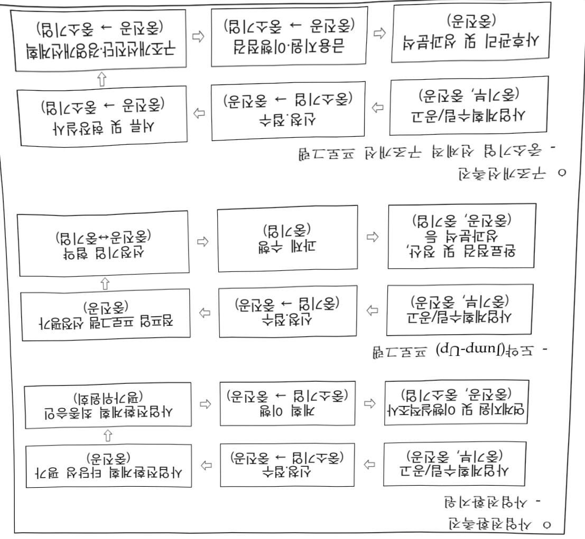
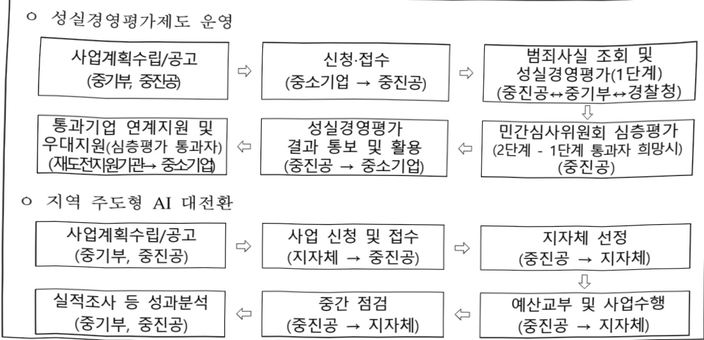

# 재도약촉진

**해당 페이지**: PDF 4739 ~ 4751 쪽 해당

**부처**: 중소벤처기업부
**분야**: 산업·중소기업 및 에너지
**회계유형**: 기금
**2026 확정예산**: 120731.0 백만원
**전년대비 증감률**: 57.7%
**AI 도메인**: 기타

---

### 가.지출계획 총괄표

(단위: 백만원, %)

<table border=1 style='margin: auto; word-wrap: break-word;'><tr><td rowspan="2">사업명</td><td rowspan="2">2024년 결산</td><td colspan="2">2025년 예산</td><td colspan="2">2026년 예산</td><td rowspan="2">중감 (B-A)</td><td rowspan="2">(B-A)/A</td></tr><tr><td style='text-align: center; word-wrap: break-word;'>본예산</td><td style='text-align: center; word-wrap: break-word;'>추경(A)</td><td style='text-align: center; word-wrap: break-word;'>요구안</td><td style='text-align: center; word-wrap: break-word;'>본예산(B)</td></tr><tr><td style='text-align: center; word-wrap: break-word;'>재도약촉진</td><td style='text-align: center; word-wrap: break-word;'>11,559</td><td style='text-align: center; word-wrap: break-word;'>41,549</td><td style='text-align: center; word-wrap: break-word;'>76,549</td><td style='text-align: center; word-wrap: break-word;'>199,714</td><td style='text-align: center; word-wrap: break-word;'>120,731</td><td style='text-align: center; word-wrap: break-word;'>44,182</td><td style='text-align: center; word-wrap: break-word;'>57.7</td></tr></table>

□ 기능별(내역사업별) 계획 내역

(단위: 백만원)

<table border=1 style='margin: auto; word-wrap: break-word;'><tr><td rowspan="2"></td><td colspan="5">2024</td><td colspan="5">2025</td><td rowspan="2">2026 계획</td></tr><tr><td style='text-align: center; word-wrap: break-word;'>계획의 (추정)</td><td style='text-align: center; word-wrap: break-word;'>계획 현황</td><td style='text-align: center; word-wrap: break-word;'>집행액</td><td style='text-align: center; word-wrap: break-word;'>이월액</td><td style='text-align: center; word-wrap: break-word;'>불용액</td><td style='text-align: center; word-wrap: break-word;'>계획의 (추정)</td><td style='text-align: center; word-wrap: break-word;'>계획 현황</td><td style='text-align: center; word-wrap: break-word;'>집행액</td><td style='text-align: center; word-wrap: break-word;'>이월액</td><td style='text-align: center; word-wrap: break-word;'>불용액</td></tr><tr><td style='text-align: center; word-wrap: break-word;'>○ 기능별 분류(합계)</td><td style='text-align: center; word-wrap: break-word;'>11,559</td><td style='text-align: center; word-wrap: break-word;'>11,559</td><td style='text-align: center; word-wrap: break-word;'>11,482</td><td style='text-align: center; word-wrap: break-word;'>-</td><td style='text-align: center; word-wrap: break-word;'>77</td><td style='text-align: center; word-wrap: break-word;'>41,549 (76,549)</td><td style='text-align: center; word-wrap: break-word;'>76,549</td><td style='text-align: center; word-wrap: break-word;'>76,442</td><td style='text-align: center; word-wrap: break-word;'>-</td><td style='text-align: center; word-wrap: break-word;'>107</td><td style='text-align: center; word-wrap: break-word;'>120,731</td></tr><tr><td style='text-align: center; word-wrap: break-word;'>· 사업전환촉진</td><td style='text-align: center; word-wrap: break-word;'>7,342</td><td style='text-align: center; word-wrap: break-word;'>7,342</td><td style='text-align: center; word-wrap: break-word;'>7,304</td><td style='text-align: center; word-wrap: break-word;'>-</td><td style='text-align: center; word-wrap: break-word;'>38</td><td style='text-align: center; word-wrap: break-word;'>37,243</td><td style='text-align: center; word-wrap: break-word;'>37,243</td><td style='text-align: center; word-wrap: break-word;'>37,167</td><td style='text-align: center; word-wrap: break-word;'>-</td><td style='text-align: center; word-wrap: break-word;'>76</td><td style='text-align: center; word-wrap: break-word;'>66,845</td></tr><tr><td style='text-align: center; word-wrap: break-word;'>· 구조개선촉진</td><td style='text-align: center; word-wrap: break-word;'>3,083</td><td style='text-align: center; word-wrap: break-word;'>3,083</td><td style='text-align: center; word-wrap: break-word;'>3,083</td><td style='text-align: center; word-wrap: break-word;'>-</td><td style='text-align: center; word-wrap: break-word;'>-</td><td style='text-align: center; word-wrap: break-word;'>3,172</td><td style='text-align: center; word-wrap: break-word;'>3,172</td><td style='text-align: center; word-wrap: break-word;'>3,172</td><td style='text-align: center; word-wrap: break-word;'>-</td><td style='text-align: center; word-wrap: break-word;'>-</td><td style='text-align: center; word-wrap: break-word;'>3,663</td></tr><tr><td style='text-align: center; word-wrap: break-word;'>· 성실경영평가 제도 운영</td><td style='text-align: center; word-wrap: break-word;'>1,134</td><td style='text-align: center; word-wrap: break-word;'>1,134</td><td style='text-align: center; word-wrap: break-word;'>1,095</td><td style='text-align: center; word-wrap: break-word;'>-</td><td style='text-align: center; word-wrap: break-word;'>39</td><td style='text-align: center; word-wrap: break-word;'>1,134</td><td style='text-align: center; word-wrap: break-word;'>1,134</td><td style='text-align: center; word-wrap: break-word;'>1,103</td><td style='text-align: center; word-wrap: break-word;'>-</td><td style='text-align: center; word-wrap: break-word;'>31</td><td style='text-align: center; word-wrap: break-word;'>1,223</td></tr><tr><td style='text-align: center; word-wrap: break-word;'>· 지역 주도형 AI 대전환</td><td style='text-align: center; word-wrap: break-word;'>-</td><td style='text-align: center; word-wrap: break-word;'>-</td><td style='text-align: center; word-wrap: break-word;'>-</td><td style='text-align: center; word-wrap: break-word;'>-</td><td style='text-align: center; word-wrap: break-word;'>-</td><td style='text-align: center; word-wrap: break-word;'>- (35,000)</td><td style='text-align: center; word-wrap: break-word;'>35,000</td><td style='text-align: center; word-wrap: break-word;'>35,000</td><td style='text-align: center; word-wrap: break-word;'>-</td><td style='text-align: center; word-wrap: break-word;'>-</td><td style='text-align: center; word-wrap: break-word;'>49,000</td></tr></table>

### 나. 사업설명자료

## 1 ) 사업목적·내용

(사업전환촉진) 산업 구조전환 가속화로 경쟁력 약화 우려가 있는 중소기업을 대상으로 사업전환을 통한 경쟁력 강화를 위해 진단, 계획수립 등 지원 및 미래 신성장 분야로의 중소기업 스케일업 등 도모

- (구조개선촉진) 성장잠재력이 있는 중소기업이 위기를 극복하고 신속한 정상화를 위해

민간은행 등과 협업하여 자금지원, 경영개선계획 수립 등 선제적 구조개선을 지원

- (성실경영평가제도 운영) 재창업 기업의 성실경영평가를 효과적으로 수행·관리하기 위한 전담기관 운영으로 원활한 재기지원 환경 조성

- (지역 주도형 AI 대전환) AI 등 신산업 분야의 발전과 경영 변화의 선제적 지원을 통해 중소기업의 생산성 향상 및 경쟁력 제고

---

## 2 ) 사업개요

□ 사업근거 및 추진경위

① 법령상 근거 및 조항 적시

- 중소기업진흥에 관한 법률 제60조, 제67조, 제74조

제60조(경영정상화의 지원) ①중소벤처기업부장관은 다음 각 호의 어느 하나에 해당하는 사유로 상당수의 중소기업자가 경영상의 어려움을 겪고 있거나 겪을 우려가 있으면 중소기업의 경영정상화를 지원하기 위하여 필요한 조치를 할 수 있다.

4. 산업구조의 변화로 사업·재무·조직 등의 구조개선이 필요한 경우

제67조(기금의 사용 등) ① 기금은 다음 각 호의 사업을 위하여 사용할 수 있다.

5. 중소·벤처기업의 창업지원을 위하여 중소벤처기업부장관이 위탁하는 사업

9. 중소·벤처기업에 대한 사업전환의 지원

17. 중소·벤처기업에 대한 경영 정상화의 지원

제74조(사업) ① 중소벤처기업진흥공단은 중소기업에 관한 다음 각 호의 사업을 실시하거나 그에 관한 사업을 지원할 수 있다.

4. 사업전환의 지원

10. 중소기업의 창업 지원

16. 경영 정상화의 지원

- 중소기업 사업전환 촉진에 관한 특별법 제6조, 제8조, 제10조, 제22조, 제26조

제6조(중소기업사업전환지원센터의 설치) ① 중소벤처기업부장관은 중소기업자의 사업전환을 효율적으로 지원하기 위하여 중소기업지원기관이나 단체를 지정하여 중소기업사업전환지원센터(이하 “지원센터”라 한다)를 설치 · 운영할 수 있다.

② 지원센터의 업무는 다음 각 호와 같다.

1. 제8조에 따른 사업전환계획 및 제8조의2에 따른 공동사업전환계획의 수립 지원에 관한 사항

2. 사업전환을 위한 정보의 제공과 컨설팅 지원에 관한 사항

3. 자금의 융자 주선과 인수·합병의 연계 지원에 관한 사항

4. 제8조 및 제8조의2에 따라 승인을 받은 중소기업자에 대한 사후관리에 관한 사항

5. 유휴설비(游休設備) 유통정보의 제공과 거래 주선에 관한 사항

6. 사업전환 전문가 육성에 관한 사항

7. 사업전환 선진기법 및 교육 프로그램 등의 보급에 관한 사항

8. 그 밖에 중소기업의 사업전환을 촉진하기 위하여 중소벤처기업부장관이 위탁하는 사항

③ 정부는 지원센터의 설치와 운영에 드는 경비의 전부나 일부를 보조할 수 있다.

④ 지원센터의 설치·지정기준과 운영 등에 필요한 사항은 대통령령으로 정한다.

제8조(사업전환계획의 승인) ① 사업전환을 하려는 중소기업자는 다음 각 호의 사항을 포함한 사업전환에 관한 계획(이하 “사업전환계획”이라 한다)을 중소벤처 기업부장관에게 제출하여 승인을 받을 수 있다.

1. 사업전환의 필요성

2. 새로 운영하거나 추가하려는 업종, 새로 추가하는 제품·서비스 또는 새로운

---

제공방식에 대한 계획

3. 사업전환의 내용과 실시기간

4. 사업전환에 따른 근로자의 고용조정과 능력개발

5. 사업전환에 필요한 재원과 그 조달계획

6. 사업전환으로 달성하려는 매출액 등 목표수준

7. 그 밖에 중소벤처기업부장관이 필요하다고 인정하는 사항

② 중소벤처기업부장관은 환경보호, 사회적 책임 또는 지배구조의 개선을 위하여 사업전환을 하려는 중소기업자 및 신사업 분야로 전환을 하려는 중소기업자의 사업전환계획을 우선 승인할 수 있다.

② 제1항 및 제2항에 따른 사업전환계획의 승인기준과 승인절차, 우선 승인 등에 필요한 사항은 대통령령으로 정한다.

제10조(사업전환계획 및 공동사업전환계획의 이행실적조사) ① 중소벤처기업부장관은 사업전환계획 또는 공동사업전환계획의 승인을 받은 중소기업자(이하“승인기업”이라 한다)의 사업전환계획 또는 공동사업전환계획의 이행 여부와 실적 등을 정기적으로 조사하여야 한다.

② 제1항에 따른 이행실적조사 절차에 관하여 필요한 사항은 대통령령으로 정한다.

제22조(컨설팅 지원) ① 중소벤처기업부장관은 사업전환을 추진하는 중소기업자에게 경영·기술·재무·회계 등의 개선에 관한 컨설팅 지원을 할 수 있다.

② 중소벤처기업부장관은 제1항에 따른 컨설팅 지원을 위하여 다음 각 호의 사업을 추진하거나 지원할 수 있다.

1. 중소기업자의 규모와 업종에 적합한 컨설팅 서비스의 제공

2. 컨설팅 결과의 신뢰성을 확보하기 위한 평가체계 구축

3. 컨설팅 결과와 융자·보조 등 지원수단의 연계

4. 그 밖에 컨설팅 기반 강화에 필요한 사업

③ 중소벤처기업부장관은 중소기업자 또는 컨설팅 실시기관 등에 대하여 제2항에 따른 사업에 따른 비용을 지원할 수 있다.

제26조(유휴설비의 유통지원) ① 중소벤처기업부장관은 사업전환과정 등에서 생기는 유휴설비의 원활한 유통을 지원하기 위하여 다음 각 호의 사업을 추진할 수 있다.

1. 국내외 유휴설비 유통정보의 제공과 거래 주선

2. 유휴설비의 매매 관련 기관 사이의 연계체제 구축

3. 유휴설비의 집적과 판매를 위한 입지 지원

4. 유휴설비의 신뢰성을 높이기 위한 가치평가체제의 구축

5. 그 밖에 유휴설비 유통 활성화에 필요한 사업

- 중소기업창업지원법 제42조, 제43조, 제44조

제42조(재창업지원계획의 수립 및 시행) ① 중소벤처기업부장관은 재창업을 활성화하고 재창업기업의 사업 성공률을 높이기 위하여 재창업기업의 특성을 고려한 중소기업 재창업지원계획을 수립하여야 한다.

② 중소벤처기업부장관은 제1항에 따른 계획에 따라 재창업지원에 필요한 다음 각 호의 사항을 추진할 수 있다.

1. 우수한 기술과 경험을 보유한 예비재창업자의 발굴 및 재창업 교육

2. 재창업에 장애가 되는 각종 부담 및 규제 등의 제도 개선

3. 조세·법률 상담 등 재창업을 위한 상담 지원

---

4. 교육센터의 지정·운영 등 재창업지원 시설의 확충

5. 재창업에 필요한 자금 지원 및 관련 정보 제공

6. 재창업 교육 및 상담을 위한 전문가 양성

7. 재창업 지원사업에 대한 정기 점검 및 평가

8. 재창업에 관한 종합 데이터베이스의 구축 · 관리

9. 그 밖에 재창업지원과 관련하여 중소벤처기업부장관이 필요하다고 인정하는 사항

제43조(재창업기업 성실경영 평가) ① 중소벤처기업부장관은 예비재창업자 또는 재창업기업의 대표자(대표이사, 업무집행조합원, 대표집행임원 등 대표권이 있는 임원으로 등기되어 있거나 대표자로 등록되어 있는 자를 말한다)가 재창업 전의 기업을 경영하면서 분식회계, 고의부도, 부당해고 등을 하지 아니하고 성실하게 경영하였는지 여부 등을 평가(이하 “성실경영 평가”라 한다)하여 출연, 보조, 융자 등 재정지원을 제한하거나 지원 대상자 선별에 활용할 수 있다.

제44조(재창업기업 성실경영 평가 전담기관의 지정 등) ① 중소벤처기업부장관은 성실경영 평가를 효과적으로 수행하기 위하여 이를 전담하는 기관(이하 “성실경영 평가 전담기관”이라 한다)을 지정할 수 있다.

② 중소벤처기업부장관은 성실경영 평가 전담기관으로 하여금 성실경영 평가를 효과적으로 수행하고 관리할 수 있도록 통합관리체계를 구축·운영하게 할 수 있다.

③ 정부와 지방자치단체는 예산의 범위에서 성실경영 평가 전담기관의 운영에 필요한 경비의 전부 또는 일부를 출연하거나 보조할 수 있다.

## ② 추진경위

## [사업전환촉진]

- '06. 02 중소기업 사업전환 촉진에 관한 특별법 제정

- '06. 04 자유무역협정 체결에 따른 무역조정 지원에 관한 법률 제정

- '06. 08 사업전환지원센터 시범운영기관으로 중진공 지정

- '06. 09 법 시행 및 사업전환지원사업 개시

- '07. 04 법 시행 및 무역조정지원사업 개시

- '08. 02 자유무역협정에 따른 무역조정 지원에 관한 법률로 개정 시행, 서비스업

까지 지원 범위 확대

- '09. 02 법 개정으로 건설업, 광업 등 사업전환 지원대상 업종범위 확대

- '13. 09 사업전환 범위 확대 및 일몰기한 폐지

- '15. 12 자유무역협정 체결에 따른 무역조정 지원에 관한 법률 개정안 통과

- '16. 07 무역피해 조사 및 심의절차를 산업부에서 중진공으로 이관

- '19. 09 중소기업의 선제적 사업구조 개선 지원방안 대책 발표

- '19. 10 사업전환 전환 전 업종 매출액 요건(30%) 폐지

- '20. 01 사업전환계획 승인 권한을 중기부에서 중진공으로 이관

---

- '21. 07 디지털전환, 탄소중립 대응을 위한 선제적 사업구조개편 활성화 방안 대책 발표

- '21. 07 중소기업 신사업 진출 및 재기 촉진 방안 발표

- '22. 10 환경·사회·지배구조 개편을 촉진하기 위한 사업전환법 개정

- '23. 05 사업전환 인정범위 확대, 공동사업전환 도입 등 산업환경 급변에 따라

늘어난 신사업 진출 수요에 대응하기 위한 사업전환법 개정

- '24. 04 중소기업 도약 전략 발표

- '24. 08 유망 중소기업 스케일업을 위한 [도약(Jump-Up) 프로그램] 운영방안 발표

## [구조개선촉진]

- '19. 09 경제활력대책회의 '중소기업의 선제적 사업구조 개선 지원방안'

- '20. 06 '20년 하반기 경제정책방향

* 기업구조조정 수요 증가, 기존 방식(채권금융기관 중심)의 한계에 대응

- '21. 01 선제적 구조개선 프로그램 개시 및 기업개선센터 출범

- '22. 06 사업수행을 위한 업무협약 체결(산업은행)

- '22. 12 사업수행을 위한 업무협약 체결(국민, 신한, 우리, 대구은행)

- '23. 03 사업수행을 위한 업무협약 체결(하나은행)

- '24. 03 사업수행을 위한 업무협약 체결(부산은행)

- '24. 08 사업수행을 위한 업무협약 체결(기술보증기금, 지역신용보증재단)

## [성실경영평가제도 운영]

- '21. 07 중소기업 신사업 진출 및 재기 촉진 방안 발표

- '22. 03 성실경영평가 사업 개시 및 전담기관 출범

- '22. 06 중소기업창업 지원법 개정(성실경영평가 전담기관 지정 등 재창업 지원 강화)

- '23. 12 중소기업 재기지원 활성화 방안 발표

- '25. 03 중소기업창업 지원법 시행령 개정(우수 동종업종 재창업자 창업인정)

## [지역 주도형 AI 대전환]

- '24. 09 : 「국가 AI전략 정책방향」 발표

- '25. 01 : '인공지능기본법' 제정

- '25. 02 : 'AI 활용·확산방안' 발표(국가인공지능위원회)

---

## □ 주요내용

① 사업규모

- 총사업비 : 해당없음

- 사업기간 : '07년 ~ 계속

- 최근 5년 간 투입된 사업비(예산액기준, 추경편성한 연도에는 추경포함)

<table border=1 style='margin: auto; word-wrap: break-word;'><tr><td style='text-align: center; word-wrap: break-word;'>$ \underline{\text{笹}} $</td><td style='text-align: center; word-wrap: break-word;'>2022</td><td style='text-align: center; word-wrap: break-word;'>2023</td><td style='text-align: center; word-wrap: break-word;'>2024</td><td style='text-align: center; word-wrap: break-word;'>2025</td><td style='text-align: center; word-wrap: break-word;'>2026</td></tr><tr><td style='text-align: center; word-wrap: break-word;'>$ \underline{\text{사업비}} $</td><td style='text-align: center; word-wrap: break-word;'>11,474</td><td style='text-align: center; word-wrap: break-word;'>9,454</td><td style='text-align: center; word-wrap: break-word;'>11,559</td><td style='text-align: center; word-wrap: break-word;'>76,549</td><td style='text-align: center; word-wrap: break-word;'>120,731</td></tr></table>

- 기타 : 해당없음

② 사업추진체계

- 사업시행방법 : 직접수행

- 사업시행주체 : 중소벤처기업진흥공단

- 사업 수혜자 : 사업전환 및 선제적 구조개선 대상기업,

폐업 이력이 있는 (예비)재창업자, 중소기업

- 보조, 융자, 출연, 출자 등의 경우 보조·융자 등 지원 비율 및 법적근거

(단위:백만원)

<table border=1 style='margin: auto; word-wrap: break-word;'><tr><td style='text-align: center; word-wrap: break-word;'>내역사업명</td><td style='text-align: center; word-wrap: break-word;'>구분</td><td style='text-align: center; word-wrap: break-word;'>피보조·피출연 등 기관명</td><td style='text-align: center; word-wrap: break-word;'>지원 금액 (2026계획)</td><td style='text-align: center; word-wrap: break-word;'>지원 비율(%)</td><td style='text-align: center; word-wrap: break-word;'>보조율 법적근거 (해당 조항)</td></tr><tr><td style='text-align: center; word-wrap: break-word;'>지역 주도형 AI 대전환</td><td style='text-align: center; word-wrap: break-word;'>보조</td><td style='text-align: center; word-wrap: break-word;'>지자체 보조</td><td style='text-align: center; word-wrap: break-word;'>48,800</td><td style='text-align: center; word-wrap: break-word;'>60</td><td style='text-align: center; word-wrap: break-word;'>중소기업진흥에 관한 법률 제60조, 제74조 보조금 관리에 관한 법률 제9조 등</td></tr><tr><td style='text-align: center; word-wrap: break-word;'>사업전환촉진</td><td style='text-align: center; word-wrap: break-word;'>보조</td><td style='text-align: center; word-wrap: break-word;'>공모 중소기업</td><td style='text-align: center; word-wrap: break-word;'>50,000</td><td style='text-align: center; word-wrap: break-word;'>70</td><td style='text-align: center; word-wrap: break-word;'>중소기업진흥에 관한 법률 제60조, 제74조 보조금 관리에 관한 법률 제9조 등</td></tr></table>

## 3 ) 2026년도 계획 산출 근거

☐ 재도약촉진 : (‘25) 76,549백만원* → (‘26) 120,731백만원, +57.72%

* (25 당초) 41,549백만원 → (제1회 추경) 41,549백만원 → (제2회 추경) 76,549백만원

① 사업전환촉진 : (‘25) 37,243 → (‘26) 66,845 백만원, +79.5%

- 사업전환을 통한 경쟁력 강화를 위해 진단, 계획수립 지원 및 유망 중소기업의 스케일업을 위한 점프업 프로그램 참여기업 선발·관리 등

② 구조개선촉진 : (‘25) 3,172백만원 → (‘26) 3,663백만원, +15.5%

- 중소기업 구조개선 촉진을 위한 경영개선계획 수립 및 이행점검 등

---

<table border=1 style='margin: auto; word-wrap: break-word;'><tr><td style='text-align: center; word-wrap: break-word;'>③ 성실경영평가제도 운영 : (&#x27;25) 1,134백만원 → (&#x27;26) 1,223백만원, +7.8%</td></tr><tr><td style='text-align: center; word-wrap: break-word;'>- 창업법 개정에 따른 동종업종 재창업자 창업인정 트랙 수요 대응을 위한 성실경영 평가 운영비용 확대 및 제도전 역량강화를 위한 특화교육· 컨설팅 소요비용</td></tr><tr><td style='text-align: center; word-wrap: break-word;'>④ 지역 주도형 AI 대전환 : (&#x27;25 추경) 35,000백만원 → (&#x27;26) 49,000백만원, +40.0%</td></tr><tr><td style='text-align: center; word-wrap: break-word;'>- 지역산업 특성을 반영한 &#x27;대규모 AI 전환 프로젝트&#x27; 추진을 통한 지역 중소기업의 신속한 AI 전환 및 경제 활성 촉진</td></tr></table>

## 4 ) 사업효과

## 사업영향, 산출물 성과지표 등

① 2022~2026년도 성과계획서 상 성과지표 및 최근 5년간 성과 달성도

<table border=1 style='margin: auto; word-wrap: break-word;'><tr><td style='text-align: center; word-wrap: break-word;'>성과지표</td><td style='text-align: center; word-wrap: break-word;'>구분</td><td style='text-align: center; word-wrap: break-word;'>2022</td><td style='text-align: center; word-wrap: break-word;'>2023</td><td style='text-align: center; word-wrap: break-word;'>2024</td><td style='text-align: center; word-wrap: break-word;'>2025</td><td style='text-align: center; word-wrap: break-word;'>2026</td><td style='text-align: center; word-wrap: break-word;'>2026 목표치산출근거</td><td style='text-align: center; word-wrap: break-word;'>측정산식(또는 측정방법)</td><td style='text-align: center; word-wrap: break-word;'>자료수집방법(또는 자료출처)</td></tr><tr><td rowspan="3">기술기반업종창업기업 수(단위:개)</td><td style='text-align: center; word-wrap: break-word;'>목표</td><td style='text-align: center; word-wrap: break-word;'>-</td><td style='text-align: center; word-wrap: break-word;'>신규</td><td style='text-align: center; word-wrap: break-word;'>233,033</td><td style='text-align: center; word-wrap: break-word;'>-</td><td style='text-align: center; word-wrap: break-word;'>-</td><td rowspan="3">-</td><td rowspan="3">중기부에서 매달 발표하는 창업기업 동향에 근거하여 ‘24년 기술기반업종의 창업기업 수를 측정</td><td rowspan="3">창업기업 동향 통계</td></tr><tr><td style='text-align: center; word-wrap: break-word;'>실적</td><td style='text-align: center; word-wrap: break-word;'>229,416</td><td style='text-align: center; word-wrap: break-word;'>221,436</td><td style='text-align: center; word-wrap: break-word;'>214,917</td><td style='text-align: center; word-wrap: break-word;'>-</td><td style='text-align: center; word-wrap: break-word;'>-</td></tr><tr><td style='text-align: center; word-wrap: break-word;'>달성도</td><td style='text-align: center; word-wrap: break-word;'>-</td><td style='text-align: center; word-wrap: break-word;'>-</td><td style='text-align: center; word-wrap: break-word;'>92.2</td><td style='text-align: center; word-wrap: break-word;'>-</td><td style='text-align: center; word-wrap: break-word;'>-</td></tr><tr><td rowspan="3">창업지원기업 평균 매출액(단위:억원)</td><td style='text-align: center; word-wrap: break-word;'>목표</td><td style='text-align: center; word-wrap: break-word;'>-</td><td style='text-align: center; word-wrap: break-word;'>-</td><td style='text-align: center; word-wrap: break-word;'>신규</td><td style='text-align: center; word-wrap: break-word;'>13.0</td><td style='text-align: center; word-wrap: break-word;'>13.6</td><td rowspan="3">최근 4년(21~24) 창업지원기업 매출액인 128억원에 당해도 경제성장률(15%(e)) 및 추가가중치(5%)를 적용하여 목표로 설정</td><td rowspan="3">중기부에서 매년 조사하는 ‘창업지원기업 이력성과조사’에 따라 지원기업의 매출액 측정</td><td rowspan="3">창업지원기업 이력 성과조사</td></tr><tr><td style='text-align: center; word-wrap: break-word;'>실적</td><td style='text-align: center; word-wrap: break-word;'>-</td><td style='text-align: center; word-wrap: break-word;'>-</td><td style='text-align: center; word-wrap: break-word;'>14.75</td><td style='text-align: center; word-wrap: break-word;'>17.75</td><td style='text-align: center; word-wrap: break-word;'>-</td></tr><tr><td style='text-align: center; word-wrap: break-word;'>달성도</td><td style='text-align: center; word-wrap: break-word;'>-</td><td style='text-align: center; word-wrap: break-word;'>-</td><td style='text-align: center; word-wrap: break-word;'>-</td><td style='text-align: center; word-wrap: break-word;'>136.5</td><td style='text-align: center; word-wrap: break-word;'>-</td></tr></table>

② 성과지표 이외의 연도별 사업추진 경과 및 실적

<table border=1 style='margin: auto; word-wrap: break-word;'><tr><td style='text-align: center; word-wrap: break-word;'>2022</td><td style='text-align: center; word-wrap: break-word;'>- 1,314 업체, 420,000 백만 원 지원</td></tr><tr><td style='text-align: center; word-wrap: break-word;'>2023</td><td style='text-align: center; word-wrap: break-word;'>- 1,412 업체, 423,000 백만 원 지원</td></tr><tr><td style='text-align: center; word-wrap: break-word;'>2024</td><td style='text-align: center; word-wrap: break-word;'>- 1,686 업체, 571,800 백만 원 지원</td></tr><tr><td style='text-align: center; word-wrap: break-word;'>2025</td><td style='text-align: center; word-wrap: break-word;'>- 1,977 업체, 750,100 백만 원 지원</td></tr></table>

③ 향후(2026년도 이후) 기대효과

- 중소기업이 급격한 경제환경 변화에 대응할 수 있도록 신사업 중심 사업전환 지원 및 유망 중기업 점프업 프로그램으로 기업 성장동력 확보 기여

- 성장잠재력을 갖춘 위기징후 중소기업이 부실화 되지 않도록 민간 금융권 등과 협업하여 유동성 공급, 경영개선계획 수립 등을 지원하여 신속한 경영정상화 및 재도약 기반 마련

---

7) 사업 집행절차

6) 총사업비 대상사업 여부 및 내역 : 해당없음

5) 타당성조사 및 예비타당성조사 시행여부 및 결과 요지 : 해당없음

- 지역 산업 특성을 반영한 '대규모 AI 전환 프로젝트' 추진을 통해 지역 중소기업의 신속한 AI 전환 및 지역 경제 활성화 기여

성실경영평가 전담기관 운영을 통한 평가의 일관성 확보 및 전문성 강화로 성실경영평가의 공신력을 높이고, 재창업 특화교육·전설팅 등 연계지원을 통한 원활한 재기환경 조성에 기여

---

## 8 ) 각종 평가

---

### 다. 최근 4년간 결산내역

## 1 ) 결산표

☐ 부처 결산내역

(단위: 백만원, %)

<table border=1 style='margin: auto; word-wrap: break-word;'><tr><td rowspan="2">연도</td><td colspan="3">계획액</td><td rowspan="2">계획현액(A)</td><td rowspan="2">집행액(B)</td><td rowspan="2">집행률(B/A)</td><td rowspan="2">다음연도이월액</td><td rowspan="2">불용액</td></tr><tr><td style='text-align: center; word-wrap: break-word;'>본예산</td><td style='text-align: center; word-wrap: break-word;'>추경증감액</td><td style='text-align: center; word-wrap: break-word;'>추경</td></tr><tr><td style='text-align: center; word-wrap: break-word;'>2022</td><td style='text-align: center; word-wrap: break-word;'>11,474</td><td style='text-align: center; word-wrap: break-word;'>-</td><td style='text-align: center; word-wrap: break-word;'>11,474</td><td style='text-align: center; word-wrap: break-word;'>11,474</td><td style='text-align: center; word-wrap: break-word;'>11,434</td><td style='text-align: center; word-wrap: break-word;'>99.6</td><td style='text-align: center; word-wrap: break-word;'>-</td><td style='text-align: center; word-wrap: break-word;'>40</td></tr><tr><td style='text-align: center; word-wrap: break-word;'>2023</td><td style='text-align: center; word-wrap: break-word;'>9,454</td><td style='text-align: center; word-wrap: break-word;'>-</td><td style='text-align: center; word-wrap: break-word;'>9,454</td><td style='text-align: center; word-wrap: break-word;'>9,454</td><td style='text-align: center; word-wrap: break-word;'>9,400</td><td style='text-align: center; word-wrap: break-word;'>99.4</td><td style='text-align: center; word-wrap: break-word;'>-</td><td style='text-align: center; word-wrap: break-word;'>54</td></tr><tr><td style='text-align: center; word-wrap: break-word;'>2024</td><td style='text-align: center; word-wrap: break-word;'>10,779</td><td style='text-align: center; word-wrap: break-word;'>-</td><td style='text-align: center; word-wrap: break-word;'>11,559</td><td style='text-align: center; word-wrap: break-word;'>11,559</td><td style='text-align: center; word-wrap: break-word;'>11,482</td><td style='text-align: center; word-wrap: break-word;'>99.3</td><td style='text-align: center; word-wrap: break-word;'>-</td><td style='text-align: center; word-wrap: break-word;'>77</td></tr><tr><td style='text-align: center; word-wrap: break-word;'>2025</td><td style='text-align: center; word-wrap: break-word;'>41,549</td><td style='text-align: center; word-wrap: break-word;'>35,000</td><td style='text-align: center; word-wrap: break-word;'>76,549</td><td style='text-align: center; word-wrap: break-word;'>76,549</td><td style='text-align: center; word-wrap: break-word;'>76,442</td><td style='text-align: center; word-wrap: break-word;'>99.9</td><td style='text-align: center; word-wrap: break-word;'>-</td><td style='text-align: center; word-wrap: break-word;'>107</td></tr></table>

## 2 ) 주요 결산사항

□ 2022~2025년 결산 주요사항

<table border=1 style='margin: auto; word-wrap: break-word;'><tr><td style='text-align: center; word-wrap: break-word;'>2022</td><td style='text-align: center; word-wrap: break-word;'>- 불용 사유(40백만원) : 연구용역 낙찰차액 등</td></tr><tr><td style='text-align: center; word-wrap: break-word;'>2023</td><td style='text-align: center; word-wrap: break-word;'>- 불용 사유(54백만원) : 일반용역 낙찰차액 등</td></tr><tr><td style='text-align: center; word-wrap: break-word;'>2024</td><td style='text-align: center; word-wrap: break-word;'>- 불용 사유(77백만원) : 일반용역 낙찰차액 등</td></tr><tr><td style='text-align: center; word-wrap: break-word;'>2025</td><td style='text-align: center; word-wrap: break-word;'>- 불용 사유(107백만원) : 일반용역 낙찰차액 등</td></tr></table>

□ 2025년 계획변경 세부내역

(단위: 백만원)

<table border=1 style='margin: auto; word-wrap: break-word;'><tr><td style='text-align: center; word-wrap: break-word;'>구분 (날짜)</td><td style='text-align: center; word-wrap: break-word;'>내역사업</td><td style='text-align: center; word-wrap: break-word;'>목</td><td style='text-align: center; word-wrap: break-word;'>세목</td><td style='text-align: center; word-wrap: break-word;'>금액</td><td style='text-align: center; word-wrap: break-word;'>계획변경 사유</td></tr><tr><td rowspan="2">자체변경 (2025.5.13.)</td><td rowspan="2">사업전환촉진</td><td rowspan="2">운영비 (210)</td><td style='text-align: center; word-wrap: break-word;'>일반수용비 (210-01)</td><td style='text-align: center; word-wrap: break-word;'>△194</td><td style='text-align: center; word-wrap: break-word;'>사업 운영을 위한 세목간 조정</td></tr><tr><td style='text-align: center; word-wrap: break-word;'>임차료 (210-07)</td><td style='text-align: center; word-wrap: break-word;'>194</td><td style='text-align: center; word-wrap: break-word;'>사업 운영을 위한 세목간 조정</td></tr><tr><td rowspan="3">자체변경 (2025.11.26.)</td><td rowspan="3">사업전환촉진</td><td rowspan="3">운영비 (210)</td><td style='text-align: center; word-wrap: break-word;'>일반수용비 (210-01)</td><td style='text-align: center; word-wrap: break-word;'>△150</td><td style='text-align: center; word-wrap: break-word;'>사업 운영을 위한 세목간 조정</td></tr><tr><td style='text-align: center; word-wrap: break-word;'>공공요금및제세 (210-02)</td><td style='text-align: center; word-wrap: break-word;'>△23</td><td style='text-align: center; word-wrap: break-word;'>사업 운영을 위한 세목간 조정</td></tr><tr><td style='text-align: center; word-wrap: break-word;'>일반용역비 (210-07)</td><td style='text-align: center; word-wrap: break-word;'>173</td><td style='text-align: center; word-wrap: break-word;'>사업 운영을 위한 세목간 조정</td></tr><tr><td style='text-align: center; word-wrap: break-word;'>자체변경 (2025.11.27.)</td><td style='text-align: center; word-wrap: break-word;'>사업전환촉진</td><td style='text-align: center; word-wrap: break-word;'>물건비 (200)</td><td style='text-align: center; word-wrap: break-word;'>공공요금및제세 (210-02)</td><td style='text-align: center; word-wrap: break-word;'>△17</td><td style='text-align: center; word-wrap: break-word;'>사업 운영을 위한 세목간 조정</td></tr></table>

---

<table border=1 style='margin: auto; word-wrap: break-word;'><tr><td rowspan="3"></td><td rowspan="3"></td><td rowspan="3"></td><td style='text-align: center; word-wrap: break-word;'></td><td style='text-align: center; word-wrap: break-word;'></td><td style='text-align: center; word-wrap: break-word;'></td></tr><tr><td style='text-align: center; word-wrap: break-word;'>임차료 (210-07)</td><td style='text-align: center; word-wrap: break-word;'>△26</td><td style='text-align: center; word-wrap: break-word;'>사업 운영을 위한 세목간 조정</td></tr><tr><td style='text-align: center; word-wrap: break-word;'>일반연구비 (260-01)</td><td style='text-align: center; word-wrap: break-word;'>43</td><td style='text-align: center; word-wrap: break-word;'>사업 운영을 위한 세목간 조정</td></tr><tr><td rowspan="2">자체변경 (2025.12.18.)</td><td rowspan="2">사업전환촉진</td><td rowspan="2">운영비 (210)</td><td style='text-align: center; word-wrap: break-word;'>일반수용비 (210-01)</td><td style='text-align: center; word-wrap: break-word;'>△1.7</td><td style='text-align: center; word-wrap: break-word;'>사업 운영을 위한 세목간 조정</td></tr><tr><td style='text-align: center; word-wrap: break-word;'>일반용역비 (210-14)</td><td style='text-align: center; word-wrap: break-word;'>1.7</td><td style='text-align: center; word-wrap: break-word;'>사업 운영을 위한 세목간 조정</td></tr><tr><td rowspan="3">자체변경 (2025.12.30.)</td><td rowspan="3">사업전환촉진</td><td rowspan="3">운영비 (210)</td><td style='text-align: center; word-wrap: break-word;'>임차료 (210-07)</td><td style='text-align: center; word-wrap: break-word;'>△18</td><td style='text-align: center; word-wrap: break-word;'>사업 운영을 위한 세목간 조정</td></tr><tr><td style='text-align: center; word-wrap: break-word;'>관리용역비 (210-15)</td><td style='text-align: center; word-wrap: break-word;'>△28</td><td style='text-align: center; word-wrap: break-word;'>사업 운영을 위한 세목간 조정</td></tr><tr><td style='text-align: center; word-wrap: break-word;'>일반용역비 (210-14)</td><td style='text-align: center; word-wrap: break-word;'>46</td><td style='text-align: center; word-wrap: break-word;'>사업 운영을 위한 세목간 조정</td></tr><tr><td rowspan="2">자체변경 (2025.12.30.)</td><td rowspan="2">사업전환촉진</td><td rowspan="2">물건비 (200)</td><td style='text-align: center; word-wrap: break-word;'>관리용역비 (210-15)</td><td style='text-align: center; word-wrap: break-word;'>△6</td><td style='text-align: center; word-wrap: break-word;'>사업 운영을 위한 세목간 조정</td></tr><tr><td style='text-align: center; word-wrap: break-word;'>일반연구비 (260-01)</td><td style='text-align: center; word-wrap: break-word;'>6</td><td style='text-align: center; word-wrap: break-word;'>사업 운영을 위한 세목간 조정</td></tr><tr><td rowspan="2">자체변경 (2025.12.30.)</td><td rowspan="2">사업전환촉진</td><td style='text-align: center; word-wrap: break-word;'>인건비 (110)</td><td style='text-align: center; word-wrap: break-word;'>상용임금 (110-03)</td><td style='text-align: center; word-wrap: break-word;'>△1</td><td style='text-align: center; word-wrap: break-word;'>사업 운영을 위한 목간 조정</td></tr><tr><td style='text-align: center; word-wrap: break-word;'>민간이전 (320)</td><td style='text-align: center; word-wrap: break-word;'>고용부담금 (320-09)</td><td style='text-align: center; word-wrap: break-word;'>1</td><td style='text-align: center; word-wrap: break-word;'>사업 운영을 위한 목간 조정</td></tr><tr><td rowspan="2">자체변경 (2025.11.20.)</td><td rowspan="2">구조개선촉진</td><td rowspan="2">운영비 (210)</td><td style='text-align: center; word-wrap: break-word;'>일반수용비 (210-01)</td><td style='text-align: center; word-wrap: break-word;'>△29</td><td style='text-align: center; word-wrap: break-word;'>사업 운영을 위한 세목간 조정</td></tr><tr><td style='text-align: center; word-wrap: break-word;'>일반용역비 (210-14)</td><td style='text-align: center; word-wrap: break-word;'>29</td><td style='text-align: center; word-wrap: break-word;'>사업 운영을 위한 세목간 조정</td></tr><tr><td rowspan="2">자체변경 (2025.12.30.)</td><td rowspan="2">구조개선촉진</td><td style='text-align: center; word-wrap: break-word;'>인건비 (110)</td><td style='text-align: center; word-wrap: break-word;'>상용임금 (110-03)</td><td style='text-align: center; word-wrap: break-word;'>△14</td><td style='text-align: center; word-wrap: break-word;'>사업 운영을 위한 목간 조정</td></tr><tr><td style='text-align: center; word-wrap: break-word;'>민간이전 (320)</td><td style='text-align: center; word-wrap: break-word;'>고용부담금 (320-09)</td><td style='text-align: center; word-wrap: break-word;'>14</td><td style='text-align: center; word-wrap: break-word;'>사업 운영을 위한 목간 조정</td></tr><tr><td rowspan="2">자체변경 (2025.11.4.)</td><td rowspan="2">성실경영평가제도 운영</td><td rowspan="2">운영비 (210)</td><td style='text-align: center; word-wrap: break-word;'>관리용역비 (210-15)</td><td style='text-align: center; word-wrap: break-word;'>△3</td><td style='text-align: center; word-wrap: break-word;'>사업 운영을 위한 세목간 조정</td></tr><tr><td style='text-align: center; word-wrap: break-word;'>일반수용비 (210-01)</td><td style='text-align: center; word-wrap: break-word;'>3</td><td style='text-align: center; word-wrap: break-word;'>사업 운영을 위한 세목간 조정</td></tr><tr><td rowspan="6">국회의결 (2025.7.4.)</td><td rowspan="6">지역 주도형 AI 대전환</td><td style='text-align: center; word-wrap: break-word;'>인건비 (110)</td><td style='text-align: center; word-wrap: break-word;'>일용임금 (110-04)</td><td style='text-align: center; word-wrap: break-word;'>6</td><td rowspan="6">‘25년 2차 추경예산 편성</td></tr><tr><td style='text-align: center; word-wrap: break-word;'>운영비 (210)</td><td style='text-align: center; word-wrap: break-word;'>일반수용비 (210-01)</td><td style='text-align: center; word-wrap: break-word;'>87</td></tr><tr><td style='text-align: center; word-wrap: break-word;'>운영비 (210)</td><td style='text-align: center; word-wrap: break-word;'>공공요금및제세 (210-02)</td><td style='text-align: center; word-wrap: break-word;'>2</td></tr><tr><td style='text-align: center; word-wrap: break-word;'>운영비 (210)</td><td style='text-align: center; word-wrap: break-word;'>특근매식비 (210-05)</td><td style='text-align: center; word-wrap: break-word;'>5</td></tr><tr><td style='text-align: center; word-wrap: break-word;'>운영비 (210)</td><td style='text-align: center; word-wrap: break-word;'>임차료 (210-07)</td><td style='text-align: center; word-wrap: break-word;'>40</td></tr><tr><td style='text-align: center; word-wrap: break-word;'>운영비 (210)</td><td style='text-align: center; word-wrap: break-word;'>기타운영비 (210-16)</td><td style='text-align: center; word-wrap: break-word;'>1</td></tr></table>

---

<table border=1 style='margin: auto; word-wrap: break-word;'><tr><td rowspan="4"></td><td rowspan="4"></td><td style='text-align: center; word-wrap: break-word;'>여비 (220)</td><td style='text-align: center; word-wrap: break-word;'>국내여비 (220-01)</td><td style='text-align: center; word-wrap: break-word;'>25</td><td rowspan="4"></td></tr><tr><td style='text-align: center; word-wrap: break-word;'>업무추진비 (240)</td><td style='text-align: center; word-wrap: break-word;'>관서업무추진비 (240-02)</td><td style='text-align: center; word-wrap: break-word;'>4</td></tr><tr><td style='text-align: center; word-wrap: break-word;'>연구용역비 (260)</td><td style='text-align: center; word-wrap: break-word;'>일반연구비 (260-01)</td><td style='text-align: center; word-wrap: break-word;'>30</td></tr><tr><td style='text-align: center; word-wrap: break-word;'>자치단체이전 (330)</td><td style='text-align: center; word-wrap: break-word;'>자치단체자본보조 (330-03)</td><td style='text-align: center; word-wrap: break-word;'>34,800</td></tr><tr><td rowspan="3">자체변경 (2025.11.7.)</td><td rowspan="3">지역 주도형 AI 대전환</td><td rowspan="3">운영비 (210)</td><td style='text-align: center; word-wrap: break-word;'>일반수용비 (210-01)</td><td style='text-align: center; word-wrap: break-word;'>△46</td><td style='text-align: center; word-wrap: break-word;'>사업 운영을 위한 세목간 조정</td></tr><tr><td style='text-align: center; word-wrap: break-word;'>임차료 (210-07)</td><td style='text-align: center; word-wrap: break-word;'>△31</td><td style='text-align: center; word-wrap: break-word;'>사업 운영을 위한 세목간 조정</td></tr><tr><td style='text-align: center; word-wrap: break-word;'>일반용역비 (210-14)</td><td style='text-align: center; word-wrap: break-word;'>77</td><td style='text-align: center; word-wrap: break-word;'>사업 운영을 위한 세목간 조정</td></tr><tr><td rowspan="3">자체변경 (2025.12.4.)</td><td rowspan="3">지역 주도형 AI 대전환</td><td rowspan="3">운영비 (210)</td><td style='text-align: center; word-wrap: break-word;'>임차료 (210-07)</td><td style='text-align: center; word-wrap: break-word;'>△1</td><td style='text-align: center; word-wrap: break-word;'>사업 운영을 위한 세목간 조정</td></tr><tr><td style='text-align: center; word-wrap: break-word;'>공공요금및제세 (210-02)</td><td style='text-align: center; word-wrap: break-word;'>△2</td><td style='text-align: center; word-wrap: break-word;'>사업 운영을 위한 세목간 조정</td></tr><tr><td style='text-align: center; word-wrap: break-word;'>일반수용비 (210-01)</td><td style='text-align: center; word-wrap: break-word;'>3</td><td style='text-align: center; word-wrap: break-word;'>사업 운영을 위한 세목간 조정</td></tr><tr><td colspan="4">합 계</td><td style='text-align: center; word-wrap: break-word;'></td><td style='text-align: center; word-wrap: break-word;'></td></tr></table>

---

<table border=1 style='margin: auto; word-wrap: break-word;'><tr><td style='text-align: center; word-wrap: break-word;'>사 업 명</td></tr><tr><td style='text-align: center; word-wrap: break-word;'>(5) 중소기업 스마트서비스 지원(2111-304)</td></tr></table>

사업 코드 정보

<table border=1 style='margin: auto; word-wrap: break-word;'><tr><td style='text-align: center; word-wrap: break-word;'>구분</td><td style='text-align: center; word-wrap: break-word;'>회계</td><td style='text-align: center; word-wrap: break-word;'>소관</td><td style='text-align: center; word-wrap: break-word;'>실국(기관)</td><td style='text-align: center; word-wrap: break-word;'>계정</td><td style='text-align: center; word-wrap: break-word;'>분야</td><td style='text-align: center; word-wrap: break-word;'>부문</td></tr><tr><td style='text-align: center; word-wrap: break-word;'>코드</td><td rowspan="2">일반회계</td><td rowspan="2">중소벤처기업부</td><td rowspan="2">중소기업정책실</td><td rowspan="2"></td><td style='text-align: center; word-wrap: break-word;'>110</td><td style='text-align: center; word-wrap: break-word;'>119</td></tr><tr><td style='text-align: center; word-wrap: break-word;'>명칭</td><td style='text-align: center; word-wrap: break-word;'>산업·중소기업 및 에너지</td><td style='text-align: center; word-wrap: break-word;'>중소기업 및 소상공인 육성</td></tr></table>

<table border=1 style='margin: auto; word-wrap: break-word;'><tr><td style='text-align: center; word-wrap: break-word;'>구분</td><td style='text-align: center; word-wrap: break-word;'>프로그램</td><td style='text-align: center; word-wrap: break-word;'>단위사업</td><td style='text-align: center; word-wrap: break-word;'>세부사업</td></tr><tr><td style='text-align: center; word-wrap: break-word;'>코드</td><td style='text-align: center; word-wrap: break-word;'>2100</td><td style='text-align: center; word-wrap: break-word;'>2111</td><td style='text-align: center; word-wrap: break-word;'>304</td></tr><tr><td style='text-align: center; word-wrap: break-word;'>명칭</td><td style='text-align: center; word-wrap: break-word;'>중소기업기술개발지원</td><td style='text-align: center; word-wrap: break-word;'>중소기업경쟁력강화</td><td style='text-align: center; word-wrap: break-word;'>중소기업 스마트서비스 지원</td></tr></table>

☐ 사업 성격

<table border=1 style='margin: auto; word-wrap: break-word;'><tr><td rowspan="2">신규</td><td rowspan="2">계속</td><td rowspan="2">완료</td><td rowspan="2">예비타당성 실시여부</td><td rowspan="2">총사업비 관리대상</td><td rowspan="2">총액계상 예산사업</td><td style='text-align: center; word-wrap: break-word;'>사업소관 변경정보</td></tr><tr><td style='text-align: center; word-wrap: break-word;'>2025예산 시 소관</td></tr><tr><td style='text-align: center; word-wrap: break-word;'></td><td style='text-align: center; word-wrap: break-word;'>○</td><td style='text-align: center; word-wrap: break-word;'></td><td style='text-align: center; word-wrap: break-word;'></td><td style='text-align: center; word-wrap: break-word;'></td><td style='text-align: center; word-wrap: break-word;'></td><td style='text-align: center; word-wrap: break-word;'></td></tr></table>

□ 사업 지원 형태 및 지원을

<table border=1 style='margin: auto; word-wrap: break-word;'><tr><td style='text-align: center; word-wrap: break-word;'>직접</td><td style='text-align: center; word-wrap: break-word;'>출자</td><td style='text-align: center; word-wrap: break-word;'>출연</td><td style='text-align: center; word-wrap: break-word;'>보조</td><td style='text-align: center; word-wrap: break-word;'>융자</td><td style='text-align: center; word-wrap: break-word;'>국고보조율(%)</td><td style='text-align: center; word-wrap: break-word;'>융자율(%)</td></tr><tr><td style='text-align: center; word-wrap: break-word;'></td><td style='text-align: center; word-wrap: break-word;'></td><td style='text-align: center; word-wrap: break-word;'>○</td><td style='text-align: center; word-wrap: break-word;'></td><td style='text-align: center; word-wrap: break-word;'></td><td style='text-align: center; word-wrap: break-word;'></td><td style='text-align: center; word-wrap: break-word;'></td></tr></table>

□ 사업 소관부처 및 시행주체

<table border=1 style='margin: auto; word-wrap: break-word;'><tr><td style='text-align: center; word-wrap: break-word;'>사업명</td><td colspan="2">구분</td></tr><tr><td rowspan="2">중소기업 스마트서비스 지원</td><td style='text-align: center; word-wrap: break-word;'>소관부처</td><td style='text-align: center; word-wrap: break-word;'>중소기업정책실 중소기업인공지능확산추진단</td></tr><tr><td style='text-align: center; word-wrap: break-word;'>사업시행주체</td><td style='text-align: center; word-wrap: break-word;'>중소기업기술정보진흥원(스마트제조혁신추진단)</td></tr></table>

---

### 원본 PDF 크롭 이미지

