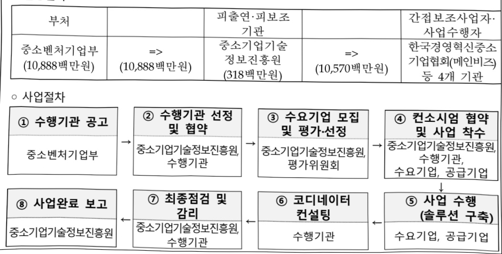

# 중소기업 스마트 서비스 지원

**해당 페이지**: PDF 4752 ~ 4757 쪽 해당

**부처**: 중소벤처기업부
**분야**: 산업·중소기업 및 에너지
**회계유형**: 일반회계
**2026 확정예산**: 10888.0 백만원
**전년대비 증감률**: None%
**AI 도메인**: 데이터

---

<table border=1 style='margin: auto; word-wrap: break-word;'><tr><td style='text-align: center; word-wrap: break-word;'>사 업 명</td></tr><tr><td style='text-align: center; word-wrap: break-word;'>(5) 중소기업 스마트서비스 지원(2111-304)</td></tr></table>

사업 코드 정보

<table border=1 style='margin: auto; word-wrap: break-word;'><tr><td style='text-align: center; word-wrap: break-word;'>구분</td><td style='text-align: center; word-wrap: break-word;'>회계</td><td style='text-align: center; word-wrap: break-word;'>소관</td><td style='text-align: center; word-wrap: break-word;'>실국(기관)</td><td style='text-align: center; word-wrap: break-word;'>계정</td><td style='text-align: center; word-wrap: break-word;'>분야</td><td style='text-align: center; word-wrap: break-word;'>부문</td></tr><tr><td style='text-align: center; word-wrap: break-word;'>코드</td><td rowspan="2">일반회계</td><td rowspan="2">중소벤처기업부</td><td rowspan="2">중소기업정책실</td><td rowspan="2"></td><td style='text-align: center; word-wrap: break-word;'>110</td><td style='text-align: center; word-wrap: break-word;'>119</td></tr><tr><td style='text-align: center; word-wrap: break-word;'>명칭</td><td style='text-align: center; word-wrap: break-word;'>산업·중소기업 및 에너지</td><td style='text-align: center; word-wrap: break-word;'>중소기업 및 소상공인 육성</td></tr></table>

<table border=1 style='margin: auto; word-wrap: break-word;'><tr><td style='text-align: center; word-wrap: break-word;'>구분</td><td style='text-align: center; word-wrap: break-word;'>프로그램</td><td style='text-align: center; word-wrap: break-word;'>단위사업</td><td style='text-align: center; word-wrap: break-word;'>세부사업</td></tr><tr><td style='text-align: center; word-wrap: break-word;'>코드</td><td style='text-align: center; word-wrap: break-word;'>2100</td><td style='text-align: center; word-wrap: break-word;'>2111</td><td style='text-align: center; word-wrap: break-word;'>304</td></tr><tr><td style='text-align: center; word-wrap: break-word;'>명칭</td><td style='text-align: center; word-wrap: break-word;'>중소기업기술개발지원</td><td style='text-align: center; word-wrap: break-word;'>중소기업경쟁력강화</td><td style='text-align: center; word-wrap: break-word;'>중소기업 스마트서비스 지원</td></tr></table>

☐ 사업 성격

<table border=1 style='margin: auto; word-wrap: break-word;'><tr><td rowspan="2">신규</td><td rowspan="2">계속</td><td rowspan="2">완료</td><td rowspan="2">예비타당성 실시여부</td><td rowspan="2">총사업비 관리대상</td><td rowspan="2">총액계상 예산사업</td><td style='text-align: center; word-wrap: break-word;'>사업소관 변경정보</td></tr><tr><td style='text-align: center; word-wrap: break-word;'>2025예산 시 소관</td></tr><tr><td style='text-align: center; word-wrap: break-word;'></td><td style='text-align: center; word-wrap: break-word;'>○</td><td style='text-align: center; word-wrap: break-word;'></td><td style='text-align: center; word-wrap: break-word;'></td><td style='text-align: center; word-wrap: break-word;'></td><td style='text-align: center; word-wrap: break-word;'></td><td style='text-align: center; word-wrap: break-word;'></td></tr></table>

□ 사업 지원 형태 및 지원을

<table border=1 style='margin: auto; word-wrap: break-word;'><tr><td style='text-align: center; word-wrap: break-word;'>직접</td><td style='text-align: center; word-wrap: break-word;'>출자</td><td style='text-align: center; word-wrap: break-word;'>출연</td><td style='text-align: center; word-wrap: break-word;'>보조</td><td style='text-align: center; word-wrap: break-word;'>융자</td><td style='text-align: center; word-wrap: break-word;'>국고보조율(%)</td><td style='text-align: center; word-wrap: break-word;'>융자율(%)</td></tr><tr><td style='text-align: center; word-wrap: break-word;'></td><td style='text-align: center; word-wrap: break-word;'></td><td style='text-align: center; word-wrap: break-word;'>○</td><td style='text-align: center; word-wrap: break-word;'></td><td style='text-align: center; word-wrap: break-word;'></td><td style='text-align: center; word-wrap: break-word;'></td><td style='text-align: center; word-wrap: break-word;'></td></tr></table>

□ 사업 소관부처 및 시행주체

<table border=1 style='margin: auto; word-wrap: break-word;'><tr><td style='text-align: center; word-wrap: break-word;'>사업명</td><td colspan="2">구분</td></tr><tr><td rowspan="2">중소기업 스마트서비스 지원</td><td style='text-align: center; word-wrap: break-word;'>소관부처</td><td style='text-align: center; word-wrap: break-word;'>중소기업정책실 중소기업인공지능확산추진단</td></tr><tr><td style='text-align: center; word-wrap: break-word;'>사업시행주체</td><td style='text-align: center; word-wrap: break-word;'>중소기업기술정보진흥원(스마트제조혁신추진단)</td></tr></table>

---

### 가. 예산 총괄표

(단위: 백만원, %)

<table border=1 style='margin: auto; word-wrap: break-word;'><tr><td rowspan="2">사업명</td><td rowspan="2">2024년 결산</td><td colspan="2">2025년 예산</td><td colspan="2">2026년 예산</td><td rowspan="2">증감(B-A)</td><td rowspan="2">(B-A)/A</td></tr><tr><td style='text-align: center; word-wrap: break-word;'>본예산</td><td style='text-align: center; word-wrap: break-word;'>추경(A)</td><td style='text-align: center; word-wrap: break-word;'>요구안</td><td style='text-align: center; word-wrap: break-word;'>본예산(B)</td></tr><tr><td style='text-align: center; word-wrap: break-word;'>중소기업 스마트서비스 지원</td><td style='text-align: center; word-wrap: break-word;'>10,888</td><td style='text-align: center; word-wrap: break-word;'>10,888</td><td style='text-align: center; word-wrap: break-word;'>10,888</td><td style='text-align: center; word-wrap: break-word;'>32,588</td><td style='text-align: center; word-wrap: break-word;'>10,888</td><td style='text-align: center; word-wrap: break-word;'>-</td><td style='text-align: center; word-wrap: break-word;'>-</td></tr></table>

□ 기능별(내역사업별) 예산 내역

(단위: 백만원)

<table border=1 style='margin: auto; word-wrap: break-word;'><tr><td rowspan="2"></td><td colspan="5">2024</td><td colspan="5">2025</td><td rowspan="2">2026 예산</td></tr><tr><td style='text-align: center; word-wrap: break-word;'>예산액 (추정)</td><td style='text-align: center; word-wrap: break-word;'>예산 현액</td><td style='text-align: center; word-wrap: break-word;'>집행액</td><td style='text-align: center; word-wrap: break-word;'>이월액</td><td style='text-align: center; word-wrap: break-word;'>불용액</td><td style='text-align: center; word-wrap: break-word;'>예산액 (추정)</td><td style='text-align: center; word-wrap: break-word;'>예산 현액</td><td style='text-align: center; word-wrap: break-word;'>집행액</td><td style='text-align: center; word-wrap: break-word;'>이월액</td><td style='text-align: center; word-wrap: break-word;'>불용액</td></tr><tr><td style='text-align: center; word-wrap: break-word;'>○ 기능별 분류(합계)</td><td style='text-align: center; word-wrap: break-word;'>10,888</td><td style='text-align: center; word-wrap: break-word;'>10,888</td><td style='text-align: center; word-wrap: break-word;'>10,888</td><td style='text-align: center; word-wrap: break-word;'>-</td><td style='text-align: center; word-wrap: break-word;'>-</td><td style='text-align: center; word-wrap: break-word;'>10,888</td><td style='text-align: center; word-wrap: break-word;'>10,888</td><td style='text-align: center; word-wrap: break-word;'>10,888</td><td style='text-align: center; word-wrap: break-word;'>-</td><td style='text-align: center; word-wrap: break-word;'>-</td><td style='text-align: center; word-wrap: break-word;'>10,888</td></tr><tr><td style='text-align: center; word-wrap: break-word;'>• 중소기업 스마트 서비스 지원</td><td style='text-align: center; word-wrap: break-word;'>10,888</td><td style='text-align: center; word-wrap: break-word;'>10,888</td><td style='text-align: center; word-wrap: break-word;'>10,888</td><td style='text-align: center; word-wrap: break-word;'>-</td><td style='text-align: center; word-wrap: break-word;'>-</td><td style='text-align: center; word-wrap: break-word;'>10,888</td><td style='text-align: center; word-wrap: break-word;'>10,888</td><td style='text-align: center; word-wrap: break-word;'>10,888</td><td style='text-align: center; word-wrap: break-word;'>-</td><td style='text-align: center; word-wrap: break-word;'>-</td><td style='text-align: center; word-wrap: break-word;'>10,888</td></tr></table>

### 나. 사업설명자료

## 1 ) 사업목적·내용

- 서비스의 스마트화·혁신을 위해 서비스업 중소기업을 대상으로 빅데이터·AI 등 첨단 ICT활용 솔루션 구축을 지원

## 2 ) 사업개요

□ 사업근거 및 추진경위

① 법령상 근거 및 조항 적시

-「중소기업 기술혁신 촉진법」제9조(중소기업의 기술혁신촉진지원사업),

제10조(기술혁신 중소기업자에 대한 출연),

제18조(중소기업 정보화 지원사업) 제1항 내지 제2항

---

9조(중소기업의 기술혁신 촉진 지원사업) ① 중소벤처기업부장관은 중소기업의 기술혁신을 촉진하기 위하여 다음 각 호의 지원사업(이하 "기술혁신 촉진 지원사업"이라 한다)을 추진하여야 한다.

1. 기술혁신에 필요한 자금지원

2. 기술혁신 과제의 사업타당성 조사

3. 수요와 연계된 기술혁신의 지원

4. 기술혁신 성과의 사업화

5. 기술혁신을 위한 경영 및 기술 지도

6. 기술혁신형 중소기업 육성

7.산업·안전 등에 관한 해외규격 획득 및 품질향상에 대한 지원

8. 중소기업 정보화 지원사업

9. 산·학·연 공동기술개발사업 등 산학협력 지원사업

10. 기술융합 촉진을 위한 지원사업

11. 지역특화산업의 육성 및 지역산업의 혁신에 필요한 기술개발 지원사업

12. 그 밖에 기술혁신을 촉진하기 위하여 필요한 사항

② 중소벤처기업부장관은 기술혁신 촉진 지원사업을 추진하는 데에 필요하다고 인정하는 경우에는 미리 관계중앙행정기관의 장과 협의하여야 한다.

제10조(기술혁신 중소기업자에 대한 출연) ① 중소벤처기업부장관은 중소기업의 기술혁신을 촉진하기 위하여 필요하다고 인정하는 경우 기술혁신능력을 보유한 중소기업자가 단독으로 또는 공동으로 수행하는 기술혁신사업에 출연할 수 있다.

② 제1항에 따른 출연금의 지급·사용·관리 등에 필요한 사항은 대통령령으로 정한다.

제18조(중소기업 정보화 지원사업) ① 중소벤처기업부장관은 중소기업의 정보화에 필요한 중소기업 정보화의 기반조성과 정보기술의 보급·확산에 관한 지원사업을 추진할 수 있다.

② 중소벤처기업부장관은 제1항에 따른 사업을 효율적으로 추진하기 위하여 필요하다고 인정할 때에는 대학·연구기관·공공기관·민간단체 및 중소기업 등에 사용되는 비용을 출연할 수 있다.

② 추진경위 - 사업 시작년도, 추진배경, 부처별 중점과제, 대통령 공약사항 등

- 서비스산업 혁신 전략('19.6.26, 관계부처 합동, 경제활력대책회의)

- 중소기업 스마트서비스 지원 사업 신설('20년)

- 「한국판 뉴딜」 종합 계획('20.7.14, 관계부처 합동)

- 서비스산업 코로나19 대응 발전전략 (‘21.3.3, 관계부처 합동)

□ 주요내용

① 사업규모

- 총사업비 : 해당없음

- 사업기간 : '20년 ~ 계속

-최근 5년 간 투입된 사업비(예산액기준, 추경편성한 연도에는 추경포함)

<table border=1 style='margin: auto; word-wrap: break-word;'><tr><td style='text-align: center; word-wrap: break-word;'>$ \underline{\text{연도}} $</td><td style='text-align: center; word-wrap: break-word;'>2022</td><td style='text-align: center; word-wrap: break-word;'>2023</td><td style='text-align: center; word-wrap: break-word;'>2024</td><td style='text-align: center; word-wrap: break-word;'>2025</td><td style='text-align: center; word-wrap: break-word;'>2026</td></tr><tr><td style='text-align: center; word-wrap: break-word;'>사업비</td><td style='text-align: center; word-wrap: break-word;'>10,888</td><td style='text-align: center; word-wrap: break-word;'>10,888</td><td style='text-align: center; word-wrap: break-word;'>10,888</td><td style='text-align: center; word-wrap: break-word;'>10,888</td><td style='text-align: center; word-wrap: break-word;'>10,888</td></tr></table>

- 기타: 해당 없음

---

② 사업추진체계

- 사업시행방법 : 출연

- 사업시행주체 : 중소기업기술정보진흥원(전담기관)

- 사업 수혜자 : 중소기업

- 보조, 융자, 출연, 출자 등의 경우 보조·융자 등 지원 비율 및 법적근거

<table border=1 style='margin: auto; word-wrap: break-word;'><tr><td style='text-align: center; word-wrap: break-word;'>내역사업명</td><td style='text-align: center; word-wrap: break-word;'>구분</td><td style='text-align: center; word-wrap: break-word;'>피보조·피출연 등 기관명</td><td style='text-align: center; word-wrap: break-word;'>지원 금액 (2026예산)</td><td style='text-align: center; word-wrap: break-word;'>지원 비율(%)</td><td style='text-align: center; word-wrap: break-word;'>보조율 법적근거 (해당 조항)</td></tr><tr><td style='text-align: center; word-wrap: break-word;'>중소기업 스마트서비스 지원</td><td style='text-align: center; word-wrap: break-word;'>출연</td><td style='text-align: center; word-wrap: break-word;'>중소기업 기술정보 진흥원</td><td style='text-align: center; word-wrap: break-word;'>10,888</td><td style='text-align: center; word-wrap: break-word;'>50</td><td style='text-align: center; word-wrap: break-word;'>중소기업 기술혁신 촉진법 제18조</td></tr></table>

## 3 ) 2026년도 예산 산출 근거

☐ 중소기업 스마트서비스 지원 : (2025 본예산) 10,888백만원 → (2026 본예산) 10,888백만원, 전년동

- (내용) 중소기업 서비스 분야 혁신을 위한 스마트서비스 확산 및 체계적인 사업관리 등을 위해 전년도와 동일한 예산규모(10,888백만원)로 요구

- (산출) 신규 구축(150개사) 7,500백만원, 고도화(25개사) 2,500백만원, A/S(10개사) 150백만원, 코디네이터 420백만원, 운영비 318백만원

## 4 ) 사업효과

☐ 사업영향, 산출물 성과지표 등

① 2022~2026년도 성과계획서 상 성과지표 및 최근 5년간 성과 달성도

<table border=1 style='margin: auto; word-wrap: break-word;'><tr><td style='text-align: center; word-wrap: break-word;'>성과지표</td><td style='text-align: center; word-wrap: break-word;'>구분</td><td style='text-align: center; word-wrap: break-word;'>2022</td><td style='text-align: center; word-wrap: break-word;'>2023</td><td style='text-align: center; word-wrap: break-word;'>2024</td><td style='text-align: center; word-wrap: break-word;'>2025</td><td style='text-align: center; word-wrap: break-word;'>2026</td><td style='text-align: center; word-wrap: break-word;'>2026 목표치산출근거</td><td style='text-align: center; word-wrap: break-word;'>측정산식(또는 측정방법)</td><td style='text-align: center; word-wrap: break-word;'>자료수집방법(또는 자료출처)</td></tr><tr><td rowspan="3">등록특허SMART 평가(단위: 점)</td><td style='text-align: center; word-wrap: break-word;'>목표</td><td style='text-align: center; word-wrap: break-word;'>4.2</td><td style='text-align: center; word-wrap: break-word;'>4.2</td><td style='text-align: center; word-wrap: break-word;'>-</td><td style='text-align: center; word-wrap: break-word;'>-</td><td style='text-align: center; word-wrap: break-word;'>-</td><td rowspan="3">-</td><td rowspan="3">∑ 등록 특허 별SMART  등급접수 / 과제수행을 통해 발생한 등록 특허수</td><td rowspan="9">중소기업 R&amp;D 성과조사분석 보고서</td></tr><tr><td style='text-align: center; word-wrap: break-word;'>실적</td><td style='text-align: center; word-wrap: break-word;'>4.0</td><td style='text-align: center; word-wrap: break-word;'>4.0</td><td style='text-align: center; word-wrap: break-word;'>-</td><td style='text-align: center; word-wrap: break-word;'>-</td><td style='text-align: center; word-wrap: break-word;'>-</td></tr><tr><td style='text-align: center; word-wrap: break-word;'>달성도</td><td style='text-align: center; word-wrap: break-word;'>95.2</td><td style='text-align: center; word-wrap: break-word;'>95.2</td><td style='text-align: center; word-wrap: break-word;'>-</td><td style='text-align: center; word-wrap: break-word;'>-</td><td style='text-align: center; word-wrap: break-word;'>-</td></tr><tr><td rowspan="3">정부출연금1억원 당 누적매출액(단위: 억원)</td><td style='text-align: center; word-wrap: break-word;'>목표</td><td style='text-align: center; word-wrap: break-word;'>2.44</td><td style='text-align: center; word-wrap: break-word;'>2.46</td><td style='text-align: center; word-wrap: break-word;'>-</td><td style='text-align: center; word-wrap: break-word;'>-</td><td style='text-align: center; word-wrap: break-word;'>-</td><td rowspan="3">-</td><td rowspan="3">(최근 5년간 중료과제가 5년간 창출한 사업화매출) x (기여율) / 성과분석 조사기업에 총 지원한 출연금액</td></tr><tr><td style='text-align: center; word-wrap: break-word;'>실적</td><td style='text-align: center; word-wrap: break-word;'>2.40</td><td style='text-align: center; word-wrap: break-word;'>2.36</td><td style='text-align: center; word-wrap: break-word;'>-</td><td style='text-align: center; word-wrap: break-word;'>-</td><td style='text-align: center; word-wrap: break-word;'>-</td></tr><tr><td style='text-align: center; word-wrap: break-word;'>달성도</td><td style='text-align: center; word-wrap: break-word;'>98.4</td><td style='text-align: center; word-wrap: break-word;'>95.9</td><td style='text-align: center; word-wrap: break-word;'>-</td><td style='text-align: center; word-wrap: break-word;'>-</td><td style='text-align: center; word-wrap: break-word;'>-</td></tr><tr><td rowspan="3">R&amp;D지원효과지수(단위: 점)</td><td style='text-align: center; word-wrap: break-word;'>목표</td><td style='text-align: center; word-wrap: break-word;'>-</td><td style='text-align: center; word-wrap: break-word;'>신규</td><td style='text-align: center; word-wrap: break-word;'>0.368</td><td style='text-align: center; word-wrap: break-word;'>-</td><td style='text-align: center; word-wrap: break-word;'>-</td><td rowspan="3">-</td><td rowspan="3">등 록 특 허 SMART  평가 점수, 정부출연금 1억당 누적매출액 각각에 가중치를 부여 후 합산</td></tr><tr><td style='text-align: center; word-wrap: break-word;'>실적</td><td style='text-align: center; word-wrap: break-word;'>-</td><td style='text-align: center; word-wrap: break-word;'>-</td><td style='text-align: center; word-wrap: break-word;'>0.370</td><td style='text-align: center; word-wrap: break-word;'>-</td><td style='text-align: center; word-wrap: break-word;'>-</td></tr><tr><td style='text-align: center; word-wrap: break-word;'>달성도</td><td style='text-align: center; word-wrap: break-word;'>-</td><td style='text-align: center; word-wrap: break-word;'>-</td><td style='text-align: center; word-wrap: break-word;'>100.5</td><td style='text-align: center; word-wrap: break-word;'>-</td><td style='text-align: center; word-wrap: break-word;'>-</td></tr></table>

---

<table border=1 style='margin: auto; word-wrap: break-word;'><tr><td style='text-align: center; word-wrap: break-word;'>성과지표</td><td style='text-align: center; word-wrap: break-word;'>구분</td><td style='text-align: center; word-wrap: break-word;'>2022</td><td style='text-align: center; word-wrap: break-word;'>2023</td><td style='text-align: center; word-wrap: break-word;'>2024</td><td style='text-align: center; word-wrap: break-word;'>2025</td><td style='text-align: center; word-wrap: break-word;'>2026</td><td style='text-align: center; word-wrap: break-word;'>2026 목표치산출근거</td><td style='text-align: center; word-wrap: break-word;'>측정산식(또는 측정방법)</td><td style='text-align: center; word-wrap: break-word;'>자료수집방법(또는 자료출처)</td></tr><tr><td rowspan="3">정부출연금10억원당 누적과제매출액(단위:억원)</td><td style='text-align: center; word-wrap: break-word;'>목표</td><td style='text-align: center; word-wrap: break-word;'>-</td><td style='text-align: center; word-wrap: break-word;'>-</td><td style='text-align: center; word-wrap: break-word;'>신규</td><td style='text-align: center; word-wrap: break-word;'>13.65</td><td style='text-align: center; word-wrap: break-word;'>15.00</td><td rowspan="3">전년도(24년) 실적함(14.25)에 연평균성장률(53%)을 다해 목표치(15.00) 설정</td><td rowspan="3">∑사업화 매출액× 기여율(35.4%)/∑지원과제 정부지원금</td><td rowspan="3">중소기업 R&amp;D 성과조사분석보고서</td></tr><tr><td style='text-align: center; word-wrap: break-word;'>실적</td><td style='text-align: center; word-wrap: break-word;'>-</td><td style='text-align: center; word-wrap: break-word;'>-</td><td style='text-align: center; word-wrap: break-word;'>-</td><td style='text-align: center; word-wrap: break-word;'>-</td><td style='text-align: center; word-wrap: break-word;'>-</td></tr><tr><td style='text-align: center; word-wrap: break-word;'>달성도</td><td style='text-align: center; word-wrap: break-word;'>-</td><td style='text-align: center; word-wrap: break-word;'>-</td><td style='text-align: center; word-wrap: break-word;'>-</td><td style='text-align: center; word-wrap: break-word;'>-</td><td style='text-align: center; word-wrap: break-word;'>-</td></tr></table>

② 성과지표 이외의 연도별 사업추진 경과 및 실적

<table border=1 style='margin: auto; word-wrap: break-word;'><tr><td style='text-align: center; word-wrap: break-word;'>2022</td><td style='text-align: center; word-wrap: break-word;'>164개 기업 스마트서비스 도입(솔루션 구축) 및 고도화 지원</td></tr><tr><td style='text-align: center; word-wrap: break-word;'>2023</td><td style='text-align: center; word-wrap: break-word;'>163개 기업 스마트서비스 도입(솔루션 구축) 및 고도화 지원</td></tr><tr><td style='text-align: center; word-wrap: break-word;'>2024</td><td style='text-align: center; word-wrap: break-word;'>163개 기업 스마트서비스 도입(솔루션 구축) 및 고도화 지원</td></tr><tr><td style='text-align: center; word-wrap: break-word;'>2025</td><td style='text-align: center; word-wrap: break-word;'>175개 기업 스마트서비스 도입(솔루션 구축) 및 고도화 지원(예정)</td></tr></table>

③향후(2026년도 이후)기대효과

- 중소기업 서비스(비제조) 분야에 빅데이터·AI 등 첨단 ICT를 도입하여 디지털·비대면

경제로의 신속한 전환을 촉진하고, 서비스 고부가가치화 및 신규 비즈니스 모델 찾출 등 도모

5) 타당성조사 및 예비타당성조사 시행여부 및 결과 요지 : 해당없음

6) 총사업비 대상사업 정보 : 해당없음

## 7 ) 사업 집행절차

°집행절차

<table border=1 style='margin: auto; word-wrap: break-word;'><tr><td style='text-align: center; word-wrap: break-word;'>부처</td><td style='text-align: center; word-wrap: break-word;'></td><td style='text-align: center; word-wrap: break-word;'>피출연·피보조기관</td><td style='text-align: center; word-wrap: break-word;'></td><td style='text-align: center; word-wrap: break-word;'>간접보조사업자·사업수행자</td></tr><tr><td style='text-align: center; word-wrap: break-word;'>중소벤처기업부(10,888백만원)</td><td style='text-align: center; word-wrap: break-word;'>=&gt;(10,888백만원)</td><td style='text-align: center; word-wrap: break-word;'>중소기업기술정보진흥원(318백만원)</td><td style='text-align: center; word-wrap: break-word;'>=&gt;(10,570백만원)</td><td style='text-align: center; word-wrap: break-word;'>한국경영혁신중소기업협회(메인비즈)등 4개 기관</td></tr></table>

---

## 8 ) 각종 평가

1) 국회(예결위, 상임위, 예정처, 국정감사 포함) 지적 : 해당 없음

2) 대외공개 평가 : 해당 없음

3) 자체평가 : 해당 없음

### 다. 최근 4년간 결산내역

## 1 ) 결산표

☐ 부처 결산내역

(단위: 백만원, %)

<table border=1 style='margin: auto; word-wrap: break-word;'><tr><td rowspan="2">연도</td><td colspan="3">예산액</td><td rowspan="2">예산현액(A)</td><td rowspan="2">집행액(B)</td><td rowspan="2">집행률(B/A)</td><td rowspan="2">다음연도이월액</td><td rowspan="2">불용액</td></tr><tr><td style='text-align: center; word-wrap: break-word;'>본예산</td><td style='text-align: center; word-wrap: break-word;'>추경증감액</td><td style='text-align: center; word-wrap: break-word;'>추경</td></tr><tr><td style='text-align: center; word-wrap: break-word;'>2022</td><td style='text-align: center; word-wrap: break-word;'>10,888</td><td style='text-align: center; word-wrap: break-word;'>-</td><td style='text-align: center; word-wrap: break-word;'>10,888</td><td style='text-align: center; word-wrap: break-word;'>10,888</td><td style='text-align: center; word-wrap: break-word;'>10,888</td><td style='text-align: center; word-wrap: break-word;'>100</td><td style='text-align: center; word-wrap: break-word;'>-</td><td style='text-align: center; word-wrap: break-word;'>-</td></tr><tr><td style='text-align: center; word-wrap: break-word;'>2023</td><td style='text-align: center; word-wrap: break-word;'>10,888</td><td style='text-align: center; word-wrap: break-word;'>-</td><td style='text-align: center; word-wrap: break-word;'>10,888</td><td style='text-align: center; word-wrap: break-word;'>10,888</td><td style='text-align: center; word-wrap: break-word;'>10,888</td><td style='text-align: center; word-wrap: break-word;'>100</td><td style='text-align: center; word-wrap: break-word;'>-</td><td style='text-align: center; word-wrap: break-word;'>-</td></tr><tr><td style='text-align: center; word-wrap: break-word;'>2024</td><td style='text-align: center; word-wrap: break-word;'>10,888</td><td style='text-align: center; word-wrap: break-word;'>-</td><td style='text-align: center; word-wrap: break-word;'>10,888</td><td style='text-align: center; word-wrap: break-word;'>10,888</td><td style='text-align: center; word-wrap: break-word;'>10,888</td><td style='text-align: center; word-wrap: break-word;'>100</td><td style='text-align: center; word-wrap: break-word;'>-</td><td style='text-align: center; word-wrap: break-word;'>-</td></tr><tr><td style='text-align: center; word-wrap: break-word;'>2025</td><td style='text-align: center; word-wrap: break-word;'>10,888</td><td style='text-align: center; word-wrap: break-word;'>-</td><td style='text-align: center; word-wrap: break-word;'>10,888</td><td style='text-align: center; word-wrap: break-word;'>10,888</td><td style='text-align: center; word-wrap: break-word;'>10,888</td><td style='text-align: center; word-wrap: break-word;'>100</td><td style='text-align: center; word-wrap: break-word;'>-</td><td style='text-align: center; word-wrap: break-word;'>-</td></tr></table>

## 2 ) 주요 결산사항

□ 2022~2025년 결산 주요사항

<table border=1 style='margin: auto; word-wrap: break-word;'><tr><td style='text-align: center; word-wrap: break-word;'>2022</td><td style='text-align: center; word-wrap: break-word;'>해당 없음</td></tr><tr><td style='text-align: center; word-wrap: break-word;'>2023</td><td style='text-align: center; word-wrap: break-word;'>해당 없음</td></tr><tr><td style='text-align: center; word-wrap: break-word;'>2024</td><td style='text-align: center; word-wrap: break-word;'>해당 없음</td></tr><tr><td style='text-align: center; word-wrap: break-word;'>2025</td><td style='text-align: center; word-wrap: break-word;'>해당 없음</td></tr></table>

□ 2025년 이·전용 등 세부내역 : 해당없음

---

### 원본 PDF 크롭 이미지

