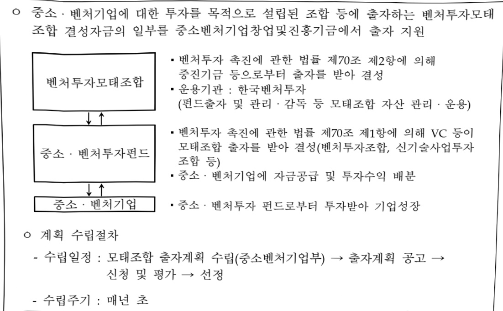

# 중소기업모태조합출자

**해당 페이지**: PDF 4758 ~ 4763 쪽 해당

**부처**: 중소벤처기업부
**분야**: 산업·중소기업 및 에너지
**회계유형**: 기금
**2026 확정예산**: 820000.0 백만원
**전년대비 증감률**: 2.5%
**AI 도메인**: 기타

---

<table border=1 style='margin: auto; word-wrap: break-word;'><tr><td style='text-align: center; word-wrap: break-word;'>사 업 명</td></tr><tr><td style='text-align: center; word-wrap: break-word;'>(14) 중소기업모태조합출자 (5264-301)</td></tr></table>

□ 사업 코드 정보

<table border=1 style='margin: auto; word-wrap: break-word;'><tr><td style='text-align: center; word-wrap: break-word;'>구분</td><td style='text-align: center; word-wrap: break-word;'>기금</td><td style='text-align: center; word-wrap: break-word;'>소관</td><td style='text-align: center; word-wrap: break-word;'>실국(기관)</td><td style='text-align: center; word-wrap: break-word;'>계정</td><td style='text-align: center; word-wrap: break-word;'>분야</td><td style='text-align: center; word-wrap: break-word;'>부문</td></tr><tr><td style='text-align: center; word-wrap: break-word;'>코드</td><td style='text-align: center; word-wrap: break-word;'>중소벤처기업</td><td rowspan="2">중소벤처기업부</td><td rowspan="2">창업벤처혁신실</td><td rowspan="2">-</td><td style='text-align: center; word-wrap: break-word;'>110</td><td style='text-align: center; word-wrap: break-word;'>118</td></tr><tr><td style='text-align: center; word-wrap: break-word;'>명칭</td><td style='text-align: center; word-wrap: break-word;'>창업 및 진흥기금</td><td style='text-align: center; word-wrap: break-word;'>산업·중소기업 및 에너지</td><td style='text-align: center; word-wrap: break-word;'>창업및벤처</td></tr></table>

<table border=1 style='margin: auto; word-wrap: break-word;'><tr><td style='text-align: center; word-wrap: break-word;'>구분</td><td style='text-align: center; word-wrap: break-word;'>프로그램</td><td style='text-align: center; word-wrap: break-word;'>단위사업</td><td style='text-align: center; word-wrap: break-word;'>세부사업</td></tr><tr><td style='text-align: center; word-wrap: break-word;'>코드</td><td style='text-align: center; word-wrap: break-word;'>5200</td><td style='text-align: center; word-wrap: break-word;'>5264</td><td style='text-align: center; word-wrap: break-word;'>301</td></tr><tr><td style='text-align: center; word-wrap: break-word;'>명칭</td><td style='text-align: center; word-wrap: break-word;'>벤처기업활성화지원</td><td style='text-align: center; word-wrap: break-word;'>모태조합출자(기금)</td><td style='text-align: center; word-wrap: break-word;'>중소기업모태조합출자</td></tr></table>

<table border=1 style='margin: auto; word-wrap: break-word;'><tr><td colspan="6">☐ 사업 성격 (공통요구자료 II-1 작성유의사항 4. 참조, 해당하는 사항에 “○” 표시)</td></tr><tr><td rowspan="2">신규 계속</td><td rowspan="2">완료</td><td rowspan="2">예비타당성 실시여부</td><td rowspan="2">총사업비 관리대상</td><td rowspan="2">총액계상 예산사업</td><td style='text-align: center; word-wrap: break-word;'>사업소관 변경정보</td></tr><tr><td style='text-align: center; word-wrap: break-word;'>2025예산 시 소관</td></tr><tr><td style='text-align: center; word-wrap: break-word;'></td><td style='text-align: center; word-wrap: break-word;'>○</td><td style='text-align: center; word-wrap: break-word;'></td><td style='text-align: center; word-wrap: break-word;'></td><td style='text-align: center; word-wrap: break-word;'></td><td style='text-align: center; word-wrap: break-word;'></td></tr></table>

□ 사업 지원 형태 및 지원을 (최소한 한 개는 반드시 선택하시오. 해당사항에 0 표시)

<table border=1 style='margin: auto; word-wrap: break-word;'><tr><td style='text-align: center; word-wrap: break-word;'>직접</td><td style='text-align: center; word-wrap: break-word;'>출자</td><td style='text-align: center; word-wrap: break-word;'>출연</td><td style='text-align: center; word-wrap: break-word;'>보조</td><td style='text-align: center; word-wrap: break-word;'>융자</td><td style='text-align: center; word-wrap: break-word;'>국고보조율(%)</td><td style='text-align: center; word-wrap: break-word;'>융자율(%)</td></tr><tr><td style='text-align: center; word-wrap: break-word;'></td><td style='text-align: center; word-wrap: break-word;'>○</td><td style='text-align: center; word-wrap: break-word;'></td><td style='text-align: center; word-wrap: break-word;'></td><td style='text-align: center; word-wrap: break-word;'></td><td style='text-align: center; word-wrap: break-word;'></td><td style='text-align: center; word-wrap: break-word;'></td></tr></table>

## □사업 소관부처 및 시행주체

<table border=1 style='margin: auto; word-wrap: break-word;'><tr><td style='text-align: center; word-wrap: break-word;'>사업명</td><td colspan="2">구분</td></tr><tr><td rowspan="3">중소기업 모태조합출자</td><td rowspan="2">소관부처</td><td style='text-align: center; word-wrap: break-word;'>창업벤처혁신실 벤처정책관</td></tr><tr><td style='text-align: center; word-wrap: break-word;'>벤처투자과</td></tr><tr><td style='text-align: center; word-wrap: break-word;'>사업시행주체</td><td style='text-align: center; word-wrap: break-word;'>한국벤처투자</td></tr></table>

---

### 가.지출계획 총괄표

(단위: 백만원, %)

<table border=1 style='margin: auto; word-wrap: break-word;'><tr><td rowspan="2">사업명</td><td rowspan="2">2024년 결산</td><td colspan="2">2025년 예산</td><td colspan="2">2026년 예산</td><td rowspan="2">증감(B-A)</td><td rowspan="2">(B-A)/A</td></tr><tr><td style='text-align: center; word-wrap: break-word;'>본예산</td><td style='text-align: center; word-wrap: break-word;'>추경(A)</td><td style='text-align: center; word-wrap: break-word;'>요구안</td><td style='text-align: center; word-wrap: break-word;'>본예산(B)</td></tr><tr><td style='text-align: center; word-wrap: break-word;'>중소기업모태조합출자</td><td style='text-align: center; word-wrap: break-word;'>450,000</td><td style='text-align: center; word-wrap: break-word;'>500,000</td><td style='text-align: center; word-wrap: break-word;'>800,000</td><td style='text-align: center; word-wrap: break-word;'>1,100,000</td><td style='text-align: center; word-wrap: break-word;'>820,000</td><td style='text-align: center; word-wrap: break-word;'>20,000</td><td style='text-align: center; word-wrap: break-word;'>2.5</td></tr></table>

□ 기능별(내역사업별) 계획 내역

(단위:백만원)

<table border=1 style='margin: auto; word-wrap: break-word;'><tr><td rowspan="2"></td><td colspan="5">2024</td><td colspan="5">2025</td><td rowspan="2">2026 계획</td></tr><tr><td style='text-align: center; word-wrap: break-word;'>계획의 (추경)</td><td style='text-align: center; word-wrap: break-word;'>계획 현액</td><td style='text-align: center; word-wrap: break-word;'>집행액</td><td style='text-align: center; word-wrap: break-word;'>이월액</td><td style='text-align: center; word-wrap: break-word;'>불용액</td><td style='text-align: center; word-wrap: break-word;'>계획의 (추경)</td><td style='text-align: center; word-wrap: break-word;'>계획 현액</td><td style='text-align: center; word-wrap: break-word;'>집행액</td><td style='text-align: center; word-wrap: break-word;'>이월액</td><td style='text-align: center; word-wrap: break-word;'>불용액</td></tr><tr><td style='text-align: center; word-wrap: break-word;'>○ 기능별 분류(합계)</td><td style='text-align: center; word-wrap: break-word;'>450,000</td><td style='text-align: center; word-wrap: break-word;'>450,000</td><td style='text-align: center; word-wrap: break-word;'>450,000</td><td style='text-align: center; word-wrap: break-word;'>-</td><td style='text-align: center; word-wrap: break-word;'>-</td><td style='text-align: center; word-wrap: break-word;'>800,000</td><td style='text-align: center; word-wrap: break-word;'>800,000</td><td style='text-align: center; word-wrap: break-word;'>800,000</td><td style='text-align: center; word-wrap: break-word;'>-</td><td style='text-align: center; word-wrap: break-word;'>-</td><td style='text-align: center; word-wrap: break-word;'>820,000</td></tr><tr><td style='text-align: center; word-wrap: break-word;'>• 중소기업모태 조합출자</td><td style='text-align: center; word-wrap: break-word;'>450,000</td><td style='text-align: center; word-wrap: break-word;'>450,000</td><td style='text-align: center; word-wrap: break-word;'>450,000</td><td style='text-align: center; word-wrap: break-word;'>-</td><td style='text-align: center; word-wrap: break-word;'>-</td><td style='text-align: center; word-wrap: break-word;'>800,000</td><td style='text-align: center; word-wrap: break-word;'>800,000</td><td style='text-align: center; word-wrap: break-word;'>800,000</td><td style='text-align: center; word-wrap: break-word;'>-</td><td style='text-align: center; word-wrap: break-word;'>-</td><td style='text-align: center; word-wrap: break-word;'>820,000</td></tr></table>

### 나.사업설명자료

## 1 ) 사업목적·내용

0 (중소기업모태조합출자) 벤처투자모태조합이 중소·벤처기업에 대한 투자를 목적으로 결성되는 민간투자조합에 출자

- 성장 잠재력이 뛰어난 중소·벤처기업의 창업을 활성화하고, 기업 성장에 필요한 투자재원을 마련하기 위해 벤처투자조합의 지속적인 결성을 도모

- 국내 벤처캐피탈 산업의 건전한 육성 기반 조성, 민간 주도 벤처투자시장 정착 촉진

## 2 ) 사업개요

사업근거 및 추진경위

① 법령상 근거 및 조항 : 벤처투자 촉진에 관한 법률 제70조

벤처투자법 제70조(벤처투자모태조합의 결성 등) ① 한국벤처투자는 대통령령으로 정하는 자와 상호출자하여 다음 각 호의 조합 등에 대하여 출자하는 벤처투자모태조합(이하 “모태조합”이라 한다)을 결성할 수 있다.

1. 개인투자조합

---

2. 벤처투자조합

3. 「여신전문금융업법」 제2조제14호의5에 따른 신기술사업투자조합(이하 “신기술사업투자조합”이라 하다)

4. 「산업발전법」 제20조에 따른 기업구조개선 기관전용 사모집합투자기구

5. 「자본시장과 금융투자업에 관한 법률」 제9조제19항제1호에 따른 기관전용 사모 집합투자기구

6. 농림수산식품투자조합 결성 및 운용에 관한 법률 제13조에 따른 농식품투자조합

7. 그 밖에 중소벤처기업부장관이 정하여 고시하는 자

②「중소기업진흥에 관한 법률」 제63조에 따른 중소벤처기업창업 및 진흥기금을 관리하는 자는 같은 법 제67조에도 불구하고 모태조합에 출자할 수 있다.

③ 한국벤처투자는 벤처투자 활성화 등 정책 목적에 따라 모태조합의 자산을 관리

· 운용하여야 한다.

④ 모태조합의 존속기간은 대통령령으로 정하는 기간으로 하며, 그 밖에 모태조합의 관리·운용 등에 필요한 사항은 대통령령으로 정한다.

⑤ 중소벤처기업부장관은 모태조합이 출자한 개인투자조합 또는 벤처투자조합에 대해서는 제13조제1항 및 제2항, 제51조제1항 및 제2항에도 불구하고 투자비율을 달리정할 수 있다.

## ② 추진경위

- '04.7 「중소기업 경쟁력강화 종합대책(04.7)」 및 「벤처기업 활성화 대책(04.12)」을 통해 '1조원 규모의 모태펀드 조성 계획' 발표

- '04.12 '벤처기업육성에 관한 특별조치법' 개정으로 모태조합 결성 및 운용근거 마련

- '05.4 모태조합 출자계획 발표

- '05.6 모태조합 운용기관[한국벤처투자(주)] 출범

- '05.7 모태조합 결성 및 운용 개시

- '08.6 「'08년 하반기 경제운용방향 및 중소기업성공전략회의」에서 모태편드 조성

목표액을 '12년까지 1.6조원 규모로 확대

- '13.5 「벤처·창업 자금생태계 선순환 방안」에서 창업기업 투자를 통한 창조경제 활성화 대책 발표

- '17.11 「혁신창업 생태계 조성방안」에서 국내 모험자본 공급 확충을 위해 향후 3년간 10조원 규모의 혁신모험편드 조성

- '18.1 「민간중심의 벤처생태계 혁신대책」 발표

---

- '19.3 「제2벤처블 확산 전략('19.3.6)」에서 창업벤처기업의 스케일업 지원을 위하여 '19~'22년 12조원의 스케일업 펀드 조성

- '20.4 「제4차 비상경제대책('20.4.8)」에서 우선손실층당 등 벤처투자 촉진제도를 통한 벤처투자 활성화 대책 발표

- '20.7 「한국판 뉴딜 종합계획('20.7.14)'의 일환으로 비대면, 바이오, 그린뉴딜 분야 기업에 집중투자하는 '20~'25년 6조원 규모 스마트대한민국편드 조성계획 발표

- '20.8 벤처투자 소관 법령을 일원화한 '벤처투자 촉진에 관한 법률' 제정

- '21.8 「글로벌 4대 벤처강국 도약을 위한 벤처 보완 대책」 발표

- '22.11 벤처투자 촉진 인센티브 강화 및 민간 벤처모펀드 조성 기반 마련 등을 담은

「역동적 벤처투자생태계 조성방안」발표

- '23.4 「혁신 벤처·스타트업 자금지원 및 경쟁력 강화 방안」 발표

- '23.10 벤처투자 활성화 분위기 마련을 위한 '벤처투자 활력제고 방안' 발표

- '24.10 글로벌 수준의 벤처투자 생태계 조성을 위한 '선진 벤처투자시장 도약방안' 발표

주요내용

① 사업규모

- 사업기간 : '05~'35년

- 최근 5년 간 투입된 사업비

<table border=1 style='margin: auto; word-wrap: break-word;'><tr><td style='text-align: center; word-wrap: break-word;'>연도</td><td style='text-align: center; word-wrap: break-word;'>2022</td><td style='text-align: center; word-wrap: break-word;'>2023</td><td style='text-align: center; word-wrap: break-word;'>2024</td><td style='text-align: center; word-wrap: break-word;'>2025</td><td style='text-align: center; word-wrap: break-word;'>2026</td></tr><tr><td style='text-align: center; word-wrap: break-word;'>사업비</td><td style='text-align: center; word-wrap: break-word;'>460,000</td><td style='text-align: center; word-wrap: break-word;'>283,500</td><td style='text-align: center; word-wrap: break-word;'>450,000</td><td style='text-align: center; word-wrap: break-word;'>800,000</td><td style='text-align: center; word-wrap: break-word;'>820,000</td></tr></table>

② 사업추진체계

- 사업시행방법 : 출자

- 사업시행주체 : (출자) 중소벤처기업진흥공단, (운용) 한국벤처투자

- 사업 수혜자 : 1차(벤처투자조합 등) → 2차(투자조합이 투자하는 중소·벤처기업)

- 보조, 융자, 출연, 출자 등의 경우 보조·융자 등 지원 비율 및 법적근거

(단위: 백만원)

<table border=1 style='margin: auto; word-wrap: break-word;'><tr><td style='text-align: center; word-wrap: break-word;'>내역사업명</td><td style='text-align: center; word-wrap: break-word;'>구분</td><td style='text-align: center; word-wrap: break-word;'>피보조·피출연 등 기관명</td><td style='text-align: center; word-wrap: break-word;'>지원 금액 (2026계획)</td><td style='text-align: center; word-wrap: break-word;'>지원 비율(%)</td><td style='text-align: center; word-wrap: break-word;'>보조율 법적근거 (해당 조항)</td></tr><tr><td style='text-align: center; word-wrap: break-word;'>-</td><td style='text-align: center; word-wrap: break-word;'>줄자</td><td style='text-align: center; word-wrap: break-word;'>벤처투자 모태조합</td><td style='text-align: center; word-wrap: break-word;'>820,000</td><td style='text-align: center; word-wrap: break-word;'>100.0</td><td style='text-align: center; word-wrap: break-word;'>벤처투자 촉진에 관한 법률 제70조 (벤처투자모태조합의 결성 등)</td></tr></table>

* 중소벤처기업진흥공단이 중진기금을 벤처투자모태조합(모태편드)에 출자

---

# 0 중소·벤처기업에 투자자금을 공급, 벤처투자 확대를 통한 일자리 창출 기여

③향후(2026년도 이후)기대효과

<table border=1 style='margin: auto; word-wrap: break-word;'><tr><td style='text-align: center; word-wrap: break-word;'>2022</td><td style='text-align: center; word-wrap: break-word;'>벤처런드 신규 조성 17조 6,401억원, 신규 벤처투자 4,002개사 12조 4,706억원</td></tr><tr><td style='text-align: center; word-wrap: break-word;'>2023</td><td style='text-align: center; word-wrap: break-word;'>벤처런드 신규 조성 13조 328억원, 신규 벤처투자 4,026개사 10조 9,133억원</td></tr><tr><td style='text-align: center; word-wrap: break-word;'>2024</td><td style='text-align: center; word-wrap: break-word;'>벤처런드 신규 조성 10조 5,550억원, 신규 벤처투자 4,697개사 11조 9,457억원</td></tr><tr><td style='text-align: center; word-wrap: break-word;'>2025.3Q</td><td style='text-align: center; word-wrap: break-word;'>벤처런드 신규 조성 9조 7,219억원, 신규 벤처투자 3,136개사 9조 7,780억원</td></tr></table>

② 성과지표 이외의 연도별 사업추진 경과 및 실적

<table border=1 style='margin: auto; word-wrap: break-word;'><tr><td style='text-align: center; word-wrap: break-word;'>성과지표</td><td style='text-align: center; word-wrap: break-word;'>구분</td><td style='text-align: center; word-wrap: break-word;'>2022</td><td style='text-align: center; word-wrap: break-word;'>2023</td><td style='text-align: center; word-wrap: break-word;'>2024</td><td style='text-align: center; word-wrap: break-word;'>2025</td><td style='text-align: center; word-wrap: break-word;'>2026</td><td style='text-align: center; word-wrap: break-word;'>2026 목표치산출근거</td><td style='text-align: center; word-wrap: break-word;'>측정산시(또는 측정방법)</td><td style='text-align: center; word-wrap: break-word;'>자료수집방법(또는 자료출처)</td></tr><tr><td rowspan="3">벤처투자 받은기업의 기업당평균 고용 증가(명)</td><td style='text-align: center; word-wrap: break-word;'>목표</td><td style='text-align: center; word-wrap: break-word;'>신규</td><td style='text-align: center; word-wrap: break-word;'>9.23</td><td style='text-align: center; word-wrap: break-word;'>-</td><td style='text-align: center; word-wrap: break-word;'>-</td><td style='text-align: center; word-wrap: break-word;'>-</td><td rowspan="3">-</td><td rowspan="3">벤처투자 받은전체 기업 중고용정보유효데이터기업의 이전연도대비 기업당평균 고용증가현황 측정</td><td rowspan="3">한국벤처캐피탈협회,근로복지공단</td></tr><tr><td style='text-align: center; word-wrap: break-word;'>실적</td><td style='text-align: center; word-wrap: break-word;'>9.22</td><td style='text-align: center; word-wrap: break-word;'>11.0</td><td style='text-align: center; word-wrap: break-word;'>-</td><td style='text-align: center; word-wrap: break-word;'>-</td><td style='text-align: center; word-wrap: break-word;'>-</td></tr><tr><td style='text-align: center; word-wrap: break-word;'>달성도</td><td style='text-align: center; word-wrap: break-word;'>신규</td><td style='text-align: center; word-wrap: break-word;'>119.2</td><td style='text-align: center; word-wrap: break-word;'>-</td><td style='text-align: center; word-wrap: break-word;'>-</td><td style='text-align: center; word-wrap: break-word;'>-</td></tr><tr><td rowspan="3">매출 천억원을달성한벤처혁인이력기업 수(개)</td><td style='text-align: center; word-wrap: break-word;'>목표</td><td style='text-align: center; word-wrap: break-word;'>639</td><td style='text-align: center; word-wrap: break-word;'>744</td><td style='text-align: center; word-wrap: break-word;'>-</td><td style='text-align: center; word-wrap: break-word;'>-</td><td style='text-align: center; word-wrap: break-word;'>-</td><td rowspan="3">-</td><td rowspan="3">전년 결산기준매출 천억원을달성한 벤처화인이력기업 수측정</td><td rowspan="3">벤처기업협회</td></tr><tr><td style='text-align: center; word-wrap: break-word;'>실적</td><td style='text-align: center; word-wrap: break-word;'>739</td><td style='text-align: center; word-wrap: break-word;'>869</td><td style='text-align: center; word-wrap: break-word;'>-</td><td style='text-align: center; word-wrap: break-word;'>-</td><td style='text-align: center; word-wrap: break-word;'>-</td></tr><tr><td style='text-align: center; word-wrap: break-word;'>달성도</td><td style='text-align: center; word-wrap: break-word;'>115.6</td><td style='text-align: center; word-wrap: break-word;'>116.8</td><td style='text-align: center; word-wrap: break-word;'>-</td><td style='text-align: center; word-wrap: break-word;'>-</td><td style='text-align: center; word-wrap: break-word;'>-</td></tr><tr><td rowspan="3">벤처기업고용증가율(%)</td><td style='text-align: center; word-wrap: break-word;'>목표</td><td style='text-align: center; word-wrap: break-word;'>신규</td><td style='text-align: center; word-wrap: break-word;'>신규</td><td style='text-align: center; word-wrap: break-word;'>4.09</td><td style='text-align: center; word-wrap: break-word;'>-</td><td style='text-align: center; word-wrap: break-word;'>-</td><td rowspan="3">-</td><td rowspan="3">(당해 벤처기업종고용-전년 벤처기업종고용)/전년 벤처기업종고용*100</td><td rowspan="3">고용노동부,벤처화인기관</td></tr><tr><td style='text-align: center; word-wrap: break-word;'>실적</td><td style='text-align: center; word-wrap: break-word;'>신규</td><td style='text-align: center; word-wrap: break-word;'>신규</td><td style='text-align: center; word-wrap: break-word;'>15.6</td><td style='text-align: center; word-wrap: break-word;'>-</td><td style='text-align: center; word-wrap: break-word;'>-</td></tr><tr><td style='text-align: center; word-wrap: break-word;'>달성도</td><td style='text-align: center; word-wrap: break-word;'>-</td><td style='text-align: center; word-wrap: break-word;'>-</td><td style='text-align: center; word-wrap: break-word;'>381.4</td><td style='text-align: center; word-wrap: break-word;'>-</td><td style='text-align: center; word-wrap: break-word;'>-</td></tr><tr><td rowspan="3">신규벤처투자액(조원)</td><td style='text-align: center; word-wrap: break-word;'>목표</td><td style='text-align: center; word-wrap: break-word;'>신규</td><td style='text-align: center; word-wrap: break-word;'>신규</td><td style='text-align: center; word-wrap: break-word;'>신규</td><td style='text-align: center; word-wrap: break-word;'>5.4</td><td style='text-align: center; word-wrap: break-word;'>6.3</td><td rowspan="3">최근3년(22~,24)평균 투자 실적</td><td rowspan="3">벤처투자 벤처투자조합의투자실적</td><td rowspan="3">VC협회 짐계</td></tr><tr><td style='text-align: center; word-wrap: break-word;'>실적</td><td style='text-align: center; word-wrap: break-word;'>6.76</td><td style='text-align: center; word-wrap: break-word;'>5.4</td><td style='text-align: center; word-wrap: break-word;'>6.6</td><td style='text-align: center; word-wrap: break-word;'>-</td><td style='text-align: center; word-wrap: break-word;'></td></tr><tr><td style='text-align: center; word-wrap: break-word;'>달성도</td><td style='text-align: center; word-wrap: break-word;'>-</td><td style='text-align: center; word-wrap: break-word;'>-</td><td style='text-align: center; word-wrap: break-word;'>-</td><td style='text-align: center; word-wrap: break-word;'>-</td><td style='text-align: center; word-wrap: break-word;'></td></tr></table>

① 2022~2026년도 성과계획서 상 성과지표 및 최근 5년간 성과 달성도

사업영향,산출물 성과지표 등

4) 사업효과

☐ 중소기업모태조합출자 : (2025 추경) 800,000백만원 → (2026 계획) 820,000백만원, 20,000백만원 증택

(2025 당초 계획 500,000백만원 → 제2회 추경 800,000백만원)

- (내용) 4대 벤처강국 도약 등 국정과제 이행을 위한 투자 마중물 공급

- (산출) 전략육성 400,000백만원, 투자플랫폼 100,000백만원, 시장보완 290,000백만원, 회수활성화 30,000백만원

---

5) 타당성조사 및 예비타당성조사 시행여부 및 결과 요지 : 해당 없음

6) 총사업비 대상사업 정보 : 해당 없음

7) 사업 집행절차

중소·벤처기업에 대한 투자를 목적으로 설립된 조합 등에 출자하는 벤처투자모태조합 결성자금의 일부를 중소벤처기업창업및진흥기금에서 출자 지원

0 계획 수립절차

- 수립일정 : 모태조합 출자계획 수립(중소벤처기업부) → 출자계획 공고 →

신청 및 평가 → 선정

8) 각종 평가

1) 2023년도 부처 재정사업 자율평가 결과: 우수(92.5점, '24.4)

2) 2024년도 부처 재정사업 자율평가 결과: 우수(91.3점, '25.4)

### 다. 최근 4년간 결산내역

1) 결산표

☐ 부처 결산내역

(단위: 백만원, %)

<table border=1 style='margin: auto; word-wrap: break-word;'><tr><td rowspan="2">연도</td><td colspan="3">계획액</td><td rowspan="2">계획현액(A)</td><td rowspan="2">집행액(B)</td><td rowspan="2">집행률(B/A)</td><td rowspan="2">다음연도이월액</td><td rowspan="2">불용액</td></tr><tr><td style='text-align: center; word-wrap: break-word;'>본예산</td><td style='text-align: center; word-wrap: break-word;'>추경증감액</td><td style='text-align: center; word-wrap: break-word;'>추경</td></tr><tr><td style='text-align: center; word-wrap: break-word;'>2022</td><td style='text-align: center; word-wrap: break-word;'>460,000</td><td style='text-align: center; word-wrap: break-word;'>-</td><td style='text-align: center; word-wrap: break-word;'>460,000</td><td style='text-align: center; word-wrap: break-word;'>460,000</td><td style='text-align: center; word-wrap: break-word;'>460,000</td><td style='text-align: center; word-wrap: break-word;'>100.0</td><td style='text-align: center; word-wrap: break-word;'>-</td><td style='text-align: center; word-wrap: break-word;'>-</td></tr><tr><td style='text-align: center; word-wrap: break-word;'>2023</td><td style='text-align: center; word-wrap: break-word;'>283,500</td><td style='text-align: center; word-wrap: break-word;'>-</td><td style='text-align: center; word-wrap: break-word;'>283,500</td><td style='text-align: center; word-wrap: break-word;'>283,500</td><td style='text-align: center; word-wrap: break-word;'>283,500</td><td style='text-align: center; word-wrap: break-word;'>100.0</td><td style='text-align: center; word-wrap: break-word;'>-</td><td style='text-align: center; word-wrap: break-word;'>-</td></tr><tr><td style='text-align: center; word-wrap: break-word;'>2024</td><td style='text-align: center; word-wrap: break-word;'>450,000</td><td style='text-align: center; word-wrap: break-word;'>-</td><td style='text-align: center; word-wrap: break-word;'>450,000</td><td style='text-align: center; word-wrap: break-word;'>450,000</td><td style='text-align: center; word-wrap: break-word;'>450,000</td><td style='text-align: center; word-wrap: break-word;'>100.0</td><td style='text-align: center; word-wrap: break-word;'>-</td><td style='text-align: center; word-wrap: break-word;'>-</td></tr><tr><td style='text-align: center; word-wrap: break-word;'>2025</td><td style='text-align: center; word-wrap: break-word;'>500,000</td><td style='text-align: center; word-wrap: break-word;'>300,000</td><td style='text-align: center; word-wrap: break-word;'>800,000</td><td style='text-align: center; word-wrap: break-word;'>800,000</td><td style='text-align: center; word-wrap: break-word;'>800,000</td><td style='text-align: center; word-wrap: break-word;'>100.0</td><td style='text-align: center; word-wrap: break-word;'>-</td><td style='text-align: center; word-wrap: break-word;'>-</td></tr></table>

2) 주요 결산사항 : 해당 없음

---

### 원본 PDF 크롭 이미지

