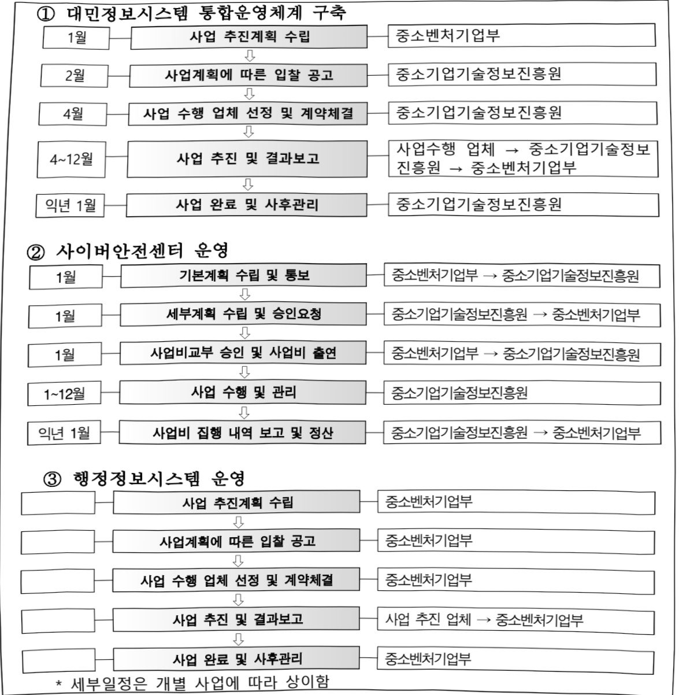

# 중소벤처행정정보화(정보화)

**해당 페이지**: PDF 4764 ~ 4770 쪽 해당

**부처**: 중소벤처기업부
**분야**: 산업·중소기업 및 에너지
**회계유형**: 일반회계
**2026 확정예산**: 13944.0 백만원
**전년대비 증감률**: 25.0%
**AI 도메인**: 보안/사이버

---

<table border=1 style='margin: auto; word-wrap: break-word;'><tr><td style='text-align: center; word-wrap: break-word;'>사 업 명</td></tr><tr><td style='text-align: center; word-wrap: break-word;'>(57) 중소벤처행정정보화 (7232-503)</td></tr></table>

사업 코드 정보

<table border=1 style='margin: auto; word-wrap: break-word;'><tr><td style='text-align: center; word-wrap: break-word;'>구분</td><td style='text-align: center; word-wrap: break-word;'>회계</td><td style='text-align: center; word-wrap: break-word;'>소관</td><td style='text-align: center; word-wrap: break-word;'>실국(기관)</td><td style='text-align: center; word-wrap: break-word;'>계정</td><td style='text-align: center; word-wrap: break-word;'>분야</td><td style='text-align: center; word-wrap: break-word;'>부문</td></tr><tr><td style='text-align: center; word-wrap: break-word;'>코드</td><td rowspan="2">일반회계</td><td rowspan="2">중소벤처기업부</td><td rowspan="2">정책기획관</td><td rowspan="2">-</td><td style='text-align: center; word-wrap: break-word;'>110</td><td style='text-align: center; word-wrap: break-word;'>116</td></tr><tr><td style='text-align: center; word-wrap: break-word;'>명칭</td><td style='text-align: center; word-wrap: break-word;'>산업·중소기업 및 에너지</td><td style='text-align: center; word-wrap: break-word;'>산업·중소기업 일반</td></tr></table>

<table border=1 style='margin: auto; word-wrap: break-word;'><tr><td style='text-align: center; word-wrap: break-word;'>구분</td><td style='text-align: center; word-wrap: break-word;'>프로그램</td><td style='text-align: center; word-wrap: break-word;'>단위사업</td><td style='text-align: center; word-wrap: break-word;'>세부사업</td></tr><tr><td style='text-align: center; word-wrap: break-word;'>코드</td><td style='text-align: center; word-wrap: break-word;'>7200</td><td style='text-align: center; word-wrap: break-word;'>7232</td><td style='text-align: center; word-wrap: break-word;'>503</td></tr><tr><td style='text-align: center; word-wrap: break-word;'>명칭</td><td style='text-align: center; word-wrap: break-word;'>중소기업행정지원</td><td style='text-align: center; word-wrap: break-word;'>정책정보제공기반구축(정보화)</td><td style='text-align: center; word-wrap: break-word;'>중소벤처행정정보화(정보화)</td></tr></table>

□ 사업 성격 (공통요구자료 II-1 작성유의사항 4. 참조, 해당하는 사항에 “○” 표시)

<table border=1 style='margin: auto; word-wrap: break-word;'><tr><td rowspan="2">신규</td><td rowspan="2">계속</td><td rowspan="2">완료</td><td rowspan="2">예비타당성 실시여부</td><td rowspan="2">총사업비 관리대상</td><td rowspan="2">총액계상 예산사업</td><td style='text-align: center; word-wrap: break-word;'>사업소관 변경정보</td></tr><tr><td style='text-align: center; word-wrap: break-word;'>2025예산 시 소관</td></tr><tr><td style='text-align: center; word-wrap: break-word;'></td><td style='text-align: center; word-wrap: break-word;'>○</td><td style='text-align: center; word-wrap: break-word;'></td><td style='text-align: center; word-wrap: break-word;'></td><td style='text-align: center; word-wrap: break-word;'></td><td style='text-align: center; word-wrap: break-word;'></td><td style='text-align: center; word-wrap: break-word;'></td></tr></table>

□ 사업 지원 형태 및 지원을 (최소한 한 개는 반드시 선택하시오. 해당사항에 0 표시)

<table border=1 style='margin: auto; word-wrap: break-word;'><tr><td style='text-align: center; word-wrap: break-word;'>직접</td><td style='text-align: center; word-wrap: break-word;'>출자</td><td style='text-align: center; word-wrap: break-word;'>출연</td><td style='text-align: center; word-wrap: break-word;'>보조</td><td style='text-align: center; word-wrap: break-word;'>융자</td><td style='text-align: center; word-wrap: break-word;'>국고보조율(%)</td><td style='text-align: center; word-wrap: break-word;'>융자율(%)</td></tr><tr><td style='text-align: center; word-wrap: break-word;'>○</td><td style='text-align: center; word-wrap: break-word;'></td><td style='text-align: center; word-wrap: break-word;'>○</td><td style='text-align: center; word-wrap: break-word;'></td><td style='text-align: center; word-wrap: break-word;'></td><td style='text-align: center; word-wrap: break-word;'></td><td style='text-align: center; word-wrap: break-word;'></td></tr></table>

## 사업 소관부처 및 시행주체

<table border=1 style='margin: auto; word-wrap: break-word;'><tr><td style='text-align: center; word-wrap: break-word;'>사업명</td><td colspan="2">구분</td></tr><tr><td rowspan="2">대만정보시스템 통합운영체 계구축</td><td style='text-align: center; word-wrap: break-word;'>소관부처</td><td style='text-align: center; word-wrap: break-word;'>기획조정실 정책기획관 정보화담당관</td></tr><tr><td style='text-align: center; word-wrap: break-word;'>사업시행주체</td><td style='text-align: center; word-wrap: break-word;'>중소기업기술정보진흥원</td></tr><tr><td rowspan="2">사이버안전센터운영</td><td style='text-align: center; word-wrap: break-word;'>소관부처</td><td style='text-align: center; word-wrap: break-word;'>기획조정실 정책기획관 정보화담당관</td></tr><tr><td style='text-align: center; word-wrap: break-word;'>사업시행주체</td><td style='text-align: center; word-wrap: break-word;'>중소기업기술정보진흥원</td></tr><tr><td rowspan="2">행정정보시스템운영</td><td style='text-align: center; word-wrap: break-word;'>소관부처</td><td style='text-align: center; word-wrap: break-word;'>기획조정실 정책기획관 정보화담당관</td></tr><tr><td style='text-align: center; word-wrap: break-word;'>사업시행주체</td><td style='text-align: center; word-wrap: break-word;'>-</td></tr></table>

---

### 가. 예산 총괄표

(단위: 백만원, %)

<table border=1 style='margin: auto; word-wrap: break-word;'><tr><td rowspan="2">사업명</td><td rowspan="2">2024년 결산</td><td colspan="2">2025년 예산</td><td colspan="2">2026년 예산</td><td rowspan="2">증감(B-A)</td><td rowspan="2">(B-A)/A</td></tr><tr><td style='text-align: center; word-wrap: break-word;'>본예산</td><td style='text-align: center; word-wrap: break-word;'>추경(A)</td><td style='text-align: center; word-wrap: break-word;'>요구안</td><td style='text-align: center; word-wrap: break-word;'>본예산(B)</td></tr><tr><td style='text-align: center; word-wrap: break-word;'>중소벤처행정정보화(정보화)</td><td style='text-align: center; word-wrap: break-word;'>6,909</td><td style='text-align: center; word-wrap: break-word;'>11,156</td><td style='text-align: center; word-wrap: break-word;'>11,156</td><td style='text-align: center; word-wrap: break-word;'>14,147</td><td style='text-align: center; word-wrap: break-word;'>13,944</td><td style='text-align: center; word-wrap: break-word;'>2,788</td><td style='text-align: center; word-wrap: break-word;'>25.0</td></tr></table>

□ 기능별(내역사업별) 예산 내역

(단위:백만원)

<table border=1 style='margin: auto; word-wrap: break-word;'><tr><td rowspan="2"></td><td colspan="5">2024</td><td colspan="5">2025</td><td rowspan="2">2026예산</td></tr><tr><td style='text-align: center; word-wrap: break-word;'>예산액(추경)</td><td style='text-align: center; word-wrap: break-word;'>예산현액</td><td style='text-align: center; word-wrap: break-word;'>집행액</td><td style='text-align: center; word-wrap: break-word;'>이월액</td><td style='text-align: center; word-wrap: break-word;'>불용액</td><td style='text-align: center; word-wrap: break-word;'>예산액(추경)</td><td style='text-align: center; word-wrap: break-word;'>예산현액</td><td style='text-align: center; word-wrap: break-word;'>집행액</td><td style='text-align: center; word-wrap: break-word;'>이월액</td><td style='text-align: center; word-wrap: break-word;'>불용액</td></tr><tr><td style='text-align: center; word-wrap: break-word;'>○ 기능별 분류(합계)</td><td style='text-align: center; word-wrap: break-word;'>6,928</td><td style='text-align: center; word-wrap: break-word;'>6,928</td><td style='text-align: center; word-wrap: break-word;'>6,909</td><td style='text-align: center; word-wrap: break-word;'>-</td><td style='text-align: center; word-wrap: break-word;'>19</td><td style='text-align: center; word-wrap: break-word;'>11,156</td><td style='text-align: center; word-wrap: break-word;'>11,156</td><td style='text-align: center; word-wrap: break-word;'>10,909</td><td style='text-align: center; word-wrap: break-word;'>-</td><td style='text-align: center; word-wrap: break-word;'>247</td><td style='text-align: center; word-wrap: break-word;'>13,944</td></tr><tr><td style='text-align: center; word-wrap: break-word;'>• 대민정보시스템통합운영체계 구축</td><td style='text-align: center; word-wrap: break-word;'>3,263</td><td style='text-align: center; word-wrap: break-word;'>3,263</td><td style='text-align: center; word-wrap: break-word;'>3,263</td><td style='text-align: center; word-wrap: break-word;'>-</td><td style='text-align: center; word-wrap: break-word;'>-</td><td style='text-align: center; word-wrap: break-word;'>7,353</td><td style='text-align: center; word-wrap: break-word;'>7,353</td><td style='text-align: center; word-wrap: break-word;'>7,136</td><td style='text-align: center; word-wrap: break-word;'>-</td><td style='text-align: center; word-wrap: break-word;'>217</td><td style='text-align: center; word-wrap: break-word;'>10,464</td></tr><tr><td style='text-align: center; word-wrap: break-word;'>• 사이버안전센터운영</td><td style='text-align: center; word-wrap: break-word;'>1,837</td><td style='text-align: center; word-wrap: break-word;'>1,837</td><td style='text-align: center; word-wrap: break-word;'>1,837</td><td style='text-align: center; word-wrap: break-word;'>-</td><td style='text-align: center; word-wrap: break-word;'>-</td><td style='text-align: center; word-wrap: break-word;'>1,837</td><td style='text-align: center; word-wrap: break-word;'>1,837</td><td style='text-align: center; word-wrap: break-word;'>1,837</td><td style='text-align: center; word-wrap: break-word;'>-</td><td style='text-align: center; word-wrap: break-word;'>-</td><td style='text-align: center; word-wrap: break-word;'>1,837</td></tr><tr><td style='text-align: center; word-wrap: break-word;'>• 행정정보시스템운영</td><td style='text-align: center; word-wrap: break-word;'>1,828</td><td style='text-align: center; word-wrap: break-word;'>1,828</td><td style='text-align: center; word-wrap: break-word;'>1,809</td><td style='text-align: center; word-wrap: break-word;'>-</td><td style='text-align: center; word-wrap: break-word;'>19</td><td style='text-align: center; word-wrap: break-word;'>1,566</td><td style='text-align: center; word-wrap: break-word;'>1,566</td><td style='text-align: center; word-wrap: break-word;'>1,536</td><td style='text-align: center; word-wrap: break-word;'>-</td><td style='text-align: center; word-wrap: break-word;'>30</td><td style='text-align: center; word-wrap: break-word;'>1,643</td></tr><tr><td style='text-align: center; word-wrap: break-word;'>• 정부금융지원검색서비스</td><td style='text-align: center; word-wrap: break-word;'>-</td><td style='text-align: center; word-wrap: break-word;'>-</td><td style='text-align: center; word-wrap: break-word;'>-</td><td style='text-align: center; word-wrap: break-word;'>-</td><td style='text-align: center; word-wrap: break-word;'>-</td><td style='text-align: center; word-wrap: break-word;'>400</td><td style='text-align: center; word-wrap: break-word;'>400</td><td style='text-align: center; word-wrap: break-word;'>400</td><td style='text-align: center; word-wrap: break-word;'>-</td><td style='text-align: center; word-wrap: break-word;'>-</td><td style='text-align: center; word-wrap: break-word;'>순감</td></tr></table>

### 나. 사업설명자료

## 1 ) 사업목적·내용

- (대민정보시스템 통합운영체계구축) 중소벤처·소상공인이 중기부에서 제공하는 정책

서비스를 한 곳에서 편리하게 사용할 수 있도록 대민정보통합시스템 구축

- (사이버안전센터 운영) 부 및 소속·산하기관에 대한 보안관제와 정보보호 활동을 통해 외부 사이버위협으로부터 중요 정보자원을 보호

- (행정정보시스템 운영) 업무포털, 누리집 등 기관 내·외부 업무시스템의 기능개선으로 시스템의 안정적 운영과 효율적인 행정업무수행을 지원

## 2 ) 사업개요

사업근거 및 추진경위

① 법령상 근거 및 조항 적시

---

- 대민정보시스템 통합운영체계 구축

「전자정부법」 제20조(전자정부 포털의 운영) ① 국가는 국민에게 전자정부서비스를 효율적으로 제공하기 위하여 인터넷 기반의 통합정보시스템(이하 “전자정부 포털”이라 한다)을 구축 · 관리하고 활용을 촉진하여야 한다.

제64조의2(전자정부사업관리의 위낙)① 행성기관능의 상은 전자정무사업을 효율적으로 수행하기 위하여 다음 각 호의 어느 하나에 해당하는 사업에 대하여 관리·감독하는 업무(이하 “전자정부사업관리”라 한다)의 전부 또는 일부를 전문지식과 기술능력을 갖춘 자에게 위탁할 수 있으며, 대상이 되는 전자정부사업의 구체적인 범위 및 전자정부사업관리를 수탁할 수 있는 자의 자격요건은 대통령령으로 정한다.

1. 대국민 서비스 및 행정의 효율성에 미치는 영향이 큰 사업

2. 사업의 난이도가 높아 특별한 관리가 필요한 사업

3. 그 밖에 사업의 원활한 수행을 위하여 행정기관등의 장이 전자정부사업관리의 위탁이 필요하다고 인정하는 경우

「전자정부법 시행령」 제78조의3(전자정부사업관리자의 자격요건) 법 제64조의2제1항에 따라 전자정부사업관리를 수탁할 수 있는 자의 자격요건은 다음각 호와 같다.

1. 법 제2조제3호에 따른 공공기관. 다만, 같은 호 라목에 따른 학교는 제외한다.

「중소기업 기술혁신 촉진법」제20조(중소기업기술정보진흥원) ①~③ (생략)

④ 기술정보진흥원은 다음 각 호의 사업을 한다.

1. ~ 6. (생략)

7. 그 밖에 관계중앙행정기관의 장이 위탁하는 사업

⑤ 정부는 기술정보진흥원의 설립·운영에 필요한 경비를 예산의 범위에서 출연할 수 있으며, 중앙행정기관의 장 및 지방자치단체의 장은 제4항 각 호의 사업을 기술정보진흥원으로 하여금 수행하게 할 수 있고 그에 드는 비용의 전부 또는 일부를 출연 또는 보조할 수 있다.

「중소기업기본법」제20조의 2 및 동법 시행령 제10조의3, 제10조의4(중소기업 지원사업 통합 관리시스템의 구축 및 운영)

디지털플랫폼정부 선도과제 세부 추진계획 의결('22.12, 디플정위원회)

* 지원사업 원스톱·맞춤형 서비스 제공, 민간플랫폼 연계를 통한 다양한 서비스 제공을 위해 중소기업 통합 플랫폼 구축(선도과제 선정)

## -사이버안전센터 운영

「국가사이버안전관리규정」(2013.9.2.)

제10조의2(보안관제센터의 설치·운영) ① 중앙행정기관의 장, 지방자치단체의 장 및 공공기관의 장은 사이버공격 정보를 탐지·분석하여 즉시 대응 조치를 할 수 있는 기구(이하 "보안관제센터"라 한다)를 설치·운영하여야 한다. 다만, 보안관제센터를 설치·운영하지 못하는 경우에는 다른 중앙행정기관(국가정보원을 포함한다)의 장, 지방자치단체의 장 및 관계 공공기관의 장이 설치·운영하는 보안관제센터에 그 업무를 위탁할 수 있다.

「중소벤처기업부 정보보안 기본지침」(2023.5.22)

제115조(보안관제센터의 설치·운영) ② 중소벤처기업부 장관은 센터의 효율적인 운영관리를 위하여 중소기업기술정보진흥원을 운영전담기관(이하 ‘운영기관’이라 한다)으로 지정한다.

## -행정정보시스템 운영

「전자정부법」 제25조(전자문서의 작성 등) ① 행정기관등의 문서는 전자문서를 기본으로 하여 작성, 발송, 접수, 보관, 보존 및 활용되어야 한다.

「지능정보화기본법」 제14조(공공지능정보화의 추진) ① 국가기관들은 공공서비스의 지능정보화를 도모하고 국민 편익 증진 등을 위하여 행정, 보건, 사회복지, 교육, 문화, 환경, 교통, 물류, 과학기술, 재난안전, 치안, 국방, 에너지 등 소관 업무에 대한 지능정보화(이하 “공공지능정보화”라 한다)를 추진하여야 한다.

---

## ② 추진경위

## - 대민정보시스템 통합운영체계 구축

- (15.04) 정보시스템 통폐합을 위한 정보시스템 합리화 계획 수립

- (17.02) 정보시스템 합리화 용역 추진

- (18.06) 대민정보시스템 통합 ISP 완료

- (19.01) 대민정보시스템 통합운영체계 구축 1단계 사업 추진

- (20.01) 대민정보시스템 통합운영체계 구축 2단계 사업 추진

- (20.07) 디지털정부혁신 과제 선정(행안부)

- (20.08) 대민정보시스템 통합운영체계 ‘중소벤처24’ 서비스 개시

- (21.01) 대민정보시스템 통합운영체계 구축 3단계 사업 추진

- (22.01) 대민정보시스템 통합운영체계 구축 4단계 사업 추진

- (22.12) 디지털플랫폼정부위원회 ‘중소기업 통합플랫폼’ 선도과제 선정

-(23.01) 대민정보시스템 통합운영체계 고도화 및 운영 유지보수 단계로 전환

-(23.12) '중소기업 통합플랫폼' ISP 용역 추진

- (24.01~ ) 대민정보시스템 통합운영체계 기능개선 및 운영유지보수사업

-(25.09) '중소기업 통합플랫폼(가칭)' 구축 1단계 사업 추진

## -사이버안전센터 운영

- (15.01) 중소기업청 보안관제센터 운영 개시

- (15.12) 중소기업청 및 산하기관 대상 사이버위협 864건 대응

- (16.05) 사이버안전센터 관제 대상기관 14개 추가 확대

- (18.03) 공공기관 신규 편입 3개 기관, 보안관제 추가 편입

- (20.12) 인공지능 보안관제 시스템 구축

- (21.05) 위탁운영기관 이전에 따라 사이버안전센터 이전(대전→세종)

- (22.01) 개인정보 노출점 컨 시스템 고도화

- (23.05) 암호가시화 장비 구축으로 SSL(암호화) 트래픽 모니터링 체계 구축

- (24.07) SOAR(사이버공격 대응 자동화) 시스템 구축

- (25.12) SOAR(사이버공격 대응 자동화) 시스템 정책 고도화

## -행정정보시스템 운영

- (08.11) 지식관리시스템에서 업무포털시스템으로 전면 개편

- (13.12) 전자정부 2.0 표준프레임워크 기반 재구축, 서버 교체 및 추가

- (18.11) 내부업무시스템(아름터) 전면 개편

- (19.12) 부 누리집 전면 개편

- (20.12) 내부업무시스템(아름터) G클라우드 전환

- (21.12) 부 누리집 개편 및 검색 솔루션 교체 추진

- (22.04) 중기부 대표 누리집 콘텐츠 관리시스템 고도화 추진

- (23.05) 중기부 대표 누리집 DB 암호화 솔루션 도입 추진

- (23.12) 중소벤처기업부 업무소통 시스템 고도화

- (24.12) 중소벤처기업부 대표 누리집 시스템 고도화

## -정부금융검색서비스

- (24.4) 기획재정부 국민참여예산 선정

중소벤처24 정보시스템에 정부 정책금융정보 서비스 기능 추가

---

주요내용

① 사업규모

- 총사업비 : 해당없음

- 사업기간 : 계속사업

- 최근 5년 간 투입된 사업비(예산액기준, 추경편성한 연도에는 추경포함)

<table border=1 style='margin: auto; word-wrap: break-word;'><tr><td style='text-align: center; word-wrap: break-word;'>$ \underline{\text{闻}} $</td><td style='text-align: center; word-wrap: break-word;'>2022</td><td style='text-align: center; word-wrap: break-word;'>2023</td><td style='text-align: center; word-wrap: break-word;'>2024</td><td style='text-align: center; word-wrap: break-word;'>2025</td><td style='text-align: center; word-wrap: break-word;'>2026</td></tr><tr><td style='text-align: center; word-wrap: break-word;'>$ \underline{\text{人}} $</td><td style='text-align: center; word-wrap: break-word;'>9,320</td><td style='text-align: center; word-wrap: break-word;'>7,807</td><td style='text-align: center; word-wrap: break-word;'>6,928</td><td style='text-align: center; word-wrap: break-word;'>11,156</td><td style='text-align: center; word-wrap: break-word;'>13,944</td></tr></table>

② 사업추진체계

- 사업시행방법 : 직접수행, 출연

- 사업시행주체 : 중소벤처기업부, 중소기업기술정보진흥원

- 사업 수혜자 : 중소벤처·소상공인

- 보조, 융자, 출연, 출자 등의 경우 보조·융자 등 지원 비율 및 법적근거

<table border=1 style='margin: auto; word-wrap: break-word;'><tr><td style='text-align: center; word-wrap: break-word;'>내역사업명</td><td style='text-align: center; word-wrap: break-word;'>구분</td><td style='text-align: center; word-wrap: break-word;'>피보조·피출연 등 기관명</td><td style='text-align: center; word-wrap: break-word;'>지원 금액 (2026예산)</td><td style='text-align: center; word-wrap: break-word;'>지원 비율(%)</td><td style='text-align: center; word-wrap: break-word;'>보조율 법적근거 (해당 조항)</td></tr><tr><td style='text-align: center; word-wrap: break-word;'>대민정보시스템 통합운영체계 구축</td><td style='text-align: center; word-wrap: break-word;'>출연</td><td style='text-align: center; word-wrap: break-word;'>중소기업 기술정보 진흥원</td><td style='text-align: center; word-wrap: break-word;'>10,464</td><td style='text-align: center; word-wrap: break-word;'>100</td><td style='text-align: center; word-wrap: break-word;'>전자정부법 제64조의2, 전자정부법 시행령 제78조의3, 중소기업 기술혁신 촉진법 제20조제4항7호</td></tr><tr><td style='text-align: center; word-wrap: break-word;'>사이버안전센터 운영</td><td style='text-align: center; word-wrap: break-word;'>출연</td><td style='text-align: center; word-wrap: break-word;'>중소기업 기술정보 진흥원</td><td style='text-align: center; word-wrap: break-word;'>1,837</td><td style='text-align: center; word-wrap: break-word;'>100</td><td style='text-align: center; word-wrap: break-word;'>전자정부법 제64조의2, 전자정부법 시행령 제78조의3, 중소기업 기술혁신 촉진법 제20조제4항7호</td></tr><tr><td style='text-align: center; word-wrap: break-word;'>행정정보시스템 운영</td><td style='text-align: center; word-wrap: break-word;'>직접 수행</td><td style='text-align: center; word-wrap: break-word;'>중소벤처 기업부</td><td style='text-align: center; word-wrap: break-word;'>1,643</td><td style='text-align: center; word-wrap: break-word;'>100</td><td style='text-align: center; word-wrap: break-word;'>전자정부법 제25조(전자문서의 작성 등) 지능정보화기본법 제14조(공공지능정보화의 추진)</td></tr></table>

## 3 ) 2026년도 예산 산출 근거

☐ 중소벤처행정정보화(정보화) : (2025 예산) 11,156백만원 → (2026 예산) 13,944백만원, 2,788백만원 증액(+25.0%)

① 대민정보시스템통합운영체계 구축 : (2025 본예산) 7,353백만원 → (2026 예산) 10,464백만원, 3,111백만원 증액(+42.3%) - (내용) 인건비 등 전담기관 운영비, 중소벤처24 운영비 및 중소기업 통합플랫폼 2단계 구축비

- (산출) 중소벤처24 전담기관운영비(420백만원), 중소벤처24 시스템 운영비(1,851백만원), 중소기업 통합플랫폼 2단계 구축비(8,193백만원)

② 사이버안전센터 운영 : (2025 본예산) 1,837백만원 → (2026 본예산) 1,837백만원, 전년동 - (내용) 사이버안전센터 위탁운영 및 보안관제 장비 고도화

- (산출) 전담기관 운영비 109백만원, 보안관제 위탁운영 1,728백만원

③ 행정정보시스템 운영 : (2025 본예산) 1,566백만원 → (2026 본예산) 1,643백만원, 77백만원 증액(4.9%)

- (내용) 정보시스템 운영 유지보수와 노후 장비 교체 및 신규 솔루션 도입 예산

- (산출) 정보시스템 유지보수 용역 및 솔루션 도입 1,633백만원, 정보화 운영 협의회 등 10백만원

---

4) 사업효과 : 해당없음(성과관리 비대상)

5) 타당성조사 및 예비타당성조사 시행여부 및 결과 요지 : 해당없음

6) 총사업비 대상사업 정보 : 해당없음

7) 사업 집행절차

8) 각종 평가 : 해당없음

---

### 다. 최근 4년간 결산내역

## 1 ) 결산표

☐ 부처 결산내역

(단위: 백만원, %)

<table border=1 style='margin: auto; word-wrap: break-word;'><tr><td rowspan="2">闰五</td><td colspan="3">예산액</td><td rowspan="2">예산현액(A)</td><td rowspan="2">집행액(B)</td><td rowspan="2">집행률(B/A)</td><td rowspan="2">다음연도이월액</td><td rowspan="2">불용액</td></tr><tr><td style='text-align: center; word-wrap: break-word;'>본예산</td><td style='text-align: center; word-wrap: break-word;'>추경증감액</td><td style='text-align: center; word-wrap: break-word;'>추경</td></tr><tr><td style='text-align: center; word-wrap: break-word;'>2022</td><td style='text-align: center; word-wrap: break-word;'>9,320</td><td style='text-align: center; word-wrap: break-word;'>9,320</td><td style='text-align: center; word-wrap: break-word;'>9,320</td><td style='text-align: center; word-wrap: break-word;'>9,320</td><td style='text-align: center; word-wrap: break-word;'>9,265</td><td style='text-align: center; word-wrap: break-word;'>99.4</td><td style='text-align: center; word-wrap: break-word;'>-</td><td style='text-align: center; word-wrap: break-word;'>55</td></tr><tr><td style='text-align: center; word-wrap: break-word;'>2023</td><td style='text-align: center; word-wrap: break-word;'>7,807</td><td style='text-align: center; word-wrap: break-word;'>7,807</td><td style='text-align: center; word-wrap: break-word;'>7,807</td><td style='text-align: center; word-wrap: break-word;'>7,807</td><td style='text-align: center; word-wrap: break-word;'>7,763</td><td style='text-align: center; word-wrap: break-word;'>99.4</td><td style='text-align: center; word-wrap: break-word;'>-</td><td style='text-align: center; word-wrap: break-word;'>44</td></tr><tr><td style='text-align: center; word-wrap: break-word;'>2024</td><td style='text-align: center; word-wrap: break-word;'>6,928</td><td style='text-align: center; word-wrap: break-word;'>6,928</td><td style='text-align: center; word-wrap: break-word;'>6,928</td><td style='text-align: center; word-wrap: break-word;'>6,928</td><td style='text-align: center; word-wrap: break-word;'>6,909</td><td style='text-align: center; word-wrap: break-word;'>99.7</td><td style='text-align: center; word-wrap: break-word;'>-</td><td style='text-align: center; word-wrap: break-word;'>19</td></tr><tr><td style='text-align: center; word-wrap: break-word;'>2025</td><td style='text-align: center; word-wrap: break-word;'>11,156</td><td style='text-align: center; word-wrap: break-word;'>11,156</td><td style='text-align: center; word-wrap: break-word;'>11,156</td><td style='text-align: center; word-wrap: break-word;'>11,156</td><td style='text-align: center; word-wrap: break-word;'>10,909</td><td style='text-align: center; word-wrap: break-word;'>97.8</td><td style='text-align: center; word-wrap: break-word;'>-</td><td style='text-align: center; word-wrap: break-word;'>247</td></tr></table>

## 2 ) 주요 결산사항

□ 2022~2025년 결산 주요사항

<table border=1 style='margin: auto; word-wrap: break-word;'><tr><td style='text-align: center; word-wrap: break-word;'>2022</td><td style='text-align: center; word-wrap: break-word;'>- 정보시스템 유지보수 용역 등 낙찰차액 불용(55백만원)</td></tr><tr><td style='text-align: center; word-wrap: break-word;'>2023</td><td style='text-align: center; word-wrap: break-word;'>- 정보시스템 유지보수 용역 등 낙찰차액 불용(44백만원)</td></tr><tr><td style='text-align: center; word-wrap: break-word;'>2024</td><td style='text-align: center; word-wrap: break-word;'>- 정보시스템 유지보수 용역 등 낙찰차액 불용(19백만원)</td></tr><tr><td style='text-align: center; word-wrap: break-word;'>2025</td><td style='text-align: center; word-wrap: break-word;'>- 중소기업빅데이터플랫폼 클라우드 전환 사업 집행잔액 등 불용(247백만원)</td></tr></table>

□ 2025년 이·전용 등 세부내역

(단위:백만원)

<table border=1 style='margin: auto; word-wrap: break-word;'><tr><td rowspan="2">구분(날짜)</td><td colspan="2">~에서</td><td rowspan="2">금액</td><td colspan="2">~으로</td><td rowspan="2">이·전용 등 사유</td></tr><tr><td style='text-align: center; word-wrap: break-word;'>세부사업 명(사업코드)</td><td style='text-align: center; word-wrap: break-word;'>목-세목 코드</td><td style='text-align: center; word-wrap: break-word;'>세부사업 명(사업코드)</td><td style='text-align: center; word-wrap: break-word;'>목-세목 코드</td></tr><tr><td style='text-align: center; word-wrap: break-word;'>전용(2025.9.19)</td><td style='text-align: center; word-wrap: break-word;'>중소벤처행정보화(7232-503)</td><td style='text-align: center; word-wrap: break-word;'>260-01</td><td style='text-align: center; word-wrap: break-word;'>267</td><td style='text-align: center; word-wrap: break-word;'>중소벤처행정보화(7232-503)</td><td style='text-align: center; word-wrap: break-word;'>430-01</td><td style='text-align: center; word-wrap: break-word;'>중소기업빅데이터플랫폼(SIMS, 기업마당) 클라우드 전환을 위한 필수시스템 SW(상용SW) 구매</td></tr></table>

---

### 원본 PDF 크롭 이미지

