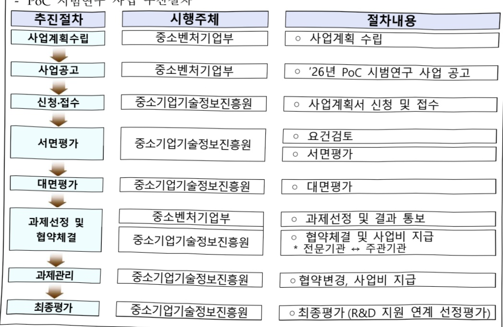

# 중소제조 특화 Multi AI Agent개발(R&D)

**해당 페이지**: PDF 4771 ~ 4777 쪽 해당

**부처**: 중소벤처기업부
**분야**: 산업·중소기업 및 에너지
**회계유형**: 일반회계
**2026 확정예산**: 3600.0 백만원
**전년대비 증감률**: None%
**AI 도메인**: LLM/언어모델, 제조/스마트팩토리, 디지털전환(AX)

---

### 가. 예산 총괄표

(단위: 백만원, %)

<table border=1 style='margin: auto; word-wrap: break-word;'><tr><td rowspan="2">사업명</td><td rowspan="2">2024년 결산</td><td colspan="2">2025년 예산</td><td colspan="2">2026년 예산</td><td rowspan="2">중감(B-A)</td><td rowspan="2">(B-A)/A</td></tr><tr><td style='text-align: center; word-wrap: break-word;'>본예산</td><td style='text-align: center; word-wrap: break-word;'>추경(A)</td><td style='text-align: center; word-wrap: break-word;'>요구안</td><td style='text-align: center; word-wrap: break-word;'>본예산(B)</td></tr><tr><td style='text-align: center; word-wrap: break-word;'>중소제조 특화Multi AI Agent개발(R&amp;D)</td><td style='text-align: center; word-wrap: break-word;'>-</td><td style='text-align: center; word-wrap: break-word;'>-</td><td style='text-align: center; word-wrap: break-word;'>-</td><td style='text-align: center; word-wrap: break-word;'>3,600</td><td style='text-align: center; word-wrap: break-word;'>3,600</td><td style='text-align: center; word-wrap: break-word;'>3,600</td><td style='text-align: center; word-wrap: break-word;'>순증</td></tr></table>

□ 기능별(내역사업별) 예산 내역

(단위: 백만원)

<table border=1 style='margin: auto; word-wrap: break-word;'><tr><td rowspan="2"></td><td colspan="5">2024</td><td colspan="5">2025</td><td rowspan="2">2026 예산</td></tr><tr><td style='text-align: center; word-wrap: break-word;'>예산액 (추정)</td><td style='text-align: center; word-wrap: break-word;'>예산 현액</td><td style='text-align: center; word-wrap: break-word;'>집행액</td><td style='text-align: center; word-wrap: break-word;'>이월액</td><td style='text-align: center; word-wrap: break-word;'>불용액</td><td style='text-align: center; word-wrap: break-word;'>예산액 (추정)</td><td style='text-align: center; word-wrap: break-word;'>예산 현액</td><td style='text-align: center; word-wrap: break-word;'>집행액</td><td style='text-align: center; word-wrap: break-word;'>이월액</td><td style='text-align: center; word-wrap: break-word;'>불용액</td></tr><tr><td style='text-align: center; word-wrap: break-word;'>○ 기능별 분류(합계)</td><td style='text-align: center; word-wrap: break-word;'>-</td><td style='text-align: center; word-wrap: break-word;'>-</td><td style='text-align: center; word-wrap: break-word;'>-</td><td style='text-align: center; word-wrap: break-word;'>-</td><td style='text-align: center; word-wrap: break-word;'>-</td><td style='text-align: center; word-wrap: break-word;'>-</td><td style='text-align: center; word-wrap: break-word;'>-</td><td style='text-align: center; word-wrap: break-word;'>-</td><td style='text-align: center; word-wrap: break-word;'>-</td><td style='text-align: center; word-wrap: break-word;'>-</td><td style='text-align: center; word-wrap: break-word;'>3,600</td></tr><tr><td style='text-align: center; word-wrap: break-word;'>• PoC 시범연구</td><td style='text-align: center; word-wrap: break-word;'>-</td><td style='text-align: center; word-wrap: break-word;'>-</td><td style='text-align: center; word-wrap: break-word;'>-</td><td style='text-align: center; word-wrap: break-word;'>-</td><td style='text-align: center; word-wrap: break-word;'>-</td><td style='text-align: center; word-wrap: break-word;'>-</td><td style='text-align: center; word-wrap: break-word;'>-</td><td style='text-align: center; word-wrap: break-word;'>-</td><td style='text-align: center; word-wrap: break-word;'>-</td><td style='text-align: center; word-wrap: break-word;'>-</td><td style='text-align: center; word-wrap: break-word;'>3,600</td></tr></table>

### 나. 사업설명자료

## 1 ) 사업목적·내용

- (중소제조 특화 Multi AI Agent 개발) 중소 제조업의 비정형 작업 대응력 강화와 공정·품질 최적화를 위한 Multi AI Agent 기술개발 지원으로, AX 전환 촉진 및 지속가능한 제조혁신 생태계 조성

- (PoC 시범연구) 중소제조 특화 Multi AI Agent 개발을 위한 ①연구개발 설계(추진 체계 및 역할 등 수립), ②데이터 구축(전처리), ③AI 에이전트 구조설계 기획 지원

- (R&D 지원) 중소제조 특화 Multi AI Agent 개발(비정형 상황 다중 AI 자율결정 모델 개발), 실증 및 확장(개발모델 실증 고도화) 지원

## 2 ) 사업개요

사업근거 및 추진경위

① 법령상 근거 및 조항 적시

---

<table border=1 style='margin: auto; word-wrap: break-word;'><tr><td style='text-align: center; word-wrap: break-word;'>&lt;중소기업기술혁신촉진법 제9조, 제10조, 제11조, 제11조의3, 제17조의3&gt;</td></tr><tr><td style='text-align: center; word-wrap: break-word;'>제9조(중소기업의 기술혁신 촉진 지원사업) ① 중소벤처기업부장관은 중소기업의 기술혁신을 촉진하기 위하여 다음 각호의 지원사업을 추진하여야 한다.1. 기술혁신에 필요한 자금지원3. 수요와 연계된 기술혁신의 지원4. 기술혁신 성과의 사업화</td></tr><tr><td style='text-align: center; word-wrap: break-word;'>제10조(기술혁신 중소기업자에 대한 출연) ① 중소벤처기업부장관은 중소기업의 기술혁신을 촉진하기 위하여 필요하다고 인정하는 경우 기술혁신능력을 보유한 중소기업자가 단독으로 또는 공동으로 수행하는 기술혁신사업에 출연할 수 있다.</td></tr><tr><td style='text-align: center; word-wrap: break-word;'>제11조(산·학·연 공동기술혁신 수행기관 등에 대한 출연) ① 중소벤처기업부장관은 중소기업의 기술혁신 등을 촉진하기 위하여 다음 각 호의 학교·기관 또는 단체가 중소기업자와 공동으로 수행하는 산학협력 지원사업과 중소기업에 대하여 실시하는 기술지도사업에 출연할 수 있다.</td></tr><tr><td style='text-align: center; word-wrap: break-word;'>제11조의3(중소기업의 국제기술협력 지원) ① 중소벤처기업부장관은 중소기업과 국제기구 또는 외국의 정부·기업·대학·연구기관 및 단체 등과의 기술협력을 촉진하기 위하여 다음 각 호의 사업을 추진할 수 있다.</td></tr><tr><td style='text-align: center; word-wrap: break-word;'>제17조의3(중소기업의 생산 환경개선 및 생산성 향상을 위한 지원) ① 중소벤처기업부장관은 중소기업의 생산환경을 개선하여 중소기업으로의 인력 유입을 촉진하고 생산성 향상을 도모하기 위하여 다음 각 호의 사업을 추진할 수 있다.1. 생산환경 개선을 위한 실태조사2. 생산환경 개선을 위한 설비 또는 장비의 개발3. 쾌적한 작업환경의 조성을 위한 시설투자의 지원4. 생산성 향상을 위한 생산 공정의 진단·설계·개선 및 신공정 개발5. 그 밖에 중소벤처기업부장관이 생산 환경을 개선하고 생산성을 향상시키기 위하여 필요하다고 인정하는 사업2. 중소벤처기업부장관은 제1항에 따른 사업을 추진하기 위하여 필요하다고 인정할 때에는 대학·연구기관·공공기관 및 중소기업 등에 사용되는 비용의 일부를 출연할 수 있다.</td></tr><tr><td style='text-align: center; word-wrap: break-word;'>&lt;스마트제조혁신촉진법 제8조, 제16조&gt;</td></tr><tr><td style='text-align: center; word-wrap: break-word;'>제8조(스마트제조혁신 촉진) ① 중소벤처기업부장관은 스마트제조혁신 촉진을 위하여 다음 각 호의 지원사업을 추진할 수 있다.1. 스마트공장 보급 및 확산, 사후관리 지원2. 스마트제조혁신 기술경쟁력 제고3. 스마트제조혁신 관련 중소기업과 중견기업, 대기업 간의 협력 촉진4. 산·학·연 공동 스마트제조혁신 지원5. 제조데이터의 활용 촉진6. 디지털 클러스터 구축 지원7. 공급기업의 육성8. 스마트제조혁신 전문인력의 양성 및 공급9. 스마트제조혁신 관련 교육 및 홍보10. 스마트제조혁신 관련 기업의 국내외 판로 개척11. 그 밖에 스마트제조혁신 촉진에 필요한 사업으로서 대통령령으로 정하는 사업② 중소벤처기업부장관은 제1항에 따른 지원사업에 참여하는 대학, 연구기관, 공공기관, 중소기업 등에 대하여 그 비용의 전부 또는 일부를 출연하거나 지원할 수 있다.</td></tr><tr><td style='text-align: center; word-wrap: break-word;'>제16조(공급기업 육성) ① 중소벤처기업부장관은 공급기업을 육성하기 위하여 다음 각 호의 사업을 할 수 있다.1. 공급기업의 창업 지원2. 공급기업의 연구개발 지원3. 공급기업의 국내외 판로개척4. 그 밖에 공급기업 육성에 필요한 사업으로서 대통령령으로 정하는 사업② 중소벤처기업부장관은 제1항에 따른 사업에 참여하는 대학, 연구기관, 공공기관, 중소기업 등에 대하여 그 비용의 전부 또는 일부를 출연하거나 지원할 수 있다.</td></tr></table>

---

② 추진경위 - 사업 시작년도, 추진배경, 부처별 중점과제, 대통령 공약사항 등

- 스마트 제조혁신 기술개발사업(R&D, 선행사업) 에타 통과('20년) 및 사업 시작('22년~'26년)

- 스마트제조혁신 생태계 고도화 방안 발표 (24.10)

- 스마트제조혁신 기본계획 발표 (24.12)

- 인공지능(AI) 창업기업(스타트업) 육성을 통한 인공지능(AI) 활용·확산 방안 발표('25.2)

- 스마트제조혁신기술개발사업 후속 R&D사업으로 중소제조 특화 Multi AI Agent 개발사업 기획 착수('25.3)

- AI 에이전트 전문가회의을 통한 기업·학계 등 현장의견 수렴(25.4)

- 다부처 협업형 R&D 사업(중기부-산업부)으로 부처간 협의('25.5)

- (국정과제) 35-3. 뿌리부터 첨단까지 AX 대전환으로 생산성 혁신('25.8)

## 주요내용

① 사업규모

- 총사업비(해당되는 경우에만 기재) : 해당없음

- 사업기간 : '26~'28

- 최근 5년 간 투입된 사업비(예산액기준, 추경편성한 연도에는 추경포함)

<table border=1 style='margin: auto; word-wrap: break-word;'><tr><td style='text-align: center; word-wrap: break-word;'>闰五</td><td style='text-align: center; word-wrap: break-word;'>2022</td><td style='text-align: center; word-wrap: break-word;'>2023</td><td style='text-align: center; word-wrap: break-word;'>2024</td><td style='text-align: center; word-wrap: break-word;'>2025</td><td style='text-align: center; word-wrap: break-word;'>2026</td></tr><tr><td style='text-align: center; word-wrap: break-word;'>사업비</td><td style='text-align: center; word-wrap: break-word;'>-</td><td style='text-align: center; word-wrap: break-word;'>-</td><td style='text-align: center; word-wrap: break-word;'>-</td><td style='text-align: center; word-wrap: break-word;'>-</td><td style='text-align: center; word-wrap: break-word;'>3,600</td></tr></table>

- 기타: 464억원(국고 348억원, 민자 116억원), 기평비 제외

② 사업추진체계

- 사업시행방법 : 출연

- 사업시행주체 : 중소기업기술정보진흥원

- 사업 수혜자 : 중소기업(주관·공동 컨소시엄)

- 보조, 융자, 출연, 출자 등의 경우 보조·융자 등 지원 비율 및 법적근거

<table border=1 style='margin: auto; word-wrap: break-word;'><tr><td style='text-align: center; word-wrap: break-word;'>내역사업명</td><td style='text-align: center; word-wrap: break-word;'>구분</td><td style='text-align: center; word-wrap: break-word;'>피보조·피출연 등 기관명</td><td style='text-align: center; word-wrap: break-word;'>지원 금액 (2026예산)</td><td style='text-align: center; word-wrap: break-word;'>지원 비율(%)</td><td style='text-align: center; word-wrap: break-word;'>보조율 법적근거 (해당 조항)</td></tr><tr><td style='text-align: center; word-wrap: break-word;'>PoC 시범연구</td><td style='text-align: center; word-wrap: break-word;'>출연</td><td style='text-align: center; word-wrap: break-word;'>중소기업 기술정보 진흥원</td><td style='text-align: center; word-wrap: break-word;'>3,600</td><td style='text-align: center; word-wrap: break-word;'>75%</td><td style='text-align: center; word-wrap: break-word;'>「국가연구개발혁신법」 제13조 및 「중소기업기술개발 지원사업 운영요령」 제18조 (사업비의 조성) 제②항</td></tr><tr><td style='text-align: center; word-wrap: break-word;'>R&amp;D 지원</td><td style='text-align: center; word-wrap: break-word;'>출연</td><td style='text-align: center; word-wrap: break-word;'>중소기업 기술정보 진흥원</td><td style='text-align: center; word-wrap: break-word;'>-</td><td style='text-align: center; word-wrap: break-word;'>75%</td><td style='text-align: center; word-wrap: break-word;'>「국가연구개발혁신법」 제13조 및 「중소기업기술개발 지원사업 운영요령」 제18조 (사업비의 조성) 제②항</td></tr></table>

---

## 3 ) 2026년도 예산 산출 근거

<table border=1 style='margin: auto; word-wrap: break-word;'><tr><td style='text-align: center; word-wrap: break-word;'>☐ 중소제조 특화 Multi AI Agent 개발(R&amp;D) : (2025년 본예산 또는 추경) - → (2026년 본예산) 3,600백만원, 3,600백만원 증액 (순증)</td></tr><tr><td style='text-align: center; word-wrap: break-word;'>① PoC 시범연구 : (2025년 추경) - → (2026년 본예산) 3,600백만원, 3,600백만원 증액 (순증) - (내용) 중소제조 특화 Multi AI Agent 개발을 위한 신규사업을 지원하며, 3,600백만원 증액 - (산출) PoC 시범연구 3,600백만원</td></tr></table>

## 4 ) 사업효과

☐ 사업영향, 산출물 성과지표 등

① 2022~2026년도 성과계획서 상 성과지표 및 최근 5년간 성과 달성도

<table border=1 style='margin: auto; word-wrap: break-word;'><tr><td style='text-align: center; word-wrap: break-word;'>성과지표</td><td style='text-align: center; word-wrap: break-word;'>구분</td><td style='text-align: center; word-wrap: break-word;'>2022</td><td style='text-align: center; word-wrap: break-word;'>2023</td><td style='text-align: center; word-wrap: break-word;'>2024</td><td style='text-align: center; word-wrap: break-word;'>2025</td><td style='text-align: center; word-wrap: break-word;'>2026</td><td style='text-align: center; word-wrap: break-word;'>2026 목표치산출근거</td><td style='text-align: center; word-wrap: break-word;'>측정산식(또는 측정방법)</td><td style='text-align: center; word-wrap: break-word;'>자료수집방법(또는 자료출처)</td></tr><tr><td rowspan="3">R&amp;D지원효과지수(단위: 점)</td><td style='text-align: center; word-wrap: break-word;'>목표</td><td style='text-align: center; word-wrap: break-word;'>-</td><td style='text-align: center; word-wrap: break-word;'>신규</td><td style='text-align: center; word-wrap: break-word;'>0.368</td><td style='text-align: center; word-wrap: break-word;'>-</td><td style='text-align: center; word-wrap: break-word;'>-</td><td rowspan="3">-</td><td rowspan="3">등록특허 SMART 평가점수, 정부출연금 1억당 누적매출액 각각에 가중치를 부여 후 합산</td><td rowspan="3">중소기업 R&amp;D 성과조사분석 보고서</td></tr><tr><td style='text-align: center; word-wrap: break-word;'>실적</td><td style='text-align: center; word-wrap: break-word;'>-</td><td style='text-align: center; word-wrap: break-word;'>-</td><td style='text-align: center; word-wrap: break-word;'>0.370</td><td style='text-align: center; word-wrap: break-word;'>-</td><td style='text-align: center; word-wrap: break-word;'>-</td></tr><tr><td style='text-align: center; word-wrap: break-word;'>달성도</td><td style='text-align: center; word-wrap: break-word;'>-</td><td style='text-align: center; word-wrap: break-word;'>-</td><td style='text-align: center; word-wrap: break-word;'>100.5</td><td style='text-align: center; word-wrap: break-word;'>-</td><td style='text-align: center; word-wrap: break-word;'>-</td></tr><tr><td rowspan="3">정부출연금 10억원당 누적과제매출액(단위: 억원)</td><td style='text-align: center; word-wrap: break-word;'>목표</td><td style='text-align: center; word-wrap: break-word;'>-</td><td style='text-align: center; word-wrap: break-word;'>-</td><td style='text-align: center; word-wrap: break-word;'>신규</td><td style='text-align: center; word-wrap: break-word;'>13.65</td><td style='text-align: center; word-wrap: break-word;'>15.00</td><td rowspan="3">전년도(24년) 실적값(14.25)에 연평균 성장률(5.3%)을 더해 목표치(15.00) 설정</td><td rowspan="3">∑사업화 매출액 × 기여율(35.4%) / ∑지원과제 정부지원금</td><td rowspan="3">중소기업 R&amp;D 성과조사분석 보고서</td></tr><tr><td style='text-align: center; word-wrap: break-word;'>실적</td><td style='text-align: center; word-wrap: break-word;'>-</td><td style='text-align: center; word-wrap: break-word;'>-</td><td style='text-align: center; word-wrap: break-word;'>-</td><td style='text-align: center; word-wrap: break-word;'>-</td><td style='text-align: center; word-wrap: break-word;'>-</td></tr><tr><td style='text-align: center; word-wrap: break-word;'>달성도</td><td style='text-align: center; word-wrap: break-word;'>-</td><td style='text-align: center; word-wrap: break-word;'>-</td><td style='text-align: center; word-wrap: break-word;'>-</td><td style='text-align: center; word-wrap: break-word;'>-</td><td style='text-align: center; word-wrap: break-word;'>-</td></tr></table>

② 성과지표 이외의 연도별 사업추진 경과 및 실적 : 해당없음

③ 향후(2026년도 이후) 기대효과 :

- 동 사업을 통해 중소제조 특화 AI Agent 기술 확보

- AX 전환 촉진 및 지속가능한 제조혁신 생태계 조성

5) 타당성조사 및 예비타당성조사 시행여부 및 결과 요지 : 해당없음

6) 총사업비 대상사업 정보 : 해당없음

---

## 7 ) 사업 집행절차

## - PoC 시범연구 사업 집행절차

<table border=1 style='margin: auto; word-wrap: break-word;'><tr><td style='text-align: center; word-wrap: break-word;'>$ \underset{\cdot}{早} $料</td><td style='text-align: center; word-wrap: break-word;'></td><td style='text-align: center; word-wrap: break-word;'>$ \underset{\cdot}{収} $출연· $ \underset{\cdot}{収} $보조기관</td><td style='text-align: center; word-wrap: break-word;'></td><td style='text-align: center; word-wrap: break-word;'>간접보조사업자·사업수행자</td></tr><tr><td style='text-align: center; word-wrap: break-word;'>중소벤처기업부(3,600백만원)</td><td style='text-align: center; word-wrap: break-word;'>=&gt;(3,600백만원)</td><td style='text-align: center; word-wrap: break-word;'>중소기업기술정보진흥원(-)</td><td style='text-align: center; word-wrap: break-word;'>=&gt;(3,600백만원)</td><td style='text-align: center; word-wrap: break-word;'>중소기업(공급 및 수요전소시업 필수)</td></tr></table>

- PoC 시범연구 사업 추진절차

시행주체

중소벤처기업부

중소벤처기업부

절차내용

사업계획수립

중소기업기술정보진흥원

중소기업기술정보진흥원

°'26년PoC 시범연구 사업 공고

- 사업계획서 신청 및 접수

중소기업기술정보진흥원

ㅇ 요건검토

ㅇ 서면평가

중소벤처기업부

중소기업기술정보진흥원

ㅇ 대면평가

중소기업기술정보진흥원

중소기업기술정보진흥원

○ 과제선정 및 결과 통보

○ 협약체결 및 사업비 지급

* 전문기관 ↔ 주관기관

◯협약변경, 사업비 지급

·최종평가(R&D 지원 연계 선정평가)

## 8 ) 각종 평가 : 해당없음

---

### 다. 최근 4년간 결산내역 : 해당없음

## 1 ) 결산표

☐ 부처 결산내역

(단위: 백만원, %)

<table border=1 style='margin: auto; word-wrap: break-word;'><tr><td rowspan="2">闰五</td><td colspan="3">예산액</td><td rowspan="2">예산현액(A)</td><td rowspan="2">집행액(B)</td><td rowspan="2">집행률(B/A)</td><td rowspan="2">다음연도이월액</td><td rowspan="2">불용액</td></tr><tr><td style='text-align: center; word-wrap: break-word;'>본예산</td><td style='text-align: center; word-wrap: break-word;'>추경중감액</td><td style='text-align: center; word-wrap: break-word;'>추경</td></tr><tr><td style='text-align: center; word-wrap: break-word;'>2022</td><td style='text-align: center; word-wrap: break-word;'>-</td><td style='text-align: center; word-wrap: break-word;'>-</td><td style='text-align: center; word-wrap: break-word;'>-</td><td style='text-align: center; word-wrap: break-word;'>-</td><td style='text-align: center; word-wrap: break-word;'>-</td><td style='text-align: center; word-wrap: break-word;'>-</td><td style='text-align: center; word-wrap: break-word;'>-</td><td style='text-align: center; word-wrap: break-word;'>-</td></tr><tr><td style='text-align: center; word-wrap: break-word;'>2023</td><td style='text-align: center; word-wrap: break-word;'>-</td><td style='text-align: center; word-wrap: break-word;'>-</td><td style='text-align: center; word-wrap: break-word;'>-</td><td style='text-align: center; word-wrap: break-word;'>-</td><td style='text-align: center; word-wrap: break-word;'>-</td><td style='text-align: center; word-wrap: break-word;'>-</td><td style='text-align: center; word-wrap: break-word;'>-</td><td style='text-align: center; word-wrap: break-word;'>-</td></tr><tr><td style='text-align: center; word-wrap: break-word;'>2024</td><td style='text-align: center; word-wrap: break-word;'>-</td><td style='text-align: center; word-wrap: break-word;'>-</td><td style='text-align: center; word-wrap: break-word;'>-</td><td style='text-align: center; word-wrap: break-word;'>-</td><td style='text-align: center; word-wrap: break-word;'>-</td><td style='text-align: center; word-wrap: break-word;'>-</td><td style='text-align: center; word-wrap: break-word;'>-</td><td style='text-align: center; word-wrap: break-word;'>-</td></tr><tr><td style='text-align: center; word-wrap: break-word;'>2025</td><td style='text-align: center; word-wrap: break-word;'>-</td><td style='text-align: center; word-wrap: break-word;'>-</td><td style='text-align: center; word-wrap: break-word;'>-</td><td style='text-align: center; word-wrap: break-word;'>-</td><td style='text-align: center; word-wrap: break-word;'>-</td><td style='text-align: center; word-wrap: break-word;'>-</td><td style='text-align: center; word-wrap: break-word;'>-</td><td style='text-align: center; word-wrap: break-word;'>-</td></tr></table>

## 2 ) 주요 결산사항

□2022~2025년 결산 주요사항

<table border=1 style='margin: auto; word-wrap: break-word;'><tr><td style='text-align: center; word-wrap: break-word;'>2022</td><td style='text-align: center; word-wrap: break-word;'>-</td></tr><tr><td style='text-align: center; word-wrap: break-word;'>2023</td><td style='text-align: center; word-wrap: break-word;'>-</td></tr><tr><td style='text-align: center; word-wrap: break-word;'>2024</td><td style='text-align: center; word-wrap: break-word;'>-</td></tr><tr><td style='text-align: center; word-wrap: break-word;'>2025</td><td style='text-align: center; word-wrap: break-word;'>-</td></tr></table>

□2025년 이·전용 등 세부내역

(단위:백만원)

<table border=1 style='margin: auto; word-wrap: break-word;'><tr><td rowspan="2">구분(날짜)</td><td colspan="2">~에서</td><td rowspan="2">금액</td><td colspan="2">~으로</td><td rowspan="2">이·전용 등 사유</td></tr><tr><td style='text-align: center; word-wrap: break-word;'>세부사업 명(사업코드)</td><td style='text-align: center; word-wrap: break-word;'>목-세목 코드</td><td style='text-align: center; word-wrap: break-word;'>세부사업 명(사업코드)</td><td style='text-align: center; word-wrap: break-word;'>목-세목 코드</td></tr><tr><td style='text-align: center; word-wrap: break-word;'>이용(2025.2.1)</td><td style='text-align: center; word-wrap: break-word;'>-</td><td style='text-align: center; word-wrap: break-word;'>-</td><td style='text-align: center; word-wrap: break-word;'>-</td><td style='text-align: center; word-wrap: break-word;'>-</td><td style='text-align: center; word-wrap: break-word;'>-</td><td style='text-align: center; word-wrap: break-word;'>-</td></tr><tr><td style='text-align: center; word-wrap: break-word;'>전용(2025.2.3)</td><td style='text-align: center; word-wrap: break-word;'>-</td><td style='text-align: center; word-wrap: break-word;'>-</td><td style='text-align: center; word-wrap: break-word;'>-</td><td style='text-align: center; word-wrap: break-word;'>-</td><td style='text-align: center; word-wrap: break-word;'>-</td><td style='text-align: center; word-wrap: break-word;'>-</td></tr><tr><td style='text-align: center; word-wrap: break-word;'>조정(2025.2.5)</td><td style='text-align: center; word-wrap: break-word;'>-</td><td style='text-align: center; word-wrap: break-word;'>-</td><td style='text-align: center; word-wrap: break-word;'>-</td><td style='text-align: center; word-wrap: break-word;'>-</td><td style='text-align: center; word-wrap: break-word;'>-</td><td style='text-align: center; word-wrap: break-word;'>-</td></tr><tr><td style='text-align: center; word-wrap: break-word;'>이체(2025.2.9)</td><td style='text-align: center; word-wrap: break-word;'>-</td><td style='text-align: center; word-wrap: break-word;'>-</td><td style='text-align: center; word-wrap: break-word;'>-</td><td style='text-align: center; word-wrap: break-word;'>-</td><td style='text-align: center; word-wrap: break-word;'>-</td><td style='text-align: center; word-wrap: break-word;'>-</td></tr></table>

---

<table border=1 style='margin: auto; word-wrap: break-word;'><tr><td style='text-align: center; word-wrap: break-word;'>사 업 명</td></tr><tr><td style='text-align: center; word-wrap: break-word;'>(8) 지역특화 제조데이터 활성화 (2111-312)</td></tr></table>

사업 코드 정보

<table border=1 style='margin: auto; word-wrap: break-word;'><tr><td style='text-align: center; word-wrap: break-word;'>구분</td><td style='text-align: center; word-wrap: break-word;'>회계</td><td style='text-align: center; word-wrap: break-word;'>소관</td><td style='text-align: center; word-wrap: break-word;'>실국(기관)</td><td style='text-align: center; word-wrap: break-word;'>계정</td><td style='text-align: center; word-wrap: break-word;'>분야</td><td style='text-align: center; word-wrap: break-word;'>부문</td></tr><tr><td style='text-align: center; word-wrap: break-word;'>코드</td><td rowspan="2">일반회계</td><td rowspan="2">중소벤처기업부</td><td rowspan="2">중소기업정책실지역기업정책관</td><td rowspan="2"></td><td style='text-align: center; word-wrap: break-word;'>110</td><td style='text-align: center; word-wrap: break-word;'>119</td></tr><tr><td style='text-align: center; word-wrap: break-word;'>명칭</td><td style='text-align: center; word-wrap: break-word;'>산업·중소기업 및 에너지</td><td style='text-align: center; word-wrap: break-word;'>중소기업 및 소상공인육성</td></tr></table>

<table border=1 style='margin: auto; word-wrap: break-word;'><tr><td style='text-align: center; word-wrap: break-word;'>구분</td><td style='text-align: center; word-wrap: break-word;'>프로그램</td><td style='text-align: center; word-wrap: break-word;'>단위사업</td><td style='text-align: center; word-wrap: break-word;'>세부사업</td></tr><tr><td style='text-align: center; word-wrap: break-word;'>코드</td><td style='text-align: center; word-wrap: break-word;'>2100</td><td style='text-align: center; word-wrap: break-word;'>2111</td><td style='text-align: center; word-wrap: break-word;'>312</td></tr><tr><td style='text-align: center; word-wrap: break-word;'>명칭</td><td style='text-align: center; word-wrap: break-word;'>중소기업기술개발지원</td><td style='text-align: center; word-wrap: break-word;'>중소기업경쟁력강화</td><td style='text-align: center; word-wrap: break-word;'>지역특화 제조데이터 활성화</td></tr></table>

<table border=1 style='margin: auto; word-wrap: break-word;'><tr><td colspan="6">☐ 사업 성격 (공통요구자료 Ⅱ-1 작성유의사항 4. 참조, 해당하는 사항에 “○” 표시)</td></tr><tr><td style='text-align: center; word-wrap: break-word;'>신규 계속</td><td style='text-align: center; word-wrap: break-word;'>완료</td><td style='text-align: center; word-wrap: break-word;'>예비타당성 실시여부</td><td style='text-align: center; word-wrap: break-word;'>총사업비 관리대상</td><td style='text-align: center; word-wrap: break-word;'>총액계상 예산사업</td><td style='text-align: center; word-wrap: break-word;'>사업소관 변경정보 2025예산 시 소관</td></tr><tr><td style='text-align: center; word-wrap: break-word;'></td><td style='text-align: center; word-wrap: break-word;'>☐</td><td style='text-align: center; word-wrap: break-word;'></td><td style='text-align: center; word-wrap: break-word;'></td><td style='text-align: center; word-wrap: break-word;'></td><td style='text-align: center; word-wrap: break-word;'></td></tr></table>

사업지원형태 및 지원을(최소한 한 개는 반드시 선택하시오. 해당사항에 O 표시)

<table border=1 style='margin: auto; word-wrap: break-word;'><tr><td style='text-align: center; word-wrap: break-word;'>직접</td><td style='text-align: center; word-wrap: break-word;'>출자</td><td style='text-align: center; word-wrap: break-word;'>출연</td><td style='text-align: center; word-wrap: break-word;'>보조</td><td style='text-align: center; word-wrap: break-word;'>융자</td><td style='text-align: center; word-wrap: break-word;'>국고보조율(%)</td><td style='text-align: center; word-wrap: break-word;'>융자율(%)</td></tr><tr><td style='text-align: center; word-wrap: break-word;'></td><td style='text-align: center; word-wrap: break-word;'></td><td style='text-align: center; word-wrap: break-word;'>O</td><td style='text-align: center; word-wrap: break-word;'></td><td style='text-align: center; word-wrap: break-word;'></td><td style='text-align: center; word-wrap: break-word;'>50</td><td style='text-align: center; word-wrap: break-word;'></td></tr></table>

□ 사업 소관부처 및 시행주체

<table border=1 style='margin: auto; word-wrap: break-word;'><tr><td style='text-align: center; word-wrap: break-word;'>사업명</td><td colspan="2">구분</td></tr><tr><td rowspan="2">지역특화제조데이터활성화</td><td style='text-align: center; word-wrap: break-word;'>소관부처</td><td style='text-align: center; word-wrap: break-word;'>중소기업정책실지역기업정책관제조혁신과</td></tr><tr><td style='text-align: center; word-wrap: break-word;'>사업시행주체</td><td style='text-align: center; word-wrap: break-word;'>중소기업기술정보진흥원부설 스마트제조혁신추진단</td></tr></table>

---

### 원본 PDF 크롭 이미지

