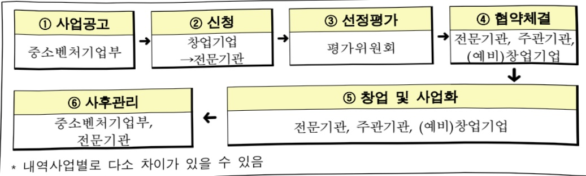

# 창업사업화지원

**해당 페이지**: PDF 4784 ~ 4793 쪽 해당

**부처**: 중소벤처기업부
**분야**: 산업·중소기업 및 에너지
**회계유형**: 일반회계
**2026 확정예산**: 461838.0 백만원
**전년대비 증감률**: 0.9%
**AI 도메인**: 교육/인재

---

<table border=1 style='margin: auto; word-wrap: break-word;'><tr><td style='text-align: center; word-wrap: break-word;'>사 업 명</td></tr><tr><td style='text-align: center; word-wrap: break-word;'>(40) 창업사업화지원 (5132-302)</td></tr></table>

사업 코드 정보

<table border=1 style='margin: auto; word-wrap: break-word;'><tr><td style='text-align: center; word-wrap: break-word;'>구분</td><td style='text-align: center; word-wrap: break-word;'>회계</td><td style='text-align: center; word-wrap: break-word;'>소관</td><td style='text-align: center; word-wrap: break-word;'>실국(기관)</td><td style='text-align: center; word-wrap: break-word;'>계정</td><td style='text-align: center; word-wrap: break-word;'>분야</td><td style='text-align: center; word-wrap: break-word;'>부문</td></tr><tr><td style='text-align: center; word-wrap: break-word;'>코드</td><td rowspan="2">일반회계</td><td rowspan="2">중소벤처기업부</td><td rowspan="2">창업정책관</td><td rowspan="2"></td><td style='text-align: center; word-wrap: break-word;'>110</td><td style='text-align: center; word-wrap: break-word;'>118</td></tr><tr><td style='text-align: center; word-wrap: break-word;'>명칭</td><td style='text-align: center; word-wrap: break-word;'>산업·중소기업 및 에너지</td><td style='text-align: center; word-wrap: break-word;'>창업 및 벤처</td></tr></table>

<table border=1 style='margin: auto; word-wrap: break-word;'><tr><td style='text-align: center; word-wrap: break-word;'>구분</td><td style='text-align: center; word-wrap: break-word;'>프로그램</td><td style='text-align: center; word-wrap: break-word;'>단위사업</td><td style='text-align: center; word-wrap: break-word;'>세부사업</td></tr><tr><td style='text-align: center; word-wrap: break-word;'>코드</td><td style='text-align: center; word-wrap: break-word;'>5100</td><td style='text-align: center; word-wrap: break-word;'>5132</td><td style='text-align: center; word-wrap: break-word;'>302</td></tr><tr><td style='text-align: center; word-wrap: break-word;'>명칭</td><td style='text-align: center; word-wrap: break-word;'>창업환경조성</td><td style='text-align: center; word-wrap: break-word;'>창업활성화지원</td><td style='text-align: center; word-wrap: break-word;'>창업사업화지원</td></tr></table>

<table border=1 style='margin: auto; word-wrap: break-word;'><tr><td colspan="6">☐ 사업 성격 (공통요구자료 Ⅱ-1 작성유의사항 4. 참조, 해당하는 사항에 “○” 표시)</td></tr><tr><td style='text-align: center; word-wrap: break-word;'>신규 계속</td><td style='text-align: center; word-wrap: break-word;'>완료</td><td style='text-align: center; word-wrap: break-word;'>예비타당성 실시여부</td><td style='text-align: center; word-wrap: break-word;'>총사업비 관리대상</td><td style='text-align: center; word-wrap: break-word;'>총액계상 예산사업</td><td style='text-align: center; word-wrap: break-word;'>사업소관 변경정보 2025예산 시 소관</td></tr><tr><td style='text-align: center; word-wrap: break-word;'></td><td style='text-align: center; word-wrap: break-word;'>○</td><td style='text-align: center; word-wrap: break-word;'></td><td style='text-align: center; word-wrap: break-word;'></td><td style='text-align: center; word-wrap: break-word;'></td><td style='text-align: center; word-wrap: break-word;'></td></tr></table>

사업 지원 형태 및 지원을 (최소한 한 개는 반드시 선택하시오. 해당사항에 0 표시)

<table border=1 style='margin: auto; word-wrap: break-word;'><tr><td style='text-align: center; word-wrap: break-word;'>직접</td><td style='text-align: center; word-wrap: break-word;'>출자</td><td style='text-align: center; word-wrap: break-word;'>출연</td><td style='text-align: center; word-wrap: break-word;'>보조</td><td style='text-align: center; word-wrap: break-word;'>융자</td><td style='text-align: center; word-wrap: break-word;'>국고보조율(%)</td><td style='text-align: center; word-wrap: break-word;'>융자율(%)</td></tr><tr><td style='text-align: center; word-wrap: break-word;'>○</td><td style='text-align: center; word-wrap: break-word;'></td><td style='text-align: center; word-wrap: break-word;'>○</td><td style='text-align: center; word-wrap: break-word;'>○</td><td style='text-align: center; word-wrap: break-word;'></td><td style='text-align: center; word-wrap: break-word;'>70~100</td><td style='text-align: center; word-wrap: break-word;'></td></tr></table>

사업 소관부처 및 시행주체

<table border=1 style='margin: auto; word-wrap: break-word;'><tr><td style='text-align: center; word-wrap: break-word;'>사업명</td><td colspan="2">구분</td></tr><tr><td rowspan="2">창업패키지</td><td style='text-align: center; word-wrap: break-word;'>소관부처</td><td style='text-align: center; word-wrap: break-word;'>창업벤처혁신실 창업정책관 신산업기술창업과 창업생태계과</td></tr><tr><td style='text-align: center; word-wrap: break-word;'>사업시행주체</td><td style='text-align: center; word-wrap: break-word;'>창업진흥원</td></tr><tr><td rowspan="2">초격차 스타트업 프로젝트</td><td style='text-align: center; word-wrap: break-word;'>소관부처</td><td rowspan="2">창업벤처혁신실 창업정책관 신산업기술창업과 창업진흥원</td></tr><tr><td style='text-align: center; word-wrap: break-word;'>사업시행주체</td></tr><tr><td rowspan="2">창업중심 대학</td><td style='text-align: center; word-wrap: break-word;'>소관부처</td><td style='text-align: center; word-wrap: break-word;'>창업벤처혁신실 창업정책관 청년정책과</td></tr><tr><td style='text-align: center; word-wrap: break-word;'>사업시행주체</td><td style='text-align: center; word-wrap: break-word;'>창업진흥원</td></tr><tr><td rowspan="2">창업지원 사업관리</td><td style='text-align: center; word-wrap: break-word;'>소관부처</td><td style='text-align: center; word-wrap: break-word;'>창업벤처혁신실 창업정책관 창업정책과</td></tr><tr><td style='text-align: center; word-wrap: break-word;'>사업시행주체</td><td style='text-align: center; word-wrap: break-word;'>창업진흥원</td></tr></table>

---

### 가. 예산 총괄표

(단위: 백만원, %)

<table border=1 style='margin: auto; word-wrap: break-word;'><tr><td rowspan="2">사업명</td><td rowspan="2">2024년 결산</td><td colspan="2">2025년 예산</td><td colspan="2">2026년 예산</td><td rowspan="2">증감(B-A)</td><td rowspan="2">(B-A)/A</td></tr><tr><td style='text-align: center; word-wrap: break-word;'>본예산</td><td style='text-align: center; word-wrap: break-word;'>추경(A)</td><td style='text-align: center; word-wrap: break-word;'>요구안</td><td style='text-align: center; word-wrap: break-word;'>본예산(B)</td></tr><tr><td style='text-align: center; word-wrap: break-word;'>창업사업화지원</td><td style='text-align: center; word-wrap: break-word;'>359,131</td><td style='text-align: center; word-wrap: break-word;'>403,567</td><td style='text-align: center; word-wrap: break-word;'>457,567</td><td style='text-align: center; word-wrap: break-word;'>491,667</td><td style='text-align: center; word-wrap: break-word;'>461,838</td><td style='text-align: center; word-wrap: break-word;'>4,271</td><td style='text-align: center; word-wrap: break-word;'>0.9</td></tr></table>

□ 기능별(내역사업별) 예산 내역

(단위:백만원)

<table border=1 style='margin: auto; word-wrap: break-word;'><tr><td rowspan="2"></td><td colspan="5">2024</td><td colspan="5">2025</td><td rowspan="2">2026예산</td></tr><tr><td style='text-align: center; word-wrap: break-word;'>예산액(추경)</td><td style='text-align: center; word-wrap: break-word;'>예산현액</td><td style='text-align: center; word-wrap: break-word;'>집행액</td><td style='text-align: center; word-wrap: break-word;'>이왈액</td><td style='text-align: center; word-wrap: break-word;'>불용액</td><td style='text-align: center; word-wrap: break-word;'>예산액(추경)</td><td style='text-align: center; word-wrap: break-word;'>예산현액</td><td style='text-align: center; word-wrap: break-word;'>집행액</td><td style='text-align: center; word-wrap: break-word;'>이왈액</td><td style='text-align: center; word-wrap: break-word;'>불용액</td></tr><tr><td style='text-align: center; word-wrap: break-word;'>○ 기능별 분류(합계)</td><td style='text-align: center; word-wrap: break-word;'>359,131</td><td style='text-align: center; word-wrap: break-word;'>359,131</td><td style='text-align: center; word-wrap: break-word;'>359,131</td><td style='text-align: center; word-wrap: break-word;'>-</td><td style='text-align: center; word-wrap: break-word;'>-</td><td style='text-align: center; word-wrap: break-word;'>457,567</td><td style='text-align: center; word-wrap: break-word;'>457,567</td><td style='text-align: center; word-wrap: break-word;'>457,567</td><td style='text-align: center; word-wrap: break-word;'>-</td><td style='text-align: center; word-wrap: break-word;'>-</td><td style='text-align: center; word-wrap: break-word;'>461,838</td></tr><tr><td style='text-align: center; word-wrap: break-word;'>• 창업패키지</td><td style='text-align: center; word-wrap: break-word;'>188,560</td><td style='text-align: center; word-wrap: break-word;'>188,560</td><td style='text-align: center; word-wrap: break-word;'>188,560</td><td style='text-align: center; word-wrap: break-word;'>-</td><td style='text-align: center; word-wrap: break-word;'>-</td><td style='text-align: center; word-wrap: break-word;'>162,255</td><td style='text-align: center; word-wrap: break-word;'>204,255</td><td style='text-align: center; word-wrap: break-word;'>204,255</td><td style='text-align: center; word-wrap: break-word;'>-</td><td style='text-align: center; word-wrap: break-word;'>-</td><td style='text-align: center; word-wrap: break-word;'>195,187</td></tr><tr><td style='text-align: center; word-wrap: break-word;'>• 초격차 스타트업프로젝트</td><td style='text-align: center; word-wrap: break-word;'>103,096</td><td style='text-align: center; word-wrap: break-word;'>103,096</td><td style='text-align: center; word-wrap: break-word;'>103,096</td><td style='text-align: center; word-wrap: break-word;'>-</td><td style='text-align: center; word-wrap: break-word;'>-</td><td style='text-align: center; word-wrap: break-word;'>130,996</td><td style='text-align: center; word-wrap: break-word;'>142,996</td><td style='text-align: center; word-wrap: break-word;'>142,996</td><td style='text-align: center; word-wrap: break-word;'>-</td><td style='text-align: center; word-wrap: break-word;'>-</td><td style='text-align: center; word-wrap: break-word;'>145,622</td></tr><tr><td style='text-align: center; word-wrap: break-word;'>• 창업중심대학</td><td style='text-align: center; word-wrap: break-word;'>67,475</td><td style='text-align: center; word-wrap: break-word;'>67,475</td><td style='text-align: center; word-wrap: break-word;'>67,475</td><td style='text-align: center; word-wrap: break-word;'>-</td><td style='text-align: center; word-wrap: break-word;'>-</td><td style='text-align: center; word-wrap: break-word;'>77,475</td><td style='text-align: center; word-wrap: break-word;'>77,475</td><td style='text-align: center; word-wrap: break-word;'>77,475</td><td style='text-align: center; word-wrap: break-word;'>-</td><td style='text-align: center; word-wrap: break-word;'>-</td><td style='text-align: center; word-wrap: break-word;'>88,250</td></tr><tr><td style='text-align: center; word-wrap: break-word;'>• 창업지원사업 관리</td><td style='text-align: center; word-wrap: break-word;'>-</td><td style='text-align: center; word-wrap: break-word;'>-</td><td style='text-align: center; word-wrap: break-word;'>-</td><td style='text-align: center; word-wrap: break-word;'>-</td><td style='text-align: center; word-wrap: break-word;'>-</td><td style='text-align: center; word-wrap: break-word;'>32,841</td><td style='text-align: center; word-wrap: break-word;'>32,841</td><td style='text-align: center; word-wrap: break-word;'>32,841</td><td style='text-align: center; word-wrap: break-word;'>-</td><td style='text-align: center; word-wrap: break-word;'>-</td><td style='text-align: center; word-wrap: break-word;'>32,779</td></tr></table>

### 나. 사업설명자료

## 1 ) 사업목적·내용

°(창업사업화지원) 창업기업 성장단계별(예비·초기·도약), 초격차 분야별 등 맞춤형 체계를 구축·운영하여 혁신 기술창업을 활성화하고 창업기업의 성장 및 도약 촉진

- (창업패키지) 혁신적인 창업 아이디어를 보유한 예비창업자 및 창업기업(7년이내)의 원활한 창업사업화를 위하여 성장단계별로 사업화 자금, 창업프로그램 등 지원

- (초격차 스타트업 프로젝트) 핵심기술을 보유한 스타트업을 선발, 기술사업화·스케일업, R&D 지원 및 정책자금·보증·수출 등 연계 지원

- (창업중심대학) 권역별 역량이 우수한 대학을 ‘창업중심대학’으로 지정하여 대학발

창업을 활성화하고 기업가형 대학의 선도모델 창출

- (창업지원사업 관리) 「중소기업창업 지원법」 제51조에 근거하여 창업진흥원 기관

운영에 수반되는 경비 지원

---

## 2 ) 사업개요

□ 사업근거 및 추진경위

°「중소기업창업 지원법」제10조(창업 활성화 지원사업의 추진 등)

<table border=1 style='margin: auto; word-wrap: break-word;'><tr><td style='text-align: center; word-wrap: break-word;'>① 중소벤처기업부장관은 중소기업의 창업을 활성화하고 창업기업등의 성장·발전을 지원하기 위하여 다음 각 호의 사항에 관한 사업을 추진하거나 필요한 시책을 수립·시행할 수 있다. 1. 창업기업등의 발굴·육성 및 그에 대한 지원 2. 창업기업등의 우수한 아이디어 사업화에 대한 지원 3. 기업, 창업 관련 단체 등을 통한 창업기업등의 발굴·육성 4. 창업기업등의 관로개척 및 해외진출 지원 5. 창업기업등에 대한 창업교육 및 창업기반시설 확충 6. 해외인재 또는 해외기업 유치 활성화 7. 인터넷 등 정보통신망을 통한 창업정책 및 창업기업등과 관련한 지식·정보 등 데이터의 축적, 가공, 공유 및 활용 등의 촉진 8. 그 밖에 대통령령으로 정하는 사업 ② 중소벤처기업부장관은 제1항에 따른 사업을 추진하는 경우에는 다음 각 호의 자를 우대할 수 있다. 1. 예비청년창업자 또는 청년창업기업 2. 여성 예비창업자 또는 여성창업기업(창업기업 대표자의 성별이 여성인 창업기업을 말한다) 3. 장애인(「장애인기업활동 촉진법」 제2조제1호의 장애인을 말한다) 예비창업자 또는 장애인 창업기업(창업기업 대표자가「장애인기업활동 촉진법」 제2조제1호의 장애인인 창업기업을 말한다) ③ 중소벤처기업부장관은 제1항에 따른 사업을 추진하기 위하여 필요하다고 인정하는 경우에는 예산의 범위에서 대학, 연구기관, 공공기관, 창업 관련 단체, 창업기업등에 해당 사업을 수행하는 데에 드는 비용의 전부 또는 일부를 출연하거나 보조할 수 있다. ④ 제3항에 따른 총액·보조의 절차 및 방법 등에 관한 사항을 대통령령으로 정한다.</td></tr></table>

④ 제3항에 따른 출연·보조의 절차 및 방법 등에 관한 사항은 대통령령으로 정한다.

°「중소기업창업 지원법」제51조(창업진흥원)

⑤ 정부는 창업진흥원의 설립 및 운영에 필요한 경비를 예산의 범위에서 출연하거나 보조할 수 있다.

°「기술의 이전 및 사업화 촉진에 관한 법률」제15조(기술이전·사업화 촉진사업의 추진)

① 정부는 기술이전 · 사업화의 지원, 사업화와 연계된 기술개발의 지원 등 기술이전 · 사업화 촉진사업을 추진하여야 한다.

② 관계중앙행정기관의 장은 소관 분야에 관한 국가 연구개발사업 관련 자금의 집행계획에 기술이전·사업화 촉진사업을 포함시켜야 한다.

③ 관계중앙행정기관의 장은 기술이전 · 사업화 촉진사업을 효율적으로 추진하기 위하여 필요하다고 인정하는 경우에는 대통령령으로 정하는 기관으로 하여금 기술이전 · 사업화 촉진사업의 기획 · 관리 및 평가에 관한 업무를 대행하게 할 수 있다. 이 경우 관계중앙행정기관의 장은 그 업무를 수행하는 데 드는 비용의 전부 또는 일부를 출연하거나 지원할 수 있다.

④ 기술이전 · 사업화 촉진사업을 추진하는 경우 그 촉진사업의 관리 등에 필요한 사항은 대통령령으로 정한다.

---

## ② 추진경위

- 이명박정부 국정과제(2-5-25)로 아이디어상업화센터 설립 및 창조적 아이디어상업화 지원을 통한 창업촉진 추진('09)

- 박근혜정부 국정과제로 창업기획사를 통한 유망 창업자 발굴·육성 추진('13)

- 예비창업자의 인턴십 경험 후 성공적 창업 유도를 위한 사업화지원과 창업실패

자의 재도전을 위한 인프라 구축을 경제 개발 3개년 계획에 포함('14)

- 문재인정부 국정과제로 성장단계별 지원으로 혁신창업을 활성화하여 기술창업자 육성 추진('17)

- 청년 일자리 대책의 일환으로 기술혁신 기반 예비창업자의 사업화를 지원하는 '기술혁신형 창업기업 지원사업(현, 예비창업패키지)' 신설('18)

- 창업기업 성장단계별 지원체계 구축을 위하여 예비, 초기, 도약 단계의 사업화 지원사업을 하나의 세부사업으로 통폐합('19~)

- 제2벤처블 확산 전략 등에 따라 4차산업혁명 분야(시스템반도체, 바이오헬스, 미래차) 및 비대면 분야 등을 중점 육성산업으로 선정하여 특화 지원('20~)

- 국정과제(32번, 예비창업부터 글로벌 유니콘까지 완결형 벤처생태계 구현) 이행을 위해 대학발 창업 및 신산업 중심의 첨단기술·딥테크 창업 활성화('22~)

- 국정과제(90-3번, 청년창업 기반 강화) 이행을 위해 청년의 과감한 창업도전과 성장을 촉진하는 패키지형 지원체계 구축('22~)

- 국정과제(32번, 예비 창업부터 글로벌 유니콘까지 완결형 벤처생태계 구현) 포함, 창업지원사업의 안정적인 수행을 위해 창업지원사업 관리 예산 신설('25)

- 국정과제(34번, 제3번처봄으로 여는 글로벌 벤처 4대 강국) 창업패키지 내 딥테크 트랙 신설(25)

---

## 주요내용

① 사업규모

- 사업기간 : '09년 ~ 계속

- 최근 5년 간 투입된 사업비

<table border=1 style='margin: auto; word-wrap: break-word;'><tr><td style='text-align: center; word-wrap: break-word;'>$ \underline{\text{庄}} $</td><td style='text-align: center; word-wrap: break-word;'>2022</td><td style='text-align: center; word-wrap: break-word;'>2023</td><td style='text-align: center; word-wrap: break-word;'>2024</td><td style='text-align: center; word-wrap: break-word;'>2025</td><td style='text-align: center; word-wrap: break-word;'>2026</td></tr><tr><td style='text-align: center; word-wrap: break-word;'>$ \underline{\text{人}} $</td><td style='text-align: center; word-wrap: break-word;'>416,919</td><td style='text-align: center; word-wrap: break-word;'>372,995</td><td style='text-align: center; word-wrap: break-word;'>359,131</td><td style='text-align: center; word-wrap: break-word;'>457,567</td><td style='text-align: center; word-wrap: break-word;'>461,838</td></tr></table>

- 기타: '25년 예비창업자 및 창업 · 벤처기업 3,570여 개사(팀) 지원

② 사업추진체계

- 사업시행방법 : 직접수행, 보조, 출연

- 사업시행주체 : 창업진흥원

- 사업 수혜자 : 예비창업자 및 창업·벤처기업

- 보조, 융자, 출연, 출자 등의 경우 보조·융자 등 지원 비율 및 법적근거

<table border=1 style='margin: auto; word-wrap: break-word;'><tr><td style='text-align: center; word-wrap: break-word;'>내역사업명</td><td style='text-align: center; word-wrap: break-word;'>구분</td><td style='text-align: center; word-wrap: break-word;'>피보조·피출연 등 기관명</td><td style='text-align: center; word-wrap: break-word;'>지원 금액 (2026예산)</td><td style='text-align: center; word-wrap: break-word;'>지원 비율(%)</td><td style='text-align: center; word-wrap: break-word;'>보조율 법적근거 (해당 조항)</td></tr><tr><td style='text-align: center; word-wrap: break-word;'>창업패키지</td><td style='text-align: center; word-wrap: break-word;'>출연</td><td style='text-align: center; word-wrap: break-word;'>창업진흥원</td><td style='text-align: center; word-wrap: break-word;'>195,187</td><td style='text-align: center; word-wrap: break-word;'>70~100%</td><td style='text-align: center; word-wrap: break-word;'>중소기업창업 지원법 제10조, 제51조</td></tr><tr><td style='text-align: center; word-wrap: break-word;'>초격차스타트업 프로젝트</td><td style='text-align: center; word-wrap: break-word;'>보조</td><td style='text-align: center; word-wrap: break-word;'>창업진흥원</td><td style='text-align: center; word-wrap: break-word;'>145,622</td><td style='text-align: center; word-wrap: break-word;'>70%</td><td style='text-align: center; word-wrap: break-word;'>중소기업창업 지원법 제10조, 제51조</td></tr><tr><td style='text-align: center; word-wrap: break-word;'>창업중심대학</td><td style='text-align: center; word-wrap: break-word;'>출연</td><td style='text-align: center; word-wrap: break-word;'>창업진흥원</td><td style='text-align: center; word-wrap: break-word;'>88,250</td><td style='text-align: center; word-wrap: break-word;'>70~100%</td><td style='text-align: center; word-wrap: break-word;'>중소기업창업 지원법 제10조, 제32조, 제51조</td></tr><tr><td style='text-align: center; word-wrap: break-word;'>창업지원사업 관리</td><td style='text-align: center; word-wrap: break-word;'>출연</td><td style='text-align: center; word-wrap: break-word;'>창업진흥원</td><td style='text-align: center; word-wrap: break-word;'>32,779</td><td style='text-align: center; word-wrap: break-word;'>100%</td><td style='text-align: center; word-wrap: break-word;'>중소기업창업 지원법 제51조</td></tr></table>

---

## 3 ) 2026년도 예산 산출 근거

□창업사업화지원:(2025년 추경)457,567백만원→(2026년 예산)461,838백만원,4,271백만원 증액

① 창업패키지 : (2025 추경) 204,255백만원 → (2026 예산) 195,187백만원, 9,068백만원 감액 (2025 본예산 162,255백만원 → 제2회 추경 204,255백만원)

- (요구) 창업기업 역량에 따른 맞춤형 지원을 위해 성장단계별(예비, 초기, 도약기) 창업사업화를 지원하는 사업으로 지원수요('25년 경쟁률 평균 13.2:1)와 주요대책 이행 등을 위해 195,187백만원 요구

- (산출) 예비창업패키지 49,125백만원 + 초기창업패키지 55,852백만원 + 창업도약패키지 72,750백만원 + 특화창업패키지 17,460백만원

② 초격차 스타트업 프로젝트 : (2025 추경) 142,996백만원 → (2026 예산) 145,622백만원, 2,626백만원 증액 (2025 본예산 130,996백만원 → 제2회 추경 142,996백만원)

- (요구) 10개 분야 초격차 스타트업 육성을 위한 사업화 지원과 최근 글로벌 시장에서 중요성과 영향력이 확대되고 있는 AI, 팬리스, 기후테크 분야 스타트업 집중 육성 등을 위한 맞춤형 특화 지원으로 145,622백만원 요구

- (산출) 기술사업화자금 121,622백만원 + 핵심분야 특화지원 프로그램 24,000백만원

③ 창업중심대학 : (2025 본예산) 77,475백만원 → (2026 예산) 88,250백만원, 10,575백만원 증액

- (요구) 창업중심대학(11곳)을 통해 대학발 창업을 활성화하고, 딥테크 특화 창업중심대학을 신설하여 실험실 창업을 촉진하기 위해 88,250백만원 필요

- (산출) 사업화지원 61,432백만원 + 프로그램 운영 19,151백만원 + 지역창업 페스티벌 3,600백만원 + 딥테크 특화 창업중심대학 4,000백만원 + 2030자문단 운영 67백만원

④ 창업지원사업 관리 : (2025 본예산) 32,841백만원 → (2026 예산) 32,779백만원, 62백만원 감액

- (요구) 기재부 [2026년도 예산안 편성 및 기금운용계획안 작성 세부지침]에 따라 창업지원사업 전문기관 인건비, 임차료, 시설유지보수비 등 기관 운영에 소요되는 경비 32,779백만원 필요

- (산출) 인건비 22,920백만원 + 기관운영경비 9,859백만원

---

## 4 ) 사업효과

## □ 사업영향, 산출물 성과지표 등

① 2022~2026년도 성과계획서 상 성과지표 및 최근 5년간 성과 달성도

<table border=1 style='margin: auto; word-wrap: break-word;'><tr><td style='text-align: center; word-wrap: break-word;'>성과지표</td><td style='text-align: center; word-wrap: break-word;'>구분</td><td style='text-align: center; word-wrap: break-word;'>2022</td><td style='text-align: center; word-wrap: break-word;'>2023</td><td style='text-align: center; word-wrap: break-word;'>2024</td><td style='text-align: center; word-wrap: break-word;'>2025</td><td style='text-align: center; word-wrap: break-word;'>2026</td><td style='text-align: center; word-wrap: break-word;'>2026 목표치산출근거</td><td style='text-align: center; word-wrap: break-word;'>측정산식(또는 측정방법)</td><td style='text-align: center; word-wrap: break-word;'>자료수집방법(또는 자료출처)</td></tr><tr><td rowspan="3">법인창업기업수(단위:개)</td><td style='text-align: center; word-wrap: break-word;'>목표</td><td style='text-align: center; word-wrap: break-word;'>114,749</td><td style='text-align: center; word-wrap: break-word;'>124,519</td><td style='text-align: center; word-wrap: break-word;'>-</td><td style='text-align: center; word-wrap: break-word;'>-</td><td style='text-align: center; word-wrap: break-word;'>-</td><td rowspan="3"></td><td rowspan="3">중기부에서 매달발표하는 창업기업동향에 근거하여 ‘23년 전체 법인 창업기업 수측정</td><td rowspan="3">창업기업동향 통계</td></tr><tr><td style='text-align: center; word-wrap: break-word;'>실적</td><td style='text-align: center; word-wrap: break-word;'>113,889</td><td style='text-align: center; word-wrap: break-word;'>98,294</td><td style='text-align: center; word-wrap: break-word;'>-</td><td style='text-align: center; word-wrap: break-word;'>-</td><td style='text-align: center; word-wrap: break-word;'>-</td></tr><tr><td style='text-align: center; word-wrap: break-word;'>달성도</td><td style='text-align: center; word-wrap: break-word;'>99.3</td><td style='text-align: center; word-wrap: break-word;'>78.9</td><td style='text-align: center; word-wrap: break-word;'>-</td><td style='text-align: center; word-wrap: break-word;'>-</td><td style='text-align: center; word-wrap: break-word;'>-</td></tr><tr><td rowspan="3">수혜 창업기업2년차 생존을(단위:%)</td><td style='text-align: center; word-wrap: break-word;'>목표</td><td style='text-align: center; word-wrap: break-word;'>80.7</td><td style='text-align: center; word-wrap: break-word;'>82.6</td><td style='text-align: center; word-wrap: break-word;'>-</td><td style='text-align: center; word-wrap: break-word;'>-</td><td style='text-align: center; word-wrap: break-word;'></td><td rowspan="3"></td><td rowspan="3">∑(Y)년 창업지원수혜기업 중 (Y+2)년 생존기업 수 /∑(Y)년 창업지원 수혜기업 수) × 100</td><td rowspan="3">창업지원기업이력성과조사</td></tr><tr><td style='text-align: center; word-wrap: break-word;'>실적</td><td style='text-align: center; word-wrap: break-word;'>83.0</td><td style='text-align: center; word-wrap: break-word;'>89.3</td><td style='text-align: center; word-wrap: break-word;'>-</td><td style='text-align: center; word-wrap: break-word;'>-</td><td style='text-align: center; word-wrap: break-word;'>-</td></tr><tr><td style='text-align: center; word-wrap: break-word;'>달성도</td><td style='text-align: center; word-wrap: break-word;'>102.9</td><td style='text-align: center; word-wrap: break-word;'>108.1</td><td style='text-align: center; word-wrap: break-word;'>-</td><td style='text-align: center; word-wrap: break-word;'>-</td><td style='text-align: center; word-wrap: break-word;'>-</td></tr><tr><td rowspan="3">자금 공급 수혜창업기업매출액 증가율(단위:%)</td><td style='text-align: center; word-wrap: break-word;'>목표</td><td style='text-align: center; word-wrap: break-word;'>신규</td><td style='text-align: center; word-wrap: break-word;'>10.01</td><td style='text-align: center; word-wrap: break-word;'>-</td><td style='text-align: center; word-wrap: break-word;'>-</td><td style='text-align: center; word-wrap: break-word;'>-</td><td rowspan="3"></td><td rowspan="3">[ (∑ 정책자금 수혜기업 지원년도 매출액 - ∑ 동일기업 지원전년도 매출액) / ∑ 동일기업 지원전년도 매출액 ] × 100</td><td rowspan="3">수혜기업전수조사(중진공DB)</td></tr><tr><td style='text-align: center; word-wrap: break-word;'>실적</td><td style='text-align: center; word-wrap: break-word;'>신규</td><td style='text-align: center; word-wrap: break-word;'>14.4</td><td style='text-align: center; word-wrap: break-word;'>-</td><td style='text-align: center; word-wrap: break-word;'>-</td><td style='text-align: center; word-wrap: break-word;'>-</td></tr><tr><td style='text-align: center; word-wrap: break-word;'>달성도</td><td style='text-align: center; word-wrap: break-word;'>-</td><td style='text-align: center; word-wrap: break-word;'>143.9</td><td style='text-align: center; word-wrap: break-word;'>-</td><td style='text-align: center; word-wrap: break-word;'>-</td><td style='text-align: center; word-wrap: break-word;'>-</td></tr><tr><td rowspan="3">기술기반업종창업기업수(단위:개)</td><td style='text-align: center; word-wrap: break-word;'>목표</td><td style='text-align: center; word-wrap: break-word;'>-</td><td style='text-align: center; word-wrap: break-word;'>신규</td><td style='text-align: center; word-wrap: break-word;'>233,033</td><td style='text-align: center; word-wrap: break-word;'>-</td><td style='text-align: center; word-wrap: break-word;'>-</td><td rowspan="3"></td><td rowspan="3">중기부에서 매달발표하는 창업기업동향에 근거하여 ‘24년 기술기반업종의 창업기업수를 측정</td><td rowspan="3">창업기업동향 통계</td></tr><tr><td style='text-align: center; word-wrap: break-word;'>실적</td><td style='text-align: center; word-wrap: break-word;'>229,416</td><td style='text-align: center; word-wrap: break-word;'>221,436</td><td style='text-align: center; word-wrap: break-word;'>214,917</td><td style='text-align: center; word-wrap: break-word;'>-</td><td style='text-align: center; word-wrap: break-word;'>-</td></tr><tr><td style='text-align: center; word-wrap: break-word;'>달성도</td><td style='text-align: center; word-wrap: break-word;'>-</td><td style='text-align: center; word-wrap: break-word;'>-</td><td style='text-align: center; word-wrap: break-word;'>92.2</td><td style='text-align: center; word-wrap: break-word;'>-</td><td style='text-align: center; word-wrap: break-word;'>-</td></tr><tr><td rowspan="3">창업지원기업평균 매출액(단위:억원)</td><td style='text-align: center; word-wrap: break-word;'>목표</td><td style='text-align: center; word-wrap: break-word;'>-</td><td style='text-align: center; word-wrap: break-word;'>-</td><td style='text-align: center; word-wrap: break-word;'>신규</td><td style='text-align: center; word-wrap: break-word;'>13.0</td><td style='text-align: center; word-wrap: break-word;'>13.6</td><td rowspan="3">최근 4년간(21~24)창업지원기업의 매출평균인 12.8억원에 당해연도 경제성장률(1.5%(e), ‘25.2월 한국은행) 및 추가 가중치(5%)’를 적용하여 목표로 설정</td><td rowspan="3">중기부에서 매년 조사하는 ‘창업지원기업 이력성과 조사기업의 매출액 측정</td><td rowspan="3">창업지원기업이력성과 조사</td></tr><tr><td style='text-align: center; word-wrap: break-word;'>실적</td><td style='text-align: center; word-wrap: break-word;'>-</td><td style='text-align: center; word-wrap: break-word;'>-</td><td style='text-align: center; word-wrap: break-word;'>14.75</td><td style='text-align: center; word-wrap: break-word;'>17.75</td><td style='text-align: center; word-wrap: break-word;'>-</td></tr><tr><td style='text-align: center; word-wrap: break-word;'>달성도</td><td style='text-align: center; word-wrap: break-word;'>-</td><td style='text-align: center; word-wrap: break-word;'>-</td><td style='text-align: center; word-wrap: break-word;'>-</td><td style='text-align: center; word-wrap: break-word;'>136.5</td><td style='text-align: center; word-wrap: break-word;'>-</td></tr></table>

---

② 성과지표 이외의 연도별 사업추진 경과 및 실적

<table border=1 style='margin: auto; word-wrap: break-word;'><tr><td style='text-align: center; word-wrap: break-word;'>2022</td><td style='text-align: center; word-wrap: break-word;'>- 예비창업패키지 (982.9억원) - 초기창업패키지 (925.4억원) - 창업도약패키지 (900.4억원) - 혁신분야 창업패키지 (1,360.5억원)</td></tr><tr><td style='text-align: center; word-wrap: break-word;'>2023</td><td style='text-align: center; word-wrap: break-word;'>- 예비창업패키지 (748.8억원) - 초기창업패키지 (643.05억원) - 창업도약패키지 (592억원) - 혁신분야 창업패키지 (1,072억원) - 창업중심대학(674.15억원)</td></tr><tr><td style='text-align: center; word-wrap: break-word;'>2024</td><td style='text-align: center; word-wrap: break-word;'>- 예비창업패키지 (699.45억원) - 초기창업패키지 (593.6억원) - 창업도약패키지 (592.55억원) - 초격차 스타트업 1000+ 프로젝트 (1,031억원) - 창업중심대학(674.75억원)</td></tr><tr><td style='text-align: center; word-wrap: break-word;'>2025</td><td style='text-align: center; word-wrap: break-word;'>- 예비창업패키지 (543.54억원) - 초기창업패키지 (661.46억원) - 창업도약패키지 (752.55억원) - 초격차 스타트업 1000+ 프로젝트 (1429.96억원) - 창업중심대학(774.75억원)</td></tr></table>

③ 향후(2026년도 이후) 기대효과 : 유망(예비)창업기업 3,210여 개사의 성공적인 장업 · 사업화를 지원하여 일자리 창출 기대, 초격차 스타트업 1,000개 이상 육성(~27) 및 기술사업화 등을 집중 지원하여 글로벌 경쟁력 강화

5) 타당성조사 및 예비타당성조사 시행여부 및 결과 요지 : 해당없음

6) 총사업비 대상사업 정보 : 해당없음

7) 사업 집행절차

---

## 8 ) 각종 평가

1) 국회(예결위, 상임위, 예정처, 국정감사 포함) 지적

- 창업진흥원은 보조사업 예산 일부를 기관 자체 계정인 ‘전출금’으로 편성한 후 기관

운영경비로 집행하고 있는데, 이는 보조사업비에 대하여 별도의 계정을 설정하고

자체 수입·지출과 구분하여 회계처리하도록 규정한「보조금 관리에 관한 법률」

및「국고보조금 통합관리지침」에 부합하지 않음(예결위, '22결산)

- 창업도약패키지 사업 예산 증액을 위한 기관 노력 필요(23국감)

- 초격차 스타트업 1000+ 프로젝트 사업의 다른 지원과의 연계 강화(산중위, '23, '24결산)

- 예비창업패키지 사업의 예산 확충(산중위, '23결산)

- 청년창업지원이 초기창업에 치중돼 있어, 도약단계 지원 필요(24국감)

- 창업사업화지원 성과평가 시 동일 업종·규모·지역·개업연도의 비지원기업과 매칭 비교하는 대조군 기반 평가를 의무화하고, 매출·고용·부가가치·수출 등 질적 성과를 지표에 포함하는 성과평가 체계 마련 필요(24 결산)

2) 감사원 또는 국무총리실 지적 : 해당없음

3) 자체평가 : '24회계년도 재정지원일자리사업평가 결과' 우수

* '24년' 우수 사업으로 '25년' 평가 제외

---

### 다. 최근 4년간 결산내역

## 1 ) 결산표

☐ 부처 결산내역

(단위: 백만원, %)

<table border=1 style='margin: auto; word-wrap: break-word;'><tr><td rowspan="2">연도</td><td colspan="3">예산액</td><td rowspan="2">예산현액(A)</td><td rowspan="2">집행액(B)</td><td rowspan="2">집행를(B/A)</td><td rowspan="2">다음연도이월액</td><td rowspan="2">불용액</td></tr><tr><td style='text-align: center; word-wrap: break-word;'>본예산</td><td style='text-align: center; word-wrap: break-word;'>추경중감액</td><td style='text-align: center; word-wrap: break-word;'>추경</td></tr><tr><td style='text-align: center; word-wrap: break-word;'>2022</td><td style='text-align: center; word-wrap: break-word;'>416,919</td><td style='text-align: center; word-wrap: break-word;'>-</td><td style='text-align: center; word-wrap: break-word;'>416,919</td><td style='text-align: center; word-wrap: break-word;'>416,919</td><td style='text-align: center; word-wrap: break-word;'>416,919</td><td style='text-align: center; word-wrap: break-word;'>100.0</td><td style='text-align: center; word-wrap: break-word;'>-</td><td style='text-align: center; word-wrap: break-word;'>-</td></tr><tr><td style='text-align: center; word-wrap: break-word;'>2023</td><td style='text-align: center; word-wrap: break-word;'>372,995</td><td style='text-align: center; word-wrap: break-word;'>-</td><td style='text-align: center; word-wrap: break-word;'>372,995</td><td style='text-align: center; word-wrap: break-word;'>372,995</td><td style='text-align: center; word-wrap: break-word;'>372,995</td><td style='text-align: center; word-wrap: break-word;'>100.0</td><td style='text-align: center; word-wrap: break-word;'>-</td><td style='text-align: center; word-wrap: break-word;'>-</td></tr><tr><td style='text-align: center; word-wrap: break-word;'>2024</td><td style='text-align: center; word-wrap: break-word;'>359,131</td><td style='text-align: center; word-wrap: break-word;'>-</td><td style='text-align: center; word-wrap: break-word;'>359,131</td><td style='text-align: center; word-wrap: break-word;'>359,131</td><td style='text-align: center; word-wrap: break-word;'>359,131</td><td style='text-align: center; word-wrap: break-word;'>100.0</td><td style='text-align: center; word-wrap: break-word;'>-</td><td style='text-align: center; word-wrap: break-word;'>-</td></tr><tr><td style='text-align: center; word-wrap: break-word;'>2025</td><td style='text-align: center; word-wrap: break-word;'>403,567</td><td style='text-align: center; word-wrap: break-word;'>54,000</td><td style='text-align: center; word-wrap: break-word;'>457,567</td><td style='text-align: center; word-wrap: break-word;'>457,567</td><td style='text-align: center; word-wrap: break-word;'>457,567</td><td style='text-align: center; word-wrap: break-word;'>100.0</td><td style='text-align: center; word-wrap: break-word;'>-</td><td style='text-align: center; word-wrap: break-word;'>-</td></tr></table>

## 2 ) 주요 결산사항

□ 2022~2025년 결산 주요사항

<table border=1 style='margin: auto; word-wrap: break-word;'><tr><td style='text-align: center; word-wrap: break-word;'>2022</td><td style='text-align: center; word-wrap: break-word;'>- 해당없음</td></tr><tr><td style='text-align: center; word-wrap: break-word;'>2023</td><td style='text-align: center; word-wrap: break-word;'>- 초격차 스타트업 1000+ 프로젝트 사업의 다른 지원과의 연계 강화 및 예비창업패키지 사업의 예산 확충 필요</td></tr><tr><td style='text-align: center; word-wrap: break-word;'>2024</td><td style='text-align: center; word-wrap: break-word;'>- 초격차 스타트업 1000+ 프로젝트 사업의 다른 지원과의 연계 강화 필요
- 창업사업화지원 성과평가 시 동일 업종·규모·지역·개업연도의 비지원기업과 매칭 비교하는 대조군 기반 평가를 의무화하고, 매출·고용·부가가치·수출 등 질적 성과를 지표에 포함하는 성과평가 체계 마련 필요</td></tr><tr><td style='text-align: center; word-wrap: break-word;'>2025</td><td style='text-align: center; word-wrap: break-word;'>- 해당없음</td></tr></table>

□ 2025년 이·전용 등 세부내역 : 해당없음

---

### 원본 PDF 크롭 이미지

