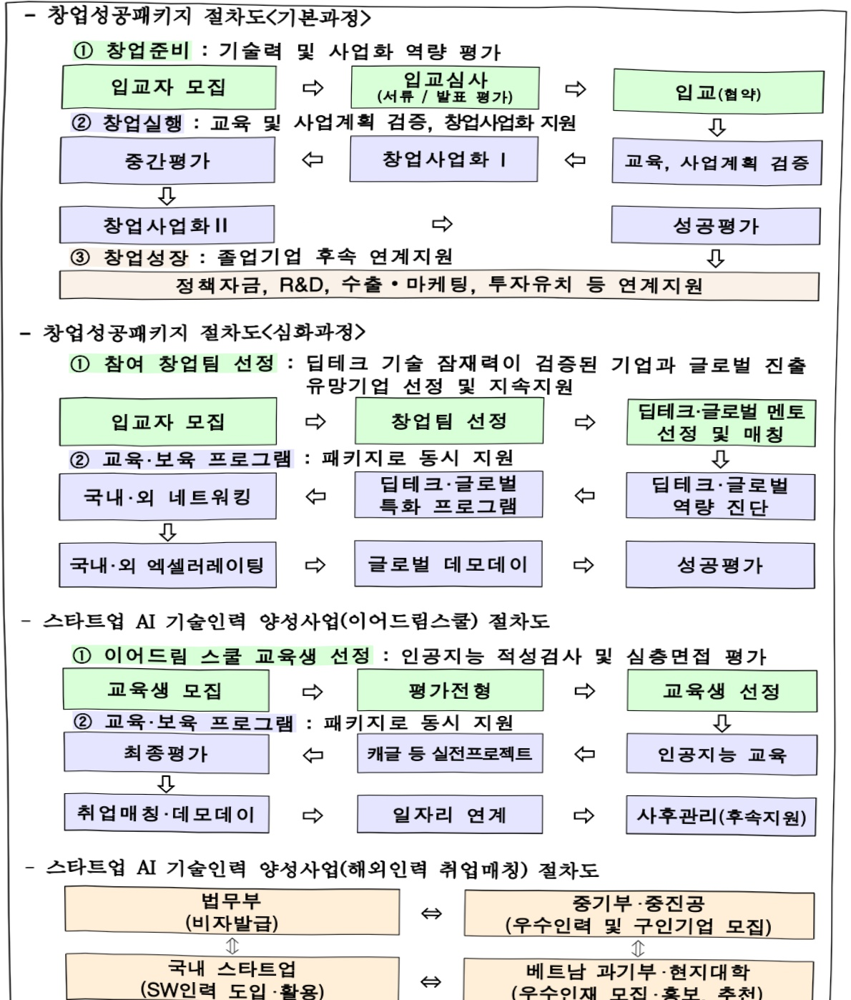
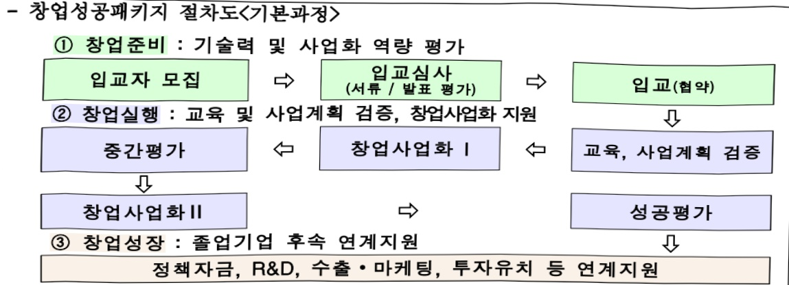
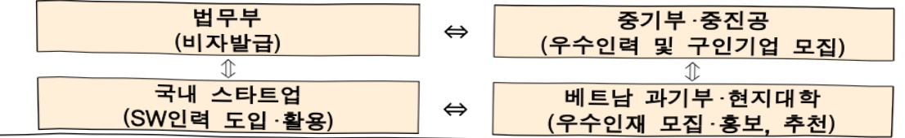
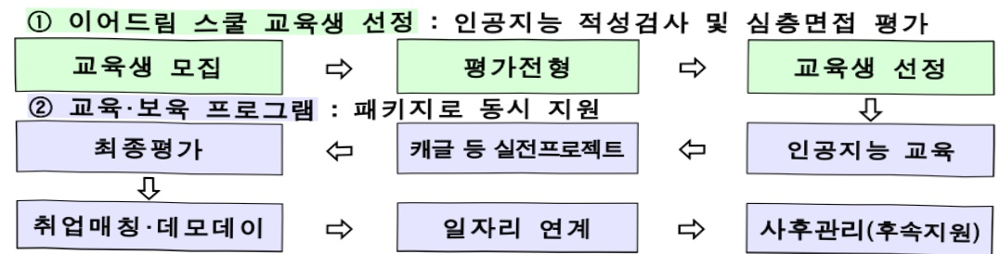

# 창업성공패키지

**해당 페이지**: PDF 4794 ~ 4800 쪽 해당

**부처**: 중소벤처기업부
**분야**: 산업·중소기업 및 에너지
**회계유형**: 기금
**2026 확정예산**: 106431.0 백만원
**전년대비 증감률**: 6.4%
**AI 도메인**: 교육/인재

---

<table border=1 style='margin: auto; word-wrap: break-word;'><tr><td style='text-align: center; word-wrap: break-word;'>사 업 명</td></tr><tr><td style='text-align: center; word-wrap: break-word;'>(11) 창업성공패키지 (5152-302)</td></tr></table>

사업 코드 정보

<table border=1 style='margin: auto; word-wrap: break-word;'><tr><td style='text-align: center; word-wrap: break-word;'>구분</td><td style='text-align: center; word-wrap: break-word;'>기금</td><td style='text-align: center; word-wrap: break-word;'>소관</td><td style='text-align: center; word-wrap: break-word;'>실국(기관)</td><td style='text-align: center; word-wrap: break-word;'>계정</td><td style='text-align: center; word-wrap: break-word;'>분야</td><td style='text-align: center; word-wrap: break-word;'>부문</td></tr><tr><td style='text-align: center; word-wrap: break-word;'>코드</td><td style='text-align: center; word-wrap: break-word;'>중소벤처기업</td><td rowspan="2">중소벤처기업부</td><td rowspan="2">창업벤처혁신실</td><td rowspan="2">-</td><td style='text-align: center; word-wrap: break-word;'>110</td><td style='text-align: center; word-wrap: break-word;'>118</td></tr><tr><td style='text-align: center; word-wrap: break-word;'>명칭</td><td style='text-align: center; word-wrap: break-word;'>창업 및 진흥기금</td><td style='text-align: center; word-wrap: break-word;'>산업·중소기업 및 에너지</td><td style='text-align: center; word-wrap: break-word;'>창업 및 벤처</td></tr></table>

<table border=1 style='margin: auto; word-wrap: break-word;'><tr><td style='text-align: center; word-wrap: break-word;'>구분</td><td style='text-align: center; word-wrap: break-word;'>프로그램</td><td style='text-align: center; word-wrap: break-word;'>단위사업</td><td style='text-align: center; word-wrap: break-word;'>세부사업</td></tr><tr><td style='text-align: center; word-wrap: break-word;'>코드</td><td style='text-align: center; word-wrap: break-word;'>5100</td><td style='text-align: center; word-wrap: break-word;'>5152</td><td style='text-align: center; word-wrap: break-word;'>302</td></tr><tr><td style='text-align: center; word-wrap: break-word;'>명칭</td><td style='text-align: center; word-wrap: break-word;'>창업환경조성</td><td style='text-align: center; word-wrap: break-word;'>창업기업지원용자(기금)</td><td style='text-align: center; word-wrap: break-word;'>창업성공패키지</td></tr></table>

사업 성격 (공통요구자료 Ⅱ-1 작성유의사항 4. 참조, 해당하는 사항에 “○” 표시)

<table border=1 style='margin: auto; word-wrap: break-word;'><tr><td rowspan="2">신규</td><td rowspan="2">계속</td><td rowspan="2">완료</td><td rowspan="2">예비타당성 실시여부</td><td rowspan="2">총사업비 관리대상</td><td rowspan="2">총액계상 예산사업</td><td style='text-align: center; word-wrap: break-word;'>사업소관 변경정보</td></tr><tr><td style='text-align: center; word-wrap: break-word;'>2025예산 시 소관</td></tr><tr><td style='text-align: center; word-wrap: break-word;'></td><td style='text-align: center; word-wrap: break-word;'></td><td style='text-align: center; word-wrap: break-word;'></td><td style='text-align: center; word-wrap: break-word;'></td><td style='text-align: center; word-wrap: break-word;'></td><td style='text-align: center; word-wrap: break-word;'></td><td style='text-align: center; word-wrap: break-word;'></td></tr></table>

사업지원형태 및 지원을(최소한 한 개는 반드시 선택하시오. 해당사항에 0 표시)

<table border=1 style='margin: auto; word-wrap: break-word;'><tr><td style='text-align: center; word-wrap: break-word;'>직접</td><td style='text-align: center; word-wrap: break-word;'>출자</td><td style='text-align: center; word-wrap: break-word;'>출연</td><td style='text-align: center; word-wrap: break-word;'>보조</td><td style='text-align: center; word-wrap: break-word;'>응자</td><td style='text-align: center; word-wrap: break-word;'>국고보조율(%)</td><td style='text-align: center; word-wrap: break-word;'>응자율(%)</td></tr><tr><td style='text-align: center; word-wrap: break-word;'>O</td><td style='text-align: center; word-wrap: break-word;'></td><td style='text-align: center; word-wrap: break-word;'></td><td style='text-align: center; word-wrap: break-word;'></td><td style='text-align: center; word-wrap: break-word;'></td><td style='text-align: center; word-wrap: break-word;'></td><td style='text-align: center; word-wrap: break-word;'></td></tr></table>

사업 소관부처 및 시행주체

<table border=1 style='margin: auto; word-wrap: break-word;'><tr><td style='text-align: center; word-wrap: break-word;'>사업명</td><td colspan="2">구분</td></tr><tr><td rowspan="2">창업성공패키지</td><td style='text-align: center; word-wrap: break-word;'>소관부처</td><td style='text-align: center; word-wrap: break-word;'>창업벤처혁신실 창업정책관 청년정책과</td></tr><tr><td style='text-align: center; word-wrap: break-word;'>사업시행주체</td><td style='text-align: center; word-wrap: break-word;'>중소벤처기업진흥공단</td></tr><tr><td rowspan="2">스타트업AI기술인력양성</td><td style='text-align: center; word-wrap: break-word;'>소관부처</td><td style='text-align: center; word-wrap: break-word;'>창업벤처혁신실 창업정책관 청년정책과</td></tr><tr><td style='text-align: center; word-wrap: break-word;'>사업시행주체</td><td style='text-align: center; word-wrap: break-word;'>중소벤처기업진흥공단</td></tr></table>

---

### 가.지출계획 총괄표

(단위: 백만원, %)

<table border=1 style='margin: auto; word-wrap: break-word;'><tr><td rowspan="2">사업명</td><td rowspan="2">2024년 결산</td><td colspan="2">2025년 예산</td><td colspan="2">2026년 예산</td><td rowspan="2">증감 (B-A)</td><td rowspan="2">(B-A)/A</td></tr><tr><td style='text-align: center; word-wrap: break-word;'>본예산</td><td style='text-align: center; word-wrap: break-word;'>추경(A)</td><td style='text-align: center; word-wrap: break-word;'>요구안</td><td style='text-align: center; word-wrap: break-word;'>본예산(B)</td></tr><tr><td style='text-align: center; word-wrap: break-word;'>창업성공패키지</td><td style='text-align: center; word-wrap: break-word;'>97,368</td><td style='text-align: center; word-wrap: break-word;'>100,031</td><td style='text-align: center; word-wrap: break-word;'>100,031</td><td style='text-align: center; word-wrap: break-word;'>106,431</td><td style='text-align: center; word-wrap: break-word;'>106,431</td><td style='text-align: center; word-wrap: break-word;'>6,400</td><td style='text-align: center; word-wrap: break-word;'>6.4</td></tr></table>

□ 기능별(내역사업별) 계획 내역

(단위: 백만원)

<table border=1 style='margin: auto; word-wrap: break-word;'><tr><td rowspan="2"></td><td colspan="5">2024</td><td colspan="5">2025</td><td rowspan="2">2026 계획</td></tr><tr><td style='text-align: center; word-wrap: break-word;'>계획액 (추정)</td><td style='text-align: center; word-wrap: break-word;'>계획 현액</td><td style='text-align: center; word-wrap: break-word;'>집행액</td><td style='text-align: center; word-wrap: break-word;'>이월액</td><td style='text-align: center; word-wrap: break-word;'>불용액</td><td style='text-align: center; word-wrap: break-word;'>계획액 (추정)</td><td style='text-align: center; word-wrap: break-word;'>계획 현액</td><td style='text-align: center; word-wrap: break-word;'>집행액</td><td style='text-align: center; word-wrap: break-word;'>이월액</td><td style='text-align: center; word-wrap: break-word;'>불용액</td></tr><tr><td style='text-align: center; word-wrap: break-word;'>○ 기능별 분류(합계)</td><td style='text-align: center; word-wrap: break-word;'>97,481</td><td style='text-align: center; word-wrap: break-word;'>97,481</td><td style='text-align: center; word-wrap: break-word;'>97,368</td><td style='text-align: center; word-wrap: break-word;'>-</td><td style='text-align: center; word-wrap: break-word;'>113</td><td style='text-align: center; word-wrap: break-word;'>100,031</td><td style='text-align: center; word-wrap: break-word;'>100,031</td><td style='text-align: center; word-wrap: break-word;'>99,996</td><td style='text-align: center; word-wrap: break-word;'>-</td><td style='text-align: center; word-wrap: break-word;'>35</td><td style='text-align: center; word-wrap: break-word;'>106,431</td></tr><tr><td style='text-align: center; word-wrap: break-word;'>• 창업성공폐기지</td><td style='text-align: center; word-wrap: break-word;'>93,181</td><td style='text-align: center; word-wrap: break-word;'>93,181</td><td style='text-align: center; word-wrap: break-word;'>93,071</td><td style='text-align: center; word-wrap: break-word;'>-</td><td style='text-align: center; word-wrap: break-word;'>110</td><td style='text-align: center; word-wrap: break-word;'>96,131</td><td style='text-align: center; word-wrap: break-word;'>96,131</td><td style='text-align: center; word-wrap: break-word;'>96,101</td><td style='text-align: center; word-wrap: break-word;'>-</td><td style='text-align: center; word-wrap: break-word;'>30</td><td style='text-align: center; word-wrap: break-word;'>102,531</td></tr><tr><td style='text-align: center; word-wrap: break-word;'>• 스타트업 AI 기술 인력양성</td><td style='text-align: center; word-wrap: break-word;'>4,300</td><td style='text-align: center; word-wrap: break-word;'>4,300</td><td style='text-align: center; word-wrap: break-word;'>4,297</td><td style='text-align: center; word-wrap: break-word;'>-</td><td style='text-align: center; word-wrap: break-word;'>3</td><td style='text-align: center; word-wrap: break-word;'>3,900</td><td style='text-align: center; word-wrap: break-word;'>3,900</td><td style='text-align: center; word-wrap: break-word;'>3,895</td><td style='text-align: center; word-wrap: break-word;'>-</td><td style='text-align: center; word-wrap: break-word;'>5</td><td style='text-align: center; word-wrap: break-word;'>3,900</td></tr></table>

### 나. 사업설명자료

## 1 ) 사업목적·내용

- (창업성공패키지) 유망 창업 아이템 및 혁신기술을 보유한 초기창업자를 발굴하고,

창업 손단계를 패키지 방식으로 일괄 지원하여 성공창업 기업 육성

- (스타트업 AI 기술인력 양성) 혁신 벤처스타트업이 필요로 하는 인공지능 청년인재·

해외 SW 실무인력 양성을 통해 스타트업의 일자리 미스매치 해소

## 2 ) 사업개요

☐ 사업근거 및 추진경위

① 법령상 근거 및 조항 적시 : 중소기업진흥에 관한 법률 제74조

중소기업창업지원법 제3조, 제10~11조

---

## ② 추진경위

- '11.3 청년일자리 창출, 기술창업 활성화를 위한 청년창업사관학교 개소(경기안산)

- '12.3 청년창업사관학교 인프라 확대(광주, 경북, 경남 추가 개소)

- '14.3 청년창업사관학교 추가 개소(충남)

- '18.8 지역 불균형 해소를 위해 청년창업사관학교 전국 확대(5개→17개)

- '20.6 글로벌AI전문가 육성을 위해 글로벌창업사관학교 신규 사업 추진(60개사)

- '21.4 청년창업사관학교 추가 개소 (세종, 누적 18개소)

- '22.3 스타트업 AI 실무인재 육성을 위해 이어드림 스쿨 신규 사업 추진(교육생 200명)

- '24.3 국내 스타트업 SW인력난 완화를 위해 해외인력 취업매칭 지원사업 추진

## □ 주요내용

① 사업규모

- 총사업비(해당되는 경우에만 기재) : 해당없음

- 사업기간 : 2011 ~ 계속

- 최근 5년 간 투입된 사업비(예산액기준, 추경편성한 연도에는 추경포함)

<table border=1 style='margin: auto; word-wrap: break-word;'><tr><td style='text-align: center; word-wrap: break-word;'>연도</td><td style='text-align: center; word-wrap: break-word;'>2022</td><td style='text-align: center; word-wrap: break-word;'>2023</td><td style='text-align: center; word-wrap: break-word;'>2024</td><td style='text-align: center; word-wrap: break-word;'>2025</td><td style='text-align: center; word-wrap: break-word;'>2026</td></tr><tr><td style='text-align: center; word-wrap: break-word;'>사업비</td><td style='text-align: center; word-wrap: break-word;'>98,015</td><td style='text-align: center; word-wrap: break-word;'>98,075</td><td style='text-align: center; word-wrap: break-word;'>97,481</td><td style='text-align: center; word-wrap: break-word;'>100,031</td><td style='text-align: center; word-wrap: break-word;'>106,431</td></tr></table>

② 사업추진체계

- 사업시행방법 : 직접수행

- 사업시행주체 : 중소벤처기업진흥공단

-사업 수혜자 : 창업기업

- 보조, 융자, 출연, 출자 등의 경우 보조·융자 등 지원 비율 및 법적근거

<table border=1 style='margin: auto; word-wrap: break-word;'><tr><td style='text-align: center; word-wrap: break-word;'>내역사업명</td><td style='text-align: center; word-wrap: break-word;'>구분</td><td style='text-align: center; word-wrap: break-word;'>피보조·피출연 등 기관명</td><td style='text-align: center; word-wrap: break-word;'>지원 금액 (2026계획)</td><td style='text-align: center; word-wrap: break-word;'>지원 비율(%)</td><td style='text-align: center; word-wrap: break-word;'>보조율 법적근거 (해당 조항)</td></tr><tr><td style='text-align: center; word-wrap: break-word;'>창업성공 패키지</td><td style='text-align: center; word-wrap: break-word;'>직접</td><td style='text-align: center; word-wrap: break-word;'>중진공</td><td style='text-align: center; word-wrap: break-word;'>102,531</td><td style='text-align: center; word-wrap: break-word;'>100</td><td style='text-align: center; word-wrap: break-word;'>중소기업진흥에관한법률 제74조제①항</td></tr><tr><td style='text-align: center; word-wrap: break-word;'>스타트업AI 인력양성</td><td style='text-align: center; word-wrap: break-word;'>직접</td><td style='text-align: center; word-wrap: break-word;'>중진공</td><td style='text-align: center; word-wrap: break-word;'>3,900</td><td style='text-align: center; word-wrap: break-word;'>100</td><td style='text-align: center; word-wrap: break-word;'>중소기업진흥에관한법률 제74조제①항</td></tr></table>

---

3) 2026년도 계획 산출 근거

□ 창업성공패키지 : (2025) 100,031백만원 → (2026 계획) 106,431백만원, 6,400백만원 증액

① 창업성공패키지 : (2025) 96,131백만원 → (2026 계획) 102,531백만원, 6400백만원 증액

- (내용) 유망 창업 아이템 및 혁신기술을 보유한 초기창업자를 발굴하고, 창업 초단계를 패키지 방식으로 일괄 지원하여 성공창업 기업 육성을 위해 102,531백만원 지원

② 스타트업 AI 기술인력양성 : (2025) 3,900백만원 → (2026 계획) 3,900백만원, 전년동

- (내용) 혁신 벤처스타트업이 필요로 하는 인공지능 청년인재·해외 SW 실무인력 양성을 통해 스타트업의 일자리 미스매치 해소를 위해 3,900백만원 지원

## 4 ) 사업효과

☐ 사업영향, 산출물 성과지표 등

① 2022~2026년도 성과계획서 상 성과지표 및 최근 5년간 성과 달성도

<table border=1 style='margin: auto; word-wrap: break-word;'><tr><td style='text-align: center; word-wrap: break-word;'>성과지표</td><td style='text-align: center; word-wrap: break-word;'>구분</td><td style='text-align: center; word-wrap: break-word;'>2022</td><td style='text-align: center; word-wrap: break-word;'>2023</td><td style='text-align: center; word-wrap: break-word;'>2024</td><td style='text-align: center; word-wrap: break-word;'>2025</td><td style='text-align: center; word-wrap: break-word;'>2026</td><td style='text-align: center; word-wrap: break-word;'>2026 목표치산출근거</td><td style='text-align: center; word-wrap: break-word;'>측정산식(또는 측정방법)</td><td style='text-align: center; word-wrap: break-word;'>자료수집방법(또는 자료출처)</td></tr><tr><td rowspan="3">법인창업기업수(단위:개)</td><td style='text-align: center; word-wrap: break-word;'>목표</td><td style='text-align: center; word-wrap: break-word;'>114,749</td><td style='text-align: center; word-wrap: break-word;'>124,519</td><td style='text-align: center; word-wrap: break-word;'>-</td><td style='text-align: center; word-wrap: break-word;'>-</td><td style='text-align: center; word-wrap: break-word;'>-</td><td rowspan="3">-</td><td rowspan="3">중기부에서 매달발표하는 창업기업 동향에 근거하여 ‘23년 전체 법인 창업기업 수측정</td><td rowspan="3">창업기업동향 통계</td></tr><tr><td style='text-align: center; word-wrap: break-word;'>실적</td><td style='text-align: center; word-wrap: break-word;'>113,889</td><td style='text-align: center; word-wrap: break-word;'>98,294</td><td style='text-align: center; word-wrap: break-word;'>-</td><td style='text-align: center; word-wrap: break-word;'>-</td><td style='text-align: center; word-wrap: break-word;'>-</td></tr><tr><td style='text-align: center; word-wrap: break-word;'>달성도</td><td style='text-align: center; word-wrap: break-word;'>99.3</td><td style='text-align: center; word-wrap: break-word;'>78.9</td><td style='text-align: center; word-wrap: break-word;'>-</td><td style='text-align: center; word-wrap: break-word;'>-</td><td style='text-align: center; word-wrap: break-word;'>-</td></tr><tr><td rowspan="3">수혜 창업기업2년차 생존을(단위:%)</td><td style='text-align: center; word-wrap: break-word;'>목표</td><td style='text-align: center; word-wrap: break-word;'>80.7</td><td style='text-align: center; word-wrap: break-word;'>82.6</td><td style='text-align: center; word-wrap: break-word;'>-</td><td style='text-align: center; word-wrap: break-word;'>-</td><td style='text-align: center; word-wrap: break-word;'>-</td><td rowspan="3">-</td><td rowspan="3">∑(Y)년 창업지원수혜기업 중 (Y+2)년 생존기업 수 /∑(Y)년 창업지원 수혜기업 수)×100</td><td rowspan="3">창업지원기업이력성과조사</td></tr><tr><td style='text-align: center; word-wrap: break-word;'>실적</td><td style='text-align: center; word-wrap: break-word;'>83.0</td><td style='text-align: center; word-wrap: break-word;'>89.3</td><td style='text-align: center; word-wrap: break-word;'>-</td><td style='text-align: center; word-wrap: break-word;'>-</td><td style='text-align: center; word-wrap: break-word;'>-</td></tr><tr><td style='text-align: center; word-wrap: break-word;'>달성도</td><td style='text-align: center; word-wrap: break-word;'>102.9</td><td style='text-align: center; word-wrap: break-word;'>108.1</td><td style='text-align: center; word-wrap: break-word;'>-</td><td style='text-align: center; word-wrap: break-word;'>-</td><td style='text-align: center; word-wrap: break-word;'>-</td></tr><tr><td rowspan="3">자금 공급 수혜창업기업매출액 증가율(단위:%)</td><td style='text-align: center; word-wrap: break-word;'>목표</td><td style='text-align: center; word-wrap: break-word;'>신규</td><td style='text-align: center; word-wrap: break-word;'>10.01</td><td style='text-align: center; word-wrap: break-word;'>-</td><td style='text-align: center; word-wrap: break-word;'>-</td><td style='text-align: center; word-wrap: break-word;'>-</td><td rowspan="3">-</td><td rowspan="3">[ (∑ 정책자금 수혜기업 지원년도 매출액 - ∑ 동일기업 지원전년도 매출액) / ∑ 동일기업 지원전년도 매출액 ] × 100</td><td rowspan="3">수혜기업전수조사(중진공DB)</td></tr><tr><td style='text-align: center; word-wrap: break-word;'>실적</td><td style='text-align: center; word-wrap: break-word;'>-</td><td style='text-align: center; word-wrap: break-word;'>14.4</td><td style='text-align: center; word-wrap: break-word;'>-</td><td style='text-align: center; word-wrap: break-word;'>-</td><td style='text-align: center; word-wrap: break-word;'>-</td></tr><tr><td style='text-align: center; word-wrap: break-word;'>달성도</td><td style='text-align: center; word-wrap: break-word;'>-</td><td style='text-align: center; word-wrap: break-word;'>143.9</td><td style='text-align: center; word-wrap: break-word;'>-</td><td style='text-align: center; word-wrap: break-word;'>-</td><td style='text-align: center; word-wrap: break-word;'>-</td></tr><tr><td rowspan="3">기술기반업종창업기업 수(단위:개)</td><td style='text-align: center; word-wrap: break-word;'>목표</td><td style='text-align: center; word-wrap: break-word;'>-</td><td style='text-align: center; word-wrap: break-word;'>신규</td><td style='text-align: center; word-wrap: break-word;'>231,820</td><td style='text-align: center; word-wrap: break-word;'>-</td><td style='text-align: center; word-wrap: break-word;'>-</td><td rowspan="3">-</td><td rowspan="3">중기부에서 매달발표하는 창업기업동향에 근거하여 ‘24년 기술기반업종의 창업기업수를 측정</td><td rowspan="3">창업기업동향 통계</td></tr><tr><td style='text-align: center; word-wrap: break-word;'>실적</td><td style='text-align: center; word-wrap: break-word;'>229,416</td><td style='text-align: center; word-wrap: break-word;'>221,436</td><td style='text-align: center; word-wrap: break-word;'>214,917</td><td style='text-align: center; word-wrap: break-word;'></td><td style='text-align: center; word-wrap: break-word;'></td></tr><tr><td style='text-align: center; word-wrap: break-word;'>달성도</td><td style='text-align: center; word-wrap: break-word;'>-</td><td style='text-align: center; word-wrap: break-word;'>-</td><td style='text-align: center; word-wrap: break-word;'>92.2</td><td style='text-align: center; word-wrap: break-word;'></td><td style='text-align: center; word-wrap: break-word;'></td></tr><tr><td rowspan="3">창업지원기업평균 매출액(단위:개)</td><td style='text-align: center; word-wrap: break-word;'>목표</td><td style='text-align: center; word-wrap: break-word;'>-</td><td style='text-align: center; word-wrap: break-word;'>-</td><td style='text-align: center; word-wrap: break-word;'>신규</td><td style='text-align: center; word-wrap: break-word;'>13.0</td><td style='text-align: center; word-wrap: break-word;'>13.6</td><td rowspan="3">최근 4년간(21~24)창업지원기업의 매출평균인 12.8억원에 당해연도 경제성장률(1.5%(e),‘25.2월 한국은행) 및 추가 가중치(5%)를 적용하여 목표로 설정</td><td rowspan="3">중기부에서 매년 조사하는 ‘창업지원기업 이력성과 조사</td><td rowspan="3">창업지원기업 이력성과 조사</td></tr><tr><td style='text-align: center; word-wrap: break-word;'>실적</td><td style='text-align: center; word-wrap: break-word;'></td><td style='text-align: center; word-wrap: break-word;'>-</td><td style='text-align: center; word-wrap: break-word;'>신규</td><td style='text-align: center; word-wrap: break-word;'>17.75</td><td style='text-align: center; word-wrap: break-word;'>-</td></tr><tr><td style='text-align: center; word-wrap: break-word;'>달성도</td><td style='text-align: center; word-wrap: break-word;'>-</td><td style='text-align: center; word-wrap: break-word;'>-</td><td style='text-align: center; word-wrap: break-word;'>-</td><td style='text-align: center; word-wrap: break-word;'>136.5</td><td style='text-align: center; word-wrap: break-word;'>-</td></tr></table>

---

② 성과지표 이외의 연도별 사업추진 경과 및 실적

<table border=1 style='margin: auto; word-wrap: break-word;'><tr><td style='text-align: center; word-wrap: break-word;'>2022</td><td style='text-align: center; word-wrap: break-word;'>○ (창업성공패키지(청년창업사관학교)) 청년 CEO 899명(팀) 육성○ (창업성공패키지(글로벌창업사관학교)) D.N.A분야 글로벌 유망 CEO 60명(팀) 육성○ (스타트업 AI 기술인력 양성) AI 기술인력 양성 및 취업지원 교육생 143명 육성</td></tr><tr><td style='text-align: center; word-wrap: break-word;'>2023</td><td style='text-align: center; word-wrap: break-word;'>○ (창업성공패키지(청년창업사관학교)) 청년 CEO 897명(팀) 육성○ (창업성공패키지(글로벌창업사관학교)) D.N.A분야 글로벌 유망 CEO 59명(팀) 육성○ (스타트업 AI 기술인력 양성) AI 기술인력 양성 및 취업지원 교육생 144명 육성</td></tr><tr><td style='text-align: center; word-wrap: break-word;'>2024</td><td style='text-align: center; word-wrap: break-word;'>○ (창업성공패키지(청년창업사관학교)) 청년 CEO 839명(팀) 육성○ (창업성공패키지(글로벌창업사관학교)) 혁신 분야 글로벌 유망 CEO 60명(팀) 육성○ (스타트업 AI 기술인력 양성) AI 기술인력 양성 및 취업지원 교육생 327명 육성</td></tr><tr><td style='text-align: center; word-wrap: break-word;'>2025</td><td style='text-align: center; word-wrap: break-word;'>○ (창업성공패키지(청년창업사관학교)) 청년 CEO 842명(팀) 육성○ (창업성공패키지(글로벌창업사관학교)) 혁신 분야 글로벌 유망 CEO 59명(팀) 육성○ (스타트업 AI 기술인력 양성) AI 기술인력 양성 및 취업지원 교육생 356명 육성</td></tr></table>

## ③ 향후(2026년도 이후) 기대효과

- 청년 창업기업의 초기단계부터 글로벌 진출까지 체계적인 지원을 위해 딥테크·

글로벌 심화과정을 도입하여 관련 분야 청년창업기업 육성(~30, 1,500개사)

- 인공지능 실무인력 양성 및 취·창업 연계를 통한 청년인재와 스타트업간 미스매치 해소

- 부족한 AI분야 인력양성을 위한 해외인력 참여 확대 및 국내 소프트웨어 전문인력

채용난 속 중기 인력난 해소

5) 타당성조사 및 예비타당성조사 시행여부 및 결과 요지 : 해당사항 없음

6) 총사업비 대상사업 여부 및 내역 : 해당사항 없음

---

## 7 ) 사업 집행절차

- 창업성공패키지 절차도<심화과정>

입교자 모집

창업팀 선정

②교육·보육 프로그램:패키지로 동시 지원

국내·외 네트워킹

딥테크·글로벌

특화 프로그램

국내·외 엑셀러레이팅

글로벌 데모데이

성공평가

- 스타트업 AI 기술인력 양성사업(해외인력 취업매칭) 절차도

---

8) 각종 평가 : 해당사항 없음

<table border=1 style='margin: auto; word-wrap: break-word;'><tr><td style='text-align: center; word-wrap: break-word;'>1) 「국가재정법」제85조의8 제1항에 따른 재정사업자율평가(&#x27;18년) 결과에 대한 기획 재정부의 상위평가(심층평가) 결과: 입교·졸업기업 간 네트워킹 강화 우수성 등을 고려 시 지속적으로 추진하는 것이 타당</td></tr><tr><td style='text-align: center; word-wrap: break-word;'>2) &#x27;21회계년도 재정지원 일자리사업평가 결과: &quot;우수&quot; 등급</td></tr><tr><td style='text-align: center; word-wrap: break-word;'>3) &#x27;22년 청년정책 시행계획 평가 결과: &quot;탁월&quot; 등급</td></tr><tr><td style='text-align: center; word-wrap: break-word;'>4) &#x27;23년 청년정책 종합평가: &quot;우수&quot; 사례 선정</td></tr><tr><td style='text-align: center; word-wrap: break-word;'>5) &#x27;24년 중소기업 지원사업 성과평가: &quot;우수&quot; 등급</td></tr></table>

### 다. 최근 4년간 결산내역

## 1 ) 결산표

☐ 부처 결산내역

(단위: 백만원, %)

<table border=1 style='margin: auto; word-wrap: break-word;'><tr><td rowspan="2">연도</td><td colspan="3">계획액</td><td rowspan="2">계획현액(A)</td><td rowspan="2">집행액(B)</td><td rowspan="2">집행률(B/A)</td><td rowspan="2">다음연도이월액</td><td rowspan="2">불용액</td></tr><tr><td style='text-align: center; word-wrap: break-word;'>본예산</td><td style='text-align: center; word-wrap: break-word;'>추경중감액</td><td style='text-align: center; word-wrap: break-word;'>추경</td></tr><tr><td style='text-align: center; word-wrap: break-word;'>2022</td><td style='text-align: center; word-wrap: break-word;'>98,015</td><td style='text-align: center; word-wrap: break-word;'>-</td><td style='text-align: center; word-wrap: break-word;'>98,015</td><td style='text-align: center; word-wrap: break-word;'>98,015</td><td style='text-align: center; word-wrap: break-word;'>97,875</td><td style='text-align: center; word-wrap: break-word;'>99.9</td><td style='text-align: center; word-wrap: break-word;'>-</td><td style='text-align: center; word-wrap: break-word;'>140</td></tr><tr><td style='text-align: center; word-wrap: break-word;'>2023</td><td style='text-align: center; word-wrap: break-word;'>98,075</td><td style='text-align: center; word-wrap: break-word;'>-</td><td style='text-align: center; word-wrap: break-word;'>98,075</td><td style='text-align: center; word-wrap: break-word;'>98,075</td><td style='text-align: center; word-wrap: break-word;'>97,099</td><td style='text-align: center; word-wrap: break-word;'>99.0</td><td style='text-align: center; word-wrap: break-word;'>-</td><td style='text-align: center; word-wrap: break-word;'>976</td></tr><tr><td style='text-align: center; word-wrap: break-word;'>2024</td><td style='text-align: center; word-wrap: break-word;'>97,481</td><td style='text-align: center; word-wrap: break-word;'>-</td><td style='text-align: center; word-wrap: break-word;'>97,481</td><td style='text-align: center; word-wrap: break-word;'>97,481</td><td style='text-align: center; word-wrap: break-word;'>97,368</td><td style='text-align: center; word-wrap: break-word;'>99.9</td><td style='text-align: center; word-wrap: break-word;'>-</td><td style='text-align: center; word-wrap: break-word;'>113</td></tr><tr><td style='text-align: center; word-wrap: break-word;'>2025</td><td style='text-align: center; word-wrap: break-word;'>100,031</td><td style='text-align: center; word-wrap: break-word;'>-</td><td style='text-align: center; word-wrap: break-word;'>100,031</td><td style='text-align: center; word-wrap: break-word;'>100,031</td><td style='text-align: center; word-wrap: break-word;'>99,996</td><td style='text-align: center; word-wrap: break-word;'>99.9</td><td style='text-align: center; word-wrap: break-word;'>-</td><td style='text-align: center; word-wrap: break-word;'>35</td></tr></table>

## 2 ) 주요 결산사항

□ 2022~2025년 결산 주요사항

<table border=1 style='margin: auto; word-wrap: break-word;'><tr><td style='text-align: center; word-wrap: break-word;'>2022</td><td style='text-align: center; word-wrap: break-word;'>- 사업 추진하여 ‘22.12월말 97,875백만원(99.9%) 집행</td></tr><tr><td style='text-align: center; word-wrap: break-word;'>2023</td><td style='text-align: center; word-wrap: break-word;'>- 사업 추진하여 ‘23.12월말 97,099백만원(99.0%) 집행</td></tr><tr><td style='text-align: center; word-wrap: break-word;'>2024</td><td style='text-align: center; word-wrap: break-word;'>- 사업 추진하여 ‘24.12월 말 97,368백만원(99.9%) 집행</td></tr><tr><td style='text-align: center; word-wrap: break-word;'>2025</td><td style='text-align: center; word-wrap: break-word;'>- 사업 추진하여 ‘25.12월 말 99,996백만원(99.9%) 집행</td></tr></table>

□ 2025년 계획변경 세부내역 : 해당없음

---

### 원본 PDF 크롭 이미지

