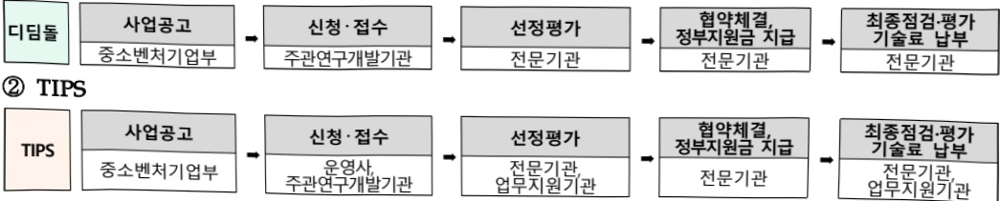

# 창업성장기술개발(R&D)

**해당 페이지**: PDF 4801 ~ 4806 쪽 해당

**부처**: 중소벤처기업부
**분야**: 산업·중소기업 및 에너지
**회계유형**: 일반회계
**2026 확정예산**: 786419.0 백만원
**전년대비 증감률**: 31.9%
**AI 도메인**: R&D 지원

---

### 가.예산 총괄표

(단위: 백만원, %)

<table border=1 style='margin: auto; word-wrap: break-word;'><tr><td rowspan="2">사업명</td><td rowspan="2">2024년 결산</td><td colspan="2">2025년 예산</td><td colspan="2">2026년 예산</td><td rowspan="2">증감(B-A)</td><td rowspan="2">(B-A)/A</td></tr><tr><td style='text-align: center; word-wrap: break-word;'>본예산</td><td style='text-align: center; word-wrap: break-word;'>추경(A)</td><td style='text-align: center; word-wrap: break-word;'>요구안</td><td style='text-align: center; word-wrap: break-word;'>본예산(B)</td></tr><tr><td style='text-align: center; word-wrap: break-word;'>창업성장기술개발(R&amp;D)</td><td style='text-align: center; word-wrap: break-word;'>531,683</td><td style='text-align: center; word-wrap: break-word;'>596,010</td><td style='text-align: center; word-wrap: break-word;'>596,010</td><td style='text-align: center; word-wrap: break-word;'>786,419</td><td style='text-align: center; word-wrap: break-word;'>786,419</td><td style='text-align: center; word-wrap: break-word;'>190,409</td><td style='text-align: center; word-wrap: break-word;'>31.9</td></tr></table>

□ 기능별(내역사업별) 예산 내역

(단위:백만원)

<table border=1 style='margin: auto; word-wrap: break-word;'><tr><td rowspan="2"></td><td colspan="5">2024</td><td colspan="5">2025</td><td rowspan="2">2026예산</td></tr><tr><td style='text-align: center; word-wrap: break-word;'>예산액(추정)</td><td style='text-align: center; word-wrap: break-word;'>예산현액</td><td style='text-align: center; word-wrap: break-word;'>집행액</td><td style='text-align: center; word-wrap: break-word;'>이월액</td><td style='text-align: center; word-wrap: break-word;'>불용액</td><td style='text-align: center; word-wrap: break-word;'>예산액(추정)</td><td style='text-align: center; word-wrap: break-word;'>예산현액</td><td style='text-align: center; word-wrap: break-word;'>집행액</td><td style='text-align: center; word-wrap: break-word;'>이월액</td><td style='text-align: center; word-wrap: break-word;'>불용액</td></tr><tr><td style='text-align: center; word-wrap: break-word;'>○ 기능별 분류(합계)</td><td style='text-align: center; word-wrap: break-word;'>531,683</td><td style='text-align: center; word-wrap: break-word;'>531,683</td><td style='text-align: center; word-wrap: break-word;'>531,683</td><td style='text-align: center; word-wrap: break-word;'>-</td><td style='text-align: center; word-wrap: break-word;'>-</td><td style='text-align: center; word-wrap: break-word;'>596,010</td><td style='text-align: center; word-wrap: break-word;'>596,010</td><td style='text-align: center; word-wrap: break-word;'>596,010</td><td style='text-align: center; word-wrap: break-word;'>-</td><td style='text-align: center; word-wrap: break-word;'>-</td><td style='text-align: center; word-wrap: break-word;'>786,419</td></tr><tr><td style='text-align: center; word-wrap: break-word;'>· 디딤돌</td><td style='text-align: center; word-wrap: break-word;'>147,587</td><td style='text-align: center; word-wrap: break-word;'>147,587</td><td style='text-align: center; word-wrap: break-word;'>140,232</td><td style='text-align: center; word-wrap: break-word;'>-</td><td style='text-align: center; word-wrap: break-word;'>-</td><td style='text-align: center; word-wrap: break-word;'>106,500</td><td style='text-align: center; word-wrap: break-word;'>106,500</td><td style='text-align: center; word-wrap: break-word;'>106,500</td><td style='text-align: center; word-wrap: break-word;'>-</td><td style='text-align: center; word-wrap: break-word;'>-</td><td style='text-align: center; word-wrap: break-word;'>118,028</td></tr><tr><td style='text-align: center; word-wrap: break-word;'>· 전략형</td><td style='text-align: center; word-wrap: break-word;'>42,949</td><td style='text-align: center; word-wrap: break-word;'>42,949</td><td style='text-align: center; word-wrap: break-word;'>50,304</td><td style='text-align: center; word-wrap: break-word;'>-</td><td style='text-align: center; word-wrap: break-word;'>-</td><td style='text-align: center; word-wrap: break-word;'>11,859</td><td style='text-align: center; word-wrap: break-word;'>11,859</td><td style='text-align: center; word-wrap: break-word;'>11,859</td><td style='text-align: center; word-wrap: break-word;'>-</td><td style='text-align: center; word-wrap: break-word;'>-</td><td style='text-align: center; word-wrap: break-word;'>-</td></tr><tr><td style='text-align: center; word-wrap: break-word;'>· TIPS</td><td style='text-align: center; word-wrap: break-word;'>341,147</td><td style='text-align: center; word-wrap: break-word;'>341,147</td><td style='text-align: center; word-wrap: break-word;'>341,147</td><td style='text-align: center; word-wrap: break-word;'>-</td><td style='text-align: center; word-wrap: break-word;'>-</td><td style='text-align: center; word-wrap: break-word;'>477,651</td><td style='text-align: center; word-wrap: break-word;'>477,651</td><td style='text-align: center; word-wrap: break-word;'>477,651</td><td style='text-align: center; word-wrap: break-word;'>-</td><td style='text-align: center; word-wrap: break-word;'>-</td><td style='text-align: center; word-wrap: break-word;'>668,391</td></tr><tr><td style='text-align: center; word-wrap: break-word;'>○ 비목별 분류(합계)</td><td style='text-align: center; word-wrap: break-word;'>531,683</td><td style='text-align: center; word-wrap: break-word;'>531,683</td><td style='text-align: center; word-wrap: break-word;'>531,683</td><td style='text-align: center; word-wrap: break-word;'>-</td><td style='text-align: center; word-wrap: break-word;'>-</td><td style='text-align: center; word-wrap: break-word;'>596,010</td><td style='text-align: center; word-wrap: break-word;'>596,010</td><td style='text-align: center; word-wrap: break-word;'>596,010</td><td style='text-align: center; word-wrap: break-word;'>-</td><td style='text-align: center; word-wrap: break-word;'>-</td><td style='text-align: center; word-wrap: break-word;'>786,419</td></tr><tr><td style='text-align: center; word-wrap: break-word;'>· 연구개발활동비등(360-05)</td><td style='text-align: center; word-wrap: break-word;'>531,683</td><td style='text-align: center; word-wrap: break-word;'>531,683</td><td style='text-align: center; word-wrap: break-word;'>531,683</td><td style='text-align: center; word-wrap: break-word;'>-</td><td style='text-align: center; word-wrap: break-word;'>-</td><td style='text-align: center; word-wrap: break-word;'>596,010</td><td style='text-align: center; word-wrap: break-word;'>596,010</td><td style='text-align: center; word-wrap: break-word;'>596,010</td><td style='text-align: center; word-wrap: break-word;'>-</td><td style='text-align: center; word-wrap: break-word;'>-</td><td style='text-align: center; word-wrap: break-word;'>786,419</td></tr><tr><td style='text-align: center; word-wrap: break-word;'>○ 기능·비목별 분류(합계)</td><td style='text-align: center; word-wrap: break-word;'>531,683</td><td style='text-align: center; word-wrap: break-word;'>531,683</td><td style='text-align: center; word-wrap: break-word;'>531,683</td><td style='text-align: center; word-wrap: break-word;'>-</td><td style='text-align: center; word-wrap: break-word;'>-</td><td style='text-align: center; word-wrap: break-word;'>596,010</td><td style='text-align: center; word-wrap: break-word;'>596,010</td><td style='text-align: center; word-wrap: break-word;'>596,010</td><td style='text-align: center; word-wrap: break-word;'>-</td><td style='text-align: center; word-wrap: break-word;'>-</td><td style='text-align: center; word-wrap: break-word;'>786,419</td></tr><tr><td style='text-align: center; word-wrap: break-word;'>· 디딤돌</td><td style='text-align: center; word-wrap: break-word;'>147,587</td><td style='text-align: center; word-wrap: break-word;'>147,587</td><td style='text-align: center; word-wrap: break-word;'>140,232</td><td style='text-align: center; word-wrap: break-word;'>-</td><td style='text-align: center; word-wrap: break-word;'>-</td><td style='text-align: center; word-wrap: break-word;'>106,500</td><td style='text-align: center; word-wrap: break-word;'>106,500</td><td style='text-align: center; word-wrap: break-word;'>106,500</td><td style='text-align: center; word-wrap: break-word;'>-</td><td style='text-align: center; word-wrap: break-word;'>-</td><td style='text-align: center; word-wrap: break-word;'>118,028</td></tr><tr><td style='text-align: center; word-wrap: break-word;'>· 연구개발활동비등(360-05)</td><td style='text-align: center; word-wrap: break-word;'>147,587</td><td style='text-align: center; word-wrap: break-word;'>147,587</td><td style='text-align: center; word-wrap: break-word;'>140,232</td><td style='text-align: center; word-wrap: break-word;'>-</td><td style='text-align: center; word-wrap: break-word;'>-</td><td style='text-align: center; word-wrap: break-word;'>106,500</td><td style='text-align: center; word-wrap: break-word;'>106,500</td><td style='text-align: center; word-wrap: break-word;'>106,500</td><td style='text-align: center; word-wrap: break-word;'>-</td><td style='text-align: center; word-wrap: break-word;'>-</td><td style='text-align: center; word-wrap: break-word;'>118,028</td></tr><tr><td style='text-align: center; word-wrap: break-word;'>· 전략형</td><td style='text-align: center; word-wrap: break-word;'>42,949</td><td style='text-align: center; word-wrap: break-word;'>42,949</td><td style='text-align: center; word-wrap: break-word;'>50,304</td><td style='text-align: center; word-wrap: break-word;'>-</td><td style='text-align: center; word-wrap: break-word;'>-</td><td style='text-align: center; word-wrap: break-word;'>11,859</td><td style='text-align: center; word-wrap: break-word;'>11,859</td><td style='text-align: center; word-wrap: break-word;'>11,859</td><td style='text-align: center; word-wrap: break-word;'>-</td><td style='text-align: center; word-wrap: break-word;'>-</td><td style='text-align: center; word-wrap: break-word;'>-</td></tr><tr><td style='text-align: center; word-wrap: break-word;'>· 연구개발활동비등(360-05)</td><td style='text-align: center; word-wrap: break-word;'>42,949</td><td style='text-align: center; word-wrap: break-word;'>42,949</td><td style='text-align: center; word-wrap: break-word;'>50,304</td><td style='text-align: center; word-wrap: break-word;'>-</td><td style='text-align: center; word-wrap: break-word;'>-</td><td style='text-align: center; word-wrap: break-word;'>11,859</td><td style='text-align: center; word-wrap: break-word;'>11,859</td><td style='text-align: center; word-wrap: break-word;'>11,859</td><td style='text-align: center; word-wrap: break-word;'>-</td><td style='text-align: center; word-wrap: break-word;'>-</td><td style='text-align: center; word-wrap: break-word;'>-</td></tr><tr><td style='text-align: center; word-wrap: break-word;'>· TIPS</td><td style='text-align: center; word-wrap: break-word;'>341,147</td><td style='text-align: center; word-wrap: break-word;'>341,147</td><td style='text-align: center; word-wrap: break-word;'>341,147</td><td style='text-align: center; word-wrap: break-word;'>-</td><td style='text-align: center; word-wrap: break-word;'>-</td><td style='text-align: center; word-wrap: break-word;'>477,651</td><td style='text-align: center; word-wrap: break-word;'>477,651</td><td style='text-align: center; word-wrap: break-word;'>477,651</td><td style='text-align: center; word-wrap: break-word;'>-</td><td style='text-align: center; word-wrap: break-word;'>-</td><td style='text-align: center; word-wrap: break-word;'>668,391</td></tr><tr><td style='text-align: center; word-wrap: break-word;'>· 연구개발활동비등(360-05)</td><td style='text-align: center; word-wrap: break-word;'>341,147</td><td style='text-align: center; word-wrap: break-word;'>341,147</td><td style='text-align: center; word-wrap: break-word;'>341,147</td><td style='text-align: center; word-wrap: break-word;'>-</td><td style='text-align: center; word-wrap: break-word;'>-</td><td style='text-align: center; word-wrap: break-word;'>477,651</td><td style='text-align: center; word-wrap: break-word;'>477,651</td><td style='text-align: center; word-wrap: break-word;'>477,651</td><td style='text-align: center; word-wrap: break-word;'>-</td><td style='text-align: center; word-wrap: break-word;'>-</td><td style='text-align: center; word-wrap: break-word;'>668,391</td></tr></table>

---

### 나. 사업설명자료

## 1 ) 사업목적·내용

0 창업기업에 대한 전략적 R&D지원을 통해 기술기반 창업기업의 혁신성장을 촉진하고 창업 강국으로의 도약

- (디딤돌) 잠재 가능성을 보유한 혁신 아이디어, 글로벌 시장진출, 전략기술 등 스타트업의 도전과 기술개발 성과 창출을 견인할 기술을 선별·집중 지원

- (TIPS) 민간의 역량을 활용하여 혁신 창업기업을 선별하고 민간투자와 정부 R&D를 연계하여 고급 기술인력의 창업을 활성화

## 2 ) 사업개요

## □ 사업근거 및 추진경위

① 법령상 근거 및 조항 적시 : 「중소기업 기술혁신 촉진법」 제9조(중소기업의 기술혁신 촉진지원사업) 및 제10조(기술혁신 중소기업자에 대한 출연)

## ② 추진경위

- (08) 지경부와 중기청은 각각 '신기술보육사업'과 'BI창업기업 공동기술개발사업'을 운영, 창업기업의 R&D 투자와 사업화 촉진 유도

- (20) 일몰관리혁신에 따른 사업 구조조정을 통해 기존 내역사업 종료 및 사업체계 개편

- (21) 사회문제해결, 미래 3대 신산업 및 소재·부품·장비 분야 기술창업기업 지원

- (21) 사회문제해결, 미래 3대 신산업 및 소재·부품·장비 분야 기술창업기업 지원

- 황대 등 기술창업기업 R&D 다각화 지원

- (22) 민간(지역 창업혁신주체) 연계 지원, 디지털·백신 등 중소기업 미래 전략분야 집중 지원

- (23) 민간 주도형 R&D 지원 및 미래 신산업(딥테크) 기술보유 창업기업 중점 지원

- (24) 지역특화, 글로벌, 여성참여 등 다양한 수요 맞춤형 R&D 지원 및 민간역량을 활용한 답테크 기업 지원 확대

-(25) 혁신 아이디어 및 도약기술 지원을 통한 스타트업의 과감한 도전 기회 제공 및 민간과 정부 협력을 통한 글로벌 혁신기업 육성

---

## □ 주요내용

① 사업규모

- 총사업비 : 해당사항 없음

- 사업기간 : '09년 ~ 계속 (일몰관리혁신)

- 최근 5년 간 투입된 사업비(예산액기준, 추경편성한 연도에는 추경포함)

<table border=1 style='margin: auto; word-wrap: break-word;'><tr><td style='text-align: center; word-wrap: break-word;'>$ \underline{\text{府}} $</td><td style='text-align: center; word-wrap: break-word;'>2022</td><td style='text-align: center; word-wrap: break-word;'>2023</td><td style='text-align: center; word-wrap: break-word;'>2024</td><td style='text-align: center; word-wrap: break-word;'>2025</td><td style='text-align: center; word-wrap: break-word;'>2026</td></tr><tr><td style='text-align: center; word-wrap: break-word;'>$ \underline{\text{州}} $</td><td style='text-align: center; word-wrap: break-word;'>381,556</td><td style='text-align: center; word-wrap: break-word;'>442,332</td><td style='text-align: center; word-wrap: break-word;'>531,683</td><td style='text-align: center; word-wrap: break-word;'>596,010</td><td style='text-align: center; word-wrap: break-word;'>786,419</td></tr></table>

- 기타: 해당사항 없음

② 사업추진체계

- 사업시행방법 : 출연

- 사업시행주체 : 중소벤처기업부(전문기관 : 중소기업기술정보진흥원)

- 사업 수혜자 : 중소기업

- 보조, 융자, 출연, 출자 등의 경우 보조 · 융자 등 지원 비율 및 법적근거

<table border=1 style='margin: auto; word-wrap: break-word;'><tr><td style='text-align: center; word-wrap: break-word;'>내역사업명</td><td style='text-align: center; word-wrap: break-word;'>구분</td><td style='text-align: center; word-wrap: break-word;'>피보조·피출연 등 기관명</td><td style='text-align: center; word-wrap: break-word;'>지원 금액 (2026예산)</td><td style='text-align: center; word-wrap: break-word;'>지원 비율(%)</td><td style='text-align: center; word-wrap: break-word;'>보조율 법적근거 (해당 조항)</td></tr><tr><td style='text-align: center; word-wrap: break-word;'>디딤돌</td><td style='text-align: center; word-wrap: break-word;'>출연</td><td style='text-align: center; word-wrap: break-word;'>중소기업기술 정보진흥원</td><td style='text-align: center; word-wrap: break-word;'>118,028</td><td rowspan="2">75%</td><td rowspan="2">「국가연구개발혁신법」제13조 및 「중소기업기술개발 지원사업 운영요령」제18조 (사업비의 조성) 제②항</td></tr><tr><td style='text-align: center; word-wrap: break-word;'>TIPS</td><td style='text-align: center; word-wrap: break-word;'>출연</td><td style='text-align: center; word-wrap: break-word;'>중소기업기술 정보진흥원</td><td style='text-align: center; word-wrap: break-word;'>668,391</td></tr></table>

## 3 ) 2026년도 예산 산출 근거

□ 창업성장기술개발(R&D): (25년 본예산) 596,010백만원 -> (26년 본예산) 786,419백만원

① 디딤돌 : (2025년 본예산) 106,500백만원 -> (2026년 본예산) 118,028백만원, 총 11,528백만원 증액

(내용) 신산업 분야의 혁신형 중소기업 육성과 스타트업의 초기 기술 확보 및 사업화 지원을 위해 전년도 본예산 대비 11,528백만원 증액

° (산출) 118,028백만원

- ① 신규 868개 과제, 71,128백만원 지원 ② 종료 350개 과제, 46,900백만원 지원

② TIPS : (2025년 본예산) 477,651 백만원 -> (2026년 본예산) 668,391 백만원, 총 190,740 백만원 증액

° (내용) 민간 협력을 통해 유망 스타트업의 글로벌 진출과 기술성장 촉진을 위한 지속적인 R&D 지원을 위해 전년도 본예산 대비 190,740백만원 증액

° (산출) 668,391 백만원

- ① 신규 800개 과제, 162,400백만원 지원 ② 종료 1,636개 과제, 505,991백만원 지원

---

## 4 ) 사업효과

## 사업영향, 산출물 성과지표 등

12022~2026년도 성과계획서 상 성과지표 및 최근 5년간 성과 달성도

<table border=1 style='margin: auto; word-wrap: break-word;'><tr><td style='text-align: center; word-wrap: break-word;'>성과지표</td><td style='text-align: center; word-wrap: break-word;'>구분</td><td style='text-align: center; word-wrap: break-word;'>2022</td><td style='text-align: center; word-wrap: break-word;'>2023</td><td style='text-align: center; word-wrap: break-word;'>2024</td><td style='text-align: center; word-wrap: break-word;'>2025</td><td style='text-align: center; word-wrap: break-word;'>2026</td><td style='text-align: center; word-wrap: break-word;'>2026 목표치산출근거</td><td style='text-align: center; word-wrap: break-word;'>측정산식(또는 측정방법)</td><td style='text-align: center; word-wrap: break-word;'>자료수집방법(또는 자료출처)</td></tr><tr><td rowspan="3">R&amp;D지원 효과지수(단위: 점)</td><td style='text-align: center; word-wrap: break-word;'>목표</td><td style='text-align: center; word-wrap: break-word;'>-</td><td style='text-align: center; word-wrap: break-word;'>신규</td><td style='text-align: center; word-wrap: break-word;'>0.368</td><td style='text-align: center; word-wrap: break-word;'>-</td><td style='text-align: center; word-wrap: break-word;'>-</td><td rowspan="3">-</td><td rowspan="3">등록특허 SMART 평가점수,정부출연금 1억당 누적매출액 각각에 가중치를 부여 후 합산</td><td rowspan="3">중소기업 R&amp;D 성과조사분석 보고서</td></tr><tr><td style='text-align: center; word-wrap: break-word;'>실적</td><td style='text-align: center; word-wrap: break-word;'>-</td><td style='text-align: center; word-wrap: break-word;'>-</td><td style='text-align: center; word-wrap: break-word;'>0.370</td><td style='text-align: center; word-wrap: break-word;'>-</td><td style='text-align: center; word-wrap: break-word;'>-</td></tr><tr><td style='text-align: center; word-wrap: break-word;'>달성도</td><td style='text-align: center; word-wrap: break-word;'>-</td><td style='text-align: center; word-wrap: break-word;'>-</td><td style='text-align: center; word-wrap: break-word;'>100.5</td><td style='text-align: center; word-wrap: break-word;'>-</td><td style='text-align: center; word-wrap: break-word;'>-</td></tr><tr><td rowspan="3">정부출연금 10억원당 누적과제매출액(단위: 억원)</td><td style='text-align: center; word-wrap: break-word;'>목표</td><td style='text-align: center; word-wrap: break-word;'>-</td><td style='text-align: center; word-wrap: break-word;'>-</td><td style='text-align: center; word-wrap: break-word;'>신규</td><td style='text-align: center; word-wrap: break-word;'>13.65</td><td style='text-align: center; word-wrap: break-word;'>15.00</td><td rowspan="3">전년도(24년 실적답(1425)에 연평균 성장률(5.3%)을 더해 목표치(15.00) 설정</td><td rowspan="3">사업화 매출액 × 기여율(35.4%) / 쇠지원과제 정부지원금</td><td rowspan="3">중소기업 R&amp;D 성과조사분석 보고서</td></tr><tr><td style='text-align: center; word-wrap: break-word;'>실적</td><td style='text-align: center; word-wrap: break-word;'>-</td><td style='text-align: center; word-wrap: break-word;'>-</td><td style='text-align: center; word-wrap: break-word;'>-</td><td style='text-align: center; word-wrap: break-word;'>-</td><td style='text-align: center; word-wrap: break-word;'>-</td></tr><tr><td style='text-align: center; word-wrap: break-word;'>달성도</td><td style='text-align: center; word-wrap: break-word;'>-</td><td style='text-align: center; word-wrap: break-word;'>-</td><td style='text-align: center; word-wrap: break-word;'>-</td><td style='text-align: center; word-wrap: break-word;'>-</td><td style='text-align: center; word-wrap: break-word;'>-</td></tr></table>

② 성과지표 이외의 연도별 사업추진 경과 및 실적

<table border=1 style='margin: auto; word-wrap: break-word;'><tr><td style='text-align: center; word-wrap: break-word;'>2022</td><td style='text-align: center; word-wrap: break-word;'>ㅇ 디딤돌 1,304개, 전략형 937개, TIPS 1,196개 총 3,437개 지원</td></tr><tr><td style='text-align: center; word-wrap: break-word;'>2023</td><td style='text-align: center; word-wrap: break-word;'>ㅇ 디딤돌 1,383개, 전략형 618개, TIPS 1,612개 총 3,613개 과제 지원</td></tr><tr><td style='text-align: center; word-wrap: break-word;'>2024</td><td style='text-align: center; word-wrap: break-word;'>ㅇ 디딤돌 2,165개, 전략형 510개, TIPS 2,105개 총 4,780개 과제 지원</td></tr><tr><td style='text-align: center; word-wrap: break-word;'>2025</td><td style='text-align: center; word-wrap: break-word;'>ㅇ 디딤돌 1,736개, 전략형 128개, TIPS 2,317개 총 4,181개 과제 지원</td></tr></table>

## ③향후(2026년도 이후)기대효과

- 지역별 창업생태계 환경에 맞는 기업 발굴 및 글로벌 통상환경 변화에 따른 창업

초기기업의 글로벌 진출 지원

- 민간투자와 연계한 정부 지원을 통해 글로벌 트랜드 기반의 첨단분야 스타트업

조기 발굴 및 집중 지원을 통해 글로벌 혁신기업 육성

5) 타당성조사 및 예비타당성조사 시행여부 및 결과 요지 : 해당사항 없음

6) 총사업비 대상사업 정보 : 해당사항 없음

## 7 ) 사업 집행절차

① 디딤돌

---

## 8 ) 각종 평가

<table border=1 style='margin: auto; word-wrap: break-word;'><tr><td style='text-align: center; word-wrap: break-word;'>1) 국회(예결위, 상임위, 예정처, 국정감사 포함) 지적</td></tr><tr><td style='text-align: center; word-wrap: break-word;'>° &#x27;22년 예산안 검토보고서 : 회계연도 불일치로 과다 편성된 R&amp;D 사업의 예산 조정 필요(예결위, &#x27;21년)</td></tr><tr><td style='text-align: center; word-wrap: break-word;'>2) 대외공개 평가 : 해당사항 없음</td></tr><tr><td style='text-align: center; word-wrap: break-word;'>3) 자체평가 : 해당사항 없음</td></tr></table>

### 다.최근 4년간 결산내역

## 1 ) 결산표

☐ 부처 결산내역

(단위: 백만원, %)

<table border=1 style='margin: auto; word-wrap: break-word;'><tr><td rowspan="2">연도</td><td colspan="3">예산액</td><td rowspan="2">예산현액(A)</td><td rowspan="2">집행액(B)</td><td rowspan="2">집행률(B/A)</td><td rowspan="2">다음연도이월액</td><td rowspan="2">불용액</td></tr><tr><td style='text-align: center; word-wrap: break-word;'>본예산</td><td style='text-align: center; word-wrap: break-word;'>추경중감액</td><td style='text-align: center; word-wrap: break-word;'>추경</td></tr><tr><td style='text-align: center; word-wrap: break-word;'>2022</td><td style='text-align: center; word-wrap: break-word;'>398,543</td><td style='text-align: center; word-wrap: break-word;'>△16,987</td><td style='text-align: center; word-wrap: break-word;'>381,556</td><td style='text-align: center; word-wrap: break-word;'>381,556</td><td style='text-align: center; word-wrap: break-word;'>381,556</td><td style='text-align: center; word-wrap: break-word;'>100.0</td><td style='text-align: center; word-wrap: break-word;'>-</td><td style='text-align: center; word-wrap: break-word;'>-</td></tr><tr><td style='text-align: center; word-wrap: break-word;'>2023</td><td style='text-align: center; word-wrap: break-word;'>442,332</td><td style='text-align: center; word-wrap: break-word;'>-</td><td style='text-align: center; word-wrap: break-word;'>442,332</td><td style='text-align: center; word-wrap: break-word;'>442,332</td><td style='text-align: center; word-wrap: break-word;'>442,332</td><td style='text-align: center; word-wrap: break-word;'>100.0</td><td style='text-align: center; word-wrap: break-word;'>-</td><td style='text-align: center; word-wrap: break-word;'>-</td></tr><tr><td style='text-align: center; word-wrap: break-word;'>2024</td><td style='text-align: center; word-wrap: break-word;'>531,683</td><td style='text-align: center; word-wrap: break-word;'>-</td><td style='text-align: center; word-wrap: break-word;'>531,683</td><td style='text-align: center; word-wrap: break-word;'>531,683</td><td style='text-align: center; word-wrap: break-word;'>531,683</td><td style='text-align: center; word-wrap: break-word;'>100.0</td><td style='text-align: center; word-wrap: break-word;'>-</td><td style='text-align: center; word-wrap: break-word;'>-</td></tr><tr><td style='text-align: center; word-wrap: break-word;'>2025</td><td style='text-align: center; word-wrap: break-word;'>596,010</td><td style='text-align: center; word-wrap: break-word;'>-</td><td style='text-align: center; word-wrap: break-word;'>596,010</td><td style='text-align: center; word-wrap: break-word;'>596,010</td><td style='text-align: center; word-wrap: break-word;'>596,010</td><td style='text-align: center; word-wrap: break-word;'>100.0</td><td style='text-align: center; word-wrap: break-word;'>-</td><td style='text-align: center; word-wrap: break-word;'>-</td></tr></table>

## 2 ) 주요 결산사항

□ 2022~2025년 결산 주요사항

<table border=1 style='margin: auto; word-wrap: break-word;'><tr><td style='text-align: center; word-wrap: break-word;'>2022</td><td style='text-align: center; word-wrap: break-word;'>- (추정) 민간 선투자 연계 평가방식 등을 고려하여 실지원개월 수 적용(감액)</td></tr><tr><td style='text-align: center; word-wrap: break-word;'>2023</td><td style='text-align: center; word-wrap: break-word;'>- 특이사항 없음</td></tr><tr><td style='text-align: center; word-wrap: break-word;'>2024</td><td style='text-align: center; word-wrap: break-word;'>- 특이사항 없음</td></tr><tr><td style='text-align: center; word-wrap: break-word;'>2025</td><td style='text-align: center; word-wrap: break-word;'>- 특이사항 없음</td></tr></table>

□ 2025년 이·전용 등 세부내역 : 해당사항 없음

---

<table border=1 style='margin: auto; word-wrap: break-word;'><tr><td style='text-align: center; word-wrap: break-word;'>사 업 명</td></tr><tr><td style='text-align: center; word-wrap: break-word;'>(18) 투·융자연계기술개발(R&amp;D) (2134-486)</td></tr></table>

사업 코드 정보

<table border=1 style='margin: auto; word-wrap: break-word;'><tr><td style='text-align: center; word-wrap: break-word;'>구분</td><td style='text-align: center; word-wrap: break-word;'>회계</td><td style='text-align: center; word-wrap: break-word;'>소관</td><td style='text-align: center; word-wrap: break-word;'>실국(기관)</td><td style='text-align: center; word-wrap: break-word;'>계정</td><td style='text-align: center; word-wrap: break-word;'>분야</td><td style='text-align: center; word-wrap: break-word;'>부문</td></tr><tr><td style='text-align: center; word-wrap: break-word;'>코드</td><td rowspan="2">일반회계</td><td rowspan="2">중소벤처기업부</td><td rowspan="2">중소기업정책실기술혁신정책관</td><td rowspan="2">-</td><td style='text-align: center; word-wrap: break-word;'>110</td><td style='text-align: center; word-wrap: break-word;'>119</td></tr><tr><td style='text-align: center; word-wrap: break-word;'>명칭</td><td style='text-align: center; word-wrap: break-word;'>산업·중소기업 및 에너지</td><td style='text-align: center; word-wrap: break-word;'>중소기업 및 소상공인육성</td></tr></table>

<table border=1 style='margin: auto; word-wrap: break-word;'><tr><td style='text-align: center; word-wrap: break-word;'>구분</td><td style='text-align: center; word-wrap: break-word;'>프로그램</td><td style='text-align: center; word-wrap: break-word;'>단위사업</td><td style='text-align: center; word-wrap: break-word;'>세부사업</td></tr><tr><td style='text-align: center; word-wrap: break-word;'>코드</td><td style='text-align: center; word-wrap: break-word;'>2100</td><td style='text-align: center; word-wrap: break-word;'>2134</td><td style='text-align: center; word-wrap: break-word;'>486</td></tr><tr><td style='text-align: center; word-wrap: break-word;'>명칭</td><td style='text-align: center; word-wrap: break-word;'>중소기업기술개발지원</td><td style='text-align: center; word-wrap: break-word;'>기술개발지원(R&amp;D)</td><td style='text-align: center; word-wrap: break-word;'>투·용자연계기술개발(R&amp;D)</td></tr></table>

☐ 사업 성격

<table border=1 style='margin: auto; word-wrap: break-word;'><tr><td rowspan="2">신규</td><td rowspan="2">계속</td><td rowspan="2">완료</td><td rowspan="2">예비타당성 실시여부</td><td rowspan="2">총사업비 관리대상</td><td rowspan="2">총액계상 예산사업</td><td style='text-align: center; word-wrap: break-word;'>사업소관 변경정보</td></tr><tr><td style='text-align: center; word-wrap: break-word;'>2025예산 시 소관</td></tr><tr><td style='text-align: center; word-wrap: break-word;'></td><td style='text-align: center; word-wrap: break-word;'>O</td><td style='text-align: center; word-wrap: break-word;'></td><td style='text-align: center; word-wrap: break-word;'></td><td style='text-align: center; word-wrap: break-word;'></td><td style='text-align: center; word-wrap: break-word;'></td><td style='text-align: center; word-wrap: break-word;'></td></tr></table>

□사업지원형태 및지원을

<table border=1 style='margin: auto; word-wrap: break-word;'><tr><td style='text-align: center; word-wrap: break-word;'>$ \underline{\text{직접}} $</td><td style='text-align: center; word-wrap: break-word;'>$ \underline{\text{출자}} $</td><td style='text-align: center; word-wrap: break-word;'>$ \underline{\text{출연}} $</td><td style='text-align: center; word-wrap: break-word;'>$ \underline{\text{보조}} $</td><td style='text-align: center; word-wrap: break-word;'>$ \underline{\text{융자}} $</td><td style='text-align: center; word-wrap: break-word;'>$ \underline{\text{국고보조율(%)}} $</td><td style='text-align: center; word-wrap: break-word;'>$ \underline{\text{융자율}} $ (%)</td></tr><tr><td style='text-align: center; word-wrap: break-word;'></td><td style='text-align: center; word-wrap: break-word;'></td><td style='text-align: center; word-wrap: break-word;'>O</td><td style='text-align: center; word-wrap: break-word;'></td><td style='text-align: center; word-wrap: break-word;'></td><td style='text-align: center; word-wrap: break-word;'>75</td><td style='text-align: center; word-wrap: break-word;'></td></tr></table>

## 사업 소관부처 및 시행주체

<table border=1 style='margin: auto; word-wrap: break-word;'><tr><td style='text-align: center; word-wrap: break-word;'>사업명</td><td colspan="2">구분</td></tr><tr><td rowspan="3">투·융자연계기술개발사업(R&amp;D)</td><td rowspan="2">소관부처</td><td style='text-align: center; word-wrap: break-word;'>중소기업정책실 기술혁신정책관</td></tr><tr><td style='text-align: center; word-wrap: break-word;'>기술혁신정책과</td></tr><tr><td style='text-align: center; word-wrap: break-word;'>사업시행주체</td><td style='text-align: center; word-wrap: break-word;'>중소기업기술정보진흥원</td></tr></table>

---

### 원본 PDF 크롭 이미지

