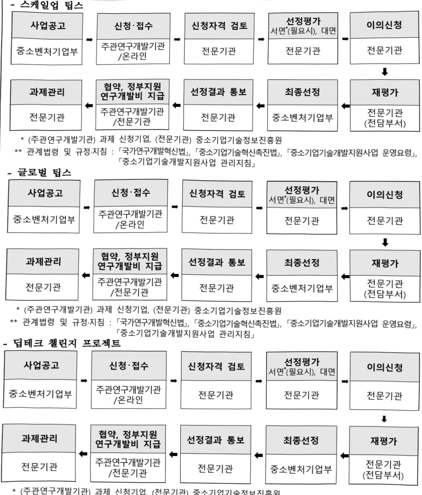
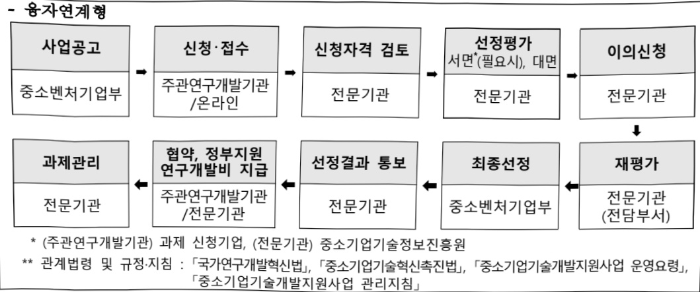

# 투·융자연계기술개발(R&D)

**해당 페이지**: PDF 4807 ~ 4813 쪽 해당

**부처**: 중소벤처기업부
**분야**: 산업·중소기업 및 에너지
**회계유형**: 일반회계
**2026 확정예산**: 457041.0 백만원
**전년대비 증감률**: 147.0%
**AI 도메인**: R&D 지원

---

### 가. 예산 총괄표

(단위: 백만원, %)

<table border=1 style='margin: auto; word-wrap: break-word;'><tr><td rowspan="2">사업명</td><td rowspan="2">2024년 결산</td><td colspan="2">2025년 예산</td><td colspan="2">2026년 예산</td><td rowspan="2">증감(B-A)</td><td rowspan="2">(B-A)/A</td></tr><tr><td style='text-align: center; word-wrap: break-word;'>본예산</td><td style='text-align: center; word-wrap: break-word;'>추경(A)</td><td style='text-align: center; word-wrap: break-word;'>요구안</td><td style='text-align: center; word-wrap: break-word;'>본예산(B)</td></tr><tr><td style='text-align: center; word-wrap: break-word;'>투·용자 연계 기술개발(R&amp;D)</td><td style='text-align: center; word-wrap: break-word;'>110,933</td><td style='text-align: center; word-wrap: break-word;'>174,810</td><td style='text-align: center; word-wrap: break-word;'>184,810</td><td style='text-align: center; word-wrap: break-word;'>457,041</td><td style='text-align: center; word-wrap: break-word;'>457,041</td><td style='text-align: center; word-wrap: break-word;'>272,231</td><td style='text-align: center; word-wrap: break-word;'>147</td></tr></table>

□ 기능별(내역사업별) 예산 내역

(단위:백만원)

<table border=1 style='margin: auto; word-wrap: break-word;'><tr><td rowspan="2"></td><td colspan="5">2024</td><td colspan="5">2025</td><td rowspan="2">2026예산</td></tr><tr><td style='text-align: center; word-wrap: break-word;'>예산액(추경)</td><td style='text-align: center; word-wrap: break-word;'>예산현액</td><td style='text-align: center; word-wrap: break-word;'>집행액</td><td style='text-align: center; word-wrap: break-word;'>이월액</td><td style='text-align: center; word-wrap: break-word;'>불용액</td><td style='text-align: center; word-wrap: break-word;'>예산액(추경)</td><td style='text-align: center; word-wrap: break-word;'>예산현액</td><td style='text-align: center; word-wrap: break-word;'>집행액</td><td style='text-align: center; word-wrap: break-word;'>이월액</td><td style='text-align: center; word-wrap: break-word;'>불용액</td></tr><tr><td style='text-align: center; word-wrap: break-word;'>○ 기능별 분류(합계)</td><td style='text-align: center; word-wrap: break-word;'>110,933</td><td style='text-align: center; word-wrap: break-word;'>110,933</td><td style='text-align: center; word-wrap: break-word;'>110,933</td><td style='text-align: center; word-wrap: break-word;'>-</td><td style='text-align: center; word-wrap: break-word;'>-</td><td style='text-align: center; word-wrap: break-word;'>174,810(184,810)</td><td style='text-align: center; word-wrap: break-word;'>184,810</td><td style='text-align: center; word-wrap: break-word;'>184,810</td><td style='text-align: center; word-wrap: break-word;'>-</td><td style='text-align: center; word-wrap: break-word;'>-</td><td style='text-align: center; word-wrap: break-word;'>457,041</td></tr><tr><td style='text-align: center; word-wrap: break-word;'>· 스케일업 팁스</td><td style='text-align: center; word-wrap: break-word;'>101,333</td><td style='text-align: center; word-wrap: break-word;'>101,333</td><td style='text-align: center; word-wrap: break-word;'>101,333</td><td style='text-align: center; word-wrap: break-word;'>-</td><td style='text-align: center; word-wrap: break-word;'>-</td><td style='text-align: center; word-wrap: break-word;'>146,750(156,750)</td><td style='text-align: center; word-wrap: break-word;'>156,750</td><td style='text-align: center; word-wrap: break-word;'>156,750</td><td style='text-align: center; word-wrap: break-word;'>-</td><td style='text-align: center; word-wrap: break-word;'>-</td><td style='text-align: center; word-wrap: break-word;'>292,425</td></tr><tr><td style='text-align: center; word-wrap: break-word;'>· 글로벌 팁스</td><td style='text-align: center; word-wrap: break-word;'>-</td><td style='text-align: center; word-wrap: break-word;'>-</td><td style='text-align: center; word-wrap: break-word;'>-</td><td style='text-align: center; word-wrap: break-word;'>-</td><td style='text-align: center; word-wrap: break-word;'>-</td><td style='text-align: center; word-wrap: break-word;'>-</td><td style='text-align: center; word-wrap: break-word;'>-</td><td style='text-align: center; word-wrap: break-word;'>-</td><td style='text-align: center; word-wrap: break-word;'>-</td><td style='text-align: center; word-wrap: break-word;'>-</td><td style='text-align: center; word-wrap: break-word;'>74,706</td></tr><tr><td style='text-align: center; word-wrap: break-word;'>· 딥테크 젤린지프로젝트(DCP)</td><td style='text-align: center; word-wrap: break-word;'>6,000</td><td style='text-align: center; word-wrap: break-word;'>6,000</td><td style='text-align: center; word-wrap: break-word;'>6,000</td><td style='text-align: center; word-wrap: break-word;'>-</td><td style='text-align: center; word-wrap: break-word;'>-</td><td style='text-align: center; word-wrap: break-word;'>16,800</td><td style='text-align: center; word-wrap: break-word;'>16,800</td><td style='text-align: center; word-wrap: break-word;'>16,800</td><td style='text-align: center; word-wrap: break-word;'>-</td><td style='text-align: center; word-wrap: break-word;'>-</td><td style='text-align: center; word-wrap: break-word;'>70,873</td></tr><tr><td style='text-align: center; word-wrap: break-word;'>· 융자연계형</td><td style='text-align: center; word-wrap: break-word;'>3,600</td><td style='text-align: center; word-wrap: break-word;'>3,600</td><td style='text-align: center; word-wrap: break-word;'>3,600</td><td style='text-align: center; word-wrap: break-word;'>-</td><td style='text-align: center; word-wrap: break-word;'>-</td><td style='text-align: center; word-wrap: break-word;'>11,260</td><td style='text-align: center; word-wrap: break-word;'>11,260</td><td style='text-align: center; word-wrap: break-word;'>11,260</td><td style='text-align: center; word-wrap: break-word;'>-</td><td style='text-align: center; word-wrap: break-word;'>-</td><td style='text-align: center; word-wrap: break-word;'>19,037</td></tr></table>

### 나.사업설명자료

1) 사업목적·내용 : 시장에서 성장가능성, 유망성 등을 인정받아 투자를 유치하거나 융자를 받은 유망 중소벤처기업에 정부가 R&D 자금을 지원하여 본격적인 스케일업 촉진

- (스케일업 팁스) 민간투자사(VC 등), 연구개발전문회사 등 민간 전문역량을 활용하여, 기술집약형 유망 중소벤처기업을 선별하고 스케일업 지원

- (글로벌 팁스) 해외 VC(글로벌 자본)의 검증 또는 글로벌 역량(매출·IP·현지법인)을 보유한 유망 기업을 발굴·선별하여 기술 스케일업 및 글로벌 진출에 필요한 R&D 지원

- (답테크 챔린지 프로젝트) 역량, 의지를 보유한 중소벤처기업이 혁신적 R&D에 과감히 도전할 수 있도록 중소벤처기업 주도의 임무(미션) 중심 R&D 프로젝트 전략 지원

- (융자연계형) 유망 중소벤처기업의 고성장 혁신 스케일업 지원을 위한 융자(보증)와 출연(연구개발)을 연계한 전주기 R&D지원

---

## 2 ) 사업개요

## 사업근거 및 추진경위

① 법령상 근거 및 조항 적시

- 「중소기업기술혁신 족진법」 제9조(중소기업의 기술혁신촉진지원사업) ①중소벤처 기업부장관은 중소기업의 기술혁신을 촉진하기 위하여 다음 각 호의 지원사업(이하 “기술혁신촉진지원사업”이라 한다)을 추진하여야 한다.

1. 기술혁신에 필요한 자금지원

2. 기술혁신과제의 사업타당성조사

3. 수요와 연계된 기술혁신의 지원

4. 기술혁신성과의 사업화

5. 기술혁신을 위한 경영 및 기술의 지도

6. 기술혁신형 중소기업 육성

7. 산업·안전 등에 관한 해외규격획득 및 품질향상지원

8. 중소기업 정보화 지원사업

9.산·학·연 공동기술개발사업 등 산학협력 지원사업

10. 그밖에 기술혁신을 촉진하기 위하여 필요한 사항

② 중소벤처기업부장관은 기술혁신촉진지원사업을 추진함에 있어서 필요하다고 인정하는 경우에는 미리 관계중앙행정기관의 장과 협의하여야 한다.

- 「중소기업기술혁신 촉진법」 제10조(기술혁신중소기업자에 대한 출연) ①중소벤처기업부장관은 중소기업의 기술혁신을 촉진하기 위하여 필요하다고 인정하는 경우 기술혁신 능력을 보유한 중소기업자가 단독 또는 공동으로 수행하는 기술혁신사업에 출연할 수 있다.

② 추진경위

- '20년 : 기술혁신개발사업 등 주요 사업 일몰관리혁신 지정에 따라, 기존 내역사업의 구조조정과 '시장확대형(내역) 및 민간투자연계(내내역)' 신설

- '21년 : 투자형 R&D 확대 방안('21.8, 중기부)에 따라, 운영사 구조(TIPS 방식)를 적용한 전용 트랙이 신설되어 R&D지원 방식은 다변화

- '22년 : 투자형R&D 정책사업을 '스케일업 팁스(TIPS 방식)로 본격 브랜드화하고, VC추천(스케일업 팁스)·기업신청(민간투자연계) 방식으로 R&D지원 확대

- '23년 : 중소벤처기업이 혁신적 R&D에 도전할 수 있도록 중소벤처기업 중심 고위험·고성과 R&D 프로젝트(DCP) 및 융자연계형 추진

- '24년 : 딥테크 챔린지 프로젝트(DCP) '혁신도전형 R&D 사업군' 지정 및 스케일업 팁스, 융자 연계형 지원확대 등 전략성 강화

* DCP스케일업 팁스 개편방향에 따른, 글로벌 트랙 신설하여 글로벌 진출 촉진('25년~)

- '25년 : 국가연구개발 투자방향에 근거하여 기 중소기업기술혁신사업 內 민간 자금 중심, 정부 보충 형태의 R&D 프로그램을 통합, 정부 R&D 투입의 전략성 및 효율성 강화를 위해 스핀오프·개편

---

## 주요내용

① 사업규모

- 총사업비(해당되는 경우에만 기재) : 해당없음

- 사업기간 : '22 ~ 계속

- 최근 5년 간 투입된 사업비(예산액기준, 추경편성한 연도에는 추경포함)

<table border=1 style='margin: auto; word-wrap: break-word;'><tr><td style='text-align: center; word-wrap: break-word;'>$ \underline{\text{所}} $</td><td style='text-align: center; word-wrap: break-word;'>2022</td><td style='text-align: center; word-wrap: break-word;'>2023</td><td style='text-align: center; word-wrap: break-word;'>2024</td><td style='text-align: center; word-wrap: break-word;'>2025</td><td style='text-align: center; word-wrap: break-word;'>2026</td></tr><tr><td style='text-align: center; word-wrap: break-word;'>$ \underline{\text{人}} $</td><td style='text-align: center; word-wrap: break-word;'>31,999</td><td style='text-align: center; word-wrap: break-word;'>61,194</td><td style='text-align: center; word-wrap: break-word;'>110,933</td><td style='text-align: center; word-wrap: break-word;'>184,810</td><td style='text-align: center; word-wrap: break-word;'>457,041</td></tr></table>

- 기타: 해당없음

② 사업추진체계

- 사업시행방법 : 출연

- 사업시행주체 : 중소벤척기업부(전문기관 : 중소기업기술정보진흥원)

- 사업 수혜자 : (주관기관) 중소기업, (참여기관) 필요시 중소기업, 대학, 연구기관 등

- 보조, 융자, 출연, 출자 등의 경우 보조 · 융자 등 지원 비율 및 법적근거

<table border=1 style='margin: auto; word-wrap: break-word;'><tr><td style='text-align: center; word-wrap: break-word;'>내역사업명</td><td style='text-align: center; word-wrap: break-word;'>구분</td><td style='text-align: center; word-wrap: break-word;'>피보조·피출연 등 기관명</td><td style='text-align: center; word-wrap: break-word;'>지원 금액 (2026예산)</td><td style='text-align: center; word-wrap: break-word;'>지원 비율(%)</td><td style='text-align: center; word-wrap: break-word;'>보조율 법적근거 (해당 조항)</td></tr><tr><td style='text-align: center; word-wrap: break-word;'>스케일업 팁스</td><td style='text-align: center; word-wrap: break-word;'>출연</td><td style='text-align: center; word-wrap: break-word;'>중소기업기술정보진흥원</td><td style='text-align: center; word-wrap: break-word;'>292,425</td><td rowspan="4">75% 이내</td><td rowspan="4">「국가연구개발혁신법」제13조 및 「중소기업기술개발 지원사업 운영요령」제18조 (사업비의 조성) 제②항</td></tr><tr><td style='text-align: center; word-wrap: break-word;'>글로벌 팁스</td><td style='text-align: center; word-wrap: break-word;'>출연</td><td style='text-align: center; word-wrap: break-word;'>중소기업기술정보진흥원</td><td style='text-align: center; word-wrap: break-word;'>74,706</td></tr><tr><td style='text-align: center; word-wrap: break-word;'>답테크 챌란지 프로젝트(DCP)</td><td style='text-align: center; word-wrap: break-word;'>출연</td><td style='text-align: center; word-wrap: break-word;'>중소기업기술정보진흥원</td><td style='text-align: center; word-wrap: break-word;'>70,873</td></tr><tr><td style='text-align: center; word-wrap: break-word;'>용자연계형</td><td style='text-align: center; word-wrap: break-word;'>출연</td><td style='text-align: center; word-wrap: break-word;'>중소기업기술정보진흥원</td><td style='text-align: center; word-wrap: break-word;'>19,037</td></tr></table>

## 3 ) 2026년도 예산 산출 근거

☐ 투·융자연계기술개발사업(R&D): (2025 추경) 184,810백만원 → (2026 예산) 457,041백만원, +272,231백만원 (2025 본예산 174,810백만원 → 제1회 추경 184,810백만원 → 제2회 추경 184,810백만원)

① 스케일업 팁스 : (2025 추경) 156,750백만원 → (2024 예산) 292,425백만원, +135,675백만원

- (편성) 유망기업이 시장에서 기술우위를 선점하고 Scale-Up할 수 있도록 민간 자본력과 선별을 활용해 R&D지원 강화를 위한 292,425백만원 반영

- (산출) 292,425백만원

② 글로벌 팁스 : (2025 추경) 0백만원 → (2026 예산) 74,706백만원, +74,706백만원 순증

- (편성) 글로벌 진출 역량을 지닌 선도기업의 글로벌 진출 및 민간투자 촉진 등을 통해 투자연계 R&D지원 강화를 위한 약 74,706백만원 반영

- (산출) 74,706백만원

③ 딥테크 챌린지 프로젝트(DCP) : (2025 추경) 16,800백만원 → (2026 예산) 70,873백만원, +54,073백만원

---

<table border=1 style='margin: auto; word-wrap: break-word;'><tr><td style='text-align: center; word-wrap: break-word;'>(2025 본예산 16,800백만원 → 제1회 추경 16,800백만원 → 제2회 추경 16,800백만원) - (편성) 유망 중소벤처기업이 파급효과가 큰 혁신적 R&amp;D에 과감히 도전할 수 있도록 대규모 자금 지원을 위한 예산 70,873백만원 반영 - (산출) 70,873백만원</td></tr><tr><td style='text-align: center; word-wrap: break-word;'>④ 융자연계형 : (2025 추경) 11,260백만원 → (2026 예산) 19,037백만원, +7,777백만원 (2025 본예산 19,037백만원 → 제1회 추경 19,037백만원 → 제2회 추경 19,037백만원) - (편성) 융자와 출연을 연계한 R&amp;D전주기 지원으로 고성장 혁신 스케일업 및 민간주도 혁신 생태계 활성화를 위한 의무지출(계속·종료사업비) 19,037백만원 반영 - (산출) 19,037백만원</td></tr></table>

## 4 ) 사업효과

☐ 사업영향, 산출물 성과지표 등

①2022~2026년도 성과계획서 상 성과지표 및 최근 5년간 성과 달성도

<table border=1 style='margin: auto; word-wrap: break-word;'><tr><td style='text-align: center; word-wrap: break-word;'>성과지표</td><td style='text-align: center; word-wrap: break-word;'>구분</td><td style='text-align: center; word-wrap: break-word;'>2022</td><td style='text-align: center; word-wrap: break-word;'>2023</td><td style='text-align: center; word-wrap: break-word;'>2024</td><td style='text-align: center; word-wrap: break-word;'>2025</td><td style='text-align: center; word-wrap: break-word;'>2026</td><td style='text-align: center; word-wrap: break-word;'>2026 목표치산출근거</td><td style='text-align: center; word-wrap: break-word;'>측정산식(또는 측정방법)</td><td style='text-align: center; word-wrap: break-word;'>자료수집방법(또는 자료출처)</td></tr><tr><td rowspan="3">R&amp;D지원효과지수(단위: 점)</td><td style='text-align: center; word-wrap: break-word;'>목표</td><td style='text-align: center; word-wrap: break-word;'>-</td><td style='text-align: center; word-wrap: break-word;'>신규</td><td style='text-align: center; word-wrap: break-word;'>0.368</td><td style='text-align: center; word-wrap: break-word;'>-</td><td style='text-align: center; word-wrap: break-word;'>-</td><td rowspan="3">-</td><td rowspan="3">등록특허 SMART 평가점수,정부출연금 1억당 누적매출액 각각에 기중치를 부여 후 합산</td><td rowspan="3">중소기업 R&amp;D 성과조사분석 보고서</td></tr><tr><td style='text-align: center; word-wrap: break-word;'>실적</td><td style='text-align: center; word-wrap: break-word;'>-</td><td style='text-align: center; word-wrap: break-word;'>-</td><td style='text-align: center; word-wrap: break-word;'>0.370</td><td style='text-align: center; word-wrap: break-word;'>-</td><td style='text-align: center; word-wrap: break-word;'>-</td></tr><tr><td style='text-align: center; word-wrap: break-word;'>달성도</td><td style='text-align: center; word-wrap: break-word;'>-</td><td style='text-align: center; word-wrap: break-word;'>-</td><td style='text-align: center; word-wrap: break-word;'>100.5</td><td style='text-align: center; word-wrap: break-word;'>-</td><td style='text-align: center; word-wrap: break-word;'>-</td></tr><tr><td rowspan="3">정부출연금 10억원당 누적과제매출액(단위: 억원)</td><td style='text-align: center; word-wrap: break-word;'>목표</td><td style='text-align: center; word-wrap: break-word;'>-</td><td style='text-align: center; word-wrap: break-word;'>-</td><td style='text-align: center; word-wrap: break-word;'>신규</td><td style='text-align: center; word-wrap: break-word;'>13.65</td><td style='text-align: center; word-wrap: break-word;'>15.00</td><td rowspan="3">전년도(24년 실적감(14.25)에 연평균 성장률(5.3%)을 다해 목표치(15.00) 설정</td><td rowspan="3">도사업화 매출액 × 기여율(35.4%) / ∑ 지원과제 정부지원금</td><td rowspan="3">중소기업 R&amp;D 성과조사분석 보고서</td></tr><tr><td style='text-align: center; word-wrap: break-word;'>실적</td><td style='text-align: center; word-wrap: break-word;'>-</td><td style='text-align: center; word-wrap: break-word;'>-</td><td style='text-align: center; word-wrap: break-word;'>-</td><td style='text-align: center; word-wrap: break-word;'>-</td><td style='text-align: center; word-wrap: break-word;'>-</td></tr><tr><td style='text-align: center; word-wrap: break-word;'>달성도</td><td style='text-align: center; word-wrap: break-word;'>-</td><td style='text-align: center; word-wrap: break-word;'>-</td><td style='text-align: center; word-wrap: break-word;'>-</td><td style='text-align: center; word-wrap: break-word;'>-</td><td style='text-align: center; word-wrap: break-word;'>-</td></tr></table>

② 성과지표 이외의 연도별 사업추진 경과 및 실적

<table border=1 style='margin: auto; word-wrap: break-word;'><tr><td style='text-align: center; word-wrap: break-word;'>2022</td><td style='text-align: center; word-wrap: break-word;'>스케일업 팁스 신규 79개(일반형 41개, 기업신청 35개) 과제 지원</td></tr><tr><td style='text-align: center; word-wrap: break-word;'>2023</td><td style='text-align: center; word-wrap: break-word;'>스케일업 팁스 신규 217개(일반형 150개, 기업신청 67개) 과제 지원</td></tr><tr><td style='text-align: center; word-wrap: break-word;'>2024</td><td style='text-align: center; word-wrap: break-word;'>스케일업 팁스 신규 180개(일반형 180개) 과제, 딥테크 젤린지 프로젝트 신규 8개 과제, 융자연계형 신규 30개 과제 지원</td></tr><tr><td style='text-align: center; word-wrap: break-word;'>2025</td><td style='text-align: center; word-wrap: break-word;'>스케일업 팁스 신규 176개(일반형 152개, 글로벌 24개) 과제, 딥테크 젤린지 프로젝트 신규 20개 과제, 융자연계형 신규 60개 과제 총 256개 과제 지원</td></tr></table>

③향후(2026년도 이후)기대효과:

- (우수기업선별) 자본력 및 기업선별안목 등 전문역량을 보유한 민간이 주도하여 성장

가능성 높은 유망 기술기업 등을 발굴, 육성

- (민간자본유인) 정부투입 중심의 타 R&D와 달리, 출연 R&D가 민간 투·융자를 유인·촉진하는 구조로 재정투입의 승수효과 및 선순환 시현

5) 타당성조사 및 예비타당성조사 시행여부 및 결과 요지 : 해당없음

---

## 6 ) 총사업비 대상사업 정보 : 해당없음

## 7 ) 사업 집행절차

* (주관연구개발기관) 과제 신청기업, (전문기관) 중소기업기술정보진흥원

** 관계법령 및 규정·지침 : 「국가연구개발혁신법」、「중소기업기술혁신촉진법」、「중소기업기술개발지원사업 운영요령」、「중소기업기술개발지원사업 관리지침」

---

## 8 ) 각종 평가

1) 국회(예결위, 상임위, 예정처, 국정감사 포함) 지적 : 해당없음

2) 대외공개 평가 : 해당없음

3) 자체평가 : 해당없음

1) 결산표

### 다. 최근 4년간 결산내역

☐ 부처 결산내역

(단위: 백만원, %)

<table border=1 style='margin: auto; word-wrap: break-word;'><tr><td rowspan="2">연도</td><td colspan="3">예산액</td><td rowspan="2">예산현액(A)</td><td rowspan="2">집행액(B)</td><td rowspan="2">집행률(B/A)</td><td rowspan="2">다음연도이월액</td><td rowspan="2">불용액</td></tr><tr><td style='text-align: center; word-wrap: break-word;'>본예산</td><td style='text-align: center; word-wrap: break-word;'>추경중감액</td><td style='text-align: center; word-wrap: break-word;'>추경</td></tr><tr><td style='text-align: center; word-wrap: break-word;'>2022</td><td style='text-align: center; word-wrap: break-word;'>33,235</td><td style='text-align: center; word-wrap: break-word;'>△1,236</td><td style='text-align: center; word-wrap: break-word;'>31,999</td><td style='text-align: center; word-wrap: break-word;'>31,999</td><td style='text-align: center; word-wrap: break-word;'>31,999</td><td style='text-align: center; word-wrap: break-word;'>100.0</td><td style='text-align: center; word-wrap: break-word;'>-</td><td style='text-align: center; word-wrap: break-word;'>-</td></tr><tr><td style='text-align: center; word-wrap: break-word;'>2023</td><td style='text-align: center; word-wrap: break-word;'>61,194</td><td style='text-align: center; word-wrap: break-word;'>-</td><td style='text-align: center; word-wrap: break-word;'>61,194</td><td style='text-align: center; word-wrap: break-word;'>61,194</td><td style='text-align: center; word-wrap: break-word;'>61,194</td><td style='text-align: center; word-wrap: break-word;'>100.0</td><td style='text-align: center; word-wrap: break-word;'>-</td><td style='text-align: center; word-wrap: break-word;'>-</td></tr><tr><td style='text-align: center; word-wrap: break-word;'>2024</td><td style='text-align: center; word-wrap: break-word;'>110,933</td><td style='text-align: center; word-wrap: break-word;'>-</td><td style='text-align: center; word-wrap: break-word;'>110,933</td><td style='text-align: center; word-wrap: break-word;'>110,933</td><td style='text-align: center; word-wrap: break-word;'>110,933</td><td style='text-align: center; word-wrap: break-word;'>100.0</td><td style='text-align: center; word-wrap: break-word;'>-</td><td style='text-align: center; word-wrap: break-word;'>-</td></tr><tr><td style='text-align: center; word-wrap: break-word;'>2025</td><td style='text-align: center; word-wrap: break-word;'>174,810</td><td style='text-align: center; word-wrap: break-word;'>+10,000</td><td style='text-align: center; word-wrap: break-word;'>184,810</td><td style='text-align: center; word-wrap: break-word;'>184,810</td><td style='text-align: center; word-wrap: break-word;'>184,810</td><td style='text-align: center; word-wrap: break-word;'>100.0</td><td style='text-align: center; word-wrap: break-word;'>-</td><td style='text-align: center; word-wrap: break-word;'>-</td></tr></table>

2) 주요 결산사항 : 해당없음

---

<table border=1 style='margin: auto; word-wrap: break-word;'><tr><td style='text-align: center; word-wrap: break-word;'>사 업 명</td></tr><tr><td style='text-align: center; word-wrap: break-word;'>(19) 표준공정 기반 공정최적화 기술개발(R&amp;D) (2134-487)</td></tr></table>

사업 코드 정보

<table border=1 style='margin: auto; word-wrap: break-word;'><tr><td style='text-align: center; word-wrap: break-word;'>구분</td><td style='text-align: center; word-wrap: break-word;'>회계</td><td style='text-align: center; word-wrap: break-word;'>소관</td><td style='text-align: center; word-wrap: break-word;'>실국(기관)</td><td style='text-align: center; word-wrap: break-word;'>계정</td><td style='text-align: center; word-wrap: break-word;'>분야</td><td style='text-align: center; word-wrap: break-word;'>부문</td></tr><tr><td style='text-align: center; word-wrap: break-word;'>코드</td><td rowspan="2">일반회계</td><td rowspan="2">중소벤처기업부</td><td rowspan="2">중소기업정책실지역기업정책관</td><td rowspan="2">-</td><td style='text-align: center; word-wrap: break-word;'>110</td><td style='text-align: center; word-wrap: break-word;'>119</td></tr><tr><td style='text-align: center; word-wrap: break-word;'>명칭</td><td style='text-align: center; word-wrap: break-word;'>산업·중소기업 및 에너지</td><td style='text-align: center; word-wrap: break-word;'>중소기업 및 소상공인육성</td></tr></table>

<table border=1 style='margin: auto; word-wrap: break-word;'><tr><td style='text-align: center; word-wrap: break-word;'>구분</td><td style='text-align: center; word-wrap: break-word;'>프로그램</td><td style='text-align: center; word-wrap: break-word;'>단위사업</td><td style='text-align: center; word-wrap: break-word;'>세부사업</td></tr><tr><td style='text-align: center; word-wrap: break-word;'>코드</td><td style='text-align: center; word-wrap: break-word;'>2100</td><td style='text-align: center; word-wrap: break-word;'>2134</td><td style='text-align: center; word-wrap: break-word;'>487</td></tr><tr><td style='text-align: center; word-wrap: break-word;'>명칭</td><td style='text-align: center; word-wrap: break-word;'>중소기업기술개발지원</td><td style='text-align: center; word-wrap: break-word;'>기술개발지원(R&amp;D)</td><td style='text-align: center; word-wrap: break-word;'>표준공정 기반 공정최적화 기술개발(R&amp;D)</td></tr></table>

□ 사업 성격 (공통요구자료 Ⅱ-1 작성유의사항 4. 참조, 해당하는 사항에 “○” 표시)

<table border=1 style='margin: auto; word-wrap: break-word;'><tr><td rowspan="2">신규</td><td rowspan="2">계속</td><td rowspan="2">완료</td><td style='text-align: center; word-wrap: break-word;'>예비타당성</td><td style='text-align: center; word-wrap: break-word;'>총사업비</td><td style='text-align: center; word-wrap: break-word;'>총액계상</td><td style='text-align: center; word-wrap: break-word;'>사업소관 변경정보</td></tr><tr><td style='text-align: center; word-wrap: break-word;'>실시여부</td><td style='text-align: center; word-wrap: break-word;'>관리대상</td><td style='text-align: center; word-wrap: break-word;'>예산사업</td><td style='text-align: center; word-wrap: break-word;'>2025예산 시 소관</td></tr><tr><td style='text-align: center; word-wrap: break-word;'>○</td><td style='text-align: center; word-wrap: break-word;'></td><td style='text-align: center; word-wrap: break-word;'></td><td style='text-align: center; word-wrap: break-word;'></td><td style='text-align: center; word-wrap: break-word;'></td><td style='text-align: center; word-wrap: break-word;'></td><td style='text-align: center; word-wrap: break-word;'></td></tr></table>

사업 지원 형태 및 지원을 (최소한 한 개는 반드시 선택하시오. 해당사항에 0 표시)

<table border=1 style='margin: auto; word-wrap: break-word;'><tr><td style='text-align: center; word-wrap: break-word;'>직접</td><td style='text-align: center; word-wrap: break-word;'>출자</td><td style='text-align: center; word-wrap: break-word;'>출연</td><td style='text-align: center; word-wrap: break-word;'>보조</td><td style='text-align: center; word-wrap: break-word;'>융자</td><td style='text-align: center; word-wrap: break-word;'>국고보조율(%)</td><td style='text-align: center; word-wrap: break-word;'>융자율(%)</td></tr><tr><td style='text-align: center; word-wrap: break-word;'></td><td style='text-align: center; word-wrap: break-word;'></td><td style='text-align: center; word-wrap: break-word;'>○</td><td style='text-align: center; word-wrap: break-word;'></td><td style='text-align: center; word-wrap: break-word;'></td><td style='text-align: center; word-wrap: break-word;'></td><td style='text-align: center; word-wrap: break-word;'></td></tr></table>

□ 사업 소관부처 및 시행주체

<table border=1 style='margin: auto; word-wrap: break-word;'><tr><td style='text-align: center; word-wrap: break-word;'>사업명</td><td colspan="2">구분</td></tr><tr><td rowspan="2">표준공정기반공정최적화기술개발(R&amp;D)</td><td style='text-align: center; word-wrap: break-word;'>소관부처</td><td style='text-align: center; word-wrap: break-word;'>중소기업정책실지역기업정책관제조혁신과</td></tr><tr><td style='text-align: center; word-wrap: break-word;'>사업시행주체</td><td style='text-align: center; word-wrap: break-word;'>중소기업기술정보진흥원</td></tr></table>

---

### 원본 PDF 크롭 이미지

