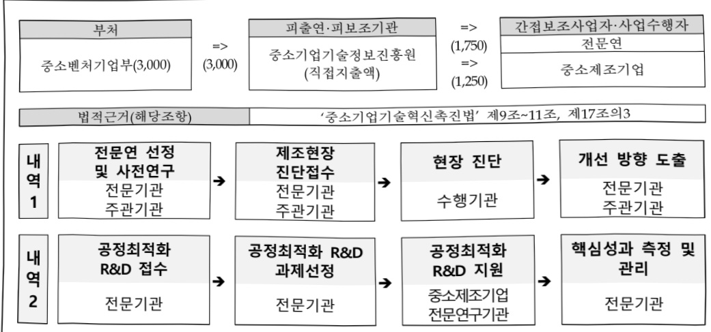

# 표준공정 기반 공정최적화 기술개발(R&D)

**해당 페이지**: PDF 4814 ~ 4819 쪽 해당

**부처**: 중소벤처기업부
**분야**: 산업·중소기업 및 에너지
**회계유형**: 일반회계
**2026 확정예산**: 3000.0 백만원
**전년대비 증감률**: None%
**AI 도메인**: 디지털전환(AX)

---

### 가.예산 총괄표

(단위: 백만원, %)

<table border=1 style='margin: auto; word-wrap: break-word;'><tr><td rowspan="2">사업명</td><td rowspan="2">2024년 결산</td><td colspan="2">2025년 예산</td><td colspan="2">2026년 예산</td><td rowspan="2">중감(B-A)</td><td rowspan="2">(B-A)/A</td></tr><tr><td style='text-align: center; word-wrap: break-word;'>본예산</td><td style='text-align: center; word-wrap: break-word;'>추경(A)</td><td style='text-align: center; word-wrap: break-word;'>요구안</td><td style='text-align: center; word-wrap: break-word;'>본예산(B)</td></tr><tr><td style='text-align: center; word-wrap: break-word;'>표준공정 기반 공정최적화 기술개발 (R&amp;D)</td><td style='text-align: center; word-wrap: break-word;'>-</td><td style='text-align: center; word-wrap: break-word;'>-</td><td style='text-align: center; word-wrap: break-word;'>-</td><td style='text-align: center; word-wrap: break-word;'>3,000</td><td style='text-align: center; word-wrap: break-word;'>3,000</td><td style='text-align: center; word-wrap: break-word;'>3,000</td><td style='text-align: center; word-wrap: break-word;'>순증</td></tr></table>

□ 기능별(내역사업별) 예산 내역

(단위:백만원)

<table border=1 style='margin: auto; word-wrap: break-word;'><tr><td rowspan="3"></td><td colspan="5">2024</td><td colspan="7">2025</td><td rowspan="3">2026 예산</td></tr><tr><td rowspan="2">예산액(추경)</td><td rowspan="2">예산 현액</td><td rowspan="2">집행액[실집행액]</td><td rowspan="2">이월액</td><td rowspan="2">불용액</td><td rowspan="2">본예산</td><td rowspan="2">예산 현액</td><td rowspan="2">집행액[실집행액]</td><td colspan="2">전년도 이월액 제외</td><td rowspan="2">이월 예산액</td><td rowspan="2">불용 예산액</td></tr><tr><td style='text-align: center; word-wrap: break-word;'>예산 현액</td><td style='text-align: center; word-wrap: break-word;'>집행액[실집행액]</td></tr><tr><td style='text-align: center; word-wrap: break-word;'>○ 기능별 분류(합계)</td><td style='text-align: center; word-wrap: break-word;'>-</td><td style='text-align: center; word-wrap: break-word;'>-</td><td style='text-align: center; word-wrap: break-word;'>-</td><td style='text-align: center; word-wrap: break-word;'>-</td><td style='text-align: center; word-wrap: break-word;'>-</td><td style='text-align: center; word-wrap: break-word;'>-</td><td style='text-align: center; word-wrap: break-word;'>-</td><td style='text-align: center; word-wrap: break-word;'>-</td><td style='text-align: center; word-wrap: break-word;'>-</td><td style='text-align: center; word-wrap: break-word;'>-</td><td style='text-align: center; word-wrap: break-word;'>-</td><td style='text-align: center; word-wrap: break-word;'>-</td><td style='text-align: center; word-wrap: break-word;'>3,000</td></tr><tr><td style='text-align: center; word-wrap: break-word;'>• 사전연구 및 제조 현장진단</td><td style='text-align: center; word-wrap: break-word;'>-</td><td style='text-align: center; word-wrap: break-word;'>-</td><td style='text-align: center; word-wrap: break-word;'>-</td><td style='text-align: center; word-wrap: break-word;'>-</td><td style='text-align: center; word-wrap: break-word;'>-</td><td style='text-align: center; word-wrap: break-word;'>-</td><td style='text-align: center; word-wrap: break-word;'>-</td><td style='text-align: center; word-wrap: break-word;'>-</td><td style='text-align: center; word-wrap: break-word;'>-</td><td style='text-align: center; word-wrap: break-word;'>-</td><td style='text-align: center; word-wrap: break-word;'>-</td><td style='text-align: center; word-wrap: break-word;'>-</td><td style='text-align: center; word-wrap: break-word;'>1,750</td></tr><tr><td style='text-align: center; word-wrap: break-word;'>• 공정최적화 R&amp;D</td><td style='text-align: center; word-wrap: break-word;'>-</td><td style='text-align: center; word-wrap: break-word;'>-</td><td style='text-align: center; word-wrap: break-word;'>-</td><td style='text-align: center; word-wrap: break-word;'>-</td><td style='text-align: center; word-wrap: break-word;'>-</td><td style='text-align: center; word-wrap: break-word;'>-</td><td style='text-align: center; word-wrap: break-word;'>-</td><td style='text-align: center; word-wrap: break-word;'>-</td><td style='text-align: center; word-wrap: break-word;'>-</td><td style='text-align: center; word-wrap: break-word;'>-</td><td style='text-align: center; word-wrap: break-word;'>-</td><td style='text-align: center; word-wrap: break-word;'>-</td><td style='text-align: center; word-wrap: break-word;'>1,250</td></tr></table>

### 나. 사업설명자료

## 1 ) 사업목적·내용

○ 사업목적

- 중소제조기업의 공정 기술애로 해결을 위해 제조공정 참조모델* 기반으로 공정최적화 R&D 지원을 통한 혁신적인 KPI 제고 및 AX 기반 마련

* 공정별 핵심장비, 자동화를 등 표준화된 공정정보 제공을 위한 제조공정 참조모델 개발(~'27, 240개)

## ○ 사업내용

- (사전연구 및 제조현장진단) 전문 연구기관이 제조공정 참조모델을 활용하여 공정 분석 및 핵심공정기술 발굴, 제조현장 진단을 통한 공정최적화 방안 도출

- (공정최적화 R&D) 현장진단 기업 중 공정 KPI 개선효과가 큰 과제를 선정하고,

AX·DX 기술을 활용한 ①공정최적화 및 ②고도화 R&D지원

* ① 작업 동작, 공정 흐름 등 제조공정에서 발생하는 손실 개선을 위한 공정최적화 기술개발 지원

② 제조공정의 KPI를 제고할 수 있는 핵심장비·자동화 시스템 고도화 기술개발 지원

---

## 2 ) 사업개요

사업근거 및 추진경위

① 법령상 근거 및 조항 적시

°‘중소기업기술혁신촉진법’ 제9조~11조, 제17조의3 및 ‘스마트제조혁신법’ 제9조

※ 중소기업 기술혁신 촉진법 제9조(중소기업의 기술혁신촉진지원사업)

① 중소벤처기업부장관은 중소기업의 기술혁신을 촉진하기 위하여 다음 각호의 지원 사업(이하 "기술혁신 촉진 지원사업"이라 한다)을 추지하여야 한다.

1. 기술혁신에 필요한 자금지원

2. 기술혁신 과제의 사업타당성 조사

3. 수요와 연계된 기술혁신의 지원

4. 기술혁신성과의 사업화

5. 기술혁신을 위한 경영 및 기술의 지도

6. 기술혁신형 중소기업 육성

7. 산업 안전 등에 관한 해외규격획득 및 품질향상지원

8. 중소기업 정보화 지원사업

9. 산학·연 공동기술개발사업 등 산학협력 지원사업

10. 기술융합 촉진을 위한 지원사업

11. 그밖에 기술혁신을 촉진하기 위하여 필요한 사항

② 중소벤처기업부장관은 기술혁신 촉진 지원사업을 추진하는 데에 필요하다고 인정하는 경우에는 미리 관계중 양행정기관의 장과 협의하여야 한다.

※중소기업 기술혁신 촉진법 제10조(기술혁신 중소기업자에 대한 출연)

① 중소벤처기업부장관은 중소기업의 기술혁신을 촉진하기 위하여 필요하다고 인정하는 경우 기술혁신능력을 보유한 중소기업자가 단독으로 또는 공동으로 수행하는 기술혁신사업에 출연할 수 있다.

② 제1항에 따른 출연금의 지급·사용·관리 등에 필요한 사항은 대통령령으로 정한다.

※ 중소기업 기술혁신 촉진법 제11조(산·학·연 공동기술혁신 수행기관 등에 대한 출연)

① 중소벤처기업부장관은 중소기업의 기술혁신 등을 촉진하기 위하여 다음 각 호의 학교·기관 또는 단체가 중소기업자와 공동으로 수행하는 산학협력 지원사업과 중소기업에 대하여 실시하는 기술지도사업에 출연할 수 있다.

1. 「고등교육법」에 따른 대학·산업대학·전문대학 또는 기술대학

2. 「근로자직업능력 개발법」에 따른 기능대학

3. 「특정연구기관 육성법」의 적용을 받는 특정연구기관

4. 「과학기술분야 정부출연연구기관 등의 설립·운영 및 육성에 관한 법률」 제8조에 따른 연구기관

5. 국립 및 공립 연구기관

6. 「중소기업진흥에 관한 법률」 제68조에 따른 중소기업진흥공단

7. 그 밖에 기술혁신 등을 촉진하기 위하여 필요하다고 인정하여 중소벤처기업부장관이 지정하는 법인 또는 단체

② 제1항에 따른 출연금의 지급·사용·관리 등에 필요한 사항은 대통령령으로 정한다.

## ※중소기업 기술혁신 촉진법 제17조의3(중소기업의 생산 환경개선 및 생산성 향상을 위한 지원)

① 중소벤처기업부장관은 중소기업의 생산환경을 개선하여 중소기업으로의 인력 유입을 촉진하고 생산성 향상을 도모하기 위하여 다음 각 호의 사업을 추진할 수 있다.

1. 생산환경 개선을 위한 실태조사

2. 생산환경 개선을 위한 설비 또는 장비의 개발

3. 쾌적한 작업환경의 조성을 위한 시설투자의 지원

4. 생산성 향상을 위한 생산 공정의 진단·설계·개선 및 신공정 개발

5. 그 밖에 중소벤처기업부장관이 생산 환경을 개선하고 생산성을 향상시키기 위하여 필요하다고 인정하는 사업

② 중소벤처기업부장관은 제1항에 따른 사업을 추진하기 위하여 필요하다고 인정할 때에는 대학·연구기관·공공기관 및 중소기업 등에 사용되는 비용의 일부를 출연할 수 있다.

---

※스마트제조혁신법 제9조(기술경쟁력제고)

① 중소벤처기업부장관은 중소기업의 스마트제조혁신 기술경쟁력 제고를 위하여 다음 각 호의 사업을 추진할 수 있다

1.스마트제조혁신에 필요한 연구개발

2.기술개발의 효율화를 위한 실증기반 구축

3.개발된 기술의 이전 및 사업화

4.그 밖에 스마트제조혁신 기술경쟁력 제고에 필요한 사업으로서 대통령령으로 정하는 사업

② 중소벤처기업부장관은 제1항에 따른 사업에 참여하는 대학, 연구기관, 공공기관, 중소기업 등에 대하여 그 비용의 전부 또는 일부를 출연하거나 지원할 수 있다.

② 추진경위 - 사업 시작년도, 추진배경, 부처별 중점과제, 대통령 공약사항 등

0 공약 및 시책

<table border=1 style='margin: auto; word-wrap: break-word;'><tr><td style='text-align: center; word-wrap: break-word;'>구분</td><td style='text-align: center; word-wrap: break-word;'>세부내용</td></tr><tr><td style='text-align: center; word-wrap: break-word;'>국정과제</td><td style='text-align: center; word-wrap: break-word;'>(35) 미래 신기술로 성장하고 글로벌로 도약하는 중소기업 - 35-3 뿌리부터 첨단까지 AX 대전환으로 생산성 혁신</td></tr><tr><td rowspan="2">공약</td><td style='text-align: center; word-wrap: break-word;'>(2. 성장 - 2. 성장 기반구축) - 18. 중소기업의 디지털 전환으로 경쟁력을 강화하고 안전한 일터로 만들겠습니다.</td></tr><tr><td style='text-align: center; word-wrap: break-word;'>○ 탄소중립 팩토리, 안전한 휴먼팩토리 등 스마트공장 3.0 추진 - 기존 스마트공장을 선진형 스마트공장으로 고도화 - 마이제조데이터 중심의 중소기업 스마트 제조혁신 생태계 구축 ○ 금형·열처리·주조 등 국가핵심 제조뿌리산업 지원 강화 - 공정자동화·지능화 등 스마트화 지원, 현장인력 부족 애로 해소</td></tr><tr><td style='text-align: center; word-wrap: break-word;'>스마트제조혁신생태계고도화방안(24. 경제장관회의)</td><td style='text-align: center; word-wrap: break-word;'>(전략3) 시장친화적 스마트제조 인프라 확충 ○ (1) 민간이 주도하는 제조데이터·AI활용 기반 확충</td></tr></table>

## □ 주요내용

① 사업규모

- 총사업비(해당되는 경우에만 기재) : 해당없음

- 사업기간 : '26~'30년

-최근 5년 간 투입된 사업비(예산액기준, 추경편성한 연도에는 추경포함)

<table border=1 style='margin: auto; word-wrap: break-word;'><tr><td style='text-align: center; word-wrap: break-word;'>$ \underline{\text{所}} $</td><td style='text-align: center; word-wrap: break-word;'>2022</td><td style='text-align: center; word-wrap: break-word;'>2023</td><td style='text-align: center; word-wrap: break-word;'>2024</td><td style='text-align: center; word-wrap: break-word;'>2025</td><td style='text-align: center; word-wrap: break-word;'>2026</td></tr><tr><td style='text-align: center; word-wrap: break-word;'>$ \underline{\text{사업비}} $</td><td style='text-align: center; word-wrap: break-word;'></td><td style='text-align: center; word-wrap: break-word;'></td><td style='text-align: center; word-wrap: break-word;'></td><td style='text-align: center; word-wrap: break-word;'></td><td style='text-align: center; word-wrap: break-word;'>3,000</td></tr></table>

② 사업추진체계

- 사업시행방법 : 출연

-사업시행주체:중소기업기술정보진흥원

- 사업 수혜자 : 중소 제조기업

- 보조, 융자, 출연, 출자 등의 경우 보조·융자 등 지원 비율 및 법적근거

---

<table border=1 style='margin: auto; word-wrap: break-word;'><tr><td style='text-align: center; word-wrap: break-word;'>내역사업명</td><td style='text-align: center; word-wrap: break-word;'>구분</td><td style='text-align: center; word-wrap: break-word;'>피보조·피출연 등 기관명</td><td style='text-align: center; word-wrap: break-word;'>지원 금액 (2026예산)</td><td style='text-align: center; word-wrap: break-word;'>지원 비율(%)</td><td style='text-align: center; word-wrap: break-word;'>보조율 법적근거 (해당 조항)</td></tr><tr><td style='text-align: center; word-wrap: break-word;'>사전연구 및 제조현장진단</td><td style='text-align: center; word-wrap: break-word;'>출연</td><td style='text-align: center; word-wrap: break-word;'>중소기업 기술정보 진흥원</td><td style='text-align: center; word-wrap: break-word;'>1,750</td><td style='text-align: center; word-wrap: break-word;'>총 개발비의 100%</td><td style='text-align: center; word-wrap: break-word;'>국가연구개발혁신법 제13조제1항 및 동법 시행령 제19조제2항</td></tr><tr><td style='text-align: center; word-wrap: break-word;'>공정최적화 R&amp;D</td><td style='text-align: center; word-wrap: break-word;'>출연</td><td style='text-align: center; word-wrap: break-word;'>중소기업 기술정보 진흥원</td><td style='text-align: center; word-wrap: break-word;'>1,250</td><td style='text-align: center; word-wrap: break-word;'>총 개발비의 75% 이내</td><td style='text-align: center; word-wrap: break-word;'>국가연구개발혁신법 제13조제1항 및 동법 시행령 제19조제1항 [중소기업기술개발 지원사업 운영요령] 제18조(사업비의 조성) 제②항</td></tr></table>

## 3 ) 2026년도 예산 산출 근거

☐ 표준공정기반공정최적화기술개발(R&D): (2025) 0 → (2026) 3,000백만원 ('26년 신규)

① 사전연구 및 제조현장진단: (25) 0 → (26) 1,750백만원, 순증

- (내용) 전문연구기관의 대표 공정별 분석 및 핵심공정 기술 도출 등 사전연구, 중소제조현장의 R&D 필요성 검토, 최적화 방안 도출 등 제조현장진단을 위한 신규R&D예산 1,750백만원 요구(순증)

- (산출) (신규 다/상) 전문연구기관 4개 x 437백만원* x 6/6개월 ≌ 1,750백만원

* (1개 연구기관) ① 대표공정별 분석(대표공정 20개 x 10백만원) + ② 제조현장진단(15개 중소기업 x 7.92백만원) + ③ 공정최적화 방안 및 핵심기술 도출(15개사 x 7.92백만원)

② 공정최적화 R&D: ('25) 0 → ('26) 1,250백만원, 순증

- (내용) 제조현장 진단기업 중 공정최적화 기술개발을 통해 기존 공정 대비 KPI 개선효과가 높은 기업을 선정하여 공정최적화 및 장비고도화 R&D 지원을 위한 신규R&D 예산 1.250백만원 요구(슈증)

- (산출) (신규 다/하) 10개 중소기업 x 500백만원 x 3/12개월 = 1,250백만원

* 획기적인 공정 단축 및 최적화를 위한 기존 공정 통합, 공정 흐름 개선 및 자동화 등의 공정기술 개발·적용 R&D 내용을 감안하여 최대 2년(10억)까지 지원

## 4 ) 사업효과

☐ 사업영향, 산출물 성과지표 등

① 2022~2026년도 성과계획서 상 성과지표 및 최근 5년간 성과 달성도

<table border=1 style='margin: auto; word-wrap: break-word;'><tr><td style='text-align: center; word-wrap: break-word;'>성과지표</td><td style='text-align: center; word-wrap: break-word;'>구분</td><td style='text-align: center; word-wrap: break-word;'>2022</td><td style='text-align: center; word-wrap: break-word;'>2023</td><td style='text-align: center; word-wrap: break-word;'>2024</td><td style='text-align: center; word-wrap: break-word;'>2025</td><td style='text-align: center; word-wrap: break-word;'>2026</td><td style='text-align: center; word-wrap: break-word;'>2026 목표치산출근거</td><td style='text-align: center; word-wrap: break-word;'>측정산식(또는 측정방법)</td><td style='text-align: center; word-wrap: break-word;'>자료수집방법(또는 자료출처)</td></tr><tr><td rowspan="3">R&amp;D지원 효과지수(단위: 점)</td><td style='text-align: center; word-wrap: break-word;'>목표</td><td style='text-align: center; word-wrap: break-word;'>-</td><td style='text-align: center; word-wrap: break-word;'>신규</td><td style='text-align: center; word-wrap: break-word;'>0.368</td><td style='text-align: center; word-wrap: break-word;'>-</td><td style='text-align: center; word-wrap: break-word;'>-</td><td rowspan="3">-</td><td rowspan="3">등록특허 SMART 평가점수, 정부출연금 1억당 누적매출액 각각에 가중치를 부여 후 합산</td><td rowspan="3">중소기업 R&amp;D 성과조사분석 보고서</td></tr><tr><td style='text-align: center; word-wrap: break-word;'>실적</td><td style='text-align: center; word-wrap: break-word;'>-</td><td style='text-align: center; word-wrap: break-word;'>-</td><td style='text-align: center; word-wrap: break-word;'>0.370</td><td style='text-align: center; word-wrap: break-word;'>-</td><td style='text-align: center; word-wrap: break-word;'>-</td></tr><tr><td style='text-align: center; word-wrap: break-word;'>달성도</td><td style='text-align: center; word-wrap: break-word;'>-</td><td style='text-align: center; word-wrap: break-word;'>-</td><td style='text-align: center; word-wrap: break-word;'>100.5</td><td style='text-align: center; word-wrap: break-word;'>-</td><td style='text-align: center; word-wrap: break-word;'>-</td></tr><tr><td rowspan="3">정부출연금 10억원당 누적과제매출액(단위: 억원)</td><td style='text-align: center; word-wrap: break-word;'>목표</td><td style='text-align: center; word-wrap: break-word;'>-</td><td style='text-align: center; word-wrap: break-word;'>-</td><td style='text-align: center; word-wrap: break-word;'>신규</td><td style='text-align: center; word-wrap: break-word;'>13.65</td><td style='text-align: center; word-wrap: break-word;'>15.00</td><td rowspan="3">전년도(24년) 실적감(14.25)에 연평균 성장률(5.3%)을 더해 목표치(15.00) 설정</td><td rowspan="3">Σ사업화 매출액 × 기여율(35.4%) / Σ지원과제  정부지원금</td><td rowspan="3">중소기업 R&amp;D 성과조사분석 보고서</td></tr><tr><td style='text-align: center; word-wrap: break-word;'>실적</td><td style='text-align: center; word-wrap: break-word;'>-</td><td style='text-align: center; word-wrap: break-word;'>-</td><td style='text-align: center; word-wrap: break-word;'>-</td><td style='text-align: center; word-wrap: break-word;'>-</td><td style='text-align: center; word-wrap: break-word;'>-</td></tr><tr><td style='text-align: center; word-wrap: break-word;'>달성도</td><td style='text-align: center; word-wrap: break-word;'>-</td><td style='text-align: center; word-wrap: break-word;'>-</td><td style='text-align: center; word-wrap: break-word;'>-</td><td style='text-align: center; word-wrap: break-word;'>-</td><td style='text-align: center; word-wrap: break-word;'>-</td></tr></table>

---

② 성과지표 이외의 연도별 사업추진 경과 및 실적 : 해당없음 (26 신규사업)

③향후(2026년도 이후) 기대효과

0 제조공정 참조모델을 활용한 중소 제조현장의 기술애로 해소 및 공정최적화 기술개발 지원을 통해 중소 제조기업 전반의 KPI 향상 및 경쟁력 강화

0 표준화된 공정 정보에 기반한 중소제조기업의 제조공정 구축 및 촉진하여 제조

데이터·AI 등 핵심기술 도입을 위한 기반 확충

## 5 ) 타당성조사 및 예비타당성조사 시행여부 및 결과 요지 : 해당없음

## 6 ) 총사업비 대상사업 정보 : 해당없음

## 7 ) 사업 집행절차

8) 각종 평가 : 해당사항 없음

다. 최근 4년간 결산내역 : 해당사항 없음

---

<table border=1 style='margin: auto; word-wrap: break-word;'><tr><td style='text-align: center; word-wrap: break-word;'>사 업 명</td></tr><tr><td style='text-align: center; word-wrap: break-word;'>(10) 혁신창업사업화자금(융자) (5152-301)</td></tr></table>

사업 코드 정보

<table border=1 style='margin: auto; word-wrap: break-word;'><tr><td style='text-align: center; word-wrap: break-word;'>구분</td><td style='text-align: center; word-wrap: break-word;'>기금</td><td style='text-align: center; word-wrap: break-word;'>소관</td><td style='text-align: center; word-wrap: break-word;'>실국(기관)</td><td style='text-align: center; word-wrap: break-word;'>계정</td><td style='text-align: center; word-wrap: break-word;'>분야</td><td style='text-align: center; word-wrap: break-word;'>부문</td></tr><tr><td style='text-align: center; word-wrap: break-word;'>코드</td><td rowspan="2">중소벤처기업창업 및 진흥기금</td><td rowspan="2">중소벤처기업부</td><td rowspan="2">중소기업정책실글로벌성장정책관</td><td rowspan="2"></td><td style='text-align: center; word-wrap: break-word;'>110</td><td style='text-align: center; word-wrap: break-word;'>119</td></tr><tr><td style='text-align: center; word-wrap: break-word;'>명칭</td><td style='text-align: center; word-wrap: break-word;'>산업·중소기업 및 에너지</td><td style='text-align: center; word-wrap: break-word;'>중소기업 및 소상공인육성</td></tr></table>

<table border=1 style='margin: auto; word-wrap: break-word;'><tr><td style='text-align: center; word-wrap: break-word;'>구분</td><td style='text-align: center; word-wrap: break-word;'>프로그램</td><td style='text-align: center; word-wrap: break-word;'>단위사업</td><td style='text-align: center; word-wrap: break-word;'>세부사업</td></tr><tr><td style='text-align: center; word-wrap: break-word;'>코드</td><td style='text-align: center; word-wrap: break-word;'>5100</td><td style='text-align: center; word-wrap: break-word;'>5152</td><td style='text-align: center; word-wrap: break-word;'>301</td></tr><tr><td style='text-align: center; word-wrap: break-word;'>명칭</td><td style='text-align: center; word-wrap: break-word;'>창업환경조성</td><td style='text-align: center; word-wrap: break-word;'>창업기업지원용자(기금)</td><td style='text-align: center; word-wrap: break-word;'>혁신창업사업화자금(용자)</td></tr></table>

<table border=1 style='margin: auto; word-wrap: break-word;'><tr><td colspan="6">☐ 사업 성격 (공통요구자료 II-1 작성유의사항 4. 참조, 해당하는 사항에 “○” 표시)</td></tr><tr><td rowspan="2">신규 계속</td><td rowspan="2">완료</td><td rowspan="2">예비타당성 실시여부</td><td rowspan="2">총사업비 관리대상</td><td rowspan="2">총액계상 예산사업</td><td style='text-align: center; word-wrap: break-word;'>사업소관 변경정보</td></tr><tr><td style='text-align: center; word-wrap: break-word;'>2025예산 시 소관</td></tr><tr><td style='text-align: center; word-wrap: break-word;'></td><td style='text-align: center; word-wrap: break-word;'>☐</td><td style='text-align: center; word-wrap: break-word;'></td><td style='text-align: center; word-wrap: break-word;'></td><td style='text-align: center; word-wrap: break-word;'></td><td style='text-align: center; word-wrap: break-word;'></td></tr></table>

사업지원형태 및 지원을(최소한 한 개는 반드시 선택하시오. 해당사항에 O 표시)

<table border=1 style='margin: auto; word-wrap: break-word;'><tr><td style='text-align: center; word-wrap: break-word;'>직접</td><td style='text-align: center; word-wrap: break-word;'>출자</td><td style='text-align: center; word-wrap: break-word;'>출연</td><td style='text-align: center; word-wrap: break-word;'>보조</td><td style='text-align: center; word-wrap: break-word;'>융자</td><td style='text-align: center; word-wrap: break-word;'>국고보조율(%)</td><td style='text-align: center; word-wrap: break-word;'>융자율(%)</td></tr><tr><td style='text-align: center; word-wrap: break-word;'></td><td style='text-align: center; word-wrap: break-word;'></td><td style='text-align: center; word-wrap: break-word;'></td><td style='text-align: center; word-wrap: break-word;'></td><td style='text-align: center; word-wrap: break-word;'>○</td><td style='text-align: center; word-wrap: break-word;'></td><td style='text-align: center; word-wrap: break-word;'></td></tr></table>

□ 사업 소관부처 및 시행주체

<table border=1 style='margin: auto; word-wrap: break-word;'><tr><td style='text-align: center; word-wrap: break-word;'>사업명</td><td colspan="2">구분</td></tr><tr><td rowspan="3">혁신창업사업화자금(융자)</td><td rowspan="2">소관부처</td><td style='text-align: center; word-wrap: break-word;'>중소기업정책실 글로벌성장정책관</td></tr><tr><td style='text-align: center; word-wrap: break-word;'>기업금융과</td></tr><tr><td style='text-align: center; word-wrap: break-word;'>사업시행주체</td><td style='text-align: center; word-wrap: break-word;'>중소벤처기업진흥공단</td></tr></table>

---

### 원본 PDF 크롭 이미지

