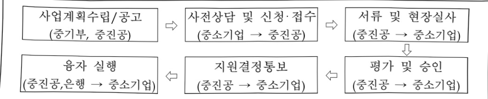

# 혁신창업사업화자금(융자)

**해당 페이지**: PDF 4820 ~ 4825 쪽 해당

**부처**: 중소벤처기업부
**분야**: 산업·중소기업 및 에너지
**회계유형**: 기금
**2026 확정예산**: 1605800.0 백만원
**전년대비 증감률**: -12.5%
**AI 도메인**: 기타

---

<table border=1 style='margin: auto; word-wrap: break-word;'><tr><td style='text-align: center; word-wrap: break-word;'>사 업 명</td></tr><tr><td style='text-align: center; word-wrap: break-word;'>(10) 혁신창업사업화자금(융자) (5152-301)</td></tr></table>

사업 코드 정보

<table border=1 style='margin: auto; word-wrap: break-word;'><tr><td style='text-align: center; word-wrap: break-word;'>구분</td><td style='text-align: center; word-wrap: break-word;'>기금</td><td style='text-align: center; word-wrap: break-word;'>소관</td><td style='text-align: center; word-wrap: break-word;'>실국(기관)</td><td style='text-align: center; word-wrap: break-word;'>계정</td><td style='text-align: center; word-wrap: break-word;'>분야</td><td style='text-align: center; word-wrap: break-word;'>부문</td></tr><tr><td style='text-align: center; word-wrap: break-word;'>코드</td><td rowspan="2">중소벤처기업창업 및 진흥기금</td><td rowspan="2">중소벤처기업부</td><td rowspan="2">중소기업정책실글로벌성장정책관</td><td rowspan="2"></td><td style='text-align: center; word-wrap: break-word;'>110</td><td style='text-align: center; word-wrap: break-word;'>119</td></tr><tr><td style='text-align: center; word-wrap: break-word;'>명칭</td><td style='text-align: center; word-wrap: break-word;'>산업·중소기업 및 에너지</td><td style='text-align: center; word-wrap: break-word;'>중소기업 및 소상공인육성</td></tr></table>

<table border=1 style='margin: auto; word-wrap: break-word;'><tr><td style='text-align: center; word-wrap: break-word;'>구분</td><td style='text-align: center; word-wrap: break-word;'>프로그램</td><td style='text-align: center; word-wrap: break-word;'>단위사업</td><td style='text-align: center; word-wrap: break-word;'>세부사업</td></tr><tr><td style='text-align: center; word-wrap: break-word;'>코드</td><td style='text-align: center; word-wrap: break-word;'>5100</td><td style='text-align: center; word-wrap: break-word;'>5152</td><td style='text-align: center; word-wrap: break-word;'>301</td></tr><tr><td style='text-align: center; word-wrap: break-word;'>명칭</td><td style='text-align: center; word-wrap: break-word;'>창업환경조성</td><td style='text-align: center; word-wrap: break-word;'>창업기업지원용자(기금)</td><td style='text-align: center; word-wrap: break-word;'>혁신창업사업화자금(용자)</td></tr></table>

<table border=1 style='margin: auto; word-wrap: break-word;'><tr><td colspan="6">☐ 사업 성격 (공통요구자료 II-1 작성유의사항 4. 참조, 해당하는 사항에 “○” 표시)</td></tr><tr><td rowspan="2">신규 계속</td><td rowspan="2">완료</td><td rowspan="2">예비타당성 실시여부</td><td rowspan="2">총사업비 관리대상</td><td rowspan="2">총액계상 예산사업</td><td style='text-align: center; word-wrap: break-word;'>사업소관 변경정보</td></tr><tr><td style='text-align: center; word-wrap: break-word;'>2025예산 시 소관</td></tr><tr><td style='text-align: center; word-wrap: break-word;'></td><td style='text-align: center; word-wrap: break-word;'>☐</td><td style='text-align: center; word-wrap: break-word;'></td><td style='text-align: center; word-wrap: break-word;'></td><td style='text-align: center; word-wrap: break-word;'></td><td style='text-align: center; word-wrap: break-word;'></td></tr></table>

사업지원형태 및 지원을(최소한 한 개는 반드시 선택하시오. 해당사항에 O 표시)

<table border=1 style='margin: auto; word-wrap: break-word;'><tr><td style='text-align: center; word-wrap: break-word;'>직접</td><td style='text-align: center; word-wrap: break-word;'>출자</td><td style='text-align: center; word-wrap: break-word;'>출연</td><td style='text-align: center; word-wrap: break-word;'>보조</td><td style='text-align: center; word-wrap: break-word;'>융자</td><td style='text-align: center; word-wrap: break-word;'>국고보조율(%)</td><td style='text-align: center; word-wrap: break-word;'>융자율(%)</td></tr><tr><td style='text-align: center; word-wrap: break-word;'></td><td style='text-align: center; word-wrap: break-word;'></td><td style='text-align: center; word-wrap: break-word;'></td><td style='text-align: center; word-wrap: break-word;'></td><td style='text-align: center; word-wrap: break-word;'>○</td><td style='text-align: center; word-wrap: break-word;'></td><td style='text-align: center; word-wrap: break-word;'></td></tr></table>

□ 사업 소관부처 및 시행주체

<table border=1 style='margin: auto; word-wrap: break-word;'><tr><td style='text-align: center; word-wrap: break-word;'>사업명</td><td colspan="2">구분</td></tr><tr><td rowspan="3">혁신창업사업화자금(융자)</td><td rowspan="2">소관부처</td><td style='text-align: center; word-wrap: break-word;'>중소기업정책실 글로벌성장정책관</td></tr><tr><td style='text-align: center; word-wrap: break-word;'>기업금융과</td></tr><tr><td style='text-align: center; word-wrap: break-word;'>사업시행주체</td><td style='text-align: center; word-wrap: break-word;'>중소벤처기업진흥공단</td></tr></table>

---

### 가.지출계획 총괄표

(단위: 백만원, %)

<table border=1 style='margin: auto; word-wrap: break-word;'><tr><td rowspan="2">사업명</td><td rowspan="2">2024년 결산</td><td colspan="2">2025년 예산</td><td colspan="2">2026년 예산</td><td rowspan="2">증감(B-A)</td><td rowspan="2">(B-A)/A</td></tr><tr><td style='text-align: center; word-wrap: break-word;'>본예산</td><td style='text-align: center; word-wrap: break-word;'>추경(A)</td><td style='text-align: center; word-wrap: break-word;'>요구안</td><td style='text-align: center; word-wrap: break-word;'>본예산(B)</td></tr><tr><td style='text-align: center; word-wrap: break-word;'>혁신창업사업화자금(용자)</td><td style='text-align: center; word-wrap: break-word;'>2,039,970</td><td style='text-align: center; word-wrap: break-word;'>1,635,800</td><td style='text-align: center; word-wrap: break-word;'>1,835,800</td><td style='text-align: center; word-wrap: break-word;'>1,635,800</td><td style='text-align: center; word-wrap: break-word;'>1,605,800</td><td style='text-align: center; word-wrap: break-word;'>△230,000</td><td style='text-align: center; word-wrap: break-word;'>△12.5</td></tr></table>

□ 기능별(내역사업별) 계획 내역

(단위:백만원)

<table border=1 style='margin: auto; word-wrap: break-word;'><tr><td rowspan="2"></td><td colspan="5">2024</td><td colspan="5">2025</td><td rowspan="2">2026 계획</td></tr><tr><td style='text-align: center; word-wrap: break-word;'>계획액(추경)</td><td style='text-align: center; word-wrap: break-word;'>계획현액</td><td style='text-align: center; word-wrap: break-word;'>집행액</td><td style='text-align: center; word-wrap: break-word;'>이월액</td><td style='text-align: center; word-wrap: break-word;'>불용액</td><td style='text-align: center; word-wrap: break-word;'>계획액(추경)</td><td style='text-align: center; word-wrap: break-word;'>계획현액</td><td style='text-align: center; word-wrap: break-word;'>집행액</td><td style='text-align: center; word-wrap: break-word;'>이월액</td><td style='text-align: center; word-wrap: break-word;'>불용액</td></tr><tr><td style='text-align: center; word-wrap: break-word;'>○ 기능별 분류(합계)</td><td style='text-align: center; word-wrap: break-word;'>2,007,800</td><td style='text-align: center; word-wrap: break-word;'>2,047,800</td><td style='text-align: center; word-wrap: break-word;'>2,039,970</td><td style='text-align: center; word-wrap: break-word;'>-</td><td style='text-align: center; word-wrap: break-word;'>7,830</td><td style='text-align: center; word-wrap: break-word;'>1,835,800</td><td style='text-align: center; word-wrap: break-word;'>1,835,800</td><td style='text-align: center; word-wrap: break-word;'>1,835,800</td><td style='text-align: center; word-wrap: break-word;'>-</td><td style='text-align: center; word-wrap: break-word;'>-</td><td style='text-align: center; word-wrap: break-word;'>1,605,800</td></tr><tr><td style='text-align: center; word-wrap: break-word;'>• 창업기반지원</td><td style='text-align: center; word-wrap: break-word;'>1,795,800</td><td style='text-align: center; word-wrap: break-word;'>1,835,800</td><td style='text-align: center; word-wrap: break-word;'>1,835,800</td><td style='text-align: center; word-wrap: break-word;'>-</td><td style='text-align: center; word-wrap: break-word;'>-</td><td style='text-align: center; word-wrap: break-word;'>1,535,800</td><td style='text-align: center; word-wrap: break-word;'>1,535,800</td><td style='text-align: center; word-wrap: break-word;'>1,535,800</td><td style='text-align: center; word-wrap: break-word;'>-</td><td style='text-align: center; word-wrap: break-word;'>-</td><td style='text-align: center; word-wrap: break-word;'>1,305,800</td></tr><tr><td style='text-align: center; word-wrap: break-word;'>• 개발기술사업화</td><td style='text-align: center; word-wrap: break-word;'>212,000</td><td style='text-align: center; word-wrap: break-word;'>212,000</td><td style='text-align: center; word-wrap: break-word;'>204,170</td><td style='text-align: center; word-wrap: break-word;'>-</td><td style='text-align: center; word-wrap: break-word;'>7,830</td><td style='text-align: center; word-wrap: break-word;'>300,000</td><td style='text-align: center; word-wrap: break-word;'>300,000</td><td style='text-align: center; word-wrap: break-word;'>300,000</td><td style='text-align: center; word-wrap: break-word;'>-</td><td style='text-align: center; word-wrap: break-word;'>-</td><td style='text-align: center; word-wrap: break-word;'>300,000</td></tr></table>

### 나. 사업설명자료

## 1 ) 사업목적·내용

- (창업기반지원) 기술력과 사업성이 우수하고 미래 성장가능성이 높은 중소벤처기업의

창업을 활성화하고 고용창출 도모

- (개발기술사업화) 중소기업이 보유한 우수 기술의 사장을 방지하고 개발기술의

제품화·사업화를 촉진하여 기술기반 중소기업을 육성

## 2 ) 사업개요

## □ 사업근거 및 추진경위

① 법령상 근거 및 조항 적시 : 중소기업진흥에 관한 법률 제6조, 제67조, 제74조 중소기업창업지원법 제35조

---

## 중소기업진흥에 관한 법률 제66조, 제67조, 제74조

제66조(기금의 운용과 관리) ⑤ 기금관리자는 제66조의 2에 따른 기금운용계획에 따라 기금을 대출 등의 방법으로 운용할 수 있다.

제67조(기금의 사용 등) ① 기금은 다음 각 호의 사업을 위하여 사용할 수 있다.

5. 중소기업·벤처기업의 창업지원을 위하여 중소벤처기업부장관이 위탁하는 사업

세74조(사업) ① 중소벤처기업진흥공단은 중소기업에 관한 다음 각 호의 사업을 실시하거나 그에 관한 사업을 지원할 수 있다.

10.중소기업·벤처기업의 창업 지원

## 중소기업창업 지원법 제35조

제35조(창업기업 융자·투자 등 금융지원) ①정부는 중소기업의 창업 및 창업기업 등의 활동에 필요한 자금의 원활한 공급을 위하여 창업기업등과 창업지원사업을 하는 자에게 필요한 자금을 출연·보조·융자하거나 그밖에 필요한 지원을 할 수 있다.

## ② 추진경위

- 1998. 4 외환위기 이후 창업 활성화 및 고용 창출을 위하여 지원 시작

- 2005. 2 업체별 연간 대출한도를 20억원으로 확대(기존 10억원)

- 2006. 1 지원대상을 업력 5년미만까지 확대(기존 3년미만)

- 2008. 1 부채비율 예외적용 기업을 업력 5년미만까지 확대(기존 3년 미만)

- 2009. 1 지원대상을 업력 7년 미만까지 확대(기존 5년 미만)

- 2010. 3 재창업자금(실패 경영인에 대한 재기지원) 신규 지원

- 2012. 1 지원대상을 업력 5년 미만으로 축소(기존 7년 미만)

청년전용창업자금(만 39세 이하 청년창업자 대상) 신규 지원

- 2014. 2 경제혁신 3개년 계획에 반영(청년전용창업자금, 재창업자금)

- 2014. 1 지원대상 업력기준을 7년 미만으로 확대

- 2015. 1 재창업자금을 재도약지원자금(융자)의 내역사업으로 이관

- 2019. 1 청년전용창업자금을 혁신창업지원자금에 통합 운영

개발기술사업화자금을 내역사업으로 통합 및 일자리창출촉진자금 신규 지원

- 2020. 1 미래기술육성자금, 고성장촉진자금 신규 지원

- 2022. 1 미래기술육성자금 및 고성장촉진자금 사업 폐지

- 2023. 1 창업기반지원과 신청 대상이 중복인 일자리창출촉진자금을 폐지

성장공유형 대출방식 추가 (혁신창업사업화자금)

- 2024. 3 투자조건부 대출방식 신규 지원

-2025.1 개발기술사업화자금 내 이차보전 사업을 정책자금지원성과향상으로 이관

---

## □주요내용

① 사업규모

- 총사업비 : 해당사항 없음

- 사업기간 : '98년 ~ 계속

- 최근 5년 간 투입된 사업비

<table border=1 style='margin: auto; word-wrap: break-word;'><tr><td style='text-align: center; word-wrap: break-word;'>$ \underline{\text{연도}} $</td><td style='text-align: center; word-wrap: break-word;'>2022</td><td style='text-align: center; word-wrap: break-word;'>2023</td><td style='text-align: center; word-wrap: break-word;'>2024</td><td style='text-align: center; word-wrap: break-word;'>2025</td><td style='text-align: center; word-wrap: break-word;'>2026</td></tr><tr><td style='text-align: center; word-wrap: break-word;'>$ \underline{\text{사업비}} $</td><td style='text-align: center; word-wrap: break-word;'>2,300,000</td><td style='text-align: center; word-wrap: break-word;'>2,330,000</td><td style='text-align: center; word-wrap: break-word;'>2,047,800</td><td style='text-align: center; word-wrap: break-word;'>1,835,800</td><td style='text-align: center; word-wrap: break-word;'>1,605,800</td></tr></table>

- 기타: 해당사항 없음

② 사업추진체계

- 사업시행방법 : 융자

- 사업시행주체 : 중소벤처기업진흥공단

- 사업 수혜자 : 중소기업

- 보조, 융자, 출연, 출자 등의 경우 보조·융자 등 지원 비율 및 법적근거

<table border=1 style='margin: auto; word-wrap: break-word;'><tr><td style='text-align: center; word-wrap: break-word;'>내역사업명</td><td style='text-align: center; word-wrap: break-word;'>구분</td><td style='text-align: center; word-wrap: break-word;'>피보조·피출연 등 기관명</td><td style='text-align: center; word-wrap: break-word;'>지원 금액 (2026계획)</td><td style='text-align: center; word-wrap: break-word;'>지원 비율(%)</td><td style='text-align: center; word-wrap: break-word;'>보조율 법적근거 (해당 조항)</td></tr><tr><td style='text-align: center; word-wrap: break-word;'>창업기반 지원</td><td style='text-align: center; word-wrap: break-word;'>융자</td><td style='text-align: center; word-wrap: break-word;'>중소기업</td><td style='text-align: center; word-wrap: break-word;'>1조 3,058억원</td><td style='text-align: center; word-wrap: break-word;'>정책자금 기준금리  $ \triangle 0.3\%p $</td><td style='text-align: center; word-wrap: break-word;'>중소기업진흥에 관한 법률 제66조</td></tr><tr><td style='text-align: center; word-wrap: break-word;'>개발기술 사업화</td><td style='text-align: center; word-wrap: break-word;'>융자</td><td style='text-align: center; word-wrap: break-word;'>중소기업</td><td style='text-align: center; word-wrap: break-word;'>3,000억원</td><td style='text-align: center; word-wrap: break-word;'>정책자금 기준금리</td><td style='text-align: center; word-wrap: break-word;'>중소기업진흥에 관한 법률 제66조</td></tr></table>

## 3 ) 2026년도 계획 산출 근거

□ 혁신창업사업화자금(융자): (2025 추경) 1,835,800백만원 → (2026 계획) 1,605,800백만원, 230,000백만원 감액

① 창업기반지원: (2025 추경) 1,535,800백만원 → (2026 계획) 1,305,800백만원, 230,000백만원 감액 (2025 당초 계획 1,335,800백만원 → 제1회 추경 1,535,800백만원)

- (내용) 혁신성장분야·AI 분야 등 혁신성장 가능성이 높은 스타트업 지원 활성화를 통한 민간 중심의 경기 회복을 뒷받침하기위해 13,058억원 지원

② 개발기술사업화: (2025 당초) 300,000백만원 → (2026 계획) 300,000백만원, 전년동

- (내용) 정부 또는 지자체 출연 R&D 사업 성공(완료) 기술이나 특허 등 기술보유 기업의 사업화 촉진을 위해 3,000억원 지원

---

## 4 ) 사업효과

□ 사업영향, 산출물 성과지표 등

① 2022~2026년도 성과계획서 상 성과지표 및 최근 5년간 성과 달성도

<table border=1 style='margin: auto; word-wrap: break-word;'><tr><td style='text-align: center; word-wrap: break-word;'>성과지표</td><td style='text-align: center; word-wrap: break-word;'>구분</td><td style='text-align: center; word-wrap: break-word;'>2022</td><td style='text-align: center; word-wrap: break-word;'>2023</td><td style='text-align: center; word-wrap: break-word;'>2024</td><td style='text-align: center; word-wrap: break-word;'>2025</td><td style='text-align: center; word-wrap: break-word;'>2026</td><td style='text-align: center; word-wrap: break-word;'>2026 목표치산출근거</td><td style='text-align: center; word-wrap: break-word;'>측정산식(또는 측정방법)</td><td style='text-align: center; word-wrap: break-word;'>자료수집방법(또는 자료출처)</td></tr><tr><td rowspan="3">창업지원기업 평균 매출액(억원)</td><td style='text-align: center; word-wrap: break-word;'>목표</td><td style='text-align: center; word-wrap: break-word;'>-</td><td style='text-align: center; word-wrap: break-word;'>-</td><td style='text-align: center; word-wrap: break-word;'>신규</td><td style='text-align: center; word-wrap: break-word;'>13.0</td><td style='text-align: center; word-wrap: break-word;'>13.6</td><td rowspan="3">최근 4년간(21~24) 창업 지원 기업 의 매출평균인 12.8억 원에 당해연도 경제성장률(1.5%(e), &#x27;25.2&#x27;를 한국은행 및 추가 가중치(5%)를 적용하여 목표로 설정</td><td rowspan="3">중기부에서 매년 조사하는 ‘창업지원기업 이력성과 조사기업의 매출액 측정</td><td rowspan="3">창업지원기업 이력성과 조사</td></tr><tr><td style='text-align: center; word-wrap: break-word;'>실적</td><td style='text-align: center; word-wrap: break-word;'>-</td><td style='text-align: center; word-wrap: break-word;'>-</td><td style='text-align: center; word-wrap: break-word;'>14.75</td><td style='text-align: center; word-wrap: break-word;'>-</td><td style='text-align: center; word-wrap: break-word;'>-</td></tr><tr><td style='text-align: center; word-wrap: break-word;'>달성도</td><td style='text-align: center; word-wrap: break-word;'>-</td><td style='text-align: center; word-wrap: break-word;'>-</td><td style='text-align: center; word-wrap: break-word;'>-</td><td style='text-align: center; word-wrap: break-word;'>-</td><td style='text-align: center; word-wrap: break-word;'>-</td></tr></table>

② 성과지표 이외의 연도별 사업추진 경과 및 실적

<table border=1 style='margin: auto; word-wrap: break-word;'><tr><td style='text-align: center; word-wrap: break-word;'>2022</td><td style='text-align: center; word-wrap: break-word;'>- 11,108개 업체 / 2,300,000백만원 지원</td></tr><tr><td style='text-align: center; word-wrap: break-word;'>2023</td><td style='text-align: center; word-wrap: break-word;'>- 11,308개 업체 / 2,330,000백만원 지원</td></tr><tr><td style='text-align: center; word-wrap: break-word;'>2024</td><td style='text-align: center; word-wrap: break-word;'>- 10,258개 업체 / 2,039,970백만원 지원</td></tr><tr><td style='text-align: center; word-wrap: break-word;'>2025</td><td style='text-align: center; word-wrap: break-word;'>- 8,731개 업체 / 1,835,800백만원 지원</td></tr></table>

③향후(2026년도 이후)기대효과

- 초격차 10대분야, AI 스타트업 지원체계 강화 등 혁신성장분야 영위 창업기업에 정책자금 지원 강화

- 창업기업 중 기술기반 업종 비중 증가 추세 및 신산업 경쟁력 확보를 위한 기업들의 R&D 투자 확대 추세를 반영하여, 개발기술의 제품화·사업화 촉진 지원

5) 타당성조사 및 예비타당성조사 시행여부 및 결과 요지: 해당없음

6) 총사업비 대상사업 여부 및 내역: 해당없음

7) 사업 집행절차

---

## 8 ) 각종 평가

<table border=1 style='margin: auto; word-wrap: break-word;'><tr><td style='text-align: center; word-wrap: break-word;'>1) 국회(예결위, 상임위, 예정처, 국정감사 포함) 지적</td></tr><tr><td style='text-align: center; word-wrap: break-word;'>○ ‘24회계연도 예정처 결산 검토 보고서(‘25.8월)</td></tr><tr><td style='text-align: center; word-wrap: break-word;'>- 초격차 스타트업 1000+ 프로젝트 사업의 융자사업과의 연계 강화 필요</td></tr><tr><td style='text-align: center; word-wrap: break-word;'>2) 대외공개평가</td></tr><tr><td style='text-align: center; word-wrap: break-word;'>- 중소기업 지원사업 성과평가 (보통, ‘25.6월)</td></tr><tr><td style='text-align: center; word-wrap: break-word;'>4) 문제점 지적에 대한 후속조치</td></tr><tr><td style='text-align: center; word-wrap: break-word;'>- 초격차 스타트업 1000+ 선정기업 pool을 활용하여 개별자금 신청 안내 등 적극적으로수요발굴</td></tr></table>

3) 자체평가: 해당없음

### 다.최근 4년간 결산내역

1) 결산표

☐ 부처 결산내역

(단위: 백만원, %)

<table border=1 style='margin: auto; word-wrap: break-word;'><tr><td rowspan="2">연도</td><td colspan="3">계획액</td><td rowspan="2">계획현액(A)</td><td rowspan="2">집행액(B)</td><td rowspan="2">집행률(B/A)</td><td rowspan="2">다음연도이월액</td><td rowspan="2">불용액</td></tr><tr><td style='text-align: center; word-wrap: break-word;'>본예산</td><td style='text-align: center; word-wrap: break-word;'>추경증감액</td><td style='text-align: center; word-wrap: break-word;'>추경</td></tr><tr><td style='text-align: center; word-wrap: break-word;'>2022</td><td style='text-align: center; word-wrap: break-word;'>2,300,000</td><td style='text-align: center; word-wrap: break-word;'>-</td><td style='text-align: center; word-wrap: break-word;'>2,300,000</td><td style='text-align: center; word-wrap: break-word;'>2,300,000</td><td style='text-align: center; word-wrap: break-word;'>2,300,000</td><td style='text-align: center; word-wrap: break-word;'>100.0</td><td style='text-align: center; word-wrap: break-word;'>-</td><td style='text-align: center; word-wrap: break-word;'>-</td></tr><tr><td style='text-align: center; word-wrap: break-word;'>2023</td><td style='text-align: center; word-wrap: break-word;'>2,230,000</td><td style='text-align: center; word-wrap: break-word;'>100,000</td><td style='text-align: center; word-wrap: break-word;'>2,330,000</td><td style='text-align: center; word-wrap: break-word;'>2,330,000</td><td style='text-align: center; word-wrap: break-word;'>2,330,000</td><td style='text-align: center; word-wrap: break-word;'>100.0</td><td style='text-align: center; word-wrap: break-word;'>-</td><td style='text-align: center; word-wrap: break-word;'>-</td></tr><tr><td style='text-align: center; word-wrap: break-word;'>2024</td><td style='text-align: center; word-wrap: break-word;'>2,007,800</td><td style='text-align: center; word-wrap: break-word;'>40,000</td><td style='text-align: center; word-wrap: break-word;'>2,047,800</td><td style='text-align: center; word-wrap: break-word;'>2,047,800</td><td style='text-align: center; word-wrap: break-word;'>2,039,970</td><td style='text-align: center; word-wrap: break-word;'>99.6</td><td style='text-align: center; word-wrap: break-word;'>-</td><td style='text-align: center; word-wrap: break-word;'>7,830</td></tr><tr><td style='text-align: center; word-wrap: break-word;'>2025</td><td style='text-align: center; word-wrap: break-word;'>1,635,800</td><td style='text-align: center; word-wrap: break-word;'>200,000</td><td style='text-align: center; word-wrap: break-word;'>1,835,800</td><td style='text-align: center; word-wrap: break-word;'>1,835,800</td><td style='text-align: center; word-wrap: break-word;'>1,835,800</td><td style='text-align: center; word-wrap: break-word;'>100.0</td><td style='text-align: center; word-wrap: break-word;'>-</td><td style='text-align: center; word-wrap: break-word;'>-</td></tr></table>

## 2 ) 주요 결산사항

2022~2025년 결산 주요사항

<table border=1 style='margin: auto; word-wrap: break-word;'><tr><td style='text-align: center; word-wrap: break-word;'>2022</td><td style='text-align: center; word-wrap: break-word;'>- 해당사항 없음</td></tr><tr><td style='text-align: center; word-wrap: break-word;'>2023</td><td style='text-align: center; word-wrap: break-word;'>- (상세내역) 창업기반지원 1,000억원 증액(자체변경 1,000억원) - (변경사유) 창업기업의 자금 조달 여건 악화를 감안한 증액 추진</td></tr><tr><td style='text-align: center; word-wrap: break-word;'>2024</td><td style='text-align: center; word-wrap: break-word;'>- (상세내역) 창업기반지원 400억원 증액(자체변경 400억) - (변경사유) 중점지원분야 대상 스타트업의 자금 애로 해소를 위한 증액 추진 - (불용사유) 개발기술 이차보전 신청 저조에 따른 불용 발생</td></tr><tr><td style='text-align: center; word-wrap: break-word;'>2025</td><td style='text-align: center; word-wrap: break-word;'>- (상세내역) 창업기반지원 2,000억원 증액(추경 2,000억) - (변경사유) AI·반도체 산업 등 초격차 10대 분야를 영위하는 창업기업 집중 육성을 위한 창업기반지원자금 증액편성</td></tr></table>

□ 2025년 계획변경 세부내역

(단위:백만원)

<table border=1 style='margin: auto; word-wrap: break-word;'><tr><td style='text-align: center; word-wrap: break-word;'>구분(날짜)</td><td style='text-align: center; word-wrap: break-word;'>내역사업</td><td style='text-align: center; word-wrap: break-word;'>목</td><td style='text-align: center; word-wrap: break-word;'>세목</td><td style='text-align: center; word-wrap: break-word;'>금액</td><td style='text-align: center; word-wrap: break-word;'>계획변경 사유</td></tr><tr><td style='text-align: center; word-wrap: break-word;'>추경(25.7.7)</td><td style='text-align: center; word-wrap: break-word;'>창업기반지원</td><td style='text-align: center; word-wrap: break-word;'>450</td><td style='text-align: center; word-wrap: break-word;'>04</td><td style='text-align: center; word-wrap: break-word;'>200,000</td><td style='text-align: center; word-wrap: break-word;'>- AI·반도체 등 초격차 스타트업 집중 지원을 위한 재원 추가 마련으로 혁신기술 보유한 창업기업 자금 조달 애로 해소</td></tr><tr><td colspan="4">합 계</td><td style='text-align: center; word-wrap: break-word;'>200,000</td><td style='text-align: center; word-wrap: break-word;'></td></tr></table>

---

### 원본 PDF 크롭 이미지

