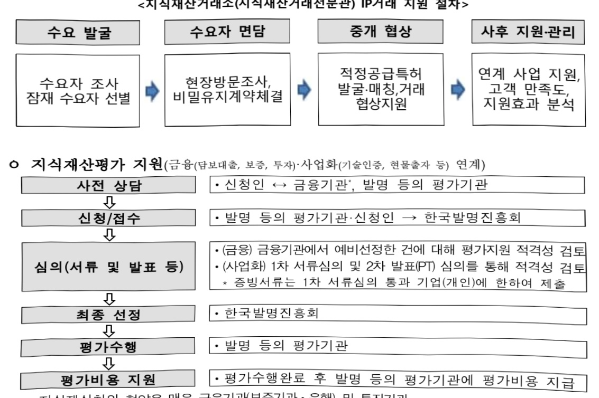
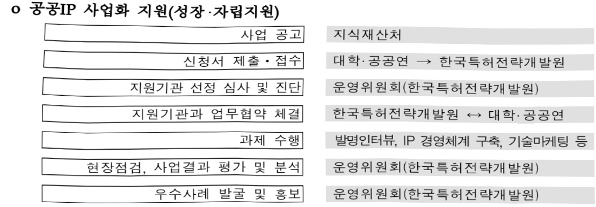
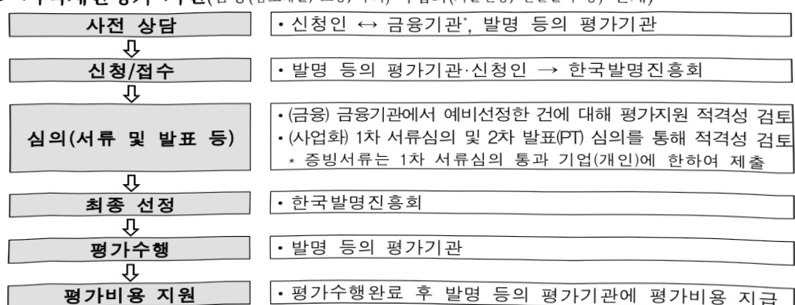
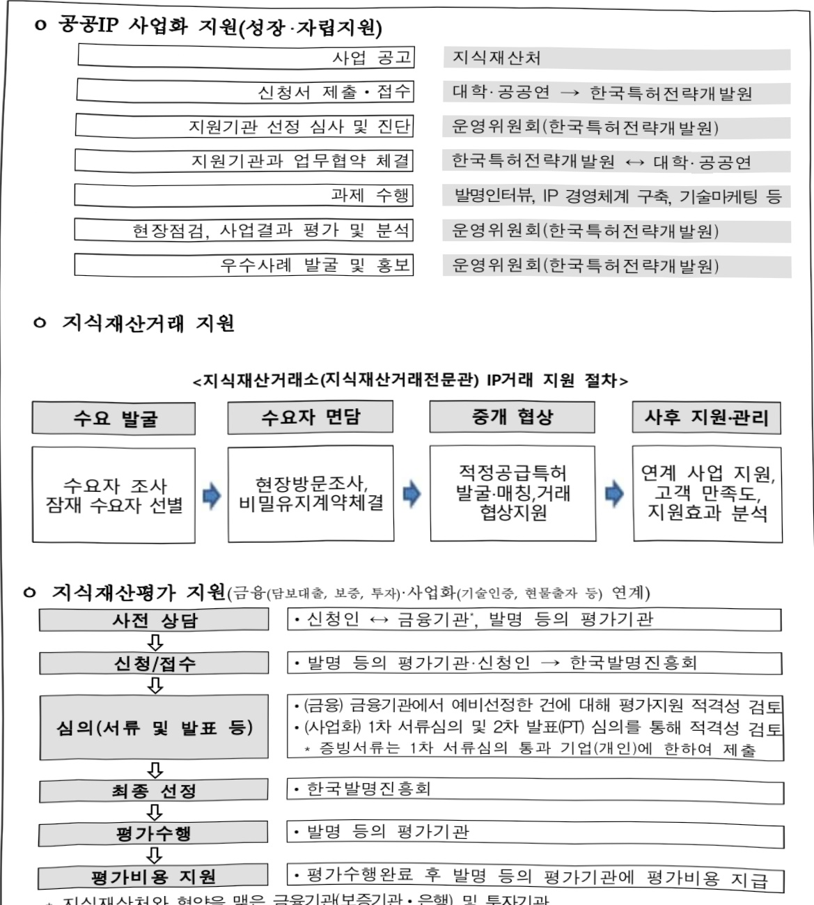
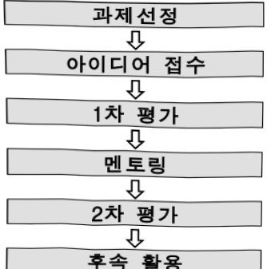
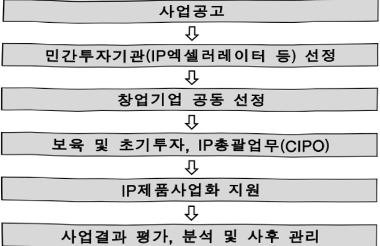

# 지식재산 활용(사업화, 거래, 평가) 지원

**해당 페이지**: PDF 4826 ~ 4852 쪽 해당

**부처**: 지식재산처
**분야**: 산업·중소기업 및 에너지
**회계유형**: 일반회계
**2026 확정예산**: 34698.0 백만원
**전년대비 증감률**: 29.2%
**AI 도메인**: 디지털전환(AX)

---

<table border=1 style='margin: auto; word-wrap: break-word;'><tr><td style='text-align: center; word-wrap: break-word;'>사 업 명</td></tr><tr><td style='text-align: center; word-wrap: break-word;'>(28) 지식재산 활용(사업화, 거래, 평가) 지원 (1332-303)</td></tr></table>

□ 사업 코드 정보

<table border=1 style='margin: auto; word-wrap: break-word;'><tr><td style='text-align: center; word-wrap: break-word;'>구분</td><td style='text-align: center; word-wrap: break-word;'>회계</td><td style='text-align: center; word-wrap: break-word;'>소관</td><td style='text-align: center; word-wrap: break-word;'>실국(기관)</td><td style='text-align: center; word-wrap: break-word;'>계정</td><td style='text-align: center; word-wrap: break-word;'>분야</td><td style='text-align: center; word-wrap: break-word;'>부문</td></tr><tr><td style='text-align: center; word-wrap: break-word;'>코드</td><td rowspan="2">일반회계</td><td rowspan="2">지식재산처</td><td rowspan="2">지식재산정책국</td><td rowspan="2">-</td><td style='text-align: center; word-wrap: break-word;'>110</td><td style='text-align: center; word-wrap: break-word;'>11A</td></tr><tr><td style='text-align: center; word-wrap: break-word;'>명칭</td><td style='text-align: center; word-wrap: break-word;'>산업·중소기업 및 에너지</td><td style='text-align: center; word-wrap: break-word;'>지식재산일반</td></tr></table>

<table border=1 style='margin: auto; word-wrap: break-word;'><tr><td style='text-align: center; word-wrap: break-word;'>구분</td><td style='text-align: center; word-wrap: break-word;'>프로그램</td><td style='text-align: center; word-wrap: break-word;'>단위사업</td><td style='text-align: center; word-wrap: break-word;'>세부사업</td></tr><tr><td style='text-align: center; word-wrap: break-word;'>코드</td><td style='text-align: center; word-wrap: break-word;'>1300</td><td style='text-align: center; word-wrap: break-word;'>1332</td><td style='text-align: center; word-wrap: break-word;'>303</td></tr><tr><td style='text-align: center; word-wrap: break-word;'>명칭</td><td style='text-align: center; word-wrap: break-word;'>지식재산금융 및 거래시장 활성화</td><td style='text-align: center; word-wrap: break-word;'>지식재산 활용촉진</td><td style='text-align: center; word-wrap: break-word;'>지식재산 활용(사업화,거래,평가) 지원</td></tr></table>

□ 사업 성격 (공통요구자료 Ⅱ-1 작성유의사항 4. 참조, 해당하는 사항에 “○” 표시)

<table border=1 style='margin: auto; word-wrap: break-word;'><tr><td style='text-align: center; word-wrap: break-word;'>신규</td><td style='text-align: center; word-wrap: break-word;'>계속</td><td style='text-align: center; word-wrap: break-word;'>완료</td><td style='text-align: center; word-wrap: break-word;'>예비타당성 실시여부</td><td style='text-align: center; word-wrap: break-word;'>총사업비 관리대상</td><td style='text-align: center; word-wrap: break-word;'>총액계상 예산사업</td><td style='text-align: center; word-wrap: break-word;'>사업소관 변경정보 2025예산 시 소관</td></tr><tr><td style='text-align: center; word-wrap: break-word;'></td><td style='text-align: center; word-wrap: break-word;'>○</td><td style='text-align: center; word-wrap: break-word;'></td><td style='text-align: center; word-wrap: break-word;'></td><td style='text-align: center; word-wrap: break-word;'></td><td style='text-align: center; word-wrap: break-word;'></td><td style='text-align: center; word-wrap: break-word;'></td></tr></table>

□ 사업 지원 형태 및 지원을 (최소한 한 개는 반드시 선택하시오. 해당사항에 O 표시)

<table border=1 style='margin: auto; word-wrap: break-word;'><tr><td style='text-align: center; word-wrap: break-word;'>직접</td><td style='text-align: center; word-wrap: break-word;'>출자</td><td style='text-align: center; word-wrap: break-word;'>출연</td><td style='text-align: center; word-wrap: break-word;'>보조</td><td style='text-align: center; word-wrap: break-word;'>융자</td><td style='text-align: center; word-wrap: break-word;'>국고보조율(%)</td><td style='text-align: center; word-wrap: break-word;'>융자율(%)</td></tr><tr><td style='text-align: center; word-wrap: break-word;'>○</td><td style='text-align: center; word-wrap: break-word;'></td><td style='text-align: center; word-wrap: break-word;'></td><td style='text-align: center; word-wrap: break-word;'>○</td><td style='text-align: center; word-wrap: break-word;'></td><td style='text-align: center; word-wrap: break-word;'>100</td><td style='text-align: center; word-wrap: break-word;'></td></tr></table>

## □ 사업 담당자

<table border=1 style='margin: auto; word-wrap: break-word;'><tr><td style='text-align: center; word-wrap: break-word;'>사업명</td><td colspan="5">구분</td></tr><tr><td rowspan="4">지식재산 사업화 지원</td><td rowspan="3">지식재산처</td><td style='text-align: center; word-wrap: break-word;'>실·국·과(팀)</td><td style='text-align: center; word-wrap: break-word;'>과 장</td><td style='text-align: center; word-wrap: break-word;'>사무관</td><td style='text-align: center; word-wrap: break-word;'>주무관</td></tr><tr><td style='text-align: center; word-wrap: break-word;'>지식재산정책국</td><td style='text-align: center; word-wrap: break-word;'>조광현</td><td style='text-align: center; word-wrap: break-word;'>전상우</td><td style='text-align: center; word-wrap: break-word;'>박진성</td></tr><tr><td style='text-align: center; word-wrap: break-word;'>지식재산창출활용과</td><td style='text-align: center; word-wrap: break-word;'>042-481-5258</td><td style='text-align: center; word-wrap: break-word;'>042-481-5406</td><td style='text-align: center; word-wrap: break-word;'>042-481-3962</td></tr><tr><td style='text-align: center; word-wrap: break-word;'>사업시행주체</td><td style='text-align: center; word-wrap: break-word;'>한국특허전략개발원</td><td style='text-align: center; word-wrap: break-word;'>특허활용전략팀</td><td style='text-align: center; word-wrap: break-word;'>김윤 팀장</td><td style='text-align: center; word-wrap: break-word;'>042)251-1714</td></tr><tr><td rowspan="4">지식재산 거래 지원</td><td rowspan="3">지식재산처</td><td style='text-align: center; word-wrap: break-word;'>실·국·과(팀)</td><td style='text-align: center; word-wrap: break-word;'>과 장</td><td style='text-align: center; word-wrap: break-word;'>사무관</td><td style='text-align: center; word-wrap: break-word;'>주무관</td></tr><tr><td style='text-align: center; word-wrap: break-word;'>지식재산정책국</td><td style='text-align: center; word-wrap: break-word;'>유용신</td><td style='text-align: center; word-wrap: break-word;'>염명환</td><td style='text-align: center; word-wrap: break-word;'>한용수</td></tr><tr><td style='text-align: center; word-wrap: break-word;'>지식재산거래과</td><td style='text-align: center; word-wrap: break-word;'>042-481-3542</td><td style='text-align: center; word-wrap: break-word;'>042-481-5953</td><td style='text-align: center; word-wrap: break-word;'>042-481-5566</td></tr><tr><td style='text-align: center; word-wrap: break-word;'>사업시행주체</td><td style='text-align: center; word-wrap: break-word;'>한국발명진흥회</td><td style='text-align: center; word-wrap: break-word;'>지식재산거래소</td><td style='text-align: center; word-wrap: break-word;'>서주현 차장</td><td style='text-align: center; word-wrap: break-word;'>02)3459-2786</td></tr><tr><td rowspan="4">지식재산 평가 지원</td><td rowspan="3">지식재산처</td><td style='text-align: center; word-wrap: break-word;'>실·국·과(팀)</td><td style='text-align: center; word-wrap: break-word;'>과 장</td><td style='text-align: center; word-wrap: break-word;'>사무관</td><td style='text-align: center; word-wrap: break-word;'>주무관</td></tr><tr><td style='text-align: center; word-wrap: break-word;'>지식재산정책국</td><td style='text-align: center; word-wrap: break-word;'>유용신</td><td style='text-align: center; word-wrap: break-word;'>서정석</td><td style='text-align: center; word-wrap: break-word;'>우임경</td></tr><tr><td style='text-align: center; word-wrap: break-word;'>지식재산거래과</td><td style='text-align: center; word-wrap: break-word;'>042-481-3542</td><td style='text-align: center; word-wrap: break-word;'>042-481-5064</td><td style='text-align: center; word-wrap: break-word;'>042-481-8312</td></tr><tr><td style='text-align: center; word-wrap: break-word;'>사업시행주체</td><td style='text-align: center; word-wrap: break-word;'>한국발명진흥회</td><td style='text-align: center; word-wrap: break-word;'>지식재산평가지원실</td><td style='text-align: center; word-wrap: break-word;'>구본원 과장</td><td style='text-align: center; word-wrap: break-word;'>02)3459-2947</td></tr></table>

---

<table border=1 style='margin: auto; word-wrap: break-word;'><tr><td rowspan="2">지식재산 활용 확산 인프라 구축</td><td style='text-align: center; word-wrap: break-word;'>지식재산처</td><td style='text-align: center; word-wrap: break-word;'>실·국·과(팀) 지식재산정책국 지식재산거래과</td><td style='text-align: center; word-wrap: break-word;'>과  장 유용신 042-481-3542</td><td style='text-align: center; word-wrap: break-word;'>사무관 서정석 042-481-5064</td><td style='text-align: center; word-wrap: break-word;'>주무관 우임경 042-481-8312</td></tr><tr><td style='text-align: center; word-wrap: break-word;'>사업시행주체</td><td style='text-align: center; word-wrap: break-word;'>직 접</td><td style='text-align: center; word-wrap: break-word;'></td><td style='text-align: center; word-wrap: break-word;'></td><td style='text-align: center; word-wrap: break-word;'></td></tr><tr><td rowspan="2">민관협력 IP전략지원</td><td style='text-align: center; word-wrap: break-word;'>지식재산처</td><td style='text-align: center; word-wrap: break-word;'>실·국·과(팀) 지식재산정책국 지식재산거래과</td><td style='text-align: center; word-wrap: break-word;'>과  장 유용신 042-481-3542</td><td style='text-align: center; word-wrap: break-word;'>사무관 김동우 042-481-3554</td><td style='text-align: center; word-wrap: break-word;'>주무관 -</td></tr><tr><td style='text-align: center; word-wrap: break-word;'>사업시행주체</td><td style='text-align: center; word-wrap: break-word;'>직 접</td><td style='text-align: center; word-wrap: break-word;'></td><td style='text-align: center; word-wrap: break-word;'></td><td style='text-align: center; word-wrap: break-word;'></td></tr><tr><td rowspan="2">모두의 아이디어 공모</td><td style='text-align: center; word-wrap: break-word;'>지식재산처</td><td style='text-align: center; word-wrap: break-word;'>실·국·과(팀) 지식재산정책국 지식재산거래과</td><td style='text-align: center; word-wrap: break-word;'>과  장 유용신 042-481-3542</td><td style='text-align: center; word-wrap: break-word;'>사무관 염명환 042-481-5953</td><td style='text-align: center; word-wrap: break-word;'>주무관 한용수 042-481-5566</td></tr><tr><td style='text-align: center; word-wrap: break-word;'>사업시행주체</td><td style='text-align: center; word-wrap: break-word;'>직 접</td><td style='text-align: center; word-wrap: break-word;'></td><td style='text-align: center; word-wrap: break-word;'></td><td style='text-align: center; word-wrap: break-word;'></td></tr></table>

---

### 가.예산 총괄표

(단위: 백만원, %)

<table border=1 style='margin: auto; word-wrap: break-word;'><tr><td rowspan="2">사업명</td><td rowspan="2">2024년 결산</td><td colspan="2">2025년 예산</td><td colspan="2">2026년</td><td rowspan="2">증감(B-A)</td><td rowspan="2">(B-A)/A</td></tr><tr><td style='text-align: center; word-wrap: break-word;'>본예산(A)</td><td style='text-align: center; word-wrap: break-word;'>추경</td><td style='text-align: center; word-wrap: break-word;'>정부안</td><td style='text-align: center; word-wrap: break-word;'>최종(B)</td></tr><tr><td style='text-align: center; word-wrap: break-word;'>지식재산 활용(사업화, 거래, 평가) 지원</td><td style='text-align: center; word-wrap: break-word;'>23,495</td><td style='text-align: center; word-wrap: break-word;'>26,853</td><td style='text-align: center; word-wrap: break-word;'>-</td><td style='text-align: center; word-wrap: break-word;'>36,698</td><td style='text-align: center; word-wrap: break-word;'>34,698</td><td style='text-align: center; word-wrap: break-word;'>7,845</td><td style='text-align: center; word-wrap: break-word;'>29.2</td></tr></table>

## □ 기능별(내역사업별), 목별 예산 내역

(단위:백만원)

<table border=1 style='margin: auto; word-wrap: break-word;'><tr><td rowspan="3"></td><td colspan="5">2024</td><td colspan="7">2025</td><td rowspan="3">2026예산</td></tr><tr><td rowspan="2">예산액(추경)</td><td rowspan="2">예산현액</td><td rowspan="2">집행액[실집행액]</td><td rowspan="2">이월액</td><td rowspan="2">불용액</td><td rowspan="2">본예산</td><td rowspan="2">예산현액</td><td rowspan="2">집행액[실집행액]</td><td colspan="2">전년도아월액제외</td><td rowspan="2">이월예상액</td><td rowspan="2">불용예상액</td></tr><tr><td style='text-align: center; word-wrap: break-word;'>예산현액</td><td style='text-align: center; word-wrap: break-word;'>집행액[실집행액]</td></tr><tr><td style='text-align: center; word-wrap: break-word;'>○기능별분류(합계)</td><td style='text-align: center; word-wrap: break-word;'>24,071</td><td style='text-align: center; word-wrap: break-word;'>23,504</td><td style='text-align: center; word-wrap: break-word;'>23,495</td><td style='text-align: center; word-wrap: break-word;'>-</td><td style='text-align: center; word-wrap: break-word;'>9</td><td style='text-align: center; word-wrap: break-word;'>26,853</td><td style='text-align: center; word-wrap: break-word;'>26,853</td><td style='text-align: center; word-wrap: break-word;'>26,852</td><td style='text-align: center; word-wrap: break-word;'>26,853</td><td style='text-align: center; word-wrap: break-word;'>26,852</td><td style='text-align: center; word-wrap: break-word;'>-</td><td style='text-align: center; word-wrap: break-word;'>1</td><td style='text-align: center; word-wrap: break-word;'>34,698</td></tr><tr><td style='text-align: center; word-wrap: break-word;'>·지식재산사업화지원</td><td style='text-align: center; word-wrap: break-word;'>5,460</td><td style='text-align: center; word-wrap: break-word;'>5,460</td><td style='text-align: center; word-wrap: break-word;'>5,460</td><td style='text-align: center; word-wrap: break-word;'>-</td><td style='text-align: center; word-wrap: break-word;'>-</td><td style='text-align: center; word-wrap: break-word;'>4,500</td><td style='text-align: center; word-wrap: break-word;'>4,500</td><td style='text-align: center; word-wrap: break-word;'>4,500</td><td style='text-align: center; word-wrap: break-word;'>4,500</td><td style='text-align: center; word-wrap: break-word;'>4,500</td><td style='text-align: center; word-wrap: break-word;'>-</td><td style='text-align: center; word-wrap: break-word;'>-</td><td style='text-align: center; word-wrap: break-word;'>4,500</td></tr><tr><td style='text-align: center; word-wrap: break-word;'>·지식재산거래지원</td><td style='text-align: center; word-wrap: break-word;'>2,622</td><td style='text-align: center; word-wrap: break-word;'>2,622</td><td style='text-align: center; word-wrap: break-word;'>2,617</td><td style='text-align: center; word-wrap: break-word;'>-</td><td style='text-align: center; word-wrap: break-word;'>-</td><td style='text-align: center; word-wrap: break-word;'>4,442</td><td style='text-align: center; word-wrap: break-word;'>4,442</td><td style='text-align: center; word-wrap: break-word;'>4,442</td><td style='text-align: center; word-wrap: break-word;'>4,442</td><td style='text-align: center; word-wrap: break-word;'>4,442</td><td style='text-align: center; word-wrap: break-word;'>-</td><td style='text-align: center; word-wrap: break-word;'>-</td><td style='text-align: center; word-wrap: break-word;'>4,657</td></tr><tr><td style='text-align: center; word-wrap: break-word;'>·지식재산평가지원</td><td style='text-align: center; word-wrap: break-word;'>11,785</td><td style='text-align: center; word-wrap: break-word;'>11,585</td><td style='text-align: center; word-wrap: break-word;'>11,582</td><td style='text-align: center; word-wrap: break-word;'>-</td><td style='text-align: center; word-wrap: break-word;'>3</td><td style='text-align: center; word-wrap: break-word;'>13,600</td><td style='text-align: center; word-wrap: break-word;'>13,397</td><td style='text-align: center; word-wrap: break-word;'>13,397</td><td style='text-align: center; word-wrap: break-word;'>13,397</td><td style='text-align: center; word-wrap: break-word;'>13,397</td><td style='text-align: center; word-wrap: break-word;'>-</td><td style='text-align: center; word-wrap: break-word;'>-</td><td style='text-align: center; word-wrap: break-word;'>15,090</td></tr><tr><td style='text-align: center; word-wrap: break-word;'>·지식재산활용확산인프라구축</td><td style='text-align: center; word-wrap: break-word;'>940</td><td style='text-align: center; word-wrap: break-word;'>854</td><td style='text-align: center; word-wrap: break-word;'>854</td><td style='text-align: center; word-wrap: break-word;'>-</td><td style='text-align: center; word-wrap: break-word;'>-</td><td style='text-align: center; word-wrap: break-word;'>740</td><td style='text-align: center; word-wrap: break-word;'>674</td><td style='text-align: center; word-wrap: break-word;'>674</td><td style='text-align: center; word-wrap: break-word;'>674</td><td style='text-align: center; word-wrap: break-word;'>674</td><td style='text-align: center; word-wrap: break-word;'>-</td><td style='text-align: center; word-wrap: break-word;'>-</td><td style='text-align: center; word-wrap: break-word;'>-</td></tr><tr><td style='text-align: center; word-wrap: break-word;'>·민관협력IP전략지원</td><td style='text-align: center; word-wrap: break-word;'>2,100</td><td style='text-align: center; word-wrap: break-word;'>1,907</td><td style='text-align: center; word-wrap: break-word;'>1,907</td><td style='text-align: center; word-wrap: break-word;'>-</td><td style='text-align: center; word-wrap: break-word;'>-</td><td style='text-align: center; word-wrap: break-word;'>2,450</td><td style='text-align: center; word-wrap: break-word;'>2,425</td><td style='text-align: center; word-wrap: break-word;'>2,425</td><td style='text-align: center; word-wrap: break-word;'>2,425</td><td style='text-align: center; word-wrap: break-word;'>2,425</td><td style='text-align: center; word-wrap: break-word;'>-</td><td style='text-align: center; word-wrap: break-word;'>-</td><td style='text-align: center; word-wrap: break-word;'>4,200</td></tr><tr><td style='text-align: center; word-wrap: break-word;'>·모두의아이디어공모</td><td style='text-align: center; word-wrap: break-word;'>1,164</td><td style='text-align: center; word-wrap: break-word;'>1,075</td><td style='text-align: center; word-wrap: break-word;'>1,075</td><td style='text-align: center; word-wrap: break-word;'>-</td><td style='text-align: center; word-wrap: break-word;'>-</td><td style='text-align: center; word-wrap: break-word;'>1,121</td><td style='text-align: center; word-wrap: break-word;'>1,415</td><td style='text-align: center; word-wrap: break-word;'>1,414</td><td style='text-align: center; word-wrap: break-word;'>1,415</td><td style='text-align: center; word-wrap: break-word;'>1,414</td><td style='text-align: center; word-wrap: break-word;'>-</td><td style='text-align: center; word-wrap: break-word;'>1</td><td style='text-align: center; word-wrap: break-word;'>6,251</td></tr><tr><td style='text-align: center; word-wrap: break-word;'>○비목별분류(합계)</td><td style='text-align: center; word-wrap: break-word;'>24,071</td><td style='text-align: center; word-wrap: break-word;'>23,504</td><td style='text-align: center; word-wrap: break-word;'>23,495</td><td style='text-align: center; word-wrap: break-word;'>-</td><td style='text-align: center; word-wrap: break-word;'>9</td><td style='text-align: center; word-wrap: break-word;'>26,853</td><td style='text-align: center; word-wrap: break-word;'>26,853</td><td style='text-align: center; word-wrap: break-word;'>26,852</td><td style='text-align: center; word-wrap: break-word;'>26,853</td><td style='text-align: center; word-wrap: break-word;'>26,852</td><td style='text-align: center; word-wrap: break-word;'>-</td><td style='text-align: center; word-wrap: break-word;'>1</td><td style='text-align: center; word-wrap: break-word;'>34,698</td></tr><tr><td style='text-align: center; word-wrap: break-word;'>·일반수용비(210-01)</td><td style='text-align: center; word-wrap: break-word;'>9</td><td style='text-align: center; word-wrap: break-word;'>9</td><td style='text-align: center; word-wrap: break-word;'>9</td><td style='text-align: center; word-wrap: break-word;'>-</td><td style='text-align: center; word-wrap: break-word;'>-</td><td style='text-align: center; word-wrap: break-word;'>9</td><td style='text-align: center; word-wrap: break-word;'>9</td><td style='text-align: center; word-wrap: break-word;'>9</td><td style='text-align: center; word-wrap: break-word;'>9</td><td style='text-align: center; word-wrap: break-word;'>9</td><td style='text-align: center; word-wrap: break-word;'>-</td><td style='text-align: center; word-wrap: break-word;'>-</td><td style='text-align: center; word-wrap: break-word;'>9</td></tr><tr><td style='text-align: center; word-wrap: break-word;'>·임차료(210-07)</td><td style='text-align: center; word-wrap: break-word;'>184</td><td style='text-align: center; word-wrap: break-word;'>187</td><td style='text-align: center; word-wrap: break-word;'>187</td><td style='text-align: center; word-wrap: break-word;'>-</td><td style='text-align: center; word-wrap: break-word;'>-</td><td style='text-align: center; word-wrap: break-word;'>141</td><td style='text-align: center; word-wrap: break-word;'>141</td><td style='text-align: center; word-wrap: break-word;'>140</td><td style='text-align: center; word-wrap: break-word;'>141</td><td style='text-align: center; word-wrap: break-word;'>140</td><td style='text-align: center; word-wrap: break-word;'>-</td><td style='text-align: center; word-wrap: break-word;'>1</td><td style='text-align: center; word-wrap: break-word;'>-</td></tr><tr><td style='text-align: center; word-wrap: break-word;'>·관리용역비(210-15)</td><td style='text-align: center; word-wrap: break-word;'>980</td><td style='text-align: center; word-wrap: break-word;'>888</td><td style='text-align: center; word-wrap: break-word;'>888</td><td style='text-align: center; word-wrap: break-word;'>-</td><td style='text-align: center; word-wrap: break-word;'>-</td><td style='text-align: center; word-wrap: break-word;'>980</td><td style='text-align: center; word-wrap: break-word;'>1,274</td><td style='text-align: center; word-wrap: break-word;'>1,274</td><td style='text-align: center; word-wrap: break-word;'>1,274</td><td style='text-align: center; word-wrap: break-word;'>1,274</td><td style='text-align: center; word-wrap: break-word;'>-</td><td style='text-align: center; word-wrap: break-word;'>-</td><td style='text-align: center; word-wrap: break-word;'>-</td></tr><tr><td style='text-align: center; word-wrap: break-word;'>·국외업무여비(220-02)</td><td style='text-align: center; word-wrap: break-word;'>14</td><td style='text-align: center; word-wrap: break-word;'>14</td><td style='text-align: center; word-wrap: break-word;'>9</td><td style='text-align: center; word-wrap: break-word;'>-</td><td style='text-align: center; word-wrap: break-word;'>5</td><td style='text-align: center; word-wrap: break-word;'>14</td><td style='text-align: center; word-wrap: break-word;'>14</td><td style='text-align: center; word-wrap: break-word;'>14</td><td style='text-align: center; word-wrap: break-word;'>14</td><td style='text-align: center; word-wrap: break-word;'>14</td><td style='text-align: center; word-wrap: break-word;'>-</td><td style='text-align: center; word-wrap: break-word;'>-</td><td style='text-align: center; word-wrap: break-word;'>14</td></tr><tr><td style='text-align: center; word-wrap: break-word;'>·민간경상보조(320-01)</td><td style='text-align: center; word-wrap: break-word;'>17,644</td><td style='text-align: center; word-wrap: break-word;'>17,644</td><td style='text-align: center; word-wrap: break-word;'>17,644</td><td style='text-align: center; word-wrap: break-word;'>-</td><td style='text-align: center; word-wrap: break-word;'>-</td><td style='text-align: center; word-wrap: break-word;'>20,319</td><td style='text-align: center; word-wrap: break-word;'>20,319</td><td style='text-align: center; word-wrap: break-word;'>20,319</td><td style='text-align: center; word-wrap: break-word;'>20,319</td><td style='text-align: center; word-wrap: break-word;'>20,319</td><td style='text-align: center; word-wrap: break-word;'>-</td><td style='text-align: center; word-wrap: break-word;'>-</td><td style='text-align: center; word-wrap: break-word;'>21,824</td></tr><tr><td style='text-align: center; word-wrap: break-word;'>·민간위탁사업비(320-02)</td><td style='text-align: center; word-wrap: break-word;'>5,240</td><td style='text-align: center; word-wrap: break-word;'>4,761</td><td style='text-align: center; word-wrap: break-word;'>4,758</td><td style='text-align: center; word-wrap: break-word;'>-</td><td style='text-align: center; word-wrap: break-word;'>3</td><td style='text-align: center; word-wrap: break-word;'>5,390</td><td style='text-align: center; word-wrap: break-word;'>5,096</td><td style='text-align: center; word-wrap: break-word;'>5,096</td><td style='text-align: center; word-wrap: break-word;'>5,096</td><td style='text-align: center; word-wrap: break-word;'>5,096</td><td style='text-align: center; word-wrap: break-word;'>-</td><td style='text-align: center; word-wrap: break-word;'>-</td><td style='text-align: center; word-wrap: break-word;'>12,851</td></tr><tr><td style='text-align: center; word-wrap: break-word;'>○기능·비목별분류(합계)</td><td style='text-align: center; word-wrap: break-word;'>24,071</td><td style='text-align: center; word-wrap: break-word;'>23,504</td><td style='text-align: center; word-wrap: break-word;'>23,495</td><td style='text-align: center; word-wrap: break-word;'>-</td><td style='text-align: center; word-wrap: break-word;'>9</td><td style='text-align: center; word-wrap: break-word;'>26,853</td><td style='text-align: center; word-wrap: break-word;'>26,853</td><td style='text-align: center; word-wrap: break-word;'>26,852</td><td style='text-align: center; word-wrap: break-word;'>26,853</td><td style='text-align: center; word-wrap: break-word;'>26,852</td><td style='text-align: center; word-wrap: break-word;'>-</td><td style='text-align: center; word-wrap: break-word;'>1</td><td style='text-align: center; word-wrap: break-word;'>34,698</td></tr><tr><td style='text-align: center; word-wrap: break-word;'>·지식재산사업화지원</td><td style='text-align: center; word-wrap: break-word;'>5,460</td><td style='text-align: center; word-wrap: break-word;'>5,460</td><td style='text-align: center; word-wrap: break-word;'>5,460</td><td style='text-align: center; word-wrap: break-word;'>-</td><td style='text-align: center; word-wrap: break-word;'>-</td><td style='text-align: center; word-wrap: break-word;'>4,500</td><td style='text-align: center; word-wrap: break-word;'>4,500</td><td style='text-align: center; word-wrap: break-word;'>4,500</td><td style='text-align: center; word-wrap: break-word;'>4,500</td><td style='text-align: center; word-wrap: break-word;'>4,500</td><td style='text-align: center; word-wrap: break-word;'>-</td><td style='text-align: center; word-wrap: break-word;'>-</td><td style='text-align: center; word-wrap: break-word;'>4,500</td></tr><tr><td style='text-align: center; word-wrap: break-word;'>·국외업무여비(220-02)</td><td style='text-align: center; word-wrap: break-word;'>6</td><td style='text-align: center; word-wrap: break-word;'>6</td><td style='text-align: center; word-wrap: break-word;'>6</td><td style='text-align: center; word-wrap: break-word;'>-</td><td style='text-align: center; word-wrap: break-word;'>-</td><td style='text-align: center; word-wrap: break-word;'>6</td><td style='text-align: center; word-wrap: break-word;'>6</td><td style='text-align: center; word-wrap: break-word;'>6</td><td style='text-align: center; word-wrap: break-word;'>6</td><td style='text-align: center; word-wrap: break-word;'>6</td><td style='text-align: center; word-wrap: break-word;'>-</td><td style='text-align: center; word-wrap: break-word;'>-</td><td style='text-align: center; word-wrap: break-word;'>6</td></tr><tr><td style='text-align: center; word-wrap: break-word;'>·민간경상보조(320-01)</td><td style='text-align: center; word-wrap: break-word;'>5,454</td><td style='text-align: center; word-wrap: break-word;'>5,454</td><td style='text-align: center; word-wrap: break-word;'>5,454</td><td style='text-align: center; word-wrap: break-word;'>-</td><td style='text-align: center; word-wrap: break-word;'>-</td><td style='text-align: center; word-wrap: break-word;'>4,494</td><td style='text-align: center; word-wrap: break-word;'>4,494</td><td style='text-align: center; word-wrap: break-word;'>4,494</td><td style='text-align: center; word-wrap: break-word;'>4,494</td><td style='text-align: center; word-wrap: break-word;'>4,494</td><td style='text-align: center; word-wrap: break-word;'>-</td><td style='text-align: center; word-wrap: break-word;'>-</td><td style='text-align: center; word-wrap: break-word;'>4,494</td></tr></table>

---

<table border=1 style='margin: auto; word-wrap: break-word;'><tr><td rowspan="3"></td><td colspan="5">2024</td><td colspan="7">2025</td><td rowspan="3">2026예산</td></tr><tr><td rowspan="2">예산액(추정)</td><td rowspan="2">예산현액</td><td rowspan="2">집행액[실집행액]</td><td rowspan="2">이월액</td><td rowspan="2">불용액</td><td rowspan="2">본예산</td><td rowspan="2">예산현액</td><td rowspan="2">집행액[실집행액]</td><td colspan="2">전년도이월액제외</td><td rowspan="2">이월예산액</td><td rowspan="2">불용예산액</td></tr><tr><td style='text-align: center; word-wrap: break-word;'>예산현액</td><td style='text-align: center; word-wrap: break-word;'>집행액[실집행액]</td></tr><tr><td style='text-align: center; word-wrap: break-word;'>·지식제산거래 지원</td><td style='text-align: center; word-wrap: break-word;'>2,622</td><td style='text-align: center; word-wrap: break-word;'>2,622</td><td style='text-align: center; word-wrap: break-word;'>2,617</td><td style='text-align: center; word-wrap: break-word;'>-</td><td style='text-align: center; word-wrap: break-word;'>5</td><td style='text-align: center; word-wrap: break-word;'>4,442</td><td style='text-align: center; word-wrap: break-word;'>4,442</td><td style='text-align: center; word-wrap: break-word;'>4,442</td><td style='text-align: center; word-wrap: break-word;'>4,442</td><td style='text-align: center; word-wrap: break-word;'>4,442</td><td style='text-align: center; word-wrap: break-word;'>-</td><td style='text-align: center; word-wrap: break-word;'>-</td><td style='text-align: center; word-wrap: break-word;'>4,657</td></tr><tr><td style='text-align: center; word-wrap: break-word;'>·일반수용비(210-01)</td><td style='text-align: center; word-wrap: break-word;'>9</td><td style='text-align: center; word-wrap: break-word;'>9</td><td style='text-align: center; word-wrap: break-word;'>9</td><td style='text-align: center; word-wrap: break-word;'>-</td><td style='text-align: center; word-wrap: break-word;'>-</td><td style='text-align: center; word-wrap: break-word;'>9</td><td style='text-align: center; word-wrap: break-word;'>9</td><td style='text-align: center; word-wrap: break-word;'>9</td><td style='text-align: center; word-wrap: break-word;'>9</td><td style='text-align: center; word-wrap: break-word;'>9</td><td style='text-align: center; word-wrap: break-word;'>-</td><td style='text-align: center; word-wrap: break-word;'>-</td><td style='text-align: center; word-wrap: break-word;'>9</td></tr><tr><td style='text-align: center; word-wrap: break-word;'>·국외업무여비(220-02)</td><td style='text-align: center; word-wrap: break-word;'>8</td><td style='text-align: center; word-wrap: break-word;'>8</td><td style='text-align: center; word-wrap: break-word;'>3</td><td style='text-align: center; word-wrap: break-word;'>-</td><td style='text-align: center; word-wrap: break-word;'>5</td><td style='text-align: center; word-wrap: break-word;'>8</td><td style='text-align: center; word-wrap: break-word;'>8</td><td style='text-align: center; word-wrap: break-word;'>8</td><td style='text-align: center; word-wrap: break-word;'>8</td><td style='text-align: center; word-wrap: break-word;'>8</td><td style='text-align: center; word-wrap: break-word;'>-</td><td style='text-align: center; word-wrap: break-word;'>-</td><td style='text-align: center; word-wrap: break-word;'>8</td></tr><tr><td style='text-align: center; word-wrap: break-word;'>·민간경상보조(320-01)</td><td style='text-align: center; word-wrap: break-word;'>2,605</td><td style='text-align: center; word-wrap: break-word;'>2,605</td><td style='text-align: center; word-wrap: break-word;'>2,605</td><td style='text-align: center; word-wrap: break-word;'>-</td><td style='text-align: center; word-wrap: break-word;'>-</td><td style='text-align: center; word-wrap: break-word;'>4,425</td><td style='text-align: center; word-wrap: break-word;'>4,425</td><td style='text-align: center; word-wrap: break-word;'>4,425</td><td style='text-align: center; word-wrap: break-word;'>4,425</td><td style='text-align: center; word-wrap: break-word;'>4,425</td><td style='text-align: center; word-wrap: break-word;'>-</td><td style='text-align: center; word-wrap: break-word;'>-</td><td style='text-align: center; word-wrap: break-word;'>4,640</td></tr><tr><td style='text-align: center; word-wrap: break-word;'>·지식제산평가 지원</td><td style='text-align: center; word-wrap: break-word;'>11,785</td><td style='text-align: center; word-wrap: break-word;'>11,585</td><td style='text-align: center; word-wrap: break-word;'>11,582</td><td style='text-align: center; word-wrap: break-word;'>-</td><td style='text-align: center; word-wrap: break-word;'>3</td><td style='text-align: center; word-wrap: break-word;'>13,600</td><td style='text-align: center; word-wrap: break-word;'>13,397</td><td style='text-align: center; word-wrap: break-word;'>13,397</td><td style='text-align: center; word-wrap: break-word;'>13,397</td><td style='text-align: center; word-wrap: break-word;'>13,397</td><td style='text-align: center; word-wrap: break-word;'>-</td><td style='text-align: center; word-wrap: break-word;'>-</td><td style='text-align: center; word-wrap: break-word;'>15,090</td></tr><tr><td style='text-align: center; word-wrap: break-word;'>·민간경상보조(320-01)</td><td style='text-align: center; word-wrap: break-word;'>9,585</td><td style='text-align: center; word-wrap: break-word;'>9,585</td><td style='text-align: center; word-wrap: break-word;'>9,585</td><td style='text-align: center; word-wrap: break-word;'>-</td><td style='text-align: center; word-wrap: break-word;'>-</td><td style='text-align: center; word-wrap: break-word;'>11,400</td><td style='text-align: center; word-wrap: break-word;'>11,400</td><td style='text-align: center; word-wrap: break-word;'>11,400</td><td style='text-align: center; word-wrap: break-word;'>11,400</td><td style='text-align: center; word-wrap: break-word;'>11,400</td><td style='text-align: center; word-wrap: break-word;'>-</td><td style='text-align: center; word-wrap: break-word;'>-</td><td style='text-align: center; word-wrap: break-word;'>12,690</td></tr><tr><td style='text-align: center; word-wrap: break-word;'>·민간위탁사업비(320-02)</td><td style='text-align: center; word-wrap: break-word;'>2,200</td><td style='text-align: center; word-wrap: break-word;'>2,000</td><td style='text-align: center; word-wrap: break-word;'>1,997</td><td style='text-align: center; word-wrap: break-word;'>-</td><td style='text-align: center; word-wrap: break-word;'>3</td><td style='text-align: center; word-wrap: break-word;'>2,200</td><td style='text-align: center; word-wrap: break-word;'>1,997</td><td style='text-align: center; word-wrap: break-word;'>1,997</td><td style='text-align: center; word-wrap: break-word;'>1,997</td><td style='text-align: center; word-wrap: break-word;'>1,997</td><td style='text-align: center; word-wrap: break-word;'>-</td><td style='text-align: center; word-wrap: break-word;'>-</td><td style='text-align: center; word-wrap: break-word;'>2,400</td></tr><tr><td style='text-align: center; word-wrap: break-word;'>·지식제산활용 확산 인프라 구축</td><td style='text-align: center; word-wrap: break-word;'>940</td><td style='text-align: center; word-wrap: break-word;'>854</td><td style='text-align: center; word-wrap: break-word;'>854</td><td style='text-align: center; word-wrap: break-word;'>-</td><td style='text-align: center; word-wrap: break-word;'>-</td><td style='text-align: center; word-wrap: break-word;'>740</td><td style='text-align: center; word-wrap: break-word;'>674</td><td style='text-align: center; word-wrap: break-word;'>674</td><td style='text-align: center; word-wrap: break-word;'>674</td><td style='text-align: center; word-wrap: break-word;'>674</td><td style='text-align: center; word-wrap: break-word;'>-</td><td style='text-align: center; word-wrap: break-word;'>-</td><td style='text-align: center; word-wrap: break-word;'>-</td></tr><tr><td style='text-align: center; word-wrap: break-word;'>·민간위탁사업비(320-02)</td><td style='text-align: center; word-wrap: break-word;'>940</td><td style='text-align: center; word-wrap: break-word;'>854</td><td style='text-align: center; word-wrap: break-word;'>854</td><td style='text-align: center; word-wrap: break-word;'>-</td><td style='text-align: center; word-wrap: break-word;'>-</td><td style='text-align: center; word-wrap: break-word;'>740</td><td style='text-align: center; word-wrap: break-word;'>674</td><td style='text-align: center; word-wrap: break-word;'>674</td><td style='text-align: center; word-wrap: break-word;'>674</td><td style='text-align: center; word-wrap: break-word;'>674</td><td style='text-align: center; word-wrap: break-word;'>-</td><td style='text-align: center; word-wrap: break-word;'>-</td><td style='text-align: center; word-wrap: break-word;'>-</td></tr><tr><td style='text-align: center; word-wrap: break-word;'>·민관협력IP전략지원</td><td style='text-align: center; word-wrap: break-word;'>2,100</td><td style='text-align: center; word-wrap: break-word;'>1,907</td><td style='text-align: center; word-wrap: break-word;'>1,907</td><td style='text-align: center; word-wrap: break-word;'>-</td><td style='text-align: center; word-wrap: break-word;'>-</td><td style='text-align: center; word-wrap: break-word;'>2,450</td><td style='text-align: center; word-wrap: break-word;'>2,425</td><td style='text-align: center; word-wrap: break-word;'>2,425</td><td style='text-align: center; word-wrap: break-word;'>2,425</td><td style='text-align: center; word-wrap: break-word;'>2,425</td><td style='text-align: center; word-wrap: break-word;'>-</td><td style='text-align: center; word-wrap: break-word;'>-</td><td style='text-align: center; word-wrap: break-word;'>4,200</td></tr><tr><td style='text-align: center; word-wrap: break-word;'>·민간위탁사업비(320-02)</td><td style='text-align: center; word-wrap: break-word;'>2,100</td><td style='text-align: center; word-wrap: break-word;'>1,907</td><td style='text-align: center; word-wrap: break-word;'>1,907</td><td style='text-align: center; word-wrap: break-word;'>-</td><td style='text-align: center; word-wrap: break-word;'>-</td><td style='text-align: center; word-wrap: break-word;'>2,450</td><td style='text-align: center; word-wrap: break-word;'>2,425</td><td style='text-align: center; word-wrap: break-word;'>2,425</td><td style='text-align: center; word-wrap: break-word;'>2,425</td><td style='text-align: center; word-wrap: break-word;'>2,425</td><td style='text-align: center; word-wrap: break-word;'>-</td><td style='text-align: center; word-wrap: break-word;'>-</td><td style='text-align: center; word-wrap: break-word;'>4,200</td></tr><tr><td style='text-align: center; word-wrap: break-word;'>·모두의 아이디어 공모</td><td style='text-align: center; word-wrap: break-word;'>1,164</td><td style='text-align: center; word-wrap: break-word;'>1,075</td><td style='text-align: center; word-wrap: break-word;'>1,075</td><td style='text-align: center; word-wrap: break-word;'>-</td><td style='text-align: center; word-wrap: break-word;'>-</td><td style='text-align: center; word-wrap: break-word;'>1,121</td><td style='text-align: center; word-wrap: break-word;'>1,415</td><td style='text-align: center; word-wrap: break-word;'>1,414</td><td style='text-align: center; word-wrap: break-word;'>1,415</td><td style='text-align: center; word-wrap: break-word;'>1,414</td><td style='text-align: center; word-wrap: break-word;'>-</td><td style='text-align: center; word-wrap: break-word;'>1</td><td style='text-align: center; word-wrap: break-word;'>6,251</td></tr><tr><td style='text-align: center; word-wrap: break-word;'>·임차료(210-07)</td><td style='text-align: center; word-wrap: break-word;'>184</td><td style='text-align: center; word-wrap: break-word;'>187</td><td style='text-align: center; word-wrap: break-word;'>187</td><td style='text-align: center; word-wrap: break-word;'>-</td><td style='text-align: center; word-wrap: break-word;'>-</td><td style='text-align: center; word-wrap: break-word;'>141</td><td style='text-align: center; word-wrap: break-word;'>141</td><td style='text-align: center; word-wrap: break-word;'>140</td><td style='text-align: center; word-wrap: break-word;'>141</td><td style='text-align: center; word-wrap: break-word;'>140</td><td style='text-align: center; word-wrap: break-word;'>-</td><td style='text-align: center; word-wrap: break-word;'>1</td><td style='text-align: center; word-wrap: break-word;'>-</td></tr><tr><td style='text-align: center; word-wrap: break-word;'>·관리용역비(210-15)</td><td style='text-align: center; word-wrap: break-word;'>980</td><td style='text-align: center; word-wrap: break-word;'>888</td><td style='text-align: center; word-wrap: break-word;'>888</td><td style='text-align: center; word-wrap: break-word;'>-</td><td style='text-align: center; word-wrap: break-word;'>-</td><td style='text-align: center; word-wrap: break-word;'>980</td><td style='text-align: center; word-wrap: break-word;'>1,274</td><td style='text-align: center; word-wrap: break-word;'>1,274</td><td style='text-align: center; word-wrap: break-word;'>1,274</td><td style='text-align: center; word-wrap: break-word;'>1,274</td><td style='text-align: center; word-wrap: break-word;'>-</td><td style='text-align: center; word-wrap: break-word;'>-</td><td style='text-align: center; word-wrap: break-word;'>-</td></tr><tr><td style='text-align: center; word-wrap: break-word;'>·민간위탁사업비(320-02)</td><td style='text-align: center; word-wrap: break-word;'>-</td><td style='text-align: center; word-wrap: break-word;'>-</td><td style='text-align: center; word-wrap: break-word;'>-</td><td style='text-align: center; word-wrap: break-word;'>-</td><td style='text-align: center; word-wrap: break-word;'>-</td><td style='text-align: center; word-wrap: break-word;'>-</td><td style='text-align: center; word-wrap: break-word;'>-</td><td style='text-align: center; word-wrap: break-word;'>-</td><td style='text-align: center; word-wrap: break-word;'>-</td><td style='text-align: center; word-wrap: break-word;'>-</td><td style='text-align: center; word-wrap: break-word;'>-</td><td style='text-align: center; word-wrap: break-word;'>-</td><td style='text-align: center; word-wrap: break-word;'>6,251</td></tr></table>

---

### 나. 사업설명자료

## 1 ) 사업목적·내용

- (지식재산 활용(사업화, 거래, 평가) 지원) 대학·공공연 및 중소기업의 지식재산이 적극적으로 활용될 수 있도록 지식재산의 사업화, 거래 및 평가를 지원하고, 지식재산 활용 확산을 위한 인프라를 구축하며, 민관협력을 통한 IP전략지원

- (지식재산 사업화지원) 대학·공공연이 보유한 우수기술이 산업계로 이전되어 기술 경쟁력 강화에 기여할 수 있도록, IP 사업화 및 지식재산 수익 재투자 체계 구축을 지원

- (지식재산 거래지원) 개인·중소기업 등의 지식재산거래 시 전문적인 중개서비스 지원 및 거래역량 강화를 위한 민간거래기관 육성

- (지식재산 평가지원) 우수 IP를 보유한 중소·벤처 기업이 IP가치평가에 기반하여 담보대출·보증·투자 등을 통해 자금을 조달할 수 있도록 IP가치평가 비용을 지원하고, IP가치평가 결과에 대한 품질관리를 통해 IP가치평가 품질 및 신뢰성 제고 추진

- (민관협력 IP전략지원) 민관 공동으로 유망 IP스타트업을 발굴하고 민간투자기관이 창업 기업의 CIPO 최고IP경영자로서 투자와 함께 IP 중심의 사업화 성장지원

(모두의 아이디어 공모) 국민의 창의적인 아이디어가 산업혁신과 경제성장으로 이어질 수 있도록 산업·경제·사회 전반의 문제해결을 위해 모든 국민의 창의적 아이디어를 공모하는 법규가 집단지성 플랫폼 구축

## 2 ) 사업개요

☐ 사업근거 및 추진경위

① 법령상 근거 및 조항 적시

## <발명진흥법>

<table border=1 style='margin: auto; word-wrap: break-word;'><tr><td style='text-align: center; word-wrap: break-word;'>제4조(발명진흥보조금의 지급 등) ①정부는 발명 진흥을 위하여 예산의 범위에서 다음 각 호의 어느 하나에 해당하는 자에게 보조금을 지급할 수 있다.</td></tr><tr><td style='text-align: center; word-wrap: break-word;'>1. 발명자와 그 승계인(承繼人)</td></tr><tr><td style='text-align: center; word-wrap: break-word;'>2. 발명의 연구나 진흥사업을 수행하는 개인 또는 단체</td></tr><tr><td style='text-align: center; word-wrap: break-word;'>② 제1항에 따른 보조금의 지급대상 사업, 교부신청 및 관리 등에 필요한 사항은 대통령령으로 정한다.</td></tr><tr><td style='text-align: center; word-wrap: break-word;'>제26조(특허관리전담부서 설치) ①지식재산처장은 사용자등의 특허관리 능력을 높여 국내외의 산업재산권 분쟁에 효율적으로 대처하고 산업의 경쟁력을 확보하는 데 기여할 수 있도록 특허관리전담부서의 효율적인 설치와 운영에 필요한 지원시책을 수립 · 시행하여야 한다.</td></tr><tr><td style='text-align: center; word-wrap: break-word;'>② 제1항에 따른 시책에는 다음 각 호의 사항이 포함되어야 한다.</td></tr><tr><td style='text-align: center; word-wrap: break-word;'>1. 특허관리전담부서 설치에 관한 정보 제공</td></tr><tr><td style='text-align: center; word-wrap: break-word;'>2. 특허관리전담부서 요원에 대한 산업재산권 교육</td></tr><tr><td style='text-align: center; word-wrap: break-word;'>3. 그 밖에 특허관리전담부서 설치에 필요한 사항</td></tr></table>

---

<table border=1 style='margin: auto; word-wrap: break-word;'><tr><td style='text-align: center; word-wrap: break-word;'>제28조(발명 등의 평가기관 지정 등) ①지식재산처장은 제2조제11호 각 목의 어느 하나에 해당하는 것의 이전, 거래, 사업화 등 활용을 촉진하기 위하여 국공립 연구기관, 정부출연연구기관, 민간연구기관 또는 발명 등의 평가를 전문적으로 수행하는 기관을 발명 등의 평가기관(이하 “평가기관”이라 한다)으로 지정할 수 있다. ② 제1항에 따른 평가기관으로 지정받으려는 자는 대통령령으로 정하는 평가 전문인력, 평가 조직 및 시설을 갖추어야 한다. ③ 발명 등의 평가를 받으려는 자는 제1항에 따라 지정된 평가기관에 대하여 발명 등의 평가를 의뢰할 수 있다. ④ 제3항에 따른 의뢰를 받은 평가기관은 발명 등의 평가를 실시한 후 지체 없이 그 평가 결과서 (「전자문서 및 전자거래 기본법」 제2조에 따른 전자문서로 된 평가 결과서를 포함한다)를 의뢰한 자에게 발급하여야 한다. ⑤ 지식재산처장은 다음 각 호의 사항에 관하여 평가기관의 장과 협의할 수 있다. 1. 발명 등의 평가의 대상 및 범위 2. 평가기관에 대한 자금 지원 및 평가수수료 3. 평가기관과의 업무협약 ⑥ 제1항과 제2항에 따른 지정 절차 등에 필요한 사항은 대통령령으로 정한다. 제29조(평가기관의 사업 등) ① 평가기관은 다음 각 호의 사업을 할 수 있다. 1. 발명 등의 평가 2. 발명 등의 평가에 대한 수요의 조사 및 분석 3. 발명 등의 평가에 대한 정보의 수집·분석·제공·유통 및 관련 정보망 구축 4. 발명 등의 평가에 대한 정보의 공동 활용 및 확산 5. 발명 등의 평가 관련 전문인력의 양성 6. 발명 등의 평가 기법의 연구 7. 그 밖에 발명 등의 평가를 위하여 필요한 사항으로서 대통령령으로 정하는 사항 ② 지식재산처장은 제1항 각 호의 사업을 하는 평가기관에 대하여 예산의 범위에서 그 사업에 드는 비용의 전부 또는 일부를 지원할 수 있다. 제30조(평가수수료의 지원) 지식재산처장은 제28조제3항 및 제4항에 따라 평가기관으로부터 발명 등의 평가를 받은 자에 대하여 예산의 범위에서 평가수수료의 전부 또는 일부를 지원할 수 있다. 제31조(평가기관의 지정취소 등) ①지식재산처장은 평가기관이 다음 각 호의 어느 하나에 해당하는 경우에는 그 지정을 취소하거나 6개월 이내의 기간을 정하여 그 업무의 정지를 명할 수 있다. 다만, 제1호에 해당하는 경우에는 그 지정을 취소하여야 한다. 1. 거짓이나 그 밖의 부정한 방법으로 평가기관의 지정을 받은 경우 2. 제28조제2항 및 제3항에 따른 발명 등의 평가를 수행할 능력을 상실한 경우 3. 제31조의2에 따른 기준을 위반하여 발명 등의 평가를 수행한 경우 ② 제1항에 따른 행정처분의 세부 기준은 그 사유와 위반 정도를 고려하여 대통령령으로 정한다. 제31조의2(발명 등의 평가 기준) ① 발명 등의 평가의 공정성, 객관성 및 신뢰성을 보장하기 위한 발명 등의 평가 기준(이하 “평가기준”이라 한다)은 대통령령으로 정한다. ② 평가기관은 발명 등의 평가 시 평가기준을 준수하여야 한다. 제31조의3(발명 등의 평가 기법의 개발 및 보급) ①지식재산처장은 객관적이고 전문적인 발명 등의 평가시장을 조성하기 위하여 발명 등의 평가 기법(이하 “평가기법”이라 한다)을 개발하여 보급하여야 한다. ② 지식재산처장은 제1항에 따라 개발된 평가기법을 평가기관, 공공연구기관, 금융회사 및 기업 등에 보급하여 그 활용이 촉진되도록 노력하여야 한다. ③ 평가기법의 개발·보급 및 활용 촉진 등에 필요한 사항은 대통령령으로 정한다.</td></tr></table>

---

제31조의4(발명 등의 평가에 대한 조사) ①지식재산처장은 제28조제4항에 따른 평가 결과서가 발급된 후 직권으로 또는 다음 각 호의 어느 하나에 해당하는 자의 요청이 있는 경우 해당 평가가 평가기준에 따라 타당하게 이루어졌는지를 조사(이하 “타당성조사”라 한다)할 수 있다.

1. 국가, 지방자치단체, 「공공기관의 운영에 관한 법률」에 따른 공공기관, 그 밖에 대통령령으로 정하는 공공단체(이하 “국가등”이라 한다)

2. 대통령령으로 정하는 이해관계인

② 지식재산처장은 타당성조사를 할 경우에는 해당 평가기관, 해당 발명 등의 평가를 의뢰한 자 및 타당성조사를 요청한 자에게 의견진술 기회를 주어야 한다.

③ 지식재산처장은 국가등이 대통령령으로 정하는 사유에 따라 요청을 한 경우 타당성조사 결과를 제공할 수 있다.

④ 지식재산처장은 발명 등의 평가에 관한 제도를 개선하기 위하여 대통령령으로 정하는 바에 따

라 제28조제4항에 따른 평가 결과서에 대한 표본조사(이하 “표본조사”라 한다)를 실시할 수 있다.

⑤ 타당성조사 및 표본조사의 절차 등에 관하여 필요한 사항은 대통령령으로 정한다.

제31조의5(평가정보체계 구축·운영) ①지식재산처장은 발명 등의 평가에 대한 효율적이고 체계적인 조사 및 관리를 위하여 평가기관이 수행하는 발명 등의 평가 결과 및 그와 관련된 자료를 통합하여 관리할 수 있는 체계(이하 “평가정보체계”라 한다)를 구축·운영할 수 있다.

② 평가기관은 평가정보체계 구축을 위하여 필요한 제28조제4항에 따른 평가 결과서 및 관련 자료를 대통령령으로 정하는 바에 따라 지식재산처장 또는 제31조의6제1항에 따른 평가관리센터의 장에게 제출하여야 한다. 다만, 개인정보 보호 등 대통령령으로 정하는 정당한 사유가 있는 경우에는 해당 사유가 있는 부분을 제외하고 제출할 수 있다.

③ 평가기관은 제28조제3항에 따라 발명 등의 평가를 의뢰받을 때 의뢰한 자에게 같은 조 제4항에 따른 평가 결과서가 타당성조사, 표본조사 등 대통령령으로 정하는 사유로 활용될 수 있다는 사실을 알려야 한다.

④ 지식재산처장은 평가정보체계의 구축·운영을 위하여 필요한 경우 관계 기관에 자료의 제출을 요청할 수 있다. 이 경우 자료 제출을 요청받은 기관은 특별한 사유가 없으면 그 요청을 따라야 한다.

⑤ 그 밖에 평가정보체계의 구축·운영에 필요한 사항은 대통령령으로 정한다.

제31조의6(평가관리센터) ① 발명 등의 평가에 대한 조사·관리 등 평가의 신뢰성을 제고하기 위한 업무를 체계적으로 추진하기 위하여 평가관리센터를 둔다.

② 평가관리센터는 다음 각 호의 업무를 수행한다.

1. 발명 등의 평가와 관련된 연구·교육 및 홍보

2. 평가기준의 수립 지원

3. 평가기법의 개발·보급

4. 타당성조사 및 표본조사

5. 평가정보체계 구축·운영

6. 제1호부터 제5호까지의 업무에 부수되는 업무로서 대통령령으로 정하는 업무

③ 정부는 평가관리센터의 설립·운영 또는 업무 수행에 필요한 경비의 전부 또는 일부를 지원할 수 있다.

④평가관리센터의 구성, 운영, 업무수행 등에 필요한 사항은 대통령령으로 정한다.

제32조(우수 발명의 사업화 지원) 지식재산처장은 개인발명가 또는 사용자등의 발명이 제28조제4항에 따라 실시한 발명 등의 평가 결과가 우수하다고 인정되면 그 발명의 자금 지원 및 구매 촉진 등 사업화를 지원할 수 있다.

제34조(특허기술사업화지원센터의 설치 등) ① 다음 각 호의 어느 하나에 해당하는 발명 등의 관련 기술(이하 이 조에서 “특허기술”이라 한다) 및 상표의 사업화 또는 활용을 지원하는

---

업무를 수행하기 위하여 특허기술사업화지원센터(이하 “사업화지원센터”라 한다)를 둔다.

1. 국내 또는 해외에 출원 중이거나 등록된 발명

2. 영업비밀

3. 배치설계

②사업화지원센터는 다음 각 호의 사업을 한다.

1. 특허기술 상설시장과 인터넷 특허기술 시장의 운영 등 특허기술 및 상표의 양도 또는 매매의 알선·중개

2. 산업재산권의 실시권 또는 사용권 허락의 알선 • 중개(산업재산권자가 사업화지원센터에 그 권리의 실시 또는 사용을 허락하고, 사업화지원센터는 이를 제3자에게 다시 허락하여 실시 또는 사용하게 하는 경우를 포함한다. 이 경우 그 제3자로부터 받은 사용료는 산업재산권자와 체결한 계약에서 정한 범위와 절차에 따라 사업화지원센터가 산업재산권자에게 지급하여야 한다)

3. 특허기술 및 상표의 알선·중개를 위한 수요조사·분석 및 평가

4. 특허기술 및 상표의 알선·중개와 관련된 정보의 수집·분석 및 제공

5.「산업기술혁신 촉진법」 제38조에 따른 한국산업기술진흥원 등 기술이전 관련 기관과의 연계 체제 구축

6. 그 밖에 특허기술의 사업화 지원과 특허기술의 알선·중개 사업의 활성화를 위하여 필요한 사업

③ 정부는 사업화지원센터의 설치·운영 또는 사업 수행에 필요한 경비의 전부 또는 일부를 출연할 수 있다.

④ 사업화지원센터의 구성, 기능, 운영, 정부 출연, 그 밖에 필요한 사항은 대통령령으로 정한다.

제35조(시작품의 제작 지원) 정부는 제28조제4항에 따라 실시한 발명 등의 평가 결과가 우수하다고 인정된 발명의 시작품(試作品)을 제작하는 데 필요한 자금의 전부 또는 일부를 예산의 범위에서 지원할 수 있다.

제36조(산업재산권진단기관의 지정 등) ①지식재산처장은 개인발명가 및 사용자등의 산업재산권 관리 능력을 높이고 연구개발의 중복 투자를 방지하기 위하여 국공립 연구기관, 정부출연연구기관, 민간연구기관 또는 산업재산권 진단업무를 전문적으로 수행하는 기관을 산업재산권진단기관으로 지정할 수 있다.

② 제1항에 따른 산업재산권진단기관으로 지정받으려는 자는 대통령령으로 정하는 전문인력 및 시설을 갖추어야 한다.

③ 지식재산처장은 제1항에 따라 지정된 산업재산권진단기관이 산업재산권진단을 실시한 경우 진단에 지출된 비용의 전부 또는 일부를 예산의 범위에서 지원할 수 있다.

④ 제1항에 따른 지정 절차 등에 필요한 사항은 대통령령으로 정한다.

제53조(사업) ① 한국발명진흥회는 다음 각 호의 사업을 한다.

1. 발명진흥에 대한 조사·연구 및 정보화

2. 산업재산권 기술정보자료의 수집·분석 및 보급

3.산업재산권 관련 인재 양성 및 교육시설의 운영

4. 발명 교육·연구 및 발명교원의 육성

5. 발명진흥을 위한 전시·행사 및 국제 교류·협력

6. 지역지식재산센터를 통한 산업재산권의 창출·보호·활용에 대한 지원

7. 특허기술의 평가 및 사업화 촉진

8. 지식재산처장이 발명의 진흥에 관하여 위탁한 사업

9. 그 밖에 정관으로 정하는 사업

② 한국발명진흥회는 제1항에 따른 사업수행에 필요한 재원을 조달하기 위하여 수익사업을 학 수 이끌

③ 정부는 발명진흥을 위하여 예산의 범위에서 한국발명진흥회에 대하여 사업비와 운영에 필요한 경비를 지원할 수 있다.

---

## <지식재산기본법>

제16조(지식재산의 창출 촉진) 정부는 우수한 지식재산의 창출을 촉진하기 위하여 다음 각 호의 사항을 포함하는 시책을 마련하여 추진하여야 한다.

3. 공공연구기관 및 사업자 등의 지식재산 역량을 강화하기 위한 지원

제25조(지식재산의 활용 촉진) ① 정부는 지식재산의 이전(移轉), 거래, 사업화 등 지식재산의 활용을 촉진하기 위하여 다음 각 호의 사항을 포함하는 시책을 마련하여 추진하여야 한다.

1. 지식재산을 활용한 창업 활성화 방안

2. 지식재산의 수요자와 공급자 간의 연계 활성화 방안

3. 지식재산의 발굴, 수집, 융합, 추가 개발, 권리화 등 지식재산의 가치 증대 및 그에 필요한 자본 조성 방안

4. 지식재산의 유동화(流動化) 촉진을 위한 제도 정비 방안

5. 지식재산에 대한 투자, 융자, 신탁, 보증, 보험 등의 활성화 방안

6. 그 밖에 지식재산 활용 촉진을 위하여 필요한 사항

제32조(경제적·사회적 약자에 대한 지원) ① 정부는 중소기업, 농어업인, 개인 등의 지식재산 창출 · 보호 및 활용 역량을 강화하기 위하여 필요한 지원을 하여야 한다.

② 정부는 국가, 지방자치단체 또는 공공연구기관이 보유·관리하는 지식재산의 활용을 촉진하기 위하여 노력하여야 한다.

② 정부는 지식재산의 창출·보호 및 활용 촉진에 있어서 전략적인 경영활동을 모범적으로 수행하고 있는 중소기업을 대상으로 대통령령으로 정하는 바에 따라 지식재산 경영인증을 할 수 있다.

③ 정부는 장애인, 노인 등 지식재산에 접근하기 어려운 사람들이 지식재산을 쉽게 이용할 수 있도록 필요한 지원을 하여야 한다.

## <산업재산 정보의 관리 및 활용 촉진에 관한 법률>

제8조(산업재산 정보화 사업의 추진) ① 정부는 산업재산 정보화를 촉진하고 관련 기술의 연구 개발을 활성화하기 위하여 필요한 사업을 추진하여야 한다.

② 정부는 제1항에 따른 산업재산 정보화 사업을 추진하는 기관 또는 단체에 행정적·기술적·재정적 지원을 할 수 있다.

제25조(한국특허전략개발원의 설립 등) ① 중앙행정기관, 지방자치단체 및 공공연구기관 등의 산업재산전략 수립 및 연구개발 수행에 관한 사업을 효율적으로 지원하기 위하여 한국특허전략개발원(이하 “전략원”이라 한다)을 설립한다.

② 전략원은 법인으로 한다.

③ 전략원은 그 주된 사무소의 소재지에서 설립등기를 함으로써 성립한다.

④ 전략원은 다음 각 호의 사업을 한다.

1. 산업재산 정보의 조사·분석 지원

2. 연구기획단계에서의 산업재산 정보의 동향조사 지원

3. 연구개발과정에서의 산업재산 창출 전략 지원

4. 표준특허 창출을 위한 지원

5. 국가연구개발 산업재산 성과의 조사·분석 및 관리

6.산업재산 연계 연구개발 전략 관련 정책 연구·실태조사 및 성과분석

---

7. 그 밖에 산업재산전략 수립 및 효율적 연구개발 수행과 관련하여 관계 중앙행정기관의 장이 위탁하는 업무

⑤ 전략원은 제4항에 따른 사업 수행에 필요한 재원을 조달하기 위하여 대통령령으로 정하는 수익사업을 할 수 있다.

⑥ 정부는 예산의 범위에서 전략원에 대하여 사업비와 운영에 필요한 경비를 지원할 수 있다.

⑦ 이 법에 따른 전략원이 아닌 자는 한국특허전략개발원 또는 이와 유사한 명칭을 사용하지 못한다.

⑧ 전략원에 관하여 이 법 또는「공공기관의 운영에 관한 법률」에서 정한 사항 외에는「민법」중 재단법인에 관한 규정을 준용한다.

9 지식재산처장은 전략원의 업무를 지도·감독한다.

세26조(업무의 위탁) ① 지식재산처장은 이 법에 따른 업무의 일부를 대통령령으로 정하는 바에 따라 문서전자화기관, 진단기관, 정보원, 전략원 또는 그 밖의 관련 기관·법인 또는 단체에 위탁할 수 있다. ② 지식재산처장은 제1항에 따라 업무를 위탁하는 경우 필요한 경비의 전부 또는 일부를 지원할 수 있다.

## ② 추진경위

- 1982년 우수특허기술 사업화 촉진 지원 시작

-1996년 발명의 평가지원(现특허기술평가지원) 사업 시행

- 2000년 특허거래정보센터 및 인터넷특허기술장터 오픈

-2006년 특허유통상담관 운영

- 2006년 10개 대학에 특허경영전문가 파견(지역지식재산 창출 지원 사업에 포함)

- 2006년 기술보증기금 연계 특허기술가치평가 연계보증 시행

- 2007년 특허관리 역량진단 및 컨설팅 사업 추진('11년 종료)

- 2007년 온라인 경매 서비스 제공 및 특허유통페스티벌 개최

- 2009년 우수특허 사업화 패키지 및 특허기술거래 통합컨설팅 지원

* 2010년부터 저탄소 녹색성장 기술 등 Green Patent 전략 지원이 필요한 과제에 대한 우수특허 사업화 패키지 지원사업 추진

- 2009년 “대학·공공연 지식재산 창출·활용 강화사업” 신설(예산 40억원)

- 2009년 11월 'R&D IP 협의회' 창립(특허청-교과부 공동 운영)

- 2010년 연구개발서비스업 활성화 방안(10.9월, 기재부, 교과부, 지경부, 특허청 등 관계부처 합동)

* 지식재산서비스업을 포함하는 연구개발서비스업의 새로운 수요창출, 경영여건 개선, 인프라 확충 등

- 2011년 '공공기관 보유기술 공동활용 사업' 추진(교과부 공동)

- 2011년 투자연계 특허기술평가지원 시행

- 2011년 IP서비스기업 채용지원사업 시작

- 2012년 중소기업 IP활용전략 지원사업 시행

- 2013년 산업은행 연계 지식재산권 담보대출 시행('13. 3월)

---

- 2013년 ‘특허기술이전로드쇼’ 추진(중기청 공동)

- 2014년 기업은행 연계 지식재산권 담보대출 시행

- 2015년 국민은행 연계 지식재산권 담보대출 시행

- 2015년 ‘공공기술이전로드쇼’ 추진(미래부-중기청-특허청 공동)

- 2015년 '지식재산 활용 네트워크(IP-PLUG)' 구축·운영

- 2015년 해외시장 수요창출 지원사업 시작

- 2016년 제품단위 특허 포트폴리오 구축 사업 시행

- 2016년 지식재산 투자 활성화를 위한 특허청-산업은행 MOU 체결

- 2016년 NCS기반 IP서비스 교육모듈 개발완료

- 2016년 해외시장 진출 지원 받은 국내업체, 일본기업 공식 ‘특허 번역사업자’ 선정(5년간 최대 75억원 예상)

- 2017년 수요기반 발명인터뷰 시범실시(부산대, 국립암센터)

- 2017년 우수 IP기업 금리우대상품 출시를 위한 특허청-기보-시중은행 3자 MOU 체결

- 2017년 해외진출대상 4개국으로 확대(미, 중, 일, EU)

- 2018년 수요기반 발명인터뷰로 전환(수요기반 2개, 일반 28개 → 수요기반 30개)

- 2019년 해외시장 진출 지원 받은 국내업체 두 곳 WIPO 번역사업자 선정(향후 5년간 160억원 예상)

- 2019년 대학·공공연 특허관리체계 개선을 위한 ‘대학·공공연 특허활용 혁신방안’ 추진

(19. 1월, 과기부·산업부·특허청 등 관계부처 합동으로 과기장관회의 상정·의결)

* 시장 수익창출 관점에서 고품질 특허 창출, 특허비용 확대, 특허기술 이전·사업화를 저해하는 법·제도 개선 등

- 2019년 '손쉽고 안전한 아이디어 거래환경 조성' 과제가 2019년 벤처형 조직으로 선정

(19. 6월)되어 아이디어거래담당관 신설('19

25개 부처가 제출한 44개 과제에 대해 민간전문가 1차 심사와 국민참여형 2차 발표심사를 통해 2019년 벤처형 조직으로 최종 10개 과제 선정

- 2020년 금융친화적 지식재산 가치평가체계 개선방안(9.4, 국가지식재산위원회 상정) 및 지식재산 거래 활성화 대책 마련(10.29, 총리 주재 국정현안점검조정회의 상정) 수립·반영

- 2020년 온라인 아이디어 거래 플랫폼 ‘아이디어로’ 구축('20. 12월)

- 2021년 IP활용전략 지원사업 사업명 변경(IP제품혁신 지원) 및 중기부, 지자체 등과 협업 시범과제 추진

- 2021년 아이디어 거래 플랫폼 ‘아이디어로’ 개통(21. 3월) 및 운영

- 2022년 창의적 아이디어 촉진을 위한 ‘아이디어 등록·거래제 활성화 방안’ 추진

(22.3월 제55차 비상경제 중앙대책본부회의 상정)

- 2022년「공모전 아이디어 보호 가이드라인」개정('22. 7월)

- 2022년 벤처형조직 2과(아이디어거래·특허사업화) 성과를 바탕으로 '아이디어경제혁신탐' 신설(22 7월)

---

- 2022년 대학·공공연에 대해 분절적으로 지원하던 단위 사업들을 통·폐합하여 기관 특성에 따른 맞춤형 지원 사업('대학·공공연 IP 사업화 지원')으로 개편

* 발명인터뷰, 지식재산 패키지 구축, 특허경영 전문가 운영

- 2022년 공공기관 자원을 활용한 민간성장을 지원하기 위해 경제부총리 주재로 ‘민간-공공기관 협력 강화방안’ 발표(22. 9월, 기재부)

* 공공기관 미활용 특허 무료나눔(지식재산거래소 간사), 민간 기술중개기관 역량 강화 지원 등

- 2023년「하반기 경제정책방향」에 ‘아이디어로’를 통해 국민의 아이디어를 발굴·고도화하여 탄소중립 기술·제품 사업화를 지원하는 내용 발표(23.7월)

* 아이디어 고도화(숙성) 및 탄소중립 기술·제품 사업화는 기후대응기금 ‘탄소중립 분야 아이디어 거래·사업화 지원사업’으로 지원('24년~')

- 2023년「중소기업 신사업 진출 및 재기 촉진방안」(‘22. 7. 23, 현안점검조정회의)에서 특허청-중기부 IP 기반 창업을 위한 IP컨설팅과 사업화자금 연계 지원 내용 반영

- 2023년「제4차 고령자 고용촉진 기본계획」(‘23.1.27, 고용정책심의회’)에서 특허청중기부 중장년 창업자의 IP기반 창업자 발굴·사업화 원스톱 지원 내용 반영

- 2023년 발명진흥법 일부개정안 공포(발명 등의 평가기관 품질관리체계 도입('23.1월)·시행('23.7월) 및 신규사업 '지식재산 가치평가 품질관리사업' 추진

- 2023년 IP 금융 활성화와 IP 가치평가 신뢰성 제고를 위해 공적 품질관리체계

획립·활용·확산을 전담하는 '지식재산 평가관리센터' 설립 및 출범('23. 7. 13.)

- 2024년 “지식재산활용 확산 인프라 구축” 사업 신설

- 2024년 “민관협력 IP전략지원” 사업 신설

- 2025년 “지식재산거래 지원” 사업 내 “아이디어 거래지원”을 확대·개편하여

“모두의 아이디어 공모” 사업 신설

## □ 주요내용

① 사업규모

- 총사업비(해당되는 경우에만 기재) : 해당사항 없음

- 사업기간 : 단년도 계속('06년~')

-최근 5년 간 투입된 사업비(예산액기준, 추경편성한 연도에는 추경포함)

<table border=1 style='margin: auto; word-wrap: break-word;'><tr><td style='text-align: center; word-wrap: break-word;'>연도</td><td style='text-align: center; word-wrap: break-word;'>2022</td><td style='text-align: center; word-wrap: break-word;'>2023</td><td style='text-align: center; word-wrap: break-word;'>2024</td><td style='text-align: center; word-wrap: break-word;'>2025</td><td style='text-align: center; word-wrap: break-word;'>2026</td></tr><tr><td style='text-align: center; word-wrap: break-word;'>사업비</td><td style='text-align: center; word-wrap: break-word;'>26,229</td><td style='text-align: center; word-wrap: break-word;'>27,764</td><td style='text-align: center; word-wrap: break-word;'>24,071</td><td style='text-align: center; word-wrap: break-word;'>26,853</td><td style='text-align: center; word-wrap: break-word;'>34,698</td></tr></table>

- 기타: 해당사항 없음

② 사업추진체계

- 사업시행방법 : 직접수행, 보조

- 사업시행주체 : 지식재산처, 한국발명진흥회, 한국특허전략개발원

---

- 사업수혜자 : 개인, 중소·중견기업, 대학·공공(연)

- 보조, 융자, 출연, 출자 등의 경우 보조·융자 등 지원 비율 및 법적근거

<table border=1 style='margin: auto; word-wrap: break-word;'><tr><td style='text-align: center; word-wrap: break-word;'>내역사업명</td><td style='text-align: center; word-wrap: break-word;'>구분</td><td style='text-align: center; word-wrap: break-word;'>피보조·피출연 등 기관명</td><td style='text-align: center; word-wrap: break-word;'>지원 금액 (2026예산안)</td><td style='text-align: center; word-wrap: break-word;'>지원 비율(%)</td><td style='text-align: center; word-wrap: break-word;'>보조율 법적근거 (해당 조항)</td></tr><tr><td style='text-align: center; word-wrap: break-word;'>지식재산사업화 지원</td><td style='text-align: center; word-wrap: break-word;'>보조</td><td style='text-align: center; word-wrap: break-word;'>한국특허전략개발원</td><td style='text-align: center; word-wrap: break-word;'>4,494</td><td style='text-align: center; word-wrap: break-word;'>100</td><td rowspan="3">발명 진흥법 제4조, 제26조, 제28조~32조, 제34조, 제40조의3 및 4, 제53조, 산업재산정보법 제8조, 제25조, 제26조 등</td></tr><tr><td style='text-align: center; word-wrap: break-word;'>지식재산거래 지원</td><td style='text-align: center; word-wrap: break-word;'>보조</td><td style='text-align: center; word-wrap: break-word;'>한국발명진흥회</td><td style='text-align: center; word-wrap: break-word;'>4,640</td><td style='text-align: center; word-wrap: break-word;'>100</td></tr><tr><td style='text-align: center; word-wrap: break-word;'>지식재산평가 지원</td><td style='text-align: center; word-wrap: break-word;'>보조</td><td style='text-align: center; word-wrap: break-word;'>한국발명진흥회</td><td style='text-align: center; word-wrap: break-word;'>12,690</td><td style='text-align: center; word-wrap: break-word;'>100</td></tr></table>

---

(1) 지식재산사업화 지원 : ('25) 4,500 → ('26) 4,500백만원 (전년동)
■ 공공IP 사업화 지원(롭 대학·공공연 IP 사업화 지원, 롭 지식재산 수익 재투자 지원) : ('25) 4,500 → ('26) 4,500 (전년동)
- 산출내역 : ('25) (공공IP 사업화 성장지원) 9개 기관 × 180백만원 +
(공공IP 사업화 자립지원) 9개 기관 × 320백만원 = 4,500백만원 → ('26) (공공IP 사업화 성장지원) 9개 기관 × 180백만원 +
(공공IP 사업화 자립지원) 9개 기관 × 320백만원 = 4,500백만원
(2) 지식재산거래 지원 : ('25) 4,442 → ('26) 4,657백만원, 4.8%
■ IP중개서비스 지원 : ('25) 3,397 → ('26) 3,953백만원 (증 556)
- 혁신성장을 희망하는 중소·중견기업이 적합한 국내외 특허 기술을 도입할 수 있도록 전문적인 IP중개서비스를 지원
- 산출내역 : ('25) 국내 IP중개지원 1,577백만원(316개 과제×5백만원)
+ 해외 IP중개지원 1,820백만원(20개 과제×130백만원×70%)
→ ('26) 국내 IP중개지원 2,133백만원(474개 과제×5백만원×90%)
+ 해외 IP중개지원 1,820백만원(20개 과제×130백만원×70%)
■ IP거래기반 구축 : ('25) 447 → ('26) 454백만원 (증 7)
- 민간 기술거래시장 활성화 및 역량있는 민간 거래 전문기관 육성을 위해, IP거래 관련 유료정보시스템, 공급·수요기술 작성 및 법률·회계자문 등을 지원
- 산출내역 : ('25) 12개사 × 37.3백만원 = 447백만원
→ ('26) 12개사 × 37.8백만원 = 454백만원
■ 지식재산활용정보시스템 : ('25) 598 → ('26) 250백만원 (감 348)
- 지식재산 거래 중개 및 국가직무발명특허 관리 등을 위한 사업관리시스템 운영
- 산출내역 : ('25) 지식재산거래정보시스템 348백만원 + 사업관리시스템 250백만원
→ ('26) 사업관리시스템 250백만원
(3) 지식재산평가 지원 : ('25) 13,600 → ('26) 15,090백만원, +11.0%
■ 금융·사업화 연계 평가 : ('25) 11,400 → ('26) 12,690백만원 (증 1,290)
- 중소기업이 지식재산 가치평가를 활용하여 사업자금을 조달하고 사업화에 활용할 수 있도록 평가비용 지원

---

- 산출내역 : ('25) (금융 2,500)×8.6백만원×50%+(사업화65)×20백만원×50%=11,400백만원
→ ('26) (금융 2,800)×8.6백만원×50%+(사업화65)×20백만원×50%=12,690백만원
■ 지식재산 가치평가 품질관리 : ('25) 2,200 → ('26) 2,400백만원 (증 200)
- 지식재산 가치평가에 대한 공신력 확보를 위해 표본추출조사, 이의신청건에 대한 타당성조사실시 및 평가정보체계 운영, 준거DB 수집·분석을 지원
- 산출내역 : ('25) 표본·타당성조사 2,000백만원(표본조사 340건×5.6백만원+타당성조사 10건×9.6백만원) + 평가정보체계 운영 200백만원 = 2,200백만원 → ('26) 표본·타당성조사 2,000백만원(표본조사 340건×5.6백만원+타당성조사 10건×9.6백만원) + 평가정보체계 운영 200백만원 + 준거DB 수집·분석 200백만원 = 2,400백만원
(4) 지식재산활용 확산 인프라 구축 : ('25) 740 → ('26) 0백만원(순감)
■ AI 기반 IP가치평가 시스템 구축 : ('25) 740 → ('26) 0백만원 (감 740)
- 구축된 통합DB를 기반으로 AI가 거래·평가금액, 로열티, 기술수명 등 IP거래·이전의 평가요소를 학습하여 도출된 평가모델을 고도화 및 신뢰성 검증 필요
(5) 민관협력 IP전략지원 : ('25) 2,450 → ('26) 4,200백만원, +71.4%
■ 민관협력 IP전략지원 : ('25) 2,450 → ('26) 4,200백만원 (증 1,750)
- 민·관 공동으로 유망 IP스타트업을 발굴하고 민간투자기관이 창업기업의 CIPO 최고IP경영자로서 투자와 함께 지식재산 전략 중심의 사업화 지원
- 산출내역 : ('25) 35개사 × 70백만원 = 2,450백만원 → ('26) 60개사 × 70백만원 = 4,200백만원
(6) 모두의 아이디어 공모 : ('25) 1,121 → ('26) 6,251백만원, +457.6%
■ 모두의 아이디어 공모 : ('25) 1,121 → ('26) 6,251백만원 (증 5,130)
- 접수된 아이디어에 대한 선정심사와 멘토링을 진행하여 우수 아이디어 선정·시상, 아이디어 제안 독려를 위해 대국민 홍보 및 공모 포상 진행
- 산출내역 : ('25) 전산자원 임차료 141백만 + 아이디어 플랫폼 운영 및 활성화 980백만
→ ('26) 모두의 아이디어 공모 운영 6,251백만원

---

2025년도 예산 및 2026년도 예산 산출 세부내역 비교

<table border=1 style='margin: auto; word-wrap: break-word;'><tr><td colspan="2">2025년 본예산</td><td colspan="2">2026년 예산</td></tr><tr><td style='text-align: center; word-wrap: break-word;'>예산</td><td style='text-align: center; word-wrap: break-word;'>산출내역</td><td style='text-align: center; word-wrap: break-word;'>예산</td><td style='text-align: center; word-wrap: break-word;'>산출내역</td></tr><tr><td style='text-align: center; word-wrap: break-word;'>26,853</td><td style='text-align: center; word-wrap: break-word;'>&lt;지식재산활용(사업화, 거래, 평가) 지원 26,853백만원&gt;○ 민간경상보조(320-01): 20,319백만원가. (지식재산사업화 지원) 4,494백만원· 공공IP 사업화 지원 4,494백만원(산출) (9개 × 180백만원) + (9개 × 320백만원)나. (지식재산거래 지원) 4,425백만원· IP중개서비스 지원 3,397백만원(산출) (316개 × 5백만원) + (20개 과제 × 130백만원 × 70%)· IP거래기반구축 430백만원(산출) (12개 × 37.3백만원)· 지식재산활용정보시스템 598백만원(산출) (IP거래정보시스템 348백만원 + 사업관리시스템 250백만원)다. (지식재산평가 지원) 11,400백만원· 금융·사업화 연계평가 11,400백만원(산출) ([금융2,500간] × 8.6백만원 × 50%) + ([사업화 65간] × 20백만원 × 50%]○ 민간위탁사업비(320-02): 5,390백만원가. (지식재산평가 지원) 2,200백만원· 지식재산 가치평가 품질관리 2,200백만원(산출) (표본조사 340건 × 5.6백만원) + (타당성조사 10건 × 9.6백만원) + 평가정보체계 운영 200백만원나. (지식재산활용 확산 인프라 구축) 740백만원· (산출) 통합DB확대 80백만원 + 평가모델 고도화 및 신뢰성 검증 660백만원다. (민관협력 IP전략지원) 2,450백만원· (산출) 35개사 × 70백만원○ 임차료(210-07): 141백만원가. (모두의 아이디어 공모) 141백만원· (산출) 전산자원 임차료 141백만원○ 관리용역비(210-15): 980백만원가. (모두의 아이디어 공모) 980백만원· (산출) 아이디어 클맷폼 운영 및 활성화 980백만원○ 일반수용비(210-01): 8.6백만원가. IP거래기반 조성 간담회 개최 8.6백만원(산출) 1백만원 * 8회○ 국외업무여비(220-02): 14.4백만원가. IP거래기반 구축을 위한 해외기술 교류 협력 8.1백만원나. 우수 IP사업화 전략 수립을 위한 해외 네트워크 구축 6.3백만원</td><td style='text-align: center; word-wrap: break-word;'></td><td style='text-align: center; word-wrap: break-word;'></td></tr></table>

---

## 4 ) 사업효과

□ 사업영향, 산출물 성과지표 등

① 2022~2026년도 성과계획서 상 성과지표 및 최근 5년간 성과 달성도

<table border=1 style='margin: auto; word-wrap: break-word;'><tr><td style='text-align: center; word-wrap: break-word;'>성과지표</td><td style='text-align: center; word-wrap: break-word;'>구분</td><td style='text-align: center; word-wrap: break-word;'>2022</td><td style='text-align: center; word-wrap: break-word;'>2023</td><td style='text-align: center; word-wrap: break-word;'>2024</td><td style='text-align: center; word-wrap: break-word;'>2025</td><td style='text-align: center; word-wrap: break-word;'>2026</td><td style='text-align: center; word-wrap: break-word;'>2026목표치산출근거</td><td style='text-align: center; word-wrap: break-word;'>측정산식(또는 측정방법)</td><td style='text-align: center; word-wrap: break-word;'>자료수집방법(또는 자료출처)</td></tr><tr><td rowspan="3">지식재산금융규모(단위: 억원)</td><td style='text-align: center; word-wrap: break-word;'>목표</td><td style='text-align: center; word-wrap: break-word;'>15,000</td><td style='text-align: center; word-wrap: break-word;'>16,600</td><td style='text-align: center; word-wrap: break-word;'>14,100</td><td style='text-align: center; word-wrap: break-word;'>17,197</td><td style='text-align: center; word-wrap: break-word;'>17,673</td><td rowspan="3">최근 3개년(‘23~‘25년)실적(목표치)의표준편차(0.5σ = 476.1)를직전년도(‘25년)목표치에합산하여 설정</td><td rowspan="3">지식재산평가와 연계한지식재산(IP)금융지원액</td><td rowspan="3">금융기관제공자료</td></tr><tr><td style='text-align: center; word-wrap: break-word;'>실적</td><td style='text-align: center; word-wrap: break-word;'>16,385</td><td style='text-align: center; word-wrap: break-word;'>18,878</td><td style='text-align: center; word-wrap: break-word;'>16,637</td><td style='text-align: center; word-wrap: break-word;'>-</td><td style='text-align: center; word-wrap: break-word;'>-</td></tr><tr><td style='text-align: center; word-wrap: break-word;'>달성도</td><td style='text-align: center; word-wrap: break-word;'>109.2</td><td style='text-align: center; word-wrap: break-word;'>113.7</td><td style='text-align: center; word-wrap: break-word;'>118.0</td><td style='text-align: center; word-wrap: break-word;'>-</td><td style='text-align: center; word-wrap: break-word;'>-</td></tr></table>

② 성과지표 이외의 연도별 사업추진 경과 및 실적

<table border=1 style='margin: auto; word-wrap: break-word;'><tr><td style='text-align: center; word-wrap: break-word;'>2022</td><td style='text-align: center; word-wrap: break-word;'>o 지식재산사업화 지원- 대학·공공연 IP 사업화 지원을 통해 18개 기관에 지원하여 기술이전 계약 체결 151건(기술료 274.3억원, 지원예산(30.2억원)의 약 9배) 지원- 수익 재투자 사업을 15개 기관에 지원하여 기술이전 계약 체결 145건(기술료 121억원, 지원예산(43.4억원)의 약 2.8배) 지원 및 17.6억원을 회수하여 기술사업화에 재투자- 대학·공공연이 보유한 우수IP의 사업화 지원을 위해 산·학·연 관계자에게 우수공공기술을 소개하는 기술이전 행사 개최* 및 각종 행사 참여 지원*** 특허청, 과기부, 산업부, 환경부, 국토부, 해수부 6개 부처가 각 부처 R&amp;D성과 중 우수 기술을 선별하여 중소·벤처기업 및 VC 등에게 소개하는 ‘범부처 공공기술 이전·사업화 로드쇼’ 개최** 인터비즈 바이오, 세계한상대회, 한국전자전 등에 대학·공공연관을 설치하여 우수 공공기술 출품 지원- 중소기업 IP제품혁신(제품개발 및 검증) 83社 지원(단독지원 25, 협업지원 58*)* 중기부(20개), 국토부·국방부(4개), 대전·성남·제주(29), 성균관대·전남대(5개)o 지식재산거래 지원- IP거래 중개실적(IP거래 건/기술료) : (&#x27;21) 428건/146.1억원 → (&#x27;22) 509건/116.2억원·특허거래 전문관을 통한 적극적인 거래 수요 발굴 및 IP거래 협력 네트워크 구축* 국내·외 주요 산학연 등과 업무협약 체결을 통해 IP거래 수요·공급 네트워크 확대* IP거래 협력 네트워크 현황 : 누적 국내 287, 해외 37개 기관(&#x27;22.12월 기준)· 민관 참여형(민간 거래기관) 거래기반 구축 : 민간 전문거래기관 육성을 위한 ‘민간·공공 협력형 IP거래 지원사업’ 참여 민간 거래기관 &#x27;22년 신규 6개 社 선정·운영(&#x27;20년 이후 누적 18개社)* 민간 거래기관별 지원사업 참여 이후 중개수수료 실적 변화: (참여前 3년 평균) 1.4백만원 → (참여後 &#x27;22년 실적) 13백만원 (중개수수료 9.3배 상승)o 지식재산평가 지원- 사업화연계 평가 71건 지원기업 선정, 금융연계 평가 1,802건 지원 및 금융기관이 지식재산 평가를 활용해 16,385억원 규모의 IP 금융 자금 지원o 지식재산서비스업 채용연계교육 : 260명 교육수료 및 196명 채용 연계</td></tr></table>

---

<table border=1 style='margin: auto; word-wrap: break-word;'><tr><td style='text-align: center; word-wrap: break-word;'></td><td style='text-align: center; word-wrap: break-word;'>o 모두의 아이디어 공모- 아이디어 거래 실적/거래금액: (&#x27;21) 112건/5,931만원 → (&#x27;22) 155건/4,901만원 (&#x27;22.12월 기준), (&#x27;21.3월 플랫폼 개통이후 누적 267건, 약 1억원 거래)아이디어 거래 관련 공공기관 공모전(&#x27;21년 2회, &#x27;22년 2회) 및 지자체 아이디어 공모전(대전시), ESG공모전(아름다운가게) 진행· 아이디어 플랫폼, 표준거래절차 마련 및 「공모전 아이디어 보호 가이드라인」 개정 등 안전한 아이디어 거래 기반 구축</td></tr><tr><td style='text-align: center; word-wrap: break-word;'>2023</td><td style='text-align: center; word-wrap: break-word;'>o 지식재산사업화 지원- 대화·공공연 IP 사업화 지원을 통해 25개 기관에 지원하여 기술이전 계약 체결 270건(기술료 381억원, 지원예산(27억원)의 약 14.1배) 지원- 수익 재투자 사업을 13개 기관에 지원하여 기술이전 계약 체결 187건(기술료 132억원, 지원예산(38.4억원)의 약 3.4배) 지원 및 27.9억원을 회수하여 기술사업화에 재투자- 대화·공공연이 보유한 우수IP의 사업화 지원을 위해 산·학·연 관계자에게 우수공공기술을 소개하는 기술이전 행사 개최 및 각종 행사 참여 지원** 특허청, 과기정통부, 농식품부, 산업부, 중기부, 방사청 등 9개 부처가 각 부처 R&amp;D성과 중 우수 기술을 선별하여 중소·벤처기업 및 VC 등에게 소개하는 &#x27;법부처 공공기술 이전·사업화 로드소&#x27; 개최** 인터비즈 바이오, 세계한상대회, 한국전자전 등에 대학·공공연관을 설치하여 우수 공공기술 출품 지원- 중소기업 IP제품혁신(제품개발 및 검증) 55社 지원(단독지원 12, 협업지원* 43)* 중기부(15개), 성남시(5개), 대전시(5개), 부산시(4개) 국토부(3개), 성균관대(3개) 등o 지식재산거래 지원- IP거래 중개실적(IP거래 건/기술료): (&#x27;22) 509건/116.2억원 → (&#x27;23) 529건/120.5억원· 특허거래 전문관을 통한 적극적인 거래 수요 발굴 및 IP거래 협력 네트워크 구축* 국내·외 주요 산학연 등과 업무협약 체결을 통해 IP거래 수요·공급 네트워크 확대* IP거래 협력 네트워크 현황: 누적 국내 321, 해외 37개 기관(&#x27;23.12월 기준)· 민관 참여형(민간 거래기관) 거래기반 구축: 민간 전문거래기관 육성을 위한「IP거래 기반 구축 사업」 참여 민간 거래기관 &#x27;23년 신규 6개社 선정·운영(&#x27;20년 이후 누적 24개社)o 지식재산평가 지원- 사업화연계 평가 75건 지원기업 선정, 금융연계 평가 1,970건 지원 및 금융기관이 지식재산 평가를 활용해 18,878억원 규모의 IP 금융 자금 지원- 지식재산 가치평가 결과 표본조사 300건, 타당성 조사 업무프로세스 수립 및 시범운영, 정보통합체계 구축 등을 통해 지식재산 가치평가결과 품질 제고 추진o 지식재산서비스업 채용연계교육 : 256명 교육수료 및 193명 채용 연계o 모두의 아이디어 공모- 아이디어 거래 실적/거래금액: (&#x27;22) 155건/4,901만원 → (&#x27;23) 295건/14,210만원(&#x27;21.3월 플랫폼 개통이후 누적 562건, 약 2.5억원 거래)</td></tr><tr><td style='text-align: center; word-wrap: break-word;'>2024</td><td style='text-align: center; word-wrap: break-word;'>o 지식재산사업화 지원- 대화·공공연 IP 사업화 지원을 통해 24개 기관에 지원하여 기술이전 계약 체결 473건(기술료 130억원, 지원예산(16.2억원)의 약 8배) 지원- 수익 재투자 사업을 13개 기관에 지원하여 기술이전 계약 체결 223건(기술료 100억원, 지원예산(38.4억원)의 약 2.6배) 지원 및 21.6억원을 회수하여 기술사업화에 재투자- 대화·공공연이 보유한 우수IP의 사업화 지원을 위해 산·학·연 관계자에게 우수공공기술을 소개하는 기술이전 행사 개최 및 각종 행사 참여 지원**</td></tr></table>

---

<table border=1 style='margin: auto; word-wrap: break-word;'><tr><td style='text-align: center; word-wrap: break-word;'></td><td style='text-align: center; word-wrap: break-word;'>* 특허청, 과기정통부, 농식품부, 산업부, 복지부, 산림청 등 9개 부처가 각 부처 F&amp;D성과 중 우수 기술을 선별하여 중소·벤처기업 및 VC 등에게 소개하는 &#x27;범부처 공공기술 이전·사업화 로드소&#x27; 개최(11月) ** 인터비즈 바이오, 세계한상대회, 한국전자전 등에 대학·공공연관을 설치하여 우수 공공기술 출품 지원 o 지식재산거래 지원 - IP거래 중개실적(IP거래 건/기술료) : (&#x27;23) 529건/120.5억원 → (&#x27;24) 536건/140.4억원 · 지식재산거래 전문관을 통한 적극적인 거래 수요 발굴 및 IP거래 협력 네트워크 구축 * 국내·외 주요 산학연 등과 업무협약 체결을 통해 IP거래 수요·공급 네트워크 확대 ** IP거래 협력 네트워크 현황 : 누적 국내 340, 해외 37개 기관(&#x27;24.12월 기준) · 민관 참여형(민간 거래기관) 거래기반 구축 : 민간 전문거래기관 육성을 위한 &#x27;IP거래 기반 구축 사업&#x27; 참여 민간 거래기관 &#x27;24년 신규 6개社 선정·운영(&#x27;20년 이후 누적 30개社) o 지식재산평가 지원 - 사업화연계 평가 39건 지원기업 선정, 금융연계 평가 1,140건 지원 및 금융기관이 지식재산 평가를 활용해 12,209억원 규모의 IP 금융 자금 지원(&#x27;24.11월 기준) - 가치평가 품질관리 체계 구축 지원을 위한 신규평가기관 대상 역량강화교육 및 품질관리협의회 개최 - IP가치평가 품질제고를 위한 표본조사 실시 및 결과환류, 타당성조사 추진 o 지식재산활용 확산 인프라 구축 - IP평가·거래·금융 등 데이터 수집·선별·정제를 통한 통합DB 구축, 평가요소 추출 및 데이터 학습을 통해 IP거래·이전 목적 AI 가치평가 모델 개발 추진 o 민관협력 IP전략지원 - IP스타트업 민간투자 유치금액 : (&#x27;24) 목표액 21억 → 338억 유치 · 민관 공동으로 우수 IP를 보유한 스타트업을 선별하여 투자·보육 및 IP제품 사업화 전설팅 제공(민관투자기관 6개, 스타트업 30개社) · 자체·협업 IR을 개최하여 스타트업의 투자 유치 기회를 확대하고, 기업 및 투자자 간 네트워킹 데이 운영을 통한 비즈니스 기회 창출(IR 12회 개최) o 모두의 아이디어 공모 - 아이디어 거래 실적/거래금액 : (&#x27;23) 295건/14,210만원 → (&#x27;24) 301건/7,900만원 (&#x27;21.3월 플랫폼 개통이후 누적 863건, 약 3.2억원 거래)</td></tr><tr><td style='text-align: center; word-wrap: break-word;'>2025</td><td style='text-align: center; word-wrap: break-word;'>o 지식재산사업화 지원 - 대학·공공연 IP 사업화(성장, 자립) 지원을 통해 23개 기관(대학 18개, 공공연 5개)에 기술사업화 자금 및 IP 경영 전설팅을 지원하여 기술이전 계약 체결 545건(기술료 187억원, 지원예산(36억원)의 약 5.2배) 달성 - 대학·공공연이 보유한 우수IP의 기술교류 지원을 위해 대학·공공연이 보유한 우수 공공기술을 소개하는 기술이전 행사 개최 및 각종 행사 참여 지원** 특허청, 과학기술정보통신부, 국토교통부, 농림축산식품부, 보건복지부, 산업통상자원부, 해양수산부, 농촌진흥청, 산림청, 우주항공청 10개 부처가 참여하여 1,836건의 우수 공공기술을 발굴하고 159건의 기술이전 상담 실시, 기술이전 협약 5건, 기술이전 의향서 7건 체결 ** 인터비즈 바이오, MEDITEK, BIO USA 등에 대학·공공연의 우수 공공기술 출품 지원 o 지식재산거래 지원 - IP거래 중개실적(IP거래 건/기술료) : (&#x27;24) 536건/140.4억원 → (&#x27;25 예정) 550건/150억원 · 지식재산거래 전문관을 통한 적극적인 거래 수요 발굴 및 IP거래 협력 네트워크 구축 * 국내·외 주요 산학연 등과 업무협약 체결을 통해 IP거래 수요·공급 네트워크 확대</td></tr></table>

---

<table border=1 style='margin: auto; word-wrap: break-word;'><tr><td style='text-align: center; word-wrap: break-word;'></td><td style='text-align: center; word-wrap: break-word;'>** IP거래 협력 네트워크 현황 : 누적 국내 357, 해외 37개 기관(&#x27;25.11월 기준) · 민관 참여형(민간 거래기관) 거래기반 구축 : 민간 전문거래기관 육성을 위한「IP거래 기반 구축 사업」참여 민간 거래기관 &#x27;25년 신규 6개社 선정·운영(&#x27;20년 이후 누적 36개社) · 첨단 산업분야 혁신기업의 우수기술 확보와 수출 촉진을 위해 지식재산거래 전문관·민간 거래기관 공동 해외 지식재산 거래 중개 지원(&#x27;25, 26개社) · 지식재산평가 지원 · 지식재산 가치평가 1,572건 지원 및 금융기관이 지식재산 가치평가를 활용하여 15,709억원 규모의 IP금융(IP담보대출, 보증, 투자) 공급(&#x27;25.10월 기준) · 가치평가 품질관리 체계 강화를 위한 평가기관 대상 역량강화교육 및 품질관리 협의회 개최 및 품질제고를 위한 표본조사 실시 및 결과환류, 타당성조사 추진 · 지식재산활용 확산 인프라 구축 · IP가치평가·거래·금융 등 데이터 수집·선별·정제를 통한 통합DB 구축, 평가요소 추출 및 데이터 학습을 통해 IP거래·이전 목적 가치평가 모델 개발 추진 · 민관협력 IP전략지원 · IP스타트업 민간투자 유치금액 : (&#x27;25) 목표액 24.5억 → 590억 유치 · 민관 공동으로 우수 IP를 보유한 스타트업을 선별하여 투자·보육 및 IP제품 사업화 전설팅 제공(민관투자기관 7개, 스타트업 35개社) · 자체·협업 IR을 개최하여 스타트업의 투자 유치 기회를 확대하고, 기업 및 투자자 간 네트워킹 데이 운영을 통한 비즈니스 기회 창출(IR 19회 개최) · 모두의 아이디어 공모 · &#x27;21.3월 플랫폼 개통이후 아이디어 거래 실적/거래금액(누적) : 1,003건, 약 3.5억원(&#x27;25.11)</td></tr></table>

## ③향후(2026년도 이후)기대효과

## 0 지식재산사업화 지원

- 공공연구기관의 역량 및 목적에 따라 중장기 맞춤형 IP 경영 프로그램을 지원하여, 기관의 IP관리역량을 근본적으로 개선하고, 기술이전·사업화 등 특허기술 활용성과 극대화 * 공공IP 사업화지원(성장지원) : ('25) 9개 → ('26) 9개

- 기술이전·사업화를 위한 초기자금 지원하고, 기술료 수익 일부를 회수하여 다른 특허기술의 기술이전·사업화에 재투자하는 IP경영 자립생태계 구축 지원

* 공공IP 사업화지원(자립지원) : ('25) 9개 → ('26) 9개

## 0 지식재산거래 지원

- 우수 지식재산(IP)의 거래 중개를 통해 중소기업의 혁신기술 도입을 지원

* 최근 5년간('20~'24) 중소기업 IP도입 지원 현황(평균, 유상거래건) : 485건

- 공공·민간 협력형 IP거래를 지원하여 민간 IP중개시장의 활성화 기반을 마련

* 민간 거래기관 육성을 위한 지원기관 확대 : ('26) 6개 차가 선정

- 사업관리시스템 운영을 통해 IP거래중개·국가직무발명특허 관리의 편의성 증진

---

## 0 지식재산평가 지원

- IP 금융 및 사업화에 필요한 가치평가 비용을 지원함으로써 보유한 IP의 가치를 기반으로 중소기업이 자금조달, 거래, 사업화 등에 성공할 수 있도록 견인

- 지식재산 금융을 시행하는 은행 및 투자기관 등 금융기관이 지속적으로 확대되어 다양한 지식재산 금융상품이 시장에 출시되는 등 IP 금융 활성화 기대

- 표본조사, 타당성조사, 평가기관 대상 교육 등 IP가치평가 품질관리를 체계적으로 운영하여, IP가치평가결과에 대한 신뢰성 제고 및 IP가치평가 활성화 기대

## 0 민관협력 IP전략지원

- 민간투자 활성화, IP전문인력(CIPO) 및 IP제품사업화 지원 등을 통해 창업기업이 안정적 성장할 수 있는 권리확보 및 혁신제품 개발 기대

- 민간 투자기관이 혁신 창업기업에 대한 논투자·보육과 함께 CIPO 취고IP경영자 역할을 수행함에 따라 기업 내 IP제도와 문화 마련*

*직무발명 보상제도, 영업비밀 보호제도, R&D 전 선행기술 필수조사 등

## 0 모두의 아이디어 공모

- 국민의 창의력이 풍부하게 발휘되고 성장의 원동력으로 작용하도록 촉진하는

국가 시스템이 구축되어 경제·산업·사회 혁신을 촉진

- 국민의 정책참여 기회가 확대되고 지속 가능한 개방 혁신 기반 구축

## 5 ) 타당성조사 및 예비타당성조사 시행여부 및 결과 요지 : 해당사항 없음

6) 총사업비 대상사업 여부 및 내역 : 해당사항 없음

---

## 7 ) 사업 집행절차

## ㅇ 지식재산거래 지원

---

## o 민관협력 IP전략지원

지식재산처

민간투자기관(IP엑셀러레이터 등) 선정

지식재산처·수행기관

창업기업 공동 선정

보육 및 초기투자,IP총괄업무(CIPO)

수행기관·민간투자기관

IP제품사업화 지원

민간투자기관

사업결과 평가 분석 및 사후 관리

수행기관·민간투자기관

수행기관·민간투자기관

## o 모두의 아이디어 공모

·부처·기업 수요조사를 진행하여 과제 발굴

·국민 아이디어 모집

후속활용

·전문가평가를통해아이디어선정

·선정 아이디어 구체화 및 고도화

·최종 발표 평가를 통해 우수 아이디어 선정·시상

·우수 아이디어 정책·산업 분야 반영

---

## 8 ) 중기재정계획 상 연도별 투자계획 및 추진경과

(단위:백만원)

<table border=1 style='margin: auto; word-wrap: break-word;'><tr><td style='text-align: center; word-wrap: break-word;'>2024 재정계획</td><td style='text-align: center; word-wrap: break-word;'>2024</td><td style='text-align: center; word-wrap: break-word;'>2025</td><td style='text-align: center; word-wrap: break-word;'>2026</td><td style='text-align: center; word-wrap: break-word;'>2027</td><td style='text-align: center; word-wrap: break-word;'>2028</td><td style='text-align: center; word-wrap: break-word;'>2029</td></tr><tr><td style='text-align: center; word-wrap: break-word;'>2024~2028</td><td style='text-align: center; word-wrap: break-word;'>24,071</td><td style='text-align: center; word-wrap: break-word;'>26,853</td><td style='text-align: center; word-wrap: break-word;'>27,659</td><td style='text-align: center; word-wrap: break-word;'>28,488</td><td style='text-align: center; word-wrap: break-word;'>29,343</td><td style='text-align: center; word-wrap: break-word;'></td></tr><tr><td style='text-align: center; word-wrap: break-word;'>2025~2029</td><td style='text-align: center; word-wrap: break-word;'></td><td style='text-align: center; word-wrap: break-word;'>26,853</td><td style='text-align: center; word-wrap: break-word;'>34,698</td><td style='text-align: center; word-wrap: break-word;'>37,799</td><td style='text-align: center; word-wrap: break-word;'>38,933</td><td style='text-align: center; word-wrap: break-word;'>40,101</td></tr></table>

## 9 ) 최근 3년간 동 사업에 대한 주요 외부지적사항 및 평가, 문제점 및 대책

<table border=1 style='margin: auto; word-wrap: break-word;'><tr><td style='text-align: center; word-wrap: break-word;'>1) 국회(예결위, 상임위, 예정처, 국정감사 포함) 지적</td></tr><tr><td style='text-align: center; word-wrap: break-word;'>○ ‘아이디어로’와 ‘IP-Market’의 효율적 운영 방안 마련 필요(‘22년 국정감사)</td></tr><tr><td style='text-align: center; word-wrap: break-word;'>○ 공공연구기관 등이 보유한 미활용 특허 활용 촉진 필요(‘24년 국정감사)</td></tr><tr><td style='text-align: center; word-wrap: break-word;'>2) 감사원 감사 또는 국무총리실 지적 : 해당사항 없음</td></tr><tr><td style='text-align: center; word-wrap: break-word;'>3) 자체평가·감사 : 해당사항 없음</td></tr><tr><td style='text-align: center; word-wrap: break-word;'>4) 기타 시민단체, 언론 및 민원 : 해당사항 없음</td></tr><tr><td style='text-align: center; word-wrap: break-word;'>5) 문제점 지적에 대한 후속조치</td></tr><tr><td style='text-align: center; word-wrap: break-word;'>○ ‘아이디어로’와 ‘IP-Market’간 거래정보 연계 등 플랫폼간 연결 확대(‘22년 국정감사)</td></tr><tr><td style='text-align: center; word-wrap: break-word;'>○ 대학·공공연의 신속한 기술이전·사업화 역량 확보 및 자립 지원을 위해 사업 간 단계별 연계 강화(‘24년 국정감사)</td></tr></table>

## 10 ) 향후 추진방향 및 추진계획

<table border=1 style='margin: auto; word-wrap: break-word;'><tr><td style='text-align: center; word-wrap: break-word;'>1) (지식재산사업화 지원) 대학·공공연의 우수 지식재산을 발굴·이전하고, 기술 경쟁력 및 사업화 역량을 제고</td></tr><tr><td style='text-align: center; word-wrap: break-word;'>- 대학·공공연의 우수한 특허기술이 민간으로 이전·사업화되어 산업경쟁력 강화에 기여하도록 IP경영 역량 강화를 통한 특허기술 활용 기반 구축</td></tr><tr><td style='text-align: center; word-wrap: break-word;'>2) (지식재산거래 지원) 민간 중심으로 지식재산 거래 시장을 확대하고, 특허기술 확보에 어려움을 겪는 중소기업 등이 필요한 시기에 적절한 특허기술을 확보할 수 있도록 지원</td></tr><tr><td style='text-align: center; word-wrap: break-word;'>- 지식재산거래소 지식재산거래전문관이 중소·중견기업의 국내외 지식재산거래를 지원</td></tr></table>

---

하고, 각종 정부지원책을 안내하여 거래시장 활성화에 기여

- IP거래 전 과정을 민간거래기관과 공동 중개·협력하여 지식재산거래전문관의 경험과 노하우 및 네트워크를 참여 민간거래기관에 전수하여 민간 중심의 거래 생태계 조성

## 3) (지식재산평가 지원) 중소기업이 보유한 우수 특허 등 지식재산이 자금조달, 사업화에 원활히 활용될 수 있도록 평가인프라 확충을 통한 IP금융 활성화

- 지식재산 평가가 자금조달 및 사업화와 연계될 수 있도록 평가지원 대상을 지속

휘대하고 은행·투자기관 등 금융권을 대상으로 IP금융 역량제고 지원

- 가치평가보고서 대상 표본조사, 타당성조사 및 평가정보체계운영, 평가기관 교육 등을 통해 IP가치평가에 대한 신뢰도 제고

## 4 ) (지식재산활용 확산 인프라 구축) 흡경제성·흡신회성의 AI 기반 IP거래·이전용 IP가치평가를 통해 IP가치평가를 IP거래·이전 영역으로 확산

- 기관별로 산재된 IP평가·거래·금융 등 데이터를 지속 수집·선별·정제하여 통합 DB를 구축 및 확대하고, 데이터 학습을 통해 AI 기반 IP가치평가 시스템 구축

- 구축한 AI 평가시스템의 실증연구 및 전문가 정성평가에 의한 실사례 비교·분석

등을 통해 신뢰성 검증 추진

## 5) (민관협력 IP전략지원) 민간주도로 잠재적인 IP혁신기업을 발굴하여 투자 및 육성하고 정부는 IP전략을 지원하여 첨단기술 분야 스타트업의 안정적 성장 지원

- 민간투자기관은 창업기업의 최고IP경영자로서 IP중심의 기업성장과 투자 지원

- 정부는 유능한 민간투자기관을 선정하고 기업공동선발, IP제품사업화 패키지 지원

## 6 ) (모두의 아이디어 공모) 국민의 창의적인 아이디어를 산업혁신과 경제성장으로 이어주는 범국가 집단지성 플랫폼 구축

- 경제·산업·사회 전반의 이슈에 대해 국민, 정부, 기업 등 모두가 참여하여 집단

지성을 활용한 개방 혁신 문제해결 체계 구축

- 정책 현안과 기술과제를 포함하여 정부·기업이 제시한 특정과제에 대해 문제해결 아이디어를 제안하는 지정공모와 산업·경제·사회 전반의 문제해결을 위해 주제·분야 제한 없이 아이디어를 자유롭게 모집하는 자유공모로 구분하여 추진

---

11) 해당사업에 대한 각종 사업평가의 결과

0 '23년 보조사업 연장평가 : 사업방식변경
- (평가결과) 사업목표와의 부합성을 고려한 성과관리가 이루어질 필요가 있음.

12) 해당사업에 대한 부처 자체평가의 결과 : 해당사항 없음

13) 무처 건의사항: 해당사항 없음

---

### 다. 최근 4년간 결산내역

## 1 ) 결산표

☐ 부처 결산내역

(단위: 백만원, %)

<table border=1 style='margin: auto; word-wrap: break-word;'><tr><td style='text-align: center; word-wrap: break-word;'>笹圧</td><td colspan="3">叁叁</td><td style='text-align: center; word-wrap: break-word;'>笹圧</td><td style='text-align: center; word-wrap: break-word;'>笹圧</td><td style='text-align: center; word-wrap: break-word;'>笹圧</td><td style='text-align: center; word-wrap: break-word;'>笹圧</td><td style='text-align: center; word-wrap: break-word;'>笹圧</td><td style='text-align: center; word-wrap: break-word;'>笹圧</td><td style='text-align: center; word-wrap: break-word;'>笹圧</td><td style='text-align: center; word-wrap: break-word;'>笹圧</td><td style='text-align: center; word-wrap: break-word;'>笹圧</td><td style='text-align: center; word-wrap: break-word;'>笹圧</td><td style='text-align: center; word-wrap: break-word;'>笹圧</td><td style='text-align: center; word-wrap: break-word;'>笹圧</td><td style='text-align: center; word-wrap: break-word;'>笹圧</td><td style='text-align: center; word-wrap: break-word;'>笹圧</td><td style='text-align: center; word-wrap: break-word;'>笹圧</td><td style='text-align: center; word-wrap: break-word;'>笹圧</td><td style='text-align: center; word-wrap: break-word;'>笹圧</td><td style='text-align: center; word-wrap: break-word;'>笹圧</td><td style='text-align: center; word-wrap: break-word;'>笹圧</td><td style='text-align: center; word-wrap: break-word;'>笹圧</td><td style='text-align: center; word-wrap: break-word;'>笹圧</td><td style='text-align: center; word-wrap: break-word;'>笹圧</td><td style='text-align: center; word-wrap: break-word;'>笹圧</td><td style='text-align: center; word-wrap: break-word;'>笹圧</td><td style='text-align: center; word-wrap: break-word;'>笹圧</td><td style='text-align: center; word-wrap: break-word;'>笹圧</td><td style='text-align: center; word-wrap: break-word;'>笹圧</td><td style='text-align: center; word-wrap: break-word;'>笹圧</td><td style='text-align: center; word-wrap: break-word;'>笹圧</td><td style='text-align: center; word-wrap: break-word;'>笹圧</td><td style='text-align: center; word-wrap: break-word;'>笹圧</td><td style='text-align: center; word-wrap: break-word;'>笹圧</td><td style='text-align: center; word-wrap: break-word;'>笹圧</td><td style='text-align: center; word-wrap: break-word;'>笹圧</td><td style='text-align: center; word-wrap: break-word;'>笹圧</td><td style='text-align: center; word-wrap: break-word;'>笹圧</td><td style='text-align: center; word-wrap: break-word;'>笹圧</td><td style='text-align: center; word-wrap: break-word;'>笹圧</td><td style='text-align: center; word-wrap: break-word;'>笹圧</td><td style='text-align: center; word-wrap: break-word;'>笹圧</td><td style='text-align: center; word-wrap: break-word;'>笹圧</td><td style='text-align: center; word-wrap: break-word;'>笹圧</td><td style='text-align: center; word-wrap: break-word;'>笹圧</td><td style='text-align: center; word-wrap: break-word;'>笹圧</td><td style='text-align: center; word-wrap: break-word;'>笹圧</td><td style='text-align: center; word-wrap: break-word;'>笹圧</td><td style='text-align: center; word-wrap: break-word;'>笹圧</td><td style='text-align: center; word-wrap: break-word;'>笹圧</td><td style='text-align: center; word-wrap: break-word;'>笹圧</td><td style='text-align: center; word-wrap: break-word;'>笹圧</td><td style='text-align: center; word-wrap: break-word;'>笹圧</td><td style='text-align: center; word-wrap: break-word;'>笹圧</td><td style='text-align: center; word-wrap: break-word;'>笹圧</td><td style='text-align: center; word-wrap: break-word;'>笹圧</td><td style='text-align: center; word-wrap: break-word;'>笹圧</td><td style='text-align: center; word-wrap: break-word;'>笹圧</td><td style='text-align: center; word-wrap: break-word;'>笹圧</td><td style='text-align: center; word-wrap: break-word;'>笹圧</td><td style='text-align: center; word-wrap: break-word;'>笹圧</td><td style='text-align: center; word-wrap: break-word;'>笹圧</td><td style='text-align: center; word-wrap: break-word;'>笹圧</td><td style='text-align: center; word-wrap: break-word;'>笹圧</td><td style='text-align: center; word-wrap: break-word;'>笹圧</td><td style='text-align: center; word-wrap: break-word;'>笹圧</td><td style='text-align: center; word-wrap: break-word;'>笹圧</td><td style='text-align: center; word-wrap: break-word;'>笹圧</td><td style='text-align: center; word-wrap: break-word;'>笹圧</td><td style='text-align: center; word-wrap: break-word;'>笹圧</td><td style='text-align: center; word-wrap: break-word;'>笹圧</td><td style='text-align: center; word-wrap: break-word;'>笹圧</td><td style='text-align: center; word-wrap: break-word;'>笹圧</td><td style='text-align: center; word-wrap: break-word;'>笹圧</td><td style='text-align: center; word-wrap: break-word;'>笹圧</td><td style='text-align: center; word-wrap: break-word;'>笹圧</td><td style='text-align: center; word-wrap: break-word;'>笹圧</td><td style='text-align: center; word-wrap: break-word;'>笹圧</td><td style='text-align: center; word-wrap: break-word;'>笹圧</td><td style='text-align: center; word-wrap: break-word;'>笹圧</td><td style='text-align: center; word-wrap: break-word;'>笹圧</td><td style='text-align: center; word-wrap: break-word;'>笹圧</td><td style='text-align: center; word-wrap: break-word;'>笹圧</td><td style='text-align: center; word-wrap: break-word;'>笹圧</td><td style='text-align: center; word-wrap: break-word;'>笹圧</td><td style='text-align: center; word-wrap: break-word;'>笹圧</td><td style='text-align: center; word-wrap: break-word;'>笹圧</td><td style='text-align: center; word-wrap: break-word;'>笹圧</td><td style='text-align: center; word-wrap: break-word;'>笹圧</td><td style='text-align: center; word-wrap: break-word;'>笹圧</td><td style='text-align: center; word-wrap: break-word;'>笹圧</td><td style='text-align: center; word-wrap: break-word;'>笹圧</td><td style='text-align: center; word-wrap: break-word;'>笹圧</td><td style='text-align: center; word-wrap: break-word;'>笹圧</td><td style='text-align: center; word-wrap: break-word;'>笹圧</td><td style='text-align: center; word-wrap: break-word;'>笹圧</td><td style='text-align: center; word-wrap: break-word;'>笹圧</td><td style='text-align: center; word-wrap: break-word;'>笹圧</td><td style='text-align: center; word-wrap: break-word;'>笹圧</td><td style='text-align: center; word-wrap: break-word;'>笹圧</td><td style='text-align: center; word-wrap: break-word;'>笹圧</td><td style='text-align: center; word-wrap: break-word;'>笹圧</td><td style='text-align: center; word-wrap: break-word;'>笹圧</td><td style='text-align: center; word-wrap: break-word;'>笹圧</td><td style='text-align: center; word-wrap: break-word;'>笹圧</td><td style='text-align: center; word-wrap: break-word;'>笹圧</td><td style='text-align: center; word-wrap: break-word;'>笹圧</td><td style='text-align: center; word-wrap: break-word;'>笹圧</td><td style='text-align: center; word-wrap: break-word;'>笹圧</td><td style='text-align: center; word-wrap: break-word;'>笹圧</td><td style='text-align: center; word-wrap: break-word;'>笹圧</td><td style='text-align: center; word-wrap: break-word;'>笹圧</td><td style='text-align: center; word-wrap: break-word;'>笹圧</td><td style='text-align: center; word-wrap: break-word;'>笹圧</td><td style='text-align: center; word-wrap: break-word;'>笹圧</td><td style='text-align: center; word-wrap: break-word;'>笹圧</td><td style='text-align: center; word-wrap: break-word;'>笹圧</td><td style='text-align: center; word-wrap: break-word;'>笹圧</td><td style='text-align: center; word-wrap: break-word;'>笹圧</td><td style='text-align: center; word-wrap: break-word;'>笹圧</td><td style='text-align: center; word-wrap: break-word;'>笹圧</td><td style='text-align: center; word-wrap: break-word;'>笹圧</td><td style='text-align: center; word-wrap: break-word;'>笹圧</td><td style='text-align: center; word-wrap: break-word;'>笹圧</td><td style='text-align: center; word-wrap: break-word;'>笹圧</td><td style='text-align: center; word-wrap: break-word;'>笹圧</td><td style='text-align: center; word-wrap: break-word;'>笹圧</td><td style='text-align: center; word-wrap: break-word;'>笹圧</td><td style='text-align: center; word-wrap: break-word;'>笹圧</td><td style='text-align: center; word-wrap: break-word;'>笹圧</td><td style='text-align: center; word-wrap: break-word;'>笹圧</td><td style='text-align: center; word-wrap: break-word;'>笹圧</td><td style='text-align: center; word-wrap: break-word;'>笹圧</td><td style='text-align: center; word-wrap: break-word;'>笹圧</td><td style='text-align: center; word-wrap: break-word;'>笹圧</td><td style='text-align: center; word-wrap: break-word;'>笹圧</td><td style='text-align: center; word-wrap: break-word;'>笹圧</td><td style='text-align: center; word-wrap: break-word;'>笹圧</td><td style='text-align: center; word-wrap: break-word;'>笹圧</td><td style='text-align: center; word-wrap: break-word;'>笹圧</td><td style='text-align: center; word-wrap: break-word;'>笹圧</td><td style='text-align: center; word-wrap: break-word;'>笹圧</td><td style='text-align: center; word-wrap: break-word;'>笹圧</td><td style='text-align: center; word-wrap: break-word;'>笹圧</td><td style='text-align: center; word-wrap: break-word;'>笹圧</td><td style='text-align: center; word-wrap: break-word;'>笹圧</td><td style='text-align: center; word-wrap: break-word;'>笹圧</td><td style='text-align: center; word-wrap: break-word;'>笹圧</td><td style='text-align: center; word-wrap: break-word;'>笹圧</td><td style='text-align: center; word-wrap: break-word;'>笹圧</td><td style='text-align: center; word-wrap: break-word;'>笹圧</td><td style='text-align: center; word-wrap: break-word;'>笹圧</td><td style='text-align: center; word-wrap: break-word;'>笹圧</td><td style='text-align: center; word-wrap: break-word;'>笹圧</td><td style='text-align: center; word-wrap: break-word;'>笹圧</td><td style='text-align: center; word-wrap: break-word;'>笹圧</td><td style='text-align: center; word-wrap: break-word;'>笹圧</td><td style='text-align: center; word-wrap: break-word;'>笹圧</td><td style='text-align: center; word-wrap: break-word;'>笹圧</td><td style='text-align: center; word-wrap: break-word;'>笹圧</td><td style='text-align: center; word-wrap: break-word;'>笹圧</td><td style='text-align: center; word-wrap: break-word;'>笹圧</td><td style='text-align: center; word-wrap: break-word;'>笹圧</td><td style='text-align: center; word-wrap: break-word;'>笹圧</td><td style='text-align: center; word-wrap: break-word;'>笹圧</td><td style='text-align: center; word-wrap: break-word;'>笹圧</td><td style='text-align: center; word-wrap: break-word;'>笹圧</td><td style='text-align: center; word-wrap: break-word;'>笹圧</td><td style='text-align: center; word-wrap: break-word;'>笹圧</td><td style='text-align: center; word-wrap: break-word;'>笹圧</td><td style='text-align: center; word-wrap: break-word;'>笹圧</td><td style='text-align: center; word-wrap: break-word;'>笹圧</td><td style='text-align: center; word-wrap: break-word;'>笹圧</td><td style='text-align: center; word-wrap: break-word;'>笹圧</td><td style='text-align: center; word-wrap: break-word;'>笹圧</td><td style='text-align: center; word-wrap: break-word;'>笹圧</td><td style='text-align: center; word-wrap: break-word;'>笹圧</td><td style='text-align: center; word-wrap: break-word;'>笹圧</td><td style='text-align: center; word-wrap: break-word;'>笹圧</td><td style='text-align: center; word-wrap: break-word;'>笹圧</td><td style='text-align: center; word-wrap: break-word;'>笹圧</td><td style='text-align: center; word-wrap: break-word;'>笹圧</td><td style='text-align: center; word-wrap: break-word;'>笹圧</td><td style='text-align: center; word-wrap: break-word;'>笹圧</td><td style='text-align: center; word-wrap: break-word;'>笹圧</td><td style='text-align: center; word-wrap: break-word;'>笹圧</td><td style='text-align: center; word-wrap: break-word;'>笹圧</td><td style='text-align: center; word-wrap: break-word;'>笹圧</td><td style='text-align: center; word-wrap: break-word;'>笹圧</td><td style='text-align: center; word-wrap: break-word;'>笹圧</td><td style='text-align: center; word-wrap: break-word;'>笹圧</td><td style='text-align: center; word-wrap: break-word;'>笹圧</td><td style='text-align: center; word-wrap: break-word;'>笹圧</td><td style='text-align: center; word-wrap: break-word;'>笹圧</td><td style='text-align: center; word-wrap: break-word;'>笹圧</td><td style='text-align: center; word-wrap: break-word;'>笹圧</td><td style='text-align: center; word-wrap: break-word;'>笹圧</td><td style='text-align: center; word-wrap: break-word;'>笹圧</td><td style='text-align: center; word-wrap: break-word;'>笹圧</td><td style='text-align: center; word-wrap: break-word;'>笹圧</td><td style='text-align: center; word-wrap: break-word;'>笹圧</td><td style='text-align: center; word-wrap: break-word;'>笹圧</td><td style='text-align: center; word-wrap: break-word;'>笹圧</td><td style='text-align: center; word-wrap: break-word;'>笹圧</td><td style='text-align: center; word-wrap: break-word;'>笹圧</td><td style='text-align: center; word-wrap: break-word;'>笹圧</td><td style='text-align: center; word-wrap: break-word;'>笹圧</td><td style='text-align: center; word-wrap: break-word;'>笹圧</td><td style='text-align: center; word-wrap: break-word;'>笹圧</td><td style='text-align: center; word-wrap: break-word;'>笹圧</td><td style='text-align: center; word-wrap: break-word;'>笹圧</td><td style='text-align: center; word-wrap: break-word;'>笹圧</td><td style='text-align: center; word-wrap: break-word;'>笹圧</td><td style='text-align: center; word-wrap: break-word;'>笹圧</td><td style='text-align: center; word-wrap: break-word;'>笹圧</td><td style='text-align: center; word-wrap: break-word;'>笹圧</td><td style='text-align: center; word-wrap: break-word;'>笹圧</td><td style='text-align: center; word-wrap: break-word;'>笹圧</td><td style='text-align: center; word-wrap: break-word;'>笹圧</td><td style='text-align: center; word-wrap: break-word;'>笹圧</td><td style='text-align: center; word-wrap: break-word;'>笹圧</td><td style='text-align: center; word-wrap: break-word;'>笹圧</td><td style='text-align: center; word-wrap: break-word;'>笹圧</td><td style='text-align: center; word-wrap: break-word;'>笹圧</td><td style='text-align: center; word-wrap: break-word;'>笹圧</td><td style='text-align: center; word-wrap: break-word;'>笹圧</td><td style='text-align: center; word-wrap: break-word;'>笹圧</td><td style='text-align: center; word-wrap: break-word;'>笹圧</td><td style='text-align: center; word-wrap: break-word;'>笹圧</td><td style='text-align: center; word-wrap: break-word;'>笹圧</td><td style='text-align: center; word-wrap: break-word;'>笹圧</td><td style='text-align: center; word-wrap: break-word;'>笹圧</td><td style='text-align: center; word-wrap: break-word;'>笹圧</td><td style='text-align: center; word-wrap: break-word;'>笹圧</td><td style='text-align: center; word-wrap: break-word;'>笹圧</td><td style='text-align: center; word-wrap: break-word;'>笹圧</td><td style='text-align: center; word-wrap: break-word;'>笹圧</td><td style='text-align: center; word-wrap: break-word;'>笹圧</td><td style='text-align: center; word-wrap: break-word;'>笹圧</td><td style='text-align: center; word-wrap: break-word;'>笹圧</td><td style='text-align: center; word-wrap: break-word;'>笹圧</td><td style='text-align: center; word-wrap: break-word;'>笹圧</td><td style='text-align: center; word-wrap: break-word;'>笹圧</td><td style='text-align: center; word-wrap: break-word;'>笹圧</td><td style='text-align: center; word-wrap: break-word;'>笹圧</td><td style='text-align: center; word-wrap: break-word;'>笹圧</td><td style='text-align: center; word-wrap: break-word;'>笹圧</td><td style='text-align: center; word-wrap: break-word;'>笹圧</td><td style='text-align: center; word-wrap: break-word;'>笹圧</td><td style='text-align: center; word-wrap: break-word;'>笹圧</td><td style='text-align: center; word-wrap: break-word;'>笹圧</td><td style='text-align: center; word-wrap: break-word;'>笹圧</td><td style='text-align: center; word-wrap: break-word;'>笹圧</td><td style='text-align: center; word-wrap: break-word;'>笹圧</td><td style='text-align: center; word-wrap: break-word;'>笹圧</td><td style='text-align: center; word-wrap: break-word;'>笹圧</td><td style='text-align: center; word-wrap: break-word;'>笹圧</td><td style='text-align: center; word-wrap: break-word;'>笹圧</td><td style='text-align: center; word-wrap: break-word;'>笹圧</td><td style='text-align: center; word-wrap: break-word;'>笹圧</td><td style='text-align: center; word-wrap: break-word;'>笹圧</td><td style='text-align: center; word-wrap: break-word;'>笹圧</td><td style='text-align: center; word-wrap: break-word;'>笹圧</td><td style='text-align: center; word-wrap: break-word;'>笹圧</td><td style='text-align: center; word-wrap: break-word;'>笹圧</td><td style='text-align: center; word-wrap: break-word;'>笹圧</td><td style='text-align: center; word-wrap: break-word;'>笹圧</td><td style='text-align: center; word-wrap: break-word;'>笹圧</td><td style='text-align: center; word-wrap: break-word;'>笹圧</td><td style='text-align: center; word-wrap: break-word;'>笹圧</td><td style='text-align: center; word-wrap: break-word;'>笹圧</td><td style='text-align: center; word-wrap: break-word;'>笹圧</td><td style='text-align: center; word-wrap: break-word;'>笹圧</td><td style='text-align: center; word-wrap: break-word;'>笹圧</td><td style='text-align: center; word-wrap: break-word;'>笹圧</td><td style='text-align: center; word-wrap: break-word;'>笹圧</td><td style='text-align: center; word-wrap: break-word;'>笹圧</td><td style='text-align: center; word-wrap: break-word;'>笹圧</td><td style='text-align: center; word-wrap: break-word;'>笹圧</td><td style='text-align: center; word-wrap: break-word;'>笹圧</td><td style='text-align: center; word-wrap: break-word;'>笹圧</td><td style='text-align: center; word-wrap: break-word;'>笹圧</td><td style='text-align: center; word-wrap: break-word;'>笹圧</td><td style='text-align: center; word-wrap: break-word;'>笹圧</td><td style='text-align: center; word-wrap: break-word;'>笹圧</td><td style='text-align: center; word-wrap: break-word;'>笹圧</td><td style='text-align: center; word-wrap: break-word;'>笹圧</td><td style='text-align: center; word-wrap: break-word;'>笹圧</td><td style='text-align: center; word-wrap: break-word;'>笹圧</td><td style='text-align: center; word-wrap: break-word;'>笹圧</td><td style='text-align: center; word-wrap: break-word;'>笹圧</td><td style='text-align: center; word-wrap: break-word;'>笹圧</td><td style='text-align: center; word-wrap: break-word;'>笹圧</td><td style='text-align: center; word-wrap: break-word;'>笹圧</td><td style='text-align: center; word-wrap: break-word;'>笹圧</td><td style='text-align: center; word-wrap: break-word;'>笹圧</td><td style='text-align: center; word-wrap: break-word;'>笹圧</td><td style='text-align: center; word-wrap: break-word;'>笹圧</td><td style='text-align: center; word-wrap: break-word;'>笹圧</td><td style='text-align: center; word-wrap: break-word;'>笹圧</td><td style='text-align: center; word-wrap: break-word;'>笹圧</td><td style='text-align: center; word-wrap: break-word;'>笹圧</td><td style='text-align: center; word-wrap: break-word;'>笹圧</td><td style='text-align: center; word-wrap: break-word;'>笹圧</td><td style='text-align: center; word-wrap: break-word;'>笹圧</td><td style='text-align: center; word-wrap: break-word;'>笹圧</td><td style='text-align: center; word-wrap: break-word;'>笹圧</td><td style='text-align: center; word-wrap: break-word;'>笹圧</td><td style='text-align: center; word-wrap: break-word;'>笹圧</td><td style='text-align: center; word-wrap: break-word;'>笹圧</td><td style='text-align: center; word-wrap: break-word;'>笹圧</td><td style='text-align: center; word-wrap: break-word;'>笹圧</td><td style='text-align: center; word-wrap: break-word;'>笹圧</td><td style='text-align: center; word-wrap: break-word;'>笹圧</td><td style='text-align: center; word-wrap: break-word;'>笹圧</td><td style='text-align: center; word-wrap: break-word;'>笹圧</td><td style='text-align: center; word-wrap: break-word;'>笹圧</td><td style='text-align: center; word-wrap: break-word;'>笹圧</td><td style='text-align: center; word-wrap: break-word;'>笹圧</td><td style='text-align: center; word-wrap: break-word;'>笹圧</td><td style='text-align: center; word-wrap: break-word;'>笹圧</td><td style='text-align: center; word-wrap: break-word;'>笹圧</td><td style='text-align: center; word-wrap: break-word;'>笹圧</td><td style='text-align: center; word-wrap: break-word;'>笹圧</td><td style='text-align: center; word-wrap: break-word;'>笹圧</td><td style='text-align: center; word-wrap: break-word;'>笹圧</td><td style='text-align: center; word-wrap: break-word;'>笹圧</td><td style='text-align: center; word-wrap: break-word;'>笹圧</td><td style='text-align: center; word-wrap: break-word;'>笹圧</td><td style='text-align: center; word-wrap: break-word;'>笹圧</td><td style='text-align: center; word-wrap: break-word;'>笹圧</td><td style='text-align: center; word-wrap: break-word;'>笹圧</td><td style='text-align: center; word-wrap: break-word;'>笹圧</td><td style='text-align: center; word-wrap: break-word;'>笹圧</td><td style='text-align: center; word-wrap: break-word;'>笹圧</td><td style='text-align: center; word-wrap: break-word;'>笹圧</td><td style='text-align: center; word-wrap: break-word;'>笹圧</td><td style='text-align: center; word-wrap: break-word;'>笹圧</td><td style='text-align: center; word-wrap: break-word;'>笹圧</td><td style='text-align: center; word-wrap: break-word;'>笹圧</td><td style='text-align: center; word-wrap: break-word;'>笹圧</td><td style='text-align: center; word-wrap: break-word;'>笹圧</td><td style='text-align: center; word-wrap: break-word;'>笹圧</td><td style='text-align: center; word-wrap: break-word;'>笹圧</td><td style='text-align: center; word-wrap: break-word;'>笹圧</td><td style='text-align: center; word-wrap: break-word;'>笹圧</td><td style='text-align: center; word-wrap: break-word;'>笹圧</td><td style='text-align: center; word-wrap: break-word;'>笹圧</td><td style='text-align: center; word-wrap: break-word;'>笹圧</td><td style='text-align: center; word-wrap: break-word;'>笹圧</td><td style='text-align: center; word-wrap: break-word;'>笹圧</td><td style='text-align: center; word-wrap: break-word;'>笹圧</td><td style='text-align: center; word-wrap: break-word;'>笹圧</td><td style='text-align: center; word-wrap: break-word;'>笹圧</td><td style='text-align: center; word-wrap: break-word;'>笹圧</td><td style='text-align: center; word-wrap: break-word;'>笹圧</td><td style='text-align: center; word-wrap: break-word;'>笹圧</td><td style='text-align: center; word-wrap: break-word;'>笹圧</td><td style='text-align: center; word-wrap: break-word;'>笹圧</td><td style='text-align: center; word-wrap: break-word;'>笹圧</td><td style='text-align: center; word-wrap: break-word;'>笹圧</td><td style='text-align: center; word-wrap: break-word;'>笹圧</td><td style='text-align: center; word-wrap: break-word;'>笹圧</td><td style='text-align: center; word-wrap: break-word;'>笹圧</td><td style='text-align: center; word-wrap: break-word;'>笹圧</td><td style='text-align: center; word-wrap: break-word;'>笹圧</td><td style='text-align: center; word-wrap: break-word;'>笹圧</td><td style='text-align: center; word-wrap: break-word;'>笹圧</td><td style='text-align: center; word-wrap: break-word;'>笹圧</td><td style='text-align: center; word-wrap: break-word;'>笹圧</td><td style='text-align: center; word-wrap: break-word;'>笹圧</td><td style='text-align: center; word-wrap: break-word;'>笹圧</td><td style='text-align: center; word-wrap: break-word;'>笹圧</td><td style='text-align: center; word-wrap: break-word;'>笹圧</td><td style='text-align: center; word-wrap: break-word;'>笹圧</td><td style='text-align: center; word-wrap: break-word;'>笹圧</td><td style='text-align: center; word-wrap: break-word;'>笹圧</td><td style='text-align: center; word-wrap: break-word;'>笹圧</td><td style='text-align: center; word-wrap: break-word;'>笹圧</td><td style='text-align: center; word-wrap: break-word;'>笹圧</td><td style='text-align: center; word-wrap: break-word;'>笹圧</td><td style='text-align: center; word-wrap: break-word;'>笹圧</td><td style='text-align: center; word-wrap: break-word;'>笹圧</td><td style='text-align: center; word-wrap: break-word;'>笹圧</td><td style='text-align: center; word-wrap: break-word;'>笹圧</td><td style='text-align: center; word-wrap: break-word;'>笹圧</td><td style='text-align: center; word-wrap: break-word;'>笹圧</td><td style='text-align: center; word-wrap: break-word;'>笹圧</td><td style='text-align: center; word-wrap: break-word;'>笹圧</td><td style='text-align: center; word-wrap: break-word;'>笹圧</td><td style='text-align: center; word-wrap: break-word;'>笹圧</td><td style='text-align: center; word-wrap: break-word;'>笹圧</td><td style='text-align: center; word-wrap: break-word;'>笹圧</td><td style='text-align: center; word-wrap: break-word;'>笹圧</td><td style='text-align: center; word-wrap: break-word;'>笹圧</td><td style='text-align: center; word-wrap: break-word;'>笹圧</td><td style='text-align: center; word-wrap: break-word;'>笹圧</td><td style='text-align: center; word-wrap: break-word;'>笹圧</td><td style='text-align: center; word-wrap: break-word;'>笹圧</td><td style='text-align: center; word-wrap: break-word;'>笹圧</td><td style='text-align: center; word-wrap: break-word;'>笹圧</td><td style='text-align: center; word-wrap: break-word;'>笹圧</td><td style='text-align: center; word-wrap: break-word;'>笹圧</td><td style='text-align: center; word-wrap: break-word;'>笹圧</td><td style='text-align: center; word-wrap: break-word;'>笹圧</td><td style='text-align: center; word-wrap: break-word;'>笹圧</td><td style='text-align: center; word-wrap: break-word;'>笹圧</td><td style='text-align: center; word-wrap: break-word;'>笹圧</td><td style='text-align: center; word-wrap: break-word;'>笹圧</td><td style='text-align: center; word-wrap: break-word;'>笹圧</td><td style='text-align: center; word-wrap: break-word;'>笹圧</td><td style='text-align: center; word-wrap: break-word;'>笹圧</td><td style='text-align: center; word-wrap: break-word;'>笹圧</td><td style='text-align: center; word-wrap: break-word;'>笹圧</td><td style='text-align: center; word-wrap: break-word;'>笹圧</td><td style='text-align: center; word-wrap: break-word;'>笹圧</td><td style='text-align: center; word-wrap: break-word;'>笹圧</td><td style='text-align: center; word-wrap: break-word;'>笹圧</td><td style='text-align: center; word-wrap: break-word;'>笹圧</td><td style='text-align: center; word-wrap: break-word;'>笹圧</td><td style='text-align: center; word-wrap: break-word;'>笹圧</td><td style='text-align: center; word-wrap: break-word;'>笹圧</td><td style='text-align: center; word-wrap: break-word;'>笹圧</td><td style='text-align: center; word-wrap: break-word;'>笹圧</td><td style='text-align: center; word-wrap: break-word;'>笹圧</td><td style='text-align: center; word-wrap: break-word;'>笹圧</td><td style='text-align: center; word-wrap: break-word;'>笹圧</td><td style='text-align: center; word-wrap: break-word;'>笹圧</td><td style='text-align: center; word-wrap: break-word;'>笹圧</td><td style='text-align: center; word-wrap: break-word;'>笹圧</td><td style='text-align: center; word-wrap: break-word;'>笹圧</td><td style='text-align: center; word-wrap: break-word;'>笹圧</td><td style='text-align: center; word-wrap: break-word;'>笹圧</td><td style='text-align: center; word-wrap: break-word;'>笹圧</td><td style='text-align: center; word-wrap: break-word;'>笹圧</td><td style='text-align: center; word-wrap: break-word;'>笹圧</td><td style='text-align: center; word-wrap: break-word;'>笹圧</td><td style='text-align: center; word-wrap: break-word;'>笹圧</td><td style='text-align: center; word-wrap: break-word;'>笹圧</td><td style='text-align: center; word-wrap: break-word;'>笹圧</td><td style='text-align: center; word-wrap: break-word;'>笹圧</td><td style='text-align: center; word-wrap: break-word;'>笹圧</td><td style='text-align: center; word-wrap: break-word;'>笹圧</td><td style='text-align: center; word-wrap: break-word;'>笹圧</td><td style='text-align: center; word-wrap: break-word;'>笹圧</td><td style='text-align: center; word-wrap: break-word;'>笹圧</td><td style='text-align: center; word-wrap: break-word;'>笹圧</td><td style='text-align: center; word-wrap: break-word;'>笹圧</td><td style='text-align: center; word-wrap: break-word;'>笹圧</td><td style='text-align: center; word-wrap: break-word;'>笹圧</td><td style='text-align: center; word-wrap: break-word;'>笹圧</td><td style='text-align: center; word-wrap: break-word;'>笹圧</td><td style='text-align: center; word-wrap: break-word;'>笹圧</td><td style='text-align: center; word-wrap: break-word;'>笹圧</td><td style='text-align: center; word-wrap: break-word;'>笹圧</td><td style='text-align: center; word-wrap: break-word;'>笹圧</td><td style='text-align: center; word-wrap: break-word;'>笹圧</td><td style='text-align: center; word-wrap: break-word;'>笹圧</td><td style='text-align: center; word-wrap: break-word;'>笹圧</td><td style='text-align: center; word-wrap: break-word;'>笹圧</td><td style='text-align: center; word-wrap: break-word;'>笹圧</td><td style='text-align: center; word-wrap: break-word;'>笹圧</td><td style='text-align: center; word-wrap: break-word;'>笹圧</td><td style='text-align: center; word-wrap: break-word;'>笹圧</td><td style='text-align: center; word-wrap: break-word;'>笹圧</td><td style='text-align: center; word-wrap: break-word;'>笹圧</td><td style='text-align: center; word-wrap: break-word;'>笹圧</td><td style='text-align: center; word-wrap: break-word;'>笹圧</td><td style='text-align: center; word-wrap: break-word;'>笹圧</td><td style='text-align: center; word-wrap: break-word;'>笹圧</td><td style='text-align: center; word-wrap: break-word;'>笹圧</td><td style='text-align: center; word-wrap: break-word;'>笹圧</td><td style='text-align: center; word-wrap: break-word;'>笹圧</td><td style='text-align: center; word-wrap: break-word;'>笹圧</td><td style='text-align: center; word-wrap: break-word;'>笹圧</td><td style='text-align: center; word-wrap: break-word;'>笹圧</td><td style='text-align: center; word-wrap: break-word;'>笹圧</td><td style='text-align: center; word-wrap: break-word;'>笹圧</td><td style='text-align: center; word-wrap: break-word;'>笹圧</td><td style='text-align: center; word-wrap: break-word;'>笹圧</td><td style='text-align: center; word-wrap: break-word;'>笹圧</td><td style='text-align: center; word-wrap: break-word;'>笹圧</td><td style='text-align: center; word-wrap: break-word;'>笹圧</td><td style='text-align: center; word-wrap: break-word;'>笹圧</td><td style='text-align: center; word-wrap: break-word;'>笹圧</td><td style='text-align: center; word-wrap: break-word;'>笹圧</td><td style='text-align: center; word-wrap: break-word;'>笹圧</td><td style='text-align: center; word-wrap: break-word;'>笹圧</td><td style='text-align: center; word-wrap: break-word;'>笹圧</td><td style='text-align: center; word-wrap: break-word;'>笹圧</td><td style='text-align: center; word-wrap: break-word;'>笹圧</td><td style='text-align: center; word-wrap: break-word;'>笹圧</td><td style='text-align: center; word-wrap: break-word;'>笹圧</td><td style='text-align: center; word-wrap: break-word;'>笹圧</td><td style='text-align: center; word-wrap: break-word;'>笹圧</td><td style='text-align: center; word-wrap: break-word;'>笹圧</td><td style='text-align: center; word-wrap: break-word;'>笹圧</td><td style='text-align: center; word-wrap: break-word;'>笹圧</td><td style='text-align: center; word-wrap: break-word;'>笹圧</td><td style='text-align: center; word-wrap: break-word;'>笹圧</td><td style='text-align: center; word-wrap: break-word;'>笹圧</td><td style='text-align: center; word-wrap: break-word;'>笹圧</td><td style='text-align: center; word-wrap: break-word;'>笹圧</td><td style='text-align: center; word-wrap: break-word;'>笹圧</td><td style='text-align: center; word-wrap: break-word;'>笹圧</td><td style='text-align: center; word-wrap: break-word;'>笹圧</td><td style='text-align: center; word-wrap: break-word;'>笹圧</td><td style='text-align: center; word-wrap: break-word;'>笹圧</td><td style='text-align: center; word-wrap: break-word;'>笹圧</td><td style='text-align: center; word-wrap: break-word;'>笹圧</td><td style='text-align: center; word-wrap: break-word;'>笹圧</td><td style='text-align: center; word-wrap: break-word;'>笹圧</td><td style='text-align: center; word-wrap: break-word;'>笹圧</td><td style='text-align: center; word-wrap: break-word;'>笹圧</td><td style='text-align: center; word-wrap: break-word;'>笹圧</td><td style='text-align: center; word-wrap: break-word;'>笹圧</td><td style='text-align: center; word-wrap: break-word;'>笹圧</td><td style='text-align: center; word-wrap: break-word;'>笹圧</td><td style='text-align: center; word-wrap: break-word;'>笹圧</td><td style='text-align: center; word-wrap: break-word;'>笹圧</td><td style='text-align: center; word-wrap: break-word;'>笹圧</td><td style='text-align: center; word-wrap: break-word;'>笹圧</td><td style='text-align: center; word-wrap: break-word;'>笹圧</td><td style='text-align: center; word-wrap: break-word;'>笹圧</td><td style='text-align: center; word-wrap: break-word;'>笹圧</td><td style='text-align: center; word-wrap: break-word;'>笹圧</td><td style='text-align: center; word-wrap: break-word;'>笹圧</td><td style='text-align: center; word-wrap: break-word;'>笹圧</td><td style='text-align: center; word-wrap: break-word;'>笹圧</td><td style='text-align: center; word-wrap: break-word;'>笹圧</td><td style='text-align: center; word-wrap: break-word;'>笹圧</td><td style='text-align: center; word-wrap: break-word;'>笹圧</td><td style='text-align: center; word-wrap: break-word;'>笹圧</td><td style='text-align: center; word-wrap: break-word;'>笹圧</td><td style='text-align: center; word-wrap: break-word;'>笹圧</td><td style='text-align: center; word-wrap: break-word;'>笹圧</td><td style='text-align: center; word-wrap: break-word;'>笹圧</td><td style='text-align: center; word-wrap: break-word;'>笹圧</td><td style='text-align: center; word-wrap: break-word;'>笹圧</td><td style='text-align: center; word-wrap: break-word;'>笹圧</td><td style='text-align: center; word-wrap: break-word;'>笹圧</td><td style='text-align: center; word-wrap: break-word;'>笹圧</td><td style='text-align: center; word-wrap: break-word;'>笹圧</td><td style='text-align: center; word-wrap: break-word;'>笹圧</td><td style='text-align: center; word-wrap: break-word;'>笹圧</td><td style='text-align: center; word-wrap: break-word;'>笹圧</td><td style='text-align: center; word-wrap: break-word;'>笹圧</td><td style='text-align: center; word-wrap: break-word;'>笹圧</td><td style='text-align: center; word-wrap: break-word;'>笹圧</td><td style='text-align: center; word-wrap: break-word;'>笹圧</td><td style='text-align: center; word-wrap: break-word;'>笹圧</td><td style='text-align: center; word-wrap: break-word;'>笹圧</td><td style='text-align: center; word-wrap: break-word;'>笹圧</td><td style='text-align: center; word-wrap: break-word;'>笹圧</td><td style='text-align: center; word-wrap: break-word;'>笹圧</td><td style='text-align: center; word-wrap: break-word;'>笹圧</td><td style='text-align: center; word-wrap: break-word;'>笹圧</td><td style='text-align: center; word-wrap: break-word;'>笹圧</td><td style='text-align: center; word-wrap: break-word;'>笹圧</td><td style='text-align: center; word-wrap: break-word;'>笹圧</td><td style='text-align: center; word-wrap: break-word;'>笹圧</td><td style='text-align: center; word-wrap: break-word;'>笹圧</td><td style='text-align: center; word-wrap: break-word;'>笹圧</td><td style='text-align: center; word-wrap: break-word;'>笹圧</td><td style='text-align: center; word-wrap: break-word;'>笹圧</td><td style='text-align: center; word-wrap: break-word;'>笹圧</td><td style='text-align: center; word-wrap: break-word;'>笹圧</td><td style='text-align: center; word-wrap: break-word;'>笹圧</td><td style='text-align: center; word-wrap: break-word;'>笹圧</td><td style='text-align: center; word-wrap: break-word;'>笹圧</td><td style='text-align: center; word-wrap: break-word;'>笹圧</td><td style='text-align: center; word-wrap: break-word;'>笹圧</td><td style='text-align: center; word-wrap: break-word;'>笹圧</td><td style='text-align: center; word-wrap: break-word;'>笹圧</td><td style='text-align: center; word-wrap: break-word;'>笹圧</td><td style='text-align: center; word-wrap: break-word;'>笹圧</td><td style='text-align: center; word-wrap: break-word;'>笹圧</td><td style='text-align: center; word-wrap: break-word;'>笹圧</td><td style='text-align: center; word-wrap: break-word;'>笹圧</td><td style='text-align: center; word-wrap: break-word;'>笹圧</td><td style='text-align: center; word-wrap: break-word;'>笹圧</td><td style='text-align: center; word-wrap: break-word;'>笹圧</td><td style='text-align: center; word-wrap: break-word;'>笹圧</td><td style='text-align: center; word-wrap: break-word;'>笹圧</td><td style='text-align: center; word-wrap: break-word;'>笹</td></tr></table>

□출연·보조사업 등 실집행내역

(단위: 백만원, %)

<table border=1 style='margin: auto; word-wrap: break-word;'><tr><td rowspan="3">구분</td><td colspan="3">부처</td><td colspan="6">사업시행주체(피출연·피보조기관 등)</td></tr><tr><td colspan="2">예산액</td><td rowspan="2">집행액</td><td rowspan="2">교부액</td><td rowspan="2">전년도 이월액</td><td rowspan="2">교부 현액</td><td rowspan="2">집행액 (B)</td><td rowspan="2">이월액</td><td rowspan="2">실집행률 (B/A)</td></tr><tr><td style='text-align: center; word-wrap: break-word;'>본예산</td><td style='text-align: center; word-wrap: break-word;'>추경(A)</td></tr><tr><td style='text-align: center; word-wrap: break-word;'>2022</td><td style='text-align: center; word-wrap: break-word;'>25,558</td><td style='text-align: center; word-wrap: break-word;'>25,558</td><td style='text-align: center; word-wrap: break-word;'>25,558</td><td style='text-align: center; word-wrap: break-word;'>25,558</td><td style='text-align: center; word-wrap: break-word;'>-</td><td style='text-align: center; word-wrap: break-word;'>25,558</td><td style='text-align: center; word-wrap: break-word;'>25,558</td><td style='text-align: center; word-wrap: break-word;'>-</td><td style='text-align: center; word-wrap: break-word;'>-</td></tr><tr><td style='text-align: center; word-wrap: break-word;'>2023</td><td style='text-align: center; word-wrap: break-word;'>24,029</td><td style='text-align: center; word-wrap: break-word;'>24,029</td><td style='text-align: center; word-wrap: break-word;'>24,029</td><td style='text-align: center; word-wrap: break-word;'>24,029</td><td style='text-align: center; word-wrap: break-word;'>-</td><td style='text-align: center; word-wrap: break-word;'>24,029</td><td style='text-align: center; word-wrap: break-word;'>24,025</td><td style='text-align: center; word-wrap: break-word;'>-</td><td style='text-align: center; word-wrap: break-word;'>-</td></tr><tr><td style='text-align: center; word-wrap: break-word;'>2024</td><td style='text-align: center; word-wrap: break-word;'>17,644</td><td style='text-align: center; word-wrap: break-word;'>17,644</td><td style='text-align: center; word-wrap: break-word;'>17,644</td><td style='text-align: center; word-wrap: break-word;'>17,644</td><td style='text-align: center; word-wrap: break-word;'>-</td><td style='text-align: center; word-wrap: break-word;'>17,644</td><td style='text-align: center; word-wrap: break-word;'>17,636</td><td style='text-align: center; word-wrap: break-word;'>-</td><td style='text-align: center; word-wrap: break-word;'>-</td></tr><tr><td style='text-align: center; word-wrap: break-word;'>2025</td><td style='text-align: center; word-wrap: break-word;'>20,319</td><td style='text-align: center; word-wrap: break-word;'>20,319</td><td style='text-align: center; word-wrap: break-word;'>20,319</td><td style='text-align: center; word-wrap: break-word;'>20,319</td><td style='text-align: center; word-wrap: break-word;'>-</td><td style='text-align: center; word-wrap: break-word;'>20,319</td><td style='text-align: center; word-wrap: break-word;'>20,319</td><td style='text-align: center; word-wrap: break-word;'>-</td><td style='text-align: center; word-wrap: break-word;'>-</td></tr></table>

## 2 ) 주요 결산사항

□ 2022년~2025년 결산사항

<table border=1 style='margin: auto; word-wrap: break-word;'><tr><td style='text-align: center; word-wrap: break-word;'>2022</td><td style='text-align: center; word-wrap: break-word;'>- 불용사유 : 낙찰차액(61백만원) 및 집행잔액(4백만원)</td></tr><tr><td style='text-align: center; word-wrap: break-word;'>2023</td><td style='text-align: center; word-wrap: break-word;'>- 불용사유 : 낙찰차액(327백만원) 및 집행잔액(1백만원)</td></tr><tr><td style='text-align: center; word-wrap: break-word;'>2024</td><td style='text-align: center; word-wrap: break-word;'>- 불용사유 : 낙찰차액(3백만원) 및 집행잔액(5백만원)</td></tr><tr><td style='text-align: center; word-wrap: break-word;'>2025</td><td style='text-align: center; word-wrap: break-word;'>- 불용사유 : 집행잔액(1백만원)</td></tr></table>

□ 2025년 이·전용 등 세부내역

<table border=1 style='margin: auto; word-wrap: break-word;'><tr><td rowspan="2">구분(날짜)</td><td colspan="2">~에서</td><td rowspan="2">금액</td><td colspan="2">~으로</td><td rowspan="2">이·전용 등 사유</td></tr><tr><td style='text-align: center; word-wrap: break-word;'>세부사업 명(사업코드)</td><td style='text-align: center; word-wrap: break-word;'>목-세목 코드</td><td style='text-align: center; word-wrap: break-word;'>세부사업 명(사업코드)</td><td style='text-align: center; word-wrap: break-word;'>목-세목 코드</td></tr><tr><td style='text-align: center; word-wrap: break-word;'>전용(25.09.01.)</td><td style='text-align: center; word-wrap: break-word;'>지식재산 활용(사업화, 거래, 평가) 지원(1332-303)</td><td style='text-align: center; word-wrap: break-word;'>320-02</td><td style='text-align: center; word-wrap: break-word;'>294</td><td style='text-align: center; word-wrap: break-word;'>지식재산 활용(사업화, 거래, 평가) 지원(1332-303)</td><td style='text-align: center; word-wrap: break-word;'>210-15</td><td style='text-align: center; word-wrap: break-word;'>‘아이디어로’ 플랫폼 개편 예산 추가 소요</td></tr></table>

□ 2025년 예비비 배정 세부내역 : 해당사항 없음

---

### 원본 PDF 크롭 이미지

