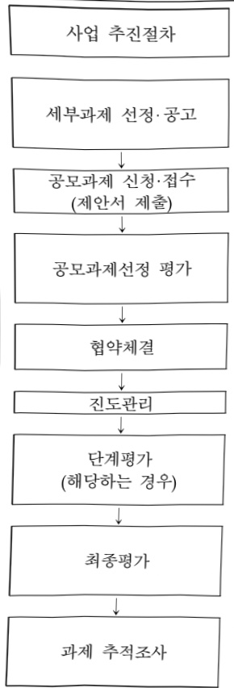

# 국가 통합 바이오 빅데이터 구축 사업(R&D)

**해당 페이지**: PDF 4860 ~ 4870 쪽 해당

**부처**: 질병관리청
**분야**: 보건
**회계유형**: 일반회계
**2026 확정예산**: 12135.0 백만원
**전년대비 증감률**: -49.3%
**AI 도메인**: 데이터, 의료/바이오

---

<table border=1 style='margin: auto; word-wrap: break-word;'><tr><td style='text-align: center; word-wrap: break-word;'>사 업 명</td></tr><tr><td style='text-align: center; word-wrap: break-word;'>(1) 국가 통합 바이오 빅데이터 구축사업(R&amp;D) (6634-345)</td></tr></table>

□ 사업 코드 정보

<table border=1 style='margin: auto; word-wrap: break-word;'><tr><td style='text-align: center; word-wrap: break-word;'>구분</td><td style='text-align: center; word-wrap: break-word;'>회계</td><td style='text-align: center; word-wrap: break-word;'>소관</td><td style='text-align: center; word-wrap: break-word;'>실국(기관)</td><td style='text-align: center; word-wrap: break-word;'>계정</td><td style='text-align: center; word-wrap: break-word;'>분야</td><td style='text-align: center; word-wrap: break-word;'>부문</td></tr><tr><td style='text-align: center; word-wrap: break-word;'>코드</td><td rowspan="2">일반회계</td><td rowspan="2">질병관리청</td><td rowspan="2">국립보건연구원</td><td rowspan="2"></td><td style='text-align: center; word-wrap: break-word;'>090</td><td style='text-align: center; word-wrap: break-word;'>091</td></tr><tr><td style='text-align: center; word-wrap: break-word;'>명칭</td><td style='text-align: center; word-wrap: break-word;'>보건</td><td style='text-align: center; word-wrap: break-word;'>보건의료</td></tr></table>

<table border=1 style='margin: auto; word-wrap: break-word;'><tr><td style='text-align: center; word-wrap: break-word;'>구분</td><td style='text-align: center; word-wrap: break-word;'>프로그램</td><td style='text-align: center; word-wrap: break-word;'>단위사업</td><td style='text-align: center; word-wrap: break-word;'>세부사업</td></tr><tr><td style='text-align: center; word-wrap: break-word;'>코드</td><td style='text-align: center; word-wrap: break-word;'>6600</td><td style='text-align: center; word-wrap: break-word;'>6634</td><td style='text-align: center; word-wrap: break-word;'>345</td></tr><tr><td style='text-align: center; word-wrap: break-word;'>명칭</td><td style='text-align: center; word-wrap: break-word;'>보건의료연구관리</td><td style='text-align: center; word-wrap: break-word;'>국가 보건의료연구 인프라 구축</td><td style='text-align: center; word-wrap: break-word;'>국가 통합 바이오 빅데이터 구축사업(R&amp;D)</td></tr></table>

□ 사업 성격 (공통요구자료 Ⅱ-1 작성유의사항 4. 참조, 해당하는 사항에 “〇” 표시)

<table border=1 style='margin: auto; word-wrap: break-word;'><tr><td style='text-align: center; word-wrap: break-word;'>신규</td><td style='text-align: center; word-wrap: break-word;'>계속</td><td style='text-align: center; word-wrap: break-word;'>완료</td><td style='text-align: center; word-wrap: break-word;'>예비타당성 실시여부</td><td style='text-align: center; word-wrap: break-word;'>총사업비 관리대상</td><td style='text-align: center; word-wrap: break-word;'>총액계상 예산사업</td><td style='text-align: center; word-wrap: break-word;'>사업소관 변경정보 2025예산 시 소관</td></tr><tr><td style='text-align: center; word-wrap: break-word;'></td><td style='text-align: center; word-wrap: break-word;'>☐</td><td style='text-align: center; word-wrap: break-word;'></td><td style='text-align: center; word-wrap: break-word;'>☐</td><td style='text-align: center; word-wrap: break-word;'></td><td style='text-align: center; word-wrap: break-word;'></td><td style='text-align: center; word-wrap: break-word;'></td></tr></table>

□ 사업 지원 형태 및 지원을 (최소한 한 개는 반드시 선택하시오. 해당사항에 0 표시)

<table border=1 style='margin: auto; word-wrap: break-word;'><tr><td style='text-align: center; word-wrap: break-word;'>직접</td><td style='text-align: center; word-wrap: break-word;'>출자</td><td style='text-align: center; word-wrap: break-word;'>출연</td><td style='text-align: center; word-wrap: break-word;'>보조</td><td style='text-align: center; word-wrap: break-word;'>융자</td><td style='text-align: center; word-wrap: break-word;'>국고보조율(%)</td><td style='text-align: center; word-wrap: break-word;'>융자율(%)</td></tr><tr><td style='text-align: center; word-wrap: break-word;'></td><td style='text-align: center; word-wrap: break-word;'></td><td style='text-align: center; word-wrap: break-word;'>○</td><td style='text-align: center; word-wrap: break-word;'></td><td style='text-align: center; word-wrap: break-word;'></td><td style='text-align: center; word-wrap: break-word;'></td><td style='text-align: center; word-wrap: break-word;'></td></tr></table>

---

### 가.예산 총괄표

(단위:백만원,%)

<table border=1 style='margin: auto; word-wrap: break-word;'><tr><td rowspan="2">사업명</td><td rowspan="2">2024년 결산</td><td colspan="2">2025년 예산</td><td colspan="2">2026년</td><td rowspan="2">증감(B-A)</td><td rowspan="2">(B-A)/A</td></tr><tr><td style='text-align: center; word-wrap: break-word;'>본예산(A)</td><td style='text-align: center; word-wrap: break-word;'>추경</td><td style='text-align: center; word-wrap: break-word;'>정부안</td><td style='text-align: center; word-wrap: break-word;'>확정(B)</td></tr><tr><td style='text-align: center; word-wrap: break-word;'>국가 통합 바이오 빅데이터 구축사업(R&amp;D)</td><td style='text-align: center; word-wrap: break-word;'>21,755</td><td style='text-align: center; word-wrap: break-word;'>23,934</td><td style='text-align: center; word-wrap: break-word;'>23,934</td><td style='text-align: center; word-wrap: break-word;'>12,135</td><td style='text-align: center; word-wrap: break-word;'>12,135</td><td style='text-align: center; word-wrap: break-word;'>△11,799</td><td style='text-align: center; word-wrap: break-word;'>△49.3</td></tr></table>

□ 기능별(내역사업별), 목별 예산 내역

(단위:백만원)

<table border=1 style='margin: auto; word-wrap: break-word;'><tr><td rowspan="3"></td><td colspan="5">2024</td><td colspan="7">2025(2025.12월 말)</td><td rowspan="3">2026예산</td></tr><tr><td rowspan="2">예산액(추경)</td><td rowspan="2">예산현액</td><td rowspan="2">집행액[실집행액]</td><td rowspan="2">이월액</td><td rowspan="2">불용액</td><td rowspan="2">본예산</td><td rowspan="2">예산현액</td><td rowspan="2">집행액[실집행액]</td><td colspan="2">전년도 이월액제외</td><td rowspan="2">이월예상액</td><td rowspan="2">불용예상액</td></tr><tr><td style='text-align: center; word-wrap: break-word;'>예산현액</td><td style='text-align: center; word-wrap: break-word;'>집행액[실집행액]</td></tr><tr><td style='text-align: center; word-wrap: break-word;'>○ 기능별 분류(합계)</td><td style='text-align: center; word-wrap: break-word;'>21,755</td><td style='text-align: center; word-wrap: break-word;'>21,755</td><td style='text-align: center; word-wrap: break-word;'>21,755[20,584]</td><td style='text-align: center; word-wrap: break-word;'>-</td><td style='text-align: center; word-wrap: break-word;'>-</td><td style='text-align: center; word-wrap: break-word;'>23,934</td><td style='text-align: center; word-wrap: break-word;'>23,934[23,934]</td><td style='text-align: center; word-wrap: break-word;'>23,934[23,934]</td><td style='text-align: center; word-wrap: break-word;'>23,934[23,934]</td><td style='text-align: center; word-wrap: break-word;'>23,934[23,934]</td><td style='text-align: center; word-wrap: break-word;'>-</td><td style='text-align: center; word-wrap: break-word;'>-</td><td style='text-align: center; word-wrap: break-word;'>12,135</td></tr><tr><td style='text-align: center; word-wrap: break-word;'>· 바이오 데이터뱅크 구축 운영</td><td style='text-align: center; word-wrap: break-word;'>19,001</td><td style='text-align: center; word-wrap: break-word;'>19,001</td><td style='text-align: center; word-wrap: break-word;'>19,001[18,132]</td><td style='text-align: center; word-wrap: break-word;'>-</td><td style='text-align: center; word-wrap: break-word;'>-</td><td style='text-align: center; word-wrap: break-word;'>22,729</td><td style='text-align: center; word-wrap: break-word;'>22,729[22,729]</td><td style='text-align: center; word-wrap: break-word;'>22,729[22,729]</td><td style='text-align: center; word-wrap: break-word;'>22,729[22,729]</td><td style='text-align: center; word-wrap: break-word;'>22,729[22,729]</td><td style='text-align: center; word-wrap: break-word;'>-</td><td style='text-align: center; word-wrap: break-word;'>-</td><td style='text-align: center; word-wrap: break-word;'>11,580</td></tr><tr><td style='text-align: center; word-wrap: break-word;'>· 사업단 운영</td><td style='text-align: center; word-wrap: break-word;'>2,754</td><td style='text-align: center; word-wrap: break-word;'>2,754</td><td style='text-align: center; word-wrap: break-word;'>2,754[2,452]</td><td style='text-align: center; word-wrap: break-word;'>-</td><td style='text-align: center; word-wrap: break-word;'>-</td><td style='text-align: center; word-wrap: break-word;'>1,205</td><td style='text-align: center; word-wrap: break-word;'>1,205[1,205]</td><td style='text-align: center; word-wrap: break-word;'>1,205[1,205]</td><td style='text-align: center; word-wrap: break-word;'>1,205[1,205]</td><td style='text-align: center; word-wrap: break-word;'>1,205[1,205]</td><td style='text-align: center; word-wrap: break-word;'>-</td><td style='text-align: center; word-wrap: break-word;'>-</td><td style='text-align: center; word-wrap: break-word;'>555</td></tr><tr><td style='text-align: center; word-wrap: break-word;'>○ 비목별 분류(합계)</td><td style='text-align: center; word-wrap: break-word;'>21,755</td><td style='text-align: center; word-wrap: break-word;'>21,755</td><td style='text-align: center; word-wrap: break-word;'>21,755[20,584]</td><td style='text-align: center; word-wrap: break-word;'>-</td><td style='text-align: center; word-wrap: break-word;'>-</td><td style='text-align: center; word-wrap: break-word;'>23,934</td><td style='text-align: center; word-wrap: break-word;'>23,934[23,934]</td><td style='text-align: center; word-wrap: break-word;'>23,934[23,934]</td><td style='text-align: center; word-wrap: break-word;'>23,934[23,934]</td><td style='text-align: center; word-wrap: break-word;'>23,934[23,934]</td><td style='text-align: center; word-wrap: break-word;'>-</td><td style='text-align: center; word-wrap: break-word;'>-</td><td style='text-align: center; word-wrap: break-word;'>12,135</td></tr><tr><td style='text-align: center; word-wrap: break-word;'>· 연구개발활동비등(360-05)</td><td style='text-align: center; word-wrap: break-word;'>21,755</td><td style='text-align: center; word-wrap: break-word;'>21,755</td><td style='text-align: center; word-wrap: break-word;'>21,755[20,584]</td><td style='text-align: center; word-wrap: break-word;'>-</td><td style='text-align: center; word-wrap: break-word;'>-</td><td style='text-align: center; word-wrap: break-word;'>23,934</td><td style='text-align: center; word-wrap: break-word;'>23,934[23,934]</td><td style='text-align: center; word-wrap: break-word;'>23,934[23,934]</td><td style='text-align: center; word-wrap: break-word;'>23,934[23,934]</td><td style='text-align: center; word-wrap: break-word;'>23,934[23,934]</td><td style='text-align: center; word-wrap: break-word;'>-</td><td style='text-align: center; word-wrap: break-word;'>-</td><td style='text-align: center; word-wrap: break-word;'>12,135</td></tr><tr><td style='text-align: center; word-wrap: break-word;'>○ 기능비목별 분류(합계)</td><td style='text-align: center; word-wrap: break-word;'>21,755</td><td style='text-align: center; word-wrap: break-word;'>21,755</td><td style='text-align: center; word-wrap: break-word;'>21,755[20,584]</td><td style='text-align: center; word-wrap: break-word;'>-</td><td style='text-align: center; word-wrap: break-word;'>-</td><td style='text-align: center; word-wrap: break-word;'>23,934</td><td style='text-align: center; word-wrap: break-word;'>23,934[23,934]</td><td style='text-align: center; word-wrap: break-word;'>23,934[23,934]</td><td style='text-align: center; word-wrap: break-word;'>23,934[23,934]</td><td style='text-align: center; word-wrap: break-word;'>23,934[23,934]</td><td style='text-align: center; word-wrap: break-word;'>-</td><td style='text-align: center; word-wrap: break-word;'>-</td><td style='text-align: center; word-wrap: break-word;'>12,135</td></tr><tr><td style='text-align: center; word-wrap: break-word;'>· 바이오 데이터뱅크 구축 운영</td><td style='text-align: center; word-wrap: break-word;'>19,001</td><td style='text-align: center; word-wrap: break-word;'>19,001</td><td style='text-align: center; word-wrap: break-word;'>19,001[18,132]</td><td style='text-align: center; word-wrap: break-word;'>-</td><td style='text-align: center; word-wrap: break-word;'>-</td><td style='text-align: center; word-wrap: break-word;'>22,729</td><td style='text-align: center; word-wrap: break-word;'>22,729[22,729]</td><td style='text-align: center; word-wrap: break-word;'>22,729[22,729]</td><td style='text-align: center; word-wrap: break-word;'>22,729[22,729]</td><td style='text-align: center; word-wrap: break-word;'>22,729[22,729]</td><td style='text-align: center; word-wrap: break-word;'>-</td><td style='text-align: center; word-wrap: break-word;'>-</td><td style='text-align: center; word-wrap: break-word;'>11,580</td></tr><tr><td style='text-align: center; word-wrap: break-word;'>· 연구개발활동비등(360-05)</td><td style='text-align: center; word-wrap: break-word;'>19,001</td><td style='text-align: center; word-wrap: break-word;'>19,001</td><td style='text-align: center; word-wrap: break-word;'>19,001[18,132]</td><td style='text-align: center; word-wrap: break-word;'>-</td><td style='text-align: center; word-wrap: break-word;'>-</td><td style='text-align: center; word-wrap: break-word;'>22,729</td><td style='text-align: center; word-wrap: break-word;'>22,729[22,729]</td><td style='text-align: center; word-wrap: break-word;'>22,729[22,729]</td><td style='text-align: center; word-wrap: break-word;'>22,729[22,729]</td><td style='text-align: center; word-wrap: break-word;'>22,729[22,729]</td><td style='text-align: center; word-wrap: break-word;'>-</td><td style='text-align: center; word-wrap: break-word;'>-</td><td style='text-align: center; word-wrap: break-word;'>11,580</td></tr><tr><td style='text-align: center; word-wrap: break-word;'>· 사업단 운영</td><td style='text-align: center; word-wrap: break-word;'>2,754</td><td style='text-align: center; word-wrap: break-word;'>2,754</td><td style='text-align: center; word-wrap: break-word;'>2,754[2,452]</td><td style='text-align: center; word-wrap: break-word;'>-</td><td style='text-align: center; word-wrap: break-word;'>-</td><td style='text-align: center; word-wrap: break-word;'>1,205</td><td style='text-align: center; word-wrap: break-word;'>1,205[1,205]</td><td style='text-align: center; word-wrap: break-word;'>1,205[1,205]</td><td style='text-align: center; word-wrap: break-word;'>1,205[1,205]</td><td style='text-align: center; word-wrap: break-word;'>1,205[1,205]</td><td style='text-align: center; word-wrap: break-word;'>-</td><td style='text-align: center; word-wrap: break-word;'>-</td><td style='text-align: center; word-wrap: break-word;'>555</td></tr><tr><td style='text-align: center; word-wrap: break-word;'>· 연구개발활동비등(360-05)</td><td style='text-align: center; word-wrap: break-word;'>2,754</td><td style='text-align: center; word-wrap: break-word;'>2,754</td><td style='text-align: center; word-wrap: break-word;'>2,754[2,452]</td><td style='text-align: center; word-wrap: break-word;'>-</td><td style='text-align: center; word-wrap: break-word;'>-</td><td style='text-align: center; word-wrap: break-word;'>1,205</td><td style='text-align: center; word-wrap: break-word;'>1,205[1,205]</td><td style='text-align: center; word-wrap: break-word;'>1,205[1,205]</td><td style='text-align: center; word-wrap: break-word;'>1,205[1,205]</td><td style='text-align: center; word-wrap: break-word;'>1,205[1,205]</td><td style='text-align: center; word-wrap: break-word;'>-</td><td style='text-align: center; word-wrap: break-word;'>-</td><td style='text-align: center; word-wrap: break-word;'>555</td></tr></table>

---

### 나. 사업설명자료

## 1 ) 사업목적·내용

°(국가 통합 바이오 빅데이터 구축) 참여자 동의 기반 검체(혈액·소변 등)를 확보*하고,

임상·유전체 및 공공데이터 등을 통합·개방하기 위한 R&D 인프라 구축

* 1단계('24~'28년) 77.2만명 모집(예타 기준 6,065.8억원)

- (내역① 바이오 데이터뱅크 구축·운영) 개인 중심으로 통합된 바이오 빅데이터 구축

 및 동의·수집·보호·활용체계 마련

- (내역② 사업단 운영) 사업 기획, 평가 및 성과관리 등 사업 운영 관리

2) 사업개요

□ 사업근거 및 추진경위

① 법령상 근거 및 조항 적시

○ 과학기술기본법 제11조(국가연구개발사업의 추진)

제11조(국가연구개발사업의 추진) ① 중앙행정기관의 장은 기본계획에 따라 맡은 분야의 국가연구개발사업과 그 시책을 세워 추진하여야 한다. <개정 2014. 5. 28.>

② 추진경위 - 사업 시작년도, 추진배경, 부처별 중점과제, 대통령 공약사항 등

<table border=1 style='margin: auto; word-wrap: break-word;'><tr><td style='text-align: center; word-wrap: break-word;'>지원근거</td><td style='text-align: center; word-wrap: break-word;'>ㅇ 국정과제 32-2 - 의료 AI·제약·바이오헬스 강국 실현 / 의료AI 등 디지털 헬스케어 혁신성장 체계 구축 ㅇ 제5차 과학기술기본계획(&#x27;23~&#x27;27), IV. 중점 육성기술(전략기술)</td></tr></table>

---

## 212 대 국가전략기술 분야 및 50개 세부 중점기술

-한국인 특유 유전체·바이오 빅데이터 구축

## 5 

## 첨단바이오

단기(-5년)

·수개월차 개발 가능한 mRNA 백신플랫폼 확보

중장기(5-10년)

·한국인 특유 유전체·바이오 빅데이터 구축

·선도국 수준 유전자·세포치료 파이프라인 확보

·합성생물학 기반 바이오제조·생산 고도화

▶ 합성생물학

유전자·세포 치료

·감염병백신·치료

·디지털헬스 데이터 분석·활용

## o 제1차 국가전략기술 육성 기본계획('24~'28)

□ 기술개발, 핵심R&D

중점기술 4 디지털·헬스 데이터 분석·활용

신약:의료기기 개발, 정밀의료 실현을 위한 AI 활용 촉진 및 바이오 빅데이터 구축

참여자의 동의를 기반으로 검체(혈액, 소변 등)를 확보, 임상·유전체 데이터를 생산, 공공데이터와 라이프로그램 수집·연계하여 R&D 인프라인 한국형 바이오 빅데이터 및 데이터뱅크 구축

* 국가 통합 바이오 빅데이터 구축 ('24~'28, '24년 171억원)

##### o 신성장 4.0프로젝트('23.1. 기재부)

- [2] (바이오 혁신) 바이오 파운드리, 바이오 데이터뱅크 구축

### ※ '25년 추진계획('25.3월)

ㅇ 데이터뱅크 대국민 홍보 등을 통한 국가 통합 바이오 빅데이터 구축 사업 참여자 모집 본격화('25), 양질의 연구자원* 축적 및 내실화

*유전체 및 오믹스 데이터 생산, 공공데이터 등 2차 자료 연계 등

o 바이오헬스 신시장창출전략('23.2.)

- ③ (데이터뱅크) 국가 통합 바이오 빅데이터 구축 및 개방

: 임상정보·유전체 데이터, 공공데이터 및 라이프로그 등을 통합한 바이오 빅데이터 구축개방

°「데이터경제 활성화 방안」(23.11., 기재부)

-공공-임상-유전체-라이프로그'데이터를 개인단위로 연결하여 구축

(시범사업) 2.5만 명 규모 시범사업 추진('20~22), 임상·유전체 데이터 구축·개방('23.6월~) → 연구재단의 시범사업 평가 결과 "우수"

추진경위

o (예타 추진) 예비타당성조사 신청 및 통과('23.6월)

o (본사업 전환) 사업단 구성 및 정책지정·지정공모과제 수행기관 등 거버넌스 구축('24.4월~), 참여자 모집 개시('24.12월~)

o (특정평가) 예타 계획변경을 위하여 총사업비 약 515억원(범부처, '26~'28)* 증액('25.5월)* 참여자 인센티브 364억, 모집기관 인건비 현실화 등 86억, 홍보비 65억

---

□ 주요내용

① 사업규모

- 총사업비(해당되는 경우에만 기재) : 580,579백만원

- 사업기간 : '24~'28년

- 최근 5년 간 투입된 사업비(예산액기준, 추경편성한 연도에는 추경포함)

<table border=1 style='margin: auto; word-wrap: break-word;'><tr><td style='text-align: center; word-wrap: break-word;'>$ \underline{\text{연도}} $</td><td style='text-align: center; word-wrap: break-word;'>2022</td><td style='text-align: center; word-wrap: break-word;'>2023</td><td style='text-align: center; word-wrap: break-word;'>2024</td><td style='text-align: center; word-wrap: break-word;'>2025</td><td style='text-align: center; word-wrap: break-word;'>2026</td></tr><tr><td style='text-align: center; word-wrap: break-word;'>$ \underline{\text{사업비}} $</td><td style='text-align: center; word-wrap: break-word;'>-</td><td style='text-align: center; word-wrap: break-word;'>-</td><td style='text-align: center; word-wrap: break-word;'>21,755</td><td style='text-align: center; word-wrap: break-word;'>23,934</td><td style='text-align: center; word-wrap: break-word;'>12,135</td></tr></table>

- 기타 : 해당없음

② 사업추진체계

- 사업시행방법 : 출연

- 사업시행주체 : (주관부처) 보건복지부

(참여부처) 과학기술정보통신부, 산업통상자원부, 질병관리청

(전문기관) 한국보건산업진흥원

(사 업 단) 국가통합바이오빅데이터구축사업단

- 사업 수혜자 : 희귀·중증질환자, 참여자, 연구자, 기업 등

- 보조, 융자, 출연, 출자 등의 경우 보조·융자 등 지원 비율 및 법적근거

<table border=1 style='margin: auto; word-wrap: break-word;'><tr><td style='text-align: center; word-wrap: break-word;'>내역사업명</td><td style='text-align: center; word-wrap: break-word;'>구분</td><td style='text-align: center; word-wrap: break-word;'>피보조.피출연 등 기관명</td><td style='text-align: center; word-wrap: break-word;'>지원 금액 (2026예산)</td><td style='text-align: center; word-wrap: break-word;'>지원 비율(%)</td><td style='text-align: center; word-wrap: break-word;'>보조율 법적근거 (해당 조항)</td></tr><tr><td style='text-align: center; word-wrap: break-word;'>바이오데이터뱅크구축·운영</td><td rowspan="2">출연</td><td rowspan="2">한국보건산업진흥원</td><td style='text-align: center; word-wrap: break-word;'>11,580 백만원</td><td style='text-align: center; word-wrap: break-word;'>100</td><td style='text-align: center; word-wrap: break-word;'>「보건의료기술진흥법」 제3조(기술개발의 보호·육성) 및 제7조(연구개발사업 전문기관의 지정) 등</td></tr><tr><td style='text-align: center; word-wrap: break-word;'>사업단 운영</td><td style='text-align: center; word-wrap: break-word;'>555 백만원</td><td style='text-align: center; word-wrap: break-word;'>100</td><td style='text-align: center; word-wrap: break-word;'>「국가연구개발혁신법」 제22조(연구개발사업 전문기관의 지정)</td></tr></table>

---

## 3 ) 2026년도 예산 산출 근거

① 바이오 데이터뱅크 구축·운영

:(2025 본예산) 22,729백만원 → (2026) 11,580백만원, 11,149백만원 감액

- 개인 중심으로 통합된 바이오 빅데이터 구축 및 동의·수집·보호·활용체계 마련(11,580백만원)

- (산출) 총 44개 과제(계속) x 2,668백만원 x 12/12개월 x 9.87%(질병청 지원 비율)

※ 부처별 지원비율 : (복지부) 42.37%, (과기부) 34.25%, (산업부) 13.51%, (질병청) 9.87%

°2025년도 예산 및 2026년도 예산 산출 세부내역 비교

<table border=1 style='margin: auto; word-wrap: break-word;'><tr><td colspan="2">2025년 본예산</td><td colspan="2">2026년 예산</td></tr><tr><td style='text-align: center; word-wrap: break-word;'>예산</td><td style='text-align: center; word-wrap: break-word;'>산출내역</td><td style='text-align: center; word-wrap: break-word;'>예산</td><td style='text-align: center; word-wrap: break-word;'>산출내역</td></tr><tr><td rowspan="7">19,001 백만원</td><td style='text-align: center; word-wrap: break-word;'>계속과제1. 참여자 모집 기관 관리 및 홍보 : 69백만원 - 1개 과제 × 320백만원 × 12/12개월 × 21.40%（질병청 비율） = 69백만원</td><td rowspan="7">11,580 백만원</td><td style='text-align: center; word-wrap: break-word;'>계속과제1. 참여자 모집 기관 관리 및 홍보 : 246백만원 - 1개 과제 × 2,500백만원 × 12/12개월 × 9.87%（질병청 비율） = 246백만원</td></tr><tr><td style='text-align: center; word-wrap: break-word;'>계속과제2. 참여자 모집 및 임상정보 검체수집 : 6,024백만원 - 38개 과제 × 740.8백만원 × 12/12개월 × 21.40%（질병청 비율） = 6,024백만원</td><td style='text-align: center; word-wrap: break-word;'>계속과제2. 참여자 모집 및 임상정보 검체수집 : 3,070백만원 - 38개 과제 × 818.4백만원 × 12/12개월 × 9.87%（질병청 비율） = 3,070백만원</td></tr><tr><td style='text-align: center; word-wrap: break-word;'>계속과제3. 데이터뱅크 구축·운영 : 2,301백만원 - 1개 과제 × 10,751백만원 × 12/12개월 × 21.40%（질병청 비율） = 2,301백만원</td><td style='text-align: center; word-wrap: break-word;'>계속과제3. 데이터뱅크 구축·운영 : 1,127백만원 - 1개 과제 × 11,413백만원 × 12/12개월 × 9.87%（질병청 비율） = 1,127백만원</td></tr><tr><td style='text-align: center; word-wrap: break-word;'>계속과제4. 바이오빅데이터 플랫폼 구축·운영 : 4,300백만원 - 1개 과제 × 20,092백만원 × 12/12개월 × 21.40%（질병청 비율） = 4,300백만원</td><td style='text-align: center; word-wrap: break-word;'>계속과제4. 바이오빅데이터 플랫폼 구축·운영 : 2,264백만원 - 1개 과제 × 22,969백만원 × 12/12개월 × 9.87%（질병청 비율） = 2,264백만원</td></tr><tr><td style='text-align: center; word-wrap: break-word;'>계속과제5. 인재자원제작 및 검체운송 : 2,723백만원 - 1개 과제 × 12,722백만원 × 12/12개월 × 21.40%（질병청 비율） = 2,723백만원</td><td style='text-align: center; word-wrap: break-word;'>계속과제5. 인재자원제작 및 검체운송 : 1,297백만원 - 1개 과제 × 13,150백만원 × 12/12개월 × 9.87%（질병청 비율） = 1,297백만원</td></tr><tr><td style='text-align: center; word-wrap: break-word;'>계속과제6. 유전체 등 오믹스 데이터 생산 분석 : 7,291백만원 - 1개 과제 × 34,068백만원 × 12/12개월 × 21.40%（질병청 비율） = 7,291백만원</td><td style='text-align: center; word-wrap: break-word;'>계속과제6. 유전체 등 오믹스 데이터 생산 분석 : 3,556백만원 - 1개 과제 × 36,044백만원 × 12/12개월 × 9.87%（질병청 비율） = 3,556백만원</td></tr><tr><td style='text-align: center; word-wrap: break-word;'>계속과제7. 데이터 기반 연구 네트워크 지원 : 21백만원 - 1개 과제 × 100백만원 × 12/12개월 × 21.40%（질병청 비율） = 21백만원</td><td style='text-align: center; word-wrap: break-word;'>계속과제7. 데이터 기반 연구 네트워크 지원 : 20백만원 - 1개 과제 × 200백만원 × 12/12개월 × 9.87%（질병청 비율） = 20백만원</td></tr></table>

## ② 사업단 운영

: (2025 본예산) 1,205백만원 → (2026) 555백만원, 650백만원 감액

-사업 기획,평가 및 성과관리 등 사업 운영 관리를 위한 사업단 운영비(555백만원)

- (산출) 총 1개 과제(계속) 5,626백만원 x 12/12개월 x 9.87%(질병청 지원 비율)

※ 부처별 지원비율 : (복지부) 42.37%, (과기부) 34.25%, (산업부) 13.51%, (질병청) 9.87%

°2025년도 예산 및 2026년도 예산 산출 세부내역 비교

<table border=1 style='margin: auto; word-wrap: break-word;'><tr><td colspan="2">2025년 본예산</td><td colspan="2">2026년 예산</td></tr><tr><td style='text-align: center; word-wrap: break-word;'>예산</td><td style='text-align: center; word-wrap: break-word;'>산출내역</td><td style='text-align: center; word-wrap: break-word;'>예산</td><td style='text-align: center; word-wrap: break-word;'>산출내역</td></tr><tr><td style='text-align: center; word-wrap: break-word;'>1,205백만원</td><td style='text-align: center; word-wrap: break-word;'>계속과제8. 사업단 운영 : 1,205백만원 - 1개 과제 × 5,630백만원 × 12/12개월 × 21.40%(질병청 비율) = 1,205백만원</td><td style='text-align: center; word-wrap: break-word;'>555 백만원</td><td style='text-align: center; word-wrap: break-word;'>계속과제8. 사업단 운영 : 555백만원 - 1개 과제 × 5,626백만원 × 12/12개월 × 9.87%(질병청 비율) = 555백만원</td></tr></table>

---

<table border=1 style='margin: auto; word-wrap: break-word;'><tr><td style='text-align: center; word-wrap: break-word;'>2024</td><td style='text-align: center; word-wrap: break-word;'>· 사업단 개소 및 정책지정과제 수행기관* 선정(&#x27;24.4월&#x27;) * (데이터뱅크) 한국보건의료정보원 / (바이오비데이터 플랫폼) 한국과학기술정보연구원 / (유전체 등 데이터 생산 분석) 한국생명공학연구원 국가생명연구자원정보센터 · 공모과제* 공고 개시 및 선정(&#x27;24.5월~&#x27;) * 참여자 모집 및 임상정보·검체 수집, 인체자원 제작 및 검체 운송</td></tr><tr><td style='text-align: center; word-wrap: break-word;'>2025</td><td style='text-align: center; word-wrap: break-word;'>· 국가 통합 바이오 빅데이터 구축사업 공동사업관리지침 베포(&#x27;25.3월&#x27;) · 예타 계획 변경을 위한 특정평가를 통한 추가 예산(범부처 515억, &#x27;26~&#x27;28) 확보(&#x27;25.5월&#x27;)</td></tr></table>

② 성과지표 이외의 연도별 사업추진 경과 및 실적

<table border=1 style='margin: auto; word-wrap: break-word;'><tr><td style='text-align: center; word-wrap: break-word;'>성과지표</td><td style='text-align: center; word-wrap: break-word;'>구분</td><td style='text-align: center; word-wrap: break-word;'>2022</td><td style='text-align: center; word-wrap: break-word;'>2023</td><td style='text-align: center; word-wrap: break-word;'>2024</td><td style='text-align: center; word-wrap: break-word;'>2025</td><td style='text-align: center; word-wrap: break-word;'>2026</td><td style='text-align: center; word-wrap: break-word;'>2026 목표치산출근거</td><td style='text-align: center; word-wrap: break-word;'>측정산식(또는 측정방법)</td><td style='text-align: center; word-wrap: break-word;'>자료수집방법(또는 자료출처)</td></tr><tr><td rowspan="3">참여자모집 건수(단위:천건)</td><td style='text-align: center; word-wrap: break-word;'>목표</td><td style='text-align: center; word-wrap: break-word;'>-</td><td style='text-align: center; word-wrap: break-word;'>-</td><td style='text-align: center; word-wrap: break-word;'>-</td><td style='text-align: center; word-wrap: break-word;'>206</td><td style='text-align: center; word-wrap: break-word;'>398</td><td rowspan="3">1단계(24~28)목표 모집인원에 대해 연차별목표치 설정</td><td rowspan="3">∑(검체 수집을 완료한 참여자 수(누적))</td><td rowspan="3">바이오 빅데이터 플랫폼 상 등재 완료된 참여자 수측정</td></tr><tr><td style='text-align: center; word-wrap: break-word;'>실적</td><td style='text-align: center; word-wrap: break-word;'>-</td><td style='text-align: center; word-wrap: break-word;'>-</td><td style='text-align: center; word-wrap: break-word;'>-</td><td style='text-align: center; word-wrap: break-word;'>-</td><td style='text-align: center; word-wrap: break-word;'>-</td></tr><tr><td style='text-align: center; word-wrap: break-word;'>달성도</td><td style='text-align: center; word-wrap: break-word;'>-</td><td style='text-align: center; word-wrap: break-word;'>-</td><td style='text-align: center; word-wrap: break-word;'>-</td><td style='text-align: center; word-wrap: break-word;'>-</td><td style='text-align: center; word-wrap: break-word;'>-</td></tr><tr><td rowspan="3">통합 바이오데이터 구축률(단위:%)</td><td style='text-align: center; word-wrap: break-word;'>목표</td><td style='text-align: center; word-wrap: break-word;'>-</td><td style='text-align: center; word-wrap: break-word;'>-</td><td style='text-align: center; word-wrap: break-word;'>-</td><td style='text-align: center; word-wrap: break-word;'>70</td><td style='text-align: center; word-wrap: break-word;'>73</td><td rowspan="3">데이터 통합·연계소요 기간을 고려해 &#x27;25년 70%로 설정 및 연도별 3%&#x27; 상향</td><td rowspan="3">(∑연계데이터 생성 참여자 수/ (∑사업 동의 참여자 수)×100</td><td rowspan="3">데이터뱅크 시스템상 동의 유지 참여자 측정</td></tr><tr><td style='text-align: center; word-wrap: break-word;'>실적</td><td style='text-align: center; word-wrap: break-word;'>-</td><td style='text-align: center; word-wrap: break-word;'>-</td><td style='text-align: center; word-wrap: break-word;'>-</td><td style='text-align: center; word-wrap: break-word;'>-</td><td style='text-align: center; word-wrap: break-word;'>-</td></tr><tr><td style='text-align: center; word-wrap: break-word;'>달성도</td><td style='text-align: center; word-wrap: break-word;'>-</td><td style='text-align: center; word-wrap: break-word;'>-</td><td style='text-align: center; word-wrap: break-word;'>-</td><td style='text-align: center; word-wrap: break-word;'>-</td><td style='text-align: center; word-wrap: break-word;'>-</td></tr><tr><td rowspan="3">참여자 관리시스템 구축 공정률(단위:%)</td><td style='text-align: center; word-wrap: break-word;'>목표</td><td style='text-align: center; word-wrap: break-word;'>-</td><td style='text-align: center; word-wrap: break-word;'>-</td><td style='text-align: center; word-wrap: break-word;'>38</td><td style='text-align: center; word-wrap: break-word;'>60</td><td style='text-align: center; word-wrap: break-word;'>60</td><td rowspan="3">구축 일정에 따라 산출(26 구축 완료)</td><td rowspan="3">인프라 구축(HW)공정률(누적)×가 중치 + 시스템 개발(SW)공정률(누적)×가 중치</td><td rowspan="3">공정벨 예산 투입 및 성과 달성도 측정 가능한 문서(감리수행 결과보고서 등)</td></tr><tr><td style='text-align: center; word-wrap: break-word;'>실적</td><td style='text-align: center; word-wrap: break-word;'>-</td><td style='text-align: center; word-wrap: break-word;'>-</td><td style='text-align: center; word-wrap: break-word;'>38</td><td style='text-align: center; word-wrap: break-word;'>-</td><td style='text-align: center; word-wrap: break-word;'>-</td></tr><tr><td style='text-align: center; word-wrap: break-word;'>달성도</td><td style='text-align: center; word-wrap: break-word;'>-</td><td style='text-align: center; word-wrap: break-word;'>-</td><td style='text-align: center; word-wrap: break-word;'>100</td><td style='text-align: center; word-wrap: break-word;'>-</td><td style='text-align: center; word-wrap: break-word;'>-</td></tr><tr><td rowspan="3">바이오 빅데이터 플랫폼 구축 공정률(단위:%)</td><td style='text-align: center; word-wrap: break-word;'>목표</td><td style='text-align: center; word-wrap: break-word;'>-</td><td style='text-align: center; word-wrap: break-word;'>-</td><td style='text-align: center; word-wrap: break-word;'>24</td><td style='text-align: center; word-wrap: break-word;'>62</td><td style='text-align: center; word-wrap: break-word;'>100</td><td rowspan="3">구축 일정에 따라 산출(26 구축 완료)</td><td rowspan="3">인프라 구축(HW)공정률(누적)×가 중치 + 시스템 개발(SW)공정률(누적)×가 중치</td><td rowspan="3">공정벨 예산 투입 및 성과 달성도 측정 가능한 문서(감리수행 결과보고서 등)</td></tr><tr><td style='text-align: center; word-wrap: break-word;'>실적</td><td style='text-align: center; word-wrap: break-word;'>-</td><td style='text-align: center; word-wrap: break-word;'>-</td><td style='text-align: center; word-wrap: break-word;'>23.9</td><td style='text-align: center; word-wrap: break-word;'>-</td><td style='text-align: center; word-wrap: break-word;'>-</td></tr><tr><td style='text-align: center; word-wrap: break-word;'>달성도</td><td style='text-align: center; word-wrap: break-word;'>-</td><td style='text-align: center; word-wrap: break-word;'>-</td><td style='text-align: center; word-wrap: break-word;'>99.7</td><td style='text-align: center; word-wrap: break-word;'>-</td><td style='text-align: center; word-wrap: break-word;'>-</td></tr></table>

4) 사업효과

☐ 사업영향, 산출물 성과지표 등

① 2022~2026년도 성과계획서 상 성과지표 및 최근 5년간 성과 달성도

---

③ 향후(2026년도 이후) 기대효과 : 개조식으로 작성, 건 별로 계량적 수치 제시

◯ 한국형 통합 바이오 빅데이터 구축('24~32)을 통한 맞춤의료 실현
- 77.2만명(질환자 18.7만명 일반인 58.5만명)의 바이오 분야 핵심 연구자원 확보('24~28)
- 임상정보·유전체 데이터, 공공데이터 등을 통합한 바이오 빅데이터 개방('26~')

## 5 ) 타당성조사 및 예비타당성조사 시행여부 및 결과 요지

☐ 예비타당성조사 통과('23.6월)

- 조사기관 : 한국과학기술기획평가원(KISTEP)

- 조사결과 : 대안시행(B/C 비율 : 0.69)

*예비타당성조사 결과 100만 명 규모의 9년 사업을 2단계(5년+4년)로 분할하여 1단계 사업을 5년간 ('24~'28년, 6,065.8억) 77.2만 명 규모로 우선 추진

- 사업기간 : '24년 ~ '28년(5년)

- 총사업비 : 6,065.8억원

6) 총사업비 대상사업 여부 및 내역 : 해당없음

---

## 7 ) 사업 집행절차

(공모과제) 세부추진계획 확정·공고

사업안내서, 과제제안요구서(RFP) 포함

○ 연구개발계획서 작성 · 신청(신청기관)

○ 연구개발계획서 접수

○ 과제선정 평가계획 수립

○ 사전검토 → 선정평가(평가위원회 개최, 서면 및 발표평가 등)

○ 선정결과 확정(운영위원회) 및 주무부처 보고

○ 총괄협약 : 전문기관 ↔ 사업단

○ 과제협약 : 사업단 ↔ 주관연구기관(참여기관 포함)

평가계획 수립

단계보고서 평가(평가위원회)

평가결과 확정(운영위원회) 및 주무부처 보고

○ 평가계획 수립

○ 최종보고서 평가(평가위원회)

○ 평가결과 확정(운영위원회) 및 주무부처 보고

☐ 추적조사계획 수립

☐ 종료된 과제들에 대해 종료 후 5년차까지 매년 추적조사 실시

☐ 추적조사 결과 주무부처 및 전문기관에 보고

## 8 ) 각종 평가

1) 국회(예결위, 상임위, 예정처, 국정감사 포함) 지적

- '24년 국회 상임위원회 부대의견('25 예산)

(서미화 의원) 질병관리청 등 4개 부처는 참여자를 대상으로 한 인센티브 제공 및 홍보 강화 등 구체적인 모집 전략을 바탕으로 한 성과관리 강화방안을 마련할 것

(이수진 의원) 사업내역 간 추진실적의 차이가 큰 바, 암환자 및 희귀질환자 대상 사업 확대 필요성 등 적정한 사업계획 조정 및 성과관리 철저 필요

- '25년 국회 상임위원회 시정요구('24 결산)

(서영석 의원) - 질병관리청은 국가통합바이오빅데이터사업단 운영비 2024년 집행

잔액을 국고로 반납하고 향후 재발방지 방안을 마련할 것

---

2)문제점 지적에 대한 후속조치

<table border=1 style='margin: auto; word-wrap: break-word;'><tr><td style='text-align: center; word-wrap: break-word;'>구 분</td><td style='text-align: center; word-wrap: break-word;'>반영 내용</td></tr><tr><td style='text-align: center; word-wrap: break-word;'>‘24년 국회 상임위원회 (서미화 의원, ‘25예산)</td><td style='text-align: center; word-wrap: break-word;'>- (부대의견) 질병관리청 등 4개 부처는 참여자를 대상으로 한 인센티브 제공 및 홍보 강화 등 구체적인 모집 전략을 바탕으로 한 성과관리 강화방안을 마련할 것 - 반영사항 · 참여자 모집기관 대상 공고 및 협약완료 · 참여자 확보를 위해 소통·채널 확대, 인센티브 제공, 대국민 홍보 등의 구체적 전략수립 및 추진 진행중</td></tr><tr><td style='text-align: center; word-wrap: break-word;'>‘24년 국회 상임위원회 (이수진 의원, ‘25예산)</td><td style='text-align: center; word-wrap: break-word;'>- (부대의견) 사업내역 간 추진실적의 차이가 큰 바, 암환자 및 회귀질환자 대상 사업 확대 필요성 등 적정한 사업 계획 조정 및 성과관리 철저 필요 - 반영사항 · ‘25년도부터 회귀질환자 및 암환자 모집군 대상 참여자 모집 확대예정 · 운영위원회 의결을 통해 회귀질환 및 암질환 등 주요 질환에 대한 연차별 세부 모집 목표치 조정 등을 통해 차질없는 사업 추진예정</td></tr><tr><td style='text-align: center; word-wrap: break-word;'>‘25년 국회 상임위원회 (서영석 의원, ‘24결산)</td><td style='text-align: center; word-wrap: break-word;'>- (시정요구/제도개선) 질병관리청은 국가통합바이오빅데이터 사업단 운영비 2024년 집행잔액을 국고로 반납하고 향후 재발방지 방안을 마련할 것 - 반영사항 · 2024년 사업단 운영비 집행잔액 반납 완료(8.19.) · 지적 사항 재발 방지를 위해 향후 집행잔액에 대해 즉시 반납하도록 사업 관리 강화</td></tr></table>

### 다.최근 4년간 결산내역

## 1 ) 결산표

☐ 부처 결산내역

(단위:백만원,%)

<table border=1 style='margin: auto; word-wrap: break-word;'><tr><td rowspan="2">違反</td><td colspan="3">예산액</td><td rowspan="2">전년도 이월액</td><td rowspan="2">이.전용 등</td><td rowspan="2">예비비</td><td rowspan="2">예산 현액(B)</td><td rowspan="2">집행액(C)</td><td rowspan="2">집행률(C/A)</td><td rowspan="2">집행률(C/B)</td><td rowspan="2">다음연도 이월액</td><td rowspan="2">불용액</td></tr><tr><td style='text-align: center; word-wrap: break-word;'>본예산</td><td style='text-align: center; word-wrap: break-word;'>추경증감액</td><td style='text-align: center; word-wrap: break-word;'>추경(A)</td></tr><tr><td style='text-align: center; word-wrap: break-word;'>2024</td><td style='text-align: center; word-wrap: break-word;'>21,755</td><td style='text-align: center; word-wrap: break-word;'>-</td><td style='text-align: center; word-wrap: break-word;'>21,755</td><td style='text-align: center; word-wrap: break-word;'>-</td><td style='text-align: center; word-wrap: break-word;'>-</td><td style='text-align: center; word-wrap: break-word;'>-</td><td style='text-align: center; word-wrap: break-word;'>21,755</td><td style='text-align: center; word-wrap: break-word;'>21,755</td><td style='text-align: center; word-wrap: break-word;'>100.0</td><td style='text-align: center; word-wrap: break-word;'>100.0</td><td style='text-align: center; word-wrap: break-word;'>-</td><td style='text-align: center; word-wrap: break-word;'>-</td></tr><tr><td style='text-align: center; word-wrap: break-word;'>2025.12월말</td><td style='text-align: center; word-wrap: break-word;'>23,934</td><td style='text-align: center; word-wrap: break-word;'>-</td><td style='text-align: center; word-wrap: break-word;'>23,934</td><td style='text-align: center; word-wrap: break-word;'>-</td><td style='text-align: center; word-wrap: break-word;'>-</td><td style='text-align: center; word-wrap: break-word;'>-</td><td style='text-align: center; word-wrap: break-word;'>23,934</td><td style='text-align: center; word-wrap: break-word;'>23,934</td><td style='text-align: center; word-wrap: break-word;'>100.0</td><td style='text-align: center; word-wrap: break-word;'>100.0</td><td style='text-align: center; word-wrap: break-word;'>-</td><td style='text-align: center; word-wrap: break-word;'>-</td></tr></table>

---

## 2 ) 주요 결산사항

□2022~2025년 결산 주요 지적사항 및 시정요구사항

<table border=1 style='margin: auto; word-wrap: break-word;'><tr><td style='text-align: center; word-wrap: break-word;'>2024</td><td style='text-align: center; word-wrap: break-word;'>- 해당없음</td></tr><tr><td style='text-align: center; word-wrap: break-word;'>2025</td><td style='text-align: center; word-wrap: break-word;'>- ‘25년 국회 상임위원회(서영석 의원, ‘24결산)
  · (시정요구/제도개선) 질병관리청은 국가통합바이오빅데이터사업단 운영비 2024년 집행
  잔액을 국고로 반납하고 향후 재발방지 방안을 마련할 것.
  · (반영사항) 2024년 사업단 운영비 집행잔액 반납 완료(8.19.) 및 지적 사항 재발 방지를
  위해 향후 집행잔액에 대해 즉시 반납하도록 사업 관리 강화</td></tr></table>

□2025년 이·전용 등 세부내역:해당사항 없음

---

### 원본 PDF 크롭 이미지

