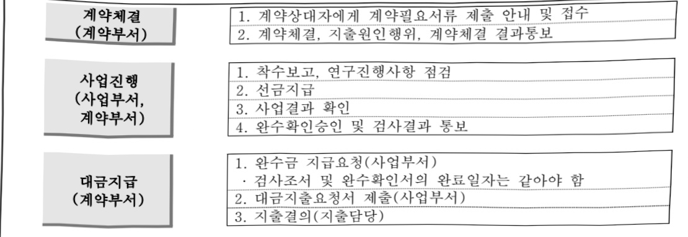

# 국가통합바이오빅데이터구축사업Ⅱ(R&D)

**해당 페이지**: PDF 4871 ~ 4881 쪽 해당

**부처**: 질병관리청
**분야**: 보건
**회계유형**: 일반회계
**2026 확정예산**: 19949.0 백만원
**전년대비 증감률**: 1502.3%
**AI 도메인**: 데이터, 의료/바이오

---

### 가. 예산 총괄표

(단위:백만원,%)

<table border=1 style='margin: auto; word-wrap: break-word;'><tr><td rowspan="2">사업명</td><td rowspan="2">2024년 결산</td><td colspan="2">2025년 예산</td><td colspan="2">2026년</td><td rowspan="2">증감 (B-A)</td><td rowspan="2">(B-A)/A</td></tr><tr><td style='text-align: center; word-wrap: break-word;'>본예산(A)</td><td style='text-align: center; word-wrap: break-word;'>추경</td><td style='text-align: center; word-wrap: break-word;'>정부안</td><td style='text-align: center; word-wrap: break-word;'>확정(B)</td></tr><tr><td style='text-align: center; word-wrap: break-word;'>국가통합바이오빅데이터구축사업Ⅱ(R&amp;D)</td><td style='text-align: center; word-wrap: break-word;'>174.7</td><td style='text-align: center; word-wrap: break-word;'>1,245</td><td style='text-align: center; word-wrap: break-word;'>1,245</td><td style='text-align: center; word-wrap: break-word;'>19,949</td><td style='text-align: center; word-wrap: break-word;'>19,949</td><td style='text-align: center; word-wrap: break-word;'>18,704</td><td style='text-align: center; word-wrap: break-word;'>1,502.3</td></tr></table>

□ 기능별(내역사업별), 목별 예산 내역

(단위:백만원)

<table border=1 style='margin: auto; word-wrap: break-word;'><tr><td rowspan="3"></td><td colspan="5">2024</td><td colspan="7">2025(2025.12.11)</td><td rowspan="3">2026</td></tr><tr><td rowspan="2">예산액(추경)</td><td rowspan="2">예산현액</td><td rowspan="2">집행액[실집행액]</td><td rowspan="2">이일액</td><td rowspan="2">불용액</td><td rowspan="2">본예산</td><td rowspan="2">예산현액</td><td rowspan="2">집행액[실집행액]</td><td colspan="2">전년도 이일액제외</td><td rowspan="2">이일예상액</td><td rowspan="2">불용예상액</td></tr><tr><td style='text-align: center; word-wrap: break-word;'>예산현액</td><td style='text-align: center; word-wrap: break-word;'>집행액[실집행액]</td></tr><tr><td style='text-align: center; word-wrap: break-word;'>○ 기능별 분류(합계)</td><td style='text-align: center; word-wrap: break-word;'>1,157</td><td style='text-align: center; word-wrap: break-word;'>1,157</td><td style='text-align: center; word-wrap: break-word;'>174.7[174.7]</td><td style='text-align: center; word-wrap: break-word;'>767.8</td><td style='text-align: center; word-wrap: break-word;'>214.5</td><td style='text-align: center; word-wrap: break-word;'>1,245</td><td style='text-align: center; word-wrap: break-word;'>2,012.7</td><td style='text-align: center; word-wrap: break-word;'>1,482.3[1,482.3]</td><td style='text-align: center; word-wrap: break-word;'>1,245</td><td style='text-align: center; word-wrap: break-word;'>1,154.8[1,154.8]</td><td style='text-align: center; word-wrap: break-word;'>45.3</td><td style='text-align: center; word-wrap: break-word;'>485.1</td><td style='text-align: center; word-wrap: break-word;'>19,949</td></tr><tr><td style='text-align: center; word-wrap: break-word;'>·바이오·빅데이터인체융래물·바이오뱅킹</td><td style='text-align: center; word-wrap: break-word;'>1,157</td><td style='text-align: center; word-wrap: break-word;'>1,157</td><td style='text-align: center; word-wrap: break-word;'>174.7[174.7]</td><td style='text-align: center; word-wrap: break-word;'>767.8</td><td style='text-align: center; word-wrap: break-word;'>214.5</td><td style='text-align: center; word-wrap: break-word;'>1,245</td><td style='text-align: center; word-wrap: break-word;'>2,012.7</td><td style='text-align: center; word-wrap: break-word;'>1,482.3[1,482.3]</td><td style='text-align: center; word-wrap: break-word;'>1,245</td><td style='text-align: center; word-wrap: break-word;'>1,154.8[1,154.8]</td><td style='text-align: center; word-wrap: break-word;'>45.3</td><td style='text-align: center; word-wrap: break-word;'>485.1</td><td style='text-align: center; word-wrap: break-word;'>19,949</td></tr><tr><td style='text-align: center; word-wrap: break-word;'>○ 비목별 분류(합계)</td><td style='text-align: center; word-wrap: break-word;'>1,157</td><td style='text-align: center; word-wrap: break-word;'>1,157</td><td style='text-align: center; word-wrap: break-word;'>174.7[174.7]</td><td style='text-align: center; word-wrap: break-word;'>767.8</td><td style='text-align: center; word-wrap: break-word;'>214.5</td><td style='text-align: center; word-wrap: break-word;'>1,245</td><td style='text-align: center; word-wrap: break-word;'>2,012.7</td><td style='text-align: center; word-wrap: break-word;'>1,482.3[1,482.3]</td><td style='text-align: center; word-wrap: break-word;'>1,245</td><td style='text-align: center; word-wrap: break-word;'>1,154.8[1,154.8]</td><td style='text-align: center; word-wrap: break-word;'>45.3</td><td style='text-align: center; word-wrap: break-word;'>485.1</td><td style='text-align: center; word-wrap: break-word;'>19,949</td></tr><tr><td style='text-align: center; word-wrap: break-word;'>·시험연구비(210-13)</td><td style='text-align: center; word-wrap: break-word;'>213</td><td style='text-align: center; word-wrap: break-word;'>213</td><td style='text-align: center; word-wrap: break-word;'>63.3[63.3]</td><td rowspan="4">287.8</td><td rowspan="4">34.2</td><td rowspan="4">170</td><td rowspan="4">287.7</td><td rowspan="4">256.2</td><td rowspan="4">770</td><td rowspan="4">695</td><td rowspan="4">45.3</td><td rowspan="4">29.7</td><td rowspan="4">319</td></tr><tr><td style='text-align: center; word-wrap: break-word;'>·관리용역비(210-15)</td><td rowspan="2">104</td><td rowspan="2">104</td><td rowspan="2">90.9[90.9]</td></tr><tr><td style='text-align: center; word-wrap: break-word;'>·일반연구비(260-01)</td></tr><tr><td style='text-align: center; word-wrap: break-word;'>·기본조사설계비(420-01)</td><td style='text-align: center; word-wrap: break-word;'>332</td><td style='text-align: center; word-wrap: break-word;'>332</td><td style='text-align: center; word-wrap: break-word;'>10[10]</td></tr><tr><td style='text-align: center; word-wrap: break-word;'>·실시설계비(420-02)</td><td rowspan="3">497</td><td rowspan="3">497</td><td rowspan="3">480</td><td rowspan="3">17</td><td rowspan="3">5</td><td rowspan="3">5</td><td rowspan="3">5</td><td rowspan="3">5</td><td rowspan="3">5</td><td rowspan="3">5</td><td rowspan="3">408.7</td><td rowspan="3">409</td><td rowspan="3">84</td></tr><tr><td style='text-align: center; word-wrap: break-word;'>·공사비(420-03)</td></tr><tr><td style='text-align: center; word-wrap: break-word;'>·감리비(420-04)</td></tr><tr><td style='text-align: center; word-wrap: break-word;'>·시설부대비(420-05)</td><td rowspan="2">11</td><td rowspan="2">11</td><td rowspan="2">10.5[10.5]</td><td rowspan="2">0.5</td><td rowspan="2">5</td><td rowspan="2">5</td><td rowspan="2">5</td><td rowspan="2">5</td><td rowspan="2">5</td><td rowspan="2">5</td><td rowspan="2">45.3</td><td rowspan="2">485.1</td><td rowspan="2">19,949</td></tr><tr><td style='text-align: center; word-wrap: break-word;'>·자산취득비(430-01)</td></tr><tr><td style='text-align: center; word-wrap: break-word;'>○ 기능비목별 분류합계)</td><td style='text-align: center; word-wrap: break-word;'>1,157</td><td style='text-align: center; word-wrap: break-word;'>1,157</td><td style='text-align: center; word-wrap: break-word;'>174.7[174.7]</td><td style='text-align: center; word-wrap: break-word;'>767.8</td><td style='text-align: center; word-wrap: break-word;'>214.5</td><td style='text-align: center; word-wrap: break-word;'>1,245</td><td style='text-align: center; word-wrap: break-word;'>2,012.7</td><td style='text-align: center; word-wrap: break-word;'>1,482.3[1,482.3]</td><td style='text-align: center; word-wrap: break-word;'>1,245</td><td style='text-align: center; word-wrap: break-word;'>1,154.8[1,154.8]</td><td style='text-align: center; word-wrap: break-word;'>45.3</td><td style='text-align: center; word-wrap: break-word;'>485.1</td><td style='text-align: center; word-wrap: break-word;'>19,949</td></tr><tr><td style='text-align: center; word-wrap: break-word;'>·바이오·빅데이터인체육래물·바이오뱅킹</td><td style='text-align: center; word-wrap: break-word;'>1,157</td><td style='text-align: center; word-wrap: break-word;'>1,157</td><td style='text-align: center; word-wrap: break-word;'>174.7[174.7]</td><td rowspan="4">767.8</td><td rowspan="4">214.5</td><td rowspan="4">1,245</td><td rowspan="4">2,012.7</td><td rowspan="4">1,482.3[1,482.3]</td><td rowspan="4">1,245</td><td rowspan="4">1,154.8[1,154.8]</td><td rowspan="4">45.3</td><td rowspan="4">485.1</td><td rowspan="4">19,949</td></tr><tr><td style='text-align: center; word-wrap: break-word;'>·시험연구비(210-13)</td><td style='text-align: center; word-wrap: break-word;'>213</td><td style='text-align: center; word-wrap: break-word;'>213</td><td style='text-align: center; word-wrap: break-word;'>63.3[63.3]</td></tr><tr><td style='text-align: center; word-wrap: break-word;'>·관리용역비(210-15)</td><td rowspan="2">104</td><td rowspan="2">104</td><td rowspan="2">90.9[90.9]</td></tr><tr><td style='text-align: center; word-wrap: break-word;'>·일반연구비(260-01)</td></tr><tr><td style='text-align: center; word-wrap: break-word;'>·기본조사설계(420-01)</td><td style='text-align: center; word-wrap: break-word;'>332</td><td style='text-align: center; word-wrap: break-word;'>332</td><td style='text-align: center; word-wrap: break-word;'>10[10]</td><td style='text-align: center; word-wrap: break-word;'>287.8</td><td style='text-align: center; word-wrap: break-word;'>34.2</td><td style='text-align: center; word-wrap: break-word;'>170</td><td style='text-align: center; word-wrap: break-word;'>287.7</td><td style='text-align: center; word-wrap: break-word;'>256.2</td><td style='text-align: center; word-wrap: break-word;'>770</td><td style='text-align: center; word-wrap: break-word;'>695</td><td style='text-align: center; word-wrap: break-word;'>45.3</td><td style='text-align: center; word-wrap: break-word;'>29.7</td><td style='text-align: center; word-wrap: break-word;'>230</td></tr></table>

---

<table border=1 style='margin: auto; word-wrap: break-word;'><tr><td rowspan="3"></td><td colspan="5">2024</td><td colspan="7">2025(2025.12월 말)</td><td rowspan="3">2026예산</td></tr><tr><td rowspan="2">예산액(추경)</td><td rowspan="2">예산현액</td><td rowspan="2">집행액[실집행액]</td><td rowspan="2">이월액</td><td rowspan="2">불용액</td><td rowspan="2">본예산</td><td rowspan="2">예산현액</td><td rowspan="2">집행액[실집행액]</td><td colspan="2">전년도 이월액제외</td><td rowspan="2">이월예상액</td><td rowspan="2">불용예상액</td></tr><tr><td style='text-align: center; word-wrap: break-word;'>예산현액</td><td style='text-align: center; word-wrap: break-word;'>집행액[실집행액]</td></tr><tr><td rowspan="2">-실시설계비(420-02)-공사비(420-03)-감리비(420-04)-시설부대비(420-05)-자산취득비(430-01)</td><td style='text-align: center; word-wrap: break-word;'>497</td><td style='text-align: center; word-wrap: break-word;'>497</td><td style='text-align: center; word-wrap: break-word;'></td><td style='text-align: center; word-wrap: break-word;'>480</td><td style='text-align: center; word-wrap: break-word;'>17</td><td style='text-align: center; word-wrap: break-word;'></td><td style='text-align: center; word-wrap: break-word;'>480</td><td style='text-align: center; word-wrap: break-word;'>71.3</td><td style='text-align: center; word-wrap: break-word;'></td><td style='text-align: center; word-wrap: break-word;'></td><td style='text-align: center; word-wrap: break-word;'></td><td style='text-align: center; word-wrap: break-word;'>408.7</td><td rowspan="2">4098416918,700</td></tr><tr><td style='text-align: center; word-wrap: break-word;'>11</td><td style='text-align: center; word-wrap: break-word;'>11</td><td style='text-align: center; word-wrap: break-word;'>10.5[10.5]</td><td style='text-align: center; word-wrap: break-word;'></td><td style='text-align: center; word-wrap: break-word;'>0.5</td><td style='text-align: center; word-wrap: break-word;'>5</td><td style='text-align: center; word-wrap: break-word;'>5</td><td style='text-align: center; word-wrap: break-word;'>5</td><td style='text-align: center; word-wrap: break-word;'>5</td><td style='text-align: center; word-wrap: break-word;'>5</td><td style='text-align: center; word-wrap: break-word;'></td><td style='text-align: center; word-wrap: break-word;'></td></tr></table>

### 나. 사업설명자료

## 1 ) 사업목적·내용

- (국가통합바이오빅데이터구축사업Ⅱ) 국가경쟁력을 책임질 바이오 분야 핵심 연구

자원 확보 및 질환 원인 규명·미래 의료기술 개발로 환자 편의 증대 등을 위해 국가

통합 바이오 빅데이터 구축사업에서 개인 동의 기반으로 수집한 인체유래물을 저장

관리할 수 있는 바이오뱅크 시설 구축 및 국가 통합 바이오 빅데이터 구축 사업에서

수집한 인체유래물을 안정적으로 관리하여 보건의료 R&D 연구 지원

- (바이오 빅데이터 인체유래물 바이오뱅킹) 국가 통합 바이오 빅데이터 구축사업

추진에 따른 100만 명분 인체자원 저장 및 관리를 위한 저장시설 증축, 임시저장시설

운영 및 인체자원 관리

## 2 ) 사업개요

## ☐ 사업근거 및 추진경위

① 법령상 근거 및 조항 적시

0 과학기술기본법 제11조(국가연구개발사업의 추진)

제11조(국가연구개발사업의 추진) ① 중앙행정기관의 장은 기본계획에 따라

맡은 분야의 국가연구개발사업과 그 시책을 세워 추진하여야 한다. <개정

2014. 5. 28.>

---

° 국정과제 25-4(바이오 헬스·디지털 헬스케어 혁신/ 보건의료 빅데이터 구축으로 정밀의료 활성화)

백만 명 규모 임상·유전체·공공 보건의료 정보 등을 기반으로 국가 통합 바이오 빅데이터 구축·개방 통한 정밀의료 연구개발 촉진

○ 과학기술기본법 제11조의 1, 제5차 과학기술기본계획(23~27), 제3차 국가생명연구자원 관리 활용 기본계획('20~'25), 제3차 보건의료기술육성기본계획(23~27)

- 과학기술기본법 제11조(국가연구개발사업의 추진) ① 중앙행정기관의 장은 기본계획에 따라 맡은 분야의 국가연구개발사업과 그 시책을 세워 추진하여야 한다.

- 제5차 과학기술기본계획(23~27): 중점 육성기술(전략기술), 12대 핵심 국가 전략기술(첨단바이오/한국인 특유 유전체·바이오빅데이터 구축)

- 제3차 국가생명연구자원 관리 활용 기본계획('20~'25): 수요자 맞춤형 바이오 소재 활용 촉진(전략2), 관계 부처가 협력하여 14대 소재 클러스터 육성(2-1)

- 제3차 보건의료기술육성기본계획('23~'27): 바이오헬스 강국 도약을 위한 신산업 육성(전략3), 디지털 헬스케어 혁신/빅데이터 기반의 바이오헬스 경쟁력 강화

- 비상경제민생회의(22.7., VIP보고)

- 정밀의료 인프라 확보 위한 보건의료 빅데이터 구축

- 정밀의료 연구개발의 핵심 인프라인 '국가 통합 바이오 빅데이터' 구축(100만 명 목표)으로 국민건강 증진, 산업적 활용 기반 강화

- 비상경제민생회의(22.10., VIP보고)

- 환자에게 최적의 치료 제공을 위한 바이오 빅데이터 구축·활용 추진

- 인구구조 변화와 대응방안(22.12., 기재부)

- 범부처 기획으로 100만 명 규모 임상정보, 유전체 데이터, 개인건강정보 등 정밀 의료 연구자원 구축 추진

신성장 4.0프로젝트(23.1. 기재부)

- [12] (바이오 혁신) 바이오 파운드리, 바이오 데이터뱅크 구축

ㅇ 서비스 산업 혁신전략(23.1. 기재부)

-100만명 규모의 국가 통합 바이오 빅데이터 구축 추진

- ③ (데이터뱅크) 국가 통합 바이오 빅데이터 구축 및 개방

: 임상정보·유전체 데이터, 공공데이터 및 라이프로그 등을 통합한 바이오 빅데이터 구축개방

- 제3차 제약바이오산업 육성지원 종합계획(23.3.)

- ① 국가 통합 바이오 빅데이터 구축으로 신약개발·정밀의료 실현

: 100만명 규모 유전체 바이오 빅데이터 구축으로 신약 개발, 정밀의료 등 질병

극복·산업발전 연구에 활용

제4회 이끼기가사업 육성지원 조합계획

° 제1차 의료기기산업 육성지원 종합계획 (23.3.)

- ② (빅데이터 구축·활용) 새로운 의료기술 발굴 및 개발을 통한 혁신

가속화를 위해 보건의료 빅데이터 활용 인프라 조성(복지·과기·산업·질병청)

: (바이오 빅데이터) 100만명 규모 임상·유전체 데이터 기반의 통합 바이오 빅데이터 구축으로 질병극복·산업발전 연구에 활용

° 첨단산업 클러스터 육성방안(23.6., VIP보고)

- 국가 통합 바이오 빅데이터 구축 및 개방

°「데이터경제 활성화 방안」(23.11., 기재부)

- 국가 통합 바이오 빅데이터 구축시, '공공-임상-유전체-라이프로그' 데이터를 개인단위로 연결하여 구축

°「24차 민생토론회」- 첨단바이오 육성방안('24.3.26., VIP보고)

---

<table border=1 style='margin: auto; word-wrap: break-word;'><tr><td style='text-align: center; word-wrap: break-word;'></td><td style='text-align: center; word-wrap: break-word;'>- 부처간 협업을 통해 국가 바이오 데이터 플랫폼을 구축하고, 의료데이터 활용이 활성화 될 수 있도록 적극 지원○ 바이오·헬스 데이터플랫폼 협의체(24.4.16., 과기부) - 공공 및 민간에서 개별적으로 구축(구축 중)한 바이오·헬스 데이터를 연계·활용하여 성과창출을 논의하기 위한 산·학·연·병·정 협의체 운영</td></tr><tr><td style='text-align: center; word-wrap: break-word;'>추진경위</td><td style='text-align: center; word-wrap: break-word;'>○ (추진배경) 의료 패러다임의 변화와 신성장동력으로서 바이오 빅데이터 중요성 대두, 데이터 파편화 및 개인정보 활용 제한 등으로 부가가치 창출 한계 - 신약개발 등 정밀의료 및 산업적 연구 활성화를 위한 바이오 빅데이터 구축을 통해 R&amp;D 인프라로 활용 필요○ (시범사업 수행) 과학기술장관회의에서 범부처 과제로 국가 바이오 빅데이터 구축 결정, 본 사업에 앞서 시범사업 추진·종료(&#x27;20~&#x27;22년) - 총 2.5만명 규모의 임상·유전체 데이터 구축·개방(&#x27;23.6월~)○ (예비타당성조사) 부처 대면회의(&#x27;22.9.23.)와 총괄위원회 자문(&#x27;22.10.31.)을 통해 예타 대상사업 선정(&#x27;22.11.1.), 예타 조사 결과 확정(&#x27;23.6.29)* 9년 사업을 2단계(5+4)로 분할, 1단계(&#x27;24~&#x27;28년) 77.2만명 규모 사업 추진</td></tr></table>

## □ 주요내용

① 사업규모

- 총사업비(해당되는 경우에만 기재) : 62,441백만원

- 사업기간 : 2024년~2028년

-최근 5년 간 투입된 사업비(예산액기준, 추경편성한 연도에는 추경포함)

<table border=1 style='margin: auto; word-wrap: break-word;'><tr><td style='text-align: center; word-wrap: break-word;'>$ \underline{\text{연도}} $</td><td style='text-align: center; word-wrap: break-word;'>2022</td><td style='text-align: center; word-wrap: break-word;'>2023</td><td style='text-align: center; word-wrap: break-word;'>2024</td><td style='text-align: center; word-wrap: break-word;'>2025</td><td style='text-align: center; word-wrap: break-word;'>2026</td></tr><tr><td style='text-align: center; word-wrap: break-word;'>사업비</td><td style='text-align: center; word-wrap: break-word;'>-</td><td style='text-align: center; word-wrap: break-word;'>-</td><td style='text-align: center; word-wrap: break-word;'>1,157</td><td style='text-align: center; word-wrap: break-word;'>1,245</td><td style='text-align: center; word-wrap: break-word;'>19,949</td></tr></table>

- 기타 : 인체자원 저장시설 증축 규모

○ 부지 16,529 m², 연면적 5,143.42 m² (지하1층, 지상3층 예정)

## ② 사업추진체계

- 사업시행방법 : 직접수행

- 사업시행주체 : 질병관리청

- 사업 수혜자 : 희귀·중증질환자, 참여자, 국내 보건의료 연구자, 기업 등

- 보조, 융자, 출연, 출자 등의 경우 보조·융자 등 지원 비율 및 법적근거 : 해당없음

---

3) 2026년도 예산 산출 근거

< 국가 통합 바이오 빅데이터 구축 사업Ⅱ(R&D): (2025) 1,245 → (2026) 19,949 백만원, (+1,502.3%)

① 바이오 빅데이터 인체유래물 바이오뱅킹 : (25) 1,245백만원 → (26) 19,949백만원 +1,502.3%

- 대규모 국가사업인 ‘국가 통합 바이오 빅데이터 구축사업’ 추진에 따른 인체자원 저장시설 증축 및 임시저장시설 운영을 위해 '26년 19,949백만원 반영

- (산출)

1. 인체자원 저상시설 구축 : (‘25) 5백만원 → (‘26) 19,250백만원(+19,245백만원)

* 국립중앙인체자원은행 인체자원관리시설 증축 : (‘25년) 5백만원 → (‘26년) 19,250백만원

· 대형자동화초저온저장장비: 37,400백만 x 2대 x 50%(선금) = 18,700백만원

· 인체자원은행 기본실시설계: 32백만(기본설계)+409백만(실시설계) = 441백만원

· 인체자원은행 증축(계약): 84백만(건축) + 16백만(감리) = 100백만원

· 설계적정성 평가비: 4.5백만 x 2회 = 9백만원

2. 인체자원 저장시설 운영 : (25) 700백만원 → (26) 699백만원(△1백만원)

* 인체자원 관리용역 : 1개과제 × 150백만 × 12/12개월 = 150 백만원

* 인체자원 저장시설 운영 : 319백만원

· 액체질소 구매비: 액체질소 150,000kg/월 × 178원/kg × 12/12개월 = 319백만원

* 인체자원 정보관리시스템 유지보수 : 1개사업 x 230백만 x 12/12개월 = 230백만원

< 산출근거 >

<table border=1 style='margin: auto; word-wrap: break-word;'><tr><td colspan="2">구 분</td><td style='text-align: center; word-wrap: break-word;'>산정비용</td></tr><tr><td rowspan="3">HuBIS_Sam 기능개선 (자원관리) 인건비</td><td style='text-align: center; word-wrap: break-word;'>참여자관리시스템, 플랜트급 저장장비와 데이터 연계를 위한 데이터베이스 구조 변경</td><td rowspan="3">34.8백만원</td></tr><tr><td style='text-align: center; word-wrap: break-word;'>기능 개선(대량 자원입고)</td></tr><tr><td style='text-align: center; word-wrap: break-word;'>디자인 개선 개선(대량 자원입고)</td></tr><tr><td rowspan="3">HuBIS_Tracker 기능개선 (기탁이력관리) 인건비</td><td style='text-align: center; word-wrap: break-word;'>참여자관리스스템, 플랜트급 저장장비와 데이터 연계를 위한 데이터베이스 구조 변경</td><td rowspan="3">30.7백만원</td></tr><tr><td style='text-align: center; word-wrap: break-word;'>기능 개선(대량 자원입고)</td></tr><tr><td style='text-align: center; word-wrap: break-word;'>디자인 개선 개선(대량 자원입고)</td></tr><tr><td style='text-align: center; word-wrap: break-word;'>제경비</td><td style='text-align: center; word-wrap: break-word;'>직접인건비의 140~150%</td><td style='text-align: center; word-wrap: break-word;'>95백만원</td></tr><tr><td style='text-align: center; word-wrap: break-word;'>기술료</td><td style='text-align: center; word-wrap: break-word;'>(직접인건비 + 제경비)의 20~40%</td><td style='text-align: center; word-wrap: break-word;'>48백만원</td></tr><tr><td style='text-align: center; word-wrap: break-word;'>부가가치세</td><td style='text-align: center; word-wrap: break-word;'></td><td style='text-align: center; word-wrap: break-word;'>21백만원</td></tr><tr><td colspan="2">합 계</td><td style='text-align: center; word-wrap: break-word;'>230백만원</td></tr></table>

* 운영 가능한 최소 기준으로 책정, 본 운영 개시('23.11월 ~ )

**본 운영 이후, 안정적 성능유지에 필요한 추가 서버(WEB, WAS, DB 1조), 개발·검증 서버 추가, 민간 인체유래물은행 HuBIS Sam 클라우드 서비스(시범) 등 대응 비

---

3. (신규)인체자원 품질관리 : (25) 540 → (26) 0 (순감)

2025년도 및 2026년도 예산 산출 세부내역 비교

<table border=1 style='margin: auto; word-wrap: break-word;'><tr><td colspan="2">&#x27;25년 예산</td><td colspan="2">&#x27;26년 예산</td></tr><tr><td style='text-align: center; word-wrap: break-word;'>예산</td><td style='text-align: center; word-wrap: break-word;'>산출내역</td><td style='text-align: center; word-wrap: break-word;'>예산</td><td style='text-align: center; word-wrap: break-word;'>산출내역</td></tr><tr><td style='text-align: center; word-wrap: break-word;'>1,245,000</td><td style='text-align: center; word-wrap: break-word;'>○ 시험연구비(210-13): 320,000천원가. 인체자원 임시저장시설 운영 (320,400천원) • 액체질소 구매비: 26700천원/1개월×12개월=320,000○ 관리용역비(210-15): 150,000천원가. 인체자원 임시저장시설 운영(150,000천원) • 인체자원 관리용역 1개 과제 150,000천원×12/12 개월=150,000천원○ 일반연구비(260-01): 770,000천원가. 인체자원 임시저장시설 운영(230,000천원) • 인체자원 정보관리시스템 유지보수 1개과제×230,000천원×12/12 개월=230,000천원나. 인체자원 품질관리(540,000천원) • 인체자원 품질관리 1개과제×540,000천원×12/12 개월=540,000천원</td><td style='text-align: center; word-wrap: break-word;'>19,949,000</td><td style='text-align: center; word-wrap: break-word;'>○ 시험연구비(210-13): 319,000천원가. 인체자원 임시저장시설 운영 (319,000천원) • 액체질소 구매비: 26600천원/1개월×12개월=319,000○ 관리용역비(210-15): 150,000천원가. 인체자원 임시저장시설 운영(150,000천원) • 인체자원 관리용역 1개 과제 150,000천원×12/12 개월=150,000천원○ 일반연구비(260-01): 230,000천원가. 인체자원 임시저장시설 운영(230,000천원) • 인체자원 정보관리시스템 유지보수 1개과제×230,000천원×12/12 개월=230,000천원○ 기본조사설계비(420-01): 32,000천원가. 인체자원 저장시설 구축 • 기본조사설계비 32,000천원○ 실시설계비(420-02): 409,000천원가. 인체자원 저장시설 구축 • 실시설계비 409,000천원○ 공사비(420-03): 84,000천원가. 인체자원은행 증축(계약) • 증축 공사비 84,000천원○ 감리비(420-04): 16,000천원가. 인체자원은행 증축(계약) • 증축 감리비 16,000천원○ 시설부대비(420-05): 9,000천원가. 인체자원 저장시설 설계평가 • 설계적정성평가 × 4,000천원×2 = 9000천원○ 자산취득비(430-01): 18,700,000천원가. 인체자원 저장장비 도입 • 18,700,000천원×1대 = 18,700,000천원</td></tr></table>

---

## 4 ) 사업효과

☐ 사업영향, 산출물 성과지표 등

① 2022~2026년도 성과계획서 상 성과지표 및 최근 5년간 성과 달성도

<table border=1 style='margin: auto; word-wrap: break-word;'><tr><td style='text-align: center; word-wrap: break-word;'>성과지표</td><td style='text-align: center; word-wrap: break-word;'>구분</td><td style='text-align: center; word-wrap: break-word;'>2022</td><td style='text-align: center; word-wrap: break-word;'>2023</td><td style='text-align: center; word-wrap: break-word;'>2024</td><td style='text-align: center; word-wrap: break-word;'>2025</td><td style='text-align: center; word-wrap: break-word;'>2026</td><td style='text-align: center; word-wrap: break-word;'>2026 목표치산출근거</td><td style='text-align: center; word-wrap: break-word;'>측정산식(또는 측정방법)</td><td style='text-align: center; word-wrap: break-word;'>자료수집방법(또는 자료출처)</td></tr><tr><td rowspan="3">국립중앙인체자원은행 저장시설 증축공정율(단위: % )</td><td style='text-align: center; word-wrap: break-word;'>목표</td><td style='text-align: center; word-wrap: break-word;'>-</td><td style='text-align: center; word-wrap: break-word;'>4%</td><td style='text-align: center; word-wrap: break-word;'>4.5%</td><td style='text-align: center; word-wrap: break-word;'>5%</td><td rowspan="3">-</td><td rowspan="3">국립중앙인체자원은행 저장시설 증축공정율을 목표치로 선정</td><td rowspan="3">(누적투자액/총사업비)x100</td><td rowspan="3">예산집행현황(디브레인)</td></tr><tr><td style='text-align: center; word-wrap: break-word;'>실적</td><td style='text-align: center; word-wrap: break-word;'>-</td><td style='text-align: center; word-wrap: break-word;'>4.3%</td><td style='text-align: center; word-wrap: break-word;'>-</td><td style='text-align: center; word-wrap: break-word;'>-</td></tr><tr><td style='text-align: center; word-wrap: break-word;'>달성도</td><td style='text-align: center; word-wrap: break-word;'>-</td><td style='text-align: center; word-wrap: break-word;'>107.5%</td><td style='text-align: center; word-wrap: break-word;'>-</td><td style='text-align: center; word-wrap: break-word;'>-</td></tr></table>

② 성과지표 이외의 연도별 사업추진 경과 및 실적

<table border=1 style='margin: auto; word-wrap: break-word;'><tr><td style='text-align: center; word-wrap: break-word;'>2024</td><td style='text-align: center; word-wrap: break-word;'>- 총사업비 대상등록(&#x27;24.1월) - 국립중앙인체자원은행 인체자원 관리시설 증축 공사 조달청 맞춤형서비스 체결(&#x27;24.2월) - 국립중앙인체자원은행 인체자원 관리시설 증축 기본계획 고시(&#x27;24년 5월) - 국립중앙인체자원은행 인체자원 관리시설 증축 공공건축심의(&#x27;24년 6월) - 임시저장시설 접수실 및 저장실 구축(&#x27;24년 8월) - 국립중앙인체자원은행 인체자원 관리시설 설계용역 공고 및 공모안 접수(&#x27;24년 8월) - 국립중앙인체자원은행 인체자원 관리시설 설계용역 착수(&#x27;24년 9월) 및 계획설계 완료(&#x27;24년 12월)</td></tr><tr><td style='text-align: center; word-wrap: break-word;'>2025</td><td style='text-align: center; word-wrap: break-word;'>- 「총사업비 관리지침」규정에 따라 설계용역 낙찰차액 발생으로 총사업비 감액(58,033 → 58,020백만원)(&#x27;25년 1월) - 중간설계완료(&#x27;25년 5월) 및 설계적정성 검토(VE포함) 완료(&#x27;25년9월) - 총사업비 조정 결과 통보, 물가변동·연약지반처리·소방방재시설 강화에 대한 4,421백만원 증액(58,020백만원→)(&#x27;25년 11월) - 교통영향평가 사전심의 및 실시설계 착수(&#x27;25년 11월)</td></tr></table>

## ③향후(2026년도 이후)기대효과

- 국가 통합 바이오 빅데이터 구축사업에서 수집한 인체유래물 연구자원을 안정적으로 저장 ·관리할 수 있는 저장시설 구축 및 운영을 통한 바이오뱅크 고도화

- 국가경쟁력을 책임질 바이오 분야 핵심 연구자원 확보 및 제공으로 질환 원인

규명 및 미래 의료기술 개발로 환자 편의 증대

## 5 ) 타당성조사 및 예비타당성조사 시행여부 및 결과 요지

☐ 예비타당성조사 통과('23.6월)

-조사기관:한국과학기술기획평가원(KISTEP)

- 조사결과 : 대안시행(B/C 비율 : 0.69)

---

기술평가실시

기술+가격점수로 순위결정

기술협상 개시

나라장터 공고 및 제안서 접수

제안서평가

(사업부서)

입찰공고

(계약부서)

예산확보,사업계획,제안요청서 등을 작성하여 계약부서로 계

암음

융벽

계약요청

(사업부서)

업무제목

(담당)

-바이오 빅데이터 인체유래물 바이오뱅킹 내역사업 : 질병관리청 직접수행

7) 사업 집행절차

<table border=1 style='margin: auto; word-wrap: break-word;'><tr><td rowspan="2">구분</td><td rowspan="2">변경연도</td><td colspan="2">총사업비</td><td colspan="2">사업기간</td><td style='text-align: center; word-wrap: break-word;'>변경사유 및 내역</td></tr><tr><td style='text-align: center; word-wrap: break-word;'>당초</td><td style='text-align: center; word-wrap: break-word;'>변경</td><td style='text-align: center; word-wrap: break-word;'>착수연도</td><td style='text-align: center; word-wrap: break-word;'>완료연도</td><td style='text-align: center; word-wrap: break-word;'></td></tr><tr><td style='text-align: center; word-wrap: break-word;'>최초</td><td style='text-align: center; word-wrap: break-word;'>2024</td><td colspan="2">58.033</td><td style='text-align: center; word-wrap: break-word;'>2024</td><td style='text-align: center; word-wrap: break-word;'>2028</td><td style='text-align: center; word-wrap: break-word;'></td></tr><tr><td style='text-align: center; word-wrap: break-word;'>(1)차 변경</td><td style='text-align: center; word-wrap: break-word;'>2025</td><td rowspan="2">☑</td><td style='text-align: center; word-wrap: break-word;'>58.02</td><td style='text-align: center; word-wrap: break-word;'>2024</td><td style='text-align: center; word-wrap: break-word;'>2028</td><td style='text-align: center; word-wrap: break-word;'>설계비 낙찰차액 감액</td></tr><tr><td style='text-align: center; word-wrap: break-word;'>(2)차 변경</td><td style='text-align: center; word-wrap: break-word;'>2025</td><td style='text-align: center; word-wrap: break-word;'>62.441</td><td style='text-align: center; word-wrap: break-word;'>2024</td><td style='text-align: center; word-wrap: break-word;'>2028</td><td style='text-align: center; word-wrap: break-word;'>물가변동, 소방방재시설 등 반영</td></tr><tr><td colspan="2">2026년도</td><td colspan="2">192.5</td><td style='text-align: center; word-wrap: break-word;'>2024</td><td style='text-align: center; word-wrap: break-word;'>2028</td><td style='text-align: center; word-wrap: break-word;'></td></tr></table>

(단위: 억원)

☐ 총사업비 변경내역(변경일자 및 규모, 변경사유)

<table border=1 style='margin: auto; word-wrap: break-word;'><tr><td style='text-align: center; word-wrap: break-word;'>연도</td><td style='text-align: center; word-wrap: break-word;'>사업기간</td><td style='text-align: center; word-wrap: break-word;'>2022까지 기투자액</td><td style='text-align: center; word-wrap: break-word;'>2023</td><td style='text-align: center; word-wrap: break-word;'>2024</td><td style='text-align: center; word-wrap: break-word;'>2025</td><td style='text-align: center; word-wrap: break-word;'>2026</td><td style='text-align: center; word-wrap: break-word;'>2027이후 투자계획</td><td style='text-align: center; word-wrap: break-word;'>계</td></tr><tr><td style='text-align: center; word-wrap: break-word;'>사업비</td><td style='text-align: center; word-wrap: break-word;'>2024~2028</td><td style='text-align: center; word-wrap: break-word;'>-</td><td style='text-align: center; word-wrap: break-word;'>-</td><td style='text-align: center; word-wrap: break-word;'>8.4</td><td style='text-align: center; word-wrap: break-word;'>0.05</td><td style='text-align: center; word-wrap: break-word;'>192.5</td><td style='text-align: center; word-wrap: break-word;'>409.09</td><td style='text-align: center; word-wrap: break-word;'>628.95</td></tr></table>

(단위: 억원)

☐ 총사업비 정보

- 총사업비 관리 대상 사업인 경우 작성

6) 총사업비 대상사업 여부 및 내역

- 총사업비 : 국고 6,065.8억 원

-사업기간:‘24년 ~‘28년(5년)

* 예비타당성조사 결과 100만 명 규모의 9년 사업을 2단계(5년+4년)로 분할하여 1단계 사업을 5년간('24~'28년, 6,065.8억) 77.2만 명 규모로 우선 추진

---

## 8 ) 각종 평가

<table border=1 style='margin: auto; word-wrap: break-word;'><tr><td style='text-align: center; word-wrap: break-word;'>1) 국회 상임위 지적</td></tr><tr><td style='text-align: center; word-wrap: break-word;'>○ 총사업비 협의전 예타 결과를 이용하여 적정설계비에 추가편성된 263백만원 감액 및 추진시기 고려 인체자원 운영시설 운영 9개월에서 6개월로 단축 필요(상임위, 24예산)</td></tr><tr><td style='text-align: center; word-wrap: break-word;'>2) 국회 예결위 부대의견 지적</td></tr><tr><td style='text-align: center; word-wrap: break-word;'>○ 총사업비 협의전 예타 결과를 이용하여 적정설계비에 추가편성된 263백만원 감액 및 추진시기 고려 인체자원 운영시설 운영 9개월에서 6개월로 단축 필요(예결위, 24예산)</td></tr><tr><td style='text-align: center; word-wrap: break-word;'>3) 문제점 지적에 대한 후속조치</td></tr><tr><td style='text-align: center; word-wrap: break-word;'>○ 적정 설계비 초과분 263백만원 감액 및 인체자원 운영시설 운영비 3개월분 158 백만원 감액</td></tr></table>

---

### 다. 최근 4년간 결산내역

## 1 ) 결산표

☐ 부처 결산내역

(단위:백만원,%)

<table border=1 style='margin: auto; word-wrap: break-word;'><tr><td rowspan="2">연도</td><td colspan="3">예산액</td><td rowspan="2">전년도 이월액</td><td rowspan="2">이.전용 등</td><td rowspan="2">예비비</td><td rowspan="2">예산 현액(B)</td><td rowspan="2">집행액 (C)</td><td rowspan="2">집행률 (C/A)</td><td rowspan="2">집행률 (C/B)</td><td rowspan="2">다음연도 이월액 (예상)</td><td rowspan="2">불용액 (예상)</td></tr><tr><td style='text-align: center; word-wrap: break-word;'>본예산 증감액</td><td style='text-align: center; word-wrap: break-word;'>추경 증감액</td><td style='text-align: center; word-wrap: break-word;'>추경(A)</td></tr><tr><td style='text-align: center; word-wrap: break-word;'>2024</td><td style='text-align: center; word-wrap: break-word;'>1,157</td><td style='text-align: center; word-wrap: break-word;'></td><td style='text-align: center; word-wrap: break-word;'>1,157</td><td style='text-align: center; word-wrap: break-word;'></td><td style='text-align: center; word-wrap: break-word;'></td><td style='text-align: center; word-wrap: break-word;'></td><td style='text-align: center; word-wrap: break-word;'>1,157</td><td style='text-align: center; word-wrap: break-word;'>174.7</td><td style='text-align: center; word-wrap: break-word;'>15.1</td><td style='text-align: center; word-wrap: break-word;'>15.1</td><td style='text-align: center; word-wrap: break-word;'>767.8</td><td style='text-align: center; word-wrap: break-word;'>214.5</td></tr><tr><td style='text-align: center; word-wrap: break-word;'>2025.12월말</td><td style='text-align: center; word-wrap: break-word;'>1,245</td><td style='text-align: center; word-wrap: break-word;'></td><td style='text-align: center; word-wrap: break-word;'>1,245</td><td style='text-align: center; word-wrap: break-word;'>767.8</td><td style='text-align: center; word-wrap: break-word;'></td><td style='text-align: center; word-wrap: break-word;'></td><td style='text-align: center; word-wrap: break-word;'>2,012.8</td><td style='text-align: center; word-wrap: break-word;'>1,482.3</td><td style='text-align: center; word-wrap: break-word;'>119.1</td><td style='text-align: center; word-wrap: break-word;'>73.6</td><td style='text-align: center; word-wrap: break-word;'>45.3</td><td style='text-align: center; word-wrap: break-word;'>485.1</td></tr></table>

## 2 ) 주요 결산사항

□ 2022~2025년 결산 주요 지적사항 및 시정요구사항

<table border=1 style='margin: auto; word-wrap: break-word;'><tr><td style='text-align: center; word-wrap: break-word;'>2022</td><td style='text-align: center; word-wrap: break-word;'>- 해당사항없음</td></tr><tr><td style='text-align: center; word-wrap: break-word;'>2023</td><td style='text-align: center; word-wrap: break-word;'>- 해당사항없음</td></tr><tr><td style='text-align: center; word-wrap: break-word;'>2024</td><td style='text-align: center; word-wrap: break-word;'>- 인체자원 저장시설 증축을 위한 설계비 767.8백만원 이월 및 214.5백만원 불용</td></tr><tr><td style='text-align: center; word-wrap: break-word;'>2025</td><td style='text-align: center; word-wrap: break-word;'>- 해당사항없음</td></tr></table>

2025년 이전용 등 세부내역 : 해당사항없음

---

<table border=1 style='margin: auto; word-wrap: break-word;'><tr><td style='text-align: center; word-wrap: break-word;'>$ \underline{\text{직접}} $</td><td style='text-align: center; word-wrap: break-word;'>$ \underline{\text{줄자}} $</td><td style='text-align: center; word-wrap: break-word;'>$ \underline{\text{줄연}} $</td><td style='text-align: center; word-wrap: break-word;'>$ \underline{\text{보조}} $</td><td style='text-align: center; word-wrap: break-word;'>$ \underline{\text{읍자}} $</td><td style='text-align: center; word-wrap: break-word;'>$ \underline{\text{국고보조율(%)}} $</td><td style='text-align: center; word-wrap: break-word;'>$ \underline{\text{읍자율(%)}} $</td></tr><tr><td style='text-align: center; word-wrap: break-word;'>○</td><td style='text-align: center; word-wrap: break-word;'></td><td style='text-align: center; word-wrap: break-word;'></td><td style='text-align: center; word-wrap: break-word;'></td><td style='text-align: center; word-wrap: break-word;'></td><td style='text-align: center; word-wrap: break-word;'></td><td style='text-align: center; word-wrap: break-word;'></td></tr></table>

□사업지원형태 및지원율(최소한 하게는 반드시 셔택하시오.해당사항에 0표시)

<table border=1 style='margin: auto; word-wrap: break-word;'><tr><td style='text-align: center; word-wrap: break-word;'>신규 계속</td><td style='text-align: center; word-wrap: break-word;'>완료</td><td style='text-align: center; word-wrap: break-word;'>예비타당성 실시여부</td><td style='text-align: center; word-wrap: break-word;'>총사업비 관리대상</td><td style='text-align: center; word-wrap: break-word;'>총액계상 예산사업</td><td style='text-align: center; word-wrap: break-word;'>사업소관 변경정보 2025예산 시 소관</td></tr><tr><td style='text-align: center; word-wrap: break-word;'></td><td style='text-align: center; word-wrap: break-word;'>○</td><td style='text-align: center; word-wrap: break-word;'></td><td style='text-align: center; word-wrap: break-word;'></td><td style='text-align: center; word-wrap: break-word;'></td><td style='text-align: center; word-wrap: break-word;'></td></tr></table>

□사업 성격 (공통요구자료 Ⅱ-1 작성유의사항 4. 참조, 해당하는 사항에 “○” 표시)

<table border=1 style='margin: auto; word-wrap: break-word;'><tr><td style='text-align: center; word-wrap: break-word;'>구분</td><td style='text-align: center; word-wrap: break-word;'>프로그램</td><td style='text-align: center; word-wrap: break-word;'>단위사업</td><td style='text-align: center; word-wrap: break-word;'>세부사업</td></tr><tr><td style='text-align: center; word-wrap: break-word;'>코드</td><td style='text-align: center; word-wrap: break-word;'>6600</td><td style='text-align: center; word-wrap: break-word;'>6634</td><td style='text-align: center; word-wrap: break-word;'>331</td></tr><tr><td style='text-align: center; word-wrap: break-word;'>명칭</td><td style='text-align: center; word-wrap: break-word;'>보건의료연구관리</td><td style='text-align: center; word-wrap: break-word;'>국가 보건의료연구 인프라 구축</td><td style='text-align: center; word-wrap: break-word;'>헬스케어 이종태이터 활용체계 및 인공지능 개발(R&amp;D)</td></tr></table>

<table border=1 style='margin: auto; word-wrap: break-word;'><tr><td style='text-align: center; word-wrap: break-word;'>구분</td><td style='text-align: center; word-wrap: break-word;'>회계</td><td style='text-align: center; word-wrap: break-word;'>소관</td><td style='text-align: center; word-wrap: break-word;'>실국(기관)</td><td style='text-align: center; word-wrap: break-word;'>계정</td><td style='text-align: center; word-wrap: break-word;'>분야</td><td style='text-align: center; word-wrap: break-word;'>부문</td></tr><tr><td style='text-align: center; word-wrap: break-word;'>코드</td><td rowspan="2">일반회계</td><td rowspan="2">질병관리청</td><td rowspan="2">국립보건연구원</td><td rowspan="2">0</td><td style='text-align: center; word-wrap: break-word;'>090</td><td style='text-align: center; word-wrap: break-word;'>091</td></tr><tr><td style='text-align: center; word-wrap: break-word;'>명칭</td><td style='text-align: center; word-wrap: break-word;'>보건</td><td style='text-align: center; word-wrap: break-word;'>보건의료</td></tr></table>

□사업코드정보

<table border=1 style='margin: auto; word-wrap: break-word;'><tr><td style='text-align: center; word-wrap: break-word;'>사 업 명</td></tr><tr><td style='text-align: center; word-wrap: break-word;'>(1) 헬스케어 이종데이터 활용체계 및 인공지능 개발(R&amp;D) (6634-331)</td></tr></table>

---

### 원본 PDF 크롭 이미지

