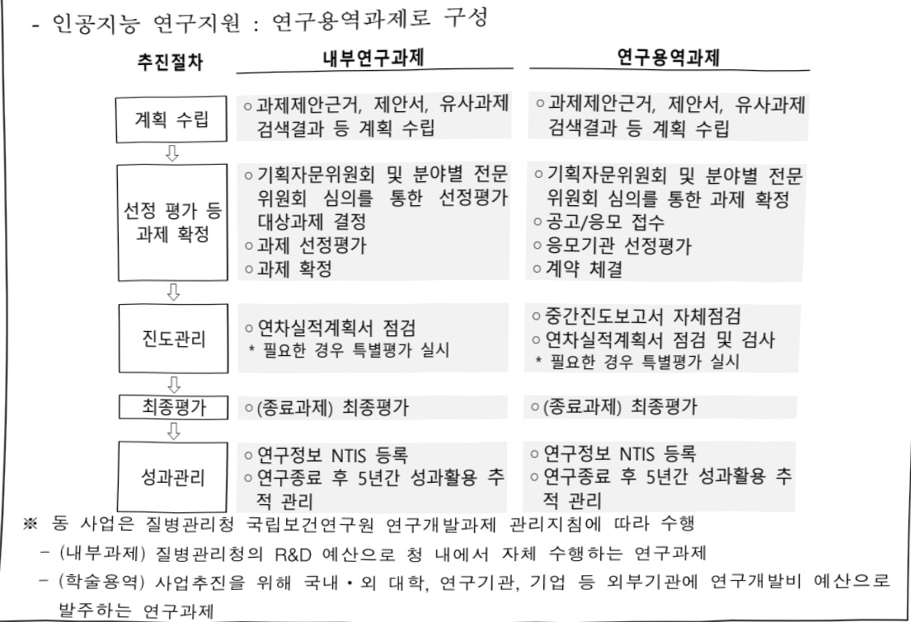

# 헬스케어 이종데이터 활용체계 및 인공지능 개발(R&D)

**해당 페이지**: PDF 4882 ~ 4897 쪽 해당

**부처**: 질병관리청
**분야**: 보건
**회계유형**: 일반회계
**2026 확정예산**: 4622.0 백만원
**전년대비 증감률**: -6.3%
**AI 도메인**: 데이터, 의료/바이오

---

### 가. 예산 총괄표

(단위:백만원,%)

<table border=1 style='margin: auto; word-wrap: break-word;'><tr><td rowspan="2">사업명</td><td rowspan="2">2024년 결산</td><td colspan="2">2025년 예산</td><td colspan="2">2026년</td><td rowspan="2">증감(B-A)</td><td rowspan="2">(B-A)/A</td></tr><tr><td style='text-align: center; word-wrap: break-word;'>본예산(A)</td><td style='text-align: center; word-wrap: break-word;'>추경</td><td style='text-align: center; word-wrap: break-word;'>정부안</td><td style='text-align: center; word-wrap: break-word;'>확정(B)</td></tr><tr><td style='text-align: center; word-wrap: break-word;'>헬스케어이종테이터활용체계 및인공지능개발(R&amp;D)</td><td style='text-align: center; word-wrap: break-word;'>4,564</td><td style='text-align: center; word-wrap: break-word;'>4,932</td><td style='text-align: center; word-wrap: break-word;'>4,932</td><td style='text-align: center; word-wrap: break-word;'>4,622</td><td style='text-align: center; word-wrap: break-word;'>4,622</td><td style='text-align: center; word-wrap: break-word;'>△310</td><td style='text-align: center; word-wrap: break-word;'>△6.3</td></tr></table>

□ 기능별(내역사업별), 목별 예산 내역

(단위:백만원)

<table border=1 style='margin: auto; word-wrap: break-word;'><tr><td rowspan="3"></td><td colspan="5">2024</td><td colspan="7">2025(2025.12월말)</td><td rowspan="3">2026예산</td></tr><tr><td rowspan="2">예산액(추경)</td><td rowspan="2">예산현액</td><td rowspan="2">집행액[실집행액]</td><td rowspan="2">이월액</td><td rowspan="2">불용액</td><td rowspan="2">본예산</td><td rowspan="2">예산현액</td><td rowspan="2">집행액[실집행액]</td><td colspan="2">전년도 이월액제외</td><td rowspan="2">이월예상액</td><td rowspan="2">불용예상액</td></tr><tr><td style='text-align: center; word-wrap: break-word;'>예산현액</td><td style='text-align: center; word-wrap: break-word;'>집행액[실집행액]</td></tr><tr><td style='text-align: center; word-wrap: break-word;'>○ 기능별 분류(합계)</td><td style='text-align: center; word-wrap: break-word;'>5,012</td><td style='text-align: center; word-wrap: break-word;'>5,072</td><td style='text-align: center; word-wrap: break-word;'>4,564</td><td style='text-align: center; word-wrap: break-word;'>48</td><td style='text-align: center; word-wrap: break-word;'>460</td><td style='text-align: center; word-wrap: break-word;'>4,932</td><td style='text-align: center; word-wrap: break-word;'>4,980</td><td style='text-align: center; word-wrap: break-word;'>4,904</td><td style='text-align: center; word-wrap: break-word;'>4,932</td><td style='text-align: center; word-wrap: break-word;'>4,856</td><td style='text-align: center; word-wrap: break-word;'>-</td><td style='text-align: center; word-wrap: break-word;'>76</td><td style='text-align: center; word-wrap: break-word;'>4,622</td></tr><tr><td style='text-align: center; word-wrap: break-word;'>· 헬스케어 연구데이터 인공지능 활용</td><td style='text-align: center; word-wrap: break-word;'>4,509</td><td style='text-align: center; word-wrap: break-word;'>4,569</td><td style='text-align: center; word-wrap: break-word;'>4,171</td><td style='text-align: center; word-wrap: break-word;'>48</td><td style='text-align: center; word-wrap: break-word;'>350</td><td style='text-align: center; word-wrap: break-word;'>3,280</td><td style='text-align: center; word-wrap: break-word;'>3,328</td><td style='text-align: center; word-wrap: break-word;'>3,320</td><td style='text-align: center; word-wrap: break-word;'>3,280</td><td style='text-align: center; word-wrap: break-word;'>3,272</td><td style='text-align: center; word-wrap: break-word;'>-</td><td style='text-align: center; word-wrap: break-word;'>8</td><td style='text-align: center; word-wrap: break-word;'>2,952</td></tr><tr><td style='text-align: center; word-wrap: break-word;'>· 시험연구인력지원</td><td style='text-align: center; word-wrap: break-word;'>503</td><td style='text-align: center; word-wrap: break-word;'>503</td><td style='text-align: center; word-wrap: break-word;'>393</td><td style='text-align: center; word-wrap: break-word;'>-</td><td style='text-align: center; word-wrap: break-word;'>110</td><td style='text-align: center; word-wrap: break-word;'>452</td><td style='text-align: center; word-wrap: break-word;'>452</td><td style='text-align: center; word-wrap: break-word;'>384</td><td style='text-align: center; word-wrap: break-word;'>452</td><td style='text-align: center; word-wrap: break-word;'>384</td><td style='text-align: center; word-wrap: break-word;'>-</td><td style='text-align: center; word-wrap: break-word;'>68</td><td style='text-align: center; word-wrap: break-word;'>470</td></tr><tr><td style='text-align: center; word-wrap: break-word;'>· 인공지능 연구지원</td><td style='text-align: center; word-wrap: break-word;'>-</td><td style='text-align: center; word-wrap: break-word;'>-</td><td style='text-align: center; word-wrap: break-word;'>-</td><td style='text-align: center; word-wrap: break-word;'>-</td><td style='text-align: center; word-wrap: break-word;'>-</td><td style='text-align: center; word-wrap: break-word;'>1,200</td><td style='text-align: center; word-wrap: break-word;'>1,200</td><td style='text-align: center; word-wrap: break-word;'>1,200</td><td style='text-align: center; word-wrap: break-word;'>1,200</td><td style='text-align: center; word-wrap: break-word;'>1,200</td><td style='text-align: center; word-wrap: break-word;'>-</td><td style='text-align: center; word-wrap: break-word;'>-</td><td style='text-align: center; word-wrap: break-word;'>1,200</td></tr><tr><td style='text-align: center; word-wrap: break-word;'>○ 비목별 분류(합계)</td><td style='text-align: center; word-wrap: break-word;'>5,012</td><td style='text-align: center; word-wrap: break-word;'>5,072</td><td style='text-align: center; word-wrap: break-word;'>4,564</td><td style='text-align: center; word-wrap: break-word;'>48</td><td style='text-align: center; word-wrap: break-word;'>460</td><td style='text-align: center; word-wrap: break-word;'>4,932</td><td style='text-align: center; word-wrap: break-word;'>4,980</td><td style='text-align: center; word-wrap: break-word;'>4,904</td><td style='text-align: center; word-wrap: break-word;'>4,932</td><td style='text-align: center; word-wrap: break-word;'>4,856</td><td style='text-align: center; word-wrap: break-word;'>-</td><td style='text-align: center; word-wrap: break-word;'>76</td><td style='text-align: center; word-wrap: break-word;'>4,622</td></tr><tr><td style='text-align: center; word-wrap: break-word;'>· 상용임금(110-03)</td><td style='text-align: center; word-wrap: break-word;'>417</td><td style='text-align: center; word-wrap: break-word;'>417</td><td style='text-align: center; word-wrap: break-word;'>333</td><td style='text-align: center; word-wrap: break-word;'>-</td><td style='text-align: center; word-wrap: break-word;'>84</td><td style='text-align: center; word-wrap: break-word;'>374</td><td style='text-align: center; word-wrap: break-word;'>374</td><td style='text-align: center; word-wrap: break-word;'>326</td><td style='text-align: center; word-wrap: break-word;'>374</td><td style='text-align: center; word-wrap: break-word;'>326</td><td style='text-align: center; word-wrap: break-word;'>-</td><td style='text-align: center; word-wrap: break-word;'>48</td><td style='text-align: center; word-wrap: break-word;'>388</td></tr><tr><td style='text-align: center; word-wrap: break-word;'>· 일반수용비(210-01)</td><td style='text-align: center; word-wrap: break-word;'>12</td><td style='text-align: center; word-wrap: break-word;'>12</td><td style='text-align: center; word-wrap: break-word;'>7</td><td style='text-align: center; word-wrap: break-word;'>-</td><td style='text-align: center; word-wrap: break-word;'>5</td><td style='text-align: center; word-wrap: break-word;'>12</td><td style='text-align: center; word-wrap: break-word;'>12</td><td style='text-align: center; word-wrap: break-word;'>12</td><td style='text-align: center; word-wrap: break-word;'>12</td><td style='text-align: center; word-wrap: break-word;'>12</td><td style='text-align: center; word-wrap: break-word;'>-</td><td style='text-align: center; word-wrap: break-word;'>-</td><td style='text-align: center; word-wrap: break-word;'>12</td></tr><tr><td style='text-align: center; word-wrap: break-word;'>· 임차료(210-07)</td><td style='text-align: center; word-wrap: break-word;'>20</td><td style='text-align: center; word-wrap: break-word;'>20</td><td style='text-align: center; word-wrap: break-word;'>17</td><td style='text-align: center; word-wrap: break-word;'>-</td><td style='text-align: center; word-wrap: break-word;'>3</td><td style='text-align: center; word-wrap: break-word;'>20</td><td style='text-align: center; word-wrap: break-word;'>20</td><td style='text-align: center; word-wrap: break-word;'>20</td><td style='text-align: center; word-wrap: break-word;'>20</td><td style='text-align: center; word-wrap: break-word;'>20</td><td style='text-align: center; word-wrap: break-word;'>-</td><td style='text-align: center; word-wrap: break-word;'>-</td><td style='text-align: center; word-wrap: break-word;'>20</td></tr><tr><td style='text-align: center; word-wrap: break-word;'>· 복리후생비(210-12)</td><td style='text-align: center; word-wrap: break-word;'>5</td><td style='text-align: center; word-wrap: break-word;'>5</td><td style='text-align: center; word-wrap: break-word;'>3</td><td style='text-align: center; word-wrap: break-word;'>-</td><td style='text-align: center; word-wrap: break-word;'>2</td><td style='text-align: center; word-wrap: break-word;'>5</td><td style='text-align: center; word-wrap: break-word;'>5</td><td style='text-align: center; word-wrap: break-word;'>3</td><td style='text-align: center; word-wrap: break-word;'>5</td><td style='text-align: center; word-wrap: break-word;'>3</td><td style='text-align: center; word-wrap: break-word;'>-</td><td style='text-align: center; word-wrap: break-word;'>2</td><td style='text-align: center; word-wrap: break-word;'>5</td></tr><tr><td style='text-align: center; word-wrap: break-word;'>· 시험연구비(210-13)</td><td style='text-align: center; word-wrap: break-word;'>130</td><td style='text-align: center; word-wrap: break-word;'>130</td><td style='text-align: center; word-wrap: break-word;'>126</td><td style='text-align: center; word-wrap: break-word;'>-</td><td style='text-align: center; word-wrap: break-word;'>4</td><td style='text-align: center; word-wrap: break-word;'>104</td><td style='text-align: center; word-wrap: break-word;'>104</td><td style='text-align: center; word-wrap: break-word;'>104</td><td style='text-align: center; word-wrap: break-word;'>104</td><td style='text-align: center; word-wrap: break-word;'>104</td><td style='text-align: center; word-wrap: break-word;'>-</td><td style='text-align: center; word-wrap: break-word;'>-</td><td style='text-align: center; word-wrap: break-word;'>104</td></tr><tr><td style='text-align: center; word-wrap: break-word;'>· 관리용역비(210-15)</td><td style='text-align: center; word-wrap: break-word;'>60</td><td style='text-align: center; word-wrap: break-word;'>60</td><td style='text-align: center; word-wrap: break-word;'>59</td><td style='text-align: center; word-wrap: break-word;'>-</td><td style='text-align: center; word-wrap: break-word;'>1</td><td style='text-align: center; word-wrap: break-word;'>60</td><td style='text-align: center; word-wrap: break-word;'>60</td><td style='text-align: center; word-wrap: break-word;'>59</td><td style='text-align: center; word-wrap: break-word;'>60</td><td style='text-align: center; word-wrap: break-word;'>59</td><td style='text-align: center; word-wrap: break-word;'>-</td><td style='text-align: center; word-wrap: break-word;'>1</td><td style='text-align: center; word-wrap: break-word;'>60</td></tr><tr><td style='text-align: center; word-wrap: break-word;'>· 사업추진비(240-01)</td><td style='text-align: center; word-wrap: break-word;'>1</td><td style='text-align: center; word-wrap: break-word;'>1</td><td style='text-align: center; word-wrap: break-word;'>1</td><td style='text-align: center; word-wrap: break-word;'>-</td><td style='text-align: center; word-wrap: break-word;'>-</td><td style='text-align: center; word-wrap: break-word;'>1</td><td style='text-align: center; word-wrap: break-word;'>1</td><td style='text-align: center; word-wrap: break-word;'>1</td><td style='text-align: center; word-wrap: break-word;'>1</td><td style='text-align: center; word-wrap: break-word;'>1</td><td style='text-align: center; word-wrap: break-word;'>-</td><td style='text-align: center; word-wrap: break-word;'>-</td><td style='text-align: center; word-wrap: break-word;'>1</td></tr><tr><td style='text-align: center; word-wrap: break-word;'>· 일반연구비(260-01)</td><td style='text-align: center; word-wrap: break-word;'>3,786</td><td style='text-align: center; word-wrap: break-word;'>3,846</td><td style='text-align: center; word-wrap: break-word;'>3,542</td><td style='text-align: center; word-wrap: break-word;'>48</td><td style='text-align: center; word-wrap: break-word;'>256</td><td style='text-align: center; word-wrap: break-word;'>4,283</td><td style='text-align: center; word-wrap: break-word;'>4,331</td><td style='text-align: center; word-wrap: break-word;'>4,324</td><td style='text-align: center; word-wrap: break-word;'>4,283</td><td style='text-align: center; word-wrap: break-word;'>4,276</td><td style='text-align: center; word-wrap: break-word;'>-</td><td style='text-align: center; word-wrap: break-word;'>7</td><td style='text-align: center; word-wrap: break-word;'>3,955</td></tr><tr><td style='text-align: center; word-wrap: break-word;'>· 고용부담금(320-09)</td><td style='text-align: center; word-wrap: break-word;'>81</td><td style='text-align: center; word-wrap: break-word;'>81</td><td style='text-align: center; word-wrap: break-word;'>57</td><td style='text-align: center; word-wrap: break-word;'>-</td><td style='text-align: center; word-wrap: break-word;'>24</td><td style='text-align: center; word-wrap: break-word;'>73</td><td style='text-align: center; word-wrap: break-word;'>73</td><td style='text-align: center; word-wrap: break-word;'>55</td><td style='text-align: center; word-wrap: break-word;'>73</td><td style='text-align: center; word-wrap: break-word;'>55</td><td style='text-align: center; word-wrap: break-word;'>-</td><td style='text-align: center; word-wrap: break-word;'>18</td><td style='text-align: center; word-wrap: break-word;'>77</td></tr><tr><td style='text-align: center; word-wrap: break-word;'>· 자산취득비(430-01)</td><td style='text-align: center; word-wrap: break-word;'>500</td><td style='text-align: center; word-wrap: break-word;'>500</td><td style='text-align: center; word-wrap: break-word;'>419</td><td style='text-align: center; word-wrap: break-word;'>-</td><td style='text-align: center; word-wrap: break-word;'>81</td><td style='text-align: center; word-wrap: break-word;'>-</td><td style='text-align: center; word-wrap: break-word;'>-</td><td style='text-align: center; word-wrap: break-word;'>-</td><td style='text-align: center; word-wrap: break-word;'>-</td><td style='text-align: center; word-wrap: break-word;'>-</td><td style='text-align: center; word-wrap: break-word;'>-</td><td style='text-align: center; word-wrap: break-word;'>-</td><td style='text-align: center; word-wrap: break-word;'>-</td></tr><tr><td style='text-align: center; word-wrap: break-word;'>○ 기능비목별 분류(합계)</td><td style='text-align: center; word-wrap: break-word;'>4,932</td><td style='text-align: center; word-wrap: break-word;'>4,980</td><td style='text-align: center; word-wrap: break-word;'>4,564</td><td style='text-align: center; word-wrap: break-word;'>48</td><td style='text-align: center; word-wrap: break-word;'>460</td><td style='text-align: center; word-wrap: break-word;'>4,932</td><td style='text-align: center; word-wrap: break-word;'>4,980</td><td style='text-align: center; word-wrap: break-word;'>4,904</td><td style='text-align: center; word-wrap: break-word;'>4,932</td><td style='text-align: center; word-wrap: break-word;'>4,856</td><td style='text-align: center; word-wrap: break-word;'>-</td><td style='text-align: center; word-wrap: break-word;'>76</td><td style='text-align: center; word-wrap: break-word;'>4,622</td></tr><tr><td style='text-align: center; word-wrap: break-word;'>· 헬스케어 연구데이터</td><td style='text-align: center; word-wrap: break-word;'>4,509</td><td style='text-align: center; word-wrap: break-word;'>4,569</td><td style='text-align: center; word-wrap: break-word;'>4,171</td><td style='text-align: center; word-wrap: break-word;'>-</td><td style='text-align: center; word-wrap: break-word;'>350</td><td style='text-align: center; word-wrap: break-word;'>3,280</td><td style='text-align: center; word-wrap: break-word;'>3,328</td><td style='text-align: center; word-wrap: break-word;'>3,320</td><td style='text-align: center; word-wrap: break-word;'>3,280</td><td style='text-align: center; word-wrap: break-word;'>3,272</td><td style='text-align: center; word-wrap: break-word;'>-</td><td style='text-align: center; word-wrap: break-word;'>8</td><td style='text-align: center; word-wrap: break-word;'>2,952</td></tr></table>

---

<table border=1 style='margin: auto; word-wrap: break-word;'><tr><td rowspan="3"></td><td colspan="5">2024</td><td colspan="7">2025(2025.12월말)</td><td rowspan="3">2026예산</td></tr><tr><td rowspan="2">예산액(추경)</td><td rowspan="2">예산현액</td><td rowspan="2">집행액[실집행액]</td><td rowspan="2">이월액</td><td rowspan="2">불용액</td><td rowspan="2">본예산</td><td rowspan="2">예산현액</td><td rowspan="2">집행액[실집행액]</td><td colspan="2">전년도이월액제외</td><td rowspan="2">이월예산액</td><td rowspan="2">불용예산액</td></tr><tr><td style='text-align: center; word-wrap: break-word;'>예산현액</td><td style='text-align: center; word-wrap: break-word;'>집행액[실집행액]</td></tr><tr><td style='text-align: center; word-wrap: break-word;'>터 인공지능 활용</td><td style='text-align: center; word-wrap: break-word;'>12</td><td style='text-align: center; word-wrap: break-word;'>12</td><td style='text-align: center; word-wrap: break-word;'>7</td><td style='text-align: center; word-wrap: break-word;'>-</td><td style='text-align: center; word-wrap: break-word;'>5</td><td style='text-align: center; word-wrap: break-word;'>12</td><td style='text-align: center; word-wrap: break-word;'>12</td><td style='text-align: center; word-wrap: break-word;'>12</td><td style='text-align: center; word-wrap: break-word;'>12</td><td style='text-align: center; word-wrap: break-word;'>12</td><td style='text-align: center; word-wrap: break-word;'>-</td><td style='text-align: center; word-wrap: break-word;'>-</td><td style='text-align: center; word-wrap: break-word;'>12</td></tr><tr><td style='text-align: center; word-wrap: break-word;'>- 일반수용비(210-01)</td><td style='text-align: center; word-wrap: break-word;'>20</td><td style='text-align: center; word-wrap: break-word;'>20</td><td style='text-align: center; word-wrap: break-word;'>17</td><td style='text-align: center; word-wrap: break-word;'>-</td><td style='text-align: center; word-wrap: break-word;'>3</td><td style='text-align: center; word-wrap: break-word;'>20</td><td style='text-align: center; word-wrap: break-word;'>20</td><td style='text-align: center; word-wrap: break-word;'>20</td><td style='text-align: center; word-wrap: break-word;'>20</td><td style='text-align: center; word-wrap: break-word;'>20</td><td style='text-align: center; word-wrap: break-word;'>-</td><td style='text-align: center; word-wrap: break-word;'>-</td><td style='text-align: center; word-wrap: break-word;'>20</td></tr><tr><td style='text-align: center; word-wrap: break-word;'>- 입차료(210-07)</td><td style='text-align: center; word-wrap: break-word;'>130</td><td style='text-align: center; word-wrap: break-word;'>130</td><td style='text-align: center; word-wrap: break-word;'>126</td><td style='text-align: center; word-wrap: break-word;'>-</td><td style='text-align: center; word-wrap: break-word;'>4</td><td style='text-align: center; word-wrap: break-word;'>104</td><td style='text-align: center; word-wrap: break-word;'>104</td><td style='text-align: center; word-wrap: break-word;'>104</td><td style='text-align: center; word-wrap: break-word;'>104</td><td style='text-align: center; word-wrap: break-word;'>104</td><td style='text-align: center; word-wrap: break-word;'>-</td><td style='text-align: center; word-wrap: break-word;'>-</td><td style='text-align: center; word-wrap: break-word;'>104</td></tr><tr><td style='text-align: center; word-wrap: break-word;'>- 시험연구비(210-13)</td><td style='text-align: center; word-wrap: break-word;'>60</td><td style='text-align: center; word-wrap: break-word;'>60</td><td style='text-align: center; word-wrap: break-word;'>59</td><td style='text-align: center; word-wrap: break-word;'>-</td><td style='text-align: center; word-wrap: break-word;'>1</td><td style='text-align: center; word-wrap: break-word;'>60</td><td style='text-align: center; word-wrap: break-word;'>60</td><td style='text-align: center; word-wrap: break-word;'>59</td><td style='text-align: center; word-wrap: break-word;'>60</td><td style='text-align: center; word-wrap: break-word;'>59</td><td style='text-align: center; word-wrap: break-word;'>-</td><td style='text-align: center; word-wrap: break-word;'>1</td><td style='text-align: center; word-wrap: break-word;'>60</td></tr><tr><td style='text-align: center; word-wrap: break-word;'>- 관리용역비(210-15)</td><td style='text-align: center; word-wrap: break-word;'>1</td><td style='text-align: center; word-wrap: break-word;'>1</td><td style='text-align: center; word-wrap: break-word;'>1</td><td style='text-align: center; word-wrap: break-word;'>-</td><td style='text-align: center; word-wrap: break-word;'>-</td><td style='text-align: center; word-wrap: break-word;'>1</td><td style='text-align: center; word-wrap: break-word;'>1</td><td style='text-align: center; word-wrap: break-word;'>1</td><td style='text-align: center; word-wrap: break-word;'>1</td><td style='text-align: center; word-wrap: break-word;'>1</td><td style='text-align: center; word-wrap: break-word;'>-</td><td style='text-align: center; word-wrap: break-word;'>-</td><td style='text-align: center; word-wrap: break-word;'>1</td></tr><tr><td style='text-align: center; word-wrap: break-word;'>- 시업추진비(240-01)</td><td style='text-align: center; word-wrap: break-word;'>3,786</td><td style='text-align: center; word-wrap: break-word;'>3,846</td><td style='text-align: center; word-wrap: break-word;'>3,542</td><td style='text-align: center; word-wrap: break-word;'>48</td><td style='text-align: center; word-wrap: break-word;'>256</td><td style='text-align: center; word-wrap: break-word;'>3,083</td><td style='text-align: center; word-wrap: break-word;'>3,131</td><td style='text-align: center; word-wrap: break-word;'>3,124</td><td style='text-align: center; word-wrap: break-word;'>3,083</td><td style='text-align: center; word-wrap: break-word;'>3,076</td><td style='text-align: center; word-wrap: break-word;'>-</td><td style='text-align: center; word-wrap: break-word;'>7</td><td style='text-align: center; word-wrap: break-word;'>2,755</td></tr><tr><td style='text-align: center; word-wrap: break-word;'>- 일반연구비(260-01)</td><td style='text-align: center; word-wrap: break-word;'>500</td><td style='text-align: center; word-wrap: break-word;'>500</td><td style='text-align: center; word-wrap: break-word;'>419</td><td style='text-align: center; word-wrap: break-word;'>-</td><td style='text-align: center; word-wrap: break-word;'>81</td><td style='text-align: center; word-wrap: break-word;'>-</td><td style='text-align: center; word-wrap: break-word;'>-</td><td style='text-align: center; word-wrap: break-word;'>-</td><td style='text-align: center; word-wrap: break-word;'>-</td><td style='text-align: center; word-wrap: break-word;'>-</td><td style='text-align: center; word-wrap: break-word;'>-</td><td style='text-align: center; word-wrap: break-word;'>-</td><td style='text-align: center; word-wrap: break-word;'>-</td></tr><tr><td style='text-align: center; word-wrap: break-word;'>- 자신취득비(430-01)</td><td style='text-align: center; word-wrap: break-word;'>503</td><td style='text-align: center; word-wrap: break-word;'>503</td><td style='text-align: center; word-wrap: break-word;'>393</td><td style='text-align: center; word-wrap: break-word;'>-</td><td style='text-align: center; word-wrap: break-word;'>110</td><td style='text-align: center; word-wrap: break-word;'>452</td><td style='text-align: center; word-wrap: break-word;'>452</td><td style='text-align: center; word-wrap: break-word;'>384</td><td style='text-align: center; word-wrap: break-word;'>452</td><td style='text-align: center; word-wrap: break-word;'>384</td><td style='text-align: center; word-wrap: break-word;'>-</td><td style='text-align: center; word-wrap: break-word;'>68</td><td style='text-align: center; word-wrap: break-word;'>470</td></tr><tr><td style='text-align: center; word-wrap: break-word;'>- 시험연구인력지원</td><td style='text-align: center; word-wrap: break-word;'>417</td><td style='text-align: center; word-wrap: break-word;'>417</td><td style='text-align: center; word-wrap: break-word;'>333</td><td style='text-align: center; word-wrap: break-word;'>-</td><td style='text-align: center; word-wrap: break-word;'>84</td><td style='text-align: center; word-wrap: break-word;'>374</td><td style='text-align: center; word-wrap: break-word;'>374</td><td style='text-align: center; word-wrap: break-word;'>326</td><td style='text-align: center; word-wrap: break-word;'>374</td><td style='text-align: center; word-wrap: break-word;'>326</td><td style='text-align: center; word-wrap: break-word;'>-</td><td style='text-align: center; word-wrap: break-word;'>48</td><td style='text-align: center; word-wrap: break-word;'>388</td></tr><tr><td style='text-align: center; word-wrap: break-word;'>- 상용입금(110-03)</td><td style='text-align: center; word-wrap: break-word;'>5</td><td style='text-align: center; word-wrap: break-word;'>5</td><td style='text-align: center; word-wrap: break-word;'>3</td><td style='text-align: center; word-wrap: break-word;'>-</td><td style='text-align: center; word-wrap: break-word;'>2</td><td style='text-align: center; word-wrap: break-word;'>73</td><td style='text-align: center; word-wrap: break-word;'>73</td><td style='text-align: center; word-wrap: break-word;'>55</td><td style='text-align: center; word-wrap: break-word;'>73</td><td style='text-align: center; word-wrap: break-word;'>55</td><td style='text-align: center; word-wrap: break-word;'>-</td><td style='text-align: center; word-wrap: break-word;'>18</td><td style='text-align: center; word-wrap: break-word;'>77</td></tr><tr><td style='text-align: center; word-wrap: break-word;'>- 고용부담금(110-03)</td><td style='text-align: center; word-wrap: break-word;'>81</td><td style='text-align: center; word-wrap: break-word;'>81</td><td style='text-align: center; word-wrap: break-word;'>57</td><td style='text-align: center; word-wrap: break-word;'>-</td><td style='text-align: center; word-wrap: break-word;'>24</td><td style='text-align: center; word-wrap: break-word;'>5</td><td style='text-align: center; word-wrap: break-word;'>5</td><td style='text-align: center; word-wrap: break-word;'>3</td><td style='text-align: center; word-wrap: break-word;'>5</td><td style='text-align: center; word-wrap: break-word;'>3</td><td style='text-align: center; word-wrap: break-word;'>-</td><td style='text-align: center; word-wrap: break-word;'>2</td><td style='text-align: center; word-wrap: break-word;'>5</td></tr><tr><td style='text-align: center; word-wrap: break-word;'>- 복리후생비(110-03)</td><td style='text-align: center; word-wrap: break-word;'>-</td><td style='text-align: center; word-wrap: break-word;'>-</td><td style='text-align: center; word-wrap: break-word;'>-</td><td style='text-align: center; word-wrap: break-word;'>-</td><td style='text-align: center; word-wrap: break-word;'>-</td><td style='text-align: center; word-wrap: break-word;'>1,200</td><td style='text-align: center; word-wrap: break-word;'>1,200</td><td style='text-align: center; word-wrap: break-word;'>1,200</td><td style='text-align: center; word-wrap: break-word;'>1,200</td><td style='text-align: center; word-wrap: break-word;'>1,200</td><td style='text-align: center; word-wrap: break-word;'>-</td><td style='text-align: center; word-wrap: break-word;'>-</td><td style='text-align: center; word-wrap: break-word;'>1,200</td></tr><tr><td style='text-align: center; word-wrap: break-word;'>- 인공지능 연구지원</td><td style='text-align: center; word-wrap: break-word;'>-</td><td style='text-align: center; word-wrap: break-word;'>-</td><td style='text-align: center; word-wrap: break-word;'>-</td><td style='text-align: center; word-wrap: break-word;'>-</td><td style='text-align: center; word-wrap: break-word;'>-</td><td style='text-align: center; word-wrap: break-word;'>1,200</td><td style='text-align: center; word-wrap: break-word;'>1,200</td><td style='text-align: center; word-wrap: break-word;'>1,200</td><td style='text-align: center; word-wrap: break-word;'>1,200</td><td style='text-align: center; word-wrap: break-word;'>1,200</td><td style='text-align: center; word-wrap: break-word;'>-</td><td style='text-align: center; word-wrap: break-word;'>-</td><td style='text-align: center; word-wrap: break-word;'>1,200</td></tr><tr><td style='text-align: center; word-wrap: break-word;'>- 일반연구비(260-01)</td><td style='text-align: center; word-wrap: break-word;'>-</td><td style='text-align: center; word-wrap: break-word;'>-</td><td style='text-align: center; word-wrap: break-word;'>-</td><td style='text-align: center; word-wrap: break-word;'>-</td><td style='text-align: center; word-wrap: break-word;'>-</td><td style='text-align: center; word-wrap: break-word;'>1,200</td><td style='text-align: center; word-wrap: break-word;'>1,200</td><td style='text-align: center; word-wrap: break-word;'>1,200</td><td style='text-align: center; word-wrap: break-word;'>1,200</td><td style='text-align: center; word-wrap: break-word;'>1,200</td><td style='text-align: center; word-wrap: break-word;'>-</td><td style='text-align: center; word-wrap: break-word;'>-</td><td style='text-align: center; word-wrap: break-word;'>1,200</td></tr></table>

### 나. 사업설명자료

## 1 ) 사업목적·내용

- (목적) 디지털 기술 기반의 실사용 헬스케어 이종데이터* 활용을 위한 데이터 수집 및 분석체계 구축, 인공지능 개발 및 코호트 기반 멀티모달 인공지능 학습용 데이터 구축 * 전자의무기록 자료, 영상 자료, 디지털 기기 및 웨어러블 기기 데이터, 멀티오믹스 자료 등 - (내용)

(헬스케어 연구데이터 인공지능 활용) 기존 개별 병원 중심의 단편적 데이터 수집을 벗어나 실사용 데이터 기반, 디지털 기술을 접목한 질환별 포괄적인 헬스케어 이종데이터 수집, 정제, 표준화 및 이를 기반으로 한 인공지능 연구 수행

(시험연구인력지원) R&D 과제 수행 및 연구행정 지원을 위한 전문 연구인력(공무직, 기간제, 박사 후 연구원) 인건비 지원

(인공지능 연구지원) 코호트 기반 수집·생산된 헬스케어 데이터의 활용 증대를 위해

인공지능 학습용 데이터 발굴·구축·공개 및 클라우드 기반 연구 플랫폼 구축·지원

---

## 2 ) 사업개요

## ☐ 사업근거 및 추진경위

① 법령상 근거 및 조항 적시

- 보건의료기술진흥법 제3조(기술개발의 보호·육성)

제3조(기술개발의 보호·육성) 정부는 보건의료기술의 진흥을 위한 연구개발 활동과 보건신기술을 장려하고 보호·육성하기 위한 정책을 마련하여 시행하여야 하며, 이에 필요한 비용을 지원할 수 있다.

- 보건의료기술진흥법 제4조(보건의료기술육성기본계획의 수립)

제4조(보건의료기술육성기본계획의 수립) ① 정부는 보건의료기술을 개발·촉진하기 위하여 5년마다 보건의료기술육성기본계획(이하 “기본계획”이라 한다)을 수립하고 이를 추진하여야 한다.

② 보건복지부장관은 관계 중앙행정기관의 계획을 종합하여 기본계획안을 작성하고 「국가과학기술자문회의법」에 따른 국가과학기술자문회의(이하 “국가과학기술자문회의”라 한다)의 심의를 거쳐 이를 확정한다.

③ 기본계획에는 다음 각 호의 사항이 포함되어야 한다.

1. 보건의료기술의 방향과 목표

2. 보건의료기술의 국내외 환경 분석

3. 중장기 중점 기술개발 전략

4. 보건의료기술의 진흥을 위한 중장기 투자계획

5. 보건의료기술 인력의 수급(롯) 및 육성 방안

6. 그 밖에 대통령령으로 정하는 보건의료기술의 개발에 중요한 사항

④ 보건복지부장관은 관계 중앙행정기관의 전년도 실적 및 다음 연도 계획을 토대로 연도별 시행계획(이하 “시행계획”이라 한다)을 수립하여 국가과학기술자문회의에 보고하여야 한다.

⑤ 보건복지부장관은 기본계획과 시행계획을 수립할 때 제6조에 따른 보건의료기술정책심의위원회에 보고하고 의견을 들을 수 있다.

⑥ 보건복지부장관은 기본계획과 시행계획을 수립하기 위하여 대통령령으로 정하는 바에 따라 관계 중앙행정기관의 장에게 자료를 요청할 수 있다.

- 보건의료기술진흥법 제5조(보건의료기술 연구개발사업의 추진)

제5조(보건의료기술 연구개발사업의 추진) ① 정부는 기본계획을 효율적으로 추진하기 위하여 보건의료기술 연구개발사업(이하 “연구개발사업”이라 한다)을 수행한다.

② 보건복지부장관은 연구개발사업으로 연도별 • 분야별 연구과제를 선정하여 다음 각 호의 기관이나 단체 등과 협약을 맺어 연구하게 할 수 있다. 이 경우 제4호의 기관 중 법인이 아닌 기관에 대하여는 그 기관이 속한 법인의 대표와 협약을 맺을 수 있다.

1. 국·공립 연구기관

2. 「특정연구기관 육성법」의 적용을 받는 연구기관

3. 「고등교육법」 제2조에 따른 학교

4. 대통령령으로 정하는 기준에 해당하는 기업부설연구소

5. 「민법」이나 다른 법률에 따라 설립된 법인인 연구기관

---

6. 그 밖에 대통령령으로 정하는 보건의료기술 분야의 연구기관 또는 단체

③ 제2항에 따른 연구에 필요한 비용은 정부 또는 정부 외의 자의 출연금이나 기업의 기술개발비로 충당한다.

④ 보건복지부장관은 연구개발사업을 추진하기 위하여 제2항에 따른 연구를 수행하는 기관이나 단체 등에 출연금을 지급할 수 있다.

⑤ 보건복지부장관은 제2항에 따라 연구과제를 선정하여 협약을 맺거나 제3항 및 제4항에 따른 출연금을 지급할 때 특정 기관 또는 단체 등에 편중되지 아니하도록 노력하여야 한다.

⑥ 제2항에 따른 연구과제의 선정 방법 및 협약의 체결 방법과 제3항 및 제4항에 따른 출연금의 지급·사용·관리에 필요한 사항은 대통령령으로 정한다.

## -과학기술기본법 제7조(과학기술기본계획)

<table border=1 style='margin: auto; word-wrap: break-word;'><tr><td style='text-align: center; word-wrap: break-word;'>제7조(과학기술기본계획) ① 정부는 이 법의 목적을 효율적으로 달성하기 위하여 과학기술발전에 관한 중·장기 정책목표와 방향을 설정하고 「국가과학기술자문회의법」에 따른 국가과학기술자문회의(이하 “과학기술자문회의”라 한다)의 심의를 거쳐 확정하여야 한다. ② 과학기술정보통신부장관은 5년마다 제1항에 따른 과학기술발전에 관한 중·장기 정책목표와 방향을 반영하고 관계 중앙행정기관의 과학기술 관련 계획과 시책 등을 종합하여 과학기술기본계획(이하 “기본계획”이라 한다)을 세우고 과학기술자문회의의 심의를 거쳐 확정하여야 한다. ③ 기본계획에는 다음 각 호의 사항이 포함되어야 한다. 1. 과학기술의 발전목표 및 정책의 기본방향 2. 과학기술혁신 관련 산업정책, 인력정책 및 지역기술혁신정책 등의 추진방향 3. 과학기술투자의 확대 4. 과학기술 연구개발의 추진 및 협동·융합연구개발 촉진 4의2. 미래유망기술의 확보 5. 기업, 교육기관, 연구기관 및 과학기술 관련 기관·단체 등의 과학기술혁신 역량의 강화 6. 연구개발성과의 확산, 기술이전 및 실용화의 촉진, 기술창업의 활성화 6의2. 과학기술에 기반을 둔 성장동력의 발굴·육성 6의3. 과학기술을 활용한 삶의 질 향상, 경제적·사회적 현안 및 범지구적 문제의 해결 7. 기초연구의 진흥 8. 과학기술교육의 다양화 및 질적 고도화 9. 과학기술인력의 양성 및 활용 증진 10. 과학기술지식과 정보자원의 확충·관리 및 유통체제의 구축 11. 지방과학기술의 진흥 12. 과학기술의 국제화 촉진 13. 남북 간 과학기술 교류협력의 촉진 14. 과학기술문화의 창달 촉진 15. 민간부문의 과학기술혁신 촉진 15의2. 과학기술혁신의 촉진을 위한 제도나 규정의 개선 15의3. 과학기술에 기반을 둔 지식재산의 창출·보호·활용의 촉진과 그 기반의 조성 15의4. 성별 등 특성을 고려하고 사회적 가치를 증진하기 위한 과학기술의 구현 16. 그 밖에 대통령령으로 정하는 과학기술진흥에 관한 중요 사항 ④ 관계 중앙행정기관의 장과 지방자치단체의 장은 기본계획에 따라 연도별 시행계획을 세우고 추진하여야 한다.</td></tr></table>

---

⑤ 과학기술정보통신부장관은 매년 제4항에 따른 해당 연도 시행계획과 전년도 추진실적을 종합하고 점검하여 과학기술자문회의의 심의를 거쳐야 하며, 이에 관한 세부 사항은 대통령령으로 정한다.

⑥ 중앙행정기관의 장과 지방자치단체의 장은 과학기술 관련 계획을 세울 때에는 기본계획에 따라야 한다.

⑦ 과학기술정보통신부장관은 제1항에 따른 중·장기 정책목표와 방향을 설정하거나 기본계획을 세우기 위하여 필요하면 관계 중앙행정기관의 장, 지방자치단체의 장, 기업·교육기관·연구기관의 장, 과학기술 관련 기관·단체의 장에게 필요한 자료의 제출을 요청할 수 있다.

⑧ 과학기술정보통신부장관은 기본계획을 국회에 보고하여야 한다.

- 과학기술기본법 제11조(국가연구개발사업의 추진)

제11조(국가연구개발사업의 추진) ① 중앙행정기관의 장은 기본계획에 따라 맡은 분야의 국가

연구개발사업과 그 시책을 세워 추진하여야 한다.

② 추진경위

- (정부연구개발 투자방향) 바이오헬스 산업의 핵심분야 기술·산업혁신 지원 및 공익적 연구개발 투자를 강화하고, 연구성과의 산업화 촉진을 위한 전주기 연구개발 지원

- 질병관리청 개칭 시, 바이오헬스 분야 인공지능 연구 전담부서 신설('20.9)

- '헬스케어 이종데이터 활용체계 및 인공지능 개발' 신규 사업 추진('22.)

- '국정과제 25. 바이오·디지털헬스 글로벌 중심국가 도약' 포함('22.)

- 질병관리청 주요정책과제 '3-2-1. 미래의료 기술 혁신을 위한 연구 및 인프라 강화' 추진('23.)

- '국정과제 32. 의료 AI·제약·바이오헬스 강국 실현' 포함('25.)

□ 주요내용

① 사업규모

- 총사업비 : 20,290백만원(※ 총사업비 관리 대상 아님)

- 사업기간 : 2022.~2026.

-최근 5년 간 투입된 사업비

<table border=1 style='margin: auto; word-wrap: break-word;'><tr><td style='text-align: center; word-wrap: break-word;'>$ \underline{\text{연도}} $</td><td style='text-align: center; word-wrap: break-word;'>2022</td><td style='text-align: center; word-wrap: break-word;'>2023</td><td style='text-align: center; word-wrap: break-word;'>2024</td><td style='text-align: center; word-wrap: break-word;'>2025</td><td style='text-align: center; word-wrap: break-word;'>2026</td></tr><tr><td style='text-align: center; word-wrap: break-word;'>사업비</td><td style='text-align: center; word-wrap: break-word;'>3,000</td><td style='text-align: center; word-wrap: break-word;'>2,724</td><td style='text-align: center; word-wrap: break-word;'>5,012</td><td style='text-align: center; word-wrap: break-word;'>4,932</td><td style='text-align: center; word-wrap: break-word;'>4,622</td></tr></table>

-기타:해당없음

② 사업추진체계

- 사업시행방법 : 직접수행

- 사업시행주체 : 질병관리청 국립보건연구원

- 사업 수혜자 : 일반국민, 산·학·연·병 연구자 등

- 보조, 융자, 출연, 출자 등의 경우 보조·융자 등 지원 비율 및 법적근거 : 해당없음

---

## 3 ) 2026년도 예산 산출 근거

ㅇ 헬스케어 이종데이터 활용체계 및 인공지능 개발(R&D)

: (2025 본예산) 4,932백만원 → (2026) 4,622백만원, 310백만원 감액

- (편성) 헬스케어 이종데이터 수집·정제·표준화 및 이를 기반으로 한 인공지능 연구 수행, 기 구축 코호트 기반 인공지능 학습용 데이터 구축·공개를 위해 예산 편성

- (산출) 헬스케어 연구데이터 인공지능 활용 2,952백만원

시험연구인력지원 470백만원

인공지능 연구지원 1,200백만원

°2025년도 예산 및 2026년도 예산 산출 세부내역 비교

<table border=1 style='margin: auto; word-wrap: break-word;'><tr><td colspan="2">2025년 본예산</td><td colspan="2">2026년 예산</td></tr><tr><td style='text-align: center; word-wrap: break-word;'>예산</td><td style='text-align: center; word-wrap: break-word;'>산출내역</td><td style='text-align: center; word-wrap: break-word;'>예산</td><td style='text-align: center; word-wrap: break-word;'>산출내역</td></tr><tr><td style='text-align: center; word-wrap: break-word;'>4,932 백만원</td><td style='text-align: center; word-wrap: break-word;'>○ 상용임금(110-03): 374,586천원가. 시험연구인력지원(374,586천원)  · 기본급: 9명x12/12개월x31,158천원=280,426천원  · 수당: 9명x12/12개월x10,462천원=94,160천원○ 일반수용비(210-01): 11,599천원가. 헬스케어 연구데이터 인공지능 활용(11,599천원)  · 헬스케어 연구데이터 인공지능 활용: 1식x11,599천원=11,599천원○ 임차료(210-07): 20,000천원가. 헬스케어 연구데이터 인공지능 활용(20,000천원)  · 헬스케어 연구데이터 인공지능 활용: 1식x20,000천원=20,000천원○ 복리후생비(210-12): 4,500천원가. 시험연구인력지원(4,500천원)  · 복리후생비: 9명x500천원=4,500천원○ 시험연구비(210-13): 104,083천원가. 헬스케어 연구데이터 인공지능 활용(104,083천원)  · 헬스케어 연구데이터 인공지능 활용: 1식x104,083천원=104,083천원○ 관리용역비(210-15): 60,000천원가. 헬스케어 연구데이터 인공지능 활용(60,000천원)  · 헬스케어 연구데이터 인공지능 활용: 1식x60,000천원=60,000천원○ 사업추진비(240-01): 1,000천원가. 헬스케어 연구데이터 인공지능 활용(1,000천원)  · 헬스케어 연구데이터 인공지능 활용: 1식x1,000천원=1,000천원○ 일반연구비(260-01): 4,283,000천원가. 헬스케어 연구데이터 인공지능 활용(3,083,000천원)  · 헬스케어 연구데이터 인공지능 활용: 1식x3,083,000천원=3,083,000천원나. 인공지능 연구지원(1,200,000천원)  · 인공지능 연구지원: 1식x1,200,000천원=1,200,000천원○ 고용부담금(320-09): 73,232천원4,622 백만원○ 시험연구비(210-13): 104,083천원가. 헬스케어 연구데이터 인공지능 활용(104,083천원)  · 헬스케어 연구데이터 인공지능 활용: 1식x104,083천원=104,083천원○ 관리용역비(210-15): 60,000천원가. 헬스케어 연구데이터 인공지능 활용(60,000천원)  · 헬스케어 연구데이터 인공지능 활용: 1식x60,000천원=60,000천원○ 사업추진비(240-01): 1,000천원가. 헬스케어 연구데이터 인공지능 활용(1,000천원)  · 헬스케어 연구데이터 인공지능 활용: 1식x1,000천원=1,000천원○ 일반연구비(260-01): 3,955,000천원가. 헬스케어 연구데이터 인공지능 활용(2,755,000천원)  · 헬스케어 연구데이터 인공지능 활용: 1식x2,755,000천원=2,755,000천원나. 인공지능 연구지원(1,200,000천원)  · 인공지능 연구지원: 1식x1,200,000천원=1,200,000천원○ 고용부담금(320-09): 76,949천원</td><td style='text-align: center; word-wrap: break-word;'></td><td style='text-align: center; word-wrap: break-word;'></td></tr></table>

---

<table border=1 style='margin: auto; word-wrap: break-word;'><tr><td colspan="2">2025년 분예산</td><td colspan="2">2026년 예산</td></tr><tr><td style='text-align: center; word-wrap: break-word;'>예산</td><td style='text-align: center; word-wrap: break-word;'>산출내역</td><td style='text-align: center; word-wrap: break-word;'>예산</td><td style='text-align: center; word-wrap: break-word;'>산출내역</td></tr><tr><td style='text-align: center; word-wrap: break-word;'></td><td style='text-align: center; word-wrap: break-word;'>가. 시험연구인력지원 (73,232천원)
• 4대보험 기관부담금 : 상용임금x11.25%=42,085천원
• 퇴직급여적립금 : 상용임금x8.33%=31,147천원</td><td colspan="2">가. 시험연구인력지원 (76,949천원)
• 4대보험 기관부담금 : 상용임금x11.47%=44,576천원
• 퇴직급여적립금 : 상용임금x8.33%=32,373천원</td></tr></table>

## 4 ) 사업효과

□ 사업영향, 산출물 성과지표 등

①2022~2026년도 성과계획서 상 성과지표 및 최근 5년간 성과 달성도

<table border=1 style='margin: auto; word-wrap: break-word;'><tr><td style='text-align: center; word-wrap: break-word;'>성과지표</td><td style='text-align: center; word-wrap: break-word;'>구분</td><td style='text-align: center; word-wrap: break-word;'>2022</td><td style='text-align: center; word-wrap: break-word;'>2023</td><td style='text-align: center; word-wrap: break-word;'>2024</td><td style='text-align: center; word-wrap: break-word;'>2025</td><td style='text-align: center; word-wrap: break-word;'>2026</td><td style='text-align: center; word-wrap: break-word;'>2026 목표치산출근거</td><td style='text-align: center; word-wrap: break-word;'>측정산식(또는 측정방법)</td><td style='text-align: center; word-wrap: break-word;'>자료수집방법(또는 자료출처)</td></tr><tr><td rowspan="3">헬스케어데이터인공지능기법개발적용률(단위:%)</td><td style='text-align: center; word-wrap: break-word;'>목표</td><td style='text-align: center; word-wrap: break-word;'>60</td><td style='text-align: center; word-wrap: break-word;'>63</td><td style='text-align: center; word-wrap: break-word;'>66</td><td style='text-align: center; word-wrap: break-word;'>69</td><td style='text-align: center; word-wrap: break-word;'>72</td><td rowspan="3">‘22년 신규성과지표목표를 60%로설정하고 매년이전년도 대비5% 상향하는 것으로 설정함</td><td rowspan="3">헬스케어데이터를활용한인공지능기법·분석적용건수(누적)/인공지능기법·분석개발건수(누적)×100</td><td rowspan="3">본 사업에서수행한연구과제성과물관련문서등</td></tr><tr><td style='text-align: center; word-wrap: break-word;'>실적</td><td style='text-align: center; word-wrap: break-word;'>100</td><td style='text-align: center; word-wrap: break-word;'>100</td><td style='text-align: center; word-wrap: break-word;'>100</td><td style='text-align: center; word-wrap: break-word;'>-</td><td style='text-align: center; word-wrap: break-word;'>-</td></tr><tr><td style='text-align: center; word-wrap: break-word;'>달성도</td><td style='text-align: center; word-wrap: break-word;'>166.7</td><td style='text-align: center; word-wrap: break-word;'>158.7</td><td style='text-align: center; word-wrap: break-word;'>151.5</td><td style='text-align: center; word-wrap: break-word;'>-</td><td style='text-align: center; word-wrap: break-word;'>-</td></tr><tr><td rowspan="3">연구용헬스케어데이터구축률(단위:%)</td><td style='text-align: center; word-wrap: break-word;'>목표</td><td style='text-align: center; word-wrap: break-word;'>70</td><td style='text-align: center; word-wrap: break-word;'>75</td><td style='text-align: center; word-wrap: break-word;'>80</td><td style='text-align: center; word-wrap: break-word;'>85</td><td style='text-align: center; word-wrap: break-word;'>90</td><td rowspan="3">민간부분을대상으로조사한‘공공데이터의오류율5%’를고려하여2단계 사업의최종목표95%를기준으로,‘22년 최초목표치를70%로산정하고 매년5%씩증가시키는것으로 설정함</td><td rowspan="3">신규 데이터정제·표준화건수/신규생산·수집데이터건수×100</td><td rowspan="3">본 사업에서수행한연구과제성과물관련문서등</td></tr><tr><td style='text-align: center; word-wrap: break-word;'>실적</td><td style='text-align: center; word-wrap: break-word;'>70.8</td><td style='text-align: center; word-wrap: break-word;'>83.5</td><td style='text-align: center; word-wrap: break-word;'>91.1</td><td style='text-align: center; word-wrap: break-word;'>-</td><td style='text-align: center; word-wrap: break-word;'>-</td></tr><tr><td style='text-align: center; word-wrap: break-word;'>달성도</td><td style='text-align: center; word-wrap: break-word;'>101.1</td><td style='text-align: center; word-wrap: break-word;'>111.4</td><td style='text-align: center; word-wrap: break-word;'>113.9</td><td style='text-align: center; word-wrap: break-word;'>-</td><td style='text-align: center; word-wrap: break-word;'>-</td></tr></table>

---

<table border=1 style='margin: auto; word-wrap: break-word;'><tr><td rowspan="3">헬스케어·인공지능성과확산지수(단위:점)</td><td style='text-align: center; word-wrap: break-word;'>목표</td><td style='text-align: center; word-wrap: break-word;'>3</td><td style='text-align: center; word-wrap: break-word;'>3</td><td style='text-align: center; word-wrap: break-word;'>5</td><td style='text-align: center; word-wrap: break-word;'>5</td><td style='text-align: center; word-wrap: break-word;'>5</td><td rowspan="3">R&amp;D의 경우 투입예산에 따라 성과목표가 변동될 수 있으므로 예산 대비 성과를 측정하였으며, 0.1점/억 기준으로 매년 목표치를 산정함. 당해연도 R&amp;D 예산 감액시 최소 전년도의 목표치를 달성하고, 증액되면 0.1점/억을 기준으로 목표치 상향 고려. 따라서 &#x27;26년 목표치를 5점으로 설정함&#x27;</td><td rowspan="3">정책 제안 건수*1 + 공공교육 개최 건수*0.8 + 국내외 행사(심포지움, 학회 등) 개최 건수*0.5 + 간행물 발간 및 기고 건수*0.5 + 연구 결과 발표(포스터, 발표, 논문 등)*0.8 + 언론 보도(뉴스 및 보도자료 등) 건수*1</td><td rowspan="3">정책 제안서, 공공교육 및 국제행사 안내 자료, 국내외 행사(심포지움, 학회) 참석자료, 간행물, 연구 결과, 언론홍보 공문 및 관련 자료 등</td></tr><tr><td style='text-align: center; word-wrap: break-word;'>실적</td><td style='text-align: center; word-wrap: break-word;'>10.3</td><td style='text-align: center; word-wrap: break-word;'>22.8</td><td style='text-align: center; word-wrap: break-word;'>16.8</td><td style='text-align: center; word-wrap: break-word;'>-</td><td style='text-align: center; word-wrap: break-word;'>-</td></tr><tr><td style='text-align: center; word-wrap: break-word;'>달성도</td><td style='text-align: center; word-wrap: break-word;'>343.3</td><td style='text-align: center; word-wrap: break-word;'>760.0</td><td style='text-align: center; word-wrap: break-word;'>336.0</td><td style='text-align: center; word-wrap: break-word;'>-</td><td style='text-align: center; word-wrap: break-word;'>-</td></tr></table>

## ② 성과지표 이외의 연도별 사업추진 경과 및 실적

<table border=1 style='margin: auto; word-wrap: break-word;'><tr><td style='text-align: center; word-wrap: break-word;'>2022</td><td style='text-align: center; word-wrap: break-word;'>- 인공지능 기법을 활용한 질병 예측, 질환 원인 변이 발굴 및 뇌영상 연구 용 데이터 구축을 위한 내부 연구 개시(&#x27;22.1) - 심부전, 노쇠 예방을 위한 디지털 헬스케어 연구, 웨어러블 기기 효율성 분석 연구, 인공지능 파이프라인 구축 연구 추진(&#x27;22.1분기) - 임신성 당뇨 관리 체계, 만성폐쇄성폐질환에 대한 디지털 헬스케어 기술 적용 연구, 헬스케어 인공지능 교육 운영, 인공지능 연구를 위한 윤리 지침 마련 연구 추진(&#x27;22.2분기) - 헬스케어인공지능 분야별 전문가 세미나 개최 14회(&#x27;22.6~&#x27;22.9) - 헬스케어 인공지능 연구개발 로드맵 구축(&#x27;22.3분기) - 헬스케어 인공지능 연구윤리 국제전파런스 개최(&#x27;22.8) - 헬스케어 데이터의 활용을 위한 인공지능 교육 8강좌 운영(&#x27;22.9~&#x27;23.1) - 디지털 트윈을 이용한 ROR 연구 추진(&#x27;22.4분기) - 디지털 헬스케어 및 의료 인공지능 전문가 자문회의 2회 개최(&#x27;22.10, &#x27;22.12)</td></tr></table>

---

<table border=1 style='margin: auto; word-wrap: break-word;'><tr><td style='text-align: center; word-wrap: break-word;'></td><td style='text-align: center; word-wrap: break-word;'>- 디지털 헬스케어 및 의료 인공지능 전문가 Focus Group Interview(FGI) 4회 개최(&#x27;22.11) - 헬스케어 인공지능 연구윤리 교육 세미나 개최(&#x27;22.12) - 특허 1건 출원(&#x27;22.) • (특허) 객관적 감정 분석 기반의 감정 피드백 장치, 방법 및 컴퓨터 프로그램(국내출원)</td></tr><tr><td style='text-align: center; word-wrap: break-word;'>2023</td><td style='text-align: center; word-wrap: break-word;'>- 인공지능 기법을 활용한 질병 예측, 질환 원인 변이 발굴 및 논영상 연구용 데이터 구축을 위한 내부 연구 지속 추진(&#x27;23.1) - 2023 한국유전체학회 동계 심포지엄 세션 [Application of multiomics study on COVID-19] 운영(&#x27;23.2) - 디지털 헬스케어 기술을 활용하여 임신성 당뇨, 노쇠, 심부전, 만성폐쇄성 폐질환 환자들의 건강 관리를 위한 연구 추진(&#x27;23.2) - 헬스케어·인공지능 연구개발 중장기 로드맵 구축(&#x27;23.3) - &#x27;헬스케어 인공지능 연구의 윤리지침 개발과 교육 방안&#x27; 공청회 개최(&#x27;23.4) - 디지털 기술을 접목한 양방향 소통 코호트 관리 모델 개발 연구 추진(&#x27;23.7) - IEEE Engineering in Medicine and Biology Society (EMBC) 학회 세션 [The role of the nationwide data collection and lifelog for healthcare] 운영(&#x27;23.7) - &#x27;보건의료 분야 인공지능 연구윤리 지침&#x27; 발간 및 보도참고자료 배포(&#x27;23.8) - 대한의용생체공학회 2023년도 추계학술대회 세션 [AI/ML for Healthcare Data Science] 운영(&#x27;23.11) - 한국생명정보학회 BIOINFO 2023 세션 [How to use public DB for Bioinformatics] 운영(&#x27;23.11) - 논문 5건 게재 및 특허 1건 출원(&#x27;23.) • (논문) A prognostic model for classification of COVID-19 severity based on clinical and laboratory testing data(IEEE BigComp, IF 1.65) • (논문) Recent Prevalence of and Factors Associated With Chronic Obstructive Pulmonary Disease in a Rapidly Aging Society: Korea National Health and Nutrition Examination Survey 2015-2019(Journal of Korean Medical Science, IF 4.5, mrnIF 72.024) (&#x27;23.4) • (논문) Digital Health Technology Use Among Older Adults: Exploring the Impact of Frailty on Utilization, Purpose, and Satisfaction in Korea(Journal of Korean medical science, SCI, IF 4.5. mrnIF 72.024) • (논문) 보건의료 분야 인공지능 연구자를 위한 연구윤리 지침 개발(한국의 료법학회지, IF 0.93) (&#x27;23.6) • (논문) 헬스케어 인공지능에서 악을 식별할 수 있을까: 플로리디 정보 윤리학에 기초하여(생명윤리, IF 0.84) (&#x27;23.12) • (특허) 임신 당뇨병 관리장치 (국내출원, 10-2023-0145040) (&#x27;23.11)</td></tr></table>

---

<table border=1 style='margin: auto; word-wrap: break-word;'><tr><td style='text-align: center; word-wrap: break-word;'>2024</td><td style='text-align: center; word-wrap: break-word;'>- 2024 한국유전체학회 동계 심포지엄 세션 운영 [Genomic Exploration and Precision Medicine: Multimodal Data Utilization of KNIH](24.2) - &#x27;보건의료 분야 인공지능 연구 윤리 지침&#x27; 영문본 [Research Ethics Guidelines for Healthcare AI Researchers] 발간 (&#x27;24.6) - &#x27;국외 뇌영상 공개 데이터베이스 소개 및 활용&#x27; 안내서 발간(&#x27;24.6) - 논문 9건 게재 및 특허 6건 출원/2건 등록(&#x27;24.) - (논문) Developing a Framework for Self regulatory Governance in Healthcare AI Research: Insights from South Korea(Asian Bioethics Review, IF 1.3, mrnIF 99.589 &#x27;24.3) - (논문) Demand and Requirements for a Digital Healthcare System to Manage Gestational Diabetes in Patients and Healthcare Professionals: A Cross-sectional Survey(INQUIRY, IF 1.7, mrnIF 26.43, &#x27;24.5) - (논문) Comparative Analysis of Gait Speed Measurement Protocols: Static Start Versus Dynamic Start in a Cross-Sectional Study Using Light Detection and Ranging(The Journal of Frailty &amp; Aging, IF 3.3, mrnIF 53, &#x27;24.5) - (논문) 헬스케어 AI 윤리에서 환자·시민 참여 모형: 주제범위 고찰과 방법 론적 검토에 기초하여(KJME, &#x27;24.5) - (논문) Denoiseit: denoising gene expression data using rank based isolation trees (BMC Bioinformatics, IF 2.9, mrnIF 61.905, &#x27;24.8) - (논문) Disease progression associated cytokines in COVID-19 patients with deteriorating and recovering health conditions(Scientific Reports, IF 3.8, mrnIF 81.955, &#x27;24.10) - (논문) Angiotensin receptor-neprilysin inhibitor adherence and outcomes in heart failure with reduced ejection fraction, Obesity and heart failure with preserved ejection fraction: focus on the new drugs and future direction in medical treatment(esc heart failure, IF 3.2, &#x27;24.10) - (논문) Immunopathological markers and cell types linked to COVID-19 symptom manifestation(BMC Infectious Diseases, IF 3.4, mrnIF 64.122, &#x27;24.11) - (논문) Fusion of Multiple Self-Diagnostic Questionnaires into Optimal Diagnostic Cut-offs and Factor Analysis for Depression Characterization of the Korean University Student Group(BMC Psychiatry, mrnIF 73.83, &#x27;24.11) - (특허) 운동 능력 과라미터들에 기초한 노쇠 정도 측정기 (국외 출원 18/634465 &#x27;24.4 / 국외 등록 16/979825 &#x27;24.5) - (특허) 보행 속도에 기초한 노쇠 정도 측정기 (국내 출원 10-2024-0013344 &#x27;24.1 / 국내 등록 10-2632520 &#x27;24.1) - (특허) 임신성 당뇨병 추적관리 장치 및 방법 (국내 출원 10-2024-0093744 &#x27;24.7)</td></tr></table>

---

<table border=1 style='margin: auto; word-wrap: break-word;'><tr><td style='text-align: center; word-wrap: break-word;'></td><td style='text-align: center; word-wrap: break-word;'>·(특허) 시계열 멀티오믹스 통합분석 및 인공지능 활용 연구 (국내 출원 10-2024-0130658 &#x27;24.9)·(특허) 움직임 정보에 기초한 심폐 기능 지표 측정지(국내 출원 2024-0114815 &#x27;24.8)·(특허) 심부전 환자 중재시스템과 방법 및 이를 위한 컴퓨터 프로그램(국내 출원 10-2024-0151112 &#x27;24.10)</td></tr><tr><td style='text-align: center; word-wrap: break-word;'>2025</td><td style='text-align: center; word-wrap: break-word;'>- 2025 한국유전체학회 동계 심포지엄 세션 운영 [Genomics and Immunology: From Technology to Translational Insights](&#x27;25.2)- 2025 BIOKOREA 세션 운영 [국립보건연구원 보유 헬스케어 데이터를 활용한 인공지능 연구사례 공유](&#x27;25.5)- &#x27;분산형 임상연구 동향 및 활용 안내서&#x27; 안내서 발간(&#x27;25.6)- &#x27;공개 라이프로그 데이터베이스 소개 및 활용&#x27; 안내서 발간(&#x27;25.6)- 헬스케어 분야 인공지능 활용 기업 정책간담회 개체(&#x27;25.7)- &#x27;비정형 의료 데이터 정제 및 표준화 가이드라인&#x27; 안내서 발간(&#x27;25.10)- 2025 한국생명정보학회 세션 운영 [Artificial Intelligence in Spatial Omics: Bridging digital pathology and spatial transcriptomics](&#x27;25.10)- 2025 대한의료정보학회 추계학술대회 세션 운영 [라이프로그 기반 건강 예측 연구 사례](&#x27;25.11)- 논문 20건 게재 및 특허 9건 출원/등록(&#x27;25.)·(논문) EpicPrd: Predicting phenotypes driven by epitope binding TCRs using attention-based multiple instance learning (Bioinformatics, IF 4.4, mrnIF 90.769, &#x27;25.2)·(논문) ExPDrug: Integration of an interpretable neural network and knowledge graph for pathway-based drug repurposing (Computers in Biology and Medicine, IF 7, mrnIF 89.349, &#x27;25.3)·(논문) B cell-reactive neoantigens boost antitumor immunity (Science Advances, IF 12.5, mrnIF 91.852, &#x27;25.3)·(논문) Participant adherence in Repeated-Dose Clinical Studies using Video-Based Observation: A Retrospective Data Analysis (JMIR mhealth uhealth, IF 5.4, mrnIF 94.22, &#x27;25.4)·(논문) Video-estimated peak jump power using deep learning is associated with sarcopenia and low physical performance in adults (Osteoporosis International, IF 5.4, mrnIF 83.854, &#x27;25.5)·(논문) Low household income and income volatility increase risk of lung cancer: A nationwide retrospective cohort study (Cancer communications, IF 24.9, mrnIF 94.3, &#x27;25.6)·(논문) Profiling Short-Term Longitudinal Severity Progression and Associated Genes in COVID-19 Patients Using EHR and Single-Cell Analysis (Scientific Reports, IF 3.8, mrnIF 91.955, &#x27;25.7)</td></tr></table>

---

<table border=1 style='margin: auto; word-wrap: break-word;'><tr><td style='text-align: center; word-wrap: break-word;'>·(논문) Analyzing Diagnostic Reasoning of Vision - Language Models via Zero-Shot Chain-of-Thought Prompting in Medical Visual Question Answering (Mathematics, IF 2.2, mrnIF 94.094, &#x27;25.7)·(논문) Predicting sleep quality with digital biomarkers and artificial neural networks (Frontiers in Psychiatry, IF 3.2, mrnIF 68.641, &#x27;25.7)·(논문) SynchDP: A Correlation Based Sequence Alignment Algorithm for Synchronizing Longitudinal Clinical Data (Computers in Biology and Medicine, IF 6.3, mrnIF 94.34, &#x27;25.8)·(논문) A review on multi-omics integration for aiding study design of large scale TCGA cancer dataset (Computers in Biology and Medicine, IF 3.7, mrnIF 73.298, &#x27;25.8)·(논문) A continuous real-world dataset comprising wearable-based heart rate variability alongside sleep diaries (Scientific Data, IF 6.9, mrnIF 89.63, &#x27;25.8)·(논문) Identification of Severity Related Mutation Hotspots in SARS-CoV-2 Using a Density-Based Clustering Approach (BioData Mining, IF 6.1, mrnIF 93.939, &#x27;25.9)·(논문) RAMHA: A Hybrid Social Text-Based Transformer with Adapter for Mental Health Emotion Classification (Mathematics, IF 2.2, mrnIF 94.094, &#x27;25.9)·(논문) Multi-institutional validation of AI models for classifying urothelial neoplasms in digital pathology (Scientific Reports, IF 3.9, mrnIF 70, &#x27;25.10)·(논문) A machine learning framework for classifying dementia risk in mild cognitive impairment: evidence from a Korean genome-wide association study cohort (Alzheimer&#x27;s Research &amp; Therapy, IF 7.6, mrnIF 93.684, &#x27;25.11)·(논문) TSCytoPred: Inferring time-series cytokine expression for transcriptomics data based on deep learning (PeerJ, IF 2.4, mrnIF 65.926, &#x27;25.11)·(논문) Domain and Language Adaptive Pre-training of BERT Models for Korean-English Bilingual Clinical Text Analysis (BMC Medical Informatics and Decision Making, IF 3.8, mrnIF 61.7, &#x27;25.11)·(논문) Heart disease prediction using hybrid TabNet architecture with stacked ensemble learning (Frontiers in Physiology, IF 3.4, mrnIF 68.641, &#x27;25.11)·(논문) Secretory IgA dysfunction underlies poor prognosis in Fusobacterium-infected colorectal cancer (Gut Microbes, IF 12.3, mrnIF 94.444, &#x27;25.12)</td></tr></table>

---

<table border=1 style='margin: auto; word-wrap: break-word;'><tr><td style='text-align: center; word-wrap: break-word;'></td><td style='text-align: center; word-wrap: break-word;'>·(특허) 건강 상태 진단을 위한 영역 설정 방법 및 장치 (국내 출원 10-2025-0043561 &#x27;25.4) ·(특허) 의료 데이터를 사용자 정의 규칙 기반으로 비식별화하는 방법 및 장치 (국내 출원 10-2025-0059300 &#x27;25.5) ·(특허) Apparatus for Measuring Degree of Frailty on Basis of Atheletic Ability Parameters (분할출원) (국외 출원 19/219,712 &#x27;25.5) ·(특허) 生体情報及基指標予びライフログデータに づくリアルタイムのフレイルの測方法及装置 (국외 출원 2025-540727 &#x27;25.7) ·(특허) METHOD AND APPARATUS FOR REAL-TIME FRAILTY INDEX PREDICTION BASED ON BIOMETRIC AND LIFELOG DATA (국외 출원 19/297,353 &#x27;25.8) ·(특허) 모션 기반 노쇠 정도 예측 방법, 장치 및 시스템 (국내 출원 10-2025-0133774 &#x27;25.9) ·(특허) 보행 속도에 기초한 노쇠 정도 측정기(분할출원) (국내 출원 10-2025-0154843 &#x27;25.10) ·(특허) 한영 이중언어 의료 코퍼스 기반 딥러닝 자연어처리 시스템 및 그 방법 (국내 출원 10-2025-0173653 &#x27;25.11) ·(특허) 거대 언어 모델을 활용한 인공지능 기반의 유전변이 해석 지원 시스템 및 그 방법 (국내 출원 10-2025-0185299 &#x27;25.11)</td></tr></table>

③향후(2026년도 이후)기대효과

-헬스케어 분야 데이터를 기반으로 개발된 인공지능 기법을 의료 현장에 적용 확대

-인공지능 기법의 정확도 개선을 위한 신규 대규모 연구용 데이터 세트 지속 제공

- 질병관리청 고유사업에서 수집된 연구용 헬스케어 데이터 공개 확대

- 코호트 기반 학습용 데이터를 활용한 인공지능 연구 및 교육 지원체계 마련

- 'AI 헬스케어' 협업 사업을 통한 인공지능 학습용 데이터 공유·지원

- 대규모 컴퓨팅 인공지능 기법 마련을 통한 연구기관 및 산업계 지원체계 마련

5)타당성조사 및 예비타당성조사 시행여부 및 결과 요지:해당없음

6) 총사업비 대상사업 여부 및 내역 : 해당없음

---

## 7 ) 사업 집행절차

- 헬스케어 연구데이터 인공지능 활용: 내부연구과제와 연구용역과제로 구성

- 인공지능 연구지원 : 연구용역과제로 구성

## 8 ) 각종 평가 : 해당없음

---

### 다.최근 4년간 결산내역

## 1 ) 결산표

☐ 부처 결산내역

(단위:백만원,%)

<table border=1 style='margin: auto; word-wrap: break-word;'><tr><td rowspan="2">연도</td><td colspan="3">예산액</td><td rowspan="2">전년도 이월액</td><td rowspan="2">이.전용 등</td><td rowspan="2">예비비</td><td rowspan="2">예산 현액(B)</td><td rowspan="2">집행액(C)</td><td rowspan="2">집행률(C/A)</td><td rowspan="2">집행률(C/B)</td><td rowspan="2">다음연도 이월액(예상)</td><td rowspan="2">불용액(예상)</td></tr><tr><td style='text-align: center; word-wrap: break-word;'>본예산</td><td style='text-align: center; word-wrap: break-word;'>추경증감액</td><td style='text-align: center; word-wrap: break-word;'>추경(A)</td></tr><tr><td style='text-align: center; word-wrap: break-word;'>2022</td><td style='text-align: center; word-wrap: break-word;'>3,000</td><td style='text-align: center; word-wrap: break-word;'>-</td><td style='text-align: center; word-wrap: break-word;'>3,000</td><td style='text-align: center; word-wrap: break-word;'>-</td><td style='text-align: center; word-wrap: break-word;'>△14</td><td style='text-align: center; word-wrap: break-word;'>-</td><td style='text-align: center; word-wrap: break-word;'>2,986</td><td style='text-align: center; word-wrap: break-word;'>1,998</td><td style='text-align: center; word-wrap: break-word;'>66.6</td><td style='text-align: center; word-wrap: break-word;'>66.9</td><td style='text-align: center; word-wrap: break-word;'>464</td><td style='text-align: center; word-wrap: break-word;'>524</td></tr><tr><td style='text-align: center; word-wrap: break-word;'>2023</td><td style='text-align: center; word-wrap: break-word;'>2,724</td><td style='text-align: center; word-wrap: break-word;'>-</td><td style='text-align: center; word-wrap: break-word;'>2,724</td><td style='text-align: center; word-wrap: break-word;'>464</td><td style='text-align: center; word-wrap: break-word;'>△163</td><td style='text-align: center; word-wrap: break-word;'>-</td><td style='text-align: center; word-wrap: break-word;'>3,025</td><td style='text-align: center; word-wrap: break-word;'>2,825</td><td style='text-align: center; word-wrap: break-word;'>103.7</td><td style='text-align: center; word-wrap: break-word;'>93.4</td><td style='text-align: center; word-wrap: break-word;'>60</td><td style='text-align: center; word-wrap: break-word;'>140</td></tr><tr><td style='text-align: center; word-wrap: break-word;'>2024</td><td style='text-align: center; word-wrap: break-word;'>5,012</td><td style='text-align: center; word-wrap: break-word;'>-</td><td style='text-align: center; word-wrap: break-word;'>5,012</td><td style='text-align: center; word-wrap: break-word;'>60</td><td style='text-align: center; word-wrap: break-word;'>-</td><td style='text-align: center; word-wrap: break-word;'>-</td><td style='text-align: center; word-wrap: break-word;'>5,072</td><td style='text-align: center; word-wrap: break-word;'>4,564</td><td style='text-align: center; word-wrap: break-word;'>91.1</td><td style='text-align: center; word-wrap: break-word;'>90.0</td><td style='text-align: center; word-wrap: break-word;'>48</td><td style='text-align: center; word-wrap: break-word;'>460</td></tr><tr><td style='text-align: center; word-wrap: break-word;'>2025. 12월 말</td><td style='text-align: center; word-wrap: break-word;'>4,932</td><td style='text-align: center; word-wrap: break-word;'>-</td><td style='text-align: center; word-wrap: break-word;'>4,932</td><td style='text-align: center; word-wrap: break-word;'>48</td><td style='text-align: center; word-wrap: break-word;'></td><td style='text-align: center; word-wrap: break-word;'></td><td style='text-align: center; word-wrap: break-word;'>4,980</td><td style='text-align: center; word-wrap: break-word;'>4,904</td><td style='text-align: center; word-wrap: break-word;'>99.4</td><td style='text-align: center; word-wrap: break-word;'>98.5</td><td style='text-align: center; word-wrap: break-word;'>-</td><td style='text-align: center; word-wrap: break-word;'>76</td></tr></table>

## 2 ) 주요 결산사항

□ 2022~2025년 결산 주요 지적사항 및 시정요구사항

<table border=1 style='margin: auto; word-wrap: break-word;'><tr><td style='text-align: center; word-wrap: break-word;'>2022</td><td style='text-align: center; word-wrap: break-word;'>- (내역변경) ‘전국단위 대규모 항체양성률 조사’를 위해 ‘신기술 기반 백신들댓폼 개발지원’ 사업으로 14백만원 이용- (이월) 용역 계약기간 미도래로 인한 464백만원 이월- (불용) 신규 인력 채용 지연으로 인한 인건비 318백만원, 용역 낙찰차액 및 집행잔액 206백만원 불용</td></tr><tr><td style='text-align: center; word-wrap: break-word;'>2023</td><td style='text-align: center; word-wrap: break-word;'>- (전용) ‘예산 및 기금운용계획 집행지침’에 따라 학술·평가 및 임상연구 등 용역 수행을 위해 168백만원 전용- (이용) ‘코로나19 격리입원치료비 지원’사업 예산 부족분 충당을 위해 163백만원 이용- (이월) 용역 계약기간 미도래로 인한 60백만원 이월- (불용) 용역 낙찰차액 및 집행잔액 등 125백만원 및 인건비 잔액 15백만원 불용</td></tr><tr><td style='text-align: center; word-wrap: break-word;'>2024</td><td style='text-align: center; word-wrap: break-word;'>- (이월) 연구용역 잔금 48백만원 이월- (불용) 용역 미집행금액 및 낙찰차액 337백만원 및 인건비 등 집행 잔액 123백만원 불용</td></tr><tr><td style='text-align: center; word-wrap: break-word;'>2025</td><td style='text-align: center; word-wrap: break-word;'>- 해당없음</td></tr></table>

□2025년 이·전용 등 세부내역 : 해당없음

---

<table border=1 style='margin: auto; word-wrap: break-word;'><tr><td style='text-align: center; word-wrap: break-word;'>사 업 명</td></tr><tr><td style='text-align: center; word-wrap: break-word;'>(46) AI기반해상긴급상황접수및대응체계개발(R&amp;D) (7239-631)</td></tr></table>

## □ 사업 코드 정보

<table border=1 style='margin: auto; word-wrap: break-word;'><tr><td style='text-align: center; word-wrap: break-word;'>구분</td><td style='text-align: center; word-wrap: break-word;'>회계</td><td style='text-align: center; word-wrap: break-word;'>소관</td><td style='text-align: center; word-wrap: break-word;'>실국(기관)</td><td style='text-align: center; word-wrap: break-word;'>계정</td><td style='text-align: center; word-wrap: break-word;'>분야</td><td style='text-align: center; word-wrap: break-word;'>부문</td></tr><tr><td style='text-align: center; word-wrap: break-word;'>코드</td><td rowspan="2">일반회계</td><td rowspan="2">해양경찰청</td><td rowspan="2">종합상황실</td><td rowspan="2"></td><td style='text-align: center; word-wrap: break-word;'>020</td><td style='text-align: center; word-wrap: break-word;'>024</td></tr><tr><td style='text-align: center; word-wrap: break-word;'>명칭</td><td style='text-align: center; word-wrap: break-word;'>공공질서 및 안전</td><td style='text-align: center; word-wrap: break-word;'>해경</td></tr></table>

<table border=1 style='margin: auto; word-wrap: break-word;'><tr><td style='text-align: center; word-wrap: break-word;'>구분</td><td style='text-align: center; word-wrap: break-word;'>프로그램</td><td style='text-align: center; word-wrap: break-word;'>단위사업</td><td style='text-align: center; word-wrap: break-word;'>세부사업</td></tr><tr><td style='text-align: center; word-wrap: break-word;'>코드</td><td style='text-align: center; word-wrap: break-word;'>7200</td><td style='text-align: center; word-wrap: break-word;'>7239</td><td style='text-align: center; word-wrap: break-word;'>631</td></tr><tr><td style='text-align: center; word-wrap: break-word;'>명칭</td><td style='text-align: center; word-wrap: break-word;'>해양경찰행정지원</td><td style='text-align: center; word-wrap: break-word;'>연구개발</td><td style='text-align: center; word-wrap: break-word;'>AI기반해상긴급상황접수 및 대응체계 개발(R&amp;D)</td></tr></table>

□ 사업 성격 (공통요구자료 Ⅱ-1 작성유의사항 4. 참조, 해당하는 사항에 “○” 표시)

<table border=1 style='margin: auto; word-wrap: break-word;'><tr><td rowspan="2">신규</td><td rowspan="2">계속</td><td rowspan="2">완료</td><td rowspan="2">예비타당성 실시여부</td><td rowspan="2">총사업비 관리대상</td><td rowspan="2">총액계상 예산사업</td><td style='text-align: center; word-wrap: break-word;'>사업소관 변경정보</td></tr><tr><td style='text-align: center; word-wrap: break-word;'>2025예산 시 소관</td></tr><tr><td style='text-align: center; word-wrap: break-word;'></td><td style='text-align: center; word-wrap: break-word;'>☐</td><td style='text-align: center; word-wrap: break-word;'></td><td style='text-align: center; word-wrap: break-word;'></td><td style='text-align: center; word-wrap: break-word;'></td><td style='text-align: center; word-wrap: break-word;'></td><td style='text-align: center; word-wrap: break-word;'></td></tr></table>

□ 사업 지원 형태 및 지원을 (최소한 한 개는 반드시 선택하시오. 해당사항에 0 표시)

<table border=1 style='margin: auto; word-wrap: break-word;'><tr><td style='text-align: center; word-wrap: break-word;'>직접</td><td style='text-align: center; word-wrap: break-word;'>출자</td><td style='text-align: center; word-wrap: break-word;'>출연</td><td style='text-align: center; word-wrap: break-word;'>보조</td><td style='text-align: center; word-wrap: break-word;'>융자</td><td style='text-align: center; word-wrap: break-word;'>국고보조율(%)</td><td style='text-align: center; word-wrap: break-word;'>융자율(%)</td></tr><tr><td style='text-align: center; word-wrap: break-word;'></td><td style='text-align: center; word-wrap: break-word;'></td><td style='text-align: center; word-wrap: break-word;'>○</td><td style='text-align: center; word-wrap: break-word;'></td><td style='text-align: center; word-wrap: break-word;'></td><td style='text-align: center; word-wrap: break-word;'></td><td style='text-align: center; word-wrap: break-word;'></td></tr></table>

## □ 사업 소관부처 및 시행주체

<table border=1 style='margin: auto; word-wrap: break-word;'><tr><td style='text-align: center; word-wrap: break-word;'>사업명</td><td colspan="2">구분</td></tr><tr><td rowspan="2">AI기반해상 긴급상황 접수및대응체계개발(R&amp;D)</td><td style='text-align: center; word-wrap: break-word;'>소관부처</td><td style='text-align: center; word-wrap: break-word;'>종합상황실 상황총괄계</td></tr><tr><td style='text-align: center; word-wrap: break-word;'>사업시행주체</td><td style='text-align: center; word-wrap: break-word;'>미정</td></tr></table>

---

### 원본 PDF 크롭 이미지

