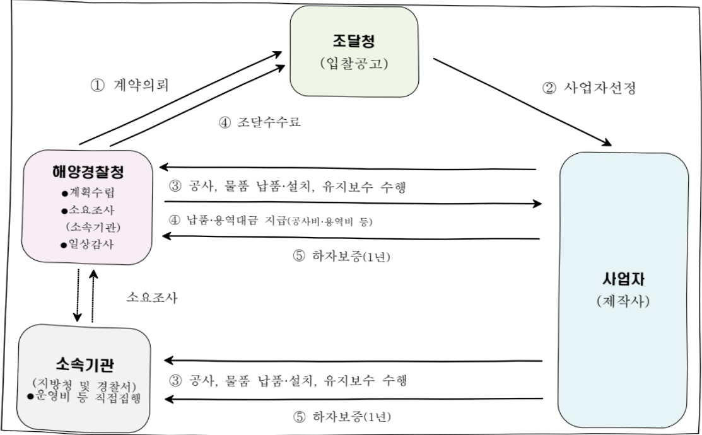

# 해양경찰정보화관리(정보화)

**해당 페이지**: PDF 4923 ~ 4934 쪽 해당

**부처**: 해양경찰청
**분야**: 공공질서 및 안전
**회계유형**: 일반회계
**2026 확정예산**: 29921.0 백만원
**전년대비 증감률**: 24.8%
**AI 도메인**: 데이터, 디지털전환(AX)

---

### 가. 예산 총괄표

(단위:백만원,%)

<table border=1 style='margin: auto; word-wrap: break-word;'><tr><td style='text-align: center; word-wrap: break-word;'>人尙명</td><td style='text-align: center; word-wrap: break-word;'>2024년 곁산</td><td style='text-align: center; word-wrap: break-word;'>2025년 예산 본예산</td><td style='text-align: center; word-wrap: break-word;'>2026년 예산 요구안</td><td style='text-align: center; word-wrap: break-word;'>본예산(B)</td><td style='text-align: center; word-wrap: break-word;'>중감 (B-A)</td><td style='text-align: center; word-wrap: break-word;'>(B-A)/A</td></tr><tr><td style='text-align: center; word-wrap: break-word;'>해양경찰정보화관리 (정보화)</td><td style='text-align: center; word-wrap: break-word;'>18,859</td><td style='text-align: center; word-wrap: break-word;'>23,966</td><td style='text-align: center; word-wrap: break-word;'>23,966</td><td style='text-align: center; word-wrap: break-word;'>29,921</td><td style='text-align: center; word-wrap: break-word;'>29,921</td><td style='text-align: center; word-wrap: break-word;'>5,955 24.8</td></tr></table>

□ 기능별(내역사업별), 목별 예산 내역

(단위:백만원)

<table border=1 style='margin: auto; word-wrap: break-word;'><tr><td rowspan="2"></td><td colspan="5">2024</td><td colspan="5">2025</td><td rowspan="2">2026예산</td></tr><tr><td style='text-align: center; word-wrap: break-word;'>예산액(추경)</td><td style='text-align: center; word-wrap: break-word;'>예산현액</td><td style='text-align: center; word-wrap: break-word;'>집행액</td><td style='text-align: center; word-wrap: break-word;'>이월액</td><td style='text-align: center; word-wrap: break-word;'>불용액</td><td style='text-align: center; word-wrap: break-word;'>예산액(추경)</td><td style='text-align: center; word-wrap: break-word;'>예산현액</td><td style='text-align: center; word-wrap: break-word;'>집행액</td><td style='text-align: center; word-wrap: break-word;'>이월액</td><td style='text-align: center; word-wrap: break-word;'>불용액</td></tr><tr><td style='text-align: center; word-wrap: break-word;'>ㅇ 기능별 분류(합계)</td><td style='text-align: center; word-wrap: break-word;'>19,473</td><td style='text-align: center; word-wrap: break-word;'>19,536</td><td style='text-align: center; word-wrap: break-word;'>18,859</td><td style='text-align: center; word-wrap: break-word;'>364</td><td style='text-align: center; word-wrap: break-word;'>313</td><td style='text-align: center; word-wrap: break-word;'>23,966</td><td style='text-align: center; word-wrap: break-word;'>23,966</td><td style='text-align: center; word-wrap: break-word;'>23,282</td><td style='text-align: center; word-wrap: break-word;'>679</td><td style='text-align: center; word-wrap: break-word;'>369</td><td style='text-align: center; word-wrap: break-word;'>29,921</td></tr><tr><td style='text-align: center; word-wrap: break-word;'>· 시스템 구축</td><td style='text-align: center; word-wrap: break-word;'>8,735</td><td style='text-align: center; word-wrap: break-word;'>8,798</td><td style='text-align: center; word-wrap: break-word;'>8,124</td><td style='text-align: center; word-wrap: break-word;'>364</td><td style='text-align: center; word-wrap: break-word;'>310</td><td style='text-align: center; word-wrap: break-word;'>12,027</td><td style='text-align: center; word-wrap: break-word;'>12,391</td><td style='text-align: center; word-wrap: break-word;'>11,440</td><td style='text-align: center; word-wrap: break-word;'>586</td><td style='text-align: center; word-wrap: break-word;'>365</td><td style='text-align: center; word-wrap: break-word;'>16,155</td></tr><tr><td style='text-align: center; word-wrap: break-word;'>· 기반 정보화</td><td style='text-align: center; word-wrap: break-word;'>10,282</td><td style='text-align: center; word-wrap: break-word;'>10,282</td><td style='text-align: center; word-wrap: break-word;'>10,280</td><td style='text-align: center; word-wrap: break-word;'>-</td><td style='text-align: center; word-wrap: break-word;'>2</td><td style='text-align: center; word-wrap: break-word;'>11,483</td><td style='text-align: center; word-wrap: break-word;'>11,483</td><td style='text-align: center; word-wrap: break-word;'>11,386</td><td style='text-align: center; word-wrap: break-word;'>93</td><td style='text-align: center; word-wrap: break-word;'>4</td><td style='text-align: center; word-wrap: break-word;'>13,310</td></tr><tr><td style='text-align: center; word-wrap: break-word;'>· 정보화관리지원</td><td style='text-align: center; word-wrap: break-word;'>456</td><td style='text-align: center; word-wrap: break-word;'>456</td><td style='text-align: center; word-wrap: break-word;'>455</td><td style='text-align: center; word-wrap: break-word;'>-</td><td style='text-align: center; word-wrap: break-word;'>1</td><td style='text-align: center; word-wrap: break-word;'>456</td><td style='text-align: center; word-wrap: break-word;'>456</td><td style='text-align: center; word-wrap: break-word;'>456</td><td style='text-align: center; word-wrap: break-word;'>-</td><td style='text-align: center; word-wrap: break-word;'>-</td><td style='text-align: center; word-wrap: break-word;'>456</td></tr></table>

### 나. 사업설명자료

## 1 ) 사업목적·내용

- (해양경찰정보화관리(정보화)) 정보화를 통해 업무 효율성과 투명성을 제고하고 조직의 혁신과 경쟁력을 강화하기 위해 시스템 구축, 기반 인프라 고도화, 정보화 지원을 통해 디지털 기반의 업무환경 조성

- (시스템 구축) 일원화된 데이터 기반 생태계를 조성하고 디지털 혁신기술 인프라

황층으로 지식정보 중심의 디지털 해양경찰 구현

·미래 환경변화 및 정책수요에 맞춰 해양 데이터를 수집·분석·공유·활용하기 위한 해양경찰 정보시스템 구축

· 정보시스템 고도화 사업을 공공 클라우드로 단계적 전환하여 운영예산 절감, 긴급 상황 대응 등 운영 효율화 도모

·례저면허·수상구조사 자격시험 등 대국민 행정 수요에 대응한 모바일 행정 서비스

---

## 제공으로 대국민 편익 도모

- (기반 정보화) 전국 해양경찰 관서 전용회선 사용료 지원 및 PC, 노트북 등 전산장비 교체

(정보화 지원) 본청, 5개 지방청, 21개 해양경찰서 등 전국 해양경찰 정보통신 활동

업무지원 및 기본적 행정 사무용품 등 지원

## 2 ) 사업개요

## □ 사업근거 및 추진경위

(1) 법령상 근거 및 조항 적시

- 지능정보화 기본법 제7조(지능정보사회 실행계획의 수립) 중앙행정기관의 장은 종합 계획에 따라 매년 지능정보사회 실행계획을 수립·시행하여야 한다.

- 지능정보화 기본법 제15조(공공지능정보화의 추진) 국가기관 등은 공공서비스의 지능정보화를 도모하고 국민 편의 증진 등을 위하여 재난안전, 치안 등 소관 업무에 대한 지능정보화를 추진하여야 한다.

- 클라우드컴퓨팅 발전 및 이용자 보호에 관한 법률 제5조(기본계획 및 시행계획의 수립)

중앙행정기관의 장은 기본계획에 따라 매년 소관별 시행계획을 수립·시행하여야 한다.

- 클라우드컴퓨팅 발전 및 이용자 보호에 관한 법률 제15조(국가기관등의 클라우드컴퓨팅 도입 촉진) 정부는 지능정보화 정책이나 사업 추진에 필요한 예산을 편성할 때에는 클라우드컴퓨팅 도입을 우선적으로 고려하여야 한다.

- 클라우드컴퓨팅 발전 및 이용자 보호에 관한 법률 제20조(공공기관의 클라우드컴퓨팅 서비스 이용 촉진) 정부는 공공기관이 업무를 위하여 클라우드컴퓨팅서비스 제공자의 클라우드컴퓨팅서비스를 이용할 수 있도록 노력하여야 한다.

- 전자정부법 제5조의2(기관별 계획의 수립 및 점검) 행정기관등의 장은 5년마다 해당 기관의 전자정부의 구현·운영 및 발전을 위한 기본계획을 수립하여 중앙사무관장 기관의 장에게 제출하여야 한다.

- 전자정부범 제16조(전자정부서비스 개발 · 제공) 행정기관등의 장은 국민의 복지향상 및 편의증진, 국민생활의 안전보장, 창업 및 공장설립 등 기업활동의 촉진 등을 위한 전자정부서비스를 개발하여 제공하고 이를 지속적으로 보완 · 발전시키기 위한 대책을 마련하여야 한다.

- 전자정부법 제18조(유비쿼터스 기반의 전자정부서비스 도입·활용) 행정기관등의 장은 침단 정보통신기술을 활용하여 국민·기업 등이 언제 어디서나 활용할 수 있는 행정·교통·복지·환경·재난안전 등의 서비스를 제공하여야 하며, 이에 필요한 시책을 마련하여야 한다.

---

- 전자정부법 제56조(정보통신망 등의 보안대책 수립 · 시행) 행정부는 전자정부의 구현에 필요한 정보통신망과 행정정보 등의 안전성 및 신뢰성 확보를 위한 보안대책을 마련하여야 한다.

## ② 추진경위

- 지능정보사회 기본계획에 의거 매년 지능정보사회 실행계획 수립/시행

- 업무의 전자화 및 정보자원 관리를 위한 정보기술 아키텍처 수립

- 신기술 적용을 위한 업무고도화 및 정보화시스템 유지관리

- 안전하고 성숙한 정보사회 구현과 대국민 서비스 향상

## □ 주요내용

① 사업규모

- 총사업비 : 해당없음

- 사업기간 : 계속사업

- 최근 5년 간 투입된 사업비(예산액기준, 추경편성한 연도에는 추경포함)

<table border=1 style='margin: auto; word-wrap: break-word;'><tr><td style='text-align: center; word-wrap: break-word;'>연도</td><td style='text-align: center; word-wrap: break-word;'>2022</td><td style='text-align: center; word-wrap: break-word;'>2023</td><td style='text-align: center; word-wrap: break-word;'>2024</td><td style='text-align: center; word-wrap: break-word;'>2025</td><td style='text-align: center; word-wrap: break-word;'>2026</td></tr><tr><td style='text-align: center; word-wrap: break-word;'>사업비</td><td style='text-align: center; word-wrap: break-word;'>19,865</td><td style='text-align: center; word-wrap: break-word;'>17,602</td><td style='text-align: center; word-wrap: break-word;'>19,473</td><td style='text-align: center; word-wrap: break-word;'>23,966</td><td style='text-align: center; word-wrap: break-word;'>29,921</td></tr></table>

- 기타: 해당없음

② 사업추진체계

- 사업시행방법 : 직접수행

- 사업시행주체 : 해양경찰청

- 사업 수혜자 : 해양경찰청 직원 및 국민

- 보조, 융자, 출연, 출자 등의 경우 보조·융자 등 지원 비율 및 법적근거 : 해당없음

## 3 ) 2026년도 예산 산출 근거

□ '26년도 예산 : ('25) 23,966 → ('26) 29,921백만원, 5,955백만원 증액, +24.8%

(26) 29,921 백만원, 5,955 백만원 증액, +24.8%
① 해양환경 위기대응 통합지원시스템 구축
: (25) 1,141 → (26) 783백만원, △358백만원, △31.4%
- (내용) 해양환경 변화에 따른 화학물질 유출과 화재·폭발을 동반한 복합사고 대응을 위해 R&D 성과물과 융합하여 신규 형태의 사고에 지원 가능한 재난대응 통합시스템 구축
- (산출) 시스템 개발비 783백만원
② 차세대 통합 장비관리시스템 구축
: (25) 1,776 → (26) 1,474백만원, △302백만원, △20.5%
- (내용) 통합장비관리시스템(1차사업)의 계속사업으로 물품등록 자동화(바코드 등) 시스템 구축 및 정비데이터

---

문서중앙화(ECM) 구축, A.I기반 생성형 검색 등의 시스템 기능 강화를 통해 업무 효율성 극대화를 위한 맞춤형 장비관리시스템 구축

- (산출) 시스템 개발비 932백만원 + 상용 SW 구입비 542백만원

## ③ 통합건강관리시스템 구축

:(25)410→(26)237백만원,△173백만원,△42.2%

- (내용) 해양경찰 직무특성 및 근무환경에 따른 유해인자 정보를 분석하고 체계적인 건강관리와 근무환경 개선을 위한「해양경찰 통합건강관리시스템」구축

- (산출) 시스템 개발비 136백만원 +NW 구입비 101백만원

## ④ AI 통합관제 플랫폼 구축

:(25)0→(26)1,301백만원,신규

- (내용) 긴급신고 접수부터 통합 상황관리까지 안정적인 체계 운용을 위해 정보시스템의 서비스 안정성 확보,

장애로 인한 국민의 불편을 최소화를 위한 통합 관제체계 구축

- (산출) 1,301백만원(자산취득비 1,099백만원, 관리용역비 202백만원)

## ⑤ GIS 위치정보시스템 통합 구축

:(25)0→(26)1,642백만원,신규

- (내용) 해양경찰청 독립적으로 운영되는 9개 GIS 관련 시스템을 하나 GIS 플랫폼 기반으로 통합 구축하여 데이터 품질과 정확성 확보로 해양에서의 신속하고 정확한 국민보호 임무 수행

- (산출) 1,642백만원(시스템 개발비 982백만원, 자산취득비 660백만원)

## ⑥ 수상레저종합정보시스템 고도화

:(25)0→(26)578백만원,신규

- (내용) 「수중레저법」의 해수부→해양경찰청 이관(4.22 공포/26년 시행)으로 수중레저활동 안전관리 및 사업자 등록 신규 사무업무 수행에 필요한 기능개발을 위해 시스템 고도화

- (산출) 578백만원(시스템 개발비 544백만원, 자산취득비 34백만원)

⑦ KICS(마약사범 조회·추적) 시스템 고도화

:(25)0→(26)841백만원,신규

- (내용) 해양에서 밀반입 유통되는 마약류 범죄 대응과 경찰청-해경 마약수사 정보 연계를위한 KICS(마약류 사범 조회·추적) 시스템 고도화

- (산출) 841백만원(시스템 개발비 643백만원, 자산취득비 198백만원)

## ⑧ 차세대 해양상황관리시스템 구축 ISP

:(25)0→(26)221백만원,신규

- (내용) 상황처리 시간 단축, 수색구조 성공률 향상을 위한 AI 등 첨단기술 적용 및 분산 운영 중인 신고접수.

상황관리 시스템 통합 구축을 위한 정보화 전략 수립(ISP)

## - (산출) ISP 수립비 221백만원

## ⑨ AI 기반 불법조업 탐지·차단 플랫폼 구축

:(25)0→(26)3,214백만원,신규

- (내용) AI 기술 기반으로 불법조업 예측·탐지·대응시스템 구축과 유관기관 간 해양 데이터 통합 및 단속정보를 실시간 공유체계 확립

- (산출) 시스템 개발비 1,604백만원, 자산취득비 1,610백만원

## 10 정보화시스템 통합지관리

:(25)1,963→(26)1,767백만원,△196백만원,△10%

- (내용) 해양경찰청 정보시스템 안전성 확보 및 장애예방, 사용자 지원 등을 위한 통합(22종) 유지관리

- (산출) 정보화시스템 유지관리비 1,963백만원(22식×80.32백만원)

---

11 정보화시스템 유지관리(기타)

:(25)3,658→(26)2,963백만원,△695백만원,△19%

- (내용) 정보화시스템을 안정적 운영을 위한 정기점검 및 보안 등 유지관리

- (산출) 정보화시스템 유지관리비 2,963백만원(8식×307.4백만원)

## 12 사이버보안관제센터 위탁운영

:(25)896→(26)762백만원,△134백만원,△15%

- (내용) 24시간 정보시스템·네트워크 보안관제 및 정보보호시스템(23종 73대)에 대한 해킹시도 탐지 대응업무 수행

- (산출) 사이버보안관제센터 위탁운영비 762백만원(7.94백만원×8명×12月)

## 13 차세대 KICS 필수 라이센스 구매

:(25) 592 → (26) 372백만원, △220백만원, △37.2%

- (내용) 형사사법정보시스템의 보안성 강화 및 안정적 운영을 위한 필수 라이센스 구매

## 14 노후 전산장비 교체

- (산출) SW 구입비 372백만원

:(25)3,402→(26)3,710백만원,+308백만원,+9.1%

- (내용) 전국 해양경찰 32개 관서 대상 8년 초과된 PC 등 노후 전산장비 교체

- (산출) 전산징비 교체 구매 임차료 3,710백만원

## 15 노후 정보화 기반장비 교체

:(25)1,965→(26)2,576백만원,+611백만원,+31.1%

- (내용) 정보화 운영을 위한 필수 기반 장비를 정기적으로 노후 교체 하여 네트워크 환경 및 정보화 시스템을 안정적으로 운영

- (산출) 노후 정보화 기반장비 교체 임차료 2,576백만원

## 16 서부정비창 정보통신망 구축

:(25)81→(26)324백만원. +243백만원. +300%

- (내용) 서부정비창 준공 및 조직 신설에 따라 효율적인 사무환경 조성을 위해 내·외부 행정망 전산장비, 전자교환기, 영상회의시스템 등 정보통신망 구축

## - (산출) 324백만원(81백만원×4분기)

## 17 위성센터 정보통신망 구축

:(25)93→(26)372백만원,279백만원,+300%

- (내용) 해양경찰위성센터 준공에 맞춰 효율적인 사무환경 조성을 위해 전산시스템, 정보통신망, 정보보호시스템 구축 - (산출) 372백만원(93백만원×4분기)

## 18 특수기록관 정보통신망 구축

:(25)0→(26)81백만원,신규

- (내용) 해양경찰 특수기록관(26년 상반기) 개관에 따라 내 외부 행정망, 전자교환기, 영상회의 시스템 등 정보통신망 구축으로 효율적 업무수행을 위한 근무 환경 조성

## - (산출) 81백만원(27백만원×3분기)

## 19 네트워크 회선료

: ('25) 5,942 → ('26) 6,247 백만원, +305 백만원, +5.1%

- (내용) 전국 해양경찰 관서 업무망 전용회선료로 신규 소요 발생에 따른 회선료 증액

- (산출) 네트워크

## ② 정보화 지원

:(25) 456 → (26) 456백만원, 전년동

- (내용) 소속기관 행정지원(전산소모품 등 구입) 등을 감안, 전년동

---

<table border=1 style='margin: auto; word-wrap: break-word;'><tr><td style='text-align: center; word-wrap: break-word;'>- (산출) 정보화 지원비 456백만원</td></tr><tr><td style='text-align: center; word-wrap: break-word;'>② 중요기록물 디지털 및 보존</td></tr><tr><td style='text-align: center; word-wrap: break-word;'>: (&#x27;25) 207 → (&#x27;26) 0백만원, △207백만원, △100%, 종료</td></tr><tr><td style='text-align: center; word-wrap: break-word;'>- (내용) 해양경찰청에서 생산된 중요기록물을 통합 보존 ·활용을 위한 보안문서, 사진, 동영상 등을 DB화하여 이중 보존체계를 구축</td></tr><tr><td style='text-align: center; word-wrap: break-word;'>※ 재정 여건 호전 시 재요구 예정</td></tr><tr><td style='text-align: center; word-wrap: break-word;'>② 전국 VTS 통합연계망 구축 ISP</td></tr><tr><td style='text-align: center; word-wrap: break-word;'>: (&#x27;25) 352 → (&#x27;26) 0백만원, △352백만원, △100%, 종료</td></tr><tr><td style='text-align: center; word-wrap: break-word;'>- (내용) 관제 정보를 중앙에서 통합·공유하고 신기술을 효율적으로 도입하고자 기술개발을 적용한 전국 VTS 통합연계망 구축을 위한 정보화 전략 수립(ISP)</td></tr><tr><td style='text-align: center; word-wrap: break-word;'>※ ISP 수립 후 &#x27;27년도 예산 신청 예정</td></tr><tr><td style='text-align: center; word-wrap: break-word;'>② 통합신고처리시스템 서버이전</td></tr><tr><td style='text-align: center; word-wrap: break-word;'>: (&#x27;25) 1,049 → (&#x27;26) 0백만원, △1,049백만원, △100%, 종료</td></tr><tr><td style='text-align: center; word-wrap: break-word;'>- (내용) &#x27;25.6월 긴급신고공동관리센터(대구 중앙119)가 국가정보자원관리원 대구센터로 이전함에 따라 센터 내 우리청 장비 사용 불가로 우리청으로 이전 필요</td></tr><tr><td style='text-align: center; word-wrap: break-word;'>- (산출) 서버이전비 1,049백만원(관리용역 204백만원, 시설구매 400백만원, 서버실 공사 441백만원, 감리비 4백만)</td></tr></table>

## 4 ) 사업효과

□ 사업영향, 산출물 성과지표 등

①2022~2026년도 성과계획서 상 성과지표 및 최근 5년간 성과 달성도

<table border=1 style='margin: auto; word-wrap: break-word;'><tr><td style='text-align: center; word-wrap: break-word;'>성과지표</td><td style='text-align: center; word-wrap: break-word;'>구분</td><td style='text-align: center; word-wrap: break-word;'>&#x27;22</td><td style='text-align: center; word-wrap: break-word;'>&#x27;23</td><td style='text-align: center; word-wrap: break-word;'>&#x27;24</td><td style='text-align: center; word-wrap: break-word;'>&#x27;25</td><td style='text-align: center; word-wrap: break-word;'>&#x27;26</td><td style='text-align: center; word-wrap: break-word;'>&#x27;26목표치산출근거</td><td style='text-align: center; word-wrap: break-word;'>측정산식(또는 측정방법)</td><td style='text-align: center; word-wrap: break-word;'>자료수집방법(또는 자료출처)</td></tr><tr><td rowspan="3">온라인 서비스최적화율(단위:%)</td><td style='text-align: center; word-wrap: break-word;'>목표</td><td style='text-align: center; word-wrap: break-word;'>변경</td><td style='text-align: center; word-wrap: break-word;'>-</td><td style='text-align: center; word-wrap: break-word;'>-</td><td style='text-align: center; word-wrap: break-word;'>-</td><td style='text-align: center; word-wrap: break-word;'></td><td rowspan="3">(&#x27;21&#x27;)&#x27;20년도대비 0.7%증가한99.3%로 설정</td><td rowspan="3">{(전체시간-총장애시간) / 전체시간} × 100</td><td rowspan="3">국가정보자원관리원</td></tr><tr><td style='text-align: center; word-wrap: break-word;'>실적</td><td style='text-align: center; word-wrap: break-word;'>변경</td><td style='text-align: center; word-wrap: break-word;'>-</td><td style='text-align: center; word-wrap: break-word;'>-</td><td style='text-align: center; word-wrap: break-word;'>-</td><td style='text-align: center; word-wrap: break-word;'>-</td></tr><tr><td style='text-align: center; word-wrap: break-word;'>달성도</td><td style='text-align: center; word-wrap: break-word;'>변경</td><td style='text-align: center; word-wrap: break-word;'>-</td><td style='text-align: center; word-wrap: break-word;'>-</td><td style='text-align: center; word-wrap: break-word;'>-</td><td style='text-align: center; word-wrap: break-word;'>-</td></tr><tr><td rowspan="3">직원 만족도(단위:점)</td><td style='text-align: center; word-wrap: break-word;'>목표</td><td style='text-align: center; word-wrap: break-word;'>변경</td><td style='text-align: center; word-wrap: break-word;'>-</td><td style='text-align: center; word-wrap: break-word;'>-</td><td style='text-align: center; word-wrap: break-word;'>-</td><td style='text-align: center; word-wrap: break-word;'></td><td rowspan="3">(&#x27;21&#x27;)&#x27;20년도보다0.1점 높고최근3년(&#x27;18~20년)평균실적 보다2.2점 높은목표치 설정</td><td rowspan="3">복지정책 수혜자대상 온라인설문 만족도점수 - 복지정책 수혜자(경찰관,일반직동 해경청소속 직원)</td><td rowspan="3">해경청직원설문조사 및 공문 및외부망 시스템 확인 등</td></tr><tr><td style='text-align: center; word-wrap: break-word;'>실적</td><td style='text-align: center; word-wrap: break-word;'>변경</td><td style='text-align: center; word-wrap: break-word;'>-</td><td style='text-align: center; word-wrap: break-word;'>-</td><td style='text-align: center; word-wrap: break-word;'>-</td><td style='text-align: center; word-wrap: break-word;'>-</td></tr><tr><td style='text-align: center; word-wrap: break-word;'>달성도</td><td style='text-align: center; word-wrap: break-word;'>변경</td><td style='text-align: center; word-wrap: break-word;'>-</td><td style='text-align: center; word-wrap: break-word;'>-</td><td style='text-align: center; word-wrap: break-word;'>-</td><td style='text-align: center; word-wrap: break-word;'>-</td></tr><tr><td rowspan="3">직원 직무역량제고율(단위:%)</td><td style='text-align: center; word-wrap: break-word;'>목표</td><td style='text-align: center; word-wrap: break-word;'>변경</td><td style='text-align: center; word-wrap: break-word;'>-</td><td style='text-align: center; word-wrap: break-word;'>-</td><td style='text-align: center; word-wrap: break-word;'>-</td><td style='text-align: center; word-wrap: break-word;'></td><td rowspan="3">(&#x27;21&#x27;)코로나감안 비대면교육과정 운영실적 산출</td><td rowspan="3">[전문화 교육이수인원(명) / 현원(명)] × 100%</td><td rowspan="3">에듀오션교육훈련 평가시스템에 의한교육 이수자료 이용</td></tr><tr><td style='text-align: center; word-wrap: break-word;'>실적</td><td style='text-align: center; word-wrap: break-word;'>변경</td><td style='text-align: center; word-wrap: break-word;'>-</td><td style='text-align: center; word-wrap: break-word;'>-</td><td style='text-align: center; word-wrap: break-word;'>-</td><td style='text-align: center; word-wrap: break-word;'>-</td></tr><tr><td style='text-align: center; word-wrap: break-word;'>달성도</td><td style='text-align: center; word-wrap: break-word;'>변경</td><td style='text-align: center; word-wrap: break-word;'>-</td><td style='text-align: center; word-wrap: break-word;'>-</td><td style='text-align: center; word-wrap: break-word;'>-</td><td style='text-align: center; word-wrap: break-word;'>-</td></tr><tr><td rowspan="3">해양경찰서비스이용 고객만족도(단위:점)</td><td style='text-align: center; word-wrap: break-word;'>목표</td><td style='text-align: center; word-wrap: break-word;'>83.3</td><td style='text-align: center; word-wrap: break-word;'>변경</td><td style='text-align: center; word-wrap: break-word;'>-</td><td style='text-align: center; word-wrap: break-word;'>-</td><td style='text-align: center; word-wrap: break-word;'></td><td rowspan="3">3년치 평균값0.1점 상향</td><td rowspan="3">서비스 이용고객 만족도(평점합계/표본인원수)</td><td rowspan="3">설문조사</td></tr><tr><td style='text-align: center; word-wrap: break-word;'>실적</td><td style='text-align: center; word-wrap: break-word;'>81.8</td><td style='text-align: center; word-wrap: break-word;'>변경</td><td style='text-align: center; word-wrap: break-word;'>-</td><td style='text-align: center; word-wrap: break-word;'>-</td><td style='text-align: center; word-wrap: break-word;'>-</td></tr><tr><td style='text-align: center; word-wrap: break-word;'>달성도</td><td style='text-align: center; word-wrap: break-word;'>98.2%</td><td style='text-align: center; word-wrap: break-word;'>변경</td><td style='text-align: center; word-wrap: break-word;'>-</td><td style='text-align: center; word-wrap: break-word;'>-</td><td style='text-align: center; word-wrap: break-word;'>-</td></tr><tr><td style='text-align: center; word-wrap: break-word;'>온라인 서비스</td><td style='text-align: center; word-wrap: break-word;'>목표</td><td style='text-align: center; word-wrap: break-word;'>99.7</td><td style='text-align: center; word-wrap: break-word;'>변경</td><td style='text-align: center; word-wrap: break-word;'>-</td><td style='text-align: center; word-wrap: break-word;'>-</td><td style='text-align: center; word-wrap: break-word;'></td><td style='text-align: center; word-wrap: break-word;'>전년대비 0.4%</td><td style='text-align: center; word-wrap: break-word;'>({전체시간-총</td><td style='text-align: center; word-wrap: break-word;'>국가정보자원</td></tr></table>

---

<table border=1 style='margin: auto; word-wrap: break-word;'><tr><td rowspan="2">최적화율(단위:%)</td><td style='text-align: center; word-wrap: break-word;'>실적</td><td style='text-align: center; word-wrap: break-word;'>99.8</td><td style='text-align: center; word-wrap: break-word;'>변경</td><td style='text-align: center; word-wrap: break-word;'>-</td><td style='text-align: center; word-wrap: break-word;'>-</td><td style='text-align: center; word-wrap: break-word;'>-</td><td rowspan="2">상향 조정</td><td rowspan="2">장애시간) / 전체시간) × 100</td><td rowspan="2">관리원</td></tr><tr><td style='text-align: center; word-wrap: break-word;'>달성도</td><td style='text-align: center; word-wrap: break-word;'>99.9%</td><td style='text-align: center; word-wrap: break-word;'>변경</td><td style='text-align: center; word-wrap: break-word;'>-</td><td style='text-align: center; word-wrap: break-word;'>-</td><td style='text-align: center; word-wrap: break-word;'>-</td></tr><tr><td rowspan="3">해양경찰연구개발 현장활용성(단위:점)</td><td style='text-align: center; word-wrap: break-word;'>목표</td><td style='text-align: center; word-wrap: break-word;'>84</td><td style='text-align: center; word-wrap: break-word;'>변경</td><td style='text-align: center; word-wrap: break-word;'>-</td><td style='text-align: center; word-wrap: break-word;'>-</td><td style='text-align: center; word-wrap: break-word;'></td><td rowspan="3">성과물의 현장활용성을 위한 계획 성능목표달성도 목표치</td><td rowspan="3">(기술·장비성능목표달성도*06) +(사용자만족도*0.4)</td><td rowspan="3">연구개발과제수행보고서만족도 조사</td></tr><tr><td style='text-align: center; word-wrap: break-word;'>실적</td><td style='text-align: center; word-wrap: break-word;'>87.4</td><td style='text-align: center; word-wrap: break-word;'>변경</td><td style='text-align: center; word-wrap: break-word;'>-</td><td style='text-align: center; word-wrap: break-word;'>-</td><td style='text-align: center; word-wrap: break-word;'>-</td></tr><tr><td style='text-align: center; word-wrap: break-word;'>달성도</td><td style='text-align: center; word-wrap: break-word;'>104%</td><td style='text-align: center; word-wrap: break-word;'>변경</td><td style='text-align: center; word-wrap: break-word;'>-</td><td style='text-align: center; word-wrap: break-word;'>-</td><td style='text-align: center; word-wrap: break-word;'>-</td></tr><tr><td rowspan="3">국민만족도(단위:점)</td><td style='text-align: center; word-wrap: break-word;'>목표</td><td style='text-align: center; word-wrap: break-word;'>신규</td><td style='text-align: center; word-wrap: break-word;'>83.0</td><td style='text-align: center; word-wrap: break-word;'>변경</td><td style='text-align: center; word-wrap: break-word;'>-</td><td style='text-align: center; word-wrap: break-word;'></td><td rowspan="2">(&#x27;23&#x27;) &#x27;20&#x27; &#x27;22년 3년 평균점수 82.7보다 0.3상향</td><td rowspan="2">해양경찰국민만족도 조사(치안서비스 점수+체감안전도 점수) / 2</td><td rowspan="2">자체 조사시스템이용 조사 및 외부용역을 통해 조사/공문</td></tr><tr><td style='text-align: center; word-wrap: break-word;'>실적</td><td style='text-align: center; word-wrap: break-word;'>신규</td><td style='text-align: center; word-wrap: break-word;'>-</td><td style='text-align: center; word-wrap: break-word;'>변경</td><td style='text-align: center; word-wrap: break-word;'>-</td><td style='text-align: center; word-wrap: break-word;'>-</td></tr><tr><td style='text-align: center; word-wrap: break-word;'>달성도</td><td style='text-align: center; word-wrap: break-word;'>신규</td><td style='text-align: center; word-wrap: break-word;'>-</td><td style='text-align: center; word-wrap: break-word;'>변경</td><td style='text-align: center; word-wrap: break-word;'>-</td><td style='text-align: center; word-wrap: break-word;'>-</td><td rowspan="4">(&#x27;23&#x27;) 사업별 착수시기 감안성능목표달성도를 구분하여 평균값으로 설정</td><td rowspan="4">과제별 시제품 연차 성능목표달성도 합계/대상 과제수</td><td rowspan="4">연구개발 과제수행 보고서</td></tr><tr><td rowspan="3">해양경찰연구개발성능목표달성도(단위:점)</td><td style='text-align: center; word-wrap: break-word;'>목표</td><td style='text-align: center; word-wrap: break-word;'>신규</td><td style='text-align: center; word-wrap: break-word;'>80</td><td style='text-align: center; word-wrap: break-word;'>변경</td><td style='text-align: center; word-wrap: break-word;'>-</td><td style='text-align: center; word-wrap: break-word;'></td></tr><tr><td style='text-align: center; word-wrap: break-word;'>실적</td><td style='text-align: center; word-wrap: break-word;'>신규</td><td style='text-align: center; word-wrap: break-word;'>-</td><td style='text-align: center; word-wrap: break-word;'>변경</td><td style='text-align: center; word-wrap: break-word;'>-</td><td style='text-align: center; word-wrap: break-word;'>-</td></tr><tr><td style='text-align: center; word-wrap: break-word;'>달성도</td><td style='text-align: center; word-wrap: break-word;'>신규</td><td style='text-align: center; word-wrap: break-word;'>-</td><td style='text-align: center; word-wrap: break-word;'>변경</td><td style='text-align: center; word-wrap: break-word;'>-</td><td style='text-align: center; word-wrap: break-word;'>-</td></tr><tr><td rowspan="3">정보시스템서비스최적화율(단위:점)</td><td style='text-align: center; word-wrap: break-word;'>목표</td><td style='text-align: center; word-wrap: break-word;'>신규</td><td style='text-align: center; word-wrap: break-word;'>75</td><td style='text-align: center; word-wrap: break-word;'>변경</td><td style='text-align: center; word-wrap: break-word;'>-</td><td style='text-align: center; word-wrap: break-word;'></td><td rowspan="3">(&#x27;23&#x27;) 측정대상기간 (&#x27;22.5~12&#x27;) 내 조사항목 중 가중치 고려 평균값으로 설정</td><td rowspan="3">(단순문의처리목표달성도*0.3) +(오류문의처리목표달성도*0.1) +(AP장애복구목표달성도*0.6)</td><td rowspan="3">해양경찰SR시스템</td></tr><tr><td style='text-align: center; word-wrap: break-word;'>실적</td><td style='text-align: center; word-wrap: break-word;'>신규</td><td style='text-align: center; word-wrap: break-word;'>76.9</td><td style='text-align: center; word-wrap: break-word;'>변경</td><td style='text-align: center; word-wrap: break-word;'>-</td><td style='text-align: center; word-wrap: break-word;'>-</td></tr><tr><td style='text-align: center; word-wrap: break-word;'>달성도</td><td style='text-align: center; word-wrap: break-word;'>신규</td><td style='text-align: center; word-wrap: break-word;'>102.5</td><td style='text-align: center; word-wrap: break-word;'>변경</td><td style='text-align: center; word-wrap: break-word;'>-</td><td style='text-align: center; word-wrap: break-word;'>-</td></tr><tr><td rowspan="3">해양경찰국민만족도(단위:%)</td><td style='text-align: center; word-wrap: break-word;'>목표</td><td style='text-align: center; word-wrap: break-word;'>신규</td><td style='text-align: center; word-wrap: break-word;'>신규</td><td style='text-align: center; word-wrap: break-word;'>89.4</td><td style='text-align: center; word-wrap: break-word;'>89.7</td><td style='text-align: center; word-wrap: break-word;'>90.0</td><td rowspan="3">여론조사 특성상표본 통제가 어렵고 점수는 해마다 우상향, 목표치 상향보다 90점 이상의 &#x27;우수&#x27; 등급 유지</td><td rowspan="3">(치안서비스 점수 ×80% + 체감안전도 점수×20%)</td><td rowspan="3">자체 조사시스템이용조사 및 외부용역을 통해 조사/공문</td></tr><tr><td style='text-align: center; word-wrap: break-word;'>실적</td><td style='text-align: center; word-wrap: break-word;'>88.2</td><td style='text-align: center; word-wrap: break-word;'>90.8</td><td style='text-align: center; word-wrap: break-word;'>94.1</td><td style='text-align: center; word-wrap: break-word;'>-</td><td style='text-align: center; word-wrap: break-word;'>-</td></tr><tr><td style='text-align: center; word-wrap: break-word;'>달성도</td><td style='text-align: center; word-wrap: break-word;'>-</td><td style='text-align: center; word-wrap: break-word;'>-</td><td style='text-align: center; word-wrap: break-word;'>101.6</td><td style='text-align: center; word-wrap: break-word;'>-</td><td style='text-align: center; word-wrap: break-word;'>-</td></tr></table>

② 성과지표 이외의 연도별 사업추진 경과 및 실적 : 해당없음

## ③ 향후(2026년도 이후) 기대효과

- AI 통합관제 플랫폼 구축으로, 긴급신고~통합상황관리의 안정적인 체계 운용을 통해 정보시스템의 서비스 안정성 확보, 장애로 인한 국민불편 최소화

- 차세대 해양상황관리시스템 ISP 설계를 통한, AI 등 첨단기술 적용 및 현재 분산

운영 중인 신고접수·상황관리 시스템 통합구축을 통해 신속한 구조활동 지원

- GIS 위치정보시스템 통합 구축으로, 독립적으로 운영된 9개 GIS 관련 시스템을 하나로 구축하여 데이터 품질과 정확성 확보로 해양에서의 신속·정확한 구조활동 지원

- 기존 수상레저종합정보시스템 고도화 사업을 통해 이관된「수중레저법」의 신규 사무

업무수행과 민원서비스 제공 및 수중레저활동 지원

- AI 기반 불법조업 탐지·차단 플랫폼 구축으로 AI 기술을 기반으로 불법어선 조업

---

예측·탐지·대응시스템 구축과 유관기관 간 해양 데이터 통합 및 단속 정보 실시간

공유체계 확립

- 그 외 해양경찰 정보화시스템을 활용하여 해양 안전, 구조, 경비 등 다양한 분야에

적용되어 국민의 생명과 재산 보호에 기여

## 5 ) 타당성조사 및 예비타당성조사 시행여부 및 결과 요지 : 해당없음

## 6 ) 총사업비 대상사업 여부 및 내역 : 해당없음

## 7 ) 사업 집행절차

---

(단위: 백만원)

<table border=1 style='margin: auto; word-wrap: break-word;'><tr><td style='text-align: center; word-wrap: break-word;'>2024</td><td style='text-align: center; word-wrap: break-word;'>2025</td><td style='text-align: center; word-wrap: break-word;'>2026</td><td style='text-align: center; word-wrap: break-word;'>2027</td><td style='text-align: center; word-wrap: break-word;'>2028</td><td style='text-align: center; word-wrap: break-word;'>2029</td></tr><tr><td style='text-align: center; word-wrap: break-word;'>2024~2028</td><td style='text-align: center; word-wrap: break-word;'>19,473</td><td style='text-align: center; word-wrap: break-word;'>37,319</td><td style='text-align: center; word-wrap: break-word;'>33,327</td><td style='text-align: center; word-wrap: break-word;'>31,521</td><td style='text-align: center; word-wrap: break-word;'>28,999</td></tr><tr><td style='text-align: center; word-wrap: break-word;'>2025~2029</td><td style='text-align: center; word-wrap: break-word;'></td><td style='text-align: center; word-wrap: break-word;'>23,966</td><td style='text-align: center; word-wrap: break-word;'>47,457</td><td style='text-align: center; word-wrap: break-word;'>48,555</td><td style='text-align: center; word-wrap: break-word;'>39,489</td></tr></table>

## 9 ) 최근 3년간 동 사업에 대한 주요 외부지적사항 및 평가, 문제점 및 대책

<table border=1 style='margin: auto; word-wrap: break-word;'><tr><td style='text-align: center; word-wrap: break-word;'>1) 국회(예결위, 상임위, 예정처, 국정감사 포함) 지적가) 분산된 시스템의 기능별 통폐합 추진 필요(농해수위, 25예산)나) 정보시스템 유지보수체계 개편 필요(예정처, 24결산)다) 정보화사업 담당 인력 및 조직 보강 필요(예정처, 24결산)</td></tr><tr><td style='text-align: center; word-wrap: break-word;'>2) 감사원 감사 또는 국무총리실 지적 : 해당없음</td></tr><tr><td style='text-align: center; word-wrap: break-word;'>3) 자체평가·감사가) 정보시스템 구축 및 운영실태(자체, ‘23특정감사)</td></tr><tr><td style='text-align: center; word-wrap: break-word;'>① 정보시스템 관리체계 개선 및 전문성 강화 필요② 정보시스템 구축분야 사업관리 미흡③ 익스플로러 브라우저 종료에 따른 최신버전 고도화 추진 미흡</td></tr><tr><td style='text-align: center; word-wrap: break-word;'>4) 기타 시민단체, 언론 및 민원 : 해당없음</td></tr><tr><td style='text-align: center; word-wrap: break-word;'>5) 문제점 지적에 대한 후속조치가) 국회(예결위, 상임위, 예정처, 국정감사 포함) 후속조치</td></tr><tr><td style='text-align: center; word-wrap: break-word;'>① 정보화 혁신 T/F 운영(‘25.3~)② 정보화 기본계획 수립 용역(‘25.5~)* 정보시스템 통폐합(안), 개별유지보수 통합, 정보화 조직 및 인력 확충(안)</td></tr><tr><td style='text-align: center; word-wrap: break-word;'>나) 자체평가·감사 후속조치</td></tr><tr><td style='text-align: center; word-wrap: break-word;'>① 정보화사업 전담관리 계획 수립 및 전담관리 시행② 정보기술아키텍처(EA) 관리 지침 마련③ 웹표준 고도화 추진</td></tr></table>

---

10) 향후 추진방향 및 추진계획

<table border=1 style='margin: auto; word-wrap: break-word;'><tr><td style='text-align: center; word-wrap: break-word;'>○ (시스템 구축) 일원화된 데이터 기반 생태계를 조성하고 디지털 혁신기술 인프라 확충으로 지식정보 중심의 디지털 해양경찰 구현</td></tr><tr><td style='text-align: center; word-wrap: break-word;'>- AI기술 도입 등 미래 환경변화 및 정책수요에 맞춰 다양한 내외부 데이터를 수집·분석·공유·활용하는 정보시스템 구축 및 고도화</td></tr><tr><td style='text-align: center; word-wrap: break-word;'>- 정보시스템 고도화 사업을 공공 클라우드로 단계적 전환하여 운영예산 절감, 긴급 상황 대응 등 운영 효율화 도모</td></tr><tr><td style='text-align: center; word-wrap: break-word;'>- 레저면허 자격시험 등 대국민 행정 수요에 대응한 모바일 행정 서비스 제공으로 대국민 편의 도모</td></tr><tr><td style='text-align: center; word-wrap: break-word;'>○ (기반 정보화) 전국 해양경찰 관서 전용회선 사용료 지원 및 PC, 노트북 등 전산장비 등 노후 기반시설을 주기적으로 교체하여 행정업무 효율화</td></tr><tr><td style='text-align: center; word-wrap: break-word;'>○ (정보화 지원) 본청, 5개 지방청, 21개 해양경찰서 등 전국 해양경찰 정보통신 활동 업무지원 및 기본적 행정 사무용품 등 지원</td></tr></table>

11) 해당사업에 대한 각종 사업평가의 결과 : 해당없음

12) 해당사업에 대한 부처 자체평가의 결과

<table border=1 style='margin: auto; word-wrap: break-word;'><tr><td style='text-align: center; word-wrap: break-word;'>1) 2023년도 부처 재정사업 자율평가 결과(&#x27;22회계) : 우수</td></tr><tr><td style='text-align: center; word-wrap: break-word;'>「국가재정법」제85조의8(재정사업 성과평가) 제1항에 따른 재정사업자율평가 결과에 대한 해양경찰청의 자체평가 결과(최종의견 및 점수) 96.2(우수)</td></tr><tr><td style='text-align: center; word-wrap: break-word;'>○ (결과 요약)</td></tr><tr><td style='text-align: center; word-wrap: break-word;'>- 재정사업 자율평가 12개 대상사업 중 상위 10%이내 96.2점으로 최고 평가 점수 달성.</td></tr><tr><td style='text-align: center; word-wrap: break-word;'>2) 2024년도 부처 재정사업 자율평가 결과(&#x27;23회계) : 우수</td></tr><tr><td style='text-align: center; word-wrap: break-word;'>「국가재정법」제85조의8(재정사업 성과평가) 제1항에 따른 재정사업자율평가 결과에 대한 해양경찰청의 자체평가 결과(최종의견 및 점수) 93.6(우수)</td></tr><tr><td style='text-align: center; word-wrap: break-word;'>○ (결과 요약)</td></tr><tr><td style='text-align: center; word-wrap: break-word;'>- 재정사업 자율평가 8개 대상사업 중 상위 20%이내 93.6점으로 최고 평가 점수 달성.</td></tr><tr><td style='text-align: center; word-wrap: break-word;'>3) 2025년도 부처 재정사업 자율평가 결과(&#x27;24회계) : 보통</td></tr><tr><td style='text-align: center; word-wrap: break-word;'>「국가재정법」제85조의8(재정사업 성과평가) 제1항에 따른 재정사업자율평가 결과에 대한 해양경찰청의 자체평가 결과(최종의견 및 점수) 91.05(보통)</td></tr><tr><td style='text-align: center; word-wrap: break-word;'>○ (결과 요약)</td></tr><tr><td style='text-align: center; word-wrap: break-word;'>- 재정사업 자율평가 8개 대상사업 중 상위 30%이내 3위로 91.05점으로 평가 점수 달성.</td></tr></table>

13) 부처 건의사항 : 해당없음

---

### 다. 최근 4년간 결산내역

## 1 ) 결산표

☐ 부처 결산내역

(단위: 백만원, %)

<table border=1 style='margin: auto; word-wrap: break-word;'><tr><td rowspan="2">笹도</td><td colspan="3">예산액</td><td rowspan="2">전년도 이월액</td><td rowspan="2">이·전용 등</td><td rowspan="2">예비비</td><td rowspan="2">예산 현액(B)</td><td rowspan="2">집행액(C)</td><td rowspan="2">집행률(C/A)</td><td rowspan="2">집행률(C/B)</td><td rowspan="2">다음엔도 이월액</td><td rowspan="2">불용액</td></tr><tr><td style='text-align: center; word-wrap: break-word;'>본예산 중감액</td><td style='text-align: center; word-wrap: break-word;'>추경</td><td style='text-align: center; word-wrap: break-word;'>추경(A)</td></tr><tr><td style='text-align: center; word-wrap: break-word;'>2022</td><td style='text-align: center; word-wrap: break-word;'>19,865</td><td style='text-align: center; word-wrap: break-word;'>△21</td><td style='text-align: center; word-wrap: break-word;'>19,844</td><td style='text-align: center; word-wrap: break-word;'>5</td><td style='text-align: center; word-wrap: break-word;'>-</td><td style='text-align: center; word-wrap: break-word;'>-</td><td style='text-align: center; word-wrap: break-word;'>19,849</td><td style='text-align: center; word-wrap: break-word;'>19,750</td><td style='text-align: center; word-wrap: break-word;'>99.5</td><td style='text-align: center; word-wrap: break-word;'>99.5</td><td style='text-align: center; word-wrap: break-word;'>-</td><td style='text-align: center; word-wrap: break-word;'>99</td></tr><tr><td style='text-align: center; word-wrap: break-word;'>2023</td><td style='text-align: center; word-wrap: break-word;'>17,602</td><td style='text-align: center; word-wrap: break-word;'>-</td><td style='text-align: center; word-wrap: break-word;'>17,602</td><td style='text-align: center; word-wrap: break-word;'>-</td><td style='text-align: center; word-wrap: break-word;'>-</td><td style='text-align: center; word-wrap: break-word;'>-</td><td style='text-align: center; word-wrap: break-word;'>17,602</td><td style='text-align: center; word-wrap: break-word;'>17,461</td><td style='text-align: center; word-wrap: break-word;'>99.2</td><td style='text-align: center; word-wrap: break-word;'>99.2</td><td style='text-align: center; word-wrap: break-word;'>63</td><td style='text-align: center; word-wrap: break-word;'>78</td></tr><tr><td style='text-align: center; word-wrap: break-word;'>2024</td><td style='text-align: center; word-wrap: break-word;'>19,473</td><td style='text-align: center; word-wrap: break-word;'>-</td><td style='text-align: center; word-wrap: break-word;'>19,473</td><td style='text-align: center; word-wrap: break-word;'>63</td><td style='text-align: center; word-wrap: break-word;'>-</td><td style='text-align: center; word-wrap: break-word;'>-</td><td style='text-align: center; word-wrap: break-word;'>19,536</td><td style='text-align: center; word-wrap: break-word;'>18,859</td><td style='text-align: center; word-wrap: break-word;'>96.8</td><td style='text-align: center; word-wrap: break-word;'>96.5</td><td style='text-align: center; word-wrap: break-word;'>364</td><td style='text-align: center; word-wrap: break-word;'>313</td></tr><tr><td style='text-align: center; word-wrap: break-word;'>2025</td><td style='text-align: center; word-wrap: break-word;'>23,966</td><td style='text-align: center; word-wrap: break-word;'>-</td><td style='text-align: center; word-wrap: break-word;'>23,966</td><td style='text-align: center; word-wrap: break-word;'>364</td><td style='text-align: center; word-wrap: break-word;'>-</td><td style='text-align: center; word-wrap: break-word;'>-</td><td style='text-align: center; word-wrap: break-word;'>24,330</td><td style='text-align: center; word-wrap: break-word;'>23,281</td><td style='text-align: center; word-wrap: break-word;'>97.1</td><td style='text-align: center; word-wrap: break-word;'>95.6</td><td style='text-align: center; word-wrap: break-word;'>679</td><td style='text-align: center; word-wrap: break-word;'>369</td></tr></table>

□출연·보조사업 등 실집행내역 : 해당없음

## 2 ) 주요 결산사항

□ 2022~2025년 결산 사항

<table border=1 style='margin: auto; word-wrap: break-word;'><tr><td style='text-align: center; word-wrap: break-word;'>2022</td><td style='text-align: center; word-wrap: break-word;'>- (불용) 99백만원 : 낙찰차액 및 집행잔액- (추경) 21백만원 : 코로나19 극복을 위해 내수확대 및 경제활력 제고를 위한 정부차원의 일괄 감액</td></tr><tr><td style='text-align: center; word-wrap: break-word;'>2023</td><td style='text-align: center; word-wrap: break-word;'>- (불용) 78백만원 : 낙찰차액 및 집행잔액- (이월) 63백만원 : 상황전파시스템 보안강화 사업 관련 국정원 주관 보안성 검토(대외비화, 보안정책 구성 등) 기간 장기 소요로 계약 체결 지연</td></tr><tr><td style='text-align: center; word-wrap: break-word;'>2024</td><td style='text-align: center; word-wrap: break-word;'>- (불용) 313백만원 : 낙찰차액 및 집행잔액- (이월) 364백만원 : AI기반 빅데이터플랫폼 구축사업(159.4) 및 감리(36) 계약기간 미도래, 해양경찰 인사관리 통합플랫폼 검사 불합격(168.4)</td></tr><tr><td style='text-align: center; word-wrap: break-word;'>2025</td><td style='text-align: center; word-wrap: break-word;'>- (불용) 369백만원 : 낙찰차액 및 집행잔액- (이월) 679백만원 : 스마트 장비관리시스템 구축(586) 시스템 준공 지연 및 위성센터 정보 통신망 구축(93) 위성센터 청사 준공 지연</td></tr></table>

□ 2025년 이·전용 등 세부내역 : 해당없음

(단위 : 백만원)

<table border=1 style='margin: auto; word-wrap: break-word;'><tr><td rowspan="2">구분 (날짜)</td><td colspan="2">~에서</td><td rowspan="2">금액</td><td colspan="2">~으로</td><td rowspan="2">이·전용 등 사유</td></tr><tr><td style='text-align: center; word-wrap: break-word;'>세부사업 명 (사업코드)</td><td style='text-align: center; word-wrap: break-word;'>목-세목 코드</td><td style='text-align: center; word-wrap: break-word;'>세부사업 명 (사업코드)</td><td style='text-align: center; word-wrap: break-word;'>목-세목 코드</td></tr><tr><td style='text-align: center; word-wrap: break-word;'>세목조정 (2025.10.20.)</td><td style='text-align: center; word-wrap: break-word;'>해양경찰정보화관리 (7238-300)</td><td style='text-align: center; word-wrap: break-word;'>420-03</td><td style='text-align: center; word-wrap: break-word;'>4</td><td style='text-align: center; word-wrap: break-word;'>해양경찰정보화관리 (7238-300)</td><td style='text-align: center; word-wrap: break-word;'>420-04</td><td style='text-align: center; word-wrap: break-word;'>통합신고처리시스템 서버이전 관련 소방시설 공사의 감리비 재원 마련</td></tr></table>

□2025년 예비비 배정 세부내역 : 해당없음

---

<table border=1 style='margin: auto; word-wrap: break-word;'><tr><td style='text-align: center; word-wrap: break-word;'>사 업 명</td></tr><tr><td style='text-align: center; word-wrap: break-word;'>(38) 해양안전시스템구축(정보화) (7238-302)</td></tr></table>

## □ 사업 코드 정보

<table border=1 style='margin: auto; word-wrap: break-word;'><tr><td style='text-align: center; word-wrap: break-word;'>구분</td><td style='text-align: center; word-wrap: break-word;'>회계</td><td style='text-align: center; word-wrap: break-word;'>소관</td><td style='text-align: center; word-wrap: break-word;'>실국(기관)</td><td style='text-align: center; word-wrap: break-word;'>계정</td><td style='text-align: center; word-wrap: break-word;'>분야</td><td style='text-align: center; word-wrap: break-word;'>부문</td></tr><tr><td style='text-align: center; word-wrap: break-word;'>코드</td><td rowspan="2">일반회계</td><td rowspan="2">해양경찰청</td><td rowspan="2">장비기술국</td><td rowspan="2"></td><td style='text-align: center; word-wrap: break-word;'>020</td><td style='text-align: center; word-wrap: break-word;'>024</td></tr><tr><td style='text-align: center; word-wrap: break-word;'>명칭</td><td style='text-align: center; word-wrap: break-word;'>공공질서및안전</td><td style='text-align: center; word-wrap: break-word;'>해경</td></tr></table>

<table border=1 style='margin: auto; word-wrap: break-word;'><tr><td style='text-align: center; word-wrap: break-word;'>구분</td><td style='text-align: center; word-wrap: break-word;'>프로그램</td><td style='text-align: center; word-wrap: break-word;'>단위사업</td><td style='text-align: center; word-wrap: break-word;'>세부사업</td></tr><tr><td style='text-align: center; word-wrap: break-word;'>코드</td><td style='text-align: center; word-wrap: break-word;'>7200</td><td style='text-align: center; word-wrap: break-word;'>7238</td><td style='text-align: center; word-wrap: break-word;'>302</td></tr><tr><td style='text-align: center; word-wrap: break-word;'>명칭</td><td style='text-align: center; word-wrap: break-word;'>해양경찰행정지원</td><td style='text-align: center; word-wrap: break-word;'>해양경찰정보화관리</td><td style='text-align: center; word-wrap: break-word;'>해양안전시스템구축관리(정보화)</td></tr></table>

□ 사업 성격 (공통요구자료 Ⅱ-1 작성유의사항 4. 참조, 해당하는 사항에 “○” 표시)

<table border=1 style='margin: auto; word-wrap: break-word;'><tr><td rowspan="2">신규</td><td rowspan="2">계속</td><td rowspan="2">완료</td><td rowspan="2">예비타당성 실시여부</td><td rowspan="2">총사업비 관리대상</td><td rowspan="2">총액계상 예산사업</td><td style='text-align: center; word-wrap: break-word;'>사업소관 변경정보</td></tr><tr><td style='text-align: center; word-wrap: break-word;'>2025예산 시 소관</td></tr><tr><td style='text-align: center; word-wrap: break-word;'></td><td style='text-align: center; word-wrap: break-word;'>○</td><td style='text-align: center; word-wrap: break-word;'></td><td style='text-align: center; word-wrap: break-word;'></td><td style='text-align: center; word-wrap: break-word;'></td><td style='text-align: center; word-wrap: break-word;'></td><td style='text-align: center; word-wrap: break-word;'></td></tr></table>

□ 사업 지원 형태 및 지원을 (최소한 한 개는 반드시 선택하시오. 해당사항에 0 표시)

<table border=1 style='margin: auto; word-wrap: break-word;'><tr><td style='text-align: center; word-wrap: break-word;'>직접</td><td style='text-align: center; word-wrap: break-word;'>출자</td><td style='text-align: center; word-wrap: break-word;'>출연</td><td style='text-align: center; word-wrap: break-word;'>보조</td><td style='text-align: center; word-wrap: break-word;'>융자</td><td style='text-align: center; word-wrap: break-word;'>국고보조율(%)</td><td style='text-align: center; word-wrap: break-word;'>융자율(%)</td></tr><tr><td style='text-align: center; word-wrap: break-word;'>○</td><td style='text-align: center; word-wrap: break-word;'></td><td style='text-align: center; word-wrap: break-word;'></td><td style='text-align: center; word-wrap: break-word;'></td><td style='text-align: center; word-wrap: break-word;'></td><td style='text-align: center; word-wrap: break-word;'></td><td style='text-align: center; word-wrap: break-word;'></td></tr></table>

□ 사업 지원 형태 및 지원을 (최소한 한 개는 반드시 선택하시오. 해당사항에 0 표시)

<table border=1 style='margin: auto; word-wrap: break-word;'><tr><td style='text-align: center; word-wrap: break-word;'>사업명</td><td colspan="2">구분</td></tr><tr><td rowspan="2">해양안전 시스템구축 관리(정보화)</td><td style='text-align: center; word-wrap: break-word;'>소관부처</td><td style='text-align: center; word-wrap: break-word;'>장비기술국 정보통신과</td></tr><tr><td style='text-align: center; word-wrap: break-word;'>사업시행주체</td><td style='text-align: center; word-wrap: break-word;'>해양경찰청</td></tr></table>

---

### 원본 PDF 크롭 이미지

