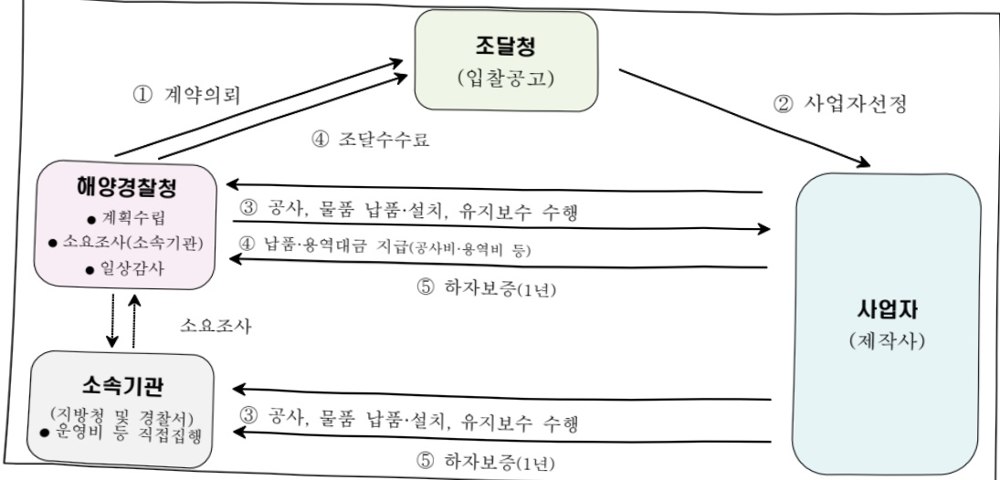

# 해양안전시스템구축관리(정보화)

**해당 페이지**: PDF 4935 ~ 4942 쪽 해당

**부처**: 해양경찰청
**분야**: 공공질서 및 안전
**회계유형**: 일반회계
**2026 확정예산**: 5492.0 백만원
**전년대비 증감률**: 1861.4%
**AI 도메인**: 법률/치안

---

### 가.예산 총괄표

(단위: 백만원, %)

<table border=1 style='margin: auto; word-wrap: break-word;'><tr><td rowspan="2">2024년 사업명</td><td colspan="2">2025년 예산</td><td colspan="2">2026년 예산</td><td rowspan="2">증감 (B-A)</td><td rowspan="2">(B-A)/A</td></tr><tr><td style='text-align: center; word-wrap: break-word;'>본예산</td><td style='text-align: center; word-wrap: break-word;'>추경(A)</td><td style='text-align: center; word-wrap: break-word;'>요구안</td><td style='text-align: center; word-wrap: break-word;'>본예산(B)</td></tr><tr><td style='text-align: center; word-wrap: break-word;'>해양안전시스템</td><td rowspan="2">1,214</td><td rowspan="2">280</td><td rowspan="2">280</td><td rowspan="2">5,492</td><td rowspan="2">5,492</td><td rowspan="2">5,212</td></tr><tr><td style='text-align: center; word-wrap: break-word;'>구축관리(정보화)</td></tr></table>

□ 기능별(내역사업별), 목별 예산 내역

(단위:백만원)

<table border=1 style='margin: auto; word-wrap: break-word;'><tr><td rowspan="2"></td><td colspan="5">2024</td><td colspan="5">2025</td><td rowspan="2">2026 倉圧</td></tr><tr><td style='text-align: center; word-wrap: break-word;'>倉圧の (専門)</td><td style='text-align: center; word-wrap: break-word;'>倉圧の 専門</td><td style='text-align: center; word-wrap: break-word;'>倉圧の 専門</td><td style='text-align: center; word-wrap: break-word;'>倉圧の 専門</td><td style='text-align: center; word-wrap: break-word;'>倉圧の 専門</td><td style='text-align: center; word-wrap: break-word;'>倉圧の 専門</td><td style='text-align: center; word-wrap: break-word;'>倉圧の 専門</td><td style='text-align: center; word-wrap: break-word;'>倉圧の 専門</td><td style='text-align: center; word-wrap: break-word;'>倉圧の 専門</td><td style='text-align: center; word-wrap: break-word;'>倉圧の 専門</td></tr><tr><td style='text-align: center; word-wrap: break-word;'>○ 기능별 분류(합계)</td><td style='text-align: center; word-wrap: break-word;'>1,232</td><td style='text-align: center; word-wrap: break-word;'>1,232</td><td style='text-align: center; word-wrap: break-word;'>1,214</td><td style='text-align: center; word-wrap: break-word;'>-</td><td style='text-align: center; word-wrap: break-word;'>18</td><td style='text-align: center; word-wrap: break-word;'>280</td><td style='text-align: center; word-wrap: break-word;'>280</td><td style='text-align: center; word-wrap: break-word;'>275</td><td style='text-align: center; word-wrap: break-word;'>-</td><td style='text-align: center; word-wrap: break-word;'>5</td><td style='text-align: center; word-wrap: break-word;'>5,492</td></tr><tr><td style='text-align: center; word-wrap: break-word;'>・ 시스템 구축</td><td style='text-align: center; word-wrap: break-word;'>1,232</td><td style='text-align: center; word-wrap: break-word;'>1,232</td><td style='text-align: center; word-wrap: break-word;'>1,214</td><td style='text-align: center; word-wrap: break-word;'>-</td><td style='text-align: center; word-wrap: break-word;'>18</td><td style='text-align: center; word-wrap: break-word;'>280</td><td style='text-align: center; word-wrap: break-word;'>280</td><td style='text-align: center; word-wrap: break-word;'>275</td><td style='text-align: center; word-wrap: break-word;'>-</td><td style='text-align: center; word-wrap: break-word;'>5</td><td style='text-align: center; word-wrap: break-word;'>5,492</td></tr></table>

### 나. 사업설명자료

## 1 ) 사업목적·내용

- (해양안전시스템구축관리(정보화)) 미래 첨단 경비체제 도입 대비, 함정 내·외부의 다양한 데이터 수집·저장 및 분석하여 서비스에 활용 할 수 있도록 노후 함정 정보통신 기반 인프라 구축 및 서비스 개발을 통한 함정 운용 개선

·해양재난 및 안전관리체계 고도화를 위한 미래형 해상 경비체계 도입 관련 경비

함정 디지털 기반체계 구축

·해양에서의 다양한 감시·정보자산의 융합을 통한 과학적이고 효율적인 경비 활동

체계 기반 마련

## 2 ) 사업개요

## □ 사업근거 및 추진경위

① 법령상 근거 및 조항 적시

-「해양경찰법」제16조(해양안전 확보 노력) 해양경찰청장은 해양안전 확보와 해양

---

사고 대응을 위하여 관련 상황을 파악하고 전파할 수 있도록 지휘·통신체계를 마련하여야 한다.

- 「재난 및 안전관리 기본법 시행령」 제82조(재난관리정보통신체계의 구축 운영)

법 제74조제1항에 따라 행정안전부장관과 재난관리책임기관·긴급구조기관 및

긴급구조지원기관의 장이 구축·운영하는 재난관리정보통신체계는 다음 각 호

의 사항을 갖추어야 한다.

## ② 추진경위

-추진배경

·과학경비를 통한 해양권의 확대와 미래 실효적 해양이용을 위한 정보수집 구축 활동 전환 필요

·해상 치안과 관련된 다양한 임무를 수행 중, 중요 임무 수행 활동에 효과적으로 대응하기 위해서는 해상에서의 각종 정보시스템 체계가 뒷받침되어야 함

·함정운용장비에서생산되는각종데이터수집·분석을통해함정운용·관리효율화기반마련필요

-추진경과

· 시범함정 1척 선정, 디지털 함정 체계 시범구축 예산 편성 및 집행('24)

'25년 디지털 함정 체계 확대 구축을 위한 정보화전략계획(ISP) 수립예산 280백만원 편성

- 추진근거

(국정과제 76) “흔들림 없는 해양주권, 안전하고 청정한 우리바다” 해양안보 강화 및 해상치안 대응을 위한 함정 자체 통신망 인프라 구축 및 디지털 서비스 구축

## □ 주요내용

① 사업규모

- 총사업비 : 해당없음

- 사업기간 : 계속사업

- 최근 5년 간 투입된 사업비(예산액기준, 추경편성한 연도에는 추경포함)

<table border=1 style='margin: auto; word-wrap: break-word;'><tr><td style='text-align: center; word-wrap: break-word;'>연도</td><td style='text-align: center; word-wrap: break-word;'>2022</td><td style='text-align: center; word-wrap: break-word;'>2023</td><td style='text-align: center; word-wrap: break-word;'>2024</td><td style='text-align: center; word-wrap: break-word;'>2025</td><td style='text-align: center; word-wrap: break-word;'>2026</td></tr><tr><td style='text-align: center; word-wrap: break-word;'>사업비</td><td style='text-align: center; word-wrap: break-word;'>834</td><td style='text-align: center; word-wrap: break-word;'>2,732</td><td style='text-align: center; word-wrap: break-word;'>1,232</td><td style='text-align: center; word-wrap: break-word;'>280</td><td style='text-align: center; word-wrap: break-word;'>5,492</td></tr></table>

- 기타: 해당없음

② 사업추진체계

- 사업시행방법 : 직접수행

- 사업시행주체 : 해양경찰청

---

- 사업 수혜자 : 전국 32개 해양경찰관서 경비과, 상황실, 경비함정 22척 등

- 보조, 융자, 출연, 출자 등의 경우 보조·융자 등 지원 비율 및 법적근거 : 해당없음

## 3 ) 2026년도 예산 산출 근거

□ '26년도 예산 : ('25) 280 → ('26) 5,492백만원, 5,212백만원 증액, 1,861.4%
① AI 기반 디지털 함정 구축
 : ('25) 280 → ('26) 5,492백만원, ISP 수립 후 계속
- (내용) 함정 전용망(자가망)기반의 관리, 경비·상황 등 임무수행 등 전반에 걸쳐 AI 등 첨단 ICT 기술 접목을 통한 해양경찰 경비함정의 디지털 전환(DX) 함정체계 구축
- (산출) 시스템 개발비 547백만원, 자산취득비 4,945백만원

## 4 ) 사업효과

□ 사업영향, 산출물 성과지표 등

① 2022~2026년도 성과계획서 상 성과지표 및 최근 5년간 성과 달성도

<table border=1 style='margin: auto; word-wrap: break-word;'><tr><td style='text-align: center; word-wrap: break-word;'>성과지표</td><td style='text-align: center; word-wrap: break-word;'>구분</td><td style='text-align: center; word-wrap: break-word;'>&#x27;22</td><td style='text-align: center; word-wrap: break-word;'>&#x27;23</td><td style='text-align: center; word-wrap: break-word;'>&#x27;24</td><td style='text-align: center; word-wrap: break-word;'>&#x27;25</td><td style='text-align: center; word-wrap: break-word;'>&#x27;26</td><td style='text-align: center; word-wrap: break-word;'>&#x27;25목표치산출근거</td><td style='text-align: center; word-wrap: break-word;'>측정산식(또는 측정방법)</td><td style='text-align: center; word-wrap: break-word;'>자료수집방법(또는 자료출처)</td></tr><tr><td rowspan="3">온라인 서비스최적화율(단위:%)</td><td style='text-align: center; word-wrap: break-word;'>목표</td><td style='text-align: center; word-wrap: break-word;'>변경</td><td style='text-align: center; word-wrap: break-word;'>-</td><td style='text-align: center; word-wrap: break-word;'>-</td><td style='text-align: center; word-wrap: break-word;'>-</td><td style='text-align: center; word-wrap: break-word;'></td><td rowspan="3">(&#x27;21&#x27;)&#x27;20년도대비 0.7%증가한99.3%로 설정</td><td rowspan="3">({전체시간-총장애시간}) / 전체시간} × 100</td><td rowspan="3">국가정보자원관리원</td></tr><tr><td style='text-align: center; word-wrap: break-word;'>실적</td><td style='text-align: center; word-wrap: break-word;'>변경</td><td style='text-align: center; word-wrap: break-word;'>-</td><td style='text-align: center; word-wrap: break-word;'>-</td><td style='text-align: center; word-wrap: break-word;'>-</td><td style='text-align: center; word-wrap: break-word;'></td></tr><tr><td style='text-align: center; word-wrap: break-word;'>달성도</td><td style='text-align: center; word-wrap: break-word;'>변경</td><td style='text-align: center; word-wrap: break-word;'>-</td><td style='text-align: center; word-wrap: break-word;'>-</td><td style='text-align: center; word-wrap: break-word;'>-</td><td style='text-align: center; word-wrap: break-word;'></td></tr><tr><td rowspan="3">직원 만족도(단위:점)</td><td style='text-align: center; word-wrap: break-word;'>목표</td><td style='text-align: center; word-wrap: break-word;'>변경</td><td style='text-align: center; word-wrap: break-word;'>-</td><td style='text-align: center; word-wrap: break-word;'>-</td><td style='text-align: center; word-wrap: break-word;'>-</td><td style='text-align: center; word-wrap: break-word;'></td><td rowspan="3">(&#x27;21&#x27;)&#x27;20년도보다0.1점 높고최근3년(&#x27;18~20년)평균실적 보다2.2점 높은목표치 설정</td><td rowspan="3">복지정책 수혜자대상 온라인설문 만족도점수 - 복지정책 수혜자(경찰관,일반직등 해경청소속 직원)</td><td rowspan="3">해경청직원설문조사 및 공문 및외부망 시스템 확인 등</td></tr><tr><td style='text-align: center; word-wrap: break-word;'>실적</td><td style='text-align: center; word-wrap: break-word;'>변경</td><td style='text-align: center; word-wrap: break-word;'>-</td><td style='text-align: center; word-wrap: break-word;'>-</td><td style='text-align: center; word-wrap: break-word;'>-</td><td style='text-align: center; word-wrap: break-word;'></td></tr><tr><td style='text-align: center; word-wrap: break-word;'>달성도</td><td style='text-align: center; word-wrap: break-word;'>변경</td><td style='text-align: center; word-wrap: break-word;'>-</td><td style='text-align: center; word-wrap: break-word;'>-</td><td style='text-align: center; word-wrap: break-word;'>-</td><td style='text-align: center; word-wrap: break-word;'></td></tr><tr><td rowspan="3">직원 직무역량제고율(단위:%)</td><td style='text-align: center; word-wrap: break-word;'>목표</td><td style='text-align: center; word-wrap: break-word;'>변경</td><td style='text-align: center; word-wrap: break-word;'>-</td><td style='text-align: center; word-wrap: break-word;'>-</td><td style='text-align: center; word-wrap: break-word;'>-</td><td style='text-align: center; word-wrap: break-word;'></td><td rowspan="3">(&#x27;21&#x27;)코로나감안 비대면교육과정 운영실적 산출</td><td rowspan="3">[전문화 교육이수인원(명) / 현원(명)] × 100%</td><td rowspan="3">에듀오선교육훈련 평가시스템에 의한교육 이수자료 이용</td></tr><tr><td style='text-align: center; word-wrap: break-word;'>실적</td><td style='text-align: center; word-wrap: break-word;'>변경</td><td style='text-align: center; word-wrap: break-word;'>-</td><td style='text-align: center; word-wrap: break-word;'>-</td><td style='text-align: center; word-wrap: break-word;'>-</td><td style='text-align: center; word-wrap: break-word;'></td></tr><tr><td style='text-align: center; word-wrap: break-word;'>달성도</td><td style='text-align: center; word-wrap: break-word;'>변경</td><td style='text-align: center; word-wrap: break-word;'>-</td><td style='text-align: center; word-wrap: break-word;'>-</td><td style='text-align: center; word-wrap: break-word;'>-</td><td style='text-align: center; word-wrap: break-word;'></td></tr><tr><td rowspan="3">해양경찰서비스이용 고객만족도(단위:점)</td><td style='text-align: center; word-wrap: break-word;'>목표</td><td style='text-align: center; word-wrap: break-word;'>83.3</td><td style='text-align: center; word-wrap: break-word;'>변경</td><td style='text-align: center; word-wrap: break-word;'>-</td><td style='text-align: center; word-wrap: break-word;'>-</td><td style='text-align: center; word-wrap: break-word;'></td><td rowspan="3">3년치 평균값0.1점 상향</td><td rowspan="3">서비스 이용고객 만족도(평점합계/표본인원수)</td><td rowspan="3">설문조사</td></tr><tr><td style='text-align: center; word-wrap: break-word;'>실적</td><td style='text-align: center; word-wrap: break-word;'>81.8</td><td style='text-align: center; word-wrap: break-word;'>변경</td><td style='text-align: center; word-wrap: break-word;'>-</td><td style='text-align: center; word-wrap: break-word;'>-</td><td style='text-align: center; word-wrap: break-word;'></td></tr><tr><td style='text-align: center; word-wrap: break-word;'>달성도</td><td style='text-align: center; word-wrap: break-word;'>98.2%</td><td style='text-align: center; word-wrap: break-word;'>변경</td><td style='text-align: center; word-wrap: break-word;'>-</td><td style='text-align: center; word-wrap: break-word;'>-</td><td style='text-align: center; word-wrap: break-word;'></td></tr></table>

---

<table border=1 style='margin: auto; word-wrap: break-word;'><tr><td rowspan="3">온라인 서비스 최적화율 (단위:%)</td><td style='text-align: center; word-wrap: break-word;'>목표</td><td style='text-align: center; word-wrap: break-word;'>99.7</td><td style='text-align: center; word-wrap: break-word;'>변경</td><td style='text-align: center; word-wrap: break-word;'>-</td><td style='text-align: center; word-wrap: break-word;'>-</td><td style='text-align: center; word-wrap: break-word;'></td><td rowspan="3">전년대비 0.4% 상향 조정</td><td rowspan="3">{(전체시간-총 장애시간) / 전체시간} × 100</td><td rowspan="3">국가정보자원 관리원</td></tr><tr><td style='text-align: center; word-wrap: break-word;'>실적</td><td style='text-align: center; word-wrap: break-word;'>99.8</td><td style='text-align: center; word-wrap: break-word;'>변경</td><td style='text-align: center; word-wrap: break-word;'>-</td><td style='text-align: center; word-wrap: break-word;'>-</td><td style='text-align: center; word-wrap: break-word;'></td></tr><tr><td style='text-align: center; word-wrap: break-word;'>달성도</td><td style='text-align: center; word-wrap: break-word;'>99.9%</td><td style='text-align: center; word-wrap: break-word;'>변경</td><td style='text-align: center; word-wrap: break-word;'>-</td><td style='text-align: center; word-wrap: break-word;'>-</td><td style='text-align: center; word-wrap: break-word;'></td></tr><tr><td rowspan="3">해양경찰 연구개발 현장 활용성 (단위:점)</td><td style='text-align: center; word-wrap: break-word;'>목표</td><td style='text-align: center; word-wrap: break-word;'>84</td><td style='text-align: center; word-wrap: break-word;'>변경</td><td style='text-align: center; word-wrap: break-word;'>-</td><td style='text-align: center; word-wrap: break-word;'>-</td><td style='text-align: center; word-wrap: break-word;'></td><td rowspan="3">성과물의 현장 활용성을 위한 계획 성능목표 달성도 목표치</td><td rowspan="3">(기술·장비 성능목표 달성도*06) +(사용자 만족도*0.4)</td><td rowspan="3">연구개발과제 수행보고서 만족도 조사</td></tr><tr><td style='text-align: center; word-wrap: break-word;'>실적</td><td style='text-align: center; word-wrap: break-word;'>87.4</td><td style='text-align: center; word-wrap: break-word;'>변경</td><td style='text-align: center; word-wrap: break-word;'>-</td><td style='text-align: center; word-wrap: break-word;'>-</td><td style='text-align: center; word-wrap: break-word;'></td></tr><tr><td style='text-align: center; word-wrap: break-word;'>달성도</td><td style='text-align: center; word-wrap: break-word;'>104%</td><td style='text-align: center; word-wrap: break-word;'>변경</td><td style='text-align: center; word-wrap: break-word;'>-</td><td style='text-align: center; word-wrap: break-word;'>-</td><td style='text-align: center; word-wrap: break-word;'></td></tr><tr><td rowspan="3">국민만족도 (단위:점)</td><td style='text-align: center; word-wrap: break-word;'>목표</td><td style='text-align: center; word-wrap: break-word;'>신규</td><td style='text-align: center; word-wrap: break-word;'>83.0</td><td style='text-align: center; word-wrap: break-word;'>변경</td><td style='text-align: center; word-wrap: break-word;'>-</td><td style='text-align: center; word-wrap: break-word;'></td><td rowspan="2">(&#x27;23&#x27;) &#x27;20~&#x27; &#x27;22년 3년 평균점수 82.7보다 0.3상향</td><td rowspan="2">해양경찰 국민만족도 조사 (치안서비스 점수+체감안전도 점수) / 2</td><td rowspan="2">자체 조사시스템 이용 조사 및 외부용역을 통해 조사/공문</td></tr><tr><td style='text-align: center; word-wrap: break-word;'>실적</td><td style='text-align: center; word-wrap: break-word;'>신규</td><td style='text-align: center; word-wrap: break-word;'>-</td><td style='text-align: center; word-wrap: break-word;'>변경</td><td style='text-align: center; word-wrap: break-word;'>-</td><td style='text-align: center; word-wrap: break-word;'></td></tr><tr><td style='text-align: center; word-wrap: break-word;'>달성도</td><td style='text-align: center; word-wrap: break-word;'>신규</td><td style='text-align: center; word-wrap: break-word;'>-</td><td style='text-align: center; word-wrap: break-word;'>변경</td><td style='text-align: center; word-wrap: break-word;'>-</td><td style='text-align: center; word-wrap: break-word;'></td><td rowspan="4">(&#x27;23&#x27;) 사업별 착수시기 감안 성능목표달성도를 구분하여 평균값으로설정</td><td rowspan="4">과제별 시제품 연차 성능목표 달성도 합계/ 대상 과제수</td><td rowspan="4">연구개발 과제수행 보고서</td></tr><tr><td rowspan="3">해양경찰 연구개발 성능목표 달성도 (단위:점)</td><td style='text-align: center; word-wrap: break-word;'>목표</td><td style='text-align: center; word-wrap: break-word;'>신규</td><td style='text-align: center; word-wrap: break-word;'>80</td><td style='text-align: center; word-wrap: break-word;'>변경</td><td style='text-align: center; word-wrap: break-word;'>-</td><td style='text-align: center; word-wrap: break-word;'></td></tr><tr><td style='text-align: center; word-wrap: break-word;'>실적</td><td style='text-align: center; word-wrap: break-word;'>신규</td><td style='text-align: center; word-wrap: break-word;'>-</td><td style='text-align: center; word-wrap: break-word;'>변경</td><td style='text-align: center; word-wrap: break-word;'>-</td><td style='text-align: center; word-wrap: break-word;'></td></tr><tr><td style='text-align: center; word-wrap: break-word;'>달성도</td><td style='text-align: center; word-wrap: break-word;'>신규</td><td style='text-align: center; word-wrap: break-word;'>-</td><td style='text-align: center; word-wrap: break-word;'>변경</td><td style='text-align: center; word-wrap: break-word;'>-</td><td style='text-align: center; word-wrap: break-word;'></td></tr><tr><td rowspan="3">정보시스템 서비스 최적화율 (단위:점)</td><td style='text-align: center; word-wrap: break-word;'>목표</td><td style='text-align: center; word-wrap: break-word;'>신규</td><td style='text-align: center; word-wrap: break-word;'>75</td><td style='text-align: center; word-wrap: break-word;'>변경</td><td style='text-align: center; word-wrap: break-word;'>-</td><td style='text-align: center; word-wrap: break-word;'></td><td rowspan="3">(&#x27;23&#x27;) 측정대상기간 (&#x27;22.5~12&#x27;) 내 조사항목 중 가중치 고려 평균값으로 설정</td><td rowspan="3">(단순문의처리목표달성도*0.3)+(오류문의처리목표달성도*0.1)+(AP장애복구목표달성도*0.6)</td><td rowspan="3">해양경찰 SR시스템</td></tr><tr><td style='text-align: center; word-wrap: break-word;'>실적</td><td style='text-align: center; word-wrap: break-word;'>신규</td><td style='text-align: center; word-wrap: break-word;'>76.9</td><td style='text-align: center; word-wrap: break-word;'>변경</td><td style='text-align: center; word-wrap: break-word;'>-</td><td style='text-align: center; word-wrap: break-word;'></td></tr><tr><td style='text-align: center; word-wrap: break-word;'>달성도</td><td style='text-align: center; word-wrap: break-word;'>신규</td><td style='text-align: center; word-wrap: break-word;'>102.5</td><td style='text-align: center; word-wrap: break-word;'>변경</td><td style='text-align: center; word-wrap: break-word;'>-</td><td style='text-align: center; word-wrap: break-word;'></td></tr><tr><td rowspan="3">해양경찰 국민만족도 (단위:%)</td><td style='text-align: center; word-wrap: break-word;'>목표</td><td style='text-align: center; word-wrap: break-word;'>신규</td><td style='text-align: center; word-wrap: break-word;'>신규</td><td style='text-align: center; word-wrap: break-word;'>89.4</td><td style='text-align: center; word-wrap: break-word;'>89.7</td><td style='text-align: center; word-wrap: break-word;'>90.0</td><td rowspan="3">여론조사 특성상 표본 통제가 어렵고 점수는 해마다 우상향, 목표치 상향보다 90점 이상의 &#x27;우수&#x27; 등급 유지</td><td rowspan="3">(치안서비스 점수 ×80% + 체감안전도 점수×20%)</td><td rowspan="3">자체 조사시스템 이용조사 및 외부용역을 통해 조사/공문</td></tr><tr><td style='text-align: center; word-wrap: break-word;'>실적</td><td style='text-align: center; word-wrap: break-word;'>88.2</td><td style='text-align: center; word-wrap: break-word;'>90.8</td><td style='text-align: center; word-wrap: break-word;'>94.1</td><td style='text-align: center; word-wrap: break-word;'>-</td><td style='text-align: center; word-wrap: break-word;'>-</td></tr><tr><td style='text-align: center; word-wrap: break-word;'>달성도</td><td style='text-align: center; word-wrap: break-word;'>-</td><td style='text-align: center; word-wrap: break-word;'>-</td><td style='text-align: center; word-wrap: break-word;'>101.6</td><td style='text-align: center; word-wrap: break-word;'>-</td><td style='text-align: center; word-wrap: break-word;'>-</td></tr></table>

② 성과지표 이외의 연도별 사업추진 경과 및 실적

<table border=1 style='margin: auto; word-wrap: break-word;'><tr><td style='text-align: center; word-wrap: break-word;'>2022</td><td style='text-align: center; word-wrap: break-word;'>V-Pass 이용 어선 출입항 현황 : 9,837,336건(94.1%)</td></tr><tr><td style='text-align: center; word-wrap: break-word;'>2023</td><td style='text-align: center; word-wrap: break-word;'>V-Pass 이용 어선 출입항 현황 : 9,693,113건(94.4%)</td></tr><tr><td style='text-align: center; word-wrap: break-word;'>2024</td><td style='text-align: center; word-wrap: break-word;'>디지털 함정 체계 시범구축 예산 1,232백만원 편성 및 집행</td></tr><tr><td style='text-align: center; word-wrap: break-word;'>2025</td><td style='text-align: center; word-wrap: break-word;'>디지털 함정 체계 구축 BPR_ISP 사업 수행 280백만원 편성 및 집행(&#x27;25.8.完)</td></tr></table>

## ③향후(2026년도 이후)기대효과

- 수집된 다양한 정보를 단일화된 통합지휘체계로 연계하여 해양경비 임무 수행 중

신속·정확한 의사결정 지원

---

- 해양에서의 다양한 감시·정보자산의 융합을 통한 과학적이고 효율적인 경비 활동

체계 마련

- 그 외 해양경찰 정보화시스템을 활용하여 해양 안전, 구조, 경비 등 다양한 분야에

적용되어 국민의 생명과 재산 보호에 기여

5) 타당성조사 및 예비타당성조사 시행여부 및 결과 요지 : 해당없음

## 6 ) 총사업비 대상사업 여부 및 내역 : 해당없음

## 7 ) 사업 집행절차

---

## 8 ) 중기재정계획 상 연도별 투자계획 및 추진경과

(단위: 백만원)

<table border=1 style='margin: auto; word-wrap: break-word;'><tr><td style='text-align: center; word-wrap: break-word;'>$ \underset{\cdot}{今} $ $ \underset{\cdot}{乃} $ 2024</td><td style='text-align: center; word-wrap: break-word;'>2025</td><td style='text-align: center; word-wrap: break-word;'>2026</td><td style='text-align: center; word-wrap: break-word;'>2027</td><td style='text-align: center; word-wrap: break-word;'>2028</td><td style='text-align: center; word-wrap: break-word;'>2029</td></tr><tr><td style='text-align: center; word-wrap: break-word;'>2024~2028</td><td style='text-align: center; word-wrap: break-word;'>1,232</td><td style='text-align: center; word-wrap: break-word;'>11,132</td><td style='text-align: center; word-wrap: break-word;'>9,495</td><td style='text-align: center; word-wrap: break-word;'>8,276</td><td style='text-align: center; word-wrap: break-word;'>7,399</td></tr><tr><td style='text-align: center; word-wrap: break-word;'>2025~2029</td><td style='text-align: center; word-wrap: break-word;'></td><td style='text-align: center; word-wrap: break-word;'>280</td><td style='text-align: center; word-wrap: break-word;'>6,940</td><td style='text-align: center; word-wrap: break-word;'>4,957</td><td style='text-align: center; word-wrap: break-word;'>4,535</td></tr></table>

9) 최근 3년간 동 사업에 대한 주요 외부지적사항 및 평가, 문제점 및 대책 : 해당없음

## 10 ) 향후 추진방향 및 추진계획

<table border=1 style='margin: auto; word-wrap: break-word;'><tr><td style='text-align: center; word-wrap: break-word;'>- 경비함정 임무수행, 안전, 관리운영 체계 개선을 위한 디지털 전환 추진</td></tr><tr><td style='text-align: center; word-wrap: break-word;'>- MDA(AI해양경비체계), 위성, 무인기 등 다양한 감시체계와 데이터 및 애플리케이션을 실시간 현장에서 연동·활용할 수 있는 기반 인프라 구축</td></tr><tr><td style='text-align: center; word-wrap: break-word;'>- 기상 예측, 해양 교통 상황, 엔진 성능 데이터를 바탕으로 효율적인 경비 작전 및 안전 임무 계획 수립 지원</td></tr><tr><td style='text-align: center; word-wrap: break-word;'>- 주요 장비(엔진, 항해 장비 등)실시간 모니터링, 예측 정비 실시 ⇒ 긴급한 수리 고장으로 인한 경비 공백 최소화</td></tr></table>

## 11 ) 해당사업에 대한 각종 사업평가의 결과 : 해당없음

12) 해당사업에 대한 부처 자체평가의 결과

<table border=1 style='margin: auto; word-wrap: break-word;'><tr><td style='text-align: center; word-wrap: break-word;'>1) ⌈재난 및 안전관리 기본법⌋ 제10조의3(재난 및 안전관리 사업에 대한 평가) 및 시행령 제10조의2(재난안전관리 사업에 대한 평가)에 따른 재난안전사업 평가 결과에 대한 해양경찰청의 자체평가 결과(&#x27;24회계)</td></tr><tr><td style='text-align: center; word-wrap: break-word;'>○ (최종의견 및 점수) 77.3(보통)</td></tr><tr><td style='text-align: center; word-wrap: break-word;'>○ (결과 요약)</td></tr><tr><td style='text-align: center; word-wrap: break-word;'>- &#x27;25년(&#x27;24회계연도)재난안전사업 13개 대상사업 중 77.3점(보통)으로 평가</td></tr></table>

13) 부처 건의사항 : 해당없음

---

### 다. 최근 4년간 결산내역

## 1 ) 결산표

☐ 부처 결산내역

(단위: 백만원, %)

<table border=1 style='margin: auto; word-wrap: break-word;'><tr><td rowspan="2">연도</td><td colspan="3">예산액</td><td rowspan="2">전년도 이월액</td><td rowspan="2">이·전용 등</td><td rowspan="2">예비비</td><td rowspan="2">예산 현액(B)</td><td rowspan="2">집행액(C)</td><td rowspan="2">집행률(C/A)</td><td rowspan="2">집행률(C/B)</td><td rowspan="2">다음연도 이월액</td><td rowspan="2">불용액</td></tr><tr><td style='text-align: center; word-wrap: break-word;'>본예산 중감액</td><td style='text-align: center; word-wrap: break-word;'>추경 주경(A)</td><td style='text-align: center; word-wrap: break-word;'>추경(A)</td></tr><tr><td style='text-align: center; word-wrap: break-word;'>2022</td><td style='text-align: center; word-wrap: break-word;'>834</td><td style='text-align: center; word-wrap: break-word;'>-</td><td style='text-align: center; word-wrap: break-word;'>834</td><td style='text-align: center; word-wrap: break-word;'>-</td><td style='text-align: center; word-wrap: break-word;'>-</td><td style='text-align: center; word-wrap: break-word;'>-</td><td style='text-align: center; word-wrap: break-word;'>834</td><td style='text-align: center; word-wrap: break-word;'>763</td><td style='text-align: center; word-wrap: break-word;'>91.5</td><td style='text-align: center; word-wrap: break-word;'>91.5</td><td style='text-align: center; word-wrap: break-word;'>-</td><td style='text-align: center; word-wrap: break-word;'>71</td></tr><tr><td style='text-align: center; word-wrap: break-word;'>2023</td><td style='text-align: center; word-wrap: break-word;'>2,732</td><td style='text-align: center; word-wrap: break-word;'>-</td><td style='text-align: center; word-wrap: break-word;'>2,732</td><td style='text-align: center; word-wrap: break-word;'>-</td><td style='text-align: center; word-wrap: break-word;'>-</td><td style='text-align: center; word-wrap: break-word;'>-</td><td style='text-align: center; word-wrap: break-word;'>2,732</td><td style='text-align: center; word-wrap: break-word;'>2,713</td><td style='text-align: center; word-wrap: break-word;'>99.3</td><td style='text-align: center; word-wrap: break-word;'>99.3</td><td style='text-align: center; word-wrap: break-word;'>-</td><td style='text-align: center; word-wrap: break-word;'>19</td></tr><tr><td style='text-align: center; word-wrap: break-word;'>2024</td><td style='text-align: center; word-wrap: break-word;'>1,232</td><td style='text-align: center; word-wrap: break-word;'>-</td><td style='text-align: center; word-wrap: break-word;'>1,232</td><td style='text-align: center; word-wrap: break-word;'>-</td><td style='text-align: center; word-wrap: break-word;'>-</td><td style='text-align: center; word-wrap: break-word;'>-</td><td style='text-align: center; word-wrap: break-word;'>1,232</td><td style='text-align: center; word-wrap: break-word;'>1,214</td><td style='text-align: center; word-wrap: break-word;'>98.5</td><td style='text-align: center; word-wrap: break-word;'>98.5</td><td style='text-align: center; word-wrap: break-word;'>-</td><td style='text-align: center; word-wrap: break-word;'>18</td></tr><tr><td style='text-align: center; word-wrap: break-word;'>2025</td><td style='text-align: center; word-wrap: break-word;'>280</td><td style='text-align: center; word-wrap: break-word;'>-</td><td style='text-align: center; word-wrap: break-word;'>280</td><td style='text-align: center; word-wrap: break-word;'>-</td><td style='text-align: center; word-wrap: break-word;'>-</td><td style='text-align: center; word-wrap: break-word;'>-</td><td style='text-align: center; word-wrap: break-word;'>280</td><td style='text-align: center; word-wrap: break-word;'>275</td><td style='text-align: center; word-wrap: break-word;'>98.2</td><td style='text-align: center; word-wrap: break-word;'>98.2</td><td style='text-align: center; word-wrap: break-word;'>-</td><td style='text-align: center; word-wrap: break-word;'>5</td></tr></table>

□출연·보조사업 등 실집행내역 : 해당없음

## 2 ) 주요 결산사항

☐ 2022~2025년 결산 사항

<table border=1 style='margin: auto; word-wrap: break-word;'><tr><td style='text-align: center; word-wrap: break-word;'>2022</td><td style='text-align: center; word-wrap: break-word;'>- (불용) 71 백만원 : 낙찰차액</td></tr><tr><td style='text-align: center; word-wrap: break-word;'>2023</td><td style='text-align: center; word-wrap: break-word;'>- (불용) 19 백만원 : 낙찰차액</td></tr><tr><td style='text-align: center; word-wrap: break-word;'>2024</td><td style='text-align: center; word-wrap: break-word;'>- (불용) 18 백만원 : 낙찰차액</td></tr><tr><td style='text-align: center; word-wrap: break-word;'>2025</td><td style='text-align: center; word-wrap: break-word;'>- (불용) 5 백만원 : 낙찰차액</td></tr></table>

□ 2025년 이·전용 등 세부내역 : 해당없음

□ 2025년 예비비 배정 세부내역 : 해당없음

---

<table border=1 style='margin: auto; word-wrap: break-word;'><tr><td style='text-align: center; word-wrap: break-word;'>사 업 명</td></tr><tr><td style='text-align: center; word-wrap: break-word;'>(33) AI기반 스마트 어업관리 시스템 개발(R&amp;D) (3433-318)</td></tr></table>

## □ 사업 코드 정보

<table border=1 style='margin: auto; word-wrap: break-word;'><tr><td style='text-align: center; word-wrap: break-word;'>구분</td><td style='text-align: center; word-wrap: break-word;'>회계</td><td style='text-align: center; word-wrap: break-word;'>소관</td><td style='text-align: center; word-wrap: break-word;'>실국(기관)</td><td style='text-align: center; word-wrap: break-word;'>계정</td><td style='text-align: center; word-wrap: break-word;'>분야</td><td style='text-align: center; word-wrap: break-word;'>부문</td></tr><tr><td style='text-align: center; word-wrap: break-word;'>코드</td><td style='text-align: center; word-wrap: break-word;'>15</td><td style='text-align: center; word-wrap: break-word;'>28</td><td rowspan="2">어업자원정책관</td><td style='text-align: center; word-wrap: break-word;'>농어촌특별세</td><td style='text-align: center; word-wrap: break-word;'>100</td><td style='text-align: center; word-wrap: break-word;'>103</td></tr><tr><td style='text-align: center; word-wrap: break-word;'>명칭</td><td style='text-align: center; word-wrap: break-word;'>농어촌구조개선 특별회계</td><td style='text-align: center; word-wrap: break-word;'>해양수산부</td><td style='text-align: center; word-wrap: break-word;'>사업계정</td><td style='text-align: center; word-wrap: break-word;'>농림수산</td><td style='text-align: center; word-wrap: break-word;'>수산·어촌</td></tr></table>

<table border=1 style='margin: auto; word-wrap: break-word;'><tr><td style='text-align: center; word-wrap: break-word;'>구분</td><td style='text-align: center; word-wrap: break-word;'>프로그램</td><td style='text-align: center; word-wrap: break-word;'>단위사업</td><td style='text-align: center; word-wrap: break-word;'>세부사업</td></tr><tr><td style='text-align: center; word-wrap: break-word;'>코드</td><td style='text-align: center; word-wrap: break-word;'>3400</td><td style='text-align: center; word-wrap: break-word;'>3433</td><td style='text-align: center; word-wrap: break-word;'>318</td></tr><tr><td style='text-align: center; word-wrap: break-word;'>명칭</td><td style='text-align: center; word-wrap: break-word;'>어업인소득안정지원</td><td style='text-align: center; word-wrap: break-word;'>수산연구개발</td><td style='text-align: center; word-wrap: break-word;'>AI기반 스마트 어업관리 시스템 개발(R&amp;D)</td></tr></table>

□ 사업 성격 (공통요구자료 Ⅱ-1 작성유의사항 4. 참조, 해당하는 사항에 “○” 표시)

<table border=1 style='margin: auto; word-wrap: break-word;'><tr><td rowspan="2">신규</td><td rowspan="2">계속</td><td rowspan="2">완료</td><td rowspan="2">예비타당성 실시여부</td><td rowspan="2">총사업비 관리대상</td><td rowspan="2">총액계상 예산사업</td><td style='text-align: center; word-wrap: break-word;'>사업소관 변경정보</td></tr><tr><td style='text-align: center; word-wrap: break-word;'>2025예산 시 소관</td></tr><tr><td style='text-align: center; word-wrap: break-word;'></td><td style='text-align: center; word-wrap: break-word;'>○</td><td style='text-align: center; word-wrap: break-word;'></td><td style='text-align: center; word-wrap: break-word;'></td><td style='text-align: center; word-wrap: break-word;'></td><td style='text-align: center; word-wrap: break-word;'></td><td style='text-align: center; word-wrap: break-word;'></td></tr></table>

□ 사업 지원 형태 및 지원을 (최소한 한 개는 반드시 선택하시오. 해당사항에 0 표시)

<table border=1 style='margin: auto; word-wrap: break-word;'><tr><td style='text-align: center; word-wrap: break-word;'>직접</td><td style='text-align: center; word-wrap: break-word;'>출자</td><td style='text-align: center; word-wrap: break-word;'>출연</td><td style='text-align: center; word-wrap: break-word;'>보조</td><td style='text-align: center; word-wrap: break-word;'>융자</td><td style='text-align: center; word-wrap: break-word;'>국고보조율(%)</td><td style='text-align: center; word-wrap: break-word;'>융자율(%)</td></tr><tr><td style='text-align: center; word-wrap: break-word;'></td><td style='text-align: center; word-wrap: break-word;'></td><td style='text-align: center; word-wrap: break-word;'>○</td><td style='text-align: center; word-wrap: break-word;'></td><td style='text-align: center; word-wrap: break-word;'></td><td style='text-align: center; word-wrap: break-word;'>100</td><td style='text-align: center; word-wrap: break-word;'></td></tr></table>

## □ 사업 담당자

<table border=1 style='margin: auto; word-wrap: break-word;'><tr><td style='text-align: center; word-wrap: break-word;'>사업명</td><td colspan="2">구분</td></tr><tr><td rowspan="4">AI기반의 어선안전 통합 플랫폼구축 (R&amp;D)</td><td rowspan="3">소관부처</td><td style='text-align: center; word-wrap: break-word;'>실·국·과(팀)명</td></tr><tr><td style='text-align: center; word-wrap: break-word;'>어업자원정책관</td></tr><tr><td style='text-align: center; word-wrap: break-word;'>어선안전정책과</td></tr><tr><td style='text-align: center; word-wrap: break-word;'>사업시행주체</td><td style='text-align: center; word-wrap: break-word;'>해양수산과학기술진흥원 블루푸드팀</td></tr></table>

---

### 원본 PDF 크롭 이미지

