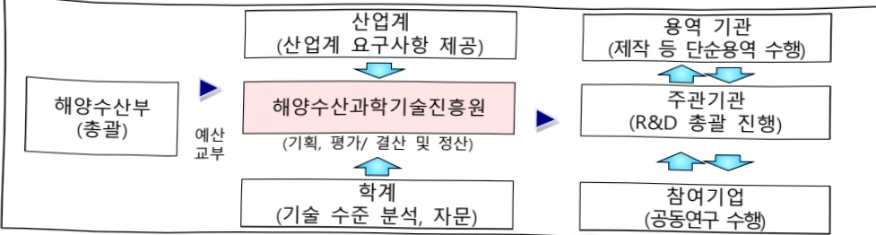

# AI 기반 스마트 어업관리 시스템 개발(R&D)

**해당 페이지**: PDF 4943 ~ 4951 쪽 해당

**부처**: 해양수산부
**분야**: 농림수산
**회계유형**: 농어촌구조개선 특별회계
**2026 확정예산**: 4996.0 백만원
**전년대비 증감률**: None%
**AI 도메인**: 데이터

---

<table border=1 style='margin: auto; word-wrap: break-word;'><tr><td style='text-align: center; word-wrap: break-word;'>사 업 명</td></tr><tr><td style='text-align: center; word-wrap: break-word;'>(33) AI기반 스마트 어업관리 시스템 개발(R&amp;D) (3433-318)</td></tr></table>

## □ 사업 코드 정보

<table border=1 style='margin: auto; word-wrap: break-word;'><tr><td style='text-align: center; word-wrap: break-word;'>구분</td><td style='text-align: center; word-wrap: break-word;'>회계</td><td style='text-align: center; word-wrap: break-word;'>소관</td><td style='text-align: center; word-wrap: break-word;'>실국(기관)</td><td style='text-align: center; word-wrap: break-word;'>계정</td><td style='text-align: center; word-wrap: break-word;'>분야</td><td style='text-align: center; word-wrap: break-word;'>부문</td></tr><tr><td style='text-align: center; word-wrap: break-word;'>코드</td><td style='text-align: center; word-wrap: break-word;'>15</td><td style='text-align: center; word-wrap: break-word;'>28</td><td rowspan="2">어업자원정책관</td><td style='text-align: center; word-wrap: break-word;'>농어촌특별세</td><td style='text-align: center; word-wrap: break-word;'>100</td><td style='text-align: center; word-wrap: break-word;'>103</td></tr><tr><td style='text-align: center; word-wrap: break-word;'>명칭</td><td style='text-align: center; word-wrap: break-word;'>농어촌구조개선 특별회계</td><td style='text-align: center; word-wrap: break-word;'>해양수산부</td><td style='text-align: center; word-wrap: break-word;'>사업계정</td><td style='text-align: center; word-wrap: break-word;'>농림수산</td><td style='text-align: center; word-wrap: break-word;'>수산·어촌</td></tr></table>

<table border=1 style='margin: auto; word-wrap: break-word;'><tr><td style='text-align: center; word-wrap: break-word;'>구분</td><td style='text-align: center; word-wrap: break-word;'>프로그램</td><td style='text-align: center; word-wrap: break-word;'>단위사업</td><td style='text-align: center; word-wrap: break-word;'>세부사업</td></tr><tr><td style='text-align: center; word-wrap: break-word;'>코드</td><td style='text-align: center; word-wrap: break-word;'>3400</td><td style='text-align: center; word-wrap: break-word;'>3433</td><td style='text-align: center; word-wrap: break-word;'>318</td></tr><tr><td style='text-align: center; word-wrap: break-word;'>명칭</td><td style='text-align: center; word-wrap: break-word;'>어업인소득안정지원</td><td style='text-align: center; word-wrap: break-word;'>수산연구개발</td><td style='text-align: center; word-wrap: break-word;'>AI기반 스마트 어업관리 시스템 개발(R&amp;D)</td></tr></table>

□ 사업 성격 (공통요구자료 Ⅱ-1 작성유의사항 4. 참조, 해당하는 사항에 “○” 표시)

<table border=1 style='margin: auto; word-wrap: break-word;'><tr><td rowspan="2">신규</td><td rowspan="2">계속</td><td rowspan="2">완료</td><td rowspan="2">예비타당성 실시여부</td><td rowspan="2">총사업비 관리대상</td><td rowspan="2">총액계상 예산사업</td><td style='text-align: center; word-wrap: break-word;'>사업소관 변경정보</td></tr><tr><td style='text-align: center; word-wrap: break-word;'>2025예산 시 소관</td></tr><tr><td style='text-align: center; word-wrap: break-word;'></td><td style='text-align: center; word-wrap: break-word;'>○</td><td style='text-align: center; word-wrap: break-word;'></td><td style='text-align: center; word-wrap: break-word;'></td><td style='text-align: center; word-wrap: break-word;'></td><td style='text-align: center; word-wrap: break-word;'></td><td style='text-align: center; word-wrap: break-word;'></td></tr></table>

□ 사업 지원 형태 및 지원을 (최소한 한 개는 반드시 선택하시오. 해당사항에 0 표시)

<table border=1 style='margin: auto; word-wrap: break-word;'><tr><td style='text-align: center; word-wrap: break-word;'>직접</td><td style='text-align: center; word-wrap: break-word;'>출자</td><td style='text-align: center; word-wrap: break-word;'>출연</td><td style='text-align: center; word-wrap: break-word;'>보조</td><td style='text-align: center; word-wrap: break-word;'>융자</td><td style='text-align: center; word-wrap: break-word;'>국고보조율(%)</td><td style='text-align: center; word-wrap: break-word;'>융자율(%)</td></tr><tr><td style='text-align: center; word-wrap: break-word;'></td><td style='text-align: center; word-wrap: break-word;'></td><td style='text-align: center; word-wrap: break-word;'>○</td><td style='text-align: center; word-wrap: break-word;'></td><td style='text-align: center; word-wrap: break-word;'></td><td style='text-align: center; word-wrap: break-word;'>100</td><td style='text-align: center; word-wrap: break-word;'></td></tr></table>

## □ 사업 담당자

<table border=1 style='margin: auto; word-wrap: break-word;'><tr><td style='text-align: center; word-wrap: break-word;'>사업명</td><td colspan="2">구분</td></tr><tr><td rowspan="4">AI기반의 어선안전 통합 플랫폼구축 (R&amp;D)</td><td rowspan="3">소관부처</td><td style='text-align: center; word-wrap: break-word;'>실·국·과(팀)명</td></tr><tr><td style='text-align: center; word-wrap: break-word;'>어업자원정책관</td></tr><tr><td style='text-align: center; word-wrap: break-word;'>어선안전정책과</td></tr><tr><td style='text-align: center; word-wrap: break-word;'>사업시행주체</td><td style='text-align: center; word-wrap: break-word;'>해양수산과학기술진흥원 블루푸드팀</td></tr></table>

---

### 가.예산 총괄표

(단위: 백만원, %)

<table border=1 style='margin: auto; word-wrap: break-word;'><tr><td rowspan="2">사업명</td><td rowspan="2">2024년 결산</td><td colspan="2">2025년 예산</td><td colspan="2">2026년</td><td rowspan="2">증감(B-A)</td><td rowspan="2">(B-A)/A</td></tr><tr><td style='text-align: center; word-wrap: break-word;'>본예산(A)</td><td style='text-align: center; word-wrap: break-word;'>추경</td><td style='text-align: center; word-wrap: break-word;'>정부안</td><td style='text-align: center; word-wrap: break-word;'>확정(B)</td></tr><tr><td style='text-align: center; word-wrap: break-word;'>AI기반스마트어업관리시스템개발(R&amp;D)</td><td style='text-align: center; word-wrap: break-word;'>2,996</td><td style='text-align: center; word-wrap: break-word;'>4,996</td><td style='text-align: center; word-wrap: break-word;'>-</td><td style='text-align: center; word-wrap: break-word;'>4,996</td><td style='text-align: center; word-wrap: break-word;'>4,996</td><td style='text-align: center; word-wrap: break-word;'>-</td><td style='text-align: center; word-wrap: break-word;'>-</td></tr></table>

□ 기능별(내역사업별), 목별 예산 내역

(단위:백만원)

<table border=1 style='margin: auto; word-wrap: break-word;'><tr><td rowspan="3"></td><td colspan="5">2024</td><td colspan="7">2025(2025.12월말)</td><td rowspan="3">2026</td></tr><tr><td rowspan="2">예산액(추경)</td><td rowspan="2">예산현액</td><td rowspan="2">집행액[실집행액]</td><td rowspan="2">이월액</td><td rowspan="2">불용액</td><td rowspan="2">분예산</td><td rowspan="2">예산현액</td><td rowspan="2">집행액[실집행액]</td><td colspan="2">전년도 이월액제외</td><td rowspan="2">이월예산액</td><td rowspan="2">불용예산액</td></tr><tr><td style='text-align: center; word-wrap: break-word;'>예산현액</td><td style='text-align: center; word-wrap: break-word;'>집행액[실집행액]</td></tr><tr><td style='text-align: center; word-wrap: break-word;'>○ 기능별 분류(합계)</td><td style='text-align: center; word-wrap: break-word;'></td><td style='text-align: center; word-wrap: break-word;'></td><td style='text-align: center; word-wrap: break-word;'></td><td style='text-align: center; word-wrap: break-word;'></td><td style='text-align: center; word-wrap: break-word;'></td><td style='text-align: center; word-wrap: break-word;'></td><td style='text-align: center; word-wrap: break-word;'></td><td style='text-align: center; word-wrap: break-word;'></td><td style='text-align: center; word-wrap: break-word;'></td><td style='text-align: center; word-wrap: break-word;'></td><td style='text-align: center; word-wrap: break-word;'></td><td style='text-align: center; word-wrap: break-word;'></td><td style='text-align: center; word-wrap: break-word;'></td></tr><tr><td style='text-align: center; word-wrap: break-word;'>· AI기반 어선안진통합플랫폼 구축</td><td style='text-align: center; word-wrap: break-word;'>2,996</td><td style='text-align: center; word-wrap: break-word;'>2,996</td><td style='text-align: center; word-wrap: break-word;'>2,996[2,996]</td><td style='text-align: center; word-wrap: break-word;'>-</td><td style='text-align: center; word-wrap: break-word;'>-</td><td style='text-align: center; word-wrap: break-word;'>4,996</td><td style='text-align: center; word-wrap: break-word;'>4,996</td><td style='text-align: center; word-wrap: break-word;'>4,996[4,996]</td><td style='text-align: center; word-wrap: break-word;'>4,996</td><td style='text-align: center; word-wrap: break-word;'>4,996[4,996]</td><td style='text-align: center; word-wrap: break-word;'>-</td><td style='text-align: center; word-wrap: break-word;'>-</td><td style='text-align: center; word-wrap: break-word;'>4,996</td></tr><tr><td style='text-align: center; word-wrap: break-word;'>○ 비목별 분류(합계)</td><td style='text-align: center; word-wrap: break-word;'></td><td style='text-align: center; word-wrap: break-word;'></td><td style='text-align: center; word-wrap: break-word;'></td><td style='text-align: center; word-wrap: break-word;'></td><td style='text-align: center; word-wrap: break-word;'></td><td style='text-align: center; word-wrap: break-word;'></td><td style='text-align: center; word-wrap: break-word;'></td><td style='text-align: center; word-wrap: break-word;'></td><td style='text-align: center; word-wrap: break-word;'></td><td style='text-align: center; word-wrap: break-word;'></td><td style='text-align: center; word-wrap: break-word;'></td><td style='text-align: center; word-wrap: break-word;'></td><td style='text-align: center; word-wrap: break-word;'></td></tr><tr><td style='text-align: center; word-wrap: break-word;'>· 연구개발활동비등(360-05)</td><td style='text-align: center; word-wrap: break-word;'>2,996</td><td style='text-align: center; word-wrap: break-word;'>2,996</td><td style='text-align: center; word-wrap: break-word;'>2,996[2,996]</td><td style='text-align: center; word-wrap: break-word;'>-</td><td style='text-align: center; word-wrap: break-word;'>-</td><td style='text-align: center; word-wrap: break-word;'>4,996</td><td style='text-align: center; word-wrap: break-word;'>4,996</td><td style='text-align: center; word-wrap: break-word;'>4,996[4,996]</td><td style='text-align: center; word-wrap: break-word;'>4,996</td><td style='text-align: center; word-wrap: break-word;'>4,996[4,996]</td><td style='text-align: center; word-wrap: break-word;'>-</td><td style='text-align: center; word-wrap: break-word;'>-</td><td style='text-align: center; word-wrap: break-word;'>4,996</td></tr><tr><td style='text-align: center; word-wrap: break-word;'>○ 기능비목별 분류(합계)</td><td style='text-align: center; word-wrap: break-word;'></td><td style='text-align: center; word-wrap: break-word;'></td><td style='text-align: center; word-wrap: break-word;'></td><td style='text-align: center; word-wrap: break-word;'></td><td style='text-align: center; word-wrap: break-word;'></td><td style='text-align: center; word-wrap: break-word;'></td><td style='text-align: center; word-wrap: break-word;'></td><td style='text-align: center; word-wrap: break-word;'></td><td style='text-align: center; word-wrap: break-word;'></td><td style='text-align: center; word-wrap: break-word;'></td><td style='text-align: center; word-wrap: break-word;'></td><td style='text-align: center; word-wrap: break-word;'></td><td style='text-align: center; word-wrap: break-word;'></td></tr><tr><td style='text-align: center; word-wrap: break-word;'>· AI기반 어선안전통합플랫폼 구축</td><td style='text-align: center; word-wrap: break-word;'>2,996</td><td style='text-align: center; word-wrap: break-word;'>2,996</td><td style='text-align: center; word-wrap: break-word;'>2,996[2,996]</td><td style='text-align: center; word-wrap: break-word;'>-</td><td style='text-align: center; word-wrap: break-word;'>-</td><td style='text-align: center; word-wrap: break-word;'>4,996</td><td style='text-align: center; word-wrap: break-word;'>4,996</td><td style='text-align: center; word-wrap: break-word;'>4,996[4,996]</td><td style='text-align: center; word-wrap: break-word;'>4,996</td><td style='text-align: center; word-wrap: break-word;'>4,996[4,996]</td><td style='text-align: center; word-wrap: break-word;'>-</td><td style='text-align: center; word-wrap: break-word;'>-</td><td style='text-align: center; word-wrap: break-word;'>4,996</td></tr><tr><td style='text-align: center; word-wrap: break-word;'>· 연구개발활동비등(360-05)</td><td style='text-align: center; word-wrap: break-word;'>2,996</td><td style='text-align: center; word-wrap: break-word;'>2,996</td><td style='text-align: center; word-wrap: break-word;'>2,996[2,996]</td><td style='text-align: center; word-wrap: break-word;'>-</td><td style='text-align: center; word-wrap: break-word;'>-</td><td style='text-align: center; word-wrap: break-word;'>4,996</td><td style='text-align: center; word-wrap: break-word;'>4,996</td><td style='text-align: center; word-wrap: break-word;'>4,996[4,996]</td><td style='text-align: center; word-wrap: break-word;'>4,996</td><td style='text-align: center; word-wrap: break-word;'>4,996[4,996]</td><td style='text-align: center; word-wrap: break-word;'>-</td><td style='text-align: center; word-wrap: break-word;'>-</td><td style='text-align: center; word-wrap: break-word;'>4,996</td></tr></table>

---

### 나. 사업설명자료

## 1 ) 사업목적·내용

(AI기반 스마트 어업관리 시스템 개발) 어획량, 불법어업 등을 분석하는 AI 옵서버 등 스마트 어업관리 시스템을 개발(1내역, '21~23)하고, AI를 활용하여 다양한 형태의 안전한 어선을 건조, 관리 할 수 있는 지능형 통합 플랫폼을 구축 및 보급하고자 함(2내역, '22~26)

## - (AI기반 어선안전 설계데이터 플랫폼 개발 및 실증)

① 목적: 안전한 고효율 어선을 낮은 비용으로 건조 할 수 있도록 안전을 보장할 수 있는 어선의 요소별 표준모듈(선형, 추진기, 어로시스템 등)을 개발하고, 인공지능 기술을 통해 모듈을 조합하여 다양한 형태로 설계 및 검증할 수 있는 어선안전 설계 데이터플랫폼 구축 및 보급

② 내용: 어선 모듈 개발 및 설계데이터 플랫폼 개발을 통한 활용기반 구축 등

· (모듈개발) 어선의 선체 및 상부구조물 등 구성요소에 대한 모듈 개발

· (설계플랫폼) 개발된 모듈을 조합하여 어업인 요구에 맞춰 다양한 형태의 안전한

고효율 어선을 설계할 수 있는 플랫폼 구축

· (검증 및 보급) 시제선 건조 및 개발하여 시제선 운영을 통한 성능검증, 경제성분석

## 2 ) 사업개요

## □ 사업근거 및 추진경위

① 법령상 근거 조항 적시

0 '해양수산과학기술육성법' 제8조(연구개발사업등의 추진)에 의거 해양수산부

장관은 연도별·분야별 해양수산과학기술 연구개발 과제를 추진

o 「수산업법」제96조(수산데이터베이스의 구축) 해양수산부장관은 수산정책의 합리적 결정에 필요한 자료를 확보하기 위해 연근해어업의 조업상황 등을 조사하여 수산데이터베이스를 구축·관리

○「수산자원관리법」제5조(수산자원관리기술 연구개발) 해양수산부장관은 수산자원관리와 관련된 기술개발 촉진을 위해 수산자원관리기술 연구개발 지원

°「수산자원관리법」제13조(수산자원관리의 정보화) 해양수산부장관은 수산자원의 체계적 관리를 위해 생태·서식지·어업현황 등에 대하여 수산자원종합정보 데이터 베이스를 구축·운영

---

② 추진경위

○ 소규모의 영세한 어선건조 여건에 따라 고비용 저효율 어선이 건조됨에 따라 AI 설계플랫폼을 통해 안전한 고효율 어선이 건조될 수 있도록 전환점을 마련

0 그간의 지엽적 연구나 확정된 형태의 개발은 해역별, 톤급별, 업종별 어업인의 다양한 니즈(Needs)의 수용이 곤란함에 따라

- 모든 어업인이 혜택을 볼 수 있는 환경을 조성하기 위해 어업인 요구에 맞추어 다양한 형태로 설계가 가능한 확장성이 있는 플랫폼 구축 필요

어선건조업은 탄탄한 내수시장과 동남아국가의 풍부한 해외시장이 있는 만큼 국내산업 육성 후 해외기술 수출 시 기술이전 등을 거쳐 최종 플랫폼을 수출할 수 있도록 준비 필요(20~21년 기획연구 후 '22년 R&D 사업 추진)

* ①인도네시아: 수산업 주요산업(군도 17천개↑, 어선 76만척) '12~'25년 조선산업 개발 로드맵 발표/ ②필리핀: 벌목규제로 목선에서 FRP 어선으로 선질 개량 추진 중

** (1차) 목선 → FRP 등 어선선질 개량에 따른 설계도면 및 기술 지도

(2차) 표준어선 국내 건조 후 직접판매 또는 현지 조선소 건립으로 간접 판매

(3차) 설계 모듈 및 플랫폼 등 엔지니어링 프로그램(연구용역 추진내용) 판매

## □ 주요내용

① 사업규모

- 총사업비 : 300.37억 원

- 사업기간 : 2021 ~ 2026

- 최근 5년 간 투입된 사업비(예산액기준, 추경편성한 연도에는 추경포함)

<table border=1 style='margin: auto; word-wrap: break-word;'><tr><td style='text-align: center; word-wrap: break-word;'>$ \underline{\text{연도}} $</td><td style='text-align: center; word-wrap: break-word;'>2022</td><td style='text-align: center; word-wrap: break-word;'>2023</td><td style='text-align: center; word-wrap: break-word;'>2024</td><td style='text-align: center; word-wrap: break-word;'>2025</td><td style='text-align: center; word-wrap: break-word;'>2026</td></tr><tr><td style='text-align: center; word-wrap: break-word;'>$ \underline{\text{사업비}} $</td><td style='text-align: center; word-wrap: break-word;'>4,100</td><td style='text-align: center; word-wrap: break-word;'>8,475</td><td style='text-align: center; word-wrap: break-word;'>2,996</td><td style='text-align: center; word-wrap: break-word;'>4,996</td><td style='text-align: center; word-wrap: break-word;'>4,996</td></tr></table>

-기타: 해당없음

## ② 사업추진체계

- 사업시행방법 : 출연 (기업참여시 Matching)

- 사업시행주체 : 해양수산부 (전문기관 : 해양수산과학기술진흥원)

- 사업 수혜자 : 연 · 근해어업(어업인)

- 보조, 융자, 출연, 출자 등의 경우 보조 · 융자 등 지원 비율 및 법적근거

<table border=1 style='margin: auto; word-wrap: break-word;'><tr><td style='text-align: center; word-wrap: break-word;'>내역사업명</td><td style='text-align: center; word-wrap: break-word;'>구분</td><td style='text-align: center; word-wrap: break-word;'>피보조·피출연 등 기관명</td><td style='text-align: center; word-wrap: break-word;'>지원 금액 (2025예산)</td><td style='text-align: center; word-wrap: break-word;'>지원 비율(%)</td><td style='text-align: center; word-wrap: break-word;'>보조율 법적근거 (해당 조항)</td></tr><tr><td style='text-align: center; word-wrap: break-word;'>AI기반어선 안전통합플 팻폼구축</td><td style='text-align: center; word-wrap: break-word;'>출연</td><td style='text-align: center; word-wrap: break-word;'>해양수산 과학기술 진흥원</td><td style='text-align: center; word-wrap: break-word;'>4,996</td><td style='text-align: center; word-wrap: break-word;'>100</td><td style='text-align: center; word-wrap: break-word;'>「해양수산과학기술육성법」제8조 등</td></tr></table>

---

## 3 ) 2026년도 예산 산출 근거

① AI기반 어선안전 통합플랫폼 구축

:(2025 본예산) 4,996백만원 → (2026 요구) 4,996백만원, 전년동

- (요구) 어선의 선체, 엔진 및 어업설비 등에 대해 주요모듈을 개발하고, AI기술로 모듈을 조합하여 다양한 형태의 안전한 고효율 어선을 설계할 수 있는 플랫폼 개발을 위한 연차별 사업비 4,996백만원 요구

- (산출) ① 어선안전 모들 개발 2,296백만원, ② 설계시스템 개발 450백만원, ③ 통합플랫폼 개발 400백만원,

④플랫폼 및 시제선 검증 1,850백만원

°2025년도 예산 및 2026년도 예산 산출 세부내역 비교

<table border=1 style='margin: auto; word-wrap: break-word;'><tr><td colspan="2">2025년 본예산</td><td colspan="2">2026년 예산</td><td style='text-align: center; word-wrap: break-word;'></td></tr><tr><td style='text-align: center; word-wrap: break-word;'>예산</td><td style='text-align: center; word-wrap: break-word;'>산출내역</td><td style='text-align: center; word-wrap: break-word;'>예산</td><td style='text-align: center; word-wrap: break-word;'>산출내역</td><td style='text-align: center; word-wrap: break-word;'></td></tr><tr><td rowspan="2">4,996</td><td style='text-align: center; word-wrap: break-word;'>○ 어선안전 모듈 개발: 2,296백만원
- FRP 모듈데이터 개발: 756백만원
- AL 모듈데이터 보완: 300백만원
- 어선 및 어로시스템 모듈 성능평가: 600백만원
- 운항안전모듈 개발: 640백만원</td><td style='text-align: center; word-wrap: break-word;'>○ 어선안전 모듈 개발: 2,296백만원
- FRP 모듈데이터 보완 및 확장: 496백만원
- AL 모듈데이터 보완 및 확장: 300백만원
- HDPE 모듈데이터 보완 및 확장: 300백만원
- 어선 및 어로시스템 모듈 성능평가: 600백만원
- 운항안전모듈 개발: 600백만원</td><td style='text-align: center; word-wrap: break-word;'>○ 설계시스템 개발: 450백만원
- 중량 및 원가 추정 알고리즘 고도화: 100백만원
- 모듈조합 시스템 고도화: 100백만원
- FRP 모듈 조합별 기본/구조안전/조업안전/운항안전 성능 예측
- 모델 개발 및 학습: 250백만원</td><td style='text-align: center; word-wrap: break-word;'>○ 설계시스템 개발: 450백만원
- 중량 및 원가 추정 알고리즘 보완: 100백만원
- 모듈조합 시스템 보완 및 검증: 100백만원
- 선질(FRP, HDPE, AL)에 따른 모듈 조합별 기본/구조안전/조업안전/운항안전 성능 예측 모델 고도화: 150백만원
- 어선모듈조합 입력 확장성을 고려한 설계시스템 보완: 100백만원</td></tr><tr><td style='text-align: center; word-wrap: break-word;'>○ 통합플랫폼 개발: 400백만원
- 개방형 어선 설계 데이터 저장, 처리, 분석 등 설계데이터 관리 시스템 SW 고도화: 200백만원
- 확장 및 활용성을 위한 어선 설계 데이터플랫폼 통합기술 및 플랫폼 운영 기능 SW고도화: 200백만원</td><td style='text-align: center; word-wrap: break-word;'>○ 통합플랫폼 개발: 400백만원
- 개방형 어선 설계 데이터 저장, 처리, 분석 등 설계데이터 관리 시스템 SW 보완 및 시제품 제작: 200백만원
- 확장 및 활용성을 위한 어선 설계 데이터플랫폼 통합기술 및 플랫폼 운영 기능 SW 보완 및 시제품 제작: 200백만원</td><td style='text-align: center; word-wrap: break-word;'>○ 플랫폼 및 시제선 검증: 1,850백만원
- 시제선 건조완료(1척) 및 개량(1척): 1,000백만원
- 시제선 실증 및 기술검증: 450백만원
- 플랫폼 시범 운영: 100백만원
- 리빙랩운영 및 홍보: 300백만원</td><td style='text-align: center; word-wrap: break-word;'>○ 플랫폼 및 시제선 검증: 1,850백만원
- 시제선 건조완료(1척) 및 개량(1척): 1,000백만원
- 시제선 실증 및 기술검증: 450백만원
- 플랫폼 시범 운영: 100백만원
- 리빙랩운영 및 홍보: 300백만원</td></tr></table>

---

<table border=1 style='margin: auto; word-wrap: break-word;'><tr><td style='text-align: center; word-wrap: break-word;'>성과지표</td><td style='text-align: center; word-wrap: break-word;'>구분</td><td style='text-align: center; word-wrap: break-word;'>2022</td><td style='text-align: center; word-wrap: break-word;'>2023</td><td style='text-align: center; word-wrap: break-word;'>2024</td><td style='text-align: center; word-wrap: break-word;'>2025</td><td style='text-align: center; word-wrap: break-word;'>2026</td><td style='text-align: center; word-wrap: break-word;'>2026 목표 산출근거</td><td style='text-align: center; word-wrap: break-word;'>측정산시(또는 측정방법)</td><td style='text-align: center; word-wrap: break-word;'>자료수집방법(또는 자료출처)</td></tr><tr><td rowspan="3">어선용/옥상용 AI 옵서버 이미지 및 영상 데이터 수집(단위 %)</td><td style='text-align: center; word-wrap: break-word;'>목표</td><td style='text-align: center; word-wrap: break-word;'>100</td><td style='text-align: center; word-wrap: break-word;'>-</td><td style='text-align: center; word-wrap: break-word;'>-</td><td style='text-align: center; word-wrap: break-word;'>-</td><td style='text-align: center; word-wrap: break-word;'>-</td><td rowspan="3">AI 옵서버 학습데이터에 필요한 CCTV 기반의 이미지 및 영상 데이터 수집 확보옵을 목표로 설정하고, 엔자 성과목표에 따른 목표치를 설정</td><td rowspan="3">확보 이미지 및 동영상 데이터 개수</td><td rowspan="3">확보 이미지 및 동영상 데이터 등</td></tr><tr><td style='text-align: center; word-wrap: break-word;'>실적</td><td style='text-align: center; word-wrap: break-word;'>100</td><td style='text-align: center; word-wrap: break-word;'>-</td><td style='text-align: center; word-wrap: break-word;'>-</td><td style='text-align: center; word-wrap: break-word;'>-</td><td style='text-align: center; word-wrap: break-word;'>-</td></tr><tr><td style='text-align: center; word-wrap: break-word;'>달성도</td><td style='text-align: center; word-wrap: break-word;'>100</td><td style='text-align: center; word-wrap: break-word;'>-</td><td style='text-align: center; word-wrap: break-word;'>-</td><td style='text-align: center; word-wrap: break-word;'>-</td><td style='text-align: center; word-wrap: break-word;'>-</td></tr><tr><td rowspan="3">어선용/옥상용 AI 옵서버 성능목표 달성도(단위 %)</td><td style='text-align: center; word-wrap: break-word;'>목표</td><td style='text-align: center; word-wrap: break-word;'>100</td><td style='text-align: center; word-wrap: break-word;'>100</td><td style='text-align: center; word-wrap: break-word;'>-</td><td style='text-align: center; word-wrap: break-word;'>-</td><td style='text-align: center; word-wrap: break-word;'>-</td><td rowspan="3">아선용/옥상용 AI 옵서버의 여종 판별계측, 어획량 및 위팬량 추정 목표 정확도와 목표 내구도 달성을 고려하여 성능지표를 설정</td><td rowspan="3">공인시험성적서, 시험 결과보고서, 연차실적계획서 등</td><td rowspan="3">공인시험성적서, 시험 결과보고서, 연차실적계획서 등</td></tr><tr><td style='text-align: center; word-wrap: break-word;'>실적</td><td style='text-align: center; word-wrap: break-word;'>100</td><td style='text-align: center; word-wrap: break-word;'>100</td><td style='text-align: center; word-wrap: break-word;'>-</td><td style='text-align: center; word-wrap: break-word;'>-</td><td style='text-align: center; word-wrap: break-word;'>-</td></tr><tr><td style='text-align: center; word-wrap: break-word;'>달성도</td><td style='text-align: center; word-wrap: break-word;'>100</td><td style='text-align: center; word-wrap: break-word;'>100</td><td style='text-align: center; word-wrap: break-word;'>-</td><td style='text-align: center; word-wrap: break-word;'>-</td><td style='text-align: center; word-wrap: break-word;'>-</td></tr><tr><td rowspan="3">AI학습데이터용 어선 설계모듈 데이터 개발(단위 %)</td><td style='text-align: center; word-wrap: break-word;'>목표</td><td style='text-align: center; word-wrap: break-word;'>100</td><td style='text-align: center; word-wrap: break-word;'>100</td><td style='text-align: center; word-wrap: break-word;'>-</td><td style='text-align: center; word-wrap: break-word;'>-</td><td style='text-align: center; word-wrap: break-word;'>-</td><td rowspan="3">AI 학습데이터 확보를 위한 어선 모듈 개발 건수의 연도별 목표 달성도를 평가하기 위해 설정</td><td rowspan="3">유형별 모듈개발 건수 및 학습데이터 DB 구축을 확인할 수 있는 묻건 또는 보고서 등</td><td rowspan="3">설계 모듈 개발 데이터 등</td></tr><tr><td style='text-align: center; word-wrap: break-word;'>실적</td><td style='text-align: center; word-wrap: break-word;'>100</td><td style='text-align: center; word-wrap: break-word;'>100</td><td style='text-align: center; word-wrap: break-word;'>-</td><td style='text-align: center; word-wrap: break-word;'>-</td><td style='text-align: center; word-wrap: break-word;'>-</td></tr><tr><td style='text-align: center; word-wrap: break-word;'>달성도</td><td style='text-align: center; word-wrap: break-word;'>100</td><td style='text-align: center; word-wrap: break-word;'>100</td><td style='text-align: center; word-wrap: break-word;'>-</td><td style='text-align: center; word-wrap: break-word;'>-</td><td style='text-align: center; word-wrap: break-word;'>-</td></tr><tr><td rowspan="3">스마트어업관리 시스템 구축 성능목표 달성도(단위 %)</td><td style='text-align: center; word-wrap: break-word;'>목표</td><td style='text-align: center; word-wrap: break-word;'>-</td><td style='text-align: center; word-wrap: break-word;'>100</td><td style='text-align: center; word-wrap: break-word;'>-</td><td style='text-align: center; word-wrap: break-word;'>-</td><td style='text-align: center; word-wrap: break-word;'>-</td><td rowspan="3">조업상황을 예측분석할 수 있도록 원격 계측 및 3차원 영상분석이 가능한 연동 선박 척 수를 목표로 설정</td><td rowspan="3">데이터 처리결과 보고서, DB 구축을 확인할 수 있는 문건 또는</td><td rowspan="3">데이터 처리결과 보고서, DB 구축 문건 또는 이미지, 원격 계측 분석보고서</td></tr><tr><td style='text-align: center; word-wrap: break-word;'>실적</td><td style='text-align: center; word-wrap: break-word;'>-</td><td style='text-align: center; word-wrap: break-word;'>100</td><td style='text-align: center; word-wrap: break-word;'>-</td><td style='text-align: center; word-wrap: break-word;'>-</td><td style='text-align: center; word-wrap: break-word;'>-</td></tr><tr><td style='text-align: center; word-wrap: break-word;'>달성도</td><td style='text-align: center; word-wrap: break-word;'>-</td><td style='text-align: center; word-wrap: break-word;'>100</td><td style='text-align: center; word-wrap: break-word;'>-</td><td style='text-align: center; word-wrap: break-word;'>-</td><td style='text-align: center; word-wrap: break-word;'>-</td></tr><tr><td rowspan="3">현안 만족도(단위 %)</td><td style='text-align: center; word-wrap: break-word;'>목표</td><td style='text-align: center; word-wrap: break-word;'>75</td><td style='text-align: center; word-wrap: break-word;'>80</td><td style='text-align: center; word-wrap: break-word;'>-</td><td style='text-align: center; word-wrap: break-word;'>-</td><td style='text-align: center; word-wrap: break-word;'>-</td><td rowspan="3">만족도 조사를 진행하고, 사업 연차계획에 따라 목표치를 설정</td><td rowspan="3">리빙랩 운영보고서, 만족도 조사 보고서 등</td><td rowspan="3">리빙랩 운영보고서, 만족도 조사 보고서 등</td></tr><tr><td style='text-align: center; word-wrap: break-word;'>실적</td><td style='text-align: center; word-wrap: break-word;'>78.7</td><td style='text-align: center; word-wrap: break-word;'>82</td><td style='text-align: center; word-wrap: break-word;'>-</td><td style='text-align: center; word-wrap: break-word;'>-</td><td style='text-align: center; word-wrap: break-word;'>-</td></tr><tr><td style='text-align: center; word-wrap: break-word;'>달성도</td><td style='text-align: center; word-wrap: break-word;'>100</td><td style='text-align: center; word-wrap: break-word;'>100</td><td style='text-align: center; word-wrap: break-word;'>-</td><td style='text-align: center; word-wrap: break-word;'>-</td><td style='text-align: center; word-wrap: break-word;'>-</td></tr><tr><td rowspan="3">AI학습데이터용 어선 설계모듈 데이터 개발(단위 %)</td><td style='text-align: center; word-wrap: break-word;'>목표</td><td style='text-align: center; word-wrap: break-word;'>-</td><td style='text-align: center; word-wrap: break-word;'>-</td><td style='text-align: center; word-wrap: break-word;'>100</td><td style='text-align: center; word-wrap: break-word;'>100</td><td style='text-align: center; word-wrap: break-word;'>AI 학습데이터 확보를 위한 어선 모듈 개발 건수의 연도별 목표 달성도를 평가하기 위해 설정</td><td rowspan="3">유형별 모듈개발 건수 및 학습데이터 DB 구축을 확인할 수 있는 문건 또는 보고서 등</td><td rowspan="3">설계 모듈 데이터 전문가평가서 및 단계보고서</td><td rowspan="3">설계 모듈 데이터 전문가평가서 및 단계보고서</td></tr><tr><td style='text-align: center; word-wrap: break-word;'>실적</td><td style='text-align: center; word-wrap: break-word;'>-</td><td style='text-align: center; word-wrap: break-word;'>-</td><td style='text-align: center; word-wrap: break-word;'>100</td><td style='text-align: center; word-wrap: break-word;'>-</td><td style='text-align: center; word-wrap: break-word;'>-</td></tr><tr><td style='text-align: center; word-wrap: break-word;'>달성도</td><td style='text-align: center; word-wrap: break-word;'>-</td><td style='text-align: center; word-wrap: break-word;'>-</td><td style='text-align: center; word-wrap: break-word;'>100</td><td style='text-align: center; word-wrap: break-word;'>-</td><td style='text-align: center; word-wrap: break-word;'>-</td></tr><tr><td rowspan="3">AI기반 어선 설계시스템 성능목표 달성도(단위 %)</td><td style='text-align: center; word-wrap: break-word;'>목표</td><td style='text-align: center; word-wrap: break-word;'>-</td><td style='text-align: center; word-wrap: break-word;'>-</td><td style='text-align: center; word-wrap: break-word;'>100</td><td style='text-align: center; word-wrap: break-word;'>100</td><td style='text-align: center; word-wrap: break-word;'>AI기반 어선 설계시스템에 측정상 적합성 및 설계시간 단축률을 성능목표로 설정</td><td rowspan="3">결과 보고서 또는 성능검증 분석보고서 등</td><td rowspan="3">어선 설계시스템 AI 성능 적합성 (수요자 평가서)</td><td rowspan="3">어선 설계시스템 AI 성능 적합성 (수요자 평가서)</td></tr><tr><td style='text-align: center; word-wrap: break-word;'>실적</td><td style='text-align: center; word-wrap: break-word;'>-</td><td style='text-align: center; word-wrap: break-word;'>-</td><td style='text-align: center; word-wrap: break-word;'>100</td><td style='text-align: center; word-wrap: break-word;'>-</td><td style='text-align: center; word-wrap: break-word;'>-</td></tr><tr><td style='text-align: center; word-wrap: break-word;'>달성도</td><td style='text-align: center; word-wrap: break-word;'>-</td><td style='text-align: center; word-wrap: break-word;'>-</td><td style='text-align: center; word-wrap: break-word;'>100</td><td style='text-align: center; word-wrap: break-word;'>-</td><td style='text-align: center; word-wrap: break-word;'>-</td></tr></table>

4) 사업효과

☐ 사업영향, 산출물 성과지표 등

① 2022~2026년도 성과계획서 상 성과지표 및 최근 5년간 성과 달성도

---

<table border=1 style='margin: auto; word-wrap: break-word;'><tr><td style='text-align: center; word-wrap: break-word;'>성과지표</td><td style='text-align: center; word-wrap: break-word;'>구분</td><td style='text-align: center; word-wrap: break-word;'>2022</td><td style='text-align: center; word-wrap: break-word;'>2023</td><td style='text-align: center; word-wrap: break-word;'>2024</td><td style='text-align: center; word-wrap: break-word;'>2025</td><td style='text-align: center; word-wrap: break-word;'>2026</td><td style='text-align: center; word-wrap: break-word;'>2026 목표치산출근거</td><td style='text-align: center; word-wrap: break-word;'>측정산식(또는 측정방법)</td><td style='text-align: center; word-wrap: break-word;'>자료수집방법(또는 자료출처)</td></tr><tr><td rowspan="3">사용자 현장 만족도(단위: 점)</td><td style='text-align: center; word-wrap: break-word;'>목표</td><td style='text-align: center; word-wrap: break-word;'>-</td><td style='text-align: center; word-wrap: break-word;'>-</td><td style='text-align: center; word-wrap: break-word;'>70</td><td style='text-align: center; word-wrap: break-word;'>75</td><td style='text-align: center; word-wrap: break-word;'>80</td><td rowspan="3">사업 연차계획에 따라 목표치를 설정</td><td rowspan="3">수요자 평가에 의한 만족도 점수 평균</td><td rowspan="3">리빙랩 운영보고서</td></tr><tr><td style='text-align: center; word-wrap: break-word;'>실적</td><td style='text-align: center; word-wrap: break-word;'>-</td><td style='text-align: center; word-wrap: break-word;'>-</td><td style='text-align: center; word-wrap: break-word;'>70</td><td style='text-align: center; word-wrap: break-word;'>-</td><td style='text-align: center; word-wrap: break-word;'>-</td></tr><tr><td style='text-align: center; word-wrap: break-word;'>달성도</td><td style='text-align: center; word-wrap: break-word;'>-</td><td style='text-align: center; word-wrap: break-word;'>-</td><td style='text-align: center; word-wrap: break-word;'>70</td><td style='text-align: center; word-wrap: break-word;'>-</td><td style='text-align: center; word-wrap: break-word;'>-</td></tr><tr><td rowspan="3">특허의 질적 우수성(단위: %)</td><td style='text-align: center; word-wrap: break-word;'>목표</td><td style='text-align: center; word-wrap: break-word;'>-</td><td style='text-align: center; word-wrap: break-word;'>-</td><td style='text-align: center; word-wrap: break-word;'>100</td><td style='text-align: center; word-wrap: break-word;'>100</td><td style='text-align: center; word-wrap: break-word;'>100</td><td rowspan="3">유사 사업인 해양장비개발 및 인프라 구축 사업의 실적을 고려하여 목표치를 설정</td><td rowspan="3">∑(국내등록특허 SMART 총점등급 9점 환산점수) /(국내등록특허 건수)</td><td rowspan="3">NTIS 등록특허를 기준으로 발병진흥회 SMART 특허평가 점수 평균값 계산</td></tr><tr><td style='text-align: center; word-wrap: break-word;'>실적</td><td style='text-align: center; word-wrap: break-word;'>-</td><td style='text-align: center; word-wrap: break-word;'>-</td><td style='text-align: center; word-wrap: break-word;'>집계중</td><td style='text-align: center; word-wrap: break-word;'>-</td><td style='text-align: center; word-wrap: break-word;'>-</td></tr><tr><td style='text-align: center; word-wrap: break-word;'>달성도</td><td style='text-align: center; word-wrap: break-word;'>-</td><td style='text-align: center; word-wrap: break-word;'>-</td><td style='text-align: center; word-wrap: break-word;'>집계중</td><td style='text-align: center; word-wrap: break-word;'>-</td><td style='text-align: center; word-wrap: break-word;'>-</td></tr></table>

② 성과지표 이외의 연도별 사업추진 경과 및 실적

<table border=1 style='margin: auto; word-wrap: break-word;'><tr><td style='text-align: center; word-wrap: break-word;'>2022</td><td style='text-align: center; word-wrap: break-word;'>어선모듈, 어로시스템모듈 등 학습데이터 수집 추진</td></tr><tr><td style='text-align: center; word-wrap: break-word;'>2023</td><td style='text-align: center; word-wrap: break-word;'>AI 옵서버 현장 실증 추진, 어선 모듈에 대한 성능평가 해석 추진</td></tr><tr><td style='text-align: center; word-wrap: break-word;'>2024</td><td style='text-align: center; word-wrap: break-word;'>AI기반 어선안전 설계 데이터플랫폼 시작품 제작 및 성능점검 추진</td></tr><tr><td style='text-align: center; word-wrap: break-word;'>2025</td><td style='text-align: center; word-wrap: break-word;'>해역 및 어업을 고려하여 선형(27DB), 추진기(3DB), 상부구조물(6DB), 어로시스템 모듈(3DB) 구축, 시제선1척 건조 등</td></tr></table>

③향후(2026년도 이후)기대효과

○ 어업인의 선호와 조업 특성을 고려하여, 어선의 주요 설계 구성요소인 ‘표준모듈’(선

체·상부구조물·추진기·어업설비 등)을 조합함으로써 다양한 어업인의 요구사항을 반

영할 수 있는 맞춤형 설계 가능

- (연안어선 표준모듈 개발) 어선의 주요설비인 선체(선형), 상부구조물, 추진시스템, 어업시스템 등에 대한 표준모듈 개발

* (최종목표) 선형 108DB, 상부구조물 24DB, 추진기 12DB, 어로시스템 24DB 구축

- (AI기반 어선 설계시스템/데이터 플랫폼 개발) AI기술을 통해 개발된 표준모듈을 조합하여 어업인 요구에 맞춘 다양한 형태의 안전한 고효율 어선을 설계할 수 있는 시스템/플랫폼 구축

* (최종목표) 어선 설계시스템 AI성능 정확성 95%, 설계시간 단축률 60%

- (플랫폼 검증 및 시제선 실증) 설계시스템을 활용한 시제선 건조, 기존선 개량을 통해 기존 어선과의 성능을 비교하고, 현장 수용성 검증을 위해 리빙랩 운영

* (최종목표) 시제선 건조 2척, 개량 2척(예정)을 통한 성능 검증 및 보완

5) 타당성조사 및 예비타당성조사 시행여부 및 결과 요지 : 해당 없음

---

6) 총사업비 대상사업 여부 및 내역 : 해당 없음

## 7 ) 사업 집행절차

## 8 ) 각종 평가

1) 국회(예결위, 상임위, 예정처, 국정감사 포함) 지적 : 해당없음

2) 대외공개 평가 : 해당없음

3) 자체평가 : 해당없음

### 다. 최근 4년간 결산내역

## 1 ) 결산표

☐ 부처 결산내역

(단위: 백만원, %)

<table border=1 style='margin: auto; word-wrap: break-word;'><tr><td rowspan="2">闰도</td><td colspan="3">예산액</td><td rowspan="2">전년도 이월액</td><td rowspan="2">이·전용 등</td><td rowspan="2">예비비</td><td rowspan="2">예산 현액(B)</td><td rowspan="2">집행액(C)</td><td rowspan="2">집행률(C/A)</td><td rowspan="2">집행률(C/B)</td><td rowspan="2">다음연도 이월액</td><td rowspan="2">불용액</td></tr><tr><td style='text-align: center; word-wrap: break-word;'>본예산</td><td style='text-align: center; word-wrap: break-word;'>추경 중감액</td><td style='text-align: center; word-wrap: break-word;'>추경(A)</td></tr><tr><td style='text-align: center; word-wrap: break-word;'>2022</td><td style='text-align: center; word-wrap: break-word;'>4,100</td><td style='text-align: center; word-wrap: break-word;'>-</td><td style='text-align: center; word-wrap: break-word;'>-</td><td style='text-align: center; word-wrap: break-word;'>-</td><td style='text-align: center; word-wrap: break-word;'>-</td><td style='text-align: center; word-wrap: break-word;'>-</td><td style='text-align: center; word-wrap: break-word;'>4,100</td><td style='text-align: center; word-wrap: break-word;'>4,100</td><td style='text-align: center; word-wrap: break-word;'>100</td><td style='text-align: center; word-wrap: break-word;'>100</td><td style='text-align: center; word-wrap: break-word;'>-</td><td style='text-align: center; word-wrap: break-word;'>-</td></tr><tr><td style='text-align: center; word-wrap: break-word;'>2023</td><td style='text-align: center; word-wrap: break-word;'>8,475</td><td style='text-align: center; word-wrap: break-word;'>-</td><td style='text-align: center; word-wrap: break-word;'>-</td><td style='text-align: center; word-wrap: break-word;'>-</td><td style='text-align: center; word-wrap: break-word;'>-</td><td style='text-align: center; word-wrap: break-word;'>-</td><td style='text-align: center; word-wrap: break-word;'>8,475</td><td style='text-align: center; word-wrap: break-word;'>8,475</td><td style='text-align: center; word-wrap: break-word;'>100</td><td style='text-align: center; word-wrap: break-word;'>100</td><td style='text-align: center; word-wrap: break-word;'>-</td><td style='text-align: center; word-wrap: break-word;'>-</td></tr><tr><td style='text-align: center; word-wrap: break-word;'>2024</td><td style='text-align: center; word-wrap: break-word;'>2,996</td><td style='text-align: center; word-wrap: break-word;'>-</td><td style='text-align: center; word-wrap: break-word;'>-</td><td style='text-align: center; word-wrap: break-word;'>-</td><td style='text-align: center; word-wrap: break-word;'>-</td><td style='text-align: center; word-wrap: break-word;'>-</td><td style='text-align: center; word-wrap: break-word;'>2,996</td><td style='text-align: center; word-wrap: break-word;'>2,996</td><td style='text-align: center; word-wrap: break-word;'>100</td><td style='text-align: center; word-wrap: break-word;'>100</td><td style='text-align: center; word-wrap: break-word;'>-</td><td style='text-align: center; word-wrap: break-word;'>-</td></tr><tr><td style='text-align: center; word-wrap: break-word;'>2025</td><td style='text-align: center; word-wrap: break-word;'>4,996</td><td style='text-align: center; word-wrap: break-word;'>-</td><td style='text-align: center; word-wrap: break-word;'>-</td><td style='text-align: center; word-wrap: break-word;'>-</td><td style='text-align: center; word-wrap: break-word;'>-</td><td style='text-align: center; word-wrap: break-word;'>-</td><td style='text-align: center; word-wrap: break-word;'>4,996</td><td style='text-align: center; word-wrap: break-word;'>4,996</td><td style='text-align: center; word-wrap: break-word;'>100</td><td style='text-align: center; word-wrap: break-word;'>100</td><td style='text-align: center; word-wrap: break-word;'>-</td><td style='text-align: center; word-wrap: break-word;'>-</td></tr></table>

---

□출연·보조사업 등 실집행내역

(단위: 백만원, %)

<table border=1 style='margin: auto; word-wrap: break-word;'><tr><td rowspan="3">구분</td><td colspan="3">부처</td><td colspan="6">사업시행주체(피출연·피보조 기관 등)</td></tr><tr><td colspan="2">예산액</td><td rowspan="2">집행액</td><td rowspan="2">교부액</td><td rowspan="2">전년도 이월액</td><td rowspan="2">교부 현액</td><td rowspan="2">집행액(B)</td><td rowspan="2">이월액</td><td rowspan="2">불용액</td></tr><tr><td style='text-align: center; word-wrap: break-word;'>본예산</td><td style='text-align: center; word-wrap: break-word;'>추경(A)</td></tr><tr><td style='text-align: center; word-wrap: break-word;'>2022</td><td style='text-align: center; word-wrap: break-word;'>4,400</td><td style='text-align: center; word-wrap: break-word;'>-</td><td style='text-align: center; word-wrap: break-word;'>4,400</td><td style='text-align: center; word-wrap: break-word;'>4,400</td><td style='text-align: center; word-wrap: break-word;'>-</td><td style='text-align: center; word-wrap: break-word;'>4,400</td><td style='text-align: center; word-wrap: break-word;'>4,400</td><td style='text-align: center; word-wrap: break-word;'>-</td><td style='text-align: center; word-wrap: break-word;'>-</td></tr><tr><td style='text-align: center; word-wrap: break-word;'>2023</td><td style='text-align: center; word-wrap: break-word;'>8,475</td><td style='text-align: center; word-wrap: break-word;'>-</td><td style='text-align: center; word-wrap: break-word;'>8,475</td><td style='text-align: center; word-wrap: break-word;'>8,475</td><td style='text-align: center; word-wrap: break-word;'>-</td><td style='text-align: center; word-wrap: break-word;'>8,475</td><td style='text-align: center; word-wrap: break-word;'>8,475</td><td style='text-align: center; word-wrap: break-word;'>-</td><td style='text-align: center; word-wrap: break-word;'>-</td></tr><tr><td style='text-align: center; word-wrap: break-word;'>2024</td><td style='text-align: center; word-wrap: break-word;'>2,996</td><td style='text-align: center; word-wrap: break-word;'>-</td><td style='text-align: center; word-wrap: break-word;'>2,996</td><td style='text-align: center; word-wrap: break-word;'>2,996</td><td style='text-align: center; word-wrap: break-word;'>-</td><td style='text-align: center; word-wrap: break-word;'>2,996</td><td style='text-align: center; word-wrap: break-word;'>2,996</td><td style='text-align: center; word-wrap: break-word;'>-</td><td style='text-align: center; word-wrap: break-word;'>-</td></tr><tr><td style='text-align: center; word-wrap: break-word;'>2025</td><td style='text-align: center; word-wrap: break-word;'>4,996</td><td style='text-align: center; word-wrap: break-word;'>-</td><td style='text-align: center; word-wrap: break-word;'>4,996</td><td style='text-align: center; word-wrap: break-word;'>4,996</td><td style='text-align: center; word-wrap: break-word;'>-</td><td style='text-align: center; word-wrap: break-word;'>4,996</td><td style='text-align: center; word-wrap: break-word;'>4,996</td><td style='text-align: center; word-wrap: break-word;'>-</td><td style='text-align: center; word-wrap: break-word;'>-</td></tr></table>

## 2 ) 주요 결산사항

2022~2025년 결산 주요 지적사항 및 시정요구사항 : 해당 없음

□ 2025년 이·전용 등 세부내역 : 해당 없음

---

### 원본 PDF 크롭 이미지

