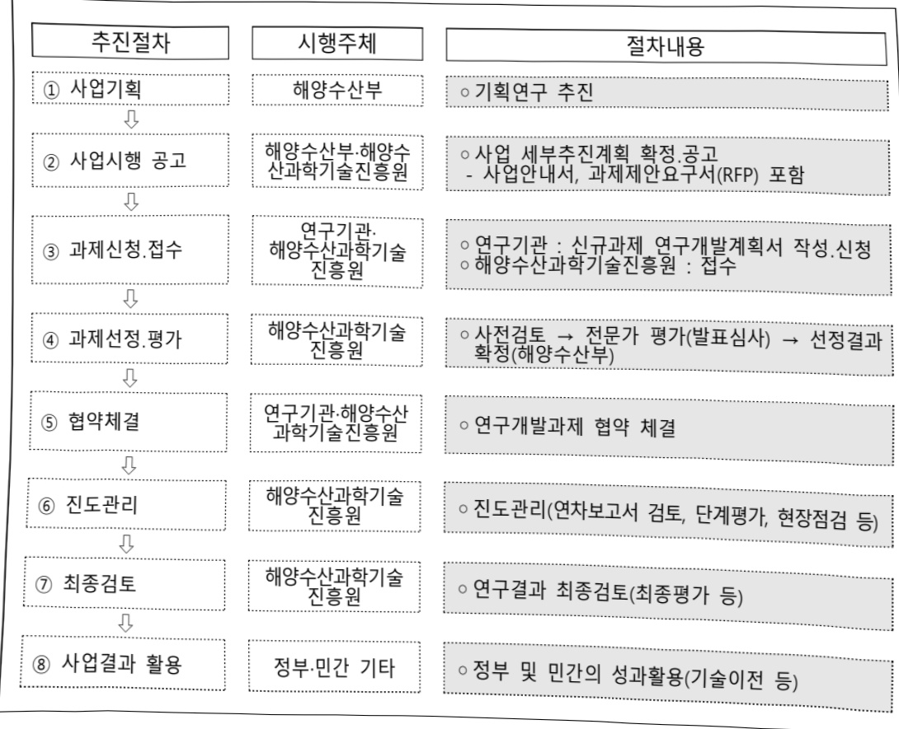

# 고품질준실시간해양그리드데이터서비스체계개발(R&D)

**해당 페이지**: PDF 4963 ~ 4969 쪽 해당

**부처**: 해양수산부
**분야**: 교통 및 물류
**회계유형**: 일반회계
**2026 확정예산**: 3067.0 백만원
**전년대비 증감률**: None%
**AI 도메인**: 해양/수산

---

<table border=1 style='margin: auto; word-wrap: break-word;'><tr><td style='text-align: center; word-wrap: break-word;'>사 업 명</td></tr><tr><td style='text-align: center; word-wrap: break-word;'>(38) 고품질 준실시간 해양그리드 데이터서비스 체계 개발(R&amp;D) (2042-329)</td></tr></table>

□ 사업 코드 정보

<table border=1 style='margin: auto; word-wrap: break-word;'><tr><td style='text-align: center; word-wrap: break-word;'>구분</td><td style='text-align: center; word-wrap: break-word;'>회계</td><td style='text-align: center; word-wrap: break-word;'>소관</td><td style='text-align: center; word-wrap: break-word;'>실국(기관)</td><td style='text-align: center; word-wrap: break-word;'>계정</td><td style='text-align: center; word-wrap: break-word;'>분야</td><td style='text-align: center; word-wrap: break-word;'>부문</td></tr><tr><td style='text-align: center; word-wrap: break-word;'>코드</td><td style='text-align: center; word-wrap: break-word;'>11</td><td style='text-align: center; word-wrap: break-word;'>28</td><td rowspan="2">해양정책실</td><td rowspan="2">-</td><td style='text-align: center; word-wrap: break-word;'>120</td><td style='text-align: center; word-wrap: break-word;'>126</td></tr><tr><td style='text-align: center; word-wrap: break-word;'>명칭</td><td style='text-align: center; word-wrap: break-word;'>일반회계</td><td style='text-align: center; word-wrap: break-word;'>해양수산부</td><td style='text-align: center; word-wrap: break-word;'>교통및물류</td><td style='text-align: center; word-wrap: break-word;'>물류등기타</td></tr></table>

<table border=1 style='margin: auto; word-wrap: break-word;'><tr><td style='text-align: center; word-wrap: break-word;'>구분</td><td style='text-align: center; word-wrap: break-word;'>프로그램</td><td style='text-align: center; word-wrap: break-word;'>단위사업</td><td style='text-align: center; word-wrap: break-word;'>세부사업</td></tr><tr><td style='text-align: center; word-wrap: break-word;'>코드</td><td style='text-align: center; word-wrap: break-word;'>2000</td><td style='text-align: center; word-wrap: break-word;'>2042</td><td style='text-align: center; word-wrap: break-word;'>329</td></tr><tr><td style='text-align: center; word-wrap: break-word;'>명칭</td><td style='text-align: center; word-wrap: break-word;'>해양산업육성 및 영토관리</td><td style='text-align: center; word-wrap: break-word;'>연구장비개발 및 인프라구축(R&amp;D)</td><td style='text-align: center; word-wrap: break-word;'>고품질준실시간해양그리드 데이터서비스체계개발(R&amp;D)</td></tr></table>

□ 사업 성격 (공통요구자료 Ⅱ-1 작성유의사항 4. 참조, 해당하는 사항에 “○” 표시)

<table border=1 style='margin: auto; word-wrap: break-word;'><tr><td rowspan="2">신규</td><td rowspan="2">계속</td><td rowspan="2">완료</td><td style='text-align: center; word-wrap: break-word;'>예비타당성</td><td style='text-align: center; word-wrap: break-word;'>총사업비</td><td style='text-align: center; word-wrap: break-word;'>총액계상</td><td style='text-align: center; word-wrap: break-word;'>사업소관 변경정보</td></tr><tr><td style='text-align: center; word-wrap: break-word;'>실시여부</td><td style='text-align: center; word-wrap: break-word;'>관리대상</td><td style='text-align: center; word-wrap: break-word;'>예산사업</td><td style='text-align: center; word-wrap: break-word;'>2025예산 시 소관</td></tr><tr><td style='text-align: center; word-wrap: break-word;'></td><td style='text-align: center; word-wrap: break-word;'>○</td><td style='text-align: center; word-wrap: break-word;'></td><td style='text-align: center; word-wrap: break-word;'></td><td style='text-align: center; word-wrap: break-word;'></td><td style='text-align: center; word-wrap: break-word;'></td><td style='text-align: center; word-wrap: break-word;'></td></tr></table>

□ 사업 지원 형태 및 지원을 (최소한 한 개는 반드시 선택하시오. 해당사항에 0 표시)

<table border=1 style='margin: auto; word-wrap: break-word;'><tr><td style='text-align: center; word-wrap: break-word;'>직접</td><td style='text-align: center; word-wrap: break-word;'>출자</td><td style='text-align: center; word-wrap: break-word;'>출연</td><td style='text-align: center; word-wrap: break-word;'>보조</td><td style='text-align: center; word-wrap: break-word;'>융자</td><td style='text-align: center; word-wrap: break-word;'>국고보조율(%)</td><td style='text-align: center; word-wrap: break-word;'>융자율(%)</td></tr><tr><td style='text-align: center; word-wrap: break-word;'></td><td style='text-align: center; word-wrap: break-word;'></td><td style='text-align: center; word-wrap: break-word;'>○</td><td style='text-align: center; word-wrap: break-word;'></td><td style='text-align: center; word-wrap: break-word;'></td><td style='text-align: center; word-wrap: break-word;'></td><td style='text-align: center; word-wrap: break-word;'></td></tr></table>

## □ 사업 담당자

<table border=1 style='margin: auto; word-wrap: break-word;'><tr><td style='text-align: center; word-wrap: break-word;'>사업명</td><td colspan="2">구분</td></tr><tr><td rowspan="4">고품질 준실시간 해양그리드 데이터서비스 체계 개발 (R&amp;D)</td><td rowspan="3">소관부처</td><td style='text-align: center; word-wrap: break-word;'>실·국·과(팀)명</td></tr><tr><td style='text-align: center; word-wrap: break-word;'>해양정책실</td></tr><tr><td style='text-align: center; word-wrap: break-word;'>해양개발과</td></tr><tr><td style='text-align: center; word-wrap: break-word;'>사업시행주체</td><td style='text-align: center; word-wrap: break-word;'>해양수산과학기술진흥원 해양R&amp;D실</td></tr></table>

---

### 가.예산 총괄표

(단위: 백만원, %)

<table border=1 style='margin: auto; word-wrap: break-word;'><tr><td rowspan="2">사업명</td><td rowspan="2">2024년 결산</td><td colspan="2">2025년</td><td colspan="2">2026년</td><td rowspan="2">증감(B-A)</td><td rowspan="2">(B-A)/A</td></tr><tr><td style='text-align: center; word-wrap: break-word;'>본예산(A)</td><td style='text-align: center; word-wrap: break-word;'>추경</td><td style='text-align: center; word-wrap: break-word;'>정부안</td><td style='text-align: center; word-wrap: break-word;'>확정(B)</td></tr><tr><td style='text-align: center; word-wrap: break-word;'>고품질 준실시간 해양그리드 데이터서비스 체계 개발(R&amp;D)</td><td style='text-align: center; word-wrap: break-word;'>2,217</td><td style='text-align: center; word-wrap: break-word;'>3,067</td><td style='text-align: center; word-wrap: break-word;'>3,067</td><td style='text-align: center; word-wrap: break-word;'>3,067</td><td style='text-align: center; word-wrap: break-word;'>3,067</td><td style='text-align: center; word-wrap: break-word;'>-</td><td style='text-align: center; word-wrap: break-word;'>-</td></tr></table>

□ 기능별(내역사업별), 목별 예산 내역

(단위:백만원)

<table border=1 style='margin: auto; word-wrap: break-word;'><tr><td rowspan="3"></td><td colspan="5">2024</td><td colspan="7">2025(2025.12.월 말)</td><td rowspan="3">2026예산</td></tr><tr><td rowspan="2">예산액(추정)</td><td rowspan="2">예산현액</td><td rowspan="2">집행액[실집행액]</td><td rowspan="2">이월액</td><td rowspan="2">불용액</td><td rowspan="2">본예산</td><td rowspan="2">예산현액</td><td rowspan="2">집행액[실집행액]</td><td colspan="2">전년도이월액제외</td><td rowspan="2">이월예상액</td><td rowspan="2">불용예상액</td></tr><tr><td style='text-align: center; word-wrap: break-word;'>예산현액</td><td style='text-align: center; word-wrap: break-word;'>집행액[실집행액]</td></tr><tr><td style='text-align: center; word-wrap: break-word;'>○ 기능별 분류(합계)</td><td style='text-align: center; word-wrap: break-word;'>2,217</td><td style='text-align: center; word-wrap: break-word;'>2,217</td><td style='text-align: center; word-wrap: break-word;'>2,217[2,217]</td><td style='text-align: center; word-wrap: break-word;'>-</td><td style='text-align: center; word-wrap: break-word;'>-</td><td style='text-align: center; word-wrap: break-word;'>3,067</td><td style='text-align: center; word-wrap: break-word;'>3,067[3,067]</td><td style='text-align: center; word-wrap: break-word;'>3,067[3,067]</td><td style='text-align: center; word-wrap: break-word;'>3,067[3,067]</td><td style='text-align: center; word-wrap: break-word;'>3,067[3,067]</td><td style='text-align: center; word-wrap: break-word;'>-</td><td style='text-align: center; word-wrap: break-word;'>-</td><td style='text-align: center; word-wrap: break-word;'>3,067</td></tr><tr><td style='text-align: center; word-wrap: break-word;'>· 고품질 준실시간 해양그리드 데이터서비스체계 개발</td><td style='text-align: center; word-wrap: break-word;'>2,217</td><td style='text-align: center; word-wrap: break-word;'>2,217</td><td style='text-align: center; word-wrap: break-word;'>2,217[2,217]</td><td style='text-align: center; word-wrap: break-word;'>-</td><td style='text-align: center; word-wrap: break-word;'>-</td><td style='text-align: center; word-wrap: break-word;'>3,067</td><td style='text-align: center; word-wrap: break-word;'>3,067[3,067]</td><td style='text-align: center; word-wrap: break-word;'>3,067[3,067]</td><td style='text-align: center; word-wrap: break-word;'>3,067[3,067]</td><td style='text-align: center; word-wrap: break-word;'>3,067[3,067]</td><td style='text-align: center; word-wrap: break-word;'>-</td><td style='text-align: center; word-wrap: break-word;'>-</td><td style='text-align: center; word-wrap: break-word;'>3,067</td></tr><tr><td style='text-align: center; word-wrap: break-word;'>○ 비목별 분류(합계)</td><td style='text-align: center; word-wrap: break-word;'>2,217</td><td style='text-align: center; word-wrap: break-word;'>2,217</td><td style='text-align: center; word-wrap: break-word;'>2,217[2,217]</td><td style='text-align: center; word-wrap: break-word;'>-</td><td style='text-align: center; word-wrap: break-word;'>-</td><td style='text-align: center; word-wrap: break-word;'>3,067</td><td style='text-align: center; word-wrap: break-word;'>3,067[3,067]</td><td style='text-align: center; word-wrap: break-word;'>3,067[3,067]</td><td style='text-align: center; word-wrap: break-word;'>3,067[3,067]</td><td style='text-align: center; word-wrap: break-word;'>3,067[3,067]</td><td style='text-align: center; word-wrap: break-word;'>-</td><td style='text-align: center; word-wrap: break-word;'>-</td><td style='text-align: center; word-wrap: break-word;'>3,067</td></tr><tr><td style='text-align: center; word-wrap: break-word;'>· 연구개발활동비 등(360-05)</td><td style='text-align: center; word-wrap: break-word;'>2,217</td><td style='text-align: center; word-wrap: break-word;'>2,217</td><td style='text-align: center; word-wrap: break-word;'>2,217[2,217]</td><td style='text-align: center; word-wrap: break-word;'>-</td><td style='text-align: center; word-wrap: break-word;'>-</td><td style='text-align: center; word-wrap: break-word;'>3,067</td><td style='text-align: center; word-wrap: break-word;'>3,067[3,067]</td><td style='text-align: center; word-wrap: break-word;'>3,067[3,067]</td><td style='text-align: center; word-wrap: break-word;'>3,067[3,067]</td><td style='text-align: center; word-wrap: break-word;'>3,067[3,067]</td><td style='text-align: center; word-wrap: break-word;'>-</td><td style='text-align: center; word-wrap: break-word;'>-</td><td style='text-align: center; word-wrap: break-word;'>3,067</td></tr><tr><td style='text-align: center; word-wrap: break-word;'>○ 기능비목별 분류(합계)</td><td style='text-align: center; word-wrap: break-word;'>2,217</td><td style='text-align: center; word-wrap: break-word;'>2,217</td><td style='text-align: center; word-wrap: break-word;'>2,217[2,217]</td><td style='text-align: center; word-wrap: break-word;'>-</td><td style='text-align: center; word-wrap: break-word;'>-</td><td style='text-align: center; word-wrap: break-word;'>3,067</td><td style='text-align: center; word-wrap: break-word;'>3,067[3,067]</td><td style='text-align: center; word-wrap: break-word;'>3,067[3,067]</td><td style='text-align: center; word-wrap: break-word;'>3,067[3,067]</td><td style='text-align: center; word-wrap: break-word;'>3,067[3,067]</td><td style='text-align: center; word-wrap: break-word;'>-</td><td style='text-align: center; word-wrap: break-word;'>-</td><td style='text-align: center; word-wrap: break-word;'>3,067</td></tr><tr><td style='text-align: center; word-wrap: break-word;'>· 고품질 준실시간 해양그리드 데이터서비스체계 개발 등(360-05)</td><td style='text-align: center; word-wrap: break-word;'>2,217</td><td style='text-align: center; word-wrap: break-word;'>2,217</td><td style='text-align: center; word-wrap: break-word;'>2,217[2,217]</td><td style='text-align: center; word-wrap: break-word;'>-</td><td style='text-align: center; word-wrap: break-word;'>-</td><td style='text-align: center; word-wrap: break-word;'>3,067</td><td style='text-align: center; word-wrap: break-word;'>3,067[3,067]</td><td style='text-align: center; word-wrap: break-word;'>3,067[3,067]</td><td style='text-align: center; word-wrap: break-word;'>3,067[3,067]</td><td style='text-align: center; word-wrap: break-word;'>3,067[3,067]</td><td style='text-align: center; word-wrap: break-word;'>-</td><td style='text-align: center; word-wrap: break-word;'>-</td><td style='text-align: center; word-wrap: break-word;'>3,067</td></tr></table>

---

### 나. 사업설명자료

## 1 ) 사업목적·내용

- (고품질 준실시간 해양그리드 데이터서비스 체계 개발) 선박·해양무인기 연계 3D 해양관측 기술 개발을 통한 국가 해양 선박관측의 현대화, 해양 관측자료 품질관리 체계화/표준화, AI 기반 지능형 해양 수중 데이터 격자화를 통한 해양정보 활용 편의 증대 서비스 체계 구축

## 2 ) 사업개요

## □ 사업근거 및 추진경위

① 법령상 근거 및 조항 적시

- 「과학기술기본법」 제11조(국가연구개발사업의 추진)

- 「해양수산발전기본법」 제17조(해양과학조사 및 기술개발 등)

- 「해양수산과학기술 육성법」 제8조(연구개발사업 등의 추진)

- 「해양과학조사법」 제20조(해양과학조사의 장려)

- 「해양경비법」 제3조(국가의 책무)

- 「해양환경 보전 및 활용에 관한 법률」 제17조(해양기후변화 대응), 제23조(해양환경 관련 과학기술의 개발 등)

② 추진경위

- (20) 해양과학기술로드맵 수립

- (21~ ) 해양무인기 운용지원센터 설립 추진

- (23.4) 「고품질 준실시간 해양그리드 데이터서비스 체계 개발」 신규과제 착수

## □ 주요내용

① 사업규모

- 총사업비(해당되는 경우에만 기재) : 해당없음

- 사업기간 : 2023 ~ 2028

- 최근 5년 간 투입된 사업비(예산액기준, 추경편성한 연도에는 추경포함)

<table border=1 style='margin: auto; word-wrap: break-word;'><tr><td style='text-align: center; word-wrap: break-word;'>$ \underline{\text{所}} $</td><td style='text-align: center; word-wrap: break-word;'>2022</td><td style='text-align: center; word-wrap: break-word;'>2023</td><td style='text-align: center; word-wrap: break-word;'>2024</td><td style='text-align: center; word-wrap: break-word;'>2025</td><td style='text-align: center; word-wrap: break-word;'>2026</td></tr><tr><td style='text-align: center; word-wrap: break-word;'>$ \underline{\text{人}} $</td><td style='text-align: center; word-wrap: break-word;'>-</td><td style='text-align: center; word-wrap: break-word;'>1,700</td><td style='text-align: center; word-wrap: break-word;'>2,217</td><td style='text-align: center; word-wrap: break-word;'>3,067</td><td style='text-align: center; word-wrap: break-word;'>3,067</td></tr></table>

- 기타: 내역사업 1개, 세부과제 1개

---

## ② 사업추진체계

- 사업시행방법 : 출연

- 사업시행주체 : (전문기관) 해양수산과학기술진흥원, (주관기관) 경북대학교 산학협력단

- 사업 수혜자 : 출연연, 대학, 기업 등

- 보조, 융자, 출연, 출자 등의 경우 보조 · 융자 등 지원 비율 및 법적근거

<table border=1 style='margin: auto; word-wrap: break-word;'><tr><td style='text-align: center; word-wrap: break-word;'>내역사업명</td><td style='text-align: center; word-wrap: break-word;'>구분</td><td style='text-align: center; word-wrap: break-word;'>피보조·피출연 등 기관명</td><td style='text-align: center; word-wrap: break-word;'>지원 금액 (2026예산)</td><td style='text-align: center; word-wrap: break-word;'>지원 비율(%)</td><td style='text-align: center; word-wrap: break-word;'>보조율 법적근거 (해당 조항)</td></tr><tr><td style='text-align: center; word-wrap: break-word;'>고품질 준실시간 해양그리드 데이터서비스 체계 개발</td><td style='text-align: center; word-wrap: break-word;'>출연</td><td style='text-align: center; word-wrap: break-word;'>해양수산 과학기술 진흥원</td><td style='text-align: center; word-wrap: break-word;'>3,067</td><td style='text-align: center; word-wrap: break-word;'>100</td><td style='text-align: center; word-wrap: break-word;'>해양수산과학기술 육성법 제23조 (해양수산과학기술진흥원 설립)</td></tr></table>

## 3 ) 2026년도 예산 산출 근거

□ 고품질 준실시간 해양그리드 데이터서비스 체계 개발 : (2025 본예산) 3,067백만원 → (2026 예산) 3,067백만원, 전년동

① 고품질 준실시간 해양그리드 데이터서비스 체계 개발

: (2025 본예산) 3,067백만원 → (2026 요구) 3,067백만원, 전년동

- (요구) 해양그리드 정보 생산을 위한 실해역 시험 및 설계 등이 중심이 되는 3차년도('25) 결과를 바탕으로 체계 개발 연구의 실현(제작 및 체계 개발)*을 위한 연구비 3,067백만원 요구

* 선박-무인체 연계 활용기술을 개발하여 3차원 해양관측 정보를 확보하고 이를 기초로 AI를 활용한 일부 해역 모델데이터 구축

- (산출) 계속 1과제 × 3,067백만원 × 12/12개월 = 3,067백만원

2025년도 예산 및 2026년도 예산 산출 세부내역 비교

<table border=1 style='margin: auto; word-wrap: break-word;'><tr><td colspan="2">2025년 본예산</td><td colspan="2">2026년 예산</td></tr><tr><td style='text-align: center; word-wrap: break-word;'>예산</td><td style='text-align: center; word-wrap: break-word;'>산출내역</td><td style='text-align: center; word-wrap: break-word;'>예산</td><td style='text-align: center; word-wrap: break-word;'>산출내역</td></tr><tr><td style='text-align: center; word-wrap: break-word;'>3,067</td><td style='text-align: center; word-wrap: break-word;'>○ 연구개발활동비(360-05): 3,067백만원가. 수중글라이더 활용 연계기술 개발 (1,200백만원) • 선박 투하/회수 시스템 구축 2대 × 50백만원 = 100백만원 • 수중글라이더 임차 2회 × 5대 × 50백만원 = 500백만원 • 리튬 1차 배터리 구입 2회 × 5대 × 35백만원 = 350백만원 • 수중글라이더 정비운용 2회 × 5대 × 12백만원 = 120백만원 • 위성통신비 6개월 × 5대 × 3백만원 = 90백만원 • 출장비 및 기타 소모품비 40백만원 나. 생지화학 센서 탑재 기술 및 관측 체계 개발 (500백만원) • 클로로필 변수 관측 센서 구매 5대 × 28백만원 = 140백만원 • 용존산소 변수 관측 센서 구매 5대 × 28백만원 = 140백만원 • 생지화학 센서 탑재 및 테스트 5대 × 24백만원 = 120백만원 • 생지화학 센서 검교정비 2개 × 5대 × 1회 × 10백만원/개/대/회 = 100백만원 다. 무인수상정 관측플랫폼 프로토타입 개발 (687백만원) • 무인수상정 탑재 관측 플랫폼 상세설계비 75백만원 • 수상정 선박 하우징 제작 162백만원 • 원격조종 원치시스템 100백만원 • 무인수상정 엔진비 120백만원 • 자세제어 및 운용제어 장치 개발비 60백만원 • 선박 회피 및 자율 운행 시스템 170백만원</td><td style='text-align: center; word-wrap: break-word;'>3,067</td><td style='text-align: center; word-wrap: break-word;'>○ 연구개발활동비(360-05): 3,067백만원가. 수중글라이더 활용 연계기술 개발 (1,200백만원) • 선박 투하/회수 시스템 구축 2대 × 50백만원 = 100백만원 • 수중글라이더 임차 2회 × 5대 × 50백만원 = 500백만원 • 리튬 1차 배터리 구입 2회 × 5대 × 35백만원 = 350백만원 • 수중글라이더 정비운용 2회 × 5대 × 12백만원 = 120백만원 • 위성통신비 6개월 × 5대 × 3백만원 = 90백만원 • 출장비 및 기타 소모품비 40백만원 나. 생지화학 관측 체계 설계 (500백만원) • 생지화학 센서 탑재 및 테스트 5대 × 24백만원 = 200백만원 • 생지화학 센서 검교정비 2회 × 5대 × 10백만원 = 100백만원 • 생지화학 자료 처리 시스템 구축 = 100백만원 • 유지관리 및 기타 소모품 비용 = 100백만원 다. 무인수상정 관측플랫폼 프로토타입 개발 (500백만원) • 무인수상정 탑재 관측 플랫폼 상세설계비 100백만원 • 원격조종 원치시스템 150백만원 • 통신 및 방수 시스템 설계비 50백만원 • 관측 센서 구입비 200백만원 라. 선박 실시간 자료 전송 시스템 상세설계 (100백만원) • 실시간 데이터전송 제어 시스템 50백만원</td></tr></table>

---

<table border=1 style='margin: auto; word-wrap: break-word;'><tr><td rowspan="2">예산</td><td colspan="2">2025년 분예산</td><td colspan="2">2026년 예산</td></tr><tr><td colspan="2">산출내역</td><td style='text-align: center; word-wrap: break-word;'>예산</td><td style='text-align: center; word-wrap: break-word;'>산출내역</td></tr><tr><td rowspan="4"></td><td colspan="2">라. 선박 채수 자료 처리 및 분석 시스템 개발 (250백만원)
• 2변수(인산염 및 규산염) 채수자료 처리 체계화 방안 초안 개발비 210백만원
• 시료비 30백만원
• 기존 자료와 비교 10백만원</td><td style='text-align: center; word-wrap: break-word;'></td><td style='text-align: center; word-wrap: break-word;'>• 선박 및 육상 데이터 처리 하드웨어 설계 50백만원
마. 선박 채수 자료 처리 및 분석 시스템 개발 (250백만원)
• 1변수 채수자료 처리 체계화 방안 개발 200백만원
• 처리 설비 소모품 및 시약비 50백만원</td></tr><tr><td colspan="2">마. 3D 기계학습 모형 프로토타입 개발 (250백만원)
• 4D용 기계학습 HW 시스템 확장비 100백만원
• 수온 기반 기계 학습 모형 개발 150백만원</td><td colspan="2">바. 3D 기계학습 모형 프로토타입 개발 (337백만원)
• 다변수 학습데이터 수집 및 3차원 AI 모형 기초 학습 서버 운용 337백만원</td></tr><tr><td colspan="2">바. 전문가 협의회 발족 및 운영 (80백만원)
• 자료 품질평가 위원회 운영 30백만원
• 전문가 자문, 회의비 등 50백만원</td><td colspan="2">사. 전문가 협의회 발족 및 운영 (40백만원)
• 자료 품질평가 위원회 운영 20백만원
• 전문가 자문, 회의비 등 20백만원</td></tr><tr><td colspan="2">사. 데이터서비스 시스템 개발 (100백만원)
• 헬기반 자료 서비스 시스템 구축 100백만원</td><td colspan="2">야. 데이터서비스 시스템 개발 (140백만원)
• 헬기반 자료 서비스 시스템 구축 140백만원</td></tr></table>

## 4 ) 사업효과

□ 사업영향, 산출물 성과지표 등

① 2022~2026년도 성과계획서 상 성과지표 및 최근 5년간 성과 달성도

<table border=1 style='margin: auto; word-wrap: break-word;'><tr><td style='text-align: center; word-wrap: break-word;'>성과지표</td><td style='text-align: center; word-wrap: break-word;'>구분</td><td style='text-align: center; word-wrap: break-word;'>2022</td><td style='text-align: center; word-wrap: break-word;'>2023</td><td style='text-align: center; word-wrap: break-word;'>2024</td><td style='text-align: center; word-wrap: break-word;'>2025</td><td style='text-align: center; word-wrap: break-word;'>2026</td><td style='text-align: center; word-wrap: break-word;'>2026 목표치산출근거</td><td style='text-align: center; word-wrap: break-word;'>측정산식(또는 측정방법)</td><td style='text-align: center; word-wrap: break-word;'>자료수집방법(또는 자료출처)</td></tr><tr><td rowspan="3">해양수산일자리 창출 수(단위: 명)</td><td style='text-align: center; word-wrap: break-word;'>목표</td><td style='text-align: center; word-wrap: break-word;'>87</td><td style='text-align: center; word-wrap: break-word;'>160</td><td style='text-align: center; word-wrap: break-word;'>221</td><td style='text-align: center; word-wrap: break-word;'>255</td><td style='text-align: center; word-wrap: break-word;'>261</td><td rowspan="3">&#x27;24년 실적(227명) 대비1.15배 상향한 도전적 목표(261명) 제시</td><td rowspan="3">해양수산창업·투자, R&amp;D 지원사업 수혜기업의 신규 고용창출 수</td><td rowspan="3">해양수산과학 기술진흥원(KIMST) 보고서</td></tr><tr><td style='text-align: center; word-wrap: break-word;'>실적</td><td style='text-align: center; word-wrap: break-word;'>188</td><td style='text-align: center; word-wrap: break-word;'>252</td><td style='text-align: center; word-wrap: break-word;'>227</td><td style='text-align: center; word-wrap: break-word;'>-</td><td style='text-align: center; word-wrap: break-word;'>-</td></tr><tr><td style='text-align: center; word-wrap: break-word;'>달성도</td><td style='text-align: center; word-wrap: break-word;'>216%</td><td style='text-align: center; word-wrap: break-word;'>157.5%</td><td style='text-align: center; word-wrap: break-word;'>102.7%</td><td style='text-align: center; word-wrap: break-word;'>-</td><td style='text-align: center; word-wrap: break-word;'>-</td></tr></table>

※ 본 세부사업이 포함되어 있는 프로그램「해양산업육성및영토관리」의 성과지표임

② 성과지표 이외의 연도별 사업추진 경과 및 실적

<table border=1 style='margin: auto; word-wrap: break-word;'><tr><td style='text-align: center; word-wrap: break-word;'>2023</td><td style='text-align: center; word-wrap: break-word;'>○ 소형 무인수상정 관측플랫폼 프로토타입 개발 및 선박 실시간 자료 전송 시스템 설계 ○ AI 기반 지능형 Nowcast를 위한 기계학습 모형 프로토타입 개발 ○ 동해 106라인 수중글라이더 365일 이상 연속 운용 성공</td></tr><tr><td style='text-align: center; word-wrap: break-word;'>2024</td><td style='text-align: center; word-wrap: break-word;'>○ 국가 정선관측 선박과 수중글라이더 선단 심해역 연계 체계 설계 ○ 선박 채수자료 처리 및 품질관리 체계(1변수) 개발 ○ 국내 최초 수중글라이더 3기 선단 64일 운용 성공</td></tr><tr><td style='text-align: center; word-wrap: break-word;'>2025</td><td style='text-align: center; word-wrap: break-word;'>○ 수중글라이더 3기 선단 365일 연속 운용 및 3차원 데이터 생산 ○ 무인수상정용 플랫폼 프로토타입 개발 및 관측플랫폼 시스템 설계</td></tr></table>

---

③ 향후(2026년도 이후) 기대효과

☐ 선박-해양무인기 연계 해양관측 및 지능형 격자화 기술을 활용한 3일·2km 이내 간격의 고해상도 3D 해양 자료서비스 제공

11종 이상의 해양정보 품질관리 체계화/표준화를 통한 기후변동성 30% 이내 정확도 달성

O KODC 해양관측정보 활용성 50% 이상 증대 목표

## 5 ) 타당성조사 및 예비타당성조사 시행여부 및 결과 요지 : 해당없음

## 6 ) 총사업비 대상사업 여부 및 내역 : 해당없음

## 7 ) 사업 집행절차

---

8) 각종 평가

- 해당없음

### 다. 최근 4년간 결산내역

1) 결산표

☐ 부처 결산내역

(단위: 백만원, %)

<table border=1 style='margin: auto; word-wrap: break-word;'><tr><td rowspan="2">闰도</td><td colspan="3">예산액</td><td rowspan="2">전년도 이월액</td><td rowspan="2">이·전용 등</td><td rowspan="2">예비비</td><td rowspan="2">예산 현액(B)</td><td rowspan="2">집행액(C)</td><td rowspan="2">집행률(C/A)</td><td rowspan="2">집행률(C/B)</td><td rowspan="2">다음연도 이월액</td><td rowspan="2">불용액</td></tr><tr><td style='text-align: center; word-wrap: break-word;'>본예산 중감액</td><td style='text-align: center; word-wrap: break-word;'>추경 중감액</td><td style='text-align: center; word-wrap: break-word;'>추경(A)</td></tr><tr><td style='text-align: center; word-wrap: break-word;'>2022</td><td style='text-align: center; word-wrap: break-word;'>-</td><td style='text-align: center; word-wrap: break-word;'>-</td><td style='text-align: center; word-wrap: break-word;'>-</td><td style='text-align: center; word-wrap: break-word;'>-</td><td style='text-align: center; word-wrap: break-word;'>-</td><td style='text-align: center; word-wrap: break-word;'>-</td><td style='text-align: center; word-wrap: break-word;'>-</td><td style='text-align: center; word-wrap: break-word;'>-</td><td style='text-align: center; word-wrap: break-word;'>-</td><td style='text-align: center; word-wrap: break-word;'>-</td><td style='text-align: center; word-wrap: break-word;'>-</td><td style='text-align: center; word-wrap: break-word;'>-</td></tr><tr><td style='text-align: center; word-wrap: break-word;'>2023</td><td style='text-align: center; word-wrap: break-word;'>1,700</td><td style='text-align: center; word-wrap: break-word;'>-</td><td style='text-align: center; word-wrap: break-word;'>1,700</td><td style='text-align: center; word-wrap: break-word;'>-</td><td style='text-align: center; word-wrap: break-word;'>-</td><td style='text-align: center; word-wrap: break-word;'>-</td><td style='text-align: center; word-wrap: break-word;'>1,700</td><td style='text-align: center; word-wrap: break-word;'>1,700</td><td style='text-align: center; word-wrap: break-word;'>100</td><td style='text-align: center; word-wrap: break-word;'>100</td><td style='text-align: center; word-wrap: break-word;'>-</td><td style='text-align: center; word-wrap: break-word;'>-</td></tr><tr><td style='text-align: center; word-wrap: break-word;'>2024</td><td style='text-align: center; word-wrap: break-word;'>2,217</td><td style='text-align: center; word-wrap: break-word;'>-</td><td style='text-align: center; word-wrap: break-word;'>2,217</td><td style='text-align: center; word-wrap: break-word;'>-</td><td style='text-align: center; word-wrap: break-word;'>-</td><td style='text-align: center; word-wrap: break-word;'>-</td><td style='text-align: center; word-wrap: break-word;'>2,217</td><td style='text-align: center; word-wrap: break-word;'>2,217</td><td style='text-align: center; word-wrap: break-word;'>100</td><td style='text-align: center; word-wrap: break-word;'>100</td><td style='text-align: center; word-wrap: break-word;'>-</td><td style='text-align: center; word-wrap: break-word;'>-</td></tr><tr><td style='text-align: center; word-wrap: break-word;'>2025</td><td style='text-align: center; word-wrap: break-word;'>3,067</td><td style='text-align: center; word-wrap: break-word;'>-</td><td style='text-align: center; word-wrap: break-word;'>3,067</td><td style='text-align: center; word-wrap: break-word;'>-</td><td style='text-align: center; word-wrap: break-word;'>-</td><td style='text-align: center; word-wrap: break-word;'>-</td><td style='text-align: center; word-wrap: break-word;'>3,067</td><td style='text-align: center; word-wrap: break-word;'>3,067</td><td style='text-align: center; word-wrap: break-word;'>100</td><td style='text-align: center; word-wrap: break-word;'>100</td><td style='text-align: center; word-wrap: break-word;'>-</td><td style='text-align: center; word-wrap: break-word;'>-</td></tr></table>

□출연·보조사업 등 실집행내역

(단위: 백만원, %)

<table border=1 style='margin: auto; word-wrap: break-word;'><tr><td rowspan="3">구분</td><td colspan="3">부처</td><td colspan="7">사업시행주체(피출연·피보조 기관 등)</td></tr><tr><td colspan="2">예산액</td><td rowspan="2">집행액</td><td rowspan="2">교부액</td><td rowspan="2">전년도 이월액</td><td rowspan="2">교부 현액</td><td rowspan="2">집행액 (B)</td><td rowspan="2">이월액</td><td rowspan="2">불용액</td><td rowspan="2">실집행률 (B/A)</td></tr><tr><td style='text-align: center; word-wrap: break-word;'>본예산</td><td style='text-align: center; word-wrap: break-word;'>추경(A)</td></tr><tr><td style='text-align: center; word-wrap: break-word;'>2022</td><td style='text-align: center; word-wrap: break-word;'>-</td><td style='text-align: center; word-wrap: break-word;'>-</td><td style='text-align: center; word-wrap: break-word;'>-</td><td style='text-align: center; word-wrap: break-word;'>-</td><td style='text-align: center; word-wrap: break-word;'>-</td><td style='text-align: center; word-wrap: break-word;'>-</td><td style='text-align: center; word-wrap: break-word;'>-</td><td style='text-align: center; word-wrap: break-word;'>-</td><td style='text-align: center; word-wrap: break-word;'>-</td><td style='text-align: center; word-wrap: break-word;'>-</td></tr><tr><td style='text-align: center; word-wrap: break-word;'>2023</td><td style='text-align: center; word-wrap: break-word;'>1,700</td><td style='text-align: center; word-wrap: break-word;'>-</td><td style='text-align: center; word-wrap: break-word;'>1,700</td><td style='text-align: center; word-wrap: break-word;'>1,700</td><td style='text-align: center; word-wrap: break-word;'>-</td><td style='text-align: center; word-wrap: break-word;'>1,700</td><td style='text-align: center; word-wrap: break-word;'>1,700</td><td style='text-align: center; word-wrap: break-word;'>-</td><td style='text-align: center; word-wrap: break-word;'>-</td><td style='text-align: center; word-wrap: break-word;'>100</td></tr><tr><td style='text-align: center; word-wrap: break-word;'>2024</td><td style='text-align: center; word-wrap: break-word;'>2,217</td><td style='text-align: center; word-wrap: break-word;'>-</td><td style='text-align: center; word-wrap: break-word;'>2,217</td><td style='text-align: center; word-wrap: break-word;'>2,217</td><td style='text-align: center; word-wrap: break-word;'>-</td><td style='text-align: center; word-wrap: break-word;'>2,217</td><td style='text-align: center; word-wrap: break-word;'>2,217</td><td style='text-align: center; word-wrap: break-word;'>-</td><td style='text-align: center; word-wrap: break-word;'>-</td><td style='text-align: center; word-wrap: break-word;'>100</td></tr><tr><td style='text-align: center; word-wrap: break-word;'>2025. 12월기준</td><td style='text-align: center; word-wrap: break-word;'>3,067</td><td style='text-align: center; word-wrap: break-word;'>-</td><td style='text-align: center; word-wrap: break-word;'>3,067</td><td style='text-align: center; word-wrap: break-word;'>3,067</td><td style='text-align: center; word-wrap: break-word;'>-</td><td style='text-align: center; word-wrap: break-word;'>3,067</td><td style='text-align: center; word-wrap: break-word;'>3,067</td><td style='text-align: center; word-wrap: break-word;'>-</td><td style='text-align: center; word-wrap: break-word;'>-</td><td style='text-align: center; word-wrap: break-word;'>100</td></tr></table>

2) 주요 결산사항 : 해당없음

---

### 원본 PDF 크롭 이미지

