# 극지연구소 운영지원(R&D)

**해당 페이지**: PDF 4977 ~ 4984 쪽 해당

**부처**: 해양수산부
**분야**: 과학기술
**회계유형**: 일반회계
**2026 확정예산**: 80306.0 백만원
**전년대비 증감률**: 5.8%
**AI 도메인**: R&D 지원

---

<table border=1 style='margin: auto; word-wrap: break-word;'><tr><td rowspan="3"></td><td colspan="5">2024</td><td colspan="7">2025（25.12월말）</td><td rowspan="3">2026예산</td></tr><tr><td rowspan="2">예산액(추정)</td><td rowspan="2">예산현액</td><td rowspan="2">집행액[실집행액]</td><td rowspan="2">이월액</td><td rowspan="2">불용액</td><td rowspan="2">분예산</td><td rowspan="2">예산현액</td><td rowspan="2">집행액[실집행액]</td><td colspan="2">전년도 이월액제외</td><td rowspan="2">이월예산액</td><td rowspan="2">불용예산액</td></tr><tr><td style='text-align: center; word-wrap: break-word;'>예산현액</td><td style='text-align: center; word-wrap: break-word;'>집행액[실집행액]</td></tr><tr><td style='text-align: center; word-wrap: break-word;'>○ 기능별 분류(합계)</td><td style='text-align: center; word-wrap: break-word;'>71,236</td><td style='text-align: center; word-wrap: break-word;'>71,236</td><td style='text-align: center; word-wrap: break-word;'>71,036[72,310]</td><td style='text-align: center; word-wrap: break-word;'>-</td><td style='text-align: center; word-wrap: break-word;'>200</td><td style='text-align: center; word-wrap: break-word;'>75,895</td><td style='text-align: center; word-wrap: break-word;'>75,895</td><td style='text-align: center; word-wrap: break-word;'>75,495[72,076]</td><td style='text-align: center; word-wrap: break-word;'>75,895</td><td style='text-align: center; word-wrap: break-word;'>75,495[71,088]</td><td style='text-align: center; word-wrap: break-word;'>-</td><td style='text-align: center; word-wrap: break-word;'>400</td><td style='text-align: center; word-wrap: break-word;'>80,306</td></tr><tr><td style='text-align: center; word-wrap: break-word;'>· 기관운영비</td><td style='text-align: center; word-wrap: break-word;'>23,743</td><td style='text-align: center; word-wrap: break-word;'>23,743</td><td style='text-align: center; word-wrap: break-word;'>23,543[23,304]</td><td style='text-align: center; word-wrap: break-word;'>-</td><td style='text-align: center; word-wrap: break-word;'>200</td><td style='text-align: center; word-wrap: break-word;'>24,420</td><td style='text-align: center; word-wrap: break-word;'>24,420</td><td style='text-align: center; word-wrap: break-word;'>24,020[23,764]</td><td style='text-align: center; word-wrap: break-word;'>24,420</td><td style='text-align: center; word-wrap: break-word;'>24,020[23,764]</td><td style='text-align: center; word-wrap: break-word;'>-</td><td style='text-align: center; word-wrap: break-word;'>400</td><td style='text-align: center; word-wrap: break-word;'>25,072</td></tr><tr><td style='text-align: center; word-wrap: break-word;'>· 주요사업비</td><td style='text-align: center; word-wrap: break-word;'>47,493</td><td style='text-align: center; word-wrap: break-word;'>47,493</td><td style='text-align: center; word-wrap: break-word;'>47,493[49,006]</td><td style='text-align: center; word-wrap: break-word;'>-</td><td style='text-align: center; word-wrap: break-word;'>-</td><td style='text-align: center; word-wrap: break-word;'>51,475</td><td style='text-align: center; word-wrap: break-word;'>51,475</td><td style='text-align: center; word-wrap: break-word;'>51,475[48,312]</td><td style='text-align: center; word-wrap: break-word;'>51,475</td><td style='text-align: center; word-wrap: break-word;'>51,475[47,324]</td><td style='text-align: center; word-wrap: break-word;'>-</td><td style='text-align: center; word-wrap: break-word;'>-</td><td style='text-align: center; word-wrap: break-word;'>55,234</td></tr><tr><td style='text-align: center; word-wrap: break-word;'>○ 비목별 분류(합계)</td><td style='text-align: center; word-wrap: break-word;'>71,236</td><td style='text-align: center; word-wrap: break-word;'>71,236</td><td style='text-align: center; word-wrap: break-word;'>71,036[72,310]</td><td style='text-align: center; word-wrap: break-word;'>-</td><td style='text-align: center; word-wrap: break-word;'>200</td><td style='text-align: center; word-wrap: break-word;'>75,895</td><td style='text-align: center; word-wrap: break-word;'>75,895</td><td style='text-align: center; word-wrap: break-word;'>75,495[72,076]</td><td style='text-align: center; word-wrap: break-word;'>75,895</td><td style='text-align: center; word-wrap: break-word;'>75,495[71,088]</td><td style='text-align: center; word-wrap: break-word;'>-</td><td style='text-align: center; word-wrap: break-word;'>400</td><td style='text-align: center; word-wrap: break-word;'>80,306</td></tr><tr><td style='text-align: center; word-wrap: break-word;'>· 인진비(360-01)</td><td style='text-align: center; word-wrap: break-word;'>19,892</td><td style='text-align: center; word-wrap: break-word;'>19,892</td><td style='text-align: center; word-wrap: break-word;'>19,692[19,303]</td><td style='text-align: center; word-wrap: break-word;'>-</td><td style='text-align: center; word-wrap: break-word;'>200</td><td style='text-align: center; word-wrap: break-word;'>20,529</td><td style='text-align: center; word-wrap: break-word;'>20,529</td><td style='text-align: center; word-wrap: break-word;'>20,129[19,873]</td><td style='text-align: center; word-wrap: break-word;'>20,529</td><td style='text-align: center; word-wrap: break-word;'>20,129[19,873]</td><td style='text-align: center; word-wrap: break-word;'>-</td><td style='text-align: center; word-wrap: break-word;'>400</td><td style='text-align: center; word-wrap: break-word;'>21,313</td></tr><tr><td style='text-align: center; word-wrap: break-word;'>· 경상경비(360-02)</td><td style='text-align: center; word-wrap: break-word;'>3,851</td><td style='text-align: center; word-wrap: break-word;'>3,851</td><td style='text-align: center; word-wrap: break-word;'>3,851[3,851]</td><td style='text-align: center; word-wrap: break-word;'>-</td><td style='text-align: center; word-wrap: break-word;'>-</td><td style='text-align: center; word-wrap: break-word;'>3,891</td><td style='text-align: center; word-wrap: break-word;'>3,891</td><td style='text-align: center; word-wrap: break-word;'>3,891[3,891]</td><td style='text-align: center; word-wrap: break-word;'>3,891</td><td style='text-align: center; word-wrap: break-word;'>3,891[3,891]</td><td style='text-align: center; word-wrap: break-word;'>-</td><td style='text-align: center; word-wrap: break-word;'>-</td><td style='text-align: center; word-wrap: break-word;'>3,759</td></tr><tr><td style='text-align: center; word-wrap: break-word;'>· 장비시스템구축비(360-04)</td><td style='text-align: center; word-wrap: break-word;'>1,793</td><td style='text-align: center; word-wrap: break-word;'>1,793</td><td style='text-align: center; word-wrap: break-word;'>1,793[1,771]</td><td style='text-align: center; word-wrap: break-word;'>-</td><td style='text-align: center; word-wrap: break-word;'>-</td><td style='text-align: center; word-wrap: break-word;'>1,793</td><td style='text-align: center; word-wrap: break-word;'>1,793</td><td style='text-align: center; word-wrap: break-word;'>1,793[1,599]</td><td style='text-align: center; word-wrap: break-word;'>1,793</td><td style='text-align: center; word-wrap: break-word;'>1,793[1,599]</td><td style='text-align: center; word-wrap: break-word;'>-</td><td style='text-align: center; word-wrap: break-word;'>-</td><td style='text-align: center; word-wrap: break-word;'>1,793</td></tr><tr><td style='text-align: center; word-wrap: break-word;'>· 연구활동비(360-05)</td><td style='text-align: center; word-wrap: break-word;'>45,700</td><td style='text-align: center; word-wrap: break-word;'>45,700</td><td style='text-align: center; word-wrap: break-word;'>45,700[44,440]</td><td style='text-align: center; word-wrap: break-word;'>-</td><td style='text-align: center; word-wrap: break-word;'>-</td><td style='text-align: center; word-wrap: break-word;'>49,682</td><td style='text-align: center; word-wrap: break-word;'>49,682</td><td style='text-align: center; word-wrap: break-word;'>49,682[46,713]</td><td style='text-align: center; word-wrap: break-word;'>49,682</td><td style='text-align: center; word-wrap: break-word;'>49,682[45,725]</td><td style='text-align: center; word-wrap: break-word;'>-</td><td style='text-align: center; word-wrap: break-word;'>-</td><td style='text-align: center; word-wrap: break-word;'>53,441</td></tr><tr><td style='text-align: center; word-wrap: break-word;'>○ 기능비목별 분류(합계)</td><td style='text-align: center; word-wrap: break-word;'>71,236</td><td style='text-align: center; word-wrap: break-word;'>71,236</td><td style='text-align: center; word-wrap: break-word;'>71,036[72,310]</td><td style='text-align: center; word-wrap: break-word;'>-</td><td style='text-align: center; word-wrap: break-word;'>200</td><td style='text-align: center; word-wrap: break-word;'>75,895</td><td style='text-align: center; word-wrap: break-word;'>75,895</td><td style='text-align: center; word-wrap: break-word;'>75,495[72,076]</td><td style='text-align: center; word-wrap: break-word;'>75,895</td><td style='text-align: center; word-wrap: break-word;'>75,495[71,088]</td><td style='text-align: center; word-wrap: break-word;'>-</td><td style='text-align: center; word-wrap: break-word;'>400</td><td style='text-align: center; word-wrap: break-word;'>80,306</td></tr><tr><td style='text-align: center; word-wrap: break-word;'>· 기관운영비</td><td style='text-align: center; word-wrap: break-word;'>23,743</td><td style='text-align: center; word-wrap: break-word;'>23,743</td><td style='text-align: center; word-wrap: break-word;'>23,543[23,304]</td><td style='text-align: center; word-wrap: break-word;'>-</td><td style='text-align: center; word-wrap: break-word;'>200</td><td style='text-align: center; word-wrap: break-word;'>24,420</td><td style='text-align: center; word-wrap: break-word;'>24,420</td><td style='text-align: center; word-wrap: break-word;'>24,020[23,764]</td><td style='text-align: center; word-wrap: break-word;'>24,420</td><td style='text-align: center; word-wrap: break-word;'>24,020[23,764]</td><td style='text-align: center; word-wrap: break-word;'>-</td><td style='text-align: center; word-wrap: break-word;'>400</td><td style='text-align: center; word-wrap: break-word;'>25,072</td></tr><tr><td style='text-align: center; word-wrap: break-word;'>· 인진비(360-01)</td><td style='text-align: center; word-wrap: break-word;'>19,892</td><td style='text-align: center; word-wrap: break-word;'>19,892</td><td style='text-align: center; word-wrap: break-word;'>19,692[19,303]</td><td style='text-align: center; word-wrap: break-word;'>-</td><td style='text-align: center; word-wrap: break-word;'>200</td><td style='text-align: center; word-wrap: break-word;'>20,529</td><td style='text-align: center; word-wrap: break-word;'>20,529</td><td style='text-align: center; word-wrap: break-word;'>20,129[19,873]</td><td style='text-align: center; word-wrap: break-word;'>20,529</td><td style='text-align: center; word-wrap: break-word;'>20,129[19,873]</td><td style='text-align: center; word-wrap: break-word;'>-</td><td style='text-align: center; word-wrap: break-word;'>400</td><td style='text-align: center; word-wrap: break-word;'>21,313</td></tr><tr><td style='text-align: center; word-wrap: break-word;'>· 경상경비(360-02)</td><td style='text-align: center; word-wrap: break-word;'>3,851</td><td style='text-align: center; word-wrap: break-word;'>3,851</td><td style='text-align: center; word-wrap: break-word;'>3,851[3,851]</td><td style='text-align: center; word-wrap: break-word;'>-</td><td style='text-align: center; word-wrap: break-word;'>-</td><td style='text-align: center; word-wrap: break-word;'>3,891</td><td style='text-align: center; word-wrap: break-word;'>3,891</td><td style='text-align: center; word-wrap: break-word;'>3,891[3,891]</td><td style='text-align: center; word-wrap: break-word;'>3,891</td><td style='text-align: center; word-wrap: break-word;'>3,891[3,891]</td><td style='text-align: center; word-wrap: break-word;'>-</td><td style='text-align: center; word-wrap: break-word;'>-</td><td style='text-align: center; word-wrap: break-word;'>3,759</td></tr><tr><td style='text-align: center; word-wrap: break-word;'>· 주요사업비</td><td style='text-align: center; word-wrap: break-word;'>47,493</td><td style='text-align: center; word-wrap: break-word;'>47,493</td><td style='text-align: center; word-wrap: break-word;'>47,493[49,006]</td><td style='text-align: center; word-wrap: break-word;'>-</td><td style='text-align: center; word-wrap: break-word;'>-</td><td style='text-align: center; word-wrap: break-word;'>51,475</td><td style='text-align: center; word-wrap: break-word;'>51,475</td><td style='text-align: center; word-wrap: break-word;'>51,475[48,312]</td><td style='text-align: center; word-wrap: break-word;'>51,475</td><td style='text-align: center; word-wrap: break-word;'>51,475[47,324]</td><td style='text-align: center; word-wrap: break-word;'>-</td><td style='text-align: center; word-wrap: break-word;'>-</td><td style='text-align: center; word-wrap: break-word;'>55,234</td></tr><tr><td style='text-align: center; word-wrap: break-word;'>· 장비시스템구축비(360-04)</td><td style='text-align: center; word-wrap: break-word;'>1,793</td><td style='text-align: center; word-wrap: break-word;'>1,793</td><td style='text-align: center; word-wrap: break-word;'>1,793[1,771]</td><td style='text-align: center; word-wrap: break-word;'>-</td><td style='text-align: center; word-wrap: break-word;'>-</td><td style='text-align: center; word-wrap: break-word;'>1,793</td><td style='text-align: center; word-wrap: break-word;'>1,793</td><td style='text-align: center; word-wrap: break-word;'>1,793[1,599]</td><td style='text-align: center; word-wrap: break-word;'>1,793</td><td style='text-align: center; word-wrap: break-word;'>1,793[1,599]</td><td style='text-align: center; word-wrap: break-word;'>-</td><td style='text-align: center; word-wrap: break-word;'>-</td><td style='text-align: center; word-wrap: break-word;'>1,793</td></tr><tr><td style='text-align: center; word-wrap: break-word;'>· 연구활동비(360-05)</td><td style='text-align: center; word-wrap: break-word;'>45,700</td><td style='text-align: center; word-wrap: break-word;'>45,700</td><td style='text-align: center; word-wrap: break-word;'>45,700[44,440]</td><td style='text-align: center; word-wrap: break-word;'>-</td><td style='text-align: center; word-wrap: break-word;'>-</td><td style='text-align: center; word-wrap: break-word;'>49,682</td><td style='text-align: center; word-wrap: break-word;'>49,682</td><td style='text-align: center; word-wrap: break-word;'>49,682[46,713]</td><td style='text-align: center; word-wrap: break-word;'>49,682</td><td style='text-align: center; word-wrap: break-word;'>49,682[45,725]</td><td style='text-align: center; word-wrap: break-word;'>-</td><td style='text-align: center; word-wrap: break-word;'>-</td><td style='text-align: center; word-wrap: break-word;'>53,441</td></tr></table>

(단위: 백만원)

□ 기능별(대역사업별), 목별 예산 내역

<table border=1 style='margin: auto; word-wrap: break-word;'><tr><td rowspan="2">사업명</td><td rowspan="2">2024년 결산</td><td colspan="2">2025년 예산</td><td colspan="2">2026년</td><td rowspan="2">증감(B-A)</td><td rowspan="2">(B-A)/A</td></tr><tr><td style='text-align: center; word-wrap: break-word;'>본예산(A)</td><td style='text-align: center; word-wrap: break-word;'>추경</td><td style='text-align: center; word-wrap: break-word;'>정부안</td><td style='text-align: center; word-wrap: break-word;'>확정(B)</td></tr><tr><td style='text-align: center; word-wrap: break-word;'>극지연구소</td><td style='text-align: center; word-wrap: break-word;'>71,036</td><td style='text-align: center; word-wrap: break-word;'>75,895</td><td style='text-align: center; word-wrap: break-word;'>75,895</td><td style='text-align: center; word-wrap: break-word;'>80,306</td><td style='text-align: center; word-wrap: break-word;'>80,306</td><td style='text-align: center; word-wrap: break-word;'>4,411</td><td style='text-align: center; word-wrap: break-word;'>5.8</td></tr></table>

(단위: 빠끔원, %)

---

### 나. 사업설명자료

## 1 ) 사업목적·내용

- (극지연구소 운영지원) 극지인프라 구축·운영과 이를 활용한 남·북극에서의 기초 및 응용 과학연구 수행을 위한 극지연구소 운영비 지원

- (기관운영비) 기관 고유임무 수행을 위한 연구·지원인력 인건비 및 일반운영비, 시설 유지관리비 등 기관운영을 위한 경상운영비 지원

- (주요사업비) 극지 인프라 활용을 통한 극지에서의 기초·첨단응용과학 연구 수행, 3개 남·북극 과학기지·쇄빙연구선 아라온 등 극지 인프라의 안정적 운영 지원과 기관 고유임무 수행을 위한 연구·지원 수행

## 2 ) 사업개요

## □ 사업근거 및 추진경위

① 법령상 근거 조항 적시

-『한국해양과학기술원법』제4조

제4조(사무소 등) ① 해양과기원의 주된 사무소의 소재지는 정관으로 정한다.

② 해양과기원은 정관으로 정하는 바에 따라 부설기관 또는 분원(分院)을 설치할 수 있다.

-『극지활동 진흥법』제8조, 제11조

제8조(연구개발 등의 지원) ① 국가는 극지 관련 연구개발을 촉진하기 위하여 필요한 시책을 수립하고 추진하여야 한다.
② 국가는 극지 관련 연구개발의 활성화를 위하여 대학·연구기관·기업 간의 협력 및 공동 연구개발 등의 사업을 예산의 범위에서 지원할 수 있다.
제11조(극지활동 기반시설의 설치·운영) ① 국가는 극지활동에 필요한 다음 각 호의 극지활동 기반시설을 설치하거나 확보하여 운영할 수 있다.
1. 극지 과학기지
2. 쇄빙선(砕冰船: 바다의 얼음을 깨트려 부수고 뱃길을 내는 특수 장비를 갖춘 선박을 말한다) 등 선박
3. 항공기
4. 그 밖에 대통령령으로 정하는 극지활동에 필요한 설비 및 장비
② 국가는 제1항에 따라 설치·운영 중인 극지활동 기반시설을 대학, 연구기관 또는 기업이 적극 활용할 수 있도록 필요한 조치를 하여야 한다.

---

② 추진경위 - 사업 시작년도, 추진배경, 부처별 중점과제, 대통령 공약사항 등

- 2004. 4월 한국해양연구원 부설 극지연구소 설립

- 2006. 4월 청사 이전(인천 송도테크노파크)

- 2012. 7월 한국해양과학기술원 부설 극지연구소로 변경

- 2013. 4월 독립 청사 준공 및 이전(인천 송도)

- 2014. 2월 남극장보고과학기지 준공

-추진배경

· 남극활동 및 환경보호에 관한 법률(해양수산부, '04.8)

· 남극세종과학기지 운영개선 및 극지연구 활성화 대책(국무조정실, '04.3)

·'과학기술기본계획'의 7대 R&D 중점분야(국가과학기술위원회, '07.12)

·북극활동 진흥기본계획(관계부처 합동, '18.7)

· 극지과학 미래발전 전략(과학기술관계장관회의, '20.11)

· 극지활동 진흥법 시행('21.10.)

·2050 북극활동 전략(국무회의, '21.11)

· 제4차 남극 연구활동 진흥 기본계획 수립(국가과학기술심의회, '22.4)

## □ 주요내용

① 사업규모

- 사업기간 : '04년 ~ 계속

- 최근 5년 간 투입된 사업비

<table border=1 style='margin: auto; word-wrap: break-word;'><tr><td style='text-align: center; word-wrap: break-word;'>연도</td><td style='text-align: center; word-wrap: break-word;'>2022</td><td style='text-align: center; word-wrap: break-word;'>2023</td><td style='text-align: center; word-wrap: break-word;'>2024</td><td style='text-align: center; word-wrap: break-word;'>2025</td><td style='text-align: center; word-wrap: break-word;'>2026</td></tr><tr><td style='text-align: center; word-wrap: break-word;'>사업비</td><td style='text-align: center; word-wrap: break-word;'>80,882</td><td style='text-align: center; word-wrap: break-word;'>80,968</td><td style='text-align: center; word-wrap: break-word;'>71,236</td><td style='text-align: center; word-wrap: break-word;'>75,895</td><td style='text-align: center; word-wrap: break-word;'>80,306</td></tr></table>

② 사업추진체계

- 사업시행방법 : 출연

- 사업시행주체 : 극지연구소

-사업 수혜자 : 극지연구 유관 산·학·연·관 및 국민

- 보조, 융자, 출연, 출자 등의 경우 보조·융자 등 지원 비율 및 법적근거

<table border=1 style='margin: auto; word-wrap: break-word;'><tr><td style='text-align: center; word-wrap: break-word;'>내역사업명</td><td style='text-align: center; word-wrap: break-word;'>구분</td><td style='text-align: center; word-wrap: break-word;'>피보조·피출연 등 기관명</td><td style='text-align: center; word-wrap: break-word;'>지원 금액 (2026예산)</td><td style='text-align: center; word-wrap: break-word;'>지원 비율(%)</td><td style='text-align: center; word-wrap: break-word;'>보조율 법적근거 (해당 조항)</td></tr><tr><td style='text-align: center; word-wrap: break-word;'>기관운영비</td><td style='text-align: center; word-wrap: break-word;'>출연</td><td style='text-align: center; word-wrap: break-word;'>극지연구소</td><td style='text-align: center; word-wrap: break-word;'>25,072</td><td style='text-align: center; word-wrap: break-word;'>100.0</td><td style='text-align: center; word-wrap: break-word;'>한국해양과학기술원법 제10조 1, 2항</td></tr><tr><td style='text-align: center; word-wrap: break-word;'>주요사업비</td><td style='text-align: center; word-wrap: break-word;'>출연</td><td style='text-align: center; word-wrap: break-word;'>극지연구소</td><td style='text-align: center; word-wrap: break-word;'>55,234</td><td style='text-align: center; word-wrap: break-word;'>100.0</td><td style='text-align: center; word-wrap: break-word;'>한국해양과학기술원법 제10조 1, 2항</td></tr></table>

---

## 3 ) '26년도 예산 산출 근거

## ①기관운영비

:(25)24,420백만원→(26요구)25,072백만원,652백만원증액

- (요구) 기관 고유임무 수행을 위한 연구·지원인력 인건비 21,313백만원 요구

- (산출) 291명×5.9백만×12개월=20,529백만원 → 294명×6.0백만×12개월=21,313백만원

- (요구) 일반운영비, 시설유지관리비 등 기관운영에 소요되는 경상비 3,759백만원 요구

- (산출) 1개x3,891백만원x12/12개월=3,891백만원 → 1개x3,759백만원x12/12개월=3,759백만원

## ② 주요사업비

:(25)51,475백만원→(26요구)55,234백만원,3,759백만원증액

- (요구) 극지 인프라의 활용을 통한 극지 관련 지역에서의 기초·첨단응용과학 연구 수행 및 국제협력 강화, 3개 남·북극 과학기지 및 쇄빙연구선 아라온 등 극지 인프라 안정적 운영 위한 주요사업비 55,234백만원 요구

- (산출) 7개 고제x7,353백만원x12/12개월=51,475백만원 → 9개 고제x6,137백만원x12/12개월=55,234백만원

## 2025 년도 예산 및 2026년도 예산 산출 세부내역 비교

<table border=1 style='margin: auto; word-wrap: break-word;'><tr><td colspan="2">&#x27;25년 예산</td><td colspan="2">&#x27;26년 예산</td></tr><tr><td style='text-align: center; word-wrap: break-word;'>예산</td><td style='text-align: center; word-wrap: break-word;'>산출내역</td><td style='text-align: center; word-wrap: break-word;'>예산</td><td style='text-align: center; word-wrap: break-word;'>산출내역</td></tr><tr><td style='text-align: center; word-wrap: break-word;'>75,895</td><td style='text-align: center; word-wrap: break-word;'>○ 기관운영비: 24,420백만원가. 인건비(20,529백만원)나. 경상비(3,891백만원)○ 주요사업비: 51,475백만원가. 新기후체제 대응을 위한 극지환경 관측과 기후변화 원인 규명(7,810백만원)나. 극지과학영역 확장을 위한 새로운 연구거점 확보와 실용화 기술 개발(6,242백만원)다. 극지과학기지 운영(18,054백만원)라. 쇄빙연구선 아라운 운영·관리(16,628백만원)마. 극지활동 국가 간 국제협력 지원사업(400백만원)바. 장비·시스템 구축비(1,793백만원)사. 연구·정책 지원사업(548백만원)아. (기관전략개발단) 극지 합성생물학 활용 항결핵/항바이러스 예방 및 치료 소재 개발(1,909백만원)자. (기관전략개발단) 북극항로 운영 위한 실측기반 통합 예측기술 개발(2,913백만원)</td><td style='text-align: center; word-wrap: break-word;'></td><td style='text-align: center; word-wrap: break-word;'></td></tr></table>

## 4 ) 사업효과

☐ 사업영향, 산출물 성과지표 등

① 2022~2026년도 성과계획서 상 성과지표 및 최근 5년간 성과 달성도 : 해당없음

② 성과지표 이외의 연도별 사업추진 경과 및 실적

<table border=1 style='margin: auto; word-wrap: break-word;'><tr><td style='text-align: center; word-wrap: break-word;'>2022</td><td style='text-align: center; word-wrap: break-word;'>- 남극빙하 녹이는 바닷물의 계절변동성 세계 최초 규명
- 남극 빙하를 녹이는 따뜻한 바닷물의 유입이 계절에 따라 달라짐을 세계</td><td style='text-align: center; word-wrap: break-word;'></td></tr></table>

---

<table border=1 style='margin: auto; word-wrap: break-word;'><tr><td rowspan="2"></td><td style='text-align: center; word-wrap: break-word;'>최초로 규명· 겨울철 닷습(Dotson) 빙봉을 지나 빙하 하부로 유입되는 따뜻한 바닷물의 열랑이 여름철의 1/3에 불과 (Nature Communications, &#x27;22년 3월)</td><td style='text-align: center; word-wrap: break-word;'> [F8]  </td></tr><tr><td style='text-align: center; word-wrap: break-word;'>- 얼음결합 단백질의 고활성 특성 규명· 극지 생물이 영하의 온도에서 얼지 않도록 돕는 물질의 활성에 차이가 나는 원인 규명· 얼음결합 단백질에서 얼음의 녹는점과 어는점의 차이가 클수록 얼음결합 단백질의 효과 극대화 (International Journal of Biological Macromolecules, &#x27;22년 4월)· 극지 생물 체내에서 얼음결정이 자라는 것을 막는 역할을 하는 단백질</td><td style='text-align: center; word-wrap: break-word;'></td></tr><tr><td rowspan="2">2023</td><td style='text-align: center; word-wrap: break-word;'>- 빙하기 복극해 심층수 환경 새로운 증거 세계 최초 제시· 과거 빙하기·간빙기 동안 변화한 복극해 수층 환경에 대한 논쟁의 증거로 모래앞 크기의 자생성 탄산염을 제시· 복극해를 둘러싸고 존재했던 거대한 대륙 빙하로부터 엄청난 양의 용빙수가 복극해로 유입되어 수층 환경이 변했다는 사실을 규명 (Communications Earth &amp; Environment, &#x27;23년 1월)</td><td style='text-align: center; word-wrap: break-word;'></td></tr><tr><td style='text-align: center; word-wrap: break-word;'>- 복극해 얼음 녹은 물, 복극해 어장지도 변화 규명· 기후변화로 복극해 강물 유입량 증가가 가까운 미래에 복극해 식물플랫크톤의 시공간적 분포를 크게 변화시킬 것으로 전망· 그린란드 복동부 바다의 어족자원들이 러시아와 캐나다 복부의 어장으로 이동할 가능성이 높은 것으로 전망 (Environmental Research Letters, &#x27;23년 6월)</td><td style='text-align: center; word-wrap: break-word;'> [F3]</td></tr><tr><td rowspan="2">2024</td><td style='text-align: center; word-wrap: break-word;'>- 남극 극소용돌이 붕괴 시기와 남극 여름철 온난화 간 관계 규명· &#x27;20년대 들어 남극이 최고 기온을 경신하는 가운데, 남극 극소용돌이의 이른 붕괴가 남극의 여름철 온난화 발생을 강화시키는 현상 규명· 극소용돌이가 평년보다 빠르게 무너지면서 중위도의 따뜻한 공기가 서남극으로 많이 유입되는데, 그 영향으로 여름철 기온이 상승하고 해빙이 감소, 이로 인해 남극 온난화 현상을 가속시킴 (Communications Earth &amp; Environment, &#x27;24년 1월)</td><td style='text-align: center; word-wrap: break-word;'> [F3]</td></tr><tr><td style='text-align: center; word-wrap: break-word;'>- 서남극 스웨이츠 빙봉 녹이는 새로운 기작 세계 최초 제시· 남극의 빙하가 사라지는 것을 막는 빙봉의 붕괴 원인 규명, 해저에서 발생한 소용돌이가 스웨이츠 빙봉을 녹이는 핵심 원인임을 규명· 기후변화가 지구에 미치는 영향을 이해하는 과정에서 남극해의 핵심 고리인 스웨이츠 빙봉의 붕괴 기작을 바탕으로 남극의 미래를 예측 (Nature Communications, &#x27;24년 4월)</td><td style='text-align: center; word-wrap: break-word;'> [F3] [F28]</td></tr><tr><td rowspan="2">2025</td><td style='text-align: center; word-wrap: break-word;'>- 복극해 대서양화 현상 세계 최초 확인· 기후변화 영향으로 대서양화가 서북극해로 확장되었음을 세계 최초로 확인, 대서양화가 진행되면서 해빙과 생태계 변화 가능성을 제시함· 2017년부터 서북극해 관측시스템 운영 결과, 대서양화의 영향으로 수온과 염도가 높은 바닷물층의 상단 높이가 2000년도 초반보다 90m쯤 상승한 것을 확인 (Science Advances, &#x27;25년 2월)</td><td style='text-align: center; word-wrap: break-word;'></td></tr><tr><td style='text-align: center; word-wrap: break-word;'>- 남극 홍조류 유래 소재로 차세대 배터리 바인더 개발· 차세대 이차전지로 꼽히는 리튬·황 전지 개발의 핵심 소재 후보물질을 남극에서 발견· 세종기지 인근 바다에서 채집한 남극의 홍조류 커디에야 라코빛자에(Curdiea racovitzae)로부터 상용 바인더의 기능을 획기적으로 끝어올릴 수 있는 물질을 발견, 리튬·황 배터리의 성능과 안정성 향상에 기여하는 것으로 규명 (Materials Today, &#x27;25년 3월)</td><td style='text-align: center; word-wrap: break-word;'>[F1[F2]</td></tr></table>

---

③ 향후(26년도 이후) 기대효과

- 극지 관측·진단을 통한 지구 기원 및 환경·생태계 변화 원인 규명

세계 최고 해상도 3차원 맨틀 속도와 온도 분포 예측 모델 개발 및 질란디아

맨틀 특성 분석을 통한 지구 기원 규명

실시간 해양환경 정보 시스템 구축 및 극지해양환경 변화 예측 모델 개발

- 극지 기후 관측·예측 기술 개발을 통한 기후변화 대응 개선

- 한반도 주변 고수온 현상 예측시스템 개발을 통한 이상기후 예측 개선

기후변화로 인한 재해 기상 예방과 국민 생활 문제 해결을 위한 예측 시스템 개발

생물자원 및 저온 특성을 활용한 실용화 기술 개발

극지 바이오 신소재, 의약 후보물질, 유용 유전자원 관련 특허 확보 및 기술이전 달성

·얼음 특성 기반 동결처리 기술 및 신소재 합성법 등 저온응용기술 개발

- 남극 과학기지 및 쇄빙연구선 아라온 운영·유지보수를 통한 연구 환경 개선 및

극지 인프라의 안정적 운영

5) 타당성조사 및 예비타당성조사 시행여부 및 결과 요지 : 해당사항 없음

6) 총사업비 대상사업 여부 및 내역 : 해당사항 없음

7) 사업 집행절차

° 예산(안) 편성지침 및 기준 통보 (기획재정부)

° 기관 예산요구서 제출 (극지연구소 → 해양수산부)

° 부처 예산요구서 제출 (해양수산부 → 과학기술정보통신부 심의)

° R&D 예산 사전조정 및 결과통보 (과학기술정보통신부 → 기획재정부)

° 정부예산(안) 국회 제출 (기획재정부 → 국회) 및 정부예산 확정 (국회)

○ 사업계획 및 예산(안) 이사회 승인 (극지연구소 → 한국해양과학기술원)

° 정부출연금 집행 (극지연구소)

---

## 8 ) 각종 평가 : 해당없음

### 다. 최근 4년간 결산내역

1) 결산표

☐ 부처 결산내역

(단위: 백만원, %)

<table border=1 style='margin: auto; word-wrap: break-word;'><tr><td rowspan="2">연도</td><td colspan="3">예산액</td><td rowspan="2">전년도 이월액</td><td rowspan="2">이·전용 등</td><td rowspan="2">예비비</td><td rowspan="2">예산 현액(B)</td><td rowspan="2">집행액 (C)</td><td rowspan="2">집행률 (C/A)</td><td rowspan="2">집행률 (C/B)</td><td rowspan="2">다음연도 이월액</td><td rowspan="2">불용액</td></tr><tr><td colspan="2">본예산 중감액</td><td style='text-align: center; word-wrap: break-word;'>추경(A)</td></tr><tr><td style='text-align: center; word-wrap: break-word;'>2022</td><td style='text-align: center; word-wrap: break-word;'>89,444</td><td style='text-align: center; word-wrap: break-word;'>-</td><td style='text-align: center; word-wrap: break-word;'>89,444</td><td style='text-align: center; word-wrap: break-word;'>-</td><td style='text-align: center; word-wrap: break-word;'>-</td><td style='text-align: center; word-wrap: break-word;'>-</td><td style='text-align: center; word-wrap: break-word;'>89,444</td><td style='text-align: center; word-wrap: break-word;'>89,094</td><td style='text-align: center; word-wrap: break-word;'>99.6</td><td style='text-align: center; word-wrap: break-word;'>99.6</td><td style='text-align: center; word-wrap: break-word;'>-</td><td style='text-align: center; word-wrap: break-word;'>350</td></tr><tr><td style='text-align: center; word-wrap: break-word;'>2023</td><td style='text-align: center; word-wrap: break-word;'>94,162</td><td style='text-align: center; word-wrap: break-word;'>-</td><td style='text-align: center; word-wrap: break-word;'>94,162</td><td style='text-align: center; word-wrap: break-word;'>-</td><td style='text-align: center; word-wrap: break-word;'>-</td><td style='text-align: center; word-wrap: break-word;'>-</td><td style='text-align: center; word-wrap: break-word;'>94,162</td><td style='text-align: center; word-wrap: break-word;'>93,962</td><td style='text-align: center; word-wrap: break-word;'>99.8</td><td style='text-align: center; word-wrap: break-word;'>99.8</td><td style='text-align: center; word-wrap: break-word;'>-</td><td style='text-align: center; word-wrap: break-word;'>200</td></tr><tr><td style='text-align: center; word-wrap: break-word;'>2024</td><td style='text-align: center; word-wrap: break-word;'>71,236</td><td style='text-align: center; word-wrap: break-word;'>-</td><td style='text-align: center; word-wrap: break-word;'>71,236</td><td style='text-align: center; word-wrap: break-word;'>-</td><td style='text-align: center; word-wrap: break-word;'>-</td><td style='text-align: center; word-wrap: break-word;'>-</td><td style='text-align: center; word-wrap: break-word;'>71,236</td><td style='text-align: center; word-wrap: break-word;'>71,036</td><td style='text-align: center; word-wrap: break-word;'>99.7</td><td style='text-align: center; word-wrap: break-word;'>99.7</td><td style='text-align: center; word-wrap: break-word;'>-</td><td style='text-align: center; word-wrap: break-word;'>200</td></tr><tr><td style='text-align: center; word-wrap: break-word;'>2025</td><td style='text-align: center; word-wrap: break-word;'>75,895</td><td style='text-align: center; word-wrap: break-word;'>-</td><td style='text-align: center; word-wrap: break-word;'>75,895</td><td style='text-align: center; word-wrap: break-word;'>-</td><td style='text-align: center; word-wrap: break-word;'>-</td><td style='text-align: center; word-wrap: break-word;'>-</td><td style='text-align: center; word-wrap: break-word;'>75,895</td><td style='text-align: center; word-wrap: break-word;'>75,745</td><td style='text-align: center; word-wrap: break-word;'>99.8</td><td style='text-align: center; word-wrap: break-word;'>99.8</td><td style='text-align: center; word-wrap: break-word;'>-</td><td style='text-align: center; word-wrap: break-word;'>150</td></tr></table>

□출연·보조사업 등 실집행내역

(단위: 백만원, %)

<table border=1 style='margin: auto; word-wrap: break-word;'><tr><td rowspan="3">구분</td><td colspan="3">부처</td><td colspan="6">사업시행주체(피출연·피보조 기관 등)</td></tr><tr><td colspan="2">예산액</td><td rowspan="2">집행액</td><td rowspan="2">교부액</td><td rowspan="2">전년도 이월액</td><td rowspan="2">교부 현액</td><td rowspan="2">집행액 (B)</td><td rowspan="2">이월액</td><td rowspan="2">불용액 (B/A)</td></tr><tr><td style='text-align: center; word-wrap: break-word;'>본예산</td><td style='text-align: center; word-wrap: break-word;'>추경(A)</td></tr><tr><td style='text-align: center; word-wrap: break-word;'>2022</td><td style='text-align: center; word-wrap: break-word;'>89,444</td><td style='text-align: center; word-wrap: break-word;'>89,444</td><td style='text-align: center; word-wrap: break-word;'>89,094</td><td style='text-align: center; word-wrap: break-word;'>89,094</td><td style='text-align: center; word-wrap: break-word;'>9,859</td><td style='text-align: center; word-wrap: break-word;'>98,953</td><td style='text-align: center; word-wrap: break-word;'>94,936</td><td style='text-align: center; word-wrap: break-word;'>4,017</td><td style='text-align: center; word-wrap: break-word;'>-</td></tr><tr><td style='text-align: center; word-wrap: break-word;'>2023</td><td style='text-align: center; word-wrap: break-word;'>94,162</td><td style='text-align: center; word-wrap: break-word;'>94,162</td><td style='text-align: center; word-wrap: break-word;'>93,962</td><td style='text-align: center; word-wrap: break-word;'>93,962</td><td style='text-align: center; word-wrap: break-word;'>4,017</td><td style='text-align: center; word-wrap: break-word;'>97,979</td><td style='text-align: center; word-wrap: break-word;'>93,001</td><td style='text-align: center; word-wrap: break-word;'>4,978</td><td style='text-align: center; word-wrap: break-word;'>-</td></tr><tr><td style='text-align: center; word-wrap: break-word;'>2024</td><td style='text-align: center; word-wrap: break-word;'>71,236</td><td style='text-align: center; word-wrap: break-word;'>71,236</td><td style='text-align: center; word-wrap: break-word;'>71,036</td><td style='text-align: center; word-wrap: break-word;'>71,036</td><td style='text-align: center; word-wrap: break-word;'>2,945</td><td style='text-align: center; word-wrap: break-word;'>73,981</td><td style='text-align: center; word-wrap: break-word;'>72,310</td><td style='text-align: center; word-wrap: break-word;'>1,671</td><td style='text-align: center; word-wrap: break-word;'>-</td></tr><tr><td style='text-align: center; word-wrap: break-word;'>2025.12월기준</td><td style='text-align: center; word-wrap: break-word;'>75,895</td><td style='text-align: center; word-wrap: break-word;'>75,895</td><td style='text-align: center; word-wrap: break-word;'>66,246</td><td style='text-align: center; word-wrap: break-word;'>66,246</td><td style='text-align: center; word-wrap: break-word;'>1,671</td><td style='text-align: center; word-wrap: break-word;'>67,917</td><td style='text-align: center; word-wrap: break-word;'>41,689</td><td style='text-align: center; word-wrap: break-word;'>-</td><td style='text-align: center; word-wrap: break-word;'>-</td></tr></table>

## 2 ) 주요 결산사항

□ 2021년~2024년 결산사항

<table border=1 style='margin: auto; word-wrap: break-word;'><tr><td style='text-align: center; word-wrap: break-word;'>2022</td><td style='text-align: center; word-wrap: break-word;'>- 기획재정부 「예산 및 기금운용지침」에 따른 인건비 잔액 불용(350백만원)</td></tr><tr><td style='text-align: center; word-wrap: break-word;'>2023</td><td style='text-align: center; word-wrap: break-word;'>- 기획재정부 「예산 및 기금운용지침」에 따른 인건비 잔액 불용(200백만원)</td></tr><tr><td style='text-align: center; word-wrap: break-word;'>2024</td><td style='text-align: center; word-wrap: break-word;'>- 기획재정부 「예산 및 기금운용지침」에 따른 인건비 잔액 불용(200백만원)</td></tr><tr><td style='text-align: center; word-wrap: break-word;'>2025</td><td style='text-align: center; word-wrap: break-word;'>- 해당사항 없음(사업 추진 중)</td></tr></table>

□ 2025년 이·전용 등 세부내역 : 해당사항 없음

---

<table border=1 style='margin: auto; word-wrap: break-word;'><tr><td style='text-align: center; word-wrap: break-word;'>사 업 명</td></tr><tr><td style='text-align: center; word-wrap: break-word;'>(46) 남극해 급격한 온난화 대응 남극 해빙 예측 기술 개발(R&amp;D) (2043-330)</td></tr></table>

## □ 사업 코드 정보

<table border=1 style='margin: auto; word-wrap: break-word;'><tr><td style='text-align: center; word-wrap: break-word;'>구분</td><td style='text-align: center; word-wrap: break-word;'>회계</td><td style='text-align: center; word-wrap: break-word;'>소관</td><td style='text-align: center; word-wrap: break-word;'>실국(기관)</td><td style='text-align: center; word-wrap: break-word;'>계정</td><td style='text-align: center; word-wrap: break-word;'>분야</td><td style='text-align: center; word-wrap: break-word;'>부문</td></tr><tr><td style='text-align: center; word-wrap: break-word;'>코드</td><td rowspan="2">일반회계</td><td rowspan="2">해양수산부</td><td rowspan="2">해양정책실</td><td rowspan="2">-</td><td style='text-align: center; word-wrap: break-word;'>120</td><td style='text-align: center; word-wrap: break-word;'>126</td></tr><tr><td style='text-align: center; word-wrap: break-word;'>명칭</td><td style='text-align: center; word-wrap: break-word;'>교통 및 물류</td><td style='text-align: center; word-wrap: break-word;'>물류 등 기타</td></tr></table>

<table border=1 style='margin: auto; word-wrap: break-word;'><tr><td style='text-align: center; word-wrap: break-word;'>구분</td><td style='text-align: center; word-wrap: break-word;'>프로그램</td><td style='text-align: center; word-wrap: break-word;'>단위사업</td><td style='text-align: center; word-wrap: break-word;'>세부사업</td></tr><tr><td style='text-align: center; word-wrap: break-word;'>코드</td><td style='text-align: center; word-wrap: break-word;'>2000</td><td style='text-align: center; word-wrap: break-word;'>2043</td><td style='text-align: center; word-wrap: break-word;'>330</td></tr><tr><td style='text-align: center; word-wrap: break-word;'>명칭</td><td style='text-align: center; word-wrap: break-word;'>해양산업 육성 및 영토관리</td><td style='text-align: center; word-wrap: break-word;'>극지 및 대양과학연구</td><td style='text-align: center; word-wrap: break-word;'>남극 해빙 예측 기술 개발(R&amp;D)</td></tr></table>

□ 사업 성격

<table border=1 style='margin: auto; word-wrap: break-word;'><tr><td rowspan="2">신규</td><td rowspan="2">계속</td><td rowspan="2">완료</td><td style='text-align: center; word-wrap: break-word;'>예비타당성</td><td style='text-align: center; word-wrap: break-word;'>총사업비</td><td style='text-align: center; word-wrap: break-word;'>총액계상</td><td style='text-align: center; word-wrap: break-word;'>사업소관 변경정보</td></tr><tr><td style='text-align: center; word-wrap: break-word;'>실시여부</td><td style='text-align: center; word-wrap: break-word;'>관리대상</td><td style='text-align: center; word-wrap: break-word;'>예산사업</td><td style='text-align: center; word-wrap: break-word;'>2025예산 시 소관</td></tr><tr><td style='text-align: center; word-wrap: break-word;'></td><td style='text-align: center; word-wrap: break-word;'>O</td><td style='text-align: center; word-wrap: break-word;'></td><td style='text-align: center; word-wrap: break-word;'></td><td style='text-align: center; word-wrap: break-word;'></td><td style='text-align: center; word-wrap: break-word;'></td><td style='text-align: center; word-wrap: break-word;'></td></tr></table>

## □ 사업 지원 형태 및 지원을

<table border=1 style='margin: auto; word-wrap: break-word;'><tr><td style='text-align: center; word-wrap: break-word;'>직접</td><td style='text-align: center; word-wrap: break-word;'>출자</td><td style='text-align: center; word-wrap: break-word;'>출연</td><td style='text-align: center; word-wrap: break-word;'>보조</td><td style='text-align: center; word-wrap: break-word;'>융자</td><td style='text-align: center; word-wrap: break-word;'>국고보조율(%)</td><td style='text-align: center; word-wrap: break-word;'>융자율(%)</td></tr><tr><td style='text-align: center; word-wrap: break-word;'></td><td style='text-align: center; word-wrap: break-word;'></td><td style='text-align: center; word-wrap: break-word;'>O</td><td style='text-align: center; word-wrap: break-word;'></td><td style='text-align: center; word-wrap: break-word;'></td><td style='text-align: center; word-wrap: break-word;'></td><td style='text-align: center; word-wrap: break-word;'></td></tr></table>

## □ 사업 담당자

<table border=1 style='margin: auto; word-wrap: break-word;'><tr><td style='text-align: center; word-wrap: break-word;'>사업명</td><td colspan="2">구분</td></tr><tr><td rowspan="4">남극해 급격한 온난화 대응 남극 해빙 예측 기술 개발(R&amp;D)</td><td rowspan="3">소관부처</td><td style='text-align: center; word-wrap: break-word;'>실·국·과(팀)명</td></tr><tr><td style='text-align: center; word-wrap: break-word;'>해양정책실</td></tr><tr><td style='text-align: center; word-wrap: break-word;'>해양개발과</td></tr><tr><td style='text-align: center; word-wrap: break-word;'>사업시행주체</td><td style='text-align: center; word-wrap: break-word;'>해양수산과학기술진흥원 해양R&amp;D실</td></tr></table>

---

### 원본 PDF 크롭 이미지

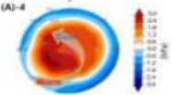

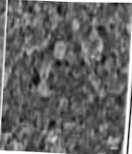

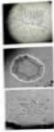

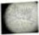

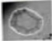

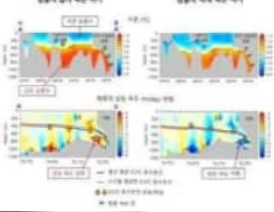

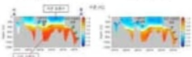

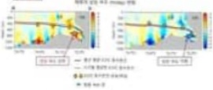

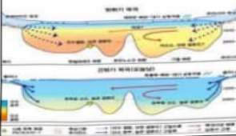

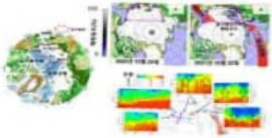

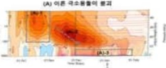

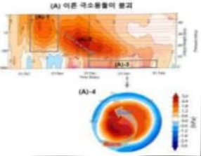

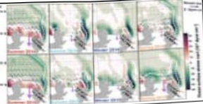

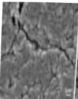

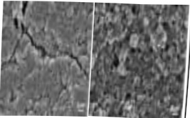

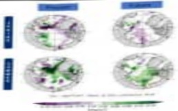

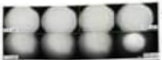

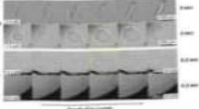

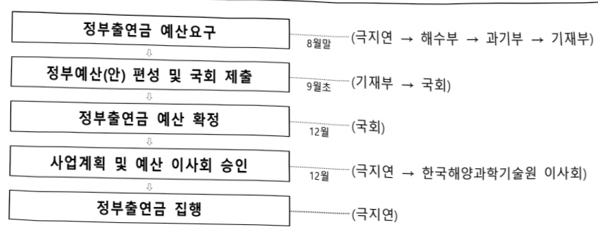

